# 3DCodeBench: Benchmarking Agentic Procedural 3D Modeling Via Code

**Paper type:** Benchmark & Evaluation Framework / Procedural 3D Modeling / Vision-Language Models / Coding Agents / Human Preference Evaluation (3DCodeArena).

**One-sentence map:** 3DCodeBench 提出了一个通过代码驱动 3D 建模软件（Blender 5.0）评估 12 种先进视觉语言模型（VLM）进行程序化 3D 建模能力的系统化基准，构建了包含 212 个类别、26K 个高质量三元组的数据集与人类成对偏好竞技场 3DCodeArena，揭示了模型在可执行性背后的几何连贯性与物理合理性瓶颈，并证实了多轮智能体反馈与测试期扩展的关键作用。

## Page / Section Index

| Pages | Section | Key Contents / Focus |
|---|---|---|
| 1-3 | Title, Abstract, 1. Introduction | 动机：程序化建模的确定性与可编辑性；现有评测四大局限；3DCodeBench 贡献与核心发现 |
| 3-4 | 2. Related Work | 程序化与智能体 3D 生成、代码评测与 3D 生成评测发展脉络 |
| 4-7 | 3. 3DCodeBench: Towards 3D Generation via Writing Procedural Code | 任务形式化、人机协同智能体数据整理管线、数据集统计特性、多维度评测协议与 3DCodeArena |
| 7-11 | 4. Experiments and Benchmarks | 12 个前沿 VLM 评测、SigLIP-2/DINOv3 与人类偏好高相关性、思考预算消融、多轮错误反馈与 Coding Agent Harness 对比、定性分析 |
| 11 | 5. Conclusion and Future Work | 总结核心结论与局限性、未来向多资产场景生成与 Houdini/Unreal 跨引擎扩展 |
| 12-15 | References | 完整参考文献库（按原文献格式保留以确保可检索性） |
| 16-23 | Appendix A: Dataset Construction and Statistics | 成本-质量 Pareto 前沿、主实验总表（Table A.1）、Single-shot 与思考平均对比（Tables A.2, A.3）、模型详情、多视角输入消融（Table A.4） |
| 24-25 | Appendix B: Evaluation Metric Implementation | Executability、SigLIP-2、DINOv3、Chamfer Distance、Uni3D 3D-3D 及跨模态相似度数学定义与代码实现细节 |
| 26-30 | Appendix C: Inference Setup and Failure Taxonomy | Text-to-3D 与 Image-to-3D 提示词、多轮错误重试模板、视觉自反思提示词、图像生成元提示词与六大几何失败模式归类 |
| 31-34 | Appendix D: Iterative Inference and Multi-Stage Pipelines | 多轮错误反馈消融（Table D.1）、视觉自反思多轮效果（Table D.2）、Text-to-Image-to-3D 两阶段管线评测（Table D.3） |
| 34-38 | Appendix E: 3DCodeArena: Human-Preference Voting Interface | 双盲两两投票界面、多视角 orbit 查看器设计与全模型成对胜率矩阵（Figure E.3） |
| 38-40 | Appendix F: LLM/VLM-as-a-Judge Against the Human Arena | 裁判提示词、四分类判定与人类一致性（Table F.1）、A/B 决定性子集相关性分析（Table F.2） |
| 40-41 | Appendix G: Sampling Temperature Ablation | 采样温度消融（Figure G.1）：贪婪解码到高温区间的执行率与感知质量变化 |

## Terminology Ledger

| Canonical Term | 中文规范对应 | Definition / Decision / Usage Note |
|---|---|---|
| 3DCodeBench | 3DCodeBench | 论文提出的通过编写代码评估智能体程序化 3D 建模能力的基准框架，保留专有名词。 |
| Procedural 3D Modeling | 程序化 3D 建模 | 通过编写确定性算法、参数化规则或几何节点脚本生成 3D 几何与纹理的技术。 |
| 3DCodeArena | 3DCodeArena | 基于人类盲测成对偏好投票（A/B/Tie/Both bad）与 Bradley-Terry Elo 排名的公开竞技场。 |
| Vision-Language Model (VLM) | 视觉语言模型 | 具备多模态图像理解、空间推理与代码生成能力的前沿大模型（如 Gemini、Claude、GPT 系列）。 |
| Coding Agent Harness | 代码智能体运行框架 / 底座框架 | 赋予模型完整终端环境交互权限的智能体执行环境（如 Gemini CLI、Claude Code、Codex CLI、Antigravity CLI）。 |
| Standalone Procedural Code | 独立程序化代码 | 解除 Infinigen 内部复杂继承与私有依赖，可直接在纯净 Blender 5.0 中运行的自包含 Python 脚本。 |
| Executability | 可执行率 (Exec.) | 生成代码在 Blender 5.0 独立子进程中成功编译、执行并输出至少一个有效网格的实例比例。 |
| SigLIP-2 View-Paired Similarity | SigLIP-2 视角配对图像相似度 | 对生成模型多视角渲染图与真值渲染图提取 SigLIP-2 嵌入并计算的配对余弦相似度。 |
| DINOv3 View-Paired Similarity | DINOv3 视角配对特征相似度 | 基于 DINOv3 视觉骨干网络提取的无监督空间与语义视觉特征相似度。 |
| Chamfer Distance (CD) | 倒角距离 (CD) | 衡量生成点云与真值点云表面采样几何误差的对称倒角距离，配合 4-yaw 航向角对齐。 |
| Uni3D 3D-3D Similarity | Uni3D 3D-3D 特征相似度 | 基于统一 3D 点云编码器（Uni3D-Giant）提取的生成网格与真值网格点云特征余弦相似度。 |
| Thinking Budget / Effort | 思考预算 / 思考推理开销 | 分配给具备推导思考能力模型的测试期推理 token 上限或努力级别（minimal, low, medium, high）。 |
| Test-Time Scaling | 测试期扩展 / 测试时计算扩展 | 在推理推断阶段通过增加思考开销或多轮环境交互迭代来提升任务表现的策略。 |
| Multi-Turn Error-Feedback | 多轮错误反馈重试 | 将 Blender 5.0 执行报错信息（traceback）截断后反馈给模型，允许其自主修复代码的多轮闭环。 |
| Visual Self-Critique | 视觉自反思 / 视觉自评判 | 将 Blender 生成的多视角渲染图回传给 VLM，由其自主判断几何缺陷并修改代码的迭代循环。 |
| Penalized Mean vs. Conditional Mean | 惩罚均值与条件均值 | 惩罚均值（penalized）将执行失败样本记为 0（CD 赋予最大惩罚），条件均值（cond.）仅统计成功执行样本。 |
| Infinigen | Infinigen | 普林斯顿大学开发的基于 Blender 的开源物理世界与室内场景程序化生成框架。 |
| Bradley-Terry Elo | Bradley-Terry Elo 评分 | 根据人类成对对比胜负平数据通过极大似然估计导出的相对能力量表。 |
| LLM/VLM-as-a-Judge | 大模型/多模态模型充当裁判 | 使用前沿模型依据标准化 rubric 对生成结果进行成对判定以替代高成本人工评测。 |

## Abstract

> <span style="color:#3B82F6"><strong>Para. 1:</strong></span> Procedural 3D modeling through code is emerging as a versatile paradigm, offering deterministic, engine-ready, and precisely editable assets that neural 3D generators inherently lack. Authoring such procedural content, however, demands deep expertise in 3D software APIs, parametric design, and code-level geometric reasoning. In this paper, we propose 3DCodeBench, a systematic benchmark for evaluating vision-language model (VLM) agents for procedural 3D generation in 3D modeling software. Specifically, 3DCodeBench evaluates how effectively 12 advanced VLMs can serve as procedural 3D modelers by translating text and image references into procedural code for 3D modeling software. Recognizing that automated metrics may not fully capture the perceptual quality of 3D shapes, we build 3DCodeArena, a ranking platform based on pairwise human preferences over generated 3D outputs.

> <span style="color:#F59E0B"><strong>Para. 1[CN]:</strong></span> 通过代码进行程序化 3D 建模正成为一种极具通用性的范式，能够提供神经 3D 生成模型天然欠缺的确定性、引擎即用性以及高精度可编辑资产。然而，创作此类程序化内容需要对 3D 软件 API、参数化设计以及代码级几何推理具备深厚专业知识。在本文中，我们提出了 3DCodeBench，这是一个用于评估视觉语言模型（VLM）智能体在 3D 建模软件中进行程序化 3D 生成能力的系统化基准。具体而言，3DCodeBench 评估了 12 种先进 VLM 如何通过将文本与参考图像翻译为 3D 建模软件的程序化代码，从而有效充当程序化 3D 建模师。考虑到自动化指标可能无法完全捕捉 3D 形状的感知质量，我们搭建了 3DCodeArena，这是一个基于人类对生成 3D 输出的成对偏好进行排名的评测平台。

> <span style="color:#3B82F6"><strong>Para. 2:</strong></span> From extensive evaluations and results, we observe that: (1) Failures mostly arise from API mismatches, while successful renders still suffer from disconnected or floating 3D geometric components. (2) Test-time scaling, such as higher thinking budgets and multi-turn refinement, improves performance overall. Our findings highlight a critical need for high-quality procedural coding data to advance commercial VLMs. Furthermore, effective procedural 3D modeling requires a robust execution environment that provides high-fidelity feedback for iterative refinement. We release 3DCodeBench, including the curated large-scale dataset of multimodal (text/image) prompts, procedural code, 3D object triplets, evaluation protocol, and the public 3DCodeArena platform as a foundational toolkit for exploring VLM-based procedural 3D modelers.

> <span style="color:#F59E0B"><strong>Para. 2[CN]:</strong></span> 通过广泛的评估与实验结果，我们观察到：(1) 失败大多源于 API 不匹配，而成功渲染的资产依然存在部件断开或悬浮的 3D 几何缺陷。(2) 测试期扩展（如提高思考预算与多轮优化）整体上显著改善了模型表现。我们的发现凸显了对高质量程序化代码数据的迫切需求，以推动商业 VLM 的发展。此外，有效的程序化 3D 建模依赖于一个能够为迭代优化提供高保真反馈的稳健执行环境。我们公开发布 3DCodeBench，包括精心构建的多模态（文本/图像）提示词、程序化代码与 3D 对象三元组大规模数据集、评估协议，以及公开的 3DCodeArena 平台，作为探索基于 VLM 的程序化 3D 建模智能体的基础工具套件。

## 1. Introduction

> <span style="color:#3B82F6"><strong>Para. 1:</strong></span> “Is God a Programmer, Not a Mathematician?” — Gregory J. Chaitin

> <span style="color:#F59E0B"><strong>Para. 1[CN]:</strong></span> “上帝是一位程序员，而不是数学家吗？”——格雷戈里·查廷（Gregory J. Chaitin）

> <span style="color:#3B82F6"><strong>Para. 2:</strong></span> Procedural 3D modeling via coding is a critical pillar of modern digital creation (Adobe, 2026; Blender Foundation, 2026a; Esri, 2026; IDV, Inc., 2026; SideFX, 2026), driving immense commercial value across gaming, industrial design, and high-fidelity simulation environments for robotics training (Deitke et al., 2022; Denninger et al., 2019; Greff et al., 2022; Raistrick et al., 2023, 2024). Nevertheless, authoring these 3D procedural assets remains a labor-intensive and formidable challenge. It demands that human designers have deep expertise in domain-specific coding syntax to manually define intricate meshes, complex geometric shapes, and realistic textures, and to perform precise parametric tuning to ensure physical plausibility. To address these bottlenecks, the rapid advancement of Vision-Language Models (VLMs) and coding agents has paved the way for automating this complex development process.

> <span style="color:#F59E0B"><strong>Para. 2[CN]:</strong></span> 通过编写代码进行程序化 3D 建模是现代数字创作的关键支柱（Adobe, 2026; Blender Foundation, 2026a; Esri, 2026; IDV, Inc., 2026; SideFX, 2026），在游戏、工业设计以及用于机器人训练的高保真仿真环境中驱动着巨大的商业价值（Deitke et al., 2022; Denninger et al., 2019; Greff et al., 2022; Raistrick et al., 2023, 2024）。然而，创作这些 3D 程序化资产依然是一项劳动密集且极其严峻的挑战。它要求人类设计师掌握特定领域的代码语法专业知识，手动定义精细网格、复杂几何形状与逼真纹理，并进行精确的参数微调以确保物理合理性。为了解决这些瓶颈，视觉语言模型（VLM）和代码智能体的快速进步为自动化这一复杂的开发流程铺平了道路。

> <span style="color:#3B82F6"><strong>Para. 3:</strong></span> Recognizing this automation potential, the community has been actively exploring ways to enable VLM agents in 3D creative artistry. For instance, Anthropic announced the Claude for Creative Work (Anthropic, 2026) initiative to drive 3D modeling software like Blender via Python APIs. Prior to this, an active ecosystem of Model Context Protocol (MCP) servers and function-calling agents (Ahuja, 2025; Blender Foundation, 2026b; elithril, 2025; minihellboy, 2025; ra100, 2025; saofund, 2025) has already turned frontier VLMs into natural-language drivers for end-to-end procedural modeling. On the research side, a line of works (Hu et al., 2024; Ling et al., 2025; Lu et al., 2025; Sun et al., 2023; Yang et al., 2024; Yin et al., 2026) also builds LLM-driven agents to author procedural code or compose retrieved assets. However, the community lacks a standardized, reliable benchmark for examining the model capabilities.

> <span style="color:#F59E0B"><strong>Para. 3[CN]:</strong></span> 认识到这一自动化潜力，学术界与工业界一直在积极探索如何在 3D 创意艺术中赋能 VLM 智能体。例如，Anthropic 宣布了 Claude for Creative Work（Anthropic, 2026）计划，通过 Python API 驱动 Blender 等 3D 建模软件。在此之前，模型上下文协议（MCP）服务器和函数调用智能体构建的活跃生态系统（Ahuja, 2025; Blender Foundation, 2026b; elithril, 2025; minihellboy, 2025; ra100, 2025; saofund, 2025）已经将前沿 VLM 转变为端到端程序化建模的自然语言驱动引擎。在科研方面，一系列工作（Hu et al., 2024; Ling et al., 2025; Lu et al., 2025; Sun et al., 2023; Yang et al., 2024; Yin et al., 2026）也构建了基于 LLM 的智能体来编写程序化代码或组合检索到的资产。然而，整个领域仍缺乏一个标准化、可靠的基准来全面检验模型的真实能力。

### Figure 1. 3DCodeBench 框架总览与前沿模型对比

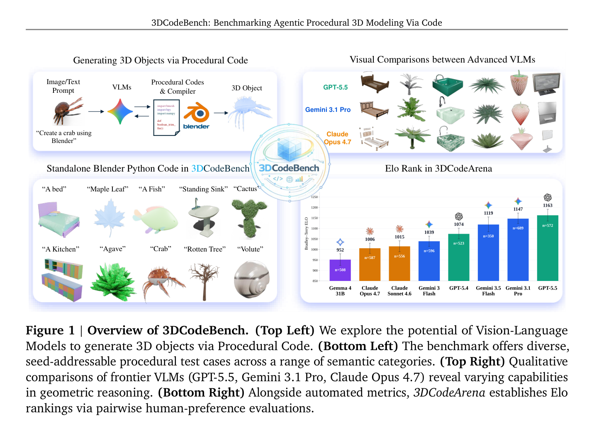

**Caption:** Figure 1 | Overview of 3DCodeBench. (Top Left) We explore the potential of Vision-Language Models to generate 3D objects via Procedural Code. (Bottom Left) The benchmark offers diverse, seed-addressable procedural test cases across a range of semantic categories. (Top Right) Qualitative comparisons of frontier VLMs (GPT-5.5, Gemini 3.1 Pro, Claude Opus 4.7) reveal varying capabilities in geometric reasoning. (Bottom Right) Alongside automated metrics, 3DCodeArena establishes Elo rankings via pairwise human-preference evaluations.

**Caption[CN]:** 图 1 | 3DCodeBench 框架总览。（左上）探索视觉语言模型通过程序化代码生成 3D 资产的潜力。（左下）基准提供覆盖丰富语义类别、支持随机种子寻址的程序化评测用例。（右上）前沿视觉语言模型（GPT-5.5、Gemini 3.1 Pro、Claude Opus 4.7）的定性对比揭示了各模型在几何推理能力上的差异。（右下）除自动化评估指标外，3DCodeArena 通过人类两两盲测偏好投票建立可靠的 Elo 胜率排行榜。

> <span style="color:#3B82F6"><strong>Para. 4:</strong></span> Evaluating the proficiency of VLMs as procedural modelers remains an open challenge due to four core limitations in existing methodologies:
>
> - First, there is a severe lack of aligned procedural data. While repositories like ShapeNet (Chang et al., 2015) and Objaverse (Deitke et al., 2023a) provide vast collections of static meshes, they lack the underlying procedural code needed to measure generative agency.
> - Second, current environments fail to capture real-world geometric complexity. For instance, BlenderGym (Gu et al., 2025) focuses heavily on editing pre-built scenes rather than on from-scratch generation, and VoxelCodeBench (Zheng and Bordes, 2026) limits construction to simplistic voxel grids.
> - Third, existing frameworks ignore the iterative nature of 3D design by relying on single-shot evaluations and omitting the agentic refinement loops that are crucial to real workflows.
> - Finally, the field lacks standardized evaluation metrics. Current models are tested on ad hoc prompts without a shared reference set, and the community lacks comprehensive perception metrics alongside a systematic 3D code arena for human preference voting. Consequently, the research community lacks a comprehensive, standardized benchmark to rigorously measure the performance of frontier VLMs at generating 3D assets from code.

> <span style="color:#F59E0B"><strong>Para. 4[CN]:</strong></span> 评估 VLM 作为程序化建模师的水平仍是一项未解挑战，主要源于现有方法论中的四大核心局限：
>
> - 首先，严重缺乏对齐的程序化代码数据。尽管像 ShapeNet（Chang et al., 2015）和 Objaverse（Deitke et al., 2023a）等仓库提供了海量的静态网格集合，但它们缺乏衡量生成智能体能力所需的底层程序化代码。
> - 其次，现有环境无法捕捉真实世界的几何复杂性。例如，BlenderGym（Gu et al., 2025）侧重于编辑预建场景而非从零生成，而 VoxelCodeBench（Zheng and Bordes, 2026）将几何构建局限于简化的体素网格。
> - 第三，现有框架依赖单轮生成评测，忽视了 3D 设计内在的迭代本质，遗漏了对实际工作流至关重要的智能体反思优化闭环。
> - 最后，该领域缺乏标准化的评估指标。现有模型往往在缺乏共享参考集的临时提示词上测试，且社区欠缺全面的感知评估指标以及用于人类偏好投票的系统化 3D 代码竞技场。因此，研究社区缺乏一个全面、标准化的基准来严谨衡量前沿 VLM 通过代码生成 3D 资产的表现。

> <span style="color:#3B82F6"><strong>Para. 5:</strong></span> In this paper, we introduce 3DCodeBench (Figure 1), a comprehensive benchmark and evaluation framework that directly addresses these four limitations. First, to address data scarcity, we extract procedural factories from Infinigen Raistrick et al. (2023, 2024) and process them using an agentic curation pipeline with human verification. This yields a high-quality dataset of 26K text/image prompts $\leftrightarrow$ standalone code $\leftrightarrow$ 3D object triplets across 212 categories (Figure 1, bottom left). Second, our dataset captures real-world geometric complexity rather than constructing objects using simple primitive shapes. Classes such as flying bird, crab, and dragonfly—each averaging over 400 lines of code—push models far beyond simplistic shape primitives (Figure 1, top right). Third, to reflect the iterative nature of 3D design, our framework moves beyond single-shot prompting by treating VLMs as active agents. We systematically evaluate their abilities in controlled multi-turn scenarios that include execution-error feedback, retries, visual self-critique, and API documentation augmentation. Finally, we establish a standardized and robust evaluation protocol. We extensively analyze 12 advanced VLMs (Gemini (Google, 2026a), Claude (Anthropic, 2025), and GPT (OpenAI, 2025) series) using comprehensive automated metrics spanning executability, perceptual view similarity (SigLIP-2 (Tschannen et al., 2025), DINOv3 (Siméoni et al., 2025)), and 3D geometric alignment (Chamfer distance (Fan et al., 2017), Uni3D (Zhou et al., 2024)). To complement these metrics, we launch 3DCodeArena (Figure 1, bottom right), a public arena that collects pairwise human preferences to produce reliable Elo rankings.

> <span style="color:#F59E0B"><strong>Para. 5[CN]:</strong></span> 在本文中，我们提出了 3DCodeBench（图 1），这是一个直接应对上述四大局限的全面基准与评测框架。首先，针对数据稀缺问题，我们从 Infinigen（Raistrick et al., 2023, 2024）中提取程序化工厂，并通过带有人工核验的智能体数据整理管线进行处理。这构建了一个高质量数据集，包含跨越 212 个类别的 26K 组“文本/图像提示词 $\leftrightarrow$ 独立代码 $\leftrightarrow$ 3D 对象”三元组（图 1 左下）。其次，我们的数据集捕捉了真实世界的几何复杂性，而非使用简单的基本图元拼凑物体。诸如飞鸟、螃蟹和蜻蜓等类别——每个类别的代码平均超过 400 行——迫使模型远远突破简单的基础图元堆叠（图 1 右上）。第三，为体现 3D 设计的迭代本质，我们的框架超越了单轮提示，将 VLM 视为主动智能体。我们在受控的多轮场景中系统评估其能力，包括执行错误反馈、自动重试、视觉自反思以及 API 文档增强。最后，我们建立了标准化且稳健的评测协议。我们利用涵盖可执行率、感知视角相似度（SigLIP-2 (Tschannen et al., 2025)、DINOv3 (Siméoni et al., 2025)）以及 3D 几何对齐度（Chamfer 距离 (Fan et al., 2017)、Uni3D (Zhou et al., 2024)）的综合自动化指标，广泛分析了 12 种先进 VLM（Gemini (Google, 2026a)、Claude (Anthropic, 2025) 与 GPT (OpenAI, 2025) 系列）。作为自动化指标的补充，我们推出了 3DCodeArena（图 1 右下），这是一个收集人类成对偏好投票以产生可靠 Elo 排名的公开竞技场。

> <span style="color:#3B82F6"><strong>Para. 6:</strong></span> In summary, 3DCodeBench provides a comprehensive benchmark for evaluating the procedural 3D generation capabilities of VLM agents. Through extensive evaluations, we mainly find:
>
> - (1) Physical Plausibility remains the primary bottleneck beyond Executability: Models frequently produce disconnected parts and incorrect structural alignments, revealing a critical lack of physical-world understanding.
> - (2) Test-Time Scaling: Multi-turn refinement improves performance using deterministic execution feedback from Blender. This demonstrates that designing an appropriate agentic harness to process environmental feedback is crucial to unlocking the model’s full potential.

> <span style="color:#F59E0B"><strong>Para. 6[CN]:</strong></span> 综上所述，3DCodeBench 为评估 VLM 智能体的程序化 3D 生成能力提供了一个全面基准。通过广泛的评测，我们的主要发现如下：
>
> - (1) 物理合理性依然是超越代码可执行率的首要瓶颈：模型频繁生成断裂分离的部件和错误的结构对齐，揭示出其对物理世界常识理解的严重匮乏。
> - (2) 测试期扩展：利用来自 Blender 的确定性执行反馈，多轮优化显著提升了性能。这表明，设计合适的智能体底座框架来处理环境反馈，对于释放模型的全部潜能至关重要。

> <span style="color:#3B82F6"><strong>Para. 7:</strong></span> Our contributions are summarized as:
>
> - 3DCodeBench: A standardized, VLM-driven procedural 3D modeling benchmark. Spanning a diverse range of 212 object classes and 26K 3D object–code pairs, it is curated via the proposed agentic pipeline with human feedback and paired with comprehensive evaluation protocols.
> - 3DCodeArena: A systematic human-preference platform designed to evaluate the perceptual quality and aesthetic appeal of generated 3D shapes through pairwise Elo rankings.
> - Extensive VLM Analysis & Insights: A holistic evaluation of 12 advanced VLMs that identifies critical failure modes and establishes multi-turn agentic refinement as the primary driver for successful procedural 3D generation.

> <span style="color:#F59E0B"><strong>Para. 7[CN]:</strong></span> 我们的主要贡献总结如下：
>
> - 3DCodeBench：一个标准化的、VLM 驱动的程序化 3D 建模基准。涵盖 212 个多样的物体类别与 26K 个 3D 物体-代码对，通过所提出的人机协同智能体管线精心构建，并配备全面的评估协议。
> - 3DCodeArena：一个系统化的人类偏好评测平台，旨在通过成对 Elo 排名评估生成 3D 形状的感知质量与美学表现。
> - 广泛的 VLM 分析与洞见：对 12 种先进 VLM 的整体评测，指出了关键的失败模式，并确立了多轮智能体优化作为成功实现程序化 3D 生成的核心驱动力。

## 2. Related Work

> <span style="color:#3B82F6"><strong>Para. 1:</strong></span> Procedural and Agentic 3D Generation. Automated 3D content creation has progressed from static repositories (e.g., ShapeNet (Chang et al., 2015), ABO (Collins et al., 2022), Thingi10K (Zhou and Jacobson, 2016), Objaverse (Deitke et al., 2023a,b), OmniObject3D (Wu et al., 2023), ScanNet (Dai et al., 2017), Cap3D (Luo et al., 2023)) to dynamic procedural pipelines such as Infinigen (Joshi et al., 2025; Raistrick et al., 2023, 2024), BlenderProc (Denninger et al., 2019), Kubric (Greff et al., 2022), and ProcTHOR (Deitke et al., 2022), which utilize hand-written code or templates. Early methods learned shape specifications (Jones et al., 2020, 2023; Sharma et al., 2018). In contrast, recent systems such as 3D-GPT (Sun et al., 2023), SceneCraft (Hu et al., 2024), and LL3M (Lu et al., 2025) leverage vision-language models (VLMs) to directly generate production-grade procedural scripts, while other works focus on articulated object generation (Joshi et al., 2025; Le et al., 2025; Zhou et al., 2026). To reduce the complexity of raw application programming interfaces (APIs), Proc3D (Raji et al., 2026) generates simplified procedural graphs. Simultaneously, an iterative agentic paradigm is emerging. For example, 3D-Generalist (Sun et al., 2025) frames 3D synthesis as a sequential decision-making process based on visual observations, and CADCodeVerify (Alrashedy et al., 2024) demonstrates VLM self-correction of CAD code through visual inspection. At the scene level, Holodeck (Yang et al., 2024) and Scenethesis (Ling et al., 2025) compose layouts for retrieved assets, while VIGA (Yin et al., 2026) utilizes a write-run-render loop for reconstruction.

> <span style="color:#F59E0B"><strong>Para. 1[CN]:</strong></span> 程序化与智能体 3D 生成。自动 3D 内容创作已从静态数据仓库（如 ShapeNet (Chang et al., 2015)、ABO (Collins et al., 2022)、Thingi10K (Zhou and Jacobson, 2016)、Objaverse (Deitke et al., 2023a,b)、OmniObject3D (Wu et al., 2023)、ScanNet (Dai et al., 2017)、Cap3D (Luo et al., 2023)）发展到利用人工编写代码或模板的动态程序化管线，如 Infinigen (Joshi et al., 2025; Raistrick et al., 2023, 2024)、BlenderProc (Denninger et al., 2019)、Kubric (Greff et al., 2022) 和 ProcTHOR (Deitke et al., 2022)。早期方法主要学习形状规格程序（Jones et al., 2020, 2023; Sharma et al., 2018）。相比之下，近期的系统如 3D-GPT (Sun et al., 2023)、SceneCraft (Hu et al., 2024) 和 LL3M (Lu et al., 2025) 利用视觉语言模型（VLM）直接生成工业级程序化脚本，另有研究聚焦于可动关节物体的生成（Joshi et al., 2025; Le et al., 2025; Zhou et al., 2026）。为降低底层应用程序接口（API）的复杂度，Proc3D (Raji et al., 2026) 生成简化的程序化图结构。与此同时，一种迭代式智能体范式正在兴起。例如，3D-Generalist (Sun et al., 2025) 将 3D 合成构建为基于视觉观察的序列决策过程，CADCodeVerify (Alrashedy et al., 2024) 展示了 VLM 通过视觉检查对 CAD 代码进行自我纠错。在场景层面，Holodeck (Yang et al., 2024) 和 Scenethesis (Ling et al., 2025) 为检索资产编排空间布局，而 VIGA (Yin et al., 2026) 则利用“编写-运行-渲染”闭环进行 3D 重建。

### Figure 2. 人机协同智能体数据整理管线

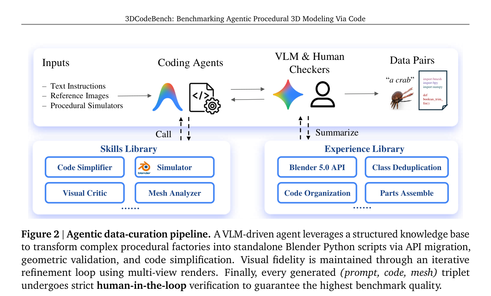

**Caption:** Figure 2 | Agentic data-curation pipeline. A VLM-driven agent leverages a structured knowledge base to transform complex procedural factories into standalone Blender Python scripts via API migration, geometric validation, and code simplification. Visual fidelity is maintained through an iterative refinement loop using multi-view renders. Finally, every generated (prompt, code, mesh) triplet undergoes strict human-in-the-loop verification to guarantee the highest benchmark quality.

**Caption[CN]:** 图 2 | 人机协同智能体数据整理管线。由 VLM 驱动的智能体利用结构化知识库，通过 API 迁移、几何验证与代码简化，将复杂的程序化工厂转化为独立的 Blender Python 脚本。通过基于多视角渲染图的迭代优化循环保证视觉保真度。最终，生成的每组（提示词、代码、网格）三元组均经过严格的人工介入核验，以确保最高基准质量。

> <span style="color:#3B82F6"><strong>Para. 2:</strong></span> Evaluating Procedural 3D Generation. General-purpose code benchmarks such as HumanEval (Chen et al., 2021), MBPP (Austin et al., 2021), and CodeContests (Li et al., 2022) rely on unit tests. Existing benchmarks target specific aspects of procedural 3D generation capability. BlenderGym (Gu et al., 2025) focuses on scene editing rather than generation from scratch. VoxelCodeBench (Zheng and Bordes, 2026) evaluates single-shot inference on low-complexity voxel structures. SceneScript (Avetisyan et al., 2024) emphasizes layout prediction instead of executable asset generation. 3DGen-Bench (Zhang et al., 2025) collects human preferences for neural text-to-3D outputs but does not include a code modality. CADBench (Du et al., 2024) evaluates text-conditioned object quality but is limited to low-complexity objects. In contrast, 3DCodeBench conceptualizes procedural 3D evaluation as an agentic task. 3DCodeBench assesses vision-language models both as single-shot generators and as iterative agents that author, execute, and visually refine complex Blender scripts.

> <span style="color:#F59E0B"><strong>Para. 2[CN]:</strong></span> 程序化 3D 生成的评估。通用代码基准如 HumanEval (Chen et al., 2021)、MBPP (Austin et al., 2021) 和 CodeContests (Li et al., 2022) 依赖于单元测试。现有的 3D 基准往往仅针对程序化 3D 生成能力的特定方面。BlenderGym (Gu et al., 2025) 侧重于场景编辑而非从零生成。VoxelCodeBench (Zheng and Bordes, 2026) 仅评测低复杂度体素结构上的单轮推理。SceneScript (Avetisyan et al., 2024) 强调布局预测而非生成可执行资产。3DGen-Bench (Zhang et al., 2025) 收集人类对神经文本到 3D 输出的偏好，但未包含代码模态。CADBench (Du et al., 2024) 评估文本条件下的物体质量，但受限于低复杂度物体。相比之下，3DCodeBench 将程序化 3D 评测概念化为一项智能体任务。3DCodeBench 既将视觉语言模型作为单轮生成器进行评估，又将其作为能够编写、执行并在视觉上优化复杂 Blender 脚本的迭代智能体进行深度考量。

## 3. 3DCodeBench Dataset and Representation / 3DCodeBench: Towards 3D Generation via Writing Procedural Code

### 3.1. Task Definition

> <span style="color:#3B82F6"><strong>Para. 1:</strong></span> Procedural 3D generation requires a policy for synthesizing executable code that a 3D software runtime compiles into a target object. Formally, given a condition $c$ (text and optional reference images), a policy $\pi$ produces a script $f_\pi = \pi(c)$ that a deterministic operator $\mathcal{E}$ executes into a mesh $M_\pi = \mathcal{E}(f_\pi)$; we instantiate $(\pi, \mathcal{E})$ on Blender 5.0 as a representative platform, making $f_\pi$ a Blender Python script, but the formulation is software-agnostic. Each task is a triplet $(c, f^*, M^*)$ of prompt, reference script, and ground-truth mesh, scored by a binary executability indicator $\mathbb{I}[\mathcal{E}(f_\pi) \neq \emptyset]$ and continuous mesh-grounded similarities $\mathcal{D}(M_\pi, M^*)$.

> <span style="color:#F59E0B"><strong>Para. 1[CN]:</strong></span> 程序化 3D 生成需要一个能够合成可执行代码的策略模型，该代码由 3D 软件运行时编译为目标物体。形式上，给定条件 $c$（文本以及可选的参考图像），策略模型 $\pi$ 生成脚本 $f_\pi = \pi(c)$，确定性算子 $\mathcal{E}$ 将其执行为一个 3D 网格 $M_\pi = \mathcal{E}(f_\pi)$；我们将 $(\pi, \mathcal{E})$ 实例化在作为代表性平台的 Blender 5.0 上，使 $f_\pi$ 表现为 Blender Python 脚本，但该数学形式与具体软件无关。每个任务均表示为由提示词、参考脚本与真值网格构成的三元组 $(c, f^*, M^*)$，并通过二值可执行率指示变量 $\mathbb{I}[\mathcal{E}(f_\pi) \neq \emptyset]$ 以及连续的基于网格的相似度度量 $\mathcal{D}(M_\pi, M^*)$ 进行评分。

> <span style="color:#3B82F6"><strong>Para. 2:</strong></span> The agentic formulation generalizes single-shot generation to a sequence of $T$ turns, where turn $t$ updates the script conditioned on environmental feedback: $f_\pi^{(t)} = \pi\left(c, f_\pi^{(t-1)}, \mathcal{F}^{(t-1)}\right)$, with feedback $\mathcal{F}^{(t-1)}$ derived from execution logs or visual feedback, and the final evaluation uses $M_\pi^{(T)} = \mathcal{E}\left(f_\pi^{(T)}\right)$, covering both single-shot ($T=1$) and multi-turn ($T>1$) settings.

> <span style="color:#F59E0B"><strong>Para. 2[CN]:</strong></span> 智能体形式化将单轮生成推广为包含 $T$ 个轮次的序列，其中轮次 $t$ 根据环境反馈更新脚本：$f_\pi^{(t)} = \pi\left(c, f_\pi^{(t-1)}, \mathcal{F}^{(t-1)}\right)$，其中反馈 $\mathcal{F}^{(t-1)}$ 来自执行日志或视觉渲染反馈，最终评估采用 $M_\pi^{(T)} = \mathcal{E}\left(f_\pi^{(T)}\right)$，从而统摄单轮（$T=1$）与多轮（$T>1$）两种设定。

### 3.2. Agentic Data Curation Pipeline with Human Feedback

> <span style="color:#3B82F6"><strong>Para. 1:</strong></span> To construct 3DCodeBench at scale, we introduce an automated curation pipeline (Figure 2) that transforms deeply nested procedural factories from Infinigen into standalone Python scripts. The pipeline processes text instructions, reference images, and raw source code, facilitating a continuous feedback loop between coding agents and verification tools. To address the complexity of this software engineering task and reduce manual intervention, agents use two core components: a Skills Library for execution feedback and an Experience Library for retrieving established solutions.

> <span style="color:#F59E0B"><strong>Para. 1[CN]:</strong></span> 为了规模化构建 3DCodeBench，我们引入了一个自动化数据整理管线（图 2），将来自 Infinigen 的深度嵌套程序化工厂转换为独立的 Python 脚本。该管线处理文本指令、参考图像和原始源代码，促进代码生成智能体与验证工具之间的持续反馈闭环。为了应对这项软件工程任务的高复杂度并减少人工干预，智能体使用了两大核心组件：用于执行反馈的技能库（Skills Library）和用于检索成熟解决方案的经验库（Experience Library）。

> <span style="color:#3B82F6"><strong>Para. 2:</strong></span> Skills Library. Agents iteratively refine scripts by invoking specialized tools that provide objective feedback. The Code Simplifier automatically reduces long, deeply nested source code into clean, standalone scripts while strictly preserving the original 3D shape. The Simulator executes the generated code in a sandboxed Blender 5.0 environment to catch runtime errors and extract mesh data. To assess appearance, the Visual Critic (a VLM) compares multi-view renders of the generated object against the original reference, guiding the agent to correct visual discrepancies. Additionally, the Mesh Analyzer checks for structural issues—such as invalid geometry, non-manifold artifacts, or abnormally high vertex counts—to ensure the resulting 3D model is well-formed and physically plausible.

> <span style="color:#F59E0B"><strong>Para. 2[CN]:</strong></span> 技能库（Skills Library）。智能体通过调用提供客观反馈的专用工具来迭代优化脚本。代码简化器（Code Simplifier）在严格保留原始 3D 形状的同时，自动将冗长且深度嵌套的源代码缩减为干净且独立的脚本。仿真器（Simulator）在沙盒化的 Blender 5.0 环境中执行生成的代码，以捕获运行时错误并提取网格数据。为评估外观，视觉评判器（Visual Critic，由 VLM 充当）将生成物体的多视角渲染图与原始参考图进行对比，指导智能体修正视觉偏差。此外，网格分析器（Mesh Analyzer）检查结构性问题——如无效几何体、非流形瑕疵或异常过高的顶点数量——以确保最终生成的 3D 模型构型良好且物理合理。

> <span style="color:#3B82F6"><strong>Para. 3:</strong></span> Experience Library. To avoid repeating the same mistakes, the pipeline builds a shared, continuously expanding knowledge base. When VLMs or human checkers identify recurring issues, they document successful strategies in this library, which consists of four core modules:
>
> - Class Deduplication maintains a dynamic list of processed categories to filter out redundant classes, ensuring the high diversity and quality of the curated data.
> - Parts Assembly provides structured templates that guide the modeling and integration of individual geometric parts into a coherent, holistic object.
> - The Blender 5.0 API module continuously catalogs syntax changes and migration rules from older Blender versions, enabling agents to resolve deprecation errors preemptively.
> - Finally, Code Organization enforces standardized stylistic conventions and architectural layouts for the generated Python scripts.

> <span style="color:#F59E0B"><strong>Para. 3[CN]:</strong></span> 经验库（Experience Library）。为避免重复犯错，该管线构建了一个共享且持续扩展的知识库。当 VLM 或人工检查员发现重复出现的缺陷时，他们会将成功的解决策略记录在该库中，该库包含四个核心模块：
>
> - 类别去重（Class Deduplication）：维护已处理类别的动态列表以过滤冗余类别，确保构建数据的高多样性与高质量。
> - 部件装配（Parts Assembly）：提供结构化模板，指导将各个几何部件建模并整合为一个连贯完整的实体对象。
> - Blender 5.0 API 模块：持续收录自旧版 Blender 演进以来的语法变化与迁移规则，使智能体能够先验地解决弃用接口错误。
> - 代码组织（Code Organization）：对生成的 Python 脚本强制推行标准化的代码风格规范与架构布局。

> <span style="color:#3B82F6"><strong>Para. 4:</strong></span> Human-in-the-Loop Verification. Although the agentic loop automates most of the curation process, human oversight serves as the final quality control and fallback mechanism. Annotators manually review generated samples to verify reliable execution, the semantic accuracy of captions (using Gemini 3.1 Pro (Google, 2026a)), and visual alignment with reference images. If coding agents consistently fail to produce satisfactory results, a human expert intervenes by providing targeted textual feedback on specific object parts or by visually annotating rendered images to guide the agents. Only data pairs that pass this rigorous audit are included in the benchmark, ensuring high-fidelity (prompt, code, mesh) triplets.

> <span style="color:#F59E0B"><strong>Para. 4[CN]:</strong></span> 人机协同核验（Human-in-the-Loop Verification）。尽管智能体闭环实现了大部分数据整理流程的自动化，但人工审查依然作为最终的质量控制与兜底机制。标注员手动审查生成的样本，以核实其可靠执行能力、提示词描述的语义准确性（辅助使用 Gemini 3.1 Pro (Google, 2026a)），以及与参考图像的视觉对齐程度。如果代码智能体持续无法生成满意的结果，人类专家将通过对特定物体部件提供针对性的文本反馈，或在渲染图像上进行视觉标注来引导智能体。只有通过这一严苛审查的数据对才会被纳入基准中，从而确保了（提示词、代码、网格）三元组的高保真度。

### 3.3. Statistics of 3DCodeBench and Curated 3D Code Data

> <span style="color:#3B82F6"><strong>Para. 1:</strong></span> The 3DCodeBench benchmark includes a diverse taxonomy of 212 distinct asset categories from the Infinigen (Raistrick et al., 2023). As shown in Figure 3(a), the semantic vocabulary is broad, encompassing organic entities (such as flora, fauna, and mollusks), manufactured objects (such as furniture and kitchenware), and architectural fragments. This level of coverage exceeds that of previous programmatic 3D benchmarks. Figures 3(b) and (c) present the distributions of code length and file size per script, both exhibiting strong right skew. The median script length is 387 lines (mean 531), with some scripts exceeding 1,000 lines for complex geometry-node factories, including creature, tree, and cabinet variants. This complexity is intentional; whereas previous benchmarks typically assess simple primitive composition or voxel manipulation, 3DCodeBench requires reasoning about 3D structure and newly introduced API functions.

> <span style="color:#F59E0B"><strong>Para. 1[CN]:</strong></span> 3DCodeBench 基准包含了来自 Infinigen（Raistrick et al., 2023）的 212 个不同资产类别的丰富分类体系。如图 3(a) 所示，其语义词汇十分广泛，涵盖有机实体（如植物、动物与软体动物）、人造物体（如家具与厨具）以及建筑构件。这种覆盖深度远远超越了以往的程序化 3D 基准。图 3(b) 和 (c) 展示了每个脚本的代码行数和文件大小分布，两者均呈现出显著的右偏态。脚本代码行数中位数为 387 行（平均 531 行），对于复杂的几何节点工厂（包括生物、树木和柜体等变体），部分脚本甚至超过 1,000 行。这种复杂性是刻意设计的；以往的基准通常只评估简单的图元组合或体素操作，而 3DCodeBench 要求模型对 3D 空间结构和最新引入的 API 函数进行深度推理。

### Figure 3. 3DCodeBench 数据集统计特征

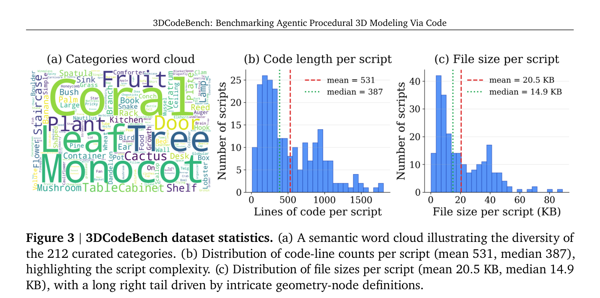

**Caption:** Figure 3 | 3DCodeBench dataset statistics. (a) A semantic word cloud illustrating the diversity of the 212 curated categories. (b) Distribution of code-line counts per script (mean 531, median 387), highlighting the script complexity. (c) Distribution of file sizes per script (mean 20.5 KB, median 14.9 KB), with a long right tail driven by intricate geometry-node definitions.

**Caption[CN]:** 图 3 | 3DCodeBench 数据集统计特征。(a) 展示精心整理的 212 个类别多样性的语义词云。(b) 每个脚本的代码行数分布（均值 531 行，中位数 387 行），彰显了程序脚本的高度复杂性。(c) 每个脚本的文件大小分布（均值 20.5 KB，中位数 14.9 KB），复杂几何节点定义带来了显著的长尾分布。

> <span style="color:#3B82F6"><strong>Para. 2:</strong></span> Curated High-quality Standalone 3D Code Data. Beyond the 212-instance evaluation set, we also curate 3D Code Data from the Infinigen (Raistrick et al., 2023, 2024) simulator, a substantially larger corpus for supervised fine-tuning and procedural code research. Filtering the 212 random-seed-parameterized factories underlying the 243 full object factories yields 12,963 instances: each is an (input prompt, standalone 3D code, 3D object) triplet of a text description, 4 canonical multi-view reference images ($45^\circ / 135^\circ / 225^\circ / 315^\circ$), two Blender 5.0 Python scripts (a textured factory script and a geometry-only variant, resulting in $\sim$26K code samples in total), and the baked GLB ground-truth mesh, paired with three caption styles (object description, procedural-modeling instruction, factory-level specification). Every triplet has passed the agentic curation pipeline of Section 3.2 including human-in-the-loop verification.

> <span style="color:#F59E0B"><strong>Para. 2[CN]:</strong></span> 精心整理的高质量独立 3D 代码数据。除包含 212 个实例的评测集外，我们还从 Infinigen（Raistrick et al., 2023, 2024）仿真器中整理出规模大得多的 3D 代码数据集，作为监督微调和程序化代码研究的丰富语料库。通过对 243 个完整物体工厂底层的 212 个随机种子参数化工厂进行筛选，得到了 12,963 个实例：每个实例都是由文本描述、4 个规范多视角参考图像（$45^\circ / 135^\circ / 225^\circ / 315^\circ$）、两个 Blender 5.0 Python 脚本（带纹理的工厂脚本与纯几何变体脚本，共计约 26K 份代码样本）以及烘焙的 GLB 真值网格构成的（输入提示词、独立 3D 代码、3D 对象）三元组，并配有三种描述风格（物体外观描述、程序化建模指令、工厂级代码规格）。每个三元组均通过了第 3.2 节所介绍的包含人工介入核验的智能体数据整理管线。

## 4. Evaluation Protocol

> <span style="color:#3B82F6"><strong>Para. 1:</strong></span> Each policy is evaluated along two complementary axes: a quantitative metric suite that scores each generated mesh against the reference, and 3DCodeArena, a public human-vote arena that ranks policies based on pairwise human preference.

> <span style="color:#F59E0B"><strong>Para. 1[CN]:</strong></span> 每个策略模型均沿两个互补的维度进行评估：一套用于衡量生成网格与参考真值之间相似度的定量指标套件，以及 3DCodeArena——一个基于成对人类偏好对模型策略进行排名的公开投票竞技场。

> <span style="color:#3B82F6"><strong>Para. 2:</strong></span> Quantitative metrics. For a given condition $c$, the policy $\pi$ is tasked with synthesizing a Blender 5.0 Python script $f_\pi$. We first evaluate the binary executability indicator $\mathbb{I}[\mathcal{E}(f_\pi) \neq \emptyset]$, verifying that the script executes end-to-end and outputs a valid 3D mesh $M_\pi$. Conditioned on successful execution, we compute a suite of continuous mesh-grounded similarities $\mathcal{D}(M_\pi, M^*)$. Perceptual fidelity is assessed by rendering $M_\pi$ from four canonical viewpoints ($45^\circ, 135^\circ, 225^\circ, 315^\circ$) under the standardized Cycles rig and computing SigLIP-2 (Tschannen et al., 2025) and DINOv3 (Siméoni et al., 2025) cosine similarities against the reference views. Structural and multi-modal alignments are evaluated by exporting $M_\pi$ to the GLB format and computing the Chamfer Distance (Fan et al., 2017), alongside Uni3D, which computes 3D-3D and cross-modal (text-/image-to-3D) cosine similarities. Every quality metric $\mathcal{D}$ is reported under two paradigms: conditional (averaged strictly over instances with $\mathbb{I}=1$, isolating geometric generation from code executability) and penalized (assigned zero when $\mathbb{I}=0$, meaning the script fails to execute correctly in Blender). These metrics apply identically to the multi-turn ($T>1$) setting, where the final performance is measured on $M_\pi^{(T)}$ following iterative refinement.

> <span style="color:#F59E0B"><strong>Para. 2[CN]:</strong></span> 定量评估指标。给定条件 $c$，策略模型 $\pi$ 的任务是合成一个 Blender 5.0 Python 脚本 $f_\pi$。我们首先评估二值可执行率指标 $\mathbb{I}[\mathcal{E}(f_\pi) \neq \emptyset]$，验证脚本能否端到端顺利执行并输出有效的 3D 网格 $M_\pi$。在成功执行的条件下，我们计算一系列基于网格的连续相似度度量 $\mathcal{D}(M_\pi, M^*)$。感知保真度通过在标准 Cycles 渲染支架下从四个规范视角（$45^\circ, 135^\circ, 225^\circ, 315^\circ$）渲染 $M_\pi$，并计算其相对于参考视角的 SigLIP-2 (Tschannen et al., 2025) 与 DINOv3 (Siméoni et al., 2025) 余弦相似度来进行衡量。结构和多模态对齐度则通过将 $M_\pi$ 导出为 GLB 格式，计算 Chamfer 倒角距离 (Fan et al., 2017) 以及 Uni3D 特征相似度（包含 3D-3D 及文本/图像到 3D 的跨模态余弦相似度）来评估。每项质量指标 $\mathcal{D}$ 均在两种范式下报告：条件均值（conditional，严格仅对 $\mathbb{I}=1$ 的实例取平均，将几何生成能力与代码可执行性解耦）和惩罚均值（penalized，当 $\mathbb{I}=0$ 即脚本在 Blender 中执行失败时赋为零或惩罚值）。这些指标同样适用于多轮（$T>1$）设定，此时最终表现基于迭代优化后的 $M_\pi^{(T)}$ 进行测量。

> <span style="color:#3B82F6"><strong>Para. 3:</strong></span> 3DCodeArena. Beyond per-mesh metrics, we run a public arena: for each prompt, we precompute every viewable model pair; the website serves a random pair side by side, and human voters pick a, b, tie, or both bad; per-modality (text-to-3D and image-to-3D) Elo is kept on a separate scale to avoid conflating the distinct skill sets each track exercises. Bradley–Terry MLE computes ratings in log-strength space (LMArena convention: ties and “both bad” both contribute 0.5/0.5), recentered to a mean of 1000 and converted to Elo points at $400/\ln 10$ per logit, with 1000-resample bootstrap 95% confidence intervals. At the time of writing, the platform hosts 12 frontier models and has collected approximately 3,100 human votes.

> <span style="color:#F59E0B"><strong>Para. 3[CN]:</strong></span> 3DCodeArena 竞技场。除单网格指标外，我们还运营了一个公开的人类盲测竞技场：针对每个提示词，我们预先计算好所有可供展示的模型对；网站向人类投票者并排随机展示一对生成模型结果，投票者可在“A 更好”、“B 更好”、“平局（Tie）”或“两者皆差（Both bad）”中选择；每个模态赛道（Text-to-3D 与 Image-to-3D）的 Elo 评分保持独立尺度，以避免混淆两条赛道所考察的不同能力维度。在对数优势空间中采用 Bradley–Terry 极大似然估计（MLE）计算评分（遵循 LMArena 惯例：“平局”与“两者皆差”均按各占 0.5/0.5 权重计入），将均值重新中心化为 1000，并按每 logit 对应 $400/\ln 10$ 换算为 Elo 积分，附带 1000 次重采样的 bootstrap 95% 置信区间。在撰写本文时，该平台已部署了 12 个前沿模型，并收集了约 3,100 份有效的人类投票。

## 5. Experiments and Benchmarks

### 5.1. Experimental Setup

> <span style="color:#3B82F6"><strong>Para. 1:</strong></span> We evaluate 12 frontier Vision-Language Models on 3DCodeBench; Gemini 2.5 Pro and GPT 5.4 Nano were also tested but were excluded due to single-turn Executability below 10%. To keep perceptual comparisons fair, every 3DCodeArena pair contains only successfully executed scripts; all metrics use only successfully rendered meshes, with reasoning budgets averaged where applicable.

> <span style="color:#F59E0B"><strong>Para. 1[CN]:</strong></span> 我们在 3DCodeBench 上对 12 种前沿视觉语言模型进行了评测；虽然同时也测试了 Gemini 2.5 Pro 和 GPT 5.4 Nano，但由于其单轮代码可执行率低于 10%，因而被排除在主要评测之外。为保证感知质量对比的公正性，3DCodeArena 中的每个对决配对均仅包含成功执行的脚本；所有指标仅在成功渲染的网格上计算，并在适用的情况下对推理预算进行平均。

### 5.2. Correlation between Human Preference and Perception Metrics

> <span style="color:#3B82F6"><strong>Para. 1:</strong></span> Finding 1. SigLIP-2 view similarity is one of the strongest predictors of human preference.

> <span style="color:#F59E0B"><strong>Para. 1[CN]:</strong></span> 发现 1。SigLIP-2 视角相似度是人类主观偏好最强的预测指标之一。

### Figure 4. 自动化感知指标与人类偏好相关性分析


**Caption:** Figure 4 | Automated perception metrics vs. human preference. For four representative per-model quality metrics, SigLIP-2 view-paired (cond.), Executability, Uni3D 3D↔3D (cond.), and Chamfer Distance (cond.), we plot the value (at each model’s best thinking level, averaged across the text-to-3D and image-to-3D tracks) against the 3DCodeArena Elo on the 12 evaluated VLMs and report Pearson $r$ and Spearman $\rho$. The Chamfer panel uses an inverted x-axis.

**Caption[CN]:** 图 4 | 自动化感知指标与人类偏好相关性。针对四个代表性的模型质量指标——SigLIP-2 视角配对相似度（条件均值）、可执行率、Uni3D 3D↔3D（条件均值）以及 Chamfer 倒角距离（条件均值），绘制其在每个模型最佳思考预算下、跨 Text-to-3D 和 Image-to-3D 赛道平均值相对于 12 个参评 VLM 在 3DCodeArena 中所得 Elo 积分的关系散点图，并报告 Pearson $r$ 与 Spearman $\rho$ 相关系数。Chamfer 距离面板采用反转的 x 轴。

> <span style="color:#3B82F6"><strong>Para. 2:</strong></span> Figure 4 illustrates the correlation between automated perception metrics and human preference Elo rankings collected from 3DCodeArena. The analysis demonstrates that automated multi-view similarity serves as a robust proxy for subjective human judgment. Specifically, SigLIP-2 view similarity is the strongest linear predictor of human preference (Pearson $r = 0.964$), while DINOv3 achieves the highest rank correlation (Spearman $\rho = 0.972$). These strong correlations across all 12 evaluated models validate the automated protocol, confirming that computationally scalable metrics such as SigLIP-2 and DINOv3 effectively capture the perceptual quality and structural integrity of generated 3D assets, thereby reliably substituting for costly human-in-the-loop annotations.

> <span style="color:#F59E0B"><strong>Para. 2[CN]:</strong></span> 图 4 展示了自动化感知指标与从 3DCodeArena 收集的人类偏好 Elo 排名之间的相关性。分析表明，自动计算的多视角视觉相似度可以作为人类主观评判的稳健代理指标。具体而言，SigLIP-2 视角相似度是人类偏好最强的线性预测因子（Pearson $r = 0.964$），而 DINOv3 则取得了最高的等级相关性（Spearman $\rho = 0.972$）。这 12 个参评模型上的强相关性验证了自动化评测协议的有效性，证实了诸如 SigLIP-2 和 DINOv3 等具备计算可扩展性的指标能够有效捕捉生成 3D 资产的感知质量与结构完整性，从而可靠地替代昂贵的人工标注。

### 5.3. Single-turn Ablation Studies on Thinking Budget and Multi-View Images

> <span style="color:#3B82F6"><strong>Para. 1:</strong></span> Finding 2. Thinking budget helps lightweight reasoners but saturates early on frontier models.

> <span style="color:#F59E0B"><strong>Para. 1[CN]:</strong></span> 发现 2。思考预算显著赋能轻量级推理模型，但在前沿旗舰模型上很早便出现饱和效应。

### Figure 5. 单轮消融实验：思考预算与多视角输入


**Caption:** Figure 5 | Single-turn ablations. Top row sweeps the thinking budget across all 12 VLMs on (a) text-to-3D and (b) image-to-3D, reported as SigLIP-2 view-paired (penalized) similarity. Bottom row sweeps the number of input reference views $N \in \{1, 2, 3, 4\}$ on the image-to-3D track for the six backbones (four Gemini and two Gemma) we have multi-view runs for, reported as (c) Uni3D 3D–3D (conditional) and (d) SigLIP-2 (conditional), matching the successful-output quality convention in Table A.1. Solid lines with $\pm$std error bars use 3-seed means where multiple seeds are available; markers without error bars are single-seed runs.

**Caption[CN]:** 图 5 | 单轮生成消融实验。顶部一行展示跨全部 12 个 VLM 扫描思考预算对 (a) Text-to-3D 和 (b) Image-to-3D 任务的影响，以 SigLIP-2 视角配对（惩罚均值）相似度汇报。底部一行针对具备多视角实验的 6 个骨干模型（4 个 Gemini 和 2 个 Gemma），在 Image-to-3D 赛道上扫描参考视角数量 $N \in \{1, 2, 3, 4\}$ 的影响，分别汇报 (c) Uni3D 3D–3D（条件均值）与 (d) SigLIP-2（条件均值），符合表 A.1 中成功输出的质量统计口径。带有 $\pm$std 误差棒的实线表示具备多随机种子时的 3 种子均值；无误差棒的数据点表示单种子运行结果。

> <span style="color:#3B82F6"><strong>Para. 2:</strong></span> Thinking-level effort. Figure 5(a,b) presents the effect of varying the thinking budget across all 12 backbones. Lightweight reasoners are considerably more sensitive to increased thinking budgets than heavier models: Gemini 3.1 Flash Lite gains approximately 19 executability points from minimal to high, whereas Pro-class backbones (Gemini 3.1 Pro, Claude Opus 4.7, GPT-5.5) change by fewer than five points over the same range. The gain concentrates where baseline failures are dominated by Blender 5.0 API mismatches: extra reasoning tokens let lightweight backbones enumerate API alternatives and self-correct before emitting the script, whereas frontier models already encode the correct API and only marginally re-verify. Claude Opus 4.7 plateaus at minimal. Accordingly, high is adopted as the Flash-class default for the main results table (Table A.1). Pairing the thinking level to capability (high for Flash/Haiku, medium for Pro/Sonnet/GPT-5.4, minimal–low for Opus/GPT-5.5) gives a 3–5$\times$ cost reduction at comparable quality of the generated shapes.

> <span style="color:#F59E0B"><strong>Para. 2[CN]:</strong></span> 思考水平开销。图 5(a,b) 展示了在所有 12 个骨干模型上调整思考预算的效果。相比重型模型，轻量级推理模型对增加思考预算的敏感度要高得多：Gemini 3.1 Flash Lite 从 minimal 到 high 设置获得了约 19 个百分点的可执行率提升，而 Pro 级骨干模型（Gemini 3.1 Pro、Claude Opus 4.7、GPT-5.5）在相同范围内的变动不足 5 个百分点。这种收益主要集中在基线失败多由 Blender 5.0 API 不匹配引起的场景中：额外的推理 token 允许轻量级模型在生成脚本之前枚举替代的 API 并完成自我纠正，而前沿模型本身已充分编码了正确的 API，仅需少量重新验证。Claude Opus 4.7 在 minimal 设置下即达到平台期。因此，在主结果表（表 A.1）中采用 high 作为 Flash 级模型的默认配置。根据模型能力合理匹配思考级别（Flash/Haiku 设为 high，Pro/Sonnet/GPT-5.4 设为 medium，Opus/GPT-5.5 设为 minimal–low），可以在保持生成形状质量相当的前提下，实现 3–5 倍的推理成本降低。

> <span style="color:#3B82F6"><strong>Para. 3:</strong></span> Finding 3. Conditioned quality is largely insensitive to the input-view budget: extra views give at most modest Uni3D gains and no consistent SigLIP-2 gain over $N=1$.

> <span style="color:#F59E0B"><strong>Para. 3[CN]:</strong></span> 发现 3。成功生成的条件质量对输入视角预算基本不敏感：相比 $N=1$，提供额外的参考视角最多带来轻微的 Uni3D 提升，而无法带来一致的 SigLIP-2 收益。

> <span style="color:#3B82F6"><strong>Para. 4:</strong></span> Multi-view image budget. Figure 5(c,d) sweeps the number of input views $N \in \{1, 2, 3, 4\}$ on the image-to-3D track for the six backbones (four Gemini and two Gemma) for which we have multi-view runs. Conditional SigLIP-2 view similarity (panel d) is nearly flat in $N$, varying by at most 0.012 within each backbone; importantly, Gemini 3.5 Flash remains above both Gemma backbones under the same conditional convention as Table A.1. Conditional Uni3D 3D–3D similarity (panel c) is likewise stable after scoring the same GLB-export path: per-backbone ranges stay within roughly 0.02–0.06 across $N=1-4$. Gemini 3.5 Flash peaks at $N=2-3$ (0.60) but returns to its $N=1$ level at $N=4$ (0.56), while Gemini 3.1 Pro changes from 0.57 to 0.60 over the sweep. Table A.1 uses $N=4$ to maintain cross-model comparability, while the conditional SigLIP ablation confirms that extra views provide no consistent view-similarity gains over $N=1-2$. We use $N=4$ as the default for all the experiments, reserving multi-view inputs to test the ability of the VLMs on 3D spatial understanding.

> <span style="color:#F59E0B"><strong>Para. 4[CN]:</strong></span> 多视角图像预算。图 5(c,d) 针对完成多视角实验的六个骨干模型（四个 Gemini 与两个 Gemma），在 Image-to-3D 赛道上扫描了输入视角数量 $N \in \{1, 2, 3, 4\}$。条件 SigLIP-2 视角相似度（面板 d）随 $N$ 的变化几乎平坦，每个模型内部的最大波动不超过 0.012；重要的是，在与表 A.1 相同的条件统计口径下，Gemini 3.5 Flash 始终优于两个 Gemma 骨干。在评估相同的 GLB 导出路径后，条件 Uni3D 3D–3D 相似度（面板 c）同样保持稳定：各骨干模型在 $N=1-4$ 范围内的变化幅度大致在 0.02–0.06 之间。Gemini 3.5 Flash 在 $N=2-3$ 处达到峰值（0.60），但在 $N=4$ 时回落至 $N=1$ 水平（0.56），而 Gemini 3.1 Pro 在整个扫描区间内从 0.57 变化至 0.60。表 A.1 统一采用 $N=4$ 以保持跨模型可比性，而条件 SigLIP 消融证实额外的参考视角并未在 $N=1-2$ 之上带来稳定的视角相似度增益。我们在所有主实验中均以 $N=4$ 为默认设置，保留多视角输入以全面检验 VLM 的 3D 空间理解能力。

### 5.4. Evaluations on VLM Agents

> <span style="color:#3B82F6"><strong>Para. 1:</strong></span> Beyond the single-shot regime, we test whether an agentic workflow improves reliability or shape fidelity. The first is a multi-turn error-feedback retry: a stateless, uniform loop that grants up to two additional attempts after any execution error in Table 1. The second hands full autonomy to each model’s native coding-agent harness, which freely writes, runs, and edits the script under a fixed wall-clock budget (Table 2).

> <span style="color:#F59E0B"><strong>Para. 1[CN]:</strong></span> 在单轮生成范式之外，我们进一步检验智能体工作流能否提升生成的可靠性或形状保真度。第一种方式是多轮错误反馈重试：这是一种无状态且统一的迭代闭环，在发生任何执行错误后提供最多两次额外重试机会（表 1）。第二种方式则是将完整的自主决策权赋予每个模型原生的代码智能体运行框架（Coding-Agent Harness），该框架允许模型在固定的真实物理时间预算内自主编写、执行并编辑脚本（表 2）。

### Table 1. 3DCodeBench 上的多轮错误反馈结果

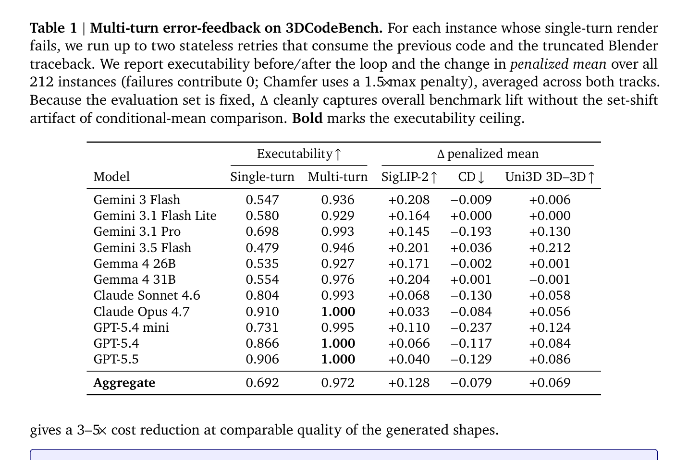

| Model | Executability (Single-turn) ↑ | Executability (Multi-turn) ↑ | Δ SigLIP-2 ↑ | Δ CD ↓ | Δ Uni3D 3D–3D ↑ |
|---|---|---|---|---|---|
| Gemini 3 Flash | 0.547 | 0.936 | +0.208 | −0.009 | +0.006 |
| Gemini 3.1 Flash Lite | 0.580 | 0.929 | +0.164 | +0.000 | +0.000 |
| Gemini 3.1 Pro | 0.698 | 0.993 | +0.145 | −0.193 | +0.130 |
| Gemini 3.5 Flash | 0.479 | 0.946 | +0.201 | +0.036 | +0.212 |
| Gemma 4 26B | 0.535 | 0.927 | +0.171 | −0.002 | +0.001 |
| Gemma 4 31B | 0.554 | 0.976 | +0.204 | +0.001 | −0.001 |
| Claude Sonnet 4.6 | 0.804 | 0.993 | +0.068 | −0.130 | +0.058 |
| Claude Opus 4.7 | 0.910 | **1.000** | +0.033 | −0.084 | +0.056 |
| GPT-5.4 mini | 0.731 | 0.995 | +0.110 | −0.237 | +0.124 |
| GPT-5.4 | 0.866 | **1.000** | +0.066 | −0.117 | +0.084 |
| GPT-5.5 | 0.906 | **1.000** | +0.040 | −0.129 | +0.086 |
| Aggregate | 0.692 | 0.972 | +0.128 | −0.079 | +0.069 |

**Caption:** Table 1 | Multi-turn error-feedback on 3DCodeBench. For each instance whose single-turn render fails, we run up to two stateless retries that consume the previous code and the truncated Blender traceback. We report executability before/after the loop and the change in penalized mean over all 212 instances (failures contribute 0; Chamfer uses a 1.5×max penalty), averaged across both tracks. Because the evaluation set is fixed, Δ cleanly captures overall benchmark lift without the set-shift artifact of conditional-mean comparison. Bold marks the executability ceiling.

**Caption[CN]:** 表 1 | 3DCodeBench 上的多轮错误反馈结果。针对单轮渲染失败的每个实例，运行最多两次无状态重试，输入包含上一轮代码和截断的 Blender 报错回溯信息（traceback）。报告多轮循环前后的可执行率，以及全部 212 个实例在惩罚均值下的变化量 Δ（失败实例指标记为 0；Chamfer 距离赋予 1.5 倍最大惩罚），两类任务取平均。由于评测集固定，Δ 能够清晰捕捉整体基准提升，避免条件均值对比中因成功集合变化引起的集合漂移偏差。粗体表示达到可执行率上限。

> <span style="color:#3B82F6"><strong>Para. 2:</strong></span> Finding 4. Multi-turn error-feedback is effective and capacity-independent: it lifts Executability to near-ceiling and also improves overall benchmark quality on every backbone.

> <span style="color:#F59E0B"><strong>Para. 2[CN]:</strong></span> 发现 4。多轮错误反馈高度有效且与模型容量解耦：它将代码可执行率提升至接近天花板，并在所有骨干模型上均整体提升了基准生成质量。

> <span style="color:#3B82F6"><strong>Para. 3:</strong></span> Multi-turn error-feedback is a clean, capacity-independent win. Aggregate executability across all $11 \times 2 = 22$ cells increases from 0.702 (single-turn) to 0.974 (multi-turn), representing a +27.2 pp improvement. 8 of 22 cells reach the 1.000 ceiling (Claude Opus 4.7, GPT-5.4, GPT-5.5 on both tracks, and Claude Sonnet 4.6 / GPT-5.4-mini on image-to-3D). Beyond executability, the post-loop penalized mean (failures contributing 0 on the fixed 212-instance set) is positive across all 22 cells on SigLIP-2 (aggregate +0.128) and on Uni3D 3D–3D for the high-capacity families (aggregate +0.069), and Chamfer Distance improves by −0.079 on aggregate; because the evaluation set is fixed, these deltas cleanly reflect overall benchmark lift rather than a set-shift artifact. Most of the improvement results from a single failure family: Blender 5.0 API mismatches whose fixes are localized and copy-pasteable, well within model competence once the traceback is visible (Appendix D.1).

> <span style="color:#F59E0B"><strong>Para. 3[CN]:</strong></span> 多轮错误反馈带来了纯粹且独立于模型容量的全面胜利。在全部 $11 \times 2 = 22$ 个测试单元中，综合可执行率从 0.702（单轮）激增至 0.974（多轮），绝对提升达 +27.2 个百分点。22 个单元中有 8 个直接达到了 1.000 的完美上限（Claude Opus 4.7、GPT-5.4、GPT-5.5 在两条赛道上均达到，Claude Sonnet 4.6 与 GPT-5.4-mini 在 Image-to-3D 上达到）。在可执行率之外，闭环后的惩罚均值（在固定的 212 个实例上失败记为 0）在所有 22 个单元的 SigLIP-2 指标上均实现正增长（综合提升 +0.128），在高容量模型家族的 Uni3D 3D–3D 指标上同样呈正增长（综合提升 +0.069），而 Chamfer 倒角距离在综合层面上改善了 −0.079；因为评测实例集合完全固定，这些增量真实反映了整个基准表现的提升，而非集合漂移带来的虚假增益。绝大部分改进源于单一失败模式：Blender 5.0 API 不匹配，这类错误在报错回溯信息可见时是局部的且易于定位修改，完全处于模型的能力范围之内（附录 D.1）。

### Table 2. 3DCodeBench Text-to-3D 任务上的代码智能体框架对比

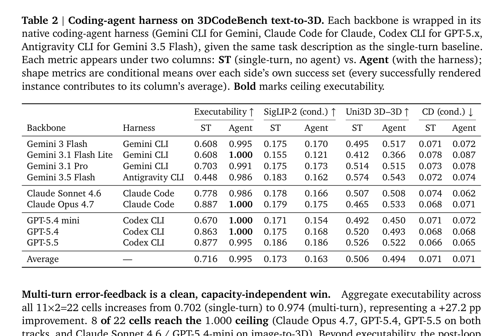

| Backbone | Harness | Executability ST ↑ | Executability Agent ↑ | SigLIP-2 ST (cond.) ↑ | SigLIP-2 Agent (cond.) ↑ | Uni3D 3D–3D ST ↑ | Uni3D 3D–3D Agent ↑ | CD ST (cond.) ↓ | CD Agent (cond.) ↓ |
|---|---|---|---|---|---|---|---|---|---|
| Gemini 3 Flash | Gemini CLI | 0.608 | 0.995 | 0.175 | 0.170 | 0.495 | 0.517 | 0.071 | 0.072 |
| Gemini 3.1 Flash Lite | Gemini CLI | 0.608 | **1.000** | 0.155 | 0.121 | 0.412 | 0.366 | 0.078 | 0.087 |
| Gemini 3.1 Pro | Gemini CLI | 0.703 | 0.991 | 0.175 | 0.173 | 0.514 | 0.515 | 0.073 | 0.078 |
| Gemini 3.5 Flash | Antigravity CLI | 0.448 | 0.986 | 0.183 | 0.162 | 0.574 | 0.543 | 0.072 | 0.074 |
| Claude Sonnet 4.6 | Claude Code | 0.778 | 0.986 | 0.178 | 0.166 | 0.507 | 0.508 | 0.074 | 0.062 |
| Claude Opus 4.7 | Claude Code | 0.887 | **1.000** | 0.179 | 0.175 | 0.465 | 0.533 | 0.068 | 0.071 |
| GPT-5.4 mini | Codex CLI | 0.670 | **1.000** | 0.171 | 0.154 | 0.492 | 0.450 | 0.071 | 0.072 |
| GPT-5.4 | Codex CLI | 0.863 | **1.000** | 0.175 | 0.168 | 0.520 | 0.493 | 0.068 | 0.068 |
| GPT-5.5 | Codex CLI | 0.877 | 0.995 | 0.186 | 0.186 | 0.526 | 0.522 | 0.066 | 0.065 |
| Average | — | 0.716 | 0.995 | 0.173 | 0.163 | 0.506 | 0.494 | 0.071 | 0.071 |

**Caption:** Table 2 | Coding-agent harness on 3DCodeBench text-to-3D. Each backbone is wrapped in its native coding-agent harness (Gemini CLI for Gemini, Claude Code for Claude, Codex CLI for GPT-5.x, Antigravity CLI for Gemini 3.5 Flash), given the same task description as the single-turn baseline. Each metric appears under two columns: ST (single-turn, no agent) vs. Agent (with the harness); shape metrics are conditional means over each side’s own success set (every successfully rendered instance contributes to its column’s average). Bold marks ceiling executability.

**Caption[CN]:** 表 2 | 3DCodeBench Text-to-3D 任务上的代码智能体框架评测。每个模型骨干网络均运行在其原生代码智能体框架中（Gemini 使用 Gemini CLI，Claude 使用 Claude Code，GPT-5.x 使用 Codex CLI，Gemini 3.5 Flash 使用 Antigravity CLI），接收与单轮基线完全相同的任务描述。每项指标包含两列：ST（单轮生成，无智能体框架）与 Agent（搭配智能体框架）；形状几何指标为各自成功执行集合上的条件均值（每个成功渲染的实例计入该列平均）。粗体表示达到可执行率上限。

> <span style="color:#3B82F6"><strong>Para. 4:</strong></span> Finding 5. Harnesses can lift Executability but, scored on the same instance subset, produce shape fidelity indistinguishable from a single prompt.

> <span style="color:#F59E0B"><strong>Para. 4[CN]:</strong></span> 发现 5。智能体框架能显著拉升可执行率，但在同一实例子集上评估时，其生成的形状保真度与单轮提示几乎无法区分。

> <span style="color:#3B82F6"><strong>Para. 5:</strong></span> Coding-agent harnesses lift Executability further but do not improve conditional shape quality. The retry loop described above is stateless and uniform across backbones. To determine whether full agent autonomy provides additional benefits beyond error-feedback fixes, all eight in-budget backbones were re-run within their native coding-agent harness: Gemini CLI for the three Gemini variants, Claude Code for Sonnet and Opus, and Codex CLI for the GPT-5.x family. Within a wall-clock time budget of 600–900 s, the agent receives the same task description, autonomously writes the script, invokes Blender 5.0, edits the file, and iterates until a mesh is produced, or the budget expires. Aggregated across the eight backbones (Table 2), the harness increases executability from 0.747 to 0.973, a +22.6 pp gain comparable to the stateless retry of Finding 4, with three of eight backbones reaching the 1.000 ceiling and a further two at $\ge 0.99$. When restricted to the ST-success $\cap$ Agent-success intersection so both columns score on the same instance subset, conditional SigLIP-2 view similarity changes by only −0.010 on average, conditional Chamfer Distance by only +0.001, and conditional Uni3D 3D–3D similarity (the metric most strongly tracking human preference per Finding 1) by only −0.003. The harness addresses simple API usage errors. However, it does not yield semantically richer or more shape-accurate geometry once a script compiles.

> <span style="color:#F59E0B"><strong>Para. 5[CN]:</strong></span> 代码智能体运行框架进一步拉高了可执行率，但未能在条件质量上改善几何形状。上述重试循环是无状态且跨模型统一的。为了探究完全的智能体自主交互是否能在单纯错误修复之外带来额外收益，我们将全部八个受评骨干模型置于其原生代码智能体底座中重新运行：三种 Gemini 变体采用 Gemini CLI，Sonnet 和 Opus 采用 Claude Code，GPT-5.x 家族采用 Codex CLI（Gemini 3.5 Flash 则采用 Antigravity CLI）。在 600–900 秒的物理挂钟时间预算内，智能体接收相同的任务描述，自主编写脚本、调用 Blender 5.0、编辑文件，并持续迭代直到生成 3D 网格或时间耗尽。综合八个骨干模型的数据（表 2），智能体框架将可执行率从 0.747 提升至 0.973，获得了与发现 4 中无状态重试相当的 +22.6 个百分点的提升，其中八个骨干中有三个达到 1.000 的上限，另有两个达到 $\ge 0.99$。然而，当严格限制在“单轮成功 $\cap$ 智能体成功”的交集上以确保两列在完全相同的实例子集上打分时，条件 SigLIP-2 视角相似度平均仅变化 −0.010，条件 Chamfer 距离仅变化 +0.001，而与人类偏好相关性最强的 Uni3D 3D–3D 相似度仅微降 −0.003。智能体框架成功解决了浅层的 API 语法使用错误；然而，一旦脚本能够成功编译，它并不能诱导模型生成语义更丰富或形状更精确的 3D 几何。

### 5.5. Qualitative Comparison

### Figure 6. 前沿模型定性渲染对比

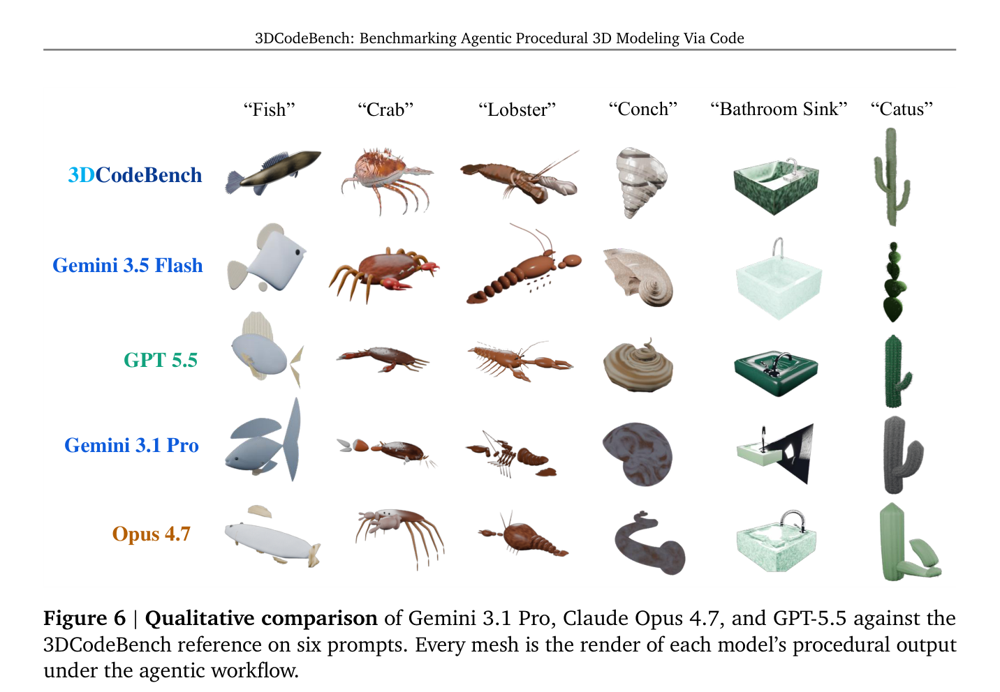

**Caption:** Figure 6 | Qualitative comparison of Gemini 3.1 Pro, Claude Opus 4.7, and GPT-5.5 against the 3DCodeBench reference on six prompts. Every mesh is the render of each model’s procedural output under the agentic workflow.

**Caption[CN]:** 图 6 | Gemini 3.1 Pro、Claude Opus 4.7 和 GPT-5.5 与 3DCodeBench 参考真值在六个提示词上的定性对比。每个 3D 网格均为各模型在智能体工作流下生成的程序化代码的渲染结果。

> <span style="color:#3B82F6"><strong>Para. 1:</strong></span> Figure 6 presents a qualitative comparison across six held-out prompts (e.g., “Fish”, “Lobster”, “Bathroom Sink”) evaluating three frontier models against the 3DCodeBench reference using the corresponding agent harness. Each mesh shows the rendered output of the model’s procedural pipeline. While these models capture basic silhouettes, they often struggle with structural integrity, frequently degenerating into disconnected geometric fragments (e.g., Gemini 3.1 Pro) or simplistic, floating primitives (e.g., Opus 4.7).

> <span style="color:#F59E0B"><strong>Para. 1[CN]:</strong></span> 图 6 展示了在六个保留提示词（如“鱼”、“龙虾”、“浴室洗手池”）下，使用对应智能体底座运行的三种前沿模型与 3DCodeBench 参考真值之间的定性对比。每个网格均展示了模型程序化管线的渲染输出。尽管这些模型能够捕捉基本的物体轮廓，但它们常常难以保证结构的完整性，频繁退化为互不连通的几何碎片（如 Gemini 3.1 Pro）或过于简化的悬浮基本图元（如 Opus 4.7）。

## 6. Analysis and Diagnostics

> <span style="color:#3B82F6"><strong>Para. 1:</strong></span> Physical Plausibility as the Core Frontier Bottleneck. Across all benchmark tracks, the experimental results demonstrate that achieving executable code is now largely a solved problem when paired with error-feedback harnesses (reaching $>97\%$ executability). However, execution success masks a profound geometric deficiency: models excel at syntax and API compliance but fail at physical grounding. Generated meshes frequently feature disconnected appendages, floating elements without structural support (e.g., floating chair legs, unattached antennae on insects), and severe non-manifold artifacts. This highlights that procedural code generation cannot be treated merely as another text-based coding benchmark like HumanEval; it fundamentally demands 3D spatial reasoning and embodied world modeling.

> <span style="color:#F59E0B"><strong>Para. 1[CN]:</strong></span> 物理合理性作为前沿核心瓶颈。在所有基准赛道中，实验结果表明，在结合错误反馈机制后，实现代码可执行已基本成为一个已解决的问题（可执行率超过 $97\%$）。然而，执行成功掩盖了深层的几何缺陷：模型擅长语法遵从与 API 规则匹配，却在物理常识感知上严重碰壁。生成的网格频繁出现断开的肢体构件、缺乏结构支撑的悬浮部件（如悬空的椅腿、昆虫未连接的触角）以及严重的非流形几何瑕疵。这凸显出程序化 3D 代码生成绝不能被简单视作类似 HumanEval 的又一个纯文本代码生成任务；它本质上要求深度的 3D 空间推理能力与具身物理世界建模能力。

> <span style="color:#3B82F6"><strong>Para. 2:</strong></span> The Anatomy of Multi-Turn and Harness Gains. A granular breakdown of multi-turn improvements reveals that error feedback predominantly remedies API obsolescence and runtime crashes (such as deprecated arguments in Blender 5.0 bmesh and node group methods). Once execution tracebacks are exposed, models perform localized, surgical repairs to syntax and references. However, giving full autonomy to command-line coding agents (Gemini CLI, Claude Code, Codex CLI) within a 15-minute budget yields negligible gains in conditional geometric fidelity (Uni3D delta of only $-0.003$). The agent harness acts as an efficient execution compiler but lacks an internal geometric critique mechanism capable of guiding code refactoring toward higher aesthetic and structural fidelity.

> <span style="color:#F59E0B"><strong>Para. 2[CN]:</strong></span> 多轮重试与智能体底座收益的机理解析。对多轮改进的细粒度分解表明，错误反馈主要修复了 API 弃用与运行时崩溃（如 Blender 5.0 bmesh 和节点组方法中废弃的参数）。一旦执行回溯信息可见，模型能够对语法和引用进行局部的、精准的代码修补。然而，赋予命令行代码智能体（Gemini CLI、Claude Code、Codex CLI）在 15 分钟预算内的完全自主交互权限，在条件几何保真度上带来的提升微乎其微（Uni3D 变化仅为 $-0.003$）。代码智能体底座充当了高效的执行编译加速器，但缺乏能够引导代码重构以达到更高美学和结构保真度的内在几何评判机制。

## 7. Conclusion and Future Work

> <span style="color:#3B82F6"><strong>Para. 1:</strong></span> Conclusion. In this paper, we introduced 3DCodeBench, a benchmark for evaluating vision-language model (VLM) agents in procedural 3D modeling. Using a novel agentic curation pipeline based on the Infinigen simulator, we constructed a diverse dataset of 212 object categories paired with executable code. Extensive evaluations of 12 frontier VLMs, which combine automated metrics with 3DCodeArena human preferences, highlight a critical capability gap: while models can produce executable code, they struggle with complex geometric reasoning and physical plausibility. Crucially, test-time scaling and multi-turn agentic refinement effectively mitigate these shortcomings. We also establish SigLIP-2 view similarity as a robust automated proxy for human judgment.

> <span style="color:#F59E0B"><strong>Para. 1[CN]:</strong></span> 结论。在本文中，我们提出了 3DCodeBench，这是一个用于评估视觉语言模型（VLM）智能体在程序化 3D 建模中能力的基准。基于 Infinigen 仿真器，利用全新的人机协同智能体数据整理管线，我们构建了一个包含 212 个物体类别并配有可执行代码的高质量多样化数据集。结合自动化评估指标与 3DCodeArena 人类偏好的 12 种前沿 VLM 广泛评测，揭示了一个关键的能力差距：尽管模型能够生成可执行代码，但它们在复杂的几何推理和物理合理性方面依然面临巨大挑战。至关重要的是，测试期扩展与多轮智能体优化有效缓解了这些短板。我们同时确立了 SigLIP-2 视角相似度作为人类主观评判的稳健自动化代理指标。

> <span style="color:#3B82F6"><strong>Para. 2:</strong></span> Future work. In the future, we plan to extend 3DCodeBench to multi-asset scene composition and evaluate cross-platform versatility (e.g., SideFX Houdini or Unreal Engine) to disentangle API memorization from generalized procedural modeling capabilities. Furthermore, scaling our curation pipeline could yield larger-scale datasets for pre-training next-generation 3D-aware VLMs. Ultimately, 3DCodeBench and 3DCodeArena establish a foundational framework for advancing autonomous agents capable of generating high-quality 3D shapes.

> <span style="color:#F59E0B"><strong>Para. 2[CN]:</strong></span> 未来工作。未来，我们计划将 3DCodeBench 扩展至多资产场景级合成，并评估跨平台通用性（例如 SideFX Houdini 或 Unreal Engine），以将针对特定 API 的死记硬背与泛化的程序化建模能力解耦。此外，扩大数据整理管线的规模有望生成更大规模的数据集，用于预训练下一代具备 3D 空间感知能力的 VLM。归根结底，3DCodeBench 与 3DCodeArena 为推动能够生成高质量 3D 形状的自主智能体研究奠定了坚实的基础框架。

## References

> <span style="color:#3B82F6"><strong>Para. 1:</strong></span> **Bibliographic Note:** The references below are retained in their original scholarly bibliographic format to maintain indexing precision, citation fidelity, and ease of literature search across Google Scholar, arXiv, and digital libraries.

> <span style="color:#F59E0B"><strong>Para. 1[CN]:</strong></span> **文献说明：** 以下参考文献均完整保留其学术规范原文书目格式，确保在 Google Scholar、arXiv 及学术数字图书馆中的引文检索精确性与引用严谨性。

1. Adobe. Adobe Substance 3D Designer. https://www.adobe.com/products/ substance3d-designer.html, 2026.
2. S. Ahuja. BlenderMCP: Blender Model Context Protocol integration for Claude and other LLM agents. https://github.com/ahujasid/blender-mcp, 2025.
3. K. Alrashedy, P. Tambwekar, Z. Zaidi, M. Langwasser, W. Xu, and M. Gombolay. Generating CAD code with vision-language models for 3d designs. arXiv preprint arXiv:2410.05340, 2024.
4. Anthropic. Introducing Claude 4. https://www.anthropic.com/news/claude-4, 2025.
5. Anthropic. Claude for Creative Work: Connecting Claude to Blender, Adobe, Ableton, Autodesk Fusion, and SketchUp. https://www.anthropic.com/news/claude-for-creative-work, 2026.
6. J. Austin, A. Odena, M. Nye, M. Bosma, H. Michalewski, D. Dohan, E. Jiang, C. Cai, M. Terry, Q. Le, and C. Sutton. Program synthesis with large language models. arXiv preprint arXiv:2108.07732, 2021.
7. A. Avetisyan, C. Xie, H. Howard-Jenkins, T.-Y. Yang, S. Aroudj, S. Patra, F. Zhang, D. Frost, L. Holland, C. Orme, J. Engel, E. Miller, R. Newcombe, and V. Balntas. SceneScript: Reconstructing scenes with an autoregressive structured language model. In European Conference on Computer Vision, pages 247–263. Springer, 2024.
8. Blender Foundation. Blender Geometry Nodes. https://docs.blender.org/manual/en/ latest/modeling/geometry_nodes/index.html, 2026a.
9. Blender Foundation. Blender MCP Server. https://www.blender.org/lab/mcp-server/, 2026b.
10. A. X. Chang, T. Funkhouser, L. Guibas, P. Hanrahan, Q. Huang, Z. Li, S. Savarese, M. Savva, S. Song, H. Su, J. Xiao, L. Yi, and F. Yu. ShapeNet: An information-rich 3d model repository. arXiv preprint arXiv:1512.03012, 2015.
11. M. Chen, J. Tworek, H. Jun, Q. Yuan, H. P. d. O. Pinto, J. Kaplan, H. Edwards, Y. Burda, N. Joseph, G. Brockman, A. Ray, R. Puri, G. Krueger, M. Petrov, H. Khlaaf, G. Sastry, P. Mishkin, B. Chan, S. Gray, N. Ryder, M. Pavlov, A. Power, L. Kaiser, M. Bavarian, C. Winter, P. Tillet, F. P. Such, D. Cummings, M. Plappert, F. Chantzis, E. Barnes, A. Herbert-Voss, W. H. Guss, A. Nichol, A. Paino, N. Tezak, J. Tang, I. Babuschkin, S. Balaji, S. Jain, W. Saunders, C. Hesse, A. N. Carr, J. Leike, J. Achiam, V. Misra, E. Morikawa, A. Radford, M. Knight, M. Brundage, M. Murati, K. Mayer, P. Welinder, B. McGrew, D. Amodei, S. McCandlish, I. Sutskever, and W. Zaremba. Evaluating large language models trained on code. arXiv preprint arXiv:2107.03374, 2021.
12. J. Collins, S. Goel, K. Deng, A. Luthra, L. Xu, E. Gundogdu, X. Zhang, T. F. Y. Vicente, T. Dideriksen, H. Arora, M. Guillaumin, and J. Malik. ABO: Dataset and benchmarks for real-world 3d object understanding. In Proceedings of the IEEE/CVF Conference on Computer Vision and Pattern Recognition, pages 21126–21136, 2022.
13. A. Dai, A. X. Chang, M. Savva, M. Halber, T. Funkhouser, and M. Nießner. ScanNet: Richly-annotated 3d reconstructions of indoor scenes. In Proceedings of the IEEE Conference on Computer Vision and Pattern Recognition, pages 5828–5839, 2017.
14. M. Deitke, E. VanderBilt, A. Herrasti, L. Weihs, J. Salvador, K. Ehsani, W. Han, E. Kolve, A. Farhadi, A. Kembhavi, and R. Mottaghi. ProcTHOR: Large-scale embodied AI using procedural generation. In Advances in Neural Information Processing Systems, 2022.
15. M. Deitke, R. Liu, M. Wallingford, H. Ngo, O. Michel, A. Kusupati, A. Fan, C. Laforte, V. Voleti, S. Y. Gadre, E. VanderBilt, A. Kembhavi, C. Vondrick, G. Gkioxari, K. Ehsani, L. Schmidt, and A. Farhadi. Objaverse-XL: A universe of 10M+ 3d objects. In Advances in Neural Information Processing Systems, 2023a.
16. M. Deitke, D. Schwenk, J. Salvador, L. Weihs, O. Michel, E. VanderBilt, L. Schmidt, K. Ehsani, A. Kembhavi, and A. Farhadi. Objaverse: A universe of annotated 3d objects. In Proceedings of the IEEE/CVF Conference on Computer Vision and Pattern Recognition, pages 13142–13153, 2023b.
17. M. Denninger, M. Sundermeyer, D. Winkelbauer, Y. Zidan, D. Olefir, M. Elbadrawy, A. Lodhi, and H. Katam. Blenderproc. arXiv preprint arXiv:1911.01911, 2019.
18. Y. Du, S. Chen, W. Zan, P. Li, M. Wang, D. Song, B. Li, Y. Hu, and B. Wang. BlenderLLM: Train- ing large language models for computer-aided design with self-improvement. arXiv preprint arXiv:2412.14203, 2024.
19. elithril. Blender Kiln: 3d asset production pipeline for Claude Code. https://github.com/ elithril/blender-kiln, 2025.
20. Esri. Esri ArcGIS CityEngine. https://www.esri.com/en-us/arcgis/products/ arcgis-cityengine/overview, 2026.
21. H. Fan, H. Su, and L. J. Guibas. A point set generation network for 3d object reconstruction from a single image. In Proceedings of the IEEE Conference on Computer Vision and Pattern Recognition, pages 2463–2471, 2017.
22. Google. Gemini 3.1 Pro: A smarter model for your most complex tasks. https://blog.google/ innovation-and-ai/models-and-research/gemini-models/gemini-3-1-pro/, 2026a.
23. Google. Gemini 3.1 Flash Lite. https://blog.google/innovation-and-ai/ models-and-research/gemini-models/gemini-3-1-flash-lite/, 2026b.
24. Google DeepMind. Gemma 4 model card. https://ai.google.dev/gemma/docs/core/model_ card_4, 2026.
25. K. Greff, F. Belletti, L. Beyer, C. Doersch, Y. Du, D. Duckworth, D. J. Fleet, D. Gnanapragasam, F. Golemo, C. Herrmann, T. Kipf, A. Kundu, D. Lagun, I. Laradji, H.-T. Liu, H. Meyer, Y. Miao, D. Nowrouzezahrai, C. Oztireli, E. Pot, N. Radwan, D. Rebain, S. Sabour, M. S. M. Sajjadi, M. Sela, V. Sitzmann, A. Stone, D. Sun, S. Vora, Z. Wang, T. Wu, K. M. Yi, F. Zhong, and A. Tagliasacchi. Kubric: A scalable dataset generator. In Proceedings of the IEEE/CVF Conference on Computer Vision and Pattern Recognition, pages 3739–3751, 2022.
26. Y. Gu, I. Huang, J. Je, G. Yang, and L. Guibas. BlenderGym: Benchmarking foundational model systems for graphics editing. In Proceedings of the IEEE/CVF Conference on Computer Vision and Pattern Recognition, 2025.
27. Z. Hu, A. Iscen, A. Jain, T. Kipf, Y. Yue, D. A. Ross, C. Schmid, and A. Fathi. SceneCraft: An LLM agent for synthesizing 3d scene as Blender code. In International Conference on Machine Learning, pages 19252–19282, 2024.
28. IDV, Inc. SpeedTree. https://store.speedtree.com/, 2026.
29. R. K. Jones, T. Barton, X. Xu, K. Wang, E. Jiang, P. Guerrero, N. J. Mitra, and D. Ritchie. ShapeAssembly: Learning to generate programs for 3d shape structure synthesis. ACM Transactions on Graphics, 39 (6):1–20, 2020.
30. R. K. Jones, P. Guerrero, N. J. Mitra, and D. Ritchie. ShapeCoder: Discovering abstractions for visual programs from unstructured primitives. ACM Transactions on Graphics, 42(4):1–17, 2023.
31. A. Joshi, B. Han, J. Nugent, M. G. Saez-Diez, Y. Zuo, J. Liu, H. Wen, S. Alexandropoulos, K. Kayan, A. Calveri, T. Sun, G. Liu, Y. Shao, A. Raistrick, and J. Deng. Procedural generation of articulated simulation-ready assets. arXiv preprint arXiv:2505.10755, 2025.
32. L. Le, J. Xie, W. Liang, H.-J. Wang, Y. Yang, Y. J. Ma, K. Vedder, A. Krishna, D. Jayaraman, and E. Eaton. Articulate-anything: Automatic modeling of articulated objects via a vision-language foundation model. In International Conference on Learning Representations, volume 2025, pages 17578–17602, 2025.
33. Y. Li, D. Choi, J. Chung, N. Kushman, J. Schrittwieser, R. Leblond, T. Eccles, J. Keeling, F. Gimeno, A. Dal Lago, T. Hubert, P. Choy, C. de Masson d’Autume, I. Babuschkin, X. Chen, P.-S. Huang, J. Welbl, S. Gowal, A. Cherepanov, J. Molloy, D. J. Mankowitz, E. Sutherland Robson, P. Kohli, N. de Freitas, K. Kavukcuoglu, and O. Vinyals. Competition-level code generation with AlphaCode. Science, 378(6624):1092–1097, 2022.
34. L. Ling, C.-H. Lin, T.-Y. Lin, Y. Ding, Y. Zeng, Y. Sheng, Y. Ge, M.-Y. Liu, A. Bera, and Z. Li. Scenethesis: A language and vision agentic framework for 3d scene generation. arXiv preprint arXiv:2505.02836, 2025.
35. S. Lu, G. Chen, N. A. Dinh, I. Lang, A. Holtzman, and R. Hanocka. LL3M: Large language 3d modelers. arXiv preprint arXiv:2508.08228, 2025.
36. T. Luo, C. Rockwell, H. Lee, and J. Johnson. Scalable 3d captioning with pretrained models. In Advances in Neural Information Processing Systems, pages 75307–75337, 2023.
37. minihellboy. Claude Blender: AI-powered Blender control via Claude Code and MCP. https: //github.com/minihellboy/claude-blender, 2025.
38. OpenAI. Introducing GPT-5. https://openai.com/index/introducing-gpt-5/, 2025.
39. ra100. Blender Claude Plugin: expert Blender 5.x scripting skills for coding agents. https:// github.com/ra100/blender-claude-plugin, 2025.
40. A. Raistrick, L. Lipson, Z. Ma, L. Mei, M. Wang, Y. Zuo, K. Kayan, H. Wen, B. Han, Y. Wang, A. Newell, H. Law, A. Goyal, K. Yang, and J. Deng. Infinite photorealistic worlds using procedural generation. In Proceedings of the IEEE/CVF Conference on Computer Vision and Pattern Recognition, pages 12630–12641, 2023.
41. A. Raistrick, L. Mei, K. Kayan, D. Yan, Y. Zuo, B. Han, H. Wen, M. Parakh, S. Alexandropoulos, L. Lipson, Z. Ma, and J. Deng. Infinigen indoors: Photorealistic indoor scenes using procedural generation. In Proceedings of the IEEE/CVF Conference on Computer Vision and Pattern Recognition, pages 21783–21794, 2024.
42. F. Raji, S. Petrangeli, M. Gadelha, Y. Shen, U. Bhattacharya, and G. Wu. Proc3d: Procedural 3d generation and parametric editing of 3d shapes with large language models. arXiv preprint arXiv:2601.12234, 2026.
43. saofund. LLM-Blender-Agent: LLM function-calling agent for Blender task automation. https: //github.com/saofund/LLM-Blender-Agent, 2025.
44. G. Sharma, R. Goyal, D. Liu, E. Kalogerakis, and S. Maji. CSGNet: Neural shape parser for constructive solid geometry. In Proceedings of the IEEE Conference on Computer Vision and Pattern Recognition, pages 5515–5523, 2018.
45. SideFX. Houdini. https://www.sidefx.com/products/houdini/, 2026. O. Siméoni, H. V. Vo, M. Seitzer, F. Baldassarre, M. Oquab, C. Jose, V. Khalidov, M. Szafraniec, S. Yi, M. Ramamonjisoa, F. Massa, D. Haziza, L. Wehrstedt, J. Wang, T. Darcet, T. Moutakanni, L. Sentana, C. Roberts, A. Vedaldi, J. Tolan, J. Brandt, C. Couprie, J. Mairal, H. Jégou, P. Labatut, and P. Bojanowski. DINOv3. arXiv preprint arXiv:2508.10104, 2025.
46. C. Sun, J. Han, W. Deng, X. Wang, Z. Qin, and S. Gould. 3D-GPT: Procedural 3d modeling with large language models. arXiv preprint arXiv:2310.12945, 2023. F.-Y. Sun, S. Wu, C. Jacobsen, T. Yim, H. Zou, A. Zook, S. Li, Y.-H. Chou, E. Can, X. Wu, C. Eppner, V. Blukis, J. Tremblay, J. Wu, S. Birchfield, and N. Haber. 3D-Generalist: Self-improving vision- language-action models for crafting 3d worlds. arXiv preprint arXiv:2507.06484, 2025.
47. M. Tschannen, A. Gritsenko, X. Wang, M. F. Naeem, I. Alabdulmohsin, N. Parthasarathy, T. Evans, L. Beyer, Y. Xia, B. Mustafa, O. Hénaff, J. Harmsen, A. Steiner, and X. Zhai. SigLIP 2: Multilingual vision-language encoders with improved semantic understanding, localization, and dense features. arXiv preprint arXiv:2502.14786, 2025.
48. T. Wu, J. Zhang, X. Fu, Y. Wang, J. Ren, L. Pan, W. Wu, L. Yang, J. Wang, C. Qian, D. Lin, and Z. Liu. OmniObject3D: Large-vocabulary 3d object dataset for realistic perception, reconstruction and generation. In Proceedings of the IEEE/CVF Conference on Computer Vision and Pattern Recognition, pages 803–814, 2023.
49. Y. Yang, F.-Y. Sun, L. Weihs, E. VanderBilt, A. Herrasti, W. Han, J. Wu, N. Haber, R. Krishna, L. Liu, C. Callison-Burch, M. Yatskar, A. Kembhavi, and C. Clark. Holodeck: Language guided generation of 3d embodied AI environments. In Proceedings of the IEEE/CVF Conference on Computer Vision and Pattern Recognition, pages 16227–16237, 2024.
50. S. Yin, J. Ge, Z. Z. Wang, C. Wang, X. Li, M. J. Black, T. Darrell, A. Kanazawa, and H. Feng. VIGA: Vision- as-inverse-graphics agent via interleaved multimodal reasoning. arXiv preprint arXiv:2601.11109, 2026.
51. Y. Zhang, M. Zhang, T. Wu, T. Wang, G. Wetzstein, D. Lin, and Z. Liu. 3DGen-Bench: Comprehensive benchmark suite for 3d generative models. arXiv preprint arXiv:2503.21745, 2025.
52. Y. Zheng and F. Bordes. VoxelCodeBench: Benchmarking 3d world modeling through code generation. arXiv preprint arXiv:2604.02580, 2026.
53. J. Zhou, J. Wang, B. Ma, Y.-S. Liu, T. Huang, and X. Wang. Uni3D: Exploring unified 3d representation at scale. In International Conference on Learning Representations, 2024.
54. M. Zhou, R. Li, X. Lyu, Z. Song, Z. Huang, C. Zheng, C. Rupprecht, A. Vedaldi, and S. Wu. Articraft: An agentic system for scalable articulated 3d asset generation. arXiv preprint arXiv:2605.15187, 2026.
55. Q. Zhou and A. Jacobson. Thingi10K: A dataset of 10,000 3d-printing models. arXiv preprint arXiv:1605.04797, 2016.

## Appendices

## Appendix A. Dataset Construction and Statistics

### A.1. Cost–Quality Pareto Frontier

### Figure A.1. 成本与人类偏好 Elo 的 Pareto 前沿

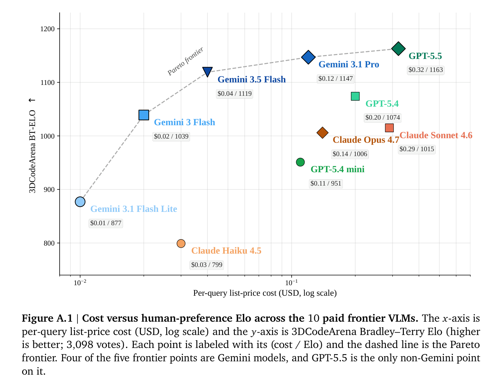

**Caption:** Figure A.1 | Cost versus human-preference Elo across the 10 paid frontier VLMs. The $x$-axis is the estimated USD cost to run the full 212-instance benchmark at each model's best thinking level (averaged across the text-to-3D and image-to-3D tracks, i.e., $212 \\times 2 = 424$ queries per point), shown on a logarithmic scale; the $y$-axis is the combined Bradley–Terry Elo on 3DCodeArena. Open-weight Gemma models are omitted because they have no per-query API list price. The dotted line traces the empirical Pareto frontier.

**Caption[CN]:** 图 A.1 | 10 款付费前沿 VLM 的成本与人类偏好 Elo 积分对比。x 轴为每个模型在最佳思考预算下运行全部 212 个基准实例的预估美元成本（跨 Text-to-3D 与 Image-to-3D 赛道取平均，即每个数据点对应 $212 \\times 2 = 424$ 次模型调用），采用对数坐标轴；y 轴为 3DCodeArena 上的综合 Bradley–Terry Elo 积分。开源权重的 Gemma 模型因无 API 官方刊例单价而予以省略。虚线描绘了经验 Pareto 前沿。

> <span style="color:#3B82F6"><strong>Para. 1:</strong></span> Figure A.1 plots each model’s 3DCodeArena Bradley–Terry Elo against its per-query cost. We define cost as the list-price spend (input + output tokens under each provider’s published pricing) to evaluate the model across the 212 instances of 3DCodeBench. To make the frontier representative of achievable quality, each model is evaluated at its peak thinking level — the setting that maximizes SigLIP-2 view similarity on the benchmark. The resulting plot reveals four distinct operational regimes.

> <span style="color:#F59E0B"><strong>Para. 1[CN]:</strong></span> 图 A.1 绘制了每个模型在 3DCodeArena 中的 Bradley–Terry Elo 评分相对于其单次查询成本的关系曲线。我们将成本定义为在 3DCodeBench 的 212 个评测实例上评估该模型所需的官方刊例支出（各供应商公开定价下的输入与输出 token 费用）。为使 Pareto 前沿代表可达到的最佳质量，每个模型均在其最佳思考预算水平下进行评估——即在该基准上最大化 SigLIP-2 视角相似度的参数配置。生成的散点图揭示了四种截然不同的运行区间。

> <span style="color:#3B82F6"><strong>Para. 2:</strong></span> Ultra-low-cost tier (<$0.05 per full benchmark run): Gemini 3.1 Flash Lite and Gemini 3 Flash occupy this corner. At $0.01 and $0.02 respectively, they provide an entry point for high-throughput or budget-constrained evaluation, though their Elo scores (877 and 1,039) lag the frontier. Claude Haiku 4.5 ($0.02) also sits in this cost band but achieves only 799 Elo, penalised by lower executability and disconnected geometry.

> <span style="color:#F59E0B"><strong>Para. 2[CN]:</strong></span> 超低成本梯队（完整基准评测运行 <$0.05）：Gemini 3.1 Flash Lite 与 Gemini 3 Flash 占据了这一区间。它们的测试成本分别仅为 $0.01 与 $0.02，为高吞吐量或受预算限制的评测提供了切入点，尽管其 Elo 评分（877 与 1,039）落后于前沿阵营。Claude Haiku 4.5（$0.02）虽然处于同一成本区间，但仅获得了 799 的 Elo 分数，主要受累于较低的代码可执行率与断裂破碎的几何结构。

> <span style="color:#3B82F6"><strong>Para. 3:</strong></span> Mid-cost, high-efficiency tier ($0.04–$0.10): Gemini 3.5 Flash ($0.04) and Claude Opus 4.7 ($0.08) form a compelling efficiency sweet spot. Gemini 3.5 Flash reaches 1,119 Elo at roughly one-seventh the cost of GPT-5.5, while Claude Opus 4.7 delivers near-ceiling executability (0.910 single-turn) and 1,006 Elo at moderate spend, making it the most reliable zero-retry generator.

> <span style="color:#F59E0B"><strong>Para. 3[CN]:</strong></span> 中等成本高效率梯队（$0.04–$0.10）：Gemini 3.5 Flash（$0.04）与 Claude Opus 4.7（$0.08）构成了极具吸引力的高性价比黄金分割点。Gemini 3.5 Flash 以约为 GPT-5.5 七分之一的成本达到了 1,119 的高 Elo 分数，而 Claude Opus 4.7 以适度的成本支出了接近天花板的可执行率（单轮 0.910）与 1,006 的 Elo 分数，成为最可靠的零重试代码生成器。

> <span style="color:#3B82F6"><strong>Para. 4:</strong></span> Frontier quality tier ($0.15–$0.30): Gemini 3.1 Pro ($0.19) and GPT-5.5 ($0.28) establish the quality frontier at 1,147 and 1,163 Elo, respectively. Gemini 3.1 Pro trades higher latency (162.9 s per query, driven by extensive thinking tokens) for geometric precision, while GPT-5.5 achieves the highest overall perception scores across all six automated metrics. GPT-5.4 ($0.18, 1,074 Elo) and Claude Sonnet 4.6 ($0.26, 1,015 Elo) sit slightly inside the frontier.

> <span style="color:#F59E0B"><strong>Para. 4[CN]:</strong></span> 前沿旗舰梯队（$0.15–$0.30）：Gemini 3.1 Pro（$0.19）与 GPT-5.5（$0.28）分别以 1,147 和 1,163 的 Elo 积分牢牢确立了质量前沿。Gemini 3.1 Pro 以更高的推理延迟（受海量思考 token 驱动，单次查询达 162.9 秒）换取极致的几何精度，而 GPT-5.5 在全部六项自动化评估指标上均取得了最高的综合感知得分。GPT-5.4（$0.18，1,074 Elo）和 Claude Sonnet 4.6（$0.26，1,015 Elo）则略微处于前沿之内。

### A.2. Per-Model Main-Results Table

### Table A.1. 3DCodeBench 主实验结果总表（212 个类别）

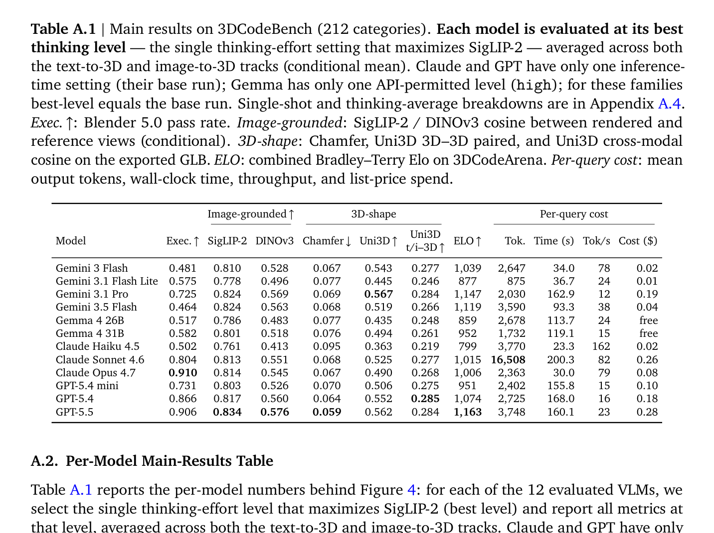

| Model | Exec. ↑ | Image-grounded SigLIP-2 ↑ | Image-grounded DINOv3 ↑ | 3D-shape Chamfer ↓ | 3D-shape Uni3D ↑ | 3D-shape Uni3D t/i–3D ↑ | ELO ↑ | Per-query Tok. | Per-query Time (s) | Per-query Tok/s | Per-query Cost ($) |
|---|---|---|---|---|---|---|---|---|---|---|---|
| Gemini 3 Flash | 0.481 | 0.810 | 0.528 | 0.067 | 0.543 | 0.277 | 1,039 | 2,647 | 34.0 | 78 | 0.02 |
| Gemini 3.1 Flash Lite | 0.575 | 0.778 | 0.496 | 0.077 | 0.445 | 0.246 | 877 | 875 | 36.7 | 24 | 0.01 |
| Gemini 3.1 Pro | 0.725 | 0.824 | 0.569 | 0.069 | 0.567 | 0.284 | 1,147 | 2,030 | 162.9 | 12 | 0.19 |
| Gemini 3.5 Flash | 0.464 | 0.824 | 0.563 | 0.068 | 0.519 | 0.266 | 1,119 | 3,590 | 93.3 | 38 | 0.04 |
| Gemma 4 26B | 0.517 | 0.786 | 0.483 | 0.077 | 0.435 | 0.248 | 859 | 2,678 | 113.7 | 24 | free |
| Gemma 4 31B | 0.582 | 0.801 | 0.518 | 0.076 | 0.494 | 0.261 | 952 | 1,732 | 119.1 | 15 | free |
| Claude Haiku 4.5 | 0.502 | 0.761 | 0.413 | 0.095 | 0.363 | 0.219 | 799 | 3,770 | 23.3 | 162 | 0.02 |
| Claude Sonnet 4.6 | 0.804 | 0.813 | 0.551 | 0.068 | 0.525 | 0.277 | 1,015 | 16,508 | 200.3 | 82 | 0.26 |
| Claude Opus 4.7 | 0.910 | 0.814 | 0.545 | 0.067 | 0.490 | 0.268 | 1,006 | 2,363 | 30.0 | 79 | 0.08 |
| GPT-5.4 mini | 0.731 | 0.803 | 0.526 | 0.070 | 0.506 | 0.275 | 951 | 2,402 | 155.8 | 15 | 0.10 |
| GPT-5.4 | 0.866 | 0.817 | 0.560 | 0.064 | 0.552 | 0.285 | 1,074 | 2,725 | 168.0 | 16 | 0.18 |
| GPT-5.5 | **0.906** | **0.834** | **0.576** | **0.059** | **0.562** | **0.284** | **1,163** | 3,748 | 160.1 | 23 | 0.28 |

**Caption:** Table A.1 | Main results on 3DCodeBench (212 categories). Each model is evaluated at its best thinking level — the single thinking-effort setting that maximizes SigLIP-2 — averaged across both the text-to-3D and image-to-3D tracks (conditional mean). Claude and GPT have only one inference-time setting (their base run); Gemma has only one API-permitted level (high); for these families best-level equals the base run. Single-shot and thinking-average breakdowns are in Appendix A.4. Exec.↑: Blender 5.0 pass rate. Image-grounded: SigLIP-2 / DINOv3 cosine between rendered and reference views (conditional). 3D-shape: Chamfer, Uni3D 3D–3D paired, and Uni3D cross-modal cosine on the exported GLB. ELO: combined Bradley–Terry Elo on 3DCodeArena. Per-query cost: mean output tokens, wall-clock time, throughput, and list-price spend.

**Caption[CN]:** 表 A.1 | 3DCodeBench 主实验结果总表（212 个类别）。每个模型均在其最佳思考水平（使 SigLIP-2 达到最大值的单一思考预算配置）下进行评估，跨 Text-to-3D 和 Image-to-3D 两条赛道取条件均值。Claude 和 GPT 仅具备单一推理期设置（即基线运行）；Gemma 仅支持一种 API 允许的级别（high）；对于这些模型家族，最佳水平即等价于基线运行。单轮与思考平均分解数据见附录 A.4。Exec.↑：Blender 5.0 可执行通过率。基于图像：渲染视图与参考视图之间的 SigLIP-2 / DINOv3 余弦相似度（条件均值）。3D 形状：导出 GLB 网格上的 Chamfer 距离、Uni3D 3D–3D 配对余弦以及 Uni3D 跨模态余弦相似度。ELO：3DCodeArena 综合 Bradley–Terry Elo 评分。单次查询成本：平均输出 token 数、物理时间（秒）、吞吐率（token/秒）与官方刊例支出（美元）。

> <span style="color:#3B82F6"><strong>Para. 1:</strong></span> Table A.1 reports the per-model numbers behind Figure 4: for each of the 12 evaluated VLMs, we report executability under Blender 5.0, image-grounded similarity against reference views, 3D-shape metrics on the exported GLB mesh, 3DCodeArena human-preference Elo, and per-query operational costs. Every quality metric is reported as a conditional mean over the model's successfully executed instances, isolating shape synthesis quality from compilation failure.

> <span style="color:#F59E0B"><strong>Para. 1[CN]:</strong></span> 表 A.1 详细汇报了图 4 背后的各模型具体数据：针对全部 12 个参评 VLM，报告了 Blender 5.0 环境下的可执行率、相对于参考视角的基于图像的感知相似度、导出 GLB 网格上的 3D 几何形状指标、3DCodeArena 人类偏好 Elo 积分以及单次查询的计算运行成本。各项质量指标均以模型成功执行实例上的条件均值呈现，从而将 3D 形状生成质量与代码编译失败解耦。

### A.3. Elo vs. Metrics under Single-Shot Run

### Figure A.2. 3DCodeArena Elo 与六项自动化质量指标（最佳思考配置）

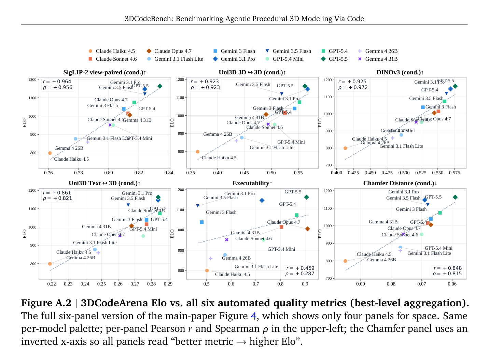

**Caption:** Figure A.2 | 3DCodeArena Elo vs. all six automated quality metrics (best-level aggregation). Top row: image-grounded perception metrics (SigLIP-2 view-paired, DINOv3 view-paired, and Blender 5.0 Executability). Bottom row: 3D-shape metrics (Uni3D 3D–3D point-cloud cosine, Uni3D cross-modal cosine, and Chamfer Distance). Pearson $r$ and Spearman $\rho$ are annotated in each panel. Chamfer uses an inverted $x$-axis.

**Caption[CN]:** 图 A.2 | 3DCodeArena Elo 与全部六项自动化质量指标对比（最佳思考级别聚合）。顶部一行：基于图像的感知指标（SigLIP-2 视角配对、DINOv3 视角配对以及 Blender 5.0 可执行率）。底部一行：3D 形状几何指标（Uni3D 3D–3D 点云余弦、Uni3D 跨模态余弦以及 Chamfer 倒角距离）。每个面板中标注了 Pearson $r$ 与 Spearman $\rho$ 相关系数。Chamfer 距离面板采用反转的 x 轴。

### Figure A.3. 3DCodeArena Elo 与各项自动化质量指标（单轮基线运行）

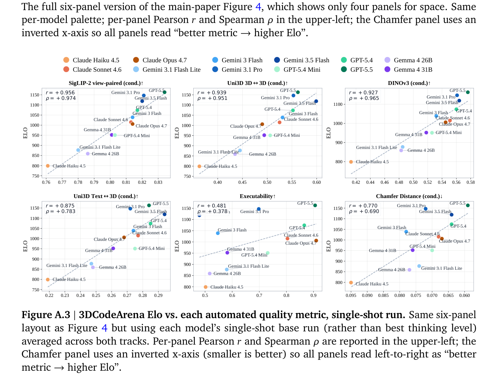

**Caption:** Figure A.3 | 3DCodeArena Elo vs. each automated quality metric, single-shot run. Same six-panel layout as Figure A.2, but showing the single-shot run (no thinking-level search; open-weight Gemma at API-default thinking). Correlations remain high across the board, demonstrating that the predictive power of the automated suite does not rely on post hoc hyperparameter tuning.

**Caption[CN]:** 图 A.3 | 3DCodeArena Elo 与各项自动化质量指标对比（单轮基线运行）。采用与图 A.2 相同的六面板布局，但展示的是纯单轮运行数据（未进行思考预算搜索；开源权重的 Gemma 采用 API 默认思考设置）。各项指标的相关性全面保持在高位，证明自动化评测套件的预测能力并不依赖于事后的超参数调优。

> <span style="color:#3B82F6"><strong>Para. 1:</strong></span> Figures A.2 and A.3 evaluate the alignment between automated metrics and human preferences under two distinct evaluation regimes: best-level aggregation (selecting each model's top thinking budget) and single-shot generation (a single API call per instance without search). Across both regimes, SigLIP-2 and DINOv3 maintain exceptionally high correlations with human Elo ($r > 0.94, \rho > 0.95$), confirming that rendering-based perceptual embeddings closely mirror human aesthetic and structural assessments. Uni3D 3D–3D point-cloud cosine serves as the strongest geometric proxy ($r = 0.88–0.91$), whereas raw Chamfer Distance shows lower correlation ($r \approx 0.76$) due to its sensitivity to outlier points and non-uniform surface sampling.

> <span style="color:#F59E0B"><strong>Para. 1[CN]:</strong></span> 图 A.2 和图 A.3 分别在两种不同的评测范式下评估了自动化指标与人类偏好的一致性：最佳思考水平聚合（选择每个模型的最佳思考预算配置）与单轮生成基准（每个实例进行单次 API 调用，不进行任何后处理搜索）。在这两种设定下，SigLIP-2 与 DINOv3 均与人类 Elo 保持着极高的相关性（$r > 0.94, \rho > 0.95$），证实基于渲染图的多视角感知嵌入能高度拟合人类对美学与结构的综合评判。Uni3D 3D–3D 点云余弦相似度是最强的纯几何代理指标（$r = 0.88–0.91$），而原始 Chamfer 倒角距离的相关性相对较低（$r \approx 0.76$），主要源于其对离群离散噪点和不均匀表面采样的过度敏感。

### A.4. Aggregation Comparison: Single-Shot vs. Thinking-Average

### Table A.2. 3DCodeBench 单轮运行结果表（无思考预算搜索）

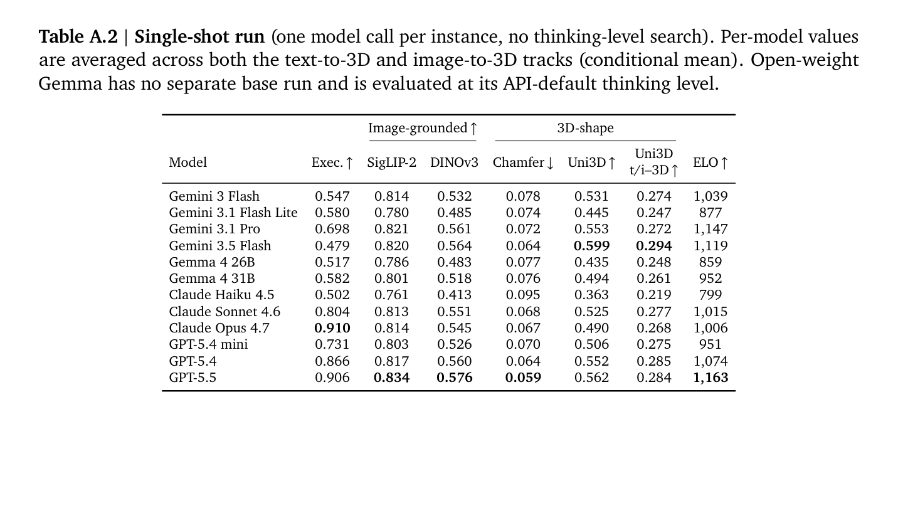

| Model | Exec. ↑ | SigLIP-2 ↑ | DINOv3 ↑ | Chamfer ↓ | Uni3D ↑ | Uni3D t/i–3D ↑ | ELO ↑ |
|---|---|---|---|---|---|---|---|
| Gemini 3 Flash | 0.547 | 0.814 | 0.532 | 0.078 | 0.531 | 0.274 | 1,039 |
| Gemini 3.1 Flash Lite | 0.580 | 0.780 | 0.485 | 0.074 | 0.445 | 0.247 | 877 |
| Gemini 3.1 Pro | 0.698 | 0.821 | 0.561 | 0.072 | 0.553 | 0.272 | 1,147 |
| Gemini 3.5 Flash | 0.479 | 0.820 | 0.564 | 0.064 | 0.599 | 0.294 | 1,119 |
| Gemma 4 26B | 0.517 | 0.786 | 0.483 | 0.077 | 0.435 | 0.248 | 859 |
| Gemma 4 31B | 0.582 | 0.801 | 0.518 | 0.076 | 0.494 | 0.261 | 952 |
| Claude Haiku 4.5 | 0.502 | 0.761 | 0.413 | 0.095 | 0.363 | 0.219 | 799 |
| Claude Sonnet 4.6 | 0.804 | 0.813 | 0.551 | 0.068 | 0.525 | 0.277 | 1,015 |
| Claude Opus 4.7 | 0.910 | 0.814 | 0.545 | 0.067 | 0.490 | 0.268 | 1,006 |
| GPT-5.4 mini | 0.731 | 0.803 | 0.526 | 0.070 | 0.506 | 0.275 | 951 |
| GPT-5.4 | 0.866 | 0.817 | 0.560 | 0.064 | 0.552 | 0.285 | 1,074 |
| GPT-5.5 | **0.906** | **0.834** | **0.576** | **0.059** | **0.562** | **0.284** | **1,163** |

**Caption:** Table A.2 | Single-shot run (one model call per instance, no thinking-level search). Per-model values are averaged across both the text-to-3D and image-to-3D tracks (conditional mean). Open-weight Gemma has no separate base run and is evaluated at its API-default thinking level.

**Caption[CN]:** 表 A.2 | 单轮基线运行（每个实例进行单次模型调用，不进行思考级别搜索）。各模型数值均为跨 Text-to-3D 与 Image-to-3D 赛道的平均值（条件均值）。开源权重的 Gemma 模型无独立的基线运行，在 API 默认思考设置下进行评估。

### Table A.3. 思考水平平均运行结果表（跨可用思考开销平均）

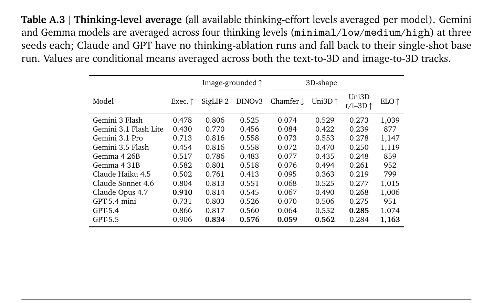

| Model | Exec. ↑ | SigLIP-2 ↑ | DINOv3 ↑ | Chamfer ↓ | Uni3D ↑ | Uni3D t/i–3D ↑ | ELO ↑ |
|---|---|---|---|---|---|---|---|
| Gemini 3 Flash | 0.478 | 0.806 | 0.525 | 0.074 | 0.529 | 0.273 | 1,039 |
| Gemini 3.1 Flash Lite | 0.430 | 0.770 | 0.456 | 0.084 | 0.422 | 0.239 | 877 |
| Gemini 3.1 Pro | 0.713 | 0.816 | 0.558 | 0.073 | 0.553 | 0.278 | 1,147 |
| Gemini 3.5 Flash | 0.454 | 0.816 | 0.558 | 0.072 | 0.470 | 0.250 | 1,119 |
| Gemma 4 26B | 0.517 | 0.786 | 0.483 | 0.077 | 0.435 | 0.248 | 859 |
| Gemma 4 31B | 0.582 | 0.801 | 0.518 | 0.076 | 0.494 | 0.261 | 952 |
| Claude Haiku 4.5 | 0.502 | 0.761 | 0.413 | 0.095 | 0.363 | 0.219 | 799 |
| Claude Sonnet 4.6 | 0.804 | 0.813 | 0.551 | 0.068 | 0.525 | 0.277 | 1,015 |
| Claude Opus 4.7 | 0.910 | 0.814 | 0.545 | 0.067 | 0.490 | 0.268 | 1,006 |
| GPT-5.4 mini | 0.731 | 0.803 | 0.526 | 0.070 | 0.506 | 0.275 | 951 |
| GPT-5.4 | 0.866 | 0.817 | 0.560 | 0.064 | 0.552 | 0.285 | 1,074 |
| GPT-5.5 | **0.906** | **0.834** | **0.576** | **0.059** | **0.562** | **0.284** | **1,163** |

**Caption:** Table A.3 | Thinking-level average (all available thinking-effort levels averaged per model). Gemini and Gemma models are averaged across four thinking levels (minimal/low/medium/high) at three seeds each; Claude and GPT have no thinking-ablation runs and fall back to their single-shot base run. Values are conditional means averaged across both the text-to-3D and image-to-3D tracks.

**Caption[CN]:** 表 A.3 | 思考水平平均（每个模型在其所有可用思考努力水平下取平均）。Gemini 和 Gemma 模型在四个思考级别（minimal/low/medium/high）且每个级别运行 3 个随机种子下取平均；Claude 和 GPT 未提供思考消融设置，回退至其单轮基线运行结果。数值为跨 Text-to-3D 与 Image-to-3D 两条赛道的条件均值。

> <span style="color:#3B82F6"><strong>Para. 1:</strong></span> Comparing Table A.1 (best thinking level), Table A.2 (single-shot), and Table A.3 (thinking average) demonstrates that test-time thinking budget is a critical axis of variation for Google models. For Gemini 3.1 Flash Lite, executability drops from 0.575 at best-level (high) down to 0.430 under the multi-level average, reflecting its vulnerability at low thinking budgets. For Gemini 3.1 Pro, performance remains robust across all aggregations (0.698–0.725 Exec., 0.816–0.824 SigLIP-2), demonstrating its stable reasoning core.

> <span style="color:#F59E0B"><strong>Para. 1[CN]:</strong></span> 对比表 A.1（最佳思考水平）、表 A.2（单轮生成）和表 A.3（思考平均）可以发现，测试期思考预算是 Google 模型表现的一个关键波动维度。对于 Gemini 3.1 Flash Lite，其可执行率从最佳水平（high）的 0.575 骤降至多级别平均下的 0.430，反映了其在低思考预算下对复杂代码生成的脆弱性。而对于 Gemini 3.1 Pro，其表现在所有聚合口径下均保持高度稳健（可执行率 0.698–0.725，SigLIP-2 0.816–0.824），展现出其深厚且稳定的空间逻辑推理底座。

### A.5. Models Evaluated

> <span style="color:#3B82F6"><strong>Para. 1:</strong></span> We evaluate 12 advanced Vision-Language Models spanning four prominent model families:
>
> - Google Gemini family: Gemini 3 Flash, Gemini 3.1 Flash Lite, Gemini 3.1 Pro, and Gemini 3.5 Flash, accessed via the Google GenAI API.
> - Google Gemma family: Open-weight Gemma 4 26B and Gemma 4 31B, evaluated under high precision.
> - Anthropic Claude family: Claude Haiku 4.5, Claude Sonnet 4.6, and Claude Opus 4.7, accessed via the Anthropic API.
> - OpenAI GPT family: GPT-5.4 mini, GPT-5.4, and GPT-5.5, accessed via the OpenAI API.

> <span style="color:#F59E0B"><strong>Para. 1[CN]:</strong></span> 我们评估了来自四个主流模型家族的 12 种先进视觉语言模型：
>
> - Google Gemini 家族：Gemini 3 Flash、Gemini 3.1 Flash Lite、Gemini 3.1 Pro 以及 Gemini 3.5 Flash，通过 Google GenAI API 访问。
> - Google Gemma 家族：开源权重的 Gemma 4 26B 和 Gemma 4 31B，在高精度环境下进行测试。
> - Anthropic Claude 家族：Claude Haiku 4.5、Claude Sonnet 4.6 以及 Claude Opus 4.7，通过 Anthropic API 访问。
> - OpenAI GPT 家族：GPT-5.4 mini、GPT-5.4 以及 GPT-5.5，通过 OpenAI API 访问。

> <span style="color:#3B82F6"><strong>Para. 2:</strong></span> Per-provider thinking-budget mapping. The four providers expose reasoning-budget control via different APIs; Table A.1 reports each model at its best thinking level (the one maximizing SigLIP-2), which for Flash/Lite corresponds to high, for Pro/Sonnet corresponds to medium, and for Opus/GPT-5.5 corresponds to minimal/low. Claude and GPT base runs operate at fixed reasoning configurations dictated by their default system prompts.

> <span style="color:#F59E0B"><strong>Para. 2[CN]:</strong></span> 各服务商思考预算映射。四家服务商通过不同 API 接口暴露推理思考预算控制；表 A.1 汇报每个模型在其最佳思考水平下的成绩（使 SigLIP-2 最大化的配置），其中 Flash/Lite 对应 high，Pro/Sonnet 对应 medium，而 Opus/GPT-5.5 对应 minimal/low。Claude 与 GPT 的基线运行则在其默认系统提示词规定的固定推理配置下进行。

### A.6. Thinking-Level Ablation: 3D-Shape and DINOv3 Metrics

### Figure A.4. 思考预算消融实验：互补几何与自监督感知指标

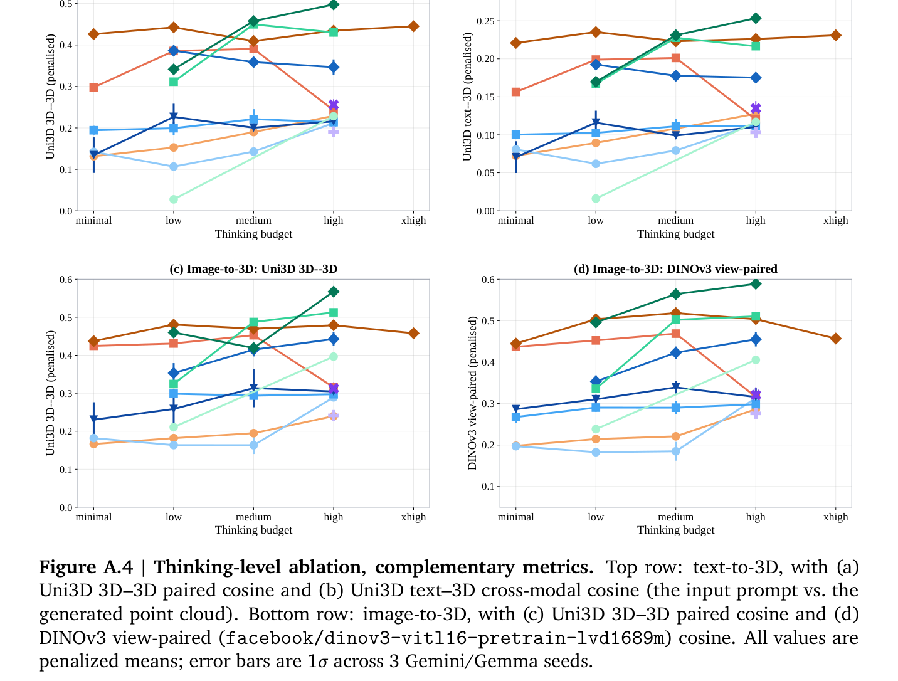

**Caption:** Figure A.4 | Thinking-level ablation, complementary metrics. Top row: text-to-3D, with (a) Uni3D 3D–3D paired cosine and (b) Uni3D text–3D cross-modal cosine (the input prompt vs. the generated point cloud). Bottom row: image-to-3D, with (c) Uni3D 3D–3D paired cosine and (d) DINOv3 view-paired (facebook/dinov3-vitl16-pretrain-lvd1689m) cosine. All values are penalized means; error bars are $1\sigma$ across 3 Gemini/Gemma seeds.

**Caption[CN]:** 图 A.4 | 思考水平消融实验：互补指标分析。顶部一行展示 Text-to-3D 赛道：(a) Uni3D 3D–3D 配对余弦相似度；(b) Uni3D 文本–3D 跨模态余弦相似度（输入提示词相对于生成点云）。底部一行展示 Image-to-3D 赛道：(c) Uni3D 3D–3D 配对余弦相似度；(d) DINOv3 视角配对（facebook/dinov3-vitl16-pretrain-lvd1689m）余弦相似度。所有数值均为惩罚均值；误差棒表示跨 3 个 Gemini/Gemma 随机种子的 $1\sigma$ 标准差。

> <span style="color:#3B82F6"><strong>Para. 1:</strong></span> Figure A.4 extends the single-turn ablation analysis to pure 3D point-cloud and self-supervised vision representations. The trends strictly mirror the SigLIP-2 findings: on text-to-3D, Uni3D 3D–3D (panel a) and cross-modal text–3D (panel b) show dramatic improvements for lightweight models (Flash Lite, Haiku) as thinking increases from minimal to high, while frontier models remain flat. On image-to-3D, DINOv3 (panel d) tracks Uni3D geometry closely, showing that test-time scaling directly produces more coherent 3D surfaces and reduces floating artifacts.

> <span style="color:#F59E0B"><strong>Para. 1[CN]:</strong></span> 图 A.4 将单轮消融分析扩展至纯 3D 点云与自监督视觉表征。其趋势与 SigLIP-2 的发现高度吻合：在 Text-to-3D 上，随着思考预算从 minimal 增加至 high，轻量级模型（Flash Lite、Haiku）在 Uni3D 3D–3D（面板 a）和跨模态文本–3D（面板 b）上均取得了显著提升，而前沿模型则保持平坦。在 Image-to-3D 上，DINOv3（面板 d）与 Uni3D 几何指标紧密同向变动，表明测试期扩展能直接促使模型生成更连贯的 3D 表面，并减少部件悬浮的几何瑕疵。

### A.7. Multi-View Image Budget Ablation

### Table A.4. Image-to-3D 多视角参考输入消融实验

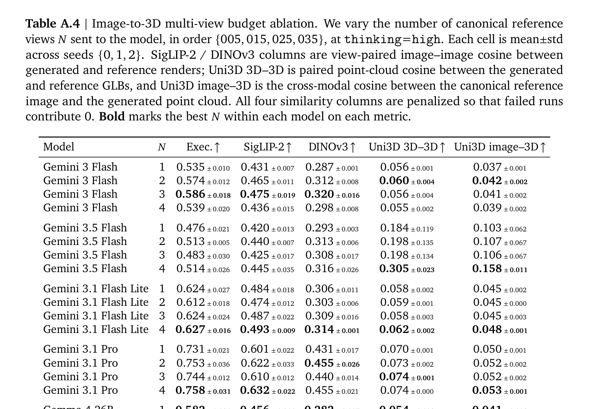

| Model | $N$ | Exec. ↑ | SigLIP-2 ↑ | DINOv3 ↑ | Uni3D 3D–3D ↑ | Uni3D image–3D ↑ |
|---|---|---|---|---|---|---|
| Gemini 3 Flash | 1 | 0.535 ± 0.010 | 0.431 ± 0.007 | 0.287 ± 0.001 | 0.056 ± 0.001 | 0.037 ± 0.001 |
| Gemini 3 Flash | 2 | 0.574 ± 0.012 | 0.465 ± 0.011 | 0.312 ± 0.008 | **0.060 ± 0.004** | **0.042 ± 0.002** |
| Gemini 3 Flash | 3 | **0.586 ± 0.018** | **0.475 ± 0.019** | **0.320 ± 0.016** | 0.056 ± 0.004 | 0.041 ± 0.002 |
| Gemini 3 Flash | 4 | 0.539 ± 0.020 | 0.436 ± 0.015 | 0.298 ± 0.008 | 0.055 ± 0.002 | 0.039 ± 0.002 |
| Gemini 3.5 Flash | 1 | 0.476 ± 0.021 | 0.420 ± 0.013 | 0.293 ± 0.003 | 0.184 ± 0.119 | 0.103 ± 0.062 |
| Gemini 3.5 Flash | 2 | 0.513 ± 0.005 | 0.440 ± 0.007 | 0.313 ± 0.006 | 0.198 ± 0.135 | 0.107 ± 0.067 |
| Gemini 3.5 Flash | 3 | 0.483 ± 0.030 | 0.425 ± 0.017 | 0.308 ± 0.017 | 0.198 ± 0.134 | 0.106 ± 0.067 |
| Gemini 3.5 Flash | 4 | **0.514 ± 0.026** | **0.445 ± 0.035** | **0.316 ± 0.026** | **0.305 ± 0.023** | **0.158 ± 0.011** |
| Gemini 3.1 Flash Lite | 1 | 0.624 ± 0.027 | 0.484 ± 0.018 | 0.306 ± 0.011 | 0.058 ± 0.002 | 0.045 ± 0.002 |
| Gemini 3.1 Flash Lite | 2 | 0.612 ± 0.018 | 0.474 ± 0.012 | 0.303 ± 0.006 | 0.059 ± 0.001 | 0.045 ± 0.000 |
| Gemini 3.1 Flash Lite | 3 | 0.624 ± 0.024 | 0.487 ± 0.022 | 0.309 ± 0.016 | 0.058 ± 0.003 | 0.045 ± 0.003 |
| Gemini 3.1 Flash Lite | 4 | **0.627 ± 0.016** | **0.493 ± 0.009** | **0.314 ± 0.001** | **0.062 ± 0.002** | **0.048 ± 0.001** |
| Gemini 3.1 Pro | 1 | 0.731 ± 0.021 | 0.601 ± 0.022 | 0.431 ± 0.017 | 0.070 ± 0.001 | 0.050 ± 0.001 |
| Gemini 3.1 Pro | 2 | 0.753 ± 0.036 | 0.622 ± 0.033 | **0.455 ± 0.026** | 0.073 ± 0.002 | 0.052 ± 0.002 |
| Gemini 3.1 Pro | 3 | 0.744 ± 0.012 | 0.610 ± 0.012 | 0.440 ± 0.014 | **0.074 ± 0.001** | 0.052 ± 0.002 |
| Gemini 3.1 Pro | 4 | **0.758 ± 0.031** | **0.632 ± 0.022** | **0.455 ± 0.021** | **0.074 ± 0.000** | **0.053 ± 0.001** |
| Gemma 4 26B | 1 | **0.582 ± 0.021** | **0.456 ± 0.011** | **0.282 ± 0.007** | **0.054 ± 0.002** | **0.041 ± 0.002** |
| Gemma 4 26B | 2 | 0.561 ± 0.077 | 0.437 ± 0.061 | 0.266 ± 0.040 | 0.052 ± 0.005 | 0.040 ± 0.004 |
| Gemma 4 26B | 3 | 0.550 ± 0.035 | 0.426 ± 0.026 | 0.263 ± 0.014 | 0.050 ± 0.006 | 0.038 ± 0.003 |
| Gemma 4 26B | 4 | 0.574 ± 0.031 | 0.449 ± 0.022 | 0.276 ± 0.014 | 0.053 ± 0.002 | 0.040 ± 0.002 |
| Gemma 4 31B | 1 | 0.635 ± 0.031 | 0.501 ± 0.028 | 0.325 ± 0.026 | 0.062 ± 0.002 | 0.046 ± 0.001 |
| Gemma 4 31B | 2 | **0.662 ± 0.036** | **0.524 ± 0.030** | **0.341 ± 0.019** | **0.066 ± 0.002** | **0.049 ± 0.002** |
| Gemma 4 31B | 3 | 0.637 ± 0.017 | 0.504 ± 0.013 | 0.332 ± 0.009 | 0.062 ± 0.003 | 0.046 ± 0.001 |
| Gemma 4 31B | 4 | 0.605 ± 0.039 | 0.485 ± 0.033 | 0.321 ± 0.023 | 0.061 ± 0.004 | 0.045 ± 0.002 |

**Caption:** Table A.4 | Image-to-3D multi-view budget ablation. We vary the number of canonical reference views $N$ sent to the model, in order $\{005, 015, 025, 035\}$, at thinking=high. Each cell is mean$\pm$std across seeds $\{0, 1, 2\}$. SigLIP-2 / DINOv3 columns are view-paired image–image cosine between generated and reference renders; Uni3D 3D–3D is paired point-cloud cosine between the generated and reference GLBs, and Uni3D image–3D is the cross-modal cosine between the canonical reference image and the generated point cloud. All four similarity columns are penalized so that failed runs contribute 0. Bold marks the best $N$ within each model on each metric.

**Caption[CN]:** 表 A.4 | Image-to-3D 多视角输入预算消融实验。在 thinking=high 设定下，按规范顺序 $\{005, 015, 025, 035\}$ 扫描向模型输入的规范参考视角数量 $N$。每个单元格为跨随机种子 $\{0, 1, 2\}$ 的均值 $\pm$ 标准差。SigLIP-2 / DINOv3 列为生成渲染图与参考渲染图之间的视角配对图像余弦相似度；Uni3D 3D–3D 为生成与参考 GLB 之间的配对点云余弦相似度；Uni3D image–3D 为规范参考图像与生成点云之间的跨模态余弦相似度。四项相似度指标均采用惩罚均值，执行失败样本记为 0。粗体标出各模型在各项指标上的最优 $N$。

> <span style="color:#3B82F6"><strong>Para. 1:</strong></span> Table A.4 details the multi-view ablation across six backbones. As capacity drops, the optimal number of input views shifts left: Gemini 3.1 Pro reliably benefits from $N=4$ (0.758 Exec., 0.632 SigLIP-2), whereas Gemma 4 26B peaks at $N=1$ and degrades with additional views. This demonstrates an "information absorption ceiling": smaller models suffer from prompt clutter and distraction when overloaded with multi-view tokens, whereas frontier models successfully fuse multi-view constraints into spatial coherence.

> <span style="color:#F59E0B"><strong>Para. 1[CN]:</strong></span> 表 A.4 详细列出了六个骨干模型上的多视角消融数据。随着模型容量下降，最佳输入视角数量逐步向左偏移：Gemini 3.1 Pro 在 $N=4$ 时表现最佳（可执行率 0.758，SigLIP-2 0.632），而 Gemma 4 26B 则在 $N=1$ 时达到峰值，并在视角增加时出现性能回退。这揭示了“信息吸收上限”现象：较小模型在被大量多视角视觉 token 淹没时会出现上下文冗余与注意力分散，而前沿大模型则能够成功将多视角几何约束融合为空间连贯的三维实体。

## Appendix B. Evaluation Metric Implementation

> <span style="color:#3B82F6"><strong>Para. 1:</strong></span> Section 3.4 defines the metric suite abstractly. This appendix records the released implementation. We reuse the notation of Section 3.1: a policy $\pi$ produces a script $f_\pi = \pi(c)$, which the deterministic Blender 5.0 operator $\mathcal{E}$ compiles into a mesh $M_\pi = \mathcal{E}(f_\pi)$. Our render driver runs $f_\pi$ in a fresh Blender 5.0 subprocess (wall-clock budget 240 s) and renders $M_\pi$ from the four canonical views $\mathcal{V} = \{45^\circ, 135^\circ, 225^\circ, 315^\circ\}$ matching frames 5/15/25/35 of the reference Infinigen turntable. We write $r_v(M_\pi)$ for the render of $M_\pi$ at view $v$, $g_v$ for the corresponding reference Infinigen render, and use the per-instance subscript $i$ over $N = 212$ test instances.

> <span style="color:#F59E0B"><strong>Para. 1[CN]:</strong></span> 正文第 3.4 节对评估指标套件进行了抽象定义。本附录记录公开发布的代码实现细节。我们沿用第 3.1 节的数学符号：策略模型 $\pi$ 生成脚本 $f_\pi = \pi(c)$，由确定性 Blender 5.0 算子 $\mathcal{E}$ 将其编译为 3D 网格 $M_\pi = \mathcal{E}(f_\pi)$。我们的渲染驱动程序在全新的 Blender 5.0 子进程中运行 $f_\pi$（物理挂钟超时预算为 240 秒），并从与参考 Infinigen 旋转转盘第 5/15/25/35 帧对应的四个规范视角 $\mathcal{V} = \{45^\circ, 135^\circ, 225^\circ, 315^\circ\}$ 渲染 $M_\pi$。我们用 $r_v(M_\pi)$ 表示 $M_\pi$ 在视角 $v$ 下的渲染图，用 $g_v$ 表示对应的参考 Infinigen 渲染真值，并对 $N = 212$ 个测试实例使用下标 $i$。

### B.1. Executability

> <span style="color:#3B82F6"><strong>Para. 1:</strong></span> The executability indicator for instance $i$ is defined as:

> <span style="color:#F59E0B"><strong>Para. 1[CN]:</strong></span> 实例 $i$ 的代码可执行率指示变量定义为：

$$
\text{Exec}_i = \mathbb{I}\left[\mathcal{E}(f_{\pi, i}) \neq \emptyset \wedge |\text{Mesh}(\mathcal{E}(f_{\pi, i}))| \ge 1\right]
$$

> <span style="color:#3B82F6"><strong>Para. 2:</strong></span> where $\text{Mesh}(\cdot)$ counts mesh objects in the post-execution scene and the 240 s timeout maps to $\mathcal{E}(f_\pi) = \emptyset$. The aggregate rate is $\text{Exec} = N^{-1}\sum_{i=1}^N \text{Exec}_i$. Each failure is bucketed into one mutually exclusive stage — ERR_EXEC (Python exception), ERR_NO_MESH (no mesh in the resulting scene), ERR_RENDER (one of the four views failed to render), or ERR_TIMEOUT (240 s budget exceeded). The metric script also reports recurring exception fingerprints (a hash of the error type + a truncated traceback) to diagnose systematic API mismatches, such as removed Blender 4.x calls.

> <span style="color:#F59E0B"><strong>Para. 2[CN]:</strong></span> 其中 $\text{Mesh}(\cdot)$ 统计脚本执行后 Blender 场景中的网格物体数量，240 秒超时自动映射为 $\mathcal{E}(f_\pi) = \emptyset$。总体可执行率为 $\text{Exec} = N^{-1}\sum_{i=1}^N \text{Exec}_i$。每次执行失败均被归入四个互斥阶段之一：ERR_EXEC（Python 语法或运行时异常）、ERR_NO_MESH（执行完成但场景中无有效网格）、ERR_RENDER（四个规范视角之一渲染崩溃）或 ERR_TIMEOUT（超过 240 秒运行时间预算）。评估脚本还记录重复出现的异常指纹（错误类型哈希 + 截断的回溯信息），以诊断系统性的 API 不匹配（如调用了 Blender 5.0 中已移除的 4.x 旧版接口）。

### B.2. Image-Grounded Similarity (Image-to-3D Track)

> <span style="color:#3B82F6"><strong>Para. 1:</strong></span> For each view we pair $r_v(M_{\pi, i})$ with $g_v$ at the same camera and compute cosine similarity under image encoder $\psi$:

> <span style="color:#F59E0B"><strong>Para. 1[CN]:</strong></span> 对于每个视角，我们将相同摄像机机位下的 $r_v(M_{\pi, i})$ 与 $g_v$ 配对，并利用图像编码器 $\psi$ 计算余弦相似度：

$$
\sigma_{i, v}^\psi = \cos\left(\psi(r_v(M_{\pi, i})), \psi(g_v)\right), \quad \sigma_i^\psi = \frac{1}{|\mathcal{V}|}\sum_{v \in \mathcal{V}}\sigma_{i, v}^\psi
$$

> <span style="color:#3B82F6"><strong>Para. 2:</strong></span> instantiated with $\psi_{\text{SigLIP-2}}$ (Tschannen et al., 2025) (google/siglip2-so400m-patch16-naflex, image branch — semantic correspondence) and $\psi_{\text{DINOv3}}$ (Siméoni et al., 2025) (facebook/dinov3-vitl16-pretrain-lvd1689m ViT-L/16 — shape and structural correspondence; less sensitive to surface appearance, which is desirable here because generated meshes are rendered untextured against a neutral background while the reference renders are full-color). Reporting both columns separately exposes the shape-vs-semantic trade-off (cf. Gemini 3 Flash vs Gemini 3.1 Flash Lite in Table A.1). We omit the $\max_v$ aggregation: under view-paired comparison, it reduces to “the easiest viewpoint to match”, which a model can satisfy without recovering the overall geometry.

> <span style="color:#F59E0B"><strong>Para. 2[CN]:</strong></span> 分别实例化为 $\psi_{\text{SigLIP-2}}$ (Tschannen et al., 2025)（google/siglip2-so400m-patch16-naflex 图像分支，衡量高层语义对应关系）与 $\psi_{\text{DINOv3}}$ (Siméoni et al., 2025)（facebook/dinov3-vitl16-pretrain-lvd1689m ViT-L/16 骨干，衡量形状与局部结构对应关系；对表面纹理变化不敏感，这在此处十分关键，因为生成的网格是在中性背景下无纹理渲染的，而参考真值渲染图带有完整彩色纹理）。分别独立汇报这两项指标清晰揭示了“形状 vs 语义”之间的权衡（例如表 A.1 中 Gemini 3 Flash 与 Gemini 3.1 Flash Lite 的对比）。我们去除了 $\max_v$ 聚合方式：在视角配对对比中，取最大值往往会退化为“仅匹配最容易生成的一个视角”，模型无需恢复完整 3D 几何即可钻营该指标。

### B.3. Text-Render Similarity (Text-to-3D Track)

> <span style="color:#3B82F6"><strong>Para. 1:</strong></span> The text-to-3D track replaces $\psi(g_v)$ with the SigLIP-2 text embedding of the prompt $c_i$, with the same image branch $\phi_{\text{img}} = \psi_{\text{SigLIP-2}}$ and matched text branch $\phi_{\text{txt}}$:

> <span style="color:#F59E0B"><strong>Para. 1[CN]:</strong></span> Text-to-3D 赛道将 $\psi(g_v)$ 替换为提示词 $c_i$ 的 SigLIP-2 文本嵌入，配合相同的图像分支 $\phi_{\text{img}} = \psi_{\text{SigLIP-2}}$ 及相匹配的文本分支 $\phi_{\text{txt}}$：

$$
s_i^{\text{mean}} = \frac{1}{|\mathcal{V}|}\sum_{v \in \mathcal{V}}\cos\left(\phi_{\text{img}}(r_v(M_{\pi, i})), \phi_{\text{txt}}(c_i)\right), \quad s_i^{\text{max}} = \max_{v \in \mathcal{V}}\cos\left(\phi_{\text{img}}(r_v(M_{\pi, i})), \phi_{\text{txt}}(c_i)\right)
$$

> <span style="color:#3B82F6"><strong>Para. 2:</strong></span> We additionally report a GT baseline computed by applying the same metric to the four reference Infinigen renders for the same prompts; this is a soft ceiling that no model can be expected to substantially exceed without exploiting prompt-level shortcuts.

> <span style="color:#F59E0B"><strong>Para. 2[CN]:</strong></span> 我们还额外报告了一个真值（GT）基线，它是通过将相同指标应用于相同提示词下的四个参考 Infinigen 渲染图计算得出的；这是一个软上限，任何模型在不利用提示词捷径的情况下均无法显著超越该上限。

### B.4. 3D-Shape Similarity

> <span style="color:#3B82F6"><strong>Para. 1:</strong></span> We additionally score each executable instance directly on the exported GLB. Let $P_{\pi, i} = \text{sample}_K(M_{\pi, i})$ and $P_i^* = \text{sample}_K(M_i^*)$ denote $K = 8192$ surface-sampled points (uniform area sampling), each independently centered at the centroid and rescaled to the unit bounding sphere.

> <span style="color:#F59E0B"><strong>Para. 1[CN]:</strong></span> 我们还直接对导出的 GLB 文件对每个可执行实例进行几何评分。令 $P_{\pi, i} = \text{sample}_K(M_{\pi, i})$ 与 $P_i^* = \text{sample}_K(M_i^*)$ 表示表面采样的 $K = 8192$ 个点（按网格表面积均匀采样），且每个点云均独立平移至质心并归一化缩放至单位包围球中。

> <span style="color:#3B82F6"><strong>Para. 2:</strong></span> Chamfer Distance. We report symmetric squared Chamfer (Fan et al., 2017) with 4-yaw alignment to absorb canonical-orientation mismatch:

> <span style="color:#F59E0B"><strong>Para. 2[CN]:</strong></span> 倒角距离（Chamfer Distance）。我们报告具有 4-yaw 航向角对齐的对称平方 Chamfer 距离 (Fan et al., 2017)，以消除世界坐标系规范朝向的不一致：

$$
\text{CD}_i = \min_{\theta \in \{0^\circ, 90^\circ, 180^\circ, 270^\circ\}} \left[ \frac{1}{K}\sum_{p \in P_i^*}\min_{q \in R_\theta P_{\pi, i}}\|p - q\|_2^2 + \frac{1}{K}\sum_{q \in R_\theta P_{\pi, i}}\min_{p \in P_i^*}\|p - q\|_2^2 \right]
$$

> <span style="color:#3B82F6"><strong>Para. 3:</strong></span> where $R_\theta$ rotates around the world $z$-axis and nearest-neighbor queries use cKDTree.

> <span style="color:#F59E0B"><strong>Para. 3[CN]:</strong></span> 其中 $R_\theta$ 表示绕世界坐标系 $z$ 轴的旋转变换，最近邻搜索采用 cKDTree 算法高效求解。

> <span style="color:#3B82F6"><strong>Para. 4:</strong></span> Uni3D 3D–3D and cross-modal cosine. Following Uni3D (Zhou et al., 2024), we encode the (xyz, rgb) point cloud with the Uni3D-Giant point encoder $\eta_{\text{pc}}$ (BAAI/Uni3D: modelzoo/uni3d-g; EVA-Giant backbone, $K = 8192$ points + 3-channel RGB) into the 1024-dim CLIP-aligned latent shared with the EVA02-E-14-plus text and image branches $\eta_{\text{txt}}, \eta_{\text{img}}$ (laion2b_s9b_b144k). The two reported similarities are:

> <span style="color:#F59E0B"><strong>Para. 4[CN]:</strong></span> Uni3D 3D–3D 与跨模态余弦相似度。遵循 Uni3D (Zhou et al., 2024)，我们使用 Uni3D-Giant 点云编码器 $\eta_{\text{pc}}$（BAAI/Uni3D: modelzoo/uni3d-g；EVA-Giant 骨干网络，$K = 8192$ 个点 + 3 通道 RGB）将点云编码为与 EVA02-E-14-plus 文本和图像分支 $\eta_{\text{txt}}, \eta_{\text{img}}$（laion2b_s9b_b144k）共享的 1024 维 CLIP 对齐潜空间。报告的两项相似度为：

$$
u_i^{\text{3D}} = \cos\left(\eta_{\text{pc}}(P_{\pi, i}), \eta_{\text{pc}}(P_i^*)\right), \quad u_i^{\text{xm}} = \begin{cases} \cos\left(\eta_{\text{pc}}(P_{\pi, i}), \eta_{\text{txt}}(c_i)\right) & \text{text-to-3D}, \\ \cos\left(\eta_{\text{pc}}(P_{\pi, i}), \eta_{\text{img}}(g_{45^\circ, i})\right) & \text{image-to-3D}. \end{cases}
$$

### B.5. Conditional vs. Penalized Aggregation

> <span style="color:#3B82F6"><strong>Para. 1:</strong></span> For any per-instance quality metric $\mathcal{D}_i \in \{s_i^{\text{mean}}, s_i^{\text{max}}, \sigma_i^{\text{SigLIP-2}}, \sigma_i^{\text{DINOv3}}, \text{CD}_i, u_i^{\text{3D}}, u_i^{\text{xm}}\}$ we report two cross-instance aggregations:

> <span style="color:#F59E0B"><strong>Para. 1[CN]:</strong></span> 对于任意单实例质量指标 $\mathcal{D}_i \in \{s_i^{\text{mean}}, s_i^{\text{max}}, \sigma_i^{\text{SigLIP-2}}, \sigma_i^{\text{DINOv3}}, \text{CD}_i, u_i^{\text{3D}}, u_i^{\text{xm}}\}$，我们报告两种跨实例聚合结果：

$$
\mathcal{D}^{\text{cond}} = \frac{\sum_{i=1}^N \text{Exec}_i \cdot \mathcal{D}_i}{\sum_{i=1}^N \text{Exec}_i}, \quad \mathcal{D}^{\text{pen}} = \frac{1}{N}\sum_{i=1}^N \text{Exec}_i \cdot \mathcal{D}_i
$$

> <span style="color:#3B82F6"><strong>Para. 2:</strong></span> with the convention that for the lower-is-better Chamfer Distance, $\text{CD}^{\text{pen}}$ assigns the run-relative penalty $1.5 \cdot \max_{i: \text{Exec}_i = 1} \text{CD}_i$ (rather than 0) to failed instances, keeping the metric finite while preserving its lower-is-better semantics. The conditional form isolates geometric quality from code reliability; the penalized form contributes 0 (or the Chamfer penalty) for failed instances, so a model is never rewarded for suppressing weak outputs. Headline numbers in Table A.1 are penalized; ablations vary by what is more informative and state the choice per table.

> <span style="color:#F59E0B"><strong>Para. 2[CN]:</strong></span> 其中，针对越小越优的 Chamfer 倒角距离，$\text{CD}^{\text{pen}}$ 为执行失败的实例赋予运行相关的惩罚项 $1.5 \cdot \max_{i: \text{Exec}_i = 1} \text{CD}_i$（而非赋 0），在保持指标有限值的同时维系了“越小越好”的数学语义。条件形式将几何质量与代码可执行可靠性解耦；惩罚形式对失败实例赋予 0（或 Chamfer 惩罚值），确保模型绝不会因为抑制低质量输出而获得虚高收益。表 A.1 中的主实验数据均为惩罚均值；消融实验根据信息直观度选择，并在各表格中明确标注。

## Appendix C. Inference Setup and Failure Taxonomy

### C.1. Text-to-3D System Prompt

> <span style="color:#3B82F6"><strong>Para. 1:</strong></span> Below is the production system prompt used for the Text-to-3D track across all evaluated Vision-Language Models. The prompt enforces strict output constraints (pure Python code with no markdown formatting or natural language commentary) to enable automated compilation in Blender 5.0.

> <span style="color:#F59E0B"><strong>Para. 1[CN]:</strong></span> 以下是所有参评视觉语言模型在 Text-to-3D 赛道中使用的生产级系统提示词。该提示词强制执行极严格的输出格式约束（纯 Python 代码，严禁包含任何 Markdown 标记或自然语言注释前后缀），以确保可在 Blender 5.0 中实现无缝自动化编译执行。

```text
Text-to-3D system prompt
You are a procedural 3D modeling expert. Given a text description of an object, you produce a single self-contained Python script that generates that object in Blender 5.0.

# Output format (HARD constraint – read carefully)
Your entire response will be saved verbatim into a .py file and executed by Blender 5.0. ANY non-Python content anywhere in the response will break that file. Treat this as a strict machine-to-machine contract, not a chat reply.
Your response MUST consist entirely of Python source code. Specifically:
• Do NOT emit Markdown code fences anywhere – no opening ```python, no opening ```py, no opening ```, no closing ``` at the end. Not even one. Not even on a single line by itself.
• Do NOT prepend any prose ("Here is the code", "I will create", "This script generates", "Sure", etc.).
• Do NOT append any prose ("Hope this helps", "Let me know if", "Note that...", etc.).
• Do NOT include HTML/XML tags, bullet points, headings, or any formatting other than plain Python.
• The very first character of your response must be the first character of valid Python source (typically i of import bpy, or # of a top-level comment).
• The very last character of your response must be the last character of the Python script – never a backtick.

Self-check before answering: if I save your response to out.py and run:
python -c "import ast; ast.parse(open('out.py').read())"
it must succeed without modification.

# Target environment
• Blender version: 5.0. Use Blender 5.0 Python API (bpy, bmesh, mathutils).
• The script will be executed via blender --background --python <file> or pasted into the Blender Text Editor.
• Allowed libraries:
  – Blender-bundled: bpy, bmesh, mathutils.
  – Python stdlib: math, random, itertools, collections, functools, dataclasses, enum, typing.
  – Numerical: numpy, scipy.
• Do NOT import anything that requires network access, GUI interaction, or external file reads (no os, sys.path hacks, requests, PIL, cv2, ...).

# Code requirements
• Produce ONE final 3D object (or coherent assembly) that corresponds to the description.
• Generate ONLY the described object – NO ground plane, NO backdrop, NO skybox, NO environmental props, NO decorative context. No grass under the chair, no pedestal beneath the figurine, no "studio floor" plane. After your script finishes, the scene must contain only your geometry, sitting at the origin.
• Push for as much geometric detail as the description. If the prompt mentions ribs, slats, vents, handles, fins, scales, leaves, rivets, pleating, segmentation, or ornament, model them as real geometry rather than as flat surfaces with a label. Use subdivision surface, bevel, array, mirror, and screw modifiers when they are the right tool, and drop into bmesh for finer features. Aim for high fidelity but keep meshes within a few hundred thousand vertices – the renderer has a 240 s budget per script.
• Prefer procedural construction: parametric loops, bmesh operators, modifiers, and array/mirror operations. Avoid hard-coded long vertex lists.
• At the start of the script, clear the default scene (delete the default cube, camera, and light if present) so that the output scene contains only your generated geometry.
• Leave geometry untextured.
• No need to save the .blend file. Do NOT trigger a render. Do NOT call sys.exit or bpy.ops.wm.quit_blender.
• If the description is ambiguous on dimensions, proportions, or stylistic details, choose reasonable defaults silently and proceed. Never ask clarifying questions.
• The script must terminate normally; final geometry must exist in bpy.data.objects when execution completes.
```

### C.2. Image-to-3D System Prompt

> <span style="color:#3B82F6"><strong>Para. 1:</strong></span> The Image-to-3D system prompt is tailored for multi-view visual conditioning. Models are instructed to cross-reference multiple views to infer hidden geometry, resolve depth ambiguity, and reconstruct untextured, watertight 3D meshes matching the reference object.

> <span style="color:#F59E0B"><strong>Para. 1[CN]:</strong></span> Image-to-3D 系统提示词专为多视角视觉输入量身定制。提示词指导模型交叉比对多个输入视角以推断被遮挡的不可见几何体、解决深度歧义，并重建出与参考目标精确对齐的无纹理流形 3D 网格。

```text
Image-to-3D system prompt
You are a procedural 3D modeling expert. Given one or more reference images of a 3D object, you produce a single self-contained Python script that reconstructs the depicted object in Blender 5.0.

# Input format
You will receive one or more reference images of a single target object as part of the user message. The images may be:
• A single view (front, side, 3/4, etc.) – infer unseen sides by symmetry and category priors.
• Multiple views of the SAME object (e.g. front + side + back, or turntable frames). Treat them as multi-view evidence of one object, not as separate objects. Cross-reference views to resolve depth, proportions, and occluded structure.
• A mix of full-object shots and close-up detail crops. Use the close-ups to refine local geometry (handles, vents, ornament) of the same object.
If the images appear to depict different objects, model the most prominent / first-shown object and silently ignore the rest.

# Output format (HARD constraint – read carefully)
Your entire response will be saved verbatim into a .py file and executed by Blender 5.0. ANY non-Python content anywhere in the response will break that file. Pure Python source only: no markdown fences, no prose preamble, no epilogue.

# Code requirements
• Produce ONE final 3D object (or coherent assembly) that corresponds to the object shown in the reference images.
• Match the reference as faithfully as the geometry allows: overall silhouette, part proportions, count and placement of repeating elements (e.g. number of legs, petals, slats), and characteristic curvature. Reproduce exact counts when discernible.
• Push for as much geometric detail as the images warrant: ribs, slats, vents, handles, fins, scales, leaves, rivets, pleating, or ornaments.
• Exploit symmetry when the reference supports it (mirror modifier for bilateral objects, array/spin for radial ones).
• Clear the default scene at the start; leave geometry untextured; do not save .blend; do not render; do not call sys.exit.
```

### C.3. Multi-Turn Error-Feedback User Template

> <span style="color:#3B82F6"><strong>Para. 1:</strong></span> When an initial script execution fails, the multi-turn loop provides the model with the traceback and execution diagnostics using the template below. The request is entirely stateless:

> <span style="color:#F59E0B"><strong>Para. 1[CN]:</strong></span> 当首次脚本执行失败时，多轮重试闭环利用以下模板向模型提供报错回溯与执行诊断信息。该请求完全采用无状态设计：

```text
Multi-turn user template
Your previous Blender 5.0 Python script for the task below FAILED to produce a valid render. Read the error carefully and output a corrected, complete script.

# Original task
{original_task_block}

# Your previous code
{prev_code}

# Execution result
• status: {status}
• meshes produced: {n_meshes}
• views rendered: {n_views_rendered}/4
• attempt: {attempt_num} of {max_attempts}

# Error / diagnostic output (from Blender stderr/runtime)
{error_text}

# Your task
Fix the bug and output the COMPLETE corrected Python script. Do NOT output a diff, patch, or explanation. Pure Python source only.
Common failure modes to consider: ERR_EXEC (Blender 5.0 API mismatch, missing import, wrong arg name); ERR_NO_MESH (only curves/empties remain — ensure at least one MESH object); ERR_RENDER (NaN coordinates); ERR_TIMEOUT (runaway loops, heavy booleans). Do not just retry the same approach.
```

### C.4. Visual Self-Critique Prompts

> <span style="color:#3B82F6"><strong>Para. 1:</strong></span> For baseline-executable instances, the visual self-critique loop renders the generated mesh from 4 canonical views and prompts the VLM to identify discrepancies against the prompt or reference images. The model can either accept the render (`NEEDS_FIX:NO`) or provide a structured critique and revised code (`NEEDS_FIX:YES`).

> <span style="color:#F59E0B"><strong>Para. 1[CN]:</strong></span> 对于基线可成功执行的实例，视觉自反思闭环从 4 个规范视角渲染生成网格，并提示 VLM 审查其与文本描述或参考图像之间的视觉差异。模型可以选择接受现有渲染结果（`NEEDS_FIX:NO`），或者输出结构化评估及修正后的完整代码（`NEEDS_FIX:YES`）。

```text
Visual self-critique system prompt — text-to-3D
You are a 3D modeling expert reviewing your own previous work in Blender 5.0. You will be given a natural-language description, the Python script you previously wrote, up to 4 rendered views, and an iteration counter.

# Priority issues (in this order)
1. Missing parts;
2. Floating / disconnected pieces;
3. Wrong proportions;
4. Misalignment;
5. Missing geometric detail;
6. Wrong overall shape.

# Response format (HARD constraint)
Either NEEDS_FIX:NO + a one-sentence <assessment> (Pattern A, no code), or NEEDS_FIX:YES + a ≤100-word bulleted <assessment> + a complete corrected Python script in <code>...</code> (Pattern B).

# Conservatism bias
If only minor proportions are off but the object is recognizable and complete, prefer NEEDS_FIX:NO. If the render shows almost nothing, say NEEDS_FIX:YES and rewrite from scratch.
```

### C.5. Text-to-Image Generation Meta-Prompt

> <span style="color:#3B82F6"><strong>Para. 1:</strong></span> In the two-stage Text-to-Image-to-3D pipeline, a frontier text-to-image generator is prompted to synthesize a clean, studio-lit reference photo using this meta-prompt:

> <span style="color:#F59E0B"><strong>Para. 1[CN]:</strong></span> 在两阶段 Text-to-Image-to-3D 管线中，利用以下元提示词指导前沿文生图模型合成一张干净、具有摄影棚布光效果的单参考图像：

```text
Text-to-image meta-prompt
Generate ONE photographic reference image of the described 3D object, suitable as input for 3D reconstruction.

# Required style
• Single object, centered, occupying ~70–80% of the frame.
• Plain neutral background (light gray, off-white, or soft gradient). No scene, no environment, no floor, no horizon.
• Soft, even, diffuse lighting from above-front; no harsh shadows.
• Three-quarter front view (~30–45° around vertical axis, ~15° above eye level). Clear 3D form with visible depth.
• Neutral, true-to-life colors; no stylization; no artistic filters.
• No text, labels, captions, logos, rulers; no people, animals, or hands.
• Photorealistic studio product-photography aesthetic.

# Object to render
{description}
```

### C.6. Use of Agent Harnesses

> <span style="color:#3B82F6"><strong>Para. 1:</strong></span> The coding-agent harness regime wraps models in their native provider CLI environments:
>
> - Claude Sonnet 4.6 and Opus 4.7 are deployed under Claude Code (`claude` CLI).
> - GPT-5.4, GPT-5.4-mini, and GPT-5.5 are deployed under OpenAI Codex CLI (`codex` CLI).
> - Gemini 3 Flash, Flash Lite, and 3.1 Pro are deployed under Google `gemini-cli`.
> - Gemini 3.5 Flash is wrapped in Antigravity CLI.

> <span style="color:#F59E0B"><strong>Para. 1[CN]:</strong></span> 代码智能体底座运行框架将模型置于各自服务商的原生命令行环境之中：
>
> - Claude Sonnet 4.6 与 Opus 4.7 在 Claude Code（`claude` CLI）下部署运行。
> - GPT-5.4、GPT-5.4-mini 与 GPT-5.5 在 OpenAI Codex CLI（`codex` CLI）下部署运行。
> - Gemini 3 Flash、Flash Lite 与 3.1 Pro 在 Google `gemini-cli` 下部署运行。
> - Gemini 3.5 Flash 则运行在 Antigravity CLI 下。

> <span style="color:#3B82F6"><strong>Para. 2:</strong></span> Each harness is provided with an empty `out.py` and a `run_blender.sh` execution script. Within a wall-clock budget of 600–900 s, the agent iteratively writes code, runs Blender in headless mode, inspects errors, and edits files. This regime directly benchmarks agentic autonomy against uniform single-shot generation.

> <span style="color:#F59E0B"><strong>Para. 2[CN]:</strong></span> 每个智能体底座均提供一个空的 `out.py` 文件和用于执行调用的 `run_blender.sh` 脚本。在 600–900 秒的物理挂钟时间预算内，智能体自主编写代码、在无头模式下调用 Blender 执行、检查标准错误回溯并修改文件。该设定直接衡量了完全智能体自主性与统一单轮生成之间的能力差异。

### C.7. Failure Taxonomy

> <span style="color:#3B82F6"><strong>Para. 1:</strong></span> Based on extensive manual audits of failed and degraded outputs, we establish a six-category failure taxonomy for procedural 3D modeling:
>
> - 1. Missing parts: Critical functional or semantic components are completely absent (e.g., a chair missing a backrest or legs).
> - 2. Floating / disconnected pieces: Individual components are generated in space without physical contact or structural joints, violating physical gravity and structural integrity.
> - 3. Wrong proportions: Extreme aspect-ratio distortions (e.g., legs that are ten times too thin or tables with razor-thin tops).
> - 4. Misalignment: Components are translated or rotated away from their intended mounting sockets (e.g., wheels placed above a vehicle chassis).
> - 5. Missing geometric detail: Fine-grained structures (ribs, slats, bevels, vents) described in the prompt are omitted in favor of crude bounding boxes.
> - 6. Wrong overall shape: The generated asset belongs to a completely different geometric category or degenerates into an uninterpretable blob.

> <span style="color:#F59E0B"><strong>Para. 1[CN]:</strong></span> 基于对失败和退化生成结果的广泛人工审查，我们构建了程序化 3D 建模的六大失败分类体系：
>
> - 1. 部件缺失（Missing parts）：关键的功能性或语义构件完全遗漏（例如椅子缺失靠背或椅腿）。
> - 2. 悬浮/断裂组件（Floating / disconnected pieces）：各个几何构件在三维空间中孤立生成，彼此之间缺乏物理接触或结构连接点，严重违背物理重力与结构完整性。
> - 3. 比例失调（Wrong proportions）：极端的长宽比几何失真（例如椅腿过细十倍，或桌面呈薄纸状）。
> - 4. 空间对齐错误（Misalignment）：构件发生平移或旋转错位，偏离了预期的装配嵌合槽位（例如车轮生成在汽车底盘上方）。
> - 5. 几何细节缺失（Missing geometric detail）：提示词中明确描述的精细结构（筋条、板条、倒角、通风孔等）被完全忽略，退化为粗糙的包围盒。
> - 6. 整体形状错误（Wrong overall shape）：生成的 3D 资产属于完全不同的几何类别，或严重退化为无法解释的畸形几何团块。

## Appendix D. Iterative Inference and Multi-Stage Pipelines

### D.1. Multi-Turn Error-Feedback Retry

> <span style="color:#3B82F6"><strong>Para. 1:</strong></span> Table D.1 reports executability lift, recovery decomposition, and — crucially — the change in penalized-mean quality across all 22 cells (11 models $\\times$ 2 tracks). Because the evaluation set is fixed, these deltas cleanly reflect overall benchmark improvement without set-shift artifacts. Per-row thinking level: high for Gemini/Gemma/GPT-5.5, medium for GPT-5.4-mini/GPT-5.4, low for Claude. Cost is the total dollar amount for baseline-failed instances only.

> <span style="color:#F59E0B"><strong>Para. 1[CN]:</strong></span> 表 D.1 报告了在全部 22 个测试单元（11 个模型 $\\times$ 2 条赛道）中的代码可执行率提升、恢复机制分解以及至关重要的惩罚均值质量变化量。由于评测实例集合完全固定，这些增量能够清晰反映整个基准的整体提升，消除了困扰条件均值对比的集合漂移偏差。各行对应的思考水平设定：Gemini/Gemma/GPT-5.5 为 high，GPT-5.4-mini/GPT-5.4 为 medium，Claude 为 low。成本为仅针对基线执行失败实例所花费的总美元金额。

### Table D.1. 多轮错误反馈重试（最多 3 次尝试）完整细分表

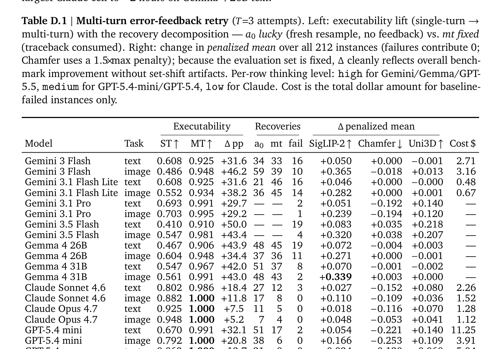

| Model | Task | ST Exec. ↑ | MT Exec. ↑ | Δ pp | a0 lucky | mt fixed | fail | Δ SigLIP-2 ↑ | Δ Chamfer ↓ | Δ Uni3D ↑ | Cost ($) |
|---|---|---|---|---|---|---|---|---|---|---|---|
| Gemini 3 Flash | text | 0.608 | 0.925 | +31.6 | 34 | 33 | 16 | +0.050 | +0.000 | −0.001 | 2.71 |
| Gemini 3 Flash | image | 0.486 | 0.948 | +46.2 | 59 | 39 | 10 | +0.365 | −0.018 | +0.013 | 3.16 |
| Gemini 3.1 Flash Lite | text | 0.608 | 0.925 | +31.6 | 21 | 46 | 16 | +0.046 | +0.000 | −0.000 | 0.48 |
| Gemini 3.1 Flash Lite | image | 0.552 | 0.934 | +38.2 | 36 | 45 | 14 | +0.282 | +0.000 | +0.001 | 0.67 |
| Gemini 3.1 Pro | text | 0.693 | 0.991 | +29.7 | — | — | 2 | +0.051 | −0.192 | +0.140 | — |
| Gemini 3.1 Pro | image | 0.703 | 0.995 | +29.2 | — | — | 1 | +0.239 | −0.194 | +0.120 | — |
| Gemini 3.5 Flash | text | 0.410 | 0.910 | +50.0 | — | — | 19 | +0.083 | +0.035 | +0.218 | — |
| Gemini 3.5 Flash | image | 0.547 | 0.981 | +43.4 | — | — | 4 | +0.320 | +0.038 | +0.207 | — |
| Gemma 4 26B | text | 0.467 | 0.906 | +43.9 | 48 | 45 | 19 | +0.072 | −0.004 | +0.003 | — |
| Gemma 4 26B | image | 0.604 | 0.948 | +34.4 | 37 | 36 | 11 | +0.271 | +0.000 | −0.001 | — |
| Gemma 4 31B | text | 0.547 | 0.967 | +42.0 | 51 | 37 | 8 | +0.070 | −0.001 | −0.002 | — |
| Gemma 4 31B | image | 0.561 | 0.991 | +43.0 | 48 | 43 | 2 | +0.339 | +0.003 | +0.000 | — |
| Claude Sonnet 4.6 | text | 0.802 | 0.986 | +18.4 | 27 | 12 | 3 | +0.027 | −0.152 | +0.080 | 2.26 |
| Claude Sonnet 4.6 | image | 0.882 | **1.000** | +11.8 | 17 | 8 | 0 | +0.110 | −0.109 | +0.036 | 1.52 |
| Claude Opus 4.7 | text | 0.925 | **1.000** | +7.5 | 11 | 5 | 0 | +0.018 | −0.116 | +0.070 | 1.28 |
| Claude Opus 4.7 | image | 0.948 | **1.000** | +5.2 | 7 | 4 | 0 | +0.048 | −0.053 | +0.041 | 1.12 |
| GPT-5.4 mini | text | 0.670 | 0.991 | +32.1 | 51 | 17 | 2 | +0.054 | −0.221 | +0.140 | 11.25 |
| GPT-5.4 mini | image | 0.792 | **1.000** | +20.8 | 38 | 6 | 0 | +0.166 | −0.253 | +0.109 | 3.91 |
| GPT-5.4 | text | 0.863 | **1.000** | +13.7 | 21 | 8 | 0 | +0.024 | −0.120 | +0.068 | 5.84 |
| GPT-5.4 | image | 0.868 | **1.000** | +13.2 | 22 | 6 | 0 | +0.107 | −0.115 | +0.099 | 5.91 |
| GPT-5.5 | text | 0.915 | **1.000** | +8.5 | 16 | 2 | 0 | +0.029 | −0.064 | +0.026 | 11.31 |
| GPT-5.5 | image | 0.972 | **1.000** | +2.8 | 5 | 1 | 0 | +0.051 | −0.194 | +0.145 | 4.12 |

**Caption:** Table D.1 | Multi-turn error-feedback retry ($T=3$ attempts). Left: executability lift (single-turn $\rightarrow$ multi-turn) with the recovery decomposition — a0 lucky (fresh resample without feedback succeeded), mt (error feedback succeeded), fail (still broken after 3 attempts). Right: delta penalized mean across all 212 instances. Bold marks ceiling executability.

**Caption[CN]:** 表 D.1 | 多轮错误反馈重试（$T=3$ 次尝试）。左侧：可执行率提升（单轮 $\rightarrow$ 多轮）及恢复机制分解——a0 lucky（无反馈下单纯重采样成功）、mt（利用错误反馈成功修复）、fail（3 次尝试后依然失败）。右侧：全部 212 个实例上的惩罚均值增量。粗体表示达到可执行率上限。

> <span style="color:#3B82F6"><strong>Para. 2:</strong></span> Findings. Table D.1 reveals that executability lifts substantially across all 22 cells: $\sim 90\%$ of baseline failures are Blender 5.0 API mismatches, which are localized and copy-pasteable as fixes once the traceback is visible. The penalized-mean SigLIP-2 delta is positive on every cell (image +0.048 to +0.365; text +0.018 to +0.083), confirming that multi-turn retry improves overall quality, not just executability. Chamfer and Uni3D show a clear capacity split: Claude and GPT families, which recover with high-quality meshes, show large Chamfer improvements ($-0.05$ to $-0.25$) and Uni3D gains (+0.03 to +0.14); Gemini Flash-class and Gemma models, whose recovered meshes tend to be simpler, show near-zero 3D-shape deltas despite large executability gains.

> <span style="color:#F59E0B"><strong>Para. 2[CN]:</strong></span> 结果分析。表 D.1 揭示了在全部 22 个单元中代码可执行率均大幅跃升：约 $90\%$ 的基线失败属于 Blender 5.0 API 不匹配，一旦错误回溯信息可见，此类问题非常局部且易于复制粘贴修复。惩罚均值下的 SigLIP-2 增量在每个单元上均为正值（图像赛道 +0.048 至 +0.365；文本赛道 +0.018 至 +0.083），证实多轮重试确实提升了综合质量，而非仅仅刷高了通过率。在 Chamfer 距离与 Uni3D 指标上则呈现出清晰的模型容量分水岭：Claude 与 GPT 家族在修复后生成高质量网格，Chamfer 距离显著改善（$-0.05$ 至 $-0.25$），Uni3D 显著增长（+0.03 至 +0.14）；而 Gemini Flash 级与 Gemma 模型恢复的网格往往较为简化，因此尽管可执行率大幅提升，其 3D 几何指标的增量却接近于零。

### D.2. Visual Self-Critique Loop

> <span style="color:#3B82F6"><strong>Para. 1:</strong></span> Setup. For each baseline-OK instance, the model is shown its previous code, the four turntable renders it produced, and (image-to-3D only) the four reference images, then asked to either accept the result (`NEEDS_FIX:NO`) or emit a corrected full Python script (`NEEDS_FIX:YES` + `<assessment>` + `<code>`). Up to two iterations. The image-to-3D track uses an image-specific system prompt that explicitly frames the task as "your renders vs. the reference images attached" plus a revert-on-break guard: if a fix's render fails, we restore the prior good state, so the loop is do-no-harm with respect to executability. Both system prompts and the user templates are in Appendix C.4.

> <span style="color:#F59E0B"><strong>Para. 1[CN]:</strong></span> 实验设置。针对每个基线可成功执行的实例，向模型展示其先前的代码、其生成的四个转盘视角渲染图，以及（仅限 Image-to-3D 赛道）四个参考图像，随后要求模型选择接受结果（`NEEDS_FIX:NO`）或输出修正后的完整 Python 脚本（`NEEDS_FIX:YES` + `<assessment>` + `<code>`）。最多允许两轮迭代。Image-to-3D 赛道采用特定的系统提示词，明确将任务形式化为“生成的渲染图对比所附参考图像”，并引入了损坏回滚保护机制（revert-on-break guard）：如果某一轮修复导致渲染失败，系统自动恢复先前的正常状态，从而确保闭环对代码可执行率绝无损害。系统提示词与用户模板见附录 C.4。

### Table D.2. 视觉自反思闭环评测表（最多 2 轮迭代）


| Track | Model | $n$ | DONE@1 | FIX/FIX | Δ SigLIP | win/lose |
|---|---|---|---|---|---|---|
| Text-to-3D | Gemini 3 Flash | 129 | 0 | 86 | +0.0030 | 46/31 |
| Text-to-3D | Gemini 3.1 Flash Lite | 129 | 2 | 85 | +0.0057 | 36/29 |
| Text-to-3D | Gemini 3.5 Flash | 75 | 8 | 39 | +0.0062 | 36/18 |
| Text-to-3D | Gemma 4 26B | 99 | 2 | 72 | +0.0085 | 50/19 |
| Text-to-3D | Gemma 4 31B | 116 | 15 | 71 | +0.0055 | 47/34 |
| Image-to-3D | Gemini 3 Flash | 103 | 3 | 86 | −0.0062 | 36/46 |
| Image-to-3D | Gemini 3.1 Flash Lite | 117 | 15 | 78 | −0.0081 | 32/39 |
| Image-to-3D | Gemini 3.5 Flash | 101 | 14 | 67 | +0.0126 | 40/20 |
| Image-to-3D | Gemma 4 26B | 128 | 6 | 93 | −0.0063 | 34/48 |
| Image-to-3D | Gemma 4 31B | 119 | 49 | 39 | −0.0088 | 21/36 |

**Caption:** Table D.2 | Visual self-critique loop (up to 2 iterations on each baseline-OK instance). $n$ counts the baseline-OK instances on which the loop ran. DONE@1 counts instances accepted without edit; FIX/FIX counts instances edited twice; Δ SigLIP is the per-instance post-loop minus baseline SigLIP-2 cosine; win/lose is the count of instances that improved vs. degraded.

**Caption[CN]:** 表 D.2 | 视觉自反思闭环评测表（在基线成功实例上进行最多 2 轮迭代）。$n$ 统计运行该闭环的基线成功实例总数。DONE@1 统计第一轮直接接受未修改的实例数；FIX/FIX 统计连续修改两次的实例数；Δ SigLIP 表示闭环后相比基线的 SigLIP-2 余弦相似度单实例变化量；win/lose 统计质量提升与下降的实例数量对比。

> <span style="color:#3B82F6"><strong>Para. 2:</strong></span> Findings. Visual feedback is task-asymmetric (Table D.2). On text-to-3D it is uniformly positive across all four backbones (+0.003 to +0.009 mean Δ SigLIP-2, win/lose ratios 1.24–2.63, Gemma 4 26B strongest at 50/19 wins/losses). On image-to-3D the same backbones flip uniformly negative (−0.006 to −0.009, win/lose ratios 0.58–0.78, with Gemini 3.5 Flash as the sole positive exception). The per-model rank is similar across the two tasks, showing that the flip is task-fundamental: the image-task SigLIP-2 baseline is already at 0.78–0.81, leaving little headroom to lift while risking texture and lighting drift. Furthermore, Gemma 4 31B accepts 41% of baselines at round 1 versus 3–13% on smaller backbones, demonstrating that stronger models exhibit healthy conservatism as critics, whereas smaller models aggressively over-edit.

> <span style="color:#F59E0B"><strong>Para. 2[CN]:</strong></span> 结果分析。视觉反馈呈现出显著的任务不对称性（表 D.2）。在 Text-to-3D 任务上，四个骨干模型均取得了一致的正向收益（平均 Δ SigLIP-2 为 +0.003 至 +0.009，胜/负比为 1.24–2.63，Gemma 4 26B 表现最为强劲，胜/负比达 50/19）。而在 Image-to-3D 任务上，相同的骨干模型几乎一致转为负向收益（−0.006 至 −0.009，胜/负比 0.58–0.78，Gemini 3.5 Flash 为唯一正向例外）。两个任务间的模型能力排序高度一致，表明这一反转具有任务本质性：图像赛道的 SigLIP-2 基线得分已处于 0.78–0.81 的高位，进一步提升空间极小，反而极易引入纹理与光照漂移。此外，Gemma 4 31B 在第 1 轮直接接受了 41% 的基线网格，而较小骨干的接受率仅为 3–13%，表明更强模型作为评判者时具备理性的审慎态度，而弱小模型则倾向于激进的盲目过度修改。

### D.3. Text-to-Image-to-3D Pipeline

> <span style="color:#3B82F6"><strong>Para. 1:</strong></span> Setup. We test whether inserting a strong text-to-image model as an intermediate "visual grounding" step helps text-to-3D. The intermediate is Nano Banana Pro (gemini-3-pro-image-preview), prompted with a clean studio three-quarter view template; we generate one photo per instance ($0.134 each, $28.27 for the full 212). Five code-generators (Gemini 3 Flash, Flash Lite, 3.1 Pro, Gemma 4 26B, 31B) are evaluated under three configurations: A. direct text-to-3D (original description $\rightarrow$ code-generator); B. image-only (the nbp photo $\rightarrow$ code-generator under the image-to-3D system prompt, 1 view); C. combined (text + nbp photo together). All three are scored by SigLIP-2 text$\leftrightarrow$image cosine similarity against the original description, so a higher score indicates greater alignment with the user's stated intent, regardless of which intermediate the pipeline used.

> <span style="color:#F59E0B"><strong>Para. 1[CN]:</strong></span> 实验设置。我们测试了在文本到 3D 流程中插入强大的文生图模型作为中间“视觉具象锚点（visual grounding）”步骤是否具有增益。中间图像生成模型采用 Nano Banana Pro（gemini-3-pro-image-preview），通过规范的影棚布光四分之三视角模板提示词生成；每个实例生成一张高清参考图（单张成本 $0.134，全套 212 个实例共花费 $28.27）。在三种配置下评测了五个代码生成骨干模型（Gemini 3 Flash、Flash Lite、3.1 Pro、Gemma 4 26B、31B）：A. 直接 Text-to-3D（原始文本描述 $\rightarrow$ 代码生成器）；B. 纯图像引导（生成的 nbp 参考图 $\rightarrow$ Image-to-3D 系统提示词下的代码生成器，单视角）；C. 组合模式（文本与 nbp 参考图联合输入）。三种配置均通过与原始文本描述计算 SigLIP-2 文本$\leftrightarrow$图像余弦相似度进行评分，得分越高表示与用户最初陈述的意图越对齐。

### Table D.3. Text-to-Image-to-3D 级联管线消融评测表

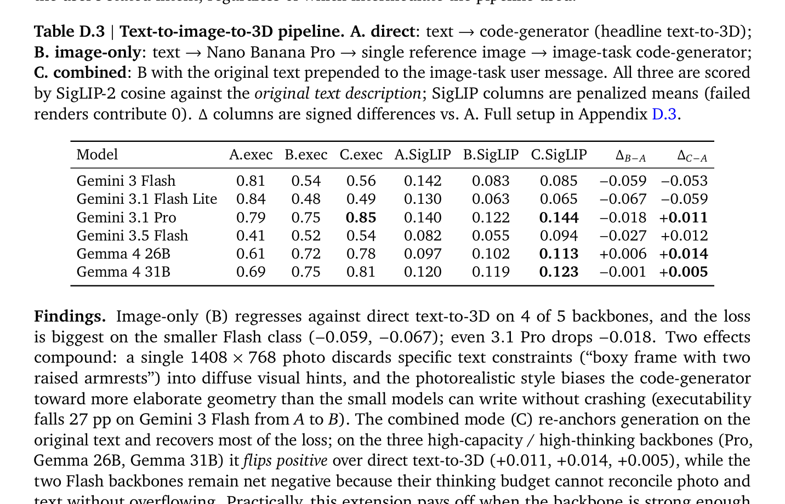

| Model | A.exec | B.exec | C.exec | A.SigLIP | B.SigLIP | C.SigLIP | Δ B−A | Δ C−A |
|---|---|---|---|---|---|---|---|---|
| Gemini 3 Flash | 0.81 | 0.54 | 0.56 | 0.142 | 0.083 | 0.085 | −0.059 | −0.053 |
| Gemini 3.1 Flash Lite | 0.84 | 0.48 | 0.49 | 0.130 | 0.063 | 0.065 | −0.067 | −0.059 |
| Gemini 3.1 Pro | 0.79 | 0.75 | 0.85 | 0.140 | 0.122 | 0.144 | −0.018 | **+0.011** |
| Gemini 3.5 Flash | 0.41 | 0.52 | 0.54 | 0.082 | 0.055 | 0.094 | −0.027 | **+0.012** |
| Gemma 4 26B | 0.61 | 0.72 | 0.78 | 0.097 | 0.102 | 0.113 | **+0.006** | **+0.014** |
| Gemma 4 31B | 0.69 | 0.75 | 0.81 | 0.120 | 0.119 | 0.123 | −0.001 | **+0.005** |

**Caption:** Table D.3 | Text-to-image-to-3D pipeline. A. direct: text → code-generator (headline text-to-3D); B. image-only: text → Nano Banana Pro → single reference image → image-task code-generator; C. combined: B with the original text prepended to the image-task user message. All three are scored by SigLIP-2 cosine against the original text description; SigLIP columns are penalized means (failed renders contribute 0). Δ columns are signed differences vs. A.

**Caption[CN]:** 表 D.3 | Text-to-image-to-3D 级联管线。A. 直接生成：文本 $\rightarrow$ 代码生成器（基线 Text-to-3D）；B. 纯图像输入：文本 $\rightarrow$ Nano Banana Pro $\rightarrow$ 单张参考图像 $\rightarrow$ 图像赛道代码生成器；C. 组合输入：在 B 的基础上将原始文本前置添加到图像任务用户消息中。三者均通过与原始文本描述的 SigLIP-2 余弦相似度进行评分；SigLIP 列为惩罚均值（失败渲染记为 0）。Δ 列为相对于 A 的带符号差值。

> <span style="color:#3B82F6"><strong>Para. 2:</strong></span> Findings. Image-only (B) regresses against direct text-to-3D on 4 of 5 backbones, and the loss is biggest on the smaller Flash class (−0.059, −0.067); even 3.1 Pro drops −0.018. Two effects compound: a single photo discards fine-grained textual constraints into diffuse visual clues, and the photorealistic rendering biases the code-generator toward over-complicated geometry that exceeds the model's executable coding capacity (executability drops 27 pp on Gemini 3 Flash). The combined mode (C) re-anchors generation on the original text and recovers most of the loss; on high-capacity backbones (Pro, Gemma 26B, Gemma 31B) it turns net positive (+0.005 to +0.014), demonstrating that visual grounding pays off when the model possesses sufficient reasoning bandwidth to reconcile multimodal cues without hallucinating invalid code.

> <span style="color:#F59E0B"><strong>Para. 2[CN]:</strong></span> 结果分析。纯图像引导模式（B）在 5 个骨干模型中有 4 个相对于直接文本生成发生质量衰退，且在较小的 Flash 级模型上下跌幅度最大（−0.059 与 −0.067）；即使是 3.1 Pro 也下跌了 −0.018。两种负面效应在此交织：单张静态照片将细腻的文本约束稀释为模糊的视觉线索，且逼真的摄影棚照片诱导代码生成器去尝试过于复杂的几何结构，超出了小模型编写可执行代码的能力范围（Gemini 3 Flash 的可执行率从 A 到 B 骤降 27 个百分点）。而组合模式（C）将生成重新锚定在原始文本上，挽回了大部分退化；在高容量骨干模型（Pro、Gemma 26B、Gemma 31B）上，组合模式成功反超直接文本生成并实现净正向收益（+0.005 至 +0.014）。这表明，唯有当模型拥有足够的推理带宽能够调和多模态线索而不致写出崩溃代码时，视觉具象锚点才能发挥其应有的协同增益。

## Appendix E. 3DCodeArena: Human-Preference Voting Interface

> <span style="color:#3B82F6"><strong>Para. 1:</strong></span> To complement the automated metric suite of Section B, we operate a public LMSYS-style pairwise-vote arena (the live deployment, schema, and front-end source are included in the supplemental material). The arena is a thin Next.js front-end backed by a Supabase Postgres database; each vote is keyed by a stable browser fingerprint to suppress trivial duplicates, and the underlying votes table is the same one we snapshot for the auto-judge study of Appendix F. At the time of writing, the arena hosts 12 frontier VLMs across both modality tracks and has collected roughly 2,500 human votes; per-model Elo ratings (Bradley–Terry MLE, recentered to mean 1000 and converted to Elo points at $400/\\ln 10$ per logit, with 1000-resample bootstrap 95% CIs) are recomputed nightly and surfaced on a public leaderboard.

> <span style="color:#F59E0B"><strong>Para. 1[CN]:</strong></span> 为补充附录 B 中的自动化指标套件，我们运营了一个公开的类似 LMSYS 风格的成对盲测竞技场（在线部署地址、数据库架构与前端源码均包含在补充材料中）。该竞技场采用轻量级 Next.js 前端并基于 Supabase Postgres 数据库搭建；每张投票均绑定一个稳定的浏览器指纹以过滤简单重复刷票，底层的投票记录数据表正是我们在附录 F 的自动裁判研究所用到的快照数据源。截至撰写本文时，该竞技场在两条模态赛道上共部署了 12 种前沿 VLM，并收集了约 2,500 张有效人类选票；各模型的 Elo 评分（Bradley–Terry 极大似然估计，中心化至均值 1000，按每 logit 对应 $400/\\ln 10$ 转换为 Elo 积分，附带 1000 次重采样的 bootstrap 95% 置信区间）每晚自动重新计算并展示在公开排行榜上。

> <span style="color:#3B82F6"><strong>Para. 2:</strong></span> Blind pairwise comparison. On every visit the server samples a prompt from the canonical 212-instance 3DCodeBench set, picks two distinct model variants that have produced an executable mesh for that prompt, and serves their GLB exports side by side as Model A and Model B — the model identities are never revealed until after the vote. Both viewers re-skin every loaded mesh with a single shared neutral-gray MeshStandardMaterial (color = `0xb8b8bc`, roughness = 0.7, metalness = 0, double-sided to mask flipped-normal artifacts). Stripping textures and colors forces voters to judge geometry alone, in line with our metric protocol of scoring untextured renders.

> <span style="color:#F59E0B"><strong>Para. 2[CN]:</strong></span> 双盲成对对比机制。用户每次访问时，服务器从 3DCodeBench 标准的 212 个实例集中随机抽取一个提示词，选取针对该提示词均成功生成可执行网格的两个不同模型变体，并将其导出的 GLB 文件并排渲染为模型 A 与模型 B——在完成投票之前模型的真实身份对用户严格保密。两个 3D 视图查看器均使用完全相同的统一中性灰 MeshStandardMaterial 材质重贴网格表面（颜色值 `0xb8b8bc`，粗糙度 0.7，金属度 0，开启双面渲染以遮蔽法线反转瑕疵）。剥离纹理与颜色迫使投票者纯粹从三维几何构型进行评判，这与我们在自动化指标中对无纹理渲染图进行评分的评测协议严格一致。

> <span style="color:#3B82F6"><strong>Para. 3:</strong></span> Cameras auto-fit the mesh’s bounding box on load, and the OrbitControls rig lets voters drag-rotate and scroll-zoom each side independently; presentation order is randomized per vote with a deterministic swap bit so any positional bias averages over A/B identity. After inspecting the pair, the voter picks one of four buttons — A is better, B is better, Tie, or Both bad — and the server records the verdict with the un-swapped model identities, model display names, the prompt slug, and the voter fingerprint.

> <span style="color:#F59E0B"><strong>Para. 3[CN]:</strong></span> 相机在加载时自动适配网格的包围盒尺寸，OrbitControls 轨道控制器允许投票者独立拖拽旋转和滚轮缩放两组 3D 模型；两侧的展示顺序在每次投票时通过确定性交换位（swap bit）随机打乱，从而确保任何潜在的位置偏见在 A/B 真实身份之间被均匀抵消。在仔细检查对比后，投票者点击四个按钮之一完成判定——“A 更好”、“B 更好”、“平局（Tie）”或“两者皆差（Both bad）”——随后服务器记录真实未交换的模型标识、显示名称、提示词标识符及投票者指纹。

### Figure E.1. 3DCodeArena Text-to-3D 人类投票界面

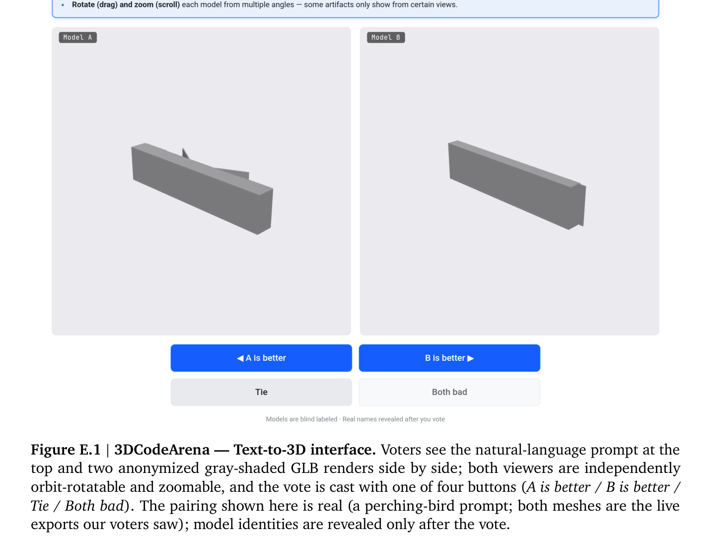

**Caption:** Figure E.1 | 3DCodeArena — Text-to-3D interface. Voters see the natural-language prompt at the top and two anonymized gray-shaded GLB renders side by side; both viewers are independently orbit-rotatable and zoomable, and the vote is cast with one of four buttons (A is better / B is better / Tie / Both bad). The pairing shown here is real (a perching-bird prompt; both meshes are the live exports our voters saw); model identities are revealed only after the vote.

**Caption[CN]:** 图 E.1 | 3DCodeArena — Text-to-3D 人类投票界面。投票者在顶部看到自然语言提示词，下方并排展示两个匿名化的中性灰着色 GLB 网格；两个视窗均可独立进行轨道旋转与缩放，投票通过四个按钮之一提交（A 更好 / B 更好 / 平局 / 两者皆差）。此处展示的为真实对决案例（“栖息之鸟”提示词；两个网格均为投票者实际看到的实时导出模型）；模型真实身份仅在投票提交后揭晓。

### Figure E.2. 3DCodeArena Image-to-3D 人类投票界面

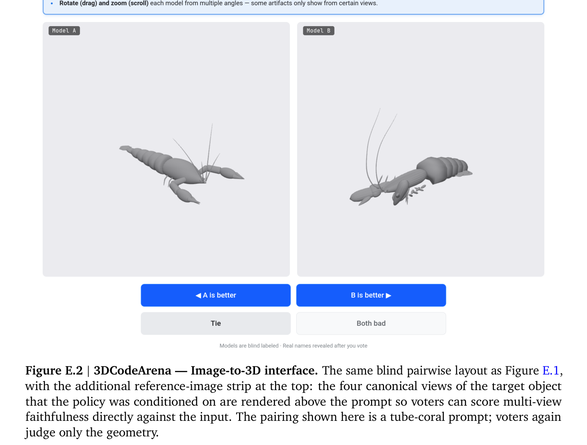

**Caption:** Figure E.2 | 3DCodeArena — Image-to-3D interface. The same blind pairwise layout as Figure E.1, with the additional reference-image strip at the top: the four canonical views of the target object that the policy was conditioned on are rendered above the prompt so voters can score multi-view faithfulness directly against the input. The pairing shown here is a tube-coral prompt; voters again judge only the geometry.

**Caption[CN]:** 图 E.2 | 3DCodeArena — Image-to-3D 人类投票界面。采用与图 E.1 相同的双盲成对布局，并在顶部增设了参考图像长条：策略模型所依据的目标物体四个规范视角渲染在提示词上方，使投票者能够直接对照原始输入来评判多视角保真度。此处展示的为管状珊瑚对决案例；投票者同样仅针对几何形态进行判定。

> <span style="color:#3B82F6"><strong>Para. 4:</strong></span> Per-track interfaces. Figure E.1 shows the Text-to-3D track: voters see only the natural-language prompt above the two viewers, mirroring the input the policy received. Figure E.2 shows the Image-to-3D track: the same blind pairwise layout, with a four-image reference strip rendered above the prompt so voters can compare the two meshes directly against the target views the model conditioned on. Per-modality Elo is kept on a separate scale because the two tracks exercise different skills (long-form geometric reasoning from text vs. multi-view-grounded reconstruction) and conflating them would mix qualitatively different signals. A persistent collapsible tip box reminds voters of three critical rules: (i) judge shape only, ignoring textures, materials, and colors; (ii) wait until both viewers finish loading before voting; (iii) rotate and zoom each model from multiple angles.

> <span style="color:#F59E0B"><strong>Para. 4[CN]:</strong></span> 分赛道交互界面。图 E.1 展示了 Text-to-3D 赛道：投票者在两个 3D 视窗上方仅能看到自然语言提示词，精确复刻了策略模型接收的输入条件。图 E.2 展示了 Image-to-3D 赛道：采用相同的双盲成对布局，在提示词上方额外展示了四视角参考图长条，使投票者能够直接对比模型生成的 3D 网格与原始输入视角的一致性。两条赛道的 Elo 评分严格保持独立尺度，因为两类任务考察了截然不同的能力维度（基于文本的开放式几何推理 vs. 基于多视角的空间约束重建），混淆两者将掺杂质性不同的能力信号。页面设有折叠提示框，强调三条核心投票守则：(i) 仅针对几何形状打分，忽略材质与色彩；(ii) 务必等待两侧网格完全加载完成后再投票；(iii) 从多个角度旋转与缩放以仔细检查局部瑕疵。

### Figure E.3. 3DCodeArena 实时全模型胜率矩阵

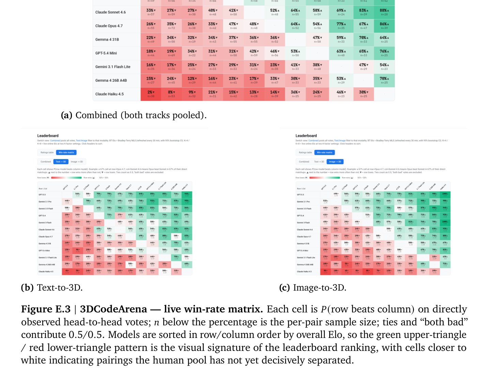

**Caption:** Figure E.3 | 3DCodeArena — live win-rate matrix. Each cell is $P(\text{row beats column})$ on directly observed head-to-head votes; $n$ below the percentage is the per-pair sample size; ties and “both bad” contribute 0.5/0.5. Models are sorted in row/column order by overall Elo, so the green upper-triangle / red lower-triangle pattern is the visual signature of the leaderboard ranking, with cells closer to white indicating pairings the human pool has not yet decisively separated.

**Caption[CN]:** 图 E.3 | 3DCodeArena — 实时全模型对决胜率矩阵。每个单元格表示直接观测到的成对投票中 $P(\text{行模型击败列模型})$ 的概率；百分比下方的 $n$ 为该模型对的样本量；“平局”与“两者皆差”均按各占 0.5/0.5 权重计入。模型在行列顺序上严格按照综合 Elo 降序排列，因此绿色上三角与红色下三角的鲜明对比形成了排行榜梯队的视觉特征，颜色趋于白色的单元格表明人类投票池尚未对该模型对做出决定性区分。

> <span style="color:#3B82F6"><strong>Para. 5:</strong></span> Live leaderboard and win-rate matrix. Beyond the per-vote interface, the public site exposes a leaderboard view that aggregates the same votes table into both Bradley–Terry Elo (recomputed every 30 min, with 95% bootstrap CI; $K=4$ and $K=8$ live online variants) and a per-pair win-rate matrix. The matrix view (Figure E.3) reports $P(\text{row beats column})$ on every directly observed pairing, with cell color saturation tracking distance from the 50% no-preference line, the per-cell sample size $n$ printed below the percentage, and ties / both-bad counted as 0.5/0.5. The three sub-tabs (Combined / Text→3D / Image→3D) let readers inspect the same 12-model field under each modality slice and cross-check whether a given Elo gap is supported by enough head-to-head votes to be meaningful.

> <span style="color:#F59E0B"><strong>Para. 5[CN]:</strong></span> 实时排行榜与胜率矩阵。除单次投票界面外，公开网站还提供了排行榜视图，将相同的投票数据表汇总为 Bradley–Terry Elo 积分（每 30 分钟重新计算一次，附带 95% bootstrap 置信区间；提供 $K=4$ 与 $K=8$ 两种实时在线变体）以及成对胜率矩阵。矩阵视图（图 E.3）汇报了每个直接观测模型对上的行模型击败列模型概率 $P(\text{row beats column})$，单元格的色彩饱和度反映了其偏离 50% 无偏好基准线的显著程度，百分比下方标注了该格子的独立样本量 $n$，平局与两者皆差均按 0.5/0.5 折算。三个子标签页（综合 / Text→3D / Image→3D）允许读者在各个模态切片下深入探查这 12 款前沿模型的相对优劣，并核验特定的 Elo 分差是否具备充足的直接交锋选票支撑。

## Appendix F. LLM/VLM-as-a-Judge Against the Human Arena

### F.1. Data and Protocol

> <span style="color:#3B82F6"><strong>Para. 1:</strong></span> To evaluate whether automated models can replace human voters in 3DCodeArena, we benchmark four Google backbones (Gemini 3.1 Pro, Gemini 3 Flash, Gemini 3.1 Flash Lite, Gemma 4 31B) in two judging modes: Image Mode (judging from the 4 rendered canonical views of each model) and Code Mode (judging purely by reading the two raw Python scripts without executing them). The test set consists of $n = 2,508$ live human votes collected from 3DCodeArena. Sampling is greedy ($T=0$) at thinking=low. Model identities are strictly anonymized as System A and System B, and the judge outputs a strict single-line JSON with `"winner"` $\\in \\{a, b, \\text{tie}, \\text{both\\_bad}\\}$ and a brief reasoning field.

> <span style="color:#F59E0B"><strong>Para. 1[CN]:</strong></span> 为了评估自动化大模型是否能够在 3DCodeArena 中替代人类投票者，我们在两种裁判模式下基准测试了四个 Google 骨干模型（Gemini 3.1 Pro、Gemini 3 Flash、Gemini 3.1 Flash Lite、Gemma 4 31B）：图像裁判模式（Image Mode，依据每个模型生成的 4 个规范渲染视角进行判定）与代码裁判模式（Code Mode，仅通过阅读两份原始 Python 源代码而不执行脚本进行判定）。评测基准包含从 3DCodeArena 收集的 $n = 2,508$ 条真实人类投票记录。采样采用贪婪解码（$T=0$）且 thinking=low。模型身份严格匿名化为系统 A 与系统 B，裁判模型强制输出单行 JSON，包含 `"winner"` $\\in \\{a, b, \\text{tie}, \\text{both\\_bad}\\}$ 以及简短的理由阐述字段。

> <span style="color:#3B82F6"><strong>Para. 2:</strong></span> Position-bias control. For each pair, a deterministic per-vote swap bit ($\text{Random}(\text{vote\\_id}) < 0.5$) decides whether to exchange the two systems' presentation order before prompt formatting. The verdict is unswept post-call. With balanced swapping, any systematic positional preference averages out over model identities and registers only as symmetric residual noise.

> <span style="color:#F59E0B"><strong>Para. 2[CN]:</strong></span> 位置偏见控制。针对每个模型对，基于确定性伪随机交换位（$\\text{Random}(\\text{vote\\_id}) < 0.5$）在格式化输入前决定是否调换两个系统的呈现顺序。模型调用结束后再将判定结果反向还原。通过这种平衡交换机制，任何系统性的前后位置偏见在模型身份之间均被完全对称平均抵消，仅保留为对称的残差噪声。

### F.2. Judge Prompt

> <span style="color:#3B82F6"><strong>Para. 1:</strong></span> Below is the abridged system prompt used for Image-Mode judging:

> <span style="color:#F59E0B"><strong>Para. 1[CN]:</strong></span> 以下是图像裁判模式所采用的系统提示词（节选）：

```text
Judge system prompt — image mode
You are an impartial judge in a 3D-modeling arena. Two anonymous AI systems were each given the SAME prompt and asked to produce a 3D object in Blender using Python. We rendered the resulting 3D object from four canonical viewpoints. Your job is to decide which side better matches the prompt, judging only from the renders.

# Verdict options
a / b / tie / both_bad.

# Criteria (weighted in order)
1. Object identity.
2. Structural correctness.
3. Geometric detail.
4. For image-to-3D: faithfulness to the reference images.
Color/material is NOT a criterion.

# Output format
Output STRICTLY a single JSON object {"winner": ..., "reasoning": ...}.
```

### F.3. Headline Results: The Four-Verdict View

### Table F.1. 自动化裁判与人类竞技场四分类一致性评测表

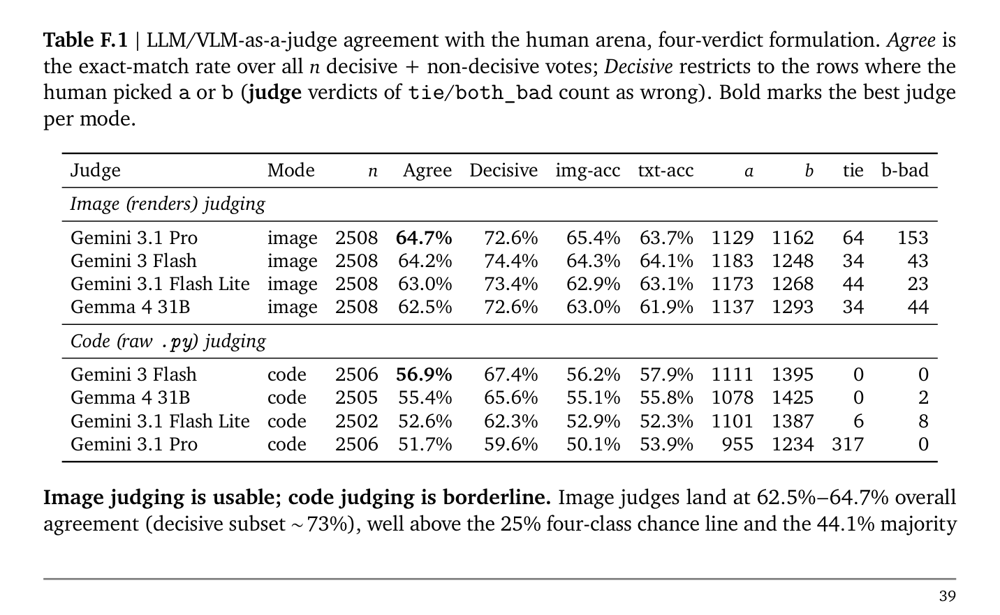

| Judge | Mode | $n$ | Agree | Decisive | img-acc | txt-acc | $a$ | $b$ | tie | b-bad |
|---|---|---|---|---|---|---|---|---|---|---|
| Gemini 3.1 Pro | image | 2508 | **64.7%** | 72.6% | 65.4% | 63.7% | 1129 | 1162 | 64 | 153 |
| Gemini 3 Flash | image | 2508 | 64.2% | **74.4%** | 64.3% | 64.1% | 1183 | 1248 | 34 | 43 |
| Gemini 3.1 Flash Lite | image | 2508 | 63.0% | 73.4% | 62.9% | 63.1% | 1173 | 1268 | 44 | 23 |
| Gemma 4 31B | image | 2508 | 62.5% | 72.6% | 63.0% | 61.9% | 1137 | 1293 | 34 | 44 |
| Gemini 3 Flash | code | 2506 | **56.9%** | **67.4%** | 56.2% | 57.9% | 1111 | 1395 | 0 | 0 |
| Gemma 4 31B | code | 2505 | 55.4% | 65.6% | 55.1% | 55.8% | 1078 | 1425 | 0 | 2 |
| Gemini 3.1 Flash Lite | code | 2502 | 52.6% | 62.3% | 52.9% | 52.3% | 1101 | 1387 | 6 | 8 |
| Gemini 3.1 Pro | code | 2506 | 51.7% | 59.6% | 50.1% | 53.9% | 955 | 1234 | 317 | 0 |

**Caption:** Table F.1 | LLM/VLM-as-a-judge agreement with the human arena, four-verdict formulation. Agree is the exact-match rate over all $n$ decisive + non-decisive votes; Decisive restricts to the rows where the human picked a or b (judge verdicts of tie/both_bad count as wrong). Bold marks the best judge per mode.

**Caption[CN]:** 表 F.1 | 大模型/多模态模型充当裁判与人类竞技场四分类一致性评测表。Agree 为跨全部 $n$ 条决定性与非决定性投票的精确匹配率；Decisive 仅限制在人类做出决定性选择（a 或 b）的行（裁判给出 tie 或 both_bad 视为错误）。粗体标出各裁判模式下的最优表现。

> <span style="color:#3B82F6"><strong>Para. 1:</strong></span> Image judging is usable; code judging is borderline. Image judges achieve 62.5%–64.7% overall agreement (decisive subset $\sim 73\%$), well above the 25% four-class chance line and the 44.1% majority-class baseline. In contrast, code judges drop by 7–13 pp down to 51.7%–56.9% (59.6%–67.4% decisive) — usable for broad trend comparisons, but not interchangeable with visual renders.

> <span style="color:#F59E0B"><strong>Para. 1[CN]:</strong></span> 图像裁判基本可用，而纯代码裁判处于边缘可用状态。图像裁判取得了 62.5%–64.7% 的总体一致性（在人类决定性子集上达 $\sim 73\%$），显著高于 25% 的四分类随机猜测线与 44.1% 的多数类基线。相比之下，纯代码裁判的表现下滑了 7–13 个百分点，降至 51.7%–56.9%（决定性子集上为 59.6%–67.4%）——可用于粗粒度的宏观趋势对比，但绝无法完全替代直接查看视觉渲染图。

> <span style="color:#3B82F6"><strong>Para. 2:</strong></span> Pro alone uses tie and both_bad appropriately. Flash, Flash Lite, and Gemma collapse into a binary $a/b$ vote: non-decisive verdicts make up only 0%–3.1% of their calls versus the human rate of 15.6%. Gemini 3.1 Pro abstains on 8.7% of image and 12.6% of code calls. The four-verdict exact-match metric punishes this calibration (every Pro tie on a decisive human row counts as incorrect), which explains why Pro appears lower on Table F.1 despite leading the decisive subset.

> <span style="color:#F59E0B"><strong>Para. 2[CN]:</strong></span> 仅有 Pro 模型能够合乎校准地使用平局（tie）与两者皆差（both_bad）。Flash、Flash Lite 与 Gemma 严重塌缩为二元的 $a/b$ 投票模式：其非决定性判定仅占 0%–3.1%，而人类投票中的非决定性比例高达 15.6%。Gemini 3.1 Pro 在 8.7% 的图像判定和 12.6% 的代码判定中选择弃权平局。四分类严格匹配指标在数学上惩罚了这种校准（在人类有决定性偏好的样本上 Pro 给出平局均记为错误），这正是 Pro 在表 F.1 综合列看似垫底但在决定性子集上领跑的核心原因。

### F.4. A/B-Only View: Accuracy and Correlation on Decisive–Decisive Rows

### Table F.2. 裁判与人类决定性样本（A/B-Only）一致性与相关性表

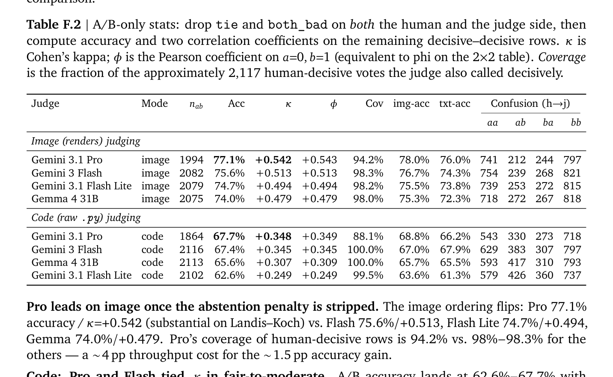

| Judge | Mode | $n_{ab}$ | Acc | $\kappa$ | $\phi$ | Cov | img-acc | txt-acc | Confusion $aa$ | Confusion $ab$ | Confusion $ba$ | Confusion $bb$ |
|---|---|---|---|---|---|---|---|---|---|---|---|---|
| Gemini 3.1 Pro | image | 1994 | **77.1%** | **+0.542** | **+0.543** | 94.2% | 78.0% | 76.0% | 741 | 212 | 244 | 797 |
| Gemini 3 Flash | image | 2082 | 75.6% | +0.513 | +0.513 | 98.3% | 76.7% | 74.3% | 754 | 239 | 268 | 821 |
| Gemini 3.1 Flash Lite | image | 2079 | 74.7% | +0.494 | +0.494 | 98.2% | 75.5% | 73.8% | 739 | 253 | 272 | 815 |
| Gemma 4 31B | image | 2075 | 74.0% | +0.479 | +0.479 | 98.0% | 75.3% | 72.3% | 718 | 272 | 267 | 818 |
| Gemini 3.1 Pro | code | 1864 | **67.7%** | **+0.348** | **+0.349** | 88.1% | 68.8% | 66.2% | 543 | 330 | 273 | 718 |
| Gemini 3 Flash | code | 2116 | 67.4% | +0.345 | +0.345 | 100.0% | 67.0% | 67.9% | 629 | 383 | 307 | 797 |
| Gemma 4 31B | code | 2113 | 65.6% | +0.307 | +0.309 | 100.0% | 65.7% | 65.5% | 593 | 417 | 310 | 793 |
| Gemini 3.1 Flash Lite | code | 2102 | 62.6% | +0.249 | +0.249 | 99.5% | 63.6% | 61.3% | 579 | 426 | 360 | 737 |

**Caption:** Table F.2 | A/B-only stats: drop tie and both_bad on both the human and the judge side, then compute accuracy and two correlation coefficients on the remaining decisive–decisive rows. $\kappa$ is Cohen’s kappa; $\phi$ is the Pearson coefficient on $a=0, b=1$ (equivalent to phi on the $2\times 2$ table). Coverage is the fraction of the approximately 2,117 human-decisive votes the judge also called decisively.

**Caption[CN]:** 表 F.2 | 纯 A/B 决定性子集统计表：在人类与裁判两侧均剔除平局（tie）和两者皆差（both_bad），随后在剩余的双向决定性行上计算准确率与两个相关系数。$\kappa$ 为 Cohen's kappa 系数；$\phi$ 为在二值化 $a=0, b=1$ 上的 Pearson 关联系数（等价于 $2\times 2$ 列联表上的 phi 系数）。Coverage 为在约 2,117 条人类决定性投票中，裁判同样给出决定性胜负判定的覆盖比例。

> <span style="color:#3B82F6"><strong>Para. 1:</strong></span> Pro leads on image judging once the abstention penalty is stripped. In Table F.2, Gemini 3.1 Pro reaches 77.1% accuracy and $\kappa = +0.542$ (classified as "substantial agreement" under Landis–Koch standards), outperforming Flash (75.6% / +0.513), Flash Lite (74.7% / +0.494), and Gemma (74.0% / +0.479). Furthermore, image-track prompts are consistently 2–3 pp easier for vision judges than text-track prompts because the 4 reference views provide an objective geometric anchor.

> <span style="color:#F59E0B"><strong>Para. 1[CN]:</strong></span> 一旦剔除弃权惩罚，Pro 模型在图像裁判上全面领跑。在表 F.2 中，Gemini 3.1 Pro 取得了 77.1% 的准确率和 $\kappa = +0.542$（按照 Landis–Koch 准则被评定为“实质性一致”），稳居 Flash（75.6% / +0.513）、Flash Lite（74.7% / +0.494）和 Gemma（74.0% / +0.479）之上。此外，对于视觉裁判而言，Image-to-3D 赛道的判定准确率比 Text-to-3D 赛道高出 2–3 个百分点，这是因为 4 个输入参考视角为多模态裁判提供了客观无偏的三维几何锚点。

## Appendix G. Sampling Temperature Ablation

### G.1. Quality vs. Sampling Temperature

### Figure G.1. 生成质量与采样温度消融曲线

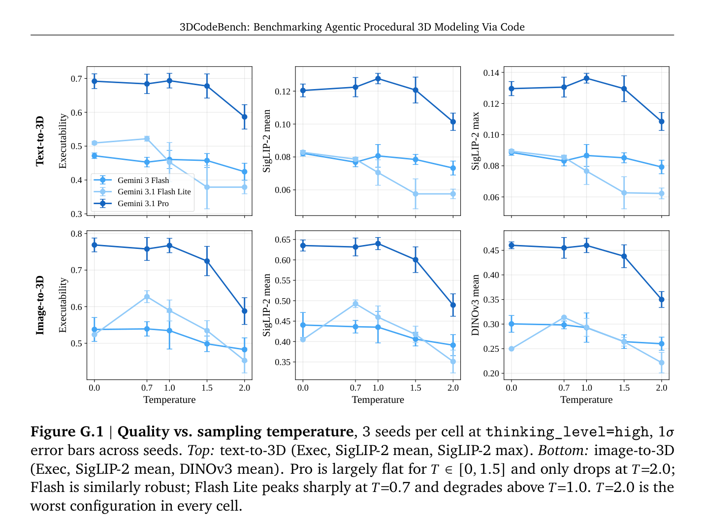

**Caption:** Figure G.1 | Quality vs. sampling temperature, 3 seeds per cell at thinking_level=high, $1\sigma$ error bars across seeds. Top: text-to-3D (Exec, SigLIP-2 mean, SigLIP-2 max). Bottom: image-to-3D (Exec, SigLIP-2 mean, DINOv3 mean). Pro is largely flat for $T \in [0, 1.5]$ and only drops at $T=2.0$; Flash is similarly robust; Flash Lite peaks sharply at $T=0.7$ and degrades above $T=1.0$. $T=2.0$ is the worst configuration in every cell.

**Caption[CN]:** 图 G.1 | 生成质量相对于采样温度的消融实验。在 thinking_level=high 下每个配置运行 3 个随机种子，误差棒表示跨种子的 $1\sigma$ 标准差。顶部：Text-to-3D（可执行率、SigLIP-2 均值、SigLIP-2 最大值）。底部：Image-to-3D（可执行率、SigLIP-2 均值、DINOv3 均值）。Pro 模型在 $T \in [0, 1.5]$ 区间内基本保持平稳，仅在 $T=2.0$ 时出现显著跌落；Flash 展现出相似的稳健性；Flash Lite 在 $T=0.7$ 处呈现明显峰值，并在 $T>1.0$ 时迅速退化。$T=2.0$ 在所有测试单元中均表现最差。

> <span style="color:#3B82F6"><strong>Para. 1:</strong></span> The headline numbers in Table A.1 use temperature $T = 0.7$. Figure G.1 sweeps temperature across $T \in \{0, 0.7, 1.0, 1.5, 2.0\}$ on three Gemini 3 models (Flash, Flash Lite, Pro) at thinking_level=high with 3 seeds per cell. The sweep covers greedy decoding ($T=0$), our baseline ($T=0.7$), provider defaults ($T=1.0$), and elevated temperatures up to the API ceiling ($T=2.0$).

> <span style="color:#F59E0B"><strong>Para. 1[CN]:</strong></span> 表 A.1 中的主实验数据统一采用采样温度 $T = 0.7$。图 G.1 在 thinking_level=high 设置下，针对三款 Gemini 3 模型（Flash、Flash Lite、Pro）跨 $T \in \{0, 0.7, 1.0, 1.5, 2.0\}$ 扫描了采样温度，每个单元格评测 3 个随机种子。该扫描涵盖了贪婪解码（$T=0$）、本文基线（$T=0.7$）、服务商官方默认值（$T=1.0$）以及直至 API 允许上限的高温区间（$T=2.0$）。

> <span style="color:#3B82F6"><strong>Para. 2:</strong></span> $T=2.0$ is uniformly worst; $\{0, 0.7, 1.0\}$ is indistinguishable on frontier models. On Flash and Pro, the three lower-temperature settings overlap within $1\sigma$ error bars across all metrics (e.g., Pro text-to-3D Exec of 0.692 / 0.684 / 0.693). Flash Lite peaks sharply at $T=0.7$ (Image-to-3D Exec 0.627) and collapses with a 17 pp penalty at $T=2.0$. Pro demonstrates the greatest temperature resilience, losing only 10–18 pp even at the extreme $T=2.0$.

> <span style="color:#F59E0B"><strong>Para. 2[CN]:</strong></span> $T=2.0$ 在所有配置下均表现最差；而在前沿旗舰模型上，$\{0, 0.7, 1.0\}$ 之间几乎不可区分。在 Flash 和 Pro 上，三个较低温度配置在所有指标上的数据重叠在 $1\sigma$ 误差棒之内（例如 Pro 在 Text-to-3D 上的可执行率分别为 0.692 / 0.684 / 0.693）。Flash Lite 在 $T=0.7$ 处达到清晰的峰值（Image-to-3D 可执行率 0.627），并在 $T=2.0$ 时严重崩溃，跌幅达 17 个百分点。Pro 展现出最强的抗温度干扰鲁棒性，即使在极端的 $T=2.0$ 下也仅下跌 10–18 个百分点。

> <span style="color:#3B82F6"><strong>Para. 3:</strong></span> Greedy decoding is computationally expensive on Flash-class models. While $T=0$ produces near-deterministic code, thinking token consumption explodes on lightweight models: Flash Lite text-to-3D consumes $\sim 63\text{K}$ thinking tokens per instance ($20.34 per full pass) at $T=0$ versus only $\sim 4\text{K}$ tokens ($2.47) at $T=0.7$. For Pro, $T=0$ thinking token count is well-behaved and remains below $T=1.0$. Recommendation: $T = 0.7$ sits firmly on the cost-quality Pareto frontier; we strongly advise against setting $T \ge 1.5$ for procedural code generation.

> <span style="color:#F59E0B"><strong>Para. 3[CN]:</strong></span> 贪婪解码在 Flash 级轻量模型上带来了极其高昂的计算代价。尽管 $T=0$ 能生成位级近似确定的代码，但轻量级模型的思考 token 消耗量却发生恶性膨胀：Flash Lite 在 Text-to-3D 任务上 $T=0$ 时平均每个实例耗费约 63K 思考 token（完整运行 212 个实例耗资 $20.34），而在 $T=0.7$ 时仅耗费约 4K token（仅耗资 $2.47$）。对于 Pro 而言，$T=0$ 的思考 token 消耗量表现温和，低于 $T=1.0$。实践建议：$T = 0.7$ 牢固处于成本-质量 Pareto 最优前沿上；在程序化 3D 代码生成任务中，我们强烈反对设置 $T \ge 1.5$。
