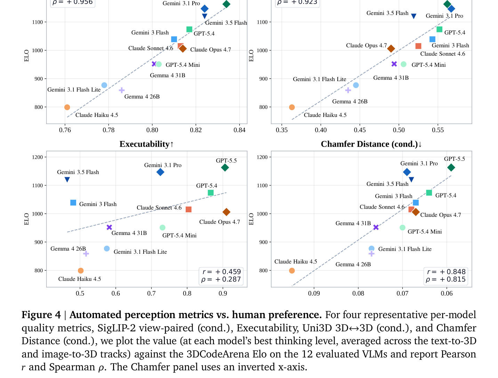
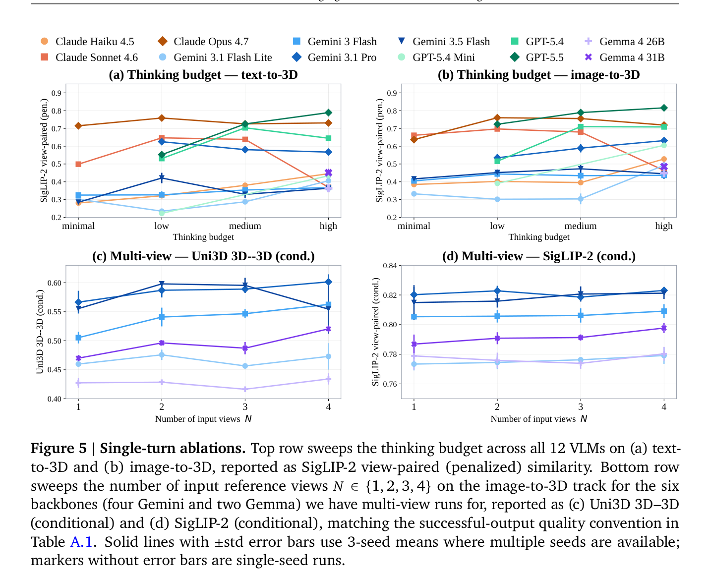
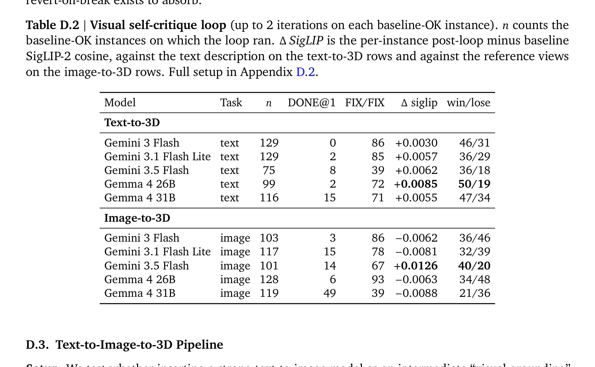

---
tags:
  - papers/3d-agent
  - papers/procedural-modeling
  - papers/code-generation
  - papers/benchmark
aliases:
  - "3DCodeBench"
  - "3DCodeBench 2026"
date: 2026-06-02
arxiv_id: 2606.01057
---

# 3DCodeBench: Benchmarking Agentic Procedural 3D Modeling Via Code

## 核心信息

- **标题**: 3DCodeBench: Benchmarking Agentic Procedural 3D Modeling Via Code
- **标题翻译**: 3DCodeBench：通过代码进行智能体程序化三维建模的基准评测
- **作者**: Yipeng Gao (1,3), Lei Shu (1), Genzhi Ye (1), Xi Xiong (1), Ameesh Makadia (2), Meiqi Guo (1), Laurent Itti (3), Jindong Chen (1)
- **机构**: 1: Google DeepMind, 2: Google Research, 3: University of Southern California (USC)
- **发表时间**: 2026-06-02 (arXiv: 2026-05-31)
- **发表渠道**: arXiv:2606.01057v1 [cs.CV]
- **论文链接**: [arXiv:2606.01057](https://arxiv.org/abs/2606.01057)
- **项目主页**: [3dcodebench.com](https://3dcodebench.com)
- **开源资源**: 包含 212 个复杂资产类别的 26K 提示-代码-网格三元组数据集；Blender 5.0 可执行性评测沙盒流水线；3DCodeArena 双盲人类偏好在线对战平台
- **论文类型**: 3D 智能体基准评测 (Agentic 3D Benchmark)；程序化代码建模 (Procedural 3D Code Generation)；多模态代码与执行评估

## 原文摘要翻译

通过代码进行程序化三维建模正逐渐成为一种通用且极具价值的新范式。与神经三维生成器相比，它具有天然的确定性、引擎就绪性（engine-ready）以及精确的可编辑性，而这正是纯神经 3D 生成方法所固有的缺陷。然而，创作此类程序化内容需要人类设计师具备深厚的 3D 软件 API 专业知识、参数化设计能力以及代码级的空间几何推理素养。在本文中，我们提出了 **3DCodeBench**，这是一个用于系统性评估视觉-语言模型（VLM）智能体在三维建模软件中进行程序化 3D 生成能力的基准评测体系。具体而言，3DCodeBench 评估了 12 个先进的 VLM 如何通过将文本提示与参考图像转化为 3D 建模软件的程序化代码，来扮演程序化 3D 建模师的角色。

考虑到自动化评估指标可能无法完全捕捉 3D 形状的感知质量，我们构建了 **3DCodeArena**——一个基于人类对生成的 3D 输出进行成对偏好投票的排名平台，通过 Bradley-Terry 模型计算 Elo 积分。通过广泛的评估与实证结果，我们观察到：
1. **失败主要源于 API 不匹配，而即使成功渲染的模型也普遍受到几何部件脱节或浮空问题的困扰**；
2. **测试时计算缩放（Test-time Scaling），例如增加思考预算（Thinking Budget）与多轮迭代反思（Multi-turn Refinement），能够全面提升模型的生成表现**。

我们的研究结果凸显了对高质量程序化代码数据以推动商业 VLM 发展的迫切需求。此外，有效的程序化 3D 建模需要一个能够提供高保真反馈以进行迭代微调的强大执行环境。我们开源了 3DCodeBench，包括经过精心清洗的大规模多模态（文本/图像）提示、程序化代码、3D 对象三元组数据集、严谨的评测协议以及公开的 3DCodeArena 平台，作为探索基于 VLM 的程序化 3D 建模师的基石工具包。

## 创新点

1. **开创性确立工业级原生程序化代码 3D 智能体基准**：彻底告别以往基准对低维体素网格（如 VoxelCodeBench）或浅层 CSG 宏指令（如 CADBench）的玩具级简化，首次全面评估多模态大模型从零编写长达数百行、调用复杂工业级 Blender 5.0 Python API（涵盖 bmesh 拓扑操作与 Geometry Nodes 几何节点网络）直接构建高保真 3D 资产的能力。
2. **构建包含 26K 样本的大规模高质量程序化三维代码库**：基于 Infinigen 复杂的程序化生成工厂，通过设计融合技能库（Skills Library）与经验库（Experience Library）的 Agentic 提取流水线与严格的人机协同质检，从 243 个工业工厂中逆向抽象出 212 个复杂资产类别的 12,963 个核心三元组，派生出带纹理与纯几何两套独立代码（共计约 26,000 份独立脚本），终结了 3D 领域长期“只有烘焙静态网格（ShapeNet/Objaverse）、缺乏生成代码资产”的数据荒漠。
3. **首创无材质双盲人类偏好对战平台 3DCodeArena 与 Elo 评测体系**：借鉴 LMSYS Chatbot Arena 机制，搭建了基于 Three.js 的实时双盲 WebGL 评测竞技场。采用统一中性灰度着色器（MeshStandardMaterial）剔除材质贴图与色彩渲染欺骗，强制评判者聚焦纯粹的三维几何形貌与物理拓扑，通过 Bradley-Terry 最大似然估计构建了首个具备统计置信区间的 3D 代码生成 Elo 排行榜。
4. **实证确立多视角 SigLIP-2 与 DINOv3 视角相似度作为人类偏好的黄金自动代理**：在 12 款前沿商业与开源大模型上严格证明，SigLIP-2 多视角余弦相似度与人类 Elo 呈高度线性相关（Pearson $r = 0.964$），DINOv3 展现出极强排序单调性（Spearman $\rho = 0.972$），终结了以往评测仅统计“代码报错与否”（Executability 与人类偏好相关性仅 $r = 0.459$）的粗糙局面。
5. **深刻揭示代码 Agent“能编译却不优化几何”的执行力悖论与反思不对称性**：通过对比单轮直出、多轮 Traceback 错误重试与原生编程智能体 Harness（Claude Code, Codex CLI, Gemini CLI, Antigravity CLI），证实简单的终端报错日志能普适性地将代码执行率拉升 27+ pp 至近 100%，但在缺乏视觉/几何密集 Critic 时，赋予 Agent 长达 15 分钟的自由探索并不能提升网格形状质量；同时揭示了视觉自反思在文本生成（全局正向）与图像重建（反向倒退）上的深刻不对称性。

## 一句话总结

3DCodeBench 撕开了大模型在 3D 领域“看似无所不能”的繁荣表象：借助测试时错误反馈，前沿大模型已能写出编译通过率近 100% 的数百行 Blender 5.0 复杂建模代码，但在空间连续几何与物理常识的深水区，依然普遍深陷“部件脱节、肢体悬浮、比例畸变”的本质断层；它不仅为社区树立了对齐人类偏好的程序化 3D 代码评测黄金标准，更为具身智能与数字孪生世界生成指明了从“语法过关”迈向“空间物理合规”的真实瓶颈。

## 研究问题

在当前的 3D 生成研究版图中，基于扩散模型与神经辐射场（NeRF / 3D Gaussian Splatting）的纯神经生成范式取得了巨大的视觉震撼力，但工业界与学术界却日益意识到其难以逾越的阿喀琉斯之踵：**缺乏原生参数化结构与可编辑性**。

纯神经生成输出的是密集的点云、连续辐射场或经过 Marching Cubes 提取的“死网格（Static Mesh）”。这些资产一旦烘焙完成，拓扑面结构混乱、无语义分块，更无法直接暴露给机械工程师或游戏关卡设计师去按需调节“桌腿高度”、“螺纹节距”或“树枝分叉概率”。与此相对，**程序化代码建模（Procedural 3D Modeling via Code）**——即利用 Python（如 Blender bpy/bmesh API）、OpenSCAD 或 Houdini VEX 编写可执行脚本——则是工业设计、数字孪生和机器人高保真仿真环境（如 ProcTHOR, Kubric, BlenderProc）的命脉。代码是人类设计逻辑的离散符号载体，天然具备：
- **极致紧凑性**：数十 KB 的文本脚本即可确定性衍生出数百 MB 的高精度拓扑网格；
- **无限分辨率与可微调性**：通过修改循环变量与控制参数，可在数秒内完成形态变异与细节缩放；
- **工业渲染引擎无缝就绪**：生成的网格完全符合流形（Manifold）约束与拓扑布线规范，可直接进行物理碰撞解算与动力学绑定。

然而，撰写工业级程序化 3D 代码需要人类工程师极高的认知负荷：既要熟悉繁琐且不断迭代的软件底层 API，又要具备在脑海中将连续 3D 欧氏空间投影为离散控制代码的几何思维。随着视觉语言模型（VLM）与编程智能体（Coding Agents）的爆发，学术界与工业界（如 Anthropic 发布的 Claude for Creative Work，以及遍布开源社区的 Blender MCP Servers）开始积极探索让大模型充当“3D 建模师”。但评测这一能力面临**四大根本性缺失**：

1. **对齐程序化数据严重匮乏**：ShapeNet、Objaverse-XL、Thingi10K 等海量 3D 数据集积累了数千万静态网格，却全无底层的生成代码；现存的少数开源脚本分散在 GitHub 各处，充斥着老旧过时语法与硬编码顶点列表，大模型根本无法在预训练阶段形成系统性的程序化建模世界先验。
2. **现有评测环境严重脱离真实几何复杂度**：VoxelCodeBench 仅局限在极低分辨率的体素拼接；CADBench 局限于简单的基础几何体（CSG）布尔运算；BlenderGym 仅评测在已有现成场景中的局部属性修改，而非从零（From Scratch）构建完整三维资产。
3. **完全忽略了 3D 设计的智能体迭代本质**：传统评测依赖 Single-shot 单轮提示词测试，一旦代码遇到语法错误即记为失败，既没有提供执行环境的真实报错反馈，也没有评估模型根据多视角渲染图像进行“自审自修（Visual Self-Critique）”的 Agentic 潜力。
4. **评测基准缺乏对齐人类感知的客观尺度**：单纯统计代码可执行率（Executability）极为粗糙（只要脚本创建了一个立方体就得分），而通用的 Chamfer Distance 又对部件脱节、局部悬浮等严重破坏人类审美的缺陷不够敏感，缺乏一个能够衡量真实人类偏好的权威 3D 竞技场（Arena）。

3DCodeBench 正是在这一关键历史节点应运而生，旨在系统性补齐这一断层。

## 数据与任务定义

### 任务形式化定义与沙盒契约

论文将程序化 3D 生成形式化为一个策略合成与确定性执行任务。
给定多模态条件 $c$（文本提示词或多视角参考图像），建模智能体策略 $\pi$ 生成一段独立的 Python 脚本 $f_\pi = \pi(c)$。运行在沙盒中的确定性 3D 软件运行算子 $\mathcal{E}$（实例化为 Blender 5.0 环境）将脚本编译并烘焙为三维网格：
$$M_\pi = \mathcal{E}(f_\pi)$$

每个评测实例定义为三元组 $(c, f^\star, M^\star)$，其中 $c$ 为输入条件，$f^\star$ 为经过验证的参考代码，$M^\star$ 为对应的地面真值（Ground Truth）网格。
为全面衡量智能体交互潜力，任务拓展为 $T \ge 1$ 轮迭代范式：在第 $t$ 步，策略 $\pi$ 根据前一轮执行的控制台报错（Traceback）或多视角渲染图像更新脚本 $f_\pi^{(t)}$，最终对第 $T$ 轮输出的网格 $M_\pi^{(T)} = \mathcal{E}(f_\pi^{(T)})$ 进行统一评分。

评测对大模型的代码输出规定了极严格的**机器对机器契约（Hard Machine-to-Machine Contract）**：
- **纯 Python 输出**：严禁出现任何 Markdown 语法标记（如 ```` ```python ````），严禁在代码前后添加任何客套寒暄或注释性前言后语，文件的第一个字符必须是合法 Python 语法的开端（如 `import bpy`），最后一个字符必须是脚本的自然结尾；
- **封闭库白名单**：脚本仅允许导入 Blender 内置模块（`bpy`, `bmesh`, `mathutils`）、Python 标准库（`math`, `random`, `itertools`, `collections`, `dataclasses`, `enum`, `typing`）以及数值科学库（`numpy`, `scipy`），严禁调用网络请求、GUI 弹窗、外部磁盘文件读取（如 PIL, cv2）；
- **纯净单体对象**：必须先清除默认场景（删除默认立方体、摄像机和灯光），生成且仅生成一个位于坐标原点的核心 3D 物体网格（或有机结合的装配体），严禁生成任何地面、摄影棚背景板、支架、草坪或环境道具；
- **几何未着色约束**：网格保持纯灰色无材质未着色状态（Untextured Geometry），严禁触发 `bpy.ops.render.render`，严禁调用 `sys.exit` 或 `bpy.ops.wm.quit_blender`。

### 212 个高难度资产类别分布

3DCodeBench 评测集从 Infinigen 工业工厂中精选出 **212 个高度多样化且在拓扑结构上极富挑战性的资产类别**。与传统只测桌椅杯盘的玩具基准不同，其语义空间广泛覆盖：
- **复杂生物与有机体**：飞禽类（如各类飞鸟）、节肢动物（螃蟹、龙虾、蜘蛛、蜻蜓）、软体海洋生物（海螺、贝壳、卷贝、管状珊瑚）、复杂植物群落（龙舌兰、仙人掌、枫树、枯树）；
- **人造物品与家具**：模块化厨房系统、立式盥洗池（Standing Sink）、带有多隔间与抽屉的组合柜、现代灯具与精致器皿；
- **建筑构造与自然构造**：复杂屋顶瓦片、石桥结构、裂纹树桩等。


*论文原图编号：Figure 3。3DCodeBench 评测集统计分布。(a) 212 个精选类别的语义词云，展示了从有机生物到工业人造物的宽广覆盖面；(b) 脚本代码行数分布（均值 531 行，中位数 387 行），体现出极高的编程逻辑深度；(c) 脚本文件大小分布（均值 20.5 KB，中位数 14.9 KB），右侧长尾由密集的几何节点网络脚本驱动。*

代码统计显示出极其强烈的工程复杂度：
- 平均脚本长度为 **531 行**（中位数 **387 行**），最复杂的生物节点和多抽屉收纳柜工厂脚本超过 **1000 行**；
- 平均文件体积为 **20.5 KB**（中位数 **14.9 KB**）。这种复杂度对大模型的长程 API 语法连贯性、局部拓扑参数传递和变量命名提出了极为严苛的要求。

### 核心评测指标体系与数学公式

针对生成的 3D 代码及网格，3DCodeBench 建立了覆盖可执行性、多视角感知保真度、三维几何点云对齐与跨模态一致性的四维立体度量矩阵。

#### 1. 可执行性（Executability, Exec）
衡量脚本是否在 240 秒沙盒时限内无崩溃运行并成功创建实体网格：
$$\text{Exec}_i = \mathbb{I}\left[\mathcal{E}(f_{\pi,i}) \neq \emptyset \wedge |\text{Mesh}(\mathcal{E}(f_{\pi,i}))| \ge 1\right]$$
其中 $|\text{Mesh}(\cdot)|$ 计算执行后场景中合法网格对象的数量。整个测试集的平均执行率为 $\text{Exec} = \frac{1}{N}\sum_{i=1}^N \text{Exec}_i$。所有运行失败被严格归入四个互斥阶段桶：
- `ERR_EXEC`：Python 运行时异常（主要是 Blender 5.0 API 弃用或参数签名不匹配）；
- `ERR_NO_MESH`：脚本虽正常退出，但场景中只有曲线、空物体或灯光，缺少 MESH；
- `ERR_RENDER`：网格包含 NaN 浮点坐标或无穷大顶点导致 Cycles 无法渲染；
- `ERR_TIMEOUT`：超过 240 秒沙盒超时预算（通常由无限循环或过密的布尔细分导致）。

#### 2. 多视角图像感知相似度（Image-Grounded Perceptual Similarity）
将成功导出的网格置于标准化 Cycles 渲染棚内，沿方位角 $V = \{45^\circ, 135^\circ, 225^\circ, 315^\circ\}$ 渲染 4 帧中性视角图 $r_v(M_{\pi,i})$。
- **SigLIP-2 视角相似度**：采用 `google/siglip2-so400m-patch16-naflex` 图像分支提取特征，计算与参考真值图像 $g_v$ 的平均余弦相似度：
  $$\sigma_{\text{SigLIP-2}, i} = \frac{1}{|V|} \sum_{v \in V} \cos\left(\psi_{\text{SigLIP-2}}(r_v(M_{\pi,i})), \psi_{\text{SigLIP-2}}(g_v)\right)$$
- **DINOv3 结构相似度**：采用 `facebook/dinov3-vitl16-pretrain-lvd1689m` 提取自监督密集视觉特征。由于生成的网格未着色而真值图带颜色，DINOv3 对表面纹理不敏感，能高度纯粹地捕捉 3D 外形结构与部件轮廓对应。
- **Text-to-3D 文本-渲染相似度**：在纯文本任务下，计算 4 个渲染视角的图像嵌入与输入文本提示词 $c_i$ 文本嵌入之间的余弦值：
  $$s_i^{\text{mean}} = \frac{1}{|V|} \sum_{v \in V} \cos\left(\phi_{\text{img}}(r_v(M_{\pi,i})), \phi_{\text{txt}}(c_i)\right)$$

#### 3. 三维点云几何对齐（3D-Shape Similarity）
在网格表面通过面积均匀采样提取 $K = 8192$ 个点云，去中心化并缩放至单位包围球。
- **带 4 偏航对齐的对称 Chamfer 距离（Chamfer Distance, CD）**：
  为消除大模型在绝对坐标系下朝向不确定的影响，在 4 个正交绕 Z 轴偏航角下搜索最小对称欧氏平方距离：
  $$\text{CD}_i = \min_{\theta \in \{0^\circ, 90^\circ, 180^\circ, 270^\circ\}} \left[ \frac{1}{K}\sum_{p \in P_i^\star} \min_{q \in R_\theta P_{\pi,i}} \|p-q\|_2^2 + \frac{1}{K}\sum_{q \in R_\theta P_{\pi,i}} \min_{p \in P_i^\star} \|p-q\|_2^2 \right]$$
- **Uni3D 3D-3D 及跨模态相似度**：采用预训练 `Uni3D-Giant` 点云编码器（基于 EVA-Giant 主干，1024 维对齐潜空间），计算生成点云与真值点云之间的余弦相似度 $u_i^{3\text{D}}$，以及生成点云与输入提示词/主视角的跨模态相似度 $u_i^{\text{xm}}$。

#### 4. 条件均值与惩罚均值的二元聚合机制
针对任意质量指标 $\mathcal{D}_i$，评测体系严格区分两种跨实例统计方式：
- **条件均值（Conditional Mean, $\mathcal{D}_{\text{cond}}$）**：仅在成功编译运行的子集（$\text{Exec}_i = 1$）上取平均，用于隔离代码报错干扰，衡量模型“一旦跑通后的纯几何构建能力”；
- **惩罚均值（Penalized Mean, $\mathcal{D}_{\text{pen}}$）**：对执行失败样本直接赋 0（对于越低越好的 Chamfer 距离，则赋予惩罚值 $1.5 \times \max_{\text{Exec}=1} \text{CD}$），用于衡量涵盖可靠性与保真度的“端到端工业可用价值”。
$$\mathcal{D}_{\text{cond}} = \frac{\sum_{i=1}^N \text{Exec}_i \cdot \mathcal{D}_i}{\sum_{i=1}^N \text{Exec}_i}, \quad \mathcal{D}_{\text{pen}} = \frac{1}{N}\sum_{i=1}^N \text{Exec}_i \cdot \mathcal{D}_i$$

---

## 方法主线

### 机制流程

3DCodeBench 将程序化 3D 建模的评测视作一个紧密闭环的软件工程与空间推理任务，其整体流程涵盖了**多模态条件输入 $\to$ 离散代码生成 $\to$ 沙盒确定性编译执行 $\to$ 多模态自动化度量与人类偏好竞技场**四阶段全链路。


*论文原图编号：Figure 1。3DCodeBench 全景架构示意图。(左上) 视觉语言模型接收自然语言或多视角图像，生成独立的 Blender Python 脚本并通过编译器执行生成 3D 物体；(左下) 评测集覆盖 212 个高难度资产类别；(右上) GPT-5.5、Gemini 3.1 Pro、Claude Opus 4.7 等前沿模型的定性几何对比；(右下) 3DCodeArena 基于成对人类盲测投票计算 Bradley-Terry Elo 排行。*

整个系统的执行机制展现为以下核心链条：
1. **多模态输入与推理**：策略模型接收包含详细几何拓扑约束的文本描述（如“带六对步足、步足外扩、双螯对称的蓝斑蟹”）或 4 幅正交多视角参考图；
2. **纯 Python 脚本合成**：模型调用内部参数化建模先验，直接生成包含几何构造算子、修改器（Subdivision, Mirror, Bevel, Array）与变换矩阵的独立 Blender 5.0 脚本；
3. **隔离沙盒编译**：脚本被送入无头 Blender 5.0 子进程沙盒（超时 240 秒），拦截系统调用、执行拓扑构建并导出烘焙的 GLB 网格与多视角渲染切片；
4. **多维评分与闭环反馈**：网格同步分流至自动化几何/感知测评管线与人类偏好竞技场，同时将执行 Traceback 或渲染切片回传给智能体，触发多轮自修正。

### 核心组件: 3DCodeBench 评测流水线与可执行性沙盒

构建高质量程序化基准的最大障碍在于：Infinigen 等现有开源程序化世界系统的代码是深度面向全场景嵌套的。单个物体的生成函数往往交织在庞大的生态规则、全局地形、底层辅助库和复杂的材质着色器网络中，根本无法作为一个独立的 `.py` 文件直接在干净的 Blender 环境中单键运行。

为此，作者研发了一套**结合人类反馈的 Agentic 数据清洗与构建流水线（Figure 2）**，其核心由两大支柱驱动：


*论文原图编号：Figure 2。结合人类反馈的 Agentic 数据清洗流水线。VLM 驱动的编码智能体借助技能库（Skills Library）的自动化工具与经验库（Experience Library）的先验模块，将深度嵌套的 Infinigen 工厂解耦为独立的 Blender 5.0 脚本，经过多视角渲染自校验后，最终由人类专家进行 100% 逐一审核准入。*

#### 1. 技能库（Skills Library）：自动化执行反馈工具
- **代码精简器（Code Simplifier）**：智能解析 AST 语法树，递归剔除外部库的冗余继承与动态导入，在严格保证输出网格几何顶点与拓扑完全一致的前提下，将长达数千行的全工程函数压缩提炼为几百行的自包含独立脚本；
- **模拟执行器（Simulator）**：在安全的沙盒环境（Blender 5.0 无头进程）中执行代码，精准捕获标准输出、标准错误 Traceback，提取场景几何体信息；
- **视觉批评器（Visual Critic）**：部署前沿 VLM（如 Gemini 3.1 Pro）比对生成的渲染图与原始参考图像，检测是否发生严重的形态塌陷或关键解剖结构丢失；
- **网格分析器（Mesh Analyzer）**：利用三维计算几何工具自动化检测非流形边（Non-manifold Edges）、顶点膨胀率、简并面片（Degenerate Faces）与异常高面数，杜绝拓扑畸形。

#### 2. 经验知识库（Experience Library）：动态积累的解题范式
- **类别去重模块（Class Deduplication）**：动态跟踪已处理语义范畴，抑制相似资产的简单微调变体，确保 212 个类别的正交多样性；
- **部件组装规范（Parts Assembly）**：建立层次化组装模板，规范躯干、四肢、配件等独立几何组件的局部坐标系对齐与布尔缝合逻辑；
- **Blender 5.0 API 迁移知识库**：系统整理 Blender 4.x 到 5.0 的全部破坏性 API 升级（例如：移除 `use_auto_smooth` 属性，改为几何节点平滑修改器；移除原理化 BSDF 的 `Specular` 独立插槽，重构为高阶反射分量；更替 `ObjectModifiers.new` 中的枚举字符串等），赋能智能体在清洗脚本时前置消除版本废弃报错；
- **代码工程规范（Code Organization）**：统一脚本的代码风格、初始化清空逻辑与对象命名规范。

#### 3. 人机协同质检（Human-in-the-Loop Verification）
大模型与自动化工具初筛通过后，由人类专家执行双重人工核查：人工校验多视角外观一致性、文本提示描述的精准度，并在智能体遇到死循环卡点时提供局部代码定向补丁。**只有 100% 通过人工终审的样本方可纳入最终评测集与 26K SFT 数据集**。

### 3DCodeArena 人类偏好与 Bradley-Terry Elo 评分机制

在 3D 几何建模领域，由于观察视角的遮挡、光影法线的连续性以及人类对“生物解剖协调性”的苛刻感知，自动化指标有时难以完全涵盖人类主观审美。为此，作者搭建了公开发布的 **3DCodeArena** 在线偏好对战平台。


*论文原图编号：Figure 4。自动化感知与几何指标与 3DCodeArena 人类 Elo 偏好的相关性分析。在 12 款前沿大模型上，SigLIP-2 视角相似度展现出最高的线性预测力（Pearson $r = 0.964$），DINOv3 呈现最强的排序一致性（Spearman $\rho = 0.972$），Uni3D 同样高度吻合，而纯粹的代码执行率（Executability）相关性最低（$r = 0.459$）。*


*论文原图编号：Figure E.3。3DCodeArena 实时双盲胜率矩阵（Head-to-Head Win-Rate Matrix）。展示了全量模型对战的行胜率热力图，清晰呈现出前沿模型阶梯式的胜率压制分布。*

3DCodeArena 的设计严格遵循科学的盲测规范：
1. **纯几何着色（Neutral Gray Shading）**：网页端采用 Three.js WebGL 加载模型，强制剥离所有材质纹理与固有色，统一赋予中性灰色双面材质（MeshStandardMaterial: `color = 0xb8b8bc, roughness = 0.7, metalness = 0`），迫使投票者 100% 依靠三维几何形貌、部件比例与细节拓扑进行裁决；
2. **四项裁决选项（4-Verdict Setup）**：系统随机并排分发两款匿名模型的导出 GLB 网格，用户可进行 360 度无极旋转与缩放对比，提供四个互斥裁决按钮：**A 更好 / B 更好 / 平局 (Tie) / 两者皆差 (Both bad)**；
3. **独立分轨 Elo 机制**：将 Text-to-3D 与 Image-to-3D 拆分为两条完全独立的 Elo 排行榜，避免将纯文本空间脑补能力与多视角空间重建能力混为一谈；
4. **Bradley-Terry 最大似然估计（MLE）**：平局与两者皆差各按 0.5/0.5 胜率计入矩阵，在对数强度空间内通过 MLE 解算真实 Elo，均值重新归一化至 1000 分，通过 1000 次 Bootstrap 抽样计算 95% 置信区间。

在分析 3,098+ 条真实人类投票后，论文得出了**核心结论：多视角 SigLIP-2（$r = 0.964$）与 DINOv3（$\rho = 0.972$）高度契合人类审美，而单纯代码执行率（$r = 0.459$）几乎无法代表人类满意度**。

### 多模态代码生成中的反思迭代与 Agentic 工具链

为超越传统单轮评测的死板框架，3DCodeBench 深度解剖了三类智能体闭环工作流：

1. **多轮无状态 Traceback 重试（Stateless Error-Feedback Retry）**：当首次运行触发 `ERR_EXEC`、`ERR_NO_MESH` 或 `ERR_TIMEOUT` 时，沙盒截取最多 3000 字符的报错日志（保留前 70% 与后 30% 核心栈帧），注入预设提示词模板发起最多 2 次重新生成。该过程是无状态的（Stateless API Call），避免冗长对话历史消耗上下文；
2. **原生编程智能体闭环（Coding-Agent Harness）**：赋予各模型原生官方 CLI 工具链（如 Anthropic 的 `Claude Code`、OpenAI 的 `Codex CLI`、Google 的 `gemini-cli` 与 `Antigravity CLI`）完全自主权，在 600–900 秒的沙盒时间预算内，智能体自主调用 bash 脚本、运行 Blender、读取控制台输出、编写临时测试用例并迭代微调代码文件；
3. **多模态视觉自反思循环（Visual Self-Critique Loop）**：对于已经运行成功的脚本，沙盒将渲染出的 4 视角图像与原始任务需求（或参考图）重新喂给大模型，模型需按预设格式输出判定（`NEEDS_FIX: NO` 或 `NEEDS_FIX: YES` + 缺陷分析列表 + 全新修复代码）。为防止“越改越坏”，系统引入了 **Revert-on-break** 熔断保护——若重构后的代码发生崩溃，自动回退到上一轮正常可渲染的旧版本。

---

## 关键结果

### 主结果与强基线

评测覆盖了 12 款前沿多模态大模型，横跨轻量级推理端（Claude Haiku 4.5, Gemini 3.1 Flash Lite, GPT-5.4 mini, Gemma 4 26B/31B）、中端生产力模型（Claude Sonnet 4.6, Gemini 3 Flash, Gemini 3.5 Flash, GPT-5.4）以及前沿旗舰大模型（Claude Opus 4.7, Gemini 3.1 Pro, GPT-5.5）。


*论文原图编号：Table A.1。3DCodeBench 212 类的 12 个前沿大模型主评测基准大表。各模型均在其最佳思考预算下评测，综合统计了执行率、多视角图像相似度、3D 形状指标、3DCodeArena Elo 偏好积分与单次调用成本。*

下表整理自论文 Table A.1 主基准评测核心数据：

| 模型家族与名称 | 评测模式 / 预算 | 执行率 Exec ↑ | SigLIP-2 ↑ | DINOv3 ↑ | Chamfer ↓ | Uni3D 3D-3D ↑ | 3DCodeArena Elo ↑ | 单次耗时 (s) | 单次成本 ($) |
| :--- | :---: | :---: | :---: | :---: | :---: | :---: | :---: | :---: | :---: |
| **GPT-5.5** | Frontier / High | **0.906** | **0.834** | **0.576** | **0.059** | 0.562 | **1,163** | 160.1 | $0.28~$0.32 |
| **Gemini 3.1 Pro** | Frontier / Best | 0.725 | 0.824 | 0.569 | 0.069 | **0.567** | 1,147 | 162.9 | $0.12~$0.19 |
| **Gemini 3.5 Flash**| Mid-tier / High | 0.464 | 0.824 | 0.563 | 0.068 | 0.519 | 1,119 | 93.3 | **$0.04** |
| **GPT-5.4** | Mid-tier / Med | 0.866 | 0.817 | 0.560 | 0.064 | 0.552 | 1,074 | 168.0 | $0.18~$0.20 |
| **Gemini 3 Flash** | Mid-tier / High | 0.481 | 0.810 | 0.528 | 0.067 | 0.543 | 1,039 | 34.0 | **$0.02** |
| **Claude Sonnet 4.6**| Mid-tier / Base | 0.804 | 0.813 | 0.551 | 0.068 | 0.525 | 1,015 | 200.3 | $0.26~$0.29 |
| **Claude Opus 4.7** | Frontier / Min | **0.910** | 0.814 | 0.545 | 0.067 | 0.490 | 1,006 | 30.0 | $0.08~$0.14 |
| **Gemma 4 31B** | Open-weight / High| 0.582 | 0.801 | 0.518 | 0.076 | 0.494 | 952 | 119.1 | **Free** |
| **GPT-5.4 mini** | Lightweight / Med | 0.731 | 0.803 | 0.526 | 0.070 | 0.506 | 951 | 155.8 | $0.10~$0.11 |
| **Gemini 3.1 Flash Lite**| Lightweight/High| 0.575 | 0.778 | 0.496 | 0.077 | 0.445 | 877 | 36.7 | **$0.01** |
| **Gemma 4 26B** | Open-weight / High| 0.517 | 0.786 | 0.483 | 0.077 | 0.435 | 859 | 113.7 | **Free** |
| **Claude Haiku 4.5** | Lightweight / Base| 0.502 | 0.761 | 0.413 | 0.095 | 0.363 | 799 | 23.3 | $0.02~$0.03 |


*论文原图编号：Figure A.1。10 款商业前沿多模态大模型的推理成本与 3DCodeArena Elo 偏好的 Pareto 前沿分布。Gemini 3.1 Flash Lite、Gemini 3 Flash、Gemini 3.5 Flash 和 Gemini 3.1 Pro 占据了 Pareto 前沿的四个关键低成本点，GPT-5.5 占据最高性能顶点。*


*论文原图编号：Figure 6。前沿大模型在 3DCodeBench 上的定性生成网格对比。展示了 Gemini 3.1 Pro、Claude Opus 4.7 与 GPT-5.5 在面对鱼、螃蟹、龙虾、海螺、洗手池、仙人掌等复杂提示词时的实际网格形态。前沿模型虽能大体还原轮廓，但普遍深陷肢体脱节、悬浮碎片与几何穿插的物理缺陷中。*

#### 关键观察与纵向对比：
1. **王权交替：GPT-5.5 斩获榜首，Gemini 3.1 Pro 与 3.5 Flash 展现极强几何底蕴**：GPT-5.5 取得了全场最高的 1163 Elo 与 0.834 SigLIP-2，其 Chamfer 距离低达 0.059，展现了顶级的长代码连贯性与空间拓扑控制力。Gemini 3.1 Pro 则在 Uni3D 3D-3D 点云空间相似度上夺得全场第一（0.567），Elo 达 1147。
2. **性价比维度的颠覆性突破：Gemini 3.5 Flash 统治 Pareto 前沿**：从 Figure A.1 可以清晰看出，Gemini 3.5 Flash 以每次调用仅仅 **$0.04** 的微小成本，拿下了 **1119 Elo**，与顶配模型（GPT-5.5 需 $0.32，昂贵 8 倍）的分差仅有 44 分，是性价比最具统治力的工业级建模基座。
3. **Claude Opus 4.7 的“执行率高、偏好倒挂”现象**：Claude Opus 4.7 单轮编译执行率高达惊人的 **0.910**（全场最高），但其人类 Elo 评分仅有 **1006**，甚至落后于售价仅 $0.02 的 Gemini 3 Flash（1039）。定性分析（Figure 6）精准揭示了原因：**Opus 极其擅长通过编写极其简化的基本几何体（圆球、圆柱）拼凑出能跑通的代码，但缺乏真实拓扑连接，拼出的螃蟹或洗手池由散落浮空的无关联零件组成，在人类灰模视觉下极具破碎感**。
4. **历史模型被 API 升级彻底摧毁**：此前一代的明星模型 Gemini 2.5 Pro 和 GPT-5.4 Nano 在初筛测试中执行率仅分别录得 **7.1%** 与 **6.1%**，被迫退出主榜单。误差分析表明其约 **85% 的失败均由 Blender 4.x 到 5.0 的 API 语法更替造成**（例如尝试访问已被移除的 `use_auto_smooth` 属性，或在 BSDF 中寻找 `Specular` 接口）。模型本身的几何推理先验并未丧失，而是受困于训练语料的时间截止期与 API 漂移。

### 思考预算与执行消融


*论文原图编号：Figure 5。单轮消融实验曲线。(a, b) 思考预算（Minimal / Low / Medium / High）对所有 12 款模型在 Text-to-3D 与 Image-to-3D 上的惩罚 SigLIP-2 相似度影响；(c, d) 参考视角数量 $N \in \{1, 2, 3, 4\}$ 对多视角图像重建任务的几何与感知指标影响。*

#### 1. 思考预算（Thinking Budget）的非线性效应：轻量模型的阶跃与前沿模型的饱和
Figure 5(a, b) 清晰展示了在测试时扩展思考 token 对几何生成的影响：
- **轻量级模型收益极其显著**：Gemini 3.1 Flash Lite 在思考预算从 `minimal` 升至 `high` 时，执行率暴增约 **19 个百分点**。额外推理 token 让小模型得以在内部思维链中预先对 Blender 5.0 容易混淆的 API 签名进行枚举和自我逻辑校验，从而避免了大量初级语法崩溃；
- **旗舰模型过早饱和**：Claude Opus 4.7 在 `minimal` 预算下即已进入性能平台期；GPT-5.5 与 Gemini 3.1 Pro 在整个预算区间内的波动不足 5 个百分点。其原因在于前沿模型本身已经在预训练隐空间内固化了常见建模 API，额外的通用推理 token 并未直接转化为空域几何参数的优化。因此，作者推荐：**对 Flash/Haiku 级模型开满 High，对 Pro/GPT-5 级模型使用 Low/Minimal，可达成 3~5 倍的成本削减而几何品质丝毫不减**。

#### 2. 多视角输入预算（Multi-view Input Budget）的边际递减
在 Image-to-3D 轨道上，系统向模型输入 $N \in \{1, 2, 3, 4\}$ 个参考视角（Figure 5(c, d) 与 Table A.4）：
- 除了旗舰级 **Gemini 3.1 Pro** 能够在 $N=4$ 时达到最高的执行率（0.758）与感知质量外，其余模型均表现出随视角增加而过早饱和甚至恶化的趋势（Gemini 3 Flash 在 $N=3$ 见顶，Gemma 4 31B 在 $N=2$ 见顶，Gemma 4 26B 在 $N=1$ 达到最优）；
- 这一现象揭示：中小型多模态大模型在处理长上下文多图时，提取额外视角特征的边缘信息收益，抵消不了图文注意力分散带来的上下文干扰。

#### 3. 多轮无状态 Traceback 错误反馈的普适性挽救


*论文原图编号：Table 1。多轮错误反馈（Multi-turn Error-Feedback, $T=3$）主实验结果。通过捕获 Blender 编译崩溃的控制台错误追踪栈，模型的可执行性全面逼近天花板（聚合均值从 0.692 飙升至 0.972），惩罚均值全面提升。*


*论文原图编号：Table D.1。多轮错误反馈在 11 款模型与双轨道上的详细重试分解。清晰划分了初次碰巧成功（a0 lucky）与依据 Traceback 精准修复（mt fixed）的比例及调用代价。*

Table 1 与 Table D.1 报告了在遭遇执行失败时赋予最多 2 次 Traceback 重试的巨大收益：
- **可执行性产生质的飞跃**：11 款模型的综合执行率从单轮的 **0.692** 暴力拔高至 **0.972（净增 +27.2 个百分点）**；在全部 22 个细分测试单元中，有 8 个直接触碰了 **1.000（100% 通过）的天花板**（包括 Claude Opus 4.7、GPT-5.4、GPT-5.5 的全轨道）；
- **全盘质量真实提升**：在严格固定的 212 个测试样本集合上（未执行成功赋 0 惩罚），多轮反馈让 SigLIP-2 惩罚均值提升了 **+0.128**，Chamfer Distance 改善了 **-0.079**，Uni3D 点云匹配提升了 **+0.069**；
- **极低的修复金钱代价**：遍历全部 11 款模型在所有失败样本上的多轮重试，累计仅花费 **$55.54**，且 90% 以上的修复归功于针对报错精确修正了单一 API 接口名称或导入项。

### 消融到底说明了什么

#### 1. 编程智能体 Harness 的“只改代码、不管长相”悖论


*论文原图编号：Table 2。官方原生编程智能体（Coding-Agent Harness）在文本到 3D 任务上的表现。对比了单轮（ST）与智能体 Harness（Agent）在执行率与条件网格质量上的差异，实证了智能体能够将执行率推向 100%，但生成的几何形状并无任何改善。*

这是整篇论文最具批判性与颠覆性的发现之一。当把各个模型放入其官方推荐的最强 Coding Agent 工具链（如 Anthropic 的 `Claude Code`、OpenAI 的 `Codex CLI`、Google 的 `gemini-cli` 与 `Antigravity CLI`）并给予 600~900 秒的充裕时间自由探索、运行脚本和查看控制台输出时：
- **执行率确实再次拔高**：综合执行率由单轮的 **0.716** 提升至 **0.995（净增 +27.9 pp）**，几乎消灭了所有报错；
- **但条件几何保真度完全停滞甚至倒退**：如果在“单轮成功集合”与“Agent 成功集合”的交集上公平比对纯网格质量，**Agent 的 SigLIP-2 视角相似度反而从 0.173 微跌至 0.163，Uni3D 3D-3D 从 0.506 微跌至 0.494，Chamfer Distance 更是完全没有改善（0.071 vs 0.071）**！
- **机制机理解析**：现有的 Coding Agent Harness 其内在的目标函数仅以“进程退出码是否为 0”以及“是否有输出文件生成”作为循环停止条件。当脚本语法错误被修复后，Agent 根本缺乏能够“看懂 3D 渲染多重视角、理解网格流形与比例结构”的多模态感知反馈闭环。因此，**消耗数倍 Token 和长达 15 分钟的反复改写，仅仅是在做表层的语法代数变形，根本没有触碰到三维几何优化的核心**。

#### 2. 视觉自反思的“跨任务不对称性”困局


*论文原图编号：Table D.2。视觉自反思循环（Visual Self-Critique Loop）在 Text-to-3D 与 Image-to-3D 双轨道上的表现。展现出令人意外的任务不对称性：文本驱动自反思带来正向增益，而图像驱动自反思全线倒退。*

在测试已经成功渲染的网格上引入视觉多视角反思（Table D.2）：
- **Text-to-3D 呈现全面正收益**：在文本生成任务中，所有参与测试的模型在审视自身渲染图后均实现了 SigLIP-2 相似度提升（$\Delta$ SigLIP-2 达 **+0.003 ~ +0.009**，胜负比高达 1.24 ~ 2.63）。因为文本提示较为抽象，模型初次生成的网格往往存在明显的宏观缺失（如漏画了椅子扶手），大模型审视渲染图后能轻易识别并补全缺失的大型构件；
- **Image-to-3D 发生全局系统性退化**：然而在以图生图轨道中，同样的自反思反而在所有模型上一致性地引发了负向滑坡（$\Delta$ SigLIP-2 倒退 **-0.006 ~ -0.009**，胜负比全面跌破 1，仅为 0.58 ~ 0.78）；
- **原因剖析**：单轮 Image-to-3D 的 baseline 感知分数已经处于较高区间（0.78~0.81），大模型如果挑刺并试图去微调局部顶点或修改参数，非常容易因局部过拟合而打破原本协调的全局比例，甚至引入自相交拓扑，导致整体视觉评分被拉低。此外，较小的模型（如 Gemma 26B）是极其激进且不称职的批评家，频繁强制重写并破坏代码，只有通过设计的 **Revert-on-break** 机制才能勉强兜底。

---

## 深度分析

### 真正贡献是什么

程序化代码建模长久以来被视作 3D 资产生成领域高悬的“圣杯”：它输出的是清晰透明的参数控制逻辑、零伪影的精准数学边界、完全支持骨骼装配与动力学模拟的引擎级资产。然而，大模型到底能否真正掌握这门语言？

3DCodeBench 的真正贡献，**绝不仅仅是发布了一个评测打分表，而是首次以高度严密的数据和真实工业软件沙盒，确立了代码作为 3D 中间表示（Intermediate Representation）的实证研究范式**：
1. **打破了“3D 代码等于低级玩具”的偏见**：论文证明了通过精心提炼的工业流水线，大模型已经能够驾驭 500 行以上、调用现代几何节点网络与高级拓扑算子的生产级代码，并揭示了顶级模型（如 GPT-5.5 与 Gemini 3.1 Pro）已经具备极强的复杂 API 组合调用直觉；
2. **界定了“语法通过”与“几何实体”的技术分水岭**：首次以量化事实证明，现阶段大模型的代码生成能力与 3D 空间几何理解能力是严重解耦的。只要提供 Traceback 日志，模型可以轻而易举地解决 99% 的 API 语法错误，但生成的物体是否具备物理合理性、是否由悬浮无依的碎片构成，则触及了预训练多模态大模型的空间先验盲区；
3. **为工业级 3D 智能体开发立下路标**：它用确凿的消融结果告诉全世界的智能体开发者：**不要盲目迷信通用的终端 Coding Agent；如果不为 Agent 配备端到端的轻量 3D 视口检查器与流形约束 Critic，投入再多的 Agent 迭代计算也只是在空转语法。**

### 为什么结果成立

为什么多轮 Traceback 重试能达到近乎 100% 的修复率，而几何形态却依旧浮空碎片化？其底层机理在于大模型知识表示的二元性：
- **符号层面的高频对齐**：大模型的预训练数据中拥有上万亿 Token 的高质量代码、StackOverflow 讨论与 Python 报错日志。当 Blender 抛出 `AttributeError: 'Mesh' object has no attribute 'use_auto_smooth'` 时，语言模型的检索与推断机制能直接匹配到 Blender 5.0 中该属性已被弃用、需改用 `bpy.ops.object.modifier_add(type='NODES')` 的替代解法。这类 API 匹配属于符号模式重写，处在模型的绝对舒适区内；
- **连续三维欧氏空间映射的先验缺失**：然而，将自然语言中的“一条鱼的背鳍与躯干连接”、“螃蟹步足插在胸甲下侧”翻译为代码时，需要连续的三维刚体变换矩阵运算、局部法线对齐和精确的相对包围盒布尔交并。多模态大模型在预训练时仅见过投影后的 2D 图像和离散文本，其内部并没有内嵌一个连续的欧几里得空间物理引擎（Mental Physics Engine）。因此，模型在生成各个子部件的代码时往往是局部的、并行的：先写一个躯干椭球体，再写几个散落在空间各处的圆柱作为腿脚，最终渲染出来的就是视觉上貌似有一只螃蟹的轮廓、但实际上所有腿部完全浮空、互不接触的“几何碎片”。

### 容易误读的地方

1. **误读一：以为执行率高就等同于生成质量好**：
   这是阅读 3D 代码论文最容易掉入的陷阱。Claude Opus 4.7 凭借 0.910 的顶级执行率，在竞技场 Elo 上却以 1006 垫底（落后于执行率不足 50% 但形态扎实的 Gemini 3 Flash）。如果只看代码编译通过率，会得出严重误导工业落地的错误结论。
2. **误读二：以为 Coding Agent 已经攻克了 3D 交互建模**：
   很多人误以为像 Claude Code 或 Codex CLI 这样的强大编程智能体能自动在 Blender 里把模型越改越好。Table 2 清楚地证明了在缺乏几何多模态奖励反馈的前提下，Agent 对形状的改善为零。
3. **误读三：以为多视角输入必然强于单视角**：
   直觉上觉得“给 4 张图一定比给 1 张图重建得更好”，但消融数据证明对绝大多数非顶级大模型而言，4 视角引起的注意力稀释与上下文负担直接导致了生成退化，反而单图或双图表现更优。

### 复现注意点

1. **Blender 5.0 运行时环境隔离**：
   必须严格采用 Blender 5.0 无头环境进行基准复现，切勿混用 Blender 4.2 或 4.3 LTS 版本。5.0 版本不仅对 `use_auto_smooth` 进行了结构性破坏，而且重构了材质着色树节点，混用版本会导致约 85% 的历史代码基线出现虚假的语法死锁。
2. **硬机器契约的后处理防御（Markdown Fence Stripper）**：
   部分大模型（尤其是开启推理模式的模型）在输出代码时，无论提示词多么严厉强调“禁止输出任何 markdown 标记”，仍会偶尔在首尾吐出 ```` ```python ````。沙盒在执行前必须部署防御性的正则剥离器，确保进入 `blender --background --python` 的文件绝对纯净。
3. **条件指标与惩罚指标的并列报告**：
   在复现或提出新方法时，**绝不能只报告 Conditional Mean**！因为一个投机取巧的模型可以通过故意让所有复杂物体（如龙虾、飞鸟）报错，只跑通最简单的立方体和圆柱，从而刷出虚高的条件 Chamfer Distance 和 SigLIP-2。唯有 Penalized Mean 与 Elo 结合才能公正度量。

---

## 局限

1. **生态绑定与跨平台单一性**：
   虽然论文声称任务定义具有平台通用性，但全部评测与代码数据均深度绑定在 **Blender 5.0 Python API**。这种评测无法彻底解耦大模型是对特定版本 Blender 语法的“死记硬背”，还是真正掌握了抽象的“程序化几何造型逻辑”。未来亟需扩展至 SideFX Houdini VEX、OpenSCAD 或 Unreal Engine PCG。
2. **单体资产级评测，未触及多物体宏观场景编排**：
   3DCodeBench 专注在单物体（Single Asset）的高复杂度构建，场景中严禁出现地面和背景。这使它与 SceneCraft、Holodeck 等关注全场景房间布局与相对位置编排的任务形成互补，但尚未能评测模型在代码级处理跨物体复杂力学装配与光照交互的能力。
3. **材质着色器（Shading & Texturing）的程序化评测缺失**：
   为了绝对隔离纯几何生成能力，基准强制要求网格未着色（Untextured），并在竞技场中覆以统一灰模。然而，真实的工业程序化建模中，程序化材质节点网络（Procedural Shading Networks, 如噪波纹理、扰动法线）占据了半壁江山，这部分能力在当前基准中被暂时搁置。
4. **人类投票池与两两对决的统计稀疏度**：
   尽管 3DCodeArena 已经收集了 3,100+ 场投票，但分摊到 12 款模型两两配对以及 212 个类别的矩阵中，部分冷门配对的样本量仍然有限，部分梯队的 Elo 误差棒（Bootstrap 95% CI）仍需社区长期的线上投票累积以进一步收敛。

---

## 我的笔记

### 3D 代码智能体生态横向对比谱系

为了厘清 3DCodeBench 在当前蓬勃发展的“语言-代码-3D世界智能体”学术脉络中的精确座标，我们将它与近期最具代表性的四项工作进行系统级横向比对：

| 维度 / 特征 | **MeshCoder** | **Code2Worlds** | **P3D-Bench / Proc3D** | **SimWorld Studio** | **3DCodeBench (本文)** |
| :--- | :--- | :--- | :--- | :--- | :--- |
| **核心宗旨** | 网格基元参数化逆向提取 | 四维时空动态物理世界生成 | 简化 DSL/程序图的宏观建模 | 具身机器人仿真环境生成 | **原生工业级复杂代码从零建模与人类偏好 Arena** |
| **代码表现形式** | 局部 Mesh 拼接或特定宏定义 | 双流架构 (对象/场景) 调参 Infinigen | 简化的程序图 (Procedural Graph) | 物理仿真配置文件与场景布局 | **高复杂度自包含 Blender 5.0 Python (均值 531 行)** |
| **几何复杂度** | 低至中等，多为离散几何拼接 | 极高，但依赖已有工厂库微调 | 中等，偏重于参数化编辑而非从零造物 | 中等，侧重刚体可交互性与碰撞体 | **极高，涵盖 212 类从零构建的复杂生物与构件** |
| **闭环与智能体机制** | 无闭环，多为单轮提取 | 静态/动态视觉双批评器微调物理参数 | 基础的无状态多轮编辑 | 环境自检与交互执行验证 | **无状态 Traceback 重试 + 原生 Coding Agent + 视觉反思** |
| **评测与对齐体系** | 基础几何 Chamfer 距离 | GPT-4o 打分 + 人工检查物理失败率 | 单模态执行率与图相似度 | 机器人操作任务成功率 (Task Success) | **多视角 SigLIP-2/DINOv3/Uni3D + 3DCodeArena 双盲 Elo** |
| **对社区的核心启示** | 证明了代码可作为网格的压缩表达 | 证明了大模型调动物理仿真的潜力 | 证明了降低 API 复杂度能提升成功率 | 证明了 3D 资产对机器人物理训练的价值 | **确立了程序化 3D 代码评测标准，揭示了'能编译但几何脱节'的本质矛盾** |

### 深度洞察与技术演进座标

从上述图谱可以看出，当前 3D 智能体研究正分化为两条截然不同的路径：
- 一是以 **Code2Worlds** 和 **SimWorld Studio** 为代表的**宏观系统派**：它们不再强求大模型从零一笔一划写顶点代码，而是把类似 Infinigen、Isaac Gym 的现有仿真系统封装成高层 API（Tools/Libraries），大模型扮演“总导演”，负责分配参数、调度资产和闭环纠正物理穿透；
- 二是以 **3DCodeBench** 和 **Proc3D** 为代表的**微观工匠派**：它们直击大模型作为底层“程序化建模师”的纯粹代码构形能力。

3DCodeBench 的实验结果给整个领域带来了极其清醒的冷水：**大模型绝非真正的 3D 建模大师**。在没有现成程序化工厂作为脚手架时，即便当前最顶尖的 GPT-5.5 和 Claude Opus 4.7，在面对一只蓝斑蟹或一架复杂洗手台时，也会暴露出空间推理的严重脱节。这一结论对学术界的启示是深远的：
- **不要再止步于评测“代码是否会报 SyntaxError”**；
- **未来的 3D 代码基座模型微调（SFT），绝不能仅灌入代码，必须将多视角渲染隐式表征、深度图甚至连续接触物理损失作为联合预训练信号**。3DCodeBench 释放的 26K 独立代码样本与 3DCodeArena 平台，毫无疑问将成为推动这一代空间智能体实现真正突破的里程碑基石。

---

## 引用

```bibtex
@article{gao20263dcodebench,
  title={3DCodeBench: Benchmarking Agentic Procedural 3D Modeling Via Code},
  author={Gao, Yipeng and Shu, Lei and Ye, Genzhi and Xiong, Xi and Makadia, Ameesh and Guo, Meiqi and Itti, Laurent and Chen, Jindong},
  journal={arXiv preprint arXiv:2606.01057},
  year={2026}
}
```

### 关键参考文献
- Raistrick, A., et al. (2023). Infinite photorealistic worlds using procedural generation (Infinigen). *CVPR 2023*.
- Raistrick, A., et al. (2024). Infinigen indoors: Photorealistic indoor scenes using procedural generation. *CVPR 2024*.
- Tschannen, M., et al. (2025). SigLIP 2: Multilingual vision-language encoders with improved semantic understanding, localization, and dense features. *arXiv:2502.14786*.
- Siméoni, O., et al. (2025). DINOv3. *arXiv:2508.10104*.
- Zhou, J., et al. (2024). Uni3D: Exploring unified 3D representation at scale. *ICLR 2024*.
- Zheng, Y. & Bordes, F. (2026). VoxelCodeBench: Benchmarking 3D world modeling through code generation. *arXiv:2604.02580*.
- Gu, Y., et al. (2025). BlenderGym: Benchmarking foundational model systems for graphics editing. *CVPR 2025*.
