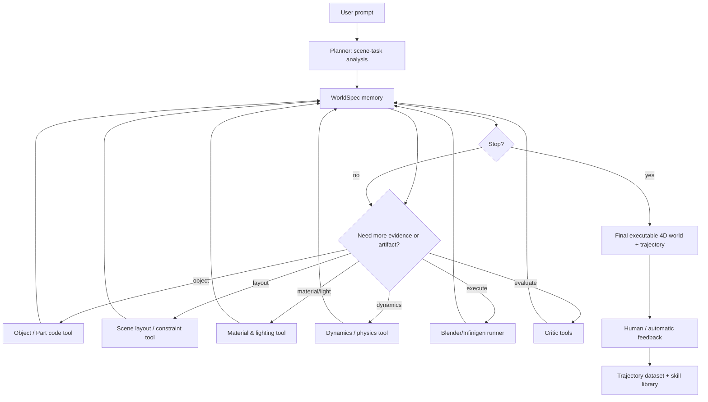

# Agentic World：以 Code2Worlds 为主线的 4D World Agent Insight

> 目标：不是再做一篇论文精读，而是把 Code2Worlds / Infinigen / Infinigen-Indoors / MeshCoder / 3DCodeBench / Skill-3D / S-Agent 放到同一条技术主线上，思考如何做一个能生成“粗糙但可执行动态世界”的 3D/4D agent。  
> 核心假设：**代码是 4D world 的中间介质；agent 不是固定 pipeline 的调用器，而是会根据任务选择工具、生成/执行/观察/修复世界代码，并把轨迹沉淀为可训练行为。**

---

## 0. 结论先行

我认为最值得做的方向不是“让 LLM 一次性写完整 Blender/Infinigen 工程”，而是：

> **把 4D world generation 重构成一个 agentic tool-use 问题：LLM 作为 planner，面对一个逐步增长的 `WorldSpec` / `WorldState`，按需调用对象生成、场景布局、材质光照、动力学注入、执行渲染、视觉/物理 critic、局部修复等工具；每次工具调用及其结果形成轨迹，人类或自动 critic 对最终世界打分，再把成功/失败轨迹训练成一个真正会生成 4D world 的 agent。**

这条路线继承 Code2Worlds 的正确主线：**语言到仿真代码，而不是语言到视频**。但它要修正 Code2Worlds 当前最明显的工程与研究瓶颈：**过强依赖 Infinigen/bpy 的具体脚本模板，且把 planner/resolver/realizer/postprocess 串成近似固定流水线，尚未形成可学习的工具选择策略。**

最关键的设计建议有四条：

1. **先解耦，不急着追求最终效果。**  
   Code2Worlds 现在的强项来自 Infinigen、gin 映射、bpy/Mantaflow/rigid-body 模板和 VLM critic 的组合，而不是一个通用世界代码语言。第一阶段应该抽出一个 backend-agnostic 的 `WorldSpec`，把 Infinigen、Infinigen-Indoors、MeshCoder、Blender 变成后端工具。

2. **代码作为中间介质，但代码不应只有一种形态。**  
   需要两层表示：上层是结构化世界 IR（对象、部件、材质、布局、动态、相机、约束、验证证据）；下层是目标后端代码（Infinigen `.gin`、Blender Python、MeshCoder part-code、physics postprocess script）。这样既保留可执行性，又避免被 Infinigen API 锁死。

3. **把“固定 pipeline”改成“可选工具集”。**  
   例如只有光照变化时不应强制对象生成；只有室内静态布局时不应强制动力学；点云对象输入时应该走 MeshCoder；对象级 prompt 可以走 Infinigen/3DCodeBench 的 asset code；复杂室内场景走 constraint/layout solver；动态 prompt 再调用 physics/dynamics tools。

4. **训练 agent 的数据不是 prompt-output，而是 trajectory。**  
   参考 S-Agent 的 SFT 轨迹拆解与 Skill-3D 的成功/失败技能库：每次运行都记录 `state -> tool_call -> artifact -> critic -> repair -> final_score`。人类看最后世界好坏给反馈，这个反馈反过来训练 planner 选择哪些工具、何时停止、如何修复。

---

## 1. 读到的核心事实与我的判断

### 1.1 Code2Worlds：主线是对的，但当前仍是 Infinigen/bpy prototype

Code2Worlds 的论文与项目页明确把任务定义为 **language-to-simulation code generation**，并用对象流、场景流、PostProcess Agent 与 VLM-Motion Critic 生成动态 4D 世界。arXiv 摘要中强调两个问题：多尺度上下文纠缠、语义—物理执行鸿沟，并提出双流架构与物理感知闭环；项目页也把方法概括为 Object Stream、Scene Stream 与 PostProcess/self-reflection 三部分。  
来源：[Code2Worlds arXiv](https://arxiv.org/abs/2602.11757)，[Code2Worlds project](https://aigeeksgroup.github.io/Code2Worlds/)，本地代码 `/Users/roywangj/Downloads/reference_codes/Code2Worlds`。

但本地仓库显示，当前实现高度依赖具体后端：

- README 要求额外安装 Infinigen，并用 `scripts/obj.sh`、`scripts/scene.sh`、`scripts/scene_stream*.sh` 创建对象/场景；动态场景由 `agent/postprocess/postprocess_agent.py` 或 `dynreflection.py` 处理。
- `scene_stream/realizer.py` 的角色是把参数字典编译为 Infinigen `.gin`，并且 prompt 里硬编码了大量 `terrain.ground_cover -> Terrain.ground_collection`、`vegetation.tree_density -> compose_nature.tree_density` 这样的 Infinigen schema 映射。
- `postprocess_agent.py` 直接面向 Blender Python、rigid body、Mantaflow、particle system，并固定读取 `./infinigen/outputs/fine/scene.blend`、`./infinigen/outputs/obj/obj.blend`，还要求生成 `USER_FILL` 占位让人找对象名。
- `scene_stream.sh` 是固定顺序：Planner -> Resolver -> Realizer -> Infinigen coarse -> Infinigen fine。这个更像 workflow script，不是 planner 自主选择工具。

我的判断：**Code2Worlds 已经证明“代码作为 4D world 表征”这条路是对的，但还没证明“agent 能自主生成 4D world”。** 现阶段更像一个由 LLM 填参数/填模板的多阶段编译器。下一步要做的不是把 prompt 写得更长，而是把它的组件工具化、状态化、轨迹化。

### 1.2 Infinigen / Infinigen-Indoors：它们不是最终范式，而是最强世界代码后端

Infinigen 给了自然世界的可程序化资产、材质、地形、流体、天气和真值生成链；Infinigen-Indoors 把室内资产、材质与约束布局系统补上。两篇最重要的启发不是“能出漂亮图”，而是：

- Infinigen 是一个 **world model codebase**：自然对象如何长成、材质如何生成、场景如何组合，都写在程序里。
- Infinigen-Indoors 是一个 **scene compiler**：用户/专家用约束图表达室内常识，求解器把它编译成布局状态。
- 二者都说明世界生成不能只靠像素模型；需要对象、材质、布局、物理、相机、标注共享同一个可执行源。

但它们也不应该直接成为我们 agent 的唯一语言。原因是：

- 资产/布局规则很强，但 API 深、依赖重、渲染慢。
- 它们的参数空间是专家设计的，不是自然语言友好的通用 IR。
- Infinigen-Indoors 的约束写法适合 solver，不适合 LLM 每次从零写完整住宅规则。
- 若 agent 只学会“如何调 Infinigen gin”，泛化会被 Infinigen schema 锁死。

因此我建议：**Infinigen 系列作为 backend 与 tool provider，而不是 agent 的唯一 action space。**

### 1.3 MeshCoder：对象级结构化代码的关键补位

MeshCoder 的价值在于把点云重建成可执行、分部件、可编辑的 Blender Python 脚本。它说明对象代码不一定只能从 Infinigen 正向采样，也可以从几何观测反推出来。对我们的方向，它有三个关键启发：

1. **对象代码需要部件化。**  
   不是生成一个整体 mesh，而是 chair/back/leg/handle/surface 这些语义部件有各自代码与参数。

2. **局部逆程序比整体逆程序更可学。**  
   MeshCoder 先学规范化部件代码，再逆变换回对象全局位姿，最后拼接对象程序。这个思路可以用于我们的对象生成工具：先生成/修复局部部件，再组装成对象。

3. **执行反馈还没用够。**  
   MeshCoder 当前主要是一次性点云到脚本；后续更自然的是 `generate -> execute -> compare geometry -> patch part code` 的 agentic loop。

它也有明显局限：训练/测试主要在合成程序化室内对象中闭环，且过滤掉大量部件重建失败的对象；所以不能直接证明真实扫描的通用 3D code agent 已经成立。但作为“结构化物体代码”的设计参考非常重要。

### 1.4 3DCodeBench：告诉我们“能执行”不等于“形状好”

3DCodeBench 是很好的评测/数据线索。arXiv 摘要把它定义为评估 VLM agents 写 Blender procedural code 的 benchmark，覆盖 text/image prompt 到 Blender Python；GitHub README 说明它基于 Infinigen / Infinigen-Indoors，把 procedural assets 转成 standalone Blender 5.0 scripts，覆盖 212 categories，并评估 single-shot、multi-turn、coding-agent settings。  
来源：[3DCodeBench arXiv](https://arxiv.org/abs/2606.01057)，[3DCodeBench GitHub](https://github.com/gaoypeng/3dcodebench)。

它最有启发的结果是：

- 失败主要来自 Blender API mismatch；execution traceback 的 multi-turn retry 可以显著提高 executability。
- 但 full coding-agent harness 虽能进一步提升执行率，条件形状质量并没有明显变好。
- 也就是说：**执行错误反馈解决的是“代码能不能跑”，不是“世界/形状是否正确”。**

这对我们非常关键。一个 4D world agent 不能只靠 traceback critic，还必须有：

- object fidelity critic；
- layout/constraint critic；
- physical/motion critic；
- temporal consistency critic；
- editability/code-structure critic；
- human preference feedback。

否则 agent 学到的只是“修 API 报错”，不是“生成好世界”。

### 1.5 Skill-3D 与 S-Agent：范式不是生成内容，而是训练 agent 的方法

Skill-3D 和 S-Agent 不是 4D world generation 论文，但它们给了 agent 范式。

Skill-3D 的核心是：场景/任务不同，应该调用不同证据链；把成功轨迹蒸馏成 scene-aware skills，失败轨迹作为 lessons；再用 agentic SFT + GRPO 训练小模型。公开信息中它强调有效工具使用率从 39% 到 78%，并用 Scene Memory + Skill Library 共同演化。  
来源：[Skill-3D arXiv](https://arxiv.org/abs/2606.07436)，[Skill-3D project](https://skill-3d.github.io/)。

S-Agent 的核心是：空间推理不是单帧判断，而是时空证据累积；VLM 是 semantic planner，工具负责 2D grounding、2D-to-3D lifting、空间专家聚合；Scene Memory 维护演化场景状态，Agent Memory 记录推理上下文；S-Agent 轨迹还能蒸馏成 S-Agent-8B。  
来源：[S-Agent arXiv](https://arxiv.org/abs/2606.20515)。

把它们迁移到 4D world generation，我认为应该变成：

- **S-Agent 给“单次任务内如何积累世界状态”的范式。**  
  对我们来说不是 accumulating visual evidence，而是 accumulating executable world state：对象、材质、布局、动力学、相机、执行结果、critic 反馈都写进 World Memory。

- **Skill-3D 给“跨任务如何沉淀工具经验”的范式。**  
  对我们来说不是 distance/counting/orientation skills，而是 prompt 类型到生成 workflow 的 skills：如“只做天气/光照变化”“室内刚体交互”“流体倾倒”“风驱动植被”“点云对象逆程序”“多物体室内布局”等。

---

## 2. 为什么“固定 pipeline + LLM follow instructions”不够

你提出的担心是对的：如果我们只是把工具说明写好，让 LLM 按预定义 pipeline 走完，那这个系统会像当前 Code2Worlds 一样，有效果但不够 agentic。它的问题主要有三类。

### 2.1 任务天然稀疏，不应每步都做

4D world prompt 的类型差异很大：

- “日出到日落的森林光照变化”：不需要对象流，主要是 scene + lighting timeline。
- “杯子倒在桌上水流出来”：需要对象、室内场景、流体/粒子、碰撞、motion critic。
- “从点云生成可编辑椅子”：主要走 MeshCoder，不需要 Infinigen 场景。
- “生成一个粗糙动态世界供 agent 训练”：可能优先 proxy collision geometry，而不是 photorealistic rendering。

固定 pipeline 会浪费算力，更重要的是会引入错误：不必要的对象生成/动力学/后处理会污染世界状态。

### 2.2 生成 4D world 的错误是局部的，修复也应局部

LLM 一次性重写完整代码会造成灾难性回归。更合理的是：

- 对象外观错了，修 object params 或 part code；
- 室内物体穿插，修 layout constraints；
- 风太强，修 dynamics params；
- 材质不对，修 material shader；
- API 报错，修 backend code；
- 运动语义不对，修 temporal script；
- 渲染太慢，降采样/代理几何/缓存。

这要求系统有一个可定位、可补丁的中间状态，而不是一坨 monolithic Blender script。

### 2.3 真正可训练的是“何时调用什么工具”

如果 pipeline 是人写死的，训练 agent 只能学会填参数。  
如果工具调用是开放的，轨迹就能回答更有价值的问题：

- prompt 属于哪类 scene-task？
- 哪些工具是不必要的？
- 哪一步最容易失败？
- 失败后应该重跑整个场景，还是局部 patch？
- 人类偏好与自动 critic 冲突时应该信谁？
- 什么时候可以提前停止？

这才是 Skill-3D / S-Agent 给我们的主线：**让工具调用策略本身成为学习对象。**

---

## 3. 建议的核心架构：WorldSpec + Tool-use Agent + Trajectory Training

### 3.1 两层代码表示

我建议不要只问“是否需要归纳整理成更结构化的场景中的物体代码”，答案是：**需要，但不要把它做成一个巨大的统一 DSL。**

更好的方案是两层：

1. **上层：backend-agnostic `WorldSpec` / `ObjectSpec` / `DynamicsSpec`。**  
   这层给 agent 规划、记忆、critic、训练使用，尽量结构化、可比较、可局部修改。

2. **下层：backend-specific executable code。**  
   包括 Infinigen `.gin`、Blender Python、MeshCoder part-code、bpy postprocess、USD/GLB export、physics/cache scripts。它们是工具产物，不是 agent 的唯一内部语言。

一个最小 `WorldSpec` 可以长这样：

```yaml
world_id: "rolling_bottle_living_room_v0"
intent:
  scene_type: "indoor_living_room"
  dynamic_type: ["rigid_body", "contact_motion"]
  quality_target: "coarse_dynamic_world"
objects:
  - id: "bottle_01"
    semantic_class: "glass_bottle"
    source: "object_generator|meshcoder|infinigen_asset|retrieved_code"
    parts:
      - name: "body"
        geometry_ref: "code://objects/bottle/body.py"
      - name: "neck"
        geometry_ref: "code://objects/bottle/neck.py"
    material:
      type: "brown_glass"
      roughness: 0.2
    collision_proxy:
      type: "convex_hull"
    dynamic_handles:
      rigid_body: true
layout:
  room: "living_room"
  anchors:
    - object: "bottle_01"
      relation: "on"
      target: "floor"
dynamics:
  frame_range: [1, 120]
  events:
    - type: "initial_velocity"
      object: "bottle_01"
      value: [1.2, 0.0, 0.0]
      angular: [0.0, 3.0, 0.0]
cameras:
  - id: "camera_main"
    role: "evaluation_render"
validation:
  required_checks:
    - "executes"
    - "object_visible"
    - "contact_with_floor"
    - "rolling_motion"
artifacts:
  backend: "blender"
  scripts: []
  renders: []
  critic_reports: []
```

这个 IR 的作用不是替代 Blender，而是让 agent 在每一步知道“当前世界里有什么、哪些字段已确定、哪些工具产出了哪些证据、下一步该补哪里”。

### 3.2 工具分层：借鉴 S-Agent，但面向生成

S-Agent 是 2D evidence -> 3D geometry -> spatial experts。  
我们的生成版可以对应为：

| 层级 | 生成任务中的含义 | 典型工具 |
|---|---|---|
| L0 Intent / Scene-task parsing | 判断任务类型、必须/可选模块、质量目标 | prompt parser, scene signature classifier |
| L1 World primitive construction | 生成对象、场景、材质、布局的候选结构 | Infinigen object tool, MeshCoder object tool, Indoor layout tool, material tool |
| L2 Execution / simulation grounding | 把候选结构变成可执行世界并 rollout | Blender runner, Infinigen runner, physics simulator, renderer |
| L3 Expert critics / repair planners | 把执行结果转成可用反馈和局部 patch | traceback critic, object critic, layout critic, motion critic, physical plausibility critic, human preference |
| L4 Skill / policy memory | 跨任务沉淀成功/失败 workflow | Skill library, failure lessons, trajectory retriever, SFT/RL dataset builder |

这和 S-Agent 的精神一致：**LLM 不直接“脑补”几何/物理正确性，而是请求工具生成证据；专家把原始执行结果翻译成可修复的结论。**

### 3.3 从固定流水线改成 planner 选择工具

一个更 agentic 的控制流应该是：



重点是：Planner 每一步都读当前 `WorldSpec` 和 `Agent Memory`，再决定下一次调用。它可以跳过无关工具，也可以在 critic 失败后局部回退。

---

## 4. 各论文应该放在项目里的位置

| 来源 | 项目中的角色 | 该复用什么 | 不该照搬什么 |
|---|---|---|---|
| Code2Worlds | 主线 prototype | language-to-simulation code；object/scene/dynamics 分解；visual/motion reflection | 不要照搬固定 pipeline；不要把 Infinigen gin 当唯一 IR |
| Infinigen | 自然世界后端 | 程序化自然资产、天气、地形、材质、标注/渲染链 | 不要让 agent 直接暴露全部深层 API |
| Infinigen-Indoors | 室内布局/约束后端 | 约束语言、布局 solver、可导出仿真场景 | 不要依赖专家手写复杂约束；要让 LLM 生成可验证约束片段 |
| MeshCoder | 对象级结构化代码后端 | 部件化 object code、点云到代码、局部 patch 思想 | 不要把其合成域指标等同真实扫描泛化 |
| 3DCodeBench | 评测/数据/错误分析 | standalone Blender code、execution metrics、multi-turn traceback repair、human preference arena | 不要只优化 executability；shape/world quality 需要更强 critic |
| S-Agent | 单任务状态/证据累积范式 | planner + hierarchical tools + Scene Memory/Agent Memory + trajectory SFT | 它是理解任务，不直接解决生成；需要改造成 World Memory |
| Skill-3D | 跨任务技能演化范式 | successful workflow -> skill；failed workflow -> lesson；agentic SFT/GRPO | 不要只存完整轨迹；要抽象成可复用 generation skills |

---

## 5. 具体 pipeline 设计

### 5.1 工具箱，而不是流水线

建议第一版工具箱如下：

| 工具 | 输入 | 输出 | 是否必须 | 备注 |
|---|---|---|---|---|
| `analyze_task` | prompt | scene-task JSON | 必须 | 判断 indoor/outdoor/object-only/dynamics-only/quality target |
| `retrieve_world_skill` | task JSON | candidate skills | 可选 | 参考 Skill-3D，找相似生成 workflow |
| `init_worldspec` | task JSON | WorldSpec v0 | 必须 | 初始化对象/场景/动态 slots |
| `generate_object_spec` | object prompt / point cloud / references | ObjectSpec + code refs | 可选 | 可接 MeshCoder / Infinigen / 3DCodeBench code |
| `generate_scene_layout` | scene prompt + objects | LayoutSpec / constraints | 可选 | 室内走 Infinigen-Indoors，室外走 Infinigen scene stream |
| `generate_material_lighting` | WorldSpec | MaterialSpec / LightingSpec | 可选 | 光照变化 prompt 可以只走这个 |
| `generate_dynamics` | WorldSpec + dynamic intent | DynamicsSpec + postprocess code | 可选 | rigid/fluid/particle/cloth/wind/timeline |
| `execute_world` | backend code | logs + blend/glb/video/images | 可选但常用 | 训练数据必须有执行结果 |
| `critic_execution` | logs | pass/fail + patch hints | 可选 | API/syntax/runtime |
| `critic_visual_object` | renders + prompt | object fidelity report | 可选 | 类似 Code2Worlds VLM-Critic |
| `critic_layout` | scene render + constraints | layout report | 可选 | 是否穿插、遮挡、房间关系 |
| `critic_motion` | rollout video + prompt | dynamics report | 可选 | 类似 VLM-Motion Critic |
| `critic_physics_numeric` | simulation traces | physical report | 可选 | 接触、速度、穿透、能量异常等 |
| `patch_worldspec` | critic report | local patch | 可选 | 只改出错字段或脚本片段 |
| `export_trajectory` | all states/tools/artifacts | trainable trajectory | 必须 | 核心资产 |

### 5.2 Planner 的决策原则

Planner 每一步不应输出自由文本长推理，而应输出结构化 action：

```json
{
  "thought_summary": "Need indoor layout before rigid-body dynamics because target object must contact floor/table.",
  "action": "generate_scene_layout",
  "arguments": {
    "scene_type": "living_room",
    "objects_required": ["glass_bottle"],
    "quality": "coarse"
  },
  "expected_observation": ["layout_spec", "candidate_floor_surface", "camera_candidates"],
  "stop_condition": "layout has navigable floor and visible support surface"
}
```

训练时可以保留 `thought_summary`，但 agent 真正学习的是 action selection、argument filling、state update、repair choice。

### 5.3 World Memory 与 Agent Memory

借鉴 S-Agent，但换成生成任务：

- **World Memory**：当前世界状态，实体中心，持续 merge。  
  存对象、部件、材质、布局、约束、动态事件、相机、backend artifacts、critic facts。

- **Agent Memory**：过程轨迹，append-only。  
  存 planner 决策、工具调用、失败、重试、分支、人工反馈、为什么停止。

World Memory 用来支持局部编辑；Agent Memory 用来训练工具调用策略。

### 5.4 Skill Library

借鉴 Skill-3D，把成功/失败生成轨迹抽象成 skills，而不是全文检索历史案例。

例子：

```yaml
skill_name: "indoor_rigid_body_contact"
trigger:
  scene_type: "indoor"
  dynamic_type: "rigid_body"
  requires_support_surface: true
workflow:
  - analyze_task
  - generate_object_spec
  - generate_scene_layout
  - generate_dynamics
  - execute_world
  - critic_execution
  - critic_motion
common_failures:
  - "object name unknown in Blender outliner"
  - "active rigid body added before transform apply"
  - "collision proxy too complex or unstable"
repair_rules:
  - "if exact target support unknown, run scene object discovery before dynamics"
  - "use convex hull for moving object and passive mesh for support"
success_metrics:
  - "executes"
  - "object visible"
  - "contact maintained"
  - "motion direction matches prompt"
```

这比保存完整 trajectory 更适合长期增长。长期目标是：planner 先检索 skill，再决定是否照做、改写或跳过。

---

## 6. 训练数据：轨迹怎么收集，怎么训练

### 6.1 每条 trajectory 应保存什么

至少保存以下字段：

```yaml
task:
  prompt: ...
  task_type: ...
  target_quality: "coarse|photorealistic|simulation"
initial_worldspec: ...
steps:
  - step_id: 1
    planner_input_state_hash: ...
    action: "generate_object_spec"
    arguments: ...
    tool_output:
      artifacts: [...]
      summary: ...
    state_delta: ...
    errors: []
  - step_id: 2
    action: "execute_world"
    tool_output:
      logs: ...
      renders: ...
      video: ...
critics:
  execution: ...
  visual: ...
  motion: ...
human_feedback:
  rating: 1-5
  preference_tags: ["motion_wrong", "object_good", "layout_bad"]
final:
  success: true/false
  exported_code: [...]
  exported_assets: [...]
  final_worldspec: ...
derived_training_views:
  final_answer_trace: ...
  turn_level_samples: [...]
  tool_expert_samples: [...]
```

S-Agent 的启发是：一条好 trajectory 不只变成一条 SFT 数据，可以拆成 final-level、turn-level、expert/tool-level 多粒度样本。  
Skill-3D 的启发是：失败 trajectory 也有价值，应抽成 lessons 和 negative examples。

### 6.2 奖励/反馈信号

建议把 reward 分成五类：

| 奖励 | 衡量什么 | 可能实现 |
|---|---|---|
| `R_exec` | 是否可运行、可渲染、可导出 | Blender/Infinigen logs |
| `R_semantic` | prompt 与对象/场景/材质是否一致 | VLM judge + human check |
| `R_dynamic` | 时间动态是否符合语义 | video critic + simple physics traces |
| `R_structure` | 代码是否结构化、可编辑、可局部修复 | static analyzer + IR completeness |
| `R_efficiency` | 是否少走冗余工具 | tool budget penalty |

一个粗略形式：

$$
R = 0.25R_{exec} + 0.25R_{semantic} + 0.25R_{dynamic} + 0.15R_{structure} + 0.10R_{efficiency}
$$

早期可以先不用复杂 RL，只做 SFT + preference filtering。等轨迹量起来，再做 DPO/GRPO 或 reward-weighted SFT。

### 6.3 训练阶段

我建议分四阶段：

1. **Stage 0：无训练 orchestrator。**  
   用强 LLM 做 planner，所有工具输出和人工反馈全部记录。目标是跑通可执行世界，不追求模型内化。

2. **Stage 1：轨迹 SFT。**  
   只用成功或高分轨迹训练 agent 学会格式、工具选择、参数填充、停止条件。

3. **Stage 2：失败修复训练。**  
   用失败轨迹训练“看到 critic report 后如何局部 patch”，这比单纯 prompt-to-code 更有价值。

4. **Stage 3：Skill + RL。**  
   把相似任务聚成 skills；用工具有效性、世界质量、人类偏好做 GRPO/DPO，训练 agent 少走冗余工具、选择更稳 workflow。

---

## 7. 解耦 Code2Worlds 的具体方案

### 7.1 先把现有组件封成 tools

不要一开始重写所有代码。先把本地 Code2Worlds 的组件包装成工具：

- `obj_select_agent.py` -> `select_dynamic_object`
- `obj_params_agent.py` -> `generate_object_params`
- `obj_generate_agent.py` -> `generate_object_code`
- `objreflection.py` -> `critic_object_visual`
- `scene_stream/planner.py` -> `plan_outdoor_manifest`
- `scene_stream/resolver.py` -> `resolve_outdoor_params`
- `scene_stream/realizer.py` -> `compile_infinigen_gin`
- `scene_stream_indoor/*.py` -> `plan/solve/compile_indoor_scene`
- `postprocess_agent.py` -> `generate_dynamics_code`
- `dynreflection.py` -> `critic_motion`
- `scripts/*.sh` -> backend runners, later替换成 Python tool APIs。

第一版只要做到：每个 tool 有 JSON schema 输入/输出，并把产物写回 WorldSpec。

### 7.2 再引入 backend abstraction

现在 Code2Worlds 的 outdoor realizer 直接写：

```python
OUTPUT_GIN = "./infinigen/infinigen_examples/configs_nature/scene_types/generated_scene.gin"
```

postprocess 直接假定：

```python
"scene_path": "./infinigen/outputs/fine/scene.blend"
"obj_path": "./infinigen/outputs/obj/obj.blend"
```

这类路径与后端耦合要移到 backend config：

```yaml
backend:
  name: "infinigen_blender"
  version:
    blender: "4.3|5.0"
    infinigen: "commit_hash"
  paths:
    scene_blend: ...
    object_blend: ...
    output_blend: ...
  capabilities:
    supports_indoor: true
    supports_nature: true
    supports_rigid_body: true
    supports_fluid: true
```

Planner 不应该关心具体路径，只应该读 capabilities。

### 7.3 把 “USER_FILL” 变成工具，不要交给人

当前 postprocess prompt 要求当对象名不确定时写 `USER_FILL`。这是研究原型能接受，但 agent 训练不能接受的断点。应新增：

- `inspect_scene_objects(scene.blend) -> object inventory`
- `match_semantic_target(inventory, target_semantic) -> object ids`
- `select_support_surface(scene, camera, target_relation) -> support object / plane`

这样 dynamics tool 可以自动获取对象名、位置、碰撞代理，而不是靠人打开 outliner。

### 7.4 粗糙动态世界优先：proxy geometry 先于 photorealism

你说“最好可以出一个粗糙的动态世界”，这非常正确。早期应该牺牲渲染真实感，优先保证：

- 对象身份稳定；
- 粗几何可碰撞；
- 动态事件能 rollout；
- 代码可执行；
- 轨迹可收集；
- critic 能定位错误。

这意味着可以采用双几何：

- `visual_geometry`：漂亮但可能复杂；
- `collision_proxy`：简单 convex/primitive，用于 dynamics；
- `semantic_parts`：用于编辑/评价/对象身份。

先用 proxy world 训练 agent，再逐步加 photorealistic backend。

---

## 8. 最小可行实验

### Experiment 1：固定 Code2Worlds pipeline vs agentic planner

目标：证明“planner 自主选择工具”优于固定 pipeline。

设置：

- 选 30 个 prompt，分成 object-only、scene-only、dynamics-only、indoor dynamic、outdoor dynamic、point-cloud object 六类。
- Baseline A：原始 Code2Worlds 固定 pipeline。
- Baseline B：LLM 一次性写 Blender script。
- Ours：WorldSpec planner + optional tools。

指标：

- 工具调用数；
- 执行成功率；
- 人工评分；
- 运动/场景/对象分项评分；
- 平均成本；
- 不必要工具调用率。

预期：agentic planner 在 task-sparse prompt 上更省、更少污染；复杂 prompt 上不一定马上更强，但修复轨迹更清晰。

### Experiment 2：局部修复是否优于全量重写

目标：证明 WorldSpec/part-code 的价值。

设置：

- 人工或自动制造 5 类错误：对象颜色错、布局穿插、刚体不动、流体不明显、API 报错。
- 比较全量重写 vs local patch。

指标：

- 修复成功率；
- 新增错误率；
- 修改行数/字段数；
- 重跑成本；
- 人类偏好。

预期：局部 patch 在稳定性和成本上明显更好。

### Experiment 3：轨迹 SFT

目标：验证 trajectory 可以训练出更好的 tool-use policy。

设置：

- 先用强 LLM planner 收集 200-500 条轨迹。
- 人类打分，筛出高质量轨迹。
- 拆成 turn-level/tool-level SFT 数据。
- 训练一个小 planner agent，只负责选择工具和填参数，不负责执行大模型视觉 critic。

指标：

- 工具选择准确率；
- 冗余调用率；
- 成功率；
- 平均轮数；
- 与强 LLM planner 的差距。

预期：即使世界质量不完美，也能看到小 agent 学会常见 workflow。

### Experiment 4：Skill Library

目标：验证 Skill-3D 范式是否能迁移到生成任务。

设置：

- 从轨迹聚类出 8-12 个 generation skills：
  - outdoor_weather_lighting；
  - indoor_static_layout；
  - indoor_rigid_body；
  - fluid_spill；
  - wind_vegetation；
  - object_only_mesh_code；
  - pointcloud_to_object；
  - fire_smoke_effect；
  - camera_timeline；
  - visual_repair。
- 比较 no-skill vs retrieved-skill prompting。

指标：

- 工具有效使用率；
- 失败类型复发率；
- 成功率；
- 成本。

预期：技能检索能减少重复踩坑，尤其是 dynamics 和 object-name/physics 参数问题。

---

## 9. 这个方向可以形成的论文/项目叙事

### 9.1 可能的定位

> **AgenticWorld: Learning Tool-Use Trajectories for Executable 4D World Generation**

核心叙事：

- 过去的 text-to-3D / text-to-video 输出不可编辑或缺物理。
- Code2Worlds 证明 language-to-simulation code 是正确方向，但仍依赖固定 pipeline 和 backend-specific templates。
- 我们提出 agentic 4D world generation：把世界生成拆成可选工具，把中间状态写成结构化 WorldSpec，让 planner 按任务调用工具，并从执行/视觉/物理/人类反馈中迭代修复。
- 最终收集轨迹训练 agent，使模型从“按说明调用工具”变成“自主选择和修复世界生成流程”。

### 9.2 和 Code2Worlds 的差异

| 维度 | Code2Worlds | AgenticWorld 目标 |
|---|---|---|
| 控制流 | object stream + scene stream + postprocess，近似固定 | planner 基于 WorldSpec 自主选择工具 |
| 中间表示 | manifest / params / gin / bpy script 分散 | 统一 WorldSpec + backend artifacts |
| 后端 | 强依赖 Infinigen/Blender | Infinigen、MeshCoder、Blender、未来 Houdini/Unreal 可插拔 |
| 反馈 | object critic + motion critic | execution / visual / layout / motion / physics / human 多 critic |
| 学习对象 | 主要是 LLM prompt-time generation | tool-use trajectory policy |
| 数据 | Code4D 小型诊断集 | trajectory dataset + skills + preference labels |

### 9.3 可能的创新点

1. **WorldSpec as executable world memory**：让 4D 生成过程有可累计、可局部修复的状态。
2. **Optional tool-use generation**：不是固定 pipeline，而是根据 prompt/状态/critic 选择工具。
3. **Trajectory distillation for 4D world agents**：从强 LLM + tools + human feedback 中蒸馏 agent。
4. **Skill library for world generation**：把成功/失败生成 workflow 抽象成可检索 generation skills。
5. **Multi-critic closed loop**：执行、视觉、布局、运动、物理和代码结构分开评价。

---

## 10. 风险与边界

### 10.1 最大科学风险：自动 critic 不等于真实物理

Code2Worlds 的 VLM-Motion Critic 能发现明显视觉违和，但它不能证明真实物性。两个不同质量/摩擦/外力参数可能产生相似视频。早期应把 claim 控制在：

> “physics-engine-executed and visually/semantically plausible dynamics”

不要声称真实物理系统辨识。

### 10.2 最大工程风险：后端太重

Infinigen + Blender + Cycles 渲染很慢。为训练 agent，需要大量 trajectory，因此必须有低成本模式：

- low-res render；
- proxy geometry；
- short rollout；
- cached assets；
- headless execution；
- only render keyframes；
- cheap critics first，昂贵 VLM/human critic 后置。

### 10.3 最大数据风险：只学会 Infinigen quirks

如果所有轨迹都来自 Infinigen，agent 可能只学会 gin 参数、固定路径、Blender API patch，而不是真正的 world generation strategy。解决方式：

- 用 WorldSpec 抽象掉 backend；
- 加入 3DCodeBench standalone object code；
- 加入 MeshCoder object/part code；
- 后续接 Houdini/Unreal/USD 作为新 backend；
- 评测时加入 backend transfer：同一 WorldSpec 编译到不同后端。

### 10.4 最大训练风险：失败轨迹噪声太大

失败很有价值，但直接 SFT 失败轨迹会教坏 agent。应分开处理：

- 成功轨迹用于 imitation；
- 失败轨迹用于 critic-to-patch、lesson extraction、negative preference；
- 低质量失败不要直接做 next-action SFT。

---

## 11. 我建议的近期路线图

### Week 1-2：状态与工具封装

- 定义 `WorldSpec v0`。
- 包装 Code2Worlds 现有 planner/resolver/realizer/postprocess 为 JSON tools。
- 所有 tool 输出写入统一 trajectory log。
- 先支持 5 类 prompt：
  - outdoor lighting/weather；
  - indoor static room；
  - rigid rolling/falling；
  - fluid/steam/fire；
  - object-only generation。

### Week 3-4：执行与 critic

- 接 Blender/Infinigen runner，保存 logs/renders/videos。
- 实现 execution critic、simple visual VLM critic、motion critic。
- 做局部 patch：API 报错 patch、dynamics param patch、object/material param patch。

### Month 2：轨迹数据与 planner baseline

- 收集 100-300 条 agent 轨迹。
- 人类打分并标注失败类型。
- 用强 LLM 生成 skill summaries。
- 训练或 prompt 一个小 planner，只负责 tool selection。

### Month 3：论文级实验

- 与固定 Code2Worlds pipeline、single-shot Blender code、无 skill 的 planner 对比。
- 报告：
  - execution success；
  - human preference；
  - dynamic plausibility；
  - tool efficiency；
  - repair success；
  - trajectory-to-agent distillation gain。

---

## 12. 最后凝练成一句 insight

**Code2Worlds 给了内容主线：4D world 应该是可执行仿真代码，而不是视频。Infinigen/MeshCoder/3DCodeBench 给了代码内容与评测土壤。Skill-3D/S-Agent 给了真正的 agent 范式：让模型围绕状态调用工具、积累证据/世界、记录成功失败轨迹，并把轨迹训练成策略。**

因此，我们真正要做的不是“更会写 Blender 的 LLM”，而是：

> **一个会把自然语言目标分解成世界状态、按需调用世界生成工具、通过执行反馈和人类偏好局部修复，并从这些轨迹中学习的 4D World Agent。**

---

## Sources

- Code2Worlds paper: [arXiv:2602.11757](https://arxiv.org/abs/2602.11757)
- Code2Worlds project / code: [project page](https://aigeeksgroup.github.io/Code2Worlds/), [GitHub](https://github.com/AIGeeksGroup/Code2Worlds), local repo `/Users/roywangj/Downloads/reference_codes/Code2Worlds`
- 3DCodeBench paper / code: [arXiv:2606.01057](https://arxiv.org/abs/2606.01057), [GitHub](https://github.com/gaoypeng/3dcodebench), [project](https://www.3dcodebench.com/)
- S-Agent: [arXiv:2606.20515](https://arxiv.org/abs/2606.20515)
- Skill-3D: [arXiv:2606.07436](https://arxiv.org/abs/2606.07436), [project](https://skill-3d.github.io/)
- Local reading notes:
  - `/Users/roywangj/journey_wj/research/mds4zotero/markdowns4zotero/3dAgent/Code2Worlds Empowering Coding LLMs for 4D World Generation/paper_DeepPaperNote.md`
  - `/Users/roywangj/journey_wj/research/mds4zotero/markdowns4zotero/3dAgent/Infinite Photorealistic Worlds using Procedural Generation/paper_DeepPaperNote.md`
  - `/Users/roywangj/journey_wj/research/mds4zotero/markdowns4zotero/3dAgent/Infinigen Indoors Photorealistic Indoor Scenes using Procedural Generation/paper_DeepPaperNote.md`
  - `/Users/roywangj/journey_wj/research/mds4zotero/markdowns4zotero/3dAgent/MeshCoder LLM-Powered Structured Mesh Code Generation from Point Clouds/paper_DeepPaperNote.md`
  - `/Users/roywangj/journey_wj/research/mds4zotero/markdowns4zotero/3dAgent/Skill-3D/paper_DeepPaperNote.md`
  - `/Users/roywangj/journey_wj/research/mds4zotero/markdowns4zotero/3dAgent/S-Agent Spatial Tool-Use Elicits Reasoning for Spatial Intelligence/paper_DeepPaperNote.md`
