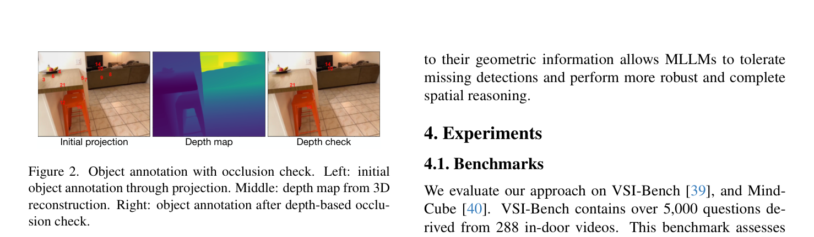

# Boosting MLLM Spatial Reasoning with Geometrically Referenced 3D Scene Representations

**Authors:** Jiangye Yuan, Gowri Kumar, Baoyuan Wang (Zillow Group)  
**Source:** `/Users/roywangj/journey_wj/research/papers4zotero/zotero1/storage/6T9F9NWC/Yuan 等 - 2026 - Boosting MLLM Spatial Reasoning with Geometrically Referenced 3D Scene Representations.pdf`  
**Detected source format:** selectable-text PDF (`pdf-text`)  
**Reader type:** complete 10-page Chinese-English adjacent paragraph-pair Markdown reader  
**Version:** arXiv:2603.08592v2 [cs.CV], 26 Apr 2026  

## Page / Section Index

| PDF pages | Content |
|---|---|
| 1 | Title, Authors, Abstract, 1. Introduction (opening, motivation, 3D data bottlenecks, GR3D proposal) |
| 2 | Figure 1 (Framework Overview), Introduction (contributions), 2. Related Work (2.1 3D scene representation, 2.2 LLMs and MLLMs for spatial reasoning) |
| 3 | Related Work (continued, GR3D positioning), 3. Method, 3.1 3D Scene Analysis (Geometric Information Extraction), 3.2 Language-Based Geometric Reasoning (3D Scene Representation Construction) |
| 4 | Figure 2 (Object annotation with occlusion check), Eq. (1), 3.3 Text-Image Association (Prompt Construction and Spatial Reasoning), 4. Experiments, 4.1 Benchmarks, 4.2 Implementation Details (Experimental Setup) |
| 5 | Figure 3 (Prompt template used in evaluations), 4.3 Evaluation Results (VSI-Bench & MindCube), 4.4 Ablation Study |
| 6 | Table 1 (VSI-Bench evaluation results), Table 2 (MindCube evaluation results), Table 3 (Ablation study), 4.5 Qualitative Examples |
| 7 | Figure 4 (Sparse view spatial reasoning qualitative examples), 5. Conclusion |
| 8 | Conclusion (future work / end-to-end framework), References [1]–[20] |
| 9 | References [21]–[46] |
| 10 | References [47] |

## Terminology Ledger

| Canonical term | Chinese | Usage decision |
|---|---|---|
| Geometrically Referenced 3D Scene Representations (GR3D) | 几何参考三维场景表征（GR3D） | 首次展开，后统一使用 GR3D |
| Multimodal Large Language Models (MLLMs) | 多模态大语言模型（MLLMs） | 统一使用 MLLM / MLLMs |
| spatial reasoning | 空间推理 | 核心任务能力，统一译法 |
| spatial intelligence | 空间智能 | 统一译法 |
| training-free | 免训练 | 统一译法 |
| plug-in mechanism | 即插即用插件机制 | 统一译法 |
| sparse input views | 稀疏输入视点 / 稀疏视角 | 统一译法 |
| neural 3D reconstruction | 神经三维重建 | 统一译法 |
| object geometric references | 目标几何参考 | 统一译法 |
| bounding box | 边界框（3D 边界框） | 统一译法 |
| geometric primitives | 几何基元 | 长方体、圆柱体、球体、棱柱等 |
| handedness | 手性（坐标系手性，如右手系 right-handed） | 统一译法 |
| upright orientation | 竖直朝向 | 统一译法 |
| occlusion check | 遮挡检查 | 统一译法 |
| depth map | 深度图 | 符号为 $D$ |
| camera canonical coordinates | 相机规范坐标 | 式 (1) $[x, y, z]^T = RC + t$ |
| camera intrinsics / extrinsics | 相机内参 / 相机外参 | 分别为 $K$ 与 $(R, t)$ |
| spatial anchors | 空间锚点 | 未检测物体的相对推断基准 |
| chain-of-thought (CoT) | 思维链（CoT） | 统一译法 |
| vector cross product | 向量叉积 | 用于方位与旋转方向判定 |
| voxel grid / voxel connectivity | 体素网格 / 体素连通性 | 点云聚类与实例分割机制 |
| VSI-Bench | VSI-Bench | 视觉—空间智能基准，保留原名 |
| MindCube | MindCube | 稀疏视角空间认知基准，保留原名 |
| $\pi^3$ | $\pi^3$ | 神经 3D 重建模型，保留原名 |
| VGGT | VGGT | 视觉几何 Transformer，保留原名 |
| Mask2Former | Mask2Former | 2D 语义分割模型，保留原名 |
| SceneScript | SceneScript | 结构化语言场景重建模型，保留原名 |

## Abstract

> <strong>Para. 1:</strong> While Multimodal Large Language Models (MLLMs) have achieved remarkable success in 2D visual understanding, their ability to reason about 3D space remains limited. To address this gap, we introduce geometrically referenced 3D scene representations (GR3D). Given a set of input images, GR3D annotates objects in the images with unique IDs and encodes their 3D geometric attributes as textual references indexed by these IDs. This representation enables MLLMs to interpret 3D cues using their advanced language-based skills in mathematical reasoning, while concurrently analyzing 2D visual features in a tightly coupled way. We present a simple yet effective approach based on GR3D, which requires no additional training and is readily applicable to different MLLMs. Implemented in a zero-shot setting, our approach yields substantial improvements on challenging spatial reasoning benchmarks, boosting GPT-5 performance by 9% on VSI-Bench and 12% on MindCube. Qualitative studies further demonstrate that GR3D empowers MLLMs to perform complex spatial reasoning with highly sparse input views.

> <strong>Para. 1[CN]:</strong> 尽管多模态大语言模型（MLLMs）在二维视觉理解方面取得了显著成功，但它们对三维空间进行推理的能力仍然受限。为填补这一空白，我们引入了几何参考三维场景表征（GR3D）。给定一组输入图像，GR3D 用唯一的数字 ID 在图像中对目标物体进行标注，并将它们的三维几何属性编码为由这些 ID 索引的文本参考。这种表征使 MLLM 能够利用其高阶的基于语言的数学推理能力来解析三维线索，同时以紧密耦合的方式协同分析二维视觉特征。我们提出了一种基于 GR3D 的简单而有效的方法，该方法无需额外训练，并且可以直接应用于不同的 MLLM。在零样本设定下实施时，我们的方法在极具挑战性的空间推理基准测试上带来了显著的性能提升，在 VSI-Bench 上将 GPT-5 的性能提升了 9%，在 MindCube 上提升了 12%。定性研究进一步表明，GR3D 使 MLLM 能够在极度稀疏的输入视点下执行复杂的三维空间推理。

## 1. Introduction

> <strong>Para. 1:</strong> Understanding 3D environments is a fundamental aspect of human cognition. Developing models capable of interpreting such environments and interacting through natural language has become a central objective in the 3D scene understanding community [13, 24]. Multimodal Large Language Models (MLLMs), trained with massive amounts of vision and language data, have achieved remarkable success in 2D visual understanding [7, 14, 31, 34]. Motivated by the success, they have been applied to 3D tasks in the hope that their 2D knowledge can be generalized to 3D cases. However, benchmarking studies reveal that MLLMs perform far below human level and struggle with tasks humans accomplish with ease [39].

> <strong>Para. 1[CN]:</strong> 理解三维环境是人类认知的一个基本维度。开发能够解析此类环境并通过自然语言进行交互的模型，已成为三维场景理解领域的核心目标 [13, 24]。基于海量视觉和语言数据训练的多模态大语言模型（MLLMs），在二维视觉理解方面取得了显著成功 [7, 14, 31, 34]。受此成功鼓舞，研究者将它们应用于三维任务，期望其二维知识能够泛化到三维情形中。然而，基准测试研究表明，MLLM 的表现远低于人类水平，并且在人类轻而易举就能完成的任务上面临巨大困难 [39]。

> <strong>Para. 2:</strong> Since MLLMs do not natively process 3D data, a complementary line of work extends vision-language models with explicit 3D inputs, such as point clouds, as an additional modality. Despite steady progress, these fine-tuned models do not show a clear advantage over leading MLLMs on spatial reasoning benchmarks [16, 42]. A key bottleneck lies in data availability. Since 3D scene-language datasets are orders of magnitude smaller than internet-scale vision-language corpora, fine-tuning is typically restricted to relatively small models with limited reasoning and language interaction capabilities. Furthermore, it remains a fundamental challenge to design algorithms that enable models to effectively utilize and understand 3D data. As shown in recent studies [42], models fine-tuned with 3D data exhibit shallow spatial understanding, frequently failing on simple reversed reasoning tasks (e.g., if A is above B, determining what is below A).

> <strong>Para. 2[CN]:</strong> 由于 MLLM 本身无法原生处理三维数据，一条互补的研究路线是通过引入显式三维输入（如点云）作为附加模态来扩展视觉—语言模型。尽管取得了持续进展，但这些经过微调的模型在空间推理基准上并未展现出相对于前沿 MLLM 的明显优势 [16, 42]。一个关键瓶颈在于数据的可获取性。由于三维场景—语言数据集的规模比互联网级别的视觉—语言语料库小了数个数量级，微调通常局限于推理和语言交互能力较为有限的相对较小的模型。此外，如何设计出能够让模型有效利用并理解三维数据的算法，仍是一个根本性的挑战。正如近期研究所揭示的 [42]，使用三维数据微调的模型表现出较为浅层的空间理解，在简单的反向推理任务（例如，若 A 在 B 之上，判断什么在 A 之下）上频繁失败。

> <strong>Para. 3:</strong> Recent work has analyzed MLLMs’ performance on spatial understanding tasks and examined their internal representations of space [39]. The findings indicate that MLLMs have difficulty reasoning about spatial relationship, such as distance, direction, and object size, and lack a holistic, global scene understanding. To address these limitations, we propose geometrically referenced 3D scene representations (GR3D). In this representation, objects are annotated in images with their unique IDs, and a list of textual references encode object geometries in a global 3D coordinate space. An example is shown in Fig. 1. It can be seen that text and images are explicitly cross-referenced via object IDs. Integrated with this representation, MLLMs can exploit their strong language-based abilities in mathematical and geometric reasoning [9, 25], while also flexibly accessing 2D semantic cues. This leads to precise, grounded, and interpretable spatial reasoning.

> <strong>Para. 3[CN]:</strong> 近期的工作分析了 MLLM 在空间理解任务上的表现，并考察了其内部的空间表征 [39]。研究结果表明，MLLM 难以对空间关系（如距离、方向和物体尺寸）进行推理，并且缺乏整体的全局场景理解。为了解决这些局限性，我们提出了几何参考三维场景表征（GR3D）。在该表征中，物体在图像中带有唯一的 ID 标注，并且一系列文本参考在全局三维坐标空间中对物体的几何形态进行编码。图 1 展示了一个示例。可以看出，文本和图像通过物体 ID 建立了显式的相互引用。与该表征结合后，MLLM 可以充分发挥其在数学和几何推理方面强大的基于语言的能力 [9, 25]，同时又能灵活地获取二维语义线索。这带来了精确、有依据且可解释的空间推理。

> <strong>Para. 4:</strong> An overall framework of leveraging GR3D for spatial reasoning is illustrated in Fig. 1. GR3D generation builds on recent advances in neural 3D reconstruction. Methods such as VGGT [33] and $\pi^3$ [36] can reconstruct 3D scenes from uncalibrated, unposed images with high accuracy and consistency. From reconstructed scenes, we derive object geometric attributes (e.g., bounding boxes, primitive types, and shape parameters) and convert them into structured textual references indexed by object IDs. Using estimated camera parameters, we project object centers into images and annotate projected locations with corresponding object IDs. The annotated images replace the original images as visual input for MLLMs, while textual references are combined with task-specific instructions to form text prompts. Our method does not require training and can work along with various MLLMs.

> <strong>Para. 4[CN]:</strong> 利用 GR3D 进行空间推理的总体框架如图 1 所示。GR3D 的生成建立在神经三维重建的最新进展之上。诸如 VGGT [33] 和 $\pi^3$ [36] 等方法能够以高精度和高一致性从未经校准、未标定位姿的图像中重建三维场景。从重建的场景中，我们推导出物体的几何属性（例如边界框、基元类型和形状参数），并将它们转换为由物体 ID 索引的结构化文本参考。利用估计的相机参数，我们将物体中心投影到图像中，并在投影位置标注对应的物体 ID。标注后的图像替代原始图像作为 MLLM 的视觉输入，而文本参考则与任务特定指令相结合以构建文本提示词。我们的方法不需要额外训练，并能够与各种 MLLM 协同工作。

> <strong>Para. 5:</strong> We evaluate our approach on two challenging spatial reasoning benchmarks, the Visual-Spatial Intelligence Benchmark (VSI-Bench) [39] and MindCube [40]. We implement our method in a zero-shot manner. We neither fine-tune on any data that overlap with this benchmark dataset nor construct similar question-answer pairs for training. Nevertheless, our method achieves state-of-the-art benchmarking performance, demonstrating strong generalization and effectiveness. Ablation studies further confirm the critical role of GR3D in achieving this performance.

> <strong>Para. 5[CN]:</strong> 我们在两个极具挑战性的空间推理基准测试——视觉—空间智能基准（VSI-Bench）[39] 和 MindCube [40] 上评估了我们的方法。我们以零样本方式实现了我们的方法。我们既未在与该基准数据集重叠的任何数据上进行微调，也未构建相似的问答对进行训练。尽管如此，我们的方法依然取得了最先进的基准测试性能，展现了强大的泛化能力和有效性。消融实验进一步证实了 GR3D 在取得这一性能中所发挥的关键作用。

> <strong>Para. 6:</strong> Our contributions are summarized as follows:
>
> - We introduce GR3D, a new 3D scene representation that allows MLLMs to access both 2D visual cues and 3D geometric information in a tightly linked fashion.
> - We present an effective approach that leverages GR3D to enhance the spatial reasoning capabilities of MLLMs.
> - Experimental results show that our approach significantly outperforms previous state-of-the-art models on spatial reasoning tasks in a zero-shot setting. We also showcase that GR3D enables effective spatial reasoning from very sparse input views, where even leading MLLMs such as GPT-5 tend to fail.

> <strong>Para. 6[CN]:</strong> 我们的贡献总结如下：
>
> - 我们引入了 GR3D，一种新颖的三维场景表征，它使 MLLM 能够以紧密关联的方式同时获取二维视觉线索和三维几何信息。
> - 我们提出了一种利用 GR3D 增强 MLLM 空间推理能力的有效方法。
> - 实验结果表明，在零样本设定下，我们的方法在空间推理任务上显著优于以往的最先进模型。我们还展示了 GR3D 能够在非常稀疏的输入视点下实现有效的空间推理，而在这种场景下即使是诸如 GPT-5 这样的领先 MLLM 也往往会失败。

### Figure 1. GR3D 框架概览

**Caption:** Figure 1. An overview of GR3D framework. Given a collection of images, our method reconstructs 3D scenes, extracts object-level geometric attributes, and transforms them into a GR3D representation, which consists of annotated images and textual references of geometric attributes. Such paired text and images are provided to a MLLM to perform spatial reasoning tasks.

**Caption[CN]:** 图 1. GR3D 框架概览。给定一组图像，我们的方法重建 3D 场景，提取目标级几何属性，并将它们转化为 GR3D 表征，该表征由带标注的图像和几何属性的文本参考组成。这些成对的文本和图像被提供给 MLLM 以执行空间推理任务。

## 2. Related Work / 相关工作

### 2.1 3D Scene Representation / 三维场景表征

> <strong>Para. 1:</strong> To enhance the 3D understanding capabilities of MLLMs, prior work has explored various 3D scene representations, including point cloud features [5, 38], multi-view image embeddings lifted into 3D space [10, 11, 44, 46], object-centric formulations [12, 13, 37]. However, most of these approaches require fine-tuning for models to understand the representations, and thus suffer from the aforementioned issues of data scarcity and learning effectiveness. SpatialPIN [23] estimates depth from an input image and extracts text-based 3D priors, which are used to interact with MLLMs. Although this approach operates without training, it is difficult for MLLMs to associate objects 3D priors with visual features, especially when dealing with complex scenes captured by multiple images. GPT4Scene [27] proposes complementing input images with a Bird’s Eye View (BEV) synthesized via 3D reconstruction. While BEV encodes global information, it is non-trivial to select a viewpoint that ensures visibility of all objects, and MLLMs still require fine-tuning to better understand such BEV images.

> <strong>Para. 1[CN]:</strong> 为了增强 MLLM 的三维理解能力，先前的研究探索了各种三维场景表征，包括点云特征 [5, 38]、提升到三维空间的多视角图像嵌入 [10, 11, 44, 46] 以及以物体为中心的表征形式 [12, 13, 37]。然而，这些方法中的绝大多数都需要进行微调才能让模型理解这些表征，因而受到前文所述的数据稀缺性和学习有效性问题的困扰。SpatialPIN [23] 从输入图像中估计深度并提取基于文本的三维先验，用于与 MLLM 交互。尽管该方法无需训练即可运行，但 MLLM 很难将物体的三维先验与视觉特征关联起来，尤其是在处理由多张图像捕获的复杂场景时。GPT4Scene [27] 提出通过三维重建合成鸟瞰图（BEV）来补充输入图像。虽然 BEV 编码了全局信息，但要选择一个能确保所有物体可见的视点并非易事，而且 MLLM 仍需微调才能更好地理解此类 BEV 图像。

### 2.2 LLMs and MLLMs for Spatial Reasoning / 用于空间推理的大语言模型与多模态大模型

> <strong>Para. 2:</strong> Multimodal models seek to integrate vision, language, and other modalities within a unified framework. Early work, such as CLIP [28] and ALIGN [15], exploits contrastive learning to align image and text representations, laying the foundation for cross-modal reasoning. Subsequent models, like Flamingo [1] and BLIP-2 [19], are able to take visual and linguistic input and perform various text generation tasks with great zero-shot generalization. More recently, proprietary models including Gemini [32] and GPT-5 [14], as well as open-source alternatives (e.g., Qwen-VL [3], InternVL [7], and LLaVA [21]), have demonstrated even greater capabilities in sophisticated reasoning and interactive human-AI dialogues.

> <strong>Para. 2[CN]:</strong> 多模态模型力求在统一框架内整合视觉、语言及其他模态。早期的工作（如 CLIP [28] 和 ALIGN [15]）利用对比学习来对齐图像和文本表征，为跨模态推理奠定了基础。随后的模型（如 Flamingo [1] 和 BLIP-2 [19]）能够接收视觉和语言输入，并以出色的零样本泛化能力执行各种文本生成任务。近期，包括 Gemini [32] 和 GPT-5 [14] 在内的闭源商业模型，以及开源方案（如 Qwen-VL [3]、InternVL [7] 和 LLaVA [21]），在复杂推理和交互式人机对话中展现出了更强大的能力。

> <strong>Para. 3:</strong> In contrast, our GR3D approach provides a 3D scene representation that can be natively understood by MLLMs without any fine-tuning. The representation tightly couples visual features with 3D geometric information, which enables MLLMs to reason in a more precise and coherent way. Our approach significantly enhances MLLM performance on spatial reasoning tasks in complex scenes.

> <strong>Para. 3[CN]:</strong> 相比之下，我们的 GR3D 方法提供了一种无需任何微调即可被 MLLM 原生理解的三维场景表征。该表征将视觉特征与三维几何信息紧密耦合，使 MLLM 能够以更加精确和连贯的方式进行推理。我们的方法显著提升了 MLLM 在复杂场景中空间推理任务上的表现。

## 3. Method / 方法

> <strong>Para. 1:</strong> In this section, we present the approach to leveraging GR3D for boosting MLLM spatial reasoning. In Sec. 3.1, we describe the method to extract 3D geometric information from input images. Then, we discuss the use of textual references to represent geometric information in Sec. 3.2. Finally, we elaborate on the method to associate images with textual references in Sec. 3.3.

> <strong>Para. 1[CN]:</strong> 在本节中，我们介绍了利用 GR3D 增强 MLLM 空间推理能力的方法。在第 3.1 节中，我们描述了从输入图像中提取三维几何信息的方法。随后，我们在第 3.2 节中讨论利用文本参考来表征几何信息。最后，我们在第 3.3 节中详细阐述将图像与文本参考相关联的方法。

### 3.1 Geometric Information Extraction (3D Scene Analysis) / 几何信息提取（三维场景分析）

> <strong>Para. 2:</strong> Given a set of multi-view images, we employ neural 3D reconstruction models to recover 3D scenes and camera poses. Unlike traditional Structure-from-Motion (SfM) pipelines that rely on handcrafted keypoint matching, such models use dense feature correlation and neural optimization, yielding reconstructions that are highly robust under textureless regions, occlusions, and wide baseline conditions. The output consists of a dense depth map $D$ for each input image along with the corresponding Camera intrinsics $K$ and extrinsics $(R, t)$. A 3D point cloud in a global coordinate system can be derived by unprojecting pixels with their depth values.

> <strong>Para. 2[CN]:</strong> 给定一组多视角图像，我们采用神经三维重建模型来恢复三维场景和相机位姿。不同于依赖手工设计关键点匹配的传统运动恢复结构（SfM）流程，此类模型利用稠密特征相关性和神经优化，在无纹理区域、遮挡和大基线条件下产生高度稳健的重建结果。其输出包括每张输入图像的稠密深度图 $D$，以及对应的相机内参 $K$ 和外参 $(R, t)$。通过利用深度值对像素进行反投影，可以推导出全局坐标系下的三维点云。

> <strong>Para. 3:</strong> To extract object-level representations, we segment the point cloud into clusters corresponding to candidate objects. Two strategies are commonly used, depending on the point cloud quality. One strategy is to run 2D semantic segmentation, back-project labels onto 3D points, and fuse labels across multiple views. This approach benefits from mature image segmentation models and remains effective when the 3D point cloud is noisy. The other strategy is to apply neural networks trained directly on point clouds [26, 30]. These methods produce more accurate results when dense, high-quality point clouds are available, though performance may vary across datasets.

> <strong>Para. 3[CN]:</strong> 为了提取物体级表征，我们将点云分割为对应于候选物体的聚类簇。根据点云质量的不同，通常采用两种策略。一种策略是运行二维语义分割，将标签反投影到三维点上，并在多个视角之间融合标签。该方法受益于成熟的图像分割模型，并且在三维点云存在噪声时依然有效。另一种策略是应用直接在点云上训练的神经网络 [26, 30]。当具备稠密且高质量的点云时，这些方法能产生更精确的结果，尽管其性能在不同数据集之间可能有所波动。

> <strong>Para. 4:</strong> For each object cluster, we estimate geometric attributes that range from coarse extents to detailed structures. Bounding boxes provide a compact representation of object extents defined by their centers, orientations, and side lengths. In many applications, such representations provide an adequate approximation for geometric inference and reasoning. When finer structural details are required, we fit analytic primitives such as cuboids, cylinders, spheres, and prisms. The parameters of these primitives are estimated by minimizing the residual distance between cluster points and the corresponding primitive surface. To handle noise and outliers, RANSAC-based fitting [29] and learning-based approaches [20, 47] can be applied for further enhancing reliability.

> <strong>Para. 4[CN]:</strong> 对于每个物体聚类簇，我们估计从粗粒度范围到细粒度结构的几何属性。边界框通过物体的中心、朝向和边长提供了物体范围的紧凑表征。在许多应用中，这种表征为几何推断和推理提供了充分的近似。当需要更精细的结构细节时，我们拟合解析几何基元，例如长方体、圆柱体、球体和棱柱体。这些基元的参数通过最小化聚类点与对应基元表面之间的残差距离来估计。为了处理噪声和离群点，可以应用基于 RANSAC 的拟合 [29] 和基于学习的方法 [20, 47] 来进一步提高可靠性。

### 3.2 3D Scene Representation Construction (Language-Based Geometric Reasoning) / 三维场景表征构建（基于语言的几何推理）

> <strong>Para. 5:</strong> MLLMs have demonstrated high proficiency in handling mathematical and logic tasks [4, 17]. Recent benchmarking studies [41] show that MLLMs can effectively interpret textual problem statements and reason over both 2D and 3D geometry. This ability is particularly important for spatial reasoning tasks, which often require precise calculations of distance, direction, and other spatial relationships.

> <strong>Para. 5[CN]:</strong> MLLM 在处理数学和逻辑任务方面表现出了极高的熟练度 [4, 17]。近期的基准测试研究 [41] 表明，MLLM 能够有效理解文本问题陈述，并在二维和三维几何上进行推理。这一能力对于空间推理任务尤为重要，因为此类任务通常需要对距离、方向以及其他空间关系进行精确计算。

> <strong>Para. 6:</strong> To leverage the language-based reasoning strengths of MLLMs, we represent the extracted 3D geometric information in a text-based format. In particular, each object is assigned a unique ID, and its geometric attributes are explicitly expressed as a text sequence. For a 3D scene, a list of such object geometric descriptions is provided as contextual input along with task-specific prompts. Thanks to the strong language understanding abilities of MLLMs, the exact form of text sequences can be flexible, allowing models to handle a mixture of different geometric primitives (see the example in Fig. 1). The level of geometric details can also be easily adjusted according to task requirements and data availability. While previous work also extracts object-level 3D information, it is typically used to organize input tokens [12, 13] or serve as auxiliary outputs [46], where precisely defined geometric data are not fully utilized for reasoning.

> <strong>Para. 6[CN]:</strong> 为了充分利用 MLLM 基于语言的推理优势，我们以基于文本的格式来表示提取的三维几何信息。具体而言，每个物体都被分配一个唯一的 ID，其几何属性被显式表示为一个文本序列。对于一个三维场景，这样一份物体几何描述列表将作为上下文输入连同任务特定提示词一同提供。得益于 MLLM 强大的语言理解能力，文本序列的具体形式可以非常灵活，允许模型处理不同几何基元的混合体（参见图 1 中的示例）。几何细节的层次也可以根据任务要求和数据可获得性轻松调整。虽然先前的研究也提取了物体级的三维信息，但通常将其用于组织输入 token [12, 13] 或作为辅助输出 [46]，未能充分利用精确定义的几何数据进行推理。

> <strong>Para. 7:</strong> Another advantage of using languages for geometric reasoning is the enhanced explainability, which is mostly absent in smaller fine-tuned models. Modern MLLMs can generate chain-of-thought reasoning, in which intermediate steps are explicitly articulated. The step-by-step calculation and reasoning not only reveal how a final answer is derived but also facilitate error analysis and model refinement. By examining intermediate steps, it becomes possible to identify systematic mistakes, assess model reliability, and design targeted strategies [35, 45] to reduce errors and enhance performance.

> <strong>Para. 7[CN]:</strong> 使用语言进行几何推理的另一个优势是增强的可解释性，而这在较小的微调模型中大多是缺失的。现代 MLLM 能够生成思维链（chain-of-thought）推理，其中中间步骤被清晰明确地阐述出来。逐步的计算和推理不仅揭示了最终答案是如何推导出来的，而且便于进行错误分析和模型改进。通过检查中间步骤，可以识别出系统性错误，评估模型的可靠性，并设计针对性的策略 [35, 45] 来减少错误并提升性能。

### 3.3 Prompt Construction and Spatial Reasoning (Text-Image Association) / 提示词构建与空间推理（文本—图像关联）

> <strong>Para. 8:</strong> When provided with both images and geometric descriptions, MLLMs often struggle to associate the two modalities, particularly in complex scenes containing many objects. This challenge is evident in our experiments, as discussed in Sec. 4.4. To address this issue, we annotate objects on images with their IDs, which establishes a clear correspondence between visual and geometric information.

> <strong>Para. 8[CN]:</strong> 当同时提供图像和几何描述时，MLLM 往往难以将这两种模态关联起来，尤其是在包含许多物体的复杂场景中。这一挑战在我们的实验中尤为明显（如第 4.4 节所述）。为了解决这个问题，我们在图像上使用物体的 ID 对其进行标注，从而在视觉信息与几何信息之间建立了清晰的对应关系。

### Figure 2. 带有遮挡检查的目标标注

**Caption:** Figure 2. Object annotation with occlusion check. Left: initial object annotation through projection. Middle: depth map from 3D reconstruction. Right: object annotation after depth-based occlusion check.

**Caption[CN]:** 图 2. 带有遮挡检查的目标标注。左：通过投影得到的初始目标标注。中：来自 3D 重建的深度图。右：经过基于深度的遮挡检查后的目标标注。

> <strong>Para. 9:</strong> Given an object with geometric attributes, we project its object center $C$ to the image by first transforming it into camera canonical coordinates:
>
> and then calculating its pixel coordinates $(i, j)$ on the image plane with camera intrinsics $K$. At the projected location $(i, j)$, we place the object IDs. For each image, we annotate all the objects whose centers are mapped inside image bounds.

$$
[x, y, z]^T = R C + t 	ag{1}
$$

> <strong>Para. 9[CN]:</strong> 给定一个具有几何属性的物体，我们首先将其物体中心 $C$ 变换到相机规范坐标系下，从而将其投影到图像上：
>
> 然后利用相机内参 $K$ 计算其在图像平面上的像素坐标 $(i, j)$。在投影位置 $(i, j)$ 处，我们放置物体 ID。对于每张图像，我们对所有中心映射在图像边界内的物体进行标注。

> <strong>Para. 10:</strong> During object center projection, no occlusion check is performed. As a result, occluded objects are also marked, leading to incorrect association. This issue is illustrated in the left image in Fig. 2. While one solution is to render full geometric shapes for an occlusion check, it significantly increases computational cost. Instead, we exploit the depth maps $D$ that are output from 3D reconstruction models. Specifically, we do not annotate an object if $z$ in Eq. (1) is larger than $D(i, j)$, i.e., the object center is farther than the depth at the same location. As can be seen in Fig. 2, most annotations corresponding to occluded objects are removed.

> <strong>Para. 10[CN]:</strong> 在物体中心投影过程中，并没有执行遮挡检查。结果，被遮挡的物体也会被标记，从而导致错误的关联。这个问题在图 2 的左图中得到了展示。虽然一种解决方案是渲染完整的几何形状以进行遮挡检查，但这会显著增加计算开销。作为替代方案，我们利用了三维重建模型输出的深度图 $D$。具体而言，如果式 (1) 中的 $z$ 大于 $D(i, j)$（即物体中心比该位置处的深度更远），我们就不会标注该物体。如图 2 所示，绝大部分对应于被遮挡物体的标注都被成功剔除。

> <strong>Para. 11:</strong> While certain semantic attributes (e.g., object category) can be obtained from 3D scene analysis, we deliberately exclude such semantic information from textual descriptions. This design encourages MLLMs to infer semantic information directly from images. As MLLMs are shown to be highly capable in visual understanding [14, 31], they can effectively extract task-relevant semantics. Furthermore, MLLMs dynamically attend to image regions relevant to a given task, which is more computationally efficient than precomputing and storing exhaustive semantic analysis.

> <strong>Para. 11[CN]:</strong> 尽管某些语义属性（例如物体类别）可以从三维场景分析中获得，但我们特意从文本描述中排除了此类语义信息。这种设计鼓励 MLLM 直接从图像中推断语义信息。由于 MLLM 已被证明在视觉理解方面具备强大能力 [14, 31]，它们能够有效地提取与任务相关的语义。此外，MLLM 能够动态关注与给定任务相关的图像区域，这比预先计算并存储详尽的语义分析具有更高的计算效率。

> <strong>Para. 12:</strong> It is highly challenging to extract 3D information for every object in a scene, regardless of the chosen algorithm. Recent research [39] shows that MLLMs exhibit a strong understanding of relative positions of objects in close proximity, but it degrades significantly as object distance increases. Since annotated objects are registered to a global 3D coordinate system, MLLMs can use those objects as spatial anchors and infer the likely positions of missing objects based on their spatial relationships with nearby annotated ones. Therefore, our method to link objects in images to their geometric information allows MLLMs to tolerate missing detections and perform more robust and complete spatial reasoning.

> <strong>Para. 12[CN]:</strong> 无论选择何种算法，要提取场景中每个物体的三维信息都极具挑战性。近期的研究 [39] 表明，MLLM 对彼此靠近的物体的相对位置表现出较强的理解，但随着物体间距离的增加，这种理解能力会显著退化。由于已标注的物体被配准到了全局三维坐标系中，MLLM 可以将这些物体作为空间锚点，并根据缺失物体与邻近已标注物体之间的空间关系，推断出缺失物体的可能位置。因此，我们将图像中的物体与其几何信息相链接的方法，使 MLLM 能够容忍检测遗漏，并执行更为稳健和完整的空间推理。

## 4. Experiments / 实验

### 4.1 Experimental Setup (Benchmarks & Implementation Details) / 实验设置（基准测试与实现细节）

> <strong>Para. 1:</strong> We evaluate our approach on VSI-Bench [39], and MindCube [40]. VSI-Bench contains over 5,000 questions derived from 288 in-door videos. This benchmark assesses a broad spectrum of spatial understanding capabilities, including configurational tasks (object counting, relative distance, relative direction, and route planning), measurement estimation tasks (object size, room size, and absolute distance), and a spatiotemporal task of determining the order of appearance. MindCube focuses on spatial reasoning from limited input views. It contains questions on object spatial relationships, where each question is based on a scene captured by 2 to 4 views, with various camera movement types.

> <strong>Para. 1[CN]:</strong> 我们在 VSI-Bench [39] 和 MindCube [40] 上评估了我们的方法。VSI-Bench 包含源自 288 个室内视频的 5,000 多个问题。该基准评估了广泛的空间理解能力，包括构型任务（物体计数、相对距离、相对方向和路径规划）、测量估计任务（物体尺寸、房间尺寸和绝对距离）以及确定出现顺序的时空任务。MindCube 侧重于基于有限输入视点的空间推理。它包含关于物体空间关系的问题，其中每个问题基于由 2 到 4 个视点捕获的场景，并伴有各种相机运动类型。

> <strong>Para. 2:</strong> We adopt the $\pi^3$ model [36] for reconstruction, as it achieves high accuracy and can predict metric scale. For video input, It is applied to subsampled frames. We also run Mask2Former [8] trained on ADE20K to obtain semantic segmentation for each input image. The reconstructed point clouds are rotated to be axis-aligned using the up direction estimated from floor points and the dominant direction of horizontal room boundaries.

> <strong>Para. 2[CN]:</strong> 我们采用 $\pi^3$ 模型 [36] 进行重建，因为它能够实现高精度并预测度量尺度。对于视频输入，它应用于下采样的视频帧。我们还运行在 ADE20K 上训练的 Mask2Former [8] 以获得每张输入图像的语义分割。使用根据地面点估计的向上方向以及水平房间边界的主导方向，将重建的点云旋转为轴对齐。

> <strong>Para. 3:</strong> Because the point clouds are reconstructed from images, they are noisier than those from depth sensors, making existing 3D segmentation models unreliable. Instead, we back-project 2D semantic labels to the point cloud and aggregate them using a voxel grid, assigning each voxel the majority label of its points. Spatially connected voxels with the same label are grouped into objects, and 3D bounding boxes are computed using their center coordinates and side lengths. For objects such as round tables, we fit vertical cylinders by projecting voxel groups onto the xy-plane and fitting circles using least squares, with height determined by the voxel group’s z extent. Extracted geometric attributes are converted into compact textual references indexed by numeric IDs, and the IDs are placed on the images via camera projection, as described in Sec. 3.1.

> <strong>Para. 3[CN]:</strong> 由于点云是从图像中重建出来的，它们比来自深度传感器的点云噪声更大，导致现有的三维分割模型变得不可靠。作为替代，我们将二维语义标签反投影到点云上，并利用体素网格对它们进行聚合，为每个体素分配其内部点的多数标签。具有相同标签的空间连通体素被分组为物体，并利用它们的中心坐标和边长计算三维边界框。对于诸如圆桌之类的物体，我们通过将体素组投影到 xy 平面上并使用最小二乘法拟合圆来拟合竖直圆柱体，其高度由体素组在 z 轴方向上的跨度确定。提取的几何属性被转换为由数字 ID 索引的紧凑文本参考，并且如第 3.1 节所述，通过相机投影将这些 ID 放置在图像上。

> <strong>Para. 4:</strong> The GR3D input consists of annotated images and textual references inserted into a prompt template. Fig. 3 shows the template used in the experiments, which explains the structure of the representation. We observe that it is important to specify the handedness and the upright orientation of the coordinate system, as this allows MLLMs to correctly apply orientation tests to solve direction-related questions. To reduce token usage, we provide the pre-computed area of room boundary polygons for room size questions.

> <strong>Para. 4[CN]:</strong> GR3D 的输入由带标注的图像和插入提示词模板中的文本参考组成。图 3 展示了实验中使用的模板，该模板解释了该表征的结构。我们观察到，指明坐标系的手性以及竖直朝向至关重要，因为这允许 MLLM 正确应用定向测试来解决与方向相关的问题。为了减少 token 消耗，对于房间尺寸问题，我们提供了预先计算好的房间边界多边形面积。

### Figure 3. 评测中使用的提示词模板

**Caption:** Figure 3. Prompt template used in evaluations.

**Caption[CN]:** 图 3. 评测中使用的提示词模板。

> <strong>Para. 5:</strong> **Prompt Template Content (Fig. 3):**
>
> You are a spatial reasoning assistant. You are given downsampled video frames of an indoor scene. Some objects in the frames are annotated with their numeric IDs. For each annotated object, its 3D geometric data are given below. Unless otherwise specified, each object is represented by a 3D bounding boxes defined by six numbers, center coordinates (x, y, z) and lengths along the x, y, z axes. Objects may also be geometric primitives described by their parameters. Units are in centimeters. The coordinate system is right-handed, with the z-axis pointing up.
>
> `<List of object IDs and geometric data>`
>
> The room size is `<calculated room size>` square meters.
>
> Your task is to answer questions about this scene. Follow these guidelines:
> 1. For questions on distance, direction, and navigation, reason in the 2D x–y plane.
> 2. For unannotated objects, estimate their coordinates based on geometric data of nearby annotated objects.
> 3. To determine directions, use vector cross product calculation when possible.
>
> The question is:
> `<A question here>`

> <strong>Para. 5[CN]:</strong> **提示词模板内容（图 3）：**
>
> 你是一名空间推理助手。你将获得一个室内场景的降采样视频帧。画面中的部分物体标注有其数字 ID。对于每个标注物体，其 3D 几何数据在下方给出。除非另有说明，每个物体均由定义在六个数字上的 3D 边界框表示，包括中心坐标 (x, y, z) 以及沿 x, y, z 轴的长度。物体也可能是由其参数描述的几何基元。单位为厘米。坐标系为右手系，z 轴朝上。
>
> `<物体 ID 及几何数据列表>`
>
> 房间大小为 `<计算得到的房间面积>` 平方米。
>
> 你的任务是回答关于该场景的问题。请遵循以下指南：
> 1. 对于关于距离、方向和导航的问题，在二维 x–y 平面内进行推理。
> 2. 对于未标注的物体，根据邻近已标注物体的几何数据估计其坐标。
> 3. 确定方向时，尽可能使用向量叉积计算。
>
> 问题是：
> `<此处为具体问题>`

### 4.2 Benchmark Results on VSI-Bench and MindCube / VSI-Bench 与 MindCube 基准评测结果

> <strong>Para. 6:</strong> Evaluation results on VSI-Bench are summarized in Tab. 1. For comparison, we include the benchmark scores of GPT-4o and Gemini-1.5 Pro, reported in [39], as well as the scores of InternVL2 [6], a leading open-source mid-size model on this benchmark. VG LLM [43] is among the few models fine-tuned with 3D scene data and evaluated on VSI-Bench. In addition, we evaluate GPT-5 on this benchmark$^1$. To assess the effectiveness of our method, we measure the performance of incorporating GR3D with InternVL2, GPT-4o and GPT-5$^2$.
>
> ---
> $^1$ We set reasoning effort to low, which provides a favorable balance between accuracy and efficiency.  
> $^2$ We follow the setting in [39], using 32 frames for InternVL2 and 16 frames for the GPT models.

> <strong>Para. 6[CN]:</strong> VSI-Bench 上的评测结果总结于表 1 中。为了进行比较，我们纳入了文献 [39] 中报告的 GPT-4o 和 Gemini-1.5 Pro 的基准得分，以及 InternVL2 [6]（该基准上领先的开源中型模型）的得分。VG LLM [43] 是少数几个使用三维场景数据微调并在 VSI-Bench 上进行评测的模型之一。此外，我们还在该基准上对 GPT-5 进行了评测$^1$。为了评估我们方法的有效性，我们测量了将 GR3D 与 InternVL2、GPT-4o 和 GPT-5 结合后的性能$^2$。
>
> ---
> $^1$ 我们将推理努力程度（reasoning effort）设置为 low，这在准确率和效率之间提供了良好的平衡。  
> $^2$ 我们遵循文献 [39] 中的设置，对 InternVL2 使用 32 帧，对 GPT 系列模型使用 16 帧。

### Table 1. VSI-Bench 评测结果

| Method Name | Obj. Count | Abs. Dist. | Obj. Size | Room Size | Rel. Dist. | Rel. Dir. | Route Plan | Appr. Order | Avg. |
|---|---|---|---|---|---|---|---|---|---|
| InternVL2-8B [6] | 31.3 | 29.0 | 48.9 | 44.2 | 38.0 | 33.4 | 28.9 | 46.4 | 37.5 |
| VG LLM-8B [43] | **67.9** | 37.7 | 58.6 | 62.0 | 46.6 | 40.7 | 32.4 | 59.2 | 50.7 |
| Gemini-1.5 Pro [32] | 56.2 | 30.9 | 64.1 | 43.6 | **51.3** | 46.3 | 36.0 | 34.6 | 45.4 |
| GPT-4o-2024-08-06 [14] | 46.2 | 5.3 | 43.8 | 38.2 | 37.0 | 41.3 | 31.5 | 28.5 | 34.0 |
| GPT-5-2025-08-07 [14] | 39.7 | 28.8 | **68.9** | 50.7 | 42.6 | 42.4 | 50.0 | **69.3** | 50.3 |
| GR3D + InternVL2-8B | 33.9 | 29.3 | 46.2 | 63.7 | 37.1 | 40.3 | 30.1 | 53.7 | 42.5 |
| GR3D + GPT-4o-2024-08-06 | 48.3 | 30.7 | 44.1 | 66.3 | 42.1 | 40.7 | 46.4 | 44.7 | 45.3 |
| GR3D + GPT-5-2025-08-07 | 52.2 | **48.2** | 62.5 | **72.1** | 50.8 | **69.5** | **58.7** | 66.2 | **59.8** |

**Caption:** Table 1. VSI-Bench evaluation results. GR3D combined with GPT-5 achieves state-of-the-art performance. The best result for each task among all models is indicated in bold.

**Caption[CN]:** 表 1. VSI-Bench 评测结果。GR3D 与 GPT-5 结合取得了最先进的性能。所有模型中每个任务的最佳结果均以粗体标出。

> <strong>Para. 7:</strong> Among all MLLMs, GPT-5 achieves the highest overall score. While the fine-tuned VG LLM attains a comparable performance, it should be noted that its training data include videos overlapping with VSI-Bench and questions similar to those in the benchmark. When integrated with GR3D, all three models exhibit performance gains, where models with stronger reasoning capabilities show greater improvements. In particular, GPT-5 achieves a 9% increase, setting a new state of the art. This validates that our approach represents 3D spatial information in a form that can be effectively utilized by MLLMs. The improvements across all three models demonstrate that our approach can function as a general plug-in mechanism for enhancing spatial reasoning in MLLMs. As MLLMs continue to advance rapidly, our approach can immediately leverage these advancements without fine-tuning or retraining.

> <strong>Para. 7[CN]:</strong> 在所有 MLLM 中，GPT-5 取得了最高的总体得分。虽然经过微调的 VG LLM 取得了与之相当的性能，但应当指出，其训练数据包含了与 VSI-Bench 重叠的视频以及与该基准中相似的问题。在与 GR3D 结合后，所有三个模型均展现出性能增益，其中具备更强推理能力的模型表现出更大的提升幅度。特别是，GPT-5 取得了 9% 的增幅，刷新了最先进的技术水平。这证实了我们的方法以一种能够被 MLLM 有效利用的形式表示了三维空间信息。所有三个模型上的提升表明，我们的方法可以作为一个通用的即插即用插件机制，用于增强 MLLM 的空间推理能力。随着 MLLM 继续快速发展，我们的方法能够立即利用这些进步，而无需进行微调或重新训练。

> <strong>Para. 8:</strong> Tab. 2 presents the MindCube results. We include models with leading performance reported in [40]. Consistent with the trends observed on VSI-Bench, GR3D yields substantial performance improvements, boosting the accuracy of GPT-5 by 12%. To our knowledge, this result represents the highest accuracy achieved by zero-shot methods on MindCube, highlighting the effectiveness of our representation in scenarios with sparse input views. Overall, the consistent gains across both VSI-Bench and MindCube demonstrate the generality of our approach and its ability to support diverse forms of 3D spatial reasoning without task-specific adaptation.

> <strong>Para. 8[CN]:</strong> 表 2 展示了 MindCube 的结果。我们纳入了文献 [40] 中报告的具有领先性能的模型。与在 VSI-Bench 上观察到的趋势一致，GR3D 带来了显著的性能提升，将 GPT-5 的准确率提高了 12%。据我们所知，该结果代表了零样本方法在 MindCube 上取得的最高准确率，凸显了我们的表征在稀疏输入视点场景下的有效性。总体而言，在 VSI-Bench 和 MindCube 两个基准上取得的一致增益证明了我们方法的通用性，以及它无需任务特定适配即可支持多种形式的三维空间推理的能力。

### Table 2. MindCube 评测结果

| Method Name | Rotation | Among | Around | Overall |
|---|---|---|---|---|
| LLaVA-Onevision-7B [18] | 36.5 | 48.4 | 44.1 | 47.4 |
| DeepSeek-VL2-Small [22] | 37.0 | 50.4 | 26.9 | 47.6 |
| GPT-5-2025-08-07 [14] | 87.5 | 39.3 | 66.4 | 55.0 |
| GR3D + GPT-5-2025-08-07 | **88.5** | **55.7** | **76.0** | **66.8** |

**Caption:** Table 2. MindCube evaluation results. Rotation, among, and around represent subsets with different camera placements. GR3D combined with GPT-5 achieves the highest accuracy. The best result for each subset across all models is indicated in bold.

**Caption[CN]:** 表 2. MindCube 评测结果。Rotation（旋转）、among（居中）和 around（环绕）代表具有不同相机放置方式的子集。GR3D 与 GPT-5 结合取得了最高的准确率。所有模型在各子集上的最佳结果均以粗体标出。

> <strong>Para. 9:</strong> While our approach achieves strong overall performance, further analysis reveals that a large portion of the errors stem from inaccurate geometric attributes. In particular, our current implementation mainly relies on voxel connectivity to separate individual object instances, which struggles in cluttered scenes and thus reduces the accuracy of object counting and size estimation. More advanced 3D instance segmentation models could lead to improvements. In addition, when point clouds are highly noisy, the current object detection method tends to either miss objects or overestimate their dimensions. This issue can be mitigated through more robust 3D semantic segmentation or denoising techniques.

> <strong>Para. 9[CN]:</strong> 尽管我们的方法取得了强大的总体性能，但进一步的分析表明，很大一部分错误源于不准确的几何属性。特别是，我们当前的实现主要依赖体素连通性来分离单个物体实例，这在杂乱场景中面临困难，从而降低了物体计数和尺寸估计的准确性。更先进的三维实例分割模型可能会带来改进。此外，当点云存在高度噪声时，现有的物体检测方法往往会出现漏检物体或高估其尺寸的情况。这一问题可以通过更稳健的三维语义分割或去噪技术来缓解。

### 4.3 Ablation Study / 消融实验

> <strong>Para. 10:</strong> In this section, we conduct ablation studies. We use VSI-Bench and GPT-5 for all experiments. Results are summarized in Tab. 3. For brevity, we present scores of two configurational tasks and the average score of all tasks.

> <strong>Para. 10[CN]:</strong> 在本节中，我们进行了消融实验。我们在所有实验中均使用 VSI-Bench 和 GPT-5。结果总结于表 3 中。为简明起见，我们展示了两项构型任务的得分以及所有任务的平均得分。

### Table 3. 消融实验结果

| Method | Rel. Dir. | Route Plan | Avg. |
|---|---|---|---|
| GR3D | 69.5 | 58.7 | 59.8 |
| No object annotation | 51.3 | 52.0 | 50.3 |
| VGGT reconstruction | 62.2 | 56.7 | 58.3 |
| Camera parameters | 42.6 | 45.4 | 48.8 |
| Scene descriptions | 51.9 | 51.0 | 53.4 |

**Caption:** Table 3. Ablation study. We evaluate 1) removing object annotations in images, 2) replacing $\pi^3$ with VGGT, 3) providing camera parameters to implicitly associate images with object geometric information, and 4) converting images into scene descriptions with object ID citations. For brevity, we show the scores of two configurational tasks and the overall average.

**Caption[CN]:** 表 3. 消融实验。我们评估了：1）去除图像中的目标标注，2）将 $\pi^3$ 替换为 VGGT，3）提供相机参数以隐式关联图像与目标几何信息，以及 4）将图像转换为带有目标 ID 引用的场景描述。为简明起见，我们展示了两项构型任务的得分以及总体平均分。

> <strong>Para. 11:</strong> **Effectiveness of object annotations.** We first investigate the role of object annotations by removing object IDs from images while keeping all other inputs unchanged. As shown in Tab. 3, the resulting performance is nearly identical to GPT-5 alone. This indicates that without providing explicit association, MLLMs are unable to effectively utilize the provided geometric information.

> <strong>Para. 11[CN]:</strong> **目标标注的有效性。**我们首先通过在保持所有其他输入不变的情况下从图像中移除物体 ID，来探究物体标注的作用。如表 3 所示，所得性能与单独使用 GPT-5 几乎完全相同。这表明，在不提供显式关联的情况下，MLLM 无法有效利用所提供的几何信息。

> <strong>Para. 12:</strong> **Impact of reconstruction models.** To assess the impact of the reconstruction component, we replace $\pi^3$ with VGGT. As VGGT does not predict metric scales, we estimate a scaling factor from the ratio between the typical real-world heights and reconstructed heights of selected objects (e.g., ceilings, countertops, and desks). As can be seen, $\pi^3$ performs slightly better than VGGT, due to its improved reconstruction accuracy. We expect that continued advances in reconstruction models will further improve overall performance.

> <strong>Para. 12[CN]:</strong> **重建模型的影响。**为了评估重建模块的影响，我们将 $\pi^3$ 替换为 VGGT。由于 VGGT 不预测度量尺度，我们根据选定物体（例如天花板、台面和书桌）的典型真实世界高度与重建高度之间的比率来估计尺度因子。可以看出，$\pi^3$ 的表现略优于 VGGT，这归因于其更高的重建精度。我们期望重建模型的持续进步将进一步提升整体性能。

> <strong>Para. 13:</strong> **Camera parameters for implicit association.** Instead of annotating objects in images via camera projection, we provide the full set of camera parameters for each input image, including focal length, the principal point, and the extrinsic matrix. These parameters allow MLLMs to compute the mapping between 3D space and the image plane when needed. We observe that the performance drops compared with the results above. By examining the reasoning process, we find that while GPT-5 can occasionally perform camera projection calculations correctly, its behavior is inconsistent and often error-prone, particularly for questions that require multiple projections.

> <strong>Para. 13[CN]:</strong> **用于隐式关联的相机参数。**作为通过相机投影在图像中标注物体的替代方案，我们为每张输入图像提供了完整的相机参数集，包括焦距、主点以及外参矩阵。这些参数允许 MLLM 在需要时计算三维空间与图像平面之间的映射。我们观察到，与上述结果相比，性能出现了下降。通过检查推理过程，我们发现虽然 GPT-5 偶尔能够正确执行相机投影计算，但其表现并不稳定且常常容易出错，尤其是对于需要多次投影的问题。

> <strong>Para. 14:</strong> **Textual scene descriptions with object ID citations.** Prior work [42] reports that replacing raw images with text descriptions generated via image captioning can improve spatial reasoning performance. Motivated by this, we experiment with a similar approach in our setting. Specifically, we prompt GPT-5 to produce comprehensive and spatially detailed scene descriptions. In order to utilize geometric references, the captioning input is the images with object annotations, and the prompt requires that, whenever an annotated object is mentioned, its ID should be included next to the mention. This ensures that object mentions are tightly linked to their geometric attributes, similar to GR3D. An example of such scene descriptions is shown below:
>
> > In the kitchen, a stainless steel trash bin [1] is positioned near the entrance. A microwave [2] sits above the counter. ...... A flat-screen TV [13] is mounted on the wall above a sleek wooden desk [12], which has a trash bin [14] underneath. A white standing fan [15] is placed near the window, ......

> <strong>Para. 14[CN]:</strong> **带有目标 ID 引用的文本场景描述。**先前的研究 [42] 报告称，用通过图像描述生成的文本描述替代原始图像可以提升空间推理性能。受此启发，我们在我们的设定中尝试了类似的方法。具体而言，我们提示 GPT-5 生成全面且空间细节详尽的场景描述。为了利用几何参考，图像描述的输入是带有物体标注的图像，并且提示词要求每当提及已标注物体时，都应在提及处旁边包含其 ID。这确保了物体提及与其几何属性紧密关联，类似于 GR3D。此类场景描述的一个示例如下所示：
>
> > 在厨房里，一个不锈钢垃圾桶 [1] 位于入口附近。微波炉 [2] 位于操作台上方。…… 一台平板电视 [13] 安装在时尚木桌 [12] 上方的墙壁上，桌子下方有一个垃圾桶 [14]。一台白色落地风扇 [15] 放置在窗户附近，……

> <strong>Para. 15:</strong> As reported in Tab. 3, this approach slightly outperforms GPT-5 alone, but it is inferior to GR3D. One possible reason is that the textual descriptions discard certain important visual details, particularly those related to local spatial relations. Nevertheless, this approach can be a lightweight alternative, especially in scenarios with a priority of data efficiency.

> <strong>Para. 15[CN]:</strong> 如表 3 所报告，该方法的表现略优于单独使用 GPT-5，但逊于 GR3D。一个可能的原因是文本描述丢弃了某些重要的视觉细节，尤其是那些与局部空间关系相关的细节。尽管如此，该方法可以作为一种轻量级的替代方案，尤其是在优先考虑数据效率的场景中。

### 4.4 Qualitative Examples / 定性示例分析

> <strong>Para. 16:</strong> To provide further insight on how GR3D improves spatial reasoning, we present qualitative examples that highlight its impact on model behavior in challenging cases. In Fig. 4, we present example results from two scenes in VSI-Bench, each of which is captured by only four images subsampled from input videos. Four questions are posed, which require complex multi-step reasoning and an understanding of spatial context from an egocentric perspective. The questions are designed such that human can infer the answers from the images. We apply the same approach described in Sec. 4.2. For comparison, we also show the responses from GPT-5 alone, which receives the questions and unannotated images as input. Based on the results, we make the following observations:
>
> - Our method effectively exploits extracted geometric information to infer correct spatial relationships, whereas GPT-5 alone fails due to objects appearing in widely separated views. For example, in Fig. 4(a), our method first computes two vectors toward the bed and the cabinet and then calculates their cross product to determine directions. In contrast, in Fig. 4(b), GPT-5 mistakenly suggests walking on the left side of the table to reach the bookshelf and confuse the relative positions of the window and TV.
> - With GR3D, locations of unannotated objects (e.g., the coffee table and the foam roller) are correctly inferred based on the geometric information of nearby annotated objects (e.g., the cabinet and the bookshelf).
> - Our approach leverages the advanced language reasoning capabilities of MLLMs to interpret complex spatial queries and generate transparent, step-by-step reasoning. Such a capability often lacks in smaller models.
> - GR3D allows GPT-5 to perform 3D geometric reasoning while simultaneously leveraging its strong 2D visual understanding. For example, it can identify uncommon objects such as the foam roller.

> <strong>Para. 16[CN]:</strong> 为了进一步洞察 GR3D 如何提升空间推理能力，我们展示了定性示例，重点突出其在挑战性案例中对模型行为的影响。在图 4 中，我们展示了来自 VSI-Bench 中两个场景的示例结果，每个场景仅由从输入视频中下采样的四张图像捕获。提出了四个问题，这些问题需要复杂的多步推理以及从自我中心视角理解空间上下文。问题的设计使得人类能够从图像中推断出答案。我们应用了第 4.2 节中描述的相同方法。为了进行比较，我们还展示了单独使用 GPT-5 的响应，该模型将问题和未标注的图像作为输入。基于这些结果，我们得出以下观察：
>
> - 我们的方法有效地利用了提取的几何信息来推断正确的空间关系，而单独使用 GPT-5 则由于物体出现在广泛分离的视角中而失败。例如在图 4(a) 中，我们的方法首先计算指向床和柜子的两个向量，然后计算它们的叉积以确定方向。相反，在图 4(b) 中，GPT-5 错误地建议走在桌子的左侧以到达书架，并混淆了窗户和电视的相对位置。
> - 借助 GR3D，未标注物体（例如茶几和泡沫轴）的位置能够根据邻近已标注物体（例如柜子和书架）的几何信息被正确推断出来。
> - 我们的方法利用了 MLLM 先进的语言推理能力来解析复杂的空间查询并生成透明的逐步推理。这种能力在较小的模型中往往是缺失的。
> - GR3D 允许 GPT-5 在执行三维几何推理的同时，兼顾利用其强大的二维视觉理解能力。例如，它能够识别出罕见物体，如泡沫轴。

### Figure 4. 稀疏视角空间推理定性示例

**Caption:** Figure 4. Example results of sparse view spatial reasoning. The part with incorrect reasoning is highlighted in red.

**Caption[CN]:** 图 4. 稀疏视角空间推理的示例结果。推理错误的部分用红色高亮显示。

> <strong>Para. 17:</strong> **Qualitative Case 1 — Scene (a), Question 1: Relative Direction Reasoning**
>
> - **Question:** If I am sitting in the red chair facing the bed, is the coffee machine on my left or right?
> - **GPT-5 answer:**
>   - The red chair is by the window at the corner of the room.
>   - The bed is to the right of the chair when looking toward the interior.
>   - The coffee machine sits on the cabinet under the TV, along the wall with the desk.
>   - From the red chair facing the bed, that TV/desk/cabinet wall is on your left. Hence the coffee machine is on your left. *(Incorrect hallucinated direction)*
> - **GR3D + GPT-5 answer:**
>   - Red chair = object 5 at (290, -325). Bed = object 10 at (65, -285).
>   - Coffee machine sits on the cabinet under the TV (object 6) at about (40, -45).
>   - From the chair, vector to the bed: (-225, 40). Vector to the coffee cabinet: (-250, 280).
>   - The 2D cross product (-225, 40) × (-250, 280) = -53,000 < 0, meaning the coffee machine is to the right of your facing direction. *(Correct rigorous vector calculation)*

> <strong>Para. 17[CN]:</strong> **定性案例 1 —— 场景 (a)，问题 1：相对方向推理**
>
> - **问题：** 如果我坐在红椅子上面向床，咖啡机是在我的左边还是右边？
> - **GPT-5 回答：**
>   - 红椅子在房间角落靠窗处。
>   - 朝向室内看时，床位于椅子的右侧。
>   - 咖啡机位于电视下方的柜子上，沿着有书桌的墙面。
>   - 从红椅子面向床时，那面放置电视/书桌/柜子的墙在你的左侧。因此咖啡机在你的左侧。（*错误的幻觉方向判断*）
> - **GR3D + GPT-5 回答：**
>   - 红椅子 = 目标 5，坐标 (290, -325)。床 = 目标 10，坐标 (65, -285)。
>   - 咖啡机位于电视下方的柜子（目标 6）上，坐标约为 (40, -45)。
>   - 从椅子出发，指向床的向量为：(-225, 40)。指向咖啡柜的向量为：(-250, 280)。
>   - 二维向量叉积 (-225, 40) × (-250, 280) = -53,000 < 0，意味着咖啡机位于你朝向方向的右侧。（*严谨的向量代数计算得出正确结论*）

> <strong>Para. 18:</strong> **Qualitative Case 2 — Scene (a), Question 2: Spatial Feasibility and Clearance Estimation**
>
> - **Question:** Can I put a crib of size 70 cm × 130 cm between the bed and the minibar?
> - **GPT-5 answer:**
>   - No. From the photos, the gap between the bed and the minibar/TV unit looks about 70–80 cm. A 130 cm length won’t fit across that gap, and while a 70 cm width could fit if you place the crib parallel to the bed, it would block the walkway and minibar. *(Incorrect visual eyeballing)*
> - **GR3D + GPT-5 answer:**
>   - Yes, if you orient it with its 130 cm side parallel to the wall/TV (x-direction).
>   - Bed (#10) footprint: x [-35, 165], y [-385, -185].
>   - Minibar (#6) footprint: x [-35, 115], y [-75, -15].
>   - The space directly between them is the overlap in x (150 cm wide) by the gap in y (about 110 cm deep).
>   - It fits with about 20 cm spare in width and 40 cm spare in depth. *(Correct metric clearance deduction)*

> <strong>Para. 18[CN]:</strong> **定性案例 2 —— 场景 (a)，问题 2：空间可行性与净空尺度估计**
>
> - **问题：** 我能否在床和迷你吧之间放置一张尺寸为 70 cm × 130 cm 的婴儿床？
> - **GPT-5 回答：**
>   - 不能。从照片看，床与迷你吧/电视机柜之间的间隙大约为 70–80 cm。130 cm 的长度无法穿过该间隙，而如果将婴儿床与床平行放置使其 70 cm 宽边进入，它会挡住通道和迷你吧。（*目测估算的错误判断*）
> - **GR3D + GPT-5 回答：**
>   - 可以，如果将婴儿床 130 cm 的长边平行于墙壁/电视（x 方向）放置。
>   - 床（#10）的占地范围：x 为 [-35, 165]，y 为 [-385, -185]。
>   - 迷你吧（#6）的占地范围：x 为 [-35, 115]，y 为 [-75, -15]。
>   - 两者之间正对的空间是 x 方向上的重叠部分（宽 150 cm）与 y 方向上的间隙（深约 110 cm）。
>   - 放置婴儿床完全可行，且宽度方向剩余约 20 cm 余量，深度方向剩余约 40 cm 余量。（*基于精确三维米制包围盒范围的正确推导*）

> <strong>Para. 19:</strong> **Qualitative Case 3 — Scene (b), Question 1: Egocentric Route Planning & Obstacle Navigation**
>
> - **Question:** I am standing by the kitchen island. Give me turn-by-turn directions to reach the foam roller.
> - **GPT-5 answer:**
>   - 1) Face out of the kitchen toward the dining/living area (toward the dining table and couches).
>   - 2) Walk straight off the tile and onto the carpet.
>   - 3) Keep the dining table on your right as you go forward along its long side. *(Incorrect hallucinated navigation path)*
>   - 4) At the far end of the table, turn right toward the wall with the small wooden bookcase and a glowing floor lamp beside it.
>   - 5) Go to that bookcase. The orange foam roller is on the bottom shelf.
> - **GR3D + GPT-5 answer:**
>   - Stand at the island facing out toward the open living/dining area (away from the sink and stove).
>   - Walk straight off the tile onto the carpet toward the dining table, about 2 m.
>   - Bear slightly left to head toward the wooden bookcase against the far wall.
>   - Continue past the table to the bookcase, about 3–4 m more.
>   - The foam roller is the orange cylinder on the bottom shelf of that bookcase. Reach down to pick it up. *(Correct grounded path avoiding obstacles)*

> <strong>Para. 19[CN]:</strong> **定性案例 3 —— 场景 (b)，问题 1：自我中心路径规划与避障导航**
>
> - **问题：** 我正站在厨房中岛旁。请给出到达泡沫轴的逐步导航指示。
> - **GPT-5 回答：**
>   - 1) 从厨房面向外，朝向餐厅/起居区（朝向餐桌和沙发）。
>   - 2) 直走走下地砖，走上地毯。
>   - 3) 沿着餐桌的长边向前走，让餐桌保持在你的右侧。（*错误的路径规划，实际布局中此方向受阻*）
>   - 4) 在餐桌的远端，右转向有小型木制书架和旁边发光落地灯的墙壁。
>   - 5) 走到那个书架前。橙色泡沫轴就在最底层的隔板上。
> - **GR3D + GPT-5 回答：**
>   - 站在中岛旁面向开放的起居/就餐区（背对水槽和炉灶）。
>   - 径直走下地砖来到地毯上，朝餐桌方向走约 2 米。
>   - 稍向左偏朝向远端墙边的木制书架走去。
>   - 绕过餐桌继续朝书架前行，大约再走 3–4 米。
>   - 泡沫轴就是那个书架底层隔板上的橙色圆柱体。弯腰将其拿起。（*结合 3D 几何与 2D 物体识别的精确避障路径*）

> <strong>Para. 20:</strong> **Qualitative Case 4 — Scene (b), Question 2: Visibility & Line-of-Sight Reasoning**
>
> - **Question:** I am sitting at the dining table facing away from the window, can I see the TV?
> - **GPT-5 answer:**
>   - Based on the images, if you are sitting at the dining table facing away from the window, you likely cannot see the TV. The TV is positioned in the living area, and the dining table is oriented such that your back would be towards the TV. The TV is not directly visible from the dining table in this setup. *(Incorrect line-of-sight deduction)*
> - **GR3D + GPT-5 answer:**
>   - 1. The dining table (#2) is near the window (#1). If you are sitting at the table facing away from the window, you are facing the interior of the room.
>   - 2. The TV (#10) is located on the opposite side of the room from the window, as seen in the third and fourth images.
>   - 3. From the dining table, facing away from the window, your line of sight would be directed towards the interior of the room where the TV is located. The TV is positioned on a wall that is likely within your field of view. *(Correct visibility inference based on global room coordinate orientation)*

> <strong>Para. 20[CN]:</strong> **定性案例 4 —— 场景 (b)，问题 2：视线通视性与可见性推理**
>
> - **问题：** 我坐在餐桌旁背对窗户，我能看到电视吗？
> - **GPT-5 回答：**
>   - 根据图片，如果你坐在餐桌旁背对窗户，你很可能看不到电视。电视位于起居区，而餐桌的朝向使得你的后背会对着电视。在这种布局下，从餐桌是无法直接看到电视的。（*错误的视线遮挡与相对方位推断*）
> - **GR3D + GPT-5 回答：**
>   - 1. 餐桌（#2）靠近窗户（#1）。如果你坐在桌子旁背对窗户，你正面向房间的室内方向。
>   - 2. 如第三和第四张图像所示，电视（#10）位于房间与窗户相对的另一侧。
>   - 3. 从餐桌出发背向窗户时，你的视线将正对放置电视的室内深处。电视安装在大概率处于你视野范围内的墙壁上。（*基于全局空间坐标朝向对齐的正确通视性判断*）

## 5. Conclusion / 结论

> <strong>Para. 1:</strong> We present a new approach to enhancing spatial reasoning in MLLMs through geometrically referenced 3D scene representations. By encoding object-level 3D attributes as structured textual references and explicitly linking them to annotated images, our method enables MLLMs to combine geometric reasoning with semantic perception in a transparent and interpretable manner. Our experiments on the VSI-Bench demonstrate that integrating GR3D with MLLMs substantially improves spatial reasoning and establishes a new state of the art in a zero-shot setting. These results highlight the value of bridging 2D semantics and 3D geometry via structured, language-accessible formats.

> <strong>Para. 1[CN]:</strong> 我们提出了一种通过几何参考三维场景表征来增强 MLLM 空间推理能力的新方法。通过将物体级三维属性编码为结构化文本参考，并将它们与标注图像显式关联，我们的方法使 MLLM 能够以透明且可解释的方式将几何推理与语义感知结合起来。我们在 VSI-Bench 上的实验表明，将 GR3D 与 MLLM 相结合极大地提升了空间推理能力，并在零样本设定下树立了新的最先进水平。这些结果凸显了通过结构化、语言可访问的格式来连接二维语义与三维几何的价值。

> <strong>Para. 2:</strong> Our current pipeline consists of multiple components to extract geometric attributes, which are then converted into text-based descriptions. While this design allows each component to be flexibly replaced for improving performance, an interesting future direction is to move toward an end-to-end framework. Recent work such as SceneScript [2] demonstrates the feasibility of directly generating geometric information in form of structured text sequences from visual inputs. Extending this idea to our setting could result in a unified, learning-based model, potentially improving robustness and reducing error propagation across stages.

> <strong>Para. 2[CN]:</strong> 我们当前的流程由多个用于提取几何属性的模块组成，这些属性随后被转换为基于文本的描述。虽然这种设计允许灵活替换各个模块以提升性能，但一个有趣的未来方向是走向端到端框架。诸如 SceneScript [2] 等近期工作证明了从视觉输入直接以结构化文本序列形式生成几何信息的可行性。将这一思想扩展到我们的设定中，可能会产生一个统一的、基于学习的模型，从而潜在地提高稳健性并减少跨阶段的误差传递。

## References / 参考文献

> <strong>Para. 1:</strong> The source paper contains 47 references. Following the reader contract, bibliography entries are preserved in their original searchable bibliographic form rather than translated line by line.

> <strong>Para. 1[CN]:</strong> 原文共包含 47 篇参考文献。根据阅读器规范，参考文献条目保留其原始可检索的文献形式，不逐行进行汉语翻译。

1. [1] Jean-Baptiste Alayrac, Jeff Donahue, Pauline Luc, Antoine Miech, Iain Barr, Yana Hasson, Karel Lenc, Arthur Mensch, Katherine Millican, Malcolm Reynolds, et al. Flamingo: a visual language model for few-shot learning. Adv. Neural Inform. Process. Syst., 35, 2022.
2. [2] Armen Avetisyan, Christopher Xie, Henry Howard-Jenkins, Tsun-Yi Yang, Samir Aroudj, Suvam Patra, Fuyang Zhang, Duncan Frost, Luke Holland, Campbell Orme, et al. Scenescript: Reconstructing scenes with an autoregressive structured language model. In Eur. Conf. Comput. Vis., 2024.
3. [3] Jinze Bai, Shuai Bai, Shusheng Yang, Shijie Wang, Sinan Tan, Peng Wang, Junyang Lin, Chang Zhou, and Jingren Zhou. Qwen-vl: A versatile vision-language model for understanding, localization, text reading, and beyond. arXiv preprint arXiv:2308.12966, 2023.
4. [4] Sébastien Bubeck, Varun Chandrasekaran, Ronen Eldan, Johannes Gehrke, Eric Horvitz, Ece Kamar, Peter Lee, Yuanzhi Lee, Yin Tat Li, Scott Lundberg, Harsha Nori, Hamid Palangi, Marco Tulio Ribeiro, and Yi Zhang. Sparks of artificial general intelligence: Early experiments with gpt-4. arXiv preprint arXiv:2303.12712, 2023.
5. [5] Sijin Chen, Xin Chen, Chi Zhang, Mingsheng Li, Gang Yu, Hao Fei, Hongyuan Zhu, Jiayuan Fan, and Tao Chen. Ll3da: Visual interactive instruction tuning for omni-3d understanding, reasoning, and planning. In IEEE Conf. Comput. Vis. Pattern Recog., 2024.
6. [6] Zhe Chen, Weiyun Wang, Hao Tian, Shenglong Ye, Zhangwei Gao, Erfei Cui, Wenwen Tong, Kongzhi Hu, Jiapeng Luo, Zheng Ma, et al. How far are we to gpt-4v? closing the gap to commercial multimodal models with open-source suites. Science China Information Sciences, 67(12):220101, 2024.
7. [7] Zhe Chen, Jiannan Wu, Wenhai Wang, Weijie Su, Guo Chen, Sen Xing, Muyan Zhong, Qinglong Zhang, Xizhou Zhu, Lewei Lu, et al. Internvl: Scaling up vision foundation models and aligning for generic visual-linguistic tasks. In IEEE Conf. Comput. Vis. Pattern Recog., 2024.
8. [8] Bowen Cheng, Ishan Misra, Alexander G. Schwing, Alexander Kirillov, and Rohit Girdhar. Masked-attention mask transformer for universal image segmentation. In IEEE Conf. Comput. Vis. Pattern Recog., 2022.
9. [9] Simon Frieder, Luca Pinchetti, Ryan-Rhys Griffiths, Tommaso Salvatori, Thomas Lukasiewicz, Philipp Petersen, and Julius Berner. Mathematical capabilities of chatgpt. Adv. Neural Inform. Process. Syst., 36, 2023.
10. [10] Rao Fu, Jingyu Liu, Xilun Chen, Yixin Nie, and Wen-han Xiong. Scene-llm: Extending language model for 3d visual understanding and reasoning. arXiv preprint arXiv:2403.11401, 2024.
11. [11] Yining Hong, Haoyu Zhen, Peihao Chen, Shuhong Zheng, Yilun Du, Zhenfang Chen, and Chuang Gan. 3d-llm: Injecting the 3d world into large language models. In Adv. Neural Inform. Process. Syst., 2023. arXiv preprint arXiv:2307.12981.
12. [12] Haifeng Huang, Yilun Chen, Zehan Wang, Rongjie Huang, Runsen Xu, Tai Wang, Luping Liu, Xize Cheng, Yang Zhao, Jiangmiao Pang, et al. Chat-scene: Bridging 3d scene and large language models with object identifiers. Adv. Neural Inform. Process. Syst., 37, 2024.
13. [13] Jiangyong Huang, Silong Yong, Xiaojian Ma, Xiongkun Linghu, Puhao Li, Yan Wang, Qing Li, Song-Chun Zhu, Baoxiong Jia, and Siyuan Huang. An embodied generalist agent in 3d world. In ICML, 2024.
14. [14] Aaron Hurst, Adam Lerer, Adam P Goucher, Adam Perelman, Aditya Ramesh, Aidan Clark, AJ Ostrow, Akila Welihinda, Alan Hayes, Alec Radford, et al. Gpt-4o system card. arXiv preprint arXiv:2410.21276, 2024.
15. [15] Chao Jia, Yinfei Yang, Ye Xia, Yi-Ting Chen, Zarana Parekh, Hieu Pham, Quoc Le, Yun-Hsuan Sung, Zhen Li, and Tom Duerig. Scaling up visual and vision-language representation learning with noisy text supervision. In ICML, 2021.
16. [16] Mengdi Jia, Zekun Qi, Shaochen Zhang, Wenyao Zhang, Xinqiang Yu, Jiawei He, He Wang, and Li Yi. Omnispatial: Towards comprehensive spatial reasoning benchmark for vision language models. arXiv preprint arXiv:2506.03135, 2025.
17. [17] Aitor Lewkowycz, Anders Andreassen, David Dohan, Ethan Dyer, Gaurav Mishra, Sharan Narang Singh, Ruslan Salakhutdinov, Xuezhi Wang, Jason Wei, Da Zhou, et al. Solving quantitative reasoning problems with language models. arXiv preprint arXiv:2206.14858, 2022.
18. [18] Bo Li, Yuanhan Zhang, Dong Guo, Renrui Zhang, Feng Li, Hao Zhang, Kaichen Zhang, Peiyuan Zhang, Yanwei Li, Ziwei Liu, et al. Llava-onevision: Easy visual task transfer. arXiv preprint arXiv:2408.03326, 2024.
19. [19] Junnan Li, Dongxu Li, Silvio Savarese, and Steven Hoi. Blip-2: Bootstrapping language-image pre-training with frozen image encoders and large language models. In ICML. PMLR, 2023.
20. [20] Lingxiao Li, Minhyuk Sung, Anastasia Dubrovina, Li Yi, and Leonidas J Guibas. Supervised fitting of geometric primitives to 3d point clouds. In IEEE Conf. Comput. Vis. Pattern Recog., 2019.
21. [21] Haotian Liu, Chunyuan Li, Qingyang Wu, and Yong Jae Lee. Visual instruction tuning. arXiv preprint arXiv:2304.08485, 2023.
22. [22] Haoyu Lu, Wen Liu, Bo Zhang, Bingxuan Wang, Kai Dong, Bo Liu, Jingxiang Sun, Tongzheng Ren, Zhuoshu Li, Hao Yang, et al. Deepseek-vl: towards real-world vision-language understanding. arXiv preprint arXiv:2403.05525, 2024.
23. [23] Chenyang Ma, Kai Lu, Ta-Ying Cheng, Niki Trigoni, and Andrew Markham. Spatialpin: Enhancing spatial reasoning capabilities of vision-language models through prompting and interacting 3d priors. In Adv. Neural Inform. Process. Syst., 2024.
24. [24] Xianzheng Ma, Yash Bhalgat, Brandon Smart, Shuai Chen, Xinghui Li, Jian Ding, Jindong Gu, Dave Zhenyu Chen, Songyou Peng, Jia-Wang Bian, et al. When llms step into the 3d world: A survey and meta-analysis of 3d tasks via multi-modal large language models. arXiv preprint arXiv:2405.10255, 2024.
25. [25] Yuchen Pan, Hao Li, Wei Zhang, Jing Xu, and Yang Liu. Geologic: Enhancing geometric reasoning in multimodal large language models through symbolic verification. arXiv preprint arXiv:2504.12773, 2025.
26. [26] Charles R. Qi, Li Yi, Hao Su, and Leonidas J. Guibas. Pointnet++: Deep hierarchical feature learning on point sets in a metric space. In Adv. Neural Inform. Process. Syst., 2017.
27. [27] Zhangyang Qi, Zhixiong Zhang, Ye Fang, Jiaqi Wang, and Hengshuang Zhao. Gpt4scene: Understand 3d scenes from videos with vision-language models. In arXiv preprint arXiv:2501.01428, 2025.
28. [28] Alec Radford, Jong Wook Kim, Chris Hallacy, Aditya Ramesh, Gabriel Goh, Sandhini Agarwal, Girish Sastry, Amanda Askell, Pamela Mishkin, Jack Clark, et al. Learning transferable visual models from natural language supervision. In ICML, 2021.
29. [29] Ruwen Schnabel, Roland Wahl, and Reinhard Klein. Efficient ransac for point-cloud shape detection. In Computer graphics forum, 2007.
30. [30] Jonas Schult, Francis Engelmann, Theodora Kontogianni, and Bastian Leibe. Mask3d: Mask transformer for 3d semantic instance segmentation. In Int. Conf. Comput. Vis., 2023.
31. [31] Gemini Team, Rohan Anil, Sebastian Borgeaud, Jean-Baptiste Alayrac, Jiahui Yu, Radu Soricut, Johan Schalkwyk, Andrew M Dai, Anja Hauth, Katie Millican, et al. Gemini: a family of highly capable multimodal models. arXiv preprint arXiv:2312.11805, 2023.
32. [32] Gemini Team, Petko Georgiev, Ving Ian Lei, Ryan Burnell, Libin Bai, Anmol Gulati, Garrett Tanzer, Damien Vincent, et al. Gemini 1.5: Unlocking multimodal understanding across millions of tokens of context, 2024. URL https://arxiv.org/abs/2403.05530, 2024.
33. [33] Jianyuan Wang, Minghao Chen, Nikita Karaev, Andrea Vedaldi, Christian Rupprecht, and David Novotny. Vggt: Visual geometry grounded transformer. In IEEE Conf. Comput. Vis. Pattern Recog., 2025.
34. [34] Peng Wang, Shuai Bai, Sinan Tan, Shijie Wang, Zhihao Fan, Jinze Bai, Keqin Chen, Xuejing Liu, Jialin Wang, Wenbin Ge, Yang Fan, Kai Dang, Mengfei Du, Xuancheng Ren, Rui Men, Dayiheng Liu, Chang Zhou, Jingren Zhou, and Junyang Lin. Qwen2-vl: Enhancing vision-language model’s perception of the world at any resolution. arXiv preprint arXiv:2409.12191, 2024.
35. [35] Xuezhi Wang, Jason Wei, Dale Schuurmans, Quoc V. Le, Ed H. Chi, Sharan Narang, Aakanksha Chowdhery, and Denny Zhou. Self-consistency improves chain of thought reasoning in language models. In ICLR, 2023.
36. [36] Yifan Wang, Jianjun Zhou, Haoyi Zhu, Wenzheng Chang, Yang Zhou, Zizun Li, Junyi Chen, Jiangmiao Pang, Chunhua Shen, and Tong He. $\pi^3$: Permutation-equivariant visual geometry learning. arXiv preprint arXiv:2507.13347, 2025.
37. [37] Zehan Wang, Haifeng Huang, Yang Zhao, Ziang Zhang, and Zhou Zhao. Chat-3d: Data-efficiently tuning large language model for universal dialogue of 3d scenes. arXiv preprint arXiv:2308.08769, 2023.
38. [38] Runsen Xu, Xiaolong Wang, Tai Wang, Yilun Chen, Jiangmiao Pang, and Dahua Lin. Pointllm: Empowering large language models to understand point clouds. In Eur. Conf. Comput. Vis., 2024.
39. [39] Jihan Yang, Shusheng Yang, Anjali W. Gupta, Rilyn Han, Li Fei-Fei, and Saining Xie. Thinking in space: How multimodal large language models see, remember, and recall spaces. In IEEE Conf. Comput. Vis. Pattern Recog., 2025.
40. [40] Baiqiao Yin, Qineng Wang, Pingyue Zhang, Jianshu Zhang, Kangrui Wang, Zihan Wang, Jieyu Zhang, Keshigeyan Chandrasegaran, Han Liu, Ranjay Krishna, et al. Spatial mental modeling from limited views. In Structural Priors for Vision Workshop at ICCV’25, 2025.
41. [41] Jiaxin Zhang, Zhongzhi Li, Mingliang Zhang, Fei Yin, Chenglin Liu, and Yashar Moshfeghi. Geoeval: benchmark for evaluating llms and multi-modal models on geometry problem-solving. arXiv preprint arXiv:2402.10104, 2024.
42. [42] Weichen Zhang, Ruiying Peng, Chen Gao, Jianjie Fang, Xin Zeng, Kaiyuan Li, Ziyou Wang, Jinqiang Cui, Xin Wang, Xinlei Chen, and Yong Li. The point, the vision and the text: Does point cloud boost spatial reasoning of large language models? arXiv preprint arXiv:2504.04540, 2025.
43. [43] Duo Zheng, Shijia Huang, Yanyang Li, and Liwei Wang. Learning from videos for 3d world: Enhancing mllms with 3d vision geometry priors. arXiv preprint arXiv:2505.24625, 2025.
44. [44] Duo Zheng, Shijia Huang, and Liwei Wang. Video-3d llm: Learning position-aware video representation for 3d scene understanding. In IEEE Conf. Comput. Vis. Pattern Recog., 2025.
45. [45] Denny Zhou, Quoc V. Le, Dale Schuurmans, Ed H. Chi, and et al. Least-to-most prompting enables complex reasoning in large language models. In ICLR, 2023.
46. [46] Chenming Zhu, Tai Wang, Wenwei Zhang, Jiangmiao Pang, and Xihui Liu. Llava-3d: A simple yet effective pathway to empowering lmms with 3d-awareness. arXiv preprint arXiv:2409.18125, 2024.
47. [47] Chuhang Zou, Ersin Yumer, Jimei Yang, Duygu Ceylan, and Derek Hoiem. 3d-prnn: Generating shape primitives with recurrent neural networks. In Int. Conf. Comput. Vis., 2017.
