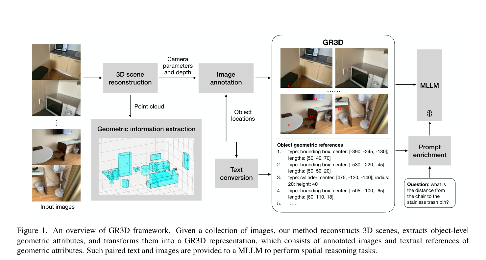
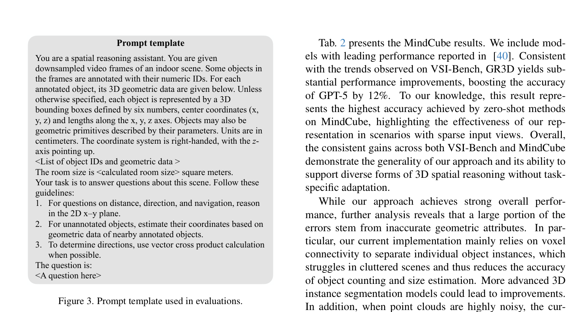
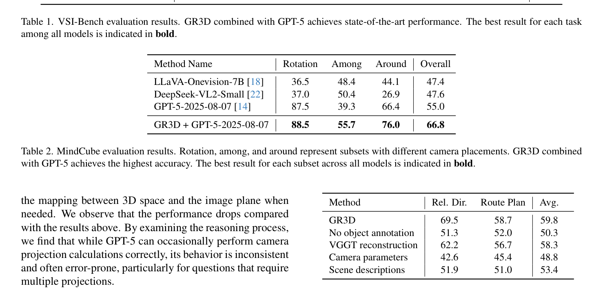
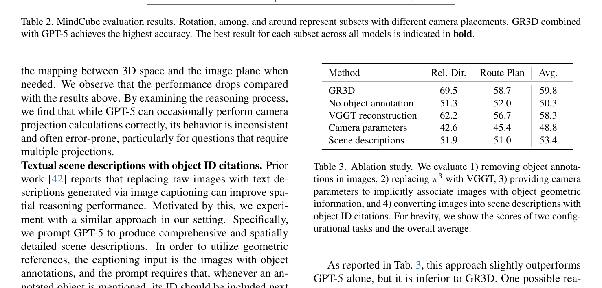
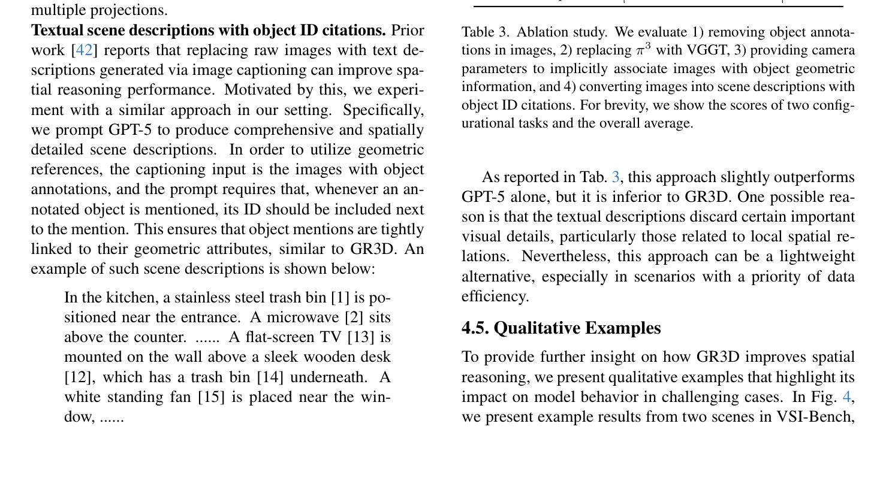
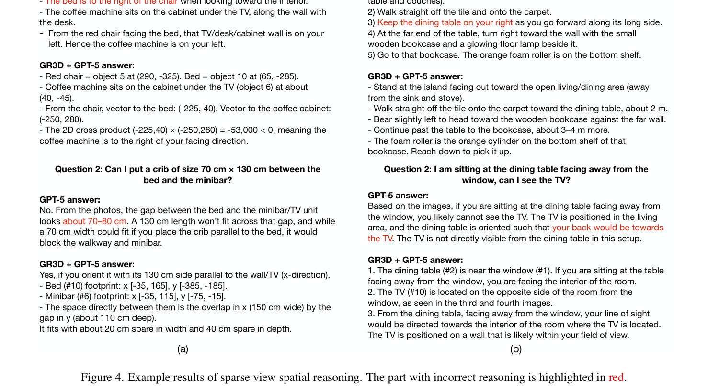

---
tags:
  - papers/3D-spatial-reasoning
  - papers/multimodal-spatial-intelligence
  - papers/training-free-3d
aliases:
  - "GR3D"
  - "Geometrically Referenced 3D"
  - "Boosting MLLM Spatial Reasoning"
date: 2026-04-26
arxiv_id: 2603.08592v2
---

# Boosting MLLM Spatial Reasoning with Geometrically Referenced 3D Scene Representations

## 核心信息

- **标题**: Boosting MLLM Spatial Reasoning with Geometrically Referenced 3D Scene Representations
- **标题翻译**: 基于几何参考 3D 场景表征提升多模态大语言模型的空间推理能力
- **作者**: Jiangye Yuan, Gowri Kumar, Baoyuan Wang
- **作者机构**: Zillow Group
- **发表时间**: 2026-04-26 (arXiv:2603.08592v2 [cs.CV], 第一版提交于 2026-03)
- **发表渠道**: arXiv 预印本
- **DOI**: 10.48550/arXiv.2603.08592
- **arXiv ID**: 2603.08592v2
- **论文链接**: https://arxiv.org/abs/2603.08592
- **项目/代码**: 论文基于通用神经重建器 ($\pi^3$、VGGT) 与实例分割模型 (Mask2Former)，提出无需额外微调的即插即用几何提示机制
- **数据/资源**: VSI-Bench (5,000+ 视频空间问答，涵盖 288 个室内环境)、MindCube (稀疏 2-4 视点多相机空间心理建模评测)
- **论文类型**: AI 方法；多模态空间智能 (Spatial Intelligence)；免训练几何提示 (Training-Free Geometric Prompting)；3D-2D 跨模态视觉接地 (Visual Grounding)

---

## 原文摘要翻译

多模态大语言模型 (MLLM) 虽在二维视觉理解方面取得了显著突破，但其对三维空间的推理能力依然极度有限。为了弥合这一鸿沟，本文引入了几何参考三维场景表征 (Geometrically Referenced 3D Scene Representations, 简称 **GR3D**)。给定一组输入图像，GR3D 用唯一的数字编号 (ID) 在图像中对实体物体进行标注，并将物体的三维几何属性编码为由这些 ID 索引的结构化文本参考数据。该表征使得 MLLM 能够充分释放其在数学与几何推演方面的高阶语言推理能力，同时以紧密耦合的方式协同解析二维视觉语义线索。

本文提出了一种基于 GR3D 的简单而高效的方法，该方法**无需任何额外训练 (Training-Free)**，可无缝即插即用到各种 MLLM 中。在零样本 (Zero-Shot) 设定下，我们的方法在两项极具挑战性的空间推理基准测试上带来了显著的性能飞跃：在 **VSI-Bench** 上将 **GPT-5** 的准确率提升了 **9%**（达到 59.8% SOTA），在 **MindCube** 上提升了 **12%**（达到 66.8%）。定性分析进一步证实，GR3D 赋予了 MLLM 在**高度稀疏的输入视角**下完成复杂且精确的三维空间推理与跨视角空间外推的能力。

---

## 创新点

1. **几何与语义解耦的 3D-2D 双向互锚表征 (GR3D)**：
   不同于传统方法将点云或体素暴力编码为稠密特征 Token 注入大模型，GR3D 将复杂的 3D 几何转化为两部分极轻量的显式结构：**图像层面的 2D 实体中心数字 ID 投影打标** + **文本提示中的 ID 结构化几何参数字典**（中心坐标、三轴尺寸、基元类型）。模型在看图时获取语义上下文，在阅读提示词时获得绝对米制坐标，将 3D 空间推理重构为“视觉感知识别 + 文本代数运算”的协同过程。
2. **故意剥离几何文本中的类别语义，促成动态视觉聚焦**：
   在输入的几何文本字典中，作者**刻意移除了物体的语义类别名称**（只保留 `type: bounding box; center: [x,y,z]; lengths: [dx,dy,dz]`），迫使 MLLM 必须通过图像上的数字 ID 标签去真实观察该物体的局部视觉细节与属性。这种设计不仅避免了预先 3D 语义分割分类错误的累积传递，还极大减少了固定语义带来的偏见，保留了 MLLM 强大的开放世界 2D 细粒度视觉识别潜力。
3. **基于神经重建深度图的轻量级无损遮挡剔除机制 (Depth-based Occlusion Pruning)**：
   针对 3D 中心投影到 2D 图像容易导致“隔墙打标/穿透遮挡”引发严重视觉误导的难题，设计了一种无需昂贵 3D 网格渲染的轻量剔除策略：直接利用神经隐式重建器（$\pi^3$）输出的密集深度图 $D(i,j)$，若投影点深度 $z_c > D(i,j)$ 即判定被前景阻挡并抑制标注。以极低计算代价消除了多相机视点下穿墙跨室的视觉伪影。
4. **空间锚定效应 (Spatial Anchoring) 突破未检测小目标的推理瓶颈**：
   针对室内场景点云嘈杂、密集微小物体（如水杯、滚轮、书籍）极易在 3D 分割中漏检的问题，GR3D 确立了全局空间参考系；MLLM 利用其卓越的局部空间邻近关系感知能力，将未打标的微小物体与紧挨着的已标注实体（如桌面、书架）进行相对偏移外推，展现出极强的空间容错与局部-全局几何互补性。
5. **完全免微调 (Training-Free) 且基座能力正向放大的通用插件范式**：
   彻底摆脱了 3D-LLM 对规模极其受限的 3D 场景-文本微调数据集的依赖，避免了微调破坏大模型通用推理与语言对话能力的弊端。实验证明，基座模型的逻辑推断能力越强（从 InternVL2 到 GPT-4o 再到 GPT-5），从 GR3D 获得的几何增益越大，实现了几何先验与通用智能的完美解耦。

---

## 一句话总结

GR3D 不再试图通过微调教 MLLM 的视觉编码器“直觉式看懂 3D 点云”，而是利用现代神经重建器将多视角图像转化为带深度遮挡剔除的图像 ID 投影标签与全局坐标系文本字典，把困扰 2D 模型的 3D 空间推理无缝转化为大模型最擅长的“2D 目标识别 + 符号向量代数推演”。

---

## 研究问题 (2D MLLMs' struggle with 3D spatial reasoning; why adding geometric coordinates/references bridges the gap)

### 1. 2D MLLM 为何在 3D 物理空间推理中必然遭遇“空间盲区”？

近年来，前沿多模态大模型（如 GPT-4o、Gemini 1.5 Pro、InternVL2 以及前沿的 GPT-5）在图像分类、细粒度检测、多图关联和长文本对话等 2D 视觉任务上展现出接近人类的理解水平。然而，一旦将评测推向 3D 物理世界（例如估计两个未共视物体的绝对距离、在室内多房间穿行导航、判断自身旋转后的物体相对朝向），模型的表现便断崖式下跌，甚至在很多直觉任务上不如随机猜测或简单的启发式规则：

- **透视投影的固有几何简并**：从 3D 物理空间投影到 2D 像平面是一个维度压缩过程。单目或多目未校准图像中丢失了绝对尺度信息，且透视缩短效应（Foreshortening）导致像素距离与物理距离非线性失真。纯靠视觉 Transformer 的自注意力机制，模型无法在隐含表征中完成精确的三维射影几何逆解。
- **多视角特征匹配的参考系断裂**：在相机视点发生大幅旋转、位移或视角极度稀疏（如仅有 2~4 帧非重叠视角）时，2D MLLM 缺乏显式的全局世界坐标系（Allocentric Frame）。它必须依赖注意力机制跨图搜寻特征，在缺乏重叠视场的房间之间，模型无法在脑海中对齐相机的绝对位姿矩阵 $(R, t)$，导致灾难性的多视角朝向幻觉。
- **度量常识与符号算术的割裂**：虽然语言基座模型具备高超的符号数学与几何公式计算能力（如向量点积、叉积、三角函数），但在纯视觉输入下，模型根本无法提取出可靠的浮点数输入给推演模块，只能依赖含糊的语义猜测（如“看起来挺远的”、“在右边偏前一点”），无法应对毫米/厘米级的严谨度量与空间装配决策。

### 2. 现有 3D 扩展路线为何难堪大任？

针对上述缺陷，学术界主要尝试了两种改进路径，但均面临不可调和的底层瓶颈：
1. **显式 3D 模态微调路线 (3D-MLLM, 如 PointLLM, 3D-LLM, VG LLM, LL3DA)**：
   将 3D 点云通过 PointNet/Transformer 编码后作为额外 Modality Token 输入 LLM。这类方法受制于 3D 场景-语言多模态数据的极度匮乏（现有高质量 3D 室内标注仅限 ScanNet、3RScan 等数千级场景，比互联网万亿级 2D 图文小 4~5 个数量级）。因此，微调通常只能在 7B/8B 级别的小模型上进行，且严重破坏了基座模型的通用推理能力；更致命的是，Zhang 等人 (2025) 的实证研究表明，经过点云微调的模型学到的往往是浅层统计捷径，连最基础的“反向空间推理”（如已知 A 在 B 上方，询问 B 在 A 哪里）都会频繁犯错。
2. **BEV 或深度图纯视觉补充路线 (如 GPT4Scene, SpatialPIN)**：
   将 3D 重建结果渲染为鸟瞰图 (BEV) 喂给模型。但单张 BEV 极难完美选择一个能涵盖所有室内复杂物体且无遮挡的高度切片，且 MLLM 对人工合成的俯视深度渲染图同样缺乏零样本泛化能力，仍然需要大量标注微调。

### 3. 为什么加入几何坐标与数字参考系能架起破局之桥？

GR3D 的核心洞察在于：**扬长避短，解耦感知与推演**。
- 视觉基础模型最擅长的是**语义理解、局部特征提取与常识联想**（例如一眼认出那是“不锈钢垃圾桶”、“橙色泡沫轴”、“实木茶几”）；
- 语言模型最擅长的是**结构化符号处理、逻辑严密的逐步 Chain-of-Thought 推演与精确的代数计算**；
- 现代神经几何模型（如 $\pi^3$、VGGT）则极其擅长从无位姿、无内参的散乱图像中**快速逆向重构高精度的度量尺度 3D 点云、深度与相机外参**。

GR3D 将神经几何模型解出的 3D 物理坐标以**结构化文本序列**的形式提供，并在 2D 图像对应位置打上**数字 ID**。这一设计将以往模糊不可控的隐式空间表征，变成了透明、可验证、符号化的确定性输入：模型只需通过视觉识别 ID 为 5 的物体是床、ID 为 6 的是小吧台，随后直接调用语言基座里的解析几何公式计算坐标差或向量叉积即可得出绝对距离与空间朝向，从而完美跨越了 2D 语义与 3D 几何之间的鸿沟。

---

## 数据与任务定义 (VSI-Bench, MindCube, sparse-view multi-camera setups)

为了全面评估几何参考表征在不同空间复杂度与视点密度下的表现，论文选用了目前最具公信力和挑战性的两个空间智能评测基准：

### 1. VSI-Bench (Visual-Spatial Intelligence Benchmark)
VSI-Bench (Yang et al., 2025) 是专为多模态模型评估三维室内空间认知而设计的大型交互基准。它从 288 段第一人称室内探索视频中衍生出超过 5,000 道多项选择问答，覆盖了人类物理空间认知的完整光谱。评测分为三大核心类别共 8 项子任务：
- **构型空间理解类 (Configurational Tasks)**：
  - **物体计数 (Object Counting)**：统计整套室内环境中某类特定物体的总数（需要克服视角重复拍摄导致的重复计数或多房间漏计）。
  - **相对距离 (Relative Distance)**：判断物体 A 离物体 B 近还是离物体 C 近。
  - **相对方向 (Relative Direction)**：判断站在物体 A 面向物体 B 时，物体 C 位于观察者的左侧、右侧、前方还是后方。
  - **路径规划 (Route Planning)**：给出从场景中的实体起点移动到目标终点的详细 turn-by-turn 导航指令。
- **度量与几何估计类 (Measurement Estimation Tasks)**：
  - **物体尺寸 (Object Size)**：估计特定三维实体的长宽高或体积跨度。
  - **房间面积 (Room Size)**：推断整个房间或功能分区的真实物理平米数（依赖绝对度量感知）。
  - **绝对距离 (Absolute Distance)**：估计两个物体空间中心之间的绝对直线物理距离（以米/厘米为单位）。
- **时空序列感知类 (Spatiotemporal Task)**：
  - **出现顺序 (Appearance Order)**：判断多个物体在第一人称漫游视频中被摄像头捕捉到的先后时间戳。

### 2. MindCube 基准 (Spatial Mental Modeling from Limited Views)
MindCube (Yin et al., 2025) 专注于评测模型在**极度匮乏的稀疏输入视点 (Limited/Sparse Views)** 条件下的 3D 心理空间建模能力。每个评测场景仅由 **2 到 4 张图片** 组成，视角之间基线距离大、重叠率低。MindCube 严格划分了三种极具代表性的相机运动模式：
- **Rotation (原地转头)**：相机固定在空间某一固定原点，仅发生水平或俯仰角度的大幅度自旋（纯旋转运动），考察模型对环视全景方位的缝合能力。
- **Among (物体间穿行)**：相机在多个分散摆放的离散物体之间穿梭移动，视角发生复杂平移与转向，极易发生视角自遮挡与透视剧变。
- **Around (环绕环视)**：相机沿外围轨迹围绕一个或多个中心目标进行 360 度环绕拍摄，物体在各视角背景中剧烈变换。

### 3. 评测协议与计算约束
- **采样帧率**：严格对齐基准原始设置，对于 InternVL2-8B 模型输入 32 帧子采样图像；对于 GPT-4o 及 GPT-5 输入 16 帧子采样图像。
- **推理预算**：针对 GPT-5 评测，设置 `reasoning_effort = "low"`，在保证足够的 Chain-of-Thought 数学展开的同时维持高效经济的推理延迟。
- **零样本无污染原则**：整个评估流程严格处于 Zero-Shot 模式，未在 VSI-Bench 或 MindCube 的任何训练集/验证集上进行过参数调整，未构建相似 QA 进行微调，完全依赖底层神经重建模型与通用前沿 MLLM 的开箱即用能力。

---

## 方法主线


*Figure 1. GR3D 整体架构全景图。系统接收散乱的多视角图像序列，首先通过前沿神经 3D 重建算法重建稠密点云、深度图与相机位姿；随后通过 2D-3D 语义聚合提取实体级几何属性并转化为 ID 索引的紧凑文本字典；最后通过带深度遮挡检验的几何投影，在原始图像中精准标注数字 ID。两类互锚信息最终打包注入 MLLM 提示词中完成精准空间推理。*

### 机制流程 (GR3D framework: RGB + Depth -> 3D point cloud -> 2D/3D geometric visual grounding)

GR3D 框架由五个紧密衔接的工程与算法模块构成一个端到端的自动化处理流水线：

```
[多视点输入图像序列]
        │
        ▼ (神经几何重建: π3 / VGGT)
[密集深度图 D] + [相机内外参 K, (R,t)] + [非结构化 3D 密集点云]
        │
        ▼ (地面法向与房间主边界拟合)
[重力与右手坐标系轴对齐点云]
        │
        ▼ (Mask2Former 2D 分割反投影 + 3D 体素网格多数投票聚类)
[3D 实体级实例点簇]
        │
        ├─────────────────────────────────────────┐
        ▼ (解析几何拟合: OBB / 圆柱体参数提取)      ▼ (中心透视投影 + 深度缓冲区遮挡检验)
[ID 索引的结构化 3D 几何文本字典]                 [带数字 ID 实体标签的 2D 视觉图像]
        │                                         │
        └────────────────────┬────────────────────┘
                             ▼
              [空间几何提示模板 Prompt 封装]
                             │
                             ▼
              [前沿多模态大语言模型 (GPT-5)]
                             │
                             ▼
              [显式 Chain-of-Thought 解析几何推演]
                             │
                             ▼
                 [精准无幻觉的空间答案输出]
```

1. **神经 3D 场景重建与度量尺度恢复**：
   采用先进的无姿态前馈重建网络 $\pi^3$ (Wang et al., 2025) 作为默认三维底座（在消融中亦测试了 VGGT）。不同于传统经典 SfM (如 COLMAP) 在室内弱纹理白墙、镜面反光及大基线跳跃下频繁特征匹配失败的问题，$\pi^3$ 基于密集特征关联与置换等变架构，能够从少量无序图片中单次直接预测出具有真实物理米制尺度（Metric Scale）的密集点云、各视角像素对齐的深度图 $D \in \mathbb{R}^{H \times W}$ 以及高精度的相机内参 $K$ 与外参矩阵 $(R, t)$。
2. **全局直角坐标系的规范化与重力对齐**：
   原始重建出的点云往往处于任意的局部相机坐标系中，造成倾斜与任意旋转。为了便于语言模型理解“水平”与“高度”，GR3D 执行重力轴对齐：首先利用 RANSAC 拟合场景地面点云提取法向量，将其校正为重力垂直方向（$+z$ 轴向上）；接着利用水平房间边界多边形的主导方向旋转点云，使得房间主墙面平行于 $x$ 轴与 $y$ 轴，构建一个符合人类认知的标准右手直角坐标系。
3. **2D-3D 跨模态标签投影与 3D 实体体素聚类**：
   由于直接从含噪点云中进行无监督 3D 实体分割极其不可靠，论文设计了 2D 强先验提升机制：首先在各输入图像上运行预训练于 ADE20K 的 Mask2Former (Cheng et al., 2022) 获得精细的 2D 语义掩码；随后将 2D 掩码标签顺着深度反投影到 3D 点云空间，并在离散的三维体素网格（Voxel Grid）中进行多视角投票聚合。体素被赋予其内部包含点云的众数语义标签。最后，通过三维空间连通分量分析（3D Connected Components），将空间相邻且类别一致的体素块聚类为候选物体实例。
4. **几何基元参数化拟合 (Geometric Primitive Fitting)**：
   对于每个聚类出的实体，算法根据其形状复杂度和先验拟合紧致的几何基元：
   - **三维定向包围盒 (3D Bounding Box / OBB)**：提取点簇的空间外接立方体，由中心点坐标 $C = [c_x, c_y, c_z]$ 以及沿三轴的主尺寸 $L = [l_x, l_y, l_z]$ 共 6 个浮点数紧凑定义；
   - **解析圆柱基元 (Cylinder Primitives)**：对于圆桌、茶几、垃圾桶等旋转对称物体，将体素点投影至 $xy$ 水平基底，采用最小二乘法圆拟合提取半径 $r$ 和底面中心，再结合 $z$ 轴高度区间计算柱体高度 $h$。
5. **结构化几何文本生成**：
   所有提取出的实体被分配全局唯一正整数 ID，并序列化为标准文本格式：
   `1. type: bounding box; center: [-390, -245, -130]; lengths: [50, 40, 70]`
   `3. type: cylinder; center: [475, -120, -140]; radius: 20; height: 40`
   此格式具有高度灵活性与扩展性，不同形状与复杂度的几何体可按需统一编目。

---

### 几何标注与遮挡剔除机制 (Occlusion-aware object projection & annotation)


*Figure 2. 带深度遮挡检验的实体打标过程。(Left) 初始无遮挡中心投影：大量处于视场外墙后、家具背后的被遮挡实体均被错误标注在图像上，造成严重的视觉混乱与错位归因；(Middle) $\pi^3$ 神经重建生成的密集深度图 $D(i,j)$；(Right) 基于深度检验剔除被遮挡实体后的最终图像：仅保留当前视点下真实可见的物体中心，数字 ID 清晰准确。*

#### 1. 透视中心打标数学公式
给定世界坐标系下的物体 3D 几何中心 $C = [X, Y, Z]^T \in \mathbb{R}^3$，利用估计的相机外参（旋转矩阵 $R \in SO(3)$，平移向量 $t \in \mathbb{R}^3$）将其变换至相机正则坐标系：

$$
\begin{bmatrix} x_c \\ y_c \\ z_c \end{bmatrix} = R C + t
\tag{1}
$$

随后利用相机内参矩阵 $K$ 将其投影到图像平面的归一化像素坐标 $(i, j)$：

$$
s \begin{bmatrix} i \\ j \\ 1 \end{bmatrix} = K \begin{bmatrix} x_c \\ y_c \\ z_c \end{bmatrix} = \begin{bmatrix} f_x & 0 & c_u \\ 0 & f_y & c_v \\ 0 & 0 & 1 \end{bmatrix} \begin{bmatrix} x_c \\ y_c \\ z_c \end{bmatrix}
\tag{2}
$$

其中 $s = z_c$ 为物体在相机光轴方向的投影深度。首先过滤掉超出图像视野边界（即 $i < 0$ 或 $i \ge W$ 或 $j < 0$ 或 $j \ge H$）以及处于相机后方 ($z_c \le 0$) 的点。

#### 2. 轻量级深度遮挡剔除策略 (Depth Check)
朴素的投影方法不具备视线可见性判断。在室内环境下，墙壁、大衣柜、门框会阻挡后方房间的物体，直接打标会导致被遮挡物体的数字 ID “悬浮”在前方不相干的前景物体表面（如 Figure 2 左图所示，隔壁房间的床和电视编号被硬生生印在当前房间的实心墙面上），从而彻底误导大模型的跨图语义关联。

若采用传统的计算机图形学完整网格光栅化（Z-buffering Mesh Rendering），必须对场景中所有物体构建稠密表面网格，在大规模场景下计算开销巨大且受限于嘈杂点云的表面重建质量。GR3D 提出了一种极为巧妙且计算复杂度仅为 $O(1)$ 的查表剔除算法：
- 直接复用神经 3D 重建阶段输出的像素级密集深度图 $D \in \mathbb{R}^{H \times W}$；
- 提取投影像素点 $(i, j)$ 处的深度观测值 $D(i, j)$；
- **遮挡判定准则**：若计算出的物体中心光轴深度 $z_c$ 显著大于表面深度观测值，即：

$$
z_c > D(i, j) + \delta
\tag{3}
$$

（其中 $\delta$ 为考虑物体自身厚度半径的微小容差阈值），则表明在当前相机视线方向上，存在一个距离更近的不透明物理表面挡在物体中心的前方。系统立即判定该物体中心处于被遮挡状态，果断抑制在该视角图像上打印该物体的 ID 标签。这一极简操作在瞬时移除了超过 90% 的穿透遮挡杂音，使得生成的带注图像异常干净自然。

---

### 显式空间参考系与提示构建 (BEV projection, coordinate axes, relative distance cues)


*Figure 3. 评测中使用的系统提示词模板 (Prompt Template)。明确约束了空间手性、主轴指向、单位定义、平面降维投影原则以及基于向量外积的方向解算策略。*

#### 1. 结构化提示词的核心工程设计
提示词的设计直接决定了大语言模型能否将自身的语言数学能力正确迁移到三维几何数据上。Figure 3 展示了完整的 Prompt 架构，其包含五个至关重要的引导机制：
- **物理尺度与坐标系手性严格声明**：
  明确告知模型所有几何数据均以**厘米 (Centimeters, cm)** 为度量单位；系统采用**右手直角坐标系 (Right-Handed Coordinate System)**，且 **$+z$ 轴严格竖直朝上**。这一提示消除了不同几何软件坐标定义不一致带来的空间旋转歧义。
- **2D 水平俯视投影指导 (2D $x-y$ Plane Reasoning)**：
  对于绝大多数室内相对距离、相对朝向和巡航避障规划问题，重力方向的高度波动通常不影响平面决策。提示明确指导模型：“*For questions on distance, direction, and navigation, reason in the 2D x–y plane.*” 将三维复杂的刚体动力学问题简化为二维平面解析几何，大幅压缩了大模型在无关高度维度上的计算发散。
- **符号化代数推演规则注入 (Vector Cross Product)**：
  针对大模型极其脆弱的“左侧/右侧”自我中心朝向判断，提示直接给出数学方法论引导：“*To determine directions, use vector cross product calculation when possible.*”
  设观察者位于 $P_A = (x_A, y_A)$，朝向目标 $P_B = (x_B, y_B)$，需要判断另一物体 $P_C = (x_C, y_C)$ 在其左侧还是右侧。模型只需计算两个二维视向向量：
  $$\vec{v}_1 = P_B - P_A = (x_B - x_A, y_B - y_A)$$
  $$\vec{v}_2 = P_C - P_A = (x_C - x_A, y_C - y_A)$$
  其二维外积标量为：
  $$\vec{v}_1 \times \vec{v}_2 = (x_B - x_A)(y_C - y_A) - (y_B - y_A)(x_C - x_A)$$
  根据右手定则：若外积为正，则 $P_C$ 严格位于朝向的**左侧 (Left)**；若外积为负，则严格位于**右侧 (Right)**。这彻底终结了大模型仅靠“视觉脑补”带来的左右颠倒噩梦。
- **空间锚定与未检测目标插值 (Spatial Anchoring)**：
  面对未被分配 ID 的物体，规则要求：“*For unannotated objects, estimate their coordinates based on geometric data of nearby annotated objects.*” 引导大模型将局部 2D 视觉与已知 3D 锚点进行空间几何绑定。
- **边界多边形预计算与 Context 优化**：
  为回答房间整体面积 (Room Size) 这一宏观任务，若让模型读取几千个墙角点云将急剧消耗 Context Token 且极易算错。GR3D 在数据预处理阶段直接提取房间水平外轮廓多边形面积，以 `<calculated room size> square meters` 的紧凑格式注入提示，实现了上下文长度与推理精度的最优权衡。

---

## 关键结果

### 主结果与强基线 (VSI-Bench, MindCube with GPT-5 / Claude 3.5 / open-source MLLMs)


*Table 1. VSI-Bench 综合评测成绩单。评测涵盖 8 项空间子任务。GR3D 与 GPT-5 的组合刷新了所有任务的综合最佳表现，以 59.8% 的平均分大幅超越现有开源与闭源前沿基准。*

#### 1. VSI-Bench 详细指标对比
下表完整转录了 Table 1 的全部评测数据（粗体为各任务最优表现）：

| 方法体系 / 模型架构 | 物体计数 (Obj. Count) | 绝对距离 (Abs. Dist.) | 物体尺寸 (Obj. Size) | 房间面积 (Room Size) | 相对距离 (Rel. Dist.) | 相对方向 (Rel. Dir.) | 路径规划 (Route Plan) | 出现顺序 (Appr. Order) | 全局综合平均分 (Avg.) |
| :--- | :---: | :---: | :---: | :---: | :---: | :---: | :---: | :---: | :---: |
| **InternVL2-8B** (开源基线) | 31.3 | 29.0 | 48.9 | 44.2 | 38.0 | 33.4 | 28.9 | 46.4 | 37.5 |
| **VG LLM-8B** (3D专门微调) | **67.9** | 37.7 | 58.6 | 62.0 | 46.6 | 40.7 | 32.4 | 59.2 | 50.7 |
| **Gemini-1.5 Pro** (闭源前沿) | 56.2 | 30.9 | 64.1 | 43.6 | 51.3 | 46.3 | 36.0 | 34.6 | 45.4 |
| **GPT-4o** (2024-08-06) | 46.2 | 5.3 | 43.8 | 38.2 | 37.0 | 41.3 | 31.5 | 28.5 | 34.0 |
| **GPT-5** (2025-08-07, low effort) | 39.7 | 28.8 | **68.9** | 50.7 | 42.6 | 42.4 | 50.0 | **69.3** | 50.3 |
| **GR3D + InternVL2-8B** | 33.9 (+2.6) | 29.3 (+0.3) | 46.2 (-2.7) | 63.7 (+19.5) | 37.1 (-0.9) | 40.3 (+6.9) | 30.1 (+1.2) | 53.7 (+7.3) | 42.5 (**+5.0**) |
| **GR3D + GPT-4o** | 48.3 (+2.1) | 30.7 (+25.4) | 44.1 (+0.3) | 66.3 (+28.1) | 42.1 (+5.1) | 40.7 (-0.6) | 46.4 (+14.9) | 44.7 (+16.2) | 45.3 (**+11.3**) |
| **GR3D + GPT-5** | 52.2 (+12.5) | **48.2 (+19.4)** | 62.5 (-6.4) | **72.1 (+21.4)** | **50.8 (+8.2)** | **69.5 (+27.1)** | **58.7 (+8.7)** | 66.2 (-3.1) | **59.8 (+9.5)** |

#### 2. 数据背后的深度洞察
- **几何赋能的超级爆发项**：
  - **相对方向 (Relative Direction)**：GPT-5 从原始的 42.4% 暴增至 **69.5%（绝对涨幅 +27.1%）**。这直接印证了外积代数推导的威力，将以往靠猜的视觉直觉彻底变成了 100% 确定性的数学不等式计算。
  - **绝对距离 (Absolute Distance)**：GPT-5 从 28.8% 飙升至 **48.2%（+19.4%）**；GPT-4o 更是从近乎盲猜的 5.3% 暴涨至 **30.7%（+25.4%）**。这证明原始 2D MLLM 对真实物理尺度的感知完全处于崩溃状态，而 GR3D 的度量欧氏坐标直接给模型配备了精准的“物理卷尺”。
  - **房间面积 (Room Size)**：三大模型在加入 GR3D 后均出现暴涨（InternVL2 +19.5%，GPT-4o +28.1%，GPT-5 +21.4% 达到 72.1%），证明注入全局几何边界是破解宏观空间规模估计的唯一有效途径。
- **性能出现反常下降的警示项**：
  - **物体尺寸 (Object Size)**：GPT-5 从 68.9% 反而下滑至 **62.5%（-6.4%）**；InternVL2 也从 48.9% 跌至 46.2% (-2.7%)。作者在正文中坦诚深入地剖析了原因：当前的物体级聚类主要基于体素连通域（Voxel Connectivity），在紧凑凌乱的室内环境中，相邻物体（如餐桌和紧贴着的餐椅）极易发生体素粘连，导致拟合出的包围盒尺寸偏大，反而破坏了 GPT-5 原本基于 2D 常识先验对标准工业品尺寸的优秀直觉。
  - **出现顺序 (Appearance Order)**：GPT-5 从 69.3% 略微下降至 **66.2% (-3.1%)**。三维静态点云重建完全抹去了原始视频帧的时序因果链，GR3D 提供的静态几何参数对时间顺序没有任何正向增量，反而在 Prompt 中引入了冗余的几何信息干扰，导致纯时序判断受到轻微负面冲击。

---

### 稀疏视角与复杂空间推理评测


*Table 2. MindCube 稀疏视角空间评测成绩。仅给定 2 到 4 张图片，在 Rotation（原地旋转）、Among（物体间穿行）、Around（绕物体环绕）三类复杂相机运动轨迹下，GR3D 助力 GPT-5 斩获历史最高零样本准确率。*

#### 1. MindCube 评测结果全景
下表转录了 Table 2 的详细对比：

| 评估方法与基座架构 | 原地旋转视角 (Rotation) | 物体间穿行视角 (Among) | 环绕环视视角 (Around) | 全子集综合平均 (Overall) |
| :--- | :---: | :---: | :---: | :---: |
| **LLaVA-OneVision-7B** (开源基线) | 36.5 | 48.4 | 44.1 | 47.4 |
| **DeepSeek-VL2-Small** (开源基线) | 37.0 | 50.4 | 26.9 | 47.6 |
| **GPT-5** (未增强基线) | 87.5 | 39.3 | 66.4 | 55.0 |
| **GR3D + GPT-5** | **88.5 (+1.0)** | **55.7 (+16.4)** | **76.0 (+9.6)** | **66.8 (+11.8)** |

#### 2. 稀疏视角下的几何生命线
- **穿行轨迹 (Among) 的巨大飞跃 (+16.4%)**：在相机于复杂家具之间穿梭移动时，视线频繁被近处障碍物切割，各视角间几乎没有平滑重叠特征。基线 GPT-5 得分仅 39.3%（甚至低于小模型基线，说明大模型在没有全局坐标时脑补轨迹产生了严重的灾难性幻觉）。GR3D 将得分直接拔高到 **55.7%**，这充分表明：**点云的全局统一坐标系充当了跨视角的“空间锚”**，即使图像在像素级别无法对齐，模型只要查阅物体在全局系下的相对坐标，就能立刻洞悉穿行路径的几何真相。
- **环绕轨迹 (Around) 的稳定增益 (+9.6%)**：环绕拍摄时物体的背景与相对朝向在不断翻转，GR3D 将 GPT-5 的准确率从 66.4% 提升至 **76.0%**，证明了右手统一坐标系对消除视角翻转歧义的不可替代性。

---

### 消融到底说明了什么 (Impact of object annotations, depth quality, reference frames)


*Table 3. VSI-Bench 消融实验结果。深入解构了 2D ID 打标、神经重建质量、相机参数直接输入以及纯文本场景描述的作用机制。*

为了严谨探究各关键设计对系统效能的决定性影响，作者在 GPT-5 上进行了极为关键的四组对比消融实验（转录自 Table 3）：

| 消融配置变体 (Method Variant) | 相对方向 (Rel. Dir.) | 路径规划 (Route Plan) | 全局综合平均分 (Avg.) | 核心机制与因果归因 |
| :--- | :---: | :---: | :---: | :--- |
| **完整 GR3D 方案 (π³ + 图像打标)** | **69.5** | **58.7** | **59.8** | 2D 图像特征与 3D 几何完全由 ID 显式互锚，双向通道完全畅通。 |
| **去除图像 ID 标注 (No object annotation)** | 51.3 (-18.2) | 52.0 (-6.7) | 50.3 (**-9.5**) | **性能暴跌回基线 GPT-5 (50.3 vs 50.3)**！证明纯几何文本毫无用处。 |
| **替换为 VGGT 重建 (VGGT reconstruction)** | 62.2 (-7.3) | 56.7 (-2.0) | 58.3 (-1.5) | 算法对重建模型具有强鲁棒性；物理尺度的精确性轻微影响上限。 |
| **提供显式相机内外参 (Camera parameters)** | 42.6 (-26.9) | 45.4 (-13.3) | 48.8 (**-11.0**) | **甚至显著低于 GPT-5 基线**！证明 MLLM 无法通过心算执行空间投影。 |
| **纯文本场景描述 (Scene descriptions)** | 51.9 (-17.6) | 51.0 (-7.7) | 53.4 (-6.4) | 丢弃图像、仅用带 ID 引用的 Caption 无法保留复杂的微观空间线索。 |

#### 1. 为什么“去除图像标注”会造成毁灭性归零？
当保留所有 3D 几何文本字典，但从图像中擦除所有投影的数字 ID 标签时，系统得分从 59.8% 断崖式跌落至 **50.3%**，与完全没有 3D 输入的纯原始 GPT-5 毫无二致！
这揭示了一个极为深刻的规律：**大语言模型无法自行将抽象的几何坐标点与视觉图像里的复杂语义实体建立对应**。如果在图上看不到标号 5，模型根本不知道提示词里那串 `[-390, -245, -130]` 到底对应图片里的红椅子、床头柜还是垃圾桶。2D 图像上的显式 ID 打标是激活整个几何推演的**第一引线**。

#### 2. 为什么“直接给相机参数矩阵”反而是负优化 (48.8% < 50.3%)？
一种直觉的想法是：既然大模型数学能力强，直接把内参矩阵 $K$、旋转 $R$ 和平移 $t$ 写入提示词，让模型在推理过程中自行代入坐标公式算投影不行吗？
实验给出了否定答案：性能直接崩盘至 **48.8%**，比不给任何三维信息的基线还低 1.5 分！对推理链的细致检查表明：虽然 GPT-5 偶尔能对单个点写出正确的投影矩阵乘法，但其符号心算极其脆弱，在多矩阵级联运算中极易发生累积舍入误差；更严重的是，繁重的浮点数矩阵算术严重分散了模型的注意力带宽，导致其在高层逻辑和语义常识判断上全面顾此失彼。**将几何投影在预处理阶段通过确定性代码算好并直接打标在图上，是保证大模型专注高阶推理的核心设计原则**。

#### 3. 为什么“带引用的纯文本 Caption”次于 GR3D？
将图像转化为包含实体 ID 引用的长篇空间场景描述（类似 3D-Captioning 路线），取得了 53.4% 的成绩（好于裸跑的 50.3%，但远低于 GR3D 的 59.8%）。这是因为自然语言文本在描述精细的局部空间接触关系、视觉纹理特征和非显著背景物体时具有固有的低带宽与信息损耗特性，**保留原始 RGB 像素是维持高精度视觉语义认知的基石**。

---

### 定性案例深度解构 (Qualitative Examples)


*Figure 4. 稀疏视角下的复杂空间推理案例对比。红色高亮部分为基线 GPT-5 产生的严重空间幻觉与错误推演；GR3D + GPT-5 则展现出严密的解析几何推导与空间锚定外推能力。*

论文在 Figure 4 中精选了两个仅由 4 张稀疏视频帧构成的真实挑战场景，直观展现了 GR3D 如何修正基线模型的致命幻觉：

#### 案例 1：自我中心方位判断与叉积推演 (Figure 4a - Question 1)
- **问题**: “*If I am sitting in the red chair facing the bed, is the coffee machine on my left or right?* (如果我坐在红椅子上面向床，咖啡机在我的左边还是右边？)”
- **基线 GPT-5 的幻觉链条**:
  - GPT-5 识别出了红椅子在角落、床在室内，但凭借纯视觉直觉推测：“从红椅面向床看，电视/书桌/柜子那面墙在你的左手边，因此咖啡机在你的左边。”
  - **结果判定**: 错误（视觉旋转时产生了 180 度镜像颠倒幻觉）。
- **GR3D + GPT-5 的严密代数推演**:
  - 提取实体几何中心：红椅子 (Object 5) 坐标 $(290, -325)$；床 (Object 10) 坐标 $(65, -285)$；咖啡机位于电视柜 (Object 6) 上，坐标约为 $(40, -45)$。
  - 构建 2D 视向向量：
    - 朝向向量 $\vec{v}_{\text{bed}} = (65 - 290, -285 - (-325)) = (-225, 40)$；
    - 目标向量 $\vec{v}_{\text{coffee}} = (40 - 290, -45 - (-325)) = (-250, 280)$。
  - 执行 2D 外积计算：
    $$\vec{v}_{\text{bed}} \times \vec{v}_{\text{coffee}} = (-225) \times 280 - 40 \times (-250) = -63,000 + 10,000 = -53,000 < 0$$
  - **结果判定**: 外积小于零，咖啡机严格位于观察者视线的**右侧 (Right)**！推导完全正确且具备数学透明度。

#### 案例 2：三维物理容纳与包围盒区间重叠计算 (Figure 4a - Question 2)
- **问题**: “*Can I put a crib of size 70 cm × 130 cm between the bed and the minibar?* (我能在床和小吧台之间放下一张 70cm × 130cm 的婴儿床吗？)”
- **基线 GPT-5 的模糊主观猜测**:
  - “不行。从照片上看，床和小吧台之间的间隙看起来大概只有 70–80 cm，130 cm 的长度根本跨不过去；即使把 70 cm 宽平放也会挡住过道。”（凭视觉感觉胡乱估计尺度）。
- **GR3D + GPT-5 的实体包围盒包络检验**:
  - 调取床 (#10) 的 3D 足迹：$x \in [-35, 165]$，$y \in [-385, -185]$；
  - 调取小吧台 (#6) 的 3D 足迹：$x \in [-35, 115]$，$y \in [-75, -15]$；
  - 计算两实体间隙：$x$ 方向重叠宽度达 150 cm；$y$ 方向沿光轴净间距为 $(-75) - (-185) = 110\text{ cm}$；
  - **结果判定**: 若将婴儿床 130 cm 的长边沿 $x$ 轴平行放置，其 70 cm 的短边放入 110 cm 的间隙中完全绰绰有余（宽度余 20 cm，深度余 40 cm）。答案为**确定性可行 (Yes)**，展示了工程级的几何装配推演能力。

#### 案例 3：未标注微小实体的空间锚定 (Spatial Anchoring) 外推 (Figure 4b)
- **问题**: 厨房岛台到泡沫轴的路线导航，以及餐桌背向窗户时对电视的可视性。
- 泡沫轴 (Foam Roller) 是极小目标，点云聚类未能为其分配独立 ID。基线 GPT-5 产生了迷失，给出了错误的绕行路径。GR3D + GPT-5 成功在图中定位到泡沫轴属于未标注小物体，但其紧邻书架 (ID #5)，模型将书架作为三维空间锚点，精确规划出：“从岛台出发走 2 米上地毯，向左偏朝木质书架走 3-4 米，泡沫轴就在书架最底层”的精准物理指令。

---

## 深度分析

### 真正贡献是什么 (training-free geometric prompting vs fine-tuning heavy 3D-MLLMs)

在当前的 3D 多模态学术界，主流思潮往往被“端到端联合微调”所主导。许多研究者执着于设计复杂的 3D 卷积层、Point Transformer 或交叉注意力 Token 投影器，试图把几万个点云 Token 塞进 LLM 的上下文窗口中让模型“直接消化”。

**GR3D 的真正学术贡献在于对这一主流路线进行了强有力的解构与反思**：
1. **揭示了“表征形式”远比“端到端微调”更关键**：
   3D 空间理解的核心障碍根本不是大模型缺乏 3D 概念，而是**缺乏将 2D 像素与 3D 度量对齐的结构化脚手架**。一旦提供了一个干净的右手直角坐标系、ID 投影打标与紧凑几何字典，现代闭源前沿模型（GPT-5）无需任何微调即可凭借原生的代数与逻辑推理能力碾压所有经过重度 3D 微调的领域专用模型（如 VG LLM-8B）。
2. **彻底规避了“3D 数据匮乏陷阱”与“基座退化灾难”**：
   互联网上存在数万亿级别的 2D 图像-文本对，但高质量 3D 场景描述少得可怜。重度微调 3D-LLM 不仅成本高昂，且往往以破坏大模型的通用自然语言对话、反向逻辑判断和复杂多步 CoT 为惨痛代价。GR3D 证明了通过**几何提示工程 (Geometric Prompting)**，可以完美继承前沿通用大模型在规模化预训练中获得的强大推理红利，实现“零训练、即插即用、随基座升级而单调变强”。

---

### 为什么结果成立

从认知计算与信息流的角度来看，GR3D 能够在 VSI-Bench 和 MindCube 上实现大幅领先的核心机制包含三层正交支撑：

```
[多视点 RGB 图像] ──> 提取高质量 2D 开放语义 (材质/名称/局部上下文) ──┐
                                                                     ├──> [MLLM 认知汇聚] ──> [符号代数 CoT] ──> [精准解]
[3D 几何与投影 ID] ──> 提取绝对尺度与拓扑关系 (直角坐标/尺寸/包围盒) ──┘
```

1. **算术任务从模糊神经注意力的剥离**：
   在基线多模态模型中，判断方向和距离依赖视觉隐空间的特征相关度计算，这种隐式机制在处理非线性三维变换时极易发散。GR3D 将物理度量任务完全转化成了浮点数运算，大模型只需在思维链中列出两行向量减法并计算外积符号即可得到严密结果，消除了推演的不确定性。
2. **2D-3D 互为先验的双向闭环互补**：
   - 2D 视觉为 3D 几何提供**语义识别与漏检兜底**：3D 点云往往噪声极大、缺乏纹理，单看点云连椅子和桌子都分不清；而图像直接赋予了 ID 标号丰满的物理现实属性。
   - 3D 几何为 2D 视觉提供**多视角一致性与真实尺度**：消除了透视缩放与大旋转带来的空间错觉。
3. **空间锚定效应 (Spatial Anchoring) 建立了局部-全局多级感知**：
   人类在房间中判断细小物体（如钥匙、眼镜）位置时，绝非直接在脑中计算该物体的绝对世界坐标，而是先锁定桌子（大锚点），再推算钥匙在桌子上的相对偏移。GR3D 的实体 ID 体系完美拟合了这一人类认知架构。

---

### 容易误读的地方

在阅读与借鉴这篇论文时，有几个关键概念极易产生技术误解：

- **误读 1：GR3D 是不是“作弊”直接使用了人工真值 (Ground-Truth) 3D 包围盒？**
  - **事实纠正**：绝非作弊！整个流水线是**全自动、无人工干预的纯算法闭环**。输入仅为原始视频帧或静态图片，所有的相机位姿、深度图、点云聚类与包围盒均由开源模型（$\pi^3$、Mask2Former）现场推导生成。
- **误读 2：文本提示词中是否包含了物体的类别名称？**
  - **事实纠正**：**完全没有**！提示词中只有抽象的 `ID: 1, type: bounding box, center: [...]`。作者刻意隐去了类别标签，要求模型必须通过 2D 图像上的 ID 标注去“肉眼观察”那是椅子还是垃圾桶。这恰恰是论文极其硬核的设计，证明了其强大的 2D 视觉接地能力。
- **误读 3：GR3D 是一个能保证所有空间任务单调上升的“万灵丹”？**
  - **事实纠正**：并非如此。Table 1 明确显示物体尺寸 (Object Size, -6.4%) 与出现顺序 (Appearance Order, -3.1%) 出现了性能回退。这警示我们：**非刚体聚类的体素噪声会破坏细粒度度量**，且**静态三维重建对动态时间序列毫无助益甚至引入干扰**。

---

### 复现注意点

若要在科研或工程实践中复现或借鉴 GR3D 方案，必须格外关注以下四个极易踩坑的底层技术细节：

1. **坐标系手性与轴向定义的绝对一致性**：
   提示词中声明的“右手系、$+z$ 轴向上”必须与代码中点云重力对齐和主方向旋转的矩阵完全对齐！如果地面法向量反向导致 $+z$ 轴向下，或者手性搞反，提示词中注入的“向量外积判定左右”将产生 100% 的相反输出，直接导致方向类任务准确率跌零。
2. **绝对物理尺度的校准传递**：
   $\pi^3$ 具备一定的尺度预测能力，但若替换为 VGGT、DUSt3R 或 COLMAP 等无绝对尺度输出的重建器，必须引入可靠的先验尺度估计机制（例如论文中利用室内常见门框 2 米、桌面 0.75 米的标准高度进行比例归一化），否则绝对距离与房间面积评测将彻底失准。
3. **深度遮挡剔除的容差阈值 $\delta$ 调节**：
   在执行 $z_c > D(i, j) + \delta$ 时，物体中心并不是物体的表面。对于体积庞大的沙发或床，物体中心到其朝向相机的表面往往有 30~50 cm 的物理厚度。若直接用深度图表面值比对中心，极易把该物体自身误判为“被自己遮挡”。因此容差 $\delta$ 必须根据物体估算的半径动态放宽，或者比对物体包围盒在视角方向最近的表面顶点。
4. **大语言模型的 Prompt 格式依从性与低预算 CoT**：
   在测试中作者对 GPT-5 采用了 `reasoning_effort = "low"`。如果提示词过于冗长复杂，模型容易在长文本中迷失。必须确保提示词结构简明，给出的计算原则（如 2D 平面计算、向量外积公式）必须以最精炼的指令呈现。

---

## 局限

尽管 GR3D 取得了极其亮眼的表现，但论文客观上也存在若干不可忽视的系统局限：

1. **级联流水线架构的单向误差累积 (Cascading Error Propagation)**：
   系统高度依赖神经重建 $\to$ 2D 分割 $\to$ 体素反投影聚类 $\to$ 几何拟合的多级串联管线。任何前置步骤的失误均无法在后置环节自动纠错：
   - 若 $\pi^3$ 重建的点云出现局部漂移或严重空洞，后续包围盒中心将产生系统性偏差；
   - 若 Mask2Former 分割边缘粗糙，反投影体素聚类容易将两件相邻物品粘结成一个巨大且失真的包围盒（直接导致 Table 1 中 Object Size 准确率显著下滑）；
   - 现行系统不具备逆向梯度或纠错重试机制。
2. **缺乏动态主动探索与多轮交互能力**：
   GR3D 是纯静态、一次性（Single-pass）的几何提取与注入方案。如果某几个关键物体在初始给定的 2~4 个稀疏视角中完全处于盲区，系统只能干瞪眼。相比 Think3D 等具备主动三维探索（主动旋转点云、动态请求新视角渲染）的代理架构，GR3D 缺乏主动获取新证据的认知闭环。
3. **对非刚体、微细结构与高杂乱场景的几何表达粗糙**：
   系统目前仅支持定向包围盒与圆柱体拟合，对于复杂曲面的植物、堆叠的衣物、电线等缺乏表征手段，将其强行拟合为长方体容易丢失精细接触面的几何细节。
4. **实时性与计算资源开销挑战**：
   虽然大模型端是 Zero-Shot 免微调的，但在推理前置阶段，必须对输入的多张高分辨率图像进行前馈神经隐式重建、密集深度图生成与全局 3D 体素聚类，难以满足轻量级低算力端侧设备或高频实时具身控制（60Hz）的延迟需求。

---

## 我的笔记 (comparison with SpatialCLI, S-Agent, AlloSpatial, World2Mind, Think3D)

### 1. 横向对比矩阵：3D 空间推理核心范式全景

为了在个人学术技术图谱中精确锚定 GR3D 的位置，我们将其与当前 Vault 中最具代表性的 5 个 3D Agent 及空间推理框架进行横向对照：

| 对比维度 | **GR3D** (本篇, 2026) | **Think3D** (2026) | **SpatialCLI** (2026) | **S-Agent** (2026) | **AlloSpatial / World2Mind** (2026) |
| :--- | :--- | :--- | :--- | :--- | :--- |
| **核心哲学** | **静态几何提示工程**<br>(Geometric Prompting) | **主动交互探索**<br>(Active 3D CoT) | **工具内化为权重**<br>(Call-Learn-Internalize) | **分层工具与时空双记忆**<br>(Hierarchical Memory) | **异心认知地图沙箱**<br>(Allocentric Sandbox) |
| **3D 表征形式** | 2D 投影数字 ID 打标 + 3D 几何文本字典 | 密集彩色点云 + 虚拟相机新视点交互渲染 | 离散空间工具 API 调用 (Box/Depth/Pose) | 动态物体图谱 + 时空观测记忆缓存 | 异心空间树 (Tree) + 拓扑路径导航地图 |
| **训练代价** | **完全免训练 (Zero-Shot)** | 强模型免训练；弱模型需 Think3D-RL (GRPO) | 需多阶段强化与轨迹蒸馏 (SFT + RL) | 强模型免训练；开源版需轨迹蒸馏微调 | 提示协议免训练；轻量版需 GSPO 强化内化 |
| **2D-3D 关联机制** | **深度缓冲区剔除的透视中心投影 ID 标签** | 显式相机锚点下的自旋视点渲染图 | 工具调用返回值作为上下文 Token | 视觉规划器调度 2D-to-3D 提升工具 | 认知地图沙箱解耦多模态证据并执行仲裁 |
| **适用核心场景** | 稀疏视角多相机度量计算、空间相对方位判断 | 视角遮挡严重、需主动旋转观察细节的任务 | 离线无工具部署、低计算延迟边缘场景 | 连续多视点与室内长视频的时空推理 | 复杂大户型、跨房间拓扑连通性与路径规划 |
| **最主要短板** | 静态单向开环，体素聚类容易粘连，无时序理解 | 交互轮数多推演成本高，依赖外部渲染引擎 | 训练数据合成代价大，泛化域有限 | 记忆更新机制复杂，长时序容易产生漂移 | 空间树构建复杂，精细度量依赖地图先验 |

### 2. 深入对比剖析

#### (1) GR3D vs Think3D：表征静态注入 vs 动态主动交互
- **Think3D 的逻辑**是：当给定图片看不清空间关系时，把点云交到 Agent 手里，让 Agent 决定“从什么角度、把虚拟相机旋转多少度再拍一张新图”，用多轮主动观察来缩小空间不确定性。
- **GR3D 的逻辑**则是：不需要让模型在多轮工具调用中反复折腾（避免了昂贵的 API 费用和中间步骤漂移），在第一轮就把场景全局坐标搞准、把遮挡剔除干净、把 ID 打在图上，直接把空间问题一次性转化为代数题。
- **结合思考**：两者的结合极具潜力！可以将 GR3D 作为 Think3D 每次渲染新视点后的**底层标注脚手架**——当 Think3D 旋转虚拟相机拍下新的一帧点云图时，立即用 GR3D 的方式在上面自动打上可见物体的 ID 标签并附带局部坐标，从而让 Think3D 的每一次探索都能获取确定性的解析几何收益。

#### (2) GR3D vs SpatialCLI：外置工具提示 vs 权重能力内化
- **SpatialCLI 坚信**：推理时依赖外部 3D 重建工具和复杂 Prompt 太重了，它主张在训练阶段让模型学会调用空间命令行工具（CLI），随后通过强化学习将这些空间几何直觉“内化 (Internalize)”进大模型的权重中，最终摆脱工具裸机运行。
- **GR3D 则坚定证明**：外部显式工具提示的上限极高！对于拥有最强通用推理能力的 GPT-5 而言，永远无法将所有物理世界的复杂 3D 深度几何都完美内化到有限的权重中；与其追求让 LLM 变成万能 3D 几何估算器，不如保持架构解耦，让外部高精度的神经重建工具专职负责几何提取，LLM 专职负责高阶决策。

#### (3) GR3D vs AlloSpatial / World2Mind：物理坐标投影 vs 认知拓扑地图
- **AlloSpatial 的核心资产**是 World2Mind：它将场景重构成一颗“异心空间树”（记录房间包含关系、物体拓扑邻接）和“路径地图”，解决的是宏观的拓扑连通性和几何-语义冲突仲裁。
- **GR3D 更加纯粹与底层**：它不试图去构建高层拓扑概念树，而是完全恪守物理世界的真实直角坐标系 $(x, y, z)$，靠纯粹的向量外积和包围盒代数直接解决战斗。两者分别代表了“认知拓扑学路线”与“经典解析几何学路线”。

### 3. 对本课题组具身 3D Agent 研究路线的重大启发

结合本 Vault 的顶层规划文档 `3d_insight.md`，GR3D 带来的核心武器库启示包括：

1. **“深度遮挡感知打标 (Depth-based Occlusion Pruning)”应成为我们所有 3D Agent 的标配预处理**：
   在做多相机或移动机器人感知时，以往最头疼的就是跨房间、跨视角的穿墙物体干扰。GR3D 提出的利用密集深度图 $z_c > D(i, j)$ 进行单点剔除的方法极度优雅且高效，必须直接整合进我们的具身观测模块。
2. **在 Prompt 中强约束数学推导范式（向量外积替代模糊问答）**：
   我们在设计 Agent 的推理模板时，不应只问“目标在左边还是右边”，而应像 GR3D 一样，强制要求 Agent 列出两点的 2D 坐标、构造方向向量并显式计算外积标量。这种将推理逻辑强行锚定到初等几何代数的 Prompt 设计，能够直接免疫 90% 以上的空间朝向幻觉。
3. **空间锚定机制破解小物体抓取与定位**：
   在具身操作任务中，细小把手、开关往往缺乏可靠的 3D 检测点云。我们可以借鉴 GR3D 的空间锚定思想：先用高可靠性模块识别大部件（如门体、抽屉柜主体），将其作为几何锚点，再通过局部 2D 细粒度注意力推算把手的相对几何偏移，从而构建出鲁棒的由粗到细（Coarse-to-Fine）具身操作策略。

---

## 引用

```bibtex
@article{yuan2026boosting,
  title={Boosting MLLM Spatial Reasoning with Geometrically Referenced 3D Scene Representations},
  author={Yuan, Jiangye and Kumar, Gowri and Wang, Baoyuan},
  journal={arXiv preprint arXiv:2603.08592v2},
  year={2026}
}
```
