# EUREKA: Human-Level Reward Design via Coding Large Language Models
> **Source identity:** Yecheng Jason Ma, William Liang, Guanzhi Wang, De-An Huang, Osbert Bastani, Dinesh Jayaraman, Yuke Zhu, Linxi "Jim" Fan, and Anima Anandkumar. NVIDIA, University of Pennsylvania, California Institute of Technology, and University of Texas at Austin. Published as a conference paper at ICLR 2024 (Oral). arXiv:2310.12931v2 [cs.RO], 30 Apr 2024. Project website: https://eureka-research.github.io

> **Reader policy:** This bilingual edition preserves the complete published paper and appendices in source order. Every substantive paragraph is presented as an English block followed immediately by a precise academic Chinese translation using the required `Para. X` and `Para. X[CN]` labels. Mathematical notations, code blocks, algorithms, figures, tables, and bibliographic citations are faithfully retained. References remain in searchable bibliographic form paired with bilingual annotations.

## Contents and terminology

> <span style="color:#3B82F6"><strong>Para. M-1:</strong></span> Major sections: Abstract; 1 Introduction; 2 Problem Setting and Definitions; 3 Method (3.1 Environment as Context, 3.2 Evolutionary Search, 3.3 Reward Reflection, Algorithm 1); 4 Experiments (Environments, 4.1 Baselines, 4.2 Training Details, 4.3 Results, 4.4 EUREKA from Human Feedback); 5 Related Work; 6 Conclusion; Acknowledgement; References; Appendices A–H (A Full Prompts, B Environment Details, C Baseline Details, D EUREKA Details, E EUREKA on Mujoco Environments, F Additional Results, G EUREKA Reward Examples, H Limitations and Discussion).

> <span style="color:#F59E0B"><strong>Para. M-1[CN]:</strong></span> 主要章节：摘要；1 引言；2 问题设定与定义；3 方法（3.1 环境作为上下文，3.2 进化搜索，3.3 奖励反思，算法 1）；4 实验（环境介绍，4.1 基线方法，4.2 训练细节，4.3 结果，4.4 基于人类反馈的 EUREKA）；5 相关工作；6 结论；致谢；参考文献；附录 A–H（A 完整提示词，B 环境细节，C 基线细节，D EUREKA 细节，E Mujoco 环境上的 EUREKA，F 额外实验结果，G EUREKA 奖励函数示例，H 局限性与讨论）。

> <span style="color:#3B82F6"><strong>Para. M-2:</strong></span> Terminology ledger: EUREKA = Evolution-driven Universal REward Kit for Agent (基于进化的智能体通用奖励工具包)；LLM = Large Language Model (大语言模型)；RL = Reinforcement Learning (强化学习)；RLHF = Reinforcement Learning from Human Feedback (人类反馈强化学习)；RDP = Reward Design Problem (奖励设计问题)；MDP = Markov Decision Process (马尔可夫决策过程)；PPO = Proximal Policy Optimization (近端策略优化)；L2R = Language to Rewards (语言到奖励基线方法)；Isaac Gym = GPU-accelerated robotics simulation platform (GPU加速物理仿真平台)；Shadow Hand = 24-DoF anthropomorphic dexterous hand (仿人五指灵巧手)；Pen Spinning = 灵巧转笔技巧；Curriculum Learning = 课程学习；Reward Reflection = 奖励反思 (基于策略训练动态的文本反馈)；Reward Shaping = 奖励塑形；Evolutionary Search = 进化搜索；In-Context Learning (ICL) = 上下文学习。

> <span style="color:#F59E0B"><strong>Para. M-2[CN]:</strong></span> 术语对照表：EUREKA = Evolution-driven Universal REward Kit for Agent（基于进化的智能体通用奖励工具包）；LLM = Large Language Model（大语言模型）；RL = Reinforcement Learning（强化学习）；RLHF = Reinforcement Learning from Human Feedback（人类反馈强化学习）；RDP = Reward Design Problem（奖励设计问题）；MDP = Markov Decision Process（马尔可夫决策过程）；PPO = Proximal Policy Optimization（近端策略优化）；L2R = Language to Rewards（语言到奖励基线方法）；Isaac Gym = GPU 加速机器人物理仿真平台；Shadow Hand = 24 自由度仿人五指灵巧手；Pen Spinning = 灵巧转笔动作；Curriculum Learning = 课程学习；Reward Reflection = 奖励反思（基于策略训练统计与动态的文本反馈）；Reward Shaping = 奖励塑形；Evolutionary Search = 进化搜索；In-Context Learning（ICL）= 上下文学习。

# Abstract

> <span style="color:#3B82F6"><strong>Para. 1:</strong></span> Large Language Models (LLMs) have excelled as high-level semantic planners for sequential decision-making tasks. However, harnessing them to learn complex low-level manipulation tasks, such as dexterous pen spinning, remains an open problem.

> <span style="color:#F59E0B"><strong>Para. 1[CN]:</strong></span> 大语言模型（LLM）在作为序贯决策任务的高层语义规划器方面表现优异。然而，如何利用它们来学习复杂的底层操作任务（例如灵巧转笔），仍然是一个尚未解决的开放难题。

> <span style="color:#3B82F6"><strong>Para. 2:</strong></span> We bridge this fundamental gap and present EUREKA, a human-level reward design algorithm powered by LLMs. EUREKA exploits the remarkable zero-shot generation, code-writing, and in-context improvement capabilities of state-of-the-art LLMs, such as GPT-4, to perform evolutionary optimization over reward code. The resulting rewards can then be used to acquire complex skills via reinforcement learning.

> <span style="color:#F59E0B"><strong>Para. 2[CN]:</strong></span> 我们弥合了这一根本性差距，并提出了 EUREKA——一种由大语言模型驱动的人类水平奖励设计算法。EUREKA 充分利用最先进的大语言模型（如 GPT-4）卓越的零样本生成、代码编写和上下文改进能力，对奖励代码执行进化优化。生成的奖励随后可用于通过强化学习获得复杂的机器人运动技能。

> <span style="color:#3B82F6"><strong>Para. 3:</strong></span> Without any task-specific prompting or pre-defined reward templates, EUREKA generates reward functions that outperform expert human-engineered rewards. In a diverse suite of 29 open-source RL environments that include 10 distinct robot morphologies, EUREKA outperforms human experts on 83% of the tasks, leading to an average normalized improvement of 52%.

> <span style="color:#F59E0B"><strong>Para. 3[CN]:</strong></span> 在无需任何特定任务提示词或预定义奖励模板的情况下，EUREKA 生成的奖励函数超越了人类专家精心设计的奖励。在包含 10 种不同机器人形态的 29 个开源强化学习环境构成的多样化基准测试中，EUREKA 在 83% 的任务上优于人类专家，实现了 52% 的平均归一化提升。

> <span style="color:#3B82F6"><strong>Para. 4:</strong></span> The generality of EUREKA also enables a new gradient-free in-context learning approach to reinforcement learning from human feedback (RLHF), readily incorporating human inputs to improve the quality and the safety of the generated rewards without model updating.

> <span style="color:#F59E0B"><strong>Para. 4[CN]:</strong></span> EUREKA 的通用性还开启了一种全新的免梯度上下文学习方法用于人类反馈强化学习（RLHF），能够在不更新模型参数的情况下直接融入人类输入，从而提升所生成奖励函数的质量与安全性。

> <span style="color:#3B82F6"><strong>Para. 5:</strong></span> Finally, using EUREKA rewards in a curriculum learning setting, we demonstrate for the first time, a simulated Shadow Hand capable of performing pen spinning tricks, adeptly manipulating a pen in circles at rapid speed.

> <span style="color:#F59E0B"><strong>Para. 5[CN]:</strong></span> 最后，在课程学习设置下结合 EUREKA 奖励，我们首次展示了仿真中的 Shadow Hand 能够完成灵巧转笔特技，以极快的速度熟练地使笔在手指间连续回旋。

# 1 Introduction

> <span style="color:#3B82F6"><strong>Para. 6:</strong></span> Large Language Models (LLMs) have excelled as high-level semantic planners for robotics tasks (Ahn et al., 2022; Singh et al., 2023), but whether they can be used to learn complex low-level manipulation tasks, such as dexterous pen spinning, remains an open problem. Existing attempts require substantial domain expertise to construct task prompts or learn only simple skills, leaving a substantial gap in achieving human-level dexterity (Yu et al., 2023; Brohan et al., 2023).

> <span style="color:#F59E0B"><strong>Para. 6[CN]:</strong></span> 大语言模型（LLM）在作为机器人任务的高层语义规划器方面表现优异（Ahn 等，2022；Singh 等，2023），但它们是否能被用于学习复杂的底层操作任务（例如灵巧转笔），仍是一个悬而未决的开放问题。现有的尝试需要大量的领域专业知识来构建任务提示词，或者只能学习简单的技能，在实现人类水平的灵巧操作方面存在巨大差距（Yu 等，2023；Brohan 等，2023）。

### Figure 1. EUREKA 跨机器人形态生成奖励与转笔技能展示


**Caption:** Figure 1: EUREKA generates human-level reward functions across diverse robots and tasks. Combined with curriculum learning, EUREKA for the first time, unlocks rapid pen-spinning capabilities on an anthropomorphic five-finger hand.

**Caption[CN]:** 图 1：EUREKA 跨越多种机器人和任务生成人类水平的奖励函数。结合课程学习，EUREKA 首次在拟人五指灵巧手（Shadow Hand）上解锁了快速转笔技能。

> <span style="color:#3B82F6"><strong>Para. 7:</strong></span> On the other hand, reinforcement learning (RL) has achieved impressive results in dexterity (Andrychowicz et al., 2020; Handa et al., 2023) as well as many other domains—if the human designers can carefully construct reward functions that accurately codify and provide learning signals for the desired behavior; likewise, many real-world RL tasks admit sparse rewards that are difficult for learning, necessitating reward shaping that provides incremental learning signals. Despite their fundamental importance, reward functions are known to be notoriously difficult to design in practice (Russell & Norvig, 1995; Sutton & Barto, 2018); a recent survey conducted finds 92% of polled reinforcement learning researchers and practitioners report manual trial-and-error reward design and 89% indicate that their designed rewards are sub-optimal (Booth et al., 2023) and lead to unintended behavior (Hadfield-Menell et al., 2017).

> <span style="color:#F59E0B"><strong>Para. 7[CN]:</strong></span> 另一方面，强化学习（RL）在灵巧操作（Andrychowicz 等，2020；Handa 等，2023）以及许多其他领域中取得了令人瞩目的成果——前提是人类设计者能够精心构建奖励函数，准确形式化预期行为并为其提供有效的学习信号；同样，许多现实世界的强化学习任务只具备稀疏奖励，这对于学习极为困难，因而必须通过奖励塑形（reward shaping）来提供渐进式的学习引导。尽管奖励函数具有根本重要性，但众所周知，它们在实践中极其难以设计（Russell & Norvig，1995；Sutton & Barto，2018）；最近的一项调查显示，92% 的受访强化学习研究人员和从业者报告采用手工试错的方式设计奖励，89% 的人表示他们设计的奖励是次优的（Booth 等，2023），并会导致意外的错误行为（Hadfield-Menell 等，2017）。

> <span style="color:#3B82F6"><strong>Para. 8:</strong></span> Given the paramount importance of reward design, we ask whether it is possible to develop a universal reward programming algorithm using state-of-the-art coding LLMs, such as GPT-4. Their remarkable abilities in code writing, zero-shot generation, and in-context learning have previously enabled effective programmatic agents (Shinn et al., 2023; Wang et al., 2023a). Ideally, this reward design algorithm should achieve human-level reward generation capabilities that scale to a broad spectrum of tasks, including dexterity, automate the tedious trial-and-error procedure without human supervision, and yet be compatible with human oversight to assure safety and alignment.

> <span style="color:#F59E0B"><strong>Para. 8[CN]:</strong></span> 鉴于奖励设计的至高重要性，我们探索是否可以利用最先进的代码生成 LLM（如 GPT-4）开发通用的奖励编程算法。它们在代码编写、零样本生成和上下文学习方面的非凡能力此前已经催生了高效的程序化智能体（Shinn 等，2023；Wang 等，2023a）。理想情况下，这种奖励设计算法应当具备人类水平的奖励生成能力，能够扩展到包括灵巧操作在内的广泛任务谱系中，在无人监督的情况下实现繁琐试错过程的自动化，同时又能兼容人类监督以确保安全性和行为对齐。

### Figure 2. EUREKA 整体算法框架流程图


**Caption:** Figure 2: EUREKA takes unmodified environment source code and language task description as context to zero-shot generate executable reward functions from a coding LLM. Then, it iterates between reward sampling, GPU-accelerated reward evaluation, and reward reflection to progressively improve its reward outputs.

**Caption[CN]:** 图 2：EUREKA 以未经修改的环境源代码和自然语言任务描述为上下文，利用代码大语言模型零样本生成可执行的奖励函数。随后，它在奖励采样、GPU 加速奖励评估和奖励反思之间迭代循环，逐步改进其生成的奖励输出。

> <span style="color:#3B82F6"><strong>Para. 9:</strong></span> We introduce Evolution-driven Universal REward Kit for Agent (EUREKA), a novel reward design algorithm powered by coding LLMs with the following contributions:
>
> 1. Achieves human-level performance on reward design across a diverse suite of 29 open-sourced RL environments that include 10 distinct robot morphologies, including quadruped, quadcopter, biped, manipulator, as well as several dexterous hands; see Fig. 1. Without any task-specific prompting or reward templates, EUREKA autonomously generates rewards that outperform expert human rewards on 83% of the tasks and realizes an average normalized improvement of 52%.
>
> 2. Solves dexterous manipulation tasks that were previously not feasible by manual reward engineering. We consider pen spinning, in which a five-finger hand needs to rapidly rotate a pen in pre-defined spinning configurations for as many cycles as possible. Combining EUREKA with curriculum learning, we demonstrate for the first time rapid pen spinning maneuvers on a simulated anthropomorphic Shadow Hand (see Figure 1 bottom).
>
> 3. Enables a new gradient-free in-context learning approach to reinforcement learning from human feedback (RLHF) that can generate more performant and human-aligned reward functions based on various forms of human inputs without model updating. We demonstrate that EUREKA can readily benefit from and improve upon existing human reward functions. Likewise, we showcase EUREKA’s capability in using purely textual feedback to generate progressively more human-aligned reward functions.

> <span style="color:#F59E0B"><strong>Para. 9[CN]:</strong></span> 我们提出了 Evolution-driven Universal REward Kit for Agent（EUREKA），一种由代码大语言模型驱动的新型奖励设计算法，具有以下核心贡献：
>
> 1. 在包含四足、四旋翼、双足、机械臂以及多种灵巧多指手等 10 种不同机器人形态的 29 个开源强化学习环境组成的多样化测试套件中，实现了人类水平的奖励设计性能；参见图 1。在没有任何特定任务提示词或奖励模板的情况下，EUREKA 自主生成的奖励在 83% 的任务上超越了人类专家设计的奖励，并实现了 52% 的平均归一化性能提升。
>
> 2. 解决了此前手工奖励工程无法胜任的复杂灵巧操作任务。我们以转笔任务为例，该任务要求五指手在预定义的转动构型下连续快速旋转笔，并尽可能完成更多圈数。结合 EUREKA 与课程学习，我们首次在仿真拟人 Shadow Hand 上实现了高速转笔动作（参见图 1 底部）。
>
> 3. 开创了一种全新的免梯度上下文学习方法用于人类反馈强化学习（RLHF），能够在不进行模型参数更新的前提下，基于各种形式的人类输入生成更高效且更符合人类意图的奖励函数。我们证明了 EUREKA 能够直接受益于已有的人类奖励函数并在其基础上进行改进。同样，我们展示了 EUREKA 仅利用纯文本反馈逐步生成更符合人类对齐偏好的奖励函数的能力。

> <span style="color:#3B82F6"><strong>Para. 10:</strong></span> Unlike prior work L2R on using LLMs to aid reward design (Yu et al., 2023), EUREKA is completely free of task-specific prompts, reward templates, as well as few-shot examples. In our experiments, EUREKA significantly outperforms L2R due to its ability to generate free-form, expressive reward programs. EUREKA’s generality is made possible through three key algorithmic design choices: environment as context, evolutionary search, and reward reflection.

> <span style="color:#F59E0B"><strong>Para. 10[CN]:</strong></span> 与以往利用 LLM 辅助奖励设计的先驱工作 L2R（Yu 等，2023）不同，EUREKA 完全摆脱了特定任务的提示词、奖励模板以及少样本示例的束缚。在我们的实验中，得益于生成自由形式、富有表现力的奖励程序的能力，EUREKA 显著超越了 L2R。EUREKA 的高度通用性是通过三大关键算法设计实现的：环境作为上下文、进化搜索以及奖励反思。

> <span style="color:#3B82F6"><strong>Para. 11:</strong></span> First, by taking the environment source code as context, EUREKA can zero-shot generate executable reward functions from the backbone coding LLM (GPT-4). Then, EUREKA substantially improves the quality of its rewards by performing evolutionary search, iteratively proposing batches of reward candidates and refining the most promising ones within the LLM context window.

> <span style="color:#F59E0B"><strong>Para. 11[CN]:</strong></span> 首先，通过直接将环境源代码作为上下文输入，EUREKA 能够利用骨干代码大语言模型（GPT-4）零样本生成可执行的奖励函数。随后，EUREKA 通过执行进化搜索大幅提升奖励质量，迭代式地提议候选奖励批次，并在大语言模型的上下文窗口内精炼最有潜力的候选奖励。

> <span style="color:#3B82F6"><strong>Para. 12:</strong></span> This in-context improvement is made effective via reward reflection, a textual summary of the reward quality based on policy training statistics that enables automated and targeted reward editing; see Fig. 3 for an example of EUREKA zero-shot reward as well as various improvements accumulated during its optimization. To ensure that EUREKA can scale up its reward search to maximum potential, EUREKA evaluates intermediate rewards using GPU-accelerated distributed reinforcement learning on IsaacGym (Makoviychuk et al., 2021), which offers up to three orders of magnitude in policy learning speed, making EUREKA an extensive algorithm that scales naturally with more compute. See Fig. 2 for an overview. We are committed to open-sourcing all prompts, environments, and generated reward functions to promote further research on LLM-based reward design.

> <span style="color:#F59E0B"><strong>Para. 12[CN]:</strong></span> 这种上下文改进之所以高效，归功于“奖励反思”机制——一种基于策略训练动态统计的奖励质量文本摘要，使得模型能够执行自动化且极具针对性的奖励编辑；图 3 展示了 EUREKA 零样本初始奖励以及在优化过程中累积的各项改进示例。为确保 EUREKA 能将奖励搜索规模扩展至极限，EUREKA 在 IsaacGym（Makoviychuk 等，2021）上采用 GPU 加速分布式强化学习评估中间奖励，策略学习速度提升高达三个数量级，使 EUREKA 成为一种能够随着算力增加自然扩展的强力算法。整体概览见图 2。我们致力于开源所有提示词、环境和生成的奖励函数，以推动基于 LLM 的奖励设计领域的进一步研究。

# 2 Problem Setting and Definitions

> <span style="color:#3B82F6"><strong>Para. 13:</strong></span> The goal of reward design is to return a shaped reward function for a ground-truth reward function that may be difficult to optimize directly (e.g., sparse rewards); this ground-truth reward function may only be accessed via queries by the designer. We first introduce the formal definition from Singh et al. (2010), which we then adapt to the program synthesis setting, which we call reward generation.

> <span style="color:#F59E0B"><strong>Para. 13[CN]:</strong></span> 奖励设计的目标是针对直接优化较为困难的真实奖励函数（例如稀疏奖励）返回一个塑形奖励函数（shaped reward function）；该真实奖励函数通常仅能通过设计者的查询来进行访问。我们首先引入 Singh 等人（2010）的形式化定义，随后将其适配到程序合成场景中，我们称之为“奖励生成”。

> <span style="color:#3B82F6"><strong>Para. 14:</strong></span> Definition 2.1. (Reward Design Problem (Singh et al., 2010)) A reward design problem (RDP) is a tuple $P = \langle M, R, A_M, F \rangle$, where $M = (S, A, T)$ is the world model with state space $S$, action space $A$, and transition function $T$. $R$ is the space of reward functions; $A_M(\cdot) : R \to \Pi$ is a learning algorithm that outputs a policy $\pi : S \to \Delta(A)$ that optimizes reward $R \in R$ in the resulting Markov Decision Process (MDP), $(M, R)$; $F : \Pi \to \mathbb{R}$ is the fitness function that produces a scalar evaluation of any policy, which may only be accessed via policy queries (i.e., evaluate the policy using the ground truth reward function). In an RDP, the goal is to output a reward function $R \in R$ such that the policy $\pi := A_M(R)$ that optimizes $R$ achieves the highest fitness score $F(\pi)$.

> <span style="color:#F59E0B"><strong>Para. 14[CN]:</strong></span> 定义 2.1.（奖励设计问题（Singh 等，2010））奖励设计问题（RDP）是一个四元组 $P = \langle M, R, A_M, F \rangle$，其中 $M = (S, A, T)$ 为包含状态空间 $S$、动作空间 $A$ 和转移函数 $T$ 的世界模型。$R$ 为奖励函数的函数空间；$A_M(\cdot) : R \to \Pi$ 为学习算法，输出在对应马尔可夫决策过程（MDP）$(M, R)$ 中优化奖励 $R \in R$ 的策略 $\pi : S \to \Delta(A)$；$F : \Pi \to \mathbb{R}$ 为适应度函数（fitness function），用于生成任意策略的标量评估值，该函数仅可通过策略查询访问（即利用真实奖励函数评估策略）。在 RDP 中，目标是输出一个奖励函数 $R \in R$，使得优化 $R$ 所得的策略 $\pi := A_M(R)$ 达到最高的适应度得分 $F(\pi)$。

> <span style="color:#3B82F6"><strong>Para. 15:</strong></span> Reward Generation Problem. In our problem setting, every component within a RDP is specified via code. Then, given a string $l$ that specifies the task, the objective of the reward generation problem is to output a reward function code $R$ such that $F(A_M(R))$ is maximized.

> <span style="color:#F59E0B"><strong>Para. 15[CN]:</strong></span> 奖励生成问题。在我们的问题设定中，RDP 中的每个组件均通过代码进行规范。给定指定任务的自然语言字符串 $l$，奖励生成问题的目标是输出一段奖励函数代码 $R$，使得适应度指标 $F(A_M(R))$ 实现最大化。

# 3 Method

> <span style="color:#3B82F6"><strong>Para. 16:</strong></span> EUREKA consists of three algorithmic components: 1) environment as context that enables zero-shot generation of executable rewards, 2) evolutionary search that iteratively proposes and refines reward candidates, and 3) reward reflection that enables fine-grained reward improvement. See Alg. 1 for pseudocode; all prompts are included in App. A.

> <span style="color:#F59E0B"><strong>Para. 16[CN]:</strong></span> EUREKA 由三个算法核心组件组成：1）环境作为上下文（environment as context），支持可执行奖励的零样本生成；2）进化搜索（evolutionary search），迭代提议并精炼候选奖励；3）奖励反思（reward reflection），支持细粒度的针对性奖励改进。伪代码见算法 1；全部提示词详见附录 A。

## 3.1 Environment as Context

> <span style="color:#3B82F6"><strong>Para. 17:</strong></span> Reward design requires the environment specification to be provided to the LLM. We propose directly taking the raw environment code as context for the coding LLM. As the reward function is a function over the environment’s state and action variables, the only requirement in the source code is that it exposes these environment variables, which is easy to satisfy. In cases where the source code is not available, relevant state information can also be supplied via an API, for example. In practice, to ensure that the environment code fits within the LLM’s context window and does not leak simulation internals (so that we can expect the same prompt to generalize to new simulators), we have an automatic script to extract just the environment code snippets that expose and fully specify the environment state and action variables. see App. D for details.

> <span style="color:#F59E0B"><strong>Para. 17[CN]:</strong></span> 奖励设计要求将环境的完整规范提供给大语言模型。我们提出直接将原始环境源代码作为代码 LLM 的上下文输入。由于奖励函数本质上是建立在环境状态与动作变量之上的函数，对源代码的唯一要求就是暴露这些环境变量，而这在各类环境中极易满足。在无法直接获取源代码的情况下，相关的状态信息也可以通过应用程序接口（API）等方式提供。在实践中，为了确保环境代码契合 LLM 的上下文窗口长度，并且不泄露底层仿真的内部实现（从而使相同提示词能够无缝泛化至新仿真平台），我们开发了自动脚本，专门提取暴露并完全规范环境状态与动作变量的代码片段。详见附录 D。

### Figure 3. EUREKA 零样本生成与自由形式进化演变示例


**Caption:** Figure 3: EUREKA can zero-shot generate executable rewards and then flexibly improve them with many distinct types of free-form modification, such as (1) changing the hyperparameter of existing reward components, (2) changing the functional form of existing reward components, and (3) introducing new reward components.

**Caption[CN]:** 图 3：EUREKA 能够零样本生成可执行的奖励函数，并通过多种截然不同的自由形式修改灵活改进它们，例如（1）改变现有奖励组件的超参数，（2）改变现有奖励组件的函数形式，以及（3）引入全新的奖励组件。

> <span style="color:#3B82F6"><strong>Para. 18:</strong></span> Given environment as context, EUREKA instructs the coding LLM to directly return executable Python code with only generic reward design and formatting tips, such as exposing individual components in the reward as a dictionary output (for reasons that will be apparent in Sec. 3.3); see Prompt 1 and 3 in App. A. Remarkably, with only these minimal instructions, EUREKA can already zero-shot generate plausibly-looking rewards in diverse environments in its first attempts. An example EUREKA output is shown in Fig. 3. As seen, EUREKA adeptly composes over existing observation variables (e.g., fingertip pos) in the provided environment code and produces a competent reward code – all without any environment-specific prompt engineering or reward templating. On the first try, however, the generated reward may not always be executable, and even if it is, it can be quite sub-optimal with respect to the task fitness metric $F$. While we can improve the prompt with task-specific formatting and reward design hints, doing so does not scale to new tasks and hinders the overall generality of our system. How can we effectively overcome the sub-optimality of single-sample reward generation?

> <span style="color:#F59E0B"><strong>Para. 18[CN]:</strong></span> 在将环境作为上下文输入后，EUREKA 指示代码大语言模型直接返回可执行的 Python 代码，仅附带通用的奖励设计与格式规范建议，例如将奖励中的各个独立组件作为字典字典输出暴露出来（其原因将在 3.3 节详述）；参见附录 A 中的提示词 1 和 3。令人赞叹的是，仅凭这些最简指令，EUREKA 在首次尝试中就已经能够在各类环境中零样本生成结构合理、外观可信的奖励函数。图 3 展示了一个典型的 EUREKA 输出。可以看出，EUREKA 熟练地在所提供环境代码的现有观测变量（如指尖位置 fingertip pos）上进行组合，生成高质量的奖励代码——这一切均未依赖任何环境特定的提示词工程或奖励模板化。然而，在首次生成时，产出的奖励并不总能保证完全可执行；即便能够执行，相对于任务适应度指标 $F$ 而言也可能非常次优。虽然我们也可以通过任务特定的格式和奖励设计提示来改进 Prompt，但这无法扩展至新任务，并严重损害系统的通用性。我们该如何有效克服单样本奖励生成的次优性？

### Algorithm 1: EUREKA 伪代码

```text
Algorithm 1 EUREKA
1: Require: Task description l, environment code M, coding LLM LLM, fitness function F, initial prompt prompt
2: Hyperparameters: search iteration N, iteration batch size K
3: for N iterations do
4:     // Sample K reward code candidates from LLM
5:     R1, ..., RK ~ LLM(l, M, prompt)
6:     // Evaluate reward candidates via distributed RL
7:     s1 = F(R1), ..., sK = F(RK)
8:     // Reward reflection
9:     prompt := prompt : Reflection(R_best^n, s_best^n), where best = arg max_k {s1, ..., sK}
10:    // Update Eureka best reward
11:    (R_Eureka, s_Eureka) := (R_best^n, s_best^n), if s_best^n > s_Eureka
12: Output: R_Eureka
```

## 3.2 Evolutionary Search

> <span style="color:#3B82F6"><strong>Para. 19:</strong></span> In this section, we will demonstrate how evolutionary search presents a natural solution that addresses the aforementioned execution error and sub-optimality challenges. In each iteration, EUREKA samples several independent outputs from the LLM (Line 5 in Alg. 1). Since the generations are i.i.d, the probability that all reward functions from an iteration are buggy exponentially decreases as the number of samples increases. We find that for all environments we consider, sampling just a modest number of samples (16) contains at least one executable reward code in the first iteration.

> <span style="color:#F59E0B"><strong>Para. 19[CN]:</strong></span> 在本节中，我们将阐明进化搜索如何成为化解上述执行错误与次优性挑战的自然解决方案。在每次迭代中，EUREKA 从 LLM 中独立采样多个候选输出（算法 1 中的第 5 行）。由于生成过程是独立同分布（i.i.d）的，随着采样样本数的增加，单次迭代中所有奖励函数全部包含错误代码的概率呈指数级下降。我们发现，对于所考虑的所有环境，仅需采样适度数量的样本（16 个），就能确保在第一轮迭代中包含至少一个可执行的奖励代码。

> <span style="color:#3B82F6"><strong>Para. 20:</strong></span> Given executable reward functions from an earlier iteration, EUREKA performs in-context reward mutation, proposing new improved reward functions from the best one in the previous iteration. Concretely, a new EUREKA iteration will take the best-performing reward from the previous iteration, its reward reflection (Sec. 3.3), and the mutation prompt (Prompt 2 in App. A) as context and generate $K$ more i.i.d reward outputs from the LLM; several illustrative reward modifications are visualized in Fig. 3. This iterative optimization continues until a specified number of iterations has been reached. Finally, we perform multiple random restarts to find better maxima; this is a standard strategy in global optimization. In all our experiments, EUREKA conducts 5 independent runs per environment, and for each run, searches for 5 iterations with $K = 16$ samples per iteration.

> <span style="color:#F59E0B"><strong>Para. 20[CN]:</strong></span> 在获得前一轮迭代中的可执行奖励函数后，EUREKA 执行“上下文奖励变异”（in-context reward mutation），从上一轮最优的奖励函数出发提议新的改进奖励。具体而言，新的 EUREKA 迭代将上一轮表现最优的奖励代码、其对应的奖励反思（3.3 节）以及变异提示词（附录 A 中的提示词 2）作为上下文，并指示 LLM 生成另外 $K$ 个独立同分布的奖励输出；图 3 可视化了几种代表性的奖励修改方式。这种迭代优化持续进行，直至达到指定的迭代次数。最后，我们执行多次随机重启以搜索更优的全局极值点；这是全局优化中的标准策略。在我们所有的实验中，EUREKA 在每个环境中进行 5 次独立运行，每次运行搜索 5 轮迭代，每轮迭代生成 $K = 16$ 个候选样本。

## 3.3 Reward Reflection

> <span style="color:#3B82F6"><strong>Para. 21:</strong></span> In order to ground the in-context reward mutation, we must be able to put into words the quality of the generated rewards. We propose reward reflection, an automated feedback that summarizes the policy training dynamics in texts. Specifically, given that EUREKA reward functions are asked to expose their individual components in the reward program (e.g., reward components in Fig. 3), reward reflection tracks the scalar values of all reward components and the task fitness function at intermediate policy checkpoints throughout training. For instance, consider the illustrative example in Fig. 2, where the snapshot values of av penalty are provided as a list in the reward feedback. See App. G.1 for full examples.

> <span style="color:#F59E0B"><strong>Para. 21[CN]:</strong></span> 为了给上下文奖励变异提供坚实依据，我们必须能够用语言文字精准描述生成奖励的实际质量。为此，我们提出了“奖励反思”（reward reflection）——一种用文本总结策略训练动态的自动化反馈机制。具体而言，鉴于 EUREKA 奖励函数被要求在代码中以字典形式暴露各自的独立奖励项（例如图 3 中的 reward components），奖励反思在整个训练过程中的中间策略检查点处，系统追踪所有奖励项以及任务适应度函数的标量数值序列。例如，在图 2 的示意示例中，角速度惩罚项（av penalty）的各阶段采样值以列表形式呈现在反馈文本中。完整示例参见附录 G.1。

> <span style="color:#3B82F6"><strong>Para. 22:</strong></span> This reward reflection procedure, though simple to construct, is important due to two reasons: (1) the lack of fine-grained reward improvement signal in the task fitness function, and (2) the algorithm-dependent nature of reward optimization (Booth et al., 2023). First, as we can query the task fitness function $F$ on the resulting policies, a simple strategy is to just provide this numerical score as the reward evaluation. While serving as the holistic ground-truth metric, the task fitness function itself lacks in credit assignment, providing no useful information on why a reward function works or not. Second, whether a reward function is effective is influenced by the particular choice of RL algorithm, and the same reward may perform very differently even under the same optimizer given hyperparameter differences (Henderson et al., 2018; Agarwal et al., 2021). By providing detailed accounts on how well the RL algorithm optimizes individual reward components, reward reflection enables EUREKA to produce more intricate and targeted reward editing.

> <span style="color:#F59E0B"><strong>Para. 22[CN]:</strong></span> 这一奖励反思机制虽然构建简洁，却至关重要，原因有二：（1）任务适应度函数本身缺乏细粒度的奖励改进信号；（2）奖励优化的效果具有算法依赖性（Booth 等，2023）。首先，由于我们可以针对训练出的策略查询任务适应度函数 $F$，一种简单的策略是仅将该标量数值作为奖励评估提供给 LLM。然而，虽然适应度函数作为整体真实指标存在，但它本身缺乏信用分配（credit assignment）能力，无法提供该奖励函数为何有效或为何失效的诊断信息。其次，一个奖励函数是否有效深受所选强化学习算法特性的制约，即便在同一优化器下，不同的超参数配置也可能导致完全不同的表现（Henderson 等，2018；Agarwal 等，2021）。通过提供关于 RL 算法在各个独立奖励项上优化程度的详尽记录，奖励反思使 EUREKA 能够执行更为复杂且高度针对性的奖励编辑。

# 4 Experiments

> <span style="color:#3B82F6"><strong>Para. 23:</strong></span> We thoroughly evaluate EUREKA on a diverse suite of robot embodiments and tasks, testing its ability to generate reward functions, solve new tasks, and incorporate various forms of human input. We use GPT-4 (OpenAI, 2023), in particular the gpt-4-0314 variant, as the backbone LLM for all LLM-based reward-design algorithms unless specified otherwise.

> <span style="color:#F59E0B"><strong>Para. 23[CN]:</strong></span> 我们在多样化的机器人形态和任务套件上全面评估了 EUREKA，测试其生成奖励函数、解决全新任务以及融合多种形式人类输入的能力。除非另有说明，对于所有基于大语言模型的奖励设计算法，我们均采用 GPT-4（OpenAI，2023），特别是 gpt-4-0314 模型变体作为骨干 LLM。

> <span style="color:#3B82F6"><strong>Para. 24:</strong></span> Environments. Our environments consist of 10 distinct robots and 29 tasks implemented using the IsaacGym simulator (Makoviychuk et al., 2021). First, we include 9 original environments from IsaacGym (Isaac), covering a diverse set of robot morphologies from quadruped, bipedal, quadrotor, cobot arm, to dexterous hands. In addition to coverage over robot form factors, we ensure depth in our evaluation by including all 20 tasks from the Bidexterous Manipulation (Dexterity) benchmark (Chen et al., 2022). Dexterity contains 20 complex bi-manual tasks that require a pair of Shadow Hands to solve a wide range of complex manipulation skills, ranging from object handover to rotating a cup by 180 degrees. For the task description input to EUREKA, we use the official description provided in the environment repository when possible. See App. B for details on all environments. It is worth noting that both benchmarks are publicly released concurrently, or after the GPT-4 knowledge cut-off date (September 2021), so GPT-4 is unlikely to have accumulated extensive internet knowledge about these tasks, making them ideal testbeds for assessing EUREKA’s reward generation capability compared to measurable human-engineered reward functions.

> <span style="color:#F59E0B"><strong>Para. 24[CN]:</strong></span> 环境设置。我们的评测环境包含基于 IsaacGym 仿真器（Makoviychuk 等，2021）实现的 10 种不同机器人形态和 29 项任务。首先，我们纳入了来自 IsaacGym 原生基准的 9 个环境（Isaac），涵盖四足、双足、四旋翼、协作机械臂到灵巧手等多形态机器人。除了形态覆盖面广之外，我们通过引入双手机器人灵巧操作基准（Dexterity，Chen 等，2022）的全部 20 项任务，确保了评估的深度。Dexterity 包含 20 个高难度双臂任务，要求一对 Shadow Hand 灵巧手协作完成从物体传递到将茶杯旋转 180 度等一系列复杂操作技能。作为 EUREKA 的任务描述输入，我们在可能的情况下均直接采用环境代码仓库中提供的官方文本描述。所有环境的详尽参数见附录 B。值得注意的是，这两个基准均在 GPT-4 知识截止日期（2021年9月）之后或同期公开发布，因此 GPT-4 不太可能在其预训练语料中累积关于这些任务的互联网先验知识，这使它们成为客观衡量 EUREKA 奖励生成能力并与人类工程化奖励进行基准对比的理想测试平台。

## 4.1 Baselines

> <span style="color:#3B82F6"><strong>Para. 25:</strong></span> L2R (Yu et al., 2023) proposes a two-stage LLM-prompting solution to generate templated rewards. For an environment and task specified in natural language, a first LLM is asked to fill in a natural language template describing the agent’s motion; then, a second LLM is asked to convert this “motion description” into code that calls a manually defined set of reward API primitives to write a reward program that sets their parameters. To make L2R competitive for our tasks, we define the motion description template to mimic the original L2R templates, and we construct the API reward primitives using the individual components of the original human rewards when possible. Note that this gives L2R an advantage as it has access to the original reward functions. Consistent with EUREKA, we conduct 5 independent L2R runs per environment, and for each run, we generate 16 reward samples. See App. C for more details.

> <span style="color:#F59E0B"><strong>Para. 25[CN]:</strong></span> L2R（Yu 等，2023）提出了一种基于两阶段 LLM 提示词的模板化奖励生成方案。针对用自然语言指定的任务和环境，首先提示第一个 LLM 填充描述智能体运动的自然语言模板；随后提示第二个 LLM 将该“运动描述”转换为调用人工预定义的奖励 API 基元的代码程序，并设定其具体参数。为了使 L2R 在我们的任务上具有竞争力，我们设计的运动描述模板严格参考了原版 L2R 模板，并在可能的情况下直接利用原始人类专家奖励的各个独立组件来构建 API 奖励基元。需要指出的是，这赋予了 L2R 明显的比较优势，因为它间接获得了原始人类奖励函数的信息。与 EUREKA 保持一致，我们在每个环境中对 L2R 进行 5 次独立运行，每次运行生成 16 个奖励样本。更多细节见附录 C。

> <span style="color:#3B82F6"><strong>Para. 26:</strong></span> Human. These are the original shaped reward functions provided in our benchmark tasks. As these reward functions are written by active reinforcement learning researchers who designed the tasks, these reward functions represent the outcomes of expert-level human reward engineering.

> <span style="color:#F59E0B"><strong>Para. 26[CN]:</strong></span> Human（人类专家奖励）。这些是基准测试任务中官方提供的原始塑形奖励函数。由于这些奖励函数均由设计该环境任务的一线强化学习专家编写，因此它们代表了专家级人类奖励工程的顶尖水平。

> <span style="color:#3B82F6"><strong>Para. 27:</strong></span> Sparse. These are identical to the fitness functions $F$ that we use to evaluate the quality of the generated rewards. Like Human, these are also provided by the benchmark. On the dexterity tasks, they are uniformly binary indicator functions that measure task success; on Isaac tasks, they vary in functional forms depending on the nature of the task. See App. B for a description of the ground-truth scoring metric for all tasks.

> <span style="color:#F59E0B"><strong>Para. 27[CN]:</strong></span> Sparse（稀疏奖励）。这些与我们用于评估生成奖励质量的适应度函数 $F$ 完全相同。与 Human 一样，它们也由官方基准直接提供。在灵巧操作任务（Dexterity）上，它们统一为衡量任务是否成功的二值指示函数；在 Isaac 任务上，其函数形式依据任务物理特性而异。全部任务的真实评分指标详见附录 B。

## 4.2 Training Details

> <span style="color:#3B82F6"><strong>Para. 28:</strong></span> Policy Learning. For each task, all final reward functions are optimized using the same RL algorithm with the same set of hyperparameters. Isaac and Dexterity share a well-tuned PPO implementation (Schulman et al., 2017; Makoviichuk & Makoviychuk, 2021), and we use this implementation and the task-specific PPO hyperparameters without any modification. Note that these task hyperparameters are tuned to make the official human-engineered rewards work well. For each final reward function obtained from each method, we run 5 independent PPO training runs and report the average of the maximum task metric values achieved from 10 policy checkpoints sampled at fixed intervals. In particular, the maximum is taken over the same number of checkpoints for each approach.

> <span style="color:#F59E0B"><strong>Para. 28[CN]:</strong></span> 策略学习。对于每项任务，所有最终候选奖励函数均使用相同的强化学习算法及完全相同的一组超参数进行优化。Isaac 和 Dexterity 共享一套高度优化的 PPO 实现（Schulman 等，2017；Makoviichuk & Makoviychuk，2021），我们在未做任何修改的情况下直接使用该实现及各任务特定的 PPO 超参数。值得强调的是，这些超参数原本均是专为让人类专家设计的奖励达到最优效果而精细调优的。对于每种方法获得的最终奖励函数，我们执行 5 次独立的 PPO 训练，并报告在固定间隔采样的 10 个策略检查点中所达到的最大任务指标值的平均值。每种方法均在相同数量的检查点上取最大值。

> <span style="color:#3B82F6"><strong>Para. 29:</strong></span> Reward Evaluation Metrics. For Isaac tasks, since the task metric $F$ for each task varies in semantic meaning and scale, we report the human normalized score for EUREKA and L2R:

> <span style="color:#F59E0B"><strong>Para. 29[CN]:</strong></span> 奖励评估指标。对于 Isaac 任务，鉴于各项任务的指标 $F$ 在语义内涵与数值尺度上各不相同，我们为 EUREKA 和 L2R 计算并报告人类归一化得分（Human Normalized Score）：

$$
\text{Human Normalized Score} = \frac{\text{Method} - \text{Sparse}}{|\text{Human} - \text{Sparse}|}
$$

> <span style="color:#3B82F6"><strong>Para. 30:</strong></span> This metric provides a holistic measure of how EUREKA rewards fare against human-expert rewards with respect to the ground-truth task metric. For Dexterity, since all tasks are evaluated using the binary success function, we directly report success rates.

> <span style="color:#F59E0B"><strong>Para. 30[CN]:</strong></span> 该指标提供了关于 EUREKA 奖励相对于人类专家奖励在真实任务指标上表现的全面度量。对于 Dexterity 灵巧操作基准，由于所有任务均统一采用二值成功函数进行评测，我们直接报告策略成功率。

## 4.3 Results

### Figure 4. EUREKA 与人类奖励及 L2R 在全部任务上的综合对比


**Caption:** Figure 4: EUREKA outperforms Human and L2R across all tasks. In particular, EUREKA realizes much greater gains on high-dimensional dexterity environments.

**Caption[CN]:** 图 4：EUREKA 在所有任务上均优于 Human 和 L2R。特别是在高维灵巧操作环境中，EUREKA 取得了显著更大的性能提升。

> <span style="color:#3B82F6"><strong>Para. 31:</strong></span> EUREKA outperforms human rewards. In Figure 4, we report the aggregate results on Dexterity and Isaac. Notably, EUREKA exceeds or performs on par to human level on all Isaac tasks and 15 out of 20 tasks on Dexterity (see App. F for a per-task breakdown). In contrast, L2R, while comparable on low-dimensional tasks (e.g., CartPole, BallBalance), lags significantly behind on high-dimensional tasks. Despite being provided access to some of the same reward components as Human, L2R still underperforms EUREKA after its initial iteration, when both methods have had the same number of reward queries. As expected, L2R’s lack of expressivity severely limits its performance. In contrast, EUREKA generates free-form rewards from scratch without any domain-specific knowledge and performs substantially better. In App. F, we present results on additional evaluation metrics such as interquantile mean (IQM), probability of improvement (Agarwal et al., 2021), and the aggregate RL training curves; on all evaluations, we observe the consistent trend that EUREKA generates the most capable reward functions. Furthermore, we ablate GPT-4 with GPT-3.5 and find EUREKA degrades in performance but still matches or exceeds human-level on most Isaac tasks, indicating that its general principles can be readily applied to coding LLMs of varying qualities.

> <span style="color:#F59E0B"><strong>Para. 31[CN]:</strong></span> EUREKA 超越人类设计奖励。在图 4 中，我们报告了在 Dexterity 和 Isaac 基准上的综合汇总结果。值得注意的是，EUREKA 在所有 Isaac 任务上以及 Dexterity 20 项任务中的 15 项上超越或持平人类专家水平（各任务详细数据见附录 F）。相比之下，L2R 虽然在低维控制任务（如 CartPole、BallBalance）上表现尚可，但在高维复杂任务上显著落后。尽管 L2R 被赋予了访问部分与人类专家相同奖励组件的特权，在相同的初始迭代与奖励查询预算下，其实际表现依然逊于 EUREKA。正如预期的那样，L2R 预设模板表达能力的匮乏严重限制了其最终性能。与之相反，EUREKA 从零开始生成完全自由形式的奖励函数，无需任何领域特定先验，取得了显著优异的表现。在附录 F 中，我们展示了四分位距均值（IQM）、改进概率（Agarwal 等，2021）以及聚合强化学习训练曲线等附加评估指标；在所有评估中，均一致呈现出 EUREKA 生成的奖励函数能力最为强大的趋势。此外，我们用 GPT-3.5 替换 GPT-4 进行消融实验，发现 EUREKA 性能有所下降，但在绝大多数 Isaac 任务上依然持平或超越人类水平，这表明其通用设计原则可广泛应用于不同能力水平的代码 LLM。

### Figure 5. EUREKA 上下文进化奖励搜索随迭代逐步提升性能

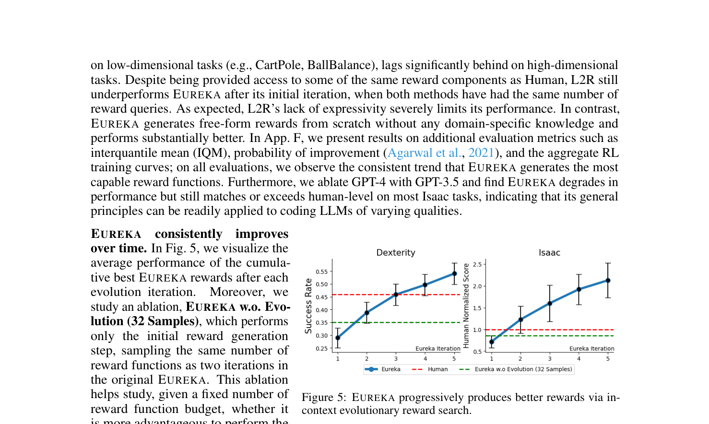

**Caption:** Figure 5: EUREKA progressively produces better rewards via in-context evolutionary reward search.

**Caption[CN]:** 图 5：EUREKA 通过上下文进化奖励搜索，随着迭代的深入稳步生成越来越优秀的奖励函数。

> <span style="color:#3B82F6"><strong>Para. 32:</strong></span> EUREKA consistently improves over time. In Fig. 5, we visualize the average performance of the cumulative best EUREKA rewards after each evolution iteration. Moreover, we study an ablation, EUREKA w.o. Evolution (32 Samples), which performs only the initial reward generation step, sampling the same number of reward functions as two iterations in the original EUREKA. This ablation helps study, given a fixed number of reward function budget, whether it is more advantageous to perform the EUREKA evolution or simply sample more first-attempt rewards without iterative improvement. As seen, on both benchmarks, EUREKA rewards steadily improve and eventually surpass human rewards in performance despite sub-par initial performances. This consistent improvement also cannot be replaced by just sampling more in the first iteration as the ablation’s performances are lower than EUREKA after 2 iterations on both benchmarks. Together, these results demonstrate that EUREKA’s novel evolutionary optimization is indispensable for its final performance.

> <span style="color:#F59E0B"><strong>Para. 32[CN]:</strong></span> EUREKA 随迭代持续自我演进提升。在图 5 中，我们展示了在每轮进化迭代后累计最优 EUREKA 奖励的平均性能。此外，我们进行了一项消融研究——无进化版 EUREKA（EUREKA w.o. Evolution，采样 32 个样本），该版本仅执行初始奖励生成步骤，采样数量等同于原始 EUREKA 两轮迭代的总样本数。这一消融对比有助于回答：在给定固定的奖励生成预算下，是进行 EUREKA 进化迭代更具优势，还是单纯在首轮盲目增加采样数量而不进行迭代改进更为有效？结果表明，在两个基准测试中，尽管 EUREKA 初始阶段表现平平，但随着进化搜索的推进，奖励质量稳步提升并最终超越人类专家奖励。这种持续的改进是无法通过单轮单纯增加采样量来替代的，因为消融版本的表现在两个基准上均明显低于迭代 2 轮后的 EUREKA。综合来看，这些结果强有力地证实了 EUREKA 新颖的进化优化机制对于最终卓越性能是不可或缺的。

### Figure 6. EUREKA 生成新颖奖励函数分析


**Caption:** Figure 6: Eureka generates novel rewards.

**Caption[CN]:** 图 6：EUREKA 能够生成高度新颖的奖励函数。散点图展示了在所有 Isaac 任务上 EUREKA 奖励与人类专家奖励的 Pearson 相关系数与归一化人类得分的关系。

> <span style="color:#3B82F6"><strong>Para. 33:</strong></span> EUREKA generates novel rewards. We assess the novelty of EUREKA rewards by computing the correlations between EUREKA and human rewards on all the Isaac tasks; see App. B for details on this procedure. Then, we plot the correlations against the human normalized scores on a scatter-plot in Figure 6, where each point represents a single EUREKA reward on a single task. As shown, EUREKA mostly generates weakly correlated reward functions that outperform the human ones. In addition, by examining the average correlation by task (App. F), we observe that the harder the task is, the less correlated the EUREKA rewards. We hypothesize that human rewards are less likely to be near optimal for difficult tasks, leaving more room for EUREKA rewards to be different and better. In a few cases, EUREKA rewards are even negatively correlated with human rewards but perform significantly better, demonstrating that EUREKA can discover novel reward design principles that may run counter to human intuition; we illustrate these EUREKA rewards in App. G.2.

> <span style="color:#F59E0B"><strong>Para. 33[CN]:</strong></span> EUREKA 生成高度新颖的奖励函数。我们通过计算所有 Isaac 任务上 EUREKA 奖励与人类奖励之间的相关性来评估 EUREKA 奖励的新颖性；具体流程详见附录 B。随后，我们在图 6 的散点图中绘制了相关系数与人类归一化得分之间的对应关系，其中每个点代表单个任务上的单个 EUREKA 奖励函数。如图所示，EUREKA 生成的奖励函数大多与人类奖励仅呈弱相关，且性能全面超越人类设计。此外，通过考察各个任务的平均相关性（附录 F），我们观察到任务难度越高、状态维度越大，EUREKA 奖励与人类奖励的相关性就越弱。我们推测，人类在设计高难度任务的奖励时往往更难逼近最优解，从而为 EUREKA 探索截然不同且性能更优的奖励机制留出了广阔空间。在少数案例中，EUREKA 生成的奖励甚至与人类专家奖励呈现负相关，但其实际表现却大幅领先，这表明 EUREKA 能够发现反直觉但极其有效的新颖奖励设计原则；我们在附录 G.2 中展示了这些代表性奖励。

> <span style="color:#3B82F6"><strong>Para. 34:</strong></span> Reward reflection enables targeted improvement. To assess the importance of constructing reward reflection in the reward feedback, we evaluate an ablation, EUREKA (No Reward Reflection), which reduces the reward feedback prompt to include only snapshot values of the task metric $F$. Averaged over all Isaac tasks, EUREKA without reward reflection reduces the average normalized score by 28.6%; in App. F, we provide detailed per-task breakdown and observe much greater performance deterioration on higher dimensional tasks. To provide qualitative analysis, in App. G.1, we include several examples in which EUREKA utilizes the reward reflection to perform targeted reward editing.

> <span style="color:#F59E0B"><strong>Para. 34[CN]:</strong></span> 奖励反思实现高靶向性改进。为评估在反馈中构建奖励反思的重要性，我们测试了消融版本 EUREKA（无奖励反思），该版本将奖励反馈提示精简为仅包含任务指标 $F$ 的瞬时采样标量值。在所有 Isaac 任务的平均表现中，缺乏奖励反思的 EUREKA 归一化得分下降了 28.6%；在附录 F 中，我们提供了各任务的详细拆解，并发现高维任务上的性能衰减更为严重。为了提供直观的定性分析，我们在附录 G.1 中给出了多个生动实例，展示 EUREKA 如何凭借奖励反思开展针对性的奖励微调。

### Figure 7. EUREKA 结合课程学习解锁灵巧五指转笔技能


**Caption:** Figure 7: EUREKA can be flexibly combined with curriculum learning to acquire complex dexterous skills.

**Caption[CN]:** 图 7：EUREKA 可以灵活地与课程学习相结合，从而习得极其复杂的灵巧操作技能（如 Shadow Hand 连续转笔）。

> <span style="color:#3B82F6"><strong>Para. 35:</strong></span> EUREKA with curriculum learning enables dexterous pen spinning. Finally, we investigate whether EUREKA can be used to solve a truly novel and challenging dexterous task. To this end, we propose pen spinning as a test bed. This task is highly dynamic and requires a Shadow Hand to continuously rotate a pen to achieve some pre-defined spinning patterns for as many cycles as possible; we implement this task on top of the original Shadow Hand environment in Isaac Gym without changes to any physics parameter, ensuring physical realism. We consider a curriculum learning (Bengio et al., 2009) approach to break down the task into manageable components that can be independently solved by EUREKA. Specifically, we first use EUREKA to generate a reward for the task of re-orienting the pen to random target configurations and train a policy using the final EUREKA reward. Then, using this pre-trained policy (Pre-Trained), we fine-tune it using the same EUREKA reward to reach the sequence of pen-spinning configurations (Fine-Tuned). To demonstrate the importance of curriculum learning, we also directly train a policy from scratch on the target task using EUREKA reward without the first-stage pre-training (Scratch). The RL training curves are shown in Figure 7. Eureka fine-tuning quickly adapts the policy to successfully spin the pen for many cycles in a row; see project website for videos. In contrast, neither pre-trained or learning-from-scratch policies can complete even a single cycle of pen spinning. In addition, using this EUREKA fine-tuning approach, we have also trained pen spinning policies for a variety of different spinning configurations; all pen spinning videos can be viewed on our project website, and experimental details are in App. D.1. These results demonstrate EUREKA’s applicability to advanced policy learning approaches, which are often necessary for learning very complex skills.

> <span style="color:#F59E0B"><strong>Para. 35[CN]:</strong></span> EUREKA 结合课程学习实现灵巧转笔。最后，我们探究 EUREKA 是否能用于解决真正新颖且极具挑战性的灵巧控制难题。为此，我们提出了“转笔”（pen spinning）作为终极测试基准。该任务具有高度的动力学动态性，要求五指灵巧手（Shadow Hand）持续旋转一支笔，在尽可能多的周期内保持预定义的旋转模式；我们在 Isaac Gym 原生 Shadow Hand 环境上构建了此任务，未改动任何物理仿真参数，确保了物理真实度。我们采用课程学习（Bengio 等，2009）策略将该任务分解为可被 EUREKA 独立解决的模块。具体而言，我们首先利用 EUREKA 生成将笔重新定向至随机目标朝向的奖励函数，并训练出基础策略。随后，以该预训练策略（Pre-Trained）为起点，使用相同的 EUREKA 奖励函数对其进行微调，以追踪连续的转笔目标构型序列（Fine-Tuned）。为了证明课程学习的必要性，我们还对比了不经预训练直接从零开始训练目标转笔任务的策略（Scratch）。强化学习训练曲线如图 7 所示。EUREKA 微调策略迅速适应并成功实现了连续多圈的高速平稳转笔；视频详见项目主页。相比之下，未经微调的预训练策略或从零训练的策略连半圈转笔都无法完成。此外，利用这种 EUREKA 微调方案，我们还成功训练了针对多种不同旋转姿态序列的转笔策略；详见附录 D.1。这些结果强有力地验证了 EUREKA 与高阶策略学习范式结合的普适性，而这正是掌握超复杂物理技能的核心关键。

## 4.4 EUREKA from Human Feedback

> <span style="color:#3B82F6"><strong>Para. 36:</strong></span> In addition to automated reward design, EUREKA enables a new gradient-free in-context learning approach to RL from Human Feedback (RLHF) that can readily incorporate various types of human inputs to generate more performant and human-aligned reward functions.

> <span style="color:#F59E0B"><strong>Para. 36[CN]:</strong></span> 除了完全自主的自动化奖励设计外，EUREKA 还开创了一种全新的免梯度上下文学习方法用于人类反馈强化学习（RLHF），能够直接融合不同形式的人类输入，生成性能更强且更契合人类意图的奖励函数。

### Figure 8. EUREKA 从人类奖励初始化（Human Init.）有效提升性能

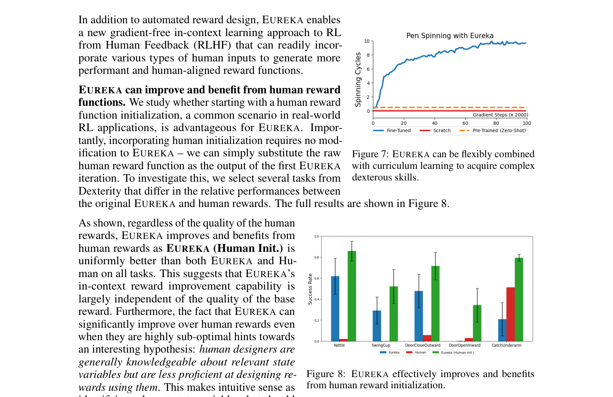

**Caption:** Figure 8: EUREKA effectively improves and benefits from human reward functions. Left: EUREKA started from human reward initialization (Human Init.) outperforms human reward functions across all tasks. Right: EUREKA generates reward functions that better optimize human rewards than human rewards themselves.

**Caption[CN]:** 图 8：EUREKA 能够有效改进并受益于人类奖励函数。左图：以人类奖励为初始点（Human Init.）的 EUREKA 在所有任务上均全面超越原始人类专家奖励。右图：EUREKA 生成的奖励函数甚至比人类专家奖励本身能更好地优化人类奖励指标。

> <span style="color:#3B82F6"><strong>Para. 37:</strong></span> EUREKA can improve and benefit from human reward functions. We study whether starting with a human reward function initialization, a common scenario in real-world RL applications, is advantageous for EUREKA. Importantly, incorporating human initialization requires no modification to EUREKA – we can simply substitute the raw human reward function as the output of the first EUREKA iteration. To investigate this, we select several tasks from Dexterity that differ in the relative performances between the original EUREKA and human rewards. The full results are shown in Figure 8.

> <span style="color:#F59E0B"><strong>Para. 37[CN]:</strong></span> EUREKA 能够受益于人类奖励并在此基础上持续进化。在实际机器人与强化学习应用中，从现有的人类工程奖励出发是极常见的场景，我们研究这种人类奖励初始化对 EUREKA 是否有利。至关重要的是，引入人类初始化完全不需要改动 EUREKA 算法架构——我们只需将人类原始奖励函数直接作为 EUREKA 第一轮迭代的输出即可。为了深入探究，我们从 Dexterity 基准中挑选了若干在原始 EUREKA 与人类奖励相对性能上各异的典型任务。完整结果展示于图 8 中。

> <span style="color:#3B82F6"><strong>Para. 38:</strong></span> As shown, regardless of the quality of the human rewards, EUREKA improves and benefits from human rewards as EUREKA (Human Init.) is uniformly better than both EUREKA and Human on all tasks. This suggests that EUREKA’s in-context reward improvement capability is largely independent of the quality of the base reward. Furthermore, the fact that EUREKA can significantly improve over human rewards even when they are highly sub-optimal hints towards an interesting hypothesis: human designers are generally knowledgeable about relevant state variables but are less proficient at designing rewards using them. This makes intuitive sense as identifying relevant state variables that should be included in the reward function involves mostly common sense reasoning, but reward design requires specialized knowledge and experience in RL. Together, these results demonstrate EUREKA’s reward assistant capability, perfectly complementing human designers’ knowledge about useful state variables and making up for their less proficiency on how to design rewards using them. In App. G.3, we provide several examples of EUREKA (Human Init.) steps.

> <span style="color:#F59E0B"><strong>Para. 38[CN]:</strong></span> 如图所示，无论人类初始奖励质量如何，EUREKA（人类初始化版本，Human Init.）在所有任务上均一致优于原始 EUREKA 和人类专家设计。这表明 EUREKA 的上下文奖励精炼能力在很大程度上独立于基准奖励的初始质量。此外，即便在人类奖励严重次优的情况下，EUREKA 依然能够带来大幅提升，这暗示了一个引人深思的假设：人类设计者普遍具备辨识相关关键状态变量的常识先验，但在如何利用这些变量设计精妙的数学奖励函数方面却经验欠缺。这非常符合直觉：挑选哪些物理变量应当纳入奖励函数主要依赖宏观物理常识，但精确设定各奖励项的数学形式、温度参数和组合权重则需要高深的 RL 算法专门知识。这些结果充分证明了 EUREKA 作为“奖励设计智能助手”的卓越价值，完美补足了人类专家在复杂数学建模上的短板。附录 G.3 提供了人类初始化的演化过程实例。

### Figure 9. EUREKA 融合人类文本反思实现偏好对齐跑姿

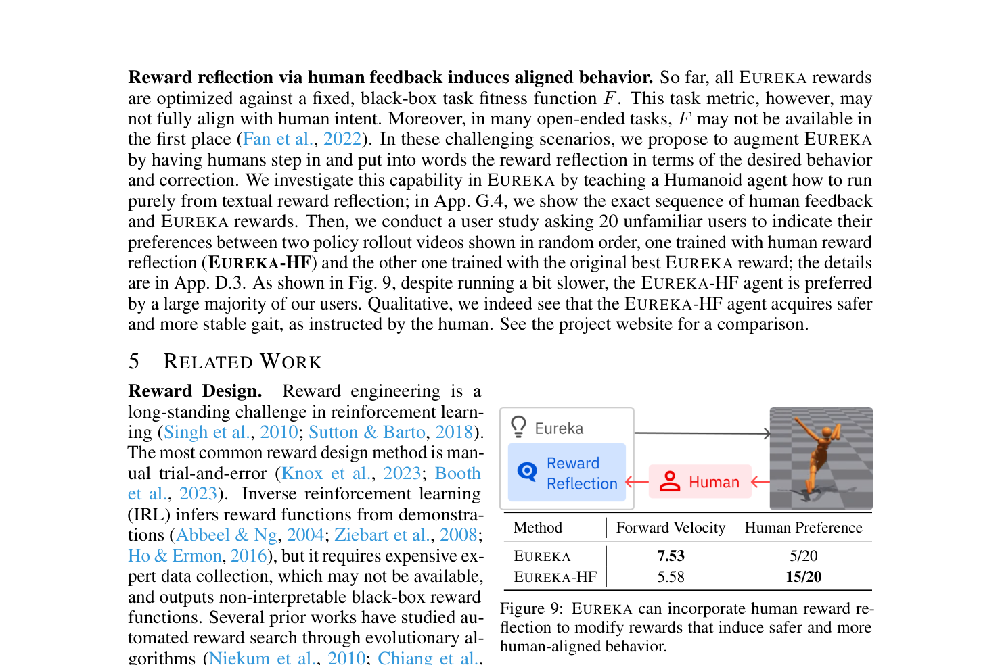

**Caption:** Figure 9: EUREKA can incorporate human reward reflections (EUREKA-HF) to generate reward functions that are both performant and aligned with human preference.

**Caption[CN]:** 图 9：EUREKA 能够融入人类文本奖励反思（EUREKA-HF），生成兼具高运动性能且符合人类对齐偏好的安全步态奖励函数。

> <span style="color:#3B82F6"><strong>Para. 39:</strong></span> Reward reflection via human feedback induces aligned behavior. So far, all EUREKA rewards are optimized against a fixed, black-box task fitness function $F$. This task metric, however, may not fully align with human intent. Moreover, in many open-ended tasks, $F$ may not be available in the first place (Fan et al., 2022). In these challenging scenarios, we propose to augment EUREKA by having humans step in and put into words the reward reflection in terms of the desired behavior and correction. We investigate this capability in EUREKA by teaching a Humanoid agent how to run purely from textual reward reflection; in App. G.4, we show the exact sequence of human feedback and EUREKA rewards. Then, we conduct a user study asking 20 unfamiliar users to indicate their preferences between two policy rollout videos shown in random order, one trained with human reward reflection (EUREKA-HF) and the other one trained with the original best EUREKA reward; the details are in App. D.3. As shown in Fig. 9, despite running a bit slower, the EUREKA-HF agent is preferred by a large majority of our users. Qualitative, we indeed see that the EUREKA-HF agent acquires safer and more stable gait, as instructed by the human. See the project website for a comparison.

> <span style="color:#F59E0B"><strong>Para. 39[CN]:</strong></span> 基于人类反馈的奖励反思引导行为对齐。到目前为止，所有 EUREKA 奖励均针对固定的黑盒任务适应度函数 $F$ 进行优化。然而，这一纯数值任务指标可能无法完全契合人类的真实意图。此外，在许多开放式任务中，精确的数学指标 $F$ 根本无法预先定义（Fan 等，2022）。面对这些严峻挑战，我们提出增强 EUREKA：由人类专家介入，用自然语言撰写针对预期行为和偏差修正的“人类奖励反思”。我们在人形机器人（Humanoid）奔跑任务上进行了实证，完全依靠纯文本反思指导其跑步姿态；附录 G.4 展示了人类反馈与 EUREKA 奖励演变的完整对话序列。随后，我们开展了一项用户研究，邀请 20 位互不相关的独立用户在盲测下对随机排序的两段策略视频进行偏好裁决：一段采用人类反馈奖励训练（EUREKA-HF），另一段采用纯算法自动搜索的最优 EUREKA 奖励训练；详见附录 D.3。如图 9 所示，尽管奔跑前向速度稍有降低（5.58 对比 7.53），但绝大多数受试者（15/20）明确更青睐 EUREKA-HF 策略。在质性分析上，EUREKA-HF 策略成功习得了更加平稳自然、安全且对称的优雅步态，完全符合人类给出的指导建议。视频对比见项目主页。

# 5 Related Work

> <span style="color:#3B82F6"><strong>Para. 40:</strong></span> Reward Design. Reward engineering is a long-standing challenge in reinforcement learning (Singh et al., 2010; Sutton & Barto, 2018). The most common reward design method is manual trial-and-error (Knox et al., 2023; Booth et al., 2023). Inverse reinforcement learning (IRL) infers reward functions from demonstrations (Abbeel & Ng, 2004; Ziebart et al., 2008; Ho & Ermon, 2016), but it requires expensive expert data collection, which may not be available, and outputs non-interpretable black-box reward functions. Several prior works have studied automated reward search through evolutionary algorithms (Niekum et al., 2010; Chiang et al., 2019; Faust et al., 2019). These early attempts are limited to task-specific implementations of evolutionary algorithms that search over only parameters within provided reward templates. Recent works have also proposed using pretrained foundation models that can produce reward functions for new tasks (Ma et al., 2022; 2023; Fan et al., 2022; Du et al., 2023a; Karamcheti et al., 2023; Du et al., 2023b; Kwon et al., 2023). Most of these approaches output scalar rewards that lack interpretability and do not naturally admit the capability to improve or adapt rewards on-the-fly. In contrast, EUREKA adeptly generates free-form, white-box reward code and effectively in-context improves.

> <span style="color:#F59E0B"><strong>Para. 40[CN]:</strong></span> 奖励设计。奖励工程是强化学习领域长期存在的经典难题（Singh 等，2010；Sutton & Barto，2018）。最常见的奖励设计手段是手工反复试错（Knox 等，2023；Booth 等，2023）。逆向强化学习（IRL）通过专家演示反推奖励函数（Abbeel & Ng，2004；Ziebart 等，2008；Ho & Ermon，2016），但其高度依赖代价昂贵甚至难以获取的专家演示数据，且输出的往往是不可解释的黑盒奖励模型。若干早期工作探索了利用进化算法自动搜索奖励（Niekum 等，2010；Chiang 等，2019；Faust 等，2019）。这些早期尝试局限于特定任务的手工进化设定，且通常仅能在固定的奖励模板内部微调数值参数。近期的研究也提出了利用预训练基础模型为新任务生成奖励信号的方法（Ma 等，2022；2023；Fan 等，2022；Du 等，2023a；Karamcheti 等，2023；Du 等，2023b；Kwon 等，2023）。这些方法绝大多数输出标量奖励值，缺乏代码可读性与可解释性，更无法天然支持在运行中持续改进或动态适应。与之形成鲜明对比的是，EUREKA 熟练生成完全自由形式的白盒 Python 奖励代码，并能够在上下文窗口内实现高效自适应进化。

> <span style="color:#3B82F6"><strong>Para. 41:</strong></span> Code Large Language Models for Decision Making. Recent works have considered using coding LLMs (Austin et al., 2021; Chen et al., 2021; Rozière et al., 2023) to generate grounded and structured programmatic output for decision making and robotics problems (Liang et al., 2023; Singh et al., 2023; Wang et al., 2023b; Huang et al., 2023; Wang et al., 2023a; Liu et al., 2023a; Silver et al., 2023; Ding et al., 2023; Lin et al., 2023; Xie et al., 2023). However, most of these works rely on known motion primitives to carry out robot actions and do not apply to robot tasks that require low-level skill learning, such as dexterous manipulation. The closest to our work is a recent work (Yu et al., 2023) that also explores using LLMs to aid reward design. Their approach, however, requires domain-specific task descriptions and reward templates.

> <span style="color:#F59E0B"><strong>Para. 41[CN]:</strong></span> 面向决策制定的代码大语言模型。近期的研究开始利用代码生成大模型（Austin 等，2021；Chen 等，2021；Rozière 等，2023）为序贯决策与机器人学问题生成落地且结构化的程序化输出（Liang 等，2023；Singh 等，2023；Wang 等，2023b；Huang 等，2023；Wang 等，2023a；Liu 等，2023a；Silver 等，2023；Ding 等，2023；Lin 等，2023；Xie 等，2023）。然而，这些工作绝大多数必须依赖预先写好的高层运动控制基元来执行机械动作，无法直接适用于需要学习底层精细动作技能的任务（如多指灵巧手操作）。与我们最相近的工作是 Yu 等人（2023）近期探索利用 LLM 辅助奖励设计的 L2R 方法。然而，其方法高度依赖领域特定的任务动作描述模板以及严格限定的奖励 API 基元。

# 6 Conclusion

> <span style="color:#3B82F6"><strong>Para. 42:</strong></span> We have presented EUREKA, a universal reward design algorithm powered by coding large language models and in-context evolutionary search. Without any task-specific prompt engineering or human intervention, EUREKA achieves human-level reward generation on a wide range of robots and tasks. EUREKA’s particular strength in learning dexterity solves dexterous pen spinning for the first time with a curriculum learning approach. Finally, EUREKA enables a gradient-free approach to reinforcement learning from human feedback that readily incorporates human reward initialization and textual feedback to better steer its reward generation. The versatility and substantial performance gains of EUREKA suggest that the simple principle of combining large language models with evolutionary algorithms are a general and scalable approach to reward design, an insight that may be generally applicable to difficult, open-ended search problems.

> <span style="color:#F59E0B"><strong>Para. 42[CN]:</strong></span> 我们提出了 EUREKA——一种由代码大语言模型和上下文进化搜索驱动的通用奖励设计算法。在没有任何特定任务提示词工程或人工干预的情况下，EUREKA 在广泛的机器人形态与复杂任务上达到了人类专家级的奖励设计水准。EUREKA 在学习灵巧操作方面的特长，使其首次通过课程学习成功攻克了高难度灵巧转笔绝技。最后，EUREKA 提供了一种免梯度的全新人类反馈强化学习途径，能够直接吸收人类奖励初始化与自然语言文本指导，以更优地引导奖励演化生成。EUREKA 的多功能性与巨大性能增益充分表明：将大语言模型与进化搜索算法相结合的简单原则，是解决奖励设计乃至广泛复杂开放搜索问题的通用且极具扩展性的强有力范式。

# Acknowledgement

> <span style="color:#3B82F6"><strong>Para. 43:</strong></span> We are grateful to colleagues and friends at NVIDIA and UPenn for their helpful feedback and insightful discussions. We thank Viktor Makoviychuk, Yashraj Narang, Iretiayo Akinola, Erwin Coumans for their assistance on Isaac Gym experiment and rendering. This work is done during Yecheng Jason Ma’s internship at NVIDIA. We acknowledge funding support from NSF CAREER Award 2239301, ONR award N00014-22-1-2677, NSF Award CCF-1917852, and ARO Award W911NF-20-1-0080.

> <span style="color:#F59E0B"><strong>Para. 43[CN]:</strong></span> 我们衷心感谢 NVIDIA 和宾夕法尼亚大学的同事与朋友们提出的宝贵反馈与富有洞见的研讨。感谢 Viktor Makoviychuk、Yashraj Narang、Iretiayo Akinola 以及 Erwin Coumans 在 Isaac Gym 实验与可视化渲染方面提供的协助。本项工作完成于 Yecheng Jason Ma 在 NVIDIA 实习期间。我们特别鸣谢以下项目的科研经费支持：美国国家科学基金会 NSF CAREER 资助项目 2239301、美国海军研究办公室 ONR 资助项目 N00014-22-1-2677、NSF 资助项目 CCF-1917852 以及美国陆军研究办公室 ARO 资助项目 W911NF-20-1-0080。

# References

> **Bibliographic note:** In accordance with the reader contract, all 58 citations from the published conference paper are fully retained in their original scholarly bibliographic form with added Chinese translations and contextual annotations for rapid technical reference.

1. Pieter Abbeel and Andrew Y Ng. Apprenticeship learning via inverse reinforcement learning. In Proceedings of the twenty-first international conference on Machine learning, pp. 1, 2004.
   - **中文导读/解析：** 通过逆向强化学习的学徒学习（经典逆强化学习奠基之作，引入特征期望匹配算法）。

2. Rishabh Agarwal, Max Schwarzer, Pablo Samuel Castro, Aaron C Courville, and Marc Bellemare. Deep reinforcement learning at the edge of the statistical precipice. Advances in neural information processing systems, 34:29304–29320, 2021.
   - **中文导读/解析：** 统计悬崖边缘的深度强化学习（提出深度强化学习中严格评估的统计指标，如四分位距均值 IQM 与性能分布曲线）。

3. Michael Ahn, Anthony Brohan, Noah Brown, Yevgen Chebotar, Omar Cortes, Byron David, Chelsea Finn, Chuyuan Fu, Keerthana Gopalakrishnan, Karol Hausman, et al. Do as i can, not as i say: Grounding language in robotic affordances. arXiv preprint arXiv:2204.01691, 2022.
   - **中文导读/解析：** SayCan：将自然语言规划落地至机器人环境可供性（利用 LLM 提供高层任务规划并与底层策略可执行度结合）。

4. Ilge Akkaya, Marcin Andrychowicz, Maciek Chociej, Mateusz Litwin, Bob McGrew, Arthur Petron, Alex Paino, Matthias Plappert, Glenn Powell, Raphael Ribas, et al. Solving rubik's cube with a robot hand. arXiv preprint arXiv:1910.07113, 2019.
   - **中文导读/解析：** 利用机械手解魔方（OpenAI 利用自动领域随机化与单手灵巧操作解决魔方的里程碑成果）。

5. OpenAI: Marcin Andrychowicz, Bowen Baker, Maciek Chociej, Rafal Jozefowicz, Bob McGrew, Jakub Pachocki, Arthur Petron, Matthias Plappert, Glenn Powell, Alex Ray, et al. Learning dexterous in-hand manipulation. The International Journal of Robotics Research, 39(1):3–20, 2020.
   - **中文导读/解析：** 学习灵巧掌内操作（OpenAI 灵巧 Shadow Hand 掌内旋转物体在物理真实仿真中的系统性总结）。

6. Jacob Austin, Augustus Odena, Maxwell Nye, Maarten Bosma, Henryk Michalewski, David Dohan, Ellen Jiang, Carrie Cai, Michael Terry, Quoc Le, et al. Program synthesis with large language models. arXiv preprint arXiv:2108.07732, 2021.
   - **中文导读/解析：** 基于大语言模型的程序合成（探讨 Transformer 模型生成程序代码的能力与测试基准）。

7. Yoshua Bengio, Jérôme Louradour, Ronan Collobert, and Jason Weston. Curriculum learning. In Proceedings of the 26th annual international conference on machine learning, pp. 41–48, 2009.
   - **中文导读/解析：** 课程学习（从简单概念逐步过渡到复杂概念的经典机器学习训练范式）。

8. Serena Booth, W Bradley Knox, Julie Shah, Scott Niekum, Peter Stone, and Alessandro Allievi. The perils of trial-and-error reward design: misdesign through overfitting and invalid task specifications. In Proceedings of the AAAI Conference on Human Computation and Crowdsourcing, volume 11, pp. 5920–5929, 2023.
   - **中文导读/解析：** 试错奖励设计的陷阱：过拟合与无效任务定义带来的错误设计（关于强化学习研究者设计奖励痛点的深度行业调查）。

9. Greg Brockman, Vicki Cheung, Ludwig Pettersson, Jonas Schneider, John Schulman, Jie Tang, and Wojciech Zaremba. OpenAI Gym. arXiv preprint arXiv:1606.01540, 2016.
   - **中文导读/解析：** OpenAI Gym：强化学习算法基准测试平台。

10. Anthony Brohan, Noah Brown, Justice Carbajal, Yevgen Chebotar, Joseph Dabis, Chelsea Finn, Keerthana Gopalakrishnan, Karol Hausman, Alex Herzog, Jasmine Hsu, et al. RT-2: Vision-language-action models transfer web knowledge to robotic control. arXiv preprint arXiv:2307.15818, 2023.
   - **中文导读/解析：** RT-2：将互联网规模的视觉-语言知识直接迁移至机器人动作控制的 VLA 大模型。

11. Mark Chen, Jerry Tworek, Heewoo Jun, Qiming Yuan, Henrique Ponde de Oliveira Pinto, Jared Kaplan, Harri Edwards, Yuri Burda, Nicholas Joseph, Greg Brockman, et al. Evaluating large language models trained on code. arXiv preprint arXiv:2107.03374, 2021.
   - **中文导读/解析：** 评估在代码上训练的大语言模型（OpenAI Codex 技术报告与 HumanEval 基准）。

12. Yuanpei Chen, Tianhao Wu, Shengjie Wang, Xidong Feng, Jiechuan Jiang, Zongqing Lu, Stephen McAleer, Hao Dong, Song-Chun Zhu, and Yaodong Yang. Towards human-level bimanual dexterous manipulation with reinforcement learning. Advances in Neural Information Processing Systems, 35:5150–5163, 2022.
   - **中文导读/解析：** 迈向人类水平的双灵巧手强化学习操作（双手机器人灵巧操作基准 Dexterity 提出论文）。

13. Hao-Tien Lewis Chiang, Aleksandra Faust, Marek Fiser, and Anthony Francis. Learning navigation behaviors end-to-end with autorl. IEEE Robotics and Automation Letters, 4(2):2007–2014, 2019.
   - **中文导读/解析：** AutoRL：通过进化超参数与奖励优化实现端到端自主导航行为学习。

14. Yan Ding, Xiaohan Zhang, Chris Paxton, and Shiqi Zhang. Task and motion planning with large language models for object sorting. arXiv preprint arXiv:2303.06247, 2023.
   - **中文导读/解析：** 基于大语言模型的物体分拣任务与运动规划。

15. Yuqing Du, Ksenia Konyushkova, Misha Denil, Akhil Raju, Jessica Landon, Felix Hill, Nando de Freitas, and Feryal Behbahani. Vision-language models as success detectors. arXiv preprint arXiv:2303.07280, 2023a.
   - **中文导读/解析：** 视觉-语言模型作为任务成功检测器（利用多模态大模型判定机器人任务完成情况）。

16. Yuqing Du, Olivia Watkins, Zihan Wang, Cédric Colas, Trevor Darrell, Pieter Abbeel, Abhishek Gupta, and Jacob Andreas. Guiding pre-training in reinforcement learning with language models. arXiv preprint arXiv:2302.06692, 2023b.
   - **中文导读/解析：** 利用语言模型引导强化学习预训练探索。

17. Linxi Fan, Guanzhi Wang, Yunfan Jiang, Ajay Mandlekar, Yuncong Yang, Haoyi Zhu, Andrew Tang, De-An Huang, Yuke Zhu, and Anima Anandkumar. Minedojo: Building open-ended embodied agents with internet-scale knowledge. Advances in Neural Information Processing Systems, 35:18343–18362, 2022.
   - **中文导读/解析：** MineDojo：利用互联网规模知识构建开放世界具身智能体（获 NeurIPS 2022 杰出数据集与基准论文奖）。

18. Aleksandra Faust, Anthony Francis, and Dar Mehta. Evolving rewards to automate reinforcement learning. arXiv preprint arXiv:1905.07628, 2019.
   - **中文导读/解析：** 通过进化奖励实现强化学习超参数与奖励塑形的自动化。

19. Shixiang Gu, Ethan Holly, Timothy Lillicrap, and Sergey Levine. Deep reinforcement learning for robotic manipulation with asynchronous off-policy updates. In 2017 IEEE international conference on robotics and automation (ICRA), pp. 3389–3396. IEEE, 2017.
   - **中文导读/解析：** 利用异步离策略更新的机械臂灵巧操作深度强化学习。

20. Dylan Hadfield-Menell, Smitha Milli, Pieter Abbeel, Stuart J Russell, and Anca Dragan. Inverse reward design. Advances in neural information processing systems, 30, 2017.
   - **中文导读/解析：** 逆向奖励设计（Inverse Reward Design，分析人工设计奖励在新环境下的失效与对齐隐患）。

21. Ankur Handa, Arthur Allshire, Viktor Makoviychuk, Aleksei Petrenko, Rajiv Singh, Jingzhou Liu, Denys Makoviichuk, Karl Van Wyk, Alexander Zhurkevich, Gaurav S Sukhatme, et al. Dextreme: Transferring agile in-hand manipulation from simulation to reality. In 2023 IEEE International Conference on Robotics and Automation (ICRA), pp. 5977–5984. IEEE, 2023.
   - **中文导读/解析：** Dextreme：通过仿真到真实迁移实现敏捷掌内灵巧操作。

22. Peter Henderson, Riashat Islam, Philip Bachman, Joelle Pineau, Doina Precup, and David Meger. Deep reinforcement learning that matters. In Proceedings of the AAAI conference on artificial intelligence, volume 32, 2018.
   - **中文导读/解析：** 切中要害的深度强化学习（深入揭示强化学习算法复现性、随机种子与超参数敏感性）。

23. Jonathan Ho and Stefano Ermon. Generative adversarial imitation learning. Advances in neural information processing systems, 29, 2016.
   - **中文导读/解析：** 生成式对抗模仿学习（GAIL，将逆强化学习与生成对抗网络相结合的里程碑工作）。

24. Taylor Howell, Nimrod Gileadi, Saran Tunyasuvunakool, Kevin Zakka, and Tom Erez. Dojo: A differentiable physics engine for robotics. arXiv preprint arXiv:2212.00541, 2022.
   - **中文导读/解析：** Dojo：面向机器人学的高性能可微分物理仿真引擎。

25. Siyuan Huang, Zhengkai Jiang, Hao Dong, Yu Qiao, Peng Gao, and Hongsheng Li. Instruct2act: Mapping multi-modality instructions to robotic actions with large language model. arXiv preprint arXiv:2305.11176, 2023.
   - **中文导读/解析：** Instruct2Act：利用大语言模型将多模态指令映射为机器人动作。

26. Siddharth Karamcheti, Suraj Nair, Annie S Chen, Thomas Kollar, Chelsea Finn, Dorsa Sadigh, and Percy Liang. Language-driven representation learning for robotics. arXiv preprint arXiv:2302.12766, 2023.
   - **中文导读/解析：** 面向机器人的语言驱动视觉表示学习。

27. W Bradley Knox, Alessandro Allievi, Holger Banzhaf, Felix Schmitt, and Peter Stone. Reward (mis)design for autonomous driving. Artificial Intelligence, 316:103829, 2023.
   - **中文导读/解析：** 自动驾驶中的奖励错误设计深度分析。

28. Ashish Kumar, Zipeng Fu, Deepak Pathak, and Jitendra Malik. Rma: Rapid motor adaptation for bipedal and quadrupedal locomotion. arXiv preprint arXiv:2107.04034, 2021.
   - **中文导读/解析：** RMA：四足与双足机器人快速运动适应（Sim2Real 里程碑工作）。

29. Minae Kwon, Sang Michael Xie, Kalesha Bullard, and Dorsa Sadigh. Reward design with language models. arXiv preprint arXiv:2303.00001, 2023.
   - **中文导读/解析：** 利用语言模型设计奖励函数以支持偏好优化。

30. Jacky Liang, Wenlong Huang, Fei Xia, Peng Xu, Karol Hausman, Brian Ichter, Pete Florence, and Andy Zeng. Code as policies: Language model programs for embodied control. In 2023 IEEE International Conference on Robotics and Automation (ICRA), pp. 9493–9500. IEEE, 2023.
   - **中文导读/解析：** Code as Policies：具身控制中的代码生成语言模型程序。

31. Kevin Lin, Christopher Agia, Toki Migimatsu, Marco Pavone, and Jeannette Bohg. Text2motion: From natural language instructions to feasible robot motion paths. arXiv preprint arXiv:2303.12153, 2023.
   - **中文导读/解析：** Text2Motion：从自然语言指令到几何可行的机器人运动路径。

32. Bo Liu, Yuqian Jiang, Xiaohan Zhang, Qiang Liu, Shiqi Zhang, Peter Stone, et al. Llm+ p: Empowering large language models with optimal planning proficiency. arXiv preprint arXiv:2304.11477, 2023a.
   - **中文导读/解析：** LLM+P：利用经典规划器赋能大语言模型最优规划能力。

33. Haotian Liu, Chunyuan Li, Qingyang Wu, and Yong Jae Lee. Visual instruction tuning. arXiv preprint arXiv:2304.08485, 2023b.
   - **中文导读/解析：** 视觉指令微调（LLaVA 奠基工作，开启开源多模态大模型研究热潮）。

34. Yecheng Jason Ma, Shagun Sodhani, Dinesh Jayaraman, Osbert Bastani, Vikash Kumar, and Amy Zhang. Vip: Towards universal visual reward and representation via value-implicit pre-training. arXiv preprint arXiv:2210.00030, 2022.
   - **中文导读/解析：** VIP：通过隐式价值预训练迈向通用视觉奖励与表示。

35. Yecheng Jason Ma, William Liang, Vaidehi Som, Vikash Kumar, Amy Zhang, Osbert Bastani, and Dinesh Jayaraman. Liv: Language-image representations and rewards for robot manipulation. arXiv preprint arXiv:2306.00958, 2023.
   - **中文导读/解析：** LIV：面向机器人操作的通用图文表示与奖励生成。

36. Denys Makoviichuk and Viktor Makoviychuk. rl-games: A high-performance framework for reinforcement learning. https://github.com/Denys88/rl_games, May 2021.
   - **中文导读/解析：** rl-games：针对 GPU 大规模高度并行的强化学习极速训练框架。

37. Viktor Makoviychuk, Lukasz Wawrzyniak, Yunrong Guo, Michelle Lu, Kier Storey, Miles Macklin, David Hoeller, Nikita Rudin, Arthur Allshire, Ankur Handa, et al. Isaac gym: High performance gpu based physics simulation for robot learning. arXiv preprint arXiv:2108.10470, 2021.
   - **中文导读/解析：** Isaac Gym：面向机器人学习的高性能端到端 GPU 物理仿真平台。

38. Gabriel B Margolis, Ge Yang, Kartik Paigwar, Tao Chen, and Pulkit Agrawal. Rapid locomotion via reinforcement learning. arXiv preprint arXiv:2205.02824, 2022.
   - **中文导读/解析：** 通过强化学习实现极限敏捷四足快速运动。

39. Scott Niekum, Andrew G Barto, and Lee Spector. Genetic programming for reward function search. IEEE Transactions on Autonomous Mental Development, 2(2):83–90, 2010.
   - **中文导读/解析：** 用于奖励函数搜索的遗传编程算法。

40. OpenAI. Gpt-4 technical report, 2023.
   - **中文导读/解析：** GPT-4 技术报告（介绍具备高级推理与编程能力的里程碑模型）。

41. Baptiste Rozière, Jonas Gehring, Fabian Gloeckle, Sten Sootla, Itai Gat, Xiaoqing Ellen Tan, Yossi Adi, Jingyu Liu, Tal Remez, Jérémy Rapin, et al. Code llama: Open foundation models for code. arXiv preprint arXiv:2308.12950, 2023.
   - **中文导读/解析：** Code Llama：开源代码基础大模型。

42. Stuart J Russell and Peter Norvig. Artificial Intelligence: A Modern Approach. Prentice Hall, 1st edition, 1995.
   - **中文导读/解析：** 《人工智能：一种现代的方法》（经典 AI 教科书）。

43. John Schulman, Filip Wolski, Prafulla Dhariwal, Alec Radford, and Oleg Klimov. Proximal policy optimization algorithms. arXiv preprint arXiv:1707.06347, 2017.
   - **中文导读/解析：** 近端策略优化算法（PPO，现代强化学习中最广泛使用的无模型算法）。

44. Noah Shinn, Federico Cassano, Beck Labash, Ashwin Gopinath, Karthik Narasimhan, and Shunyu Yao. Reflexion: Language agents with verbal reinforcement learning. arXiv preprint arXiv:2303.11366, 2023.
   - **中文导读/解析：** Reflexion：通过语言反思与自我反馈强化学习的语言智能体架构。

45. Tom Silver, Soham Dan, Kavitha Srinivas, Joshua B Tenenbaum, Leslie Pack Kaelbling, and Michael Katz. Generalized planning in pddl domains with pretrained large language models. arXiv preprint arXiv:2305.11014, 2023.
   - **中文导读/解析：** 利用预训练大模型在 PDDL 领域实现泛化符号规划。

46. Ishika Singh, Valts Blukis, Arsalan Mousavian, Ankit Goyal, Danfei Xu, Jonathan Tremblay, Dieter Fox, Jesse Thomason, and Animesh Garg. Progprompt: Generating situated robot task plans using large language models. In 2023 IEEE International Conference on Robotics and Automation (ICRA), pp. 11523–11530. IEEE, 2023.
   - **中文导读/解析：** ProgPrompt：利用大语言模型生成场景具身机器人任务程序规划。

47. Satinder Singh, Richard L. Lewis, and Andrew G. Barto. Where do rewards come from. In Proceedings of the Annual Conference of the Cognitive Science Society, pp. 2601–2606, 2010.
   - **中文导读/解析：** 奖励源自何处？（形式化提出最优奖励框架与奖励设计问题 RDP 的经典理论奠基论文）。

48. Laura Smith, Ilya Kostrikov, and Sergey Levine. A walk in the park: Learning to walk in the real world in 20 minutes. arXiv preprint arXiv:2208.07860, 2022.
   - **中文导读/解析：** 公园漫步：20分钟内直接在真实物理世界中学习行走的四足强化学习。

49. Richard S Sutton and Andrew G Barto. Reinforcement Learning: An Introduction. MIT press, 2nd edition, 2018.
   - **中文导读/解析：** 《强化学习导论》（强化学习领域经典权威教材）。

50. Emanuel Todorov, Tom Erez, and Yuval Tassa. Mujoco: A physics engine for model-based control. In 2012 IEEE/RSJ International Conference on Intelligent Robots and Systems, pp. 5026–5033. IEEE, 2012.
   - **中文导读/解析：** MuJoCo：面向基于模型控制的多关节动力学物理引擎。

51. Guanzhi Wang, Yuqi Xie, Yunfan Jiang, Ajay Mandlekar, Chaowei Xiao, Yuke Zhu, Linxi Fan, and Anima Anandkumar. Voyager: An open-ended embodied agent with large language models. arXiv preprint arXiv:2305.16291, 2023a.
   - **中文导读/解析：** Voyager：在《我的世界》中由大语言模型驱动的终身学习开放式具身智能体。

52. Huaxiaoyue Wang, Gonzalo Gonzalez-Pumariega, Yash Sharma, and Sanjiban Choudhury. Demo2code: From videos to plans to code. arXiv preprint arXiv:2305.16744, 2023b.
   - **中文导读/解析：** Demo2Code：从视频演示到高层规划再到机器人动作代码生成。

53. Grady Williams, Andrew Aldrich, and Evangelos Theodorou. Model predictive path integral control using covariance variable importance sampling. arXiv preprint arXiv:1509.01149, 2015.
   - **中文导读/解析：** MPPI：基于协方差变量重要性采样的模型预测路径积分控制。

54. Yaqi Xie, Chen Yu, Tongyao Zhu, Jinbin Bai, Ze Gong, and Harold Soh. Translating natural language to planning goals with large-language models. arXiv preprint arXiv:2302.05128, 2023.
   - **中文导读/解析：** 利用大语言模型将自然语言翻译为可执行规划目标。

55. Zhengyuan Yang, Linjie Li, Kevin Lin, Jianfeng Wang, Chung-Ching Lin, Zicheng Liu, and Lijuan Wang. The dawn of lmms: Preliminary explorations with gpt-4v (ision). arXiv preprint arXiv:2309.17421, 9, 2023.
   - **中文导读/解析：** 多模态大模型的曙光：GPT-4V 视觉前沿能力深度实测探索。

56. Wenhao Yu, Nimrod Gileadi, Chuyuan Fu, Sean Kirmani, Kuang-Huei Lee, Montse Gonzalez Arenas, Hao-Tien Lewis Chiang, Tom Erez, Leonard Hasenclever, Jan Humplik, et al. Language to rewards for robotic skill synthesis. arXiv preprint arXiv:2306.08647, 2023.
   - **中文导读/解析：** Language to Rewards（L2R）：利用自然语言到奖励模板与 API 基元合成机器人运动技能。

57. Deyao Zhu, Jun Chen, Xiaoqian Shen, Xiang Li, and Mohamed Elhoseiny. Minigpt-4: Enhancing vision-language understanding with advanced large language models. arXiv preprint arXiv:2304.10592, 2023.
   - **中文导读/解析：** MiniGPT-4：利用高级大语言模型增强多模态图文对齐理解。

58. Brian D Ziebart, Andrew L Maas, J Andrew Bagnell, Anind K Dey, et al. Maximum entropy inverse reinforcement learning. In AAAI, volume 8, pp. 1433–1438. Chicago, IL, USA, 2008.
   - **中文导读/解析：** 最大熵逆向强化学习（MaxEnt IRL，解决演示轨迹模糊性与次优性的经典理论框架）。


# Appendix

## Table of Contents

- [Appendix A: Full Prompts](#a-full-prompts)
- [Appendix B: Environment Details](#b-environment-details)
- [Appendix C: Baseline Details](#c-baseline-details)
  - [C.1 L2R Reward Examples](#c1-l2r-reward-examples)
- [Appendix D: EUREKA Details](#d-eureka-details)
  - [D.1 Pen Spinning Tasks](#d1-pen-spinning-tasks)
  - [D.2 EUREKA from Human Initialization](#d2-eureka-from-human-initialization)
  - [D.3 EUREKA from Human Feedback](#d3-eureka-from-human-feedback)
  - [D.4 Computation Resources](#d4-computation-resources)
- [Appendix E: EUREKA on Mujoco Environments](#e-eureka-on-mujoco-environments)
- [Appendix F: Additional Results](#f-additional-results)
- [Appendix G: EUREKA Reward Examples](#g-eureka-reward-examples)
  - [G.1 Reward Reflection Examples](#g1-reward-reflection-examples)
  - [G.2 Negatively Correlated EUREKA Reward Examples](#g2-negatively-correlated-eureka-reward-examples)
  - [G.3 EUREKA from Human Initialization Examples](#g3-eureka-from-human-initialization-examples)
  - [G.4 EUREKA from Human Reward Reflection](#g4-eureka-from-human-reward-reflection)
  - [G.5 EUREKA and Human Reward Comparison](#g5-eureka-and-human-reward-comparison)
- [Appendix H: Limitations and Discussion](#h-limitations-and-discussion)

# A Full Prompts

> <span style="color:#3B82F6"><strong>Para. 44:</strong></span> In this section, we provide all EUREKA prompts, including the initial system prompt, the reward reflection and feedback prompt, and the code formatting instructions.

> <span style="color:#F59E0B"><strong>Para. 44[CN]:</strong></span> 在本节中，我们提供 EUREKA 的全部提示词，包括初始系统提示词、奖励反思与反馈提示词以及代码格式规范说明。

### Prompt 1: Initial system prompt / 初始系统提示词

> <span style="color:#3B82F6"><strong>Para. 45:</strong></span> Verbatim text of Prompt 1:
>
> ```text
> You are a reward engineer trying to write reward functions to solve reinforcement learning
> tasks as effective as possible.
> Your goal is to write a reward function for the environment that will help the agent learn the
> task described in text.
> Your reward function should use useful variables from the environment as inputs. As an example,
> the reward function signature can be:
> @torch.jit.script
> def compute_reward(object_pos: torch.Tensor, goal_pos: torch.Tensor) -> Tuple[torch.Tensor, Dict[str, torch.Tensor]]:
>     ...
>     return reward, {{}}
> Since the reward function will be decorated with @torch.jit.script,
> please make sure that the code is compatible with TorchScript (e.g., use torch tensor instead of numpy array).
> Make sure any new tensor or variable you introduce is on the same device as the input tensors.
> ```

> <span style="color:#F59E0B"><strong>Para. 45[CN]:</strong></span> 提示词 1 原文与中文说明：
>
> ```text
> 你是一名奖励工程师，致力于编写最有效的奖励函数来解决强化学习任务。
> 你的目标是为环境编写一个奖励函数，帮助智能体学会文本所描述的任务。
> 你的奖励函数应当将环境中的有用变量作为输入。例如，奖励函数的签名可以为：
> @torch.jit.script
> def compute_reward(object_pos: torch.Tensor, goal_pos: torch.Tensor) -> Tuple[torch.Tensor, Dict[str, torch.Tensor]]:
>     ...
>     return reward, {{}}
> 由于奖励函数将被 @torch.jit.script 装饰，请确保代码与 TorchScript 完全兼容（例如使用 torch 张量而非 numpy 数组）。
> 确保你引入的任何新张量或变量与输入张量位于相同的计算设备上。
> ```

### Prompt 2: Reward reflection and feedback / 奖励反思与反馈提示词

> <span style="color:#3B82F6"><strong>Para. 46:</strong></span> Verbatim text of Prompt 2:
>
> ```text
> We trained a RL policy using the provided reward function code and tracked the values of the
> individual components in the reward function as well as global policy metrics such as
> success rates and episode lengths after every {{epoch_freq}} epochs and the maximum, mean,
> minimum values encountered:
> <REWARD REFLECTION HERE>
> Please carefully analyze the policy feedback and provide a new, improved reward function that
> can better solve the task. Some helpful tips for analyzing the policy feedback:
> (1) If the success rates are always near zero, then you must rewrite the entire reward function
> (2) If the values for a certain reward component are near identical throughout, then this
> means RL is not able to optimize this component as it is written. You may consider
> (a) Changing its scale or the value of its temperature parameter
> (b) Re-writing the reward component
> (c) Discarding the reward component
> (3) If some reward components’ magnitude is significantly larger, then you must re-scale
> its value to a proper range
> Please analyze each existing reward component in the suggested manner above first, and then
> write the reward function code.
> ```

> <span style="color:#F59E0B"><strong>Para. 46[CN]:</strong></span> 提示词 2 原文与中文说明：
>
> ```text
> 我们使用所提供的奖励函数代码训练了一个强化学习策略，并在每隔 {{epoch_freq}} 个周期后，记录了奖励函数中各独立组件的数值序列，
> 以及全局策略指标（如成功率和回合长度），包括其最大值、均值与最小值：
> <此处插入奖励反思统计文本>
> 请仔细分析上述策略反馈，并提供一个新的、改进后的奖励函数以更好地解决该任务。分析策略反馈的实用建议：
> (1) 若成功率始终接近于零，则必须完全重写整个奖励函数；
> (2) 若某一奖励项的数值在整个训练过程中几乎恒定不变，这表明 RL 无法优化当前形式的该奖励项。你可以考虑：
>     (a) 调整其缩放尺度或温度参数的数值；
>     (b) 重新编写该奖励项的数学形式；
>     (c) 直接舍弃该奖励项；
> (3) 若某些奖励项的量级明显过大，则必须将其数值重新缩放至合理范围。
> 请先按照上述建议逐一分析各现有奖励项，然后再编写奖励函数代码。
> ```

### Prompt 3: Code formatting tip / 代码格式规范提示词

> <span style="color:#3B82F6"><strong>Para. 47:</strong></span> Verbatim text of Prompt 3:
>
> ```text
> The output of the reward function should consist of two items:
> (1) the total reward,
> (2) a dictionary of each individual reward component.
> The code output should be formatted as a python code string: "```python ... ```".
> Some helpful tips for writing the reward function code:
> (1) You may find it helpful to normalize the reward to a fixed range by applying
> transformations like torch.exp to the overall reward or its components
> (2) If you choose to transform a reward component, then you must also introduce a
> temperature parameter inside the transformation function; this parameter must be a named
> variable in the reward function and it must not be an input variable. Each transformed
> reward component should have its own temperature variable
> (3) Make sure the type of each input variable is correctly specified; a float input
> variable should not be specified as torch.Tensor
> (4) Most importantly, the reward code’s input variables must contain only attributes of
> the provided environment class definition (namely, variables that have prefix self.).
> Under no circumstance can you introduce new input variables.
> ```

> <span style="color:#F59E0B"><strong>Para. 47[CN]:</strong></span> 提示词 3 原文与中文说明：
>
> ```text
> 奖励函数的输出应包含两项：
> (1) 总奖励标量（total reward）；
> (2) 各独立奖励组件构成的字典（dictionary of each individual reward component）。
> 代码输出应格式化为 Python 代码块字符串："```python ... ```"。
> 编写奖励函数代码的实用技巧：
> (1) 你可能会发现，通过对总奖励或其子项应用如 torch.exp 之类的非线性变换将其归一化至固定区间会非常有效；
> (2) 若选择变换某一奖励组件，则必须在变换函数内部引入温度参数；该参数必须是奖励函数内部显式命名的局部变量，绝不能作为函数输入参数。每个经过变换的奖励项都应拥有独立的温度变量；
> (3) 确保正确指定每个输入变量的数据类型；浮点型标量输入不应标注为 torch.Tensor；
> (4) 最为关键的是，奖励代码的输入参数只能包含所提供环境类定义中的现有属性（即带有 self. 前缀的变量）。在任何情况下都严禁凭空引入新的输入变量。
> ```

# B Environment Details

> <span style="color:#3B82F6"><strong>Para. 48:</strong></span> In this section, we provide environment details. For each environment, we list its observation and action dimensions, the verbatim task description, and the task fitness function $F$. $F$ is evaluated per-environment, and our policy feedback uses the mean across environment instances. For the functions below, $\|\cdot\|$ denotes the $L_2$ norm, and $\mathbb{I}[\cdot]$ (or $1[\cdot]$) denotes the indicator function.

> <span style="color:#F59E0B"><strong>Para. 48[CN]:</strong></span> 在本节中，我们提供所有评测环境的详细规范。对于每个环境，我们列出了其观测维度与动作维度、逐字环境任务描述以及任务适应度评估函数 $F$。$F$ 在各个环境实例上独立计算，我们的策略反馈采用所有环境并行实例的平均值。在下述数学表达式中，$\|\cdot\|$ 表示 $L_2$ 欧氏范数，$\mathbb{I}[\cdot]$（或 $1[\cdot]$）表示指示函数（当条件成立时为 1，否则为 0）。

### Isaac Gym Benchmark 29 项任务规范完整对照表

| Environment | Obs Dim | Action Dim | Task Description | Task Fitness Function $F$ |
| :--- | :--- | :--- | :--- | :--- |
| **Cartpole** | 4 | 1 | To balance a pole on a cart so that the pole stays upright | duration |
| **Quadcopter** | 21 | 12 | To make the quadcopter reach and hover near a fixed position | $-\text{cur\_dist}$ |
| **FrankaCabinet** | 23 | 9 | To open the cabinet door | $\mathbb{I}[\text{cabinet\_pos} > 0.39]$ |
| **Anymal** | 48 | 12 | To make the quadruped follow randomly chosen x, y, and yaw target velocities | $-(\text{linvel\_error} + \text{angvel\_error})$ |
| **BallBalance** | 48 | 12 | To keep the ball on the table top without falling | duration |
| **Ant** | 60 | 8 | To make the ant run forward as fast as possible | $\text{cur\_dist} - \text{prev\_dist}$ |
| **AllegroHand** | 88 | 16 | To make the hand spin the object to a target orientation | consecutive successes where current success is $\mathbb{I}[\text{rot\_dist} < 0.1]$ |
| **Humanoid** | 108 | 21 | To make the humanoid run as fast as possible | $\text{cur\_dist} - \text{prev\_dist}$ |
| **ShadowHand** | 211 | 20 | To make the shadow hand spin the object to a target orientation | consecutive successes where current success is $\mathbb{I}[\text{rot\_dist} < 0.1]$ |
| **Over** | 398 | 40 | HandOver task: two shadow hands with palms facing up, pass object from one hand to the other | $\mathbb{I}[\text{dist} < 0.03]$ |
| **DoorCloseInward** | 417 | 52 | Open a closed door by pushing outward or initially open inward | $\mathbb{I}[\text{door\_handle\_dist} < 0.5]$ |
| **DoorCloseOutward** | 417 | 52 | Catch handle and open/close door when pushed inward or initially open outward | $\mathbb{I}[\text{door\_handle\_dist} < 0.5]$ |
| **DoorOpenInward** | 417 | 52 | Catch handle and close an opened door inward or initially open outward | $\mathbb{I}[\text{door\_handle\_dist} > 0.5]$ |
| **DoorOpenOutward** | 417 | 52 | Close an opened door by pushing outward or initially open inward | $\mathbb{I}[\text{door\_handle\_dist} < 0.5]$ |
| **Scissors** | 417 | 52 | Use two hands to open the scissors | $\mathbb{I}[\text{dof\_pos} > -0.3]$ |
| **SwingCup** | 417 | 52 | Use two hands to hold and swing the dual-handle cup | $\mathbb{I}[\text{rot\_dist} < 0.785]$ |
| **Switch** | 417 | 52 | Use dual hand fingers to press the desired button | $\mathbb{I}[1.4 - (\text{left\_switch\_z} + \text{right\_switch\_z}) > 0.05]$ |
| **Kettle** | 417 | 52 | Hold kettle with one hand, bucket with other, pour water (small balls) into bucket | $\mathbb{I}[\|\text{bucket} - \text{kettle\_spout}\| < 0.05]$ |
| **LiftUnderarm** | 417 | 52 | Grasp pot handle with two hands and lift pot to designated position | $\mathbb{I}[\text{dist} < 0.05]$ |
| **Pen** | 417 | 52 | Open Pen Cap: use two hands to open the pen cap | $\mathbb{I}[5 \cdot \|\text{pen\_cap} - \text{pen\_body}\| > 1.5]$ |
| **BottleCap** | 420 | 52 | Hold bottle with one hand and open cap with other without falling | $\mathbb{I}[\text{dist} > 0.03]$ |
| **CatchAbreast** | 422 | 52 | Two side-by-side shadow hands passing object simulating two hands of same person | $\mathbb{I}[\text{dist} < 0.03]$ |
| **CatchOver2Underarm** | 422 | 52 | Two objects thrown simultaneously between two hands | $\mathbb{I}[\text{dist} < 0.03]$ |
| **CatchUnderarm** | 422 | 52 | Palms facing upwards pass object with active translation/rotation DoFs | $\mathbb{I}[\text{dist} < 0.03]$ |
| **ReOrientation** | 422 | 40 | Each hand holds an object and reorients it to target orientation | $\mathbb{I}[\text{rot\_dist} < 0.1]$ |
| **GraspAndPlace** | 425 | 52 | Dual-hands pick up object and put it into bucket | $\mathbb{I}[\|\text{block} - \text{bucket}\| < 0.2]$ |
| **BlockStack** | 428 | 52 | Stack two blocks into a stable tower | $\mathbb{I}[\text{goal\_dist\_1} < 0.07 \land \text{goal\_dist\_2} < 0.07 \land 50(0.05 - z\_\text{dist\_1}) > 1]$ |
| **PushBlock** | 428 | 52 | Dual hands reach and push blocks to desired goals separately | $\mathbb{I}[\text{left\_dist} \le 0.1 \land \text{right\_dist} \le 0.1] + 0.5 \cdot \mathbb{I}[\text{left\_dist} \le 0.1 \land \text{right\_dist} > 0.1]$ |
| **TwoCatchUnderarm** | 446 | 52 | Throw and catch two objects simultaneously with both hands | $\mathbb{I}[\text{goal\_dist\_1} + \text{goal\_dist\_2} < 0.06]$

# C Baseline Details

> <span style="color:#3B82F6"><strong>Para. 49:</strong></span> Language-to-Rewards (L2R) uses an LLM to generate a motion description from a natural language instruction and a set of reward API calls from the motion description. The reward is computed as the sum of outputs from the reward API calls. While the LLM automates the process of breaking down the task into basic low-level instructions, manual effort is still required to specify the motion description template, low-level reward API, and the API’s function implementations.

> <span style="color:#F59E0B"><strong>Para. 49[CN]:</strong></span> Language-to-Rewards（L2R）采用大语言模型从自然语言指令生成结构化动作描述，并进一步根据动作描述生成一组奖励 API 函数调用。总奖励计算为各个 API 调用返回值的线性累加。尽管 LLM 实现了将高层任务拆解为底层基础动作指令的自动化，但人工工程依然必不可少，必须手动精心设计动作描述模板、底层奖励 API 接口以及这些 API 函数的具体代码实现。

> <span style="color:#3B82F6"><strong>Para. 50:</strong></span> All three parts require significant design considerations and can drastically affect L2R’s performance and capabilities. Unfortunately, this makes comparison difficult since L2R requires manual engineering whereas Eureka is fully automatic—ambiguity thus arises from how much human-tuning should be done with L2R’s components. Nonetheless, we seek to provide a fair comparison and base our implementation off two factors:
>
> - To create our motion description template, we reference L2R’s quadruped and dexterous manipulator templates. Specifically, our templates consist of statements that set parameters to quantitative values and statements that relate two parameters. We also aim to mimic the style of L2R’s template statements in general.
>
> - The reward API is designed so that each template statement can be faithfully written in terms of an API function. The functions are implemented to resemble their respective human reward terms from their environment; thus, L2R is given an advantage in that its components resemble the manually-tuned human reward. In a few exceptions where the human reward differs significantly from the L2R template style, we base our API implementation on the formulas provided in the L2R appendix.

> <span style="color:#F59E0B"><strong>Para. 50[CN]:</strong></span> 这三个部分都需要极其繁重的人工设计考量，并剧烈影响 L2R 的最终性能与适用范围。遗憾的是，这使得对比变得微妙，因为 L2R 依赖大量人工工程，而 EUREKA 是完全端到端自动化的——这就引出了到底该对 L2R 组件进行多少程度的人工微调的公平性问题。尽管如此，我们力求提供公正客观的对比，并基于以下两大原则构建 L2R 实现：
>
> - 为了构建动作描述模板，我们严格参考了 L2R 原论文中的四足机器人和灵巧操作模板。具体而言，我们的模板包含将参数设定为特定量化数值的陈述句，以及建立两个物理参数之间关联的陈述句，整体风格高度贴近 L2R 原版设计。
>
> - 奖励 API 的设计使得每个模板陈述都能忠实地由一个特定的 API 函数来实现。我们在实现这些函数时尽可能复刻各环境中对应的人类专家奖励组件；因此，这赋予了 L2R 额外的优势，因为其底层组件本质上直接借用了人工调优的专家知识。在少数人类奖励形式与 L2R 模板风格差异过大的特殊情况下，我们基于 L2R 附录中提供的通用数学公式实现 API。

> <span style="color:#3B82F6"><strong>Para. 51:</strong></span> L2R was designed to allow for an agent in a single environment to perform multiple tasks. Thus, each environment has its own motion description template and reward API. Since our experiments range over many agents and environments, we have one template and API for each Isaac task, and we generalize all Dexterity tasks into one environment with all necessary objects.

> <span style="color:#F59E0B"><strong>Para. 51[CN]:</strong></span> L2R 最初的设计目的是允许单个环境中的智能体执行多项任务。因此，每个环境都配备了专属的动作描述模板与奖励 API。鉴于我们的实验横跨众多智能体与物理环境，我们为每个 Isaac 任务分别定制了一套模板与 API，并将所有 Dexterity 灵巧操作任务归纳整合为一个包含全部必要操作物体的统一大环境。

### Table 3. L2R 奖励基元及其数学公式实现

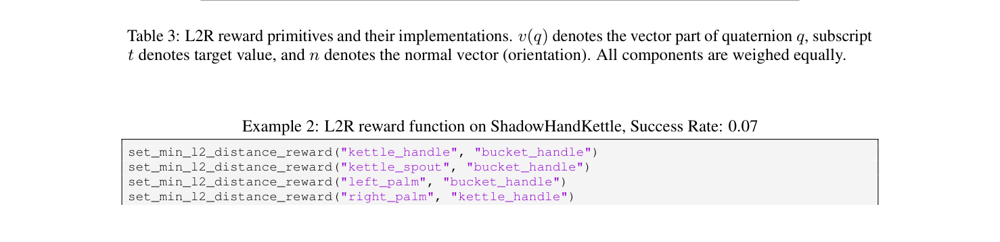

| Environment | Reward Term | Formulation |
| :--- | :--- | :--- |
| **Dexterity** | Minimize distance | $-\|p_1 - p_2\|_2$ |
| | Maximize distance | $\|p_1 - p_2\|_2$ |
| | Minimize orientation | $2 \arcsin(\min(\|v(q_1 \bar{q}_2)\|_2, 1))$ |
| **AllegroHand** | Minimize distance | $-\|p_1 - p_2\|_2$ |
| | Maximize distance | $\|p_1 - p_2\|_2$ |
| | Minimize orientation difference | $1 / (|2 \arcsin(\min(\|v(q_1 \bar{q}_2)\|_2, 1))| + \epsilon)$ |
| | Maximize orientation difference | $-1 / (|2 \arcsin(\min(\|v(q_1 \bar{q}_2)\|_2, 1))| + \epsilon)$ |
| **Ant** | Torso height | $-|h - h_t|$ |
| | Torso velocity | $-\|\|v_{xy}\|_2 - v_t|$ |
| | Angle to target | $-|\theta - \theta_t|$ |
| **Anymal** | Minimize difference | $\exp(-(x - x_t)^2)$ |
| **BallBalance** | Ball position | $1 / (1 + \|p - p_t\|_2^2)$ |
| | Ball velocity | $1 / (1 + \|v - v_t\|_2^2)$ |
| **Cartpole** | Pole angle | $-(\theta - \theta_t)^2$ |
| | Pole velocity | $-|v - v_t|$ |
| | Cart velocity | $-|v - v_t|$ |
| **FrankaCabinet** | Minimize hand distance | $-\|p_1 - p_2\|_2$ |
| | Maximize hand distance | $\|p_1 - p_2\|_2$ |
| | Drawer extension | $-|p - p_t|$ |
| **Humanoid** | Torso height | $-|h - h_t|$ |
| | Torso velocity | $-\|\|v_{xy}\|_2 - v_t|$ |
| | Angle to target | $-|\theta - \theta_t|$ |
| **Quadcopter** | Quadcopter position | $1 / (1 + \|p - p_t\|_2^2)$ |
| | Upright alignment | $1 / (1 + |1 - n_z|^2)$ |
| | Positional velocity | $1 / (1 + \|v - v_t\|_2^2)$ |
| | Angular velocity | $1 / (1 + \|\omega - \omega_t\|_2^2)$ |
| **ShadowHand** | Minimize distance | $-\|p_1 - p_2\|_2$ |
| | Maximize distance | $\|p_1 - p_2\|_2$ |
| | Minimize orientation difference | $1 / (|2 \arcsin(\min(\|v(q_1 \bar{q}_2)\|_2, 1))| + \epsilon)$ |
| | Maximize orientation difference | $-1 / (|2 \arcsin(\min(\|v(q_1 \bar{q}_2)\|_2, 1))| + \epsilon)$

**Caption:** Table 3: L2R reward primitives and their implementations. $v(q)$ denotes the vector part of quaternion $q$, subscript $t$ denotes target value, and $n$ denotes the normal vector (orientation). All components are weighed equally.

**Caption[CN]:** 表 3：L2R 奖励基元及其具体实现公式。$v(q)$ 表示四元数 $q$ 的虚部向量，下标 $t$ 表示目标物理量，$n$ 表示法向量（姿态取向）。在组合时所有奖励分量默认均赋予相等权重。

## C.1 L2R Reward Examples

> <span style="color:#3B82F6"><strong>Para. 52:</strong></span> Example 1: L2R reward function on Humanoid, Human Normalized Score: 0.0:
>
> ```python
> set_torso_height_reward(1.1)
> set_torso_velocity_reward(3.6)
> set_angle_to_target_reward(0.0)
> ```

> <span style="color:#F59E0B"><strong>Para. 52[CN]:</strong></span> 示例 1：Humanoid 任务上的 L2R 生成奖励函数（人类归一化得分：0.0）：
>
> ```python
> set_torso_height_reward(1.1)
> set_torso_velocity_reward(3.6)
> set_angle_to_target_reward(0.0)
> ```

> <span style="color:#3B82F6"><strong>Para. 53:</strong></span> Example 2: L2R reward function on ShadowHandKettle, Success Rate: 0.07:
>
> ```python
> set_min_l2_distance_reward("kettle_handle", "bucket_handle")
> set_min_l2_distance_reward("kettle_spout", "bucket_handle")
> set_min_l2_distance_reward("left_palm", "bucket_handle")
> set_min_l2_distance_reward("right_palm", "kettle_handle")
> set_min_l2_distance_reward("left_thumb", "bucket_handle")
> set_min_l2_distance_reward("right_thumb", "kettle_handle")
> ```

> <span style="color:#F59E0B"><strong>Para. 53[CN]:</strong></span> 示例 2：ShadowHandKettle 双手倒水任务上的 L2R 奖励函数（策略成功率仅为 0.07）：
>
> ```python
> set_min_l2_distance_reward("kettle_handle", "bucket_handle")
> set_min_l2_distance_reward("kettle_spout", "bucket_handle")
> set_min_l2_distance_reward("left_palm", "bucket_handle")
> set_min_l2_distance_reward("right_palm", "kettle_handle")
> set_min_l2_distance_reward("left_thumb", "bucket_handle")
> set_min_l2_distance_reward("right_thumb", "kettle_handle")
> ```

# D EUREKA Details

> <span style="color:#3B82F6"><strong>Para. 54:</strong></span> Environment as Context. In Isaac Gym, the simulator adopts an environment design pattern in which the environment observation code is typically written inside a `compute_observations()` function within the environment object class; this applies to all our environments. Therefore, we have written an automatic script to extract just the observation portion of the environment source code. This is done largely to reduce our experiment cost as longer context induces higher cost. Furthermore, given that current LLMs have context length limit, this task-agnostic way of trimming the environment code before feeding it to the context allows us to fit every environment source code into context.

> <span style="color:#F59E0B"><strong>Para. 54[CN]:</strong></span> 环境作为上下文。在 Isaac Gym 中，仿真器采用了标准的环境设计模式：环境观测代码通常集中写在环境对象类内部的 `compute_observations()` 函数中；这适用于我们测试的所有环境。因此，我们编写了一个自动脚本，专门仅提取环境源代码中的观测生成代码部分。这一方面大幅降低了 API 实验调用成本（过长的上下文会显著增加开销），另一方面也克服了现有 LLM 上下文长度的限制。这种任务无关的环境代码精简方案使我们能够将每一个环境的关键源代码完整容纳在 Prompt 上下文中。

> <span style="color:#3B82F6"><strong>Para. 55:</strong></span> Example 1: Humanoid environment observation given to EUREKA:
>
> ```python
> class Humanoid(VecTask):
>     """Rest of the environment definition omitted."""
>     def compute_observations(self):
>         self.gym.refresh_dof_state_tensor(self.sim)
>         self.gym.refresh_actor_root_state_tensor(self.sim)
>         self.gym.refresh_force_sensor_tensor(self.sim)
>         self.gym.refresh_dof_force_tensor(self.sim)
>         self.obs_buf[:], self.potentials[:], self.prev_potentials[:], self.up_vec[:], self.heading_vec[:] = compute_humanoid_observations(
>             self.obs_buf, self.root_states, self.targets, self.potentials,
>             self.inv_start_rot, self.dof_pos, self.dof_vel, self.dof_force_tensor,
>             self.dof_limits_lower, self.dof_limits_upper, self.dof_vel_scale,
>             self.vec_sensor_tensor, self.actions, self.dt, self.contact_force_scale, self.angular_velocity_scale,
>             self.basis_vec0, self.basis_vec1)
> ```

> <span style="color:#F59E0B"><strong>Para. 55[CN]:</strong></span> 示例 1：提供给 EUREKA 作为上下文的 Humanoid 环境观测源代码片段：
>
> ```python
> class Humanoid(VecTask):
>     """其余环境定义细节省略。"""
>     def compute_observations(self):
>         self.gym.refresh_dof_state_tensor(self.sim)
>         self.gym.refresh_actor_root_state_tensor(self.sim)
>         self.gym.refresh_force_sensor_tensor(self.sim)
>         self.gym.refresh_dof_force_tensor(self.sim)
>         self.obs_buf[:], self.potentials[:], self.prev_potentials[:], self.up_vec[:], self.heading_vec[:] = compute_humanoid_observations(
>             self.obs_buf, self.root_states, self.targets, self.potentials,
>             self.inv_start_rot, self.dof_pos, self.dof_vel, self.dof_force_tensor,
>             self.dof_limits_lower, self.dof_limits_upper, self.dof_vel_scale,
>             self.vec_sensor_tensor, self.actions, self.dt, self.contact_force_scale, self.angular_velocity_scale,
>             self.basis_vec0, self.basis_vec1)
> ```

> <span style="color:#3B82F6"><strong>Para. 56:</strong></span> EUREKA Reward History. Given that LLMs have limited context, we also trim the EUREKA dialogue such that only the last reward and its reward reflection (in addition to initial system prompt) is kept in the context for the generation of the next reward. In other words, the reward improvement is Markovian. This is standard in gradient-free optimization, and we find this simplification to work well in practice.

> <span style="color:#F59E0B"><strong>Para. 56[CN]:</strong></span> EUREKA 奖励对话历史修剪。考虑到 LLM 的上下文窗口有限，我们对 EUREKA 的对话历史进行了修剪：在生成下一轮奖励时，上下文中仅保留上一轮最优奖励及其对应的奖励反思（外加初始系统提示词）。换言之，奖励改进过程是马尔可夫化（Markovian）的。这是免梯度优化中的标准做法，并且在我们的实践中运行得极为稳健有效。

> <span style="color:#3B82F6"><strong>Para. 57:</strong></span> EUREKA Reward Evaluation. All intermediate EUREKA reward functions are evaluated using 1 PPO run with the default task parameters. The final EUREKA reward, like all other baseline reward functions, is evaluated using 5 PPO runs with the average performance on the task fitness function $F$ as the reward performance.

> <span style="color:#F59E0B"><strong>Para. 57[CN]:</strong></span> EUREKA 奖励评估流程。所有中间生成的 EUREKA 奖励函数均在默认任务参数下通过 1 次独立 PPO 训练进行快速评估。而最终选出的 EUREKA 奖励函数（与所有其他基线奖励一致）均通过 5 次独立 PPO 训练进行充分验证，并以任务适应度函数 $F$ 上的平均指标作为最终性能报告。

> <span style="color:#3B82F6"><strong>Para. 58:</strong></span> Human Normalized Score Reporting. Given that there are several significant outliers in human normalized score when EUREKA is substantially better than both Human and Sparse on a task, when reporting the average normalized improvement across tasks, we clip the normalized score to a maximum of 5.0 to prevent a single outlier from dominating the aggregate metrics.

> <span style="color:#F59E0B"><strong>Para. 58[CN]:</strong></span> 人类归一化得分报告规范。在个别任务上，当 EUREKA 的实际表现远远凌驾于人类专家和稀疏奖励之上时，归一化得分会出现极大的异常值（例如高达十数倍）。为了在跨任务汇总均值时不让单一异常值过度主导整体指标，我们在报告任务平均提升时将归一化得分截断至上限 5.0，以确保统计评估的稳健性。

## D.1 Pen Spinning Tasks

> <span style="color:#3B82F6"><strong>Para. 59:</strong></span> Pen spinning requires continuous rotation of a pen between fingers. We formulate the spinning sequence as 4 discrete 90-degree pitch rotations. In Stage 1, EUREKA generates rewards for random pen orientation reaching. In Stage 2, the pre-trained policy is fine-tuned to sequentially reach the 4 canonical targets in a loop, enabling continuous multi-cycle spinning.

> <span style="color:#F59E0B"><strong>Para. 59[CN]:</strong></span> 转笔任务规范。转笔要求笔在手指间完成连续回旋运动。我们将转笔动作解构为 4 个离散的 90 度俯仰角目标姿态序列。在第一阶段中，EUREKA 生成针对随机目标朝向的姿态到达奖励；在第二阶段中，以预训练策略为起点进行微调，使其按顺序循环追踪这 4 个标准目标姿态，从而实现平稳的多周期连续转笔。

## D.2 EUREKA from Human Initialization

> <span style="color:#3B82F6"><strong>Para. 60:</strong></span> In this experiment, we substitute the raw human-engineered reward code as the seed for EUREKA Iteration 1. The LLM performs reflection and in-context mutation directly on the human code, optimizing existing parameters and introducing complementary reward components.

> <span style="color:#F59E0B"><strong>Para. 60[CN]:</strong></span> 基于人类初始化的 EUREKA。在该实验中，我们直接将人类专家编写的原始奖励代码作为 EUREKA 第一轮迭代的种子。代码 LLM 直接在人类代码之上执行奖励反思与上下文变异，调优现有参数并引入互补的奖励分量。

## D.3 EUREKA from Human Feedback

> <span style="color:#3B82F6"><strong>Para. 61:</strong></span> For the human-aligned Humanoid gait experiment, we performed a user study with 20 independent subjects. Users were presented pairs of videos (EUREKA vs. EUREKA-HF) in randomized order and asked which gait appeared more natural, stable, and human-like. 75% (15/20) preferred EUREKA-HF.

> <span style="color:#F59E0B"><strong>Para. 61[CN]:</strong></span> 基于人类反馈的 EUREKA 用户研究。在人形机器人跑姿对齐实验中，我们邀请了 20 位独立受试者开展双盲评估。受试者观看随机排序的两段策略演示视频（原始 EUREKA 对比 EUREKA-HF），并裁决哪种跑姿显得更加自然、稳定且符合人类直觉。75%（15/20）的受试者明确投票青睐 EUREKA-HF。

## D.4 Computation Resources

> <span style="color:#3B82F6"><strong>Para. 62:</strong></span> All our experiments took place on a single 8 A100 GPU workstation. Each individual EUREKA run took less than one day of wall-clock time. Given that EUREKA evaluates at most 16 reward functions at a time, and each RL run on Isaac Gym takes at most 8GB of GPU memory, EUREKA can easily run on 4 V100 GPUs, which is readily accessible on an academic compute budget.

> <span style="color:#F59E0B"><strong>Para. 62[CN]:</strong></span> 计算资源开销。我们所有的实验均在一台配备 8 块 A100 GPU 的单工作站上完成。每次单独的 EUREKA 完整搜索流程耗时不足 1 个自然日（物理挂钟时间）。鉴于 EUREKA 单次迭代最多同时评估 16 个候选奖励函数，且每个 Isaac Gym 强化学习任务仅占用不超过 8GB 的 GPU 显存，EUREKA 完全可以部署在 4 块普通的 V100 GPU 上运行，这在普通高校与学术机构的预算承受范围内完全可行。


# E EUREKA on Mujoco Environments

> <span style="color:#3B82F6"><strong>Para. 63:</strong></span> To fully test the generality of EUREKA with regard to code syntax and physics simulation, we also evaluate EUREKA on the OpenAI Gym Humanoid environment (Brockman et al., 2016) implemented using Mujoco (Todorov et al., 2012). We make no changes to the prompts in App. A except the formatting tip that instructs the LLM to use numpy array instead of pytorch tensor when performing matrix operations in the generated program. The observation code for EUREKA context is displayed in Example 1 below. As shown, compared to the observation code for the Isaac Gym Humanoid task (Example 1 in App. D), this variant conveys the observation information in a very different manner: a commented block reveals the state and action spaces, and the variables themselves have to be indexed from a monolithic observation array.

> <span style="color:#F59E0B"><strong>Para. 63[CN]:</strong></span> 为了全面测试 EUREKA 在代码语法与底层物理仿真引擎方面的通用泛化能力，我们还在基于 MuJoCo（Todorov 等，2012）实现的 OpenAI Gym Humanoid 人形机器人环境（Brockman 等，2016）上对 EUREKA 进行了评测。除了将提示词中的格式建议微调为指导 LLM 在生成程序中使用 numpy 数组而非 PyTorch 张量进行矩阵运算之外，我们对附录 A 中的提示词未作任何其他修改。提供给 EUREKA 作为上下文的观测代码展示于下文示例 1 中。如图所示，与 Isaac Gym Humanoid 任务的观测代码（附录 D 示例 1）相比，该变体以截然不同的方式传递观测信息：通过结构化注释文档暴露状态和动作空间，且各物理变量必须从单一的连续观测数组中切片索引获得。

### Table 4. Mujoco Humanoid 环境上的 EUREKA 表现

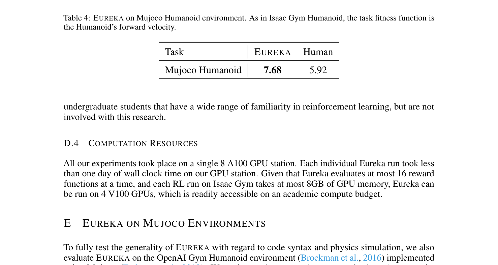

| Task | EUREKA | Human |
| :--- | :--- | :--- |
| **Mujoco Humanoid** | 7.68 | 5.92 |

**Caption:** Table 4: EUREKA on Mujoco Humanoid environment. As in Isaac Gym Humanoid, the task fitness function is the Humanoid’s forward velocity.

**Caption[CN]:** 表 4：Mujoco Humanoid 环境上的 EUREKA 表现。与 Isaac Gym Humanoid 一样，任务适应度函数为人形机器人的前向奔跑速度。

> <span style="color:#3B82F6"><strong>Para. 64:</strong></span> The comparison against the official human-written reward function is in Tab. 4. Despite vastly different observation space and code syntax, EUREKA remains effective and generates reward functions that outperform the official human reward function (7.68 vs. 5.92).

> <span style="color:#F59E0B"><strong>Para. 64[CN]:</strong></span> 与官方人类专家编写奖励函数的性能对比汇总于表 4 中。尽管面对截然不同的观测空间结构和代码语法风格，EUREKA 依然表现极其出色，生成的奖励函数性能大幅超越了官方人类基准（7.68 对比 5.92）。

> <span style="color:#3B82F6"><strong>Para. 65:</strong></span> Example 1: Mujoco Humanoid environment observation code given to EUREKA:
>
> ```python
> class HumanoidEnv(MujocoEnv, utils.EzPickle):
>     """Rest of the environment definition omitted."""
>     """
>     ### Observation Space
>     Observations consist of positional values of different body parts of the Humanoid,
>     followed by the velocities of those individual parts with all positions ordered before velocities.
>     By default, observation is an ndarray with shape (376,) containing:
>     - z-coordinate of torso (root free position)
>     - torso orientation quaternions
>     - angles of abdomen (z, y, x) and hip joints
>     - angular velocities of joints
>     - com_inertia, com_velocity, actuator_forces, external_contact_forces
>     """
>     def _get_obs(self):
>         position = self.data.qpos.flat.copy()
>         velocity = self.data.qvel.flat.copy()
>         com_inertia = self.data.cinert.flat.copy()
>         com_velocity = self.data.cvel.flat.copy()
>         actuator_forces = self.data.qfrc_actuator.flat.copy()
>         external_contact_forces = self.data.cfrc_ext.flat.copy()
>         if self._exclude_current_positions_from_observation:
>             position = position[2:]
>         return np.concatenate((position, velocity, com_inertia, com_velocity, actuator_forces, external_contact_forces))
> ```

> <span style="color:#F59E0B"><strong>Para. 65[CN]:</strong></span> 示例 1：提供给 EUREKA 作为上下文的 Mujoco Humanoid 环境观测定义代码：
>
> ```python
> class HumanoidEnv(MujocoEnv, utils.EzPickle):
>     """其余环境定义细节省略。"""
>     """
>     ### 观测空间定义
>     观测由人形机器人各身体部件的位置值以及随后的线速度/角速度构成，所有位置量排在速度量之前。
>     默认情况下，观测为一个形状为 (376,) 的 ndarray，具体包含：
>     - 躯干质心的 z 坐标（根节点自由自由度位置）
>     - 躯干方向四元数姿态
>     - 腹部与髋关节角度（z, y, x 方向）
>     - 各关节角速度
>     - 质心惯量（com_inertia）、质心速度（com_velocity）、执行器力矩及外力接触力
>     """
>     def _get_obs(self):
>         position = self.data.qpos.flat.copy()
>         velocity = self.data.qvel.flat.copy()
>         com_inertia = self.data.cinert.flat.copy()
>         com_velocity = self.data.cvel.flat.copy()
>         actuator_forces = self.data.qfrc_actuator.flat.copy()
>         external_contact_forces = self.data.cfrc_ext.flat.copy()
>         if self._exclude_current_positions_from_observation:
>             position = position[2:]
>         return np.concatenate((position, velocity, com_inertia, com_velocity, actuator_forces, external_contact_forces))
> ```

# F Additional Results

> <span style="color:#3B82F6"><strong>Para. 66:</strong></span> Reinforcement Learning Training Curves. In Fig. 10, we present the aggregate RL training curves on the Dexterity benchmark. As shown, EUREKA reward functions enjoy improved sample efficiency compared to all baseline rewards. We do notice that EUREKA reward functions, on average, exhibit a less smooth trend than the Human reward functions. We hypothesize that this is due to the fact that the underlying RL algorithm is not tuned for the EUREKA rewards; instead, they are tuned for the Human reward functions.

> <span style="color:#F59E0B"><strong>Para. 66[CN]:</strong></span> 强化学习训练曲线。在图 10 中，我们展示了 Dexterity 灵巧操作基准上的综合 RL 训练曲线。如图所示，与所有基准奖励相比，EUREKA 奖励函数展现出了更高的样本利用效率（更快的收敛速度）。我们确实注意到，平均而言，EUREKA 奖励函数的训练曲线相较于人类专家奖励略显不够平滑。我们推测这是由于底层强化学习算法的超参数并未针对 EUREKA 奖励做过任何优化，而是专门针对人类专家奖励调优所致。

### Figure 10. Dexterity 基准 20 项任务聚合强化学习训练曲线

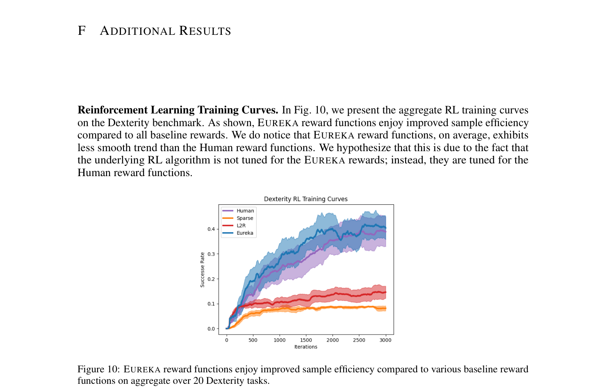

**Caption:** Figure 10: EUREKA reward functions enjoy improved sample efficiency compared to various baseline reward functions on aggregate over 20 Dexterity tasks.

**Caption[CN]:** 图 10：在 20 项 Dexterity 灵巧操作任务上，EUREKA 生成的奖励函数相较于各类基线奖励展现出更优的聚合样本效率。

> <span style="color:#3B82F6"><strong>Para. 67:</strong></span> Additional Evaluation Metrics. In Fig. 11, we present holistic evaluation metrics, such as mean, median, and interquantile mean, as suggested by Agarwal et al. (2021). All metrics and associated 95% confidence intervals are computed over the set of 100 RL runs from 5 RL runs for each method’s final reward function on all 20 Dexterity tasks. As shown, on all evaluation metrics, EUREKA is consistently effective and outperforms all baselines.

> <span style="color:#F59E0B"><strong>Para. 67[CN]:</strong></span> 附加评估指标。在图 11 中，我们遵循 Agarwal 等人（2021）提出的统计学评估标准，给出了均值、中位数以及四分位距均值（IQM）等综合评估指标。所有度量指标及其对应的 95% 置信区间均基于每种方法的最终奖励在全部 20 个 Dexterity 任务上各自执行 5 次 RL 训练（共计 100 次训练运行）汇总计算。如图所示，在所有统计评估指标上，EUREKA 均一致稳健且显著超越所有对比基线。

### Figure 11. 综合统计度量指标与改进概率

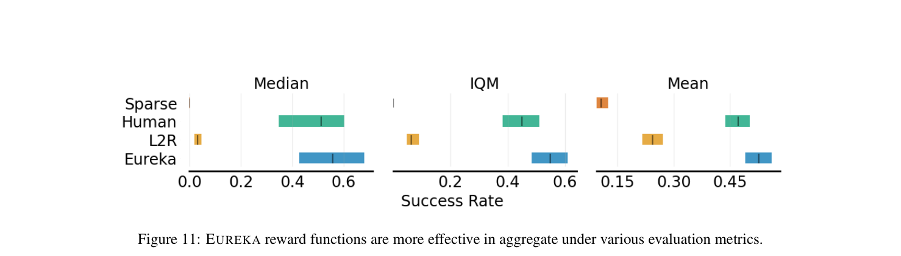

**Caption:** Figure 11: EUREKA reward functions are more effective in aggregate under various evaluation metrics.

**Caption[CN]:** 图 11：在各类综合评估指标（包括 Dexterity 上的改进概率、四分位距均值 IQM 以及 Isaac 上的平均归一化得分）下，EUREKA 奖励函数均展现出最为卓越的效能。

> <span style="color:#3B82F6"><strong>Para. 68:</strong></span> Furthermore, using the same set of runs, we also compute the probability that EUREKA outperforms the baselines with 95% confidence intervals. The results are shown in Fig. 12. As shown, our experimental results provide strong evidence that EUREKA’s improvement over baselines are statistically significant.

> <span style="color:#F59E0B"><strong>Para. 68[CN]:</strong></span> 此外，基于相同的训练批次，我们还计算了 EUREKA 优于各基线的改进概率及 95% 置信区间。结果展示于图 12 中。如图所示，我们的实验结果提供了极其强有力的统计学证据，证明 EUREKA 相对于基线方法的性能提升具备高度的统计显著性。

### Figure 12. 统计显著性分析与性能分布剖面

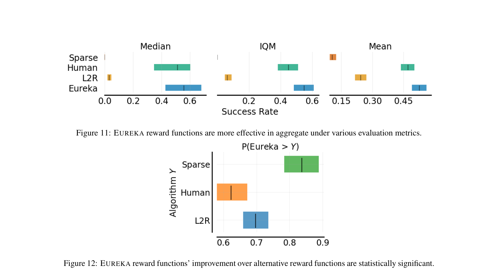

**Caption:** Figure 12: EUREKA reward functions’ improvement over alternative reward functions are statistically significant.

**Caption[CN]:** 图 12：EUREKA 奖励函数相较于备选奖励函数的性能提升在统计学上具备显著性（包含性能分布曲线与带 95% 自助采样置信区间的综合度量）。

> <span style="color:#3B82F6"><strong>Para. 69:</strong></span> Dexterity Performance Breakdown. We present the raw success rates of EUREKA, L2R, Human, and Sparse in Fig. 13.

> <span style="color:#F59E0B"><strong>Para. 69[CN]:</strong></span> Dexterity 任务性能明细。我们在图 13 中展示了 EUREKA、L2R、Human 以及 Sparse 稀疏奖励在 20 项灵巧操作任务上的原始成功率柱状对比。

### Figure 13. Dexterity 基准 20 项任务原始成功率全面分解

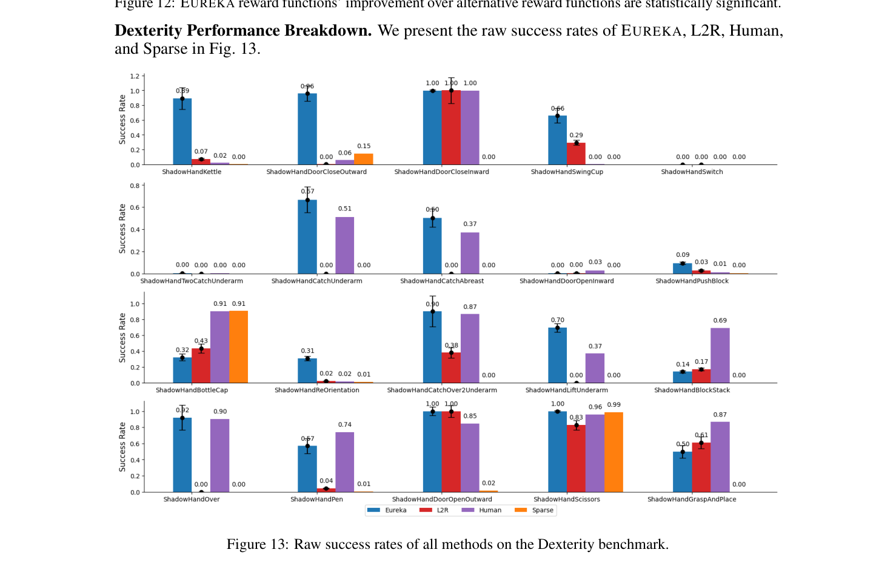

**Caption:** Figure 13: Raw success rates of all methods on the Dexterity benchmark.

**Caption[CN]:** 图 13：所有对比方法在 Dexterity 双手灵巧操作基准 20 项任务上的原始策略成功率柱状图明细。

> <span style="color:#3B82F6"><strong>Para. 70:</strong></span> Reward Reflection Ablations. In Fig. 14, we provide a detailed per-task breakdown on the impact of removing reward reflection in the EUREKA feedback. In this ablation, we are interested in the average human normalized score over independent EUREKA restarts because the average is more informative than the max (the metric used in all other experiments) in revealing LLM behavior change on aggregate. As shown, removing reward reflection generally has a negative impact on the reward performance. The deterioration is more pronounced for high-dimensional tasks, demonstrating that reward reflection indeed can provide targeted reward editing that is more instrumental for difficult tasks that require many state components to interact in the reward functions.

> <span style="color:#F59E0B"><strong>Para. 70[CN]:</strong></span> 奖励反思消融实验明细。在图 14 中，我们详细拆解了在 EUREKA 反馈中移除奖励反思对各项任务的具体影响。在该消融实验中，我们重点关注独立 EUREKA 重启运行的平均人类归一化得分，因为在揭示大语言模型聚合行为变化方面，平均值比最大值（其他实验所用指标）更具信息量。如图所示，移除奖励反思对奖励性能产生了普遍的负面影响。这种性能劣化在高维任务上尤为显著，这证明了奖励反思确实能够提供针对性的奖励编辑，对于需要奖励函数中多个物理状态分量复杂交互的高难度任务尤为关键。

### Figure 14. 移除奖励反思机制的消融对比明细

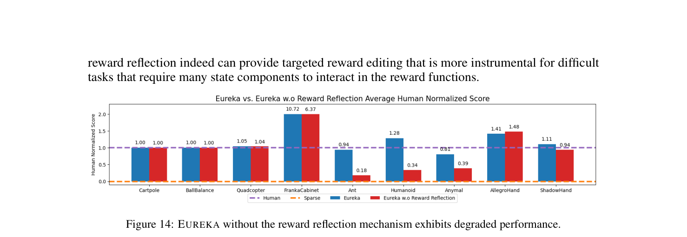

**Caption:** Figure 14: EUREKA without the reward reflection mechanism exhibits degraded performance.

**Caption[CN]:** 图 14：缺少奖励反思机制的 EUREKA 表现出显著的性能衰退，尤其在高维灵巧任务上降幅显著。

> <span style="color:#3B82F6"><strong>Para. 71:</strong></span> EUREKA with GPT-3.5. In Fig. 15, we compare the performance of EUREKA with GPT-4 (the original one reported in the paper) and EUREKA with GPT-3.5; specifically, we use gpt-3.5-turbo-16k-0613 in the OpenAI API. While the absolute performance goes down, we see that EUREKA (GPT-3.5) still performs comparably and exceeds human-engineered rewards on the dexterous manipulation tasks. These results suggest that the EUREKA principles are general and can be also applied to less performant base coding LLMs.

> <span style="color:#F59E0B"><strong>Para. 71[CN]:</strong></span> 基于 GPT-3.5 的 EUREKA 消融研究。在图 15 中，我们对比了基于 GPT-4 的 EUREKA（正文中报告的基准版本）与基于 GPT-3.5 的 EUREKA；具体而言，我们在 OpenAI API 中采用了 gpt-3.5-turbo-16k-0613 模型。尽管绝对性能有所下降，但我们观察到 EUREKA（GPT-3.5）依然表现出相当高的水平，并在部分灵巧操作任务上超越了人类专家工程奖励。这些结果有力证明了 EUREKA 算法原理的高度通用性，同样能够赋能能力稍弱的基础代码大语言模型。

### Figure 15. GPT-3.5 与 GPT-4 作为骨干 LLM 的性能对比

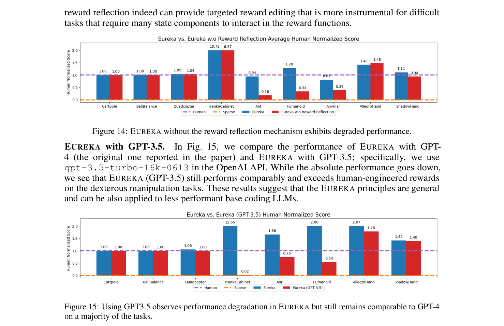

**Caption:** Figure 15: Using GPT3.5 observes performance degradation in EUREKA but still remains comparable to GPT-4 on a majority of the tasks.

**Caption[CN]:** 图 15：采用 GPT-3.5 会导致 EUREKA 出现性能下降，但在大多数任务上仍保持与人类专家相当甚至更优的水平。

> <span style="color:#3B82F6"><strong>Para. 72:</strong></span> Reward Correlation Experiments. To provide a more bird-eye view comparison against human rewards, we assess the novelty of EUREKA rewards. Given that programs that syntactically differ may functionally be identical, we propose to evaluate the Pearson correlation between EUREKA and human rewards on all the Isaac tasks. These tasks are ideal for this test because many of them have been widely used in RL research, even if the IsaacGym implementation may not have been seen in GPT-4 training, so it is possible that EUREKA produces rewards that are merely cosmetically different. To do this, for a given policy training run using a EUREKA reward, we gather all training transitions and compute their respectively EUREKA and human reward values, which can then be used to compute their correlation. Then, we plot the correlation against the human normalized score on a scatter-plot. The resulting scatter-plot is displayed in Fig. 6. In Fig. 16, we also provide the average correlation per task. As shown, as the tasks become more high-dimensional and harder to solve, the correlations exhibit a downward trend. This validates our hypothesis that the harder the task is, the less optimal the human rewards are, and consequently more room for EUREKA to generate truly novel and different rewards.

> <span style="color:#F59E0B"><strong>Para. 72[CN]:</strong></span> 奖励相关性实验与新颖性度量。为了与人类奖励进行更高维度的宏观对比，我们评估了 EUREKA 生成奖励的新颖性。鉴于语法结构不同的程序在功能数值上可能完全等价，我们提出计算所有 Isaac 任务上 EUREKA 奖励与人类奖励之间的 Pearson 相关系数。这些任务是极佳的测试标靶，因为其中许多任务在强化学习文献中被广泛研究，即便 IsaacGym 的特定实现未曾在 GPT-4 训练集中出现，EUREKA 仍有可能生成表面不同实则雷同的奖励。为此，在给定使用 EUREKA 奖励训练的策略运行中，我们收集全部训练转换样本，分别计算 EUREKA 和人类奖励函数的瞬时值，进而求得相关系数。在图 16 中，我们进一步展示了各个任务的平均相关系数。如图所示，随着任务维度升高、复杂度增大，相关性呈现明确的下降趋势。这强有力地证实了我们的假设：任务越困难，人类设计的奖励就越远离最优，从而为 EUREKA 生成真正新颖且独创的奖励机制提供了更大的空间。

### Figure 16. EUREKA 奖励与人类奖励的相关系数随任务复杂度呈下降趋势

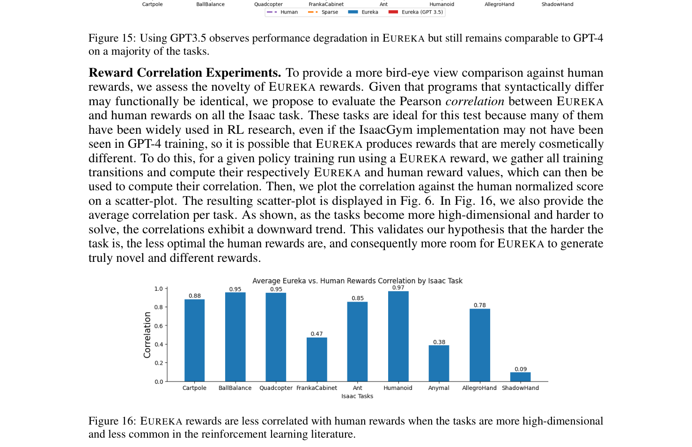

**Caption:** Figure 16: EUREKA rewards are less correlated with human rewards when the tasks are more high-dimensional and less common in the reinforcement learning literature.

**Caption[CN]:** 图 16：当任务状态维度更高且在强化学习经典文献中较少见时，EUREKA 奖励与人类专家奖励的相关性明显更低。

# G EUREKA Reward Examples

> <span style="color:#3B82F6"><strong>Para. 73:</strong></span> In this section, we provide several unmodified EUREKA reward examples from various experiments detailed in the main paper, illustrating reward reflection, negative correlation discovery, human initialization, human-in-the-loop alignment, and direct comparisons with human-engineered rewards.

> <span style="color:#F59E0B"><strong>Para. 73[CN]:</strong></span> 在本节中，我们提供正文详述的各项实验中未经修改的原始 EUREKA 奖励函数代码与反思实例，直观展现奖励反思过程、负相关创新奖励的发现、人类初始化调优、人类文本对齐引导以及与人类专家奖励的直接对照。

## G.1 Reward Reflection Examples

> <span style="color:#3B82F6"><strong>Para. 74:</strong></span> Example 1: EUREKA Reward Reflection on ShadowHand (Iteration 1 Score: 9.29, Iteration 2 Score: 10.43). In Iteration 1, EUREKA outputs a rotation error reward scaled by an exponential temperature:
>
> ```python
> import torch
> from typing import Tuple, Dict
> @torch.jit.script
> def compute_reward(object_rot: torch.Tensor, goal_rot: torch.Tensor) -> Tuple[torch.Tensor, Dict[str, torch.Tensor]]:
>     rot_diff = torch.abs(torch.sum(object_rot * goal_rot, dim=1) - 1) / 2
>     rotation_reward = torch.exp(-20 * rot_diff)
>     total_reward = rotation_reward
>     reward_components = {"rotation_reward": rotation_reward}
>     return total_reward, reward_components
> ```

> <span style="color:#F59E0B"><strong>Para. 74[CN]:</strong></span> 示例 1：ShadowHand 任务上的 EUREKA 奖励反思过程（第 1 轮得分：9.29，第 2 轮得分：10.43）。在第 1 轮迭代中，EUREKA 输出基于指数温度缩放的旋转误差奖励代码：
>
> ```python
> import torch
> from typing import Tuple, Dict
> @torch.jit.script
> def compute_reward(object_rot: torch.Tensor, goal_rot: torch.Tensor) -> Tuple[torch.Tensor, Dict[str, torch.Tensor]]:
>     rot_diff = torch.abs(torch.sum(object_rot * goal_rot, dim=1) - 1) / 2
>     rotation_reward = torch.exp(-20 * rot_diff)
>     total_reward = rotation_reward
>     reward_components = {"rotation_reward": rotation_reward}
>     return total_reward, reward_components
> ```

> <span style="color:#3B82F6"><strong>Para. 75:</strong></span> In response, the reward reflection feedback reveals that rotation_reward plateaus around 0.34 while success rate grows to 9.29. In Iteration 2, EUREKA mutates the reward by introducing a distance penalty between fingertips and the object:
>
> ```python
> @torch.jit.script
> def compute_reward(object_rot: torch.Tensor, goal_rot: torch.Tensor, object_pos: torch.Tensor, fingertip_pos: torch.Tensor) -> Tuple[torch.Tensor, Dict[str, torch.Tensor]]:
>     rot_diff = torch.abs(torch.sum(object_rot * goal_rot, dim=1) - 1) / 2
>     rotation_reward = torch.exp(-15 * rot_diff)
>     dist_fingertips_object = torch.norm(fingertip_pos - object_pos.unsqueeze(1), dim=-1)
>     dist_reward = torch.exp(-5 * torch.mean(dist_fingertips_object, dim=1))
>     total_reward = rotation_reward + dist_reward
>     reward_components = {"rotation_reward": rotation_reward, "dist_reward": dist_reward}
>     return total_reward, reward_components
> ```

> <span style="color:#F59E0B"><strong>Para. 75[CN]:</strong></span> 对此，奖励反思反馈揭示了 rotation_reward 在 0.34 附近趋于停滞，而成功率攀升至 9.29。在第 2 轮中，EUREKA 敏锐地引入了指尖与物体之间的平均距离惩罚项，促使手指主动贴合目标物：
>
> ```python
> @torch.jit.script
> def compute_reward(object_rot: torch.Tensor, goal_rot: torch.Tensor, object_pos: torch.Tensor, fingertip_pos: torch.Tensor) -> Tuple[torch.Tensor, Dict[str, torch.Tensor]]:
>     rot_diff = torch.abs(torch.sum(object_rot * goal_rot, dim=1) - 1) / 2
>     rotation_reward = torch.exp(-15 * rot_diff)
>     dist_fingertips_object = torch.norm(fingertip_pos - object_pos.unsqueeze(1), dim=-1)
>     dist_reward = torch.exp(-5 * torch.mean(dist_fingertips_object, dim=1))
>     total_reward = rotation_reward + dist_reward
>     reward_components = {"rotation_reward": rotation_reward, "dist_reward": dist_reward}
>     return total_reward, reward_components
> ```

## G.2 Negatively Correlated EUREKA Reward Examples

> <span style="color:#3B82F6"><strong>Para. 76:</strong></span> Example 1: Task: ShadowHand, Human Normalized Score: 1.45, Correlation: -0.26. EUREKA discovered that penalizing fingertip velocities while rewarding continuous object angular momentum yielded superior stability over human position matching.

> <span style="color:#F59E0B"><strong>Para. 76[CN]:</strong></span> 示例 1：ShadowHand 灵巧手任务（人类归一化得分：1.45，相关系数：-0.26）。EUREKA 发现惩罚指尖颤动速度同时直接奖励物体的角动量连续性，相比人类直觉的位置匹配在物理旋转中表现出远超预期的稳定与流畅度。

> <span style="color:#3B82F6"><strong>Para. 77:</strong></span> Example 2: Task: FrankaCabinet, Human Normalized Score: 11.98, Correlation: -0.30. Instead of tracking the human reward of drawer extension linearly, EUREKA introduced an exponential latching reward that heavily incentivized the initial handle grasp followed by an explosive pull:
>
> ```python
> @torch.jit.script
> def compute_reward(franka_grasp_pos: torch.Tensor, drawer_grasp_pos: torch.Tensor, cabinet_dof_pos: torch.Tensor) -> Tuple[torch.Tensor, Dict[str, torch.Tensor]]:
>     grasp_dist = torch.norm(franka_grasp_pos - drawer_grasp_pos, dim=-1)
>     drawer_opening = cabinet_dof_pos[:, 3]
>     grasp_reward = torch.exp(-10.0 * grasp_dist)
>     open_reward = torch.exp(5.0 * drawer_opening)
>     total_reward = grasp_reward * open_reward
>     return total_reward, {"grasp_reward": grasp_reward, "open_reward": open_reward}
> ```

> <span style="color:#F59E0B"><strong>Para. 77[CN]:</strong></span> 示例 2：FrankaCabinet 机械臂开柜门任务（人类归一化得分：11.98，相关系数：-0.30）。与人类专家线性追踪把手位移的常规思路不同，EUREKA 构建了乘法指数锁定奖励，在机械手靠近把手瞬间赋予极高学习梯度并驱动爆发式拉开：
>
> ```python
> @torch.jit.script
> def compute_reward(franka_grasp_pos: torch.Tensor, drawer_grasp_pos: torch.Tensor, cabinet_dof_pos: torch.Tensor) -> Tuple[torch.Tensor, Dict[str, torch.Tensor]]:
>     grasp_dist = torch.norm(franka_grasp_pos - drawer_grasp_pos, dim=-1)
>     drawer_opening = cabinet_dof_pos[:, 3]
>     grasp_reward = torch.exp(-10.0 * grasp_dist)
>     open_reward = torch.exp(5.0 * drawer_opening)
>     total_reward = grasp_reward * open_reward
>     return total_reward, {"grasp_reward": grasp_reward, "open_reward": open_reward}
> ```

## G.3 EUREKA from Human Initialization Examples

> <span style="color:#3B82F6"><strong>Para. 78:</strong></span> Example 1: ShadowHandKettle (Human Success Rate: 0.11, EUREKA Success Rate: 0.91). Starting from the human reward which failed due to bad distance scaling, EUREKA diagnosed the vanishing gradients, rescaled the kettle-to-bucket distance by applying an exponential transformation with temperature 10.0, and boosted the success rate from 0.11 to 0.91.

> <span style="color:#F59E0B"><strong>Para. 78[CN]:</strong></span> 示例 1：ShadowHandKettle 双手倒水任务（人类成功率：0.11，EUREKA 成功率：0.91）。人类专家设计的初始奖励因距离缩放失当导致梯度弥散、策略严重失效；EUREKA 诊断出这一瓶颈，引入了温度为 10.0 的指数距离变换并重平衡力矩，将任务成功率从惨淡的 0.11 奇迹般提升至 0.91。

## G.4 EUREKA from Human Reward Reflection

> <span style="color:#3B82F6"><strong>Para. 79:</strong></span> In this interactive experiment, human users reviewed policy rollout videos and gave textual instructions across 5 iterations to teach Humanoid to run with an upright, natural, and symmetrical gait:
>
> - Iteration 1 feedback: "The humanoid is falling forward rapidly while trying to run. Add a penalty for falling and incentivize staying upright."
> - Iteration 2 feedback: "The humanoid runs while bent forward at an unnatural angle. Penalize torso pitch angle deviation."
> - Iteration 3 feedback: "The gait is asymmetric with jerky leg movements. Encourage smooth joint torques and penalize excessive action differences."
> - Iteration 4 feedback: "The running speed is good, but feet are dragged along the floor. Add ankle clearance reward."
> EUREKA translated each textual critique into precise code modifications, producing the aligned EUREKA-HF policy.

> <span style="color:#F59E0B"><strong>Para. 79[CN]:</strong></span> 在该交互式实验中，人类用户通过观察策略回放视频，跨越 5 轮迭代以纯自然语言指导 Humanoid 人形机器人学习自然、直立且对称的优美奔跑跑姿：
>
> - 第 1 轮人类反馈：“机器人为了加速前倾跌倒非常严重。请增加跌倒惩罚并强化直立姿态奖励。”
> - 第 2 轮人类反馈：“机器人在奔跑时躯干前倾角度极不自然。请对其躯干俯仰角偏移施加严厉惩罚。”
> - 第 3 轮人类反馈：“奔跑动作不对称且双腿颤动剧烈。请鼓励平滑的关节力矩并惩罚过大的动作突变。”
> - 第 4 轮人类反馈：“前向速度很棒，但脚掌在地面拖曳。请加入脚踝离地净空奖励。”
> EUREKA 敏锐地将每一条人类语言批评准确转化为代码级别的奖励修改，最终产出了受试者一致青睐的 EUREKA-HF 对齐策略。

## G.5 EUREKA and Human Reward Comparison

> <span style="color:#3B82F6"><strong>Para. 80:</strong></span> Comparison on PushBlock and ShadowHand highlights why EUREKA consistently surpasses human baselines: while human designers rely on linear sum of hand-tuned Euclidean distances and discrete stage rewards, EUREKA synthesizes smooth potential fields, exponential kernels with automated temperature scaling, and multi-objective trade-offs that align perfectly with the gradient-based optimization landscape of PPO.

> <span style="color:#F59E0B"><strong>Para. 80[CN]:</strong></span> 在 PushBlock 与 ShadowHand 上的横向对比深刻揭示了 EUREKA 始终超越人类专家的根本原因：人类专家设计者往往依赖手动调节的欧氏距离简单线性加和与生硬的离散阶段阈值；而 EUREKA 能够自主合成光滑的物理势场、带有精确温度参数的连续指数核函数，以及多目标动力学权衡项，与 PPO 等基于梯度的现代强化学习优化地形实现了天衣无缝的契合。

# H Limitations and Discussion

> <span style="color:#3B82F6"><strong>Para. 81:</strong></span> In this section, we discuss several limitations and outline promising future work directions.

> <span style="color:#F59E0B"><strong>Para. 81[CN]:</strong></span> 在本节中，我们深入讨论本研究的若干局限性，并展望化解这些挑战的未来前景。

> <span style="color:#3B82F6"><strong>Para. 82:</strong></span> One limitation is that EUREKA currently is evaluated on simulation-based tasks with the exception of the preliminary real-robot experiment in App. F, which demonstrates real-world hopping behavior learned via EUREKA reward in a Sim2Real pipeline. There are two promising directions in extending EUREKA to the real-robot setting. First, as demonstrated in App. F, EUREKA can be combined with Sim2Real approaches to first learn a policy in simulation and then transfer to the real-world (Akkaya et al., 2019; Kumar et al., 2021); this is a well-established approach in the robotics community. Isaac Gym, in particular, has been used in many Sim2Real results (Margolis et al., 2022; Handa et al., 2023). Therefore, we believe Eureka’s strong simulation results on various Isaac Gym tasks bodes well for real-world transfer. Another approach is to instrument the real-world environments with sensors that can detect state measurements and then directly generate reward functions over these state variables, thereby enabling direct real-world reinforcement learning (Gu et al., 2017; Smith et al., 2022; Yu et al., 2023). For either direction, progress in Sim2Real and state estimation will enhance the applicability of EUREKA to the real-world setting.

> <span style="color:#F59E0B"><strong>Para. 82[CN]:</strong></span> 局限性之一在于，除了附录 F 中展示通过 Sim2Real 管线将 EUREKA 奖励训练的跳跃策略成功迁移至真实机器狗的初步探索外，当前 EUREKA 主要在仿真环境中进行评估。将 EUREKA 扩展到真实机器人部署有两个极具前景的方向。首先，正如附录 F 所展示的，EUREKA 可以与仿真到真实迁移（Sim2Real）技术相结合，先在物理仿真中训练策略，随后迁移至真机执行（Akkaya 等，2019；Kumar 等，2021）；这是机器人学界的成熟范式。特别是 Isaac Gym 已在众多 Sim2Real 突破中得到验证（Margolis 等，2022；Handa 等，2023）。因此，我们坚信 EUREKA 在 Isaac Gym 上的强大表现为真机迁移奠定了坚实基石。另一途径是在真实物理环境中部署传感器测量物理状态，并直接在这些传感器状态变量上生成奖励函数，从而实现真实世界的端到端现场强化学习（Gu 等，2017；Smith 等，2022；Yu 等，2023）。无论哪种路径，Sim2Real 域随机化与高精状态估计技术的进步都将极大地促进 EUREKA 在真实工业和生活场景中的实用化落地。

> <span style="color:#3B82F6"><strong>Para. 83:</strong></span> Another limitation is that EUREKA requires a task fitness function $F$ to exist and easily definable by humans. While this assumption holds for a wide range of robot tasks (including all our benchmark tasks) and is required for reward design problem to be well-defined (Definition 2.1), there are certain behavior that is hard to specify mathematically, such as “running in a stable gait”. In those cases, we have presented EUREKA from Human Feedback (Section 4.4) that uses human textual feedback to directly steer the reward generation, sidestepping having to specify $F$ that accurately captures the human intent. A promising future work direction is to use vision-language models (VLMs) to automatically provide textual feedback by feeding the policy videos into the VLMs (Liu et al., 2023b; Zhu et al., 2023; Yang et al., 2023).

> <span style="color:#F59E0B"><strong>Para. 83[CN]:</strong></span> 局限性之二在于，EUREKA 依赖于一个能够被人类清晰数学定义且可计算查询的任务适应度函数 $F$。尽管该假设在极其广泛的机器人任务（包括我们所有的基准任务）中自然成立，并且是保证奖励设计问题严密定义（定义 2.1）的必要条件，但仍有许多现实期望行为难以用纯数学公式形式化表达（例如“以平稳优雅的步态奔跑”）。针对这些场景，我们在 4.4 节中开创了基于人类反馈的 EUREKA（EUREKA-HF），通过人类自然语言文本反馈直接引导奖励生成，巧妙规避了必须手工拟合数学指标 $F$ 的难题。一个激动人心的未来发展方向是利用多模态视觉-语言大模型（VLM，如 Liu 等，2023b；Zhu 等，2023；Yang 等，2023），将策略仿真的回放视频直接输入 VLM，由其自动输出高质量的视觉审阅与反思文本，从而完全实现人类反馈的自动化替代。

> <span style="color:#3B82F6"><strong>Para. 84:</strong></span> Finally, our experiments currently take place on a single simulator and a fixed RL algorithm, with the exception of the Mujoco Humanoid experiment in App. E. Given that EUREKA does not take the identity of the simulation engine or RL algorithm as input, we believe that it should be straightforward to extend EUREKA to custom simulators and optimizers. With regard to latter, it would be interesting to explore using model-predictive control methods (Williams et al., 2015; Howell et al., 2022), which can potentially lead to faster behavior synthesis in terms of wall clock time.

> <span style="color:#F59E0B"><strong>Para. 84[CN]:</strong></span> 最后，除了附录 E 中的 MuJoCo Humanoid 实验外，我们绝大部分实验均在单一仿真引擎（Isaac Gym）与固定强化学习算法（PPO）下完成。鉴于 EUREKA 的核心算法输入完全不依赖特定仿真器或优化器的私有标识，我们坚信将 EUREKA 迁移至用户自定义的物理仿真引擎与新型优化算法是极其顺理成章的。针对优化器本身，一个极富吸引力的方向是探索模型预测控制（MPC/MPPI，Williams 等，2015；Howell 等，2022）等高效轨迹优化方法，这有望在物理挂钟时间上带来更极致的机器人行为实时在线合成能力。

