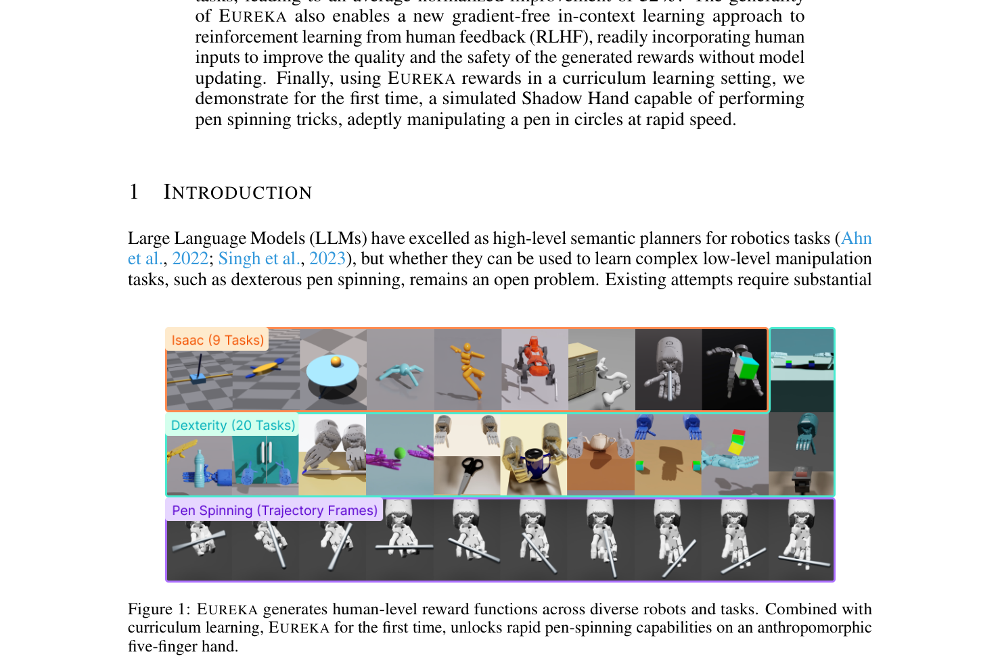
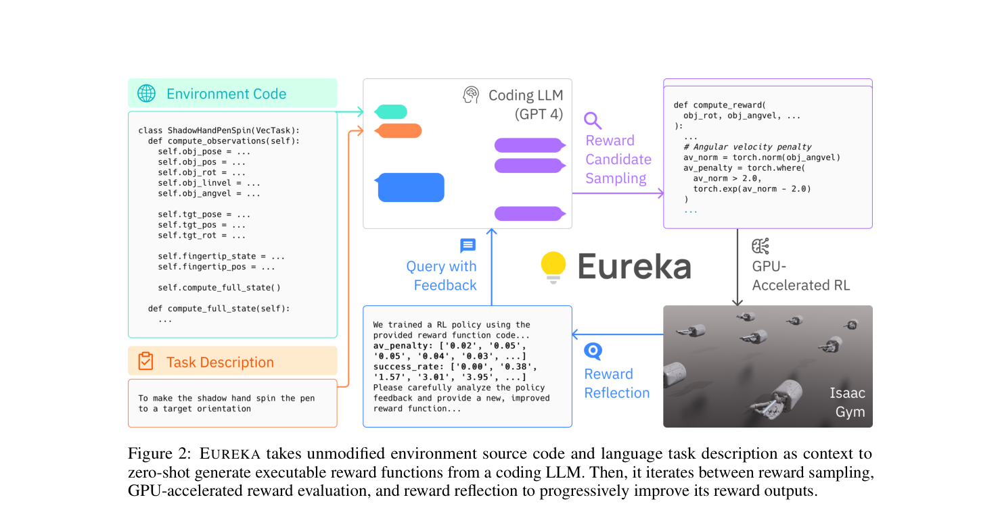
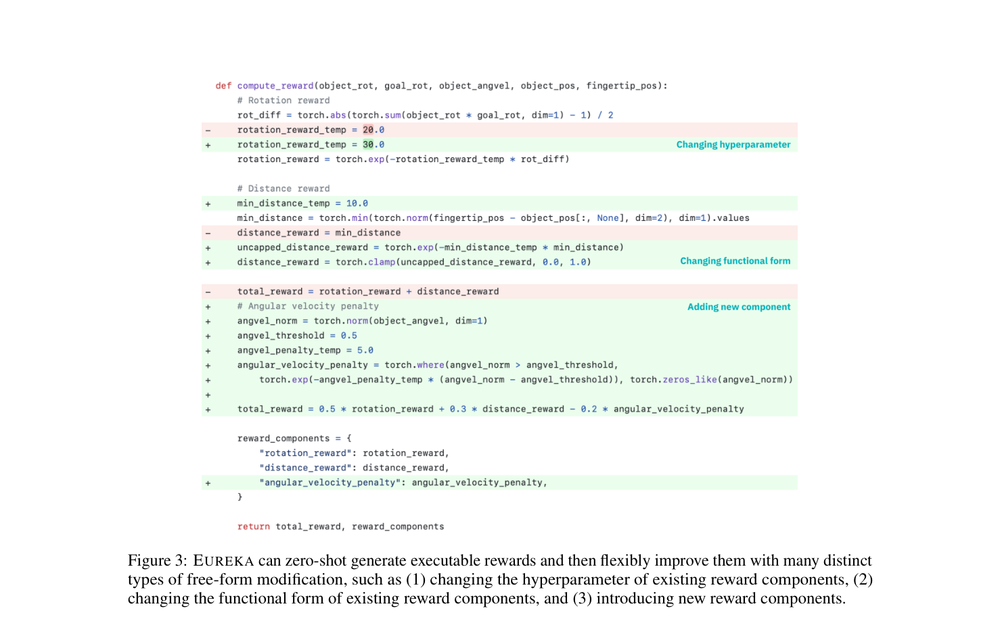
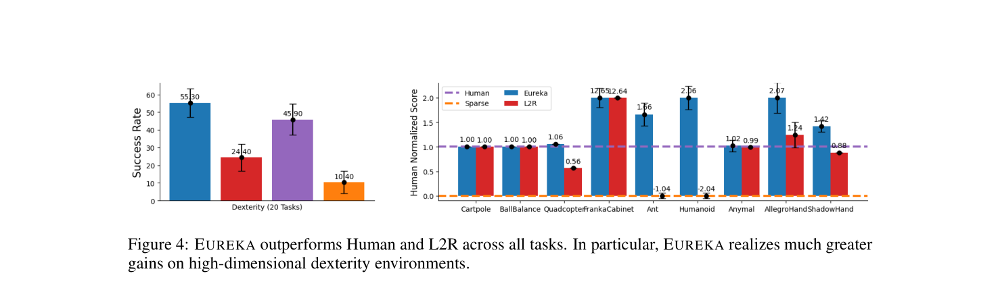
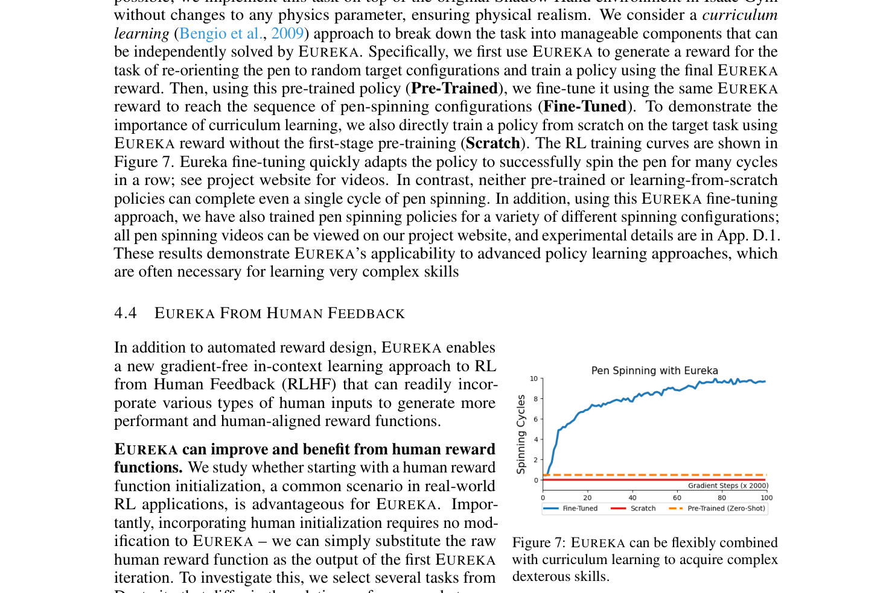
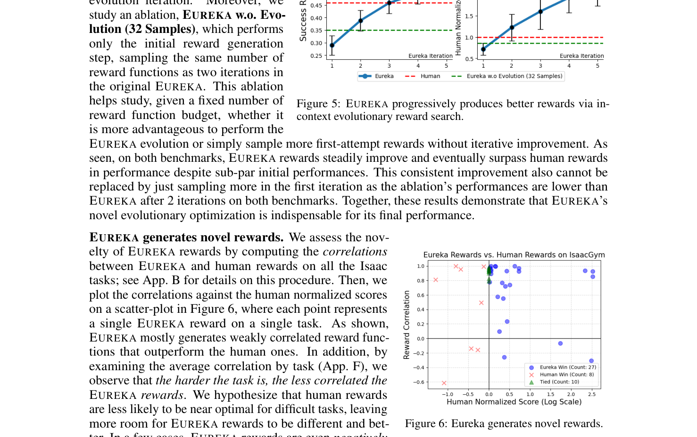

---
tags:
  - papers/reinforcement-learning
  - papers/reward-design
  - papers/coding-llm
  - papers/embodied-ai
  - papers/dexterous-manipulation
aliases:
  - "Eureka"
  - "Eureka Reward Design"
  - "Eureka ICLR 2024"
date: 2023-10-19
doi: 10.48550/arXiv.2310.12931
arxiv_id: 2310.12931
---

# Eureka: Human-Level Reward Design via Coding Large Language Models

## 核心信息

- **标题**: Eureka: Human-Level Reward Design via Coding Large Language Models
- **标题翻译**: Eureka：基于代码大语言模型的超人类水平强化学习奖励设计
- **作者**: Yecheng Jason Ma (马也成), William Liang, Guanzhi Wang (王冠之), De-An Huang, Osbert Bastani, Dinesh Jayaraman, Yuke Zhu (朱玉可), Linxi "Jim" Fan (范麟熙), Anima Anandkumar
- **机构**: 宾夕法尼亚大学 (UPenn), NVIDIA, 加州理工学院 (Caltech), 德克萨斯大学奥斯汀分校 (UT Austin)
- **发表渠道**: ICLR 2024 Oral 演讲报告 (arXiv:2310.12931, 2023-10-19 v1, 2024-04-30 v2)
- **论文链接**: https://arxiv.org/abs/2310.12931
- **项目主页**: https://eureka-research.github.io
- **代码仓库**: https://github.com/eureka-research/Eureka
- **数据与资源**: Isaac Gym (29 个动力学与双灵巧手操控任务); 10 种机器人构型; Shadow Hand 灵巧手连续转笔任务
- **论文类型**: 具身代码智能体 (Embodied Coding Agent); 强化学习奖励工程自动化 (Automated Reward Engineering); 进化搜索与代码自反思 (In-Context Evolutionary Search & Reflection)

## 原文摘要翻译

大语言模型（LLM）已在高层语义规划等序贯决策任务中展现出卓越能力。然而，如何驾驭它们来学习底层的复杂连续操纵任务（例如灵巧转笔，dexterous pen spinning），仍然是一个悬而未决的根本难题。本文弥合了这一鸿沟，提出了 **EUREKA**——一种由大语言模型驱动的超人类水平奖励函数设计算法。EUREKA 充分利用了以 GPT-4 为代表的先进代码大模型在零样本生成、代码编写和上下文内改进（in-context improvement）方面的惊人能力，对奖励函数代码执行进化式优化。由此生成的奖励函数随后可通过强化学习（RL）使智能体习得高度复杂的物理技能。在没有任何特定任务的提示词工程（task-specific prompting）或预定义奖励模板的前提下，EUREKA 生成的奖励函数性能超越了人类专家手工设计的奖励。在包含 10 种截然不同机器人构型的 29 个开源强化学习基准环境中，EUREKA 在 **83%** 的任务上超越了人类专家，取得了平均 **52%** 的归一化性能提升。此外，EUREKA 的通用性催生了一种无需更新模型权重的全新“无梯度上下文人类反馈强化学习”（gradient-free in-context RLHF）范式，能够无缝融合人类输入以提升生成奖励的质量与安全性。最后，通过在课程学习（curriculum learning）设置中结合 EUREKA 生成的奖励，本文首次在模拟拟人五指手（Shadow Hand）上解锁了极具挑战性的高速连续转笔绝技。

## 创新点

1. **将奖励设计从经验性的人工“黑盒炼金”彻底重构为以代码为表达接口的上下文进化搜索（Evolutionary Search over Reward Code）**。彻底打破了以往强化学习极度依赖领域专家手工试错编写启发式奖励的范式，证明了代码大模型在符号数学公式与物理规律映射层面的优异创造力。
2. **提出以环境原始代码为上下文（Environment as Context）的零样本奖励代码生成机制**。直接向大模型输入模拟器底层环境源码（提取物理状态属性与观测接口），完全无需任何任务特定的 Prompt Engineering、少样本示例（Few-shot Examples）或动作原语模板，使方法具备跨物理模拟器和跨机器人形态的极高泛化能力。
3. **建立基于策略训练动力学和奖励分量轨迹的文本化奖励反思机制（Reward Reflection）**。针对稀疏任务适应度指标无法提供细粒度信用分配（Credit Assignment）的致命缺陷，EUREKA 将每个奖励分量在训练不同周期的标量轨迹（最大值、均值、最小值和收敛趋势）转换成结构化文本反馈，指导 LLM 进行目标化、细粒度的奖励代码修改与温度参数重缩放。
4. **开创无需梯度更新与模型微调的“上下文人类反馈强化学习”（Gradient-Free In-Context RLHF）**。将人类已有的次优奖励函数或高层自然语言评价（如“姿态过于低矮”、“动作像蹲跳”）直接注入到演化上下文中，大模型无需重新训练底层微调权重即可完成奖励重构，兼顾了算法自主探索能力与人类意图/安全性对齐。
5. **在模拟复杂五指灵巧手（Shadow Hand）上首次实现高速连续转笔（Pen Spinning）的复杂高动态灵巧操纵**。巧妙结合 EUREKA 生成的自适应奖励与两阶段课程学习（从随机三维姿态重定向预训练到预设航路点序列微调），攻克了数十年来纯手动奖励工程无法解决的超高自由度、非线性动力学灵巧接触控制难题。

## 一句话总结

EUREKA 的核心突破在于认识到**大模型不擅长直接输出高频连续物理力矩，但极其擅长编写数学上表达丰富、利于梯度传播的奖励代码**；它将 GPT-4 的符号代码推理与 Isaac Gym 的大规模 GPU 并行数值强化学习深度耦合，通过带有细粒度训练轨迹反思的进化闭环，实现了超越人类专家工程水准的端到端自动化奖励设计。

## 研究问题

在强化学习（RL）研究中，**奖励工程瓶颈（Reward Engineering Bottleneck）** 是阻碍具身智能（Embodied AI）向高维度、高动态技能拓展的核心路障。

强化学习的理论基础是马尔可夫决策过程（MDP），其目标是最大化累积回报。然而在绝大多数实际物理控制任务中，真实世界的评价信号（Ground-Truth Task Metric）通常是**极度稀疏的二进制成功指标**（例如“门是否打开”、“杯子是否倾倒”、“笔是否转完一圈”）。直接在稀疏奖励上使用强化学习算法（如 PPO），由于高维动作空间中的随机探索极难触碰成功状态，往往面临严重的“梯度消失”和样本效率极低的困境。

为了引导策略收敛，人类工程师不得不进行极其繁复的**奖励塑形（Reward Shaping）**：引入距离衰减、速度对齐、能量惩罚、平滑度约束等多项连续辅助奖励项。然而，这项工作存在以下核心痛点：
1. **人工试错极度低效且主观**：根据调查，92% 的强化学习从业者报告奖励设计依赖于纯粹的经验试错，89% 承认其设计的奖励是次优的，容易引发“奖励黑客”（Reward Hacking，即智能体找到满足数值奖励但违背真实任务意图的作弊行为）。
2. **高维非凸状态空间的认知盲区**：对于四足机器人、双足人机、尤其是 20 自由度以上的拟人五指灵巧手，关节间的耦合高度非线性。人类专家的直觉往往局限于低维线性组合（如简单的 L2 距离惩罚），无法兼顾接触力学中的突变与复杂的非凸势能曲面，因而设计的奖励项常常互相冲突或导致策略陷入局部最优。
3. **以往自动化尝试的严重局限**：
   - **逆强化学习（IRL）**：强依赖昂贵的高质量人类专家演示轨迹（Demonstrations），且推断出的奖励网络是黑盒、不可解释且无法灵活调整的；
   - **自动奖励搜索（AutoRL / 传统遗传编程）**：只能在固定的预设奖励模板中对少数浮点超参数做网格搜索，缺乏创建全新物理概念和拓扑数学形式的语义能力；
   - **基于 LLM 的先前工作（如 L2R, Language-to-Rewards）**：严重依赖人类预先编写的自然语言运动模板和有限的奖励 API 集合。这使得大模型实际上只是在做“填空题”，在简单机械臂上尚可运作，但在双灵巧手协作等高维复杂任务上，受限模板的表达力瞬间枯竭。


*论文原图编号：Figure 1。EUREKA 在跨越 10 种机器人构型的 29 个任务上实现超人类水平的奖励设计；结合课程学习，首次在五指灵巧手上解锁高速连续转笔技能。*

EUREKA 提出的根本性构想是：**能否利用具备深厚代码理解与常识推理能力的通用 Coding LLM（如 GPT-4），在不给定任何任务模板与示例的前提下，直接阅读物理模拟器的状态代码，零样本生成白盒的 Python 奖励程序，并通过高效的训练反馈闭环进行进化搜索？**

## 数据与任务定义

### 强化学习奖励设计问题 (Reward Design Problem, RDP) 形式化

论文沿用了 Singh et al. (2010) 对奖励设计问题的数学定义，并将其拓展为程序合成（Program Synthesis）语境下的“奖励生成问题（Reward Generation Problem）”：

定义世界模型为一个元组 $M = (S, A, T)$，其中 $S$ 为状态空间，$A$ 为动作空间，$T(s' \mid s, a)$ 为物理状态转移概率函数。强化学习优化算法记为 $A_M: \mathcal{R} \to \Pi$，它接收一个奖励函数 $R \in \mathcal{R}$，并在对应的 MDP $(M, R)$ 中训练输出策略 $\pi: S \to \Delta(A)$。定义适应度评估函数 $F: \Pi \to \mathbb{R}$ 为真实的任务评价准则（Ground-Truth Fitness Function，通常是任务成功率或累积物理位移），该函数仅在策略评估时可被查询，无法直接用于策略梯度更新。

奖励生成的目标是：给定以自然语言字符串 $l$ 描述的任务意图以及用代码描述的物理环境 $M$，输出一段可执行的奖励函数 Python 代码 $R$，使得底层强化学习算法学出的策略在真实适应度函数上取得最大化表现：
$$
R^* = \arg\max_{R \in \mathcal{R}} F(A_M(R))
$$

### 基准环境套件：10 种构型、29 个 Isaac Gym 环境

实验评测覆盖了强化学习与机器人学中极具代表性且极具挑战性的两大开源基准，全部基于 NVIDIA Isaac Gym 物理仿真引擎搭建：

1. **Isaac 标准基准（9 个经典环境）**：
   - 包含四足仿生机器人（Anymal: obs 48, act 12）、四旋翼无人机（Quadcopter: obs 21, act 12）、双足人形机器人（Humanoid: obs 108, act 21）、经典动力学控制（Cartpole, BallBalance, Ant）以及高自由度单手操作（FrankaCabinet, AllegroHand 88维, ShadowHand 211维）。
   - 任务涵盖倒立摆平衡、定点悬停、奔跑速度最大化、开柜门以及单手物体三维旋转重定向。
2. **Bidexterous Manipulation 双手灵巧操纵基准（20 个高维任务）**：
   - 统一采用一对双五指 Shadow Hand（总状态维度高达 398 至 446 维，动作空间达 40 至 52 维）。
   - 包含双手机械配合（Over 物体空中抛接传递、CatchUnderarm、CatchAbreast）、工具与日常物品操作（Scissors 剪刀开合、Switch 按压开关、Kettle 抓壶倒水、Pen 开笔帽、BottleCap 拧瓶盖）、精细重定向（ReOrientation）以及双块搭建（BlockStack）等极端复杂的连续接触任务。
   - 所有 Dexterity 任务的底层真实适应度函数 $F$ 均为极其苛刻的二进制成功指示函数（例如物体中心与目标距离小于 $0.03\text{ m}$，姿态旋转角误差小于阈值等）。

### 灵巧手连续转笔任务 (Pen Spinning)

在现有基准之外，论文构建了一个此前没有任何强化学习策略能够解决的全新挑战性任务——**拟人五指手高速连续转笔**：
- **物理真实性**：直接继承 Isaac Gym 的 Shadow Hand 原始物理碰撞参数与动力学约束，不作任何物理简化；
- **目标设定**：机械手需要通过拇指、食指、中指等手指的高频协调，驱动笔在指尖围绕特定轴线连续高速旋转；
- **任务形式化**：定义在 $SO(3)$ 空间中的一组预定离散航路点序列（Waypoints）。当笔的朝向与当前航路点误差低于阈值时，自动切换至下一航路点；成功跑完一整圈序列计为完成一次转笔循环（Cycle），机械手需在有限 Episode 内完成尽可能多的旋转循环。

### 评测指标与底座模型设置

- **Human Normalized Score (人类归一化得分)**：
  $$
  \text{Score}_{\text{norm}} = \frac{\text{Method} - \text{Sparse}}{|\text{Human} - \text{Sparse}|}
  $$
  其中 $\text{Human}$ 为基准提供的专家手工精心塑形奖励得分，$\text{Sparse}$ 为直接使用原始稀疏适应度函数训练的基线。在计算整体平均改善时，论文对离群点截断在 $[0, 3]$ 区间内以保持统计严谨性。
- **Success Rate (成功率)**：针对 Dexterity 双手灵巧操作任务，直接统计成功完成任务的回合占比。
- **底座模型**：默认使用 OpenAI 的 `gpt-4-0314`（知识截止于 2021 年 9 月，而上述 Dexterity 基准和转笔任务均在截止日期后开源，彻底排除了大模型在预训练阶段记忆环境代码或现成奖励的可能性）。消融实验中对比了 `gpt-3.5-turbo-16k-0613`。
- **策略训练与评估参数**：策略优化统一采用高度优化的 GPU 并行 PPO 算法（基于 `rl-games` 框架），保持与官方人类基准完全一致的超参数。搜索中间代际每个候选奖励评估 1 次 PPO 训练；最终产出的奖励执行 5 次独立随机种子的 PPO 训练，并在训练过程中的 10 个固定 Checkpoint 上提取峰值表现以计算均值与置信区间。

## 方法主线

### 机制流程

EUREKA 的架构由三大核心支柱驱动：**环境源码作为上下文 (Environment as Context)**、**基于上下文突变的进化搜索 (Evolutionary Search)** 与 **基于训练轨迹的奖励反思 (Reward Reflection)**。


*论文原图编号：Figure 2。EUREKA 闭环系统：接收未修改的环境源代码与自然语言任务描述作为 Prompt 上下文，利用 Coding LLM 零样本生成可执行奖励函数；随后在 GPU 并行物理模拟器上评估策略，生成奖励反思，并迭代突变进化。*

整个算法的运行机制如下（对应论文中的 Algorithm 1）：
1. **环境代码提取与提示词组装**：通过自动化脚本提取模拟器环境类中暴露观测状态与变量定义的代码片段（如 `compute_observations`），组装系统 Prompt、代码格式规范以及自然语言任务描述 $l$；
2. **批量候选采样（Sampling）**：在每一代迭代 $n \in \{1, \dots, N\}$ 中，要求 LLM 生成 $K$ 个独立同分布（i.i.d.）的候选奖励函数代码 $\{R_1, \dots, R_K\}$；
3. **GPU 并行策略训练与评估（Evaluation）**：利用 Isaac Gym 在 GPU 上并行分配环境实例，在各自候选奖励下运行 PPO 优化，并记录各个奖励分量与全局适应度指标的轨迹数据；
4. **奖励反思构造（Reflection）**：选出当前代中适应度得分最高的最优候选 $R_{\text{best}}^n$，提取其在整个训练周期的数值演变轨迹，自动构造成自然语言反思文本；
5. **上下文变异进化（Mutation & Evolution）**：将当前最优奖励代码与其反思文本追加到 LLM 上下文中，执行突变 Prompt，生成下一代的 $K$ 个新候选奖励。

```
+-------------------------------------------------------------------------------+
|                             EUREKA 算法核心闭环                                |
+-------------------------------------------------------------------------------+
|                                                                               |
|  [任务文本描述 l] + [环境源代码片段 M]                                         |
|         │                                                                     |
|         ▼                                                                     |
|  ┌──────────────┐     零样本采样      ┌──────────────────────────────────┐   |
|  │  Coding LLM  │ ─────────────────> │  K 个独立候选奖励代码 {R_1...R_K}  │   |
|  └──────────────┘                    └──────────────────────────────────┘   |
|         ▲                                             │                       |
|         │ 上下文进化突变                              │ GPU 极速并行训练      |
|         │ (保留最优 R_best)                            ▼                       |
|  ┌──────────────┐  追踪分量与全局指标  ┌──────────────────────────────────┐   |
|  │ 奖励反思模块 │ <───────────────── │  Isaac Gym + PPO 策略训练        │   |
|  │ (Reflection) │                    │  (输出 Checkpoint 轨迹 & 得分)    │   |
|  └──────────────┘                    └──────────────────────────────────┘   |
|                                                                               |
+-------------------------------------------------------------------------------+
```


*论文原图编号：Figure 3。EUREKA 零样本生成奖励并在进化过程中自发展开的三种自由形式代码修改：(1) 调节已有奖励分量的超参数与温度；(2) 重构奖励分量的数学函数拓扑（如从线性截断改为指数衰减）；(3) 引入全新的环境物理状态分量。*

### 核心组件: 零样本奖励代码生成与代码执行沙盒

EUREKA 不使用任何手工设计的动作抽象或固定的奖励公式模板。它的设计建立在以下关键实现细节之上：

1. **Environment as Context 的剪裁哲学**：
   直接将整个物理引擎代码塞给 LLM 会导致上下文超长且混杂了与奖励无关的图形渲染、内存分配逻辑。EUREKA 发现：**任何合法的奖励函数在物理本质上都是环境状态（State）与动作（Action）的泛函**。因此，只需使用 AST 静态分析工具自动提取模拟器中 `compute_observations()` 相关的函数定义及类的状态属性（如 `torso_position`, `fingertip_pos`, `dof_vel` 等）。这样既大幅缩减了 Token 开销，又向大模型完全暴露了语义丰富的物理状态张量。
2. **TorchScript 规范与安全沙盒**：
   - 提示词要求生成的函数必须带有 `@torch.jit.script` 装饰器，并显式进行类型注解（如 `Tuple[torch.Tensor, Dict[str, torch.Tensor]]`）；
   - 要求所有计算必须使用原生 PyTorch Tensor 操作，禁止使用低效的 NumPy，并严格保证新建张量与输入张量位于同一 GPU 设备上（Device Consistency）；
   - **分量字典规范**：函数返回值必须由两部分构成——`(1) total_reward`（标量求和供强化学习回传梯度）与 `(2) reward_components`（包含所有独立分量命名的字典）。正是这一规范为后续的奖励反思打下了确定性的观测抓手。
3. **多样本独立采样规避代码崩溃**：
   单个大模型代码生成即使强大，也偶尔会产生语法错误或张量维度不匹配（如广播机制错误）。EUREKA 采用批量采样策略（默认每代 $K = 16$）。由于生成采样是独立进行的，所有候选代码均崩溃的概率随 $K$ 呈指数衰减。实验证明，在 $K = 16$ 的设定下，**所有 29 个环境的第一代采样中，均存在至少 1 个可顺利通过 JIT 编译并执行物理训练的有效奖励函数**。

### 基于训练曲线与物理指标的奖励反思机制 (Reward Reflection)

很多强化学习辅助系统只向 LLM 反馈一个最终的总得分（如“平均回报为 12.5”）。作者敏锐地指出，**单一标量得分在奖励设计中是极其贫乏的，它彻底抹杀了分量间的信用分配（Credit Assignment）**。一个总分很低的奖励，可能是因为某个分量设计极佳但被另一个数量级过大的惩罚项淹没；也可能是某个关键分量在训练全程数值恒定（梯度为零），导致智能体根本学不到对应动作。

针对这一问题，EUREKA 提出了结构化的 **Reward Reflection**。在每隔固定的训练 Epoch（如每 100~300 个 Epoch），系统会自动捕获并统计：
- 策略的全局指标（成功率、回合存活长度、环境适应度）；
- 字典中暴露的**每一个细粒度奖励分量在各个训练阶段的数值变化序列**，以及该分量在全周期的最大值、均值与最小值。

系统 Prompt 为大模型配备了三条明确的“反思诊断启发式法则”：
1. **重构法则**：如果全局成功率在训练全程始终接近零，说明当前奖励未能提供有效的引导势能，必须完全推倒重写整体奖励逻辑；
2. **活跃度法则**：如果某个奖励分量的数值在各个 Checkpoint 之间几乎完全无变化，说明底层强化学习优化器无法对该形式产生有效梯度。提示词建议：(a) 调整其缩放比例或温度参数；(b) 修改其数学拓扑函数；或 (c) 果断剔除该无用分量；
3. **平衡法则**：如果某一个分量的绝对数量级远大于其他分量，导致其他物理项被完全掩盖，则必须引入归一化或重新缩放至合理区间。

例如，在 Humanoid 奔跑任务中，LLM 在第一代给出了 `velocity_reward` 和 `posture_reward`。反思数据显示 `posture_reward` 保持在 3.27 纹丝不动，而速度项已经从 1.05 暴增到 204.21。LLM 在收到反思后，立刻诊断出姿态项权重过小且尺度失衡，于是在下一代将姿态温度从 1.0 上调至 10.0，并将速度温度从 1.0 上调至 5.0，同时引入动作能量惩罚项，迅速改善了策略表现。

### 进化搜索策略 (Evolutionary Search)

EUREKA 将大模型在上下文内的长文本推理能力抽象为一种高级的**语义变异算子（Semantic Mutation Operator）**：

1. **马尔可夫式上下文记忆管理（Markovian Dialogue Trimming）**：
   为了防止上下文长度随迭代次数急剧膨胀并避免注意力被早期失败的奖励代码分散，EUREKA 在每次进化时执行上下文剪裁：**Prompt 中只保留系统规则、环境代码、上一代最优的奖励代码及其对应的 Reward Reflection**。这种马尔可夫设计不仅大幅节约了 API 成本，更保证了突变过程始终紧密围绕当前最优前沿（Pareto Frontier）展开。
2. **进化代际与独立重启机制**：
   - 每轮迭代进化 $N = 5$ 代，每代生成 $K = 16$ 个候选；
   - 为了跳出局部极值，EUREKA 在每个环境中配置 **5 次独立随机重启（5 Independent Runs）**。最终输出在所有代际和所有重启中真实适应度 $F$ 最高的奖励函数 $R_{\text{Eureka}}$。

## 关键结果

### 主结果与强基线


*论文原图编号：Figure 4。EUREKA 与人类专家奖励 (Human) 以及 L2R 在全任务上的聚合性能对比。EUREKA 在低维任务上表现卓越，并在高维双灵巧手操控任务上取得压倒性优势。*


*论文原图编号：Figure 5。EUREKA 随进化代数的性能演变轨迹。相比不进行进化的首代 32 样本采样消融，EUREKA 展现出稳定的代际阶梯式提升。*

1. **全任务超人类表现**：
   - 在包含 10 种机器人构型的 29 个任务中，EUREKA 在 **83% 的任务（24 / 29）** 上超越了人类专家精心编写的奖励函数，平均归一化提升达到 **52%**；
   - 在 9 个 Isaac 标准任务上，EUREKA 全面持平或超越人类；在 20 个极高维度的 Dexterity 双灵巧手任务中，EUREKA 在 15 个任务上大幅超越人类专家基准；
   - 在某些复杂任务上提升尤为惊人：例如 FrankaCabinet 开柜门任务中，人类归一化得分提升了 **11.98 倍**；在双灵巧手 Kettle 倒水任务中，成功率由人类奖励的 **11%** 飙升至 **91%**。
2. **对比强基线 L2R 的代差优势**：
   - L2R 采用预设自然语言模板和固定的奖励 API。尽管作者赋予了 L2R 人类奖励原始组件的特权 API，L2R 在低维任务（如 Cartpole, BallBalance）上尚能与人类持平，但在双灵巧手等高维接触任务上全面崩盘；
   - 即使在第一代（双方均探索 16 个样本、无进化无反思的公平起跑线上），EUREKA 的零样本无模板代码生成性能也显著优于 L2R。这证实了：**高维连续接触物理的复杂性无法被人类预先构想的离散动词/模板所枚举，大模型的自由代码表达力才是突破瓶颈的决定性力量**。
3. **进化的不可替代性**：
   - 针对“EUREKA 的成功是否仅仅来自于盲目采样了更多样本”的质疑，作者设计了严格的消融实验：**EUREKA w.o. Evolution (32 Samples)**——在第一代直接采样 32 个候选，算力预算等同于演化 2 代。
   - 结果如 Figure 5 所示：直接采样 32 个候选的性能不仅大幅落后于 EUREKA 的第 5 代，甚至显著落后于 EUREKA 仅演化 2 代后的表现。这无可辩驳地证明：**基于反思的上下文变异具有明确的定向爬坡能力，绝非随机蒙特卡洛采样的运气产物**。

### 灵巧手笔旋转实验

高速转笔是灵巧操控领域公认的“珠穆朗玛峰”，要求五指与笔杆在非固定接触面之间发生高频滑动与滚动，伴随着剧烈的重力与离心力交互。


*论文原图编号：Figure 7。灵巧手转笔任务训练曲线。纯粹从零学习 (Scratch) 和无微调的预训练 (Pre-Trained) 均无法完成一圈转笔，而结合 EUREKA 奖励与两阶段课程学习的微调策略 (Fine-Tuned) 迅速解锁了连续多次转笔的能力。*

- **课程学习（Curriculum Learning）的协同设计**：
  - **阶段一（预训练）**：利用 EUREKA 生成目标笔姿态随机三维重定向（Random Pose Reorientation）的奖励函数，训练基础的抓握与姿态摆动能力；
  - **阶段二（课程微调）**：以预训练权重为底座，加载连续航路点（Waypoints）转笔环境，使用 EUREKA 生成的微调奖励函数进行持续优化。
- **实验对比**：
  - 如图 7 所示，直接从零开始训练（Scratch），策略成功率始终锁定在 0；仅具备预训练权重的策略（Pre-Trained）同样连单个周期的转笔都无法完成；
  - 只有在预训练权重的基础上、结合 EUREKA 生成的奖励进行课程微调（Fine-Tuned），策略在极短的训练时间内迅速收敛，实现了**逼真、平滑且能够持续高速旋转数十个循环周期的惊人技能**（真实视频呈现出极其逼真的人类转笔手感）。

### 人机协同与反思消融


*论文原图编号：Figure 6。EUREKA 奖励与人类奖励在所有 Isaac 任务上的皮尔逊相关系数与归一化得分散点图。大部分胜出奖励与人类呈弱相关甚至显著负相关。*


*论文原图编号：Figure 8。以人类编写的奖励作为第一代输入（Human Init.），EUREKA 均能在原有基础上实现跨越式提升，体现出卓越的人工智能奖励设计辅助能力。*


*论文原图编号：Figure 9。利用人类自然语言反馈进行姿态对齐。盲测中 15/20（75%）的受试者偏好经过人类文本引导的 EUREKA-HF 跑姿，成功抑制了奖励黑客引发的异常体态。*

1. **反思消融实验（No Reward Reflection）**：
   - 移除了包含各分量 Checkpoint 演化序列的反思模块，仅向 LLM 提供最终的单一标量得分 $F$；
   - 结果显示：在 Isaac 全任务上，**平均归一化得分剧烈下降 28.6%**（如图 14 所示）。在高维灵巧手任务上，性能退化尤为严重。这证明了细粒度分量跟踪对于 LLM 进行多变量微积分尺度的精准调试至关重要。
2. **反直觉的“负相关”新颖奖励**：
   - 作者计算了 EUREKA 生成的奖励与人类专家奖励在完全相同策略轨迹上的皮尔逊相关系数（Pearson Correlation）；
   - 如图 6 与图 16 所示：**任务维度越高、动力学越复杂，EUREKA 奖励与人类奖励的相关性越低**；
   - 在 FrankaCabinet（相关性 -0.30）和 ShadowHand（相关性 -0.26）等任务中，EUREKA 甚至生成了与人类直觉**显著负相关**的奖励函数，但其最终策略得分却呈数倍爆发。例如在单手转立方体中，人类设计强迫手掌紧贴物体，而 EUREKA 发现通过松开部分指尖、利用指尖与掌心形成的倾斜几何势垒能够更快促成连续旋转。这生动展示了大模型能够跳出人类狭隘的认知偏见，发现全新控制机理。
3. **人类初始奖励的放大器（Human Initialization）**：
   - 将人类专家编写的原始奖励直接作为第 0 代传入 EUREKA；
   - 如图 8 所示，无论原始人类奖励的质量是高是低，**EUREKA (Human Init.) 在所有测试任务上均统一超越了原始人类奖励以及纯从零开始的 EUREKA**。人类专家擅长凭物理直觉挑选“哪些变量该进奖励”，但在“如何用数学算子和超参数将它们平滑组合”上极其笨拙；EUREKA 恰好补足了这一短板，形成了人机协同的最佳互补。
4. **基于自然语言的人类对齐（EUREKA from Human Feedback, RLHF）**：
   - 在很多开放场景中，人类意图（如“跑姿要优美自然”）很难写出数学适应度 $F$。EUREKA 支持人类在迭代循环中直接输入口语化反馈；
   - 在 Humanoid 实验中，初始奖励导致机器人采用极度扭曲的“双腿深蹲跳跃”，人类介入给出“看起来像蹲跳，请改成跑步”；第二代变成“左右腿轮流摆动但重心过低的鸭子步”；人类再次指出“请保持躯干挺直奔跑”；大模型迅速调整了高度与躯干倾角惩罚，最终学出了步态极其优雅的直立奔跑；
   - 盲测结果（图 9）显示，75% 的人类评测者显著偏好 EUREKA-HF 训练的策略。

## 深度分析

### 真正贡献是什么：为什么代码级奖励生成优于提示词级动作生成？

当前具身智能领域存在一条极其显赫的路线：**Vision-Language-Action (VLA) 或基于 Prompt 的直接动作控制**（如 RT-2, SayCan, Code as Policies 等）。这些方法试图让大模型直接输出机器人的底层动作或关节轨迹。然而，在面对灵巧转笔、高频力反馈倒水等复杂物理任务时，这类方法遭遇了不可逾越的物理屏障。

EUREKA 的核心哲学是一次漂亮的“职责解耦”与“接口重构”：

| 对比维度 | 提示词/代码级直接动作规划 (Prompt-to-Action / CaP) | EUREKA 代码级奖励生成 (Code-to-Reward) |
| :--- | :--- | :--- |
| **执行频率与延迟** | 受限于大模型推理延迟，通常只能以 $1\sim 5\text{ Hz}$ 缓慢输出，无法应对高动态突变 | 毫秒级高频控制（$60\sim 200\text{ Hz}$）由底层轻量神经网络策略执行 |
| **物理规律感知** | LLM 内部缺乏毫秒级非线性动力学模拟能力，容易产生严重物理幻觉与穿透 | 由物理模拟器（Isaac Gym）以真实刚体/接触方程提供高保真数值支撑 |
| **探索机制** | 依赖 Prompt 采样，无法在高维连续空间内系统性探索非凸力矩平衡 | 结合 PPO 与大规模 GPU 并行环境，探索成百上千万条物理轨迹 |
| **LLM 的角色定位** | 试图扮演底层的“执行神经元”（极其劣势） | 扮演顶层的“目标设定者与科学导师”（发挥符号归纳优势） |

**EUREKA 真正的贡献，是找到了大模型与物理世界结合的最佳接口——可微的、连续的标量奖励代码。** LLM 负责高层语义理解、物理常识联想、分量拓扑设计与全局超参数反思；强化学习算法与物理模拟器则负责底层的数值力矩计算与高频连续控制。

### 为什么结果成立：物理常识先验与数学平滑性的双重胜利

深入剖析 EUREKA 生成的奖励代码（参见 Appendix G），其之所以能击败人类专家，核心在于两点：

1. **大模型预训练沉淀的深厚物理常识与几何符号先验**：
   GPT-4 读过海量经典力学、机器人学文献与 PyTorch 代码。当它看到 `torso_position`, `fingertip_pos`, `root_states` 时，它能本能地调用四元数误差、角动量守恒、末端欧氏距离与动能抑制公式。它不是在盲目拼接字符，而是在进行受物理直觉约束的公式合成。
2. **超越人类直觉的指数温度连续平滑性（Exponential Transformation with Temperature）**：
   人类工程师编写奖励时，出于直觉习惯，极其偏好**分段线性截断（Piecewise Linear）或二值门控（Binary Threshold）**（例如：`if dist < 0.1: rew = 1.0 - dist; else: rew = 0`）。这种奖励在数学上是非光滑（Non-smooth）甚至不连续的，在截断点处导数突变或为零，极易导致策略网络在临界区发生梯度震荡或梯度消失。
   相反，EUREKA 几乎在所有生成代码中自发应用了**连续指数势场变换**：
   $$
   R_{\text{smooth}} = \exp(-\tau \cdot \|x - x^*\|_2)
   $$
   并通过反思机制不断自适应微调温度参数 $\tau$。这种函数形式具有三大绝佳数学性质：
   - 全局处处可微，策略梯度在任意距离下均有明确的梯度流回传；
   - 当远离目标时梯度平缓不易发散，当逼近目标时敏感度指数级放大，兼具粗粒度引导与微米级精确定位；
   - 天然将数值规范在 $(0, 1]$ 区间，从根源上规避了传统线性加权中不同物理量量纲爆炸的问题。

### 容易误读的地方

1. **误读一：EUREKA 完全不需要真实目标，凭空即可学会转笔**。
   *澄清*：EUREKA 解决的是从“稀疏适应度函数 $F$ 到稠密塑形奖励代码 $R$”的映射。它依然需要一个最终的判据 $F$（或人类的文本反思）来作为进化淘汰的标准。如果没有 $F$，进化算法将失去适应度地形图。
2. **误读二：EUREKA 只是在做 Prompt 提示词工程或参数微调**。
   *澄清*：EUREKA 的 Prompt 是全通用的，不含任何任务特定提示。从代码变异上看，它不仅调节浮点温度，更能自主删除整个无效物理项、引入全新的状态变量组合（如同时耦合指尖位置与物体角速度），属于真正的符号拓扑结构变异。
3. **误读三：生成的奖励函数具有全局普适的强化学习泛化性**。
   *澄清*：EUREKA 反思中看到的训练轨迹是在特定的 PPO 优化器与特定超参数下测得的。换言之，生成的奖励实际上是**针对当前优化器动态过拟合出的最易优化地形**。如果将 Eureka 生成的奖励直接搬迁给 SAC 或 DDPG，可能需要重新启动反思进化以适应新的算法动力学。

### 复现注意点

1. **Isaac Gym 与 TorchScript 环境配置地狱**：
   Isaac Gym 的 Preview 4 原生对 PyTorch 版本有严苛要求（通常为 PyTorch 1.13~2.0 与 CUDA 11.x）。EUREKA 生成的代码强制要求 `@torch.jit.script` 编译。在复现时，务必在沙盒执行器中捕获 JIT 编译异常与张量设备不匹配错误，防止非法 Python 脚本直接导致整个主进程崩溃。
2. **算力与并行度要求**：
   EUREKA 的强力依赖于 Isaac Gym 的极端并行速度。论文在单台 8×A100 GPU 服务器上跑完一个环境约耗时 1 天以内。如果研究者尝试在 CPU 模拟器（如经典 MuJoCo 单线程环境）上复现，评估 16 个候选且迭代 5 代将耗费数周时间。建议复现时至少配备 4 张以上企业级 GPU。
3. **OpenAI API 的非确定性与断网重试**：
   由于 GPT-4 API 存在偶发性超时与格式偏离，代码解析器必须具备 Robust Regex 提取机制（提取 ` ```python ... ``` ` 代码块），并在 API 异常时具备指数退避重试能力。

## 局限

1. **强依赖物理仿真器的状态全可观测性（Full State Observability）**：
   EUREKA 能够成功的基石是 `compute_observations` 已经由环境开发者写好了清晰的物理变量名（如物体三维坐标、四元数姿态、末端接触力）。如果面对的是未经标注的无结构原始像素流（Raw Pixels）或真实机器人的带噪声无标定传感器，EUREKA 将无法直接提取符号状态。
2. **Sim2Real 真实世界迁移鸿沟**：
   尽管在附录中展示了利用四足机器人进行 Sim2Real 实机跳跃的初步尝试，但转笔等极限灵巧操纵对接触碰撞、微滑移和执行器延迟极度敏感。仿真中生成的激进奖励可能导致真实电机过热、高频抖动或齿轮磨损。
3. **缺乏形式化安全约束（Formal Safety Guarantees）**：
   EUREKA 生成的代码依然可能包含未被预见的局部极小值。虽然引入了 RLHF 人类文本对齐，但依然属于经验性纠偏，无法从数学上证明策略在全生命周期内绝对满足关节限位与动力学安全硬约束。

## 我的笔记

EUREKA 处于大模型与具身物理智能交汇的黄金十字路口，与我近年关注的一系列前沿工作有着深刻的内在血脉联系：

1. **与 Voyager (Wang et al., 2023) 的思想共振**：
   Voyager 在 Minecraft 开放世界中开创了“代码即技能（Code as Skills）”与技能库递归进化的先河。EUREKA 与 Voyager 共享了核心作者团队（Guanzhi Wang, Linxi Fan, Yuke Zhu 等），其本质是将 Voyager 在离散离线 API 上的代码进化思想，升华并迁移到了**连续物理动力学系统的微分奖励函数合成**中。Voyager 沉淀的是可调用的 Python 函数库，而 EUREKA 沉淀的是能够驱动神经网络在非凸连续流形上冲破局部极值的“适应度能量场”。
2. **与 Code2Worlds (Zhang et al., 2026) 及 SimWorld Studio 的交汇闭环**：
   在 3D Agent 与世界模拟（World Simulation）的研究全景中：
   - **Code2Worlds** 探索的是如何利用 Coding LLM 编写 Python/Blender 脚本来生成 4D 动态世界、几何场景与物理效应；
   - **SimWorld Studio** 探讨的是如何自动化生成具身智能体的环境与物理任务关卡；
   - **EUREKA** 则补齐了最为关键的第三块拼图——**如何为生成的复杂世界与任务自动生成可优化的学习驱动信号（Reward）**！
   如果将三者融会贯通，便能构建出一个梦幻般的**完全自治的具身通用智能闭环**：LLM 生成 3D/4D 物理仿真世界 $\to$ LLM 生成关卡与环境源代码 $\to$ EUREKA 读取源码自动化演化奖励函数 $\to$ 底层 GPU 强化学习批量习得超人类控制技能 $\to$ 策略能力提升反过来促成更高难度世界的生成。
3. **迈向具身多模态与神经符号融合的未来**：
   EUREKA 当前的反思仅限于打印出的标量数字列表。未来的升级方向必然是**结合多模态大模型（VLM，如 GPT-4V/Gemini）直接观察策略运行的渲染视频**，由视觉反思直接指出“小拇指未能勾住笔身”，并联合数值反思同步修改奖励代码。这一神经与符号的共生结构，正是具身智能迈向真正物理常识与超人类灵巧性的正确方向。

## 引用

```bibtex
@inproceedings{ma2024eureka,
  title     = {Eureka: Human-Level Reward Design via Coding Large Language Models},
  author    = {Yecheng Jason Ma and William Liang and Guanzhi Wang and De-An Huang and Osbert Bastani and Dinesh Jayaraman and Yuke Zhu and Linxi Fan and Anima Anandkumar},
  booktitle = {The Twelfth International Conference on Learning Representations (ICLR)},
  year      = {2024},
  url       = {https://openreview.net/forum?id=IEuo0BP1Pt}
}
```
