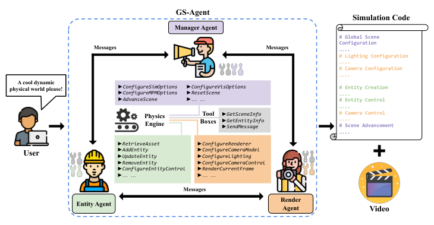
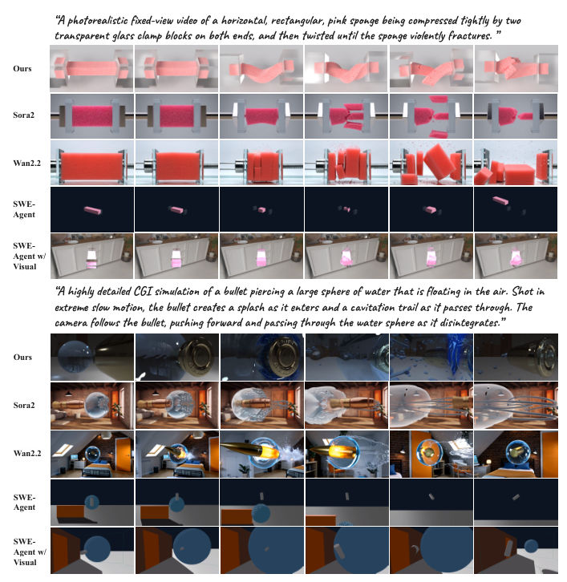
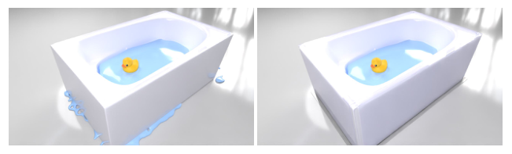
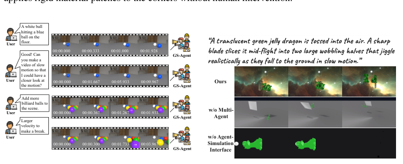
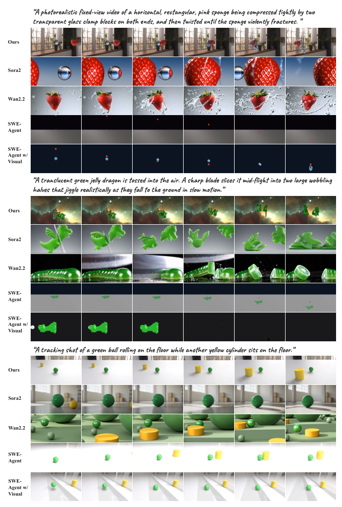
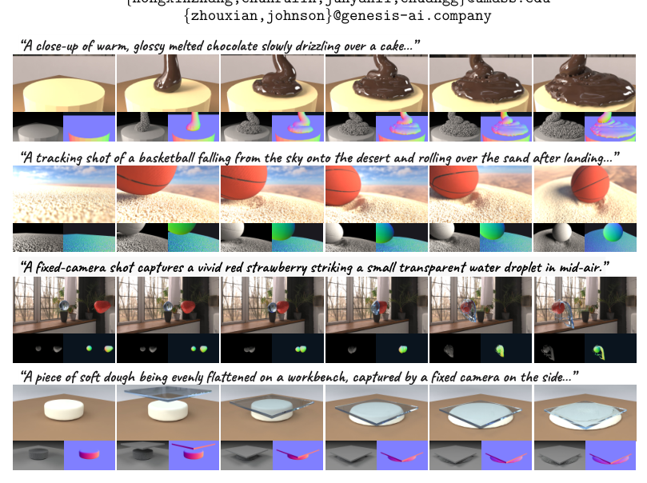

---
tags:
  - papers/3D-agent
  - papers/4D-world-generation
  - papers/embodied-ai
aliases:
  - "GS-Agent"
  - "Creating 4D Physical Worlds"
date: 2026-07-23
doi: 10.48550/arXiv.2607.21522
arxiv_id: 2607.21522
---

# GS-Agent: Creating 4D Physical Worlds With Generative Simulation

## 核心信息

- 标题: GS-Agent: Creating 4D Physical Worlds With Generative Simulation
- 标题翻译: GS-Agent：用生成式模拟创建 4D 物理世界
- 作者: Hongxin Zhang, Chunru Lin, Junyan Li, Zhou Xian, Tsun-Hsuan Wang, Chuang Gan
- 机构: University of Massachusetts Amherst；Genesis AI
- 发表时间: 2026-07-23
- 发表渠道: arXiv preprint
- DOI: 10.48550/arXiv.2607.21522
- arXiv: 2607.21522
- 论文链接: https://arxiv.org/abs/2607.21522
- 代码 / 项目: https://umass-embodied-agi.github.io/gs-agent/
- 数据 / 资源: Genesis 物理引擎；BlenderKit、PolyHaven 资产库；Meshy 文本到 3D 资产生成
- 论文类型: AI 系统方法；物理引擎在环的多智能体；4D 世界生成；具身数据合成

## 原文摘要翻译

从自然语言描述创建动态且具有物理真实感的 4D 世界，既令人着迷又极具挑战。传统计算机图形学方法依赖人工制作，需要投入大量人力去调节材质、运动和视觉保真度。近年来，生成式基础模型的发展激发了人们从大规模数据中学习生成此类 4D 世界的兴趣；然而，现有方法仍难以保证物理合理性和可控性。

在本文中，我们采取了不同路径：利用基础模型构建一个智能体系统，模拟人类传统上创建 4D 世界的方式，同时自动化整个过程。我们提出 GS-Agent，这是一个端到端多智能体框架，将物理引擎置于闭环之中，从自然语言生成真实、动态且可控的 4D 物理世界。受人类构建 4D 世界方式的启发，GS-Agent 将任务分解为实体管理和渲染配置两部分。实体管理包括 3D 资产整理、材质调节、摆放和运动控制；渲染配置包括相机和光照操控。

多个具有不同专长的智能体通过代码与物理引擎交互，获取多模态反馈并协作迭代构建 4D 世界，使其符合给定描述。实验结果表明，GS-Agent 能将自然语言有效转换为多样且物理合理的 4D 世界，展现液体、可变形物体和刚体之间的丰富交互，同时实现电影化的相机和光照控制。我们希望 GS-Agent 能成为 4D 世界生成新范式的基础，推动创意内容创作和物理人工智能的发展。（摘要，pp. 1–2）

## 创新点

1. **把生成目标从视频像素改成可执行的 4D 世界。** 物理引擎中的实体、材料、控制函数和渲染器共同构成世界，输出既包含视频，也包含可继续执行的模拟代码和引擎状态（pp. 3–5）。
2. **用管理、实体、渲染三个专门智能体模拟人类制作管线。** 管理智能体负责拆解、委派和验证；实体智能体负责资产、材质、摆放与运动；渲染智能体负责相机、光照和录制。专门化不是表面上的角色命名，而是对应不同工具集合和上下文边界（pp. 3–5）。
3. **把物理引擎变成可供模型反复观察的反馈源。** 代理不仅生成脚本，还在推进模拟后读取边界检查、运行时信息、图像、视频和实体状态，再修改代码。这让“看起来不对”转化为可执行的修错动作（pp. 3–5；Appendix B.3）。
4. **利用引擎真值提出 State-PIS。** 相比用 SAM2 和质心估计视频物理的 Video-PIS，作者直接读取每个时间步的 3D 质心运动学，获得对模拟世界更严格的状态级测量（p. 6）。
5. **展示开放域对象、材料和镜头的组合控制。** 检索优先，Meshy 生成和 primitive 构造作为回退；材质可覆盖刚体、MPM 可变形体和 SPH 流体；相机轨迹以代码形式与模拟时间同步（pp. 5–6）。

## 一句话总结

GS-Agent 的真正定位不是“让大模型生成更像真的视频”，而是让多智能体借助结构化接口自动搭建、检查和修正一个仍可运行的物理世界，从而同时服务创意内容和具身数据生成。

## 研究问题

文本到视频模型可以生成漂亮的连续帧，却常在接触、形变、流体和相机旋转时违反物理规律；传统图形学又需要人工选择资产、调材质、摆物体、写运动和布置镜头（pp. 2–3）。因此作者问的是：**能否让基础模型像一支数字制作团队一样，把自然语言要求分解为模拟器中的可执行操作，并通过物理和视觉反馈持续修正？**

这一定义包含三层要求：

| 层次 | 要解决的问题 | GS-Agent 的做法 |
|---|---|---|
| 语义层 | 对象、动作、镜头是否符合描述 | Manager 拆解任务，Render Agent 反馈画面 |
| 物理层 | 材料、碰撞、形变、流体是否合理 | Genesis 求解器、边界检查和状态反馈 |
| 执行层 | 生成结果能否继续编辑、推进和录制 | 可执行模拟代码、结构化工具和时间线控制 |

与 GPT4Motion、SceneCraft 等让语言模型写 Blender 脚本的路线相比，本文强调统一的物理引擎、专门角色和闭环反馈；与 Sora2、Wan2.2 等文本到视频模型相比，本文牺牲一次性像素生成的便利，换取显式几何、材料、状态和相机程序（pp. 3–4）。

## 数据与任务定义

### 输入、输出与世界表示

输入是一段自然语言描述，例如“子弹穿过悬浮水球并在慢动作中产生飞溅”。输出是由 Genesis 执行的四维物理场景和渲染视频。实体被表示为 $E=(Morph, Material, Surface)$：形态指定几何，材料指定刚体、可变形体或液体行为，表面指定外观；初速度、力、运动轨迹和约束补充状态与控制（p. 4）。

求解器按材料选择：刚体求解器处理固体，MPM 处理可变形连续体，SPH 处理流体。时间步、分辨率、网格边界和粒子尺寸影响稳定性与精度。渲染器独立于物理求解，提供相机、光照和阴影参数（p. 4）。

### 两个评估套件

1. **NewtonGen 套件。** 24 个场景覆盖 12 类物理规律，例如抛物线运动和形变。每个方法在这些场景上报告 PIS。
2. **复杂交互套件。** 作者另收集 30 个含非连续多物体交互和动态相机控制的场景，例如碰撞、追踪和可控镜头；在此套件上报告文本对齐和审美分数（p. 6）。

### 指标

- **Video-PIS：** 依据视频分割和估计质心，衡量理论不变量的相对标准差。
- **State-PIS：** 直接从物理引擎读取每个时间步的精确 3D 质心运动学。文本到视频基线没有这个内部状态，因此表中为不可用。
- **Alignment Score：** 生成视频与文本指令之间的 Perception Encoder 特征相似度。
- **Aesthetic：** 采用 VBench 的审美指标（p. 6）。

这里有一个必须保留的比较边界：State-PIS 的可用性是物理引擎输出带来的模态优势，不能把它和 Video-PIS 当成完全同质的单一排行榜指标。

## 方法主线

### 机制流程

*图 2。GS-Agent 的系统流程：Manager、Entity 和 Render 三个智能体通过消息与物理引擎和结构化工具交互，最终输出模拟代码与视频（p. 4）。*

1. **自然语言到计划。** 输入是自然语言描述；操作是管理智能体解析实体、材料、空间关系、运动和镜头并逐步委派；输出是可验证的子任务计划。
2. **计划到实体和模拟。** 输入是子任务计划；操作是实体智能体检索或生成资产，按包围盒估计尺度、方向和位置，配置材料并写入逐步控制；输出是场景实体与模拟代码。
3. **模拟到多模态反馈。** 输入是当前模拟代码；操作是管理智能体配置时间步、重力和求解器参数并推进场景；输出是边界检查、运行时信息、实体状态、图像和视频。
4. **反馈到渲染与修正。** 输入是多模态反馈；操作是渲染智能体设置相机、轨迹、灯光和录制时序，管理智能体把问题传回相应角色并循环修改；输出是满足描述的可执行世界和最终视频。

### 三种角色与责任边界

**管理智能体。** 负责任务分解、委派、验证、全局模拟配置和时间线。它可以配置时间步、子步数、重力、MPM/SPH 网格或粒子参数、背景与阴影，并调用推进、重置和结束工具管理执行（pp. 4–5；附录 B.1）。

**实体智能体。** 资产检索返回本地路径、描述、预览图、匹配分数和包围盒。摆放阶段考虑规范方向、尺度、支撑面、不相交和间距；材质调节不只是外观，而要根据真实形变量迭代弹性模量、泊松比和屈服应力，并匹配 MPM 网格或 SPH 粒子尺度。运动控制通过比例-微分控制器、位置/速度/力命令或流体发射器的逐步控制函数完成（p. 5）。

**渲染智能体。** 将语言中的“固定视角”“跟踪镜头”“推近”等要求映射到世界坐标，设置位置、朝向、视场角、渲染器和灯光。相机运动以显式代码和模拟时间同步，因而可以平滑或重参数化而不改动物理轨迹（pp. 5–6）。

### Agent-Simulator Interface

作者没有把 Genesis 的全部低层接口原样暴露给模型，而是按角色提供语义化工具。通用工具负责读取场景、读取实体和传递消息；管理角色负责全局配置与推进；实体角色负责增删改、资产检索/生成和逐步控制；渲染角色负责渲染器、相机、灯光和录制（附录 B.1，表 5）。

这层接口是方法的关键工程判断：它缩小模型行动空间，同时保留用代码表达复杂几何和控制逻辑的能力。作者在第 4.4 节指出，直接暴露通用模拟器 API 容易造成语法错误、灾难性参数和引擎崩溃。

## 关键结果

### 与文本到视频和代理基线的比较

*图 3。海绵断裂和子弹穿过水球的定性比较（p. 6）。*

| 方法 | Video-PIS | State-PIS | Alignment | Aesthetic |
|---|---:|---:|---:|---:|
| Sora2 | 0.62 | — | 30.6 | 48.5 |
| Wan2.2 | 0.46 | — | 29.8 | **58.1** |
| SWE-Agent | 0.41 | 0.44 | 25.8 | 42.0 |
| SWE-Agent w/ Visual | 0.49 | 0.57 | 26.8 | 44.6 |
| **GS-Agent** | **0.71** | **0.83** | **32.2** | 47.6 |

*表 1。24 个 NewtonGen 场景上的 PIS，以及 30 个复杂场景上的对齐和审美结果（p. 7）。*

GS-Agent 在四项中三项最佳。差异不是“画面是否像”，而是状态是否真的由动力学产生：作者观察到 Sora2 在子弹穿水案例中生成了字面上的 空化轨迹，却没有可信的流体解体；Wan2.2 让子弹穿过水球但缺少合理飞溅；视频模型还可能在 180° 相机旋转后保留不变的背景。SWE-Agent 系列能生成相对合理的物理结果，却经常不能同时满足对象、动作和镜头文本。上述定性解释与表 1 的分数方向一致，但不能替代逐场景失败统计（pp. 6–7）。

### 用户研究：物理与控制优先，美学并非全面领先

15 位参与者对五种方法的视频进行随机排序，以 5 点量表评价 270 个有效响应：

| 方法 | 物理可信度 | 相机可控性 | 内容对齐 | 美学 |
|---|---:|---:|---:|---:|
| Sora2 | 4.01 | 3.92 | 4.65 | **4.18** |
| Wan2.2 | 2.72 | 3.49 | 4.45 | 3.71 |
| SWE-Agent | 3.18 | 3.49 | 3.40 | 2.40 |
| SWE-Agent w/ Visual | 3.25 | 3.96 | 3.72 | 2.44 |
| **GS-Agent** | **4.33** | **4.32** | **4.70** | 3.86 |

*表 2。用户研究结果（p. 7）。*

人工评分支持 GS-Agent 的主要论点：物理可信度、相机控制和内容对齐最高；但纯美学仍落后于 Sora2。这一负结果很重要，说明“显式世界状态”并不自动等于最佳构图、清晰度或视觉吸引力。

### 自动错误恢复和自然语言可控性

*图 4。导入的浴缸资产漏水时，GS-Agent 自动识别问题并在角落施加刚性材料补丁（p. 8）。*

泄漏案例展示了反馈闭环的价值：代理不是简单重试同一 prompt，而是识别网格不防水，提出程序化修补，并再次验证修复后的输出。图 5 进一步展示用户可以用自然语言请求慢动作、增加台球或提高击球速度，从而修改镜头、场景实体和运动参数（p. 8）。这些是能力示例，而非成功率或覆盖率证明。

### 架构消融和骨干模型

*图 6。去掉多智能体或专用接口后的定性结果（p. 8）。*

| 配置 | State-PIS | Alignment | Aesthetic |
|---|---:|---:|---:|
| GS-Agent | **0.83** | **29.9** | **47.6** |
| w/o Multi-Agent | 0.42 | 27.9 | 47.3 |
| w/o Agent-Sim Interface | 0.57 | 26.8 | 44.6 |

*表 4。框架组件消融（p. 9）。*

移除多智能体使 State-PIS 下降 0.41，说明角色分解不仅改善表达，也减少工具误用和上下文干扰；去掉语义接口使 State-PIS 下降 0.26，说明低层模拟 API 对模型并不友好。需要谨慎的是，当前表格只呈现结果分数，没有呈现调用次数、令牌预算、完成时间或各配置失败率，因此这组消融证明的是端到端系统差异，而不是单独识别每个设计因素的因果效应。

| 基础模型 | State-PIS | Alignment | Aesthetic |
|---|---:|---:|---:|
| gpt-5 | **0.83** | **29.9** | **47.6** |
| gemini-3-pro | 0.81 | 28.2 | 45.7 |
| Qwen3.5-27B | 0.62 | 27.1 | 45.3 |

*表 3。不同基础模型骨干（p. 9）。*

跨模型结果说明框架不是只对单一模型可运行，但 Qwen3.5-27B 的 State-PIS 比 gpt-5 低 0.21，表明严苛的空间推理和动态视频理解仍是底层模型的瓶颈。

### 附录定性证据

*图 7。海绵、果冻龙和滚动球案例中的更多定性比较（p. 17）。*

图 7 补充显示：在不同材料、破坏和运动指令下，GS-Agent 的画面仍由同一可执行世界生成，而基线可能出现外观切换、静态对象或运动不连续。附录用户研究界面和四项评分标准（p. 18）明确将传送/跳变、材料一致性、能量/物质守恒、镜头抖动与随机目标切换纳入评价。

## 深度分析

### 真正贡献是什么

*图 1。自然语言驱动的液体、可变形物体和刚体交互示例，并展示深度与表面法线等输出（p. 1）。*

我认为真正的贡献是**把基础模型从“视频分布采样器”变成物理场景制作管线的控制器**。管理、实体和渲染的分工本身并不新，Genesis、MPM、SPH、资产检索和代码执行也都是现成组件；新意在于把它们接成一个由自然语言驱动、以模拟器状态为反馈、以可执行代码为中间表示的闭环。因而输出可以继续编辑、推进、换镜头和导出深度/分割/法线等数据（pp. 4–5、9）。

这条路线也把 4D 生成和具身 AI 连接起来：论文当前只量化视频，但作者指出系统自然产生 度量深度、精确分割、表面法线 和粒子级动态，并能把脚本接入机器人强化学习和评估（p. 9）。这是一项有潜力的基础设施主张，但尚未在真实机器人或下游学习中验证。

### 为什么结果成立

1. **表示层更适合物理约束。** 物体、材料、控制和相机被保存在代码与引擎状态中，碰撞和接触不需要由模型从像素中“想象”。这解释了 State-PIS 的优势以及图 3 中长时程动作的稳定性。
2. **工具层抑制了无效行动。** 角色专用工具把大而杂的模拟器 API 变成语义化动作；表 4 中去掉接口后的性能下降，支持它是可靠执行的必要条件。
3. **反馈层让错误可观测。** 图像适合发现构图和漏水，实体状态适合发现位置和碰撞，运行时信息适合发现代码问题；不同反馈源互补，而不是只增加一次模型自评。
4. **代码层分离物理与渲染。** 相机轨迹被写成与时间步同步的控制代码，改变镜头不必改变实体动力学。这使“可控性”不再只是重新生成一段视频，而是编辑世界的一个正交变量。

### 容易误读的地方

- **“保证一致性”不是“保证真实”。** 确定性求解器可以保证在给定参数和离散化下的内部执行一致，但网格分辨率、材料参数、资产碰撞体和求解器近似仍可能远离现实。作者在 5.1 节明确说当前模拟技术的 fidelity 和 scalability 是性能上限。
- **State-PIS 的领先有观测模态优势。** 视频模型的 State-PIS 记为缺失，不是 0；因此不能用 0.83 对 0.57 直接断言全部是生成质量差异。
- **案例级自动修错不等于鲁棒调试器。** 附录报告上下文污染、错误归因和虚构不存在的 API。模型可能把初始速度问题误诊成摩擦问题，反复调错参数。
- **美学指标没有领先。** Wan2.2 的自动审美为 58.1，Sora2 的人工审美为 4.18，提醒我们物理可执行性与视觉吸引力是不同目标。

### 与 3D/4D Agent 研究地图的关系

它与 `Code2Worlds` 都把世界表示为可执行的 4D 代码，但 GS-Agent 更突出多智能体制作分工、统一物理引擎和资产/渲染工具；与 `Skill-3D` 的共同点是把任务拆为工具调用，但 Skill-3D 面向空间推理，本文面向世界构造和物理数据合成；与 `SceneCraft`、`GPT4Motion` 的共同点是语言模型写场景脚本，本文则进一步用引擎真值和反复自检闭合执行链。

因此，在本地 3D Agent 目录中，GS-Agent 更像“世界生成与具身数据端”，不是空间问答端。未来可以把它当作训练工具调用代理的环境：代理不仅学会回答“物体在哪里”，还学会配置、观察、调试和复用一个物理世界。

### 复现注意点

- 需要 Genesis、底层 renderer、物理求解器参数和结构化工具接口；当前材料未呈现完整开源代码、版本锁定或运行成本。
- 资产流程依赖 BlenderKit 和 PolyHaven 的库、语义/图像索引和 AABB 元数据；不合适资产再调用 Meshy，资产许可、网络服务和生成延迟都会影响结果。
- 默认使用 gpt-5，比较统一渲染到 720p；闭源模型、提示词和工具描述是结果的重要隐含条件。
- 复现时应分别记录模拟时间步、substeps、MPM 网格、SPH 粒子尺寸、材质参数、相机录制频率和最终视频时长，否则仅凭自然语言 prompt 不能重现表 1。
- 应加入独立视频/状态评审器，避免 Manager 的长计划污染自身对视频的判断；同时记录每次失败的真实根因和修复后是否真的通过边界检查。

## 局限

1. **模拟技术上限。** 真实世界的高保真、高效率、大规模模拟仍未解决；可变形体、液体、破裂和复杂接触的参数校准可能比本文展示案例更困难（p. 9）。
2. **基础模型的电影理解不可靠。** 系统依赖模型判断运动是否符合预期、镜头是否连贯；作者承认 GPT-5 仍会失败，未来的视频物理和电影理解能力会直接决定系统上限（p. 9）。
3. **实验规模和覆盖有限。** 24 个 NewtonGen 场景、30 个复杂场景和 15 人用户研究足以展示趋势，但当前证据不足以支持开放域、长时程或所有材料的泛化。
4. **跨模态比较不完全对称。** State-PIS 只有模拟器能直接提供；Video-PIS 依赖分割和像素估计。文本到视频模型与可执行模拟器的观测权限不同。
5. **下游具身验证仍是空缺。** 作者提出深度、法线、分割和粒子级数据可用于强化学习，但现有实验没有覆盖机器人训练、仿真到现实迁移或真实物理校准收益。
6. **自动修复的可靠率仍待量化。** 论文展示漏水修复，但现有结果没有呈现多类错误的触发率、恢复率、平均尝试次数和失败成本；附录的错误归因说明它仍是脆弱环节。
7. **安全和资源问题。** 高保真物理世界可以用于可信内容和具身训练，也可能用于误导性媒体或物理安全规划；大模型与复杂引擎并行运行还带来计算和碳成本。作者建议对代码和帧加入数字溯源，并在基础模型中加入安全拒答（附录 A）。

## 我的笔记

- **方法论启发：** 3D Agent 的行动空间不应等同于完整 API。更好的接口是“角色边界 + 语义工具 + 可执行代码槽位 + 可观察反馈”，既限制错误，又保留组合性。
- **评估启发：** 一条完整证据链应同时包含引擎状态、视频物理、文本对齐、审美和人工判断；否则模型可能在其中一个目标上作弊式领先。
- **数据启发：** GS-Agent 输出的深度、法线、分割和粒子动态，比单纯视频更适合生成有标签的具身数据；但必须为域差异和材料参数误差设计单独验证。
- **下一步实验：** 固定令牌与工具调用预算后比较单代理/多代理；去掉图像或状态反馈以测反馈源贡献；统计资产检索、Meshy 和 primitive 回退的成功率与成本；让独立评审器检查 Manager 的上下文污染。
- **可复用问题：** 如果把该系统接到已有空间工具代理，是否可以让“失败修复”沉淀为可检索的模拟技能，例如防漏容器、稳定 MPM 参数、碰撞排查和相机重构，而不是每次从零生成脚本？

## 引用

- Zhang et al. `GS-Agent: Creating 4D Physical Worlds With Generative Simulation`. arXiv:2607.21522, 2026.
- Hu et al. `SceneCraft: An LLM Agent for Synthesizing 3D Scenes as Blender Code`. ICML 2024.
- Lv et al. `GPT4Motion: Scripting Physical Motions in Text-to-Video Generation via Blender-Oriented GPT Planning`. CVPR 2024.
- Yuan et al. `NewtonGen: Physics-Consistent and Controllable Text-to-Video Generation via Neural Newtonian Dynamics`. arXiv:2509.21309, 2025.
- Yang et al. `SWE-Agent: Agent-Computer Interfaces Enable Automated Software Engineering`. NeurIPS 2024.
- Authors. `Genesis: A Generative and Universal Physics Engine for Robotics and Beyond`. 2024.
- Huang et al. `VBench: Comprehensive Benchmark Suite for Video Generative Models`. CVPR 2024.
