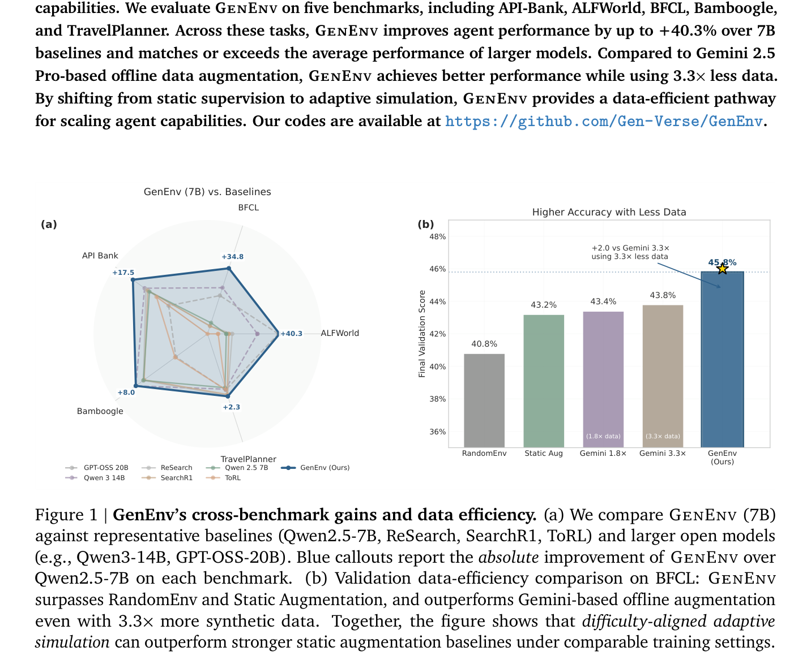
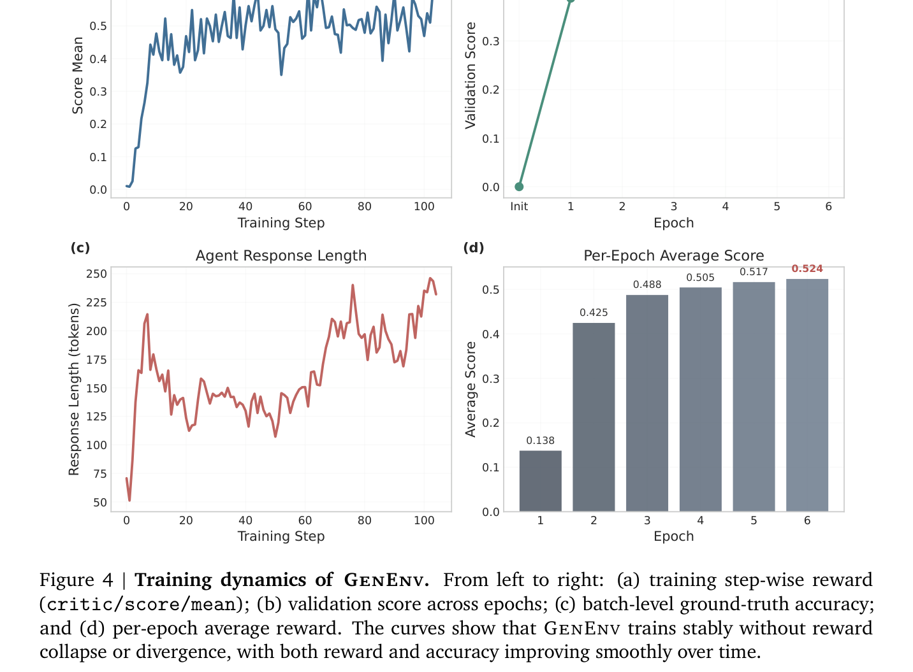
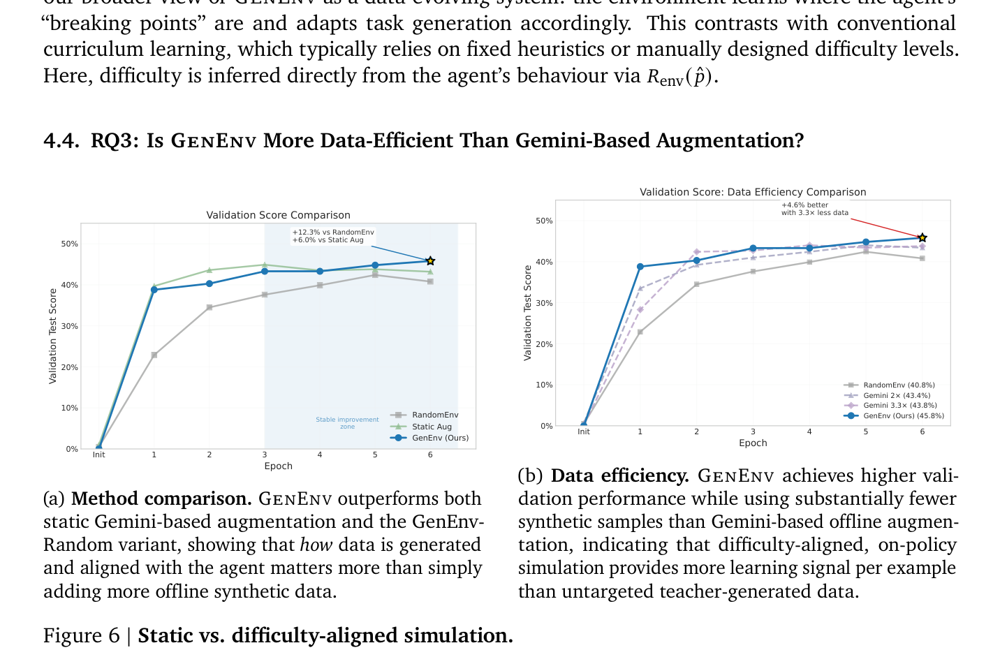
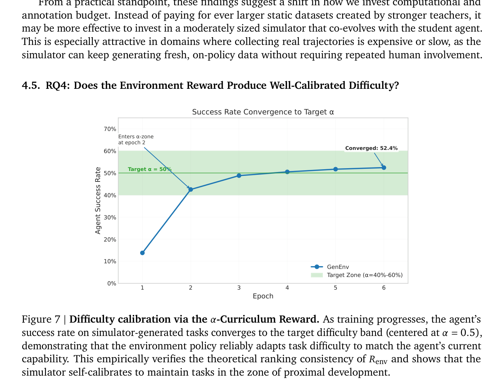
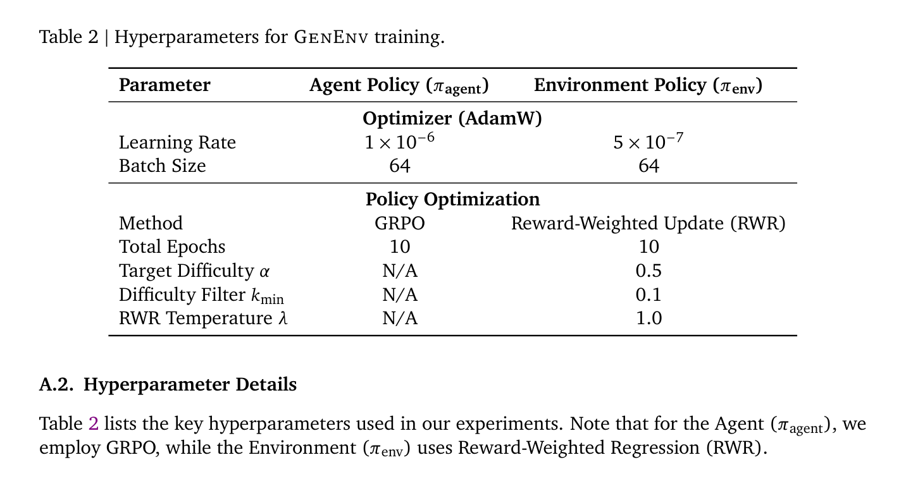

# GenEnv: Difficulty-Aligned Co-Evolution Between LLM Agents and Environment Simulators

**Authors:** Jiacheng Guo$^{1*}$, Ling Yang$^{1*\dagger}$, Peter Chen$^{2*}$, Qixin Xiao$^{3*}$, Yinjie Wang$^4$, Xinzhe Juan$^3$, Jiahao Qiu$^1$, Ke Shen, Mengdi Wang$^{1\dagger}$  
**Affiliations:** $^1$Princeton University, $^2$Columbia University, $^3$University of Michigan, $^4$University of Chicago  
**Note:** $^*$Equal Contribution, $^\dagger$Corresponding Authors  
**Date:** 24 Dec 2025  
**arXiv:** 2512.19682v2 [cs.CL]  
**Project / Code:** [github.com/Gen-Verse/GenEnv](https://github.com/Gen-Verse/GenEnv)  
**Source:** `/Users/roywangj/journey_wj/research/papers4zotero/zotero1/storage/LWGKP6MW/Guo 等 - 2025 - GenEnv Difficulty-Aligned Co-Evolution Between LLM Agents and Environment Simulators.pdf`  
**Detected source format:** selectable-text PDF (`pdf-text`)  
**Reader type:** full-paper Chinese-English Markdown reader with figure/table assets.

## Page / Section Index

| PDF pages | Section |
|---|---|
| 1–3 | Abstract; Figure 1; Figure 2; 1 Introduction |
| 3–6 | 2 GenEnv: Difficulty-Aligned Co-Evolution (2.1 Data-Evolving Paradigm; Figure 3; 2.2 Rewards: Agent vs. Environment; 2.3 Data Structures; 2.4 Two-Player Curriculum RL; Algorithm 1) |
| 6–8 | 3 Theoretical Analysis of Difficulty-Aligned GenEnv (3.1 Intermediate Difficulty Maximizes Agent Learning Signal; Assumption 1; Proposition 1; Remark 1; 3.2 Ranking Consistency of the $\alpha$-Curriculum Reward; Theorem 1) |
| 8–14 | 4 Experiments (4.1 Experimental Setup; Table 1; Figure 4; Figure 5; 4.2 RQ1 Downstream Task Performance; 4.3 RQ2 Learning Harder Tasks; 4.4 RQ3 Data-Efficiency vs. Gemini; Figure 6; 4.5 RQ4 Difficulty Calibration; Figure 7; Figure 8) |
| 14–16 | 5 Related Work (5.1 Large Language Model Agents; 5.2 Trajectory Synthesis for Agent Training; 5.3 Environment Simulation); 6 Conclusion |
| 17–20 | References |
| 21–23 | A Appendix (A.1 Proofs for Section 3: A.1.1 Proof of Proposition 1, A.1.2 Proof of Theorem 1; Table 2 Hyperparameters; A.2 Hyperparameter Details; A.3 Environment Baseline Implementation Details) |

## Terminology Ledger

| English term | 中文统一译法 | Note |
|---|---|---|
| Data-Evolving Paradigm | 数据演进范式 | 与传统在静态数据集上演化模型的“模型演进范式”相对，由模拟器动态生成契合当前能力的数据 |
| Model-Evolving Paradigm | 模型演进范式 | 传统在固定静态语料库上微调或对齐模型权重的训练方法 |
| Co-Evolution | 协同演化 | 智能体策略与环境模拟器策略相互适应、动态博弈的双向演进循环 |
| Zone of Proximal Development (ZPD) | 最近发展区 | 维果茨基心理学概念，指介于完全掌握与完全无法完成之间的适度挑战难度区间 |
| $\alpha$-Curriculum Reward | $\alpha$-课程奖励 | 基于高斯钟形曲线奖励环境模拟器生成接近目标成功率 $\alpha$ 的任务 |
| Agent Policy ($\pi_{\text{agent}}$) | 智能体策略 | 负责在环境中执行动作、调用工具并输出推理轨迹的大语言模型智能体 |
| Environment Policy ($\pi_{\text{env}}$) | 环境策略 / 环境模拟器 | 充当动态自适应课程生成器、负责合成合适难度任务的大语言模型模拟器 |
| Group Relative Policy Optimization (GRPO) | 分组相对策略优化 | 智能体策略所采用的强化学习优化算法 |
| Reward-Weighted Regression (RWR) | 奖励加权回归 | 环境模拟器用于加权微调的策略优化方法 |
| Intermediate Difficulty | 中等难度 | 任务成功率在 0.5 左右的状态，理论上可最大化随机梯度信号范数 |
| Ranking Consistency | 排序一致性 | 定理 1 所证性质，环境奖励对任务难度的偏离度排序具有指数级统计一致性 |
| On-policy trace | 同策略轨迹 | 当前智能体策略在动态任务中实时探索并产生的最新交互经验轨迹 |
| Breaking points | 临界故障点 / 难点边界 | 智能体能力刚好难以完全应对、最具学习和泛化价值的任务瓶颈 |
| Rollout | 采样展开 / 试跑交互 | 智能体与环境进行完整一轮任务交互的采样过程 |
| Tool-augmented reasoning | 工具增强推理 | 结合外部 API 工具调用与符号推理的智能体能力 |
| Embodied interaction | 具身交互 | 具身智能体在模拟环境（如 ALFWorld）中的多步感知与控制 |
| Function calling | 函数调用 | 结构化 API 参数解析与调用的智能体能力（如 BFCL 基准） |

## Abstract

> <strong>Para. 1:</strong> Training capable Large Language Model (LLM) agents is critically bottlenecked by the high cost and static nature of real-world interaction data. We address this by introducing GenEnv, a framework that establishes a difficulty-aligned co-evolutionary game between an agent and a scalable, generative environment simulator. Unlike traditional methods that evolve models on static datasets, GenEnv instantiates a Data-Evolving Paradigm: the simulator acts as a dynamic curriculum policy, continuously generating tasks specifically tailored to the agent’s “zone of proximal development”. This process is guided by a simple but effective $\alpha$-Curriculum Reward, which aligns task difficulty with the agent’s current capabilities. We evaluate GenEnv on five benchmarks, including API-Bank, ALFWorld, BFCL, Bamboogle, and TravelPlanner. Across these tasks, GenEnv improves agent performance by up to +40.3% over 7B baselines and matches or exceeds the average performance of larger models. Compared to Gemini 2.5 Pro-based offline data augmentation, GenEnv achieves better performance while using 3.3× less data. By shifting from static supervision to adaptive simulation, GenEnv provides a data-efficient pathway for scaling agent capabilities. Our codes are available at https://github.com/Gen-Verse/GenEnv.

> <strong>Para. 1[CN]:</strong> 训练高能力的大语言模型（LLM）智能体，严重受制于真实世界交互数据的高昂成本与静态特性。为此，我们提出了 GenEnv——一个在智能体与可扩展的生成式环境模拟器之间建立“难度对齐协同演化博弈”的全新框架。与传统的在静态数据集上演化模型的方法不同，GenEnv 开创了“数据演进范式（Data-Evolving Paradigm）”：模拟器充当动态课程策略，持续生成专门契合智能体“最近发展区（zone of proximal development）”的任务。该过程由一个简单却极具成效的 $\alpha$-课程奖励（$\alpha$-Curriculum Reward）引导，使任务难度与智能体的当前能力精准对齐。我们在 API-Bank、ALFWorld、BFCL、Bamboogle 和 TravelPlanner 五个主流基准上对 GenEnv 进行了全面评估。在这些任务中，GenEnv 相比 7B 基线模型将智能体性能最高提升了 +40.3%，并达到或超越了更大规模模型的平均水平。相比基于 Gemini 2.5 Pro 的离线数据增强，GenEnv 在使用数据量减少 3.3 倍的同时取得了更优表现。通过从静态监督转向自适应模拟，GenEnv 为扩展智能体能力提供了一条数据高效的路径。我们的代码开源于 https://github.com/Gen-Verse/GenEnv。

### Figure 1. GenEnv 跨基准测试收益与数据效率 (Cross-Benchmark Gains and Data Efficiency)

**Caption:** Figure 1 | GenEnv’s cross-benchmark gains and data efficiency. (a) We compare GenEnv (7B) against representative baselines (Qwen2.5-7B, ReSearch, SearchR1, ToRL) and larger open models (e.g., Qwen3-14B, GPT-OSS-20B). Blue callouts report the absolute improvement of GenEnv over Qwen2.5-7B on each benchmark. (b) Validation data-efficiency comparison on BFCL: GenEnv surpasses RandomEnv and Static Augmentation, and outperforms Gemini-based offline augmentation even with 3.3× more synthetic data. Together, the figure shows that difficulty-aligned adaptive simulation can outperform stronger static augmentation baselines under comparable training settings.

**Caption[CN]:** 图 1 | GenEnv 的跨基准收益与数据效率。(a) 我们将 GenEnv (7B) 与代表性基线模型（Qwen2.5-7B、ReSearch、SearchR1、ToRL）以及更大规模的开放权重模型（例如 Qwen3-14B、GPT-OSS-20B）进行对比。蓝色标注报告了 GenEnv 相比 Qwen2.5-7B 在各基准测试上的绝对提升幅度。(b) BFCL 上的验证数据效率对比：GenEnv 超越了 RandomEnv 与静态增强（Static Augmentation），并且即便与使用多达 3.3 倍合成数据的 Gemini 离线增强相比，仍能取得更优性能。综合表明，在相当的训练设置下，难度对齐的自适应模拟能够显著超越更强的静态增强基线。

### Figure 2. 传统训练范式与 GenEnv 协同演化学习框架对比 (Comparison between Traditional Paradigm and GenEnv)

**Caption:** Figure 2 | A comparison between the traditional training paradigm and our proposed GenEnv framework. The traditional approach (top) relies on high-cost interaction with the real world to create a static dataset, leading to inefficient training and poor generalization. GenEnv (bottom) creates a co-evolutionary loop where an Environment LLM generates adaptive tasks for the Agent LLM, enabling low-cost simulation, an adaptive curriculum, and improved efficiency.

**Caption[CN]:** 图 2 | 传统训练范式与我们提出的 GenEnv 框架对比。传统方法（上方）依赖与真实世界的高成本交互来构建静态数据集，导致训练效率低下且泛化能力较差。GenEnv（下方）建立了一个协同演化闭环：环境大语言模型为智能体大语言模型动态生成自适应任务，从而实现低成本模拟、自适应课程与更高的训练效率。

## 1 Introduction

> <strong>Para. 1:</strong> Training capable Large Language Model (LLM) agents for complex, interactive tasks like web navigation or tool use is constrained by a significant bottleneck: the high cost of data collection through real-world interaction (Ning et al., 2025; Shinn et al., 2023; Wang et al., 2025a,b; Yao et al., 2023). Each step an agent takes in a real-world environment can be slow, expensive, and difficult to parallelize. For instance, a web agent that navigates an e-commerce site may fail when a button’s label changes from “Add to Cart” to “Add to Basket” (Gur et al., 2023), but discovering such failure modes requires extensive and costly real-world exploration. This fragility highlights a key limitation in how these agents are commonly trained.

> <strong>Para. 1[CN]:</strong> 训练用于网页导航或工具使用等复杂交互任务的高能力大语言模型（LLM）智能体，面临着一个关键瓶颈：通过真实世界交互收集数据的成本极其高昂（Ning et al., 2025; Shinn et al., 2023; Wang et al., 2025a,b; Yao et al., 2023）。智能体在真实环境中采取的每一步操作都可能缓慢、昂贵且难以并行化。例如，一个在电商网站上导航的网页智能体，可能仅因按钮标签从“Add to Cart”变为“Add to Basket”而执行失败（Gur et al., 2023），但要发现此类故障模式往往需要进行广泛且高代价的真实世界探索。这种脆弱性凸显了当前智能体常规训练方式的核心局限。

> <strong>Para. 2:</strong> A central driver of this issue is the reliance on static, pre-collected datasets of expert trajectories (Levine et al., 2020; Pomerleau, 1991; Samadi et al., 2024). Such datasets, no matter how large, represent a fixed snapshot of the world and struggle to capture the wide range of variations an agent will encounter in open-ended environments (Levine et al., 2020). Increasing the dataset size alone does not resolve this limitation: the bottleneck often lies not just in data volume, but in the static and costly nature of its collection and its inability to adapt as the agent improves.

> <strong>Para. 2[CN]:</strong> 造成这一问题的核心根源在于对预先收集的专家轨迹静态数据集的过度依赖（Levine et al., 2020; Pomerleau, 1991; Samadi et al., 2024）。此类数据集无论规模多大，本质上都只是外部世界的一个固定切片，难以涵盖智能体在开放式环境中所会遇到的丰富多样的场景变体（Levine et al., 2020）。单纯增加数据集规模并不能消除这一局限：其瓶颈不仅在于数据体量，更在于数据收集的静态与高成本本质，以及它无法随着智能体能力的提升而动态适应。

> <strong>Para. 3:</strong> The challenge of insufficient and static data has led to significant interest in synthetic data generation. However, despite progress, these methods often produce a large but ultimately static corpus that can fail to adapt to the agent’s evolving requirements (Ding et al., 2024; Ye et al., 2024). This can result in inefficient training that still does not effectively target the agent’s specific weaknesses. The high cost of interaction and data collection remains a core problem.

> <strong>Para. 3[CN]:</strong> 数据不足与静态特性的双重挑战促使研究界对合成数据生成产生了浓厚兴趣。然而，尽管取得了一定进展，这些方法所产出的往往是一个体量庞大却依然静态的语料库，无法适应智能体不断演进的学习需求（Ding et al., 2024; Ye et al., 2024）。这会导致训练效率低下，且依然无法有效针对智能体的具体薄弱环节进行靶向突破。交互与数据收集的高昂成本仍旧是核心症结所在。

> <strong>Para. 4:</strong> To address this, we approach the problem differently by proposing GenEnv, a framework built on leveraging an LLM as a scalable environment simulator to reduce interaction costs. Instead of relying on slow and expensive real-world feedback, our framework trains the agent almost entirely within a simulated environment that can generate diverse and relevant training scenarios at a substantially lower cost. As illustrated in Figure 2, this contrasts with traditional methods that evolve a model on static data. In our approach, a generative environment model is trained to produce an adaptive curriculum of tasks, creating challenges tailored to the agent’s performance. This leads to our primary research question: Can an LLM-based environment simulator provide a scalable, low-cost alternative to real-world interaction for effectively training capable agents?

> <strong>Para. 4[CN]:</strong> 为此，我们转换思路提出了 GenEnv——该框架通过将大语言模型用作可扩展的环境模拟器来显著降低交互成本。我们的框架不再依赖缓慢且昂贵的真实世界反馈，而是几乎完全在一个模拟环境中训练智能体；该模拟器能以低得多的成本生成兼具多样性与相关性的训练场景。如图 2 所示，这与在静态数据上演进模型的传统方法形成了鲜明对比。在我们的方法中，生成式环境模型被专门训练用来产出自适应任务课程，根据智能体的实际表现量身定制挑战。这引出了我们的核心研究问题：基于 LLM 的环境模拟器能否提供一种可扩展、低成本的真实世界交互替代方案，以高效训练出能力强大的智能体？

> <strong>Para. 5:</strong> In this simulation-centric process, the agent learns to overcome challenges generated by the simulator. The agent’s performance provides a natural reward signal that guides the simulator’s curriculum generation, allowing both to improve in a self-contained training loop. Throughout the paper, we use “agent” and Agent Policy $\pi_{\text{agent}}$ interchangeably, and “environment simulator” and Environment Policy $\pi_{\text{env}}$ interchangeably. As previewed in Figure 1, GenEnv delivers consistent gains over strong 7B baselines across five benchmarks and achieves higher accuracy than Gemini-based offline augmentation while using less synthetic data, highlighting the advantage of difficulty-aligned, adaptive simulation over static scaling of data. Our contributions are:
>
> - **The Data-Evolving Paradigm:** We propose a co-evolutionary framework where the training data distribution adapts dynamically to the agent’s learning progress, breaking the reliance on static corpora.
> - **Difficulty-Aligned Simulation:** We introduce the $\alpha$-Curriculum Reward, a mechanism that rewards the simulator for generating tasks within the agent’s target success zone (akin to the “zone of proximal development” (Vygotsky, 1978)), ensuring an efficient automated curriculum.
> - **Data Efficiency:** On our benchmarks, GenEnv matches or surpasses Gemini 2.5 Pro-based static augmentation pipelines while using 3.3× less synthetic data, suggesting that an adaptive simulator can be more valuable than simply scaling the teacher model.

> <strong>Para. 5[CN]:</strong> 在这一以模拟为中心的过程中，智能体通过攻克模拟器生成的挑战进行学习。智能体的表现为指导模拟器的课程生成提供了天然的奖励信号，促使双方在一个自洽的闭环训练系统中共同进步。在全文中，我们将“智能体（agent）”与智能体策略 $\pi_{\text{agent}}$ 混用，并将“环境模拟器（environment simulator）”与环境策略 $\pi_{\text{env}}$ 混用。如图 1 先期展示的那样，GenEnv 在五个基准测试上相比强大的 7B 基线取得了持续稳定的性能增益，并且在使用更少合成数据的情况下实现了高于基于 Gemini 的离线数据增强的准确率，突显了难度对齐的自适应模拟相对于静态扩增数据的显著优势。我们的主要贡献包括：
>
> - **数据演进范式（The Data-Evolving Paradigm）：** 我们提出了一个协同演化框架，在该框架中训练数据分布根据智能体的学习进展动态自适应调整，打破了对静态语料库的依赖。
> - **难度对齐模拟（Difficulty-Aligned Simulation）：** 我们引入了 $\alpha$-课程奖励（$\alpha$-Curriculum Reward），该机制奖励模拟器生成落在智能体目标成功率区间内的任务（类似于维果茨基（Vygotsky, 1978）提出的“最近发展区”），从而保障高效的自动化课程学习。
> - **数据高效率（Data Efficiency）：** 在我们的测试基准中，GenEnv 在使用数据量减少 3.3 倍的情况下达到或超越了基于 Gemini 2.5 Pro 的静态数据增强流程，这表明自适应模拟器比单纯扩大教师模型规模更具价值。

## 2 GenEnv: Difficulty-Aligned Co-Evolution

> <strong>Para. 1:</strong> GenEnv views agent training as a two-player curriculum game rather than a single-player optimization problem. We maintain two policies: an Agent Policy $\pi_{\text{agent}}$ (the agent) and an Environment Policy $\pi_{\text{env}}$ (the environment simulator). Unlike standard RL where the environment is fixed, GenEnv enables both to co-evolve:
>
> - $\pi_{\text{agent}}$ learns to solve tasks sampled from the current simulator.
> - $\pi_{\text{env}}$ is rewarded for generating tasks whose difficulty is aligned with the agent’s current capability—targeting the “zone of proximal development” where learning is most effective (Vygotsky, 1978).

> <strong>Para. 1[CN]:</strong> GenEnv 将智能体训练视作一个双人课程博弈（two-player curriculum game），而非单人优化问题。我们维护两个策略：智能体策略 $\pi_{\text{agent}}$（智能体本身）与环境策略 $\pi_{\text{env}}$（环境模拟器）。与环境处于固定状态的传统强化学习不同，GenEnv 支持二者协同演化：
>
> - $\pi_{\text{agent}}$ 学习解决从当前模拟器中采样出的任务。
> - $\pi_{\text{env}}$ 则因生成难度与智能体当前能力相契合的任务而获得奖励——瞄准学习效率最高的“最近发展区（zone of proximal development）”（Vygotsky, 1978）。

### 2.1. Data-Evolving Paradigm: From Static Corpora to Adaptive Simulation

> <strong>Para. 1:</strong> Standard training minimizes a loss $\mathcal{L}(\theta)$ over a static distribution $\mathcal{D}_{\text{static}}$, where $\theta$ denotes the parameters of the agent. In contrast, GenEnv implements a Data-Evolving Paradigm. The training data $\mathcal{D}_t$ is generated on-the-fly by $\pi_{\text{env}}$, conditioned on the agent’s historical performance. This creates a feedback loop (Figure 3) where the simulator seeks not to defeat the agent, but to find its “breaking points” to facilitate learning.

> <strong>Para. 1[CN]:</strong> 标准训练是在一个静态分布 $\mathcal{D}_{\text{static}}$ 上最小化损失函数 $\mathcal{L}(\theta)$，其中 $\theta$ 表示智能体的模型参数。相比之下，GenEnv 贯彻了数据演进范式（Data-Evolving Paradigm）。训练数据 $\mathcal{D}_t$ 由 $\pi_{\text{env}}$ 根据智能体的历史表现动态实时生成。这构建了一个反馈闭环（图 3）：模拟器的目的并非击败智能体，而是寻找其“能力临界点（breaking points）”以最大化促进学习。

### Figure 3. GenEnv 协同演化训练循环 (The GenEnv Co-Evolutionary Loop)

**Caption:** Figure 3 | The GenEnv Co-Evolutionary Loop. (1) The Environment Policy generates tasks. (2) The Agent Policy attempts them. (3) The environment reward (difficulty alignment) updates the simulator, while the agent reward (task success) updates the agent.

**Caption[CN]:** 图 3 | GenEnv 协同演化循环。(1) 环境策略生成任务。(2) 智能体策略尝试解决任务。(3) 环境奖励（难度对齐）用于更新模拟器，而智能体奖励（任务成功与否）用于更新智能体。

### 2.2. Rewards: Agent vs. Environment (with explicit equation references)

#### 2.2.1. Agent Task Reward ($R_{\text{agent}}$)

> <strong>Para. 1:</strong> Each environment-generated task induces a target action/trajectory $a$ (e.g., a sequence of tool calls or a final answer), and the agent produces a prediction $a'$. We distinguish a structured action space $\mathcal{A}_{\text{struct}}$ (e.g., executable API calls) from free-form answers (e.g., natural language). For structured actions we can rely on exact execution; for unstructured ones we use a soft similarity score. We define the agent reward (used to update $\pi_{\text{agent}}$) as:

> <strong>Para. 1[CN]:</strong> 每个由环境生成的任务都会引出一个目标动作/轨迹 $a$（例如工具调用序列或最终答案），而智能体则输出一个预测结果 $a'$。我们将动作空间细分为结构化动作空间 $\mathcal{A}_{\text{struct}}$（例如可执行的 API 调用）与自由文本答案（例如自然语言）。对于结构化动作，我们依赖精确执行验证；对于非结构化动作，我们则采用软相似度评分。我们定义用于更新 $\pi_{\text{agent}}$ 的智能体奖励如下：

$$
R_{\text{agent}}(a', a) = \mathbb{I}(a' = a) \cdot \mathbb{I}(a \in \mathcal{A}_{\text{struct}}) + \text{sim}(a', a) \cdot \mathbb{I}(a \notin \mathcal{A}_{\text{struct}}), \tag{1}
$$

> <strong>Para. 2:</strong> where $\text{sim}(a', a) \in [0, 1]$ is task-dependent (e.g., normalized token-F1 or embedding similarity). In all benchmarks we scale $R_{\text{agent}}$ into $[0, 1]$.

> <strong>Para. 2[CN]:</strong> 其中 $\text{sim}(a', a) \in [0, 1]$ 取决于具体任务类型（例如归一化的 token-F1 值或嵌入向量相似度）。在所有基准测试中，我们均将 $R_{\text{agent}}$ 缩放到 $[0, 1]$ 区间。

#### 2.2.2. Environment Difficulty-Alignment Reward ($R_{\text{env}}$)

> <strong>Para. 1:</strong> The core innovation for $\pi_{\text{env}}$ is a difficulty-aligned reward that targets a success-rate band around a desired $\alpha \in (0, 1)$ (we use $\alpha = 0.5$). For each generated batch of $n$ task variations, after the agent attempts them we compute the empirical success rate:

> <strong>Para. 1[CN]:</strong> 对于环境策略 $\pi_{\text{env}}$ 而言，核心创新在于引入了以目标成功率区间 $\alpha \in (0, 1)$ 为核心的难度对齐奖励（我们在实验中设定 $\alpha = 0.5$）。对于每个包含 $n$ 个任务变体的生成批次，在智能体尝试解答后，我们计算其经验成功率：

$$
\hat{p} = \frac{k}{n}, \tag{2}
$$

> <strong>Para. 2:</strong> where $k$ is the number of successes under $R_{\text{agent}}$ (Eq. (1)). We then assign the environment reward (used to update $\pi_{\text{env}}$):

> <strong>Para. 2[CN]:</strong> 其中 $k$ 是根据公式 (1) 的智能体奖励 $R_{\text{agent}}$ 判定的成功样本数。随后，我们为环境策略赋予用于更新 $\pi_{\text{env}}$ 的环境奖励：

$$
R_{\text{env}}(\hat{p}) = \exp\left(-\beta (\hat{p} - \alpha)^2\right), \tag{3}
$$

> <strong>Para. 3:</strong> where $\beta > 0$ controls sharpness. This bell-shaped reward peaks when the agent’s performance matches $\alpha$, discouraging tasks that are already mastered ($\hat{p} \to 1$) or hopeless ($\hat{p} \to 0$). We additionally apply a difficulty filter: task batches with $|\hat{p} - \alpha| > k_{\min}$ (we use $k_{\min} = 0.1$) are excluded from environment updates to prevent overfitting to transient spikes.

> <strong>Para. 3[CN]:</strong> 其中 $\beta > 0$ 用于控制曲线的陡峭程度。这一钟形奖励函数在智能体的实际表现完全吻合目标难度 $\alpha$ 时达到峰值，从而抑制生成智能体已完全掌握（$\hat{p} \to 1$）或毫无胜算（$\hat{p} \to 0$）的任务。此外，我们还应用了一个难度过滤器：偏离度满足 $|\hat{p} - \alpha| > k_{\min}$ 的任务批次（我们在实验中设 $k_{\min} = 0.1$）将被排除在环境更新之外，以防止因瞬时波动而导致过拟合。

### 2.3. Data Structures and How New Training Data Is Produced

> <strong>Para. 1:</strong> A recurring confusion in co-evolution papers is where the training data actually comes from. We therefore make the data flow explicit.

> <strong>Para. 1[CN]:</strong> 在协同演化相关的论文中，一个屡见不鲜的困惑是：训练数据究竟来源于何处？因此，我们在此对整个数据流向进行清晰透彻的阐述。

> <strong>Para. 2:</strong> **What the environment generates.** At epoch $t$, the environment policy $\pi_{\text{env}}$ generates a task batch $\mathcal{T}_t$. Concretely, $\mathcal{T}_t$ contains $n$ task instances (often multiple variations of the same seed), where each instance includes: (i) a task prompt/context (including tool specs, constraints, and goal), (ii) an evaluation specification (e.g., executable checker / exact-match target / reference answer), and optionally (iii) structured “ground truth” target action $a$ when the benchmark provides it (e.g., tool-call arguments).

> <strong>Para. 2[CN]:</strong> **环境生成什么。** 在第 $t$ 个训练轮次（epoch），环境策略 $\pi_{\text{env}}$ 生成一个任务批次 $\mathcal{T}_t$。具体而言，$\mathcal{T}_t$ 包含 $n$ 个任务实例（通常是同一种子任务的多个变体），每个实例包括：(i) 任务提示词/上下文（包含工具规范说明、约束条件与目标）；(ii) 评估规范（例如可执行检查器、精确匹配目标或参考答案）；以及可选的 (iii) 当基准测试支持时所提供的结构化“真实标签（ground truth）”目标动作 $a$（例如工具调用参数）。

> <strong>Para. 3:</strong> **What the agent produces.** The agent interacts with each task instance and yields an interaction trace (rollout) that we denote by an element $e \in \mathcal{E}_t$. Each trace records at minimum: $e = (\text{task}, \text{trajectory}, a', r)$, where trajectory can include intermediate reasoning text and tool calls, $a'$ is the final output/action, and $r = R_{\text{agent}}(a', a)$ is computed via Eq. (1) (or its benchmark-specific instantiation).

> <strong>Para. 3[CN]:</strong> **智能体产生什么。** 智能体与每个任务实例进行交互，生成一条交互轨迹（rollout trace），记为集合 $\mathcal{E}_t$ 中的元素 $e$。每条轨迹至少记录：$e = (\text{task}, \text{trajectory}, a', r)$，其中 trajectory 可包含中间推理文本与工具调用记录，$a'$ 为最终输出/动作，而 $r = R_{\text{agent}}(a', a)$ 则通过公式 (1)（或其特定基准的实例化形式）计算得出。

> <strong>Para. 4:</strong> **Two growing datasets: one for the agent, one for the environment.** We maintain two pools that grow online:
>
> - **Agent training pool $\mathcal{D}_{\text{train}}$:** stores valid interaction traces from $\mathcal{E}_t$. A trace is “valid” if it is well-formed and evaluable for the benchmark (e.g., tool calls parse and execute; outputs follow required schema; checker runs without error). We append these valid tuples to $\mathcal{D}_{\text{train}}$ so the agent can (i) learn from fresh on-policy experiences and (ii) retain mastery of earlier curricula by continuing to sample from the accumulated pool.
> - **Environment SFT pool $\mathcal{D}_{\text{env}}$:** stores environment generations used to train $\pi_{\text{env}}$ via RWR. Each record is a supervised pair of the form $(\text{env-conditioning context} \to \text{generated task instance})$, where the conditioning context includes the seed prompt plus any summary signals (e.g., recent success statistics) that $\pi_{\text{env}}$ conditions on. We weight each record by a monotone function of the environment reward in Eq. (3) (e.g., $\propto \exp(\lambda R_{\text{env}}(\hat{p}))$, where $\lambda = 1.0$ is a temperature hyperparameter).

> <strong>Para. 4[CN]:</strong> **两个在线扩增的数据池：一个供智能体使用，一个供环境使用。** 我们维护两个在线持续增长的数据池：
>
> - **智能体训练池 $\mathcal{D}_{\text{train}}$：** 存储来自 $\mathcal{E}_t$ 的有效交互轨迹。如果一条轨迹格式规范且在对应基准上可被评估（例如工具调用能够正确解析并执行、输出符合规定模式、检查器运行无报错），则判定为“有效”。我们将这些有效元组追加至 $\mathcal{D}_{\text{train}}$ 中，使智能体既能 (i) 从最新的同策略（on-policy）经验中学习，又能 (ii) 通过从累积数据池中持续采样来巩固对先前课程的掌握。
> - **环境 SFT 训练池 $\mathcal{D}_{\text{env}}$：** 存储用于通过奖励加权回归（RWR）训练 $\pi_{\text{env}}$ 的环境生成数据。每条记录都是形式为 $(\text{环境条件上下文} \to \text{生成的任务实例})$ 的监督数据对，其中条件上下文包含种子提示词以及 $\pi_{\text{env}}$ 所依赖的任何汇总信号（例如近期的成功率统计）。我们根据公式 (3) 中环境奖励的单调递增函数为每条记录赋予权重（例如 $\propto \exp(\lambda R_{\text{env}}(\hat{p}))$，其中 $\lambda = 1.0$ 为温度超参数）。

> <strong>Para. 5:</strong> **How this produces a “data-evolving” training set.** At every epoch, both $\mathcal{T}_t$ and $\mathcal{E}_t$ are newly generated; thus $\mathcal{D}_{\text{train}}$ is not a fixed offline corpus but an evolving mixture of (a) base data, (b) previously collected valid traces, and (c) newly collected on-policy traces. Meanwhile, $\mathcal{D}_{\text{env}}$ evolves toward generating tasks whose empirical success rate stays near $\alpha$ (Eq. (3)), which in turn shifts the difficulty distribution of future $\mathcal{T}_{t+1}$. This closes the loop: new data is produced as a byproduct of interaction, and is then explicitly aggregated into training pools for subsequent updates.

> <strong>Para. 5[CN]:</strong> **这如何造就一个“数据演进”的训练集。** 在每个轮次中，$\mathcal{T}_t$ 与 $\mathcal{E}_t$ 均为全新生成；因此 $\mathcal{D}_{\text{train}}$ 绝非固定的离线语料库，而是由 (a) 基础数据、(b) 之前收集的有效轨迹，以及 (c) 最新收集的同策略轨迹所构成的动态演进混合体。与此同时，$\mathcal{D}_{\text{env}}$ 持续演进以生成经验成功率维持在 $\alpha$ 附近（公式 (3)）的任务，这反过来又会推移未来任务批次 $\mathcal{T}_{t+1}$ 的难度分布。由此形成了完整闭环：新数据作为交互的副产物不断生成，并被显式汇聚至训练池中，用于驱动后续的模型迭代更新。

### 2.4. Two-Player Curriculum RL: Optimization Loop

> <strong>Para. 1:</strong> **Player 1 Update (Agent).** The Agent Policy $\pi_{\text{agent}}$ is updated to maximize $\mathbb{E}[R_{\text{agent}}]$ (Eq. (1)). In our experiments, we instantiate this using Group Relative Policy Optimization (GRPO) (Shao et al., 2024).

> <strong>Para. 1[CN]:</strong> **玩家 1 更新（智能体）。** 智能体策略 $\pi_{\text{agent}}$ 通过最大化期望奖励 $\mathbb{E}[R_{\text{agent}}]$（公式 (1)）进行更新。在我们的实验中，我们使用分组相对策略优化（GRPO）（Shao et al., 2024）来具体实现这一过程。

> <strong>Para. 2:</strong> **Player 2 Update (Environment).** The Environment Policy $\pi_{\text{env}}$ is updated to maximize $\mathbb{E}[R_{\text{env}}]$ (Eq. (3)). We implement this via Reward-Weighted Regression (RWR): from each environment-generated batch, we compute $\hat{p}$ (Eq. (2)) from agent rollouts and assign $R_{\text{env}}(\hat{p})$. We then construct a weighted SFT set of environment generations and fine-tune $\pi_{\text{env}}$ toward higher-reward generations. For stability, we regularize updates with a KL penalty to the initial simulator and cap per-step updates by a maximum KL threshold.

> <strong>Para. 2[CN]:</strong> **玩家 2 更新（环境）。** 环境策略 $\pi_{\text{env}}$ 通过最大化期望奖励 $\mathbb{E}[R_{\text{env}}]$（公式 (3)）进行更新。我们采用奖励加权回归（RWR）来实现这一点：对于每个由环境生成的批次，我们根据智能体交互的展开结果计算 $\hat{p}$（公式 (2)），并赋予对应的环境奖励 $R_{	ext{env}}(\hat{p})$。接着，我们构建一个加权的环境监督微调（SFT）集合，并朝向高奖励生成样本对 $\pi_{\text{env}}$ 进行微调。为了保持训练稳定性，我们通过引入相对于初始模拟器的 KL 散度惩罚进行正则化，并设定每步更新的最大 KL 阈值截断。

> <strong>Para. 3:</strong> **Algorithm 1: GenEnv Co-Evolutionary Loop (with explicit equation references)**
>
> - **Initialize:** Agent $\pi_{\text{agent}}$, Environment $\pi_{\text{env}}$, Agent pool $\mathcal{D}_{\text{train}}$, Env pool $\mathcal{D}_{\text{env}}$.
> - **for** epoch $t = 1, \dots, T$ **do**
>   - $\triangleright$ *Phase 1: Online Generation & Interaction*
>   - Environment generates a task batch $\mathcal{T}_t \sim \pi_{\text{env}}(\cdot)$.
>   - Agent $\pi_{	ext{agent}}$ rolls out on $\mathcal{T}_t$ to obtain traces $\mathcal{E}_t$ and per-trajectory agent rewards $R_{\text{agent}}$ via Eq. (1).
>   - Compute batch success $\hat{p}$ via Eq. (2) and assign environment reward $R_{\text{env}}(\hat{p})$ via Eq. (3).
>   - $\triangleright$ *Phase 2: Dual Update (Two Players, Two Objectives)*
>   - Update agent $\pi_{\text{agent}}$ via GRPO to maximize $\mathbb{E}[R_{\text{agent}}]$ (Eq. (1)).
>   - Filter out batches with $|\hat{p} - \alpha| > k_{\min}$ for environment updates.
>   - Build weighted env SFT set $\tilde{\mathcal{D}}_t^{\text{env}}$ from $\mathcal{T}_t$ with weights $\propto \exp(\lambda R_{\text{env}}(\hat{p}))$ (Eq. (3)).
>   - Update environment $\pi_{\text{env}}$ via RWR on $\tilde{\mathcal{D}}_t^{\text{env}}$ to maximize $\mathbb{E}[R_{\text{env}}]$ (Eq. (3)).
>   - $\triangleright$ *Phase 3: Aggregation (How New Data Enters Training)*
>   - Extract valid traces from $\mathcal{E}_t$ (e.g., parseable/executable/checker-passed) and append to agent pool: $\mathcal{D}_{\text{train}} \leftarrow \mathcal{D}_{\text{train}} \cup \text{Valid}(\mathcal{E}_t)$.
>   - Append weighted environment generations to env pool: $\mathcal{D}_{\text{env}} \leftarrow \mathcal{D}_{\text{env}} \cup \tilde{\mathcal{D}}_t^{\text{env}}$.
> - **end for**

> <strong>Para. 3[CN]:</strong> **算法 1：GenEnv 协同演化循环（含显式公式索引）**
>
> - **初始化：** 智能体策略 $\pi_{\text{agent}}$、环境策略 $\pi_{\text{env}}$、智能体数据池 $\mathcal{D}_{\text{train}}$、环境数据池 $\mathcal{D}_{\text{env}}$。
> - **for** 轮次 $t = 1, \dots, T$ **do**
>   - $\triangleright$ *阶段 1：在线生成与交互*
>   - 环境策略生成任务批次 $\mathcal{T}_t \sim \pi_{\text{env}}(\cdot)$。
>   - 智能体 $\pi_{\text{agent}}$ 在 $\mathcal{T}_t$ 上展开交互，获取轨迹集 $\mathcal{E}_t$，并根据公式 (1) 计算单条轨迹的智能体奖励 $R_{\text{agent}}$。
>   - 根据公式 (2) 计算批次成功率 $\hat{p}$，并根据公式 (3) 赋予环境奖励 $R_{\text{env}}(\hat{p})$。
>   - $\triangleright$ *阶段 2：双策略更新（双博弈玩家，双重目标）*
>   - 采用 GRPO 算法更新智能体策略 $\pi_{\text{agent}}$，以最大化 $\mathbb{E}[R_{\text{agent}}]$（公式 (1)）。
>   - 过滤掉偏离度满足 $|\hat{p} - \alpha| > k_{\min}$ 的批次，不参与环境更新。
>   - 基于 $\mathcal{T}_t$ 构建加权环境 SFT 数据集 $\tilde{\mathcal{D}}_t^{\text{env}}$，其样本权重 $\propto \exp(\lambda R_{\text{env}}(\hat{p}))$（公式 (3)）。
>   - 在 $\tilde{\mathcal{D}}_t^{\text{env}}$ 上通过 RWR 算法微调更新环境策略 $\pi_{\text{env}}$，以最大化 $\mathbb{E}[R_{\text{env}}]$（公式 (3)）。
>   - $\triangleright$ *阶段 3：数据汇聚（新数据如何注入后续训练）*
>   - 从 $\mathcal{E}_t$ 中提取有效轨迹（例如可解析、可执行且通过验证检查器），并追加至智能体数据池：$\mathcal{D}_{\text{train}} \leftarrow \mathcal{D}_{\text{train}} \cup \text{Valid}(\mathcal{E}_t)$。
>   - 将加权后的环境生成数据追加至环境数据池：$\mathcal{D}_{\text{env}} \leftarrow \mathcal{D}_{\text{env}} \cup \tilde{\mathcal{D}}_t^{\text{env}}$。
> - **end for**

## 3 Theoretical Analysis of Difficulty-Aligned GenEnv

> <strong>Para. 1:</strong> In this section we provide a simple theoretical analysis of the difficulty-aligned co-evolution mechanism in GenEnv. Our goal is not to fully characterize the dynamics of large LLMs, but to clarify why (1) tasks whose success rate is close to the target band $\alpha$ carry the strongest learning signal for the Agent Policy $\pi_{\text{agent}}$, and (2) the $\alpha$-Curriculum Reward $R_{\text{env}}$ provides a statistically consistent signal for the Environment Policy $\pi_{\text{env}}$ to rank task types by how well their difficulty matches the current agent.

> <strong>Para. 1[CN]:</strong> 在本节中，我们对 GenEnv 中的难度对齐协同演化机制提供一个简明的理论分析。我们的目的并非全面刻画大型大语言模型的复杂动力学，而是阐明以下两点：(1) 为何成功率接近目标区间 $\alpha$ 的任务能够为智能体策略 $\pi_{\text{agent}}$ 提供最强烈的学习信号；以及 (2) 为何 $\alpha$-课程奖励 $R_{\text{env}}$ 能为环境策略 $\pi_{\text{env}}$ 提供一个具有统计一致性的信号，用于依据难度与当前智能体能力的吻合程度对不同任务类型进行准确排序。

### 3.1. Intermediate Difficulty Maximizes Agent Learning Signal

> <strong>Para. 1:</strong> We first consider a stylized bandit setting in which the Agent Policy $\pi_{\text{agent}}$ interacts with a single environment-generated task type $\tau$ (e.g., a family of API-calling problems of similar difficulty). The outcome of each attempt is a scalar reward $r \in \{0, 1\}$, where $r = 1$ denotes success on the task and $r = 0$ denotes failure. (Footnote 1: The analysis extends to $R_{\text{agent}} \in [0, 1]$ by rescaling; we use the binary case for clarity.) For a fixed Agent Policy parameterization $\theta$, let $p(\tau) = \Pr(r = 1 \mid \tau, \theta)$ denote the success probability on task type $\tau$. The Agent Policy is updated with a REINFORCE-style estimator:

> <strong>Para. 1[CN]:</strong> 我们首先考虑一个程式化的老虎机（bandit）设置，其中智能体策略 $\pi_{\text{agent}}$ 与环境生成的单一任务类型 $\tau$ 进行交互（例如具有相似难度的一族 API 调用问题）。每次尝试的结果是一个标量奖励 $r \in \{0, 1\}$，其中 $r = 1$ 表示任务成功，$r = 0$ 表示失败。（脚注 1：该分析可通过重缩放推广到 $R_{\text{agent}} \in [0, 1]$ 的情形；为简洁清晰，此处采用二值化情形）。对于固定的智能体策略参数化表示 $\theta$，记 $p(\tau) = \Pr(r = 1 \mid \tau, \theta)$ 为在任务类型 $\tau$ 上的成功概率。智能体策略采用类 REINFORCE 估计器进行更新：

$$
g(\tau, r) = (r - b(\tau)) \nabla_\theta \log \pi_\theta(a \mid \tau), \tag{4}
$$

> <strong>Para. 2:</strong> where $a$ is the sampled action (e.g., a rollout trajectory of tool-calling sequence) and $b(\tau)$ is a baseline (e.g., an estimate of the expected reward on $\tau$). The quantity $\mathbb{E}[\|g(\tau, r)\|^2]$ can be viewed as measuring how strong the stochastic gradient signal is for this task type.

> <strong>Para. 2[CN]:</strong> 其中 $a$ 是采样的动作（例如工具调用序列的展开轨迹），$b(\tau)$ 是基线值（例如任务 $\tau$ 上期望奖励的估计值）。物理量 $\mathbb{E}[\|g(\tau, r)\|^2]$ 可被视为衡量该任务类型所提供的随机梯度信号强度的指标。

> <strong>Para. 3:</strong> Given the trust-region KL constraint and the gradient-clipping bias in GRPO-style policy updates, it is expected that the squared norm of the score function remains within a trust-region bound. This behavior has been discussed in recent analyses of one-step policy updates (e.g., Chen et al. (2025c, Theorem 3.2)) as well as in the literature on trust-region policy optimization (Schulman et al., 2015). Accordingly, we establish our theoretical analysis under the reasonable assumption that the squared norm of the score function $\nabla_\theta \log \pi_\theta(a \mid \tau)$ does not vary too dramatically when conditioned on the binary outcome $r$.

> <strong>Para. 3[CN]:</strong> 鉴于类 GRPO 策略更新中存在的置信域 KL 约束以及梯度截断（clipping）机制，得分函数（score function）的平方范数预计将保持在置信域边界以内。这一现象在单步策略更新的近期分析文献中（例如 Chen et al. (2025c, Theorem 3.2)）以及置信域策略优化文献中（Schulman et al., 2015）均有讨论。因此，我们在一个合理的假设下展开理论分析，即在给定二值结果 $r$ 的条件下，得分函数 $\nabla_\theta \log \pi_\theta(a \mid \tau)$ 的平方范数不会发生剧烈变化。

> <strong>Para. 4:</strong> **Assumption 1 (Bounded score variation).** For a fixed task type $\tau$, there exist constants $0 < c_{\min} \le c_{\max} < \infty$ such that $c_{\min} \le \mathbb{E}\left[\|\nabla_\theta \log \pi_\theta(a \mid \tau)\|^2 \;\middle|\; r\right] \le c_{\max}$ for both $r = 0$ and $r = 1$.

> <strong>Para. 4[CN]:</strong> **假设 1（有界得分方差，Bounded score variation）。** 对于固定的任务类型 $\tau$，存在常数 $0 < c_{\min} \le c_{\max} < \infty$，使得对于 $r = 0$ 和 $r = 1$ 均满足：$c_{\min} \le \mathbb{E}\left[\|\nabla_\theta \log \pi_\theta(a \mid \tau)\|^2 \;\middle|\; r\right] \le c_{\max}$。

> <strong>Para. 5:</strong> We take the baseline to be the on-task expected reward, $b(\tau) = \mathbb{E}[r \mid \tau] = p(\tau)$, which is the variance minimizer in the standard REINFORCE analysis. Under these conditions we obtain the following result.

> <strong>Para. 5[CN]:</strong> 我们将基线设为该任务上的期望奖励，即 $b(\tau) = \mathbb{E}[r \mid \tau] = p(\tau)$，这在经典 REINFORCE 分析中是方差最小化器。在上述条件下，我们得到如下命题结果。

> <strong>Para. 6:</strong> **Proposition 1 (Intermediate difficulty maximizes gradient signal).** Suppose Assumption 1 holds and the baseline is chosen as $b(\tau) = p(\tau)$. Then there exist positive constants $C_{\min}$ and $C_{\max}$, independent of $p(\tau)$, such that:

> <strong>Para. 6[CN]:</strong> **命题 1（中等难度最大化梯度信号，Intermediate difficulty maximizes gradient signal）。** 假设假设 1 成立，且基线选择为 $b(\tau) = p(\tau)$。则存在与 $p(\tau)$ 无关的正常数 $C_{\min}$ 和 $C_{\max}$，满足：

$$
C_{\min} p(\tau)(1 - p(\tau)) \le \mathbb{E}[\|g(\tau, r)\|^2] \le C_{\max} p(\tau)(1 - p(\tau)). \tag{5}
$$

> <strong>Para. 7:</strong> In particular, up to constant factors, the expected squared gradient norm is proportional to $p(\tau)(1 - p(\tau))$, which is maximized when $p(\tau) = 1/2$, i.e., for tasks of intermediate difficulty.

> <strong>Para. 7[CN]:</strong> 特别地，在相差常数因子的意义下，期望平方梯度范数正比于 $p(\tau)(1 - p(\tau))$；该项在 $p(\tau) = 1/2$ 时达到最大值，即对应于具有中等难度的任务。

> <strong>Para. 8:</strong> **Proof sketch.** With $r \in \{0, 1\}$ and $b(\tau) = p(\tau)$, we have $\mathbb{E}[(r - p(\tau))^2 \mid \tau] = \text{Var}(r \mid \tau) := p(\tau)(1 - p(\tau))$. Using the law of total expectation and Assumption 1, we can factor out the variation coming from the score function up to multiplicative constants, which yields Equation (5). The function $p(1 - p)$ is a concave quadratic on $[0, 1]$ with a unique maximum at $p = 1/2$. A full proof is given in Appendix A.1. $\square$

> <strong>Para. 8[CN]:</strong> **证明概要。** 当 $r \in \{0, 1\}$ 且 $b(\tau) = p(\tau)$ 时，我们有 $\mathbb{E}[(r - p(\tau))^2 \mid \tau] = \text{Var}(r \mid \tau) := p(\tau)(1 - p(\tau))$。利用全期望公式和假设 1，我们可以在相差乘性常数的范围内将得分函数带来的方差变化提出来，从而得出公式 (5)。函数 $p(1 - p)$ 在 $[0, 1]$ 上是严格凹的二次函数，并在 $p = 1/2$ 处取得唯一极大值。完整证明参见附录 A.1。$\square$

> <strong>Para. 9:</strong> **Remark 1 ($\frac{1}{2}$-Curriculum reward).** Considering the case that $\alpha = \frac{1}{2}$, we have the identity $p(1 - p) = \frac{1}{4} - (p - \frac{1}{2})^2$. Thus, maximizing the variance term $p(1 - p)$ is exactly equivalent to minimizing the squared distance to the target success rate $\alpha = \frac{1}{2}$. In GenEnv, the Environment Policy does not observe the true success probability $p(\tau)$ but only an empirical estimate $\hat{p}(\tau)$ from a finite number of rollouts. The $\alpha$-Curriculum Reward takes the form:

> <strong>Para. 9[CN]:</strong> **评注 1（$\frac{1}{2}$-课程奖励，$\frac{1}{2}$-Curriculum reward）。** 考虑 $\alpha = \frac{1}{2}$ 的情形，我们具有恒等式 $p(1 - p) = \frac{1}{4} - (p - \frac{1}{2})^2$。因此，最大化方差项 $p(1 - p)$ 完全等价于最小化到目标成功率 $\alpha = \frac{1}{2}$ 的平方距离。在 GenEnv 中，环境策略无法直接观测到真实的成功概率 $p(\tau)$，而只能观测到有限次交互展开所得的经验估计值 $\hat{p}(\tau)$。$\alpha$-课程奖励采用如下形式：

$$
R_{\text{env}}(\hat{p}(\tau)) = \exp\left(-\beta (\hat{p}(\tau) - \alpha)^2\right), \tag{6}
$$

> <strong>Para. 10:</strong> which is a monotone transformation of $-(\hat{p}(\tau) - \alpha)^2$ and therefore encourages the simulator to propose tasks whose empirical success rate stays close to $\alpha$. Proposition 1 then suggests that, in expectation, this aligns the simulator with task types that provide the strongest learning signal for $\pi_{\text{agent}}$.

> <strong>Para. 10[CN]:</strong> 该式是 $-(\hat{p}(\tau) - \alpha)^2$ 的单调递增变换，因而促使模拟器提出那些经验成功率保持在接近 $\alpha$ 水平的任务。命题 1 进一步表明，在期望意义下，这使模拟器聚焦于能够为 $\pi_{\text{agent}}$ 提供最强学习信号的任务类型。

### 3.2. Ranking Consistency of the $\alpha$-Curriculum Reward

> <strong>Para. 1:</strong> We next show that, despite relying on noisy empirical success rates, the $\alpha$-Curriculum Reward provides a statistically consistent signal for ranking task types by how well their difficulty matches the target band. The argument is based on standard concentration inequalities.

> <strong>Para. 1[CN]:</strong> 接下来我们将证明：尽管依赖存在噪声的经验成功率，$\alpha$-课程奖励依然能够提供一个统计一致的信号，用于依据各任务类型的难度与目标区间的匹配程度进行准确排序。该论证基于经典的集中不等式。

> <strong>Para. 2:</strong> Consider two task types $\tau_1$ and $\tau_2$. For a fixed Agent Policy $\pi_{\text{agent}}$, let $p_i = p(\tau_i)$ denote the true success probability on $\tau_i$, and define their distances to the target band $\alpha$ as:

> <strong>Para. 2[CN]:</strong> 考虑两种任务类型 $\tau_1$ 和 $\tau_2$。对于固定的智能体策略 $\pi_{\text{agent}}$，设 $p_i = p(\tau_i)$ 表示在 $\tau_i$ 上的真实成功概率，并将其与目标区间 $\alpha$ 的距离定义为：

$$
\Delta_i = |p_i - \alpha|, \quad i \in \{1, 2\}. \tag{7}
$$

> <strong>Para. 3:</strong> Without loss of generality, assume $\Delta_1 < \Delta_2$, i.e., $\tau_1$ is closer to the target difficulty than $\tau_2$. For each $\tau_i$ we run $n_i$ independent rollouts and compute the empirical success rate $\hat{p}_i = k_i / n_i$, where $k_i$ is the number of successes. The Environment Policy receives the reward:

> <strong>Para. 3[CN]:</strong> 不失一般性，假设 $\Delta_1 < \Delta_2$，即任务 $\tau_1$ 比 $\tau_2$ 更贴近目标难度。对于每个 $\tau_i$，我们进行 $n_i$ 次独立的交互展开，并计算经验成功率 $\hat{p}_i = k_i / n_i$，其中 $k_i$ 为成功次数。环境策略获得的环境奖励为：

$$
R_{\text{env}}(\hat{p}_i) = \exp\left(-\beta(\hat{p}_i - \alpha)^2\right). \tag{8}
$$

> <strong>Para. 4:</strong> Since the exponential is monotone, ranking tasks by $R_{\text{env}}$ is equivalent to ranking them by their squared distance $(\hat{p}_i - \alpha)^2$ to the target band. The following theorem shows that the mis-ranking probability decays exponentially in the minimum number of rollouts.

> <strong>Para. 4[CN]:</strong> 由于指数函数是严格单调的，依据 $R_{\text{env}}$ 对任务进行排序完全等价于依据其与目标区间的平方距离 $(\hat{p}_i - \alpha)^2$ 进行排序。下面的定理表明，排序错误（mis-ranking）的概率随最小展开次数呈指数衰减。

> <strong>Para. 5:</strong> **Theorem 1 (Ranking consistency of $R_{\text{env}}$).** Let $n = \min\{n_1, n_2\}$ and $\Delta_1 < \Delta_2$ as above. Define $\delta = (\Delta_2 - \Delta_1)/3 > 0$. Then:

> <strong>Para. 5[CN]:</strong> **定理 1（$R_{\text{env}}$ 的排序一致性，Ranking consistency of $R_{\text{env}}$）。** 设 $n = \min\{n_1, n_2\}$ 且 $\Delta_1 < \Delta_2$ 如前所述。定义 $\delta = (\Delta_2 - \Delta_1)/3 > 0$。则有：

$$
\Pr\left(R_{\text{env}}(\hat{p}_1) \le R_{\text{env}}(\hat{p}_2)\right) \le 4 \exp\left(-\frac{2}{9}(\Delta_2 - \Delta_1)^2 n\right). \tag{9}
$$

> <strong>Para. 6:</strong> In particular, as $n \to \infty$ the reward ranking is consistent: tasks whose true success probability lies closer to the target band $\alpha$ receive higher $\alpha$-Curriculum Reward with probability approaching 1 at an exponential rate.

> <strong>Para. 6[CN]:</strong> 特别地，当 $n \to \infty$ 时，奖励排序是一致的：真实成功概率更接近目标区间 $\alpha$ 的任务，将以指数级速率趋近于 1 的概率获得更高的 $\alpha$-课程奖励。

> <strong>Para. 7:</strong> **Proof sketch.** Because the exponential is monotone, $R_{\text{env}}(\hat{p}_1) \le R_{\text{env}}(\hat{p}_2)$ is equivalent to $|\hat{p}_1 - \alpha| \ge |\hat{p}_2 - \alpha|$. We show that if both empirical estimates $\hat{p}_i$ lie within $\delta$ of their true means $p_i$, then necessarily $|\hat{p}_1 - \alpha| < |\hat{p}_2 - \alpha|$ and hence $R_{\text{env}}(\hat{p}_1) > R_{\text{env}}(\hat{p}_2)$. Thus a mis-ranking can only occur when at least one empirical mean deviates from its expectation by more than $\delta$, which can be bounded using Hoeffding’s inequality for Bernoulli random variables. A detailed proof is provided in Appendix A.1. $\square$

> <strong>Para. 7[CN]:</strong> **证明概要。** 鉴于指数函数的单调性，$R_{\text{env}}(\hat{p}_1) \le R_{\text{env}}(\hat{p}_2)$ 等价于 $|\hat{p}_1 - \alpha| \ge |\hat{p}_2 - \alpha|$。我们证明：只要两个经验估计值 $\hat{p}_i$ 与其各自真实均值 $p_i$ 的偏差均在 $\delta$ 之内，就必然有 $|\hat{p}_1 - \alpha| < |\hat{p}_2 - \alpha|$，从而推导得出 $R_{\text{env}}(\hat{p}_1) > R_{\text{env}}(\hat{p}_2)$。因此，仅当至少有一个经验均值与其期望值的偏离程度超过 $\delta$ 时，才可能发生排序错误；这可以通过伯努利随机变量的霍夫丁不等式（Hoeffding’s inequality）给出有界控制。详细证明参见附录 A.1。$\square$

> <strong>Para. 8:</strong> **Implications for GenEnv.** Theorem 1 shows that, even though the Environment Policy only observes noisy empirical success rates $\hat{p}_i$ derived from a finite number of rollouts, the $\alpha$-Curriculum Reward is a statistically consistent proxy for task difficulty. As we increase the rollout budget per task type, the environment LLM can more reliably identify and up-weight task families whose difficulty lies in the target zone of proximal development. This provides a formal justification for the empirical convergence behaviour observed in Figure 7, where the agent’s success rate on simulated tasks concentrates around a band centered at $\alpha = 0.5$. Together, Proposition 1 and Theorem 1 clarify why aligning the simulator with an intermediate success rate both maximizes learning signal for the agent and yields a stable, difficulty-calibrated curriculum.

> <strong>Para. 8[CN]:</strong> **对 GenEnv 的启示。** 定理 1 表明，尽管环境策略只能观测到来自有限次交互展开所估算的带噪经验成功率 $\hat{p}_i$，$\alpha$-课程奖励依然是任务难度的一个统计一致性代理指标。随着我们增加每种任务类型的展开预算，环境 LLM 能够越来越可靠地识别并提升那些难度落在目标“最近发展区”内的任务族的采样权重。这为图 7 中观察到的经验收敛行为提供了严谨的形式化依据——在该图中，智能体在模拟任务上的成功率紧密集中在以 $\alpha = 0.5$ 为中心的区间内。综合来看，命题 1 与定理 1 深刻阐明了为何将模拟器与中等成功率对齐，既能够最大化智能体的学习信号，又能够产出稳定、校准良好的难度课程。

## 4 Experiments

### 4.1. Experimental Setup

> <strong>Para. 1:</strong> **Backbone Models.** Unless otherwise specified, all 7B agents and simulators are initialized from Qwen2.5-7B-Instruct (Yang and Qwen Team, 2024). For large-scale baselines in Table 1, we include Llama 3.1 models (Grattafiori et al., 2024), GPT-OSS open-weight models (OpenAI, 2025), and Qwen3 models (Yang and Qwen Team, 2025). These models are evaluated using the same tool-calling interface and prompt templates as our 7B baselines for fairness.

> <strong>Para. 1[CN]:</strong> **骨干模型（Backbone Models）。** 除非另有说明，所有 7B 智能体与模拟器均初始化自 Qwen2.5-7B-Instruct（Yang and Qwen Team, 2024）。对于表 1 中的大规模基线模型，我们纳入了 Llama 3.1 系列模型（Grattafiori et al., 2024）、GPT-OSS 开放权重模型（OpenAI, 2025）以及 Qwen3 系列模型（Yang and Qwen Team, 2025）。为了确保公平对比，这些模型均采用与我们的 7B 基线相同的工具调用接口和提示词模板进行评估。

> <strong>Para. 2:</strong> **Benchmarks.** We evaluate across 5 diverse benchmarks that span tool use, embodied interaction, and real-world planning. API-Bank (Li et al., 2023) measures function-calling and tool-augmented reasoning, and Bamboogle is a compositional multi-hop QA benchmark built on top of the framework from Press et al. (2023); for both, we follow the evaluation protocols from ToRL (Li et al., 2025b). ALFWorld (Shridhar et al., 2021) aligns textual instructions with embodied environments; we utilize the official validation set, where multi-turn tasks are decomposed into single steps for evaluation. BFCL follows the Berkeley Function-Calling Leaderboard setup (Patil et al., 2025); specifically, we evaluate on the long-context subset treating each turn independently. TravelPlanner (Xie et al., 2024) captures end-to-end planning and tool use in realistic travel scenarios; we report the average of four metrics: CS Micro (%), CS Macro (%), HD Micro (%), and HD Macro (%). The Average column in Table 1 is the unweighted mean of these per-benchmark success metrics.

> <strong>Para. 2[CN]:</strong> **基准测试（Benchmarks）。** 我们在涵盖工具使用、具身交互和现实世界规划的 5 个多样化基准上进行综合评估。API-Bank（Li et al., 2023）用于评测函数调用和工具增强推理能力，Bamboogle 是建立在 Press et al. (2023) 框架之上的组合式多跳问答基准；对于这两项测试，我们遵循 ToRL（Li et al., 2025b）的评估协议。ALFWorld（Shridhar et al., 2021）将文本指令与具身环境对齐；我们使用官方验证集，并将多轮任务分解为单步执行以进行评测。BFCL 遵循伯克利函数调用排行榜（Berkeley Function-Calling Leaderboard）的评测设置（Patil et al., 2025）；具体而言，我们在长上下文子集上进行评估，并将每一轮交互独立处理。TravelPlanner（Xie et al., 2024）衡量真实旅行场景下的端到端规划和工具使用能力；我们汇报四项指标的平均值：CS Micro (%)、CS Macro (%)、HD Micro (%) 以及 HD Macro (%)。表 1 中的“Average”列是这些分项基准成功率指标的无加权算术平均值。

> <strong>Para. 3:</strong> **Baselines & Variants.** We compare against standard instructed models (Qwen2.5-7B-Instruct) and specialized search-and-planning agents, including ReSearch, SearchR1, and ToRL (Jin et al., 2025; Li et al., 2025b). These methods represent strong model-evolving pipelines that either improve search policies or alignment rewards on largely static datasets. To strictly evaluate our Data-Evolving contribution, we define:
>
> - **GenEnv-Random:** The simulator generates new tasks every epoch but is not trained via $R_{\text{env}}$. This isolates the effect of dynamic data vs. aligned curriculum.
> - **GenEnv-Static:** The simulator generates a large batch of synthetic data once before training.
> - **Gemini-Offline (2x / 3.3x):** High-quality synthetic data generated offline by Gemini 2.5 Pro (approx. 1.76x and 3.27x the training set size). This represents a strong “teacher-distillation” baseline.

> <strong>Para. 3[CN]:</strong> **基线与变体（Baselines & Variants）。** 我们与标准指令微调模型（Qwen2.5-7B-Instruct）以及专门的搜索与规划智能体进行对比，包括 ReSearch、SearchR1 和 ToRL（Jin et al., 2025; Li et al., 2025b）。这些方法代表了强大的“模型演进”流程，通常在基本固定的数据集上改进搜索策略或对齐奖励。为了严格隔离并评估我们提出的“数据演进”贡献，我们定义了以下变体：
>
> - **GenEnv-Random：** 模拟器在每个轮次动态生成新任务，但不对其通过 $R_{\text{env}}$ 进行训练。该设置用于隔离动态数据与对齐课程各自的作用。
> - **GenEnv-Static：** 模拟器在训练开始前一次性预先生成一大批合成数据。
> - **Gemini-Offline (2x / 3.3x)：** 由 Gemini 2.5 Pro 离线生成的高质量合成数据（分别约为原始训练集规模的 1.76 倍和 3.27 倍）。这代表了一个极强的“教师蒸馏（teacher-distillation）”基线。

> <strong>Para. 4:</strong> **Training Configuration.** For the Agent Policy ($\pi_{\text{agent}}$), we train for 10 epochs using GRPO with batch size 64 and maximum sequence length 9,000 tokens (prompt + response). The Environment Policy ($\pi_{\text{env}}$) is updated at the same epoch frequency via RWR with batch size 64. We use the same optimizer family (AdamW) for both policies, with learning rates detailed in Appendix A.2. All methods are trained on the same base dataset, and for GenEnv variants the additional data comes solely from the simulator.

> <strong>Para. 4[CN]:</strong> **训练配置（Training Configuration）。** 对于智能体策略（$\pi_{\text{agent}}$），我们使用 GRPO 算法训练 10 个轮次，批次大小设为 64，最大序列长度为 9,000 个 token（包含提示词与生成回复）。环境策略（$\pi_{\text{env}}$）以相同的轮次频率通过 RWR 进行更新，批次大小同样为 64。我们对两个策略均采用相同的优化器系列（AdamW），具体学习率设置详见附录 A.2。所有对比方法均在相同的基础数据集上进行训练，对于 GenEnv 的各类变体，额外的数据均完全且仅由模拟器自身生成。

> <strong>Para. 5:</strong> **Evaluation Protocol.** All models—including large models—are evaluated in a unified tool-calling framework. We use identical system prompts, tool specifications, and decoding settings for all models on a given benchmark. We do not attach additional multi-agent orchestration or human-in-the-loop corrections to any method, to focus the comparison on training and data regimes.

> <strong>Para. 5[CN]:</strong> **评估协议（Evaluation Protocol）。** 所有模型（包括大规模基线模型）均在一个统一的工具调用框架下接受评估。针对任一给定基准，我们对所有模型采用完全相同的系统提示词、工具规范和解码配置。我们未对任何方法附加额外的多智能体编排或人工在环干预纠错，以确保比较重心完全聚焦于训练范式与数据机制本身。

> <strong>Para. 6:</strong> **Summary of Results.** Across all benchmarks, GenEnv improves the 7B base agent significantly, with gains up to +40.3% on ALFWorld and +20.4% on API-Bank compared to strong baselines.

> <strong>Para. 6[CN]:</strong> **结果摘要（Summary of Results）。** 在所有基准测试中，GenEnv 均显著提升了 7B 基础智能体的表现，与强基线相比，在 ALFWorld 上取得了最高达 +40.3% 的增益，在 API-Bank 上取得了 +20.4% 的提升。

### Table 1. 五项基准测试主实验结果对比 (Main Results Comparison on Five Benchmarks)

| Model | ALFWorld | BFCL | API-Bank | Bamboogle | TravelPlanner | Average |
| :--- | :---: | :---: | :---: | :---: | :---: | :---: |
| **Large Scale Models (> 10B)** | | | | | | |
| Llama 3.1 405B | **65.3** | 5.5 | 74.4 | **77.6** | 16.5 | 47.9 |
| GPT-OSS 120B | 60.4 | 21.9 | 53.6 | 29.6 | 14.7 | 36.0 |
| Qwen 2.5 72B | 63.5 | **35.3** | 54.9 | 69.6 | 20.5 | **48.8** |
| Llama 3.1 70B | 60.1 | 13.4 | 64.3 | 76.8 | 17.6 | 46.4 |
| Qwen 3 32B | 52.3 | 33.8 | 63.8 | 71.2 | **22.5** | 48.7 |
| GPT-OSS 20B | 53.6 | 24.4 | 41.2 | 33.6 | 14.9 | 33.5 |
| Qwen 3 14B | 37.8 | 29.4 | 66.7 | 76.0 | 14.7 | 44.9 |
| **7B Models** | | | | | | |
| ReSearch | 18.7 | 5.0 | 65.3 | 68.0 | 16.4 | 34.7 |
| SearchR1 | 16.1 | 5.0 | 63.3 | 67.2 | 16.1 | 33.5 |
| Qwen 2.5 7B | 14.2 | 7.0 | 61.6 | 68.0 | 14.3 | 33.0 |
| ToRL | 8.0 | 0.0 | 54.1 | 34.4 | 14.8 | 22.3 |
| **GenEnv (Ours)** | **54.5** | **41.8** | **79.1** | **76.0** | **16.6** | **53.6** |

**Caption:** Table 1 | Main Results. Comparison on five benchmarks. Models are grouped by size: Large Scale Models (> 10B) are sorted by size descending, followed by 7B Models. Bold numbers indicate the best performance within each group. GenEnv (7B) significantly outperforms other 7B baselines and even surpasses the average performance of several 72B/405B models on this suite.

**Caption[CN]:** 表 1 | 主要实验结果。在五个基准测试上的对比。模型按规模分组：大规模模型（> 10B）按参数规模降序排列，随后是 7B 模型。加粗数字表示每组内的最优性能。GenEnv (7B) 显著超越了其他 7B 基线，甚至在该测试套件上超越了若干 72B/405B 模型的平均性能。

### Figure 4. GenEnv 的训练动力学 (Training Dynamics of GenEnv)

**Caption:** Figure 4 | Training dynamics of GenEnv. From left to right: (a) training step-wise reward (critic/score/mean); (b) validation score across epochs; (c) batch-level ground-truth accuracy; and (d) per-epoch average reward. The curves show that GenEnv trains stably without reward collapse or divergence, with both reward and accuracy improving smoothly over time.

**Caption[CN]:** 图 4 | GenEnv 的训练动力学。从左至右：(a) 训练步级奖励（critic/score/mean）；(b) 跨轮次验证集得分；(c) 批次级真实标签准确率；以及 (d) 各轮次平均奖励。各条曲线表明，GenEnv 的训练过程高度平稳，未出现奖励崩溃或发散现象，奖励值与准确率均随时间稳步平滑提升。

### Figure 5. GenEnv 中涌现的课程学习机制 (Emergent Curriculum in GenEnv)

**Caption:** Figure 5 | Emergent curriculum in GenEnv. Across training epochs, the environment simulator gradually increases task complexity (a), reflected by longer task descriptions; the agent correspondingly produces longer reasoning chains (b) as it learns to solve harder tasks; and its success rate (c) remains within a controlled band despite rising difficulty. Together these curves show that GenEnv induces an emergent curriculum in which task difficulty and agent capability co-evolve in a stable manner.

**Caption[CN]:** 图 5 | GenEnv 中涌现的课程学习机制。在各个训练轮次中，环境模拟器逐步增加任务复杂度 (a)，表现为更长的任务描述文本；随着智能体学习解决更难的任务，智能体相应地生成更长的推理链 (b)；尽管任务难度不断提高，智能体的成功率 (c) 依然保持在受控区间内。这些曲线共同表明，GenEnv 诱导出一种涌现式课程机制，其中任务难度与智能体能力以平稳的方式实现协同演化。

### 4.2. RQ1: Does GenEnv Improve Downstream Task Performance?

> <strong>Para. 1:</strong> Table 1 presents the main comparison. GenEnv consistently outperforms both general-purpose models and specialized RL agents across all five benchmarks. Notably, on ALFWorld, which requires long-horizon planning, GenEnv achieves 54.5% accuracy compared to 14.2% for the base model, demonstrating the power of the simulator in generating diverse embodied scenarios that are costly to collect in the real world. On API-Bank and BFCL, GenEnv achieves 79.1% and 41.8% success respectively, markedly improving over other 7B baselines that rely on static data or non-adaptive exploration.

> <strong>Para. 1[CN]:</strong> 表 1 给出了主要对比结果。在全部五个基准测试中，GenEnv 持续超越了通用大模型以及专门的强化学习智能体。值得注意的是，在需要长程规划的 ALFWorld 任务中，GenEnv 取得了 54.5% 的准确率，而基础模型仅为 14.2%，这充分展示了模拟器在生成真实世界中难以高成本收集的多样化具身场景方面的强大威力。在 API-Bank 和 BFCL 上，GenEnv 分别达到了 79.1% 和 41.8% 的成功率，显著超越了依赖静态数据或非自适应探索的其他 7B 基线。

> <strong>Para. 2:</strong> Beyond absolute performance, GenEnv also closes much of the gap to substantially larger models. The average score of GenEnv (53.6) is competitive with—and in many cases exceeds—that of 14B–72B models that do not benefit from a difficulty-aligned simulator. This supports our central claim that how data is generated and aligned with the agent matters as much as, or more than, simply scaling model size or collecting larger static datasets. In the remainder of the section, we investigate how the co-evolutionary process shapes the curriculum, data efficiency, and difficulty calibration of the environment.

> <strong>Para. 2[CN]:</strong> 除了绝对性能提升外，GenEnv 还大幅缩小了与参数规模显著更大的模型之间的差距。GenEnv 的平均得分（53.6）能够媲美——甚至在许多情况下超越——那些未受益于难度对齐模拟器的 14B–72B 模型。这有力支撑了我们的核心论点：如何生成数据并将其与智能体能力对齐，其重要性丝毫不亚于、甚至超过了单纯扩大模型参数量或收集更大规模静态数据集。在本节后续内容中，我们将深入探究协同演化过程是如何塑造环境的课程机制、数据效率以及难度校准表现的。

> <strong>Para. 3:</strong> We also verify that the co-evolutionary training process itself is well behaved. Figure 4 plots the training dynamics of GenEnv: the per-step GRPO reward and batch-level ground-truth accuracy both increase steadily, and the validation score improves monotonically before saturating, without signs of reward hacking or instability. This suggests that our difficulty-aligned simulator can be optimized jointly with the agent using standard policy gradients, without introducing pathological oscillations during training.

> <strong>Para. 3[CN]:</strong> 我们还验证了协同演化训练过程本身的优良收敛性。图 4 绘制了 GenEnv 的训练动力学曲线：单步 GRPO 奖励与批次级真实标签准确率均稳步上升，验证集得分在饱和之前单调递增，且完全未出现奖励黑客（reward hacking）或不稳定的迹象。这表明，我们的难度对齐模拟器能够通过标准策略梯度与智能体联合优化，而不会在训练过程中引入病态振荡。

### 4.3. RQ2: Does GenEnv Learn to Tackle Harder Tasks Over Time?

> <strong>Para. 1:</strong> We next investigate whether the environment simulator actually learns a curriculum, rather than simply generating random variations. To this end, we use the average length of the agent’s required response as a proxy for reasoning complexity and task difficulty, and track how it evolves throughout training. Figure 5 plots this average response length together with the agent’s success rate on simulated tasks across epochs.

> <strong>Para. 1[CN]:</strong> 我们接下来探究环境模拟器是否真正学会了生成渐进式课程，而非仅仅生成随机变体。为此，我们将智能体所需回复的平均长度作为推理复杂度与任务难度的有效代理指标，并跟踪其在整个训练过程中的演变。图 5 绘制了各轮次中该平均回复长度以及智能体在模拟任务上的成功率变化曲线。

> <strong>Para. 2:</strong> **Finding.** The required response length increases from 137 to 204 tokens (+49%) by epoch 6. This confirms that $\pi_{\text{env}}$ learns to generate progressively more complex reasoning challenges as $\pi_{\text{agent}}$ becomes more capable, creating an emergent curriculum without manual design. At the same time, the agent’s success rate does not collapse; instead, it grows in tandem with task complexity, suggesting that the simulator is adapting difficulty in a controlled way rather than simply making tasks arbitrarily harder.

> <strong>Para. 2[CN]:</strong> **发现。** 到第 6 个轮次时，所需回复长度从 137 个 token 增加到 204 个 token（提升 +49%）。这证实了随着 $\pi_{\text{agent}}$ 能力的增强，$\pi_{\text{env}}$ 学会了逐步生成复杂度更高的推理挑战，在无需人工干预的情况下实现了涌现式课程学习。与此同时，智能体的成功率并未崩溃；相反，它随着任务复杂度的提升而同步增长，这表明模拟器正在以受控的方式调节难度，而非任性地将任务无限制变难。

> <strong>Para. 3:</strong> This pattern is consistent with our design of the $\alpha$-Curriculum Reward: as the agent improves on a given family of tasks, their success rate on that family moves away from the target band around $\alpha$, reducing its contribution to $R_{\text{env}}$ and encouraging the simulator to propose harder variations. The observed increase in response length indicates that these harder tasks require more extensive multi-step reasoning and tool use, rather than superficial changes to surface form. Qualitatively, we observe that later tasks tend to involve more complex compositions of tools and deeper chains of intermediate subgoals.

> <strong>Para. 3[CN]:</strong> 这一演变模式完全符合我们对 $\alpha$-课程奖励的设计初衷：当智能体在某一类任务上的解决能力提高时，其成功率会偏离目标区间 $\alpha$，从而降低对 $R_{\text{env}}$ 的贡献，倒逼模拟器提出难度更高的新变体。观察到的回复长度增长表明，这些更难的任务需要更深层次的多步推理与复合工具调用，而绝非仅仅对表面形式进行肤浅修改。定性来看，我们观察到后期的任务往往涉及更为复杂的工具组合调用以及更深层的中间子目标链。

> <strong>Para. 4:</strong> Finally, the fact that curriculum emerges without any hand-specified difficulty schedule supports our broader view of GenEnv as a data-evolving system: the environment learns where the agent’s “breaking points” are and adapts task generation accordingly. This contrasts with conventional curriculum learning, which typically relies on fixed heuristics or manually designed difficulty levels. Here, difficulty is inferred directly from the agent’s behaviour via $R_{\text{env}}(\hat{p})$.

> <strong>Para. 4[CN]:</strong> 最后，课程机制在没有任何人工预设难度时间表的情况下自发涌现，这一事实强力支持了我们将 GenEnv 视为“数据演进系统”的核心论据：环境主动感知并学习智能体的“能力临界点（breaking points）”所在，并相应地自适应调整任务生成。这与传统的课程学习形成了鲜明对照，后者通常依赖于固定的启发式规则或人工设计的难度阶梯。而在 GenEnv 中，难度是通过 $R_{\text{env}}(\hat{p})$ 直接从智能体的实际交互行为中推导出来的。

### 4.4. RQ3: Is GenEnv More Data-Efficient Than Gemini-Based Augmentation?

> <strong>Para. 1:</strong> A key question is whether GenEnv is simply benefiting from “more data” or from better-targeted data. We compare GenEnv (which generates data on-the-fly) against offline augmentation using Gemini 2.5 Pro, under comparable training budgets. Gemini-Offline (2x / 3.3x) corresponds to large static corpora generated before training, while GenEnv continuously adapts task generation as the agent evolves.

> <strong>Para. 1[CN]:</strong> 一个关键问题在于：GenEnv 究竟仅仅得益于“数据量增加”，还是源于“更高靶向性的数据”？我们在相当的训练预算下，将在线动态生成数据的 GenEnv 与使用 Gemini 2.5 Pro 的离线数据增强进行了对比。Gemini-Offline (2x / 3.3x) 对应于训练前一次性生成的庞大静态语料库，而 GenEnv 则随着智能体的演进而持续自适应调整任务生成。

> <strong>Para. 2:</strong> **Finding.** As shown in Figure 6b, GenEnv (using 1x original data + dynamic simulation) reaches a validation score of 0.458. This outperforms Gemini-Offline (3.3x) (0.438), which uses $\approx 3.3\times$ more synthetic data generated by a much stronger model. This confirms that targeted, difficulty-aligned data generation can be structurally superior to massive but untargeted augmentation. Furthermore, GenEnv outperforms GenEnv-Random by 12.3%, indicating that the $R_{\text{env}}$ optimization is critical.

> <strong>Para. 2[CN]:</strong> **发现。** 如图 6b 所示，GenEnv（使用 1 倍原始数据 + 动态模拟）达到了 0.458 的验证得分。这一表现超越了 Gemini-Offline (3.3x)（0.438），而后者使用了由能力远为强大的教师模型生成的约 3.3 倍合成数据。这证实了靶向性强、难度对齐的数据生成在结构上显著优于海量但缺乏针对性的盲目扩增。此外，GenEnv 相比 GenEnv-Random 取得了 12.3% 的相对优势，表明针对 $R_{\text{env}}$ 的优化至关重要。

> <strong>Para. 3:</strong> These results highlight two distinct effects. First, merely adding more synthetic trajectories from a powerful teacher model quickly encounters diminishing returns: once the static dataset ceases to match the agent’s current weaknesses, additional examples provide limited new learning signal. Second, the comparison between GenEnv and GenEnv-Random controls for the presence of a simulator: both generate trajectories online, but only GenEnv trains the simulator to target the $\alpha$ band. The performance gap between these two variants isolates the benefit of difficulty alignment itself, rather than just the benefit of having a generative environment.

> <strong>Para. 3[CN]:</strong> 这些结果揭示了两个截然不同的效应。首先，单纯从强大的教师模型中添加更多合成轨迹很快会遭遇边际收益递减：一旦静态数据集不再契合智能体当前的薄弱环节，额外的样本所能提供的新学习信号将十分有限。其次，GenEnv 与 GenEnv-Random 之间的对比控制了模拟器存在与否的变量：两者都在线生成轨迹，但只有 GenEnv 对模拟器进行了以目标区间 $\alpha$ 为导向的优化训练。这两个变体之间的性能差距清晰地剥离出了“难度对齐本身”的纯收益，而不仅是有无生成式环境的区别。

> <strong>Para. 4:</strong> From a practical standpoint, these findings suggest a shift in how we invest computational and annotation budget. Instead of paying for ever larger static datasets created by stronger teachers, it may be more effective to invest in a moderately sized simulator that co-evolves with the student agent. This is especially attractive in domains where collecting real trajectories is expensive or slow, as the simulator can keep generating fresh, on-policy data without requiring repeated human involvement.

> <strong>Para. 4[CN]:</strong> 从实践角度来看，这些发现启示我们需要转变计算与标注预算的投入方式。与其耗费巨资构建由更强教师模型生成的越来越庞大的静态数据集，不如投资于一个能与学生智能体协同演化的中等规模模拟器。在收集真实轨迹既昂贵又缓慢的领域，这一策略尤具吸引力，因为模拟器可以持续生成新鲜的同策略（on-policy）数据，而无需频繁的人工参与。

### Figure 6. 静态与难度对齐模拟的对比 (Static vs. Difficulty-Aligned Simulation)

**Caption:** Figure 6 | Static vs. difficulty-aligned simulation. (a) Method comparison: GenEnv outperforms both static Gemini-based augmentation and the GenEnv-Random variant, showing that how data is generated and aligned with the agent matters more than simply adding more offline synthetic data. (b) Data efficiency: GenEnv achieves higher validation performance while using substantially fewer synthetic samples than Gemini-based offline augmentation, indicating that difficulty-aligned, on-policy simulation provides more learning signal per example than untargeted teacher-generated data.

**Caption[CN]:** 图 6 | 静态与难度对齐模拟对比。(a) 方法对比：GenEnv 超越了基于 Gemini 的静态增强以及 GenEnv-Random 变体，表明数据如何生成以及如何与智能体对齐，比单纯增加离线合成数据更为关键。(b) 数据效率：GenEnv 在使用远少于基于 Gemini 离线增强的合成样本的情况下，取得了更高的验证集性能，表明难度对齐的同策略模拟相比缺乏针对性的教师生成数据，每个样本能够提供更多的学习信号。

### 4.5. RQ4: Does the Environment Reward Produce Well-Calibrated Difficulty?

> <strong>Para. 1:</strong> Finally, we verify if the $\alpha$-Curriculum Reward successfully calibrates task difficulty. During training, we track the agent’s success rate on simulated tasks generated by $\pi_{\text{env}}$ and examine whether it converges to the intended band around $\alpha$. Figure 7 summarizes this trajectory over training epochs.

> <strong>Para. 1[CN]:</strong> 最后，我们验证 $\alpha$-课程奖励是否成功校准了任务难度。在训练期间，我们跟踪智能体在 $\pi_{\text{env}}$ 生成的模拟任务上的成功率，并检验其是否收敛到以 $\alpha$ 为中心的预设区间。图 7 总结了该指标随训练轮次的演化轨迹。

> <strong>Para. 2:</strong> **Finding.** Figure 7 shows the agent’s success rate on generated tasks during training. Starting from 0.138, the success rate converges towards a band centered at the target difficulty $\alpha = 0.5$, remaining within a range of approximately $[0.4, 0.6]$ for most of training. This suggests that $\pi_{\text{env}}$ is actively optimizing for the “zone of proximal development,” avoiding the collapse into trivial or impossible tasks that plagues random generation.

> <strong>Para. 2[CN]:</strong> **发现。** 图 7 展示了训练过程中智能体在生成任务上的成功率。从最初的 0.138 开始，成功率逐步收敛到以目标难度 $\alpha = 0.5$ 为中心的区间，在大部分训练阶段保持在约 $[0.4, 0.6]$ 的范围内。这表明 $\pi_{\text{env}}$ 正积极优化以迎合“最近发展区”，有效避免了随机生成中常见的陷入过于平庸琐碎或根本不可能完成的极端任务崩溃陷阱。

> <strong>Para. 3:</strong> This behaviour is precisely what our theoretical analysis predicts. Theorem 1 shows that, given enough rollouts, $R_{\text{env}}(\hat{p})$ provides a consistent ranking signal that favours task types with success probabilities closest to $\alpha$. Empirically, we see this mechanism in action: early in training, when most tasks are either too hard or too easy, the simulator updates quickly reshape the distribution towards intermediate difficulty. Later, updates become smaller as the success rate stabilizes near the target band, leading to a self-calibrated curriculum.

> <strong>Para. 3[CN]:</strong> 这一表现恰恰与我们的理论分析预测完全契合。定理 1 表明，在展开采样次数充足的条件下，$R_{\text{env}}(\hat{p})$ 能够提供具有一致性的排序信号，显著偏向那些成功概率最贴近 $\alpha$ 的任务类型。在实验中，我们清晰见证了该机制的实际运作：在训练初期，当大多数任务要么过难要么过易时，模拟器更新会迅速重塑任务分布，使其向中等难度靠拢；在训练后期，随着成功率在目标区间附近趋于稳定，更新幅度逐渐减小，从而形成自校准的课程体系。

> <strong>Para. 4:</strong> We also observe that the calibrated difficulty band coexists with improved downstream performance on real benchmarks. That is, the simulator does not merely “keep the agent at 50% success” on synthetic tasks; rather, it continually moves the frontier of what intermediate difficulty means as the agent learns. This reinforces our view of GenEnv as a genuinely co-evolving system, in which both the agent and the task distribution adapt in lockstep.

> <strong>Para. 4[CN]:</strong> 我们还观察到，校准良好的难度区间与真实基准测试上下游性能的提升是同步共存的。也就是说，模拟器并不仅仅是将智能体在合成任务上的成功率机械地“维持在 50%”；相反，随着智能体能力的增长，模拟器不断推移“中等难度”所代表的前沿边界。这进一步加深了我们将 GenEnv 视为真正协同演化系统的理解——在该系统中，智能体能力与任务分布处于步调一致的协同自适应演化之中。

### Figure 7. 基于 $lpha$-课程奖励的难度校准 (Difficulty Calibration via the $lpha$-Curriculum Reward)

**Caption:** Figure 7 | Difficulty calibration via the $lpha$-Curriculum Reward. As training progresses, the agent’s success rate on simulator-generated tasks converges to the target difficulty band (centered at $lpha = 0.5$), demonstrating that the environment policy reliably adapts task difficulty to match the agent’s current capability. This empirically verifies the theoretical ranking consistency of $R_{\text{env}}$ and shows that the simulator self-calibrates to maintain tasks in the zone of proximal development.

**Caption[CN]:** 图 7 | 基于 $lpha$-课程奖励的难度校准。随着训练的推进，智能体在模拟器生成任务上的成功率收敛至目标难度区间（以 $lpha = 0.5$ 为中心），表明环境策略能够可靠地调整任务难度以匹配智能体的当前能力。这从实验上验证了 $R_{\text{env}}$ 排序一致性的理论分析，并证明模拟器具有自我校准能力，能将任务稳定保持在最近发展区内。

### Figure 8. 训练过程中的问题解决行为 (Problem-Solving Behavior during Training)

**Caption:** Figure 8 | Problem-solving behavior during training. (a) GenEnv consistently increases the proportion of fully solved tasks per batch, surpassing the RandomEnv variant; (b) the rate of unsolved tasks decreases substantially faster under GenEnv. These trends show that difficulty-aligned simulation not only improves average performance but also accelerates the elimination of failure modes compared to unguided task generation.

**Caption[CN]:** 图 8 | 训练过程中的问题解决行为。(a) GenEnv 持续提高每个批次中完全解决任务的比例，显著超越 RandomEnv 变体；(b) 在 GenEnv 驱动下，未解决任务的比例下降显著更快。这些趋势表明，与无引导的任务生成相比，难度对齐的模拟不仅提升了平均性能，还加速消除了潜在的故障模式。

## 5 Related Work

### 5.1. Large Language Model Agents

> <strong>Para. 1:</strong> Recent advancements have demonstrated the ability of LLMs to function as autonomous agents. Pioneering works like ReAct, Reflexion, and Voyager have shown that combining chain-of-thought reasoning with action generation and memory evaluation enables agents to tackle complex tasks (Guo et al., 2025; Shinn et al., 2023; Wang et al., 2023; Yao et al., 2023; Zou et al., 2025). More recent efforts such as KnowAgent and MemBench further refine planning and memory capabilities in agentic settings (Tan et al., 2025; Zhu et al., 2024). Others, such as Toolformer and WebGPT, have focused on augmenting LLMs with external tools and web-browsing capabilities, expanding their operational scope (Nakano et al., 2021; Schick et al., 2023). While these models showcase strong performance, their training paradigms primarily rely on imitation learning from static, pre-collected datasets of expert trajectories (Nakano et al., 2021; Wang et al., 2023). This dependency on expert data forms a significant bottleneck, limiting the agent’s ability to explore and discover strategies beyond the provided demonstrations (Shinn et al., 2023). Our work addresses this limitation by creating a dynamic learning environment that does not solely depend on a fixed dataset.

> <strong>Para. 1[CN]:</strong> 近期的技术突破展现了大语言模型充当自主智能体的卓越能力。诸如 ReAct、Reflexion 和 Voyager 等开创性工作表明，将思维链推理与动作生成及记忆评估相结合，能够赋能智能体应对极为复杂的任务（Guo et al., 2025; Shinn et al., 2023; Wang et al., 2023; Yao et al., 2023; Zou et al., 2025）。KnowAgent 和 MemBench 等较新的研究则进一步提炼了智能体在规划与记忆方面的表现（Tan et al., 2025; Zhu et al., 2024）。另有研究（如 Toolformer 与 WebGPT）专注于利用外部工具与网页浏览功能增强 LLM，大幅扩展了其操作范围（Nakano et al., 2021; Schick et al., 2023）。尽管这些模型表现优异，但其主流训练范式主要依赖于对预先收集的专家轨迹静态数据集进行模仿学习（Nakano et al., 2021; Wang et al., 2023）。对专家数据的这种依赖构成了巨大的瓶颈，极大限制了智能体在所提供演示之外自主探索和发现全新策略的能力（Shinn et al., 2023）。我们的工作通过构建一个不单纯依赖于固定数据集的动态学习环境，有效化解了这一局限。

### 5.2. Trajectory Synthesis for Agent Training

> <strong>Para. 1:</strong> Recent efforts have focused on generating synthetic trajectories to address the limitations of fixed expert data for training LLM agents (Yu et al., 2025). Some methods focus on offline synthetic data generation, creating novel trajectories to increase diversity and coverage where expert data is sparse (Ding et al., 2024; Ye et al., 2024). Other approaches leverage LLMs to generate self-reflective trajectories, incorporating reflections and corrections to learn from errors (Chen, 2025), or to provide stepwise guidance from a teacher model toward correcting mistakes (Chen et al., 2025b). For web agents, scalable synthesis pipelines use web tutorials or exploration-driven methods to produce large-scale synthetic datasets of multimodal trajectories (Pahuja et al., 2025; Yuan et al., 2024). Other works introduce iterative self-training for reflection (Wang et al., 2025a; Yuan et al., 2025), fine-tuning on massive interaction trajectories (Zhang et al., 2025a), step-level calibration (Luo et al., 2025), and simulators for online exploration to generate high-quality feedback-driven data (Hoang et al., 2025).

> <strong>Para. 1[CN]:</strong> 为了克服用于训练 LLM 智能体的固定专家数据的局限性，近期许多研究致力于合成轨迹的生成（Yu et al., 2025）。部分方法侧重于离线合成数据生成，在专家数据稀疏的领域构建新颖轨迹以提升多样性与覆盖面（Ding et al., 2024; Ye et al., 2024）。另有方法利用 LLM 生成自反思轨迹，融入反思与纠错机制以便从错误中吸取经验（Chen, 2025），或者由教师模型提供逐步指导以修正偏差（Chen et al., 2025b）。针对网页智能体，可扩展的合成流程利用网络教程或探索驱动的方法来生成大规模多模态交互轨迹合成数据集（Pahuja et al., 2025; Yuan et al., 2024）。此外，还有研究提出了用于反思的迭代自训练（Wang et al., 2025a; Yuan et al., 2025）、在海量交互轨迹上进行微调（Zhang et al., 2025a）、步级轨迹校准（Luo et al., 2025），以及用于在线探索以生成高质量反馈驱动数据的模拟器（Hoang et al., 2025）。

> <strong>Para. 2:</strong> Beyond these, several recent frameworks further advance autonomous and adaptive trajectory synthesis. Wang et al. (2025c) propose a scalable LLM-based digital environment that models user-interface transitions as structured trajectories, combining simulation and targeted scaling to expose agents to increasingly complex states. Zhao et al. (2025) build upon exploration-driven task generation, using a two-stage pipeline that first explores application environments and then synthesizes executable trajectories, yielding tens of thousands of realistic multimodal interaction traces. In the data-science domain, Zhang et al. (2025b) integrate curriculum-based agentic training with a data-grounded trajectory synthesis framework to produce high-fidelity analytical workflows, allowing smaller models to outperform larger workflow-based agents. Complementarily, Liu et al. (2025) challenge the assumption that more data is always better—demonstrating that strategically curated and high-quality trajectories can induce stronger agentic reasoning from only a handful of demonstrations. Chen et al. (2025a) also demonstrates that noisy preference data could be utilized into improve agent alignment. Finally, Sun et al. (2025) introduce an implicit-feedback paradigm where agents learn from their own early interactions before formal reinforcement learning, leveraging self-reflection and world-modeling to bootstrap generalization from suboptimal actions.

> <strong>Para. 2[CN]:</strong> 除此之外，近期若干框架进一步推动了自主且自适应的轨迹合成技术。Wang et al. (2025c) 提出了一种基于 LLM 的可扩展数字化环境，将用户界面状态转移建模为结构化轨迹，结合模拟与针对性扩增使智能体接触到日益复杂的状态。Zhao et al. (2025) 基于探索驱动的任务生成，采用两阶段流程先探索应用环境再合成可执行轨迹，产出了数以万计的逼真多模态交互轨迹。在数据科学领域，Zhang et al. (2025b) 将基于课程的智能体训练与数据扎根的轨迹合成框架相结合以生成高保真分析工作流，使小规模模型得以超越基于工作流的大规模智能体。作为补充，Liu et al. (2025) 对“数据越多越好”的假设提出了挑战——证明通过策略性筛选的高质量轨迹，仅需少量演示即可诱发出更强的智能体推理能力。Chen et al. (2025a) 亦证明了带噪偏好数据可被用于改进智能体的对齐。最后，Sun et al. (2025) 引入了隐式反馈范式，使智能体在正式强化学习之前从自身早期的交互中进行学习，利用自反思与世界建模从次优动作中自举泛化能力。

> <strong>Para. 3:</strong> Taken together, these developments indicate a trend toward adaptive, self-improving trajectory synthesis: instead of relying on static or expert-curated data, agents increasingly generate, evaluate, and refine their own experiences—closing the loop between simulation, exploration, and learning. This motivates our approach, which leverages a dynamic environment simulator to generate these adaptive experiences on-demand, directly addressing the limitations of static datasets.

> <strong>Para. 3[CN]:</strong> 综合而言，这些进展表明了一个明确的技术演进趋势——迈向自适应、自我改进的轨迹合成：智能体不再单纯依赖静态或专家策划的数据，而是越来越多地自主生成、评估并提炼自身的交互经验，从而闭合了模拟、探索与学习之间的完整闭环。这正是我们提出该方法的动力所在：利用动态环境模拟器按需生成这些自适应经验，直接化解了静态数据集的固有局限。

### 5.3. Environment Simulation

> <strong>Para. 1:</strong> Simulators have long been a cornerstone of reinforcement learning, especially in domains such as robotics where interacting with the real world is costly (Todorov et al., 2012). In the context of LLM agents, environment simulation has emerged as a key mechanism for generating training data and evaluating agent capabilities. Wang et al. (2025c) demonstrate how an LLM-powered digital world simulator can generate structured user-interface states and transitions; its targeted scaling strategy produces diverse, high-impact tasks and yields agents that rival those trained on real UIs. Complementary simulation frameworks move beyond UI tasks: Zhou et al. (2025) introduce a scalable closed-loop simulator that samples multi-step tasks from a tool–relationship graph, simulates interactions with configurable user and environment archetypes, and evaluates procedural alignment and success. Experiments reveal that environment reliability and user archetypes are dominant factors in agent performance. Beyond task-centric environments, Li et al. (2025a) integrate LLM-driven agents with a realistic societal environment and a large-scale simulation engine, generating social lives for over ten thousand agents and millions of interactions among agents and their surroundings. These works highlight the importance of faithful and diverse environment simulation in creating high-quality training data and benchmarks.

> <strong>Para. 1[CN]:</strong> 模拟器长期以来一直是强化学习的基石，尤其是在与真实世界交互极其昂贵的机器人等领域（Todorov et al., 2012）。在 LLM 智能体语境下，环境模拟已演变为生成训练数据与评测智能体能力的关键机制。Wang et al. (2025c) 展示了基于 LLM 的数字化世界模拟器如何生成结构化用户界面状态与转移；其针对性扩增策略产出了多样化且高价值的任务，训练出的智能体足以媲美在真实 UI 上训练的模型。其他的模拟框架则进一步拓展至 UI 任务之外：Zhou et al. (2025) 引入了一个可扩展的闭环模拟器，从工具关系图中采样多步任务，模拟具有可配置用户与环境原型的交互过程，并评估流程对齐与成功率。实验表明，环境可靠性与用户原型是影响智能体性能的决定性因素。在任务中心型环境之外，Li et al. (2025a) 将 LLM 驱动的智能体与逼真的社会环境及大规模模拟引擎相融合，模拟了超过一万个智能体的社会生活以及数百万次智能体与环境的交互。这些工作突出了逼真且多样化的环境模拟在构建高质量训练数据与基准测试中的核心重要性。

> <strong>Para. 2:</strong> Our environment LLM diverges from traditional simulators: rather than predicting state transitions or user responses for a fixed task, it generates entire tasks and goals conditioned on the agent’s recent performance, with an explicit objective to match a target difficulty band. This casts environment design itself as a learnable policy with its own reward signal.

> <strong>Para. 2[CN]:</strong> 我们的环境 LLM 与传统模拟器有着本质区别：它并非针对某个固定任务去预测状态转移或用户响应，而是根据智能体近期的实际表现动态生成完整的任务与目标，并具有显式的目标函数以匹配目标难度区间。这使得环境设计本身被塑造成一个拥有独立奖励信号的可学习策略。

## 6 Conclusion

> <strong>Para. 1:</strong> We presented GenEnv, a framework that shifts agent training from a static, model-evolving process to a dynamic, data-evolving game. By establishing a difficulty-aligned co-evolutionary loop between an Agent Policy and an Environment Policy, GenEnv achieves superior performance and data efficiency on a diverse suite of agent benchmarks. Our results suggest that future agent training systems should move beyond larger static datasets toward adaptive, self-calibrating simulation environments. Beyond the particular instantiation studied here, we believe that difficulty-aligned simulators can serve as a general recipe for training robust LLM agents in domains where real-world exploration is costly or risky.

> <strong>Para. 1[CN]:</strong> 我们提出了 GenEnv 框架，该框架将智能体训练从传统的静态“模型演进”流程转变为动态的“数据演进”博弈。通过在智能体策略与环境策略之间建立难度对齐的协同演化闭环，GenEnv 在一系列多样化的智能体基准测试上取得了优异的性能与极高的数据利用效率。我们的研究成果表明，未来的智能体训练系统应当超越盲目扩增静态数据集的做法，转向构建自适应、自校准的模拟环境。除本文具体研究的实现方案之外，我们坚信难度对齐的模拟器能够成为在真实世界探索成本高昂或存在风险的各类领域中训练强健 LLM 智能体的普适范式。

## References

1. P. Chen, X. Chen, W. Yin, and T. Lin. Compo: Preference alignment via comparison oracles. In NeurIPS, 2025a.
2. P. Chen, X. Li, Z. Li, X. Chen, and T. Lin. Stepwise guided policy optimization: Coloring your incorrect reasoning in grpo. In The 5th Workshop on Mathematical Reasoning and AI at NeurIPS 2025, 2025b.
3. P. Chen, X. Li, Z. Li, W. Yin, X. Chen, and T. Lin. Exploration vs exploitation: Rethinking rlvr through clipping, entropy, and spurious reward. arXiv preprint arXiv:2512.16912, 2025c.
4. Y. Chen. Training LLM-based agents with synthetic self-reflected trajectories and partial masking. arXiv preprint arXiv:2505.20023, 2025.
5. B. Ding, C. Qin, R. Liu, L. Bing, S. Joty, Q. Li, and C. Xiao. Data augmentation using large language models: Data perspectives, learning paradigms and challenges. arXiv preprint arXiv:2403.02990, 2024.
6. A. Grattafiori et al. The llama 3 herd of models. arXiv preprint arXiv:2407.21783, 2024. URL https://arxiv.org/abs/2407.21783.
7. J. Guo, Z. Li, J. Qiu, Y. Wu, and M. Wang. On the role of preference variance in preference optimization. arXiv preprint arXiv:2510.13022, 2025.
8. I. Gur, O. Huang, A. Kim, A. Anderson, G. Fast, N. Kushman, B. Zitkovich, D. Aiken, M. G. Luong, et al. Understanding HTML with large language models. arXiv preprint arXiv:2210.03945, 2023.
9. T. Q. Hoang, K.-H. Huang, S. Kokane, J. Zhang, Z. Liu, M. Zhu, J. Grigsby, T. Lan, M. S. Ryoo, C.-S. Wu, S. Heinecke, H. Wang, S. Savarese, C. Xiong, and J. C. Niebles. LAM SIMULATOR: Advancing data generation for large action model training via online exploration and trajectory feedback. Findings of the Association for Computational Linguistics: ACL 2025, 2025.
10. B. Jin, H. Zeng, Z. Yue, D. Wang, H. Zamani, and J. Han. Search-R1: Training LLMs to reason and leverage search engines with reinforcement learning. arXiv preprint arXiv:2503.09516, 2025. URL https://arxiv.org/abs/2503.09516.
11. S. Levine, A. Kumar, G. Tucker, and J. Fu. Offline reinforcement learning: Tutorial, review, and perspectives on open problems, 2020.
12. C. Li, R. Wang, X. Zhao, B. Xu, F. Liu, R. Yang, and X. Zhang. Agentsociety: Large-scale simulation of LLM-driven generative agents advances understanding of human behaviors and society. arXiv preprint arXiv:2502.08691, 2025a. URL https://arxiv.org/abs/2502.08691.
13. M. Li, Y. Chen, Z. Zhang, et al. A comprehensive benchmark for tool-augmented LLMs. In Proceedings of the 2023 Conference on Empirical Methods in Natural Language Processing (EMNLP), 2023. URL https://aclanthology.org/2023.emnlp-main.187. API-Bank benchmark.
14. Z. Li, T. Zou, et al. ToRL: Scaling tool-integrated reinforcement learning. arXiv preprint arXiv:2503.23383, 2025b. URL https://arxiv.org/abs/2503.23383.
15. Z. Liu, H. Yuan, Q. Xu, X. Jin, and H. Ren. LIMI: Less is more for agency. arXiv preprint arXiv:2509.17567, 2025.
16. J. Luo et al. STeCa: Step-level trajectory calibration for LLM agent learning. arXiv preprint arXiv:2503.21460, 2025.
17. R. Nakano, J. Hilton, S. Balaji, J. Wu, L. Ouyang, C. Kim, C. Hesse, S. Jain, V. Kosaraju, W. Saunders, X. Jiang, K. Cobbe, T. Eloundou, G. Krueger, K. Button, M. Knight, B. Chess, and J. Schulman. Webgpt: Browser-assisted question-answering with human feedback, 2021.
18. L. Ning, Z. Liang, Z. Jiang, H. Qu, Y. Ding, W. Fan, X.-y. Wei, S. Lin, H. Liu, P. S. Yu, and Q. Li. A survey of webagents: Towards next-generation AI agents for web automation with large foundation models. arXiv preprint arXiv:2503.23350, 2025.
19. OpenAI. GPT-OSS: Open-weight models for reasoning and agents. https://openai.com/index/introducing-gpt-oss/, 2025. OpenAI blog post.
20. V. Pahuja, Y. Lu, C. Rosset, B. Gou, A. Mitra, S. Whitehead, Y. Su, and A. H. Awadallah. Explorer: Scaling exploration-driven web trajectory synthesis for multimodal web agents. Findings of the Association for Computational Linguistics: ACL 2025, 2025.
21. S. G. Patil, Z. Zhang, X. Li, et al. The berkeley function-calling leaderboard (BFCL). In International Conference on Machine Learning (ICML), 2025. URL https://gorilla.cs.berkeley.edu/blogs/8_berkeley_function_calling_leaderboard.html. Berkeley Function-Calling Leaderboard.
22. D. A. Pomerleau. Efficient training of artificial neural networks for autonomous navigation. Neural Computation, 3(1):88–97, 1991.
23. O. Press, M. Zhang, S. Min, L. Schmidt, N. A. Smith, and M. Lewis. Measuring and narrowing the compositionality gap in language models. In Findings of the Association for Computational Linguistics: EMNLP 2023, 2023. URL https://arxiv.org/abs/2210.03350.
24. A. Samadi, S. K. S. Ghasemipour, V. Caggiano, M. Dangelmaier, and S. Jha. Good data is all imitation learning needs. arXiv preprint arXiv:2409.17605, 2024.
25. T. Schick, J. Dwivedi-Yu, R. Dessì, R. Raileanu, M. Lomeli, L. Zettlemoyer, N. Cancedda, and T. Scialom. Toolformer: Language models can teach themselves to use tools. arXiv preprint arXiv:2302.04761, 2023.
26. J. Schulman, S. Levine, P. Abbeel, M. Jordan, and P. Moritz. Trust region policy optimization. In International conference on machine learning, pages 1889–1897. PMLR, 2015.
27. Z. Shao et al. DeepSeekMath: Pushing the limits of mathematical reasoning in open language models. arXiv preprint arXiv:2402.03300, 2024. URL https://arxiv.org/abs/2402.03300. Introduces GRPO (Group Relative Policy Optimization).
28. N. Shinn, F. Cassano, E. Berman, A. Gopinath, K. Narasimhan, and S. Yao. Reflexion: Language agents with verbal reinforcement learning. In Advances in Neural Information Processing Systems (NeurIPS), 2023. URL https://arxiv.org/abs/2303.11366.
29. M. Shridhar, X. Yuan, M.-A. Côté, Y. Bisk, A. Trischler, and M. Hausknecht. ALFWorld: Aligning text and embodied environments for interactive learning. In International Conference on Learning Representations (ICLR), 2021. URL https://arxiv.org/abs/2010.03768.
30. J. Sun, Y. Ren, H. Wang, Y. Tang, J. Liu, and Z. Yuan. Agent learning via early experience. arXiv preprint arXiv:2510.08558, 2025.
31. H. Tan, Z. Zhang, C. Ma, X. Chen, Q. Dai, and Z. Dong. MemBench: Towards more comprehensive evaluation on the memory of LLM-based agents. In Findings of the Association for Computational Linguistics: ACL 2025, 2025. URL https://aclanthology.org/2025.findings-acl.989.
32. E. Todorov, T. Erez, and Y. Tassa. MuJoCo: A physics engine for model-based control. In IEEE/RSJ International Conference on Intelligent Robots and Systems (IROS), pages 5026–5033, 2012.
33. L. S. Vygotsky. Mind in Society: The Development of Higher Psychological Processes. Harvard University Press, Cambridge, MA, 1978.
34. G. Wang, Y. Xie, Y. Jiang, A. Mandlekar, C. Xiao, Y. Zhu, L. Fan, and A. Anandkumar. Voyager: An open-ended embodied agent with large language models. In Advances in Neural Information Processing Systems (NeurIPS), 2023. URL https://arxiv.org/abs/2305.16291.
35. Y. Wang, L. Yang, Y. Tian, K. Shen, and M. Wang. Co-evolving LLM coder and unit tester via reinforcement learning. arXiv preprint arXiv:2506.03136, 2025a.
36. Y. Wang, L. Yang, Y. Tian, K. Shen, and M. Wang. Cure: Co-evolving coders and unit testers via reinforcement learning. In The Thirty-ninth Annual Conference on Neural Information Processing Systems, 2025b.
37. Y. Wang, D. Yin, Y. Cui, R. Zheng, Z. Li, et al. UI-Simulator: LLMs as scalable, general-purpose simulators for evolving digital agent training. arXiv preprint arXiv:2510.14969, 2025c. URL https://arxiv.org/abs/2510.14969.
38. J. Xie, K. Zhang, J. Chen, T. Zhu, R. Lou, Y. Tian, Y. Xiao, and Y. Su. Travelplanner: A benchmark for real-world planning with language agents. In International Conference on Machine Learning (ICML), 2024. URL https://arxiv.org/abs/2402.01622.
39. A. Yang and Qwen Team. Qwen2.5 technical report. arXiv preprint arXiv:2412.15115, 2024. URL https://arxiv.org/abs/2412.15115.
40. A. Yang and Qwen Team. Qwen3 technical report. arXiv preprint arXiv:2505.09388, 2025. URL https://arxiv.org/abs/2505.09388.
41. S. Yao, J. Zhao, D. Yu, N. Du, I. Shafran, K. Narasimhan, and Y. Cao. ReAct: Synergizing reasoning and acting in language models. In International Conference on Learning Representations (ICLR), 2023. URL https://arxiv.org/abs/2210.03629.
42. J. Ye, X. Gao, K. Zhang, G. Gao, Y. Li, and X. Liu. LLM-DA: Data augmentation via large language models for few-shot named entity recognition. arXiv preprint arXiv:2402.14568, 2024.
43. Z. Yu, L. Yang, J. Zou, S. Yan, and M. Wang. Demystifying reinforcement learning in agentic reasoning. arXiv preprint arXiv:2510.11701, 2025.
44. S. Yuan, Z. Chen, Z. Xi, J. Ye, Z. Du, and J. Chen. Agent-R: Training language model agents to reflect via iterative self-training. arXiv preprint arXiv:2501.11425, 2025.
45. S. Yuan et al. Agenttrek: Agent trajectory synthesis via guiding replay with web tutorials. arXiv preprint, 2024.
46. J. Zhang et al. Agentbank: Towards generalized LLM agents via fine-tuning on 50000+ interaction trajectories. arXiv preprint, 2025a.
47. R. Zhang, H. Li, J. Liu, M. Chen, and X. Wang. Deepanalyze: Agentic large language models for autonomous data science. arXiv preprint arXiv:2510.16872, 2025b.
48. T. Zhao, Q. Huang, H. Liu, J. He, F. Peng, P. Li, and Y. Liu. Scaling synthetic task generation for agents via exploration. arXiv preprint arXiv:2509.25047, 2025.
49. J. Zhou, Y. Lee, K. Huang, Y. Zhao, R. Chen, and H. Zhang. Faithful simulation of user–agent–environment interactions for reliable evaluation of LLM agents. In Proceedings of the 2025 International Conference on Learning Representations (ICLR), 2025. URL https://openreview.net/pdf/b590327f99064f537038a6254f0d993d2671ad29.pdf. OpenReview preprint.
50. Y. Zhu, S. Qiao, Y. Ou, S. Deng, N. Zhang, et al. Knowagent: Knowledge-augmented planning for LLM-based agents. arXiv preprint arXiv:2403.03101, 2024. URL https://arxiv.org/abs/2403.03101.
51. J. Zou, X. Yang, R. Qiu, G. Li, K. Tieu, P. Lu, K. Shen, H. Tong, Y. Choi, J. He, et al. Latent collaboration in multi-agent systems. arXiv preprint arXiv:2511.20639, 2025.

## A Appendix

### A.1. Proofs for Section 3

> <strong>Para. 1:</strong> In this appendix we provide detailed proofs for the theoretical results stated in Section 3.

> <strong>Para. 1[CN]:</strong> 在本附录中，我们为第 3 节中给出的理论结果提供详细的数学证明。

#### A.1.1. Proof of Proposition 1

> <strong>Para. 1:</strong> Recall that for a fixed task type $\tau$ and parameter vector $\theta$, the Agent Policy update uses the REINFORCE-style estimator:

> <strong>Para. 1[CN]:</strong> 回顾对于固定的任务类型 $\tau$ 与参数矢量 $\theta$，智能体策略更新采用类 REINFORCE 估计器：

$$
g(\tau, r) = (r - b(\tau)) \nabla_\theta \log \pi_\theta(a \mid \tau),
$$

> <strong>Para. 2:</strong> and we choose the baseline to be $b(\tau) = \mathbb{E}[r \mid \tau] = p(\tau)$. Let $S = \nabla_\theta \log \pi_\theta(a \mid \tau)$ for brevity. Conditioned on $\tau$, the reward $r$ is Bernoulli with success probability $p(\tau)$, so $\mathbb{E}[r \mid \tau] = p(\tau)$ and $\text{Var}(r \mid \tau) = p(\tau)(1 - p(\tau))$.

> <strong>Para. 2[CN]:</strong> 并且我们将基线选择为 $b(\tau) = \mathbb{E}[r \mid \tau] = p(\tau)$。为简便起见，记 $S = \nabla_\theta \log \pi_\theta(a \mid \tau)$。在给定任务 $\tau$ 的条件下，奖励 $r$ 服从成功概率为 $p(\tau)$ 的伯努利分布，因此 $\mathbb{E}[r \mid \tau] = p(\tau)$ 且 $\text{Var}(r \mid \tau) = p(\tau)(1 - p(\tau))$。

> <strong>Para. 3:</strong> We have:

> <strong>Para. 3[CN]:</strong> 我们有：

$$
\mathbb{E}\left[\|g(\tau, r)\|^2 \;\middle|\; \tau\right] = \mathbb{E}\left[(r - p(\tau))^2 \|S\|^2 \;\middle|\; \tau\right] \tag{10}
$$

$$
= \sum_{r \in \{0, 1\}} \Pr(r \mid \tau) (r - p(\tau))^2 \mathbb{E}\left[\|S\|^2 \;\middle|\; \tau, r\right]. \tag{11}
$$

> <strong>Para. 4:</strong> By Assumption 1, for both $r = 0$ and $r = 1$ we have $c_{\min} \le \mathbb{E}\left[\|S\|^2 \;\middle|\; \tau, r\right] \le c_{\max}$. Therefore:

> <strong>Para. 4[CN]:</strong> 根据假设 1，对于 $r = 0$ 和 $r = 1$ 均有 $c_{\min} \le \mathbb{E}\left[\|S\|^2 \;\middle|\; \tau, r\right] \le c_{\max}$。因此：

$$
\mathbb{E}\left[\|g(\tau, r)\|^2 \;\middle|\; \tau\right] \ge c_{\min} \sum_{r \in \{0, 1\}} \Pr(r \mid \tau)(r - p(\tau))^2 \tag{12}
$$

$$
= c_{\min} \mathbb{E}\left[(r - p(\tau))^2 \;\middle|\; \tau\right] \tag{13}
$$

$$
= c_{\min} \text{Var}(r \mid \tau) \tag{14}
$$

$$
= c_{\min} p(\tau)(1 - p(\tau)), \tag{15}
$$

> <strong>Para. 5:</strong> and similarly:

> <strong>Para. 5[CN]:</strong> 类似地，可得：

$$
\mathbb{E}\left[\|g(\tau, r)\|^2 \;\middle|\; \tau\right] \le c_{\max} \sum_{r \in \{0, 1\}} \Pr(r \mid \tau)(r - p(\tau))^2 \tag{16}
$$

$$
= c_{\max} p(\tau)(1 - p(\tau)). \tag{17}
$$

> <strong>Para. 6:</strong> Taking $C_{\min} = c_{\min}$ and $C_{\max} = c_{\max}$ yields the bounds in Equation (5). Since $p(1 - p)$ is a concave quadratic on $[0, 1]$ with a unique maximum at $p = 1/2$, the expected squared gradient norm is maximized (up to constant factors) for tasks with $p(\tau) = 1/2$, i.e., tasks of intermediate difficulty. This proves Proposition 1.

> <strong>Para. 6[CN]:</strong> 令 $C_{\min} = c_{\min}$ 且 $C_{\max} = c_{\max}$，即可得出公式 (5) 中的上下界。由于 $p(1 - p)$ 在 $[0, 1]$ 上是一个严格凹的二次函数，且在 $p = 1/2$ 处取得唯一极大值，因此在相差常数因子的意义下，期望平方梯度范数在任务满足 $p(\tau) = 1/2$（即具有中等难度的任务）时达到最大。命题 1 证毕。

#### A.1.2. Proof of Theorem 1

> <strong>Para. 1:</strong> We restate the setting for clarity. For $i \in \{1, 2\}$, the true success probability on task type $\tau_i$ is $p_i$, and we define $\Delta_i = |p_i - \alpha|$ with $\Delta_1 < \Delta_2$. From $n_i$ independent rollouts we obtain the empirical success rate $\hat{p}_i = k_i / n_i$, where $k_i$ is the number of successes. The $\alpha$-Curriculum Reward is $R_{\text{env}}(\hat{p}_i) = \exp(-\beta(\hat{p}_i - \alpha)^2)$.

> <strong>Para. 1[CN]:</strong> 为严谨清晰起见，我们重新陈述该设置。对于 $i \in \{1, 2\}$，智能体在任务类型 $\tau_i$ 上的真实成功概率为 $p_i$，我们定义其与目标难度的偏离度为 $\Delta_i = |p_i - \alpha|$，且满足 $\Delta_1 < \Delta_2$。通过 $n_i$ 次独立的交互展开，我们获得经验成功率 $\hat{p}_i = k_i / n_i$，其中 $k_i$ 为成功次数。$\alpha$-课程奖励为 $R_{\text{env}}(\hat{p}_i) = \exp(-\beta(\hat{p}_i - \alpha)^2)$。

> <strong>Para. 2:</strong> Since the exponential function is strictly monotone decreasing in $(\hat{p}_i - \alpha)^2$, we have $R_{\text{env}}(\hat{p}_1) \le R_{\text{env}}(\hat{p}_2) \iff |\hat{p}_1 - \alpha| \ge |\hat{p}_2 - \alpha|$. Thus the event that the Environment Policy mis-ranks the two tasks (i.e., gives $\tau_1$ no larger reward than $\tau_2$) is exactly the event $\mathcal{E}_{\text{mis}} = \{ |\hat{p}_1 - \alpha| \ge |\hat{p}_2 - \alpha| \}$.

> <strong>Para. 2[CN]:</strong> 鉴于指数函数关于 $(\hat{p}_i - \alpha)^2$ 是严格单调递减的，我们有 $R_{\text{env}}(\hat{p}_1) \le R_{\text{env}}(\hat{p}_2) \iff |\hat{p}_1 - \alpha| \ge |\hat{p}_2 - \alpha|$。因此，环境策略发生错误排序（即分配给 $\tau_1$ 的奖励不大于 $\tau_2$）的事件恰好为事件 $\mathcal{E}_{\text{mis}} = \{ |\hat{p}_1 - \alpha| \ge |\hat{p}_2 - \alpha| \}$。

> <strong>Para. 3:</strong> Let $n = \min\{n_1, n_2\}$ and define $\delta = \frac{\Delta_2 - \Delta_1}{3} > 0$. Consider the event $\mathcal{E}_{\text{good}} = \{ |\hat{p}_1 - p_1| \le \delta \text{ and } |\hat{p}_2 - p_2| \le \delta \}$. We claim that on $\mathcal{E}_{\text{good}}$ we must have $|\hat{p}_1 - \alpha| < |\hat{p}_2 - \alpha|$, and hence $R_{\text{env}}(\hat{p}_1) > R_{\text{env}}(\hat{p}_2)$. Indeed, by the triangle inequality:

> <strong>Para. 3[CN]:</strong> 设 $n = \min\{n_1, n_2\}$，并定义 $\delta = \frac{\Delta_2 - \Delta_1}{3} > 0$。考虑事件 $\mathcal{E}_{\text{good}} = \{ |\hat{p}_1 - p_1| \le \delta \text{ 且 } |\hat{p}_2 - p_2| \le \delta \}$。我们断言，在事件 $\mathcal{E}_{\text{good}}$ 发生时，必然有 $|\hat{p}_1 - \alpha| < |\hat{p}_2 - \alpha|$，从而推导得出 $R_{\text{env}}(\hat{p}_1) > R_{\text{env}}(\hat{p}_2)$。事实上，根据三角不等式：

$$
|\hat{p}_1 - \alpha| \le |p_1 - \alpha| + |\hat{p}_1 - p_1| \le \Delta_1 + \delta, \tag{18}
$$

$$
|\hat{p}_2 - \alpha| \ge |p_2 - \alpha| - |\hat{p}_2 - p_2| \ge \Delta_2 - \delta. \tag{19}
$$

> <strong>Para. 4:</strong> By the choice of $\delta$, we have:

> <strong>Para. 4[CN]:</strong> 根据 $\delta$ 的选取，我们有：

$$
\Delta_1 + \delta = \Delta_1 + \frac{\Delta_2 - \Delta_1}{3} = \frac{2\Delta_1 + \Delta_2}{3},
$$

$$
\Delta_2 - \delta = \Delta_2 - \frac{\Delta_2 - \Delta_1}{3} = \frac{\Delta_1 + 2\Delta_2}{3},
$$

> <strong>Para. 5:</strong> and since $\Delta_1 < \Delta_2$, it follows that:

> <strong>Para. 5[CN]:</strong> 又由于 $\Delta_1 < \Delta_2$，可得：

$$
\Delta_1 + \delta = \frac{2\Delta_1 + \Delta_2}{3} < \frac{\Delta_1 + 2\Delta_2}{3} = \Delta_2 - \delta.
$$

> <strong>Para. 6:</strong> Therefore, $|\hat{p}_1 - \alpha| \le \Delta_1 + \delta < \Delta_2 - \delta \le |\hat{p}_2 - \alpha|$ on $\mathcal{E}_{\text{good}}$, which implies $R_{\text{env}}(\hat{p}_1) > R_{\text{env}}(\hat{p}_2)$. Consequently, $\mathcal{E}_{\text{mis}}$ can only occur on the complement event $\mathcal{E}_{\text{good}}^c$, and hence:

> <strong>Para. 6[CN]:</strong> 因此，在事件 $\mathcal{E}_{\text{good}}$ 上满足 $|\hat{p}_1 - \alpha| \le \Delta_1 + \delta < \Delta_2 - \delta \le |\hat{p}_2 - \alpha|$，这意味着必有 $R_{\text{env}}(\hat{p}_1) > R_{\text{env}}(\hat{p}_2)$。由此可知，排序错误事件 $\mathcal{E}_{\text{mis}}$ 仅可能在对立事件 $\mathcal{E}_{\text{good}}^c$ 上发生，因此：

$$
\Pr(\mathcal{E}_{\text{mis}}) \le \Pr(\mathcal{E}_{\text{good}}^c) \le \Pr(|\hat{p}_1 - p_1| > \delta) + \Pr(|\hat{p}_2 - p_2| > \delta),
$$

> <strong>Para. 7:</strong> where the last inequality is a union bound. For each $i \in \{1, 2\}$, $\hat{p}_i$ is the empirical mean of $n_i$ i.i.d. Bernoulli random variables with mean $p_i$. By Hoeffding’s inequality, $\Pr(|\hat{p}_i - p_i| > \delta) \le 2\exp(-2n_i \delta^2) \le 2\exp(-2n \delta^2)$, where $n = \min\{n_1, n_2\}$. Therefore:

> <strong>Para. 7[CN]:</strong> 其中最后一个不等式应用了联合界（union bound）。对于每个 $i \in \{1, 2\}$，$\hat{p}_i$ 是均值为 $p_i$ 的 $n_i$ 个独立同分布伯努利随机变量的样本均值。由霍夫丁不等式（Hoeffding’s inequality）可得，$\Pr(|\hat{p}_i - p_i| > \delta) \le 2\exp(-2n_i \delta^2) \le 2\exp(-2n \delta^2)$，其中 $n = \min\{n_1, n_2\}$。因此：

$$
\Pr(\mathcal{E}_{\text{mis}}) \le 4 \exp(-2n \delta^2) \tag{20}
$$

$$
= 4 \exp\left(-2n \left(\frac{\Delta_2 - \Delta_1}{3}\right)^2\right) \tag{21}
$$

$$
= 4 \exp\left(-\frac{2}{9}(\Delta_2 - \Delta_1)^2 n\right), \tag{22}
$$

> <strong>Para. 8:</strong> which establishes the desired exponential bound and completes the proof of Theorem 1.

> <strong>Para. 8[CN]:</strong> 这便建立了所需的指数界，完成了定理 1 的证明。

### Table 2. GenEnv 训练超参数设置 (Hyperparameters for GenEnv Training)

| Parameter | Agent Policy ($\pi_{\text{agent}}$) | Environment Policy ($\pi_{\text{env}}$) |
| :--- | :---: | :---: |
| **Optimizer** | AdamW | AdamW |
| **Learning Rate** | $1 \times 10^{-6}$ | $5 \times 10^{-7}$ |
| **Batch Size** | 64 | 64 |
| **Policy Optimization Method** | GRPO | Reward-Weighted Update (RWR) |
| **Total Epochs** | 10 | 10 |
| **Target Difficulty $\alpha$** | N/A | 0.5 |
| **Difficulty Filter $k_{\min}$** | N/A | 0.1 |
| **RWR Temperature $\lambda$** | N/A | 1.0 |

**Caption:** Table 2 | Hyperparameters for GenEnv training.

**Caption[CN]:** 表 2 | GenEnv 训练超参数设置。

### A.2. Hyperparameter Details

> <strong>Para. 1:</strong> Table 2 lists the key hyperparameters used in our experiments. Note that for the Agent ($\pi_{\text{agent}}$), we employ GRPO, while the Environment ($\pi_{\text{env}}$) uses Reward-Weighted Regression (RWR).

> <strong>Para. 1[CN]:</strong> 表 2 列出了我们实验中使用的关键超参数。请注意，对于智能体策略（$\pi_{\text{agent}}$），我们采用 GRPO 算法；而环境策略（$\pi_{\text{env}}$）则使用奖励加权回归（RWR）。

### A.3. Environment Baseline Implementation Details

> <strong>Para. 1:</strong> Here we detail the specific implementation of the environment variants used in Section 4:
>
> - **GenEnv-Random:** We use the same base model (Qwen2.5-7B-Instruct) for the environment. The `autoenv.disable_env_training` flag is set to `True`. It generates 4 variations per prompt per epoch dynamically, but the model weights are never updated based on $R_{\text{env}}(\hat{p})$.
> - **GenEnv-Static:** We use the `generate_static_augmentation.py` script to pre-generate 5 variations for each of the 544 original training samples, resulting in a fixed dataset of 3,264 samples. The agent is trained using standard PPO for 10 epochs.
> - **Gemini-Offline Baselines:** We prompted Gemini 2.5 Pro to generate variations of the training data. Due to API constraints and filtering, the Gemini-2x setting resulted in 957 samples ($\approx 1.76\times$) and Gemini-4x resulted in 1,777 samples ($\approx 3.27\times$). These represent high-quality, but static, external data augmentation.

> <strong>Para. 1[CN]:</strong> 在此我们详细说明第 4 节中使用的各类环境变体的具体实现细节：
>
> - **GenEnv-Random：** 我们对环境使用相同的基础模型（Qwen2.5-7B-Instruct）。将 `autoenv.disable_env_training` 标志位设为 `True`。该变体在每个轮次为每个提示词动态生成 4 个变体，但模型权重绝不会基于 $R_{\text{env}}(\hat{p})$ 进行任何更新。
> - **GenEnv-Static：** 我们使用 `generate_static_augmentation.py` 脚本为 544 个原始训练样本中的每一个预先生成 5 个变体，构成包含 3,264 个样本的固定静态数据集。智能体随后使用标准 PPO 算法训练 10 个轮次。
> - **Gemini-Offline 基线：** 我们通过提示词调用 Gemini 2.5 Pro 来生成训练数据的扩增变体。受 API 限制与过滤机制影响，Gemini-2x 设置最终生成了 957 个样本（约 1.76 倍），而 Gemini-4x 设置生成了 1,777 个样本（约 3.27 倍）。这些样本代表了高质量但本质上静态的外部数据增强。
