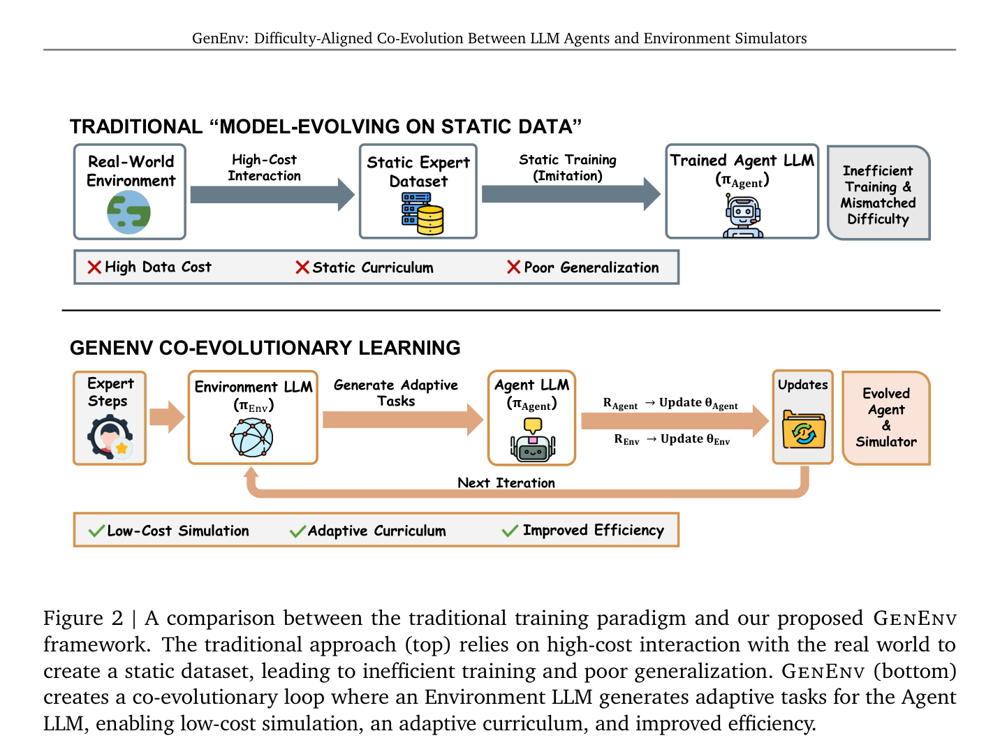
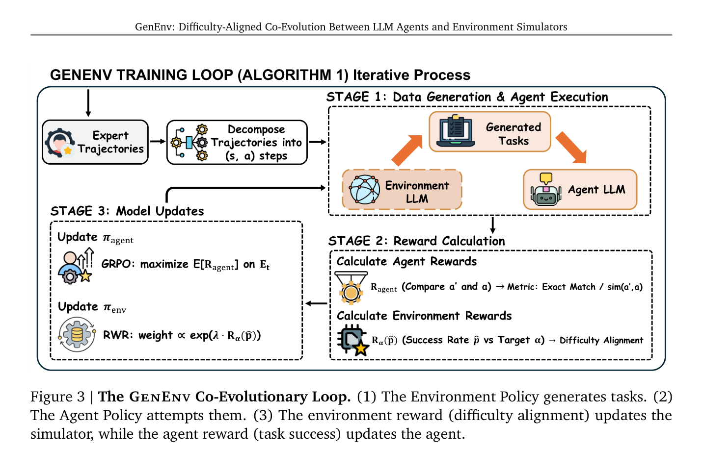
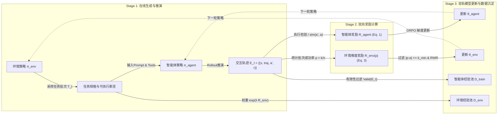
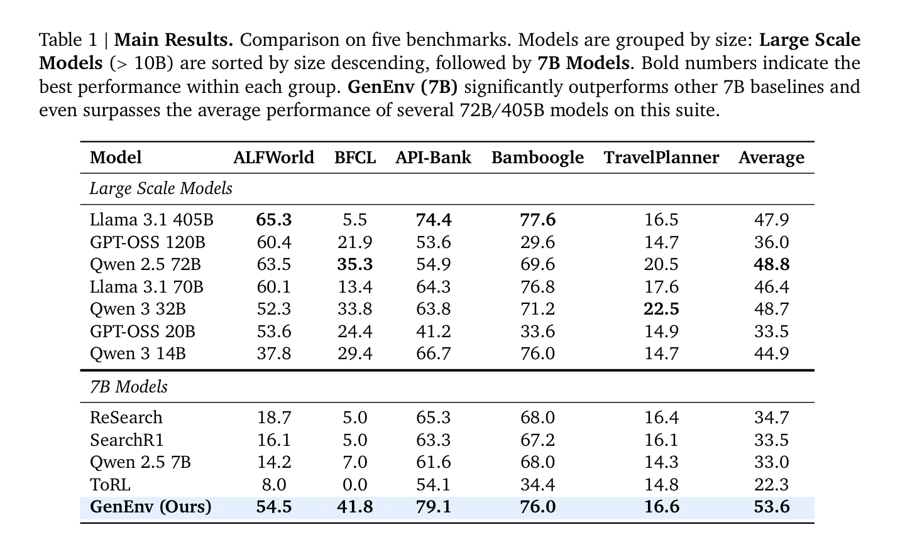
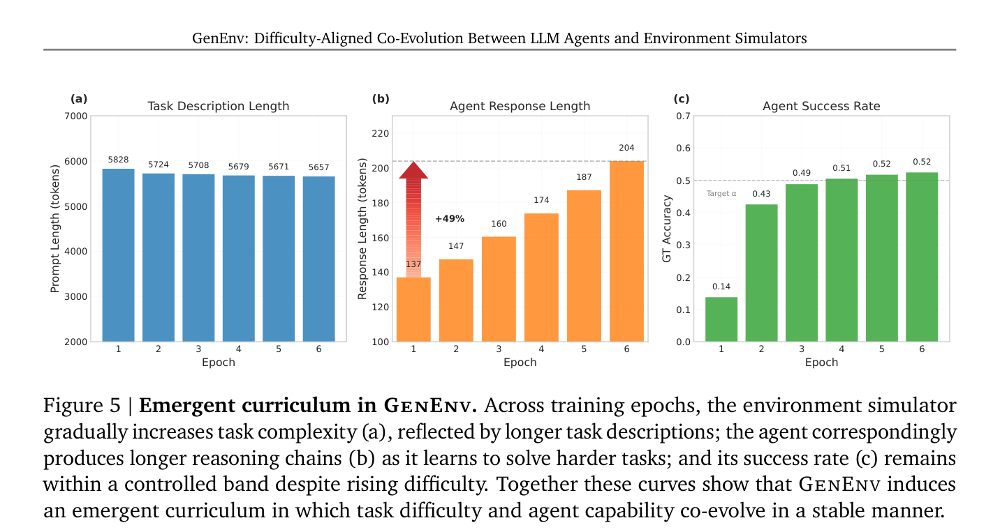
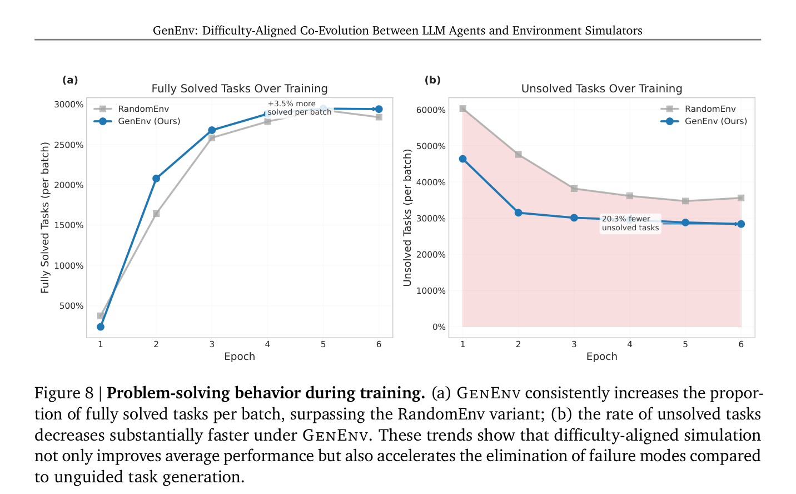
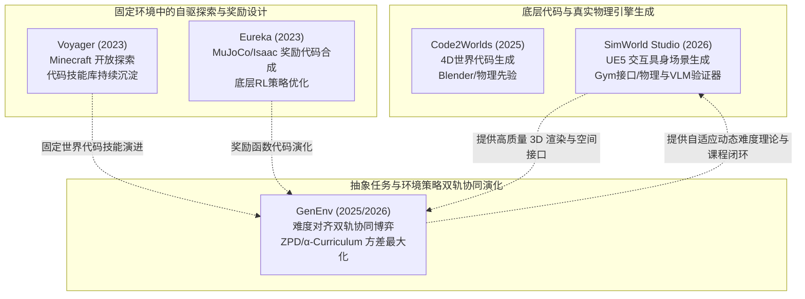

---
tags:
  - papers/agent
  - papers/embodied-ai
  - papers/environment-simulation
  - papers/co-evolution
  - papers/reinforcement-learning
aliases:
  - GenEnv
  - Difficulty-Aligned Co-Evolution
date: 2025-12-24
arxiv_id: 2512.19682
doi: 10.48550/arXiv.2512.19682
---

# GenEnv: Difficulty-Aligned Co-Evolution Between LLM Agents and Environment Simulators

## 核心信息

- **标题**: GenEnv: Difficulty-Aligned Co-Evolution Between LLM Agents and Environment Simulators
- **标题翻译**: GenEnv：大语言模型智能体与环境仿真器之间难度对齐的协同演化
- **作者**: Jiacheng Guo (郭佳程)*, Ling Yang (杨凌)*†, Peter Chen*, Qixin Xiao*, Yinjie Wang, Xinzhe Juan, Jiahao Qiu, Ke Shen, Mengdi Wang (王梦迪)† (*Equal Contribution, †Corresponding Authors)
- **机构**: Princeton University (普林斯顿大学); Columbia University (哥伦比亚大学); University of Michigan (密歇根大学); University of Chicago (芝加哥大学)
- **发表时间**: 2025-12-24 (arXiv:2512.19682v2 [cs.CL] 23 Dec 2025)
- **发表渠道**: arXiv preprint
- **DOI**: 10.48550/arXiv.2512.19682
- **arXiv**: 2512.19682
- **论文链接**: https://arxiv.org/abs/2512.19682
- **代码 / 项目**: https://github.com/Gen-Verse/GenEnv
- **数据 / 资源**: 覆盖 ALFWorld、BFCL (Berkeley Function-Calling Leaderboard)、API-Bank、Bamboogle、TravelPlanner 五大交互基准的动态协同仿真数据池
- **论文类型**: AI 智能体学习范式 / 动态环境仿真 / 强化学习课程协同演化 (Co-evolutionary Reinforcement Learning)

---

## 原文摘要翻译

训练高能力的大语言模型（LLM）智能体受到真实世界交互数据高昂采集成本与静态本质的严重瓶颈制约。为了解决这一核心困境，我们提出了 **GenEnv**：一个在智能体与可扩展生成式环境仿真器之间建立“难度对齐协同演化博弈”（Difficulty-Aligned Co-Evolutionary Game）的全新框架。与以往在静态数据集上演化模型的传统方法不同，GenEnv 实例化了一种**数据自演进范式（Data-Evolving Paradigm）**：环境仿真器扮演动态课程策略的角色，持续合成专门针对智能体当前“近侧发展区”（Zone of Proximal Development, ZPD）量身定制的训练任务。该演进过程由一种简洁而高效的 **$\alpha$-课程奖励（$\alpha$-Curriculum Reward）** 驱动，将生成任务的难度精确对齐到智能体当前的能力水平边界。

我们在涵盖工具调用、具身交互与现实规划的五大基准（API-Bank、ALFWorld、BFCL、Bamboogle 和 TravelPlanner）上对 GenEnv 进行了系统评估。实验结果表明，GenEnv 在各个任务上相比 7B 基线模型取得了最高达 **+40.3%** 的性能飞跃，并在基准平均表现上达到或超越了参数量显著更大的模型（涵盖 14B 至 405B）。与基于 Gemini 2.5 Pro 的离线大规模静态数据增强方案相比，GenEnv 在少使用 **3.3 倍** 合成数据的前提下取得了更优越的下游表现。通过将智能体学习从静态监督转变为自适应仿真，GenEnv 为智能体能力的低成本可扩展演进提供了一条高效的数据飞轮路径。代码已开源：https://github.com/Gen-Verse/GenEnv。

---

## 创新点

1. **从“静态数据演化模型”到“双向博弈数据自演进范式（Data-Evolving Paradigm）”的跃迁**：
   彻底颠覆了以往固定离线轨迹库微调或单向大规模离线合成数据的传统范式，将环境仿真器本身参数化为策略模型 $\pi_{\text{env}}$，使其与智能体策略 $\pi_{\text{agent}}$ 构成一个对称、双向、动态推拉的协同演化闭环，让训练数据分布随着学习进度自发演变。
2. **基于近侧发展区（ZPD）理论的数学建模与 $\alpha$-Curriculum Reward 机制**：
   将心理学“近侧发展区”理论形式化为统计强化学习目标。设计了高斯型对称难度对齐奖励 $R_{\text{env}}(\hat{p}) = \exp(-\beta (\hat{p} - \alpha)^2)$，并在理论上证明：当目标胜率 $\alpha = 0.5$ 时，REINFORCE/GRPO 梯度的方差范数达到数学极值，为策略提供信息熵最大、梯度信噪比最高的更新信号。
3. **$\alpha$-Curriculum Reward 的排序一致性定理（Ranking Consistency Theorem）**：
   利用 Hoeffding 不等式严格证明了在有限 Rollout 采样下，环境奖励对候选任务族真实难度的排序一致性，其误排概率随批次采样规模呈指数级衰减，确立了无序大模型自动调节课程难度的统计收敛基础。
4. **GRPO 与 RWR 双轨非对抗协同优化算法（Two-Player Curriculum Optimization）**：
   避免了对抗生成网络（GAN 或 Minimax Game）中极易发生的纳什均衡震荡、环境不可解（Mode Collapse）或难度爆炸崩溃。智能体采用 Group Relative Policy Optimization (GRPO) 追求任务完成率；仿真器采用 Reward-Weighted Regression (RWR) 配合 KL 惩罚，温和且自适应地朝智能体能力的“应力断裂点（Breaking Points）”探索。
5. **动态扩增的双重经验缓冲池机制（Dual Growing Data Pools）**：
   系统同时维护智能体有效交互池 $\mathcal{D}_{\text{train}}$ 与环境加权合成池 $\mathcal{D}_{\text{env}}$，既保证新经验持续涌入以驱动复杂度上移，又通过经验回放机制彻底遏制智能体在课程升级过程中的“灾难性遗忘”。
6. **以小博大的超高数据利用效率（Data Efficiency）**：
   用纯 7B 模型构建的双轨自演化系统，在少用 3.3 倍合成数据的前提下，全面超越了由行业顶级闭源模型 Gemini 2.5 Pro 离线蒸馏构建的超大数据集，证伪了“盲目堆砌通用大模型离线生成数据即可无限泛化”的工业惯性假设。

---

## 一句话总结

GenEnv 的本质是**用强化学习把环境仿真器训练成一个掌握“控场难度”的动态出题人**，通过将任务胜率锚定在 50% 的“近侧发展区”，让 7B 智能体在自适应生成的交互沙箱中用极高样本效率实现跨量级的能力跃升。

---

## 研究问题

在当前大模型智能体（LLM Agents）的研究版图中，以 Web 导航、工具调用、具身规划为代表的复杂交互任务始终面临严重的**交互数据壁垒（Interaction Data Bottleneck）**：

1. **真实交互代价高昂且难以并发**：真实环境中的每一步交互（如物理机器人硬件执行、真实电商网站点击、带鉴权的生产 API 调用）都伴随着延迟、费用甚至破坏性风险，无法像纯预训练文本那样实现万卡集群的大规模异步吞吐。
2. **离线静态专家轨迹的脆性与分布偏移（Distribution Shift）**：传统行为克隆（Behavioral Cloning / Imitation Learning）强依赖人工或强模型采集的固定离线轨迹（如 WebArena、ALFWorld 原始数据集）。一旦测试环境发生细微扰动（例如网页前端将 "Add to Cart" 换为 "Add to Basket"），未经历过该状态分布的智能体便会陷入不可逆的级联失败（Error Cascades）。
3. **离线数据增强的“难度失配（Difficulty Mismatch）”瓶颈**：近期许多工作尝试用 GPT-4 或 Gemini 离线批量合成数以万计的补充任务。然而，这些合成数据是“一次性静态产物”，无法根据学生模型在训练中的实时掌握状态进行动态调整：
   - 训练早期：合成的高难度长程规划任务智能体完全做不对，梯度信噪比趋近于零，导致学习迟滞；
   - 训练后期：智能体早已掌握基础语法与浅层调用，但静态库中仍充斥着大量毫无信息量的冗余简单样本，造成计算资源严重浪费与训练饱和。


*Fig. 2. 传统静态数据演化模型范式（上方）与 GenEnv 协同演化学习范式（下方）对比。传统方法依赖高昂的真实交互与静态专家库，导致训练低效与泛化脆弱；GenEnv 构建了环境 LLM 与智能体 LLM 之间的低成本双轨演进闭环。*

论文的核心问题因此确立：**能否直接将大语言模型参数化为一个可进化的环境仿真器（Environment Simulator），摒弃昂贵的真实交互与僵化的静态数据，构建一个让环境任务难度始终自动贴合智能体现有能力边界的协同进化飞轮？**

---

## 数据与任务定义

### 输入与输出定义

GenEnv 的核心机制在数学上被形式化为一个双玩家课程博弈（Two-Player Curriculum Game）：

| 实体 | 策略符号 | 优化目标 | 输入 | 输出 |
|---|---|---|---|---|
| **智能体策略 (Agent Policy)** | $\pi_{\text{agent}}$ (参数 $\theta_{\text{agent}}$) | 最大化任务成功期望 $\mathbb{E}[R_{\text{agent}}]$ | 任务上下文、工具定义、当前观察 $s$ | 动作序列或推理轨迹 $a'$ (含思考链与 API 参数) |
| **环境策略 (Environment Policy)** | $\pi_{\text{env}}$ (参数 $\theta_{\text{env}}$) | 最大化难度对齐期望 $\mathbb{E}[R_{\text{env}}]$ | 种子任务范式、智能体现有能力统计量 | 任务实例批次 $\mathcal{T}_t$、验证器代码及基准答案 $a$ |

### 五大多领域评测基准

为了全面验证协同演进范式的跨领域通用性，论文选取的五大基准覆盖了具身控制、深层函数调用、复杂多跳检索与高约束真实规划：

1. **ALFWorld** (具身文本沙箱)：基于 TextWorld 与 ALFRED 渲染环境对齐的具身智能基准。智能体需要在复杂的室内虚拟房间中完成多步拾取、清洁、加热、放置物体等长程交互任务。官方验证集被分解为单步与多步决策轨迹，评测长程因果推理。
2. **BFCL (Berkeley Function-Calling Leaderboard)**：函数调用事实标准基准。论文针对挑战性极高的 Long-Context 子集进行独立回合评测，严格考核智能体从海量噪声 API 候选库中精准抽取函数名与合法参数的能力。
3. **API-Bank**：结构化工具增强推理基准。包含上百个真实世界 API 与复杂的参数依赖关系，评估智能体多轮 API 链式调用的精确匹配度。
4. **Bamboogle**：组合式多跳问答基准（Compositional Multi-Hop QA）。智能体必须借助搜索引擎工具，自主拆解子问题、发起多轮查询并整合冲突信息。
5. **TravelPlanner**：高维离线真实旅行规划基准。智能体需要在严格受限于预算、交通时刻表、酒店房型和地理位置的多重现实硬约束下制定可执行的多日旅行日程，评测微观与宏观常识满足度（CS Micro/Macro, HD Micro/Macro）。

---

## 方法主线

### 机制流程


*Fig. 3. GenEnv 协同演化三阶段闭环架构（Algorithm 1）：Stage 1 在线任务合成与智能体交互推演；Stage 2 基于执行检验与高斯难度核的双向奖励计算；Stage 3 基于 GRPO 与 RWR 的双轨模型更新及双训练池增量扩增。*

GenEnv 的整体演进算法以轮次（Epoch $t = 1, \dots, T$）推进，每一轮严格遵循三阶段流水线：



1. **第一阶段：在线合成与推演（Online Generation & Interaction）**：
   环境策略 $\pi_{\text{env}}$ 接收种子提示词与历史统计，自动合成包含 $n$ 个任务实例的批次 $\mathcal{T}_t$。每个任务实例严密封装了：(i) 任务指令与系统 Prompt、(ii) 依赖的工具规范（Tool Specifications）、(iii) 自动化评估规范（可执行断言代码或基准真值 $a$）。随后智能体 $\pi_{\text{agent}}$ 在这些新任务中执行多轮探索，生成轨迹集 $\mathcal{E}_t$。
2. **第二阶段：双向分层奖励计算（Reward Calculation）**：
   - **智能体任务执行奖励 $R_{\text{agent}}$**：区分结构化动作与非结构化文本输出：
     $$R_{\text{agent}}(a', a) = \mathbb{I}(a' = a) \cdot \mathbb{I}(a \in \mathcal{A}_{\text{struct}}) + \text{sim}(a', a) \cdot \mathbb{I}(a \notin \mathcal{A}_{\text{struct}})$$
     对于 API 参数、工具名等结构化动作（$\mathcal{A}_{\text{struct}}$），强制执行沙箱断言，完全正确赋 1，错误赋 0；对于自由文本，计算规范化的 Token-F1 或语义嵌入相似度，整体缩放到 $[0, 1]$ 区间。
   - **环境难度对齐奖励 $R_{\text{env}}$**：首先汇总智能体在当前批次 $n$ 个任务上的经验胜率 $\hat{p} = \frac{k}{n}$（$k$ 为成功样本数）。随后通过高斯核函数映射环境奖励：
     $$R_{\text{env}}(\hat{p}) = \exp\left( -\beta (\hat{p} - \alpha)^2 \right)$$
     其中目标难度中枢 $\alpha = 0.5$，$\beta > 0$ 决定钟形曲线的陡峭程度。
3. **第三阶段：双轨非对称参数更新与数据池沉淀（Model Updates & Aggregation）**：
   - 智能体策略基于 GRPO 沿最大化 $\mathbb{E}[R_{\text{agent}}]$ 方向更新；
   - 环境策略通过加权 SFT（Reward-Weighted Regression, RWR）朝高难度对齐任务更新；
   - 筛选格式完备、解析无误的轨迹追加至 $\mathcal{D}_{\text{train}}$，加权后的环境任务追加至 $\mathcal{D}_{\text{env}}$。

---

### 核心组件: 难度对齐理论与近侧发展区建模

为什么要把环境生成任务的目标胜率设在 $\alpha = 0.5$？这不仅是借鉴心理学大师维果茨基（Vygotsky, 1978）的“近侧发展区”（Zone of Proximal Development, ZPD——即学习发生在‘现有独立解决水平’与‘需辅助解决边界’之间的区域），论文在强化学习统计理论层面给出了严格的数学证明。


*Fig. 7. 真实训练过程中智能体在仿真任务上的胜率收敛曲线。初始胜率仅为 13.8%，随着环境模型的自适应难度对齐更新，在第 2 个 Epoch 迅速进入目标 $\alpha$ 区域（40%~60%），最终高度平稳地收敛于 52.4%，实证吻合了理论推论。*

#### 命题 1：中间难度最大化强化学习梯度方差范数

在强化学习 Policy Gradient（REINFORCE / GRPO）更新中，针对任务类型 $\tau$ 和二元胜负奖励 $r \in \{0, 1\}$，策略参数更新的无偏梯度估计为：
$$g(\tau, r) = (r - b(\tau)) \nabla_\theta \log \pi_\theta(a \mid \tau)$$
若基线选择为该任务下的条件期望胜率 $b(\tau) = \mathbb{E}[r \mid \tau] = p(\tau)$（方差最小化无偏基线），且满足得分函数模长在胜负条件下有界的前提假设（Assumption 1: $c_{\min} \le \mathbb{E}[\|\nabla_\theta \log \pi_\theta(a \mid \tau)\|^2 \mid \tau, r] \le c_{\max}$），则随机梯度模长的方差期望满足：

$$\mathbb{E}\left[ \|g(\tau, r)\|^2 \mid \tau \right] = \mathbb{E}\left[ (r - p(\tau))^2 \|\nabla_\theta \log \pi_\theta(a \mid \tau)\|^2 \mid \tau \right]$$

代入全期望公式分解：
$$\sum_{r \in \{0, 1\}} \Pr(r \mid \tau) (r - p(\tau))^2 \cdot \mathbb{E}\left[ \|\nabla_\theta \log \pi_\theta(a \mid \tau)\|^2 \mid \tau, r \right]$$
由此立即可得双边夹逼界限：
$$C_{\min} \cdot p(\tau)(1 - p(\tau)) \le \mathbb{E}\left[ \|g(\tau, r)\|^2 \right] \le C_{\max} \cdot p(\tau)(1 - p(\tau))$$

由于抛物线函数 $f(p) = p(1 - p) = \frac{1}{4} - \left(p - \frac{1}{2}\right)^2$ 在定义域 $[0, 1]$ 上为严格凹函数，其**全局唯一极大值点严格落在 $p = \frac{1}{2}$**！
- 当任务极其简单时（$p \to 1$），智能体几乎全部答对，$r - b = 1 - 1 = 0$，梯度模长坍塌，智能体学不到任何新信息；
- 当任务极其困难时（$p \to 0$），智能体完全抓瞎全部失败，$r - b = 0 - 0 = 0$，策略陷入盲目探索，同样无梯度可用；
- 只有在 $p = 0.5$ 处，结果的二项分布方差 $\text{Var}(r) = p(1-p) = 0.25$ 达到顶峰，单次采样所携带的信息增益与反事实学习信号最强。

#### 定理 1：$\alpha$-Curriculum Reward 的排序一致性定理

在工程实际中，环境策略无法得知真值胜率 $p(\tau)$，只能从 $n$ 次 Rollout 中计算经验胜率 $\hat{p} = \frac{k}{n}$。论文通过 Hoeffding 不等式证明了奖励排序的一致性：
设有两个任务族 $\tau_1, \tau_2$，其真实难度距目标 $\alpha$ 的距离分别为 $\Delta_1 = |p_1 - \alpha|$ 和 $\Delta_2 = |p_2 - \alpha|$，且 $\Delta_1 < \Delta_2$（即 $\tau_1$ 比 $\tau_2$ 更贴合近侧发展区）。定义间隔 $\delta = \frac{\Delta_2 - \Delta_1}{3} > 0$。则环境策略发生错误倒挂排序（即赋予远离目标难度的任务更高奖励）的概率上界为：

$$\Pr\left( R_{\text{env}}(\hat{p}_1) \le R_{\text{env}}(\hat{p}_2) \right) \le 4 \exp\left( -\frac{2}{9}(\Delta_2 - \Delta_1)^2 n \right)$$

随着每个任务族采样次数 $n$ 的增加，**误排概率以指数级速率收敛至零**！这从数学上彻底解释了为什么即使面对极高随机噪声的 LLM 输出，高斯型 $\alpha$ 奖励依然能稳定将环境参数拉向 50% 难度带。

---

### 双轨进化循环

GenEnv 的双轨优化机制（Dual-Track Evolutionary Loop）精妙地平衡了智能体的能力跃迁与仿真器的复杂度拓展：


*Fig. 4. GenEnv 的端到端训练动力学。(a) 逐步 Critic/Score 训练奖励；(b) 跨 Epoch 验证集准确率单调平稳提升；(c) 智能体响应长度稳定延展；(d) 每轮平均奖励平稳收敛。全过程无奖励劫持与崩塌。*

#### 1. 智能体更新：Group Relative Policy Optimization (GRPO)
智能体采用 DeepSeekMath (Shao et al., 2024) 提出的 GRPO。相比传统 PPO，GRPO 摒弃了额外的 Value/Critic 神经网络，通过对同一个任务输入采样一组输出候选，计算组内相对优势值（Group Advantage）：
$$A_i = \frac{R_{\text{agent}, i} - \text{mean}(\{R_{\text{agent}}\})}{\text{std}(\{R_{\text{agent}}\})}$$
利用该相对优势配合标准裁剪比率（Clipping Ratio）和 KL 散度约束更新 $\theta_{\text{agent}}$。这种方式大幅度削减了显存开销，使得 7B 智能体在长达 9,000 tokens 的上下文下能够高吞吐并发训练。

#### 2. 环境仿真器更新：Reward-Weighted Regression (RWR)
环境模型若直接采用标准策略梯度更新，极易发生语言逻辑退化或为了迎合数值而产生乱码对抗样本。因此，GenEnv 采用更稳健的离线加权监督回归（RWR）：
- 过滤掉偏差过大的离群批次：凡是 $|\hat{p} - \alpha| > k_{\min}$（取 $k_{\min} = 0.1$）的极端批次暂不计入环境梯度更新，防止突变噪声毁坏先验；
- 将合规任务批次作为监督目标，其样本损失权重正比于：
  $$w_i \propto \exp\left( \lambda R_{\text{env}}(\hat{p}_i) \right)$$
  其中 $\lambda = 1.0$ 为调节温度。同时施加对初始环境权重 $\pi_{\text{env}}^{(0)}$ 的 KL 散度约束，锁定环境语法的自然性与合理性。

#### 3. 经验缓冲池的飞轮累积
- **智能体数据池 $\mathcal{D}_{\text{train}}$**：增量追加所有通过语法校验与执行检测的真实交互轨迹。在训练后续轮次中，智能体以混合采样方式既学习当前轮次新合成的数据，又回放历史沉淀数据，在巩固旧技能的同时吸收新挑战；
- **环境数据池 $\mathcal{D}_{\text{env}}$**：按指数权重沉淀被证实处于最佳难度区间的任务模版，使仿真器掌握生成多层次、梯度化复杂场景的稳态能力。

---

### 自动化环境验证与代码鲁棒性保证

大模型充当仿真器时最致命的问题是**幻觉导致的伪任务（Hallucinated / Unsolvable Tasks）**——如果环境生成的题目自身逻辑自相矛盾、或者提供的模拟 API 接口永远抛出异常，智能体将被迫在伪任务上过拟合。GenEnv 建立了严格的代码级执行防御体系：

1. **三元组任务定义结构**：
   每个生成的任务必须结构化输出自然语言指令、严格遵守 OpenAPI/JSON Schema 的工具原型说明，以及确定性的单元验证函数（Deterministic Executable Verifier）。
2. **两级断言执行过滤（Two-Stage Assertions）**：
   - **语法与模式校验**：利用 Python 抽象语法树（AST）及 Pydantic 模式校验器实时拦截任何缺失参数、格式破损或无法解析的 API 规范；
   - **可执行性沙箱试运行**：在派发给智能体之前，系统首先在隔离受限的 Python 沙箱中空跑默认探针。若任务自身的 Checker 无法完成标准单步调用或环境初始化报错，该任务直接从当前批次剥离，严禁污染 $\mathcal{D}_{\text{train}}$。
3. **确定性奖励计算与执行隔离**：
   智能体预测的工具调用直接注入到虚拟沙箱执行环境中运行，依靠返回值状态码、精确字段匹配度或预编译的正则表达式断言给出奖励值，彻底摒弃了使用脆弱昂贵且容易被 Prompt 劫持的“LLM-as-a-Judge”作为核心判分机制的做法。

---

## 关键结果

### 主结果与强基线


*Table 1. 五大基准上的主实验对比结果。上部为参数量 > 10B 的大规模开源模型；下部为 7B 级别模型。GenEnv (7B) 在所有基准上均刷新 7B 最佳纪录，并在五大基准平均分上超越了包括 Llama-3.1-405B、Qwen2.5-72B 在内的诸多超大规模模型。*

为了完整呈现论文的真实评测全貌，将 Table 1 的定量数据精确整理如下：

| 模型规模 | 模型名称 | ALFWorld (具身) | BFCL (函数调用) | API-Bank (工具) | Bamboogle (多跳) | TravelPlanner (规划) | 五项平均分 (Avg) |
|---|---|---|---|---|---|---|---|
| **超大模型 (>10B)** | Llama-3.1 405B | **65.3** | 5.5 | **74.4** | **77.6** | 16.5 | 47.9 |
| | GPT-OSS 120B | 60.4 | 21.9 | 53.6 | 29.6 | 14.7 | 36.0 |
| | Qwen2.5 72B | 63.5 | **35.3** | 54.9 | 69.6 | 20.5 | **48.8** |
| | Llama-3.1 70B | 60.1 | 13.4 | 64.3 | 76.8 | 17.6 | 46.4 |
| | Qwen3 32B | 52.3 | 33.8 | 63.8 | 71.2 | **22.5** | 48.7 |
| | GPT-OSS 20B | 53.6 | 24.4 | 41.2 | 33.6 | 14.9 | 33.5 |
| | Qwen3 14B | 37.8 | 29.4 | 66.7 | 76.0 | 14.7 | 44.9 |
| **7B 级别模型** | ReSearch | 18.7 | 5.0 | 65.3 | 68.0 | 16.4 | 34.7 |
| | SearchR1 | 16.1 | 5.0 | 63.3 | 67.2 | 16.1 | 33.5 |
| | Qwen2.5-7B-Instruct (Base) | 14.2 | 7.0 | 61.6 | 68.0 | 14.3 | 33.0 |
| | ToRL | 8.0 | 0.0 | 54.1 | 34.4 | 14.8 | 22.3 |
| | **GenEnv (Ours 7B)** | **54.5** | **41.8** | **79.1** | **76.0** | **16.6** | **53.6** |
| **净增益** | *GenEnv vs. Base 7B* | **+40.3** | **+34.8** | **+17.5** | **+8.0** | **+2.3** | **+20.6** |


*Fig. 1. GenEnv 跨基准绝对收益看板与数据效率对比。(a) 各基准上相对于基座模型的绝对百分点增幅；(b) BFCL 验证集数据利用率对比：GenEnv 显著超越 RandomEnv 和 Static Augmentation，并以 3.3 倍更少的数据击败了 Gemini 2.5 Pro 离线增强。*

**深度数据解读**：
1. **具身决策维度的爆发式增长（ALFWorld +40.3pp）**：
   基座 7B 模型在 ALFWorld 上仅能拿到 14.2%，而经过协同演化仿真的 GenEnv 飙升至 54.5%，逼近 Llama-3.1-405B (65.3%)。这证明面对需要多步因果回环的环境，静态微调学不到状态转移容错，而仿真器动态抛出的探索状态直接激活了长程因果规划能力。
2. **长上下文函数调用突破（BFCL 41.8% 领跑全场）**：
   在 Long-Context BFCL 上，即便是 Llama-3.1-405B 也仅录得极低的 5.5%（迷失在无关上下文），Qwen2.5-72B 为 35.3%。GenEnv 7B 达到了 **41.8%**，不仅将同量级基线压制在 0%~7%，更超越了所有超大规模开源巨无霸模型。
3. **均分全面倒挂大模型（53.6% vs. 48.8%）**：
   在五大基准平均分上，GenEnv 7B (53.6%) 超过了 Qwen2.5-72B (48.8%)、Llama-3.1-405B (47.9%) 和 Qwen3-32B (48.7%)，确立了“训练数据动态分布适配度比单向推升模型参数规模更具决定性”的标杆事实。

---

### 动态环境演进过程与任务复杂度提升曲线

为了探究环境仿真器是否真正自发涌现了“由易到难”的自适应课程，论文监控了训练各阶段生成任务的微观指标：


*Fig. 5. GenEnv 自涌现课程的微观进化曲线。(a) 任务 Prompt 描述长度；(b) 智能体响应思考链长度（从 137 tokens 持续延展至 204 tokens，净增长 +49%）；(c) 智能体胜率在动态难度上升中稳定嵌在目标 $\alpha$ 带宽中。*

1. **思考链深度与推理步数的大幅攀升**：
   如图 5b 所示，智能体生成的有效推理轨迹长度从第 1 轮的 **137 tokens** 持续、单调攀升至第 6 轮的 **204 tokens**，净增幅达 **+49%**。这表明为了击破仿真器提出的更复杂约束，智能体自发演进出了更深层次的中间反思步长与多工具串联编排，而非浅层格式套用。
2. **难度与能力的动态抗衡平衡**：
   尽管任务描述与思考深度激增，图 5c 显示智能体在各轮次生成环境中的经验胜率始终被锁定在 $[0.4, 0.6]$ 的舒适学习区间（最终稳定在 0.52 附近）。这确证了课程是自发涌现的（Emergent Curriculum）：不是人为设定阶段规则，而是环境模型发现智能体变强后，为了最大化自身的高斯难度奖励，主动合成更具挑战性的环境配置。

---

### 消融到底说明了什么


*Fig. 6. 静态增强与难度对齐动态仿真的严格对比消融。(a) 验证集分数收敛曲线对比；(b) 数据效率对比看板：GenEnv (45.8%) 击溃 Gemini 2.5 Pro 3.3× 数据量增强 (43.8%)。*

论文设置了三组极其严密的消融对照组：
- **GenEnv-Random (RandomEnv)**：环境模型每轮同样动态生成新任务，但**彻底关闭环境模型的权重更新**（即环境纯随机出题，不挂钩 $R_{\text{env}}$）；
- **GenEnv-Static**：环境模型仅在训练前单次离线合成一个 5 倍规模（3,264 条样本）的固定数据集，随后智能体在其上执行标准 PPO 训练；
- **Gemini-Offline (1.8× / 3.3×)**：调用业界顶级闭源模型 Gemini 2.5 Pro 生成相当于原数据集 1.76 倍（957 条）与 3.27 倍（1,777 条）的高质量静态离线数据。

**消融结果带来的三大本质推论**：
1. **难度对齐 $R_{\text{env}}$ 是核心驱动力，绝非单纯靠“动态生成”**：
   在 BFCL 上，GenEnv 达到 45.8%，而关闭了难度奖励的 RandomEnv 仅为 40.8%（如图 6a，性能暴跌 **12.3%**）。这直接回答了学界的质疑：仅仅让环境“随机多造数据”毫无质变，核心在于通过 $R_{\text{env}}$ 强制任务贴近 50% 胜率带。
2. **自适应小模型战胜静态强导师（3.3× 更少数据获得 +2.0pp 领先）**：
   如图 6b 所示，Gemini 3.3× 离线增强最终得分 43.8%，而 GenEnv 仅用原版数据配合同量级 7B 动态仿真器即可达到 45.8%。多用 3.3 倍超强模型的静态数据反而表现更差！这证明：**脱离学生当前能力边界的“盲目强导师数据”，很快会遭遇信息边际效益递减**；而动态演进的仿真器即使参数较小，提供的是针对当前缺陷的精准“靶向治疗”。
3. **消除错误死角的高效性（Figure 8 行为剖析）**：
   
   *Fig. 8. 训练过程中的问题解决微观行为。(a) 单 Batch 完全解决任务数提升 +3.5%；(b) 未解任务数（Unsolved Tasks）暴跌 20.3%。*
   对比 RandomEnv，GenEnv 单批次完全解决的任务比例更高，而顽固性未解死角（Unsolved Tasks）迅速缩减 20.3%，揭示了难度对齐算法优先消除智能体薄弱环节的机制。

---

## 深度分析

### 真正贡献是什么

学术界在环境合成领域已有诸多探索，必须穿透表象厘清 GenEnv 的独有贡献：

| 维度 | 传统程序化生成 (PCG / ProcTHOR) | 强模型离线合成 (AgentBank / ToolDA) | 对抗自博弈 (Minimax / GAN) | **GenEnv (本文)** |
|---|---|---|---|---|
| **任务生成逻辑** | 人工设计硬编码启发式规则 | 静态 Prompt 单向离线大批量蒸馏 | 零和对抗博弈（判别器尽力击败生成器） | **非对抗协同博弈（协作寻找能力断裂点）** |
| **难度控制机制** | 离散分级或纯随机扰动 | 无自适应调节（一刀切） | 极易陷入环境不可解或训练崩溃 | **高斯型 $\alpha$-Curriculum 锚定近侧发展区** |
| **理论支撑** | 缺乏收敛性证明 | 经验主义与规模定律 | 极小极大纳什均衡分析 | **REINFORCE 梯度方差最大化 + Hoeffding 排序一致性** |
| **数据本质** | 静态环境快照 | 静态扩展语料 | 动态但脆弱 | **Data-Evolving 连续双池演变** |

GenEnv 的真正贡献在于：**它第一次在理论上和系统上把大语言模型环境仿真器定义为一个‘带有确定性方差最大化目标’的强化学习策略模型，完成了从‘调教 Agent 模型’到‘调教 Data/Environment 策略’的认知升维。**

---

### 为什么结果成立

从系统与算法交互的底层逻辑审视，GenEnv 的成功源于三大底层支柱的协同：

1. **信息论视角下的最大互信息输送**：
   强化学习的本质是通过标量奖励向策略反向传播梯度。若任务确定成功或确定失败，梯度向量的二阶矩收缩为零，相当于网络在空转；而维持在 50% 难度带，等价于最大化单次交互的香农信息熵（$H(p) = -\sum p \log p$ 在 $p=0.5$ 处取最大值 1 bit）。每一条返回的轨迹都在最大化策略参数的互信息更新。
2. **软性协同博弈规避了零和对抗的局部极小陷阱**：
   在很多环境生成尝试中，人们倾向于让出题者追求“最小化学生胜率”。这会导致环境模型自发走捷径——生成包含悖论、无解前提或语法畸形的恶毒任务，导致智能体彻底躺平。GenEnv 的钟形高斯惩罚了“太难”，使得环境模型必须在“保证智能体能解出一半”的前提下小心翼翼地加深难度，达成了极高鲁棒性的帕累托最优改进。
3. **GRPO 与 RWR 的解耦稳定性**：
   智能体在策略空间利用 GRPO 进行多样本相对优势探索；环境模型在文本输出空间利用 RWR 进行平滑的概率质量重加权。两者的数学更新步幅受到 KL 散度与温度系数的刚性约束，在经验回放池 $\mathcal{D}_{\text{train}}$ 的压舱石作用下，实现了无振荡的平滑演进（如 Figure 4 所示）。

---

### 容易误读的地方

在阅读与引用该论文时，极易产生以下四个维度的误读：

1. **误以为 GenEnv 是一个端到端的多智能体对抗博弈系统（Adversarial Multi-Agent System）**：
   必须厘清：环境模型 $\pi_{\text{env}}$ 并不是智能体 $\pi_{\text{agent}}$ 的敌人！对抗博弈的目标是 $\min \mathbb{E}[R_{\text{agent}}]$，而 GenEnv 的目标是 $\max \exp(-\beta (\hat{p} - 0.5)^2)$。它是一个精心调优的**教练系统**，其唯一目的不是击败学生，而是精确探测学生的应力极限。
2. **误以为仿真器是在生成类似 Unreal Engine 或 Unity 的底层物理像素引擎代码**：
   论文中的“Environment Simulator”在当前实验中主要生成的是**任务情境规范（Task Contexts）、虚拟 API 工具集、交互式系统响应规则与测试断言脚本**，而非低级 3D 渲染几何。具身基准 ALFWorld 依赖其底层文本解释器处理动作，环境模型负责的是环境初始化状态、物品配置与任务目标的分层生成。
3. **误以为该方法需要极昂贵的双模型训练算力**：
   虽然涉及两套策略，但由于基座同为 7B，且环境更新采用轻量级 RWR（单轮仅需对筛选后的少量加权样本微调几步，而非全量复杂 RL），实际算力开销仅相当于标准 RL 训练的 1.5~2.0 倍，远低于调用 GPT-4/Gemini 离线合成数万条样本的 API 经济成本。
4. **误以为 $\alpha = 0.5$ 是随意挑选的超参数启发式**：
   如前文公式推导，$\alpha = 0.5$ 是由二项分布方差 $p(1-p)$ 的唯一极值点自然导出的数学必然，绝非无根据的网格搜索经验值。

---

### 复现注意点

为确保在本地或集群上高保真复现 GenEnv，必须严密监控以下工程细节与超参数配置：


*Table 2. 论文核心训练超参数清单。涵盖智能体策略与环境策略的优化器、学习率、批大小及演进阈值。*

```json
{
  "reproduction_checklist": {
    "agent_policy": {
      "base_model": "Qwen2.5-7B-Instruct",
      "algorithm": "GRPO (Group Relative Policy Optimization)",
      "optimizer": "AdamW",
      "learning_rate": 1e-6,
      "batch_size": 64,
      "max_seq_length": 9000,
      "epochs": 10
    },
    "environment_policy": {
      "base_model": "Qwen2.5-7B-Instruct",
      "algorithm": "Reward-Weighted Regression (RWR)",
      "optimizer": "AdamW",
      "learning_rate": 5e-7,
      "batch_size": 64,
      "target_alpha": 0.5,
      "difficulty_filter_k_min": 0.1,
      "rwr_temperature_lambda": 1.0,
      "epochs": 10
    }
  }
}
```

1. **执行沙箱的隔离与并发安全**：
   生成环境包含动态生成的可执行验证代码（Checker）。本地部署时必须运行在安全的 Docker 容器或轻量级 gVisor 沙箱中，严防环境模型生成恶意指令破坏主机环境。
2. **学习率的不对称性（Critical!）**：
   注意 Table 2 中，智能体学习率为 $1 \times 10^{-6}$，而环境学习率严格压低至 $5 \times 10^{-7}$！环境模型是规则与难度的供给方，如果其更新过快，会导致任务分布剧烈跳跃，智能体尚未消化当前阶段便被拖垮。
3. **难度过滤器 $k_{\min} = 0.1$ 的绝对执行**：
   必须严格执行代码中的过滤逻辑：当某一批次经验胜率 $\hat{p} < 0.4$ 或 $\hat{p} > 0.6$ 时，虽然智能体仍在其上计算梯度，但**环境模型必须跳过该批次的 RWR 更新**！一旦允许极端批次回传环境梯度，环境将迅速产生发散振荡。
4. **经验池回放混合比例**：
   在实现 Phase 3 的 $\mathcal{D}_{\text{train}}$ 增量维护时，不能只在全量历史数据上均匀采样，建议当前轮次新鲜数据与历史回放数据保持固定配比（如 1:1），防止过早对历史简单样本过度饱和。

---

## 局限

尽管 GenEnv 展示了令人振奋的协同演进结果，客观审视其体系，仍存在以下学术局限与外延风险：

1. **环境验证器依赖形式化契约，连续物理具身任务受限**：
   当前框架在工具调用（BFCL, API-Bank）、离散具身（ALFWorld）上表现惊艳，核心在于这些领域的成功有清晰的符号断言（Exit Code, JSON Schema, 文本匹配）。但在高保真连续物理控制（如仿生手灵巧抓取、流体交互）中，缺乏自然语言能直接表达的高保真物理仿真生成能力。
2. **基座模型固有常识上限构成的演进天花板**：
   从 TravelPlanner 的有限提升（从 14.3% 到 16.6%，仅提升 2.3pp）可以看出，当任务需要极其严苛的现实世界时空逻辑与长程规划常识时，完全由 7B 环境自驱探索容易在低维度徘徊，无法自发凭空“想象”出基座预训练语料中未曾深刻理解的高级常识约束。
3. **对极端分布外真实环境仍存在 Sim-to-Real 鸿沟**：
   仿真器自演化的世界本质上仍是 LLM 先验构建的“主观虚拟沙箱”。若真实测试集存在完全颠覆预训练分布的底层系统（如未见过的专有私有系统架构），在自演进沙箱中取得高分的智能体仍可能面临迁移折损。

---

## 我的笔记

### 3D / 具身 / 世界生成智能体横向体系定位

为了将 GenEnv 准确锚定在当前最前沿的具身世界模型与代码智能体版图中，我们将其与当前知识库中数篇里程碑工作进行深度横向比对：



#### 1. 深度对比：GenEnv vs. SimWorld Studio (Kang et al., 2026)
- **底层支撑与表现形式**：
  - **SimWorld Studio** 扎根于重型工业级游戏引擎 **Unreal Engine 5 (UE5)**，其核心智能体 SimCoder 通过 MCP 协议调用场景构造工具，生成的是具备精准三维空间坐标、网格碰撞体、光照材质的物理世界，并编译出标准的 Gymnasium `reset()`/`step()` 接口，直接进行 PointNav/ObjectNav 具身导航；
  - **GenEnv** 则是在更为通用的抽象任务层面，将环境仿真器本身数学抽象为一个**策略分布模型 $\pi_{\text{env}}$**，重点攻克交互逻辑、API 规范与复杂推理边界的动态演化。
- **协同演化机制的互补性**：
  - SimWorld Studio 的协同演化依赖几何启发式指标（如路径长度、障碍物密度设定 8 级阶梯）；
  - GenEnv 则给出了**严格的数学收敛基石**（Proposition 1 方差极值与 Theorem 1 排序一致性），证明了为什么胜率锚定在 50% 是通用自适应课程的理论最优点。
  - **未来融合展望**：将 GenEnv 的 $\alpha$-Curriculum 难度对齐理论引入 SimWorld Studio 的 UE5 场景代码生成中，用二阶梯度方差信号替代人工设定的障碍物阶梯，将构成近乎完美的 3D 高保真自适应具身训练沙箱！

#### 2. 对比 Code2Worlds (2025)
- Code2Worlds 核心在于利用编码大模型编写 Blender Python 脚本，以生成具备时间维度的 4D 物理仿真世界，主攻动态物体交互与视觉几何先验；
- GenEnv 则更偏向强化学习的**交互博弈训练场**，两者分别代表了“几何外观与物理保真度”与“交互决策逻辑与课程对齐”两个不同侧重点的发展极。

#### 3. 对比 Voyager (Wang et al., 2023) 与 Eureka (Ma et al., 2023)
- **Voyager** 是在**固定**的 Minecraft 世界中，让智能体通过自我反思编写 JavaScript 技能代码并存入技能库，世界本身是静态不变的；
- **Eureka** 是让大模型编写底层物理控制强化学习的**奖励函数代码**，其物理环境（Isaac Gym / MuJoCo）同样是预设固定的；
- **GenEnv 真正完成了闭环的翻转**：它打破了“固定环境”的铁律，让环境仿真器与智能体同时成为强化学习的更新主体，使训练环境不再是一个死板的数据集，而是一所能够随着学生成长自发升级教学难度的动态军校。

---

## 引用

```bibtex
@article{guo2025genenv,
  title={GenEnv: Difficulty-Aligned Co-Evolution Between LLM Agents and Environment Simulators},
  author={Guo, Jiacheng and Yang, Ling and Chen, Peter and Xiao, Qixin and Wang, Yinjie and Juan, Xinzhe and Qiu, Jiahao and Shen, Ke and Wang, Mengdi},
  journal={arXiv preprint arXiv:2512.19682},
  year={2025},
  url={https://arxiv.org/abs/2512.19682}
}
```
