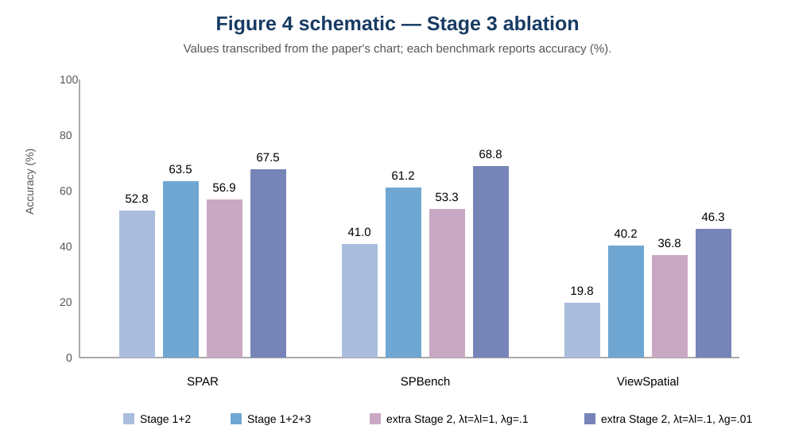

# GeoAnchor: Collaborative Reasoning via Latent Decomposition for 3D Spatial Understanding

> **Resolved source title:** *GeoAnchor: Collaborative Reasoning via Latent Decomposition for 3D Spatial Understanding*  
> **Authors:** Hao Li, Han Fang, Zixin Pan, Xin Wei, Hongbo Sun, Jinglin Xu, Zhiyu Lin, Ye Yuan, Zhongjiang He, Yu Yu, Hao Sun  
> **Affiliations:** ¹Shanghai Jiao Tong University; ²Xingchen AGI Lab, China Telecom Artificial Intelligence Technology (Beijing) Co., Ltd.; ³University of Science and Technology Beijing; ⁴The Hong Kong University of Science and Technology (Guangzhou)  
> **Source:** arXiv:2607.13454v2 [cs.CV], 28 Jul 2026; PDF date: July 14, 2026  
> **Link:** https://github.com/JerryPW/GeoAnchor

## Reading map and terminology

- **PDF coverage:** 23 physical PDF pages: pp. 1–15 main paper and physical pp. 16–23 appendix pages 1–8 (the appendix restarts printed page numbering at 1).
- **Main sections:** Abstract; 1 Introduction; 2 Related Works; 3 Method; 4 Experiment; 5 Conclusion; 6 Acknowledgement; References.
- **Appendix sections:** A Datasets and Evaluation Benchmarks; B Training Dataset Construction; C Experiment Details; D Additional Experiments.
- **Terminology:** 3D spatial understanding（三维空间理解）；latent token（潜变量 token）；position token（位置 token）；direction token（方向 token）；geometry token（几何 token）；local atomic 3D cue（局部原子三维线索）；global geometry context（全局几何上下文）；grounding（定位/指涉定位）；soft coverage（软覆盖）；local-plus-global（局部加全局）；local-only（仅局部）；SPAR-Bench、SPBench、ViewSpatial、Qwen3-VL、VGGT、GRPO、SFT and all dataset/model/metric names are retained in English for precision.

> <span style="color:#3B82F6"><strong>Para. 1:</strong></span> This reader preserves the supplied PDF in source order. Each English paragraph is followed immediately by its Chinese translation; mathematical notation, identifiers, citations, numerical values, and exact prompt literals are retained.

> <span style="color:#F59E0B"><strong>Para. 1[CN]:</strong></span> 本阅读稿按所提供 PDF 的原始顺序完整保留内容。每个英文段落之后紧接对应中文译文；数学符号、标识符、引文、数值以及提示词中的精确字面量均予以保留。

---

## Abstract [PDF p. 1]

> <span style="color:#3B82F6"><strong>Para. 1:</strong></span> Although multimodal large language models (MLLMs) have achieved remarkable progress, understanding 3D spatial relations from 2D images remains a critical challenge. Existing methods primarily rely on symbolic text tokens, which inherently lack the fidelity to represent continuous geometric information. While recent methods use latent representations to enhance reasoning, relying on a single latent type cannot adapt to the diversity of spatial tasks, leading to misalignment in complex geometric scenarios. To address these limitations, we propose GeoAnchor, an interleaved text-latent reasoning framework. GeoAnchor decomposes 3D spatial information into three complementary components: position latents for object grounding, direction latents for relational orientation, and geometry latents for scene structure. These components are recombined in a structured space to construct local evidence while capturing global context, enabling dynamic and interpretable reasoning. Furthermore, we introduce a collaborative training strategy that guides the model from local spatial perception to comprehensive 3D understanding. Extensive experiments on diverse and complex 3D reasoning tasks demonstrate that GeoAnchor outperforms the state of the art, validating its effectiveness and generalization capabilities.

> <span style="color:#F59E0B"><strong>Para. 1[CN]:</strong></span> 尽管多模态大语言模型（MLLM）已经取得显著进展，但从二维图像理解三维空间关系仍然是一个关键挑战。现有方法主要依赖符号化文本 token，而这类 token 天然缺乏表示连续几何信息的保真度。近期方法使用潜在表示来增强推理，但仅依赖单一类型的潜变量无法适应空间任务的多样性，从而在复杂几何场景中造成错位。为解决这些限制，我们提出 GeoAnchor，一种交错的文本—潜变量推理框架。GeoAnchor 将三维空间信息分解为三个互补组成部分：用于物体定位的位置潜变量、用于关系方向的方向潜变量，以及用于场景结构的几何潜变量。这些组成部分在结构化空间中重新组合，在捕获全局上下文的同时构造局部证据，从而实现动态且可解释的推理。此外，我们提出一种协同训练策略，引导模型从局部空间感知逐步走向全面的三维理解。在多样且复杂的三维推理任务上的大量实验表明，GeoAnchor 超越了当前最优方法，验证了其有效性和泛化能力。

**Links:** https://github.com/JerryPW/GeoAnchor  
**Date:** July 14, 2026

---

## 1 Introduction [PDF pp. 1–3]

> <span style="color:#3B82F6"><strong>Para. 1:</strong></span> Multimodal large language models (MLLMs) have demonstrated remarkable performance across a wide range of 2D vision-language tasks (Yang et al., 2025a; Liu et al., 2024; Google DeepMind, 2025). However, a critical capability remains underdeveloped: 3D spatial reasoning. Humans naturally infer depth, relative positions, and occlusions from visual scenes, yet existing MLLMs still struggle with complex spatial reasoning tasks (Cheng et al., 2024; Zhang et al., 2025c). This deficiency in such 3D understanding impedes their deployment in geometry-sensitive downstream applications, including robotics (Kim et al., 2024; Pertsch et al., 2025), autonomous driving (Zhou et al., 2025; Hwang et al., 2024; Ye et al., 2025), and VR/AR systems (Afzal et al., 2025). Existing efforts to enhance spatial reasoning capabilities generally follow two paradigms. The first paradigm leverages large-scale datasets, enabling models to implicitly learn 3D relational patterns through statistical regularities in the data (Chen et al., 2024; Chen et al., 2024; Li et al., 2025c; Yang et al., 2025b; Cai et al., 2025). The second paradigm augments 2D visual inputs with explicit 3D or 2.5D signals (e.g., point clouds, depth maps, or cognitive maps), thereby providing richer global geometric structure for the model (Mao et al., 2025; Zheng et al., 2025; Huang et al., 2025; Wu et al., 2025a; Fan et al., 2025). Despite their contributions, both methods are constrained by reasoning within a discrete text space: geometric evidence is verbalized into discrete tokens, inevitably leading to the loss of fine-grained spatial cues and biasing reasoning toward linguistic priors. Furthermore, the discrete nature of text tokens fails to capture the continuous characteristics of the physical world, rendering autoregressive generation unreliable for precise numerical tasks like distance estimation and object localization (Wen et al., 2025).

> <span style="color:#F59E0B"><strong>Para. 1[CN]:</strong></span> 多模态大语言模型（MLLM）在广泛的二维视觉—语言任务上展现出卓越性能（Yang 等，2025a；Liu 等，2024；Google DeepMind，2025）。然而，一项关键能力仍未得到充分发展：三维空间推理。人类能够自然地从视觉场景推断深度、相对位置和遮挡关系，但现有 MLLM 在复杂空间推理任务上仍然表现不佳（Cheng 等，2024；Zhang 等，2025c）。这种三维理解能力的不足阻碍了它们在对几何敏感的下游应用中的部署，包括机器人（Kim 等，2024；Pertsch 等，2025）、自动驾驶（Zhou 等，2025；Hwang 等，2024；Ye 等，2025）以及 VR/AR 系统（Afzal 等，2025）。现有增强空间推理能力的工作大体遵循两种范式。第一种范式利用大规模数据集，使模型通过数据中的统计规律隐式学习三维关系模式（Chen 等，2024；Chen 等，2024；Li 等，2025c；Yang 等，2025b；Cai 等，2025）。第二种范式为二维视觉输入加入显式三维或 2.5D 信号（例如点云、深度图或认知图），从而为模型提供更丰富的全局几何结构（Mao 等，2025；Zheng 等，2025；Huang 等，2025；Wu 等，2025a；Fan 等，2025）。尽管这些方法有所贡献，但两者都受限于在离散文本空间中进行推理：几何证据被语言化为离散 token，不可避免地损失细粒度空间线索，并使推理偏向语言先验。此外，文本 token 的离散性无法刻画物理世界的连续特征，使自回归生成在距离估计和物体定位等精确数值任务上不可靠（Wen 等，2025）。

> <span style="color:#3B82F6"><strong>Para. 2:</strong></span> Recent studies have explored latent reasoning to address the inherent limitations of text-based reasoning. By conducting intermediate reasoning within non-linguistic latent representations, rather than verbalizing every step in natural language, these methods preserve continuous semantic information, facilitating more coherent multimodal reasoning (Qin et al., 2025; Yang et al., 2025d; Li et al., 2025a; Wang et al., 2025b). When applied to spatial reasoning, researchers typically design geometrically-aware latent tokens supervised by geometric priors (e.g., depth maps) (Bigverdi et al., 2025; Liu et al., 2025a). Nevertheless, directly adopting such latent tokens for 3D spatial reasoning introduces two key limitations. First, existing methods rely on a single type of latent representation, which struggles to accommodate the diverse demands of spatial reasoning. For example, while latents decoded into depth maps effectively capture near-of-object relationships, they are limited in representing complex spatial information beyond depth. Second, these latent representations primarily focus on global geometric context, offering limited insight into local object interactions. Consequently, when tasked with precise tasks such as estimating the absolute distance between two points, global latents fail to provide sufficient local evidence.

> <span style="color:#F59E0B"><strong>Para. 2[CN]:</strong></span> 近期研究探索了潜变量推理，以应对基于文本推理的固有限制。这些方法不在自然语言中表达每一步，而是在非语言潜在表示中进行中间推理，从而保留连续的语义信息，促进更加连贯的多模态推理（Qin 等，2025；Yang 等，2025d；Li 等，2025a；Wang 等，2025b）。在应用于空间推理时，研究者通常设计由几何先验（如深度图）监督、具备几何感知能力的潜在 token（Bigverdi 等，2025；Liu 等，2025a）。然而，将这类潜在 token 直接用于三维空间推理会带来两个主要限制。第一，现有方法依赖单一类型的潜在表示，难以适应空间推理的多样需求。例如，解码为深度图的潜变量能够有效捕获物体之间的近远关系，却难以表示超越深度的复杂空间信息。第二，这些潜在表示主要关注全局几何上下文，对局部物体交互提供的洞察有限。因此，在估计两点绝对距离等精确任务中，全局潜变量无法提供充分的局部证据。

**Caption:** Existing methods suffer from information loss due to verbalization or limited interpretability from entangled latents. In contrast, GeoAnchor decomposes reasoning into position, direction, and geometry factors to enable structured, interpretable local-plus-global reasoning.  
**Caption[CN]:** 现有方法会因语言化或纠缠潜变量的可解释性有限而遭受信息损失。相比之下，GeoAnchor 将推理分解为位置、方向和几何因素，以实现结构化、可解释的局部加全局推理。

> <span style="color:#3B82F6"><strong>Para. 3:</strong></span> In this work, we propose GeoAnchor, a text-latent interleaved framework that avoids compressing geometric information into a single entangled latent representation or verbalizing it into discrete text tokens. Instead, GeoAnchor decomposes 3D spatial information into three complementary basic latent components: a position token for precise object grounding, a direction token for modeling relational orientation, and a geometry token for capturing global scene structure. The position and direction tokens provide explicit and traceable local evidence for target objects, while the geometry latent encodes global scene context. This design enables dynamic recombination of these latents within a structured space, eliminating the need for a uniform latent token design across all types of questions. Consequently, GeoAnchor achieves an interpretable latent reasoning process that adaptively accommodates the diverse demands of spatial reasoning tasks.

> <span style="color:#F59E0B"><strong>Para. 3[CN]:</strong></span> 在本文中，我们提出 GeoAnchor，这是一种交错的文本—潜变量框架，避免将几何信息压缩到单一的纠缠潜在表示中，也避免将其语言化为离散文本 token。相反，GeoAnchor 将三维空间信息分解为三个互补的基本潜变量组成部分：用于精确物体定位的位置 token、用于建模关系方向的方向 token，以及用于捕获全局场景结构的几何 token。位置和方向 token 为目标物体提供显式且可追踪的局部证据，而几何潜变量编码全局场景上下文。该设计使这些潜变量能够在结构化空间中动态重组，从而无需针对所有问题类型采用统一的潜变量 token 设计。因此，GeoAnchor 实现了可解释的潜变量推理过程，能够自适应地满足空间推理任务的多样需求。

> <span style="color:#3B82F6"><strong>Para. 4:</strong></span> To enable such structured reasoning, we introduce a four-stage collaborative training strategy. First, we align the model with local 3D perception using large-scale object-grounding data, thereby establishing robust object-level spatial cues. Second, we jointly optimize local and global latent components, facilitating the evolution of reasoning from local perception to holistic spatial understanding. Third, we refine the latent representations via text-only supervision, encouraging the model to internalize spatial reasoning logic without relying on intermediate guidance. Finally, we incorporate reinforcement learning (Shao et al., 2024) with pattern-specific rewards to enable adaptive selection of latent tokens, allowing the model to dynamically switch between local-only and local-plus-global reasoning patterns. Built on Qwen3-VL-2B (Yang et al., 2025a), GeoAnchor achieves state-of-the-art performance: 68.4% and 69.7% accuracy on the SPAR-Bench (Zhang et al., 2025b) and SPBench (Li et al., 2025c), respectively. It surpasses the base model by a significant 21.2% margin, and outperforms GPT-4o (Hurst et al., 2024) and Gemini-2.5-Flash (Comanici et al., 2025) by 18.0% and 13.6%, respectively. Moreover, a 10.7% performance gain on the out-of-domain ViewSpatial Bench (Li et al., 2025b) confirms GeoAnchor’s robust generalization capability.

> <span style="color:#F59E0B"><strong>Para. 4[CN]:</strong></span> 为实现这种结构化推理，我们提出四阶段协同训练策略。首先，利用大规模物体定位数据使模型与局部三维感知对齐，从而建立稳健的物体级空间线索。其次，联合优化局部和全局潜在组成部分，推动推理从局部感知演进到整体空间理解。第三，通过仅文本监督细化潜在表示，鼓励模型在不依赖中间引导的情况下内化空间推理逻辑。最后，我们结合带有模式特定奖励的强化学习（Shao 等，2024），使模型能够自适应选择潜在 token，在仅局部和局部加全局两种推理模式之间动态切换。GeoAnchor 构建于 Qwen3-VL-2B（Yang 等，2025a）之上，在 SPAR-Bench（Zhang 等，2025b）和 SPBench（Li 等，2025c）上分别达到 68.4% 和 69.7% 的准确率，取得当前最优性能。它以显著的 21.2% 优势超过基础模型，并分别以 18.0% 和 13.6% 超过 GPT-4o（Hurst 等，2024）和 Gemini-2.5-Flash（Comanici 等，2025）。此外，在域外 ViewSpatial Bench（Li 等，2025b）上提升 10.7%，进一步证实 GeoAnchor 具有稳健的泛化能力。

> <span style="color:#3B82F6"><strong>Para. 5:</strong></span> The main contributions of this paper are summarized as follows:
>
> - We propose GeoAnchor, a new 3D spatial reasoning framework that decomposes geometric reasoning into three complementary and physically meaningful latent components: position, direction, and geometry. Such a design enables dynamic latent recombination toward interpretable and query-adaptive spatial understanding.
> - We introduce a collaborative four-stage training strategy that enables the model to perform structured local-plus-global spatial reasoning and adaptively select latent tokens.
> - Extensive experiments on challenging 3D reasoning benchmarks, including SPAR-Bench, SPBench and ViewSpatial, demonstrate that GeoAnchor surpasses the base model by 21.2% and outperforms GPT-4o and Gemini-2.5-Flash, showing competitive performance in 3D reasoning tasks.

> <span style="color:#F59E0B"><strong>Para. 5[CN]:</strong></span> 本文的主要贡献总结如下：
>
> - 我们提出 GeoAnchor，一种新的三维空间推理框架，将几何推理分解为三个互补且具有物理意义的潜在组成部分：位置、方向和几何。该设计支持动态潜变量重组，从而实现可解释且适应查询的空间理解。
> - 我们提出协同四阶段训练策略，使模型能够进行结构化的局部加全局空间推理，并自适应地选择潜在 token。
> - 在包括 SPAR-Bench、SPBench 和 ViewSpatial 在内的具有挑战性的三维推理基准上的大量实验表明，GeoAnchor 超过基础模型 21.2%，并优于 GPT-4o 和 Gemini-2.5-Flash，在三维推理任务上展现出有竞争力的性能。

---

## 2 Related Works [PDF p. 3]

### 2.1 Text-Based Visual Spatial Reasoning

> <span style="color:#3B82F6"><strong>Para. 1:</strong></span> With rapid progress in embodied intelligence, spatial understanding in MLLMs has drawn increasing attention. Recent efforts to improve spatial reasoning in MLLMs can be broadly grouped into two categories. The first leverages curated datasets and multi-stage training to learn spatial relations from large-scale examples (Chen et al., 2024; Li et al., 2025c; Yang et al., 2025b; Cai et al., 2025; Elmaaroufi et al., 2025; Liu et al., 2025b; Zhan et al., 2025; Batıra et al., 2025; Ouyang et al., 2025). For example, SpatialLadder (Li et al., 2025c) constructs SpatialLadder-26k and adopts a progressive curriculum from perception to reasoning. SpaceR (Ouyang et al., 2025) further improves spatial reasoning by introducing spatially tailored reward signals in reinforcement learning. However, direct training often promotes memorization over reasoning, limiting generalization.

> <span style="color:#F59E0B"><strong>Para. 1[CN]:</strong></span> 随着具身智能快速发展，MLLM 的空间理解受到越来越多关注。近期提升 MLLM 空间推理的工作大体可以分为两类。第一类利用精心构建的数据集和多阶段训练，从大规模样例中学习空间关系（Chen 等，2024；Li 等，2025c；Yang 等，2025b；Cai 等，2025；Elmaaroufi 等，2025；Liu 等，2025b；Zhan 等，2025；Batıra 等，2025；Ouyang 等，2025）。例如，SpatialLadder（Li 等，2025c）构建 SpatialLadder-26k，并采用从感知到推理的渐进式课程。SpaceR（Ouyang 等，2025）则在强化学习中引入空间定制的奖励信号，进一步改善空间推理。然而，直接训练往往促进记忆而非推理，限制了泛化能力。

> <span style="color:#3B82F6"><strong>Para. 2:</strong></span> Recognizing the limitations of purely 2D priors, the second category augments the input with 2.5D or 3D information to strengthen global spatial understanding (Mao et al., 2025; Zheng et al., 2025; Huang et al., 2025; Wu et al., 2025a; Zhang et al., 2025a; Gholami et al., 2025). For example, SpatialMind (Zhang et al., 2025a) encodes object locations on a 2D grid to form a cognitive map that is provided as additional input. Spatial-MLLM (Wu et al., 2025a) incorporates a frozen geometry encoder (e.g. VGGT) to provide complementary 3D representations. Nevertheless, methods with explicit 3D signals still struggle to faithfully express continuous spatial relations in discrete language. This mismatch causes substantial information loss when continuous geometry is mapped to textual descriptions, ultimately limiting spatial understanding.

> <span style="color:#F59E0B"><strong>Para. 2[CN]:</strong></span> 认识到纯二维先验的局限后，第二类方法向输入中加入 2.5D 或三维信息，以加强全局空间理解（Mao 等，2025；Zheng 等，2025；Huang 等，2025；Wu 等，2025a；Zhang 等，2025a；Gholami 等，2025）。例如，SpatialMind（Zhang 等，2025a）将物体位置编码到二维网格上，形成作为额外输入提供的认知图。Spatial-MLLM（Wu 等，2025a）引入冻结的几何编码器（例如 VGGT），提供互补的三维表示。然而，即使具有显式三维信号的方法，也仍然难以在离散语言中忠实表达连续空间关系。当连续几何被映射为文本描述时，这种不匹配会导致大量信息损失，最终限制空间理解。

### 2.2 Latent Reasoning

> <span style="color:#3B82F6"><strong>Para. 1:</strong></span> To overcome the limitations of a text-only output modality, one straightforward solution is to “think with images” (Yang et al., 2025c; Wu et al., 2024, 2025b; Gao et al., 2024). For example, ViLaSR (Wu et al., 2025b) facilitates spatial localization by rendering auxiliary guide lines, while MindJourney (Yang et al., 2025c) leverages a diffusion model to synthesize alternative viewpoints and feeds the generated images back into the model. However, these methods rely heavily on external tools, reducing flexibility and limiting generalization.

> <span style="color:#F59E0B"><strong>Para. 1[CN]:</strong></span> 为克服纯文本输出模态的限制，一种直接方案是“用图像思考”（Yang 等，2025c；Wu 等，2024、2025b；Gao 等，2024）。例如，ViLaSR（Wu 等，2025b）通过渲染辅助引导线促进空间定位，而 MindJourney（Yang 等，2025c）利用扩散模型合成替代视角，并将生成图像反馈给模型。然而，这些方法高度依赖外部工具，降低了灵活性并限制了泛化能力。

> <span style="color:#3B82F6"><strong>Para. 2:</strong></span> Inspired by latent reasoning in LLMs (Butt et al., 2025; Wei et al., 2025; Shen et al., 2025), which replaces discrete text tokens with self-generated continuous embeddings, several studies have extended latent reasoning to MLLMs (Ray et al., 2025; Qin et al., 2025; Yang et al., 2025d; Li et al., 2025a; Wang et al., 2025b) and further to spatial reasoning (Bigverdi et al., 2025; Liu et al., 2025a; Hu et al., 2025; Chen et al., 2025) to improve reasoning ability. LVR (Li et al., 2025a) and Spatial-Latent (Yang et al., 2025d) use image supervision to guide latent tokens, encouraging the model to develop an interleaved visual-textual reasoning process in latent space. For spatial reasoning, Aurora (Bigverdi et al., 2025) and SSR (Liu et al., 2025a) incorporate depth maps into latent tokens to strengthen geometric reconstruction. Nevertheless, the complexity of spatial reasoning is unlikely to be fully captured by a single global latent token. Such a bottleneck often lacks sufficient capacity and structure for diverse spatial problems, while also reducing interpretability when the model must resolve heterogeneous geometric relations.

> <span style="color:#F59E0B"><strong>Para. 2[CN]:</strong></span> 受 LLM 潜变量推理启发（Butt 等，2025；Wei 等，2025；Shen 等，2025），该方向以模型自行生成的连续嵌入替代离散文本 token，一些研究已将潜变量推理扩展到 MLLM（Ray 等，2025；Qin 等，2025；Yang 等，2025d；Li 等，2025a；Wang 等，2025b），并进一步用于空间推理（Bigverdi 等，2025；Liu 等，2025a；Hu 等，2025；Chen 等，2025）以提升推理能力。LVR（Li 等，2025a）和 Spatial-Latent（Yang 等，2025d）使用图像监督引导潜在 token，鼓励模型在潜在空间中形成交错的视觉—文本推理过程。在空间推理方面，Aurora（Bigverdi 等，2025）和 SSR（Liu 等，2025a）将深度图融入潜在 token，以加强几何重建。然而，空间推理的复杂性不太可能由单一全局潜在 token 完全捕获。这种瓶颈通常缺乏处理多样空间问题所需的容量和结构；当模型必须解决异质几何关系时，也会降低可解释性。

---

## 3 Method [PDF pp. 3–8]

> <span style="color:#3B82F6"><strong>Para. 1:</strong></span> In this section, we present GeoAnchor, a framework designed to tackle complex spatial reasoning tasks via an interleaved text-latent paradigm. Section 3.1 presents the overall architecture, while Section 3.2 details the design of decomposed spatial tokens. Section 3.3 then describes the collaborative training strategy, which facilitates a structured evolution from local perception to holistic spatial understanding. Finally, Section 3.4 summarizes the construction of the grounding and reasoning datasets employed across training stages.

> <span style="color:#F59E0B"><strong>Para. 1[CN]:</strong></span> 本节介绍 GeoAnchor，这是一种通过交错文本—潜变量范式处理复杂空间推理任务的框架。第 3.1 节介绍总体架构，第 3.2 节详述分解空间 token 的设计。随后第 3.3 节描述协同训练策略，该策略促进推理从局部感知结构化地演进到整体空间理解。最后，第 3.4 节总结各训练阶段所使用的定位数据集和推理数据集的构建。


**Caption:** Overview of GeoAnchor. We organize spatial reasoning into two components: (i) obtaining local atomic 3D cues and (ii) building global geometric context. We replace discrete text-based representations with continuous latent tokens to encode spatial information. Specifically, local tokens capture object locations and inter-object direction, whereas the global token encodes the overall scene structure.  
**Caption[CN]:** GeoAnchor 概览。我们将空间推理组织为两个组成部分：（i）获得局部原子三维线索；（ii）构建全局几何上下文。我们以连续潜在 token 替代离散的基于文本的表示来编码空间信息。具体而言，局部 token 捕获物体位置和物体间方向，而全局 token 编码整体场景结构。

### 3.1 Text-Latent Interleaved Framework

> <span style="color:#3B82F6"><strong>Para. 1:</strong></span> GeoAnchor employs a text-latent interleaved reasoning framework to address the loss of continuous 3D information inherent in relying solely on discrete textual representations. Specifically, the model utilizes discrete text tokens for semantic planning and logical reasoning, while leveraging latent representations to encode and capture over continuous, multi-grained 3D spatial cues. The overall structure is illustrated in Figure 2. Given an image $I$ and query $Q$, GeoAnchor outputs the reasoning trajectory $O$, which consists of an interleaved sequence of text and latent tokens:

$$O = t_1 \oplus z_1 \oplus \cdots \oplus z_{k-1} \oplus t_k, \tag{1}$$

> <span style="color:#F59E0B"><strong>Para. 1[CN]:</strong></span> GeoAnchor 采用文本—潜变量交错推理框架，以应对仅依赖离散文本表示所固有的连续三维信息损失。具体而言，模型使用离散文本 token 进行语义规划和逻辑推理，同时利用潜在表示编码并捕获连续、多粒度的三维空间线索。总体结构如图 2 所示。给定图像 $I$ 和查询 $Q$，GeoAnchor 输出推理轨迹 $O$，该轨迹由文本 token 与潜在 token 的交错序列组成：

$$O = t_1 \oplus z_1 \oplus \cdots \oplus z_{k-1} \oplus t_k, \tag{1}$$

> <span style="color:#3B82F6"><strong>Para. 2:</strong></span> where $t = \{t_1, \ldots, t_k\}$ denotes the sequence of text tokens, and $z = \{z_1, \ldots, z_{k-1}\}$ represents the sequence of latent tokens.

> <span style="color:#F59E0B"><strong>Para. 2[CN]:</strong></span> 其中，$t = \{t_1, \ldots, t_k\}$ 表示文本 token 序列，$z = \{z_1, \ldots, z_{k-1}\}$ 表示潜在 token 序列。

> <span style="color:#3B82F6"><strong>Para. 3:</strong></span> Unlike text tokens retrieved via embedding lookups, each latent token $z_i$ is defined as a fixed-length sequence of $M$ continuous hidden states, i.e., $z_i = \{h_{i,1}, \ldots, h_{i,M}\}$, where each $h_{i,j} \in \mathbb{R}^{d}$ resides in the model’s hidden space. Specifically, at the $j$-th internal step of generating $z_i$, the MLLM $f_\theta(\cdot)$ produces the hidden state $h_{i,j}$ conditioned on the preceding context:

$$h_{i,j} = f_\theta^{\mathrm{hidden}}(Q, I, O_{<z_i}, h_{i,1:j-1}). \tag{2}$$

> <span style="color:#F59E0B"><strong>Para. 3[CN]:</strong></span> 不同于通过嵌入查找获得的文本 token，每个潜在 token $z_i$ 被定义为由 $M$ 个连续隐藏状态组成的定长序列，即 $z_i = \{h_{i,1}, \ldots, h_{i,M}\}$，其中每个 $h_{i,j} \in \mathbb{R}^{d}$ 位于模型隐藏空间中。具体地，在生成 $z_i$ 的第 $j$ 个内部步骤中，MLLM $f_\theta(\cdot)$ 根据前置上下文产生隐藏状态 $h_{i,j}$：

$$h_{i,j} = f_\theta^{\mathrm{hidden}}(Q, I, O_{<z_i}, h_{i,1:j-1}). \tag{2}$$

> <span style="color:#3B82F6"><strong>Para. 4:</strong></span> where $O_{<z_i}$ denotes the entire reasoning trajectory generated before $z_i$, and $h_{i,1:j-1}$ denotes the internal hidden states generated up to step $j-1$. However, the output hidden-state space and the input embedding space typically lie on different manifolds. Directly feeding each $h_{i,j}$ back into the input trajectory without alignment can lead to severe latent drift and autoregressive instability (Yue et al., 2025). To bridge this gap, we introduce a latent projector $\mathcal{P}(\cdot)$ that maps the output hidden state into the input embedding space. Specifically, the projected continuous embedding $e_{i,j} \in \mathbb{R}^{d}$ is computed as:

$$e_{i,j} = \mathcal{P}(h_{i,j}) = \operatorname{LayerNorm}\big(h_{i,j} + \operatorname{MLP}(\operatorname{LayerNorm}(h_{i,j}))\big). \tag{3}$$

> <span style="color:#F59E0B"><strong>Para. 4[CN]:</strong></span> 其中，$O_{<z_i}$ 表示在 $z_i$ 之前生成的完整推理轨迹，$h_{i,1:j-1}$ 表示截至第 $j-1$ 步生成的内部隐藏状态。然而，输出隐藏状态空间和输入嵌入空间通常位于不同流形上。如果不进行对齐就直接将每个 $h_{i,j}$ 送回输入轨迹，可能导致严重的潜变量漂移和自回归不稳定（Yue 等，2025）。为弥合这一差距，我们引入潜变量投影器 $\mathcal{P}(\cdot)$，将输出隐藏状态映射到输入嵌入空间。具体而言，投影后的连续嵌入 $e_{i,j} \in \mathbb{R}^{d}$ 计算为：

$$e_{i,j} = \mathcal{P}(h_{i,j}) = \operatorname{LayerNorm}\big(h_{i,j} + \operatorname{MLP}(\operatorname{LayerNorm}(h_{i,j}))\big). \tag{3}$$

> <span style="color:#3B82F6"><strong>Para. 5:</strong></span> The projected embedding $e_{i,j}$ is then fed back as the input representation for the subsequent generation step, ensuring a consistent and stable reasoning trajectory.

> <span style="color:#F59E0B"><strong>Para. 5[CN]:</strong></span> 随后将投影嵌入 $e_{i,j}$ 作为下一生成步骤的输入表示送回模型，以确保推理轨迹保持一致且稳定。

### 3.2 Decomposed Spatial Tokens

> <span style="color:#3B82F6"><strong>Para. 1:</strong></span> To address the limitation that a single latent type struggles to handle diverse spatial reasoning tasks, we decompose the spatial reasoning process into two distinct stages: obtaining local atomic 3D cues and building global geometric context. According to it, we introduce three complementary latent tokens: the position token $z^{pos}$, the direction token $z^{dir}$, and the geometry token $z^{geo}$. The first two serve as local tokens by encoding atomic 3D cues for target objects, including object grounding and relational orientation, whereas the geometry token is a global token to capture the overall scene structure. By disentangling the uniform latent representation into structured 3D evidence with distinct functions, the model can flexibly compose diverse spatial evidence within the latent space, thereby enabling more interpretable spatial reasoning.

> <span style="color:#F59E0B"><strong>Para. 1[CN]:</strong></span> 为解决单一潜变量类型难以处理多样空间推理任务的限制，我们将空间推理过程分解为两个不同阶段：获得局部原子三维线索，以及构建全局几何上下文。基于此，我们引入三种互补的潜在 token：位置 token $z^{pos}$、方向 token $z^{dir}$ 和几何 token $z^{geo}$。前两者作为局部 token，为目标物体编码原子三维线索，包括物体定位和关系方向；几何 token 则作为全局 token 捕获整体场景结构。通过将统一的潜在表示解耦为具有不同功能的结构化三维证据，模型可以在潜在空间中灵活组合多样空间证据，从而实现更可解释的空间推理。

**Explicit Supervision of Local 3D Cues.**

> <span style="color:#3B82F6"><strong>Para. 2:</strong></span> In conventional text-based reasoning, local spatial information, such as positional coordinates and directional vectors, is typically represented as discrete numerical text tokens. To preserve the continuity of 3D spatial information, we encode these cues into latent tokens and employ decoders to map them to numerical coordinates for alignment. We map latent tokens to the target 3D space using lightweight linear heads, similar to the text prediction module. Given that each latent token comprises a sequence of hidden states (Section 3.1), $z^{pos}$ and $z^{dir}$ are defined as

$$z^{pos} = \{h^{pos}_1, \ldots, h^{pos}_{l_{pos}}\}, \qquad z^{dir} = \{h^{dir}_1, \ldots, h^{dir}_{l_{dir}}\}. \tag{4}$$

> <span style="color:#F59E0B"><strong>Para. 2[CN]:</strong></span> 在传统的基于文本的推理中，局部空间信息（如位置坐标和方向向量）通常被表示为离散的数值文本 token。为保持三维空间信息的连续性，我们将这些线索编码进潜在 token，并使用解码器将其映射为数值坐标以进行对齐。类似文本预测模块，我们使用轻量级线性头将潜在 token 映射到目标三维空间。鉴于每个潜在 token 都由隐藏状态序列组成（第 3.1 节），$z^{pos}$ 和 $z^{dir}$ 定义为

$$z^{pos} = \{h^{pos}_1, \ldots, h^{pos}_{l_{pos}}\}, \qquad z^{dir} = \{h^{dir}_1, \ldots, h^{dir}_{l_{dir}}\}. \tag{4}$$

> <span style="color:#3B82F6"><strong>Para. 3:</strong></span> where $h^{pos}_j$ and $h^{dir}_j \in \mathbb{R}^{D}$ are the hidden states at the $j$-th internal step, and $l_{pos}$ and $l_{dir}$ denote the numbers of hidden states for each latent token. The hidden states within each latent token are first averaged along the sequence dimension and then mapped to 3D outputs through two separate linear heads:

$$\hat{p}=W_{pos}\frac{1}{l_{pos}}\sum_{j=1}^{l_{pos}}h^{pos}_j, \qquad \hat{d}=W_{dir}\frac{1}{l_{dir}}\sum_{j=1}^{l_{dir}}h^{dir}_j. \tag{5}$$

> <span style="color:#F59E0B"><strong>Para. 3[CN]:</strong></span> 其中，$h^{pos}_j$ 和 $h^{dir}_j \in \mathbb{R}^{D}$ 是第 $j$ 个内部步骤的隐藏状态，$l_{pos}$ 和 $l_{dir}$ 表示每个潜在 token 的隐藏状态数量。每个潜在 token 内的隐藏状态首先沿序列维度求平均，然后通过两个独立的线性头映射为三维输出：

$$\hat{p}=W_{pos}\frac{1}{l_{pos}}\sum_{j=1}^{l_{pos}}h^{pos}_j, \qquad \hat{d}=W_{dir}\frac{1}{l_{dir}}\sum_{j=1}^{l_{dir}}h^{dir}_j. \tag{5}$$

> <span style="color:#3B82F6"><strong>Para. 4:</strong></span> where $W_{pos}, W_{dir} \in \mathbb{R}^{3\times D}$ are projection heads, while $\hat{p}\in\mathbb{R}^{3}$ and $\hat{d}\in\mathbb{R}^{3}$ denote the predicted position and direction, respectively. To explicitly supervise these two tokens, we apply the Smooth L1 loss (Girshick, 2015) for position prediction and the cosine similarity loss for direction prediction:

$$\mathcal{L}_{pos}=\begin{cases}\frac{1}{2}(\hat{p}-p)^2, & \text{if }|\hat{p}-p|<1.0,\\ |\hat{p}-p|-\frac{1}{2}, & \text{otherwise},\end{cases}\qquad \mathcal{L}_{dir}=1-\frac{\hat{d}\cdot d}{\|\hat{d}\|_2\|d\|_2}. \tag{6}$$

> <span style="color:#F59E0B"><strong>Para. 4[CN]:</strong></span> 其中，$W_{pos}, W_{dir} \in \mathbb{R}^{3\times D}$ 是投影头，$\hat{p}\in\mathbb{R}^{3}$ 和 $\hat{d}\in\mathbb{R}^{3}$ 分别表示预测位置和方向。为显式监督这两个 token，我们对位置预测使用 Smooth L1 损失（Girshick，2015），对方向预测使用余弦相似度损失：

$$\mathcal{L}_{pos}=\begin{cases}\frac{1}{2}(\hat{p}-p)^2, & \text{if }|\hat{p}-p|<1.0,\\ |\hat{p}-p|-\frac{1}{2}, & \text{otherwise},\end{cases}\qquad \mathcal{L}_{dir}=1-\frac{\hat{d}\cdot d}{\|\hat{d}\|_2\|d\|_2}. \tag{6}$$

> <span style="color:#3B82F6"><strong>Para. 5:</strong></span> where $p$ and $d$ denote the ground-truth 3D position coordinates and direction vectors, respectively.

> <span style="color:#F59E0B"><strong>Para. 5[CN]:</strong></span> 其中，$p$ 和 $d$ 分别表示真实三维位置坐标和方向向量。

**Coverage-Based Supervision of Global Geometry.**

> <span style="color:#3B82F6"><strong>Para. 6:</strong></span> We supervise the global token $z^{geo}$ using geometry features from the last layer of the VGGT model (Wang et al., 2025a), since they can be decoded into 3D point clouds and inherently capture global geometric structure. However, VGGT generates a high-resolution feature grid, whereas the global token is a compact representation composed of a few hidden states. Consequently, enforcing strict token-wise alignment would impose overly fine-grained constraints on the global token, potentially undermining its role as a compact representation of scene-level geometry. Therefore, a coarse soft-coverage alignment strategy is adopted instead of strict dense alignment.

> <span style="color:#F59E0B"><strong>Para. 6[CN]:</strong></span> 我们使用 VGGT 模型最后一层的几何特征（Wang 等，2025a）监督全局 token $z^{geo}$，因为这些特征可以解码为三维点云，并且天然捕获全局几何结构。然而，VGGT 生成的是高分辨率特征网格，而全局 token 是由少量隐藏状态组成的紧凑表示。因此，强制逐 token 对齐会对全局 token 施加过细的约束，可能削弱其作为场景级几何紧凑表示的作用。所以，我们采用粗粒度的软覆盖对齐策略，而不是严格的稠密对齐。

> <span style="color:#3B82F6"><strong>Para. 7:</strong></span> We first transform the dense VGGT feature map into a supervision feature by multi-scale average pooling. Specifically, for the final VGGT feature map $X\in\mathbb{R}^{H\times W\times D}$, average pooling is applied at multiple spatial resolutions $\{r_1,\ldots,r_L\}$. Each pooled feature grid is flattened into $r_l^2$ feature vectors, and the vectors from all scales are concatenated to form the coarse-grained VGGT feature map $V\in\mathbb{R}^{l_{vggt}\times D}$, where $l_{vggt}=\sum_{l=1}^{L}r_l^2$.

> <span style="color:#F59E0B"><strong>Para. 7[CN]:</strong></span> 我们首先通过多尺度平均池化，将稠密 VGGT 特征图变换为监督特征。具体而言，对于最终 VGGT 特征图 $X\in\mathbb{R}^{H\times W\times D}$，在多个空间分辨率 $\{r_1,\ldots,r_L\}$ 上执行平均池化。每个池化后的特征网格被展平为 $r_l^2$ 个特征向量，再将所有尺度的向量拼接，得到粗粒度 VGGT 特征图 $V\in\mathbb{R}^{l_{vggt}\times D}$，其中 $l_{vggt}=\sum_{l=1}^{L}r_l^2$。

> <span style="color:#3B82F6"><strong>Para. 8:</strong></span> In parallel, the global token $z^{geo}$ is projected into geometry tokens $G\in\mathbb{R}^{l_{geo}\times D}$ via a linear layer, where $l_{geo}$ denotes the number of geometry tokens. We then compute token similarities as:

$$A_{i,j}=\frac{\langle v_i,g_j\rangle}{\tau},\qquad u_j=\frac{1}{l_{vggt}}\sum_{i=1}^{l_{vggt}}\frac{\exp(A_{i,j})}{\sum_{j'=1}^{l_{geo}}\exp(A_{i,j'})}. \tag{7}$$

> <span style="color:#F59E0B"><strong>Para. 8[CN]:</strong></span> 同时，通过线性层将全局 token $z^{geo}$ 投影为几何 token $G\in\mathbb{R}^{l_{geo}\times D}$，其中 $l_{geo}$ 表示几何 token 的数量。随后计算 token 相似度：

$$A_{i,j}=\frac{\langle v_i,g_j\rangle}{\tau},\qquad u_j=\frac{1}{l_{vggt}}\sum_{i=1}^{l_{vggt}}\frac{\exp(A_{i,j})}{\sum_{j'=1}^{l_{geo}}\exp(A_{i,j'})}. \tag{7}$$

> <span style="color:#3B82F6"><strong>Para. 9:</strong></span> where $v_i\in\mathbb{R}^{D}$ is the $i$-th coarse-grained VGGT feature and $g_j\in\mathbb{R}^{D}$ is the $j$-th geometry token, $\tau$ represents the temperature parameter, and $u_j$ denotes the average soft assignment received by the $j$-th geometry token. The alignment loss is defined as:

$$\mathcal{L}_{geo}=-\frac{1}{l_{vggt}}\sum_{i=1}^{l_{vggt}}\log\sum_{j=1}^{l_{geo}}\exp(A_{i,j})+\lambda_{bal}\sum_{j=1}^{l_{geo}}u_j\left(\log u_j-\log\frac{1}{l_{geo}}\right). \tag{8}$$

> <span style="color:#F59E0B"><strong>Para. 9[CN]:</strong></span> 其中，$v_i\in\mathbb{R}^{D}$ 是第 $i$ 个粗粒度 VGGT 特征，$g_j\in\mathbb{R}^{D}$ 是第 $j$ 个几何 token，$\tau$ 表示温度参数，$u_j$ 表示第 $j$ 个几何 token 获得的平均软分配。对齐损失定义为：

$$\mathcal{L}_{geo}=-\frac{1}{l_{vggt}}\sum_{i=1}^{l_{vggt}}\log\sum_{j=1}^{l_{geo}}\exp(A_{i,j})+\lambda_{bal}\sum_{j=1}^{l_{geo}}u_j\left(\log u_j-\log\frac{1}{l_{geo}}\right). \tag{8}$$

> <span style="color:#3B82F6"><strong>Para. 10:</strong></span> The first term encourages that every VGGT feature aligns with at least one geometry token, thereby achieving coarse coverage without dense alignment. The second term enforces balanced token utilization to prevent representation collapse, controlled by the coefficient $\lambda_{bal}$. Collectively, these objectives guide the geometry tokens to capture complementary global evidence that integrates seamlessly with local evidence for downstream reasoning.

> <span style="color:#F59E0B"><strong>Para. 10[CN]:</strong></span> 第一项鼓励每个 VGGT 特征至少与一个几何 token 对齐，从而无需稠密对齐即可实现粗粒度覆盖。第二项强制 token 均衡使用，以防止表示坍缩，其强度由系数 $\lambda_{bal}$ 控制。总体而言，这些目标引导几何 token 捕获互补的全局证据，并将其与局部证据无缝整合，用于下游推理。

### 3.3 Collaborative Training Strategy


**Caption:** Overview of the collaborative training framework of GeoAnchor. The model is trained in a coarse-to-fine manner, evolving from local perception to holistic spatial understanding, then to latent relaxation without explicit latent supervision, and finally to an adaptive latent reinforcement learning stage that encourages dynamic reasoning patterns.  
**Caption[CN]:** GeoAnchor 协同训练框架概览。模型以由粗到细的方式训练，从局部感知演进到整体空间理解，再进入无显式潜变量监督的潜变量松弛阶段，最后进入鼓励动态推理模式的自适应潜变量强化学习阶段。

> <span style="color:#3B82F6"><strong>Para. 1:</strong></span> To effectively train the model for spatial reasoning with latent tokens, we design a collaborative training framework that systematically builds up spatial intelligence, as illustrated in Figure 3.

> <span style="color:#F59E0B"><strong>Para. 1[CN]:</strong></span> 为了有效训练模型使用潜在 token 进行空间推理，我们设计了一个系统构建空间智能的协同训练框架，如图 3 所示。

**Stage 1: Local Perception Warm-up.**

> <span style="color:#3B82F6"><strong>Para. 2:</strong></span> We first warm up the base model by training its 3D grounding capability. Specifically, we construct a large-scale 3D grounding dataset and model the task with two complementary abilities: predicting the 3D position of a target object and predicting the relative direction between two objects. By learning these two signals jointly, the model is encouraged to collaboratively organize the local tokens into coherent local spatial evidence. The local tokens are optimized with $\mathcal{L}_{pos}$ and $\mathcal{L}_{dir}$, while the text tokens are trained with the next-token prediction loss $\mathcal{L}_{NTP}$. Formally, the objective for Stage 1 is:

$$\mathcal{L}_{stage1}=\lambda_t\mathcal{L}_{NTP}+\lambda_l(\mathcal{L}_{pos}+\mathcal{L}_{dir}), \tag{9}$$

> <span style="color:#F59E0B"><strong>Para. 2[CN]:</strong></span> 我们首先训练模型的三维定位能力，对基础模型进行预热。具体而言，我们构建大规模三维定位数据集，并用两种互补能力对任务建模：预测目标物体的三维位置，以及预测两个物体之间的相对方向。通过联合学习这两种信号，鼓励模型将局部 token 协同组织为连贯的局部空间证据。局部 token 使用 $\mathcal{L}_{pos}$ 和 $\mathcal{L}_{dir}$ 优化，文本 token 使用下一 token 预测损失 $\mathcal{L}_{NTP}$ 训练。第一阶段目标为：

$$\mathcal{L}_{stage1}=\lambda_t\mathcal{L}_{NTP}+\lambda_l(\mathcal{L}_{pos}+\mathcal{L}_{dir}), \tag{9}$$

> <span style="color:#3B82F6"><strong>Para. 3:</strong></span> where $\lambda_t$ and $\lambda_l$ are the corresponding balance coefficients.

> <span style="color:#F59E0B"><strong>Para. 3[CN]:</strong></span> 其中，$\lambda_t$ 和 $\lambda_l$ 是相应的平衡系数。

**Stage 2: Spatial Latent Reasoning.**

> <span style="color:#3B82F6"><strong>Para. 4:</strong></span> In the second stage, the model is further trained on a spatial reasoning dataset covering diverse spatial tasks. During this stage, it learns to conduct an interpretable spatial reasoning process in the latent space by collaboratively integrating local 3D cues with global geometric context. It also learns to dynamically utilize the position and the direction tokens according to the input question, thereby developing a basic ability for adaptive latent token selection. The position, direction, and geometry tokens are supervised by their corresponding losses. Denoting $\lambda_g$ as the coefficient for $\mathcal{L}_{geo}$, the total loss for Stage 2 is defined as follows:

$$\mathcal{L}_{stage2}=\lambda_t\mathcal{L}_{NTP}+\lambda_l(\mathcal{L}_{pos}+\mathcal{L}_{dir})+\lambda_g\mathcal{L}_{geo}. \tag{10}$$

> <span style="color:#F59E0B"><strong>Para. 4[CN]:</strong></span> 第二阶段在覆盖多样空间任务的空间推理数据集上进一步训练模型。在此阶段，模型通过协同整合局部三维线索与全局几何上下文，学习在潜在空间中进行可解释的空间推理过程。模型还根据输入问题动态使用位置 token 和方向 token，从而形成自适应选择潜在 token 的基础能力。位置、方向和几何 token 由各自对应的损失监督。令 $\lambda_g$ 为 $\mathcal{L}_{geo}$ 的系数，第二阶段总损失定义为：

$$\mathcal{L}_{stage2}=\lambda_t\mathcal{L}_{NTP}+\lambda_l(\mathcal{L}_{pos}+\mathcal{L}_{dir})+\lambda_g\mathcal{L}_{geo}. \tag{10}$$

**Stage 3: Latent Relaxation.**

> <span style="color:#3B82F6"><strong>Para. 5:</strong></span> Although the explicit supervision in Stage 2 effectively aligns the latent tokens with 3D information, overly strong alignment may shift them away from the original language manifold and hinder subsequent reasoning. Inspired by (Yang et al., 2025d; Ray et al., 2025), we therefore introduce a latent relaxation stage that removes explicit latent supervision and retains only text supervision. $\lambda_l$ and $\lambda_g$ are set to $0$, and the latent tokens are thus updated only through text supervision, which helps the learned spatial representations better fit the language distribution while preserving the spatial information acquired in earlier stages.

> <span style="color:#F59E0B"><strong>Para. 5[CN]:</strong></span> 尽管第二阶段的显式监督能够有效使潜在 token 与三维信息对齐，但过强的对齐可能使它们偏离原始语言流形，并妨碍后续推理。受（Yang 等，2025d；Ray 等，2025）启发，我们因此引入潜变量松弛阶段，去除显式潜变量监督，仅保留文本监督。将 $\lambda_l$ 和 $\lambda_g$ 设为 $0$，潜在 token 于是仅通过文本监督更新；这有助于使学习到的空间表示更好地适配语言分布，同时保留早期阶段获得的空间信息。

**Stage 4: Adaptive Latent Reinforcement Learning.**

> <span style="color:#3B82F6"><strong>Para. 6:</strong></span> Although the preceding stages enable reasoning with latent tokens, they still rely on a fixed usage pattern where both local and global tokens are invoked for every query. However, different spatial reasoning tasks require different levels of spatial information, making such fixed invocation suboptimal. To address this issue, we introduce an adaptive latent reinforcement learning stage based on Group Relative Policy Optimization (GRPO) (Shao et al., 2024). We consider two reasoning patterns: local-only and local-plus-global. Then in addition to format and accuracy rewards, we introduce a pattern-specific reward to evaluate the effectiveness of each reasoning pattern. Within each group, the model samples $N$ responses, each generated by randomly selecting one of the two patterns. For pattern $t\in\{local,local+global\}$, its effectiveness is estimated as:

$$Acc_t=\frac{n_t^{correct}+\kappa Acc_t^{hist}}{n_t+\kappa},\qquad Acc_t^{hist}\leftarrow(1-\mu)Acc_t^{hist}+\mu\frac{n_t^{correct}}{n_t}. \tag{11}$$

> <span style="color:#F59E0B"><strong>Para. 6[CN]:</strong></span> 尽管前述阶段支持使用潜在 token 进行推理，但它们仍依赖固定的使用模式，即每个查询都调用局部和全局 token。然而，不同空间推理任务需要不同程度的空间信息，因此这种固定调用并非最优。为此，我们引入基于 Group Relative Policy Optimization（GRPO）（Shao 等，2024）的自适应潜变量强化学习阶段。我们考虑两种推理模式：仅局部和局部加全局。除格式奖励和准确率奖励外，我们还引入模式特定奖励来评估每种推理模式的有效性。在每个组内，模型采样 $N$ 个响应，每个响应通过随机选择两种模式之一生成。对于模式 $t\in\{local,local+global\}$，其有效性估计为：

$$Acc_t=\frac{n_t^{correct}+\kappa Acc_t^{hist}}{n_t+\kappa},\qquad Acc_t^{hist}\leftarrow(1-\mu)Acc_t^{hist}+\mu\frac{n_t^{correct}}{n_t}. \tag{11}$$

> <span style="color:#3B82F6"><strong>Para. 7:</strong></span> where $n_t$ and $n_t^{correct}$ denote the numbers of sampled and correct responses under pattern $t$, respectively, $Acc_t^{hist}$ is the EMA-based historical accuracy (Kingma and Ba, 2014), $\kappa$ is the smoothing coefficient, and $\mu$ is the update rate. The pattern with the higher smoothed accuracy receives an additional pattern reward $r_{pattern}$. This encourages the model to use global token when local reasoning alone is insufficient, leading to more efficient and more interpretable reasoning.

> <span style="color:#F59E0B"><strong>Para. 7[CN]:</strong></span> 其中，$n_t$ 和 $n_t^{correct}$ 分别表示模式 $t$ 下采样响应和正确响应的数量，$Acc_t^{hist}$ 是基于 EMA 的历史准确率（Kingma 和 Ba，2014），$\kappa$ 是平滑系数，$\mu$ 是更新率。平滑准确率更高的模式会获得额外的模式奖励 $r_{pattern}$。这鼓励模型在仅局部推理不足时使用全局 token，从而实现更高效、更可解释的推理。

### 3.4 Dataset Construction

> <span style="color:#3B82F6"><strong>Para. 1:</strong></span> We construct two training sets for GeoAnchor: a large-scale 3D grounding dataset for Stage 1 and a spatial reasoning dataset for the subsequent supervised and reinforcement learning stages. The former provides explicit supervision for local spatial perception, while the latter supports joint local-global spatial reasoning.

> <span style="color:#F59E0B"><strong>Para. 1[CN]:</strong></span> 我们为 GeoAnchor 构建两个训练集：用于第一阶段的大规模三维定位数据集，以及用于后续监督学习和强化学习阶段的空间推理数据集。前者为局部空间感知提供显式监督，后者支持局部—全局联合空间推理。

> <span style="color:#3B82F6"><strong>Para. 2:</strong></span> For the grounding dataset, we build on top of ScanNet (Dai et al., 2017) by sampling 10k scenes from its 2.5 million views over 1,500+ scans. For each image, we use Qwen3-VL-32B (Yang et al., 2025a) to identify up to five objects, along with their descriptions and 2D bounding boxes. We then employ Depth Anything v3 (Lin et al., 2025) to estimate depth maps and camera poses, and recover the 3D coordinates of the extracted objects through back-projection. Ground-truth directions are derived from coordinate differences. We further diversify the queries using point-coordinate, bounding-box, and natural-language formulations, with each sample involving one to three objects. This process yields 550k 3D grounding samples in total.

> <span style="color:#F59E0B"><strong>Para. 2[CN]:</strong></span> 对于定位数据集，我们以 ScanNet（Dai 等，2017）为基础，从其覆盖 1,500 多个扫描的 250 万个视图中采样 10k 个场景。对每张图像，我们使用 Qwen3-VL-32B（Yang 等，2025a）识别最多五个物体，同时获得其描述和二维边界框。然后使用 Depth Anything v3（Lin 等，2025）估计深度图和相机位姿，并通过反投影恢复所提取物体的三维坐标。真实方向由坐标差得到。我们进一步使用点坐标、边界框和自然语言三种形式丰富查询，每个样本涉及一至三个物体。该过程总计产生 550k 个三维定位样本。

> <span style="color:#3B82F6"><strong>Para. 3:</strong></span> For the spatial reasoning dataset, we use SPAR (Zhang et al., 2025b) as the primary data source, since it is built on ScanNet (Dai et al., 2017), ScanNet++ (Yeshwanth et al., 2023), and Structured3D (Zheng et al., 2020), and provides 7M samples covering diverse spatial tasks. We sample 100k questions from SPAR and use the bounding boxes provided in the dataset to obtain the ground-truth positions and directions of the target objects, following the same back-projection procedure as in the grounding dataset. In addition, we extract global geometric features for each image using VGGT (Wang et al., 2025a). To better cover centimeter-based answer formats, we further sample 5k samples from SpatialLadder-26k (Li et al., 2025c). In total, the resulting spatial reasoning dataset contains 105k samples.

> <span style="color:#F59E0B"><strong>Para. 3[CN]:</strong></span> 对于空间推理数据集，我们使用 SPAR（Zhang 等，2025b）作为主要数据源，因为它构建于 ScanNet（Dai 等，2017）、ScanNet++（Yeshwanth 等，2023）和 Structured3D（Zheng 等，2020）之上，并提供覆盖多样空间任务的 7M 个样本。我们从 SPAR 中采样 100k 个问题，并使用数据集提供的边界框获得目标物体的真实位置和方向，采用与定位数据集相同的反投影过程。此外，我们使用 VGGT（Wang 等，2025a）为每张图像提取全局几何特征。为了更好覆盖以厘米为单位的答案格式，我们进一步从 SpatialLadder-26k（Li 等，2025c）采样 5k 个样本。最终得到的空间推理数据集包含 105k 个样本。

---

## 4 Experiment [PDF pp. 8–11]

### 4.1 Experimental Setup

**Implementation Details.**

> <span style="color:#3B82F6"><strong>Para. 1:</strong></span> GeoAnchor is built on Qwen3-VL-2B (Yang et al., 2025a), with local token length $l_{pos}=l_{dir}=2$ and global token length $l_{geo}=8$. Stage 1 is trained on the grounding dataset for one epoch using a batch size of 64 and a learning rate of $1\times10^{-4}$. Stages 2 and 3 are each trained for one epoch on the spatial reasoning dataset with a batch size of 32 and a learning rate of $2\times10^{-5}$. The loss weights are set to $\lambda_t=\lambda_l=1$ and $\lambda_g=0.1$. For global geometry supervision, the VGGT feature map is pooled at $L=3$, with $\{r_1,r_2,r_3\}=\{1,2,4\}$. In the RL stage, 8 rollouts are performed per question with a sampling temperature of 1.0, a pattern-specific reward $r_{pattern}=0.1$, a KL-divergence coefficient $\beta$ of 0.01, and a learning rate of $5\times10^{-7}$. Additional details are provided in the supplementary material.

> <span style="color:#F59E0B"><strong>Para. 1[CN]:</strong></span> GeoAnchor 构建于 Qwen3-VL-2B（Yang 等，2025a）之上，局部 token 长度为 $l_{pos}=l_{dir}=2$，全局 token 长度为 $l_{geo}=8$。第一阶段在定位数据集上以批大小 64、学习率 $1\times10^{-4}$ 训练一个 epoch。第二和第三阶段均在空间推理数据集上以批大小 32、学习率 $2\times10^{-5}$ 各训练一个 epoch。损失权重设置为 $\lambda_t=\lambda_l=1$ 和 $\lambda_g=0.1$。对于全局几何监督，VGGT 特征图在 $L=3$ 个尺度上池化，$\{r_1,r_2,r_3\}=\{1,2,4\}$。在强化学习阶段，每个问题执行 8 次 rollout，采样温度为 1.0，模式特定奖励 $r_{pattern}=0.1$，KL 散度系数 $\beta=0.01$，学习率为 $5\times10^{-7}$。更多细节见补充材料。

**Evaluation Benchmarks and Metrics.**

> <span style="color:#3B82F6"><strong>Para. 2:</strong></span> We evaluate GeoAnchor on SPAR-Bench (Zhang et al., 2025b), SPBench (Li et al., 2025c), and ViewSpatial (Li et al., 2025b), where the first two serve as in-domain benchmarks and the last assesses out-of-domain generalization. For multiple-choice questions, we directly judge correctness and report the mean accuracy. For numerical questions, the mean accuracy is computed as the average accuracy across confidence thresholds from 0.5 to 0.9 with a step size of 0.05.

> <span style="color:#F59E0B"><strong>Para. 2[CN]:</strong></span> 我们在 SPAR-Bench（Zhang 等，2025b）、SPBench（Li 等，2025c）和 ViewSpatial（Li 等，2025b）上评估 GeoAnchor，其中前两个是域内基准，最后一个用于评估域外泛化。对于选择题，我们直接判断正确性并报告平均准确率。对于数值题，平均准确率是在 0.5 至 0.9 的置信度阈值上以 0.05 为步长计算的平均准确率。

### 4.2 Main Results

**Table 1. Evaluation Results on Spatial Reasoning Benchmarks.**  
**表 1。空间推理基准上的评估结果。**

**Caption:** Evaluation Results on Spatial Reasoning Benchmarks. For each metric, bold numbers indicate the best performance, while underlined numbers represent the second-best performance.  
**Caption[CN]:** 空间推理基准上的评估结果。对于每个指标，粗体数字表示最佳性能，下划线数字表示第二佳性能。

| Model | Param. | SPAR-Bench Avg. | Dep. | Dis. | Prox. | Rel. | View. | SPBench Avg. | Rel. | Abs. | ViewSpatial Avg. | Cam. | Per. |
|---|---:|---:|---:|---:|---:|---:|---:|---:|---:|---:|---:|---:|---:|
| GPT-4o | — | 40.1 | 34.3 | 43.4 | 57.1 | 45.9 | 31.0 | 53.4 | 49.4 | 56.0 | 37.5 | 33.5 | 43.6 |
| Gemini-2.5-Flash | — | 48.7 | 37.4 | 45.2 | 80.1 | 63.2 | 41.0 | 51.5 | 44.7 | 56.0 | 44.0 | 43.0 | 45.5 |
| MiniCPM-V 2.6 | 8B | 37.7 | 32.4 | 32.6 | 52.1 | 50.9 | 29.8 | 40.4 | 47.4 | 36.7 | 39.0 | 43.0 | 32.9 |
| LLaVA-OneVision-1.5 | 8B | 34.5 | 29.3 | 32.6 | 58.5 | 40.7 | 26.7 | 40.8 | 45.1 | 38.0 | 38.7 | 40.6 | 35.3 |
| Qwen3-VL | 8B | 41.1 | 32.5 | 34.6 | 71.2 | 62.1 | 31.5 | 55.1 | 47.6 | 60.0 | 44.0 | 46.4 | 43.1 |
| Molmo2 | 8B | 24.6 | 16.7 | 3.2 | 62.4 | 48.4 | 25.1 | 29.7 | 47.3 | 16.1 | 45.5 | 46.0 | 45.1 |
| GLM-4.1V | 9B | 48.0 | 42.4 | 53.2 | 65.7 | 57.7 | 34.3 | 49.1 | 43.6 | 52.6 | 40.4 | 37.6 | 44.7 |
| Qwen3.5 | 9B | 48.6 | 39.0 | 53.0 | 73.8 | 63.3 | 34.8 | 48.8 | 48.6 | 48.8 | 45.6 | 47.2 | 43.2 |
| Kimi-VL | 16B-A3B | 33.9 | 28.6 | 26.7 | 60.0 | 44.5 | 28.3 | 42.1 | 40.8 | 43.0 | 35.1 | 36.5 | 40.4 |
| InternVL3.5 | 38B | 38.0 | 31.5 | 35.5 | 60.9 | 58.0 | 25.3 | 53.1 | 49.4 | 55.5 | 41.4 | 43.3 | 38.6 |
| Qwen3-VL-2B (Baseline Model) | 2B | 32.4 | 21.9 | 24.0 | 60.6 | 49.2 | 28.3 | 52.9 | 51.4 | 54.8 | 36.3 | 39.5 | 37.2 |
| **GeoAnchor** | 2B | **68.4** | **55.4** | **67.9** | **80.3** | **84.6** | **68.8** | **69.7** | **86.7** | **58.7** | **47.0** | **47.5** | **46.0** |
| Improvement | — | +36.0 | +33.6 | +43.4 | +19.7 | +35.4 | +40.5 | +16.8 | +35.3 | +3.9 | +10.7 | +8.0 | +8.8 |

**Table 2. Ablation study on the effectiveness of latent reasoning.**  
**表 2。潜变量推理有效性的消融研究。**

| Model | SPAR | SPBench | ViewSpatial | Avg. |
|---|---:|---:|---:|---:|
| Qwen3-VL-2B (Yang et al., 2025a) | 32.4 | 52.9 | 36.3 | 40.5 |
| + vanilla SFT | 56.4 | 58.1 | 40.9 | 51.8 |
| + text CoT SFT | 60.1 | 52.9 | 42.2 | 51.7 |
| Latent Reasoning (Bigverdi et al., 2025) | 62.4 | 57.8 | 40.5 | 53.6 |
| local tokens | 65.8 | 66.9 | 44.4 | 59.0 |
| global token | 63.8 | 64.3 | 46.0 | 58.0 |
| local + global token | **67.5** | **68.8** | **46.3** | **60.9** |

**Caption:** Vanilla SFT trains the model directly on question-answer pairs, and text CoT follows a “localize-then-reason” paradigm and is trained entirely in the text modality.  
**Caption[CN]:** Vanilla SFT 直接在问答对上训练模型；text CoT 遵循“先定位—后推理”范式，并完全在文本模态中训练。

**Table 3. Ablation results on the collaborative training strategy.**  
**表 3。协同训练策略的消融结果。**

| S1 | S2 | S3 | S4 w/o $r_{pattern}$ | S4 w/ $r_{pattern}$ | SPAR | SPBench | ViewSpatial | Avg. |
|:---:|:---:|:---:|:---:|:---:|---:|---:|---:|---:|
| ✓ | ✓ | ✓ |  |  | 63.1 | 61.9 | 42.7 | 55.9 |
| ✓ | ✓ | ✓ | ✓ |  | 56.5 | 48.4 | 33.9 | 46.3 |
| ✓ | ✓ | ✓ |  | ✓ | 52.8 | 41.0 | 18.9 | 37.9 |
| ✓ | ✓ |  |  |  | 67.5 | 68.8 | 46.3 | 60.9 |
| ✓ | ✓ | ✓ | ✓ |  | 67.8 | 69.2 | 46.2 | 61.1 |
| ✓ | ✓ | ✓ |  | ✓ | **68.4** | **69.7** | **47.0** | **61.7** |

**Caption:** S1, S2, S3, and S4 represent the four training stages; the two S4 columns represent reinforcement learning without and with the pattern reward $r_{pattern}$, respectively.  
**Caption[CN]:** S1、S2、S3 和 S4 分别表示四个训练阶段；两个 S4 列分别表示不使用和使用模式奖励 $r_{pattern}$ 的强化学习设置。

**Table 4. Ablation of local token interpretability across position, direction, and mixed questions.**  
**表 4。位置、方向和混合问题上的局部 token 可解释性消融。**

| Problem Setting | Position | Direction | Mixed |
|---|---:|---:|---:|
| Position token only | 65.2 | 36.5 | 55.8 |
| Direction token only | 62.9 | 38.7 | 53.5 |
| Full local tokens | **66.4** | **39.4** | **57.0** |

**Table 5. Ablation of VGGT alignment strategies for supervising the global geometry token.**  
**表 5。用于监督全局几何 token 的 VGGT 对齐策略消融。**

| Alignment | Sampling | SPAR | SPBench | ViewSpatial | Avg. |
|---|---|---:|---:|---:|---:|
| Dense | Mean Pooling | 59.9 | 66.8 | 45.5 | 57.4 |
| Dense | Adaptive Pooling | 66.9 | 66.5 | 44.4 | 59.3 |
| Dense | Linear Interpolation | 63.7 | 60.7 | 37.3 | 53.8 |
| Soft Coverage | Multi-Scale Pooling | **68.4** | **69.7** | **47.0** | **61.7** |

### 4.3 Ablation Experiments

**Effects of Different Reasoning Paradigms.**

> <span style="color:#3B82F6"><strong>Para. 1:</strong></span> Table 2 compares the performance of different reasoning paradigms on spatial tasks. Compared with vanilla SFT, text CoT SFT does not yield consistent gains across benchmarks, suggesting that spatial information is difficult to incorporate effectively through textual reasoning. Therefore, the reasoning process is more easily influenced by language patterns than by geometric evidence. In contrast, by encoding continuous 3D information into latent tokens, GeoAnchor outperforms both vanilla SFT and text CoT SFT, indicating that latent reasoning provides a more effective way to leverage spatial information. Furthermore, GeoAnchor also surpasses the single-latent reasoning baseline. Performance drops when the model is restricted to one type of analysis, suggesting that the decomposed token design plays a more important role than latent reasoning. Our design reduces the semantic burden of a single latent and enables more task-adaptive use of spatial cues, leading to more interpretable and robust reasoning than a single-latent design.

> <span style="color:#F59E0B"><strong>Para. 1[CN]:</strong></span> 表 2 比较不同推理范式在空间任务上的性能。与普通 SFT 相比，文本 CoT SFT 在各基准上并未带来一致提升，这说明通过文本推理难以有效融入空间信息。因此，推理过程更容易受语言模式影响，而不是受几何证据影响。相比之下，GeoAnchor 将连续三维信息编码进潜在 token，优于普通 SFT 和文本 CoT SFT，说明潜变量推理是利用空间信息更有效的方式。此外，GeoAnchor 也超过单潜变量推理基线。当模型被限制为一种分析类型时，性能会下降，这表明分解 token 设计比潜变量推理本身发挥更重要作用。我们的设计降低了单个潜变量的语义负担，并支持更适应任务地使用空间线索，因此比单潜变量设计实现了更可解释、更稳健的推理。

**Effects of Collaborative Training Stages.**

> <span style="color:#3B82F6"><strong>Para. 2:</strong></span> Table 3 illustrates the effectiveness of each training stage. Stages 1, 2, and 3 improve the performance by 5.0%, 14.6%, and 23.0%, respectively, validating the effectiveness of our multi-stage design. Figure 4 shows that Stage 3 yields significantly higher gains than merely extending Stage 2, confirming that it alleviates value lies in integrating latent tokens into reasoning rather than additional training iterations. Moreover, while applying GRPO directly as stage 4 improves in-domain performance, it degrades out-of-domain results on ViewSpatial. After adding the pattern reward, the model achieves consistent gains across all three benchmarks. This suggests that applying a fixed reasoning pattern introduces redundant information and thereby interferes with answer prediction. In contrast, the pattern reward encourages a more concise and efficient reasoning process, enabling the model to make more accurate use of spatial evidence.

> <span style="color:#F59E0B"><strong>Para. 2[CN]:</strong></span> 表 3 展示各训练阶段的有效性。第一、第二和第三阶段分别将性能提升 5.0%、14.6% 和 23.0%，验证了多阶段设计的有效性。图 4 表明，第三阶段带来的增益显著高于单纯延长第二阶段训练，证实其价值在于将潜在 token 融入推理，而不仅仅是增加训练迭代次数。此外，直接将 GRPO 作为第四阶段虽然提升域内性能，却会降低 ViewSpatial 上的域外结果。加入模式奖励后，模型在三个基准上都取得一致提升。这说明采用固定推理模式会引入冗余信息，从而干扰答案预测；相比之下，模式奖励鼓励更简洁高效的推理过程，使模型更准确地利用空间证据。



**Caption:** Ablation study on the effectiveness of Stage 3.  
**Caption[CN]:** 第三阶段有效性的消融研究。

**Effects of Local Position and Direction Tokens.**

> <span style="color:#3B82F6"><strong>Para. 3:</strong></span> Table 4 groups the three benchmarks into three categories: Position, which focuses on relative object locations; Direction, which focuses on object orientation; and Mixed, which requires both types of local evidence. The results show that using both position and direction tokens yields the best overall performance. When only the position token is used during reasoning, the model performs well on position-related questions but shows clear degradation on direction-related and mixed categories. Using only the direction token leads to the opposite trend. These observations indicate that the local tokens indeed encode their corresponding spatial information and provide strong evidence for final answer generation.

> <span style="color:#F59E0B"><strong>Para. 3[CN]:</strong></span> 表 4 将三个基准分为三类：Position，关注物体的相对位置；Direction，关注物体方向；Mixed，同时需要两类局部证据。结果表明，同时使用位置和方向 token 可获得最佳总体性能。推理时仅使用位置 token，模型在位置相关问题上表现良好，但在方向相关和混合类别上明显下降；仅使用方向 token 则呈现相反趋势。这些观察表明，局部 token 确实编码了相应空间信息，并为最终答案生成提供了有力证据。

**Effects of Alignment Strategies in Global Tokens.**

> <span style="color:#3B82F6"><strong>Para. 4:</strong></span> Table 5 compares different VGGT alignment strategies. The proposed soft coverage alignment is evaluated against three dense alignment baselines. Specifically, *Mean Pooling* averages the VGGT features and the global token along the sequence dimension. *Adaptive Pooling* and *Linear Interpolation* resample the VGGT features to match the length of the global token using average pooling and interpolation, respectively. The results show that soft coverage alignment achieves the best performance across all three benchmarks, suggesting that coverage-based supervision provides a more suitable strategy for learning a compact representation of scene-level geometry while preserving sufficient information for downstream reasoning.

> <span style="color:#F59E0B"><strong>Para. 4[CN]:</strong></span> 表 5 比较不同 VGGT 对齐策略。我们将提出的软覆盖对齐与三种稠密对齐基线比较。具体而言，*Mean Pooling* 沿序列维度对 VGGT 特征和全局 token 求平均；*Adaptive Pooling* 和 *Linear Interpolation* 分别使用平均池化和插值对 VGGT 特征重采样，使其长度与全局 token 匹配。结果显示，软覆盖对齐在三个基准上都取得最佳性能，说明覆盖式监督更适合学习场景级几何的紧凑表示，同时为下游推理保留充分信息。

### 4.4 In-Depth Analysis

**Latent reasoning improves aggregation of answer-relevant information, with Stage 1 playing a key role.**

> <span style="color:#3B82F6"><strong>Para. 1:</strong></span> As shown in Figure 5, GeoAnchor assigns stronger attention to latent tokens when generating the final answer. In contrast, although Text CoT also produces numerical coordinates, its answer token attends less to spatially meaningful cues and more to semantically weak symbols. This suggests that discretized textual reasoning weakens spatial semantics, whereas GeoAnchor allows the answer to directly leverage compact latent representations. The attention analysis further highlights that Stage 1 is important for developing a strong dependence on latent tokens, indicating that this stage establishes robust grounded latent evidence that supports subsequent reasoning.

> <span style="color:#F59E0B"><strong>Para. 1[CN]:</strong></span> 如图 5 所示，GeoAnchor 在生成最终答案时会为潜在 token 分配更强注意力。相比之下，尽管 Text CoT 也会生成数值坐标，其答案 token 对空间上有意义的线索关注较少，而更多关注语义较弱的符号。这说明离散化的文本推理削弱了空间语义，而 GeoAnchor 允许答案直接利用紧凑的潜在表示。注意力分析还进一步凸显第一阶段对于形成对潜在 token 的强依赖十分重要，表明该阶段建立了支持后续推理的稳健、具备定位依据的潜在证据。

**Caption:** Comparison of the top text attention weights assigned by the final answer under different reasoning paradigms.  
**Caption[CN]:** 不同推理范式下最终答案分配的最高文本注意力权重比较。

**Final-answer attention is more accurately grounded in task-relevant visual regions.**

> <span style="color:#3B82F6"><strong>Para. 2:</strong></span> As shown in the upper part of Figure 6, GeoAnchor focuses more precisely on the visual regions relevant to the queried spatial target when generating the final answer. By comparison, the baseline exhibits more diffuse attention, while text CoT spreads attention more broadly without clearly isolating the most relevant object or location. This suggests that GeoAnchor not only aggregates reasoning information more effectively, but also grounds its predictions more faithfully in visual evidence.

> <span style="color:#F59E0B"><strong>Para. 2[CN]:</strong></span> 如图 6 上半部分所示，GeoAnchor 在生成最终答案时更精确地关注与查询空间目标相关的视觉区域。相比之下，基线的注意力更加分散，而文本 CoT 更广泛地扩散注意力，没有清晰分离出最相关的物体或位置。这表明 GeoAnchor 不仅能更有效地聚合推理信息，也能使预测更忠实地以视觉证据为依据。


**Caption:** Visual attention comparison on the final answer and local token. The red, blue, and green points represent the target objects mentioned in the questions.  
**Caption[CN]:** 最终答案和局部 token 上的视觉注意力比较。红、蓝、绿点分别表示问题中提到的目标物体。

**Local tokens show clear spatial specialization.**

> <span style="color:#3B82F6"><strong>Para. 3:</strong></span> The lower part of Figure 6 shows that GeoAnchor produces distinct visual attention patterns when generating latent tokens for different positions. Each local token consistently attends to the region associated with its corresponding spatial target, indicating that these tokens encode disentangled spatial semantics rather than entangled global patterns. This behavior suggests that the latent space is organized in a semantically meaningful way, making the intermediate reasoning variables both interpretable and useful for final answer prediction.

> <span style="color:#F59E0B"><strong>Para. 3[CN]:</strong></span> 图 6 下半部分显示，GeoAnchor 为不同位置生成潜在 token 时会产生不同的视觉注意力模式。每个局部 token 都持续关注与其对应空间目标相关的区域，说明这些 token 编码的是解耦的空间语义，而非纠缠的全局模式。这种行为表明潜在空间以具有语义意义的方式组织，使中间推理变量既可解释，又有助于最终答案预测。

**The global token indeed encodes VGGT information.**

> <span style="color:#3B82F6"><strong>Para. 4:</strong></span> Following Yang et al. (2025d), we use t-SNE (Van der Maaten and Hinton, 2008) to visualize the relationships among text, image, VGGT features, and the global token. As shown in Figure 7, on both SPAR-Bench and SPBench, the global token lies between the VGGT and text tokens. This suggests that it remains close to the geometry manifold while preserving textual semantics, consistent with the role of Stage 3 discussed in Section 3.3.

> <span style="color:#F59E0B"><strong>Para. 4[CN]:</strong></span> 按照 Yang 等（2025d）的做法，我们使用 t-SNE（Van der Maaten 和 Hinton，2008）可视化文本、图像、VGGT 特征与全局 token 之间的关系。如图 7 所示，在 SPAR-Bench 和 SPBench 上，全局 token 位于 VGGT token 与文本 token 之间。这说明它在保留文本语义的同时仍接近几何流形，与第 3.3 节讨论的第三阶段作用一致。

**Caption:** Visualization of text, image, VGGT, and global token embeddings using t-SNE.  
**Caption[CN]:** 使用 t-SNE 对文本、图像、VGGT 和全局 token 嵌入进行可视化。

---

## 5 Conclusion [PDF p. 11]

> <span style="color:#3B82F6"><strong>Para. 1:</strong></span> This paper presents GeoAnchor, a text-latent interleaved framework for spatial reasoning. By decomposing spatial reasoning into position, direction, and geometry latents, GeoAnchor enables decomposed local-plus-global reasoning beyond text-only representations. A collaborative multi-stage training strategy further improves the learning of grounded spatial evidence. Experiments on multiple benchmarks show that GeoAnchor consistently outperforms the base model and generalizes well across diverse 3D reasoning tasks.

> <span style="color:#F59E0B"><strong>Para. 1[CN]:</strong></span> 本文提出 GeoAnchor，一种用于空间推理的文本—潜变量交错框架。通过将空间推理分解为位置、方向和几何潜变量，GeoAnchor 实现了超越纯文本表示的分解式局部加全局推理。协同多阶段训练策略进一步改善了具备定位依据的空间证据学习。在多个基准上的实验表明，GeoAnchor 持续优于基础模型，并能在多样三维推理任务上良好泛化。

## 6 Acknowledgement [PDF p. 11]

> <span style="color:#3B82F6"><strong>Para. 1:</strong></span> This work is supported by the National Natural Science Foundation of China (Grant Nos. 92270201 and 62125204), and National Natural Science Foundation of China (62522102, 62432001), Beijing Natural Science Foundation (L247006).

> <span style="color:#F59E0B"><strong>Para. 1[CN]:</strong></span> 本工作得到国家自然科学基金（批准号 92270201 和 62125204）、国家自然科学基金（62522102、62432001）以及北京市自然科学基金（L247006）的支持。

---

## References [PDF pp. 12–15]

> References are retained in the source’s searchable bibliographic form and source order, rather than mechanically translated. This preserves author names, titles, venue names, arXiv identifiers, URLs, years, pages, and exact citation keys.

> 参考文献按源文件的可搜索书目形式和原始顺序保留，不作机械翻译，以保留作者姓名、标题、出版物名称、arXiv 标识符、URL、年份、页码和精确引用键。

1. Muhammad Zeshan Afzal, SK Aziz Ali, Didier Stricker, Peter Eisert, Anna Hilsmann, Daniel Perez-Marcos, Marco Bianchi, Soniya Kher, Roberto De Iris, Eleni Mangina, et al. Next generation xr systems-large language models meet augmented and virtual reality. *IEEE computer graphics and applications*, 2025.
2. Xiang An, Yin Xie, Kaiheng Yang, Wenkao Zhang, Xuwei Zhao, Zheng Cheng, Yirui Wang, Songcen Xu, Changrui Chen, Didi Zhu, et al. Llava-onevision-1.5: Fully open framework for democratized multimodal training. *arXiv preprint arXiv:2509.23661*, 2025.
3. Hunar Batra, Haoqin Tu, Hardy Chen, Yuanze Lin, Cihang Xie, and Ronald Clark. Spatialthinker: Reinforcing 3d reasoning in multimodal llms via spatial rewards. *arXiv preprint arXiv:2511.07403*, 2025.
4. Mahtab Bigverdi, Zelun Luo, Cheng-Yi Hsieh, Ethan Shen, Dongping Chen, Lingtao G. Shapiro, and Ranjay Krishna. Perception tokens enhance visual reasoning in multimodal language models. *CVPR*, 2025.
5. Natasha Butt, Ariel Kwiatkowski, Ismail Labiad, Julia Kempe, and Yann Ollivier. Soft tokens, hard truths. *arXiv preprint arXiv:2509.19170*, 2025.
6. Zhongxiang Cai, Hongcheng Yang, Fanyi Pu, Junxiang Xu, Yubo Wang, Wanqi Yin, Zhitao Yang, Chen Wei, Qingping Sun, et al. Scaling spatial intelligence with multimodal foundation models. *arXiv preprint arXiv:2511.13719*, 2025.
7. Boyuan Chen, Zhuo Xu, Sean Kirmani, Brain Ichter, Dorsa Sadigh, Leonidas Guibas, and Fei Xia. SpatialvLM: Endowing vision-language models with spatial reasoning capabilities. *CVPR*, pp. 14455–14465, 2024.
8. Zhanquan Chen, Manyuan Zhang, Xinlei Yu, Xuftang Luo, Mingze Sun, Zihhao Pan, Yan Feng, Peng Pei, Xunliang Cai, and Ruqi Huang. Think with 3d: Geometric imagination grounded spatial reasoning from limited views. *arXiv preprint arXiv:2510.18632*, 2025.
9. An-Chieh Cheng, Hongxin Yin, Yang Fu, Qiushan Guo, Ruihan Yang, Jan Kautz, Xiaolong Wang, and Sifei Liu. SpatialrGPT: Grounded spatial reasoning in vision-language models. *NeurIPS*, 2024.
10. Christopher Clark, Jieyu Zhang, Zixian Ma, Jae Sung Park, Mohammadreza Salehi, Rohun Tripathi, Sangho Lee, Zhongzheng Ren, Chris Dongjoo Kim, Yinuo Yang, et al. Molmo2: Open weights and data for vision-language models with video understanding and grounding. *arXiv preprint arXiv:2601.10611*, 2026.
11. Gheorghe Comanici, Eric Bieber, Mike Schaekermann, Ice Pasupat, Noveen Sachdeva, Inderjit Dhillon, Marcel Blistein, Ori Ram, Danqi Chen, Evan Rosen, et al. Gemini 2.5: Pushing the frontier with advanced reasoning, multimodality, long context, and next generation agentic capabilities. *arXiv preprint arXiv:2507.06261*, 2025.
12. Angela Dai, Angel X Chang, Maciej Halber, Thomas Funkhouser, and Matthias Nießner. ScanNet: Richly-annotated 3d reconstructions of indoor scenes. *CVPR*, 2017.
13. Karim Elmaaroufi, Liheng Lai, Justin Svegliaoto, Yutong Bai, Sanjit A Seshia, and Matei Zaharia. Graid: Enhancing spatial reasoning of vlms through high-fidelity data generation. *arXiv preprint arXiv:2510.22118*, 2025.
14. Zhiwen Fan, Jiang Zhang, Renjie Li, Junge Zhang, Runjin Chen, Hezhu Wang, Quehui Qin, Dulin Wang, Zhicheng Yan, et al. Vlm-3r: Vision-language models augmented with instruction-aligned 3d reconstruction. *arXiv preprint arXiv:2505.20279*, 2025.
15. Timin Gao, Peixian Chen, Mengdan Zhang, Chaoyou Fu, Yunhang Shen, Yan Zhang, Shengchuan Zhang, Xiawu Zheng, Xing Sun, Liujuan Cao, et al. Cantor: Inspiring multimodal chain-of-thought of mllm. *ACM Multimedia*, 2024.
16. Mohsen Gholami, Ahmad Rezaei, Zhou Weimin, Sitong Mao, Shunbo Zhou, Yong Zhang, and Mohammad Akbari. Spatial reasoning with vision-language models in ego-centric multi-view scenes. *arXiv preprint arXiv:2509.06266*, 2025.
17. Ross Girshick. Fast r-cnn. *CVPR*, pp. 1440–1448, 2015.
18. Google DeepMind. Gemini 3 pro model card. 2025. URL https://storage.googleapis.com/deepmind-media/Model-Cards/Gemini-3-Pro-Model-Card.pdf
19. Wenyii Hong, Wenmeng Yu, Xiaotao Gu, Guo Wang, Guobing Gan, Haomiao Tang, Jiale Cheng, Ji Qi, Junhui Ji, Lihan Pan, et al. Glm-4.5-v and glm-4.1v-thinking: Towards versatile multimodal reasoning with scalable reinforcement learning. *arXiv preprint arXiv:2507.01006*, 2025.
20. Wenbo Hu, Jingli Li, Yilin Long, Yunlong Ran, Lihan Jiang, Yifan Wang, Chenming Zhu, Runsen Xu, Tai Wang, and Jiangmiao Pang. Gz2vlm: Geometry grounded vision language model with 3d reconstruction and spatial reasoning. *arXiv preprint arXiv:2511.21688*, 2025.
21. Xiaohu Hu, Jingjing Liu, Qianyun Xie, and Kai Han. Mllms need 3d-aware representation supervision for scene understanding. *arXiv e-prints*, 2025.
22. Aaron Hurst, Adam Lerer, Adam P Goucher, Adam Perelman, Aditya Ramesh, Aidan Clark, Al Ostrow, Akila Welihinda, Alan Hayes, Alec Radford, et al. Gpt-4o system card. *arXiv preprint arXiv:2410.21276*, 2024.
23. Jyh-Jing Hwang, Runsheng Xu, Hubert Lin, Wei-Chih Hung, Jingwei Ji, Kristy Choi, Di Huang, Tong He, Paul Covington, Benjamin Sapp, et al. Emma: End-to-end multimodal model for autonomous driving. *arXiv preprint arXiv:2410.23262*, 2024.
24. Moo Jin Kim, Karl Pertsch, Siddharth Karamcheti, Ted Xiao, Ashwin Balakrishna, Suraj Nair, Rafael Rafailov, Ethan Foster, Grace Lam, Pannag Sanketi, et al. Openvla: An open-source vision-language-action model. *arXiv preprint arXiv:2406.09246*, 2024.
25. Diederik P Kingma and Jimmy Ba. Adam: A method for stochastic optimization. *arXiv preprint arXiv:1412.6980*, 2014.
26. Bangzhe Li, Ximeng Sun, Jiang Liu, Ze Wang, Jialian Wu, Xiaodong Yu, Hao Chen, Emad Barsoum, Muhao Chen, and Zicheng Liu. Latent visual reasoning. *arXiv preprint arXiv:2509.24251*, 2025a.
27. Dingming Li, Hongxin Li, ZiXuan Wang, Yuchen Yan, Hang Zhang, Siqi Chen, Guiyang Hou, Shengdei Jiang, Wenqi Zhang, Yongliang Shen, et al. Viewspatialbench: Evaluating multi-perspective spatial localization in vision-language models. *arXiv preprint arXiv:2505.21500*, 2025b.
28. Hongxing Li, Dingming Li, Zixuan Wang, Yuchen Yan, Hang Wu, Wenqi Zhang, Yongliang Shen, Weiming Lu, Jun Xiao, and Yueting Zhuang. Spatialladder: Progressive training for spatial reasoning in vision-language models. *arXiv preprint arXiv:2510.08531*, 2025c.
29. Haotong Lin, Sili Chen, Junhao Liew, Donny Y Chen, Zhenyu Li, Guang Shi, Jiashi Feng, and Bingyi Kang. Depth anything 3: Recovering the visual space from any views. *arXiv preprint arXiv:2511.10467*, 2025.
30. Haotian Liu, Chunyan Li, Yuheng Li, Bo Li, Yuanhan Zhang, Sheng Shen, and Yong Jae Lee. Llavanext: Improved reasoning, ocr, and world knowledge, 2024.
31. Yang Liu, Ming Ma, Xiaomin Yu, Pengxiang Ding, Han Zhao, Mingyang Sun, Siteng Huang, and Donglin Wang. Ssr: Enhancing depth perception in vision-language models via rationale-guided spatial reasoning. *arXiv preprint arXiv:2505.12448*, 2025a.
32. Yuhong Liu, Beichen Zhang, Yuhang Zhang, Yuhang Cao, Long Xing, Xiaoyi Dong, Haodong Duan, Dahua Lin, and Jiaqi Wang. Spatial-ssrl: Enhancing spatial understanding via self-supervised reinforcement learning. *arXiv preprint arXiv:2510.27606*, 2025b.
33. Yongsen Mao, Junhao Zhong, Chuan Fang, Jia Zheng, Rui Tang, Hao Zhu, Ping Tan, and Zihan Zhou. Spatiallm: Training large language models for structured indoor modeling. *arXiv preprint arXiv:2506.07491*, 2025.
34. Kun Ouyang, Yuanxin Liu, Haoning Wu, Yi Liu, Hao Zhou, Jie Zhou, Fandong Meng, and Xu Sun. Spacer: Reinforcing mlms in visual real space. *arXiv preprint arXiv:2504.01805*, 2025.
35. Karl Pertsch, Kyle Stachowicz, Brian Ichter, Danny Driess, Suraj Nair, Quan Vuong, Oier Mees, Chelsea Finn, and Sergey Levine. Fast: Efficient action tokenization for vision-language-action models. *arXiv preprint arXiv:2501.09747*, 2025.
36. Yiming Qin, Bomin Wei, Jiaxin Ge, Konstantinos Kallidromitis, Stephanie Fu, Trevor Darrell, and XuDong Wang. Chain-of-vision: Teaching vlms to see and think better with continuous visual tokens. *arXiv preprint arXiv:2511.19418*, 2025.
37. Owen Team. Qwen3.5: Towards native multimodal agents. February 2026. URL https://qwen.ai/blog?id=qwen3.5.
38. Arijit Ray, Ahmed Abd el kader, Chengzhi Mao, Bryan A Plummer, Kate Saenko, Ranjay Krishna, Leonidas Guibas, and Wen-Sheng Chu. Multi-tokens: Modality-agnostic latent thinking. *arXiv preprint arXiv:2512.10941*, 2025.
39. Zhihong Shao, Peiyi Wang, Qihao Zhu, Runxin Xu, Junxiao Song, Xiao Bi, Haowei Zhang, Mingchuan Zhang, YK Li, Yang Wu, et al. Deepseekmath: Pushing the limits of mathematical reasoning in open language models. *arXiv preprint arXiv:2402.03300*, 2024.
40. Zhenyi Shen, Hanqi Yan, Linhao Zhang, Zhanghao Hu, Yali Du, and Yulan He. Codi: Compressing chain-of-thought into continuous space via self-distillation. *EMNLP*, pp. 677–693, 2025.
41. Kimi Team, Angang Du, Bohong Yin, Bowei Xing, Bowen Qu, Bowen Wang, Cheng Chen, Chenlin Zhang, Chenzhuang Du, Chui Wei, et al. Kimi-vl technical report. *arXiv preprint arXiv:2504.07491*, 2025.
42. Laurens Van der Maaten and Geoffrey Hinton. Visualizing data using t-sne. *Journal of Machine Learning Research*, 9(11), 2008.
43. Jianyuan Wang, Minghao Chen, Nikita Karaev, Andrea Vedaldi, Christian Rupprecht, and David Novotny. Vggt: Visual geometry grounded transformer. *CVPR*, 2025a.
44. Qixuan Wang, Shang Shi, Yifei Wang, Yuanxing Zhang, Pengfei Wan, Kun Gai, Xianghua Ying, and Yisen Wang. Monet: Reasoning in latent visual space beyond images and language. *arXiv preprint arXiv:2511.21395*, 2025b.
45. Weiyin Gao, Zhangwei Gao, Lixin Du, Hengjun Pu, Long Cui, Xingguang Wei, Zhaoyang Liu, Linglin Jing, Shenglong Ye, Jie Shao, et al. Advancing open-source multimodal models in veracity, reasoning, and efficiency. *arXiv preprint arXiv:2508.18265*, 2025c.
46. Xilin Wei, Xiaoran Liu, Yifan Zhang, Xiaoyi Dong, Yuhang Cao, Jiaqi Wang, Xipeng Qiu, and Dahua Lin. Sim-cot: Supervised implicit chain-of-thought. *arXiv preprint arXiv:2509.20317*, 2025.
47. Junjie Wen, Yichen Zha, Minjie Zhu, Zhibin Tang, Jinming Li, Zhongyi Zhou, Xiaoyu Liu, Chaomin Shen, Yaxin Peng, and Feifei Feng. Diffusionvl: Scaling robot foundation models via unified diffusion and autoregression. *Fortune-tuned International Conference on Machine Learning*, 2025.
48. Diankun Wu, Fangfu Liu, Yi-Hsin Hung, and Yueqi Duan. Spatial-mllm: Boosting mllm capabilities in visual-based spatial intelligence. *arXiv preprint arXiv:2505.23747*, 2025a.
49. Junfei Wu, Jian Guan, Kaituo Feng, Qiang Liu, Zhu Wang, Wei Wu, and Tieniu Tan. Reinforcing spatial reasoning in vision-language models with interwoven thinking and visual drawing. *arXiv preprint arXiv:2506.09965*, 2025b.
50. Wenshan Wu, Shaoguang Mao, Yadong Zhang, Yan Xia, Li Dong, Lei Cui, and Furu Wei. Mind’s eye of llms: Visualization-of-thought elicits spatial reasoning in large language models. *NeurIPS*, 2024.
51. An Yang, Anfeng Li, Baosong Yang, Beichen Zhang, Binyuan Hui, Bo Zheng, Bowen Yu, Chang Gao, Chengyu Huang, Chenxu Lv, et al. Qwen3 technical report. *arXiv preprint arXiv:2505.09388*, 2025a.
52. Rui Yang, Ziyu Zhu, Yanwei Li, Jingjia Huang, Shen Yan, Siyuan Zhou, Zhe Liu, Xiangtai Li, Shuang Li, Wenqian Wang, et al. Visual spatial tuning. *arXiv preprint arXiv:2511.05491*, 2025b.
53. Yunceng Yang, Jiageng Liu, Zheyuan Zhang, Siyuan Zhou, Reuben Yang, Jianwei Yang, Yilun Du, and Chuang Gan. Mindjourney: Test-time scaling with world models for spatial reasoning. *arXiv preprint arXiv:2507.12508*, 2025c.
54. Zeyuan Yang, Yueyue Yu, Delin Chen, Maohao Shen, and Chuang Gan. Machine mental imagery: Empower multimodal reasoning with latent visual tokens. *arXiv preprint arXiv:2506.17218*, 2025d.
55. Bowen Ye, Bin Zhang, and Hang Zhao. Dap: A discrete-token autoregressive planner for autonomous driving. *arXiv preprint arXiv:2511.13306*, 2025.
56. Chandan Yeshwanth, Yueh-Cheng Liu, Matthias Nießner, and Angela Dai. ScanNet++: A high-fidelity dataset of 3d indoor scenes. *CVPR*, pp. 12–22, 2023.
57. Tianyu Yu, Zefan Wang, Chongyi Wang, Fuwei Huang, Wenshuo Ma, Zhihui He, Tianchi Cai, Weize Chen, Yuxiang Huang, Yuanqian Zhao, et al. MiniCPM-v 4.5: Cooking efficient mllms via architecture, data, and training recipe. *arXiv preprint arXiv:2509.18154*, 2025.
58. Zhenrui Yue, Bowen Jin, Huimin Zeng, Honglei Zhuang, Zhen Qin, Jinsung Yoon, Lanyu Shang, Jiawei Han, and Dong Wang. Hybrid latent reasoning via reinforcement learning. *arXiv preprint arXiv:2505.18544*, 2025.
59. Xiaoyu Zhan, Wenxuan Huang, Hao Sun, Xinyu Fu, Changfeng Ma, Shaosheng Cao, Bohan Jia, Shaohui Lin, Zhenfei Yin, Lei Bai, et al. Activating spatial reasoning ability of multimodal large language models. *arXiv preprint arXiv:2511.01618*, 2025.
60. Haoyun Zhang, Meng Liu, Zhaijing Li, Haokun Wen, Weili Guan, Yaowei Wang, and Liqiang Nie. Spatial understanding from videos: Structured prompts meet simulation data. *arXiv preprint arXiv:2506.09340*, 2025a.
61. Jiahui Zhang, Yurui Chen, Yanpeng Zhou, Yueming Xu, Ze Huang, Jilin Mei, Junhui Chen, Yu-Jie Yuan, Xinyue Cai, Guowei Zhang, et al. From flatland to space: Teaching vision-language models to perceive and reason in 3d. *arXiv preprint arXiv:2503.22976*, 2025b.
62. Weichen Zhang, Zile Zhou, Xin Zeng, Lili Xuchen, Jianjie Fang, Chen Gao, Jingqiang Cui, Yong Li, Xinlei Chen, and Xiao-Ping Zhang. Open3d-vqa: A benchmark for embodied spatial concept reasoning with multimodal large language model in open space. *ACM Multimedia*, pp. 12784–12791, 2025c.
63. Duo Zheng, Shijia Huang, and Liwei Wang. Video-3d llm: Learning position-aware video representation for 3d scene understanding. *CVPR*, pp. 8995–9006, 2025.
64. Jia Zheng, Meng Zhang, Jing Li, Rui Tang, Shenghua Gao, and Zihan Zhou. Structured3d: A large photo-realistic dataset for structured 3d modeling. *ECCV*, pp. 519–535, 2020.
65. Xingcheng Zhou, Xinyuan Han, Feng Yang, Yumpu Ma, Volker Tresp, and Alexis Knoll. Openperception: Towards end-to-end autonomous driving with large vision language action model. *arXiv preprint arXiv:2503.23463*, 2025.

---

# Appendix

## A Datasets and Evaluation Benchmarks [Appendix PDF pp. 1–3]

> <span style="color:#3B82F6"><strong>Para. 1:</strong></span> Our training data mainly come from SPAR-7M and SpatialLadder-26K. In the experiments, we use SPAR-Bench, SPBench, and ViewSpatial-Bench as the main benchmarks to evaluate our method. In this section, we first introduce the datasets and benchmarks used in our study, and then summarize the task definitions and sample counts of the evaluated subsets in the corresponding tables.

> <span style="color:#F59E0B"><strong>Para. 1[CN]:</strong></span> 我们的训练数据主要来自 SPAR-7M 和 SpatialLadder-26K。实验中，我们使用 SPAR-Bench、SPBench 和 ViewSpatial-Bench 作为评估方法的主要基准。本节首先介绍研究中使用的数据集和基准，然后在相应表格中总结所评估子集的任务定义和样本数量。

### A.1 SPAR-7M and SPAR-Bench

> <span style="color:#3B82F6"><strong>Para. 1:</strong></span> SPAR-7M is a large-scale dataset designed for spatial understanding, constructed from more than 4,000 indoor 3D scenes collected from public scene datasets with 3D ground truth, including ScanNet, ScanNet++, and Structured3D. Through a 3D-driven data generation pipeline, the authors derive image sequences, camera parameters, and depth information from these scenes, and further generate diverse spatial question-answer pairs from the associated 3D scene metadata. As a result, SPAR-7M covers 33 task types and over 7 million QA pairs, spanning a broad range of abilities from low-level spatial perception to high-level spatial reasoning, and supporting single-view, multi-view, and video settings.

> <span style="color:#F59E0B"><strong>Para. 1[CN]:</strong></span> SPAR-7M 是为理解空间而设计的大规模数据集，由从公共场景数据集中收集的 4,000 多个室内三维场景构建而成，这些数据集包括 ScanNet、ScanNet++ 和 Structured3D，并带有三维真实标注。通过三维驱动的数据生成流程，作者从这些场景中得到图像序列、相机参数和深度信息，并进一步从相关三维场景元数据生成多样空间问答对。因此，SPAR-7M 覆盖 33 种任务类型和超过 700 万个问答对，能力范围从低级空间感知到高级空间推理，并支持单视图、多视图和视频设置。

> <span style="color:#3B82F6"><strong>Para. 2:</strong></span> Importantly, the dataset is accompanied by its own benchmark, namely SPAR-Bench, which is explicitly introduced for evaluation rather than training alone. SPAR-Bench is constructed from the SPAR-7M split by selecting representative spatial tasks and manually verifying the resulting samples for quality control. In our experiments, we use the single-image subset of SPAR-Bench, which contains 2,866 samples in total. Detailed task definitions and per-task sample counts are summarized in Table 1.

> <span style="color:#F59E0B"><strong>Para. 2[CN]:</strong></span> 重要的是，该数据集配有自己的基准 SPAR-Bench，明确用于评估，而不只是用于训练。SPAR-Bench 从 SPAR-7M 的划分中构建，通过选择具有代表性的空间任务并人工核验所得样本进行质量控制。在实验中，我们使用 SPAR-Bench 的单图像子集，共包含 2,866 个样本。详细任务定义和每项任务样本数见表 1。

**Table 1. Task definitions and sample counts of the SPAR-Bench subset used in our experiments.**  
**表 1。实验中使用的 SPAR-Bench 子集的任务定义和样本数。**

| Task Name | Description | #Samples |
|---|---|---:|
| `depth_prediction_oc` | Given the depth of a reference point, estimate the depth of another queried point. | 360 |
| `depth_prediction_oo` | Given the depth of a reference point, estimate the depth difference between two other queried points. | 372 |
| `distance_prediction_oc` | Estimate the distance between a queried point and the camera. | 393 |
| `distance_prediction_oo` | Estimate the distance between two queried points. | 363 |
| `distance_infer_center_oo` | Determine which of two queried points is farther away from a given reference point. | 340 |
| `obj_spatial_relation` | Under the camera view, determine the relative position of one queried point with respect to another. | 364 |
| `spatial_imagination_oc` | First determine the position of a queried point under the camera view, then re-judge its position after a viewpoint transformation. | 372 |
| `spatial_imagination_oo` | First determine the relative position between two queried points under the camera view, then re-judge their relation after a viewpoint transformation. | 302 |
| **Total** |  | **2866** |

### A.2 SpatialLadder-26K and SPBench

> <span style="color:#3B82F6"><strong>Para. 1:</strong></span> SpatialLadder-26K is a multimodal spatial reasoning dataset designed to support progressive learning from perceptual grounding to more advanced reasoning. It contains 26,510 samples across four complementary task categories, including object localization, single-image spatial reasoning, multi-view spatial reasoning, and video spatial reasoning. In terms of task coverage, the dataset spans seven spatial dimensions, namely relative direction, relative distance, absolute distance, object size, counting, room size, and appearance order, thereby covering a broad range of spatial understanding skills across image, multi-view, and video modalities. In terms of data sources, the object localization, single-image, and multi-view portions are constructed from ScanNet 3D scene reconstructions, while the video subset is sampled from SR-91k.

> <span style="color:#F59E0B"><strong>Para. 1[CN]:</strong></span> SpatialLadder-26K 是一个多模态空间推理数据集，旨在支持从感知定位到更高级推理的渐进式学习。它包含 26,510 个样本，分为四种互补任务类别：物体定位、单图像空间推理、多视图空间推理和视频空间推理。在任务覆盖方面，数据集涵盖七个空间维度，即相对方向、相对距离、绝对距离、物体大小、计数、房间大小和出现顺序，从而覆盖图像、多视图和视频模态中的广泛空间理解能力。在数据来源方面，物体定位、单图像和多视图部分由 ScanNet 三维场景重建构成，视频子集则从 SR-91k 采样。

> <span style="color:#3B82F6"><strong>Para. 2:</strong></span> The paper further introduces two dedicated benchmarks built using the same pipeline on the ScanNet validation set, namely SPBench-SI and SPBench-MV. In our experiments, we use only the single-image benchmark, namely SPBench-SI, which contains 1,009 samples in total. Detailed task definitions and per-task sample counts are summarized in Table 2.

> <span style="color:#F59E0B"><strong>Para. 2[CN]:</strong></span> 论文还在 ScanNet 验证集上使用同一流程构建了两个专用基准，即 SPBench-SI 和 SPBench-MV。实验中我们仅使用单图像基准 SPBench-SI，共包含 1,009 个样本。详细任务定义和每项任务样本数见表 2。

**Table 2. Task definitions and sample counts of the SPBench-SI subset used in our experiments.**  
**表 2。实验中使用的 SPBench-SI 子集的任务定义和样本数。**

| Task Name | Description | #Samples |
|---|---|---:|
| `object_rel_direction` | Under the camera view, determine the relative position between two objects. | 306 |
| `object_rel_distance` | Determine which object is farther away from a given reference object. | 91 |
| `object_abs_distance` | Under the camera view, estimate the distance between two objects. | 149 |
| `object_size_estimation` | Estimate the size of an object along a given dimension in centimeters. | 463 |
| **Total** |  | **1009** |

### A.3 ViewSpatial-Bench

> <span style="color:#3B82F6"><strong>Para. 1:</strong></span> ViewSpatial-Bench is a dedicated benchmark for evaluating multi-perspective spatial localization in vision-language models. It contains over 5,700 multiple-choice question-answer pairs spanning more than 1,000 unique 3D scenes, with source images drawn from the validation sets of ScanNet and MS-COCO. In terms of task coverage, the benchmark comprises multiple task types under complementary perspective settings, targeting both camera-perspective and person-perspective spatial reasoning. This design makes it a challenging benchmark for evaluating cross-viewpoint spatial understanding.

> <span style="color:#F59E0B"><strong>Para. 1[CN]:</strong></span> ViewSpatial-Bench 是用于评估视觉—语言模型多视角空间定位的专用基准。它包含超过 5,700 个选择题问答对，覆盖 1,000 多个独特三维场景，源图像来自 ScanNet 和 MS-COCO 的验证集。在任务覆盖方面，该基准在互补的视角设置下包含多种任务类型，同时面向相机视角和人视角空间推理。这一设计使其成为评估跨视点空间理解的具有挑战性的基准。

> <span style="color:#3B82F6"><strong>Para. 2:</strong></span> Although the paper also describes a larger multi-perspective spatial training dataset generated by the same automated 3D annotation pipeline, the associated training set is not publicly released. Accordingly, in our experiments, we use only the single-image evaluation subset of ViewSpatial-Bench, which contains 4,607 samples in total. Detailed task definitions and per-task sample counts are summarized in Table 3.

> <span style="color:#F59E0B"><strong>Para. 2[CN]:</strong></span> 尽管论文还描述了通过同一自动三维标注流程生成的更大的多视角空间训练数据集，但相应训练集并未公开发布。因此，在实验中我们仅使用 ViewSpatial-Bench 的单图像评估子集，共包含 4,607 个样本。详细任务定义和每项任务样本数见表 3。

**Table 3. Task definitions and sample counts of the ViewSpatial-Bench subset used in our experiments.**  
**表 3。实验中使用的 ViewSpatial-Bench 子集的任务定义和样本数。**

| Task Name | Description | #Samples |
|---|---|---:|
| Camera perspective — Relative Direction | Under the camera view, determine the relative position of one queried point with respect to another. | 1773 |
| Camera perspective — Object View Orientation | Given an image, determine the facing orientation of the object. | 996 |
| Person perspective — Object View Orientation | Determine the facing orientation of the person appearing in the image. | 996 |
| Person perspective — Relative Direction | Given a specified person-centered perspective, determine the relative position of an object. | 842 |
| **Total** |  | **4607** |

### A.4 Definition of Grouped Metrics

> <span style="color:#3B82F6"><strong>Para. 1:</strong></span> Main results in the paper using grouped abbreviations instead of listing every original task separately. Table 4 summarizes the mapping from each grouped metric to its corresponding original tasks. In all cases, each grouped metric is computed as the average over the corresponding original tasks.

> <span style="color:#F59E0B"><strong>Para. 1[CN]:</strong></span> 论文主要结果使用分组缩写，而不是分别列出每个原始任务。表 4 总结每个分组指标与对应原始任务之间的映射。在所有情况下，每个分组指标都计算为相应原始任务的平均值。

**Table 4. Mapping from grouped metric abbreviations to the original tasks.**  
**表 4。分组指标缩写到原始任务的映射。**

| Benchmark | Abbr. | Original Task |
|---|---|---|
| SPAR-Bench | Dep. | `depth_prediction_oc`, `depth_prediction_oo` |
| SPAR-Bench | Dis. | `distance_prediction_oc`, `distance_prediction_oo` |
| SPAR-Bench | Prox. | `distance_infer_center_oo` |
| SPAR-Bench | Rel. | `obj_spatial_relation` |
| SPAR-Bench | View. | `spatial_imagination_oc`, `spatial_imagination_oo` |
| SPBench | Rel. | `object_rel_direction`, `object_rel_distance` |
| SPBench | Abs. | `object_abs_distance`, `object_size_estimation` |
| ViewSpatial | Cam. | Camera perspective — Relative Direction; Camera perspective — Object View Orientation |
| ViewSpatial | Per. | Person perspective — Object View Orientation; Person perspective — Relative Direction |

## B Training Dataset Construction [Appendix PDF pp. 1–5]

### B.1 Overview

> <span style="color:#3B82F6"><strong>Para. 1:</strong></span> We construct two training datasets for GeoAnchor. The first is a 3D grounding dataset used in Stage 1 to initialize local spatial perception. The second is a spatial reasoning training dataset used in Stages 2 and 3 as well as the subsequent RL stage. In this section, we describe the construction pipeline, annotation procedure, and summary statistics of these datasets.

> <span style="color:#F59E0B"><strong>Para. 1[CN]:</strong></span> 我们为 GeoAnchor 构建两个训练数据集。第一个是用于第一阶段、初始化局部空间感知的三维定位数据集；第二个是用于第二和第三阶段以及后续强化学习阶段的空间推理训练数据集。本节介绍这两个数据集的构建流程、标注过程和统计摘要。

### B.2 3D Grounding Dataset

#### B.2.1 Object Extraction

> <span style="color:#3B82F6"><strong>Para. 1:</strong></span> Our 3D grounding dataset is constructed based on ScanNet. We sample 10k scenes from more than 2.5 million views spanning over 1,500 scans. For each image, we first employ Qwen3-VL-32B to identify up to five salient objects, together with their textual descriptions and 2D bounding boxes. The prompt used for object extraction is shown in Figure 1.

> <span style="color:#F59E0B"><strong>Para. 1[CN]:</strong></span> 我们的三维定位数据集基于 ScanNet 构建。从覆盖 1,500 多次扫描的 250 多万个视图中采样 10k 个场景。对于每张图像，我们首先使用 Qwen3-VL-32B 识别最多五个显著物体及其文本描述和二维边界框。物体提取所使用的提示词见图 1。

> <span style="color:#3B82F6"><strong>Para. 2:</strong></span> To ensure the consistency between the generated referring expressions and the localized regions, we perform an additional verification step after object extraction. Concretely, for each object, we take the generated referring expression and use it as a grounding query on the same image to obtain a second predicted bounding box. We then measure the overlap between the original box and the re-grounded box using intersection-over-union (IoU). An annotation is retained only if the IoU exceeds 0.5; otherwise, it is discarded. This self-consistency check effectively filters out noisy cases in which the generated textual description does not faithfully correspond to the extracted object region. The prompt used for verification is shown in Figure 2.

> <span style="color:#F59E0B"><strong>Para. 2[CN]:</strong></span> 为确保生成的指代表达与定位区域之间的一致性，我们在物体提取之后执行额外验证步骤。具体而言，对每个物体，取生成的指代表达，并将其作为同一图像上的定位查询，以获得第二个预测边界框。然后使用交并比（IoU）衡量原始框与重新定位框之间的重叠。仅当 IoU 超过 0.5 时才保留标注，否则丢弃。该自一致性检查有效过滤了生成文本描述不能忠实对应所提取物体区域的噪声案例。验证所使用的提示词见图 2。

**Caption:** Prompt used for object extraction and referring expression generation in the construction pipeline of the 3D grounding dataset.  
**Caption[CN]:** 三维定位数据集构建流程中用于物体提取和指代表达生成的提示词。

```text
You are a vision-language model performing object grounding.
Task: In this image, detect up to 5 salient object(s).
For each object, write ONE referring expression (REC)
that uniquely identifies the object in the scene, and its bounding box.

Output format:
[{"rec": "...", "bbox": [x1, y1, x2, y2]}, ...]

Requirements:
- Return ONLY a valid JSON list, nothing else.
- 0 to 5 items in the list.
- bbox is [x1, y1, x2, y2] normalized to [0, 1000].
```

```text
你是一个执行物体定位的视觉—语言模型。
任务：在该图像中检测最多 5 个显著物体。
对每个物体，写出一个能唯一识别场景中该物体的指代表达（REC），以及其边界框。

输出格式：
[{"rec": "...", "bbox": [x1, y1, x2, y2]}, ...]

要求：
- 只能返回合法 JSON 列表，不得包含其他内容。
- 列表中包含 0 至 5 个项目。
- bbox 格式为 [x1, y1, x2, y2]，并归一化到 [0, 1000]。
```

**Caption:** Prompt used for the self-consistency verification of automatically generated referring expression–bounding box pairs.  
**Caption[CN]:** 用于验证自动生成的指代表达—边界框对的自一致性的提示词。

```text
You are a vision-language model performing object grounding.
Given an image and a referring expression, localize the referred
object and return ONLY one valid JSON object in the format:
{"bbox": [x1, y1, x2, y2]}

Requirements:
- Return ONLY the JSON object, nothing else.
- bbox must be [x1, y1, x2, y2].
- Coordinates must be normalized to [0, 1000].
```

```text
你是一个执行物体定位的视觉—语言模型。
给定图像和指代表达，定位所指物体，并仅以如下格式返回一个有效 JSON 对象：
{"bbox": [x1, y1, x2, y2]}

要求：
- 只能返回 JSON 对象，不得包含其他内容。
- bbox 必须为 [x1, y1, x2, y2]。
- 坐标必须归一化到 [0, 1000]。
```

**Table 5. Statistics of the self-consistency verification step for object extraction.**  
**表 5。物体提取自一致性验证步骤的统计。**

| Total anns. | Verified anns. | Retention rate | Mean IoU | Median IoU |
|---:|---:|---:|---:|---:|
| 47,063 | 44,998 | 94.41% | 0.787 | 0.856 |

### B.2.2 3D Position Acquisition

> <span style="color:#3B82F6"><strong>Para. 1:</strong></span> We estimate depth maps and camera poses using Depth Anything v3, and recover object 3D coordinates through depth-guided back-projection. These recovered coordinates are further converted into object-level position annotations and pairwise direction annotations. For an object with bounding box $b_i=[x_i^{(1)},y_i^{(1)},x_i^{(2)},y_i^{(2)}]$, we define its 2D reference point as the box center, i.e., $u_i=(x_i^{(1)}+x_i^{(2)})/2$ and $v_i=(y_i^{(1)}+y_i^{(2)})/2$. Let $\Omega_i$ denote the set of pixels covered by the box. The object depth is estimated by averaging the predicted depth values inside the box:

$$z_i=\frac{1}{|\Omega_i|}\sum_{(u,v)\in\Omega_i}D(u,v). \tag{1}$$

> <span style="color:#F59E0B"><strong>Para. 1[CN]:</strong></span> 我们使用 Depth Anything v3 估计深度图和相机位姿，并通过深度引导的反投影恢复物体三维坐标。这些恢复出的坐标进一步转换为物体级位置标注和成对方向标注。对于边界框 $b_i=[x_i^{(1)},y_i^{(1)},x_i^{(2)},y_i^{(2)}]$ 的物体，将二维参考点定义为边界框中心，即 $u_i=(x_i^{(1)}+x_i^{(2)})/2$、$v_i=(y_i^{(1)}+y_i^{(2)})/2$。令 $\Omega_i$ 表示边界框覆盖的像素集合。通过对框内预测深度值求平均来估计物体深度：

$$z_i=\frac{1}{|\Omega_i|}\sum_{(u,v)\in\Omega_i}D(u,v). \tag{1}$$

> <span style="color:#3B82F6"><strong>Para. 2:</strong></span> Given the camera intrinsic matrix $K$ and pose $(R,t)$, where $R\in\mathbb{R}^{3\times3}$ and $t\in\mathbb{R}^{3}$, the object position in the camera and world coordinates is computed as:

$$P_i^c=z_iK^{-1}[u_i,v_i,1]^T,\qquad P_i^w=RP_i^c+t. \tag{2}$$

> <span style="color:#F59E0B"><strong>Para. 2[CN]:</strong></span> 给定相机内参矩阵 $K$ 和位姿 $(R,t)$，其中 $R\in\mathbb{R}^{3\times3}$、$t\in\mathbb{R}^{3}$，物体在相机坐标系和世界坐标系中的位置计算如下：

$$P_i^c=z_iK^{-1}[u_i,v_i,1]^T,\qquad P_i^w=RP_i^c+t. \tag{2}$$

> <span style="color:#3B82F6"><strong>Para. 3:</strong></span> We use $P_i^w$ as the object-level position annotation. For an object pair $(i,j)$, the relative displacement $\Delta_{ij}=P_j^w-P_i^w$ is used to derive pairwise direction annotations.

> <span style="color:#F59E0B"><strong>Para. 3[CN]:</strong></span> 我们使用 $P_i^w$ 作为物体级位置标注。对于物体对 $(i,j)$，使用相对位移 $\Delta_{ij}=P_j^w-P_i^w$ 得到成对方向标注。

**Table 6. Comparison between 3D object coordinates recovered from pseudo depth and ground-truth depth.**  
**表 6。伪深度恢复的三维物体坐标与真实深度的比较。**

| Mean Err. | Median Err. | $x$ Err. | $y$ Err. | $z$ Err. | Acc@0.5m | Acc@0.2m |
|---:|---:|---:|---:|---:|---:|---:|
| 0.09 | 0.04 | 0.02 | 0.01 | 0.08 | 98.0 | 92.9 |

> <span style="color:#3B82F6"><strong>Para. 4:</strong></span> Table 6 shows that 3D coordinates recovered from pseudo depth closely match those from ground-truth depth. The mean and median Euclidean errors are only 0.09 m and 0.04 m, with most deviation concentrated on the depth axis. Meanwhile, 98.0% and 92.9% of recovered points fall within 0.5 m and 0.2 m, respectively. This confirms that pseudo depth introduces only limited noise and serves as reliable 3D supervision for subsequent local latent learning.

> <span style="color:#F59E0B"><strong>Para. 4[CN]:</strong></span> 表 6 表明，伪深度恢复的三维坐标与真实深度得到的坐标高度一致。欧氏误差的均值和中位数仅为 0.09 m 和 0.04 m，大多数偏差集中在深度轴。同时，分别有 98.0% 和 92.9% 的恢复点位于 0.5 m 和 0.2 m 范围内。这证实伪深度仅引入有限噪声，可作为后续局部潜变量学习的可靠三维监督。

### B.2.3 Dataset Statistics

> <span style="color:#3B82F6"><strong>Para. 1:</strong></span> To increase the diversity of supervision, we construct training queries in three forms: point-coordinate queries, bounding-box-based queries, and natural-language queries. Each sample involves one to three objects depending on the task. After filtering invalid detections and geometrically unreliable samples, the final pipeline yields 550k 3D grounding samples. Table 7 summarizes the statistics for grounding dataset.

> <span style="color:#F59E0B"><strong>Para. 1[CN]:</strong></span> 为增加监督的多样性，我们构建三种形式的训练查询：点坐标查询、基于边界框的查询和自然语言查询。根据任务不同，每个样本涉及一至三个物体。过滤无效检测和几何上不可靠的样本后，最终流程得到 550k 个三维定位样本。表 7 总结定位数据集的统计。

**Table 7. Statistics of 3D Grounding Dataset used in Stage 1.**  
**表 7。第一阶段使用的三维定位数据集统计。**

| Question Type | Count |
|---|---:|
| Single Position Question | 224,990 |
| Multiple Position Question | 159,530 |
| Direction Question | 164,920 |
| **Total** | **549,440** |

### B.3 Spatial Reasoning Training Dataset

> <span style="color:#3B82F6"><strong>Para. 1:</strong></span> The spatial reasoning training dataset is mainly built from SPAR and SpatialLadder-26K. We sample 100k questions from SPAR and 5k from SpatialLadder-26K. Basic dataset statistics are summarized in Tables 8 and 9.

> <span style="color:#F59E0B"><strong>Para. 1[CN]:</strong></span> 空间推理训练数据集主要由 SPAR 和 SpatialLadder-26K 构建。我们从 SPAR 采样 100k 个问题，从 SpatialLadder-26K 采样 5k 个问题。基本数据集统计见表 8 和表 9。

**Table 8. Statistics for Spatial Reasoning datasets from SPAR.**  
**表 8。来自 SPAR 的空间推理数据集统计。**

| Source Dataset | Type | Question Type | Count |
|---|---|---|---:|
| ScanNet | `depth_prediction_oc` | numeric | 4000 |
| ScanNet | `depth_prediction_oo` | numeric | 4000 |
| ScanNet | `distance_infer_center_oo` | multiple choice | 8000 |
| ScanNet | `distance_prediction_oc` | numeric | 4000 |
| ScanNet | `distance_prediction_oo` | numeric | 4000 |
| ScanNet | `obj_spatial_relation_oo` | multiple choice | 8000 |
| ScanNet | `spatial_imagination_oc` | multiple choice | 4000 |
| ScanNet | `spatial_imagination_oo` | multiple choice | 4000 |
| ScanNet++ | `depth_prediction_oc` | numeric | 4000 |
| ScanNet++ | `depth_prediction_oo` | numeric | 4000 |
| ScanNet++ | `distance_infer_center_oo` | multiple choice | 4000 |
| ScanNet++ | `distance_prediction_oc` | numeric | 4000 |
| ScanNet++ | `distance_prediction_oo` | numeric | 4000 |
| ScanNet++ | `obj_spatial_relation_oo` | multiple choice | 4000 |
| ScanNet++ | `spatial_imagination_oc` | multiple choice | 4000 |
| ScanNet++ | `spatial_imagination_oo` | multiple choice | 4000 |
| Structured3D | `depth_prediction_oc` | numeric | 4000 |
| Structured3D | `depth_prediction_oo` | numeric | 4000 |
| Structured3D | `distance_prediction_oc` | numeric | 4000 |
| Structured3D | `distance_infer_center_oo` | numeric | 8000 |
| Structured3D | `spatial_imagination_oc` | numeric | 4000 |
| Structured3D | `spatial_imagination_oo` | numeric | 4000 |
| **Total** |  |  | **100000** |

**Table 9. Statistics for Spatial Reasoning datasets from SpatialLadder-26K.**  
**表 9。来自 SpatialLadder-26K 的空间推理数据集统计。**

| Question Category | Question Type | Count |
|---|---|---:|
| Relative Direction | multiple choice | 2253 |
| Absolute Distance | numeric | 1127 |
| Object Size | numeric | 1514 |
| Relative Distance | multiple choice | 1034 |
| **Total** |  | **5928** |

---

## C Experiment Details [Appendix PDF pp. 4–8]

### C.1 Implementation Details

> <span style="color:#3B82F6"><strong>Para. 1:</strong></span> The complete implementation details are summarized in Table 10. The table covers the key experimental settings for our 4-stage collaborative training.

> <span style="color:#F59E0B"><strong>Para. 1[CN]:</strong></span> 完整实现细节汇总于表 10。该表涵盖四阶段协同训练的关键实验设置。

**Table 10. Implementation details of GeoAnchor.**  
**表 10。GeoAnchor 的实现细节。**

| Category | Item | Setting |
|---|---|---|
| General | Base MLLM | Qwen3-VL-2B |
| General | Hardware | 8 × NVIDIA A800 |
| SFT | Local token length | $l_{pos}=l_{dir}=2$ |
| SFT | Global token length | $l_{geo}=8$ |
| SFT | S1 training epochs | 1 |
| SFT | S1 batch size | 64 |
| SFT | S1 learning rate | $1\times10^{-4}$ |
| SFT | S2/3 training epochs | 1 |
| SFT | S2/3 batch size | 32 |
| SFT | S2/3 learning rate | $2\times10^{-5}$ |
| SFT | Text loss weight | $\lambda_t=1$ |
| SFT | Local loss weight | $\lambda_l=1$ |
| SFT | Global loss weight | $\lambda_g=0.1$ |
| SFT | VGGT pooling levels | $L=3$ |
| SFT | VGGT pooling resolutions | $\{r_1,r_2,r_3\}=\{1,2,4\}$ |
| SFT | Geometry balance coefficient | $\lambda_{bal}=0.05$ |
| RL | Rollouts per question | $N=8$ |
| RL | Sampling temperature | 1.0 |
| RL | Pattern reward | $r_{pattern}=0.5$ |
| RL | KL-divergence coefficient | $\beta=0.01$ |
| RL | Learning rate | $5\times10^{-7}$ |
| RL | EMA smoothing coefficient | $\kappa=8$ |
| RL | EMA update rate | $\mu=0.2$ |

### C.2 Experiment Settings

#### C.2.1 Task Definition of Position, Direction, and Mixed Questions

> <span style="color:#3B82F6"><strong>Para. 1:</strong></span> As described in Section 4.3, the tasks from the three benchmarks are regrouped into three categories: Position, Direction, and Mixed, according to the type of local spatial evidence they require. Table 11 further provides an explicit mapping from these three categories to the original task types in each benchmark.

> <span style="color:#F59E0B"><strong>Para. 1[CN]:</strong></span> 如第 4.3 节所述，根据所需局部空间证据的类型，将三个基准中的任务重新分为 Position、Direction 和 Mixed 三类。表 11 进一步明确给出这三类与各基准原始任务类型之间的映射。

**Table 11. Task regrouping into Position, Direction, and Mixed categories for ablation study of local token interpretability.**  
**表 11。用于局部 token 可解释性消融研究的 Position、Direction 和 Mixed 类别任务重组。**

| Category | Task | Benchmark |
|---|---|---|
| Position | `depth_prediction_oc` | SPAR-Bench |
| Position | `depth_prediction_oo` | SPAR-Bench |
| Position | `distance_prediction_oc` | SPAR-Bench |
| Position | `distance_prediction_oo` | SPAR-Bench |
| Position | `distance_infer_center_oo` | SPAR-Bench |
| Position | `obj_spatial_relation` | SPBench |
| Position | `object_rel_direction` | SPBench |
| Position | `obj_abs_distance` | SPBench |
| Position | `object_size_estimation` | SPBench |
| Position | `object_rel_distance` | SPBench |
| Position | Camera - Relative Direction | ViewSpatial |
| Direction | Camera - Object View Orientation | ViewSpatial |
| Direction | Person - Object View Orientation | ViewSpatial |
| Mixed | `spatial_imagination_oc` | SPAR-Bench |
| Mixed | `spatial_imagination_oo` | SPAR-Bench |
| Mixed | Person - Relative Direction | ViewSpatial |

#### C.2.2 Dense Alignment Baselines for Global Geometry Supervision [Appendix PDF pp. 5–6]

> <span style="color:#3B82F6"><strong>Para. 1:</strong></span> This subsection describes the three dense alignment baselines presented in the ablation study of VGGT alignment strategy. All three methods use the same projected geometry tokens as in Section 3.2, and differ only in how the dense VGGT feature sequence is compressed to match the length of the global token. Following Section 3.2, let the final VGGT feature map be of size $H\times W\times D$. After flattening the spatial dimensions in raster order, the VGGT feature sequence is denoted as:

$$F=\{f_1,\ldots,f_l\}\in\mathbb{R}^{l\times D},\qquad l=H\times W. \tag{3}$$

> <span style="color:#F59E0B"><strong>Para. 1[CN]:</strong></span> 本小节介绍 VGGT 对齐策略消融研究中的三种稠密对齐基线。三种方法都使用与第 3.2 节相同的投影几何 token，区别仅在于如何压缩稠密 VGGT 特征序列，使其长度与全局 token 匹配。按照第 3.2 节，令最终 VGGT 特征图的尺寸为 $H\times W\times D$。按栅格顺序展平空间维度后，VGGT 特征序列记为：

$$F=\{f_1,\ldots,f_l\}\in\mathbb{R}^{l\times D},\qquad l=H\times W. \tag{3}$$

> <span style="color:#3B82F6"><strong>Para. 2:</strong></span> and the global latent $z^{geo}$ is projected into geometry tokens:

$$G=\{g_1,\ldots,g_{l_{geo}}\}\in\mathbb{R}^{l_{geo}\times D}, \tag{4}$$

> <span style="color:#F59E0B"><strong>Para. 2[CN]:</strong></span> 全局潜变量 $z^{geo}$ 被投影为几何 token：

$$G=\{g_1,\ldots,g_{l_{geo}}\}\in\mathbb{R}^{l_{geo}\times D}, \tag{4}$$

> <span style="color:#3B82F6"><strong>Para. 3:</strong></span> where $l_{geo}$ is the number of geometry tokens.

> <span style="color:#F59E0B"><strong>Para. 3[CN]:</strong></span> 其中，$l_{geo}$ 是几何 token 的数量。

> <span style="color:#3B82F6"><strong>Para. 4:</strong></span> **Mean Pooling.** This baseline performs the strongest compression. It averages the dense VGGT sequence and the geometry-token sequence along the sequence dimension, producing one global vector for each side, and then directly aligns the two pooled vectors with Smooth L1 loss. In other words, the entire feature sequence is reduced to a single scene-level representation before alignment.

> <span style="color:#F59E0B"><strong>Para. 4[CN]:</strong></span> **Mean Pooling（均值池化）。** 该基线执行最强的压缩。它沿序列维度分别对稠密 VGGT 序列和几何 token 序列求平均，使两侧各产生一个全局向量，然后使用 Smooth L1 损失直接对齐两个池化向量。换言之，在对齐之前，整个特征序列被缩减为单个场景级表示。

> <span style="color:#3B82F6"><strong>Para. 5:</strong></span> **Adaptive Pooling.** This baseline first resamples the VGGT sequence from length $l_f$ to length $l_{geo}$ by adaptive average pooling. Concretely, the sequence is partitioned into $l_{geo}$ contiguous bins of nearly equal size, and the features inside each bin are averaged to obtain a resampled VGGT target sequence. This produces one target vector for each geometry token, enabling token-wise dense supervision after length matching.

> <span style="color:#F59E0B"><strong>Para. 5[CN]:</strong></span> **Adaptive Pooling（自适应池化）。** 该基线首先通过自适应平均池化，将长度为 $l_f$ 的 VGGT 序列重采样为长度 $l_{geo}$。具体而言，将序列划分为 $l_{geo}$ 个大小近似相等的连续区间，并对每个区间内的特征求平均，以获得重采样后的 VGGT 目标序列。这样，每个几何 token 都对应一个目标向量，在长度匹配后即可进行逐 token 的稠密监督。

> <span style="color:#3B82F6"><strong>Para. 6:</strong></span> **Linear Interpolation.** This baseline also converts the VGGT sequence to length $l_{geo}$, but uses 2D linear interpolation instead of average pooling. Compared with adaptive pooling, it preserves the sequence order through continuous interpolation between neighboring VGGT features, and then aligns the interpolated sequence with the geometry tokens in a token-wise manner.

> <span style="color:#F59E0B"><strong>Para. 6[CN]:</strong></span> **Linear Interpolation（线性插值）。** 该基线同样将 VGGT 序列转换为长度 $l_{geo}$，但使用二维线性插值而不是平均池化。与自适应池化相比，它通过在相邻 VGGT 特征之间进行连续插值来保留序列顺序，然后以逐 token 的方式将插值后的序列与几何 token 对齐。

> <span style="color:#3B82F6"><strong>Para. 7:</strong></span> For the latter two baselines, let $\tilde{F}=\{\tilde{f}_1,\ldots,\tilde{f}_{l_{geo}}\}\in\mathbb{R}^{l_{geo}\times D}$ denote the resampled VGGT sequence obtained by either adaptive pooling or linear interpolation. Their alignment loss is defined uniformly as:

$$\mathcal{L}_{dense}=\frac{1}{l_{geo}}\sum_{j=1}^{l_{geo}}\operatorname{SmoothL1}(g_j,\tilde{f}_j). \tag{5}$$

> <span style="color:#F59E0B"><strong>Para. 7[CN]:</strong></span> 对于后两种基线，令 $\tilde{F}=\{\tilde{f}_1,\ldots,\tilde{f}_{l_{geo}}\}\in\mathbb{R}^{l_{geo}\times D}$ 表示通过自适应池化或线性插值获得的重采样 VGGT 序列。它们的对齐损失统一定义为：

$$\mathcal{L}_{dense}=\frac{1}{l_{geo}}\sum_{j=1}^{l_{geo}}\operatorname{SmoothL1}(g_j,\tilde{f}_j). \tag{5}$$

**Table 12. Ablation study on different base models.** GeoAnchor is instantiated on Qwen2.5-VL-3B, with comparisons against the base model, vanilla SFT, and text CoT SFT. The results show that GeoAnchor consistently achieves the best performance across all three benchmarks, demonstrating that the proposed latent reasoning framework can be effectively integrated into different base models and yields substantial gains in spatial reasoning.  
**表 12。不同基础模型上的消融研究。** GeoAnchor 构建于 Qwen2.5-VL-3B，并与基础模型、vanilla SFT 和 text CoT SFT 进行比较。结果表明，GeoAnchor 在三个基准上始终取得最佳性能，说明所提出的潜在推理框架能够有效集成到不同基础模型中，并在空间推理方面带来显著增益。

| Model | SPAR-Bench Avg. | Dep. | Dis. | Prox. | Rel. | View | SPBench Avg. | Rel. | Abs. | ViewSpatial Avg. | Cam. | Per. |
|---|---:|---:|---:|---:|---:|---:|---:|---:|---:|---:|---:|---:|
| Qwen2.5-VL-3B | 28.7 | 25.5 | 25.7 | 55.6 | 29.4 | 21.7 | 32.9 | 42.8 | 26.5 | 37.3 | 39.7 | 33.6 |
| + vanilla SFT | 59.8 | 42.5 | 56.8 | 76.8 | 75.2 | 65.1 | 59.2 | 68.0 | 53.5 | 41.9 | 36.1 | 46.8 |
| + text CoT SFT | 60.7 | 45.2 | 60.6 | 74.2 | 76.1 | 62.5 | 52.5 | 56.2 | 50.1 | 39.3 | 36.8 | 43.1 |
| **GeoAnchor** | **66.0** | **49.7** | **62.9** | **81.5** | **81.0** | **71.4** | **66.1** | **76.6** | **59.3** | **47.0** | **46.8** | **47.4** |
| *Improvement* | *+37.3* | *+24.2* | *+37.2* | *+25.9* | *+51.6* | *+49.7* | *+33.2* | *+33.8* | *+32.8* | *+9.7* | *+7.1* | *+13.8* |

## D Additional Experiments [Appendix PDF pp. 7–8]

### D.1 Ablation Study for Different Base Model

> <span style="color:#3B82F6"><strong>Para. 1:</strong></span> We implement our latent reasoning framework on Qwen2.5-VL-3B, and Table 12 shows the corresponding results. GeoAnchor consistently outperforms conventional SFT methods such as vanilla SFT and text CoT SFT, exhibiting the same improvement trend as on the Qwen3-VL-2B illustrated in the main paper. These results demonstrate the effectiveness and generalizability of our method, as it can be seamlessly integrated into different model backbones and consistently improve their spatial reasoning capabilities.

> <span style="color:#F59E0B"><strong>Para. 1[CN]:</strong></span> 我们在 Qwen2.5-VL-3B 上实现了潜在推理框架，表 12 展示了相应结果。GeoAnchor 始终优于 vanilla SFT 和 text CoT SFT 等传统 SFT 方法，并呈现出与主论文中 Qwen3-VL-2B 上相同的提升趋势。这些结果证明了我们方法的有效性和泛化性：它能够无缝集成到不同的模型骨干中，并持续改善其空间推理能力。

### D.2 Ablation Study for Different Latent Length

> <span style="color:#3B82F6"><strong>Para. 1:</strong></span> We carefully tune the lengths of the local and global tokens to ensure that the latent space remains both expressive and compact. Table 13 shows that the best overall performance is achieved when the local token length is 2 and the global token length is 8. This indicates that effective spatial reasoning depends on a latent space that remains compact while preserving sufficient spatial information. Overly short latents impose an excessive information bottleneck, while overly long latents weaken the compactness and functional specialization of the latent space. The balanced setting therefore provides the most effective trade-off between preserving spatial information and supporting downstream reasoning.

> <span style="color:#F59E0B"><strong>Para. 1[CN]:</strong></span> 我们仔细调节局部 token 和全局 token 的长度，以确保潜在空间同时具有表达力和紧凑性。表 13 表明，当局部 token 长度为 2、全局 token 长度为 8 时，整体性能最佳。这说明，有效的空间推理依赖于一种在保留足够空间信息的同时仍保持紧凑的潜在空间。过短的潜变量会造成过度的信息瓶颈，而过长的潜变量会削弱潜在空间的紧凑性和功能专门化。因此，这一平衡设置在保留空间信息和支持下游推理之间提供了最有效的折中。

**Table 13. Ablation study on the latent length. We demonstrate that the overall model achieves the best performance when the local token length is 2 and the global token length is 8.**  
**表 13。潜在长度消融研究。我们证明，当局部 token 长度为 2、全局 token 长度为 8 时，整体模型取得最佳性能。**

| Local | Global | SPAR | SPBench | ViewSpatial | Avg. |
|---:|---:|---:|---:|---:|---:|
| 1 | 8 | 64.5 | 67.3 | 38.7 | 56.8 |
| 3 | 8 | 65.5 | 64.1 | 35.2 | 54.9 |
| 2 | 4 | 66.1 | 66.2 | 41.8 | 58.0 |
| 2 | 6 | 66.7 | 67.7 | 45.6 | 60.0 |
| 2 | 10 | 65.3 | 66.5 | 43.2 | 58.3 |
| 2 | 12 | 65.7 | 66.4 | 41.6 | 57.9 |
| **2** | **8** | **67.5** | **68.8** | **46.3** | **60.9** |

**Table 14. Ablation study of pooling resolution for VGGT alignment. The multi-scale setting $\{1,2,4\}$ performs best among all multi-scale variants, and further surpasses the single-scale $5\times5$ setting even with a comparable token count.**  
**表 14。VGGT 对齐的池化分辨率消融研究。多尺度设置 $\{1,2,4\}$ 在所有多尺度变体中表现最佳，即使 token 数量相当，也进一步超过单尺度 $5\times5$ 设置。**

| Pooling Resolution | SPAR | SPBench | ViewSpatial | Avg. |
|---|---:|---:|---:|---:|
| $\{1, 2\}$ | 65.2 | 67.1 | 41.6 | 57.9 |
| $\{1, 2, 4, 8\}$ | 64.3 | 66.8 | 44.3 | 58.5 |
| $\{5\}$ | 67.2 | 66.9 | 45.9 | 60.0 |
| $\{1, 2, 4\}$ | **67.5** | **68.8** | **46.3** | **60.9** |

### D.3 Ablation Study for Different Pooling Resolution in Global Token Alignment

> <span style="color:#3B82F6"><strong>Para. 1:</strong></span> Table 14 shows that the multi-scale setting $\{1,2,4\}$ achieves the best overall performance, obtaining the best results on all three benchmarks. This indicates that combining coarse-to-fine spatial resolutions provides more effective geometry supervision than either a smaller or an overly fine scale set. Moreover, although the single-scale $5\times5$ setting uses a comparable number of tokens, it still underperforms $\{1,2,4\}$. This suggests that the advantage of multi-scale pooling lies in its ability to capture complementary geometric cues at different spatial resolutions, jointly preserving global scene layout and finer local structure, which leads to more effective geometry alignment.

> <span style="color:#F59E0B"><strong>Para. 1[CN]:</strong></span> 表 14 表明，多尺度设置 $\{1,2,4\}$ 取得了最佳整体性能，并在三个基准上都获得最佳结果。这说明，将从粗到细的空间分辨率结合起来，比使用更小的尺度集合或过于精细的尺度集合能够提供更有效的几何监督。此外，尽管单尺度 $5\times5$ 设置使用了数量相当的 token，但其表现仍低于 $\{1,2,4\}$。这表明，多尺度池化的优势在于能够捕获不同空间分辨率下互补的几何线索，同时保留全局场景布局和更细的局部结构，从而实现更有效的几何对齐。

---

## Translation notes and validation record

- **Mode:** Repair/restoration from the existing bilingual reader, with the omitted final appendix pages restored from the supplied PDF.
- **Source identity:** Supplied PDF is a 23-page arXiv-style PDF for *GeoAnchor: Collaborative Reasoning via Latent Decomposition for 3D Spatial Understanding*, arXiv:2607.13454v2. The main-paper printed pagination is 1–15; the appendix restarts at printed page 1 and runs to 8 (physical PDF pp. 16–23).
- **Extraction method:** The PDF was inspected page by page with the local PDF reader. Physical pages 21, 22, and 23 were read separately, and physical pages 19–23 were checked for continuity. Deterministic `pypdf` extraction confirmed 23 physical pages. Tables 9–14 and the final appendix subsections were transcribed from the source; source-native identifiers, values, equations, and captions are retained.
- **Coverage:** Abstract, main sections 1–6, all visible main figures 1–7 and captions, visible main tables and ablation tables, References pp. 12–15, and appendix sections A–D with visible tables 1–14, equations, prompts, captions, and numerical values are represented in source order. Physical pages 21–23 now cover Table 9, the complete Table 10 settings, the remainder of C.2.2 including Equation (5), Table 11, Table 12, Sections D.1–D.3, and Tables 13–14.
- **Ambiguities/caveats:** Several reference author spellings and a few dense table cell labels were visually small. Identifiers and values were retained where legible; one visually uncertain reference is marked with an explicit uncertainty note. The source contains a likely typographical sentence (“confirming that it alleviates value lies...”) in the Stage 2/3 ablation paragraph; the English source text is retained as read and the Chinese translation conveys the intended contrast without silently repairing the original.
- **Assets:** Existing local SVG schematics were reused. No new PDF crops were added for physical pages 21–23 because the restored material consists of text, tables, equations, and captions; all source table values remain searchable in Markdown.
- **Validation performed:** Physical source page count confirmed as 23; page/section anchors were checked across main pp. 1–15 and appendix physical pp. 16–23, with physical pp. 19–23 inspected for continuity. Local image links, JSON structure, source anchors, and the strict file boundary were revalidated after the repair. `paper.md` is an exact byte-identical copy of the finalized `detailed_paper.md`.
