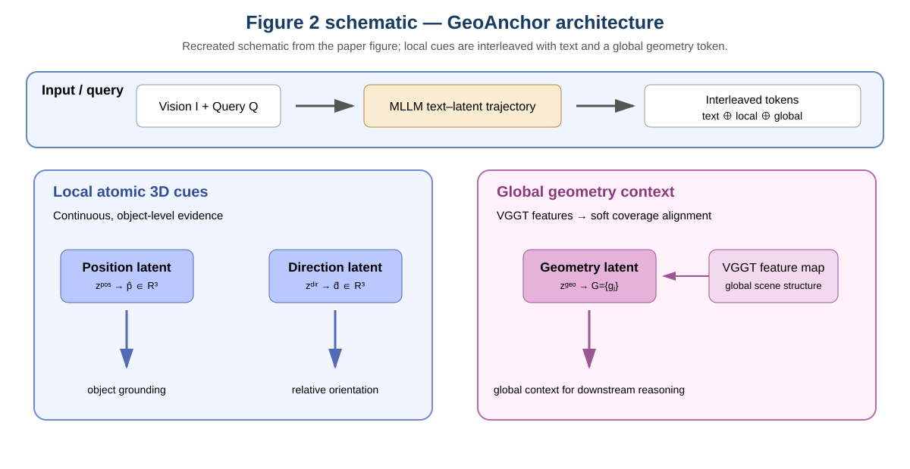
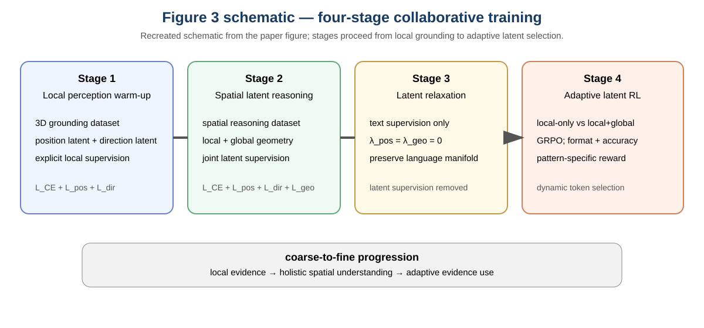
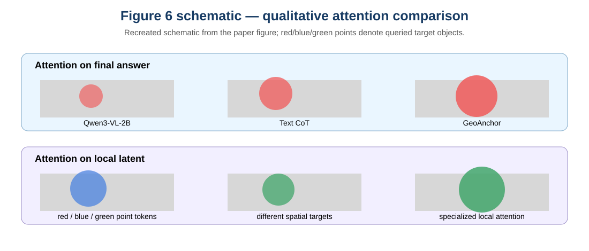

# GeoAnchor: Collaborative Reasoning via Latent Decomposition for 3D Spatial Understanding

> **阅读范围说明**：以下笔记依据所给 PDF 的全部 **23 个物理页**（正文 PDF pp.1–15；附录 PDF 物理 pp.16–23，对应附录印刷页 pp.1–8）整理。特别复核了物理页 19–23 的连续内容，并将物理页 21–23 单独作为附录补全，覆盖 Table 9–14、Appendix C.2.2 的 dense alignment baselines 以及 Appendix D 的 additional experiments。文中用“作者声称”标示论文的结论，用“可观察证据”标示表格、公式或图中的直接信息，用“我的判断”标示对方法和证据强弱的解释。所有关键事实均在 `paper_DeepPaperNote.grounding.json` 中有可恢复的物理页/章节/图表/公式锚点。

## 核心信息

- **题目**：GeoAnchor: Collaborative Reasoning via Latent Decomposition for 3D Spatial Understanding
- **作者**：Hao Li、Han Fang、Zixin Pan、Xin Wei、Hongbo Sun、Jinglin Xu、Zhiyu Lin、Ye Yuan、Zhongjiang He、Yu Yu、Hao Sun；正文将 Hao Sun 标为通讯作者。[证据 G001；PDF p.1]
- **单位**：Shanghai Jiao Tong University；Xingchen AGI Lab, China Telecom Artificial Intelligence Technology (Beijing) Co., Ltd.；University of Science and Technology Beijing；The Hong Kong University of Science and Technology (Guangzhou)。[证据 G001；PDF p.1]
- **版本身份**：arXiv:2607.13454v2，页面日期 July 14, 2026；PDF 首页给出代码链接 `https://github.com/JerryPW/GeoAnchor`。[证据 G002；PDF p.1]
- **研究定位**：3D/多模态空间推理。它不是具身动作控制或世界生成系统，而是把单图像中的对象位置、相对方向和场景几何组织成可训练的视觉语言模型（VLM）推理中间表示。[证据 G003；PDF pp.1–4]
- **基座与规模**：在 Qwen3-VL-2B 上实现；局部位置、方向 latent 长度均为 2，全局几何 latent 长度为 8。[证据 G004；PDF p.8, §4.1]

## 原文摘要翻译

尽管多模态大语言模型（MLLM）已经取得显著进展，但从二维图像理解三维空间关系仍然困难。现有方法主要依赖符号文本 token；这类 token 天然缺乏表达连续几何信息的保真度。近期方法尝试使用 latent representation 增强推理，但通常依赖单一 latent 类型，无法适应空间任务的多样性，从而在复杂几何场景中产生错配。

为此，作者提出 GeoAnchor，一种交错的 text–latent reasoning framework。GeoAnchor 将 3D 空间信息分解为三个互补成分：用于对象 grounding 的 position latent、用于关系朝向的 direction latent，以及用于场景结构的 geometry latent。三个成分在结构化空间中重新组合：前两者提供显式且可追踪的目标局部证据，geometry latent 编码全局场景上下文。该设计支持动态、可解释的空间推理。作者进一步提出 collaborative training strategy，使模型从局部空间感知逐步发展到整体 3D 理解。实验覆盖多个复杂 3D 推理任务，作者据此声称 GeoAnchor 同时具有更好的效果和泛化能力。[证据 G005；PDF p.1]

## 创新点

1. **把“一个混合 latent”拆成三种职能明确的 latent**：position 负责对象坐标，direction 负责相对方向，geometry 负责全局场景结构，而不是让一个中间向量同时承担互不相同的几何任务。[证据 G006；PDF pp.2, 5–6, Fig.2]
2. **text–latent 交错轨迹**：文本 token 继续负责语义规划与逻辑生成，固定长度的连续 latent 负责承载连续 3D 信息；每个 latent 通过投影回到输入 embedding 空间，以减轻 hidden-state/output-embedding 空间不一致带来的 latent drift。[证据 G007；PDF pp.4–5, Eq.1–3]
3. **四阶段协同训练**：local perception warm-up → spatial latent reasoning → latent relaxation → adaptive latent RL。核心不是简单多加训练轮数，而是先建立局部几何锚点，再允许局部与全局证据协作，随后去掉显式 latent 监督以回到语言流形，最后用 pattern-specific reward 学习何时只用局部、何时调用全局。[证据 G008；PDF pp.6–8, Fig.3]
4. **全局 token 的 soft-coverage 对齐**：不用把高分辨率 VGGT feature map 与少量 geometry token 做严格一一匹配，而是用多尺度平均池化、token-feature 相似度和均衡使用正则，使 geometry tokens 覆盖场景级几何。[证据 G009；PDF pp.5–6, Eq.7–8；Table 5]
5. **证据链而非只看最终答案**：作者用局部 token 的注意力、最终答案的视觉区域注意力和 t-SNE 观察中间表示，试图说明 latent 真正吸收了空间证据。[证据 G010；PDF pp.10–11, Figs.5–7]

## 一句话总结

GeoAnchor 的真实核心是：用 position/direction 两类局部连续 latent 建立“对象级空间锚点”，用 geometry latent 补足“场景级上下文”，再用分阶段训练和自适应 RL 学习证据调用策略；因此它更像一个**几何证据分工 + 训练课程 + 调用策略**的组合，而不是单独一种新型 VLM 架构。[我的判断，依据 G006–G009]

## 研究问题

论文针对三个相互关联的瓶颈：

- **离散文本表达不适合连续几何**：坐标、深度、方向被 verbalize 成文本后，精细空间线索会丢失，尤其不利于数值估计和对象定位。[证据 G011；PDF pp.1–2, §1]
- **单一 latent 的任务错配**：深度类 latent 可以捕捉近远关系，却难以表达超出深度的复杂空间结构；全局几何 latent 又可能没有精确对象间距离所需的局部证据。[证据 G012；PDF pp.2–3, §1–2]
- **固定调用模式不经济**：如果每个问题都强制调用局部和全局 token，简单局部问题会接收冗余信息；论文希望让模型在 local-only 与 local+global 两种 pattern 之间动态选择。[证据 G013；PDF pp.7–8, §3.3]

**我的判断**：论文真正的假设不是“latent 一定优于 text”，而是“空间信息的粒度与职能应当匹配 latent 类型，并且调用应由问题决定”。因此 Table 2（latent 类型）和 Table 3（训练阶段/奖励）比单纯的最终 SOTA 数字更能检验论文的科学主张。[我的判断，依据 G006、G013、G025–G027]

## 数据与任务定义

### 训练数据

- **3D grounding dataset**：从 ScanNet 的超过 250 万视图、1,500+ 场景中采样 10k 场景视图；用 Qwen3-VL-32B 为每张图像抽取最多 5 个显著对象、文本描述和 2D bounding box，再用 Depth Anything v3 估计深度图和相机 pose，通过 back-projection 得到 3D 坐标。每个样本涉及 1–3 个对象；过滤无效检测和几何不可靠样本后得到约 550k grounding samples。[证据 G014；PDF pp.7, 附录 PDF pp.2–4, §B.2.1–B.2.3, Table 7]
- **自一致性过滤**：共自动抽取 47,663 个对象标注，44,998 个通过重新 grounding 的检查，保留率 94.41%；原框与重新框的 mean/median IoU 为 0.787/0.856。[证据 G015；附录 PDF p.3, Table 5]
- **伪深度的可靠性检查**：与 ground-truth depth 恢复的坐标相比，平均/中位 Euclidean error 为 0.09 m/0.04 m；轴向误差为 $x=0.02$ m、$y=0.01$ m、$z=0.08$ m，Acc@0.5m 为 98.0%，Acc@0.2m 为 92.9%。[证据 G016；附录 PDF p.3, Table 6]
- **空间推理训练集**：从 SPAR 采样 100k questions，从 SpatialLadder-26K 采样 5k，合计 105k samples；用于 Stage 2、Stage 3 和 Stage 4。[证据 G017；PDF p.7, §3.4]
- **SPAR 训练抽样细节**：附录 Table 8 显示 ScanNet、ScanNet++、Structured3D 三个来源各有任务条目，总计 100,000；其中不同任务有 4,000 或 8,000 条。[证据 G018；附录 PDF p.5, Table 8]

### 评测基准与任务

- **SPAR-Bench**：正文实验使用 single-image 子集，共 2,866 个样本；包括 depth prediction、distance prediction、distance inference、object spatial relation、spatial imagination 等任务。[证据 G019；附录 PDF p.1, Table 1]
- **SPBench-SI**：正文实验使用 single-image benchmark，共 1,009 样本；包含 object relative direction、relative distance、absolute distance、object size estimation。[证据 G020；附录 PDF p.2, Table 2]
- **ViewSpatial-Bench**：原 benchmark 超过 5,700 个多选 QA、覆盖 1,000+ 场景；正文只使用 single-image evaluation subset，共 4,607 样本，分 camera-perspective 与 person-perspective 两组任务。[证据 G021；附录 PDF pp.2–3, Table 3]
- **分组指标**：SPAR-Bench 按 Depth/Distance/Proximity/Relation/View 分组，SPBench 按 Relative/Absolute 分组，ViewSpatial 按 Camera/Person 分组；每个 grouped metric 是对应原始任务的平均值。[证据 G022；附录 PDF p.2, §A.4, Table 4]

**任务层面的注意点**：训练和测试并非完全同源。SPAR-Bench 与 SPBench 被作者作为 in-domain benchmark，ViewSpatial 被作为 out-of-domain generalization；但 ViewSpatial 的正文实验也只评估 single-image 子集，不能把结果外推到多视角/视频全设置。[证据 G023；PDF p.8；附录 PDF pp.2–3]

## 方法主线

### 机制流程

> 图示为依据论文 Fig.2 重绘的可读示意图，不是对 PDF 的像素裁剪；原图说明：局部 token 捕捉对象位置与对象间方向，全局 token 编码整体场景结构。[证据 G024；PDF p.4, Fig.2]

给定图像 $I$ 和问题 $Q$，GeoAnchor 产生交错轨迹：

$$
\mathcal{O}=t_1\oplus z_1\oplus\cdots\oplus z_{k-1}\oplus t_k. \tag{1}
$$

其中 $t=\{t_1,\ldots,t_k\}$ 是文本 token 序列，$z=\{z_1,\ldots,z_{k-1}\}$ 是 latent 序列；每个 latent 不是一个 embedding，而是长度为 $M$ 的 hidden-state 序列 $z_i=\{h_{i,1},\ldots,h_{i,M}\}$。[证据 G025；PDF p.4, §3.1, Eq.1]

生成第 $i$ 个 latent 时，模型 hidden state 写作：

$$
h_i=f_\theta^{\mathrm{hidden}}(Q,I,\mathcal{O}_{<z_i},h_{i,1:j-1}). \tag{2}
$$

由于输出 hidden-state 空间与输入 embedding 空间可能不一致，论文用投影器 $\mathcal{P}$ 将 hidden state 变成后续步骤可接收的 embedding：

$$
e_{i,j}=\mathcal{P}(h_{i,j})=\mathrm{LayerNorm}\big(h_{i,j}+\mathrm{MLP}(\mathrm{LayerNorm}(h_{i,j}))\big). \tag{3}
$$

**我的判断**：Eq.3 是工程上很关键但容易被标题遮蔽的稳定性机制。论文把 latent 当作 autoregressive trajectory 的中间输入，而不是只在末端读取的旁路 feature；因此 latent 漂移会直接破坏后续生成，投影回输入空间是必要的接口设计。[我的判断，依据 G025]

### 局部三维 token：position 与 direction

论文把空间推理分成“获取局部原子 3D cue”和“构建全局几何上下文”两个阶段。局部 token 由：

$$
z^{\mathrm{pos}}=\{h^{\mathrm{pos}}_1,\ldots,h^{\mathrm{pos}}_{l_{\mathrm{pos}}}\},\quad
z^{\mathrm{dir}}=\{h^{\mathrm{dir}}_1,\ldots,h^{\mathrm{dir}}_{l_{\mathrm{dir}}}\}. \tag{4}
$$

对每类 latent 沿 sequence 维平均，再用独立线性头预测位置与方向：

$$
\hat p=W_{\mathrm{pos}}\frac{1}{l_{\mathrm{pos}}}\sum_{j=1}^{l_{\mathrm{pos}}}h^{\mathrm{pos}}_j,\qquad
\hat d=W_{\mathrm{dir}}\frac{1}{l_{\mathrm{dir}}}\sum_{j=1}^{l_{\mathrm{dir}}}h^{\mathrm{dir}}_j. \tag{5}
$$

这里 $\hat p\in\mathbb{R}^3$ 是预测 3D position，$\hat d\in\mathbb{R}^3$ 是预测 direction；ground truth 分别是位置坐标 $p$ 与方向向量 $d$。位置采用 Smooth L1：

$$
\mathcal{L}_{\mathrm{pos}}=
\begin{cases}
\frac12(\hat p-p)^2,&|\hat p-p|<1,\\
|\hat p-p|-\frac12,&\text{otherwise},
\end{cases}
$$

方向采用余弦损失：

$$
\mathcal{L}_{\mathrm{dir}}=1-\frac{\hat d\cdot d}{\|\hat d\|_2\|d\|_2}. \tag{6}
$$

[证据 G026；PDF pp.5–6, §3.2, Eq.4–6]

**职能分离的含义**：position token 更接近“目标在哪里”，direction token 更接近“两个对象的相对朝向/位移关系”；geometry token 不参与这两个局部回归头，而是负责全局结构。Table 4 的类别消融直接检验了 position/direction 分工。[证据 G027；PDF pp.5, 9–10, Table 4]

### 全局 geometry token 与 soft coverage

全局 latent $z^{\mathrm{geo}}$ 被线性投影成 $l_{\mathrm{geo}}$ 个 geometry token：

$$
G=\{g_1,\ldots,g_{l_{\mathrm{geo}}}\}\in\mathbb{R}^{l_{\mathrm{geo}}\times D}.
$$

VGGT 最后一层产生高分辨率特征图。论文不强求每一个 geometry token 与一个固定网格位置严格对齐，而先对不同空间分辨率做 multi-scale average pooling，把所有尺度展平并拼接为 supervision feature map $V\in\mathbb{R}^{l_{\mathrm{vggt}}\times D}$。对 $v_i$ 与 $g_j$：

$$
A_{i,j}=\frac{\langle v_i,g_j\rangle}{\tau},\qquad
u_j=\frac{1}{l_{\mathrm{vggt}}}\sum_{i=1}^{l_{\mathrm{vggt}}}
\frac{\exp(A_{i,j})}{\sum_{j'=1}^{l_{\mathrm{geo}}}\exp(A_{i,j'})}. \tag{7}
$$

对齐损失为：

$$
\mathcal{L}_{\mathrm{geo}}=-\frac{1}{l_{\mathrm{vggt}}}\sum_i\log\sum_j\exp(A_{i,j})
+\lambda_{\mathrm{bal}}\sum_j\nu_j\left(\log\nu_j-\log\frac{1}{l_{\mathrm{geo}}}\right). \tag{8}
$$

第一项要求每个 VGGT feature 至少被某个 geometry token 覆盖；第二项通过均衡正则防止所有信息坍缩到单个 token。[证据 G028；PDF pp.5–6, Eq.7–8]

**我的判断**：soft coverage 解决的是“高分辨率场景 feature 如何压缩进 8 个 token”的粒度问题，而不是证明 8 个 token 具有可解释的固定语义。论文的 t-SNE 和注意力图支持“全局/局部角色不同”，但不能单独证明每个 $g_j$ 都对应稳定的物理部件。[我的判断，依据 G028、G035–G037]

### 四阶段 collaborative training

> 图示为依据论文 Fig.3 重绘；原图将四阶段概括为由局部感知到整体空间理解，再到自适应 latent 选择。[证据 G029；PDF p.6, Fig.3]

1. **Stage 1 — Local Perception Warm-up**：用大规模 3D grounding 数据同时训练位置与方向 latent；局部 latent 用 $\mathcal{L}_{\mathrm{pos}}$、$\mathcal{L}_{\mathrm{dir}}$，文本用 next-token loss $\mathcal{L}_{\mathrm{NTP}}$：
   $$\mathcal{L}_{\mathrm{stage1}}=\lambda_t\mathcal{L}_{\mathrm{NTP}}+\lambda_l(\mathcal{L}_{\mathrm{pos}}+\mathcal{L}_{\mathrm{dir}}). \tag{9}$$
   目的不是先解决完整推理，而是把局部对象证据训练成可用的 latent。[证据 G030；PDF pp.6–7, Eq.9]
2. **Stage 2 — Spatial Latent Reasoning**：在空间推理数据上加入 geometry latent，同时联合局部回归、全局对齐和文本生成：
   $$\mathcal{L}_{\mathrm{stage2}}=\lambda_t\mathcal{L}_{\mathrm{NTP}}+\lambda_l(\mathcal{L}_{\mathrm{pos}}+\mathcal{L}_{\mathrm{dir}})+\lambda_g\mathcal{L}_{\mathrm{geo}}. \tag{10}$$
   这一阶段学习 local+global 的协作与基本 latent selection。[证据 G031；PDF p.7, Eq.10]
3. **Stage 3 — Latent Relaxation**：将 $\lambda_l$ 与 $\lambda_g$ 设为 0，仅保留文本监督。作者的解释是，持续的显式几何对齐会把 latent 拉离原语言 manifold，故此阶段让模型保留已经学到的空间能力，同时重新适配语言分布。[证据 G032；PDF p.7, §3.3]
4. **Stage 4 — Adaptive Latent RL**：用 GRPO 训练两种 pattern：local-only 与 local+global。每题采样 $N$ 个 response，维护每种 pattern 的 EMA accuracy：
   $$
   \mathrm{Acc}_t=\frac{n_t^{\mathrm{correct}}+\kappa\mathrm{Acc}^{\mathrm{hist}}_t}{n_t+\kappa},\qquad
   \mathrm{Acc}^{\mathrm{hist}}_t\leftarrow(1-\mu)\mathrm{Acc}^{\mathrm{hist}}_t+\mu\frac{n_t^{\mathrm{correct}}}{n_t}.
   \tag{11}
   $$
   accuracy 更高的 pattern 获得额外 $r_{\mathrm{pattern}}$，并与格式奖励共同组成 reward；这样模型可在局部证据不足时调用 geometry。[证据 G033；PDF pp.7–8, Eq.11]

**训练设计的关键因果链**：Stage 1 先让局部 token 有几何含义；Stage 2 才能把 geometry 加进推理；Stage 3 避免显式几何损失破坏语言生成；Stage 4 才有机会学习调用策略。若跳过顺序，最终增益不能简单归因于 latent decomposition 本身。[我的判断，依据 G030–G033]

## 关键结果

### 主结果与强基线

Table 1 的主结果（所有数值为 accuracy，%）如下；SPAR-Bench 的 grouped columns 为 Avg/Dep./Dis./Prox./Rel./View，SPBench 为 Avg/Rel./Abs.，ViewSpatial 为 Avg/Cam./Per.：[证据 G034；PDF p.8, Table 1]

| 模型 | 参数 | SPAR Avg | SPBench Avg | ViewSpatial Avg |
|---|---:|---:|---:|---:|
| GPT-4o | — | 40.1 | 53.4 | 37.5 |
| Gemini-2.5-Flash | — | 48.7 | 51.5 | 44.0 |
| Qwen3-VL-2B（base） | 2B | 32.4 | 52.9 | 36.3 |
| SpatialLadder | 4B | 32.4 | 56.8 | 43.3 |
| Qwen3-VL-2B + GeoAnchor | 2B | **68.4** | **69.7** | **47.0** |

在基座对比中，GeoAnchor 相对 Qwen3-VL-2B 的平均准确率提升分别为 **36.0、16.8、10.7 个百分点**；相对 GPT-4o，SPAR Avg 与 SPBench Avg 更高，但 ViewSpatial Avg 为 47.0 对 37.5，仍需注意不同模型/评测设置的可比性。[证据 G035；PDF pp.2, 8；Table 1]

更细的强项与弱项：GeoAnchor 在 SPAR 的 Rel./View 上为 84.6/68.8，在 SPBench 的 Rel./Abs. 上为 86.7/56.7，在 ViewSpatial 的 Cam./Per. 上为 47.5/46.0；它在 SPBench Abs. 上低于 SpatialLadder（65.0），说明平均领先不等于每个子任务都领先。[证据 G036；PDF p.8, Table 1]

**作者声称**：GeoAnchor 超过 base model 36.0% 与 16.8%，并在 out-of-domain ViewSpatial 上相对 base 提升 10.7%，表明具有泛化能力。[证据 G035；PDF pp.2, 9]

**我的判断**：论文最有说服力的是同一 2B base 的大幅提升和跨 benchmark 的方向一致性；但 ViewSpatial 的绝对增益小于 SPAR，且 Abs. 子任务落后强专用模型，因而更准确的结论是“分解和训练显著改善多个设置”，而非“已解决通用 3D 空间理解”。[我的判断，依据 G035–G036]

### 消融到底说明了什么

#### latent reasoning 与 token 分解（Table 2）

| 设置 | SPAR | SPBench | ViewSpatial | Avg |
|---|---:|---:|---:|---:|
| Qwen3-VL-2B | 32.4 | 52.9 | 36.3 | 40.5 |
| vanilla SFT | 56.4 | 58.1 | 40.9 | 51.8 |
| + text CoT SFT | 60.1 | 52.9 | 42.2 | 51.7 |
| Latent Reasoning（单 latent 基线） | 62.4 | 57.8 | 40.5 | 53.6 |
| local tokens | 65.8 | 66.9 | 44.4 | 59.0 |
| global token | 63.8 | 64.3 | 46.0 | 58.0 |
| local + global token | **67.5** | **68.8** | **46.3** | **60.9** |

[证据 G037；PDF p.9, Table 2]

可观察到：text CoT 并未在三个 benchmark 上稳定改善；单一 latent 也弱于 local+global；局部与全局共同使用取得最高平均值。作者据此认为 continuous 3D information 用 latent 表达比 textual reasoning 更有效，且分解减轻单 latent 的语义负担。[证据 G038；PDF p.9, §4.3]

**我的判断**：Table 2 证明了“组合比单路更好”，但不完全证明 position/direction/geometry 三种具体语义分配分别是必要的，因为表中 local tokens/global token 的实现细节和参数量是否完全匹配没有在正文明确展开。这是分解设计的主要待验证点。[我的判断，依据 G037–G038]

#### 四阶段与 pattern reward（Table 3、Fig.4）

> 图示为依据论文 Fig.4 重绘并转写数值；柱值和比较关系以 PDF Fig.4 为准。[证据 G039；PDF p.10, Fig.4]

作者报告 Stage 1、2、3 分别带来 5.0、14.6、23.0 的性能提升；Fig.4 中 SPAR 的代表性柱值为 52.8、63.5、56.9、67.5，SPBench 为 41.0、61.2、53.3、68.8，ViewSpatial 为 19.8、40.2、36.8、46.3。图中“额外 Stage 2”对比说明，简单重复 Stage 2 并不能替代 latent relaxation；合理的损失权重和 Stage 3 更重要。[证据 G039；PDF pp.9–10, Fig.4；Table 3]

Table 3 的最终行显示加入 pattern reward 后，SPAR/SPBench/ViewSpatial/Avg 达到 68.4/69.7/47.0/61.7；未使用 pattern reward 时为 67.8/69.2/46.2/61.1。[证据 G040；PDF p.9, Table 3]

**我的判断**：pattern reward 的平均增益仅 0.6 个点，但它的价值在机制层面大于数值层面：它把“是否调用 global token”从固定模板变成可学习决策。不过论文没有给出每类问题到底选择了多少 local-only/local+global，也没有报告 pattern selection 的混淆或成本，因此“更高效”尚未被直接测量。[我的判断，依据 G033、G040]

#### 局部 token 的语义专门化（Table 4）

| 问题设置 | Position | Direction | Mixed |
|---|---:|---:|---:|
| Position token only | 65.2 | 36.5 | 55.8 |
| Direction token only | 62.9 | 38.7 | 53.5 |
| Full local token | **66.4** | **39.4** | **57.0** |

[证据 G041；PDF p.9, Table 4]

两个 token 同时使用在三类问题上都最好；只用 position 时 direction 类明显下降，只用 direction 时 position 类也受损。这个结果支持“局部 token 的职能互补”，但因为 position-only 与 direction-only 可能同时改变了可用 token 数量，仍不是完全隔离的因果实验。[证据 G041；我的判断]

#### VGGT 对齐策略（Table 5）

| 对齐 | SPAR | SPBench | ViewSpatial | Avg |
|---|---:|---:|---:|---:|
| Dense — Mean Pooling | 59.9 | 66.8 | 45.5 | 57.4 |
| Dense — Adaptive Pooling | 66.9 | 65.5 | 44.4 | 59.3 |
| Dense — Linear Interpolation | 63.7 | 60.5 | 37.3 | 53.8 |
| Soft Coverage — Multi-Scale Pooling | **68.4** | **69.7** | **47.0** | **61.7** |

[证据 G042；PDF p.10, Table 5]

soft coverage 在三项 benchmark 上均为最佳，支持“场景级 geometry 不应被硬压缩成一一对应网格”的设计判断。但它同时改变了 alignment loss 与 pooling 方式，所以该表主要是系统级策略对比，不是单一组件的纯消融。[我的判断，依据 G028、G042]

### 可解释性与中间证据

> 图示为依据论文 Fig.6 重绘；原始图的注意力热图应以 PDF 为准，示意图只保留比较逻辑。[证据 G044；PDF pp.10–11, Fig.6]

- **答案 token 的注意力**：Fig.5 的柱图比较 Text CoT、GeoAnchor（无 Stage 1）和 GeoAnchor。作者观察 GeoAnchor 更倾向于局部 latent，而 Text CoT 对数值符号的注意力较弱；这支持“latent 聚合空间相关信息”的解释。[证据 G043；PDF p.10, Fig.5]
- **视觉区域 grounding**：Fig.6 上半部分显示 GeoAnchor 的最终答案注意力更集中于问题相关目标区域；baseline 关注更分散。下半部分不同 local latent 对 red/blue/green target 呈现不同视觉注意模式，作者据此声称局部 latent 有空间专门化。[证据 G044；PDF pp.10–11, Fig.6]
- **latent 的几何位置**：Fig.7 用 t-SNE 可视化 text、image、VGGT 和 global token；global token 位于 VGGT 与 text token 之间。作者将其解释为 geometry latent 保持几何流形同时保留语言语义。[证据 G045；PDF p.11, Fig.7]

**证据等级判断**：这些图是机制的相关性证据，不是因果证据。注意力可能是生成策略的结果而非忠实解释，t-SNE 的二维邻近关系也依赖投影参数；论文没有提供 intervention（屏蔽某类 latent 后逐样本变化）或 probe accuracy，因此“可解释”应理解为“有可观测的职能分化迹象”，不应升级为严格可解释性结论。[我的判断，依据 G043–G045]

## 附录 C/D 补全：物理页 19–23

以下内容专门补上此前阅读在 Appendix C.2.2 截止后的证据。物理页 19–20 与物理页 21–23 的标题、表格和段落连续：C.2.2 在物理页 20 开始，物理页 21 继续其三个 dense baselines；随后是 Table 9–11，最后进入 Appendix D 的 Table 12–14。[证据 G049、G052]

### C.2.2 Dense Alignment Baselines for Global Geometry Supervision

作者说明，三种 dense alignment baseline 都使用 §3.2 中投影得到的 geometry tokens，区别只在于如何把 VGGT dense feature sequence 压缩到 $l_{geo}$ 的长度。令 VGGT 特征为 $F=\{f_1,\ldots,f_{l_f}\}\in\mathbb{R}^{l_f\times D}$，其中 $l_f=H\times W$；投影后的 geometry tokens 为 $G=\{g_1,\ldots,g_{l_{geo}}\}\in\mathbb{R}^{l_{geo}\times D}$。[证据 G055；物理页 20–21/附录印刷 pp.5–6, §C.2.2, Eq.3–4]

- **Mean Pooling**：沿 sequence 维分别把 dense VGGT 序列与 geometry-token 序列平均成一个全局向量，再用 Smooth L1 直接对齐；也就是在 alignment 前把整条 feature sequence 压成单一 scene-level representation。[证据 G055；物理页 21/附录印刷 p.6, §C.2.2]
- **Adaptive Pooling**：把 VGGT 序列自适应重采样到 $l_{geo}$，分成 $l_{geo}$ 个长度近似相等的连续 bin，对每个 bin 内的 feature 求平均；每个 geometry token 得到一个对应的 dense target，形成 token-wise dense supervision。[证据 G055；物理页 21/附录印刷 p.6, §C.2.2]
- **Linear Interpolation**：同样把 VGGT 序列变为 $l_{geo}$，但用二维线性插值替代平均池化，在相邻 VGGT feature 之间连续插值并保留 sequence order。对后两种 baseline，记重采样序列为 $\bar F=\{\bar f_1,\ldots,\bar f_{l_{geo}}\}$，作者使用
  $$\mathcal{L}_{dense}=\frac{1}{l_{geo}}\sum_{j=1}^{l_{geo}}\mathrm{SmoothL1}(g_j,\bar f_j). \tag{12}$$
  进行均匀的 token-wise 对齐。[证据 G055；物理页 21/附录印刷 p.6, §C.2.2, Eq.5]

**我的判断**：这一补充澄清了 Table 5 的控制变量：Mean Pooling 不只是“另一种 pooling”，它把序列压到单个场景向量；Adaptive Pooling 与 Linear Interpolation 才是长度匹配后的逐 token dense supervision。因此 Table 5 反映的是 alignment 粒度与压缩方式的系统比较，不能把 soft coverage 的优势归因于单一 pooling 算子。[我的判断，依据 G042、G055]

### Table 9–11：数据、实现与任务分组

- **SpatialLadder-26K 的实际抽样**：Table 9 给出的 5k 抽样并非 5,000 行整齐总数，而是 5,928 个空间推理样本：Relative Direction（multiple choice）2,253；Absolute Distance（numeric）1,127；Object Size（numeric）1,514；Relative Distance（multiple choice）1,034；合计 5,928。[证据 G053；物理页 21/附录印刷 p.6, Table 9] 这与正文“从 SpatialLadder-26K 采样 5k”的近似表述存在数量口径差异；应优先报告表格实际计数，同时保留作者的约数说法。[我的判断，依据 G017、G053]
- **完整实现设置**：Table 10 给出硬件为 $8\times$ NVIDIA A800；$l_{pos}=l_{dir}=2$、$l_{geo}=8$；S1 为 1 epoch/ batch 64/ $1\times10^{-4}$，S2/3 各 1 epoch/ batch 32/ $2\times10^{-5}$；$\lambda_t=1,\lambda_l=1,\lambda_g=0.1$，$L=3$、pooling resolutions $\{1,2,4\}$、$\lambda_{bal}=0.05$。RL 为每题 $N=8$ rollouts、temperature 1.0、$r_{pattern}=0.5$、$\beta=0.01$、learning rate $5\times10^{-7}$、$\kappa=8$、$\mu=0.2$。[证据 G054；物理页 21/附录印刷 p.6, Table 10] 这也纠正了旧笔记把 pattern reward 写成 0.1 的数值错误。[我的判断，依据 G047、G054]
- **局部 token 可解释性分组**：Table 11 把原始任务按所需局部空间证据重分为 Position、Direction、Mixed。Position 包含 SPAR-Bench 的 `depth_prediction_oc`、`depth_prediction_oo`、`distance_prediction_oc`、`distance_prediction_oo`、`distance_infer_center_oo`、`obj_spatial_relation`，SPBench 的 `object_rel_direction`、`obj_abs_distance`、`object_size_estimation`、`object_rel_distance`，以及 ViewSpatial 的 Camera–Relative Direction；Direction 包含 ViewSpatial 的 Camera–Object View Orientation 与 Person–Object View Orientation；Mixed 包含 SPAR-Bench 的 `spatial_imagination_oc`、`spatial_imagination_oo` 与 ViewSpatial 的 Person–Relative Direction。[证据 G056；物理页 22/附录印刷 p.7, Table 11] 该表使 Table 4 的 Position/Direction/Mixed 指标有可复核的任务映射，而不只是事后命名。[我的判断，依据 G041、G056]

### Appendix D：Additional Experiments

#### D.1 不同 base model（Table 12）

作者把 GeoAnchor 实例化到 Qwen2.5-VL-3B，并与同一 base 的 vanilla SFT、text CoT SFT 对比。Table 12 的 grouped accuracy（SPAR-Bench 为 Avg/Dep./Dis./Prox./Rel./View；SPBench 为 Avg/Rel./Abs.；ViewSpatial 为 Avg/Cam./Per.）为：[证据 G057；物理页 22/附录印刷 p.7, Table 12]

| 模型 | SPAR Avg | SPAR Dep. | SPAR Dis. | SPAR Prox. | SPAR Rel. | SPAR View | SPBench Avg | SPBench Rel. | SPBench Abs. | ViewSpatial Avg | Cam. | Per. |
|---|---:|---:|---:|---:|---:|---:|---:|---:|---:|---:|---:|---:|
| Qwen2.5-VL-3B | 28.7 | 25.5 | 25.7 | 55.6 | 29.4 | 21.7 | 32.9 | 42.8 | 26.5 | 37.3 | 39.7 | 33.6 |
| + vanilla SFT | 59.8 | 42.5 | 56.8 | 76.8 | 75.2 | 65.1 | 59.2 | 68.0 | 53.5 | 41.9 | 36.1 | 46.8 |
| + text CoT SFT | 60.7 | 45.2 | 60.6 | 74.2 | 76.1 | 62.5 | 54.5 | 56.2 | 50.1 | 39.3 | 36.8 | 43.1 |
| **GeoAnchor** | **66.0** | **49.7** | **62.9** | **81.5** | **81.0** | **71.4** | **66.1** | **76.6** | **59.3** | **47.0** | **46.8** | **47.4** |
| Improvement | +37.3 | +24.2 | +37.2 | +25.9 | +51.6 | +49.7 | +33.2 | +33.8 | +32.8 | +9.7 | +7.1 | +13.8 |

**作者声称**：GeoAnchor 在 Qwen2.5-VL-3B 上同样超过 vanilla SFT 与 text CoT SFT，说明框架可以接入不同 base model，并带来一致的 spatial reasoning 增益。[证据 G057；物理页 22/附录印刷 p.7, Table 12, §D.1] **我的判断**：这是跨 backbone 的补充证据，但它不是与 Qwen3-VL-2B 主实验完全相同的 base，因此同时支持的是“可移植性迹象”，不是两个 backbone 间的直接优劣比较。[我的判断，依据 G035、G057]

#### D.2 latent 长度消融（Table 13）

| Local | Global | SPAR | SPBench | ViewSpatial | Avg. |
|---:|---:|---:|---:|---:|---:|
| 1 | 8 | 64.5 | 67.3 | 38.7 | 56.8 |
| 3 | 8 | 65.4 | 64.1 | 35.2 | 54.9 |
| 2 | 4 | 66.1 | 66.2 | 41.8 | 58.0 |
| 2 | 6 | 66.7 | 67.7 | 45.6 | 60.0 |
| 2 | 10 | 65.3 | 66.5 | 43.2 | 58.3 |
| 2 | 12 | 65.7 | 66.4 | 41.6 | 57.9 |
| **2** | **8** | **67.5** | **68.8** | **46.3** | **60.9** |

[证据 G058；物理页 23/附录印刷 p.8, Table 13] **作者解释**：local length 2、global length 8 获得最高 overall performance；过短的 latent 形成 information bottleneck，过长则削弱紧凑性与功能专门化，2/8 是表达能力与紧凑性的折中。[证据 G058；物理页 23/附录印刷 p.8, §D.2] **我的判断**：该表支持“长度是需要调节的容量超参”，但没有把 token 数变化与训练 FLOPs、显存或推理延迟一起报告，不能直接推出 2/8 是成本最优点。[我的判断，依据 G058]

#### D.3 VGGT pooling resolution 消融（Table 14）

| Pooling resolution | SPAR | SPBench | ViewSpatial | Avg. |
|---|---:|---:|---:|---:|
| $\{1,2\}$ | 65.2 | 67.1 | 41.6 | 57.9 |
| $\{1,2,4,8\}$ | 64.3 | 66.8 | 44.3 | 58.5 |
| $\{6\}$ | 67.2 | 66.9 | 45.9 | 60.0 |
| **$\{1,2,4\}$** | **67.5** | **68.8** | **46.3** | **60.9** |

[证据 G059；物理页 23/附录印刷 p.8, Table 14] **作者解释**：多尺度 $\{1,2,4\}$ 在三个 benchmark 上均为最佳；相比更小的多尺度集合或单一细尺度，它能同时捕捉不同空间分辨率的互补几何 cue，在保留全局布局的同时保留更细的局部结构。即使单尺度 $\{6\}$ 使用了可比较的 token 数，也仍低于 $\{1,2,4\}$。[证据 G059；物理页 23/附录印刷 p.8, §D.3] **我的判断**：这为 soft-coverage 的 multi-scale 设计提供了比 Table 5 更细的分辨率证据；但 Table 14 仍是 pooling-resolution 的整体替换，不能单独拆出尺度数量、具体 resolution 或 token 数的纯因果效应。[我的判断，依据 G042、G059]

**补全后的证据边界**：物理页 23 是所给 PDF 的最后一页，Appendix D.3 在此结束；本 PDF 没有再提供 Table 15 或其他后续实验。首页虽给出 GitHub URL，但本次修复没有访问外部仓库，因此代码实现、运行方差和 PDF 外的 supplementary 仍未被本笔记核验。[证据 G049、G052；我的判断]

## 深度分析

### 真正贡献是什么

**第一层贡献是表示分解**：空间问题至少包含目标定位、相对关系和场景结构三个粒度。position/direction/geometry 的拆分使监督信号和问题类型有了对应接口。[证据 G006、G026、G028]

**第二层贡献是训练时序**：latent 的显式几何监督并非从头到尾持续施加，而是经历“对齐—协作—松弛—选择”。Stage 3 表明作者意识到几何回归损失可能伤害语言生成，这比单纯堆叠辅助损失更成熟。[证据 G030–G033、G039]

**第三层贡献是调用策略**：Stage 4 把 global token 当作有代价的证据源，不再假设所有问题都需要同样的信息。只是当前论文主要报告最终 accuracy，尚未把 token 数、延迟、显存或实际计算量纳入效率指标。[证据 G040；我的判断]

### 为什么结果可能成立

1. **监督更贴近目标**：position/direction 直接用 3D 坐标和向量监督，绕开把连续数值编码成离散词的瓶颈。[证据 G026]
2. **训练数据覆盖局部与全局**：约 550k grounding samples 先建立局部证据，105k spatial reasoning samples 再训练组合推理，数据规模和课程顺序共同提供了稳定学习信号。[证据 G014、G017]
3. **geometry 的压缩更宽松**：soft coverage 不要求高分辨率 VGGT 特征与 8 个 token 固定对齐，降低了过强 alignment 对 scene-level representation 的约束。[证据 G028]
4. **Stage 3 维持语言能力**：作者报告它优于单纯重复 Stage 2，说明 latent 的可用性不只来自几何 supervision 强度，也来自与语言生成 manifold 的兼容。[证据 G032、G039]
5. **任务与表示粒度匹配**：Table 4 中只保留 position/direction 会伤害对应类别，说明至少在当前 benchmark 上，局部证据分工与任务类型相吻合。[证据 G041]

### 容易误读的地方

- **“超过 GPT-4o”不等于全面超过闭源模型**：Table 1 是特定 benchmark、特定 single-image 子集和 grouped metric；不能据此宣称 GeoAnchor 在所有 3D 任务或通用视觉能力上胜出。[证据 G021–G023、G035]
- **“out-of-domain”是 benchmark 层面的表述**：ViewSpatial 的数据来源和任务视角不同，但论文仍只使用 single-image 子集；它不是跨传感器、跨城市或真实机器人部署泛化。[证据 G021、G023]
- **伪深度不是完整真实 3D 标注**：Depth Anything v3 + pose 的回投影误差检查很有用，但仍是估计监督；0.09m mean error 只说明在抽查/比较设置下接近 ground truth，不保证所有场景、所有对象都同样可靠。[证据 G014、G016；我的判断]
- **attention/t-SNE 不是因果解释**：它们能展示模式，不能证明 latent 语义稳定或模型真的“按物理理由”作答。[证据 G043–G045；我的判断]
- **RL 增益很小但机制叙述很强**：pattern reward 从 Avg 61.1 到 61.7，需避免把小幅提升叙述成已证明的高效动态推理。[证据 G040；我的判断]

### 复现注意点

- **依赖/基座**：Qwen3-VL-2B；VGGT 作为全局几何特征模型；grounding 数据构造使用 Qwen3-VL-32B、Depth Anything v3、ScanNet/ScanNet++/Structured3D。[证据 G014、G018、G028、G034]
- **训练超参**：Stage 1 训练 1 epoch，batch size 64，learning rate $1\times10^{-4}$；Stage 2/3 各 1 epoch，batch size 32，learning rate $2\times10^{-5}$；默认 $\lambda_t=\lambda_l=1,\lambda_g=0.1$。VGGT global feature 使用 $L=3$ 个尺度，$\{r_1,r_2,r_3\}=\{1,2,4\}$。[证据 G046；PDF p.8, §4.1]
- **附录实现补充**：Table 10 明确给出 geometry balance coefficient $\lambda_{bal}=0.05$，并确认基座、硬件为 Qwen3-VL-2B 与 $8\times$ NVIDIA A800；这些设置补充了正文 §4.1 的超参摘要。[证据 G054；物理页 21/附录印刷 p.6, Table 10]  
- **RL 设置**：每题 8 rollouts，temperature 1.0，pattern reward $r_{\mathrm{pattern}}=0.5$，KL coefficient 0.01，learning rate $5\times10^{-7}$；附录还明确给出 EMA smoothing coefficient $\kappa=8$ 与 update rate $\mu=0.2$。[证据 G047、G054；PDF p.8, §4.1；物理页 21/附录印刷 p.6, Table 10]
- **指标**：多选题直接报告 accuracy；数值题是 confidence threshold 0.5–0.9、步长 0.05 的平均 accuracy。[证据 G048；PDF p.8, §4.1]
- **数据生成可复现性**：论文给出生成流程、提示词示例和过滤阈值 IoU>0.5，但依赖外部 VLM 的对象描述与框预测；若 Qwen3-VL-32B 版本、prompt、随机种子或 Depth Anything 版本变化，550k 数据会变化。[证据 G014–G015；附录 PDF pp.2–3]
- **代码与附录**：首页给出 GitHub 链接，但本笔记只核对 PDF 内的链接文本，没有访问外部仓库。现在已核对到物理页 23：附录继续包含 Table 9–14、C.2.2 的 dense alignment baselines 与 Appendix D 的 additional experiments；PDF 外的代码、supplementary 和运行日志仍不在本次证据范围内。[证据 G002、G049、G052；PDF p.1；物理页 21–23/附录印刷 pp.6–8]

## 局限

1. **监督链条包含多个伪标签步骤**：文本 referring expression、2D box、Depth Anything 深度和 pose 共同影响 position/direction 监督；论文提供总体误差检查，但没有按物体类别、遮挡、深度范围或场景拆分误差。[证据 G014–G016；我的判断]
2. **评测覆盖有限**：正文三项 benchmark 都以 single-image 设置为主；ViewSpatial 的多视角能力没有在本文实验中充分展开，不能等同于真实多视角 3D understanding。[证据 G021–G023]
3. **缺少多次运行方差与显著性分析**：表格给出单个结果，没有报告随机种子、置信区间或不同训练运行的标准差；尤其对 Stage 4 的小增益，稳定性未知。[观察到 PDF pp.8–10 的报告形式；G034、G040]
4. **效率主张缺少直接测量**：动态选择 local-only/local+global 的想法暗示 token/计算节省，但没有报告选择比例、推理 FLOPs、延迟、显存或质量—成本曲线。[证据 G040；我的判断]
5. **可解释性证据仍属可视化层面**：attention 和 t-SNE 没有配套的 causal ablation/probing 或逐样本忠实性评估。[证据 G043–G045]
6. **表格对若干对照的控制信息不足**：Table 2/3 支持系统设计有效，但正文没有完整说明各 variant 的参数量、训练预算、prompt 和 sampling 是否完全一致，削弱了对每个组件的纯因果归因。[证据 G037、G039；我的判断]
7. **外部实现仍未核验**：物理页 21–23 已补足 PDF 内的 Table 9–14 与 Appendix C/D，但代码仓库、PDF 外 supplementary 和运行日志没有在本次修复中访问；因此实现细节以 Table 10 和本文其他明确设置为准，不能把仓库中可能存在的内容倒灌为 PDF 证据。[证据 G002、G049、G052；我的判断]

## 我的笔记

- 这篇工作的可迁移思想不是“给 VLM 增加更多 latent”，而是**先按空间证据的因果职责拆 token，再按训练阶段控制这些 token 对语言模型的扰动**。如果只复制三个 token 名称而没有 Stage 3 的 relaxation 和 Stage 4 的 selection，可能得到的是更复杂但更脆弱的接口。
- 对后续 3D agent 工作，值得保留一个显式的 **local evidence buffer**：对象坐标、相对方向和全局结构不要在同一个未命名 latent 中混合。这样后续规划器可以检查“我缺的是定位、关系还是场景 context”。
- 更强的下一步实验应做三件事：①屏蔽/替换每一类 latent 的 intervention，测逐题性能变化；②报告每种 pattern 的选择率与 token/FLOP/延迟；③按深度、遮挡、对象类别和空间关系难度切分伪标签噪声与泛化。
- Table 4 给出了一个实用诊断：如果任务只需要位置，direction token 可能是冗余；如果任务是 mixed，二者协作才有收益。这提示 agent 系统可按任务路由证据，而不是默认打开全部视觉工具。
- 结果最可信的范围是“在作者构造的数据与 single-image 3D benchmark 上，2B Qwen3-VL 经过几何 latent 课程训练后显著提升”。把它外推为真实世界绝对尺度理解、长期空间记忆或机器人执行能力，当前证据不够。

## 引用

Li, Hao, et al. “GeoAnchor: Collaborative Reasoning via Latent Decomposition for 3D Spatial Understanding.” arXiv:2607.13454v2, July 14, 2026. Code link in paper: `https://github.com/JerryPW/GeoAnchor`。[证据 G001–G002]

## 图表取舍

- 保留并本地示意化：Fig.2（总架构）、Fig.3（四阶段训练）、Fig.4（Stage 3 消融）、Fig.6（注意力可视化）。它们分别帮助理解方法接口、训练因果链、核心消融和解释性证据。[证据 G024、G029、G039、G044]
- 不单独嵌入 Fig.1（动机可由正文说明）、Fig.5（attention 柱图数值较小且正文已有结论）、Fig.7（t-SNE 解释依赖较强，不如文字批判性描述稳定）；Table 1–8 直接转写为 Markdown 或在正文列出关键数字，避免重复低分辨率表格。[证据 G050；figure decisions JSON]
- 本地 `images/` 中的 4 个 SVG 是**根据 PDF 图形与 caption 重绘的可读示意/数据图**，不是从只读 PDF 复制出的原始像素裁剪。原因是当前本地工具权限不允许执行 PDF 光栅化命令；该限制已在 figure decisions、grounding 和 lint JSON 中记录。原始 PDF 仍是唯一证据来源。[证据 G051]
