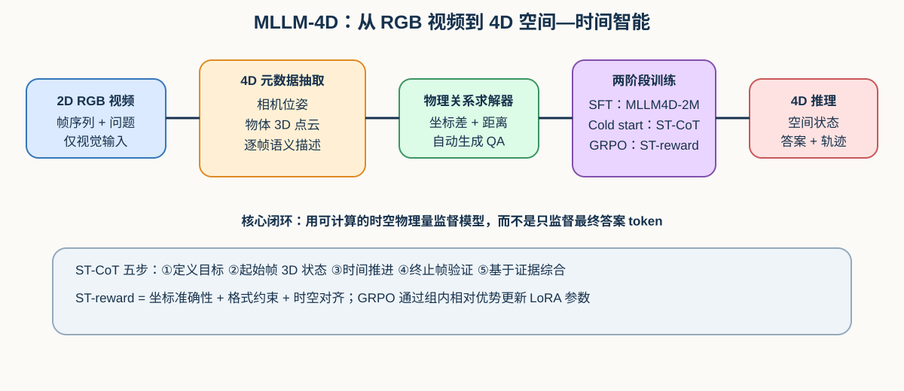
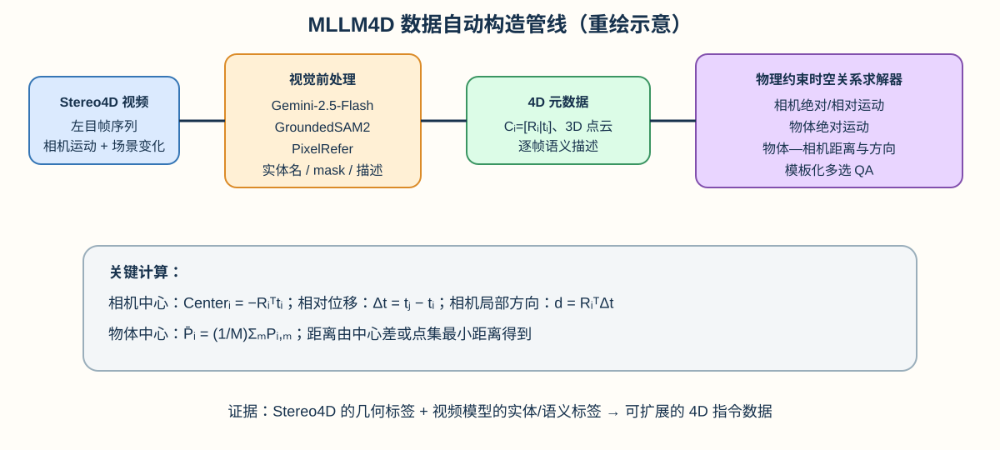
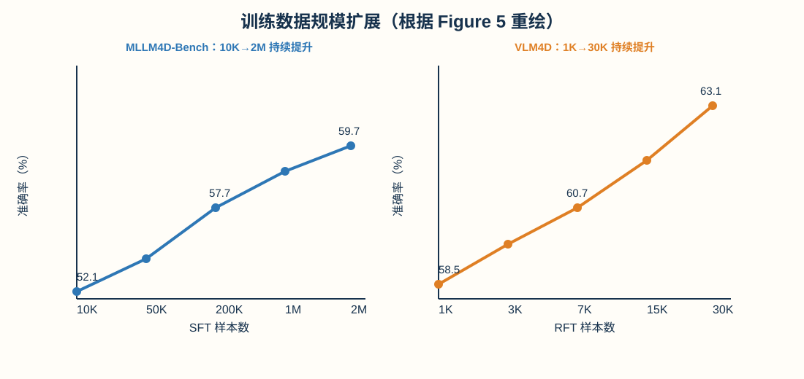
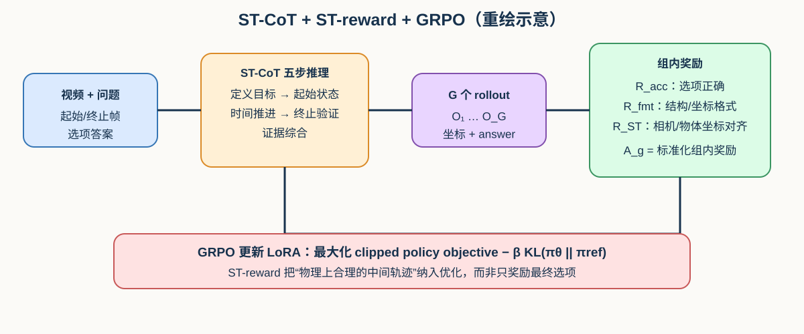

---
tags:
  - papers/3d-agent
  - papers/spatial-temporal-reasoning
  - papers/video-llm
aliases:
  - MLLM-4D
  - Visual-based Spatial-Temporal Intelligence
arxiv_id: 2603.00515
---
# MLLM-4D: Towards Visual-based Spatial-Temporal Intelligence

## 核心信息

- **标题**：MLLM-4D: Towards Visual-based Spatial-Temporal Intelligence
- **标题翻译**：MLLM-4D：迈向基于视觉的空间—时间智能
- **作者**：Xingyilang Yin、Chengzhengxu Li、Jiahao Chang、Chi-Man Pun、Xiaodong Cun
- **机构**：University of Macau；GVC Lab, Great Bay University；Xi’an Jiaotong University；The Chinese University of Hong Kong, Shenzhen（作者脚注，p.1）
- **身份**：arXiv:2603.00515v1 [cs.CV]；PDF 首页标注 2026-02-28，论文页脚另标 Preprint March 2, 2026（p.1）。这里以本地 PDF 的 arXiv 版本和日期为准。
- **代码**：论文在摘要页给出 <https://github.com/GVCLab/MLLM-4D>（p.2）；本笔记没有对仓库当前版本、权重或数据下载状态做外部核验。
- **论文定位**：视频 MLLM、4D 空间—时间推理、自动数据构造、ST-CoT 与物理约束强化学习。它属于 3D agent 研究地图中“从 RGB 视频恢复可查询时空状态，再为动态场景决策提供推理轨迹”的分支，而不是具身控制或世界生成论文。

> **先给结论。** MLLM-4D 的真正贡献不是给 Qwen3-VL 增加一个几何 encoder，而是把“可从视频观测验证的时空轨迹”变成训练信号：先用立体视频自动产生相机/物体 4D 元数据和物理可计算 QA，再用 SFT 建立空间锚点，最后用 ST-CoT 和 ST-reward 约束强化学习。作者在 MLLM4D-Bench 上报告 Qwen3-VL-8B 版本平均 **72.7%**；在 VLM4D 上，Table 2 的主比较中该版本为 **61.0%**，Table 3 的最终 ST-reward 消融配置达到 **63.1%**。这些数字代表的是一个数据、prompt、后训练和 reward 组成的完整系统，不能只归因于 ST-CoT 或 backbone（pp.7–8, Tables 1–3）。

## 原文摘要翻译

人类天生具有基于视觉的 4D 空间—时间智能，这种能力超越了静态三维几何的感知，能够从纯视觉输入感知并推理三维空间随时间的演化。然而，这项能力对于当前的多模态大语言模型（MLLM）仍是一个重要瓶颈。为此，论文提出 MLLM-4D，一个用于弥合时空理解与推理训练数据缺口的综合框架。

首先，作者设计了一个具有成本效率的数据构造管线，把已有立体视频数据集重新加工为高质量的 4D 空间—时间指令数据，得到 **MLLM4D-2M** 和 **MLLM4D-R1-30k**。前者用于监督微调（SFT），后者用于强化微调（RFT）；同时提出 **MLLM4D-Bench** 做综合评测。模型训练采用分层的后训练：SFT 先建立基础 4D 理解，随后通过带有 **Spatiotemporal Chain-of-Thought（ST-CoT）** 的 Group Relative Policy Optimization（GRPO），以及专门的 **Spatiotemporal reward（ST-reward）**，在不改动基础架构的情况下激活更强的 4D 推理能力。大量实验表明，MLLM-4D 只使用 RGB 视频输入，也能提升视觉时空理解与推理能力（pp.1–2, Abstract）。

## 创新点

1. **把 4D 数据构造从人工 QA 转为几何可计算的管线。** Stereo4D 的相机位姿、立体深度和物体点集被组织为逐帧元数据；再由距离、方向和坐标差计算答案，减少纯人工空间标注的成本（pp.3–4, Sec.3；p.12, Sec.8.2）。
2. **明确划分三类时空问题。** MLLM4D-Bench 覆盖 Independent Object Motion、Camera Ego-Motion、Object-Camera Dynamics；这比把所有“视频空间推理”混成一个分数更能区分物体运动、相机运动和二者耦合（p.3, Fig.2；p.4）。
3. **用 ST-CoT 把文本推理约束为时空状态推演。** 五步流程要求模型定义目标、解析起始帧、推进时间、核验终止帧，再基于视觉证据综合答案；输出还要包含 Object Center、Camera Center 等结构化坐标（pp.5–6, Sec.4.2；p.15, Fig.11）。
4. **把中间几何状态纳入 GRPO reward。** Accuracy reward 只看选项是否正确；ST-reward 额外比较相机/物体坐标与 ground truth 的对齐，并要求坐标格式正确（pp.6–7, Sec.4.3；p.15, Fig.10）。
5. **用两阶段后训练而非改造架构。** 论文以 Qwen3-VL-8B 与 Qwen2.5-VL-7B 为基础，用 LoRA 做 SFT、cold start 和 RFT；作者主张标准 2D 视觉编码器在高质量 4D 数据与后训练支持下也能获得稳健时空推理能力（pp.2,5–8）。

## 一句话总结

MLLM-4D 将“RGB 视频中的相机—物体时空变化”转成可自动求解的结构化轨迹，并用 ST-CoT + ST-reward 把中间空间状态而非仅最终答案纳入 MLLM 的强化学习目标。

## 研究问题

论文实际回答的是四个相互关联的问题：

- **数据问题**：能否从现有立体视频批量构造足够大、具有 4D 物理答案的指令数据，而不是依赖几千条人工 QA？（p.3, Sec.3）
- **表示问题**：只给 MLLM RGB 帧时，模型能否从跨帧视觉变化中恢复相机和物体运动的空间—时间关系？（pp.1–2, Sec.1）
- **训练问题**：SFT 先学会格式和基础空间状态后，GRPO 是否能通过专门 reward 学到更可信的 4D 推理轨迹？（pp.5–8, Sec.4）
- **泛化问题**：在 MLLM4D-Bench 之外，模型是否仍能在 VLM4D 上保持性能？（p.8, Sec.5.2, Table 2）

### 作者声称、论文直接证据与我的判断

- **作者声称**：MLLM-4D 在纯 RGB 视频上实现 state-of-the-art 4D understanding and reasoning（pp.2,7–8）。
- **直接证据**：Table 1/2 的对比、Table 3 的阶段消融和 Figure 5 的数据扩展曲线；主模型在 MLLM4D-Bench 的平均分 72.7%，VLM4D 在 Table 2 主比较中为 61.0%，Table 3 最终 ST-reward 配置为 63.1%（pp.7–8）。
- **我的判断**：证据支持“这个完整后训练系统有效”，但不能单独证明 ST-reward 是唯一或主要原因。Table 3 同时改变数据、SFT、GRPO 和推理格式；而且 baseline 多为未经过该数据管线的现成模型，比较结果包含数据与后训练优势。

## 数据与任务定义

### 三类任务空间

MLLM4D-Bench 将视觉时空理解拆成六种问题，按论文的三类范围组织（p.3, Fig.2；p.4）：

1. **Independent Object Motion**：物体在视频中的绝对位移，论文列出的代表类别是 Object Absolute Distance。
2. **Camera Ego-Motion**：相机的位移和朝向变化，包括 Camera Absolute Distance 与 Camera Relative Direction。
3. **Object-Camera Dynamics**：相机与移动物体之间的耦合关系，包括 Object-Camera Absolute Distance、Object-Camera Relative Distance、Object-Camera Relative Direction。

这种划分的要点是：同一个视觉变化可能来自相机移动、物体移动，或二者同时移动。若不分别定义参照系，模型可以凭外观变化猜答案，却不一定理解真实的运动归因（p.3）。

### 几何元数据

给定一段立体视频的左目帧 $\{I_i\}_{i=1}^{K}$，Stereo4D 提供每帧相机外参

$$C_i=[R_i\mid t_i],$$

其中 $R_i$ 是 $3\times3$ 旋转矩阵，$t_i$ 是 $3\times1$ 平移向量；每帧还得到物体的 metric 3D 点集

$$\{P_{i,m}\}_{i=1,m=1}^{K,M},$$

其中 $i$ 表示帧，$m$ 表示同一物体的点。作者先过滤低质量深度/位姿估计，再把逐帧点云和语义描述交给物理关系求解器（p.4, Sec.3；p.12, Sec.8.2）。

### 关系求解公式与变量含义

以下是附录 Sec.8.2 对主要 QA 类别的定义。它们是数据生成的 ground-truth 计算，不是模型推理时额外输入的传感器量。

- **Camera Absolute Distance**：相机在世界坐标中的中心为
  $$\mathrm{Center}_i=-R_i^Tt_i,$$
  两帧间的绝对距离为
  $$d_{cam\_abs\_dis}=\|\mathrm{Center}_j-\mathrm{Center}_i\|_2=\sqrt{\sum_{k=1}^{3}(\mathrm{Center}_{j,k}-\mathrm{Center}_{i,k})^2}.$$
- **Camera Relative Direction**：令世界坐标位移 $\Delta t=t_j-t_i$，将其投影到第 $i$ 帧相机坐标系：
  $$d_{cam\_rel\_dir}=R_i^T\Delta t=[d_x,d_y,d_z].$$
  论文采用标准相机约定：$+X$ 向右、$+Y$ 向下、$+Z$ 向前；选项方向由坐标分量及阈值判断（pp.4,12, Sec.3/8.2）。
- **Object Absolute Distance**：物体在帧 $i$ 的中心为
  $$\bar P_i=\frac{1}{M}\sum_{m=1}^{M}P_{i,m},$$
  物体位移为
  $$d_{obj\_abs\_dis}=\|\bar P_j-\bar P_i\|_2.$$
- **Object-Camera Absolute Distance**：先计算相机中心，再计算第 $j$ 帧物体点集到第 $i$ 帧相机中心的最近距离：
  $$d_{obj\text{-}cam\_abs}=\min_m\|P_{j,m}-\mathrm{Center}_i\|_2.$$
- **Object-Camera Relative Distance**：第 $i,j$ 帧的物体—相机最近距离分别为
  $$d_i=\min_m\|P_{i,m}-\mathrm{Center}_i\|_2,\quad d_j=\min_m\|P_{j,m}-\mathrm{Center}_j\|_2,$$
  相对变化为 $\Delta d=d_j-d_i$。用阈值 $\tau$ 离散化：$\Delta d>\tau$ 为 farther，$\Delta d< -\tau$ 为 closer，否则为 not moving。
- **Object-Camera Relative Direction**：把物体点变换到各自相机坐标系，$P^c_{i,m}=R_iP_{i,m}+t_i$，再比较两个时刻的物体中心在相机坐标中的横向与纵向变化。横向 $\Delta x$ 判定 left/right，纵深 $\Delta z$ 用阈值 $\tau$ 判定 closer/farther（p.13, Sec.8.2）。

这些公式把“看起来更大/更小”替换为可检验的坐标关系，是论文数据规模化的关键。不过，最终 QA 仍被模板化成近似距离或方向的多选题，故 benchmark 主要测离散答案正确性，而不是连续轨迹的全量恢复。

## 方法主线

### 机制流程

**图注。** 上图是依据论文 Figure 1、3、4 重绘的解释性示意图，不是 PDF 原图裁剪；它保留“RGB 视频 → 4D 元数据/QA → SFT → ST-CoT cold start → ST-reward GRPO → 4D 答案”的逻辑（pp.1,4–6）。

1. **从立体视频提取训练标签。** 使用 Stereo4D 的视频、相机位姿、逐帧 3D 点云；用 Gemini-2.5-Flash 识别移动实体和名词类别，用 GroundedSAM2 生成时序一致的 2D mask，再由 PixelRefer 生成物体级细粒度描述（pp.3–4, Fig.3；p.12, Sec.8.2）。
2. **用物理求解器生成 QA。** 将相机和物体的逐帧元数据代入上述公式，生成有 ground-truth 数值/方向的模板化问答，避免由语言模型臆造答案（p.4）。
3. **SFT 学基础 4D 状态。** 在 MLLM4D-2M 上训练模型正确识别时空锚点、坐标字段、推理格式与最终选项（p.5, Sec.4.1）。
4. **Cold start 对齐 ST-CoT。** 用带详细 Chain-of-Thought 的样本进行短阶段训练，使模型先学会按五步模板组织视觉、几何和运动证据（p.6, Sec.4.2）。
5. **GRPO 强化物理一致性。** 对每个视频问题采样一组输出，计算 accuracy、format 和 ST-reward，做组内优势归一化，再更新 LoRA 参数（pp.6–7, Sec.4.3）。

### SFT 阶段：只改变参数，不改变基础架构

论文基于 Qwen3-VL-8B-Instruct 或 Qwen2.5-VL-7B-Instruct。使用 LoRA，将 rank 为 128、alpha 为 256 的可训练低秩矩阵插入 Transformer 线性层；SFT 使用标准交叉熵：

$$\mathcal L_{ce}=-\sum_j\log P\left(o^{(j)}\mid o^{(1:j-1)},q,\{I_i\}_{i=1}^{N_k}\right), \tag{1}$$

其中 $q$ 是问题，$\{I_i\}_{i=1}^{N_k}$ 是输入视频帧，$o^{(j)}$ 是目标推理—答案轨迹中的第 $j$ 个 token。这个阶段的作用是先建立可用的 policy initialization，而非直接期待基础模型从零学会坐标格式（pp.5,12, Sec.4.1/8.1）。

### ST-CoT：从“描述变化”到“维护状态”

ST-CoT 的五步逻辑是（p.6, Sec.4.2；p.15, Fig.11）：

1. **Objective Alignment and Temporal Anchoring**：先明确问题要测的空间—时间对象，并锁定起始帧 $t_{start}$ 与终止帧 $t_{end}$。
2. **Start-frame 3D State Parsing and Anchoring**：在起始帧识别相机中心、物体中心、场景描述，形成量化的初始状态 $S_{t_{start}}$。
3. **Temporal Progression and Visual Cue Collection**：分析帧间尺度、透视、相对运动和背景视差，构造从起始状态到终止状态的因果式视觉证据。
4. **End-frame 3D State Verification**：在终止帧重新解析状态 $S_{t_{end}}$，将其与中间轨迹和终止帧视觉摘要对照，检查轨迹连续性。
5. **Evidence-Based Synthesis and Probabilistic Inference**：综合物体、起止空间状态和运动轨迹，输出最终答案。

冷启动阶段的目标是让模型在遇到“近/远”“左/右”“相机是否移动”等选项时，先建立参照系与时间边界，再做答案判断。作者给出的最终推理形式可概括为：

$$\hat a=\arg\max_{a\in\mathcal A}P(a\mid O_{obj},S_s,T_{motion},S_e,V;\theta), \tag{2}$$

其中 $\mathcal A$ 是候选答案，$O_{obj}$ 是对象相关信息，$S_s,S_e$ 是起始/终止空间状态，$T_{motion}$ 是运动轨迹，$V$ 是视频证据。公式的实际意义是：答案必须条件于重建的 4D trajectory，而不是只从静态外观或语言先验生成（p.6）。

### ST-reward：把中间状态变成可优化信号

GRPO 对一个问题采样 $G$ 个输出 $\{o_1,\ldots,o_G\}$。重要组成如下：

- **Accuracy reward**：
  $$R_{acc}=\begin{cases}1,&\text{answer is right},\\0,&\text{answer is wrong}.
  \end{cases} \tag{4}$$
- **Format reward**：
  $$R_{fmt}=\lambda_1R_{Stru\_fmt}+\lambda_2R_{ST\_fmt}. \tag{5}$$
  $R_{Stru\_fmt}$ 检查 `<thinking>`/`<answer>` 结构；$R_{ST\_fmt}$ 检查 thinking 中 Object Center、Camera Center 等坐标是否出现在预定括号格式中。
- **坐标对齐 reward**：相机和物体奖励都将预测坐标 $p_i$ 与 ground truth $g_i$ 的平均欧氏误差映射到指数分数：
  $$R_{Cam/Obj}=\exp\left(-\frac1n\sum_{i=1}^{n}\|p_i-g_i\|_2\right). \tag{6}$$
- **Spatiotemporal reward**：
  $$R_{ST}=\lambda_{Cam}R_{Cam}+\lambda_{Obj}R_{Obj}. \tag{7}$$
- **总 reward**：
  $$R=\lambda_{acc}R_{acc}+\lambda_{fmt}R_{fmt}+\lambda_{ST}R_{ST}. \tag{8}$$

GRPO 的 surrogate objective 使用 clipped importance ratio 和相对于冻结 reference model 的 KL 惩罚：

$$\mathcal L_{GRPO}=\mathbb E\left[\frac1G\sum_{g=1}^{G}\left(\min(\rho_gA_g,\operatorname{clip}(\rho_g,1-\epsilon,1+\epsilon)A_g)-\beta D_{KL}(\pi_\theta\Vert\pi_{ref})\right)\right], \tag{3}$$

其中 $\rho_g$ 是当前 policy 与旧 policy 对该输出的概率比，$A_g$ 是组内归一化优势，$\pi_{ref}$ 是冷启动模型。作者的核心设计是把“正确选项”和“合理轨迹”同时奖励；若只使用 accuracy/format，模型可能学会格式化地猜答案，却不必输出正确的相机/物体状态（pp.6–7）。

### 数据管线的细节

**图注。** 重绘示意对应 Figure 3 和 Appendix Sec.8.2；Stereo4D 负责可计算几何，Gemini/GroundedSAM2/PixelRefer 负责实体识别、mask 和语义说明。模型推理时不需要把 stereo metadata 作为额外输入（pp.4,12–14）。

- **Entity extraction**：对视频识别移动实体及 noun category，GroundedSAM2 跨帧跟踪 2D mask，再用 PixelRefer 生成对象级描述（pp.4,12–13, Fig.6）。
- **QA construction**：元数据包含相机位姿、物体 metric 3D points 和逐帧描述，物理求解器计算不同时间锚点之间的关系，再用模板和随机数值 distractors 形成多选题（pp.4,12–13）。
- **过滤与平衡**：每个视频限制 QA 数量以保持场景多样性，多选题选项随机打乱；数值干扰项在 ground-truth 的 25%–175% 范围内生成，以避免不合理的数值跳变（p.13, Sec.8.2）。
- **数据规模**：MLLM4D-2M 是约 2M 条高质量 QA，用于 SFT；MLLM4D-R1-30k 是 30K 条带 4D 运动和 ground-truth 解的 reasoning 数据，用于 RFT（pp.1,4,8,12–14）。论文还在 Figure 5 中报告用 10K、50K、200K、1M、2M SFT 子集和 1K–30K RFT 子集观察规模效应（p.8, Fig.5）。
- **Monocular alternative**：附录给出仅用单目视频的替代管线：Gemini-2.5-Flash + GroundedSAM2 + PixelRefer + SpatialTrackerV2 + MoGe-2 估计 4D 轨迹；作者明确指出单目深度歧义会削弱时空精度，因此主管线采用 stereo video（p.14, Sec.8.4）。

## 训练、数据与评测设置

| 项目 | 论文设置与证据锚点 |
|---|---|
| 基座 | Qwen3-VL-8B-Instruct、Qwen2.5-VL-7B-Instruct（p.12, Sec.8.1） |
| 输入 | 纯 RGB 视频帧与自然语言问题；stereo 主要用于离线标签生成（pp.1,4） |
| SFT | LoRA rank 128、alpha 256；Adam；一轮、约 30K steps；峰值学习率 $2\times10^{-5}$、warmup 0.01、global batch size 8（p.12） |
| Cold start | 约 200 steps，沿用 SFT 配置，先使输出对齐 ST-CoT 格式（pp.6,12） |
| RFT | GRPO；每题 12 次 rollout；temperature 1.0；约 15K steps；使用 accuracy、format、ST reward（p.12） |
| 硬件/时间 | 8 张 NVIDIA H100；SFT + cold start 约 12 小时，RFT 约 50 小时（p.12） |
| 数据 | MLLM4D-2M（SFT）、MLLM4D-R1-30k（RFT）、MLLM4D-Bench（综合评测）、VLM4D（OOD 评测）（pp.1,4,8） |
| 评测 | 多选 QA accuracy；MLLM4D-Bench 按六种时空问题报告分项和平均分，VLM4D 进一步按 Real/Synthetic 与 Overall 报告（pp.7–8, Tables 1–2） |

复现时有两个容易被忽略的边界。第一，论文叙述中“only RGB video input”是推理输入边界，不表示训练标签不含深度和位姿；相反，Stereo4D 的几何是整个自动标注管线的基础。第二，论文给出 reward 权重、rollout、步数和硬件等关键参数，但各视频/场景的详细采样比例、完整数据发布状态以及所有外部预处理器的版本，仍需结合代码核对（pp.12–15）。

## 关键结果

### 主结果：MLLM4D-Bench

论文 Table 1 的平均准确率为：

| 模型 | 类型 | Avg. |
|---|---|---:|
| GPT-4o | Proprietary | 44.9 |
| Gemini-2.5-Flash | Proprietary | 43.8 |
| Gemini-2.5-Pro | Proprietary | 46.6 |
| VG-LLM | 3D spatial reasoning model | 56.3 |
| MLLM-4D（Qwen2.5-VL-7B） | 本文模型 | 70.2 |
| **MLLM-4D（Qwen3-VL-8B）** | **本文模型** | **72.7** |

Qwen3-VL-8B 版本六个子项为 Camera Absolute Distance 73.4、Camera Relative Direction 71.9、Object Absolute Distance 76.3、Object Relative Direction 74.3、Object & Camera Absolute Distance 69.2、Object & Camera Relative Direction 70.9（平均 72.7；p.7, Table 1）。从表中可见，作者模型在每个报告子项都高于未训练的通用/3D spatial reasoning baseline；但这是一种端到端系统比较，不能把 72.7% 简化为“8B 原始 backbone 的能力”。

### OOD：VLM4D

在 VLM4D 上，论文 Table 2 按 Real、Synthetic 和 Overall 汇报结果。作者模型 Qwen3-VL-8B 的 Overall 为 **61.0%**，高于表中的 VG-LLM **57.1%**；这支持 ST-CoT 后训练跨到另一评测集仍有收益，但仍不是跨机器人动作、长程导航或真实控制的验证（p.8, Sec.5.2, Table 2）。该表中各模型在 Real 与 Synthetic 上的差距也说明合成/真实分布并不等价，不能只看一个总体平均。

### 消融：数据、GRPO 与 ST-reward 的增量

Table 3 是最有解释力的主消融：

| 训练配置 | MLLM4D-Bench | VLM4D |
|---|---:|---:|
| Baseline | 35.3 | 52.1 |
| SFT（不使用 Sec.3 数据） | 59.9 | 56.2 |
| SFT（使用 Sec.3 数据） | 70.1 | 59.7 |
| GRPO（不使用 ST-reward） | 70.5 | 61.4 |
| **GRPO（使用 ST-reward）** | **72.7** | **63.1** |

作者据此强调四点（p.8, Sec.5.3, Table 3）：

- 数据管线带来的 SFT 增益很大：MLLM4D-Bench 从 59.9 提到 70.1，VLM4D 从 56.2 提到 59.7。
- 加入 GRPO 且不使用 ST-reward 仍有小幅提升：70.1→70.5、59.7→61.4。
- ST-reward 继续把结果推到 72.7、63.1，说明 coordinate grounding 对复杂时空推理有额外作用。
- 但这个设计不是纯粹的单变量对照：SFT 数据、冷启动格式、RFT 数据和 GRPO 都共同构成实验链。因而这些数字支持“逐阶段有效”，不构成对各组件独立因果效应的严格识别。

### 数据规模扩展

Figure 5(a) 显示 SFT 数据从 10K 扩至 2M 时，MLLM4D-Bench accuracy 从 **52.1%**（10K）上升到 **59.7%**（2M），中间的 200K 点为 **57.7%**；Figure 5(b) 显示 RFT 数据从 1K 扩展至 30K，VLM4D accuracy 从约 **58.5%** 上升到 **63.1%**，7K、15K 点约为 60.7%、61.8%（p.8, Fig.5）。作者解释 RFT 在 1K 附近有初始波动，是模型适应 reasoning format 的阶段；超过 3K 后呈更稳定的扩展趋势。

**图注。** 图中点位与论文 Figure 5 的主要标注一致；曲线为解释性重绘，不应当被当作额外实验数据。

### 定性例子：为什么 ST-CoT 有用

Figures 12–17 展示各自视频问题下 MLLM-4D、VG-LLM 和 Qwen3-VL 的推理差异。MLLM-4D 的回答显式写出起止帧的 Object Center/Camera Center，并根据前景尺度变化、背景视差和运动轨迹选择选项；VG-LLM 或 Qwen3-VL 有时把画面中的相对左右移动误当作相机运动，或只凭视觉直觉估计距离（pp.16–21）。这些案例支持“显式状态 + 时序证据”这一解释，但它们是选取的定性样例，不等于系统性错误率统计。

#### pp.19–21：最后三页的具体证据

- **Figure 15（p.19，VLM4D）**：问题是天鹅是否顺时针或逆时针旋转，正确选项为 **D: not spinning**。MLLM-4D 通过天鹅头、颈、喙及身体相对位置基本不变，区分了水面/背景的变化与天鹅自身旋转，选择 D；VG-LLM 选 B、Qwen3-VL 选 C，均未命中图中标注的答案。图注均为 “Qualitative comparison on VLM4D benchmark”。
- **Figure 16（p.20，VLM4D）**：问题问从相机视角看男孩朝哪个方向移动，图中正确选项为 **A: left**，MLLM-4D 最终选择 A，而 VG-LLM 与 Qwen3-VL 都选择 C。需要保留一个源图内部的解释风险：MLLM-4D 的英文推理把视觉证据总结为 “towards the camera”，但题目中的 A 是 “left”，所以该示例的最终字母正确并不等于中间文字与选项语义完全一致。
- **Figure 17（p.21，VLM4D）**：问题问抱着女孩的人朝哪个方向移动，正确选项为 **C: staying in place**。MLLM-4D 观察到抱人的主体起止位置、脚部和背景参照基本稳定，同时把女孩的局部运动与主体运动区分开，选择 C；VG-LLM 和 Qwen3-VL 均选择 D（right）。这是最后一个定性案例，补上后 pp.19–21 的图序连续到 Figure 17。

### RFT 结构示意

**图注。** 重绘图保留论文 Figure 4 的数据流：多个 rollout → group outputs → ST-CoT/答案解析 → accuracy、format、ST rewards → GRPO 参数更新（p.5, Fig.4；pp.6–7）。

## 深度分析

### 真正贡献是什么

我认为论文最值得保留的抽象是 **“从最终答案监督转向可验证的 4D 中间状态监督”**。它不是把视频 MLLM 变成显式 SLAM 系统：推理时仍然通过语言模型处理 RGB 帧；它做的是把相机中心、物体中心和运动关系写入输出格式，并在训练阶段用离线几何答案评估这些中间字段。这样，文本 CoT 不再只是解释性文字，而成为一个带坐标检查点的弱结构化状态轨迹。

工程上，这个贡献依赖多个现成组件：Stereo4D、Gemini-2.5-Flash、GroundedSAM2、PixelRefer、Qwen-VL 和 GRPO。论文的研究性增量主要在三处：

1. **QA 的物理化**：通过外参、点云和明确的参照系计算答案。
2. **推理轨迹的时序化**：通过 ST-CoT 规定起始/终止状态和中间视觉证据。
3. **reward 的状态化**：将坐标误差和格式检查加入 GRPO，而不是只看最终选项。

### 为什么结果可能成立

- **数据先解决了 task exposure。** 原始 MLLM 很少见到“从第 $i$ 帧到第 $j$ 帧的 camera-relative direction”这种稳定任务格式；MLLM4D-2M 提供大量同构但场景多样的训练对，解释了 Table 3 中 SFT 的大增益（p.8）。
- **几何公式降低了答案噪声。** 与语言模型直接写 QA 相比，使用 $R_i,t_i,P_{i,m}$ 计算距离/方向，使 label 至少在定义上可复核；这为 ST-reward 提供了连续信号，而非稀疏的 0/1 accuracy。
- **ST-CoT 提供了 temporal decomposition。** 起始帧、终止帧和中间轨迹的强制分解，可能让模型区分“相机向前移动”和“物体向相机移动”这两种外观相似的变化。
- **GRPO 适合没有显式 value model 的组比较。** 同一问题多次 rollout 可以比较哪些轨迹既答对又满足坐标/格式约束；KL 项则限制模型偏离冷启动 policy 过远（p.7）。
- **可扩展数据量与任务模板形成正反馈。** Figure 5 的单调趋势说明在作者的设置内，更多 SFT/RFT 样本仍有帮助；不过曲线没有给出同预算、同数据质量下的 compute-normalized 比较。

### 容易误读的地方

1. **“纯视觉输入”不等于“无需几何标签”。** 训练数据高度依赖 stereo 的 metric depth、相机位姿和 3D 点；只是在推理时不把这些 metadata 直接喂给模型（pp.1,4）。
2. **72.7% 不是所有 4D 能力的统一量纲。** 它是六类多选 QA 的平均 accuracy，不是连续相机轨迹的 ATE、物体速度误差或真实行动成功率（p.7）。
3. **ST-reward 的增益相对 SFT 数据增益小。** Table 3 中 Sec.3 数据将 MLLM4D-Bench 从 59.9 推到 70.1，而 GRPO 无/有 ST-reward 是 70.5→72.7；论文最强的系统收益很大一部分来自数据和后训练 recipe，而非单独 reward（p.8）。
4. **定性案例不能证明模型没有幻觉。** Figure 12–16 只展示若干成功/失败样例；坐标写得像几何状态，也不代表每个坐标都真实可校准。
5. **单目替代管线不是主结果。** 附录承认 monocular depth ambiguity 会降低 4D tracking 的精度；主结论主要建立在 stereo-derived metadata 上（p.14）。
6. **“state-of-the-art”要带比较条件。** Table 1 的本文模型经过 MLLM4D 数据与两阶段后训练，很多 baseline 是通用现成模型；若不给所有方法相同数据和训练预算，结果更准确的表述是“该完整 recipe 在该 benchmark 上领先”。

### 复现注意点

- **版本与模型**：锁定 Qwen3-VL-8B-Instruct/Qwen2.5-VL-7B-Instruct、LoRA 配置、Transformers/视觉模型版本；论文只在附录给出关键超参，环境锁定仍需代码。
- **视频采样**：输入帧数、frame index、视频长度与模型上下文窗口直接影响跨帧证据；Figure 10/11 的 prompt 还规定了输入格式和状态字段（p.15）。
- **几何坐标系**：确保 $C_i=[R_i|t_i]$ 的外参约定、相机中心 $-R_i^Tt_i$、相机坐标轴方向和单位一致；否则 reward 可能把坐标系错误当作模型错误。
- **物体跟踪**：GroundedSAM2 的跨帧 mask 和 PixelRefer 描述不是人工真值；实体漏检或 ID 切换会污染 $P_{i,m}$ 与 QA。
- **过滤/选项**：附录要求限制每个视频的 QA 数量、平衡场景、随机选项，并过滤不合理 distractor；重现时不能只下载 2M 个字符串而忽略构造逻辑（p.13）。
- **训练成本**：论文报告 8×H100，SFT/cold start 约 12 小时、RFT 约 50 小时；LoRA 降低可训练参数量，但没有使完整实验变成低成本实验（p.12）。
- **评测公平性**：分别报告 base、SFT、GRPO、ST-reward 版本；同时固定 prompt、帧采样、候选项顺序和模型评估脚本，避免把输入处理差异算成方法收益。

## 局限

1. **监督链条包含自动标签误差。** 相机和点云来自 Stereo4D，实体/语义来自多个视觉模型；作者的物理求解器可以保证公式一致，却不能保证输入元数据本身无误（pp.3–4,12–14）。
2. **依赖 stereo 数据造成域偏置。** 真实世界的大量视频只有单目 RGB；附录的 monocular alternative 已指出深度歧义和尺度问题，主数据分布不一定覆盖真实手机/机器人视频（p.14）。
3. **任务覆盖仍偏向模板化多选题。** 六类问题主要问距离、方向和相对变化；没有系统评估遮挡、非刚体形变、复杂交互、长程事件因果或动作后果（pp.3–4,7）。
4. **缺少真实行动闭环。** 论文动机涉及 VR/AR、自动驾驶、机器人，但实验只验证视频 QA；没有导航、抓取、避障、控制延迟或失败恢复指标（pp.1–2,8–9）。
5. **坐标 reward 可能奖励“格式化的近似”。** $R_{Cam/Obj}$ 只比较被输出/解析的坐标点；若坐标锚点稀疏、物体点云不稳定或尺度归一化不明确，模型可能学会迎合 reward 而非恢复完整轨迹。
6. **训练与比较预算不完全对称。** 本文模型使用专门的 2M/30K 数据、SFT、cold start、GRPO 和 prompt；表中通用 baseline 未必经过相同的训练资源，因果归因需要更严格的 matched-budget 实验（p.7, Table 1；p.8, Table 3）。
7. **长视频受上下文限制。** 作者在附录明确把长时序 4D 推理列为未来工作；当前方案仍依赖帧采样，可能丢失短时事件或累积运动细节（p.14, Sec.8.5）。
8. **结果的外部可复核性有限。** 论文给出 GitHub 链接和训练配置，但本笔记未核验仓库的当前可用性、完整数据发布和权重；在这些资源未确认前，不应把数字视为已独立复现。

## 我的笔记

### 放入 3D agent 研究地图

MLLM-4D 应放在“spatial-temporal perception/reasoning”与“tool-free visual agent”之间：它比静态 3D VQA 更接近动态世界建模，但还没有像 SpatialCLI/S-Agent 那样显式调用工具，也没有像 SimWorld/Code2Worlds 那样生成可交互环境。其特征是把**内部时空状态**写进自然语言推理轨迹，然后用 reward 做一致性约束。

### 对后续研究最有用的启发

1. **把 benchmark 问题拆成运动归因问题。** 同时测 camera-only、object-only、object-camera coupling，才能发现模型是在跟踪谁、使用哪个坐标系。
2. **把中间状态作为可检查接口。** 对未来 3D agent，可把 object center、camera pose、uncertainty、目标可达性作为显式状态字段，再将它们连接到 action planner。
3. **数据自动构造要把几何真值与语义覆盖分开评估。** Stereo4D/深度模型的几何误差、SAM 跟踪 ID 一致性、LLM 语义描述质量应分别报告，而不是只报告最终 QA accuracy。
4. **做 matched-budget 的组件因果实验。** 在相同帧、数据量、训练步数和参数更新量下分别比较：只 SFT、SFT+text-CoT、SFT+坐标格式、GRPO+accuracy、GRPO+ST-reward，才能知道 reward 的真实贡献。
5. **从多选 QA 走向连续轨迹与动作。** 下一步应报告 camera trajectory error、object trajectory error、时序定位、长视频记忆，以及基于预测状态的导航/抓取成功率。
6. **显式建模不确定性。** 当前 reward 和答案大多是确定性的；对遮挡、深度模糊和跟踪失败，输出坐标置信区间或多假设轨迹会比单一近似米数更适合真实 agent。
7. **控制后处理收益。** ST-CoT 的格式约束、坐标 parser、GRPO 和外部几何标签必须分别做单次推理/迭代推理对比，避免把系统工程收益误写成模型推理能力。

### 可直接引用的一句话

> MLLM-4D 的价值在于把“动态空间推理”从一个只看最终选项的 video-VQA 任务，改写为带起止状态、坐标锚点和时空一致性 reward 的可监督轨迹学习问题；它证明的是这种数据—训练接口有效，而不是已经解决了真实世界 4D 感知或具身控制。

## 引用

Yin, X., Li, C., Chang, J., Pun, C.-M., and Cun, X. “MLLM-4D: Towards Visual-based Spatial-Temporal Intelligence.” arXiv:2603.00515v1 [cs.CV], 2026. 本笔记依据本地 PDF 全部 21 页；主要证据位于 pp.1–8（正文）和 pp.12–21（附录/定性案例）。
