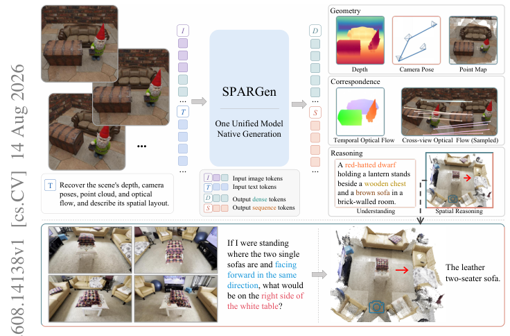
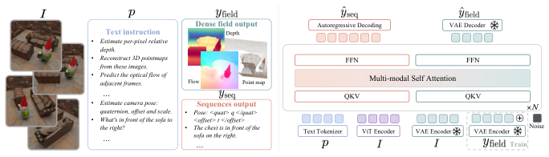
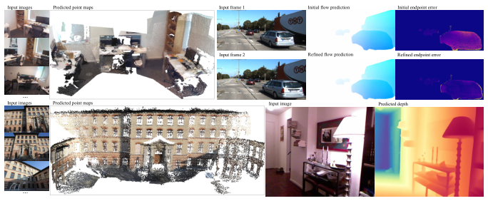
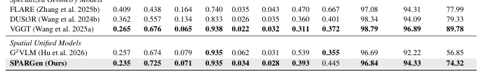
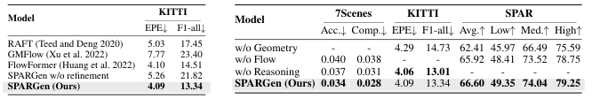

---
tags:
  - papers/3d-agent
  - papers/spatial-reasoning
  - papers/multimodal-generation
aliases:
  - SPARGen
  - Native Multimodal Spatial Generation
arxiv_id: 2608.14138
---
# SPARGen: Unifying Spatial Perception and Reasoning through Native Multimodal Generation

## 核心信息
- 标题: SPARGen: Unifying Spatial Perception and Reasoning through Native Multimodal Generation
- 标题翻译: SPARGen：通过原生多模态生成统一空间感知与推理
- 作者: Jinsheng Quan 等 10 人
- 机构: Zhejiang University、SenseTime Research、Peking University
- 发表时间: 2026-08-14
- 发表渠道: arXiv:2608.14138 [cs.CV]
- arXiv: 2608.14138
- DOI: 10.48550/arXiv.2608.14138
- 论文链接: https://arxiv.org/abs/2608.14138
- 论文类型: 统一多模态生成、三维几何、稠密对应、空间推理

## 原文摘要翻译
从视觉观察进行空间感知与推理，需要恢复几何结构、建立对应关系并理解空间关系。现有方法通常使用任务专用架构或外部几何模块分别处理这些能力，限制了互补表示之间的知识迁移。SPARGen 提出统一多模态框架，将三维重建、稠密对应和空间推理表述为指令条件生成任务：紧凑结构化输出和语言输出被序列化为 token 序列，稠密几何场则以图像对齐形式生成，使空间监督能够共同塑造原生多模态生成模型中的共享表示。跨三维重建、对应关系和空间推理基准的实验表明，SPARGen 在单一原生多模态生成框架内取得有竞争力的性能。

## 创新点
1. **统一输出接口。** 用 token 序列承载相机位姿和空间答案，用图像对齐场承载深度、点图和光流，避免为每个任务增加回归头。
2. **复用 Bagel 的双生成路径。** 自回归路径处理稀疏结构化输出，VAE latent 上的 rectified-flow 路径处理稠密场，两者共享 MoT 自注意力表示。
3. **异构监督互补。** 几何、光流和空间推理并非互相独立；消融显示它们会反向改善其它任务。
4. **一个 7B 模型跨任务竞争。** SPARGen-7B 在四个空间推理基准的非专有模型中均取得最高平均分，同时保持与 VGGT/FlowFormer 等专门模型相近的几何和光流性能。

## 一句话总结
SPARGen 的核心不是提出新的几何估计器，而是把“几何场生成”和“语言序列生成”放进同一个原生多模态生成接口，使三维、对应和推理监督共享一个 MoT 表示空间。

## 研究问题
- 是否可以不引入 geometry-specific encoder、regression head 或外部模块，直接用统一多模态生成的原生路径预测几何？
- 稠密场和稀疏结构化答案应如何编码，才能同时保持空间结构和生成模型兼容性？
- 几何、光流和空间问答监督是否会产生跨任务迁移，还是发生容量竞争？

## 数据与任务定义
给定图像序列 $I=\{I_i\}_{i=1}^{N}$ 和 token 化自然语言指令 $p$，任务 $\tau$ 属于序列任务 $\mathcal{T}_{seq}$ 或稠密场任务 $\mathcal{T}_{field}$。输出统一写成：

$$R_\tau(Y_\tau)=\begin{cases}S_\tau(Y_\tau),&\tau\in\mathcal{T}_{seq},\\\Phi_\tau(Y_\tau),&\tau\in\mathcal{T}_{field}.
\end{cases}$$

序列任务包括文本空间答案和相机位姿；稠密任务包括相对深度、点图和光流。

训练监督分三组：
- 空间理解：MindCube、OmniSpatial、OST-Bench、SPAR-7M、LLaVA-OneVision VQA；
- 视觉几何：ASE、BlendedMVS、CO3D、DeMoN、DL3DV、Hypersim、IRS、MegaSynth、MVS-Synth、Objaverse、OmniObject3D、ScanNet v2/++、SceneNet RGB-D、Taskonomy、WildRGB-D；
- 光流：TartanAir、AutoFlow、FlyingChairs、FlyingChairs2、FlyingThings3D、Monkaa、Kubric-4D、ParallelDomain-4D、Spring。

## 方法主线
### 机制流程
1. **条件编码。** ViT 编码视觉理解 token，文本编码器编码指令；稠密场还把输入经冻结 VAE 编码，形成 `C_field`。
2. **异构目标原生化。** 位姿和答案序列化为 token；深度、点图和光流转成三通道图像对齐场。
3. **共享生成。** 自回归路径最大化序列 token 概率；矫正流路径从噪声恢复目标 VAE latent；两路在 MoT 联合自注意力中交互。
4. **联合训练与 refinement。** 使用 token 交叉熵加稠密场 rectified-flow loss；光流推理时执行 predict–warp–predict refinement。

### 统一 MoT 架构
SPARGen 基于 Bagel。理解专家和生成专家各自有模态特定投影与 FFN，但通过联合多模态自注意力交互。对于序列任务：

$$C_{seq}=Concat(E_{text}(p),E_{vit}(I)).$$

对于场任务：

$$C_{field}=Concat(E_{text}(p),E_{vit}(I),E_{vae}(I)).$$

序列概率为：

$$p_\theta(S_\tau(Y_\tau)|I,p)=\prod_{j=1}^{L_\tau}p_\theta(s_j|C_{seq},s_{<j}).$$

稠密场将目标经冻结 VAE 得到 $z_0$，构造 $z_t=(1-t)z_0+t\epsilon$，训练模型预测 $u_t=\epsilon-z_0$。这是一种很“生成模型原生”的设计：模型没有被迫学习一个额外的几何回归头，而是把几何当成另一种视觉生成目标。

### 三类稠密场表示
- **深度：** 用 $b_D=1-(D-d_{min})/(d_{max}-d_{min}+\epsilon)$ 转为三通道相对深度图；近处趋近 1，远处趋近 0。
- **点图：** 所有视图共享中心 $c$ 和尺度 $s$，归一化后的三通道是 $X,Y,Z$，因此跨视角相对几何保留在同一坐标系统。
- **光流：** 按图像宽高归一化，再用 signed square-root 压缩大动态范围；第三通道编码流量级。

### 稀疏结构化输出
相机位姿 $(R,t)$ 转为四元数、平移方向和幅度：

$$q=Quat(R),\qquad d=t/\|t\|_2,\qquad r=\|t\|_2.$$

标量按 $10^{-3}$ 量化为专用数值 token，并固定序列顺序。这一步牺牲了连续回归的直接性，却让位姿预测可以复用标准自回归解码和 parser。

### 训练目标
$$L_{seq}=-\frac{1}{L_\tau}\sum_{j=1}^{L_\tau}\log p_\theta(s_j|C_{seq},s_{<j}),$$

$$L_{field}=\mathbb{E}_{t,\epsilon}\left[\frac{1}{d_\tau}\|v_\theta(z_t,t;C_{field})-u_t\|_2^2\right].$$

样本只激活与其目标表示对应的损失；整体用 $L_\tau=\lambda L_{seq}$（序列）或 $L_{field}$（稠密场），论文设置 $\lambda=0.25$。

## 训练流程与复现性
| 项目 | 论文设置 |
|---|---|
| 初始化 | Bagel pretrained weights |
| 冻结 | VAE encoder/decoder 冻结，其余参数微调 |
| 优化 | AdamW，100K iterations，64 NVIDIA H100 |
| 学习率 | $2.5\times10^{-5}$ |
| 序列权重 | $\lambda=0.25$ |
| 最大 ViT/VAE 分辨率 | 深度 518/1024；点图 448/512；光流 980/1024 |
| 尺度 | 深度和点图为 relative-scale；使用 scale-aligned evaluation |

复现风险主要在数据混合和几何预处理：大量数据集的标签格式、MoGe 伪标签、VAE 输入范围、点图跨视角共享归一化、光流第三通道定义都会影响结果。论文给出核心配置，但没有在 9 页正文中展开每个数据集的采样比例、训练任务混合频率和推理 ODE solver 细节；复现时必须结合代码核对。

## 关键结果
### 视觉几何
| Model | Sintel AbsRel↓ | Sintel δ1↑ | NYU AbsRel↓ | 7Scenes Acc.↓ | 7Scenes Comp.↓ | CO3D RRA@30↑ | RTA@30↑ | AUC@30↑ |
|---|---:|---:|---:|---:|---:|---:|---:|---:|
| VGGT | .265 | .676 | .065 | .022 | .032 | 98.79 | 96.89 | 89.78 |
| G2 VLM | .257 | .674 | .079 | .062 | .031 | 96.69 | 92.22 | 56.85 |
| SPARGen | **.235** | **.725** | .071 | .034 | **.028** | 96.84 | 94.33 | 74.32 |

SPARGen 在 Sintel 深度两项和 7Scenes completeness 上优于统一基线 G2 VLM，并缩小了与 VGGT 等专门模型的差距；但在 CO3D 相机位姿上并非最佳，说明统一性并不等于所有单项都领先。

### 空间推理
SPARGen-7B 在 MindCube、OmniSpatial、OST、SPAR 的平均分分别为 76.04、54.00、56.02、66.60。它在非专有模型中四个基准都第一，并在 15 个细分类别中 13 个第一；相对每个基准最强竞争结果的增益分别为 9.85、1.97、4.99、24.71 个百分点。值得注意的是，SPARGen-7B 超过 Qwen2.5-VL-72B，结果更可能来自空间监督与输出接口，而不仅是参数量。

### 零样本光流
| Model | KITTI EPE↓ | F1-all↓ |
|---|---:|---:|
| RAFT | 5.03 | 17.45 |
| GMFlow | 7.77 | 23.40 |
| FlowFormer | 4.10 | 14.51 |
| SPARGen w/o refinement | 5.26 | 21.82 |
| SPARGen | **4.09** | **13.34** |

SPARGen 的 refinement 把初始光流从 5.26/21.82 改善到 4.09/13.34，说明这里的收益一部分来自生成后的迭代校正，而非单次 native generation 本身。

## 消融到底说明了什么
| Variant | 7Scenes Acc.↓ | Comp.↓ | KITTI EPE↓ | F1-all↓ | SPAR Avg.↑ |
|---|---:|---:|---:|---:|---:|
| w/o Geometry | – | – | 4.29 | 14.73 | 62.41 |
| w/o Flow | .040 | .038 | – | – | 65.92 |
| w/o Reasoning | .037 | .031 | 4.06 | 13.01 | – |
| SPARGen | **.034** | **.028** | 4.09 | 13.34 | **66.60** |

- 去掉几何监督：光流和空间推理下降，支持三维结构能迁移到跨视角对应和语言推理。
- 去掉光流监督：点图重建误差上升、SPAR 下降，支持稠密对应帮助跨视角一致性和空间判断。
- 去掉推理监督：静态重建轻微下降，但光流略升，作者解释为自回归 token 生成和动态稠密场之间的容量竞争。

这组消融提供的是“与互补效应一致的证据”，不是严格因果证明。因为移除一种监督同时改变了任务混合比例和总梯度分布，尚不能排除训练预算重分配、loss 权重或数据量变化的影响。

## 深度分析
### 真正贡献是什么
SPARGen 的抽象贡献是**把输出空间设计成模型原生能力的交集**。深度、点图、光流都被包装为图像，使 VAE/rectified-flow 路径能够处理；位姿和答案被包装为 token，使自回归路径能够处理。这样统一的关键不是“一个网络接多个 head”，而是“多任务共享两种已经存在的生成机制”。

### 为什么空间监督会相互帮助
几何监督提供稳定的三维结构约束；光流提供跨帧/跨视角对应；推理监督迫使表示保留可查询的语义关系。三者对同一物理场景的不同投影，因而可能形成互补正则。另一方面，光流略受益于去除推理监督，说明共享 MoT 仍存在容量竞争，统一接口不自动保证正迁移。

### 容易误读的地方
- SPARGen 预测的是相对深度/相对点图，不能恢复 metric scale。
- 64 张 H100、100K iterations 的 7B 训练成本很高；“单模型”不等于低成本。
- 光流最强结果依赖 predict–warp–predict refinement，不能完全归因于一次原生生成。
- 空间推理四基准平均领先，但几何各子项仍有 VGGT 优势；“统一”是能力覆盖和接口统一，不是所有指标全面 SOTA。
- 大量几何伪标签由 MoGe 产生，模型可能学习教师的表示偏差。

## 局限
1. 冻结 VAE 的空间压缩限制几何边缘和高精度物理量。
2. 相对尺度训练无法直接服务需要绝对尺度的机器人规划。
3. 稠密场生成的分辨率受 VAE latent 和输入分辨率限制。
4. 多任务训练存在容量竞争，尤其是动态光流与语言生成之间。
5. 训练数据规模和混合来源复杂，尚未充分报告各任务的采样比例、梯度平衡和训练稳定性。
6. 空间推理基准主要是 VQA accuracy，尚不足以证明生成几何真的被用于长程具身行动。

## 我的笔记
这篇论文与“给 VLM 外接几何 encoder”的路线不同，值得放在 3D agent 文献图的“native generation / unified spatial representation”分支。对后续工作的直接启发：

1. **优先设计表示，而不是先设计 head。** 如果目标能变成模型已有生成路径熟悉的图像或 token，统一训练的工程阻力显著下降。
2. **把跨任务迁移作为可检验假设。** 不能只报告一个多任务总分，应像 Table 4 一样逐项移除监督，并报告任务间的正迁移和容量竞争。
3. **相对几何向机器人落地仍差一步。** 后续应加入相机内参、尺度锚点、接触几何或动作反馈，测试 geometry token 是否能支持 action。
4. **控制 refinement 的贡献。** 对光流、深度和点图都应分别比较单次生成、迭代生成和外部后处理，避免把系统 pipeline 增益误写成 backbone 增益。
5. **尝试结构化 uncertainty。** 目前输出场和 token 看起来是确定性的；如果加入置信度场、位姿不确定性或 token-level calibration，可能更适合真实世界空间决策。

## 引用
Quan et al., “SPARGen: Unifying Spatial Perception and Reasoning through Native Multimodal Generation,” arXiv:2608.14138v1, 2026. 完整参考文献见同目录 `detailed_paper.md` 与原 PDF pp. 8–9。
## 证据锚点与图片

- **任务定义与统一接口：** PDF p. 3，Sec. 3.1，Eq. (1)–(2)；对应本文“数据与任务定义”。
- **MoT 条件与双生成路径：** PDF pp. 3–4，Fig. 2，Eq. (3)–(5)；对应本文“机制流程”和“统一 MoT 架构”。
- **输出编码：** PDF pp. 4–5，Eq. (6)–(9)；对应本文“三类稠密场表示”和“稀疏结构化输出”。
- **联合损失与训练配置：** PDF pp. 5–6，Eq. (10)–(12) 与 Implementation Details；对应本文“训练流程与复现性”和“训练目标”。
- **定量结果：** PDF p. 6 的 Tables 1–4，PDF p. 7 的比较与消融分析；对应本文“关键结果”。
- **定性证据：** PDF p. 7，Fig. 3；对应本文“零样本光流”和定性结果讨论。

### 论文图表

**图 1。** 论文总览：同一 SPARGen 模型以原生生成路径覆盖几何、对应和空间推理。[锚点：PDF p. 1，Fig. 1]

**图 2。** MoT 主干与序列/稠密场两条生成路径。[锚点：PDF p. 3，Fig. 2]

**图 3。** 点图、光流 refinement 和深度的定性结果。[锚点：PDF p. 7，Fig. 3]

**表 1 裁剪。** 视觉几何比较；完整表格以 PDF p. 6 为准。[锚点：PDF p. 6，Table 1]

**表 3–4 裁剪。** 左侧为 KITTI 光流，右侧为消融；相邻表格在同一页面渲染裁剪中合并。[锚点：PDF p. 6，Tables 3–4]

## 材料级 caveat

本笔记唯一正文来源是用户提供的 9 页、可提取文本的 arXiv v1 PDF（页面标注 2026-08-14）。PDF 覆盖 pp. 1–9，但正文提到“appendix”而本文件未检测到独立附录；数据混合比例、ODE solver、完整推理步数、代码链接和多随机种子稳定性未在正文展开。因此，本文对方法机制和报告数值给出页码/方程/表图锚点，但不把一次移除式消融写成严格因果结论，也不把相对尺度结果写成 metric 3D 或具身闭环能力。图表裁剪来自 PDF 页面渲染；`page_006_fig_table_2.png` 是表 3 与表 4 的合并裁剪，表 2 的完整宽表仍应以 PDF p. 6 及正文抄录数值核验。

## 本轮全文覆盖核验

- 对应的 `detailed_paper.md` 已按用户提供的可提取文本 PDF 重新生成：SPARGen 覆盖 9 页，SpatialCLI 覆盖 48 页；`source_map.json` 保存页码、顺序和正文锚点。
- `paper.md` 与 `detailed_paper.md` 已做字节级同步。
- 本文件是证据驱动的精读笔记，不重复粘贴全文译文；因此 `paper_DeepPaperNote.lint.json` 中的 evidence gate 仍如实反映“精读笔记自身是凝练稿”，不能把它误报为逐字翻译。
