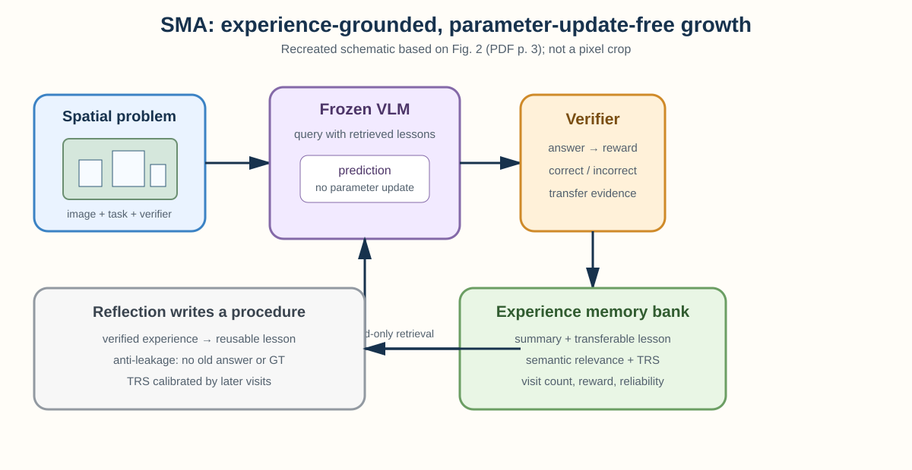
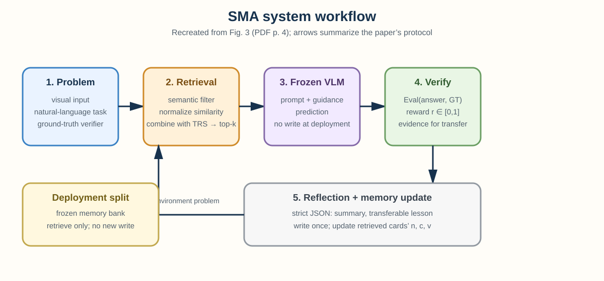
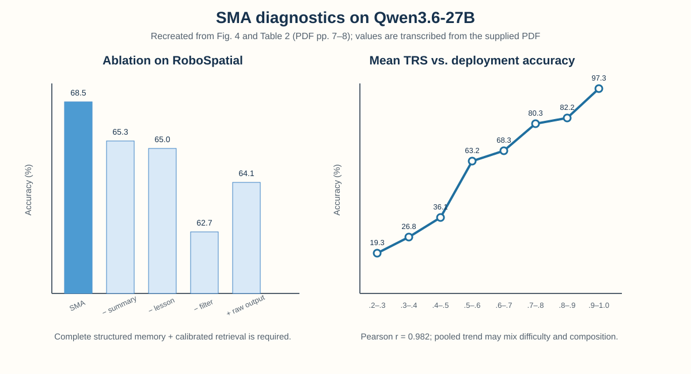
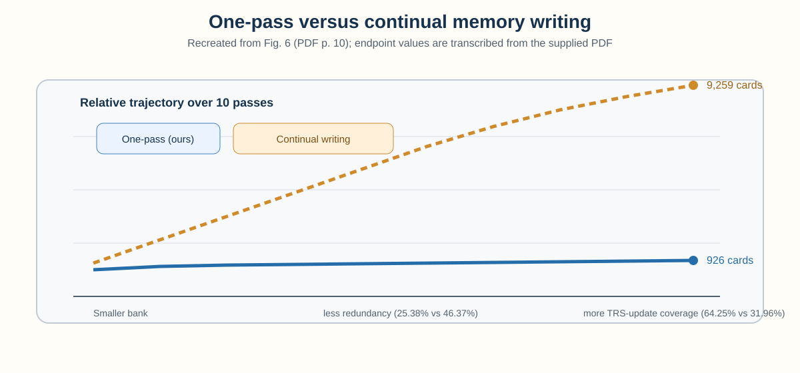

# Spatial Memory Agent: Experience-Grounded Procedure Memory for Spatial Intelligence

> **阅读范围说明**：本笔记依据用户提供的 PDF **全部 80 个物理页**整理，并按 `1–20`、`21–40`、`41–60`、`61–80` 四段逐页复核。PDF 首页日期为 2026 年 8 月 13 日，版本为 arXiv:2608.12743v1；物理页 16–80 是完整附录，包含额外结果、方法推导、benchmark taxonomy/examples、split、baseline/基础设施/超参数、作者声明的局限、成功/纠错/歧义/模型失败案例，以及七个 benchmark 的 system/reflection/retrieval prompts。[证据 G001–G003、G041、G057–G072]

## 核心信息

- **作者**：Haokai Zhang、Yuhang Ding、Yunshu Zhou、Xinze Du、Shengtao Zhang、Zhiyue Zhao、Yuling Xi、Hao Chen；Zhejiang University、Shanghai Jiao Tong University、Shanghai Innovation Institute。Haokai Zhang、Yuhang Ding、Yunshu Zhou、Xinze Du、Yuling Xi、Hao Chen 标有浙江大学，Shengtao Zhang 标有上海交通大学，Zhiyue Zhao 标有上海创新研究院；文中以星号标出共同贡献，以 dagger 标出通讯作者。[证据 G001；PDF p.1]
- **版本身份**：`arXiv:2608.12743v1`，PDF 日期 13 Aug 2026；首页给出项目页 `https://aim-uofa.github.io/SMA/`。[证据 G002；PDF p.1]
- **研究定位**：SMA 是空间推理/空间智能上的外部经验记忆框架，不改变冻结 VLM 参数，部署时也不依赖深度估计、3D 重建等专家空间工具。[证据 G003；PDF pp.1–4]
- **核心结果**：四个冻结 Qwen 基座、五个主表空间 benchmark slice 上，SMA 的 macro average 均为该模型块最高：Qwen3.5-122B-A10B 为 68.8，Qwen3.6-35B-A3B 为 66.7，Qwen3.6-27B 为 69.8，Qwen3.5-9B 为 63.5；作者称在 20 个主评测中大多数单项也为最佳。[证据 G004、G005；PDF pp.1, 6]
- **真正要记住的点**：SMA 不把“最相似的旧题”直接当答案，而是把经过验证的 rollout 压缩成 `task shape → procedure → trap → check` 式教训，再用后续访问证据校准 Transfer Reliability Score（TRS），以“语义相关性 + 迁移可靠性”共同选择程序。[我的判断，依据 G006–G010]

## 原文摘要翻译

空间智能正在成为具身代理、机器人规划和多模态助手的基础。为了提高 VLM 代理的空间推理能力，现有工作主要沿两条路线展开：一类使用监督微调和强化学习等后训练方法；另一类采用代理范式，在推理时调用深度估计、三维重建等外部空间工具来收集中间空间证据。本文研究一条互补但尚未充分探索的路线：冻结的 VLM 代理能否在推理时不依赖外部专家空间工具，通过参数更新无关的方式改善空间推理？

作者提出 **Spatial Memory Agent（SMA）**，一种经验驱动的运行时框架。SMA 在可验证的空间环境中查询冻结 VLM，获得预测与奖励，并用验证器引导的反思把空间经验压缩成可复用、可迁移的教训。每条教训还会被赋予 **Transfer Reliability Score（TRS）**：该分数从统一先验初始化，并依据之后的访问证据进行校准。在只读部署阶段，SMA 先用语义过滤生成候选记忆，再用候选的语义相关性和校准后的 TRS 排序，取最可能迁移成功的记忆来指导冻结模型。作者在五个代表性空间 benchmark 和四个冻结基座上评测，报告 SMA 在每个基座模型块取得最高 macro average，并在 20 个评估中的大多数取得最佳准确率。[证据 G005；PDF p.1]

## 创新点

1. **把验证奖励转成程序化记忆，而不是保存旧答案**：反思模型写入任务摘要和 transferable lesson；部署检索只暴露任务、摘要和教训，不暴露旧预测或真值，以降低答案泄漏。[证据 G006、G011；PDF pp.4–5]
2. **把“相似”与“可靠”分开建模**：语义相似度只负责找到可能相关的候选，TRS 则估计一条程序在后续新问题中是否真的有用；联合排序因此不是普通 nearest-neighbor/RAG。[证据 G007、G008；PDF pp.5, 17–18]
3. **访问证据校准的 Transfer Reliability Score**：新记忆从相同的中性先验开始，成功/失败的后续迁移才逐步改变分数，并通过先验强度抑制低访问次数下的过度自信。[证据 G009；PDF pp.5, 17–18]
4. **One-Pass Memory Writing**：只在环境第一遍写入记忆，之后复用固定 memory bank、更新被检索卡片的可靠性；与 continual writing 相比，论文报告它用更小、更少重复的库获得更高 TRS 更新覆盖。[证据 G010、G035；PDF pp.4–5, 10]
5. **参数更新无关的空间自我演化**：模型权重、部署记忆库和部署时的记忆统计量都被冻结；提升来自外部 procedure memory 的选择，而不是隐式的测试集在线学习。[证据 G003、G012；PDF pp.1, 5]

## 一句话总结

SMA 的核心不是“让 VLM 记住更多题目”，而是把验证过的空间经验压缩成不泄漏答案的程序教训，再用后续迁移结果学习哪些教训值得信任；因此它把记忆检索从**相似度匹配**推进为**证据加权的程序选择**。[我的判断，依据 G006–G012]

## 研究问题

### 1. 为什么仅靠空间后训练或专家工具还不够

论文把既有空间智能方法概括为两条路线：通过额外空间数据、监督学习或强化学习更新模型；或在推理时调用深度估计、3D 重建、视觉程序等工具取得中间证据。前者需要改变模型或训练数据，后者需要额外的专家工具和运行时接口。[证据 G013；PDF pp.2–3]

### 2. SMA 的可检验假设

- **经验可以被压缩成可迁移程序**：同一类空间问题的有用部分不是上一题的选项，而是如何定位、比较、模拟和检查。[证据 G006、G014]
- **源题答对不等于教训可迁移**：源 rollout 的 verifier reward 只说明当时答案，不能直接证明 lesson 在新的视觉上下文中仍然有效；因此需要 visit evidence 校准。[证据 G009、G015]
- **相似度不等于效用**：很像的题可能反复检索却迁移失败，单纯按 embedding 相似度排序会把“表面相似但不可靠”的程序排在前面。[证据 G007、G016]
- **部署应与写入分离**：如果测试时继续写入并根据测试 reward 更新 TRS，结果会混合记忆学习和部署评估；论文明确把环境集与 deployment 集分开，并在 deployment 阶段只读。[证据 G012、G017]

**我的判断**：论文真正的科学主张是“验证证据应该进入记忆的状态表示和选择规则”，而不是“任何外部 memory 都能提升空间推理”。所以最关键的对照是 No memory、相似度型记忆、reward-only reflection，以及去掉 semantic filter/TRS 的消融，而不是单看 SMA 的最终数字。[我的判断，依据 G018、G019、G020、G021、G022]

## 数据与任务定义

### 环境与记忆

作者把空间环境定义为一组可验证空间问题。环境集 $\mathcal{X}$ 与部署集 $\mathcal{D}$ 不相交；每个问题写作 $\xi_i=(V_i,t_i,y_i^\star)$，其中 $V_i$ 是一幅或多幅视觉输入，$t_i$ 是自然语言任务，$y_i^\star$ 是 verifier 使用的已验证目标。目标是在不改变冻结基座 $F$ 参数的情况下构建可迁移的空间 procedure library，并在部署集上只读使用它。[证据 G017；PDF p.4]

记忆库为 $M=\{m_i\}$，一条记忆卡片为：

$$m_i=(t_i,s_i,l_i,n_i,c_i,v_i).$$

$t_i$ 是源任务，$s_i$ 是 rollout 的短摘要，$l_i$ 是 transferable lesson，$n_i$ 是该卡片后续被访问的次数，$c_i$ 是累计下游 reward，$v_i$ 是 TRS。部署时暴露的是任务、摘要和可迁移教训，不暴露原始预测、真值或可直接泄漏答案的字段。[证据 G006、G017；PDF pp.4–5]

### Benchmark 覆盖、taxonomy 与数据划分

正文主表使用五个空间 benchmark slice：RoboSpatial、ERQA、Omni3D、SAT 和 EmbSpatial；附录 Table 7 额外报告 SITE-image 与 ViewSpatial，因此首页 Fig. 1 的七个圆盘对应七个 benchmark slice，而主结果表的 macro average 只对五列求平均。[证据 G004、G023；PDF pp.1, 6, 16]

- **RoboSpatial**：单张室内 RGB 图像，官方子类为 `context`（归一化空闲区域指点）、`configuration`（物体—物体配置）和 `compatibility`（放置/可容纳性）。附录 Tables 9–11 给出浴缸前空闲区、锅是否在炉灶上方、箱子能否放到沙发后方的实例。[证据 G024、G058；PDF pp.19–23]
- **ERQA**：机器人场景中的 Spatial、Trajectory、Action、State Estimation、Pointing、Multi-view 与 Task Reasoning；Tables 12–18 显示它同时考查铰接运动、轨迹后果、动作方向、接触状态、表面指点、多视图对应与任务阶段判断。[证据 G024、G058；PDF pp.24–29]
- **Omni3D**：单张真实 RGB 上的 3D 量/关系开放回答，包括度量与比例、计数、假设放置后的可见性、容纳/支撑充分性以及短属性识别。作者明确不把 Omni3D 纳入正文 atomic-ability breakdown，因为公开注释只有 `answer_type`，不是 question-level 能力 taxonomy。[证据 G024、G058；PDF pp.19–20, 68–70]
- **SAT**：一至两张有序图像上的动态空间 aptitude，分为 `goal_aim`、`action_consequence`、`perspective`、`action_sequence`、`obj_movement`、`ego_movement`；Tables 19–24 逐类给出朝向、动作后果、视角变化、相机/物体运动样例。[证据 G024、G058；PDF pp.20, 30–35]
- **EmbSpatial**：单张第一视角室内图像上的方向关系与距离关系；Tables 25–26 展示 left/right/above/under 和 close/far，附录 prompt 进一步把任务分成 egocentric depth、水平布局、垂直布局和 distractor relation verification。[证据 G024、G058、G071；PDF pp.21, 36–37, 73–75]
- **SITE-image**：SITE 的 image-only 子集，覆盖 3D 信息、计数/存在、运动预测、导航、多视图、定位与空间关系；完整 prompt 强调去重计数、跨视图绑定、image-plane/camera/world frame 分离。[证据 G025、G058、G071；PDF pp.19, 75–78]
- **ViewSpatial**：一个或多个同场景视图上的 camera-relative、person-relative、object orientation 与 scene simulation；多视图题可含 6–17+ 张图，prompt 声明每题最多 32 张 RGB stills。[证据 G025、G058、G071；PDF pp.19, 78–80]

完整划分由 Table 27 给出。除 SAT 外，作者以 seed 42 按 category 做约 50/50 分层拆分，并让奇数余项在 environment/deployment 间交替；SAT 用官方 test（循环扩展到 300）作 deployment，从 validation 抽 300 个匹配题型的 environment 样本。[证据 G059；PDF pp.37–38]

| Benchmark | Used pool | Environment | Deployment |
|---|---:|---:|---:|
| RoboSpatial | 350 | 175 | 175 |
| ERQA | 400 | 200 | 200 |
| Omni3D | 501 | 251 | 250 |
| SAT | 300 val + 300 test | 300 | 300 |
| EmbSpatial | 3,640 | 1,820 | 1,820 |
| SITE-image | 4,449 | 2,225 | 2,224 |
| ViewSpatial | 5,712 | 2,856 | 2,856 |

评测指标是 accuracy（%），Avg 是所报告 benchmark 列的 macro average。主结果的 SMA 行取 One-Pass Memory Writing 十次 pass 评估中的最佳 checkpoint；这使结果可读，但也意味着它不是“固定单一预算下最后一次运行”的唯一结果。[证据 G026、G027；PDF pp.6–7]

## 方法主线

### 机制流程

> 这是依据 PDF Fig. 2 的重绘示意，不是原始 PDF 像素裁剪。它保留了“空间问题 → 冻结 VLM → verifier → 反思写卡片 → TRS/检索 → 只读部署”的信息结构。[证据 G028；PDF p.3, Fig. 2]

> 这是依据 PDF Fig. 3 的重绘示意，不是原始 PDF 像素裁剪。Fig. 3 的重点是 memory writing 与 read-only deployment 的边界。[证据 G029；PDF p.4, Fig. 3]

### 经验获取：先解题，再验证

在经验获取阶段，SMA 先以当前 memory bank 检索候选，再将候选指导与当前视觉问题送入冻结 VLM：

$$o_i=F(V_i,t_i,G_i),\qquad \hat y_i=\operatorname{Parse}(o_i).$$

Verifier 根据预测和验证目标给出标量奖励：

$$r_i=\operatorname{Eval}(\hat y_i,y_i^\star).$$

这里 $G_i$ 是当前问题的 guidance set。奖励可以是二值正确性，也可以是论文统一到 $[0,1]$ 的标量；关键是 reward 来自 verifier，而不是模型自己的置信度。[证据 G030；PDF p.4]

### Procedure Memory Generation：反思必须可迁移且防泄漏

在写入记忆的第一遍，reflection model $R_\phi$ 接收 rollout、任务、验证目标和 reward，并输出严格 JSON：

$$ (s_i,l_i)=R_\phi(o_i,t_i,y_i^\star,r_i). $$

- **Summary $s_i$**：描述任务形状和本次 rollout 诊断。
- **Transferable lesson $l_i$**：提炼可复用的程序原则，包括应该关注的 pattern、容易犯的 trap 和应执行的 check。
- **Anti-leakage 约束**：lesson 不应重述答案、坐标、选项字母或场景唯一线索；部署时也不应把历史答案当作提示直接复制。[证据 G031、G032；PDF p.5]

这一步是 SMA 与普通 RAG 最容易混淆的地方：记忆卡片不是“问题—答案”数据库，而是对视觉几何判断有条件的 procedural hint。若反思模型把答案或唯一线索写入 lesson，后续 accuracy 就会被答案泄漏污染，而不是体现空间程序迁移。[我的判断，依据 G031–G032]

### One-Pass Memory Writing 与 continual writing

论文考虑两种协议。Continual Memory Writing 每次 pass 都可以继续写卡片，容易把同一种经验重复写入；默认的 One-Pass Memory Writing 只在环境集第一遍写入卡片，之后让后续 pass 复用固定 bank，仅更新被检索卡片的可靠性统计。[证据 G010、G033；PDF pp.4–5]

在 Qwen3.6-27B、五个 benchmark、十个 pass 的比较中，continual writing 最终约有 9,259 张卡片，one-pass 约 926 张，约十倍差异；内容冗余约为 46.37% 对 25.38%，one-pass 少 21.0 个百分点；TRS-update coverage 约为 31.96% 对 64.25%，one-pass 约两倍。[证据 G033、G035；PDF p.10, Fig. 6]

**我的判断**：one-pass 的优势不是简单的“少存文件”，而是把重复写入的预算换成对已有卡片的更多访问证据。它让 TRS 更像一个可校准的 reliability state，而不是一个被不断复制的文本缓存；但十个 pass 的曲线不能直接推出长期运行下的 memory lifecycle 已被解决。[我的判断，依据 G033、G035]

### Two-Stage Retrieval：语义过滤后再做联合排序

第一阶段用任务嵌入的余弦相似度筛选候选：

$$\operatorname{rel}_{ij}=\cos(\psi(t_i),\psi(t_j)).$$

给定相似度阈值 $\delta$，候选集为：

$$C_i=\{m_j\in M:\operatorname{rel}_{ij}\ge\delta\}.$$ 

第二阶段在候选集内部合并归一化后的语义相关性与 TRS：

$$S_{ij}=(1-\eta)z(\operatorname{rel}_{ij})+\eta z(v_j),$$

其中 $z(\cdot)$ 是 clipped z-score，$\eta$ 控制可靠性权重。取联合分数最高的 top-$k$ 张卡片构成 $G_i$，拼接到冻结 VLM 的当前 prompt。[证据 G007、G034；PDF pp.5, 18]

这套顺序有一个重要的尺度约束：TRS 只在语义候选池内部参与排序，不让一个完全不相关但 TRS 很高的卡片越过语义过滤；同时，语义相似度也不再能单独压过一条已经反复验证失败的程序。[证据 G034；PDF p.18]

### Visit-Evidence Calibration：TRS 的统计含义

每张新卡片统一初始化：

$$n_j\leftarrow0,\qquad c_j\leftarrow0,\qquad v_j\leftarrow v_0.$$ 

当卡片 $m_j$ 被检索进 guidance set，且这次下游答案获得 reward $r_i\in[0,1]$ 时：

$$n_j\leftarrow n_j+1,\qquad c_j\leftarrow c_j+r_i,\qquad v_j\leftarrow\frac{\lambda v_0+c_j}{\lambda+n_j}.$$ 

附录把它解释为先验与经验成功率的凸组合：

$$v_j=\frac{\lambda}{\lambda+n_j}v_0+\frac{n_j}{\lambda+n_j}\frac{c_j}{n_j}.$$ 

默认解释是 $v_0=0.5$、$\lambda=2$ 时，每条记忆相当于先拥有两个中性虚拟访问；低访问次数下分数向 0.5 收缩，访问增多后才由真实迁移 reward 主导。[证据 G009、G036；PDF pp.5, 17–18]

附录列出 TRS 设计希望满足的性质：uniform initialization、visit-evidence dependence、order invariance、low-visit conservatism 和 evidence-driven convergence。也就是说，单次偶然成功不能让一条卡片永久高分，单次失败也不应立即抹除一条可能有用的程序；相同访问数和累计 reward 的结果不应依赖成功/失败到达顺序。[证据 G036；PDF pp.17–18]

**统计解释上的边界**：TRS 是“在当前检索策略、当前基座和当前 benchmark 分布下，后续访问成功的经验估计”，不是跨模型、跨任务族、跨环境都成立的概率校准。[我的判断，依据 G036、G037]

### Read-Only Deployment

经验获取结束后，SMA 固定 memory bank。对部署集每个问题，系统重复语义过滤、联合排序和 top-$k$ 提示注入，但不再写新记忆，也不更新 $n_j,c_j,v_j$。所以 deployment accuracy 的提升主要来自已学 lesson 的选择和使用，而不是用部署标签在线调 TRS。[证据 G012、G017；PDF p.5]

## 关键结果

### 主结果与跨模型稳定性

主表 Table 1（accuracy，%）如下；Avg 是五个主 benchmark 列的 macro average。[证据 G026；PDF p.6]

| Frozen base model | Method | RoboSpatial | ERQA | Omni3D | SAT | EmbSpatial | Avg. |
|---|---|---:|---:|---:|---:|---:|---:|
| Qwen3.5-122B-A10B | No memory | 61.2 | 54.5 | 40.0 | 83.7 | 85.3 | 65.3 |
|  | RAG | 56.8 | 55.5 | 40.4 | 82.0 | 86.4 | 64.2 |
|  | MemP | 62.4 | 55.0 | 39.2 | 82.3 | 87.5 | 65.3 |
|  | MemRL-R | 63.0 | 56.0 | 40.4 | 85.3 | 86.5 | 66.2 |
|  | MemRL-GT | 64.0 | 53.5 | 40.0 | 83.7 | 86.6 | 65.6 |
|  | **SMA (ours)** | **65.5** | **60.5** | **43.2** | **87.0** | **87.6** | **68.8** |
| Qwen3.6-35B-A3B | No memory | 57.1 | 49.5 | 37.2 | 78.0 | 86.3 | 61.6 |
|  | RAG | 55.0 | 50.5 | 42.4 | 84.3 | 84.1 | 63.3 |
|  | MemP | 55.2 | 51.5 | 42.0 | 82.3 | 86.7 | 63.7 |
|  | MemRL-R | 53.6 | 54.0 | 40.8 | 84.0 | 86.8 | 63.8 |
|  | MemRL-GT | 52.7 | 51.0 | 43.6 | 81.3 | 87.0 | 63.1 |
|  | **SMA (ours)** | **57.9** | **57.5** | **45.2** | **85.3** | **87.7** | **66.7** |
| Qwen3.6-27B | No memory | 54.1 | 53.0 | 41.6 | 82.3 | 85.7 | 63.3 |
|  | RAG | 59.3 | 54.5 | 44.0 | 85.0 | 86.5 | 65.9 |
|  | MemP | 65.4 | 51.5 | 44.0 | 86.0 | 87.1 | 66.8 |
|  | MemRL-R | 62.2 | 51.5 | 44.8 | 83.7 | 86.8 | 65.8 |
|  | MemRL-GT | 67.2 | 55.5 | 43.6 | 87.0 | 87.2 | 68.1 |
|  | **SMA (ours)** | **68.5** | **58.0** | **47.6** | **87.0** | **87.9** | **69.8** |
| Qwen3.5-9B | No memory | 58.1 | 46.5 | 37.2 | 77.3 | 84.1 | 60.6 |
|  | RAG | 55.5 | 49.0 | 31.6 | 77.7 | 81.8 | 59.2 |
|  | MemP | 53.7 | 53.0 | 34.4 | 78.0 | 84.2 | 60.7 |
|  | MemRL-R | 54.2 | 43.5 | 36.4 | 76.7 | 82.5 | 58.7 |
|  | MemRL-GT | 52.7 | 49.0 | 34.4 | 80.3 | 83.8 | 60.0 |
|  | **SMA (ours)** | **58.5** | **52.0** | **40.8** | **81.3** | **84.9** | **63.5** |

SMA 相对最强非 SMA baseline 的 Avg 增益分别为 2.6、2.9、1.7 和 2.8 个百分点。以 Qwen3.6-27B 为例，相比 No memory、RAG、MemP、MemRL-GT，Avg 分别提升 6.5、3.9、3.0、1.7 个百分点；RoboSpatial 为 54.1→68.5，Omni3D 为 41.6→47.6，EmbSpatial 为 85.7→87.9。[证据 G005、G038；PDF pp.1, 7]

**我的判断**：跨四个模型块都领先，比只在一个 VLM 上有效更支持“可靠性加权程序选择”具有一定模型可迁移性。但这仍是固定的 Qwen 家族、固定 prompt/verifier 和有限 benchmark slice；不能外推为任意 VLM 或开放世界空间能力的稳定保证。[我的判断，依据 G038、G039]

### 与 training-based self-evolving baseline 的比较

在 Qwen3.5-9B 上，作者把 SMA 与 training-based SpatialEvo-7B 比较：SpatialEvo-7B 的五列/Avg 为 41.3/37.0/25.6/57.7/74.1/47.1，SMA 为 58.5/52.0/40.8/81.3/84.9/63.5，差值为 +17.2/+15.0/+15.2/+23.6/+10.8/+16.4 个百分点。[证据 G040；PDF p.8, Table 3]

这个结果显示在本文评价范围内，外部 procedure-memory 路线可以胜过该 training-based 对照；但两者基座、训练预算与实现路径不同，不能把它解读成“冻结记忆普遍优于参数更新”。更保守的结论是：在作者给定的五个 slice 和对照设置下，SMA 的结果更高。[我的判断，依据 G040]

### 组件消融：不是所有“记忆文本”都同样有用

Qwen3.6-27B 在 RoboSpatial 上的 Table 2 ablation：

| Setting | Accuracy (%) | Δ vs. SMA |
|---|---:|---:|
| SMA (ours) | **68.5** | — |
| − summary | 65.3 | −3.2 |
| − transferable lesson | 65.0 | −3.5 |
| − semantic filter | 62.7 | −5.8 |
| + model output | 64.1 | −4.4 |
| Reward-only reflection | 63.0 | −5.5 |

Omni3D 的附录 counterpart 也呈现同方向结果：SMA 47.6；去 summary 46.0（−1.6），去 transferable lesson 42.4（−5.2），去 semantic filter 40.4（−7.2），加入 model output 45.6（−2.0），reward-only reflection 44.8（−2.8）。[证据 G042；PDF pp.8, 16]

这里最值得重视的是：**去掉 semantic filter 的伤害甚至大于去掉 lesson 或 summary**。这说明 TRS 不是独立解决一切的排序器，它必须建立在一个语义相关的候选池上；反过来，单独保存 model output 或只保留 reward，也不足以替代结构化的 procedure abstraction。[我的判断，依据 G041–G042]

### 超参数敏感性与 TRS 诊断

RoboSpatial/Qwen3.6-27B 的敏感性图中，可靠性权重最佳点为 $\eta=0.5$、准确率 68.5%；retrieval size 最佳点为 $k=3$、准确率 68.5%。[证据 G043；PDF p.8, Fig. 4a]

按被检索记忆的 mean TRS 分箱，准确率从 TRS 区间 `[0.2,0.3)` 的 19.3% 上升到 `[0.9,1.0]` 的 97.3%；中间可读点为 26.8%、36.1%、63.2%、68.3%、80.3%、82.2%。作者报告 Pearson $r=0.982$，同时提醒这是 pooled trend，可能混入 benchmark 难度和题目组成差异。[证据 G043、G044；PDF p.8, Fig. 4b]

这是一条很强但不能过度解释的证据：它显示 TRS 与下游成功率高度相关，却没有完全排除“容易的题更容易检索到高 TRS 记忆”这一选择效应。因此它支持 TRS 作为排序信号的实用性，不等于已证明 TRS 是跨分布、因果意义上的 transfer probability。[我的判断，依据 G044]

### Transfer 分析：记忆能跨模型和跨 benchmark 使用

模型迁移（在 Qwen3.5-122B-A10B 上写 memory，再在 Qwen3.6-27B 上部署）结果：RoboSpatial 54.1→63.5（+9.4），ERQA 53.0→56.5（+3.5），Omni3D 41.6→44.8（+3.2），SAT 82.3→88.0（+5.7），EmbSpatial 85.7→87.3（+1.6）。[证据 G045；PDF p.9, Table 4]

benchmark transfer 也全部为正：ERQA→RoboSpatial 54.1→61.7（+7.6），EmbSpatial→RoboSpatial 54.1→61.4（+7.3），Omni3D→RoboSpatial 41.6→44.4（+2.8），Omni3D→EmbSpatial 85.7→87.2（+1.5）。[证据 G045；PDF p.9, Table 4]

**Finding**：memory bank 的确能超越“只在写入它的原始设置中有效”，但增益大小依赖源—目标相似度；这证明的是有限条件下的 transfer，不是无需域适配的通用空间技能。[我的判断，依据 G045]

### Similarity–accuracy 分析：最近的不一定最好

以 MemP 作为相似度导向参考，SMA 将 macro-average retrieved-memory similarity 从 0.792 降到 0.698，却把 macro accuracy 从 66.8% 提高到 69.8%。这表明最大化 semantic similarity 并非有效迁移的充分条件，TRS 会偏好 demonstrated transfer value 更高的程序。[证据 G046；PDF p.9, Fig. 5a]

这也是 SMA 最清晰的概念贡献：**检索目标从“像不像”改成“在相似候选中，哪条 procedure 更值得信任”**。不过 similarity 的下降也可能意味着 SMA 在候选池中选择了更抽象、跨题型的 lesson；论文没有逐卡片分析抽象程度和失败模式之间的关系。[我的判断，依据 G046]

### Atomic spatial abilities：增益较广，但不均匀

作者把 benchmark 子类后验映射到十种 atomic abilities：Correspondence、Attribute、Object motion、Localization、Relation、Distance/depth、Mental simulation、Tracking、Camera reasoning、Affordance。在 RoboSpatial、ERQA、SAT、EmbSpatial 的共同范围上，SMA 相对 No memory 的平均增益全部为正：最大的是 Correspondence +11.2 pp、Attribute +8.0 pp、Object motion +7.6 pp；较小的是 Distance/depth +2.6 pp 和 Affordance +2.9 pp。[证据 G047；PDF p.10, Fig. 5b；PDF p.20 对能力定义有附录说明]

作者还指出 MemP 在 Tracking 上为 −3.0 pp、Affordance 上为 −1.9 pp，而 SMA 在这些能力上仍为正，说明未经可靠性校准的 procedure prompt 可能在某些能力上造成误导。[证据 G047；PDF p.10]

**我的判断**：SMA 的收益不是只集中在一种空间关系，但能力统计是 post-hoc benchmark taxonomy，不等同于一个严格解耦的能力测试；一个复合题可以同时计入多个能力，因此不能把十个增益相加为独立能力提升。[我的判断，依据 G047、G048]

### Memory-writing protocol 的效率证据

One-pass 在十个 pass 后约 926 张卡片，continual writing 约 9,259 张；one-pass 冗余 25.38%，continual 46.37%；one-pass TRS-update coverage 64.25%，continual 31.96%。[证据 G033、G035；PDF p.10, Fig. 6]

这些结果支持 one-pass 在本文十次 pass 的实验预算中更节省存储且更容易让已写卡片获得访问证据。但论文没有把 memory bank 的字数、检索延迟、embedding 成本、prompt token 成本或服务端吞吐报告成端到端效率指标，所以“效率”应限定为 memory-writing protocol 的卡片数量、冗余和 TRS 覆盖，不应直接写成推理速度提升。[我的判断，依据 G035、G049]

### Source outcome 与组合质量

源题 outcome 分组：由成功源题写出的 memory，平均 TRS 为 0.522、下游准确率为 85.7%；由失败源题写出的 memory，平均 TRS 为 0.452、下游准确率为 61.4%。[证据 G050；PDF p.10, Table 5]

三张检索卡片的组合分组为：all success $N=13{,}226$、accuracy 93.0%、TRS 0.909；mixed $N=10{,}264$、accuracy 65.1%、TRS 0.653；all failure $N=603$、accuracy 39.0%、TRS 0.480。[证据 G051；PDF p.10, Table 6]

这支持“多条可靠 lesson 同时出现时，迁移更可能成功”，但仍存在共同难度因素：容易题可能同时更容易得到成功源题、较高 TRS 和正确部署答案。[我的判断，依据 G050–G051]

### 定性案例、纠错与失败边界

正文 Fig. 8 展示五个代表性成功案例，覆盖 RoboSpatial 的可放置性/间隙检查、ERQA 的坐标定位、EmbSpatial 的相对深度、Omni3D 的视线/遮挡模拟和 SAT 的运动方向判断。案例中的 lesson 反复要求模型：锚定目标边界、检查垂直或水平间隙、不要只依赖外观相似、模拟遮挡后的可见性、固定参考系后判断运动方向。[证据 G052；PDF p.11, Fig.8]

完整附录远不止这五例。作者把 pp.41–63 的案例分成四组：[证据 G065；PDF pp.41–63]

1. **6 个 successful-transfer cases（Figs.9–14）**：No-memory 与 SMA 都答对，但检索 lesson 与当前推理过程对齐；覆盖 Omni3D 3D 高度/反事实可见性、SAT camera motion/转向、SITE temporal comparison/relative depth。[证据 G066；PDF pp.42–47]
2. **8 个 wrong-to-right cases（Figs.15–22）**：baseline 错、SMA 检索后改对；覆盖 ERQA 坐标/遮挡、多视图，ViewSpatial camera/person frame，RoboSpatial 关系/空间净空，EmbSpatial 垂直和水平关系。[证据 G067；PDF pp.48–55]
3. **5 个 benchmark-side ambiguity cases（Figs.23–27）**：即使检索到看似合理的程序，单张 RGB 或题面不足以唯一恢复 GT，例如最近/最远对象依赖不可见深度、体积与 under-desk clearance 缺少尺度、SAT 到达朝向未定义。[证据 G068；PDF pp.56–60]
4. **3 个 base-model limitation cases（Figs.28–30）**：高质量且语义相关的 memory（作者注明 TRS $\ge 0.6$）仍无法修复模型对运动方向、计数或跨视图连通性的视觉误读。[证据 G069；PDF pp.61–63]

这组附录把“案例证据”的含义说得更清楚：memory 能纠正一部分程序/参考系错误，但不能创造图像中不存在的度量信息，也不能替代基础视觉 grounding。成功与 wrong-to-right panels 是**存在性证据**，不是随机抽样的总体成功率；ambiguity 与 model-limitation panels 则直接反驳“高 TRS memory 足以解决任意空间题”的过强解释。[我的判断，依据 G065–G069]

## 深度分析

### 真正贡献是什么

1. **状态化 memory，而不是静态文本库**：$m_i$ 里有访问次数、累计 reward 和 TRS，记忆的价值会随未来使用证据变化。它把 transfer reliability 放进了检索状态，而非只在论文讨论中口头提出。[证据 G006、G009]
2. **把反思目标从“解释这次答案”改为“写出未来可用的程序”**：summary、lesson 和 anti-leakage 约束把可迁移原则与本题答案分开。[证据 G031–G032]
3. **把 retrieval 变成两阶段决策**：先控制语义相关性，再在候选内用 TRS 排序；这比单独增加更多 memory baseline 更直接地回答“为什么会检索到有害经验”。[证据 G034、G041]
4. **把 read-only deployment 作为实验边界**：环境中可验证地获取经验，部署中只读评估，避免把测试反馈混入成绩。[证据 G012、G017]

SMA 没有提出新的视觉 backbone、3D 表征或世界模型；它的创新是一个**verifier-grounded procedure-memory runtime**，并用实验说明可靠性加权比纯相似度复用更有用。[我的判断，依据 G003、G006–G012]

### 为什么结果可能成立

- **结构化教训减少答案级记忆的脆弱性**：将 task shape、trap 和 check 写入 lesson，能跨视觉实例重用，而不是复制旧坐标或选项。[证据 G031–G032]
- **TRS 把“源题正确”与“未来有用”分开**：后续访问 reward 直接作用于被检索卡片，成功经验会升权，失败经验会被抑制。[证据 G009、G036]
- **候选过滤提供安全边界**：联合排序不会让高 TRS 但语义完全不相关的记忆进入提示。[证据 G034]
- **one-pass 把容量换成证据**：在同样十次 pass 对比中，更小的 bank 反而有更高的 TRS-update coverage，可能因此得到更充分的可靠性排序。[证据 G035]
- **跨模型/跨 benchmark 的正迁移**：模型迁移和 benchmark transfer 的所有代表性 probe 都为正，说明 lesson 不是只记住某个 base model 的表面输出。[证据 G045]

### 容易误读的地方

- **“冻结”不等于没有训练成本**：冻结的是 deployment 时的 base model；SMA 仍需在可验证环境中用冻结 VLM 生成 rollout、调用 reflection model 写入记忆，并进行多轮检索评估。[证据 G003、G030–G033]
- **“training-free”不等于完全不依赖标签**：memory acquisition 依赖 verifier reward 和反思时的 verified target；没有可靠 verifier 的开放世界任务不能直接套用。[证据 G030–G032、G053]
- **20 evaluations 指四个模型块 × 五个主列**：这不是 20 个独立 benchmark，也不包含附录的 SITE-image/ViewSpatial 两列。[证据 G004、G026]
- **TRS 与 accuracy 的高相关不是因果校准证明**：分箱可能混合题目难度、题型组成和检索选择效应。[证据 G044；我的判断]
- **最佳 checkpoint 选择要谨慎解读**：主表明确报告十次 pass 中的 best checkpoint，若没有预注册停止规则，结果可能偏乐观。[证据 G027；我的判断]
- **案例与 attention 不能证明模型真的按程序推理**：Fig. 8 是成功案例，Fig. 1–3 是概念/流程图；论文没有给出逐题 intervention 来证明 lesson 的因果作用。[证据 G028、G029、G052]

### 复现注意点

- **模型与 embedding**：四个冻结 Qwen base model 同时充当 task solver 与 procedure-memory reflection model；task embedding 使用 `text-embedding-3-large`，最大 32,768 tokens。[证据 G055；PDF p.6]
- **固定超参数**：全部主 benchmark/model 设置使用 $\lambda=2.0$、$v_0=0.5$、$K=3$、$\eta=0.5$、temperature $=0$、top-k $=-1$、top-p $=1$、repetition penalty $=1.5$、presence penalty $=1.0$。阈值 $\delta$ 按 benchmark 固定为 RoboSpatial 0.618、ERQA 0.600、Omni3D 0.488、SAT 0.561、EmbSpatial 0.585；pass 数按 base model 与 benchmark 变化，完整矩阵见 Tables 28–31。[证据 G062；PDF pp.39–40]
- **基础设施**：实验运行于 Linux server，4× NVIDIA H200（每卡 143,771 MiB），2× Intel Xeon Platinum 8558（每 socket 48 physical cores）、192 logical threads、2.0 TiB RAM；Ubuntu 22.04.5 LTS、kernel 5.15.0-119-generic、driver 570.124.06、CUDA 12.8、Python 3.12.13、PyTorch 2.11.0+cu128、cuDNN 9.19.0、Transformers 5.8.1、vLLM 0.20.0、NumPy 2.3.5、OpenAI Python SDK 2.38.0。[证据 G061；PDF p.39]
- **split 已完整披露**：Table 27 给出七个 benchmark 的原始/使用池、拆分规则和 environment/deployment 数量；非 SAT 使用 seed 42 的 category-stratified split，SAT 使用 validation/test 的特殊协议。[证据 G059；PDF pp.37–38]
- **prompts 已完整披露**：Appendix F 报告七个 benchmark 的 system、reflection 与 memory-retrieval prompt。共同约束是 current visuals authoritative、按 structural shape 匹配记忆、历史 model output 隐藏、禁止复用答案/坐标/option/scene-unique identifiers，并要求 strict JSON reflection 与 benchmark-specific final-answer format。[证据 G070–G072；PDF pp.63–80]
- **仍需代码确认的实现点**：PDF 给出了算法、配置和文本 prompt，但没有逐行 evaluation parser、embedding 批处理/缓存策略、exact API serving configuration、所有随机运行方差或显著性检验；main table 仍采用十次 pass 中最佳 checkpoint。[证据 G027、G055、G061–G062；我的判断]
- **复现成本边界**：即使 base VLM 冻结，经验获取仍需对 environment 问题运行 solver、reflection、verifier、embedding/retrieval 和多 pass 可靠性更新；4×H200 配置说明“training-free”不等于低计算成本。[证据 G030–G033、G061；我的判断]

## 局限

1. **Verifier 依赖**：TRS 的信号来自 verifier reward。现实开放场景未必有逐题 ground truth 或可计算 verifier；此时 SMA 的核心更新规则无从运行。[证据 G030–G032、G053]
2. **作者明确承认 credit-assignment gap**：task-level final reward 不能区分收益/失败究竟来自 memory writing、reflection、retrieval、semantic filter 还是 base model 对 memory 的实际使用；多个被检索 memory 也共享同一个结果信号。[证据 G063；PDF p.40, Appendix D.1]
3. **长期 memory lifecycle 未实现**：作者明确写明 SMA 没有显式决定何时 delete、merge、compress、expire 或 rewrite memory，也没有 storage/latency budget；TRS 与 semantic filter 只能降权/过滤，不能解决冗余、冲突、陈旧与分布漂移。[证据 G064；PDF pp.40–41, Appendix D.2]
4. **同一模型链路可能自我强化偏差**：base Qwen 同时解题和写 reflection；系统性误读可能被压缩成看似合理的 lesson，再在相似题中传播。[证据 G055、G063；我的判断]
5. **benchmark ambiguity 设定了可达上限**：附录五个歧义案例显示单张 RGB 无法唯一确定度量深度、精确体积、under-desk clearance 或到达朝向；memory 不能恢复未观测几何。[证据 G068；PDF pp.56–60]
6. **高 TRS 不能替代视觉 grounding**：三例 base-model limitation 中，即使检索 memory 的 TRS $\ge0.6$，模型仍误判运动方向、计数或空间连通性。[证据 G069；PDF pp.61–63]
7. **TRS 诊断存在分布混杂**：$r=0.982$ 的 pooled 分箱趋势可能由题目难度与题型组成驱动；缺少按同题型/难度匹配后的 calibration curve。[证据 G044；我的判断]
8. **效率主张不完整**：one-pass 减少卡片和冗余，但没有报告端到端延迟、prompt token、embedding 开销、显存或吞吐；公开的 4×H200 配置反而提醒 acquisition 成本不可忽略。[证据 G035、G049、G061]
9. **最佳 checkpoint 与方差**：主表取十次 pass 的最佳 checkpoint；PDF 没有系统报告多随机种子均值、置信区间或显著性检验，尤其小增益的稳定性仍有限。[证据 G027、G055]
10. **prompt engineering 是方法的一部分**：Appendix F 的 system prompts 已内置细粒度 benchmark taxonomy、reasoning protocol、failure traps 和 output discipline；因此结果不能只归因于 memory/TRS，prompt prior 本身也是重要工程变量。[证据 G070–G072；我的判断]
11. **空间任务覆盖仍是 benchmark 内的**：七个 slice 都是视觉问答/空间判断；结果不能直接外推到真实机器人动作成功、碰撞安全、连续导航或开放世界长期空间记忆。[证据 G023–G025、G053]
12. **定性证据是作者挑选案例**：6 个 successful-transfer、8 个 wrong-to-right、5 个 ambiguity 和 3 个 model-limitation panels 很有诊断价值，但不能提供总体案例频率或无偏 error distribution。[证据 G065–G069；我的判断]

## 我的笔记

- 对 3D agent 研究最值得迁移的接口是：**lesson 不存答案，而存 procedure + trap + check**。这可以作为空间规划器的可读中间层：当失败发生时，先问是定位、关系、深度、视角还是可放置性检查出了问题，再更新相应程序，而不是把整段历史轨迹塞进 prompt。
- SMA 的 TRS 让我把“memory usefulness”看成状态变量，而非静态 metadata。后续可以让可靠性按任务族、视角、模型、空间能力和环境条件分层，而不是所有下游 reward 都更新同一个标量。
- 更强的因果实验应逐题屏蔽某一张高 TRS 卡片、替换为同语义低 TRS 卡片、或打乱 lesson 与 summary；这能分开“检索到它”和“模型真的使用它”的效果。
- 需要把 reward 从最终答案扩展成局部 credit assignment：视觉对象 grounding、坐标/深度估计、关系判断、最终选项和格式解析分别给信号；否则 TRS 很难告诉我们 lesson 是哪一个环节可靠。
- 对机器人系统，SMA 的 verifier 可以从 answer correctness 变成动作成功、碰撞、轨迹代价、恢复时间和安全约束的多目标可靠性；但这会把单一 TRS 变成条件化的 reliability vector，也需要更严格的冲突与过期策略。
- **总体判断**：论文最可信的结论是“在给定 verifier、冻结 Qwen 基座、提示协议和 benchmark 划分下，经验驱动且可靠性加权的 procedure memory 能稳定补充空间 VLM”。它还没有证明开放世界的长期空间记忆、真实机器人执行迁移或无需人工设计的通用 verifier。

## 引用

Zhang, Haokai, et al. “Spatial Memory Agent: Experience-Grounded Procedure Memory for Spatial Intelligence.” arXiv:2608.12743v1, 13 Aug 2026. Project page: `https://aim-uofa.github.io/SMA/`. 以上引用信息来自所给 PDF 首页；未访问外部项目页或代码仓库。[证据 G001–G002]

## 图表取舍

- **保留现有重绘**：Fig.2（概念总览）、Fig.3（系统 workflow）、Fig.4（ablation 与 TRS 诊断）、Fig.6（one-pass/continual protocol）。它们分别对应方法边界、执行流程、核心机制证据和 memory-writing 设计。[证据 G028、G029、G043–G044]
- **转写为 Markdown/数字**：Tables 1–8 的主结果、消融、transfer 与附加结果；Tables 27–31 的 split、基础设施邻近说明和 hyperparameter matrices。这样比页面截图更可检索、也更易核对精确数值。[证据 G026、G038–G051、G059–G062]
- **taxonomy/examples 以文字聚合**：Tables 9–26 是每类一个代表例；笔记保留 benchmark→sub-category→atomic capability 的映射及例题类型，不逐页复制 18 张含场景图和 GT 的大表。[证据 G058]
- **定性/失败 panels 全量审阅但不新增裁剪**：Figs.9–14（6 success）、15–22（8 wrong-to-right）、23–27（5 benchmark ambiguity）、28–30（3 model limitation）已逐组写入“定性案例、纠错与失败边界”。它们适合诊断边界，但整批插图会淹没方法与量化证据；本轮尝试导出代表性 PDF raster page 时被本地命令审批策略阻止，因此没有声称生成 source-faithful crops。[证据 G065–G069、G073]
- **prompt pages 不转图片**：Table 32 与 pp.64–80 的 prompts 以复现摘要和关键约束转写；完整逐字内容应直接查 PDF，以免长截图降低可读性。[证据 G070–G072]
- `images/` 中原有四个 SVG 是依据 PDF 图注、可读数值与流程重绘的示意/数据图，不是 PDF 像素裁剪；原始 PDF 始终是事实证据源。[证据 G056]
