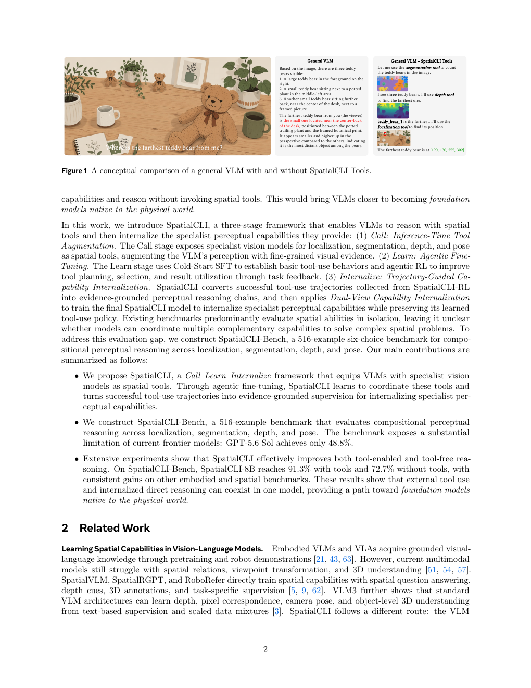
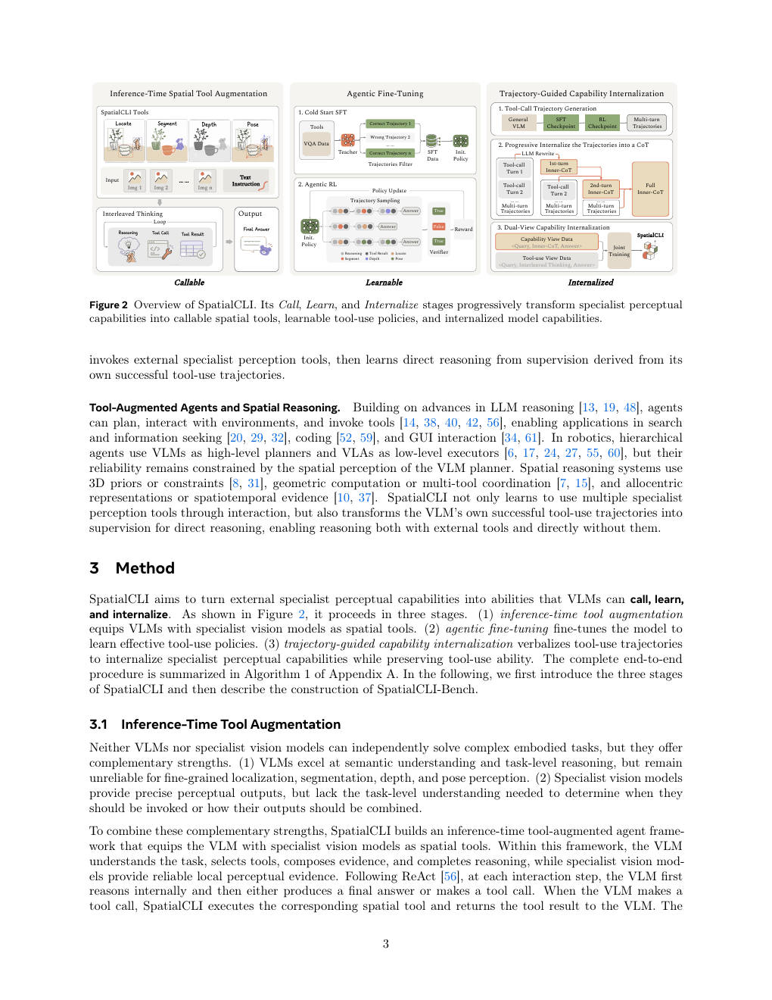

---
tags:
  - papers/3d-agent
  - papers/spatial-reasoning
  - papers/tool-use
aliases:
  - SpatialCLI
  - Learning to Reason With Spatial Tools
arxiv_id: 2607.27703
---
# SpatialCLI: Learning to Reason With Spatial Tools, Then Without Them

## 核心信息
- 标题: SpatialCLI: Learning to Reason With Spatial Tools, Then Without Them
- 标题翻译: SpatialCLI：先借助空间工具学习推理，再摆脱工具
- 作者: Yang Zhou 等 13 人
- 机构: Zhejiang University、Zhuoyu Technology、Beihang University 等
- 发表时间: 2026-07-31（arXiv v2: 2026-08-04）
- 发表渠道: arXiv:2607.27703 [cs.AI]
- arXiv: 2607.27703
- 论文链接: https://arxiv.org/abs/2607.27703
- 代码 / 项目: https://github.com/IANNXANG/SpatialCLI
- 数据 / 资源: https://huggingface.co/ZYT-MFM/SpatialCLI-8B；https://huggingface.co/datasets/ZYT-MFM/SpatialCLI-Data
- 论文类型: 具身 VLM 的空间工具使用、轨迹蒸馏与能力内化

## 原文摘要翻译
通用视觉语言模型能够推理整体任务，却经常遗漏决定任务成功的精细视觉细节；专门视觉模型能够捕获这些细节，却无法将其转化为任务级决策。SpatialCLI 通过三阶段框架教 VLM 使用空间工具，并逐步内化这些工具提供的专门感知能力：Call 将专门模型暴露为空间工具；Learn 用 Cold-Start SFT 和智能体式强化学习改进工具使用；Internalize 将成功工具轨迹语言化，并用双视图训练把能力迁移到无工具推理。作者构建了包含 516 个样例的 SpatialCLI-Bench，覆盖定位、分割、深度和姿态的组合感知。在 MindCube 上，SpatialCLI 将 Qwen3-VL-8B-Instruct 使用工具的性能从 29.3% 提升到 84.6%，并在内化后不使用工具仍达到 73.8%。

## 创新点
1. **把工具使用和工具摆脱放在同一个训练闭环。** 贡献不只是“给 VLM 接工具”，而是把成功调用轨迹变成能力内化监督。
2. **渐进式证据语言化。** 逐轮巩固新证据，再做全局重写，避免一次性处理长轨迹时丢失跨轮依赖或把答案倒灌成证据。
3. **双视图能力内化。** `Capability-Internalization View` 学习无工具感知推理，`Tool-Use View` 保留调用策略；$L_{CI}=L_{internal}+\lambda L_{agentic}$ 直接编码两者的折中。
4. **组合空间基准。** SpatialCLI-Bench 强迫模型组合至少两种 G/D/P 能力，不再只测孤立的定位或深度。

## 一句话总结
SpatialCLI 的真正贡献是把专门感知器变成“教师”：VLM 先学会调用它们，再从成功调用中蒸馏可解释的空间证据，最后用双视图防止内化过程摧毁工具策略。

## 研究问题
论文解决三个耦合问题：
1. 通用 VLM 何时应该调用 Locate、Segment、Depth、Pose？
2. 如何让模型正确使用返回的结构化证据，而不是坚持原有视觉猜测？
3. 如何把外部工具提供的能力迁移到无工具推理，同时避免工具调用能力遗忘？

## 数据与任务定义
### SpatialCLI-Bench
516 个英文六选一 VQA 样例，每题一或两张图，至少组合以下两类：
- G：grounding 与二维区域关系；
- D：度量深度；
- P：物体姿态或跨视角相机运动。

数据由 720 个候选经 Gemini 3.1 Pro 盘点实体、专门模型采证、Gemini 生成问题/干扰项后构造，再由两名研究生独立核验；最终保留 516 个（71.67%）。这是一个重要的质量控制，但也意味着基准依赖生成模型和人工一致性过滤。

### 训练池
37,000 个任务：Vlaser 5,000、MindCube-Train 10,000、BOPASK-Trajectory 10,000、BOPASK-Object-Rearrangement 10,000、RefSpatial 2,000。约 2,000 条教师轨迹用于 SFT；约 10,000 个不重叠任务用于 RL；约 42,000 条成功轨迹用于内化，产生约 84,000 个视图样本。

## 方法主线
### 机制流程
1. **Call：构造可调用的感知层。** VLM 负责语义理解和策略，四个工具负责精细感知；每轮返回结果和剩余预算都进入上下文。
2. **Learn：先模仿合法行为，再用任务奖励优化。** Cold-Start SFT 过滤教师轨迹，减少 RL 探索中的格式/参数错误；GRPO 用最终答案奖励优化选择、参数、证据利用和终止。
3. **Internalize：把轨迹拆成证据链。** 逐轮 extractor 只保留可追溯事实，global verbalizer 再按依赖顺序生成不提工具的感知 CoT。
4. **Dual-View：同时训练能力与策略。** 无工具视图提升原生能力，工具视图保持调用行为；论文选择 $\lambda=0.5$。

### 四个空间工具
- **Locate：** Locate Anything + Grounding DINO，返回 `bbox_2d` 和 `point_2d`。
- **Segment：** SAM 3，返回实例框、中心和 `polygon_2d`；最多 16 个顶点，目标 mask IoU 0.97。
- **Depth：** Depth Anything 3，返回相机轴 `depth_m`；值越大越远，不是欧氏距离。
- **Pose：** Orient Anything V2 处理物体朝向，VGGT 处理相机运动；坐标约定 +X 向右、+Y 向上、−Z 向前。

工具级接口设计是本文很容易被低估的部分。模型不直接选择底层 specialist，而只选择四个稳定 API；这把“选择哪个视觉模型”的系统工程复杂度隐藏在服务层，降低了策略学习难度。

### 目标函数与轨迹
$$\tau=(z_t,a_t,o_t)_{t=1}^T,\qquad \xi=(I,q,\tau,y).$$

内化目标：
$$L_{CI}=L_{internal}+\lambda L_{agentic}.$$

关键约束是工具返回只作为上下文，不直接对返回 token 计算语言模型损失；这样训练的是“如何读证据”，不是机械复述服务输出。

## 训练流程与可复现性
### 训练配置
| 阶段 | 关键设置 |
|---|---|
| SFT / 内化 | AdamW；LR $2\times10^{-5}$；weight decay 0.1；batch 64；context 32768；2 epochs；seed 42 |
| Agentic RL | GRPO；group 8；clip low/high 0.20/0.28；tool budget 10；LR $10^{-6}$；FP16 |
| 评测 | temperature 1.0；top-p 0.95；top-k 20；最大生成 40,960；三次运行均值；最多 10 次调用 |
| 软件 | Ubuntu 24.04.2、CUDA 12.9、Python 3.12.3、PyTorch 2.9.0、Transformers 5.5.4、vLLM 0.18.0、verl 0.9.0.dev0、Ray 2.49.2 |
| 资源 | SFT/RL 四节点；专门服务两张 GPU；工具调用平均延迟 2.916 s |

复现的真正难点不是超参，而是服务层：底层六个 specialist 的具体 checkpoint、缓存键、后处理、坐标序列化、工具 prompt 和答案 parser 都会改变结果。论文给出了接口和主要后处理，代码/模型/数据链接也公开，这是明显优点；但四节点训练和专门服务部署仍然构成较高复现门槛。

## 关键结果
### 主结果
| 模型 | SpatialCLI-Bench | MindCube | Avg. |
|---|---:|---:|---:|
| Qwen3-VL-8B-Instruct，无工具 | 35.3 | 29.3 | 35.7 |
| 初始模型 + SpatialCLI Tools | 66.5 | 47.2 | 56.7 |
| SpatialCLI-8B，无工具 | 72.7 | 73.8 | 62.9 |
| SpatialCLI-8B，使用工具 | 91.3 | 84.6 | 73.2 |

结论不是“工具比模型强”这么简单：初始模型接工具已经从 35.3 升到 66.5，而训练后无工具达到 72.7、使用工具达到 91.3，说明训练同时改善了策略和能力。

### 训练动态
- 工具 RL + SFT 的调用数稳定在约 2.56；无 SFT 的工具 RL 从 3.36 增到 6.74，说明 SFT 先建立了可控策略。
- 更多内化数据使无工具分数 40.1→74.0、宏 CII 45.6→61.6，支持“能力迁移”而非只记最终答案。
- 工具性能随模型容量较早饱和，而 CII 继续随容量提升；外部工具压缩模型规模差异，内化能力仍吃模型容量。

## 消融到底说明了什么
### 结构化返回优于额外可视化
Visual Only 的 SpatialCLI-Bench 为 45.9，Structured + Visual 为 66.0，Structured Only 为 66.5。坐标和多边形不仅更有效，也更容易被转成文本监督；额外画框图片并没有带来稳定收益。

### 两个视图不可互相替代
| Variant | w/o Tools | w/ Tools |
|---|---:|---:|
| Initial | 35.3 | 66.5 |
| Final Answer Only | 52.7 | 52.1 |
| CoT + Answer | 45.0 | 42.2 |
| Internalization View Only | 71.1 | 62.6 |
| Tool-Use View Only | 42.2 | 89.0 |
| One-Pass Dual-View | 64.5 | 90.2 |
| Full Dual-View | 72.7 | 91.3 |

这张表是论文最有解释力的证据：只学最终答案不能保留策略；只学 CoT 会变长但不一定扎根于感知；只学内化视图会调用失控；只学工具视图则不会内化；渐进式 Full Dual-View 才形成双模式共存。

### $\lambda$ 敏感性
$\lambda=0.2/0.5/1.0/1.5$ 的 CII 分别约为 60.8/60.8/60.5/55.6；无工具性能为 72.5/72.7/72.3/62.9；工具性能为 89.2/91.3/91.4/91.4。$\lambda=0.5$ 是平衡点，而不是单项最优点。

## 深度分析
### 真正贡献是什么
真正贡献是**监督形态的转换**：工具返回本身不是最有价值的，成功轨迹经过证据抽取后成为可训练的“感知推理程序”。这使 specialist 从运行时 oracle 变成了数据教师。Call–Learn–Internalize 是一个数据闭环，而非三个松散模块。

### 为什么结果成立
1. **结构化证据降低了跨模态歧义。** 坐标、深度值、方向和多边形可以直接进入文本上下文，模型不需要重新从标注图像读几何。
2. **SFT 改善 RL 的探索分布。** 先学合法 API 行为，RL 优化的是何时调用和如何整合，而不是语法能否解析。
3. **渐进抽取保持跨轮依赖。** 每轮只加入新证据，避免长轨迹一次性重写时重复、遗漏或答案泄漏。
4. **双视图抑制灾难性遗忘。** 内化视图让能力进入参数，工具视图持续约束调用策略。

### 容易误读的地方
- 91.3% 是在作者提供的工具栈和最多 10 次调用下，不是纯模型视觉能力。
- 72.7% 无工具性能不是“从零学会深度传感器”，而是对工具输出分布的蒸馏；CII 也测与 specialist 输出相似，不等价于真实物理深度准确率。
- SpatialCLI-Bench 的 195 个 MindCube 派生样例占 37.79%，与既有数据有关系，虽作者声明训练无重叠，仍应关注分布相似性。
- Case 2 的选项坐标存在 855/856 的近似/序列化差异，说明 benchmark 的边界框离散化和选项措辞需要仔细审计。

## 局限
1. **工具覆盖有限。** 目前集中于定位、分割、深度和姿态，尚不能处理开放式多模态生成、物理交互或动作执行。
2. **specialist 误差会进入教师轨迹。** 内化可能把错误的深度或姿态估计写入模型。
3. **基准和教师模型依赖。** Gemini 生成、人工一致性过滤、专门工具 oracle 共同定义了题目难度，可能造成闭环偏差。
4. **服务成本高。** 平均每次工具调用 2.916 秒，四节点训练和两张 GPU 服务不适合轻量部署。
5. **CII 的有效性边界。** 复现工具 JSON 的相似度是能力代理指标，不等同于在新传感器、新相机或真实机器人上的校准精度。

## 我的笔记
这篇工作对 3D agent 方向的启发不是再增加一个空间工具，而是明确区分三种能力：**调用能力、证据整合能力、感知能力本身**。许多 tool-use agent 只测第一种；许多 spatial VLM 只测第三种；SpatialCLI 用双视图把三者放进一个优化问题。

如果沿这个方向继续，最值得做的实验是：
1. 用真实深度传感器或机器人执行结果替代 specialist 输出，验证 CII 与物理成功率的相关性；
2. 在训练中注入有控制的工具噪声，测模型是学会校准还是盲信工具；
3. 做跨 specialist、跨相机、跨坐标约定的迁移，检验内化的是几何规律还是 API 格式；
4. 把无工具视图从文本 CoT 扩展到 latent/action-conditioned state，避免“语言化”成为唯一中间表示；
5. 将工具预算、延迟和置信度纳入奖励，研究准确率—成本—调用次数的 Pareto 前沿。

## 证据图像

**图 1。** SpatialCLI 的 Call–Learn–Internalize 总体流程（PDF p.2）。

**图 2。** 空间工具调用与轨迹内化示意（PDF p.3）。

## 引用
Zhou et al., “SpatialCLI: Learning to Reason With Spatial Tools, Then Without Them,” arXiv:2607.27703v2, 2026. 完整参考文献见同目录 `detailed_paper.md` 的来源锚点和原 PDF pp. 11–14。

## 本轮全文覆盖核验

- 对应的 `detailed_paper.md` 已按用户提供的可提取文本 PDF 重新生成：SPARGen 覆盖 9 页，SpatialCLI 覆盖 48 页；`source_map.json` 保存页码、顺序和正文锚点。
- `paper.md` 与 `detailed_paper.md` 已做字节级同步。
- 本文件是证据驱动的精读笔记，不重复粘贴全文译文；因此 `paper_DeepPaperNote.lint.json` 中的 evidence gate 仍如实反映“精读笔记自身是凝练稿”，不能把它误报为逐字翻译。
