# VOYAGER: An Open-Ended Embodied Agent with Large Language Models

> **Source:** Guanzhi Wang et al., arXiv:2305.16291v2 [cs.AI], 19 Oct 2023; supplied PDF, 42 pages.
>
> **Reader status:** Draft/partial. Core body, all section headings, figures/tables, algorithm, prompt contracts, and appendix results are translated below. The source PDF’s 92 bibliographic entries and long trial item lists are retained as source references rather than retyped; see the material caveat.

## Contents / 目录
Abstract; Introduction; Method; Experiments; Limitations and Future Work; Related Work; Conclusion; Broader Impacts; Acknowledgements; References; Appendix A Method; Appendix B Experiments.

## Terminology / 术语
automatic curriculum—自动课程；skill library—技能库；environment feedback—环境反馈；execution error—执行错误；self-verification—自验证；tech tree—技术树；prompting iteration—提示迭代次数；open-ended exploration—开放式探索。

# Abstract / 摘要
> <span style="color:#3B82F6"><strong>Para. 1:</strong></span> We introduce VOYAGER, the first LLM-powered embodied lifelong learning agent in Minecraft that continuously explores the world, acquires diverse skills, and makes novel discoveries without human intervention. It consists of (1) an automatic curriculum that maximizes exploration, (2) an ever-growing executable-code skill library, and (3) iterative prompting incorporating environment feedback, execution errors, and self-verification.

> <span style="color:#F59E0B"><strong>Para. 1[CN]:</strong></span> 我们提出 VOYAGER，这是 Minecraft 中首个由 LLM 驱动的具身终身学习智能体，能够无人工干预地持续探索、获得多样技能并作出新发现。它包含：(1) 最大化探索的自动课程；(2) 不断增长的可执行代码技能库；(3) 融合环境反馈、执行错误和自验证的迭代提示机制。

> <span style="color:#3B82F6"><strong>Para. 2:</strong></span> VOYAGER interacts with GPT-4 through blackbox queries, avoiding parameter fine-tuning. Its temporally extended, interpretable, compositional skills rapidly compound abilities and alleviate catastrophic forgetting. It obtains 3.3× more unique items, travels 2.3× farther, and unlocks key tech-tree milestones up to 15.3× faster than prior SOTA. It transfers its library to a new world and solves novel tasks from scratch.

> <span style="color:#F59E0B"><strong>Para. 2[CN]:</strong></span> VOYAGER 通过黑盒查询与 GPT-4 交互，无需微调参数。其时间扩展、可解释、可组合的技能快速复合能力并缓解灾难性遗忘。它获得 3.3 倍更多独特物品，行进 2.3 倍更远，并以最高快 15.3 倍的速度解锁关键技术树里程碑。它可将技能库迁移到新世界，从零解决新任务。

### Figure 1. Continual discovery / 持续发现
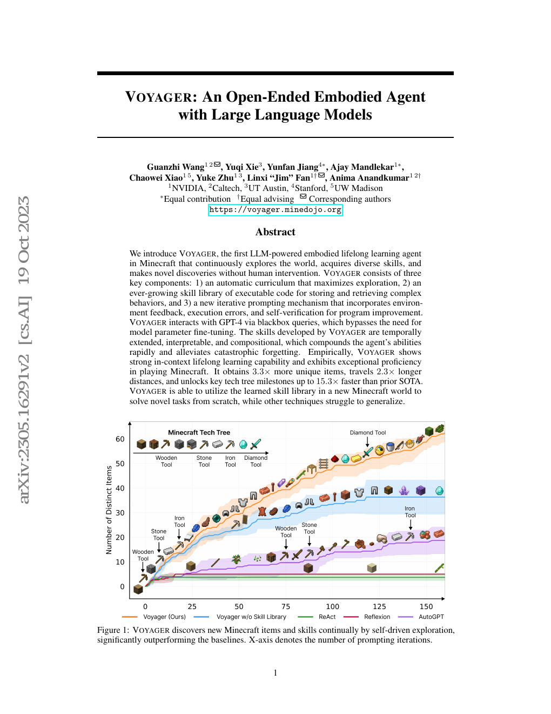
**Caption:** VOYAGER continually discovers Minecraft items and skills by self-driven exploration; x-axis is prompting iterations.
**Caption[CN]:** VOYAGER 通过自主探索持续发现 Minecraft 物品和技能；横轴为提示迭代次数。

# 1 Introduction / 引言
> <span style="color:#3B82F6"><strong>Para. 1:</strong></span> Building generally capable embodied agents that continuously explore, plan, and develop skills in open-ended worlds is a grand challenge [1–5]. RL [6,7] and imitation learning [8–10] use primitive actions, making systematic exploration [11–15], interpretability [16–18], and generalization [19–21] difficult. LLM agents use pretrained world knowledge for plans and executable policies [16,22,19], but are not lifelong learners that progressively acquire, update, accumulate, and transfer knowledge [31,32].

> <span style="color:#F59E0B"><strong>Para. 1[CN]:</strong></span> 在开放式世界中构建能持续探索、规划和发展技能的通用具身智能体是重大挑战 [1–5]。RL [6,7] 和模仿学习 [8–10] 使用原子动作，使系统化探索 [11–15]、可解释性 [16–18] 和泛化 [19–21] 困难。LLM 智能体利用预训练世界知识生成计划和可执行策略 [16,22,19]，但不是能逐步获取、更新、累积和迁移知识的终身学习者 [31,32]。

> <span style="color:#3B82F6"><strong>Para. 2:</strong></span> Minecraft has no predefined goal or fixed storyline; it offers procedurally generated 3D terrain and an unlockable tech tree. Humans learn wood mining and cooking before combat and diamond tools. An effective lifelong learner should propose tasks suited to skill and state, refine and remember skills from feedback, and continually explore autonomously.

> <span style="color:#F59E0B"><strong>Para. 2[CN]:</strong></span> Minecraft 没有预定义目标或固定剧情，提供程序生成的三维地形和可解锁技术树。人类先学挖木头、烹饪，再学习战斗和钻石工具。有效终身学习者应根据技能和状态提出任务，从反馈中改进并记忆技能，并自主持续探索。

> <span style="color:#3B82F6"><strong>Para. 3:</strong></span> VOYAGER uses an automatic curriculum, skill library, and iterative prompting mechanism. Code represents temporally extended and compositional actions [16,22]. GPT-4 is used by prompting and in-context learning [36–38], without parameter access or gradient training. The curriculum pursues “discovering as many diverse things as possible”, an in-context novelty search [39,40].

> <span style="color:#F59E0B"><strong>Para. 3[CN]:</strong></span> VOYAGER 使用自动课程、技能库和迭代提示机制。代码能够表达时间扩展和组合动作 [16,22]。GPT-4 通过提示和上下文学习 [36–38] 使用，无需访问参数或梯度训练。课程追求“发现尽可能多的多样事物”，可视为上下文内新颖性搜索 [39,40]。

### Figure 2. Components / 组件
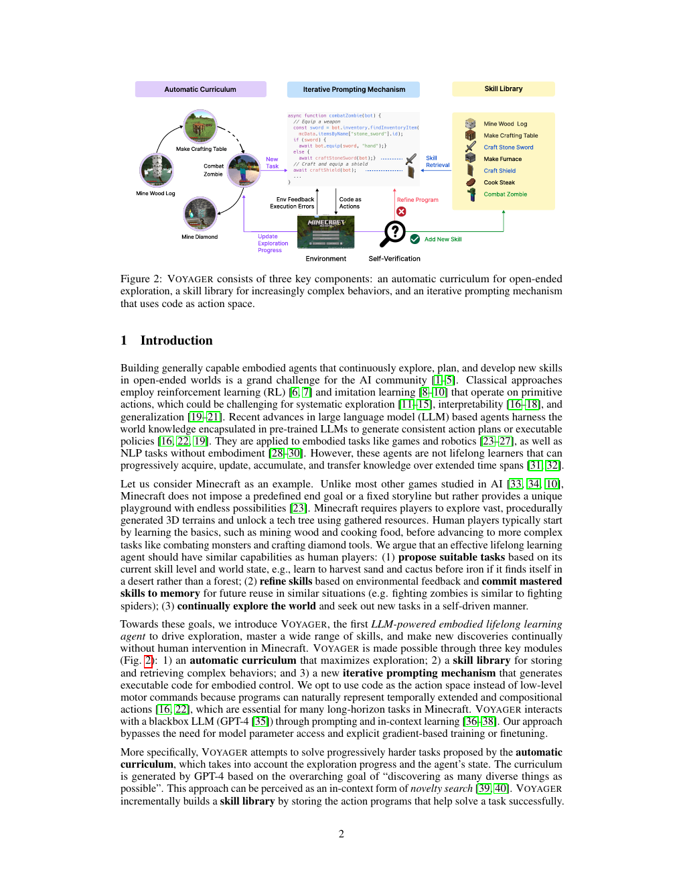
**Caption:** Automatic curriculum, skill library, and iterative prompting using code as action space.
**Caption[CN]:** 自动课程、技能库和将代码作为动作空间的迭代提示。

> <span style="color:#3B82F6"><strong>Para. 4:</strong></span> Programs are indexed by description embeddings and retrieved in similar situations. Composing simple programs makes complex skills. Since one-shot LLM code is unreliable [41], VOYAGER executes code, feeds observations and interpreter errors to GPT-4, refines repeatedly, and commits verified programs such as `craftStoneShovel()` and `combatZombieWithSword()`.

> <span style="color:#F59E0B"><strong>Para. 4[CN]:</strong></span> 程序按描述嵌入索引，可在相似情境检索。组合简单程序形成复杂技能。由于 LLM 一次生成代码并不可靠 [41]，VOYAGER 执行代码，将观测和解释器错误反馈给 GPT-4，反复细化，并提交经验证的 `craftStoneShovel()`、`combatZombieWithSword()` 等程序。

# 2 Method / 方法
> <span style="color:#3B82F6"><strong>Para. 1:</strong></span> VOYAGER has an automatic curriculum (2.1), skill library (2.2), and iterative prompting mechanism (2.3); full prompts are in Appendix A.
> <span style="color:#F59E0B"><strong>Para. 1[CN]:</strong></span> VOYAGER 包含自动课程（2.1）、技能库（2.2）和迭代提示机制（2.3）；完整提示见附录 A。

## 2.1 Automatic Curriculum / 自动课程
> <span style="color:#3B82F6"><strong>Para. 1:</strong></span> Automatic curricula make open-ended learning challenging yet manageable, foster curiosity, and encourage general flexible strategies [42–44]. GPT-4 provides a stream of tasks in bottom-up order, adapting to exploration and state (Fig. 3), naturally teaching skills such as “mining a diamond”.
> <span style="color:#F59E0B"><strong>Para. 1[CN]:</strong></span> 自动课程使开放式学习具有挑战性且可管理，培养好奇心并促进通用灵活策略 [42–44]。GPT-4 以自底向上顺序持续提供任务，适应探索和状态（图 3），自然教会“挖钻石”等技能。

### Figure 3. Curriculum tasks / 课程任务
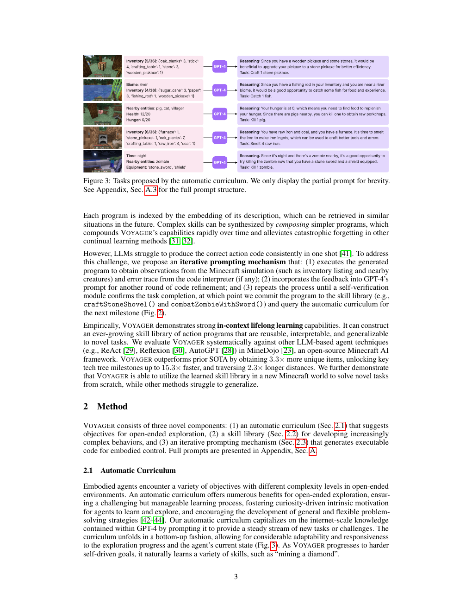
**Caption:** Tasks proposed by automatic curriculum; partial prompt only; full prompt in A.3.
**Caption[CN]:** 自动课程提出的任务；这里只展示部分提示；完整提示见 A.3。

> <span style="color:#3B82F6"><strong>Para. 2:</strong></span> The GPT-4 input includes diversity directives; inventory, equipment, nearby blocks/entities, biome, time, health, hunger, position; completed/failed tasks; and GPT-3.5 self-asked questions and answers. GPT-3.5 is used for standard NLP for budget reasons.
> <span style="color:#F59E0B"><strong>Para. 2[CN]:</strong></span> GPT-4 输入包括多样性指令；物品栏、装备、附近方块/实体、生物群系、时间、生命、饥饿和位置；完成/失败任务；以及 GPT-3.5 自问自答的问题。出于预算原因，标准 NLP 使用 GPT-3.5。

## 2.2 Skill Library / 技能库
> <span style="color:#3B82F6"><strong>Para. 1:</strong></span> Executable code represents each temporally extended skill, inspired by program generality and interpretability [45]. GPT-4 receives generation guidelines, control APIs, retrieved skills, previous code, feedback, errors, critique, state, and chain-of-thought [46].
> <span style="color:#F59E0B"><strong>Para. 1[CN]:</strong></span> 每项时间扩展技能由可执行代码表示，受程序通用性和可解释性启发 [45]。GPT-4 接收生成指南、控制 API、检索技能、上一轮代码、反馈、错误、批评、状态和思维链 [46]。

### Figure 4. Skill library / 技能库
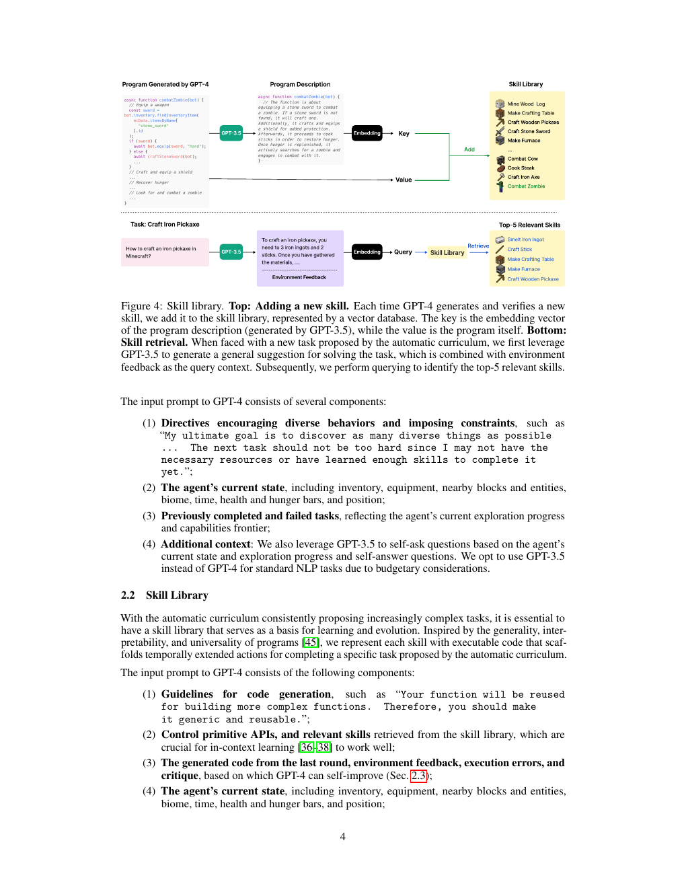
**Caption:** Verified program-description embeddings are keys and programs are values; task plans and feedback retrieve top-5 skills.
**Caption[CN]:** 经验证的程序描述嵌入作为键、程序作为值；任务计划和反馈用于检索 top-5 技能。

## 2.3 Iterative Prompting Mechanism / 迭代提示机制
> <span style="color:#3B82F6"><strong>Para. 1:</strong></span> Feedback consists of (1) environment feedback from `bot.chat()`, (2) interpreter execution errors, and (3) self-verification by another GPT-4 critic. The critic checks completion and supplies critique when unsuccessful, more comprehensively than self-reflection [30].
> <span style="color:#F59E0B"><strong>Para. 1[CN]:</strong></span> 反馈包括：(1) 由 `bot.chat()` 产生的环境反馈；(2) 解释器执行错误；(3) 另一个 GPT-4 批评者进行的自验证。批评者检查完成情况，失败时提供批评，比自反思 [30] 更全面。
> <span style="color:#3B82F6"><strong>Para. 2:</strong></span> Code is executed each round; feedback and errors enter the next prompt. Verification success stores the skill and requests a new objective. After 4 unsuccessful rounds, another task is queried.
> <span style="color:#F59E0B"><strong>Para. 2[CN]:</strong></span> 每轮执行代码，反馈和错误进入下一提示。验证成功后保存技能并请求新目标；连续 4 轮失败后查询另一任务。

### Figure 5. Feedback and errors / 反馈与错误
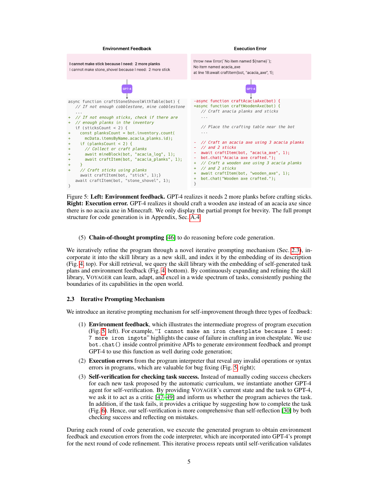
**Caption:** GPT-4 uses missing-plank feedback and corrects nonexistent `acacia_axe` to a wooden axe.
**Caption[CN]:** GPT-4 根据缺少木板的反馈修正计划，并将不存在的 `acacia_axe` 改为木斧。
### Figure 6. Self-verification / 自验证
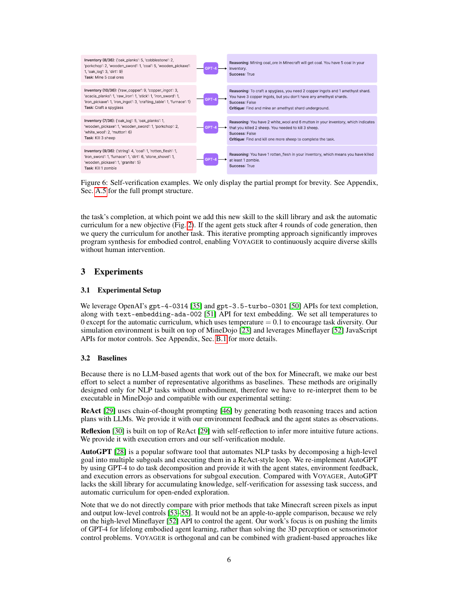
**Caption:** Self-verification examples; full prompt in A.5.
**Caption[CN]:** 自验证示例；完整提示见 A.5。

# 3 Experiments / 实验
## 3.1 Setup / 设置
> <span style="color:#3B82F6"><strong>Para. 1:</strong></span> We use `gpt-4-0314`, `gpt-3.5-turbo-0301`, and `text-embedding-ada-002`; temperatures are 0 except curriculum temperature = 0.1. MineDojo and Mineflayer provide the environment and motor controls.
> <span style="color:#F59E0B"><strong>Para. 1[CN]:</strong></span> 使用 `gpt-4-0314`、`gpt-3.5-turbo-0301` 和 `text-embedding-ada-002`；除课程 temperature = 0.1 外均为 0。MineDojo 和 Mineflayer 提供环境与电机控制。
## 3.2 Baselines / 基线
> <span style="color:#3B82F6"><strong>Para. 1:</strong></span> ReAct [29] generates reasoning and actions with state/feedback. Reflexion [30] adds reflection, errors, and verification. AutoGPT [28] decomposes goals into subgoals but lacks VOYAGER’s skill library, self-verification, and automatic curriculum. Pixel-input low-level methods [53–55] are not apple-to-apple comparisons; VOYAGER is orthogonal to VPT [8].
> <span style="color:#F59E0B"><strong>Para. 1[CN]:</strong></span> ReAct [29] 根据状态/反馈生成推理和动作。Reflexion [30] 增加反思、错误和验证。AutoGPT [28] 将目标分解为子目标，但缺少 VOYAGER 的技能库、自验证和自动课程。像素输入低层方法 [53–55] 不具备同等条件；VOYAGER 与 VPT [8] 正交。

### Table 1. Tech tree mastery / 技术树掌握
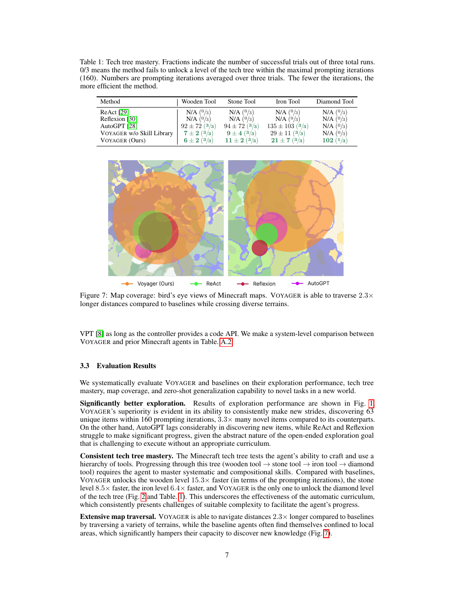
| Method | Wooden | Stone | Iron | Diamond |
|---|---:|---:|---:|---:|
| ReAct [29] | N/A (0/3) | N/A (0/3) | N/A (0/3) | N/A (0/3) |
| Reflexion [30] | N/A (0/3) | N/A (0/3) | N/A (0/3) | N/A (0/3) |
| AutoGPT [28] | 92 ± 72 | 94 ± 72 | 135 ± 103 | N/A (0/3) |
| VOYAGER w/o Skill Library | 7 ± 2 | 9 ± 4 | 29 ± 11 | N/A (0/3) |
| VOYAGER (Ours) | 6 ± 2 | 11 ± 2 | 21 ± 7 | 102 (1/3) |
**Caption:** Fractions are successes out of 3; maximum 160 iterations; averages over trials; fewer is more efficient.
**Caption[CN]:** 分数是 3 次试验中的成功数；最大 160 次迭代；数字为试验平均值；越少越高效。
### Figure 7. Map coverage / 地图覆盖

**Caption:** VOYAGER traverses 2.3× longer distances across diverse terrain.
**Caption[CN]:** VOYAGER 穿越多样地形，行进距离为 2.3 倍。

## 3.3 Evaluation / 评估
> <span style="color:#3B82F6"><strong>Para. 1:</strong></span> VOYAGER discovers 63 unique items in 160 iterations (3.3× counterparts), unlocks wooden/stone/iron levels 15.3×/8.5×/6.4× faster, uniquely reaches diamond, and traverses 2.3× farther.
> <span style="color:#F59E0B"><strong>Para. 1[CN]:</strong></span> VOYAGER 在 160 次迭代发现 63 个独特物品（为其他方法 3.3 倍），解锁木/石/铁等级分别快 15.3/8.5/6.4 倍，唯一达到钻石等级，并行进 2.3 倍更远。
### Table 2. Zero-shot generalization / 零样本泛化
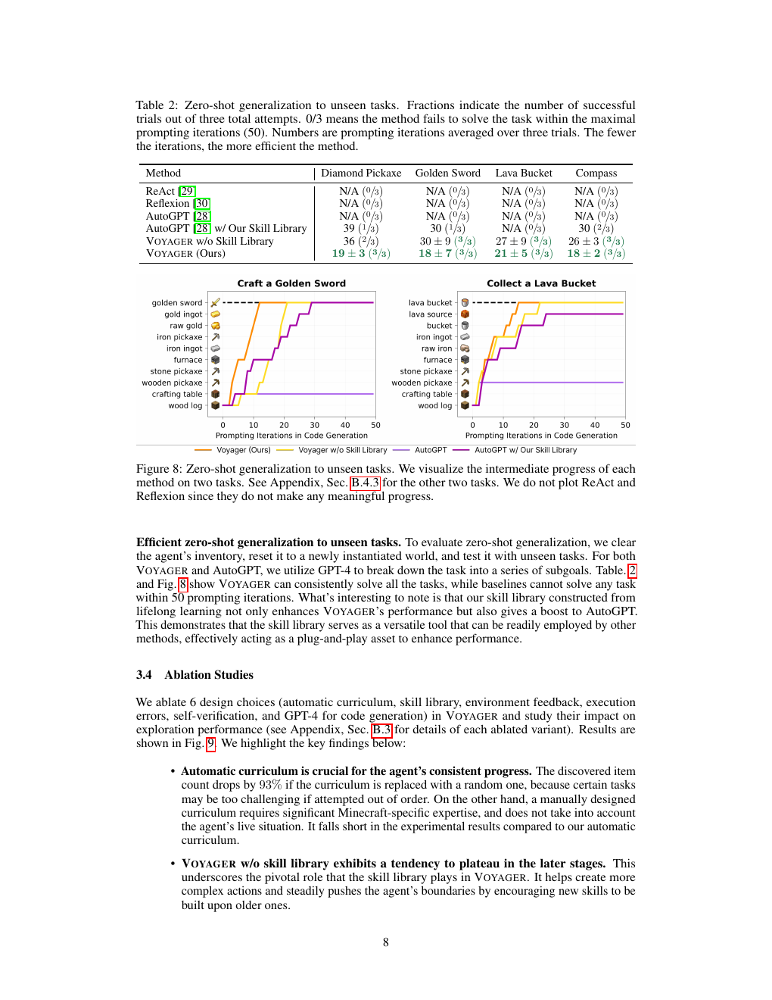
| Method | Diamond Pickaxe | Golden Sword | Lava Bucket | Compass |
|---|---:|---:|---:|---:|
| ReAct / Reflexion / AutoGPT | N/A (0/3) | N/A (0/3) | N/A (0/3) | N/A (0/3) |
| AutoGPT w/ Our Skill Library | 39 (1/3) | 30 (1/3) | N/A (0/3) | 30 (2/3) |
| VOYAGER w/o Skill Library | 36 (2/3) | 30 ± 9 | 27 ± 9 | 26 ± 3 |
| VOYAGER (Ours) | 19 ± 3 | 18 ± 7 | 21 ± 5 | 18 ± 2 |
**Caption:** Three attempts; maximum 50 iterations; fewer is more efficient.
**Caption[CN]:** 3 次尝试；最大 50 次迭代；越少越高效。
### Figure 8. Unseen tasks / 未见任务

**Caption:** VOYAGER’s intermediate progress on two unseen tasks; ReAct and Reflexion omitted.
**Caption[CN]:** VOYAGER 在两个未见任务上的中间进度；省略 ReAct 和 Reflexion。
> <span style="color:#3B82F6"><strong>Para. 2:</strong></span> Clearing inventory and resetting a new world, VOYAGER solves all unseen tasks within 50 iterations. Its lifelong skill library also boosts AutoGPT, acting as a plug-and-play asset.
> <span style="color:#F59E0B"><strong>Para. 2[CN]:</strong></span> 清空物品栏并重置新世界后，VOYAGER 在 50 次迭代内解决全部未见任务。其终身技能库也提升 AutoGPT，成为即插即用资产。

## 3.4 Ablations / 消融
> <span style="color:#3B82F6"><strong>Para. 1:</strong></span> Removing or replacing six choices shows: random curriculum reduces item count by 93%; no library plateaus; no self-verification reduces count by −73%; GPT-4 obtains 5.7× more items than GPT-3.5.
> <span style="color:#F59E0B"><strong>Para. 1[CN]:</strong></span> 对六项选择消融表明：随机课程使物品数下降 93%；无技能库会平台化；无自验证使数量下降 −73%；GPT-4 获得的物品是 GPT-3.5 的 5.7 倍。
### Figure 9. Ablations / 消融
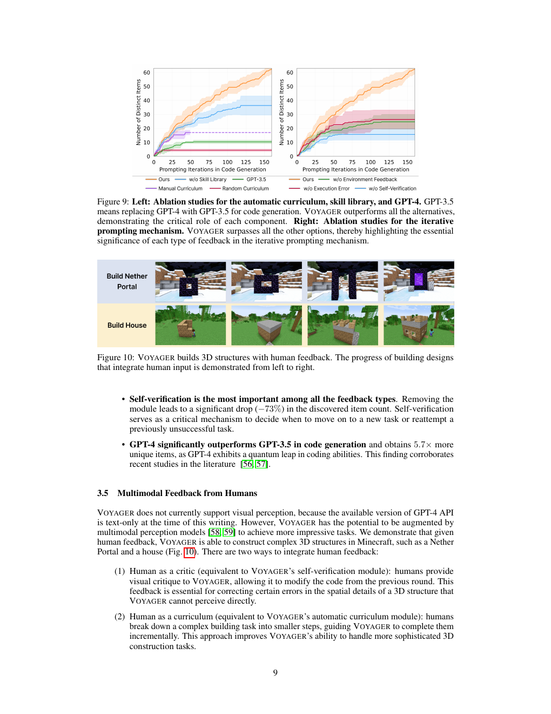
**Caption:** VOYAGER outperforms alternatives in curriculum, library, GPT-4, and feedback ablations.
**Caption[CN]:** 在课程、技能库、GPT-4 和反馈消融中 VOYAGER 均优于替代方案。
## 3.5 Human multimodal feedback / 人类多模态反馈
> <span style="color:#3B82F6"><strong>Para. 1:</strong></span> The available GPT-4 API is text-only, but multimodal models [58,59] could augment VOYAGER. Human critics correct spatial details; humans as curriculum decompose complex building. VOYAGER builds a Nether Portal and house.
> <span style="color:#F59E0B"><strong>Para. 1[CN]:</strong></span> 可用 GPT-4 API 仅支持文本，但多模态模型 [58,59] 可增强 VOYAGER。人类批评者纠正空间细节；人类课程将复杂建造分解。VOYAGER 能建造下界传送门和房屋。
### Figure 10. Human feedback / 人类反馈

**Caption:** 3D structures built with human feedback, left to right.
**Caption[CN]:** 在人类反馈下构建三维结构，进展从左到右。

# 4 Limitations and Future Work / 局限与未来工作
> <span style="color:#3B82F6"><strong>Para. 1:</strong></span> GPT-4 costs 15× GPT-3.5 but is needed for code quality. The agent can get stuck, verification can miss spider string, and hallucinations include “copper sword”, invalid cobblestone fuel, and absent APIs. Better models and open-source fine-tuning may help.
> <span style="color:#F59E0B"><strong>Para. 1[CN]:</strong></span> GPT-4 成本是 GPT-3.5 的 15 倍，但代码质量需要它。智能体会卡住，验证可能漏掉蜘蛛丝；幻觉包括“铜剑”、无效圆石燃料和不存在的 API。更好的模型和开源微调可能有所帮助。

# 5 Related Work / 相关工作
> <span style="color:#3B82F6"><strong>Para. 1:</strong></span> Minecraft agents use low-level hierarchical RL, video pretraining, world models, or high-level Codex/LLM planning [8,23,53,55,66–71]. VOYAGER differs through curiosity-driven bottom-up automatic curriculum.
> <span style="color:#F59E0B"><strong>Para. 1[CN]:</strong></span> Minecraft 智能体使用低层分层 RL、视频预训练、世界模型或高层 Codex/LLM 规划 [8,23,53,55,66–71]。VOYAGER 通过好奇心驱动的自底向上自动课程区别于它们。
> <span style="color:#3B82F6"><strong>Para. 2:</strong></span> Robot-planning LLMs use subgoals, feedback, executable policies, and multimodal fine-tuning; text agents include ReAct, Reflexion, AutoGPT, DERA, Generative Agents, and SPRING [16,19,22,26–30,59,81–83]. They lack a self-growing library.
> <span style="color:#F59E0B"><strong>Para. 2[CN]:</strong></span> 机器人规划 LLM 使用子目标、反馈、可执行策略和多模态微调；文本智能体包括 ReAct、Reflexion、AutoGPT、DERA、Generative Agents 和 SPRING [16,19,22,26–30,59,81–83]。它们缺少自增长技能库。
> <span style="color:#3B82F6"><strong>Para. 3:</strong></span> Execution-guided synthesis uses outcomes, voting, learned verifiers, or rule-based feedback [86–92]. VOYAGER integrates environment feedback, execution errors, and self-verification for embodiment.
> <span style="color:#F59E0B"><strong>Para. 3[CN]:</strong></span> 执行引导合成利用结果、多数投票、学习式验证器或规则反馈 [86–92]。VOYAGER 将环境反馈、执行错误和自验证整合到具身控制。

# 6 Conclusion / 结论
> <span style="color:#3B82F6"><strong>Para. 1:</strong></span> VOYAGER is an LLM-powered embodied lifelong agent that explores, learns sophisticated skills, discovers items, unlocks the tech tree, traverses terrain, and transfers its library without parameter tuning.
> <span style="color:#F59E0B"><strong>Para. 1[CN]:</strong></span> VOYAGER 是由 LLM 驱动的具身终身智能体，能探索、学习复杂技能、发现物品、解锁技术树、穿越地形，并在无需参数调节下迁移技能库。
# 7 Broader Impacts / 更广泛影响
> <span style="color:#3B82F6"><strong>Para. 1:</strong></span> Minecraft is safe; physical-robot deployment requires human safety constraints.
> <span style="color:#F59E0B"><strong>Para. 1[CN]:</strong></span> Minecraft 安全；部署到实体机器人需要人类实施安全约束。
# 8 Acknowledgements / 致谢
> <span style="color:#3B82F6"><strong>Para. 1:</strong></span> The authors thank Ziming Zhu, Kaiyu Yang, Rafał Kocielnik, Colin White, Or Sharir, Sahin Lale, De-An Huang, Jean Kossaifi, Yuncong Yang, Charles Zhang, Minchao Huang, colleagues, and friends. The work was done during Guanzhi Wang’s NVIDIA internship, supported by Caltech’s Kortschak fellowship.
> <span style="color:#F59E0B"><strong>Para. 1[CN]:</strong></span> 作者感谢 Ziming Zhu、Kaiyu Yang、Rafał Kocielnik、Colin White、Or Sharir、Sahin Lale、De-An Huang、Jean Kossaifi、Yuncong Yang、Charles Zhang、Minchao Huang 及同事朋友。本工作完成于 Guanzhi Wang 在 NVIDIA 的实习期间，并获 Caltech Kortschak 奖学金支持。

# References / 参考文献

[1]–[92] Retained in the supplied PDF’s original searchable bibliographic form, pages 11–18, to preserve authors, titles, venues, years, pages, and arXiv identifiers. 正文引用编号与源文一致；不机器翻译正式书目。

# Appendix A Method / 附录 A：方法
## A.1 Algorithm / 算法
> <span style="color:#3B82F6"><strong>Para. 1:</strong></span> Pseudocode resets the environment; obtains progress; proposes a task; retrieves skills; generates and executes code; verifies success; stores success or records failure; and tries at most 4 rounds.
> <span style="color:#F59E0B"><strong>Para. 1[CN]:</strong></span> 伪代码重置环境、获取进度、提出任务、检索技能、生成并执行代码、验证成功、保存成功或记录失败，最多尝试 4 轮。
```python
def voyager(environment, curriculum_agent, action_agent, critic_agent, skill_manager):
    agent_state = environment.reset()
    while True:
        progress = curriculum_agent.get_exploration_progress(
            curriculum_agent.get_completed_tasks(), curriculum_agent.get_failed_tasks())
        task = curriculum_agent.propose_next_task(agent_state, progress)
        code = None; feedback = None; errors = None; critique = None
        success = False
        for i in range(4):
            skills = skill_manager.retrieve_skills(task, feedback)
            code = action_agent.generate_code(task, code, feedback, errors, critique, skills)
            agent_state, feedback, errors = environment.step(code)
            success, critique = critic_agent.check_task_success(task, agent_state)
            if success: break
        if success: skill_manager.add_skill(code); curriculum_agent.add_completed_task(task)
        else: curriculum_agent.add_failed_task(task)
```
## A.2 Prompting / 提示
> <span style="color:#3B82F6"><strong>Para. 1:</strong></span> Prompt roles are `System`, `User`, and `Assistant`; system and user prompts are concatenated to save tokens.
> <span style="color:#F59E0B"><strong>Para. 1[CN]:</strong></span> 提示角色为 `System`、`User`、`Assistant`；为节省 token，将 system 和 user prompt 拼接。
## A.3 Curriculum prompt / 课程提示
> <span style="color:#3B82F6"><strong>Para. 1:</strong></span> Exact fields include `Inventory`, `Equipment`, `Nearby blocks`, `Other blocks that are recently seen`, `Nearby entities`, `Chests`, `Biome`, `Time`, health/hunger (maximum 20), and `Position (x,y,z)`. Warm-up thresholds are 0 (core state), 5 (entities), 7 (full inventory), 10 (recent blocks/biome), and 15 (health, hunger, time, context).
> <span style="color:#F59E0B"><strong>Para. 1[CN]:</strong></span> 精确字段包括 `Inventory`、`Equipment`、`Nearby blocks`、`Other blocks that are recently seen`、`Nearby entities`、`Chests`、`Biome`、`Time`、最大 20 的生命/饥饿和 `Position (x,y,z)`。热身阈值为 0（核心状态）、5（实体）、7（完整物品栏）、10（最近方块/生物群系）、15（生命、饥饿、时间、上下文）。
### Table A.1. Warm-up / 热身
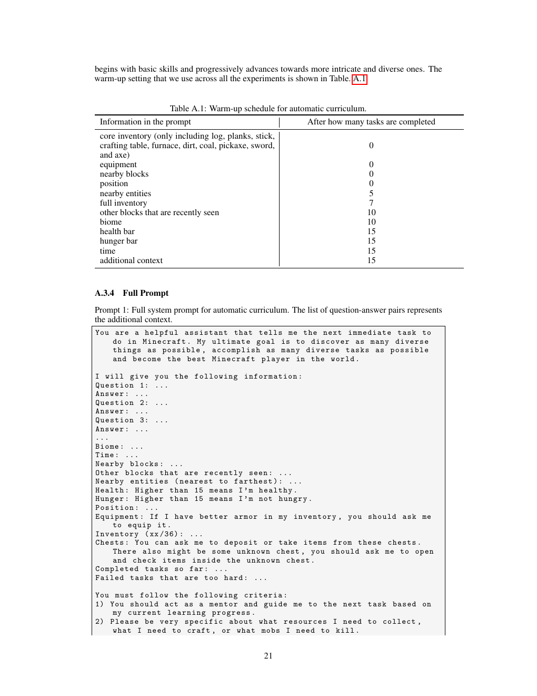
| Information | Tasks |
|---|---:|
| core inventory, equipment, nearby blocks, position | 0 |
| nearby entities | 5 |
| full inventory | 7 |
| recently seen blocks, biome | 10 |
| health, hunger, time, additional context | 15 |
**Caption:** Warm-up schedule for automatic curriculum.
**Caption[CN]:** 自动课程热身计划。
```text
RESPONSE FORMAT:
Reasoning: Based on the information I listed above, do reasoning about what the next task should be.
Task: The next task.
```
## A.4 Skill Library / 技能库
> <span style="color:#3B82F6"><strong>Para. 1:</strong></span> Exact helpers are `exploreUntil`, `mineBlock`, `craftItem`, `placeItem`, `smeltItem`, `killMob`, `getItemFromChest`, and `depositItemIntoChest`; Mineflayer primitives include `bot.pathfinder.goto`, `GoalNear`, `GoalXZ`, `GoalGetToBlock`, `GoalFollow`, `GoalPlaceBlock`, `GoalLookAtBlock`, `bot.equip`, `bot.consume`, `bot.fish`, `bot.sleep`, `bot.activateBlock`, `bot.lookAt`, `bot.activateItem`, and `bot.useOn`.
> <span style="color:#F59E0B"><strong>Para. 1[CN]:</strong></span> 精确辅助函数包括 `exploreUntil`、`mineBlock`、`craftItem`、`placeItem`、`smeltItem`、`killMob`、`getItemFromChest` 和 `depositItemIntoChest`；Mineflayer 原语包括所列 `bot.pathfinder.goto`、各类 `Goal` 以及 `bot.equip`、`bot.consume`、`bot.fish`、`bot.sleep`、`bot.activateBlock`、`bot.lookAt`、`bot.activateItem` 和 `bot.useOn`。
```javascript
async function yourMainFunctionName(bot) {
  // define variables inside; reuse supplied helpers; emit bot.chat progress
}
```
## A.5 Self-verification / 自验证
> <span style="color:#3B82F6"><strong>Para. 1:</strong></span> The critic receives final state and task, treats exceeding requirements as success, and returns JSON parseable by Python `json.loads` with exact keys `reasoning`, `success`, and `critique`.
> <span style="color:#F59E0B"><strong>Para. 1[CN]:</strong></span> 批评者接收最终状态和任务，超过要求也算成功，并返回可由 Python `json.loads` 解析、含精确键 `reasoning`、`success`、`critique` 的 JSON。
```json
{"reasoning":"reasoning","success":true,"critique":""}
```

# Appendix A.6 System comparison / 系统比较
### Table A.2
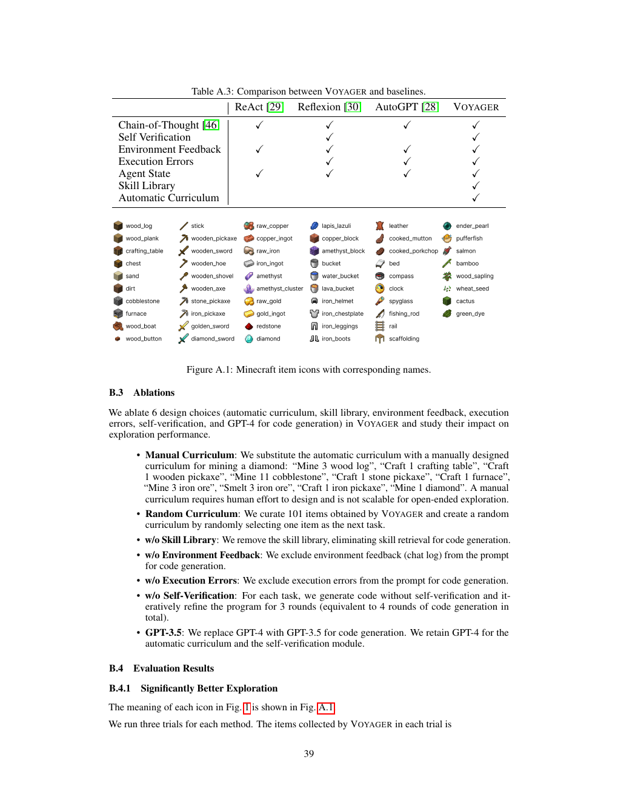
| Feature | VPT | DreamerV3 | DECKARD | DEPS | Plan4MC | VOYAGER |
|---|---|---|---|---|---|---|
| Demos | Videos | None | Videos | None | None | None |
| Rewards | Sparse | Dense | Sparse | None | Dense | None |
| Observations | Pixels | Pixels & Meta | Pixels & Inventory | Feedback & Inventory | Pixels & Meta | Feedback & Meta & Inventory |
| Actions | Keyboard/Mouse | Discrete | Keyboard/Mouse | Keyboard/Mouse | Discrete | Code |
| Automatic Curriculum |  |  |  |  |  | ✓ |
| Iterative Planning |  |  |  | ✓ |  | ✓ |
| Skill Library |  |  |  |  | pre-defined | self-generated |
| Gradient-Free |  |  |  |  |  | ✓ |
**Caption:** System-level comparison between VOYAGER and prior works.
**Caption[CN]:** VOYAGER 与先前工作的系统级比较。

# Appendix B Experiments / 附录 B：实验
> <span style="color:#3B82F6"><strong>Para. 1:</strong></span> MineDojo/Mineflayer provide controls; `bot.chat()` provides feedback; try-catch and condition checks support continuous execution. A dead bot is resurrected with inventory preserved; crafting table and furnace are recycled.
> <span style="color:#F59E0B"><strong>Para. 1[CN]:</strong></span> MineDojo/Mineflayer 提供控制；`bot.chat()` 提供反馈；try-catch 和条件检查支持连续执行。死亡 bot 复活并保留物品栏；回收工作台和熔炉。
## B.2 Baselines / 基线
> <span style="color:#3B82F6"><strong>Para. 1:</strong></span> ReAct and Reflexion use one generation plus three refinements. AutoGPT completes error-free subgoals, refines erroneous ones for three rounds, and replans after three subgoals without a new item. All pursue “explore the world and get as many items as possible”.
> <span style="color:#F59E0B"><strong>Para. 1[CN]:</strong></span> ReAct 和 Reflexion 使用一轮生成加三轮细化。AutoGPT 完成无错误子目标，错误子目标细化三轮，连续三个子目标无新物品后重规划。所有方法追求“探索世界并获得尽可能多物品”。
## B.3 Ablations / 消融
> <span style="color:#3B82F6"><strong>Para. 1:</strong></span> Manual curriculum is the exact sequence “Mine 3 wood log”, “Craft 1 crafting table”, “Craft 1 wooden pickaxe”, “Mine 11 cobblestone”, “Craft 1 stone pickaxe”, “Craft 1 furnace”, “Mine 3 iron ore”, “Smelt 3 iron ore”, “Craft 1 iron pickaxe”, “Mine 1 diamond”. Random curriculum selects among 101 items. Other variants remove library, feedback, errors, or self-verification; GPT-3.5 replaces GPT-4 only for code.
> <span style="color:#F59E0B"><strong>Para. 1[CN]:</strong></span> 手工课程精确序列为“Mine 3 wood log”“Craft 1 crafting table”“Craft 1 wooden pickaxe”“Mine 11 cobblestone”“Craft 1 stone pickaxe”“Craft 1 furnace”“Mine 3 iron ore”“Smelt 3 iron ore”“Craft 1 iron pickaxe”“Mine 1 diamond”。随机课程从 101 个物品选择。其他变体移除技能库、反馈、错误或自验证；GPT-3.5 只替换代码生成中的 GPT-4。
## B.4 Results / 结果
### Figure A.1

**Caption:** Minecraft item icons with names.
**Caption[CN]:** Minecraft 物品图标及名称。
### Figure A.2
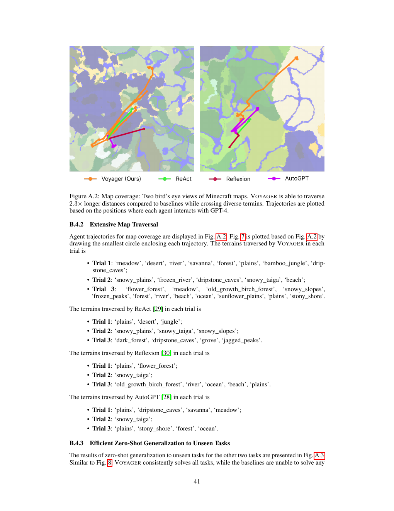
**Caption:** Map trajectories; VOYAGER traverses 2.3× farther.
**Caption[CN]:** 地图轨迹；VOYAGER 行进距离为 2.3 倍。
### Figure A.3
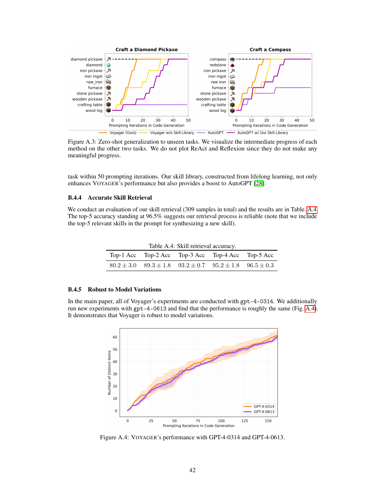
**Caption:** Additional two unseen tasks; ReAct and Reflexion omitted.
**Caption[CN]:** 另外两个未见任务；省略 ReAct 和 Reflexion。
### Table A.4
| Top-1 | Top-2 | Top-3 | Top-4 | Top-5 |
|---:|---:|---:|---:|---:|
| 80.2 ± 3.0 | 89.3 ± 1.8 | 93.2 ± 0.7 | 95.2 ± 1.8 | 96.5 ± 0.3 |
**Caption:** Skill retrieval accuracy on 309 samples.
**Caption[CN]:** 309 个样本上的技能检索准确率。
### Figure A.4

**Caption:** VOYAGER performance with GPT-4-0314 and GPT-4-0613.
**Caption[CN]:** VOYAGER 使用 GPT-4-0314 与 GPT-4-0613 时的性能。

## Material caveat / 材料级 caveat
> <span style="color:#3B82F6"><strong>Para. 1:</strong></span> This is explicitly a draft/partial reader: pages 11–18 references and the appendix’s very long trial item-ID lists and full helper implementations are not retyped verbatim. All substantive section coverage, principal numerical claims, tables, captions, prompt contracts, exact API identifiers, and algorithms are included; the supplied 42-page PDF remains authoritative for omitted long literals and pixel-level verification.
> <span style="color:#F59E0B"><strong>Para. 1[CN]:</strong></span> 本文件明确是草稿/部分读者稿：第 11–18 页参考文献、附录中超长试验物品 ID 列表及完整辅助函数实现未逐字重录。所有实质章节、主要数值结论、表格、图注、提示契约、精确 API 标识和算法均已包含；缺失的长字面量及像素级核验以所提供 42 页 PDF 为准。
