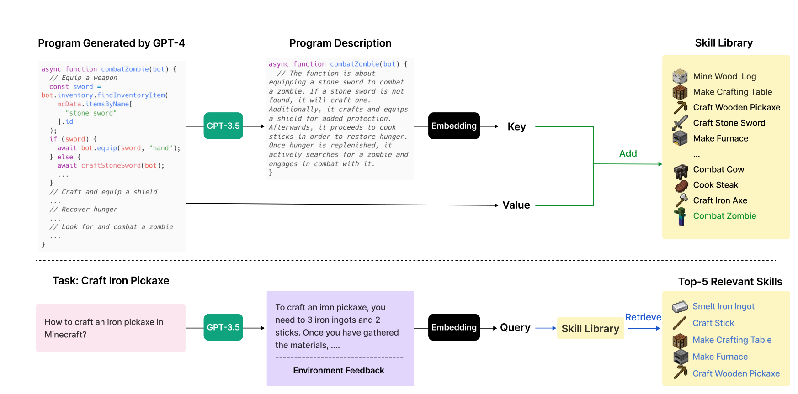
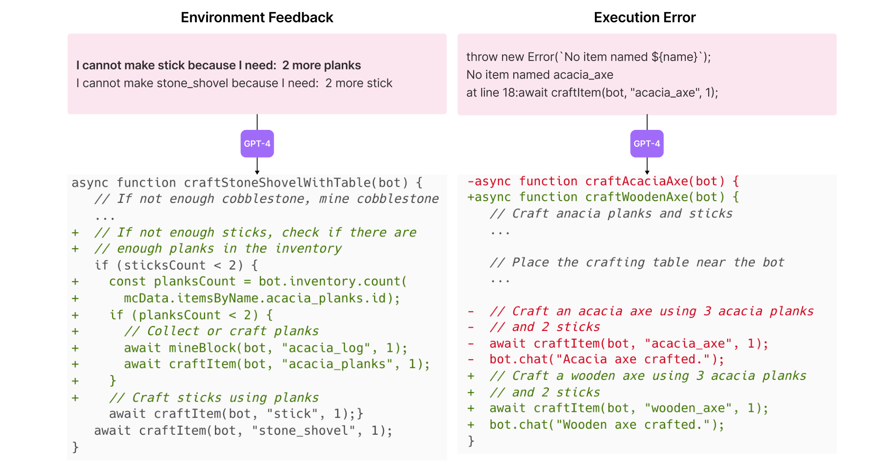
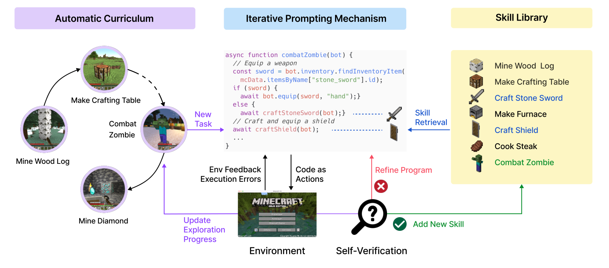
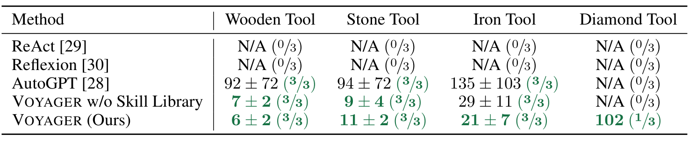
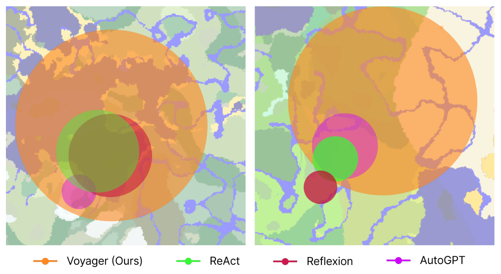
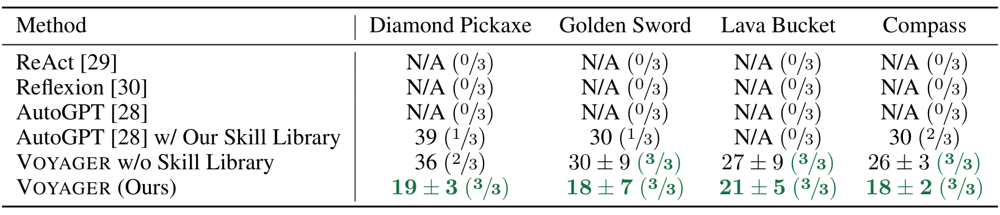
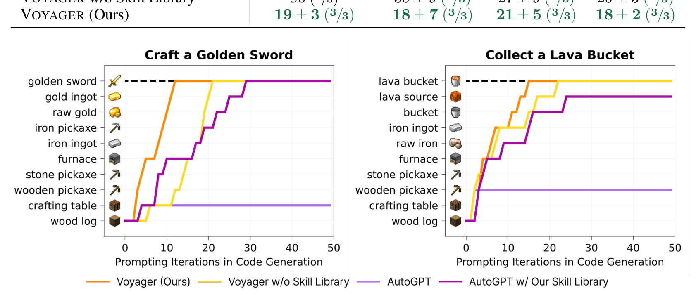
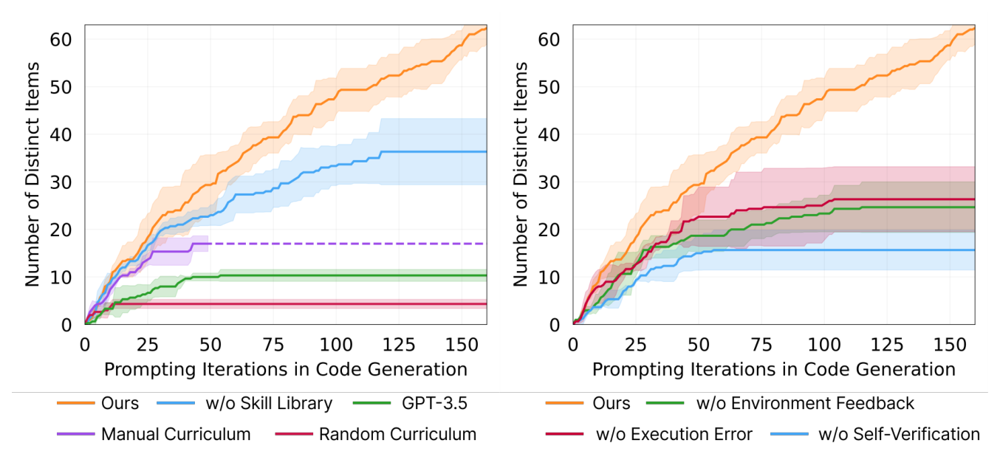
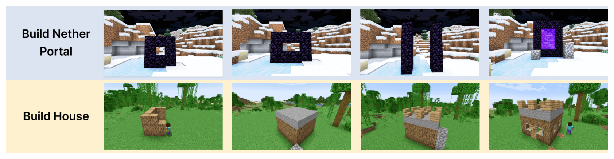

---
tags:
  - papers/embodied-ai
  - papers/agent
  - papers/lifelong-learning
aliases:
  - Voyager
  - VOYAGER Minecraft Agent
date: 2026-08-27
doi: 10.48550/arxiv.2305.16291
arxiv_id: 2305.16291
---

# VOYAGER: An Open-Ended Embodied Agent with Large Language Models

## 核心信息
- 标题: VOYAGER: An Open-Ended Embodied Agent with Large Language Models
- 标题翻译: Voyager：使用大语言模型的开放式具身智能体
- 作者: Guanzhi Wang, Yuqi Xie, Yunfan Jiang, Ajay Mandlekar, Chaowei Xiao, Yuke Zhu, Linxi “Jim” Fan, Anima Anandkumar
- 机构: NVIDIA、Caltech、UT Austin、Stanford、UW Madison
- 发表时间: 2023
- 发表渠道: arXiv（Cornell University），版本 v2
- DOI: 10.48550/arxiv.2305.16291
- arXiv: 2305.16291
- 论文链接: https://arxiv.org/abs/2305.16291
- 代码 / 项目: https://voyager.minedojo.org/
- 数据 / 资源: MineDojo Minecraft 环境、Mineflayer JavaScript 控制 API、GPT-4 / GPT-3.5 / text-embedding-ada-002 API
- 论文类型: AI 方法 / 开放式具身智能体系统

## 原文摘要翻译

我们介绍 Voyager，这是首个由大语言模型驱动的 Minecraft 具身终身学习智能体。它能够在没有人工干预的情况下持续探索世界、获得多样技能并作出新的发现。Voyager 包含三个关键组件：用于最大化开放式探索的自动课程；用于开发越来越复杂行为的持续增长技能库；以及一种新的迭代提示机制，将环境反馈、执行错误和自验证纳入程序改进过程。

Voyager 通过黑盒查询与 GPT-4 交互，因此不需要对模型参数进行微调。Voyager 学到的技能具有时间扩展性、可解释性和可组合性，能够快速叠加智能体能力，并缓解灾难性遗忘。实验表明，Voyager 具有很强的上下文终身学习能力和出色的 Minecraft 游戏能力：它发现的独特物品数量是此前最佳方法的 3.3 倍，行进距离是 2.3 倍，并且解锁关键科技树里程碑的速度最高达到此前最佳方法的 15.3 倍。

Voyager 还能在一个新的 Minecraft 世界中利用已经学到的技能库，从零开始解决新任务，而其他技术难以泛化。作者开源了完整代码库和提示词，地址为 https://voyager.minedojo.org/。

## 创新点

1. **把开放式探索变成状态条件化的自动课程。** GPT-4 不是只接受一个固定终点，而是依据 inventory、装备、附近区块与实体、生物群系、时间、生命值、饥饿值、位置，以及已经成功或失败的任务，提出一个具体、可验证、难度适中的下一任务。它实现了面向当前能力前沿的自下而上课程；“发现尽可能多样的事物”是开放式目标，而不是手工列出的完整路线。
2. **把技能记忆保存为可执行程序。** 每个成功任务对应一段 Mineflayer JavaScript 程序；GPT-3.5 生成程序描述并将其嵌入向量数据库，描述是 key、程序是 value。之后，任务计划和环境反馈用于检索 top-5 技能，技能可以作为更复杂程序的组成部分。这比只保存对话反思更接近可执行的能力记忆。
3. **把代码生成变成执行—反馈—验证闭环。** GPT-4 生成代码后立即在 Minecraft 中执行；下一轮提示包含 bot.chat 产生的资源状态反馈、解释器执行错误和 GPT-4 critic 的任务完成判断及 critique。最多迭代四轮，成功后提交技能，失败则标记任务并让课程重新安排。环境事实、程序错误和终止条件被分开建模，是系统能持续运行的关键。
4. **用黑盒上下文学习实现无需梯度更新的终身积累。** 论文没有训练 GPT-4 参数，而是通过可组合技能库和提示内检索积累能力。需要注意的是，Mineflayer 控制原语、任务过滤规则、提示工程和向量检索是重要的工程组成；真正可迁移的方法原则是状态条件化课程、可执行记忆和多源执行反馈的组合。

## 一句话总结

Voyager 的核心不是让 GPT-4 一次写出完美动作，而是让它在 Minecraft 的高层程序接口上通过自动课程、可检索程序记忆和自验证反馈持续积累可复用技能；论文证明了这一闭环在该受控环境中能显著提升开放式探索与新世界任务迁移，但尚未证明通用具身智能。

## 研究问题

Minecraft 没有预设终点或固定剧情，世界由程序生成，玩家需要从木材、食物等基础资源逐步进入工具和战斗科技树。一个真正的开放式终身学习智能体至少要解决三件事：

- 根据当前世界状态和已经掌握的能力提出下一项可完成但有新意的任务，例如在河流生物群系优先钓鱼，在夜间且有武器时处理僵尸；
- 根据环境反馈修正失败程序，并把已经掌握的行为保存下来，在相似任务中重用，而不是每次从空白提示开始；
- 持续移动和发现新资源，避免被局部区域或重复动作困住。

传统强化学习和模仿学习通常作用于原子动作，系统探索、解释和长时程组合较困难。已有大语言模型智能体能生成计划，却通常不是持续更新和转移知识的 lifelong learner。Voyager 的研究问题因此可以精确表述为：在不修改大模型参数的情况下，能否用可执行程序和提示内记忆把一个高层语言规划器变成持续探索、持续积累的 Minecraft 智能体（Introduction，pp.2–3）？

## 数据与任务定义

### 环境、状态与动作

实验建立在 MineDojo 之上，用 Mineflayer 接口执行运动和操作。智能体不是从像素直接预测键鼠，而是在代码中调用一组高层控制原语，支持探索、采矿、制作、放置、熔炼和战斗。因此，动作空间是可执行的高层程序，天然支持时间扩展动作和程序组合，但也把感知与低层控制难题部分交给了环境接口。

课程提示可以逐步加入以下状态：inventory 与容量、装备、32 格范围内附近区块、最近见过的其他区块、附近实体、箱子内容、生物群系、时间、生命值、饥饿值和三维位置；另外还有已经完成和失败的任务。附录 A.3 给出的 warm-up schedule 让提示随完成任务数增加而逐步看到更多信息，以免一开始就用过于复杂的状态规划。

### 任务与成功判定

自动课程要求 GPT-4 输出一个简洁、单一的任务短语，例如“采集 5 个煤矿石”“制作 1 把石镐”或“击杀 1 只僵尸”，不能同时提出多个目标，也避免必须依赖屏幕视觉确认的建筑、种植和交易任务。每项任务的代码最多生成四轮。程序执行后的最终物品栏、装备、环境状态和上下文交给另一个 GPT-4 验证智能体；它输出推理、成功布尔值以及失败时的批评意见。成功程序写入技能库，失败任务记录下来供课程避免过早重复。

### 评测协议

论文从四个角度评测：

1. **开放式探索：** 最多 160 次代码生成 prompting iterations，统计发现的 unique items；每个方法运行三次。
2. **科技树掌握：** 依次考察木制、石制、铁制、钻石工具，记录平均提示迭代次数与三次运行成功次数；160 次是最大迭代预算。
3. **地图覆盖：** 依据智能体与 GPT-4 交互时的位置绘制轨迹，并以包围轨迹的最小圆估计覆盖范围；比较跨越的距离和生物群系。
4. **新世界 zero-shot：** 清空 inventory、重置为新实例化世界，测试四个未见任务；上限 50 次 prompting iterations，统计三次运行成功率和平均迭代数。

对比方法是重新实现并适配到同一高层 API 的 ReAct、Reflexion 和 AutoGPT。作者没有将像素输入的 VPT 等低层 controller 直接混入主比较，因为输入、动作接口和问题焦点不同。

## 方法主线

### 机制流程

1. **读取状态并提出任务：** curriculum agent 汇总当前状态、探索进度、成功/失败任务和可选 Minecraft 知识，生成一个难度适中、可验证且尽量新颖的单一目标，输出给 action agent。
2. **检索能力并生成程序：** skill manager 用任务计划和环境反馈查询向量库，返回 top-5 相关程序；GPT-4 结合控制原语、状态、上轮代码和 critique，先解释问题、给出计划，再生成一个异步 Mineflayer 函数。
3. **执行并吸收反馈：** 环境运行代码，`bot.chat()` 输出中间进展和资源不足信息，解释器记录语法或不存在物品等错误；这些反馈回到下一轮代码提示，单任务最多四轮。
4. **验证、提交或重排：** critic agent 根据任务和执行后的状态判断是否完成。成功则把代码及其描述加入技能库并更新完成任务；失败则记录失败任务，课程可稍后重试或换目标。

### 自动课程：把开放目标拆成能力前沿

自动课程的系统提示给出总体目标“发现尽可能多样的事物、完成尽可能多样的任务并成为最好的 Minecraft 玩家”。它还要求新任务具体、单一、可验证，不要在资源和技能不足时提出过难目标，不要重复已经完成的任务。GPT-3.5 被用来提出 5–10 个关于 Minecraft 的自包含问题，再根据百科知识或自身知识回答，作为 GPT-4 的额外上下文；使用 GPT-3.5 是出于预算考虑。

这种课程的实际作用不是抽象地“激发好奇心”，而是把资源依赖和任务排序放进在线决策。例如，持有木镐和石头时提议制作石镐，处在河流且有钓竿时提议钓鱼，夜间附近有僵尸且已有石剑和盾牌时提议战斗。随机课程会把某些高阶任务过早放入候选集合，导致后续程序几乎无法获得有效进展。

### 技能库：程序化、可组合的长期记忆

成功程序的描述由 GPT-3.5 生成，嵌入向量作为键；实际 JavaScript 程序作为值。面对“制作铁镐”时，系统先让 GPT-3.5 生成一般解决建议，再将它与环境反馈合成查询，检索前五个旧技能。这样，旧技能不是静态演示，而是直接进入新程序的上下文。

提示明确要求函数具有通用性和可复用性：生成代码必须检查所需材料，资源不足时调用已有采集技能，而不是假设物品栏永远不变。附录示例显示，制作铁镐可以组合熔炼铁锭、制作木棍、制作工作台和制作木镐等技能。技能描述与代码的分离也让向量检索不必理解整段程序语法。

*图 4。技能加入与检索流程：成功程序进入向量技能库，后续任务检索 top-5 程序作为组合脚手架。*

图 4 的关键不是“用了向量数据库”这一实现细节，而是记忆的值保留了执行语义：检索结果能被 GPT-4 继续组合成更长的行为。附录在 309 个样本上报告前一项检索准确率为 80.2±3.0，前五项为 96.5±0.3，说明前五项作为提示上下文具有较高覆盖率，但该指标并不等价于新技能一定可执行。

### 迭代提示：三种反馈各自解决什么问题

- **环境反馈：** 控制原语中的 `bot.chat()` 把中间事实变成文字，例如“制作木棍还需要 2 个木板”。它暴露的是资源状态和动作进度。
- **执行错误：** 解释器可指出不存在的物品或函数，例如 GPT-4 尝试制作不存在的 `acacia_axe`；下一轮可改成 `wooden_axe`。它解决的是代码和 API 层错误。
- **自验证：** 另一个 GPT-4 根据最终状态判断任务是否达成，并在失败时给出下一步 critique。例如 inventory 中的白羊毛和羊肉只能说明击杀了两只羊，不能满足“击杀三只羊”。它解决的是何时提交技能、何时继续尝试或换任务的终止判断。

*图 5。迭代反馈示例：环境事实和解释器错误共同推动下一轮代码修正。*

三种反馈不是同一种“反思”：环境反馈是外部状态，执行错误是程序解释器信号，自验证是任务级 critic。完整算法在每个任务内最多四轮，成功时 `add_skill(code)` 和 `add_completed_task(task)`，失败时 `add_failed_task(task)`；这一提交机制把代码纠错和长期记忆更新连接起来。

*图 2。Voyager 系统闭环：自动课程、技能库和迭代提示围绕 Minecraft 环境循环。*

### 实现与复现要点

实验使用 `gpt-4-0314` 做课程、代码生成和自验证，`gpt-3.5-turbo-0301` 做标准语言处理、额外知识和程序描述，`text-embedding-ada-002` 做检索；除自动课程温度为 0.1 以鼓励多样性外，其余温度为 0。

环境在死亡后将 bot 复活到最近地面并保留物品栏，程序运行后回收工作台和熔炉。基线也被改写到同一 Mineflayer 接口。

ReAct 和 Reflexion 采用一轮初始代码加三轮修正，AutoGPT 将大目标拆成子目标，但没有 Voyager 的技能库、自动课程和自验证。

## 关键结果

### 主结果与强基线

| 能力 | ReAct | Reflexion | AutoGPT | Voyager（完整） |
|---|---:|---:|---:|---:|
| 160 次内 unique items | 约 2–4 | 约 4–5 | 最高约 25 | **63** |
| 地图覆盖距离 | 基准 | 基准 | 基准 | **约 2.3× baselines** |
| 木制工具：平均迭代 / 成功 | 未完成，0/3 | 未完成，0/3 | 92±72，3/3 | **6±2，3/3** |
| 石制工具：平均迭代 / 成功 | 未完成，0/3 | 未完成，0/3 | 94±72，3/3 | **11±2，3/3** |
| 铁制工具：平均迭代 / 成功 | 未完成，0/3 | 未完成，0/3 | 135±103，3/3 | **21±7，3/3** |
| 钻石工具：平均迭代 / 成功 | 未完成，0/3 | 未完成，0/3 | 未完成，0/3 | **102，1/3** |

表中的“未完成”表示在最大提示迭代次数内没有完成，不是测得的零迭代。Voyager 解锁木制、石制、铁制层相对此前最佳方法分别快 15.3×、8.5×、6.4×；它也是唯一在三次运行中至少一次到达钻石层的方法。独特物品数量的 3.3× 和地图距离的 2.3× 是在作者选定基线和高层接口协议下的相对量，不应直接读成一般游戏能力倍率。

*表 1。科技树掌握结果：完整 Voyager 在有限 prompting iterations 内更快达到木、石、铁层，并唯一有机会达到钻石层。*

*图 7。地图覆盖轨迹：Voyager 的任务驱动探索跨越更多地形和区域。*

图 7 展示 Voyager 能跨越多种地形，而基线往往停留在局部区域。这里的距离来自地图轨迹，不是视觉导航准确率；Mineflayer 已提供高层寻路，结果主要反映任务选择和探索驱动。

### 新世界 zero-shot 泛化

清空物品栏、重置世界后，Voyager 对钻石镐、金剑、岩浆桶、指南针四个未见任务均获得 3/3 成功。平均提示迭代次数分别为 19±3、18±7、21±5、18±2；无技能库版本虽然部分任务可完成，但需要 26–36 次且最弱任务为 2/3。ReAct、Reflexion 和原始 AutoGPT 在 50 次上限内均为 0/3。

| 方法 | 钻石镐 | 金剑 | 岩浆桶 | 指南针 |
|---|---:|---:|---:|---:|
| AutoGPT | 0/3 | 0/3 | 0/3 | 0/3 |
| AutoGPT + Voyager skill library | 1/3，39 | 1/3，30 | 0/3 | 2/3，30 |
| Voyager，无技能库 | 2/3，36 | 3/3，30±9 | 3/3，27±9 | 3/3，26±3 |
| Voyager，完整系统 | **3/3，19±3** | **3/3，18±7** | **3/3，21±5** | **3/3，18±2** |

*表 2。新世界 zero-shot 结果：完整系统在四个未见任务上均达到 3/3。*

*图 8。未见任务的中间进展：技能检索帮助新世界中的任务快速复用旧能力。*

把 Voyager 的技能库直接插入 AutoGPT 后，AutoGPT 也获得部分提升，这是很有信息量的正对照：技能库本身是可插拔资产，而不是只能与自动课程绑定的隐藏状态。但“新世界直接迁移”仍是在同一个 Minecraft 游戏、相同控制原语和 GPT-4 知识先验下的任务迁移，不等同于跨环境或跨 embodiment 泛化。

### 消融到底说明了什么

论文移除自动课程、技能库、环境反馈、执行错误、自验证，并把代码生成器替换为 GPT-3.5。结果模式如下：

| 变体 | 论文报告的变化 | 机制解释 |
|---|---:|---|
| Random curriculum | unique items 下降 93% | 任务可能超出当前资源/技能前沿，课程顺序被打乱 |
| Manual curriculum | 低于自动课程，且需 Minecraft 专家设计 | 不能根据实时位置和 inventory 调整，开放式扩展性弱 |
| 无 skill library | 后期明显 plateau | 新程序不能稳定建立在旧程序上 |
| 无 environment feedback | 低于完整系统 | GPT-4 看不到资源不足和执行中间事实 |
| 无 execution errors | 低于完整系统 | API、语法和不存在物品的错误缺乏直接信号 |
| 无 self-verification | unique items 下降 73% | 不知道何时任务已完成，或何时应重新尝试 |
| GPT-3.5 代码生成 | unique items 约为 GPT-4 的 1/5.7 | 代码合成和长程序修正能力显著更弱 |

*图 9。消融结果：移除课程、技能库或反馈组件都会削弱开放式探索。*

最强的消融信号是 self-verification，但它的作用并非“让模型更会写代码”，而是提供可靠的提交/换任务门控。消融支持组件对完整探索循环的重要性，却不能单独隔离每个组件的纯因果效应：例如技能库改变了后续提示分布，课程也决定了哪些技能有机会被创建。

### 人类多模态反馈

论文当时使用的 GPT-4 接口只能接收文本，因此 Voyager 本身没有视觉感知。作者用人类提供视觉批评或手工拆解课程来展示扩展潜力：在反馈下构造下界传送门和房屋。人类作为批评者时纠正空间细节；人类作为课程设计者时把复杂建造拆成小步骤。

*图 10。人类反馈示例：视觉 critique 或手工课程帮助完成空间结构任务。*

这项实验说明文本状态与人类视觉反馈可以通过同一迭代代码接口接合，但不应被写成 Voyager 已经具备自主视觉理解。建造任务依赖人类指出空间错误，正好暴露了当前高层状态表示的缺口。

## 深度分析

### 真正贡献是什么

本文真正改变的是长期记忆的表示和任务循环的闭合方式。GPT-4 的预训练知识、Mineflayer 的 API、GPT-3.5 的问答和 embedding 数据库都不是单独的新算法；贡献在于把它们组织成一个具有明确状态转移的循环：任务提议 → 程序生成 → 环境执行 → 失败修正 → critic 门控 → 程序提交。这样，后一个任务看到的不是一长串不可执行的自然语言历史，而是可检索的时间扩展程序。

自动课程和技能库形成互补：课程决定“下一项值得且可能完成的能力是什么”，技能库决定“过去学过的程序如何成为当前程序的脚手架”。这解释了为什么随机课程和无技能库会分别造成早期失败与后期平台期。课程解决探索分布，技能库解决能力累积。

### 为什么结果成立

1. **任务难度被资源状态约束。** 状态中有 inventory、附近资源、生物群系和装备，课程可以避免明显不可行的下一步；这比对一个抽象“尽量多收集物品”的目标直接 ReAct 更容易形成稳定进展。
2. **代码比原子动作具有更长的时间范围。** `craftStoneShovel` 或 `combatZombieWithSword` 可以被新程序调用；程序结构为复杂行为提供了组合边界，减少了每轮都重新发现寻路和资源检查逻辑的需要。
3. **错误信号分工明确。** chat log 告诉模型世界发生了什么，解释器告诉模型代码哪里非法，critic 告诉模型任务是否已达成。三者共同减少“代码运行了但任务没完成”的假成功，也减少“已完成却继续浪费迭代”的假失败。
4. **成功提交产生正向自举。** 一段成功代码越多，后续检索到可用技能的概率越高；top-5 检索准确率 96.5±0.3 为该自举提供了检索基础。因此后期差距会累积，而不仅仅是每一轮 GPT-4 质量相同的独立试验。

### 容易误读的地方

- **不是端到端视觉具身智能。** 输入主要是结构化状态和文本反馈，动作是高层 API 调用；像素感知和部分低层控制由 Mineflayer/环境承担。
- **不是参数层面的 continual learning。** GPT-4 权重没有更新，“lifelong”指上下文、程序技能库和任务历史的持续积累。
- **不是所有任务都开放。** 自动课程明确回避需要视觉确认的 placing、building、planting、trading 任务；人类反馈实验恰好是补充，而非主评测协议。
- **不是无条件可靠。** 课程会幻觉出不存在的 copper sword，代码会误用 cobblestone 作为燃料，self-verification 也会漏掉 spider string 等成功信号。
- **不是与像素 controller 的直接 SOTA 排名。** 作者明确说明 VPT 等从屏幕像素输出低层动作的方法与本实验的输入输出接口不一致。

### 复现注意点

- 依赖 GPT-4 `gpt-4-0314`、GPT-3.5 `gpt-3.5-turbo-0301` 和 `text-embedding-ada-002`；模型版本改变可能改变代码能力和结果。
- 课程温度为 0.1，其余温度为 0；每个任务最多四轮，探索实验最多 160 次 prompting iterations，zero-shot 最多 50 次。
- 必须实现 Mineflayer 原语和 `bot.chat()` 反馈；直接用低层 `bot.dig`、`bot.attack` 替换封装会改变提示和执行分布。
- 运行时 bot 死亡后复活且保留 inventory，工作台和熔炉回收；若复现实验不保留这些状态，长期探索预算不再可比。
- 论文开源项目和提示词是复现入口，但本文 PDF 只能支撑“作者声称开源”；具体仓库当前版本、API 兼容性和运行成本不能由 PDF 单独确认。

## 局限

1. **成本高。** 论文报告 GPT-4 API 约为 GPT-3.5 的 15 倍；每项任务又允许多轮代码生成、状态反馈和自验证，长时间开放探索的成本可能成为主要瓶颈。
2. **错误并未消失。** 智能体会卡住，课程可能提出不存在的物品，GPT-4 可能调用并不存在的接口或选择无效燃料。自动重试和稍后重排只是容错，不是可靠性证明。
3. **critic 依赖模型判断。** self-verification 是另一个 GPT-4 agent，不是完备的规则验证器；它可能把错误物品当作成功，也可能遗漏游戏中合理的成功信号。
4. **视觉和空间任务受限。** 主系统没有视觉输入，无法独立判断建造结构的空间细节。人类反馈 demo 说明接口可扩展，却同时说明自动视觉 grounding 尚未解决。
5. **比较接口偏置。** Mineflayer 提供了高层寻路和状态访问，结果不能直接与从像素学习低层控制的工作比较。基线也是被作者重新实现的高层版本，工程适配会影响相对结果。
6. **外推边界窄。** 三次运行、Minecraft 单一环境、有限任务和预定义 API 证明的是该协议下的开放式探索能力；不证明真实机器人安全、物理世界校准、跨游戏迁移或通用自主学习。作者也指出，部署到物理机器人必须由人类加入额外安全约束。

## 我的笔记

我会把 Voyager 放在“3D 世界中的高层 tool-use agent / lifelong learning”而不是“视觉控制器”这一支。对后续 3D agent 研究最可复用的设计是：

- **先调度任务，再优化动作。** 开放式目标的瓶颈往往不是某一步代码写错，而是下一项任务本身不可达。应将当前资源和失败边界显式交给课程模块。
- **记忆存能力而非叙事。** 若长期记忆最终必须被执行，程序、工具调用图或可验证技能比“我上次失败了，因为……”更直接；但每个技能仍需记录依赖、前置条件和成功判定。
- **将反馈拆成不同来源。** 状态反馈、执行错误和任务级验证不能混成一段反思文本。拆开后才能知道失败源于世界资源、程序语法还是终止判断。
- **把成功门控作为独立实验变量。** Voyager 的 -73% self-verification 消融提醒我，agent 的长期表现可能首先取决于“何时提交记忆和切换目标”，而非单轮生成质量。
- **评价必须报告行为与结果。** 新世界成功率之外，应记录工具调用、技能检索准确率、任务重试次数和跨区域轨迹，否则难以区分真正学会了能力还是只靠大模型先验。

本文的关键未证问题是：在保持同样技能库和反馈协议的情况下，换成像素感知或真实机器人控制器，程序化技能是否仍然优于原子策略；以及把 GPT-4 critic 换成规则验证器或人类评审后，长期探索优势是否保持。

## 引用

- Wang et al. 2023. *VOYAGER: An Open-Ended Embodied Agent with Large Language Models*. arXiv:2305.16291. https://arxiv.org/abs/2305.16291
- Fan et al. 2022. *MineDojo: Building Open-Ended Embodied Agents with Internet-Scale Knowledge*. arXiv:2206.08853.
- Yao et al. 2022. *ReAct: Synergizing Reasoning and Acting in Language Models*. arXiv:2210.03629.
- Shinn et al. 2023. *Reflexion: An Autonomous Agent with Dynamic Memory and Self-Reflection*. arXiv:2303.11366.
- Liang et al. 2022. *Code as Policies: Language Model Programs for Embodied Control*. arXiv:2209.07753.
- PrismarineJS. *Mineflayer: Create Minecraft Bots with a Powerful, Stable, and High-Level JavaScript API*.
