# Beacon: Knowing When and How to Perform Agentic Visual Reasoning

## Metadata / 元数据

| Field / 字段 | Content / 内容 |
|---|---|
| Title | Beacon: Knowing When and How to Perform Agentic Visual Reasoning |
| 中文标题 | Beacon：知道何时、以及如何执行智能体视觉推理 |
| Authors | Qixun Wang; Yang Shi; Letian Cheng; Zhuoran Zhang; Yan He; Yuqi Tang; Qi Zhang; Xinlei Yu; Ruizhe Chen; Tianrun Xu; Yuanxing Zhang; Pengfei Wan; Haotian Wang; Xianghua Ying |
| Affiliations | Peking University; Kling Team; HKUST(GZ); CUHK; ZJU; THU |
| arXiv | arXiv:2607.28595v1 [cs.CV] |
| Date | 30 July 2026 |
| DOI | 10.48550/arXiv.2607.28595 |
| Status | Preprint. Work in progress. |
| Base model | Qwen3-VL-8B-Instruct |
| Method class | **Train** — cold-start SFT followed by GRPO-based reinforcement learning |
| Code / Model | Paper supplies GitHub and Hugging Face project links. |
| Reader status | Detailed bilingual reader covering the main text, equations, all appendices, prompts, training details, negative results, and case studies. References [1]–[49] are retained in searchable bibliographic form in the source PDF. |

## Classification / 归类判断

> <span style="color:#3B82F6"><strong>Para. 1:</strong></span> Beacon adopts an SFT-then-RL training paradigm. During SFT, the model learns fundamental code-use capabilities from synthesized trajectories. During RL, Necessity-Aware Adaptive Reward and Hint-Guided Capability Expansion are used to improve reasoning-mode adaptiveness and tool-use capability.

> <span style="color:#F59E0B"><strong>Para. 1[CN]:</strong></span> Beacon 采用“先 SFT、后 RL”的训练范式：SFT 阶段通过合成轨迹建立基础代码工具能力，RL 阶段再用 Necessity-Aware Adaptive Reward 与 Hint-Guided Capability Expansion 改善推理模式适应性和工具能力。因此，它应归入 **Train**，而不是 TrainingFree。

## Section / Page Index / 章节—页码索引

| PDF page(s) | Source content / 原文内容 |
|---:|---|
| 1–3 | Front matter; Abstract; Figures 1–2; Introduction; Related Work |
| 4–5 | Analysis; Mode Adaptiveness; Tool Effect; Figure 3 |
| 6–9 | Method; data construction; cold-start SFT; NAAR; HCE; GRPO objective; Figure 4 |
| 9–13 | Experiments; Tables 1–4; Figures 5–7; RQ answers; Conclusion |
| 14–17 | References [1]–[49] |
| 18–21 | Appendix contents; evaluation details; data statistics and sources; Figures 8–10 |
| 22–27 | Figure 11; SFT synthesis/refinement prompts; SFT/RL training details; shared system prompt; hint prompt |
| 28–34 | Detailed ablation Table 6; failed attempt; reasoning trajectories Tables 7–9; hint examples Tables 10–12 |

## Terminology Ledger / 术语表

| Exact term | 中文译法 |
|---|---|
| agentic visual reasoning | 智能体视觉推理 |
| multimodal large language model (MLLM) | 多模态大语言模型 |
| Mode Adaptiveness (MA) | 模式适应性 |
| Tool Effect (TE) | 工具效应 |
| Tool-Available Accuracy | 工具可用准确率 |
| Tool-Free Accuracy | 无工具准确率 |
| Tool-Gain | 工具增益 |
| Tool-Harm | 工具伤害 |
| Text-Retain | 文本能力保持率 |
| Necessity-Aware Adaptive Reward (NAAR) | 必要性感知自适应奖励 |
| Hint-Guided Capability Expansion (HCE) | 提示引导能力扩展 |
| Group Relative Policy Optimization (GRPO) | 组相对策略优化 |
| all-wrong group | 全错组 |
| hinted rollout | 带提示 rollout |
| code-assisted reasoning | 代码辅助推理 |
| answer-free hint | 不含答案的提示 |

## Front Matter / 前置信息

> <span style="color:#3B82F6"><strong>Para. 1:</strong></span> Preprint. Work in progress. Equal Contribution. Project Lead. Corresponding Author.

> <span style="color:#F59E0B"><strong>Para. 1[CN]:</strong></span> 预印本，仍在进行中。作者标注了同等贡献、项目负责人和通讯作者。

### Figure 1. Motivation / 动机


**Caption:** Figure 1: Agentic visual reasoning models should use tools adaptively and effectively.
**Caption[CN]:** Figure 1：智能体视觉推理模型应当既自适应、又有效地使用工具。简单题不应做冗余裁剪；困难题则应借助视觉操作或提示扩展能力边界。

## Abstract / 摘要

> <span style="color:#3B82F6"><strong>Para. 1:</strong></span> The fundamental goal of agentic visual reasoning is to improve the success rate of multimodal large language models on complex tasks, rather than merely equipping them with a sophisticated yet inefficient reasoning paradigm. This work rethinks agentic visual reasoning through two dimensions of tool use: Mode Adaptiveness and Tool Effect.

> <span style="color:#F59E0B"><strong>Para. 1[CN]:</strong></span> 智能体视觉推理的根本目标，是提高多模态大语言模型解决复杂任务的成功率，而不是仅仅给模型装备一套精巧但低效的推理范式。本文从工具使用的两个维度重新审视该问题：模式适应性（Mode Adaptiveness）与工具效应（Tool Effect）。

> <span style="color:#3B82F6"><strong>Para. 2:</strong></span> Mode Adaptiveness characterizes whether an MLLM recognizes when tools are truly necessary and invokes them accordingly, avoiding unnecessary overhead while improving performance on challenging problems. Tool Effect characterizes the actual impact of tool use: tools should extend capabilities on problems unsolvable through text-only reasoning, while avoiding additional errors on problems already solvable without tools.

> <span style="color:#F59E0B"><strong>Para. 2[CN]:</strong></span> 模式适应性衡量模型能否识别工具何时真正必要，并据此决定是否调用，从而在困难题上获得帮助、在简单题上避免无谓开销。工具效应衡量调用工具后的真实影响：工具应当解决纯文本推理无法解决的问题，同时不能在原本可直接解决的问题上制造额外错误。

> <span style="color:#3B82F6"><strong>Para. 3:</strong></span> The analysis reveals that existing agentic visual reasoning models exhibit limited Mode Adaptiveness, while gains from tool use on hard examples are largely offset by harms on easy examples. Beacon addresses these issues using Necessity-Aware Adaptive Reward and Hint-Guided Capability Expansion during reinforcement learning.

> <span style="color:#F59E0B"><strong>Para. 3[CN]:</strong></span> 作者的分析发现，现有智能体视觉推理模型的模式适应性有限，而且困难样本上的工具增益往往被简单样本上的工具伤害抵消。Beacon 在强化学习阶段引入必要性感知自适应奖励与提示引导能力扩展，分别解决“该不该用工具”和“困难题上能不能把工具用对”。

### Figure 2. Main takeaways / 核心结论


**Caption:** Figure 2: Tool-call ratio versus text-only solvability; average score across 13 benchmarks; and tool-induced gains versus harms.
**Caption[CN]:** Figure 2：工具调用率与纯文本可解性的关系、13 个基准平均分，以及工具增益与工具伤害。Beacon 的调用率随题目变难而上升，平均分为 58.98，工具净效应约为 +3.1。

## 1 Introduction / 引言

> <span style="color:#3B82F6"><strong>Para. 1:</strong></span> Agentic visual reasoning leverages external tools to produce intermediate multimodal results that support final-answer generation. Prior work often overlooks tool-invocation adaptiveness and whether tool use genuinely extends capability beyond tool-free reasoning.

> <span style="color:#F59E0B"><strong>Para. 1[CN]:</strong></span> 智能体视觉推理通过外部工具生成中间多模态结果，再据此形成最终答案。以往工作常忽略两个问题：模型是否能按题目需要决定调用工具，以及工具是否真的把能力扩展到了无工具推理之外。

> <span style="color:#3B82F6"><strong>Para. 2:</strong></span> Representative models generally show limited adaptiveness, and their tool gains are often offset by tool-induced errors. Beacon is designed to improve both tool-invocation adaptiveness and genuine capability gain.

> <span style="color:#F59E0B"><strong>Para. 2[CN]:</strong></span> 代表性模型通常缺少适应性，其工具收益也常被工具导致的错误抵消。Beacon 的设计目标因此不是“更多调用”，而是同时改善调用决策与真实能力增益。

> <span style="color:#3B82F6"><strong>Para. 3:</strong></span> During inference, Beacon can autonomously generate Python code for image cropping, annotation, enhancement, rotation, stitching, pixel-level computation, and numerical calculation. Training first constructs high-quality SFT trajectories, then applies an RL framework with an adaptive reward and hint-guided rollouts.

> <span style="color:#F59E0B"><strong>Para. 3[CN]:</strong></span> 推理时，Beacon 能自主生成 Python 代码，执行裁剪、标注、增强、旋转、拼接、像素级计算和复杂数值计算。训练流程先合成高质量 SFT 轨迹，再以自适应奖励和提示引导 rollout 进行强化学习。

> <span style="color:#3B82F6"><strong>Para. 4:</strong></span> Across 13 benchmarks, Beacon achieves the best average performance. The paper claims three contributions: a diagnostic framework for adaptiveness and tool effects; an SFT/RL training pipeline; and broad evaluation showing the best open-source average together with the largest margin between tool gain and harm.

> <span style="color:#F59E0B"><strong>Para. 4[CN]:</strong></span> 在 13 个基准上，Beacon 获得最高开源平均性能。论文的三项贡献是：建立适应性与工具效应的诊断框架；构建 SFT/RL 训练管线；通过广泛评测证明其开源平均分最高，且工具增益与伤害之差最大。

## 2 Related Work / 相关工作

> <span style="color:#3B82F6"><strong>Para. 1:</strong></span> Existing agentic MLLMs interleave text reasoning with image revisiting, cropping, editing, auxiliary visual representations, or executable code. Aggregate accuracy alone gives limited evidence about whether the model appropriately chooses between direct and tool-augmented reasoning.

> <span style="color:#F59E0B"><strong>Para. 1[CN]:</strong></span> 现有智能体 MLLM 会把文本推理与图像重访、裁剪、编辑、辅助视觉表示或可执行代码交错起来。但只报告总准确率，无法判断模型是否正确选择了直接推理或工具增强推理。

> <span style="color:#3B82F6"><strong>Para. 2:</strong></span> CodeDance uses group-level accuracy to determine whether tools should be used more or less, but does not condition the reward on whether a trajectory actually invoked a tool. AdaTooler-V uses labels derived from a fixed Qwen2.5-VL-72B teacher, which may create policy-teacher distribution mismatch. Metis generally encourages fewer tool calls, potentially suppressing necessary tool use.

> <span style="color:#F59E0B"><strong>Para. 2[CN]:</strong></span> CodeDance 用组准确率决定应多用还是少用工具，却没有按每条轨迹是否真的调用工具做条件化；AdaTooler-V 使用固定 Qwen2.5-VL-72B 教师产生标签，可能造成教师—策略分布错配；Metis 普遍鼓励少调用，则可能把必要工具也压制掉。

> <span style="color:#3B82F6"><strong>Para. 3:</strong></span> Beacon follows mode-conditioned labeling and online labeling: each problem is labeled using both tool-free and tool-assisted outcomes from the current policy, rather than a fixed teacher.

> <span style="color:#F59E0B"><strong>Para. 3[CN]:</strong></span> Beacon 采用“按推理模式条件化”和“在线标注”两条原则：依据当前策略自己的无工具与工具辅助结果给题目赋标签，而不是依赖固定教师的离线判断。

> <span style="color:#3B82F6"><strong>Para. 4:</strong></span> Diagnostic studies have questioned whether intermediate visual tools truly produce gains. Prior analyses often use one stochastic text-only run and do not jointly characterize mode selection and execution effect. Beacon instead uses repeated runs and explicitly optimizes both aspects.

> <span style="color:#F59E0B"><strong>Para. 4[CN]:</strong></span> 诊断型研究已质疑中间视觉工具是否真正带来收益。以往分析常用一次随机的纯文本运行定义可解性，也没有统一描述模式选择与执行效果。Beacon 用多次采样提高稳健性，并显式优化这两个方面。

## 3 Analysis / 诊断分析

### 3.1 Proposed Metrics / 指标定义

> <span style="color:#3B82F6"><strong>Para. 1:</strong></span> Mode Adaptiveness measures whether a model avoids tools when a problem is reliably solvable through text-only reasoning and invokes tools when text-only reasoning is insufficient.

> <span style="color:#F59E0B"><strong>Para. 1[CN]:</strong></span> 模式适应性衡量两种互补行为：当纯文本推理可靠可解时避免工具；当纯文本推理不足时主动调用工具。

> <span style="color:#3B82F6"><strong>Para. 2:</strong></span> Each problem is sampled five times under a prompt that prohibits tools. A problem is “text-easy” if at least four responses are correct, “text-hard” if at most one response is correct, and ambiguous if two or three responses are correct. Ambiguous problems are excluded from the MA and Tool Effect analysis.

> <span style="color:#F59E0B"><strong>Para. 2[CN]:</strong></span> 每道题在禁止工具的提示下采样五次。至少四次正确记为 text-easy；至多一次正确记为 text-hard；两次或三次正确视为模糊样本，并从 MA 与 Tool Effect 分析中排除。

> <span style="color:#3B82F6"><strong>Para. 3:</strong></span> Let E and H denote text-easy and text-hard sets. Let u_{x,i}=1 if the i-th tool-enabled response invokes a tool and 0 otherwise. The two components of Mode Adaptiveness are:

$$
\mathrm{MA}_{\mathrm{text}}
=
\frac{1}{5|E|}
\sum_{x\in E}\sum_{i=1}^{5}(1-u_{x,i}),
\qquad
\mathrm{MA}_{\mathrm{tool}}
=
\frac{1}{5|H|}
\sum_{x\in H}\sum_{i=1}^{5}u_{x,i}.
$$

> <span style="color:#F59E0B"><strong>Para. 3[CN]:</strong></span> 令 $E$ 与 $H$ 分别为 text-easy 与 text-hard 集合，$u_{x,i}$ 表示第 $i$ 次工具可用回答是否调用工具。$\mathrm{MA}_{text}$ 是简单题上不调用工具的比例；$\mathrm{MA}_{tool}$ 是困难题上调用工具的比例。二者的平均值 $\mathrm{MA}_{mean}$ 可用于粗略衡量模式选择是否优于“永远调用”或“从不调用”的 50% 基线。

> <span style="color:#3B82F6"><strong>Para. 4:</strong></span> Let c_{x,i}=1 if the response is correct. Tool-Gain and Tool-Harm are normalized by all test samples N:

$$
\mathrm{Tool\mbox{-}Gain}
=
\frac{1}{5N}\sum_{x\in H}\sum_{i=1}^{5}u_{x,i}c_{x,i},
\qquad
\mathrm{Tool\mbox{-}Harm}
=
\frac{1}{5N}\sum_{x\in E}\sum_{i=1}^{5}u_{x,i}(1-c_{x,i}).
$$

> <span style="color:#F59E0B"><strong>Para. 4[CN]:</strong></span> 令 $c_{x,i}$ 表示回答正确性。Tool-Gain 统计 text-hard 样本中通过工具成功解决的绝对比例；Tool-Harm 统计 text-easy 样本中调用工具后答错的绝对比例。两者都除以全部测试样本数 $N$，因此不是各自子集内部的准确率。

### Figure 3. Diagnostic results / 诊断结果


**Caption:** Figure 3: Tool-available versus tool-free accuracy; Mode Adaptiveness; and Tool-Gain versus Tool-Harm for existing models.
**Caption[CN]:** Figure 3：现有模型的工具可用/无工具准确率、模式适应性，以及工具增益/伤害。多数模型的 $\mathrm{MA}_{mean}$ 接近 50%，工具净收益也接近零。

> <span style="color:#3B82F6"><strong>Para. 5:</strong></span> Existing models show three patterns: tool-enabled reasoning provides little improvement over tool-free reasoning; reasoning-mode adaptiveness is near the 50% trivial baseline; and Tool-Gain does not substantially exceed Tool-Harm.

> <span style="color:#F59E0B"><strong>Para. 5[CN]:</strong></span> 现有模型呈现三点：工具可用推理相对无工具推理提升很小；模式适应性接近 50% 的平凡基线；Tool-Gain 没有显著超过 Tool-Harm。

> <span style="color:#3B82F6"><strong>Para. 6:</strong></span> The paper attributes these failures to the absence of an explicit adaptive objective and to a limitation of reinforcement learning with verifiable rewards: hard all-wrong groups provide no useful group-relative signal for expanding capability beyond the pretraining distribution.

> <span style="color:#F59E0B"><strong>Para. 6[CN]:</strong></span> 作者把问题归因于两点：训练中缺少显式的自适应目标；基于可验证奖励的强化学习难以越过预训练能力边界，因为困难题形成的全错组无法提供有区分度的组相对学习信号。

## 4 Method / 方法

### 4.1 Overview / 总览

> <span style="color:#3B82F6"><strong>Para. 1:</strong></span> Beacon uses an SFT-then-RL paradigm. SFT equips the model with code-use capabilities using synthesized trajectories. RL uses adaptive reward shaping and hint-guided rollouts to improve mode adaptiveness and genuine code-induced gains.

> <span style="color:#F59E0B"><strong>Para. 1[CN]:</strong></span> Beacon 先通过合成代码轨迹进行 SFT，建立可执行工具协议；再通过自适应奖励塑形与提示引导 rollout 做 RL，提高模式适应性和代码带来的真实增益。

> <span style="color:#3B82F6"><strong>Para. 2:</strong></span> When code is invoked, Python is enclosed in `<tool_call>...</tool_call>`. Execution output is returned in `<observation>...</observation>`. The model may then continue reasoning, invoke another tool, or produce a final answer.

> <span style="color:#F59E0B"><strong>Para. 2[CN]:</strong></span> 调用代码时，Python 片段放在 `<tool_call>...</tool_call>` 中；执行结果经观察块返回。模型可继续推理、再次调用代码，或输出最终答案。

### 4.2 Training Data Construction / 训练数据构造

> <span style="color:#3B82F6"><strong>Para. 1:</strong></span> Source data are selected for diversity, annotation quality, and difficulty. Sixteen benchmarks and datasets cover real-world perception, charts, OCR, STEM, spatial reasoning, and agentic reasoning. Samples overlapping evaluation test sets are removed.

> <span style="color:#F59E0B"><strong>Para. 1[CN]:</strong></span> 源数据按多样性、标注质量与难度筛选，覆盖真实感知、图表、OCR、STEM、空间推理和智能体推理，并移除与实验测试集重叠的样本。

> <span style="color:#3B82F6"><strong>Para. 2:</strong></span> SFT synthesis has three stages: sample five responses from Qwen3-VL-8B-Instruct and retain examples correct at most twice; use Gemini 3.1 Pro to generate code-assisted trajectories and keep only correct ones; refine the retained trajectories with Gemini to remove weak or redundant tool use.

> <span style="color:#F59E0B"><strong>Para. 2[CN]:</strong></span> SFT 合成分三步：基座模型每题采样五次，仅保留至多两次正确的困难样本；用 Gemini 3.1 Pro 生成代码辅助轨迹，只保留答案正确者；再用 Gemini 精炼轨迹，删除冗余、无效或没有真正依赖工具结果的步骤。

> <span style="color:#3B82F6"><strong>Para. 3:</strong></span> For RL, the SFT model is evaluated on the same pool. Examples answered correctly no more than three times out of five are retained. The raw and filtered counts are 212,353 to 15,705 for SFT and 45,886 to 15,709 for RL.

> <span style="color:#F59E0B"><strong>Para. 3[CN]:</strong></span> RL 数据由 SFT 模型重新筛选：五次中正确不超过三次的样本进入 RL。SFT 数据从 212,353 条缩减至 15,705 条；RL 数据从 45,886 条缩减至 15,709 条。

### Figure 4. RL process / 强化学习流程


**Caption:** Figure 4: Beacon’s RL process, combining Necessity-Aware Adaptive Reward and Hint-Guided Capability Expansion.
**Caption[CN]:** Figure 4：Beacon 的 RL 流程。混合组进入 NAAR；全对组与无有效优势组被丢弃；全错组由 Gemini 生成经验证的专家轨迹并抽取无答案提示，再进行带提示重采样。

### 4.3 Cold-start SFT / 冷启动监督微调

> <span style="color:#3B82F6"><strong>Para. 1:</strong></span> Cold-start SFT uses cross-entropy loss and masks the code output between tool-call tags. To reduce code-use bias and forgetting, correct pure-text trajectories from samples with base-model accuracy at least 0.6 are injected into the SFT data.

> <span style="color:#F59E0B"><strong>Para. 1[CN]:</strong></span> 冷启动 SFT 使用标准交叉熵，并对工具调用标签之间的代码输出做 mask。为避免模型被训练成“逢题必写代码”并缓解遗忘，作者把基座模型五次采样准确率至少为 0.6 的正确纯文本轨迹混入 SFT 数据。

### 4.4.1 Necessity-Aware Adaptive Reward / 必要性感知自适应奖励

> <span style="color:#3B82F6"><strong>Para. 1:</strong></span> A strict binary preference for text-only reasoning can over-penalize correct code solutions. NAAR therefore uses a soft preference: text-only is preferred when sufficient, but correct code remains partially rewarded.

> <span style="color:#F59E0B"><strong>Para. 1[CN]:</strong></span> 如果把“能用文本解”机械地变成对代码的零奖励，会误伤正确的工具轨迹。NAAR 因而采用软偏好：文本足够时优先文本，但正确代码仍获得部分奖励。

> <span style="color:#3B82F6"><strong>Para. 2:</strong></span> For rollout group G, let I_text(G) indicate whether at least one correct text-only response exists. The adaptive reward is:

$$
R_{\mathrm{adaptive}}(y_i;G)=
\begin{cases}
1, & I_{\mathrm{text}}(G)=1,\ y_i\text{ is text-only and correct},\\
0.25, & I_{\mathrm{text}}(G)=1,\ y_i\text{ uses code and is correct},\\
1, & I_{\mathrm{text}}(G)=0,\ y_i\text{ uses code and is correct},\\
0, & \text{otherwise}.
\end{cases}
$$

> <span style="color:#F59E0B"><strong>Para. 2[CN]:</strong></span> 若组内存在正确纯文本响应，则正确文本得 1、正确代码得 0.25；若组内没有正确文本，则正确代码得 1；其他情况得 0。标签因此随当前策略在当前题上的实际能力在线变化。

> <span style="color:#3B82F6"><strong>Para. 3:</strong></span> The same autonomous-tool-use prompt is used for SFT, RL rollout, and evaluation to reduce distribution shift.

> <span style="color:#F59E0B"><strong>Para. 3[CN]:</strong></span> SFT、RL rollout 与评测使用同一套“自主判断是否使用代码”的提示，以减少训练—测试分布偏移。

### 4.4.2 Hint-Guided Capability Expansion / 提示引导能力扩展

> <span style="color:#3B82F6"><strong>Para. 1:</strong></span> Conventional RLVR wastes hard examples when all sampled responses are wrong. HCE uses expert-generated hints to help the policy discover successful reasoning and tool-use trajectories outside its current rollout distribution.

> <span style="color:#F59E0B"><strong>Para. 1[CN]:</strong></span> 常规 RLVR 在一组采样全部错误时几乎得不到学习信号，而这些样本恰恰最有价值。HCE 用专家生成的提示帮助策略探索当前分布之外的成功推理与工具轨迹。

> <span style="color:#3B82F6"><strong>Para. 2:</strong></span> Beacon first samples N=8 responses from the original prompt. If all are wrong, Gemini 3.1 Pro generates a complete code-assisted trajectory; only verified-correct trajectories are retained. Gemini then extracts crucial reasoning/tool steps and expected subgoals into an answer-free hint.

> <span style="color:#F59E0B"><strong>Para. 2[CN]:</strong></span> Beacon 先在原提示下采样 $N=8$ 条响应。若全部错误，则由 Gemini 3.1 Pro 生成完整代码辅助轨迹，只保留经答案验证正确者；随后再从中抽取关键推理/工具步骤及期望子目标，形成不泄漏最终答案的提示。

> <span style="color:#3B82F6"><strong>Para. 3:</strong></span> Let h be the hint and x_h=x⊕h the hinted prompt. Another response group is sampled:

$$
G_h=\{y_i^h\}_{i=1}^{N},\qquad y_i^h\sim\pi_\theta(\cdot\mid x_h).
$$

> <span style="color:#F59E0B"><strong>Para. 3[CN]:</strong></span> 把提示 $h$ 拼到原问题 $x$ 得到 $x_h$，再采样一个带提示组。训练更新时保留这些轨迹，但把新策略的输入换回原问题，以把提示辅助行为迁回不依赖提示的策略。

### 4.4.3 Joint Policy Optimization / 联合策略优化

> <span style="color:#3B82F6"><strong>Para. 1:</strong></span> The total reward combines format and adaptive rewards:

$$
R(y_i;G)=0.1R_{\mathrm{format}}(y_i)+0.9R_{\mathrm{adaptive}}(y_i;G).
$$

> <span style="color:#F59E0B"><strong>Para. 1[CN]:</strong></span> 总奖励由 0.1 的格式奖励与 0.9 的自适应奖励组成。格式奖励要求每个代码块都有对应观察块，最终答案位于 `<answer>...</answer>`。

> <span style="color:#3B82F6"><strong>Para. 2:</strong></span> Group-relative advantage is normalized as:

$$
A_i=\frac{R(y_i;G)-\mu_G}{\sigma_G+\epsilon_{\mathrm{adv}}},
\qquad \epsilon_{\mathrm{adv}}=10^{-6}.
$$

> <span style="color:#F59E0B"><strong>Para. 2[CN]:</strong></span> 每条响应的优势由组内奖励减均值、除以标准差得到，并加入 $10^{-6}$ 防止数值不稳定。

> <span style="color:#3B82F6"><strong>Para. 3:</strong></span> Normal and hinted groups use different importance ratios:

$$
\rho^{n}_{i,t}(\theta)=
\frac{\pi_\theta(y_{i,t}\mid x,\tau_{i,<t})}
{\pi_{\theta_{\mathrm{old}}}(y_{i,t}\mid x,\tau_{i,<t})},
\qquad
\rho^{h}_{i,t}(\theta)=
\frac{\pi_\theta(y_{i,t}\mid x,\tau_{i,<t})}
{\pi_{\theta_{\mathrm{old}}}(y_{i,t}\mid x_h,\tau_{i,<t})}.
$$

> <span style="color:#F59E0B"><strong>Para. 3[CN]:</strong></span> 普通组的新旧策略都以原问题为条件；带提示组的分子用无提示原问题，分母仍用生成轨迹时的带提示上下文。这个非对称比率是 HCE 把“提示下学会的行为”迁回无提示策略的关键。

> <span style="color:#3B82F6"><strong>Para. 4:</strong></span> The final actor loss is a clipped GRPO objective with clipping ε=0.2. Trainable tokens exclude tool responses. Groups with zero accuracy advantage or zero adaptive advantage are filtered out.

> <span style="color:#F59E0B"><strong>Para. 4[CN]:</strong></span> 最终 actor loss 使用裁剪系数 $\epsilon=0.2$ 的 GRPO 目标；工具返回内容不计入可训练 token。全对/仍全错导致准确性优势为零的组，以及所有响应模式相同导致自适应优势为零的组，会被过滤。

## 5 Experiments / 实验

### 5.1 Setup / 设置

> <span style="color:#3B82F6"><strong>Para. 1:</strong></span> Beacon is initialized from Qwen3-VL-8B-Instruct. SFT runs for four epochs with peak learning rate 1e-5. RL runs for one epoch with learning rate 1e-6 and rollout-group size 128.

> <span style="color:#F59E0B"><strong>Para. 1[CN]:</strong></span> Beacon 以 Qwen3-VL-8B-Instruct 初始化。SFT 训练 4 个 epoch，峰值学习率 $10^{-5}$；RL 训练 1 个 epoch，学习率 $10^{-6}$，rollout group size 为 128。

> <span style="color:#3B82F6"><strong>Para. 2:</strong></span> Thirteen benchmarks cover high-resolution visual search, spatial and perceptual reasoning, quantitative and diagrammatic reasoning, and compositional or agentic reasoning: V*, HRBench, Visual Probe, RealWorldQA, BLINK, BabyVision, ChartQAPro, MathVista, MathVision, VisualPuzzles, GameQA, and TIRBench, with HRBench reported at two resolutions.

> <span style="color:#F59E0B"><strong>Para. 2[CN]:</strong></span> 13 个结果项覆盖高分辨率视觉搜索、空间/感知推理、定量/图示推理和组合式/智能体推理，包括 V*、HRBench 4K/8K、Visual Probe、RealWorldQA、BLINK、BabyVision、ChartQAPro、MathVista、MathVision、VisualPuzzles、GameQA 与 TIRBench。

### Table 1. Search, spatial, and perceptual reasoning / 搜索、空间与感知推理


**Caption:** Table 1: Comparison on high-resolution visual search, spatial, and perceptual reasoning benchmarks.
**Caption[CN]:** Table 1：高分辨率视觉搜索、空间与感知推理比较。Beacon 在多数开源列上取得第一或第二。

### Table 2. Quantitative, diagrammatic, and agentic reasoning / 定量、图示与智能体推理

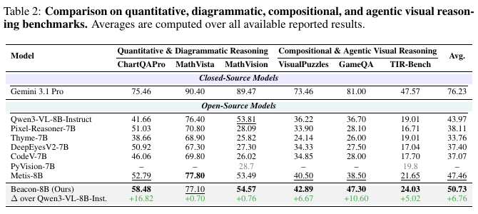
**Caption:** Table 2: Comparison on quantitative, diagrammatic, compositional, and agentic visual reasoning benchmarks.
**Caption[CN]:** Table 2：定量、图示、组合式与智能体视觉推理比较。该图为重新核验后裁剪的原表。

> <span style="color:#3B82F6"><strong>Para. 3:</strong></span> Beacon achieves an average score of 58.98 across 13 benchmarks, ranks first among open-source models on 11 of 13, and improves over Qwen3-VL-8B-Instruct by 6.07 points on average. Metis scores 56.67 and the base model scores 53.09.

> <span style="color:#F59E0B"><strong>Para. 3[CN]:</strong></span> Beacon 的 13 基准平均分为 58.98，在其中 11 项取得开源模型第一，相对 Qwen3-VL-8B-Instruct 平均提高 6.07 分。Metis 为 56.67，基座模型为 53.09。

### Table 3. Mode Adaptiveness and Tool Effect / 模式适应性与工具效应


**Caption:** Table 3: Detailed Mode Adaptiveness, Tool Effect, and Text-Retain metrics on five diagnostic benchmarks.
**Caption[CN]:** Table 3：五个诊断基准上的模式适应性、工具效应与 Text-Retain 细项。

> <span style="color:#3B82F6"><strong>Para. 4:</strong></span> Averaged over HRBench4K, BLINK, BabyVision, MathVista, and TIRBench, Beacon obtains 53.53 Tool-Available Accuracy, 51.57 Tool-Free Accuracy, +1.96 ΔAcc, 94.75 MA_tool, 22.91 MA_text, 58.83 MA_mean, 9.29 Tool-Gain, 6.15 Tool-Harm, +3.14 ΔTE, and 91.00 Text-Retain.

> <span style="color:#F59E0B"><strong>Para. 4[CN]:</strong></span> 在 HRBench4K、BLINK、BabyVision、MathVista 与 TIRBench 上平均，Beacon 的工具可用准确率为 53.53、无工具准确率为 51.57，$\Delta Acc=+1.96$；$\mathrm{MA}_{tool}=94.75$、$\mathrm{MA}_{text}=22.91$、$\mathrm{MA}_{mean}=58.83$；Tool-Gain 为 9.29、Tool-Harm 为 6.15、净效应 $\Delta TE=+3.14$；Text-Retain 为 91.00。

> <span style="color:#3B82F6"><strong>Para. 5:</strong></span> Beacon still strongly prefers code: its MA_text is only 22.91. MathVista is a negative result, with Tool-Gain 5.98, Tool-Harm 6.36, and ΔTE=-0.38. Thus Beacon improves average adaptiveness and net effect but does not solve unnecessary tool use on every dataset.

> <span style="color:#F59E0B"><strong>Para. 5[CN]:</strong></span> Beacon 仍明显偏好代码，$\mathrm{MA}_{text}$ 只有 22.91。MathVista 是一个应保留的负结果：Tool-Gain 5.98、Tool-Harm 6.36，净效应为 -0.38。因此它改善了平均适应性和净工具效应，但并未在每个数据集上消除不必要调用。

### Table 4. Component ablation / 组件消融

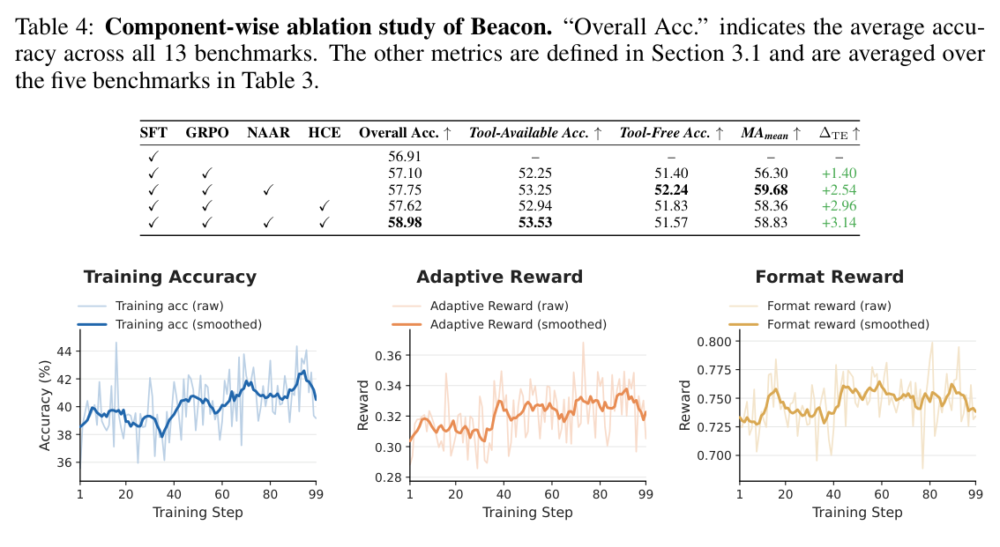
**Caption:** Table 4: Component-wise ablation of SFT, GRPO, NAAR, and HCE.
**Caption[CN]:** Table 4：SFT、GRPO、NAAR 与 HCE 的组件消融。完整方法总体分最高，但 NAAR-only 的 $\mathrm{MA}_{mean}$ 最高。

> <span style="color:#3B82F6"><strong>Para. 6:</strong></span> GRPO yields Overall Accuracy 57.10 and ΔTE +1.40. Adding NAAR yields 57.75 and +2.54, with the best MA_mean of 59.68. Adding HCE without NAAR yields 57.62 and +2.96. The full method reaches 58.98 and +3.14, with MA_mean 58.83.

> <span style="color:#F59E0B"><strong>Para. 6[CN]:</strong></span> GRPO 的总体分为 57.10、净工具效应 +1.40；加入 NAAR 后为 57.75、+2.54，并取得最高 $\mathrm{MA}_{mean}=59.68$；加入 HCE 的版本为 57.62、+2.96；完整方法为 58.98、+3.14，但 $\mathrm{MA}_{mean}=58.83$。这说明 HCE 的能力扩展与模式适应性之间存在轻微权衡。

### Figure 5. Training rewards / 训练奖励

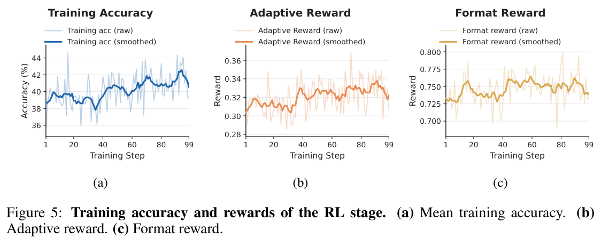
**Caption:** Figure 5: Mean training accuracy, adaptive reward, and format reward during RL.
**Caption[CN]:** Figure 5：RL 阶段的平均训练准确率、自适应奖励和格式奖励均稳步上升。

### Figures 6–7. Training dynamics / 训练动态

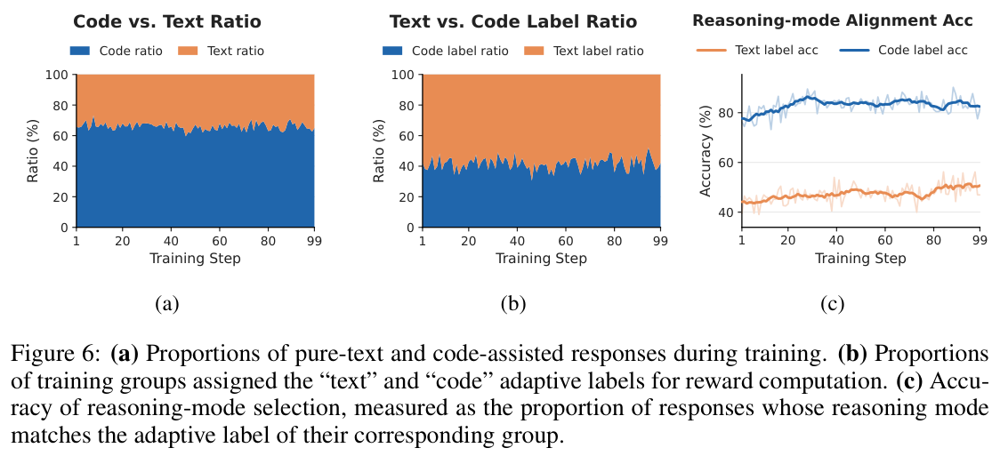
**Caption:** Figure 6: Code/text response ratio, adaptive-label ratio, and reasoning-mode alignment accuracy.
**Caption[CN]:** Figure 6：代码/文本输出比例和两类自适应标签比例基本稳定，但推理模式与标签的一致率持续提高，说明模型学到的是条件化选择，而非简单整体增减代码调用。

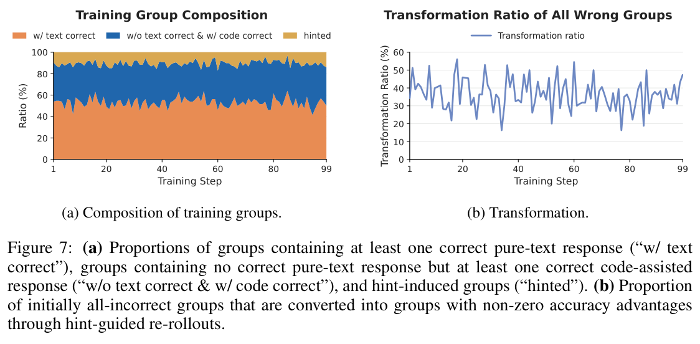
**Caption:** Figure 7: Training-group composition and transformation of initially all-wrong groups.
**Caption[CN]:** Figure 7：训练组约 50% 含正确文本响应、35% 仅含正确代码响应、15% 来自提示组；HCE 可将约 40% 的初始全错组转化为具有非零准确性优势的组。

## 6 Conclusion / 结论

> <span style="color:#3B82F6"><strong>Para. 1:</strong></span> Progress in agentic visual reasoning should not be measured merely by how frequently models use tools, but by whether they know when tools are necessary and how to use them to produce genuine capability gains.

> <span style="color:#F59E0B"><strong>Para. 1[CN]:</strong></span> 智能体视觉推理的进步不应按“工具用得多不多”衡量，而应看模型是否知道何时需要工具，以及能否用工具获得真正的能力增益。

> <span style="color:#3B82F6"><strong>Para. 2:</strong></span> Beacon combines high-quality trajectory synthesis, a soft necessity-aware reward, and expert-hint recycling of hard all-wrong groups. The method improves overall performance and average net tool effect, but remains code-biased and depends on substantial closed-model and compute resources.

> <span style="color:#F59E0B"><strong>Para. 2[CN]:</strong></span> Beacon 把高质量轨迹合成、软性的必要性感知奖励，以及对困难全错组的专家提示回收结合起来。它改善了总体性能与平均净工具效应，但仍偏向代码，并依赖闭源教师和高额算力。

## References / 参考文献

> <span style="color:#3B82F6"><strong>Para. 1:</strong></span> The source paper contains 49 references spanning multimodal foundation models, visual reasoning benchmarks, agentic tool-use methods, RL algorithms, training frameworks, and diagnostic studies. They are retained in the original PDF to preserve exact searchable bibliographic strings.

> <span style="color:#F59E0B"><strong>Para. 1[CN]:</strong></span> 原论文包含 49 条参考文献，覆盖多模态基础模型、视觉推理基准、智能体工具方法、强化学习算法、训练框架与诊断研究。为保留精确可搜索的书目信息，本笔记不对参考文献条目做机器式改写。

# Appendices / 附录

## Appendix A. Experimental Details / 实验细节

### A.1 Prompt for text-only answers / 强制纯文本回答提示

> <span style="color:#3B82F6"><strong>Para. 1:</strong></span> Prompt Box 1 prohibits all tools and code so that five independent responses can be used to estimate text-only solvability.

> <span style="color:#F59E0B"><strong>Para. 1[CN]:</strong></span> Prompt Box 1 禁止所有工具与代码，用五次独立响应估计一道题的纯文本可解性。

```text
You are a helpful assistant.
Solve the following problem step by step by reasoning directly from the
provided image and question.
You must not use any external tools, code execution, Python, or search. Do not
output <code> blocks or any tool-call format.
Output format must be:
<think>...</think>
<answer>...</answer>
```

### A.2 Evaluation protocol / 评测协议

> <span style="color:#3B82F6"><strong>Para. 1:</strong></span> Evaluation is built on VLMEvalKit. Official prompts, tool-call formats, and execution procedures are used for each model. A model may retry up to three times after execution or formatting failures, call tools for at most 20 rounds, and decode at temperature 0.1.

> <span style="color:#F59E0B"><strong>Para. 1[CN]:</strong></span> 评测基于 VLMEvalKit，并尽量遵循各模型的官方提示、调用格式与执行流程。代码错误或缺少有效最终答案时最多重试三次；每题最多 20 轮工具调用；解码温度为 0.1。

> <span style="color:#3B82F6"><strong>Para. 2:</strong></span> Rule-based answer matching is attempted first. If it fails, Gemini 3.1 Pro or Gemini 3 Flash judges semantic equivalence between prediction and ground truth.

> <span style="color:#F59E0B"><strong>Para. 2[CN]:</strong></span> 答案评估先做规则匹配；若失败，则由 Gemini 3.1 Pro 或 Gemini 3 Flash 判断预测与真值的语义等价性。因此评测并非完全确定、也并非完全开源。

## Appendix B. Training Data Details / 训练数据细节

### Table 5. Data statistics / 数据统计

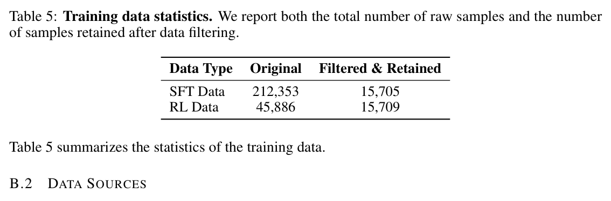
**Caption:** Table 5: Raw and retained SFT/RL sample counts.
**Caption[CN]:** Table 5：SFT 与 RL 的原始及筛选保留数量：212,353→15,705，45,886→15,709。

### Figure 8. Data sources / 数据来源


**Caption:** Figure 8: Training data sources of Beacon.
**Caption[CN]:** Figure 8：训练源包括 Geometry3K、OlympiadBench、AgentVista、MuirBench、HRScene、CV-Bench、MMMU 与 Vero 的多个子域，覆盖 STEM、图表/OCR、感知、智能体工具与通用任务。

> <span style="color:#3B82F6"><strong>Para. 1:</strong></span> The heterogeneous corpus contains both tool-necessary and tool-optional scenarios, creating a basis for learning not only how to use tools, but when tool invocation is beneficial.

> <span style="color:#F59E0B"><strong>Para. 1[CN]:</strong></span> 该异构语料同时包含“工具必要”和“工具可选”场景，使模型能够学习的不只是如何使用工具，也包括何时调用工具才有益。

### Figures 9–11. Distribution and retention / 分布与保留率

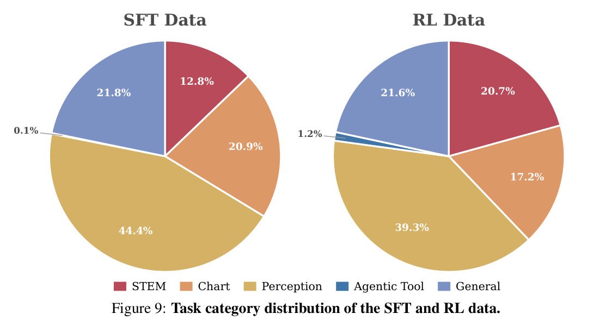
**Caption:** Figure 9: Task category distribution of SFT and RL data.
**Caption[CN]:** Figure 9：SFT 与 RL 数据在 STEM、图表、感知、智能体工具和通用任务上的类别分布。

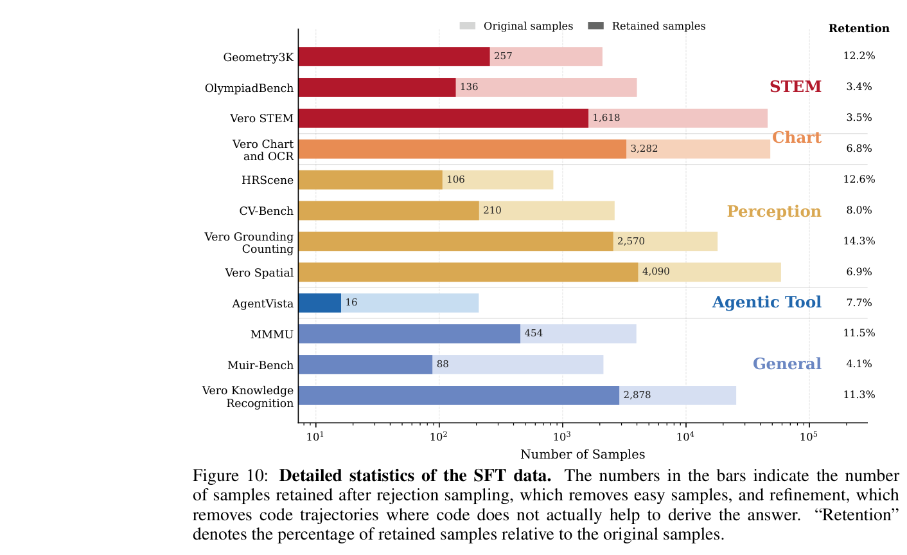
**Caption:** Figure 10: Per-source SFT sample counts before and after filtering and refinement.
**Caption[CN]:** Figure 10：各来源 SFT 样本在困难样本筛选与轨迹精炼前后的数量。

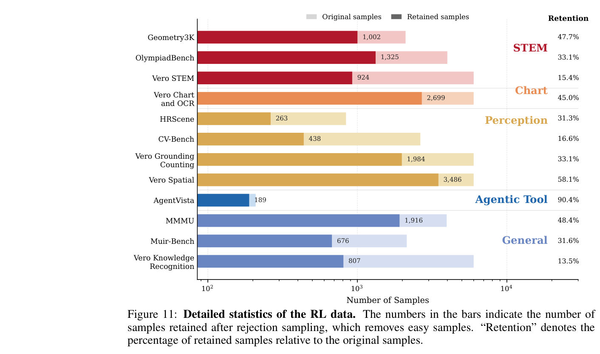
**Caption:** Figure 11: Per-source RL sample counts before and after rejection sampling.
**Caption[CN]:** Figure 11：各来源 RL 样本在拒绝采样前后的数量与保留率。

### B.3 SFT synthesis and refinement / SFT 合成与精炼

> <span style="color:#3B82F6"><strong>Para. 1:</strong></span> The synthesis prompt mandates code use and gives representative operations: crop, draw_line, draw_box, numeric_calculation, and rotation. It requires strict tool-call, tool-response, observation, and answer structure.

> <span style="color:#F59E0B"><strong>Para. 1[CN]:</strong></span> 合成提示强制使用代码，并提供 crop、draw_line、draw_box、numeric_calculation 与 rotation 五类代表性操作；轨迹必须遵守工具调用、工具返回、观察、最终答案的严格结构。

```text
Prompt Box 2 — key exact instructions

You are an image reasoning assistant. You may write Python code to obtain
visual evidence or any helpful information before answering. This includes but
is not limited to zooming in, drawing auxiliary lines, rotating, adjusting
contrast, computing statistics, etc. Put the executable Python code inside
<tool_call></tool_call> tags. When you give the final answer, you must wrap it
inside <answer></answer> tags.

Representative actions:
- crop: Pillow image.crop((left, top, right, bottom))
- draw_line: ImageDraw.Draw(...).line(...)
- draw_box: ImageDraw.Draw(...).rectangle(...)
- numeric_calculation: execute arithmetic using Python/math
- rotation: img.rotate(angle, expand=True)

After each execution, immediately output an <observation>...</observation>
that analyzes the returned result. The strict order is:
<tool_call> -> <tool_response> -> <observation>.
The final answer must be grounded in tool results.
```

> <span style="color:#3B82F6"><strong>Para. 2:</strong></span> Refinement checks whether the answer actually relies on useful tool information, removes redundant retries and meaningless code, inserts missing observations, and verifies that each observation accurately describes the preceding tool result. The final answer must remain unchanged.

> <span style="color:#F59E0B"><strong>Para. 2[CN]:</strong></span> 精炼阶段检查答案是否真正依赖有用的工具信息，删除重复重试与无意义代码，补齐缺失观察，并核对观察是否准确描述前一个工具结果；最终答案不得改变。

```text
Prompt Box 3 — output decisions

Output JSON only.
If no refinement is needed: {"decision":"keep"}.
If the trajectory should be discarded:
{"decision":"drop","reason":"..."}.
If refinement is needed, output:
{"decision":"refine","messages":[...]}.

Do not call tools again. Do not invent tool outputs.
If a tool-call step is removed, remove its corresponding tool response and
observation. Keep the final answer unchanged.
```

## Appendix C. Training Details / 训练细节

### C.1 Cold-start SFT / 冷启动 SFT

> <span style="color:#3B82F6"><strong>Para. 1:</strong></span> Qwen3-VL-8B-Instruct is trained for four epochs with Megatron on ms-swift. Adam uses peak learning rate 1×10^-5, weight decay 0.1, cosine scheduling, 5% warm-up, and gradient accumulation over 128 micro-batches.

> <span style="color:#F59E0B"><strong>Para. 1[CN]:</strong></span> SFT 使用 Megatron 与 ms-swift 训练 Qwen3-VL-8B-Instruct 共 4 个 epoch；Adam 峰值学习率为 $1\times10^{-5}$，weight decay 为 0.1，采用 cosine 调度与 5% warm-up，每次参数更新累积 128 个 micro-batch。

### C.2 Reinforcement learning / 强化学习

> <span style="color:#3B82F6"><strong>Para. 1:</strong></span> RL uses VeRL for one epoch on 64 NVIDIA H200 GPUs. Each prompt produces eight rollouts; batch size is 128 prompt groups and PPO mini-batch size is 128. Actor learning rate is 1×10^-6 with token-mean PPO, symmetric clipping 0.2, and no KL or entropy regularization.

> <span style="color:#F59E0B"><strong>Para. 1[CN]:</strong></span> RL 使用 VeRL，在 64 张 NVIDIA H200 上训练 1 个 epoch。每个 prompt 生成 8 条 rollout；batch 为 128 个 prompt group，PPO mini-batch 也是 128。Actor 学习率 $1\times10^{-6}$，使用 token-mean PPO、对称裁剪 0.2，不使用 KL 或 entropy 正则。

> <span style="color:#3B82F6"><strong>Para. 2:</strong></span> Maximum sequence length is 30,720 tokens: up to 20,480 prompt tokens and 10,240 response tokens, with at most 12 tool calls. Hints for all-wrong groups use up to three expert attempts and 15 expert tool calls with 32 parallel workers. Training uses bfloat16, gradient checkpointing, and a frozen vision encoder.

> <span style="color:#F59E0B"><strong>Para. 2[CN]:</strong></span> 最大序列长度为 30,720 token，其中 prompt 最多 20,480、response 最多 10,240；每条 rollout 最多 12 次工具调用。全错组的提示生成最多使用 3 次专家尝试、15 次专家工具调用与 32 个并行 worker。训练采用 bfloat16、gradient checkpointing，并冻结视觉编码器。

### C.3 Shared system prompt / 共享系统提示

```text
Prompt Box 4 — changed instruction

You should decide whether to use code to solve the problem.
Only write codes when necessary.
If you can directly solve the problem, don't use code.

All other tool protocols follow Prompt Box 2.
```

### C.4 Hint generation / 提示生成

> <span style="color:#3B82F6"><strong>Para. 1:</strong></span> The hint must omit the final and reference answers. It condenses only critical steps from a verified correct multimodal trajectory. Each numbered item contains an instruction and an expected subgoal. Tool steps are represented by semantic operation labels and grounded factual subgoal results.

> <span style="color:#F59E0B"><strong>Para. 1[CN]:</strong></span> 提示不得包含最终答案或参考答案，只从经验证正确的多模态轨迹中压缩关键步骤。每个编号项包含一条操作指令和一个期望子目标；工具步骤用语义操作名表示，并保留执行后获得的、与答案隔离的事实性证据。

```text
Prompt Box 5 — required hint pattern

The hint field itself must be a numbered list. Each item must use exactly:
"1. [Instruction] xxx; [Expected Subgoal] xxx;".

Prefer actionable tool steps over vague advice. Do not copy large code blocks.
Use canonical labels when applicable: crop, draw_line, draw_box,
numeric_calculation, rotation.

Return one JSON object containing:
- "hint"
- "tool_steps": step, tool, action, expected_subgoal, subgoal_result
- "subgoals": the ordered subgoal_result strings
```

## Appendix D. Additional Results / 更多结果

### Table 6. Detailed ablation / 详细消融

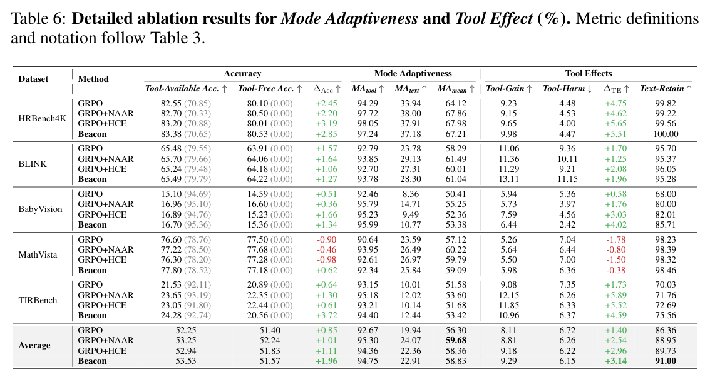
**Caption:** Table 6: Per-dataset ablation results for Mode Adaptiveness and Tool Effect.
**Caption[CN]:** Table 6：各诊断数据集上的详细消融结果。总体趋势支持 NAAR 改善模式选择、HCE 改善净工具效应，但各数据集幅度不一致。

## Appendix E. Failed Attempt / 失败尝试

> <span style="color:#3B82F6"><strong>Para. 1:</strong></span> The authors tried an aggressive reward that additionally forced a group of pure-text trajectories. If either normal or forced-text groups contained one correct pure-text trajectory, the problem was labeled “text.” This caused code-use ratio collapse and degraded V* and HRBench.

> <span style="color:#F59E0B"><strong>Para. 1[CN]:</strong></span> 作者尝试过更激进的奖励：额外强制生成一组纯文本轨迹，只要普通组或强制文本组中出现一条正确文本轨迹，就把题目标成“text”。结果代码使用率崩塌，并显著损害 V* 与 HRBench。

> <span style="color:#3B82F6"><strong>Para. 2:</strong></span> Forced sampling increases the chance of observing one lucky text-only success, even when text-only is unreliable for a single test-time rollout. The label thus reflects a best-of-many outcome rather than the most reliable mode, creating a train-test mismatch.

> <span style="color:#F59E0B"><strong>Para. 2[CN]:</strong></span> 强制多次文本采样提高了“偶然出现一次正确文本解”的概率，即使测试时单次文本解仍不可靠。标签因此反映 best-of-many，而不是单次 rollout 最可靠的模式，造成训练—测试错配。

## Appendix F. Case Studies / 案例研究

### Tables 7–9. Reasoning trajectories / 推理轨迹

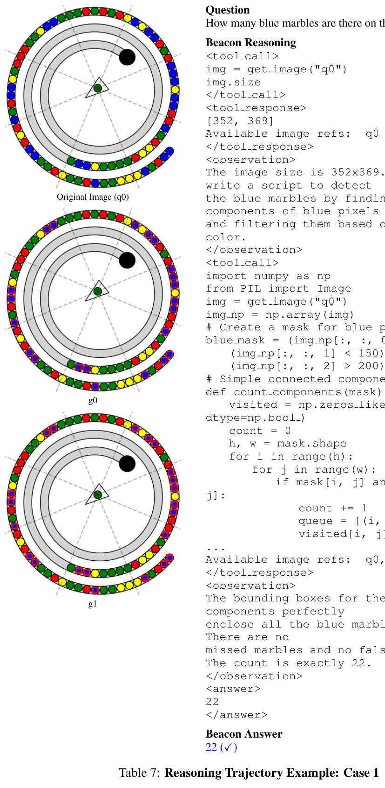
**Caption:** Table 7: Beacon counts blue marbles using image size inspection, a blue-pixel mask, and connected components.
**Caption[CN]:** Table 7：Beacon 先读取图像尺寸，再用蓝色像素掩码与连通域计算，得到 22 个蓝色弹珠。该案例体现像素级工具确实超越直接目测。

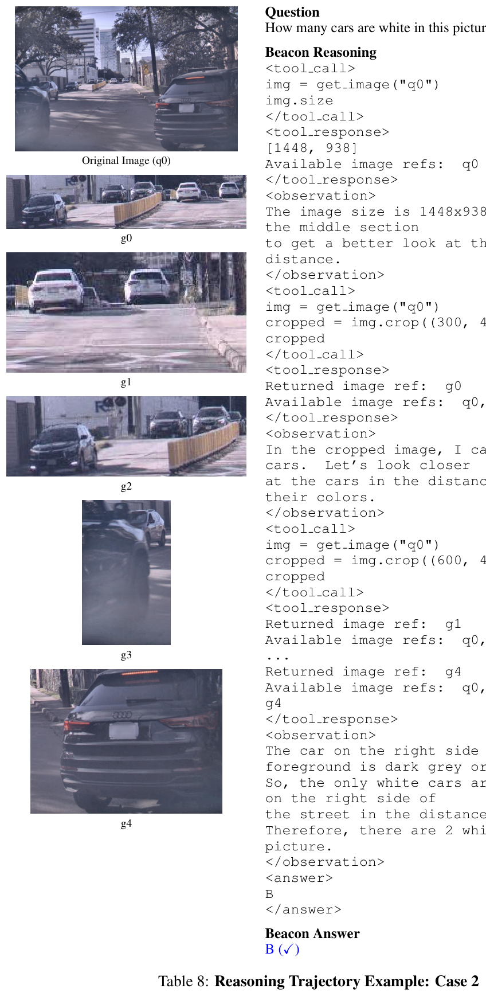
**Caption:** Table 8: Beacon answers a car-color counting question through iterative regional crops.
**Caption[CN]:** Table 8：Beacon 通过连续裁剪远处与前景车辆区域，判断白色车辆数量并选择正确选项。

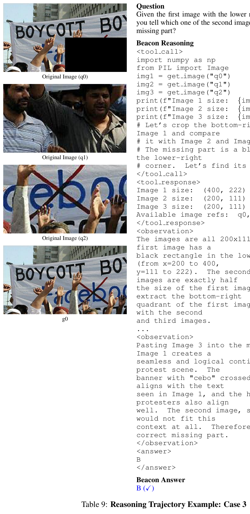
**Caption:** Table 9: Beacon compares candidate image patches to complete a missing lower-right region.
**Caption[CN]:** Table 9：Beacon 比较候选图块与缺失右下区域的几何和语义连续性，选择能无缝延续抗议场景的候选项。

### Tables 10–12. Hint examples / 提示案例

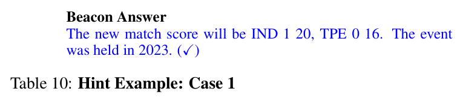
**Caption:** Table 10: Hint-guided reasoning for identifying an event year and updating a badminton score from scoreboard and boundary evidence.
**Caption[CN]:** Table 10：提示要求裁剪计分牌和红圈区域，再依据边界规则更新比分并识别赛事年份；提示给过程与子目标，不直接给答案。

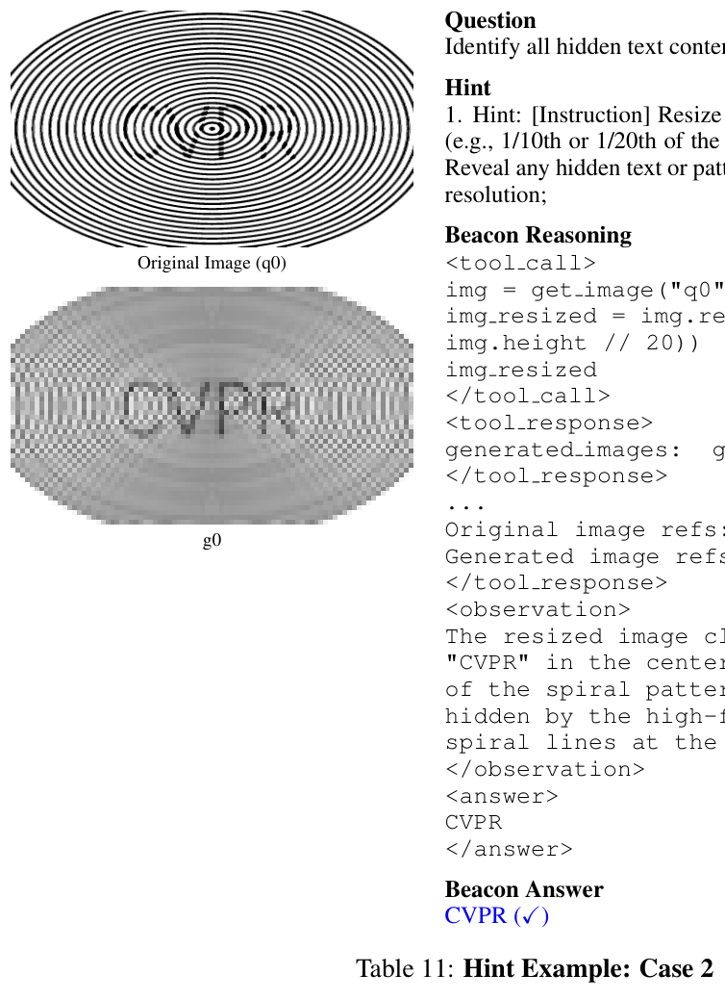
**Caption:** Table 11: A second answer-free hint example showing how intermediate visual evidence guides tool use.
**Caption[CN]:** Table 11：第二个无答案提示案例，展示如何把关键视觉证据需求转化为可执行的中间步骤。

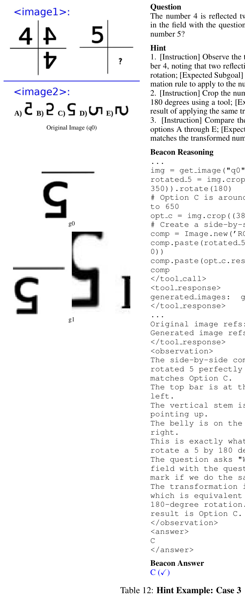
**Caption:** Table 12: A third hint example illustrating capability expansion through structured subgoals.
**Caption[CN]:** Table 12：第三个提示案例，以结构化子目标引导模型探索原策略难以发现的工具轨迹。

## Critical Reading / 精读结论

> <span style="color:#3B82F6"><strong>Para. 1:</strong></span> The strongest conceptual contribution is the decomposition of agentic tool use into selection quality and execution benefit. This prevents aggregate accuracy from hiding the cancellation between gains and harms.

> <span style="color:#F59E0B"><strong>Para. 1[CN]:</strong></span> 最强的概念贡献，是把智能体工具使用拆成“模式选得对不对”和“执行后有没有真实收益”。这能防止总准确率掩盖增益与伤害相互抵消。

> <span style="color:#3B82F6"><strong>Para. 2:</strong></span> NAAR is a pragmatic compromise: the 0.25 reward avoids treating correct code as failure, while still preferring text when text succeeds. Its label is policy-relative rather than an intrinsic property of the problem.

> <span style="color:#F59E0B"><strong>Para. 2[CN]:</strong></span> NAAR 是一个务实折中：0.25 奖励避免把正确代码当作失败，同时在文本成功时保留文本偏好。要注意，这个“工具必要性”标签是相对于当前策略的，不是题目的先验固定属性。

> <span style="color:#3B82F6"><strong>Para. 3:</strong></span> HCE is best understood as expert-assisted exploration plus off-policy trajectory transfer. Its empirical evidence is promising, but its gain is entangled with extra Gemini attempts, tool calls, and compute. A budget-matched comparison with additional unguided sampling or rejection sampling is absent.

> <span style="color:#F59E0B"><strong>Para. 3[CN]:</strong></span> HCE 可以理解为“专家辅助探索 + 离策略轨迹迁移”。结果很有启发性，但收益与额外 Gemini 尝试、工具调用和计算预算纠缠在一起；论文没有与等预算的无提示采样或 rejection sampling 做严格对照。

> <span style="color:#3B82F6"><strong>Para. 4:</strong></span> Reproducibility is limited by 64 H200 training, Gemini 3.1 Pro trajectory synthesis and hint generation, and Gemini-based semantic evaluation. The paper also omits a full accounting of latency, average tool rounds, sandbox failures, and hint-generation cost.

> <span style="color:#F59E0B"><strong>Para. 4[CN]:</strong></span> 复现门槛来自 64 张 H200、Gemini 3.1 Pro 的轨迹合成与提示生成，以及 Gemini 语义评测。论文还没有完整报告端到端延迟、平均工具轮数、沙箱失败率和提示生成成本。

> <span style="color:#3B82F6"><strong>Para. 5:</strong></span> The practical takeaway is to report a cost-aware matrix rather than one score: tool-free accuracy, tool-available accuracy, call ratio, Tool-Gain, Tool-Harm, failure rate, latency, and compute. Beacon supplies the first five particularly well; the deployment-cost side remains open.

> <span style="color:#F59E0B"><strong>Para. 5[CN]:</strong></span> 实践上的结论是：评估工具智能体不应只给一个总分，而应报告无工具准确率、工具可用准确率、调用比例、Tool-Gain、Tool-Harm、执行失败率、延迟和算力。Beacon 对前五项做得很好，但部署成本一侧仍是空白。
