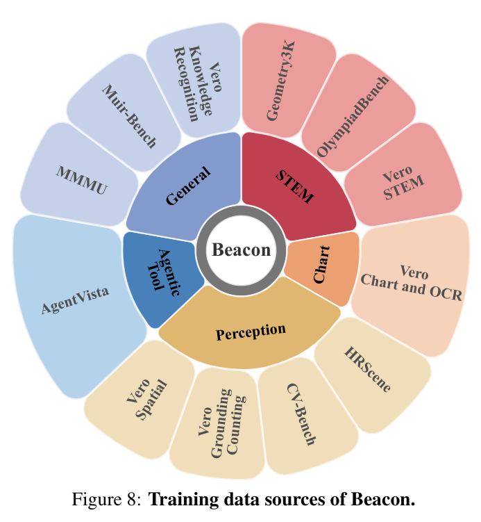
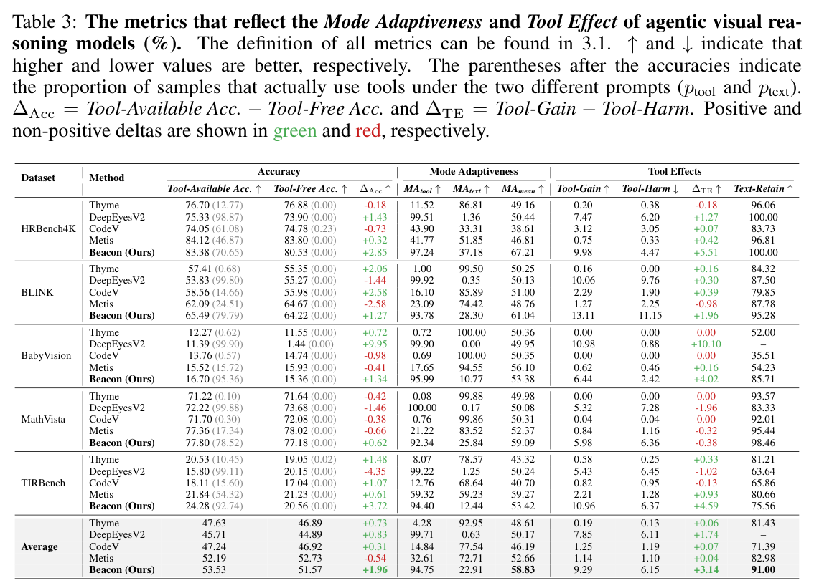

---
tags:
  - papers/agentic-visual-reasoning
  - papers/train
  - papers/reinforcement-learning
  - papers/tool-use
aliases:
  - Beacon
  - "Beacon-8B"
date: 2026-07-30
doi: 10.48550/arXiv.2607.28595
arxiv_id: 2607.28595
---

# Beacon: Knowing When and How to Perform Agentic Visual Reasoning

## 核心信息

- 标题: Beacon: Knowing When and How to Perform Agentic Visual Reasoning
- 标题翻译: Beacon：知道何时、以及如何执行智能体视觉推理
- 作者: Qixun Wang, Yang Shi, Letian Cheng, Zhuoran Zhang, Yan He, Yuqi Tang, Qi Zhang, Xinlei Yu, Ruizhe Chen, Tianrun Xu, Yuanxing Zhang, Pengfei Wan, Haotian Wang, Xianghua Ying
- 机构: Peking University; Kling Team; HKUST(GZ); CUHK; ZJU; THU
- 发表时间: 2026-07-30
- 发表渠道: arXiv v1；Preprint，Work in progress
- DOI: 10.48550/arXiv.2607.28595
- arXiv: 2607.28595
- 论文链接: https://arxiv.org/abs/2607.28595
- 代码 / 项目: https://github.com/NOVAglow646/Beacon
- 数据 / 资源: Qwen3-VL-8B-Instruct；Geometry3K；OlympiadBench；AgentVista；MuirBench；HRScene；CV-Bench；MMMU；Vero；13 个视觉推理评测项
- 论文类型: AI 方法；**Train**；cold-start SFT + GRPO 强化学习；代码工具智能体

## 原文摘要翻译

智能体视觉推理的根本目标，是提高多模态大语言模型在复杂任务上的成功率，而不是仅仅为模型装备一套精巧却低效的推理范式。本文从工具使用的两个关键维度重新思考这一问题：模式适应性与工具效应。

模式适应性刻画模型能否识别工具何时真正必要，并据此调用工具：一方面避免不必要的计算开销，另一方面改善必须依赖工具的困难问题。工具效应刻画调用工具后的实际影响：工具应当扩展模型在纯文本推理无法解决的问题上的能力，同时避免在模型原本能够直接解决的问题上引入额外错误。

作者对这两个性质进行量化分析，发现现有智能体视觉推理模型的模式适应性有限；困难样本上由工具产生的收益，又大多被简单样本上的工具伤害抵消。基于这些观察，作者提出 Beacon。其强化学习阶段包含必要性感知自适应奖励与提示引导能力扩展，前者鼓励模型按任务必要性自适应调用工具，后者加强模型在最困难问题上的工具使用能力。多种基准实验表明，Beacon 同时改善了总体性能、模式适应性和真实的工具净收益。

## 创新点

1. 把“工具智能体是否更强”拆成两个可诊断问题：**何时调用**与**调用是否产生净收益**，避免总准确率掩盖增益和伤害的抵消。
2. 每题做五次纯文本采样，以概率意义上的可解性划分 text-easy、text-hard 与 ambiguous，比单次二值判断更稳健。
3. 提出 NAAR：根据当前策略组内是否存在正确纯文本响应在线决定模式偏好；在文本可解时仍给正确代码 0.25 奖励，避免效率目标与正确性目标直接冲突。
4. 提出 HCE：对普通 RLVR 无法利用的全错组，先生成并验证专家代码轨迹，再抽取不含答案的结构化 hint，帮助策略发现成功轨迹。
5. 更新带提示轨迹时，新策略概率以原始无提示问题为条件，旧策略概率保留生成时的带提示条件，把提示辅助能力迁回无提示策略。
6. 论文主动保留失败尝试：强制额外纯文本 rollout 会让 code-use ratio 崩塌，说明“少调用”不能作为脱离任务可靠性的绝对目标。

## 一句话总结

Beacon 是一条训练型工具智能体路线：用 NAAR 学会“这题该不该写代码”，再用 HCE 把困难全错组变成可学习轨迹，让工具调用不只更自适应，也更可能带来正的净收益。

## 研究问题

目前很多 agentic visual reasoning 工作把“会调用工具”本身当作能力，但这容易出现两个假进步。

第一种是假适应性。一个模型可能几乎每题都裁剪、画框、运行 Python；它在困难题上看似积极，却也会在简单题上浪费算力并制造执行错误。另一种模型可能为了效率几乎不调用工具，因而错过真正需要像素计算、局部放大或几何操作的题。

第二种是假收益。只看 tool-available accuracy 时，工具在困难题上修正的若干样本，可能被简单题上新增的错误抵消。平均分小幅变化不能告诉我们：工具究竟扩展了能力，还是仅仅改变了错误分布。

*论文原图 Figure 2。左图显示 Beacon 的工具调用率会随五次纯文本采样的正确次数下降而上升；中图给出 13 项平均分；右图把工具增益和伤害显式拆开。*

论文因此提出两个评价轴。

模式适应性包含：

$$
\mathrm{MA}_{text}
=\frac{1}{5|E|}\sum_{x\in E}\sum_{i=1}^{5}(1-u_{x,i}),
\qquad
\mathrm{MA}_{tool}
=\frac{1}{5|H|}\sum_{x\in H}\sum_{i=1}^{5}u_{x,i}.
$$

这里 $E$ 表示至少四次纯文本采样正确的“文本易题”集合，$H$ 表示至多一次正确的“文本难题”集合。

$\mathrm{MA}_{text}$ 希望简单题少调用工具，$\mathrm{MA}_{tool}$ 希望困难题多调用工具。

工具效应包含：

$$
\mathrm{Tool\mbox{-}Gain}
=\frac{1}{5N}\sum_{x\in H}\sum_i u_{x,i}c_{x,i},
\qquad
\mathrm{Tool\mbox{-}Harm}
=\frac{1}{5N}\sum_{x\in E}\sum_i u_{x,i}(1-c_{x,i}).
$$

这两个量按全部样本 $N$ 归一化。前者是“原本难、调用后答对”的绝对比例，后者是“原本容易、调用后反而答错”的绝对比例。

$$
\Delta \mathrm{TE}
=\mathrm{Tool\mbox{-}Gain}-\mathrm{Tool\mbox{-}Harm}.
$$

二者之差更接近工具带来的净能力变化。

## 数据与任务定义

训练池覆盖科学技术工程与数学、图表/OCR、感知、空间、通用视觉理解和智能体工具任务。作者移除了与评测测试集重叠的样本。

- 几何与数学：Geometry3K、OlympiadBench；

- 感知与空间：HRScene、CV-Bench；

- 通用与智能体：MMMU、Vero、AgentVista、MuirBench。

*论文图 8。数据源覆盖科学技术工程与数学、图表、感知、智能体工具和通用任务，为“工具必要”与“工具可选”同时提供训练覆盖。*

| 阶段 | 原始样本 | 筛选后 | 筛选逻辑 |
|---|---:|---:|---|
| SFT | 212,353 | 15,705 | 基座模型五次采样至多两次正确；Gemini 生成代码轨迹；只保留正确且精炼后真正依赖工具的轨迹 |
| RL | 45,886 | 15,709 | SFT 模型五次采样至多三次正确，保留仍未稳定掌握的困难样本 |

监督微调数据并非让 Gemini 直接输出一条思维链。

它规定 `<tool_call>`、`<tool_response>`、`<observation>`、`<answer>` 的可执行协议。

代表性操作包括裁剪、画线、画框、数值计算和旋转。

第二轮精炼会删除重复工具调用、没有利用执行结果的伪工具轨迹、无意义推理循环和缺失观察的步骤。

评测有 13 个结果项，覆盖：

- 高分辨率视觉搜索：V*、HRBench 4K/8K、Visual Probe hard；
- 空间与感知：RealWorldQA、BLINK、BabyVision；
- 定量与图示推理：ChartQAPro、MathVista、MathVision；
- 组合式与智能体推理：VisualPuzzles、GameQA、TIRBench。

模式诊断重点使用 HRBench4K、BLINK、BabyVision、MathVista 与 TIRBench，每题在纯文本和工具可用提示下各做五次采样。

## 方法主线

### 机制流程

1. **建立基础工具协议。** 用 Gemini 3.1 Pro 合成并精炼可执行代码轨迹，对 Qwen3-VL-8B-Instruct 做 cold-start SFT；混入正确纯文本轨迹，防止逢题写代码。
2. **用 NAAR 在线判断模式必要性。** 若 rollout 组存在正确纯文本响应，正确文本得 1、正确代码得 0.25；若没有正确文本，正确代码得 1。
3. **用 HCE 回收全错组。** 对 8 条普通 rollout 全错的问题，Gemini 先生成经验证正确的完整轨迹，再抽取不含最终答案的 hint，模型据此重新 rollout。
4. **联合更新普通与带提示轨迹。** 总奖励为 0.1 格式奖励 + 0.9 自适应奖励；带提示轨迹用无提示输入计算新策略概率，把辅助行为迁回推理时不需要 hint 的策略。

*论文原图 Figure 4。NAAR 负责混合组内的模式奖励，HCE 负责把全错组变为可能出现相对优势的 hinted group。*

### NAAR 为什么不是“禁止代码”

对组 $G$，令 $I_{text}(G)$ 表示是否存在正确纯文本回答：

$$
R_{adaptive}(y_i;G)=
\begin{cases}
1,& I_{text}(G)=1,\ y_i\text{ 为正确纯文本};\\
0.25,& I_{text}(G)=1,\ y_i\text{ 为正确代码};\\
1,& I_{text}(G)=0,\ y_i\text{ 为正确代码};\\
0,& \text{其他}.
\end{cases}
$$

这里的 0.25 很重要。若文本可解时把正确代码直接置零，模型收到的“答案正确”和“模式不够省”信号会完全冲突，容易破坏已经学到的工具能力。软惩罚保留了成功轨迹的学习价值，同时让正确文本在组内获得更高优势。

NAAR 的标签也不是教师模型预先写死的。它随当前 policy 的采样结果变化：模型能力提高后，同一道题可能从 code-needed 变成 text-solvable。这种在线性比固定教师标签更贴近实际部署策略。

### HCE 如何跨过全错区

普通 GRPO 对同一问题采样一组响应，再用组内奖励差构造优势。若全错，奖励近似相同，最困难样本就没有学习方向。HCE 对此做两步专家辅助：

1. Gemini 最多尝试生成完整代码轨迹，并通过真值验证，只保留正确轨迹；

2. 从正确轨迹中抽取关键操作和实际获得的中间证据，改写为不含答案的编号提示。

令 $x_h=x\oplus h$。带提示轨迹按下式由旧策略生成：

$$
y_i^h\sim\pi_{\theta_{old}}(\cdot\mid x_h).
$$

更新时，新策略以原问题为条件；重要性采样比为：

$$
\rho^h_{i,t}(\theta)=
\frac{\pi_\theta(y_{i,t}\mid x,\tau_{i,<t})}
{\pi_{\theta_{old}}(y_{i,t}\mid x_h,\tau_{i,<t})}.
$$

这不是普通的提示蒸馏：轨迹中的多轮工具行为被完整保留，而新策略被要求在看不到提示的原问题条件下提高这些行为的概率。

### 训练配置

监督微调训练 4 个周期，峰值学习率为 $10^{-5}$，采用 Adam、权重衰减 0.1、余弦调度和 5% 预热。

强化学习使用 VeRL，在 64 张 H200 上训练 1 个周期。

每题生成 8 条轨迹，批量为 128 个问题组；策略学习率为 $10^{-6}$，裁剪系数为 0.2，不使用 KL 与熵正则。

最大序列长度为 30,720 个词元，其中输入最多 20,480 个、输出最多 10,240 个；每条轨迹最多 12 次工具调用。

全错组提示生成最多使用 3 次专家尝试、15 次专家工具调用和 32 个并行进程。

训练采用 bfloat16、梯度检查点，并冻结视觉编码器。

## 关键结果

### 总体表现

*论文原表 1。高分辨率搜索、空间与感知推理结果。*

*论文原表 2。定量、图示、组合式与智能体推理结果；该表已按原 PDF 重新裁剪核验。*

Beacon 在 13 个评测项上的平均分为 **58.98**，高于 Metis 的 56.67 和 Qwen3-VL-8B-Instruct 的 53.09。它在 13 项中的 11 项取得开源模型最好结果，相对基座平均提高 **6.07 分**。

这个结果支持“综合能力更强”，但平均分是跨异质任务的简单平均，不应被解释为单一的通用智能标尺。

### 模式与工具净效应

*论文原表 3。五个诊断数据集上的工具可用/无工具准确率、模式适应性、工具效应与文本能力保持率。*

| 指标 | Beacon 五数据集平均 |
|---|---:|
| Tool-Available Acc. | 53.53 |
| Tool-Free Acc. | 51.57 |
| $\Delta Acc$ | +1.96 |
| $\mathrm{MA}_{tool}$ | 94.75 |
| $\mathrm{MA}_{text}$ | 22.91 |
| $\mathrm{MA}_{mean}$ | 58.83 |
| Tool-Gain | 9.29 |
| Tool-Harm | 6.15 |
| $\Delta TE$ | +3.14 |
| Text-Retain | 91.00 |

与四个对照模型相比，Beacon 的 $\Delta TE$ 最大。

这说明工具在困难题上的修正更明显地超过了简单题上的新增错误。

文本能力保持率为 91.00，说明工具提示没有把无工具能力整体打掉。

但这里不能只报好消息。Beacon 的 $\mathrm{MA}_{text}$ 只有 **22.91**，意味着它在文本易题上仍频繁使用代码。

MathVista 上的工具增益为 5.98，工具伤害为 6.36，$\Delta TE=-0.38$；工具总体仍带来轻微伤害。

### 消融

| 设置 | 总体准确率 | 工具可用准确率 | 无工具准确率 | $\mathrm{MA}_{mean}$ | $\Delta TE$ |
|---|---:|---:|---:|---:|---:|
| GRPO | 57.10 | 52.25 | 51.40 | 56.30 | +1.40 |
| GRPO + NAAR | 57.75 | 53.25 | 52.24 | **59.68** | +2.54 |
| GRPO + HCE | 57.62 | 52.94 | 51.83 | 58.36 | +2.96 |
| Full Beacon | **58.98** | **53.53** | 51.57 | 58.83 | **+3.14** |

NAAR 对模式适应性的作用最直接，HCE 对净工具效应的提升更明显。

完整方法总体分和 $\Delta TE$ 最好，但 $\mathrm{MA}_{mean}$ 低于只使用 NAAR 的版本。

这说明能力扩展与少做不必要调用之间并非完全同向。

*论文原图 Figure 5。训练准确率、自适应奖励与格式奖励均逐步上升。*

训练期间代码/文本输出比例没有明显整体漂移，而推理模式与组标签的一致率持续上升。这支持作者的解释：模型学到的是“按条件选择模式”，而不是简单地把代码比例调高或调低。

训练组构成约为 50% 含正确文本、35% 没有正确文本但有正确代码、15% 为 hinted group。HCE 能把约 **40%** 的初始全错组转化为具有非零 accuracy advantage 的组，这是 HCE 最直接的训练动态证据。

## 深度分析

### 这篇真正推进了什么

Beacon 最扎实的贡献不是模型排行榜，而是给工具智能体建立了一套更接近因果诊断的账本。

过去只看工具可用准确率时，我们不知道提升来自监督微调本身、工具真的修正了难题，还是提示分布变化。

模式适应性与工具效应至少让“选择”和“执行”可以分开观察。

这套指标也很适合迁移到 3D agent。工具可以换成视角选择、点云裁剪、渲染、测量或几何求解器；text-easy/text-hard 可改成无工具策略的多次成功率；Tool-Gain/Harm 则直接衡量额外感知和计算是否值得。

### NAAR 的边界

NAAR 用组内是否出现一条正确文本解做标签，仍然是一个离散阈值。它没有显式建模工具成本、答案置信度和单次成功概率。0.25 也是经验常数，论文没有系统扫描。

更进一步的版本可以让奖励连续依赖：

- 估计的纯文本成功概率；
- 工具执行时间或词元成本；
- 代码失败率；
- 工具结果对最终答案的可归因贡献。

### HCE 的贡献与混杂

HCE 确实把一部分零信号全错组变成可学习组，但它同时增加了强教师、额外工具执行和额外 rollout。当前实验没有与等预算的更多无提示采样、best-of-N 或 rejection sampling 比较，因此不能把全部增益都归因于“hint 结构”本身。

此外，answer-free 不等于完全无泄漏。一个高度具体的子目标可能隐式缩小答案空间。需要审计 hint 对教师模型、提示词和任务类别的敏感性，并用自动与人工方式检查隐性答案提示。

### 工程可复现性

论文给出了相当细的训练超参数，但关键资源依赖不轻：64 张 H200、Gemini 3.1 Pro 数据合成与 hint 生成、Gemini 语义评测。开放权重和代码并不自动复现教师服务、采样预算与过滤过程。

论文也没有完整报告平均工具轮数、端到端延迟、沙箱执行失败率、每题 Python 成本和 hint 生成总成本。对实际部署而言，这些数字与准确率同样重要。

## 局限

1. Beacon 仍显著偏好代码，$\mathrm{MA}_{text}=22.91$；“自适应”改善不等于已经高效。
2. MathVista 的净工具效应为 -0.38，说明工具伤害尚未在所有任务上得到控制。
3. 完整方法的 $\mathrm{MA}_{mean}$ 低于 NAAR-only，HCE 的能力扩展和模式适应性存在权衡。
4. 两个训练阶段都依赖闭源 Gemini 3.1 Pro，语义判分还依赖同系列模型。
5. 64 张 H200、长达 30,720 token 的序列与多轮工具执行使复现和部署成本很高。
6. 五次纯文本采样的 4/5、1/5 阈值是人为选择，论文没有给出阈值敏感性分析。
7. 13 项跨任务平均值可能掩盖数据集规模、难度和量纲差异。
8. 论文是 2026-07-30 发布的 arXiv v1，并明确标注为仍在进行中的预印本，结论与实现可能更新。

## 我的笔记

这篇对我最有价值的不是“又一个会写 Python 的 VLM”，而是它迫使我们把工具调用从展示性能力变成可审计决策。

以后看 agent 论文，我会固定问四个问题：

1. 不给工具时，它本来有多强？
2. 工具调用是否随无工具难度变化？
3. 工具究竟修正了多少原本不会的题？
4. 工具又破坏了多少原本会的题？

Beacon 的失败尝试也很有启发。为了让模型少调用而额外制造大量纯文本样本，会把“多次尝试中偶尔成功”误当成“单次推理可靠”。这说明自适应奖励必须围绕部署时的决策分布设计，不能只优化训练组里的最佳结果。

如果把它迁移到 3D agent，我会把 HCE 的 hint 写成“选择哪个视角—预期看到什么—做何种几何测量—得到什么中间证据”，而不是泛泛的“仔细观察”。同时必须记录每一步工具的成本与失败类型，否则容易得到一个分数更高但不可用的 agent。

我还会补做三组实验：

- 等 Gemini/rollout 预算下，HCE 对比更多无提示采样与 rejection sampling；
- 把 Tool-Harm 分成不必要调用错误、代码执行错误、观察解释错误；
- 扫描 NAAR 中 0.25 的软奖励，以及 text-easy/text-hard 阈值。

## 引用

- 论文: Qixun Wang et al. *Beacon: Knowing When and How to Perform Agentic Visual Reasoning*. arXiv:2607.28595, 2026.
- 全文精读: [detailed_paper.md](Reasoning/Train/Beacon%20Knowing%20When%20and%20How%20to%20Perform%20Agentic%20Visual%20Reasoning/detailed_paper.md)
- 中英对照副本: [paper.md](Reasoning/Train/Beacon%20Knowing%20When%20and%20How%20to%20Perform%20Agentic%20Visual%20Reasoning/paper.md)
- 来源映射: [source_map.json](Reasoning/Train/Beacon%20Knowing%20When%20and%20How%20to%20Perform%20Agentic%20Visual%20Reasoning/source_map.json)
- 翻译说明: [translation_notes.md](Reasoning/Train/Beacon%20Knowing%20When%20and%20How%20to%20Perform%20Agentic%20Visual%20Reasoning/translation_notes.md)
