# DeepEyes: Incentivizing “Thinking with Images” via Reinforcement Learning

> **中文题名：** DeepEyes：通过强化学习激励模型“用图像思考”  
> **作者：** Ziwei Zheng¹˒²*, Michael Yang¹*, Jack Hong¹*, Chenxiao Zhao¹*†, Guohai Xu¹‡, Le Yang²‡, Chao Shen², Xing Yu¹  
> **机构：** ¹ Xiaohongshu Inc.; ² Xi’an Jiaotong University  
> **作者标记：** * Equal contribution, random order; † Main Code Contributor; ‡ Corresponding Author  
> **会议与版本：** Published as a conference paper at ICLR 2026; arXiv:2505.14362v3 [cs.CV], 1 Mar 2026  
> **项目主页：** https://visual-agent.github.io/  
> **代码：** https://github.com/Visual-Agent/DeepEyes  
> **通讯邮箱：** `{chenxiao2, xuguohai}@xiaohongshu.com`, `yangle15@xjtu.edu.cn`, `ziwei.zheng@stu.xjtu.edu.cn`, `{yangminghao199, jaaackhong}@gmail.com`  
> **作者脚注：** Work done during Ziwei’s internship at Xiaohongshu. The specific contribution of co-first authors is shown in Appendix C.  
> **中文脚注：** 本工作完成于 Ziwei 在小红书实习期间；共同第一作者的具体贡献见附录 C。  
> **权威来源：** 本阅读件以本地 25 页 PDF 为权威文本，`paper.md` 仅作为候选线索；正文、表格、提示词及附录均依据 PDF 重建。

## Page / Section Index｜页码与章节索引

- Abstract｜摘要：p. 1
- 1 Introduction｜引言：pp. 1–3
- 2 Related Work｜相关工作：p. 3
- 3 Method｜方法：pp. 4–5
- 4 Experiment｜实验：pp. 6–9
- 5 Conclusion｜结论；LLM Usage；Reproducibility：p. 10
- References｜参考文献：pp. 10–15
- Appendix A Prompt｜提示词：pp. 15–16
- Appendix B Training Data｜训练数据：pp. 16–17
- Appendix C Co-first Author Contributions｜共同第一作者贡献：p. 17
- Appendix D More Cases｜更多案例：pp. 17–24
- Appendix E Limitations｜局限：p. 24
- Appendix F Broader Impacts｜更广泛影响：p. 24
- Appendix G Future Work｜未来工作：p. 25

## Terminology Ledger｜术语表

| Canonical term | 中文 | 说明 |
|---|---|---|
| thinking with images | 用图像思考 | 在推理轨迹中主动取得并利用新的视觉观察 |
| active perception | 主动感知 | 模型自行决定何时定位、裁剪并重新查看图像区域 |
| Interleaved Multi-modal Chain-of-Thought (iMCoT) | 交错式多模态思维链 | 文本 CoT 与图像观察交错出现 |
| visual grounding | 视觉定位 | 以边界框把文本概念落到图像区域 |
| zoom-in operation/tool | 放大观察操作/工具 | 依据 `bbox_2d` 裁剪感兴趣区域 |
| conditional tool reward | 条件工具奖励 | 仅当答案正确且调用主动感知时发放的奖励 |
| grounding IoU | 定位交并比 | 预测框与真值框的 Intersection-over-Union |
| GRPO | GRPO | Group Relative Policy Optimization，组相对策略优化 |
| cold-start SFT | 冷启动 SFT | 在 RL 前用预收集推理轨迹进行监督微调 |

---

## Abstract｜摘要

> <span style="color:#3B82F6"><strong>Para. 1:</strong></span> Large Vision-Language Models excel at multimodal understanding but struggle to deeply integrate visual information into their predominantly text-based reasoning processes, a key challenge in mirroring human cognition. To address this, we introduce DeepEyes, a model that learns to “think with images”, trained end-to-end with reinforcement learning without requiring pre-collected reasoning data for cold-start supervised fine-tuning (SFT). Notably, this ability emerges natively, leveraging the model’s own grounding capability as an intrinsic function rather than relying on external specialized models or APIs. We enable this capability through active perception, where the model learns to strategically ground its reasoning in visual information, guided by a tailored data selection and reward strategy. DeepEyes achieves significant performance gains on general perception and reasoning benchmarks and also demonstrates improvement in grounding, hallucination, and mathematical reasoning tasks. Interestingly, we observe the distinct evolution of active perception from initial exploration to efficient and accurate exploitation, and diverse thinking patterns that closely mirror human visual reasoning processes. Code is available at https://github.com/Visual-Agent/DeepEyes.

> <span style="color:#F59E0B"><strong>Para. 1[CN]:</strong></span> 大型视觉—语言模型擅长多模态理解，但仍难以将视觉信息深度整合进主要以文本为基础的推理过程；这是模拟人类认知时的一项关键挑战。为此，我们提出 DeepEyes：一种通过端到端强化学习训练、学会“用图像思考”的模型，而且无需为冷启动监督微调（SFT）预先收集推理数据。值得注意的是，这种能力是原生涌现的：模型把自身的定位能力作为内在功能加以利用，而不依赖外部专用模型或 API。我们通过主动感知实现这一能力；在量身定制的数据选择与奖励策略引导下，模型学习有策略地把推理落到视觉信息上。DeepEyes 在通用感知与推理基准上取得显著增益，并且在视觉定位、幻觉与数学推理任务上也有所改善。有趣的是，我们观察到主动感知从最初探索逐步演化为高效且准确的利用，还观察到与人类视觉推理过程高度相似的多样思考模式。代码见 https://github.com/Visual-Agent/DeepEyes。

## 1 Introduction｜引言

> <span style="color:#3B82F6"><strong>Para. 1:</strong></span> Recent advances in Vision-Language Models (VLMs) have enabled deeper reasoning over multimodal inputs by adopting long Chain-of-Thought (CoT) approaches (Team et al., 2025a;b; Guo et al., 2025b), allowing these models to handle more complex tasks. However, these models still primarily rely on text-based reasoning, with their thought processes largely confined to the language modality. In contrast, human reasoning naturally combines vision and cognition, thinking with images by extracting information through sequential visual fixations, which support more accurate perceptual decision-making, which was essential for survival in early human evolution (Najemnik & Geisler, 2005). While some recent works have proposed pre-defined workflow-based strategies to incorporate visual information into CoT reasoning (Shao et al., 2024a; Sun et al., 2024), the modular designs suffer from suboptimal performance (Ross et al., 2011).

> <span style="color:#F59E0B"><strong>Para. 1[CN]:</strong></span> 视觉—语言模型（VLM）的最新进展通过采用长思维链（CoT）方法（Team et al., 2025a;b; Guo et al., 2025b），实现了对多模态输入的更深层推理，使模型能够处理更复杂的任务。然而，这些模型仍主要依赖文本推理，其思考过程在很大程度上局限于语言模态。与之不同，人类推理会自然地结合视觉与认知：通过连续的视觉注视提取信息并“用图像思考”，从而支持更准确的感知决策；这种能力对早期人类进化中的生存至关重要（Najemnik & Geisler, 2005）。尽管近期一些工作提出了预定义的工作流策略，把视觉信息纳入 CoT 推理（Shao et al., 2024a; Sun et al., 2024），但模块化设计会导致次优性能（Ross et al., 2011）。

> <span style="color:#3B82F6"><strong>Para. 2:</strong></span> In a recent milestone, the OpenAI o3 model (OpenAI, 2025) has successfully integrated visual information as a dynamic element in the reasoning process. The o3 transcends the language-modality confinement by extending reasoning capability to “thinking with images” like humans. Additionally, it resolves the coordination limitations by combining textual CoT and image manipulation tools in a naturally interleaved fashion during the CoT process. This approach enables a new axis for test-time compute scaling by seamlessly integrating visual and textual reasoning, representing a meaningful advancement toward true multimodal reasoning. However, the inner mechanism remains undisclosed to the open-source community.

> <span style="color:#F59E0B"><strong>Para. 2[CN]:</strong></span> 最近的一个里程碑是 OpenAI o3 模型（OpenAI, 2025）成功把视觉信息作为动态元素整合进推理过程。o3 将推理能力扩展到像人类一样“用图像思考”，从而突破了语言模态的限制。此外，它在 CoT 过程中以自然交错的方式组合文本 CoT 与图像操作工具，解决了二者的协同局限。通过无缝整合视觉与文本推理，这种方法为测试时计算扩展提供了一个新的维度，是迈向真正多模态推理的重要进展。然而，其内部机制仍未向开源社区公开。

### Figure 1. Interleaved Multi-modal Chain-of-Thought (iMCoT)｜交错式多模态思维链


**Caption:** Figure 1: Interleaved Multi-modal Chain-of-Thought (iMCoT). DeepEyes is incentivized to perform active perception throughout the reasoning process with end-to-end reinforcement learning.

**Caption[CN]:** 图 1：交错式多模态思维链（iMCoT）。端到端强化学习激励 DeepEyes 在整个推理过程中执行主动感知。

**Searchable source transcript — (a) Visual Search:**

```text
Question: Is the clock to the left of the laptop?

[Begin of iMCoT] The image shows a living room ... To the right side of the
image, there is a laptop on a black surface ... There is no visible clock near the
laptop or any part of the room that looks like a clock. Therefore, we cannot
confirm the presence of a clock to the left of the laptop.

Since the image alone does not provide sufficient information to answer the
question definitively, we need to identify the potential area where the clock
might be, if it exists … I will generate the ROI for this area.

{“bbox_2d”: [2, 189, 171, 298], "label": "area potentially containing the clock"}

The zoomed-in image shows part of a TV stand with a CRT television … there is
no visible clock in the provided zoomed-in region, and the user‘s question still
cannot be answered definitively based on this image.

Given this, let‘s re-evaluate the area to see if we can detect any other
potential clock candidates. We may need to adjust or re-examine the area.

{"bbox_2d": [145, 18, 226, 220], "label": " region of the bookshelf "}

The zoomed-in image now shows a bookshelf next to a TV. On the shelf, there
is a round object that appears to have the shape and design of a clock, which
makes it a likely candidate being referenced in the original question.

Since we have identified the clock’s location in the current zoom-in, this
satisfies the condition. [End of iMCoT]

<answer> Yes, the clock is to the left of the laptop. </answer>
```

> <span style="color:#3B82F6"><strong>Para. 3:</strong></span> In the visual-search example, the model first finds the full image insufficient, proposes a region of interest, rejects an uninformative crop, re-examines a bookshelf, and then answers after locating the clock.

> <span style="color:#F59E0B"><strong>Para. 3[CN]:</strong></span> 在视觉搜索示例中，模型首先判断完整图像不足以回答问题，随后提出感兴趣区域，舍弃一次无信息的裁剪，再次检查书架，并在找到时钟后作答。

**Searchable source transcript — (b) Visual Comparison:**

```text
Question: Which material shows a change in resistivity over the smallest
range of temperatures?

[Begin of iMCoT] To determine … we need to look at the dashed lines …
The narrower … the smaller the change. Let's examine each graph:

{“bbox_2d”: [1150, 6, 1631, 773]}

The dashed lines for Si(111) are relatively close, indicating a smaller
temperature range than graph (a). Now, let's compare with the other
two graphs:

{“bbox_2d”: [90, 871, 953, 1629]}

The dashed lines in graph (c) are closer together compared to graph (a) and
similar to graph (b). Finally, let's compare with graph (d):

{“bbox_2d”: [1105, 860, 1521, 1661]}

The dashed lines in graph (d) are the closest together, indicating the
smallest temperature range over which the resistivity changes. Therefore, …
the smallest range of temperatures is GaAs. [End of iMCoT]

<answer> GaAs </answer>
```

> <span style="color:#3B82F6"><strong>Para. 4:</strong></span> In the visual-comparison example, the model sequentially inspects graph regions, compares the spacing of dashed lines, and concludes that GaAs changes resistivity over the smallest temperature range.

> <span style="color:#F59E0B"><strong>Para. 4[CN]:</strong></span> 在视觉比较示例中，模型依次检查各个图表区域，比较虚线之间的间距，并得出 GaAs 的电阻率变化所跨越的温度范围最小。

> <span style="color:#3B82F6"><strong>Para. 5:</strong></span> In this paper, we introduce DeepEyes, a model with “thinking with images” ability, which is incentivized via end-to-end reinforcement learning. This capability emerges natively without relying on separate specialized models and is directly guided by outcome rewards, eliminating the need for cold-start supervised fine-tuning used in previous methods. Specifically, we encapsulate the model’s grounding ability in an active perception mechanism, enabling it to gather information from the original image within an agentic framework. As shown in Figure 1, the model adaptively generates image grounding coordinates and crops relevant regions, which are then incorporated into the ongoing reasoning trajectory. This supports an interleaved Multimodal Chain-of-Thought (iMCoT), where visual and textual reasoning are seamlessly integrated.

> <span style="color:#F59E0B"><strong>Para. 5[CN]:</strong></span> 本文提出 DeepEyes，这是一种具备“用图像思考”能力、由端到端强化学习加以激励的模型。这项能力是原生涌现的，不依赖单独的专用模型，并由结果奖励直接引导，因此不再需要先前方法采用的冷启动监督微调。具体而言，我们把模型的定位能力封装进主动感知机制，使其能在智能体框架内从原图收集信息。如图 1 所示，模型自适应生成图像定位坐标并裁剪相关区域，再把裁剪结果纳入正在展开的推理轨迹。这就形成了交错式多模态思维链（iMCoT），使视觉推理与文本推理得到无缝整合。

> <span style="color:#3B82F6"><strong>Para. 6:</strong></span> In early attempts, we observe that the model struggles to effectively utilize its active perception capability. Specifically, it is reluctant to perform image zoom-ins and even when it does, the exploration often selects suboptimal regions. This results in low rewards and unstable training dynamics. To address these issues, we propose a data selection mechanism to choose training samples based on their potential to encourage active perception behavior. Additionally, we design a reward strategy that assigns a conditional bonus to the trajectories that successfully complete their tasks through active perception. Our ablation studies validate that these two strategies are crucial for optimizing the efficiency and accuracy of active perception.

> <span style="color:#F59E0B"><strong>Para. 6[CN]:</strong></span> 在早期尝试中，我们发现模型难以有效利用主动感知能力。具体来说，它不愿执行图像放大；即使执行，探索也常常选中次优区域。这会造成低奖励与不稳定的训练动态。为解决这些问题，我们提出一种数据选择机制，依据训练样本鼓励主动感知行为的潜力来进行筛选。此外，我们设计了一种奖励策略：若轨迹借助主动感知成功完成任务，就为其发放条件性奖励。消融研究证明，这两项策略对优化主动感知的效率与准确性至关重要。

> <span style="color:#3B82F6"><strong>Para. 7:</strong></span> Without supervised fine-tuning (SFT) for intermediate reasoning steps, we observe the model’s active perception strategy evolving through three distinct stages during RL training: (1) initial, ineffective exploration; followed by (2) frequent and effective application of the capability; and finally, (3) a mature, selective, and efficient approach yielding high performance. This progression demonstrates the model’s growing mastery of its visual reasoning capabilities through active perception. Additionally, diverse iMCoT reasoning patterns emerge, such as visual search for small or hard-to-recognize objects, visual comparisons across different regions, visual confirmation to eliminate uncertainty, and hallucination mitigation by focusing on details. These diverse reasoning behaviors closely resemble human cognitive processes, thereby enhancing the system’s overall multimodal capabilities.

> <span style="color:#F59E0B"><strong>Para. 7[CN]:</strong></span> 在不对中间推理步骤进行监督微调（SFT）的情况下，我们观察到模型的主动感知策略在 RL 训练期间经历三个不同阶段：（1）最初的无效探索；随后是（2）频繁且有效地运用该能力；最后是（3）成熟、有选择且高效的策略，并取得高性能。这一进程表明，模型正通过主动感知不断掌握其视觉推理能力。此外，还涌现出多样的 iMCoT 推理模式，例如搜索细小或难以识别的物体、跨不同区域进行视觉比较、通过视觉确认消除不确定性，以及聚焦细节来缓解幻觉。这些多样的推理行为与人类认知过程高度相似，从而增强了系统的整体多模态能力。

> <span style="color:#3B82F6"><strong>Para. 8:</strong></span> Experimental results show that DeepEyes can significantly boost performance on multiple visual perception and reasoning tasks. For high-resolution benchmarks, DeepEyes with a 7B model achieves an accuracy of 90.1% (+18.9%) on $V^*$, and improves HR-Bench-4K and HR-Bench-8K by 6.3% and 7.3%, respectively. In addition, DeepEyes also improves multimodal capabilities on a wide range of tasks such as visual grounding, hallucination mitigation, and mathematical problem solving. The main contributions are summarized as follows:
>
> - We incentivize and enhance the ability of thinking with images via end-to-end reinforcement learning, forming iMCoT that seamlessly blends visual-textual reasoning without requiring cold-start SFT or separate specialized models as external tools.
> - To better incentivize the model’s interleaving reasoning, we introduce an active-perception data selection mechanism and a tailored reward strategy that promote grounding-assisted problem solving. Experiments show that both components significantly advance iMCoT.
> - We reveal the intriguing RL training dynamic of iMCoT, where active perception behavior undergoes distinct stages, evolving from initial exploration to efficient and accurate exploitation. We also observe diverse reasoning patterns, such as visual search, comparison, and confirmation.

> <span style="color:#F59E0B"><strong>Para. 8[CN]:</strong></span> 实验结果表明，DeepEyes 能显著提升多项视觉感知与推理任务的性能。在高分辨率基准上，7B DeepEyes 在 $V^*$ 上达到 90.1% 的准确率（+18.9%），并分别将 HR-Bench-4K 与 HR-Bench-8K 提升 6.3% 和 7.3%。此外，DeepEyes 还改善了广泛任务上的多模态能力，包括视觉定位、幻觉缓解和数学问题求解。主要贡献如下：
>
> - 我们通过端到端强化学习激励并增强“用图像思考”的能力，形成无缝融合视觉—文本推理的 iMCoT，而且不需要冷启动 SFT，也不需要把独立专用模型当作外部工具。
> - 为更好地激励模型进行交错推理，我们提出主动感知数据选择机制与定制奖励策略，促进由视觉定位辅助的问题求解。实验证明，两项组件都能显著推进 iMCoT。
> - 我们揭示了 iMCoT 引人关注的 RL 训练动态：主动感知行为经历不同阶段，从初始探索演化到高效、准确的利用。我们还观察到视觉搜索、比较和确认等多种推理模式。

## 2 Related Work｜相关工作

> <span style="color:#3B82F6"><strong>Para. 1:</strong></span> **Multi-modal Large Language Models.** Multimodal large language models (MLLMs) have evolved from early systems that loosely combined vision encoders with language models into more integrated architectures through joint training. Methods such as BLIP-2 (Li et al., 2023b) and LLaVA (Liu et al., 2023b;a) align visual and linguistic modalities by projecting image features into the latent space of frozen LLMs using query transformers or lightweight projectors, enabling tasks like visual question answering and instruction following. To address resolution constraints, approaches like AnyRes (Liu et al., 2024a; Chen et al., 2024a) allow for flexible image sizes and enhanced visual fidelity. These advances have led to strong open-source models, including the LLaVA (Liu et al., 2024b; Guo et al., 2024; Zhang et al., 2025b; Lin et al., 2023; Li et al., 2023a), Qwen-VL (Bai et al., 2023; Wang et al., 2024b; Yang et al., 2024), and InternVL (Chen et al., 2024c; Gao et al., 2024; Lu et al., 2025) series. Concurrently, large-scale models like Flamingo (Alayrac et al., 2022), mPLUG-Owl (Ye et al., 2023; 2024b;a), and GPT-4V (Yang et al., 2023) aim to unify vision-language understanding, incorporating mechanisms such as mixture-of-experts (Shu et al., 2024; Li et al., 2025c; Shen et al., 2024b) or image generation (Xie et al., 2024; Xu et al., 2025). However, these models lack reasoning capabilities like Chain-of-Thought and test-time scalability (Muennighoff et al., 2025; Zhang et al., 2025a; Chen et al., 2024b), and still decouple perception from reasoning.

> <span style="color:#F59E0B"><strong>Para. 1[CN]:</strong></span> **多模态大语言模型。** 多模态大语言模型（MLLM）已经从早期松散组合视觉编码器与语言模型的系统，发展为通过联合训练得到的、更一体化的架构。BLIP-2（Li et al., 2023b）和 LLaVA（Liu et al., 2023b;a）等方法使用查询 Transformer 或轻量投影器，把图像特征投影到冻结 LLM 的潜在空间，以对齐视觉与语言模态，从而支持视觉问答、指令遵循等任务。为解决分辨率约束，AnyRes（Liu et al., 2024a; Chen et al., 2024a）等方法允许灵活的图像尺寸并增强视觉保真度。这些进展催生了一批强大的开源模型，包括 LLaVA（Liu et al., 2024b; Guo et al., 2024; Zhang et al., 2025b; Lin et al., 2023; Li et al., 2023a）、Qwen-VL（Bai et al., 2023; Wang et al., 2024b; Yang et al., 2024）和 InternVL（Chen et al., 2024c; Gao et al., 2024; Lu et al., 2025）系列。与此同时，Flamingo（Alayrac et al., 2022）、mPLUG-Owl（Ye et al., 2023; 2024b;a）和 GPT-4V（Yang et al., 2023）等大规模模型旨在统一视觉—语言理解，并纳入专家混合（Shu et al., 2024; Li et al., 2025c; Shen et al., 2024b）或图像生成（Xie et al., 2024; Xu et al., 2025）等机制。然而，这些模型缺乏思维链式推理与测试时扩展能力（Muennighoff et al., 2025; Zhang et al., 2025a; Chen et al., 2024b），并且仍把感知与推理解耦。

> <span style="color:#3B82F6"><strong>Para. 2:</strong></span> **Vision-language Model Reasoning.** Existing Multimodal Chain-of-Thought (MCoT) reasoning methods fall into two main categories. Early approaches rely on predefined workflows or auxiliary models (Liu et al., 2024c; Mondal et al., 2024; Luo et al., 2024), often focusing on region-of-interest localization (Wu & Xie, 2024; Fu et al., 2025; Wei et al., 2025; Li et al., 2025b), latent feature regeneration (He et al., 2024; Bigverdi et al., 2024), and external knowledge integration (Sun et al., 2024; Li et al., 2025a) to improve interoperability. Inspired by the extensive research on the long CoT in LLMs (Guo et al., 2025a), RL-based reasoning approaches have been increasingly explored in MLLMs (Meng et al., 2025; Peng et al., 2025; Shen et al., 2025). These methods predominantly extend text-only reasoning capabilities to a range of multimodal tasks such as spatial reasoning (Zhou et al., 2025), object recognition (Liu et al., 2025b), semantic segmentation (Liu et al., 2025a), and video tasks (Zhao et al., 2025a;b). Unlike methods that hard-code pipelines or simply extend text-only CoT, our approach lets the model autonomously decide when and how to use visual input. Guided by outcome rewards, it adapts visual exploration for a more flexible reasoning process.

> <span style="color:#F59E0B"><strong>Para. 2[CN]:</strong></span> **视觉—语言模型推理。** 现有多模态思维链（MCoT）推理方法主要分为两类。早期方法依赖预定义工作流或辅助模型（Liu et al., 2024c; Mondal et al., 2024; Luo et al., 2024），通常聚焦于感兴趣区域定位（Wu & Xie, 2024; Fu et al., 2025; Wei et al., 2025; Li et al., 2025b）、潜在特征再生成（He et al., 2024; Bigverdi et al., 2024）以及外部知识整合（Sun et al., 2024; Li et al., 2025a），以改善互操作性。受 LLM 长 CoT 大量研究（Guo et al., 2025a）的启发，基于 RL 的推理方法也越来越多地用于 MLLM（Meng et al., 2025; Peng et al., 2025; Shen et al., 2025）。这些方法主要把纯文本推理能力扩展到空间推理（Zhou et al., 2025）、物体识别（Liu et al., 2025b）、语义分割（Liu et al., 2025a）和视频任务（Zhao et al., 2025a;b）等多模态任务。不同于硬编码流程或简单扩展纯文本 CoT 的方法，我们的方法让模型自主决定何时以及如何使用视觉输入。在结果奖励引导下，它能够调整视觉探索方式，实现更灵活的推理过程。

### Figure 2. Overview of DeepEyes｜DeepEyes 概览

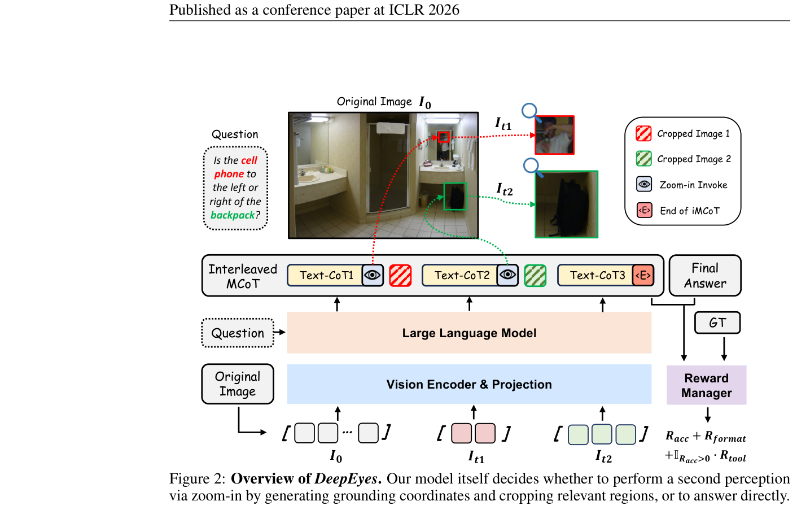

**Caption:** Figure 2: Overview of DeepEyes. Our model itself decides whether to perform a second perception via zoom-in by generating grounding coordinates and cropping relevant regions, or to answer directly.

**Caption[CN]:** 图 2：DeepEyes 概览。模型自行决定是生成定位坐标并裁剪相关区域、通过放大进行第二次感知，还是直接回答。

## 3 Method｜方法

### 3.1 DeepEyes

> <span style="color:#3B82F6"><strong>Para. 1:</strong></span> DeepEyes is a unified multimodal large language model that is capable of “thinking with images” through an iMCoT reasoning process. The ability is inherited from the model’s native capability of visual grounding and action decision planning, and further incentivized and enhanced via end-to-end RL training using outcome reward signals, eliminating the need for cold-start supervised fine-tuning.

> <span style="color:#F59E0B"><strong>Para. 1[CN]:</strong></span> DeepEyes 是统一的多模态大语言模型，能够通过 iMCoT 推理过程“用图像思考”。这项能力继承自模型原生的视觉定位与动作决策规划能力，并由采用结果奖励信号的端到端 RL 训练进一步激励和增强，因此无需冷启动监督微调。

> <span style="color:#3B82F6"><strong>Para. 2:</strong></span> As illustrated in Figure 2, given a user question and an image $I_0$ as input, DeepEyes can autonomously decide, after each textual CoT reasoning step, whether to generate an answer directly or perform an image zoom-in for further inspection. The zoom-in operation takes a list of bounding box coordinates as input and outputs the cropped images within the specified regions. The returned crops, such as $I_{t_1}$ and $I_{t_2}$, are appended to the ongoing trajectory, enabling the model to reason over all previous context. DeepEyes can perform active perception as many times as needed before concluding a final answer. This iterative interaction enables fine-grained perception, especially when the relevant object in the image is small, blurry, or difficult to recognize. During the RL training stage, the reward optimization policy gradient is applied to the entire trajectory, allowing all textual CoTs and action decision planning to be jointly optimized in an end-to-end manner.

> <span style="color:#F59E0B"><strong>Para. 2[CN]:</strong></span> 如图 2 所示，给定用户问题与输入图像 $I_0$，DeepEyes 能在每个文本 CoT 推理步骤之后自主决定：直接生成答案，还是放大图像以进一步检查。放大操作接收一组边界框坐标作为输入，并输出指定区域内的裁剪图像。返回的裁剪结果（如 $I_{t_1}$ 和 $I_{t_2}$）会被追加到正在展开的轨迹，使模型能够基于此前全部上下文进行推理。在给出最终答案之前，DeepEyes 可以按需多次执行主动感知。这种迭代交互实现了细粒度感知，尤其适合图像中相关物体细小、模糊或难以识别的情况。在 RL 训练阶段，奖励优化的策略梯度作用于整条轨迹，使所有文本 CoT 与动作决策规划都能以端到端方式联合优化。

> <span style="color:#3B82F6"><strong>Para. 3:</strong></span> Compared to previous works based on workflows or pure text reasoning, our iMCoT offers several significant advantages:
>
> 1. **Simplicity in Training.** Previous workflow-based methods (Wu & Xie, 2024; Li et al., 2025b) depend on substantial SFT data, which is challenging to acquire, while our iMCoT only requires question-answer pairs, reducing data collection complexity.
> 2. **Enhanced Generalizability.** Workflow-based models are constrained by their task-specific manual design, which hinders their generalization to other tasks. In contrast, our iMCoT exhibits robust generalization capabilities as it learns to dynamically select optimal reasoning processes across diverse tasks through reinforcement learning.
> 3. **Global Optimization.** Our iMCoT enables joint optimization through end-to-end training, which allows the system to be optimized towards a global optimum. In contrast, optimizing each component separately typically leads to sub-optimal performance.
> 4. **Multimodal Integration.** Compared to pure text-based thinking, our iMCoT naturally interleaves visual and textual information, combining visual elements with textual reasoning to achieve more accurate perceptual decision-making.
> 5. **Native Tool Calling.** We encapsulate the model’s native grounding capability as an internal tool to enable active perception, allowing implicit optimization that previous external-tool paradigms cannot achieve.

> <span style="color:#F59E0B"><strong>Para. 3[CN]:</strong></span> 与基于工作流或纯文本推理的既有工作相比，iMCoT 具有以下显著优势：
>
> 1. **训练简单。** 先前基于工作流的方法（Wu & Xie, 2024; Li et al., 2025b）依赖大量难以获取的 SFT 数据，而 iMCoT 只需要问答对，降低了数据收集复杂度。
> 2. **更强的泛化能力。** 基于工作流的模型受到任务特定人工设计的约束，难以泛化到其他任务。相比之下，iMCoT 通过强化学习，在不同任务中学习动态选择最优推理过程，因而表现出稳健的泛化能力。
> 3. **全局优化。** iMCoT 通过端到端训练实现联合优化，使系统能够朝全局最优方向优化；分别优化各个组件通常只会得到次优性能。
> 4. **多模态整合。** 相比纯文本思考，iMCoT 自然地交错视觉与文本信息，把视觉元素和文本推理结合起来，从而作出更准确的感知决策。
> 5. **原生工具调用。** 我们把模型原生的定位能力封装为内部工具以实现主动感知，从而允许隐式优化；这是先前外部工具范式无法做到的。

### 3.2 Agentic Reinforcement Learning｜智能体强化学习

> <span style="color:#3B82F6"><strong>Para. 4:</strong></span> **Rollout Formulation.** In traditional RL with text-only CoT, the Markov Decision Process (MDP) defines the state as the input prompt tokens together with all tokens generated by the model up to the current step. The action is defined as the next token in the sequence. In contrast, agentic RL extends this formulation by introducing observation tokens, which come from external function calls rather than the model itself. These observation tokens are appended to the ongoing rollout sequence and fed back into the model as input for the subsequent step. We formalize the MDP definition for iMCoT as follows. At each step $t$, the state $s_t$ of iMCoT is defined as:

> <span style="color:#F59E0B"><strong>Para. 4[CN]:</strong></span> **Rollout 形式化。** 在采用纯文本 CoT 的传统 RL 中，马尔可夫决策过程（MDP）把状态定义为输入提示 token 与模型截至当前步骤生成的所有 token，而动作则被定义为序列中的下一个 token。智能体 RL 在此基础上引入观察 token；这些 token 来自外部函数调用，而不是模型本身。观察 token 被追加到正在展开的 rollout 序列，并作为后续步骤的输入反馈给模型。我们对 iMCoT 的 MDP 定义作如下形式化。在每个步骤 $t$，iMCoT 的状态 $s_t$ 定义为：

$$
s_t=\{(X_0,I_0),(X_1,I_1),\ldots,(X_t,I_t)\}=\{X_{\le t};I_{\le t}\}. \tag{1}
$$

> <span style="color:#3B82F6"><strong>Para. 5:</strong></span> Here, $X_{\le t}=\{X_1,\ldots,X_t\}$ represents the accumulated sequence of text tokens before step $t$, and $I_{\le t}=\{I_1,\ldots,I_t\}$ represents the image observation tokens before step $t$. We omit other related special tokens that are not generated by VLM itself for simplicity. Given the state $s_t$, the action $a_t\sim\pi_\theta(a\mid s_t)$ is sampled from the VLM policy $\pi_\theta$, serving as the next input token. This iMCoT continues to interleave until either an answer is generated or the maximum number of active perceptions is reached. Note that text tokens $X_{\le t}$ and image tokens $I_{\le t}$ are interleaved in the states.

> <span style="color:#F59E0B"><strong>Para. 5[CN]:</strong></span> 其中，$X_{\le t}=\{X_1,\ldots,X_t\}$ 表示步骤 $t$ 之前累计的文本 token 序列，$I_{\le t}=\{I_1,\ldots,I_t\}$ 表示步骤 $t$ 之前的图像观察 token。为简洁起见，我们省略并非由 VLM 自身生成的其他相关特殊 token。给定状态 $s_t$，从 VLM 策略 $\pi_\theta$ 中采样动作 $a_t\sim\pi_\theta(a\mid s_t)$，作为下一个输入 token。iMCoT 会持续交错，直到生成答案或达到主动感知次数上限。需要注意的是，文本 token $X_{\le t}$ 与图像 token $I_{\le t}$ 在状态中相互交错。

> <span style="color:#3B82F6"><strong>Para. 6:</strong></span> **Reward Design.** In multimodal environments, sparse, outcome-driven rewards are essential for guiding vision-language models toward effective reasoning and decision-making. Because intermediate visual actions lack step-level supervision, we evaluate the entire reasoning trajectory based on the final outcome and the presence of meaningful active perception. The total reward consists of three parts: an accuracy reward $R_{\mathrm{acc}}$, a format reward $R_{\mathrm{format}}$, and a conditional bonus $R_{\mathrm{tool}}$. Accuracy measures whether the final answer is correct, while formatting penalizes poorly structured outputs. The conditional bonus is granted only when the answer is correct and at least one active perception step is triggered:

> <span style="color:#F59E0B"><strong>Para. 6[CN]:</strong></span> **奖励设计。** 在多模态环境中，稀疏、由结果驱动的奖励对引导视觉—语言模型进行有效推理与决策至关重要。由于中间视觉动作缺少步骤级监督，我们依据最终结果以及是否存在有意义的主动感知来评价整条推理轨迹。总奖励由三部分构成：准确率奖励 $R_{\mathrm{acc}}$、格式奖励 $R_{\mathrm{format}}$ 和条件性奖励 $R_{\mathrm{tool}}$。准确率衡量最终答案是否正确，格式奖励则惩罚结构不良的输出。只有答案正确且至少触发一次主动感知时，才会发放条件性奖励：

$$
R(\tau)=R_{\mathrm{acc}}(\tau)+R_{\mathrm{format}}(\tau)+\mathbb{I}_{R_{\mathrm{acc}}(\tau)>0}R_{\mathrm{tool}}(\tau). \tag{2}
$$

> <span style="color:#3B82F6"><strong>Para. 7:</strong></span> Here, $\mathbb{I}_{R_{\mathrm{acc}}(\tau)>0}$ equals 1 if the accuracy reward is positive. Conditioning this bonus on a correct answer promotes perception-aware reasoning while discouraging unnecessary actions (see Section 4.3).

> <span style="color:#F59E0B"><strong>Para. 7[CN]:</strong></span> 若准确率奖励为正，则 $\mathbb{I}_{R_{\mathrm{acc}}(\tau)>0}$ 等于 1。以答案正确为条件发放该奖励，既能促进感知导向型推理，也会抑制不必要的动作（见第 4.3 节）。

> <span style="color:#3B82F6"><strong>Para. 8:</strong></span> **Optimization.** We adopt Group Relative Policy Optimization (GRPO) (Shao et al., 2024b), which has been proven to be effective for diverse tasks. For multi-turn reasoning trajectories, we apply a token-wise loss mask to ignore loss on observation tokens not generated by the model.

> <span style="color:#F59E0B"><strong>Para. 8[CN]:</strong></span> **优化。** 我们采用已被证明对多种任务有效的组相对策略优化（GRPO）（Shao et al., 2024b）。对于多轮推理轨迹，我们逐 token 应用损失掩码，忽略并非由模型生成的观察 token 上的损失。

### 3.3 Training Data Curation｜训练数据整理

> <span style="color:#3B82F6"><strong>Para. 9:</strong></span> A key challenge in training our model via RL is ensuring initial sampling efficiency without an SFT cold start. To address this, we designed a data curation strategy to construct a corpus that is both diverse and specifically targeted to bootstrap effective active perception behavior from the outset.

> <span style="color:#F59E0B"><strong>Para. 9[CN]:</strong></span> 在不采用 SFT 冷启动的情况下通过 RL 训练模型，一项关键挑战是确保初始采样效率。为此，我们设计了一种数据整理策略，构建既多样、又专门面向从一开始就引导出有效主动感知行为的语料库。

> <span style="color:#3B82F6"><strong>Para. 10:</strong></span> **Data Collection.** To construct a robust training corpus, we combine three complementary sources targeting key capabilities: the $V^*$ training set (Wu & Xie, 2024) for fine-grained perception, chart data from ArxivQA (Li et al., 2024b) for task and image diversity, and the ThinkLite-VL (Wang et al., 2025b) dataset to strengthen challenging reasoning. This combination provides a multifaceted foundation for our iMCoT framework, with further details available in Appendix B.

> <span style="color:#F59E0B"><strong>Para. 10[CN]:</strong></span> **数据收集。** 为构建稳健的训练语料，我们组合了三个面向关键能力且相互补充的数据源：用于细粒度感知的 $V^*$ 训练集（Wu & Xie, 2024）、用于提升任务与图像多样性的 ArxivQA 图表数据（Li et al., 2024b），以及用于强化高难度推理的 ThinkLite-VL 数据集（Wang et al., 2025b）。这一组合为 iMCoT 框架提供了多方面基础；更多细节见附录 B。

> <span style="color:#3B82F6"><strong>Para. 11:</strong></span> **Data Selection.** We employ a multi-stage filtering pipeline to curate a dataset aimed at strengthening grounding-assisted visual reasoning. The process begins with difficulty curation, where we use Qwen2.5-VL-7B (Bai et al., 2025) to assess question difficulty, removing samples that are either too trivial (100% Acc.) or overly challenging (0% Acc.). Next, we standardize all questions into an open-ended format and perform data verification to eliminate incorrectly labeled samples. The final stage applies a perception-utility filter, retaining only samples solvable via active perception with ground-truth regions, thereby maximizing informational gain and boosting initial RL sampling efficiency without an SFT cold start. This last filter is applied only to the fine-grained perception data; chart and general reasoning data are preserved in their original, rigorously processed form. The resulting dataset is well-suited for training models with strong interleaved reasoning capabilities.

> <span style="color:#F59E0B"><strong>Para. 11[CN]:</strong></span> **数据选择。** 我们采用多阶段过滤管线来整理旨在强化视觉定位辅助推理的数据集。流程首先进行难度筛选：使用 Qwen2.5-VL-7B（Bai et al., 2025）评估问题难度，移除过于简单（准确率 100%）或过于困难（准确率 0%）的样本。接着，我们把所有问题标准化为开放式格式，并执行数据核验以剔除错误标注样本。最后应用感知效用过滤器，只保留能借助真值区域上的主动感知求解的样本，从而最大化信息增益，并在没有 SFT 冷启动时提高 RL 初始采样效率。最后这项过滤只应用于细粒度感知数据；图表数据与通用推理数据则保留其原始、严格处理后的形式。最终数据集非常适合训练具备强大交错推理能力的模型。

### Table 1. Results on High-Resolution Benchmarks｜高分辨率基准结果


**Caption:** Table 1: Results on High-Resolution Benchmarks. E2E indicates whether the model is end-to-end, requiring no manually defined workflow. $^*$ denotes reproduced results.

**Caption[CN]:** 表 1：高分辨率基准结果。E2E 表示模型是否为端到端，即不需要人工定义的工作流。$^*$ 表示复现结果。

| Model | E2E | Param Size | $V^*$ Attr | $V^*$ Spatial | $V^*$ Overall | HR-4K FSP | HR-4K FCP | HR-4K Overall | HR-8K FSP | HR-8K FCP | HR-8K Overall |
|---|:---:|---:|---:|---:|---:|---:|---:|---:|---:|---:|---:|
| GPT-4o (Achiam et al., 2023) | ✓ | – | – | – | 66.0 | 70.0 | 48.0 | 59.0 | 62.0 | 49.0 | 55.5 |
| o3 (OpenAI, 2025) | ✓ | – | – | – | 95.7 | – | – | – | – | – | – |
| SEAL (Wu & Xie, 2024) | ✗ | 7B | 74.8 | 76.3 | 75.4 | – | – | – | – | – | – |
| DyFo (Li et al., 2025b) | ✗ | 7B | 80.0 | 82.9 | 81.2 | – | – | – | – | – | – |
| ZoomEye (Shen et al., 2024a) | ✗ | 7B | 93.9 | 85.5 | 90.6 | 84.3 | 55.0 | 69.6 | 88.5 | 50.0 | 69.3 |
| LLaVA-OneVision (Li et al., 2024a) | ✓ | 7B | 75.7 | 75.0 | 75.4 | 72.0 | 54.0 | 63.0 | 67.3 | 52.3 | 59.8 |
| Qwen2.5-VL$^*$ (Bai et al., 2025) | ✓ | 7B | 73.9 | 67.1 | 71.2 | 85.2 | 52.2 | 68.8 | 78.8 | 51.8 | 65.3 |
| Pixel-Reasoner (Su et al., 2025) | ✓ | 7B | 83.5 | 76.3 | 80.6 | 86.0 | 60.3 | 72.9 | 80.0 | 54.3 | 66.9 |
| Qwen2.5-VL$^*$ (Bai et al., 2025) | ✓ | 32B | 87.8 | 88.1 | 87.9 | 89.8 | 58.0 | 73.9 | 84.5 | 56.3 | 70.4 |
| **DeepEyes** | ✓ | 7B | **91.3** | **88.2** | **90.1** | **91.3** | **59.0** | **75.1** | **86.8** | **58.5** | **72.6** |
| Δ (vs Qwen2.5-VL 7B) | – | – | +17.4 | +21.1 | +18.9 | +6.1 | +6.8 | +6.3 | +10.0 | +6.8 | +7.3 |

### Table 2. MME-RealWorld-Lite｜通用感知与推理结果

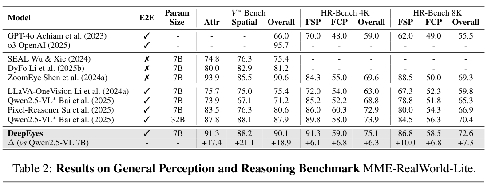

**Caption:** Table 2: Results on General Perception and Reasoning Benchmark MME-RealWorld-Lite.

**Caption[CN]:** 表 2：通用感知与推理基准 MME-RealWorld-Lite 的结果。

| Model | Param Size | Overall | Perception OCR | Perception RS | Perception DT | Perception MO | Perception AD | Reasoning OCR | Reasoning DT | Reasoning MO | Reasoning AD |
|---|---:|---:|---:|---:|---:|---:|---:|---:|---:|---:|---:|
| LLaVA-OneVision (Li et al., 2024a) | 7B | 43.7 | 80.0 | 40.0 | 56.0 | 31.7 | 39.4 | 65.0 | 33.0 | 38.0 | 32.0 |
| Qwen2.5-VL (Bai et al., 2025) | 7B | 42.3 | 87.6 | 32.7 | 83.0 | 27.3 | 30.0 | 72.0 | 62.0 | 28.7 | 23.0 |
| Qwen2.5-VL (Bai et al., 2025) | 32B | 45.6 | 87.2 | 40.7 | 83.0 | 29.5 | 40.7 | 74.0 | 60.0 | 27.3 | 29.5 |
| Pixel-Reasoner (Su et al., 2025) | 7B | 49.7 | 89.6 | 52.0 | 86.0 | 38.9 | 30.9 | 71.0 | 72.0 | 46.0 | 32.5 |
| **DeepEyes** | 7B | **53.2** | **90.0** | **52.7** | **89.0** | **43.3** | **33.4** | **76.0** | **69.0** | **44.0** | **35.0** |
| Δ (vs Qwen2.5-VL 7B) | – | +10.9 | +2.4 | +20.0 | +6.0 | +16.0 | +3.4 | +4.0 | +7.0 | +15.3 | +12.0 |

### Table 3. Grounding and Hallucination Benchmarks｜定位与幻觉基准

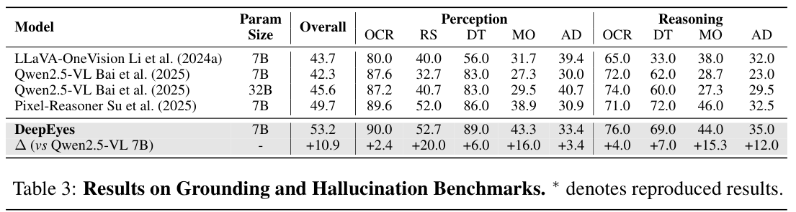

**Caption:** Table 3: Results on Grounding and Hallucination Benchmarks. $^*$ denotes reproduced results.

**Caption[CN]:** 表 3：定位与幻觉基准结果。$^*$ 表示复现结果。

| Model | Param Size | refCOCO | refCOCO+ | refCOCOg | ReasonSeg | POPE Adversarial | POPE Popular | POPE Random | POPE Overall |
|---|---:|---:|---:|---:|---:|---:|---:|---:|---:|
| LLaVA-OneVision (Li et al., 2024a) | 7B | – | – | – | – | – | – | – | 88.4 |
| Qwen2.5-VL (Bai et al., 2025) | 7B | 90.0 | 84.2 | 87.2 | – | – | – | – | – |
| Qwen2.5-VL$^*$ (Bai et al., 2025) | 7B | 89.1 | 82.6 | 86.1 | 68.3 | 85.9 | 86.5 | 87.2 | 85.9 |
| **DeepEyes** | 7B | **89.8** | **83.6** | **86.7** | **68.6** | 84.0 | **87.5** | **91.8** | **87.7** |
| Δ (vs Qwen2.5-VL 7B) | – | +0.7 | +1.0 | +0.6 | +0.3 | −1.9 | +1.0 | +4.6 | +1.8 |

### Table 4. Challenging Reasoning Benchmarks｜高难度推理基准


**Caption:** Table 4: Results on Challenging Reasoning Benchmarks. $^*$ denotes reproduced results, and $^\dagger$ denotes results taken from (Zhu et al., 2025).

**Caption[CN]:** 表 4：高难度推理基准结果。$^*$ 表示复现结果，$^\dagger$ 表示结果取自 Zhu et al. (2025)。

| Model | Param Size | MathVista | MathVerse | MathVision | WeMath | DynaMath | LogicVista |
|---|---:|---:|---:|---:|---:|---:|---:|
| LLaVA-OneVision (Li et al., 2024a) | 7B | 58.6$^\dagger$ | 19.3$^\dagger$ | 18.3$^\dagger$ | 20.9$^\dagger$ | – | 33.3$^\dagger$ |
| Qwen2.5-VL (Bai et al., 2025) | 7B | 68.2 | 49.2 | 25.1 | 35.2$^\dagger$ | – | 44.1$^\dagger$ |
| Qwen2.5-VL$^*$ (Bai et al., 2025) | 7B | 68.3 | 45.6 | 25.6 | 34.6 | 53.3 | 45.9 |
| **DeepEyes** | 7B | **70.1** | **47.3** | **26.6** | **38.9** | **55.0** | **47.7** |
| Δ (vs Qwen2.5-VL 7B) | – | +1.9 | +1.7 | +1.0 | +4.3 | +1.7 | +1.8 |

## 4 Experiment｜实验

### 4.1 Setups｜设置

> <span style="color:#3B82F6"><strong>Para. 1:</strong></span> **Baselines and Benchmarks.** To comprehensively assess the effectiveness of DeepEyes, we compare it against three categories of baselines: (1) advanced proprietary models, including OpenAI GPT-4o (Achiam et al., 2023) and o3 (OpenAI, 2025); (2) state-of-the-art open-source models, such as LLaVA-OneVision (Li et al., 2024a) and Qwen2.5-VL (Bai et al., 2025); and (3) approaches explicitly designed with workflows, such as SEAL (Wu & Xie, 2024), DyFo (Li et al., 2025b) and ZoomEye (Shen et al., 2024a). Since tasks requiring fine-grained visual understanding naturally highlight the strengths of iMCoT, we first evaluate DeepEyes on high-resolution benchmarks. Then, we assess DeepEyes on grounding and hallucination benchmarks to show improvements brought by iMCoT on general visual capabilities. We also adopt general reasoning benchmarks to verify its effectiveness.

> <span style="color:#F59E0B"><strong>Para. 1[CN]:</strong></span> **基线与基准。** 为全面评估 DeepEyes 的有效性，我们将其与三类基线比较：（1）先进闭源模型，包括 OpenAI GPT-4o（Achiam et al., 2023）与 o3（OpenAI, 2025）；（2）最先进的开源模型，如 LLaVA-OneVision（Li et al., 2024a）和 Qwen2.5-VL（Bai et al., 2025）；（3）明确采用工作流设计的方法，如 SEAL（Wu & Xie, 2024）、DyFo（Li et al., 2025b）和 ZoomEye（Shen et al., 2024a）。需要细粒度视觉理解的任务能够自然凸显 iMCoT 的优势，因此我们首先在高分辨率基准上评估 DeepEyes。随后，我们在定位与幻觉基准上评估 DeepEyes，以展示 iMCoT 对通用视觉能力的改善；同时也采用通用推理基准验证其有效性。

> <span style="color:#3B82F6"><strong>Para. 2:</strong></span> **Training Details.** We train Qwen2.5-VL-7B with GRPO for 80 iterations on H100 GPUs. Each batch samples 256 prompts, with 16 rollouts per prompt, up to a maximum of 6 times of active perceptions. We set the KL coefficient to 0.0 and define the maximum response length as 20480 tokens.

> <span style="color:#F59E0B"><strong>Para. 2[CN]:</strong></span> **训练细节。** 我们在 H100 GPU 上使用 GRPO 训练 Qwen2.5-VL-7B，共迭代 80 次。每个 batch 采样 256 个提示词，每个提示词执行 16 条 rollout，主动感知最多 6 次。KL 系数设为 0.0，最大响应长度设为 20480 token。

### 4.2 Main Results｜主要结果

> <span style="color:#3B82F6"><strong>Para. 3:</strong></span> **High-Resolution Benchmarks.** High-resolution benchmarks, such as $V^*$ (Wu & Xie, 2024) and HR-Bench (Wang et al., 2025a), contain very large images (2K–8K) with small target objects, making accurate localization challenging for VLMs. As shown in Table 1, our model significantly outperforms existing open-source methods, including complex pipelines (Wu & Xie, 2024; Li et al., 2025b; Shen et al., 2024a), achieving 18.9% and 7.3% gains over Qwen2.5-VL 7B on $V^*$ and HR-Bench 8K, respectively. This demonstrates that simple RL can effectively unlock high-resolution visual reasoning without elaborate pipelines.

> <span style="color:#F59E0B"><strong>Para. 3[CN]:</strong></span> **高分辨率基准。** $V^*$（Wu & Xie, 2024）与 HR-Bench（Wang et al., 2025a）等高分辨率基准包含具有细小目标物体的超大图像（2K–8K），因此 VLM 很难准确定位。如表 1 所示，我们的模型显著优于现有开源方法（包括复杂管线：Wu & Xie, 2024; Li et al., 2025b; Shen et al., 2024a），在 $V^*$ 和 HR-Bench 8K 上分别比 Qwen2.5-VL 7B 提高 18.9% 与 7.3%。这表明，无需精巧复杂的管线，简单的 RL 就能有效释放高分辨率视觉推理能力。

> <span style="color:#3B82F6"><strong>Para. 4:</strong></span> **General Perception and Reasoning Benchmark.** As shown in Table 2, our 7B model delivers top performance on MME-RealWorld-Lite (Zhang et al., 2024b). It surpasses both the 7B and even 32B versions of Qwen2.5-VL, demonstrating superior real-world perception and reasoning.

> <span style="color:#F59E0B"><strong>Para. 4[CN]:</strong></span> **通用感知与推理基准。** 如表 2 所示，我们的 7B 模型在 MME-RealWorld-Lite（Zhang et al., 2024b）上取得最佳性能。它不仅超过 7B Qwen2.5-VL，甚至超过其 32B 版本，展现出更优的现实世界感知与推理能力。

> <span style="color:#3B82F6"><strong>Para. 5:</strong></span> **Grounding and Hallucination Benchmarks.** Furthermore, the multimodal CoT enhances general visual capabilities. Evaluated on grounding (refCOCO/refCOCO+ (Caesar et al., 2018), refCOCOg (Kazemzadeh et al., 2014), ReasonSeg (Lai et al., 2024)) and hallucination (POPE (Li et al., 2023c)) benchmarks, our model achieves higher grounding accuracy and substantially reduces hallucinations (Table 3). This improvement stems from our model’s ability to focus on regions of interest during visual reasoning and analyze cropped areas in detail, enabling more confident verification of object presence. These results show that iMCoT not only boosts high-resolution perception but also enhances overall visual reliability with a more thorough verification mechanism.

> <span style="color:#F59E0B"><strong>Para. 5[CN]:</strong></span> **定位与幻觉基准。** 此外，多模态 CoT 还能增强通用视觉能力。在定位基准（refCOCO/refCOCO+（Caesar et al., 2018）、refCOCOg（Kazemzadeh et al., 2014）、ReasonSeg（Lai et al., 2024））与幻觉基准（POPE（Li et al., 2023c））上评估时，我们的模型取得更高的定位准确率并显著减少幻觉（表 3）。这项改善来自模型在视觉推理过程中聚焦感兴趣区域并细致分析裁剪区域的能力，使其能更有把握地核验物体是否存在。这些结果表明，iMCoT 不仅提升高分辨率感知，还借助更彻底的核验机制增强了整体视觉可靠性。

> <span style="color:#3B82F6"><strong>Para. 6:</strong></span> **Challenging Reasoning Benchmarks.** We further evaluate our model on MathVista (Lu et al., 2023), MathVerse (Zhang et al., 2024a), MathVision (Wang et al., 2024a), WeMath (Qiao et al., 2024), DynaMath (Zou et al., 2024), and LogicVista (Xiao et al., 2024) in Table 4. Benefiting from the integrated chain-of-thought mechanism, our model achieves consistent performance improvements across these challenging multimodal reasoning benchmarks, including mathematical problem-solving.

> <span style="color:#F59E0B"><strong>Para. 6[CN]:</strong></span> **高难度推理基准。** 表 4 进一步在 MathVista（Lu et al., 2023）、MathVerse（Zhang et al., 2024a）、MathVision（Wang et al., 2024a）、WeMath（Qiao et al., 2024）、DynaMath（Zou et al., 2024）和 LogicVista（Xiao et al., 2024）上评估模型。得益于整合式思维链机制，我们的模型在这些高难度多模态推理基准（包括数学问题求解）上均取得一致的性能提升。

### Figure 3. Training Dynamics of DeepEyes｜DeepEyes 训练动态


**Caption:** Figure 3: Training dynamics of DeepEyes on $V^*$. s1/2/3 represent different stages.

**Caption[CN]:** 图 3：DeepEyes 在 $V^*$ 上的训练动态。s1/2/3 表示不同阶段。

### 4.3 Key Findings: From Casual User to Proficient Visual Reasoner｜关键发现：从随意用户到熟练视觉推理者

> <span style="color:#3B82F6"><strong>Para. 7:</strong></span> **Training Dynamics.** To better understand the model’s behavior during end-to-end reinforcement learning, we analyze its performance on fine-grained data $V^*$. Since fine-grained data includes ground-truth bounding boxes closely aligned with target answers, we quantify the quality of the model’s visual grounding using Intersection-over-Union (IoU). In Figure 3, a clear evolution emerges in how the model leverages active perception. This progression unfolds in three stages, reflecting increasingly effective integration of active perception into reasoning:
>
> - **Stage 1: Initial Exploration (Steps 0–20).** The model starts following system prompts to access additional visual cues, but lacks a coherent strategy. Action count and response length rise, reflecting exploratory behavior, while low grounding IoU shows repeated attempts without successfully linking retrieved information to the visual context. A sharp drop in response length between steps 8 and 20 indicates it is streamlining descriptions while acquiring basic active perception skills.
> - **Stage 2: High-Frequency Engagement (Steps 20–45).** The model enters a phase of intensive active perception, repeatedly leveraging visual information to boost accuracy and reward. Key metrics, including grounding IoU, improve, while longer responses and frequent visual interactions suggest a “broad sweep” strategy: the model externalizes reasoning by over-querying the environment. This stage reflects growing recognition of active perception’s value, though efficiency remains suboptimal.
> - **Stage 3: Efficient Utilization (Steps 45–80).** The model adopts a more selective, precise approach, reducing query frequency and response length while maintaining high grounding and task accuracy. This reveals a compact visual-linguistic policy: active perception is invoked only when needed, complementing internal reasoning. High IoU with fewer queries reflects implicit planning, as the model narrows the visual scope internally before selectively confirming hypotheses.

> <span style="color:#F59E0B"><strong>Para. 7[CN]:</strong></span> **训练动态。** 为更好地理解端到端强化学习期间的模型行为，我们分析其在细粒度数据 $V^*$ 上的表现。细粒度数据包含与目标答案紧密对应的真值边界框，因此我们使用交并比（IoU）量化模型视觉定位的质量。图 3 清晰展示了模型利用主动感知的演化过程。该过程分为三个阶段，反映出主动感知被越来越有效地整合进推理：
>
> - **阶段 1：初始探索（步骤 0–20）。** 模型开始遵循系统提示来取得额外视觉线索，但尚无连贯策略。动作数量与响应长度上升，反映出探索行为；较低的定位 IoU 表明模型反复尝试，却无法成功把取回的信息与视觉上下文联系起来。步骤 8 到 20 之间响应长度急剧下降，说明模型在学习基本主动感知技能的同时，正精简其描述。
> - **阶段 2：高频使用（步骤 20–45）。** 模型进入密集主动感知阶段，反复利用视觉信息提升准确率与奖励。包括定位 IoU 在内的关键指标改善，而更长的响应和频繁的视觉交互表明其采用“广泛扫视”策略：模型通过过度查询环境把推理外显化。该阶段反映模型逐渐认识到主动感知的价值，但效率仍然次优。
> - **阶段 3：高效利用（步骤 45–80）。** 模型采用更有选择、更精准的方法，降低查询频率与响应长度，同时保持较高的定位准确率和任务准确率。这揭示出一种紧凑的视觉—语言策略：只在必要时调用主动感知，以补充内部推理。更少查询下的高 IoU 反映出隐式规划——模型先在内部缩小视觉范围，再有选择地确认假设。

> <span style="color:#3B82F6"><strong>Para. 8:</strong></span> Overall, training progresses from broad exploration to targeted exploitation, showing that the model can learn to integrate active perception into reasoning effectively. The ability to leverage active perception strategically co-evolves with its policy, highlighting the potential of perception-augmented visual-language models for scalable and interpretable multimodal reasoning.

> <span style="color:#F59E0B"><strong>Para. 8[CN]:</strong></span> 总体而言，训练从广泛探索推进到有针对性的利用，表明模型能够学会把主动感知有效整合进推理。策略性利用主动感知的能力与模型策略共同演化，凸显了感知增强型视觉—语言模型在可扩展、可解释多模态推理上的潜力。

### Figure 4. Training Dynamics w.r.t. Tool Reward｜工具奖励下的训练动态

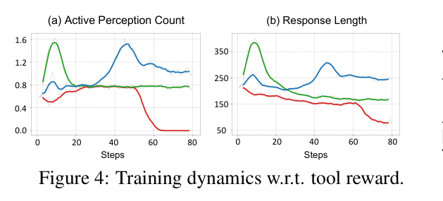

**Caption:** Figure 4: Training dynamics w.r.t. tool reward.

**Caption[CN]:** 图 4：关于工具奖励的训练动态。

### Table 5. Evaluations w.r.t. Tool Reward｜工具奖励评估


**Caption:** Table 5: Evaluations w.r.t. tool reward.

**Caption[CN]:** 表 5：关于工具奖励的评估。

| Method | $V^*$ | HR-4K | HR-8K |
|---|---:|---:|---:|
| w/o Tool Reward | 87.4 | 53.4 | 55.4 |
| Unconditional Reward | 87.4 | 72.1 | 71.8 |
| **Conditional Reward** | **90.1** | **75.1** | **72.6** |

### Table 6. Scaling Model Size｜模型规模扩展

**Caption:** Table 6: Scaling Model Size. The 32B model is trained with the same data. Resp. Len.: Average Response Length. IoU is measured on $V^*$.

**Caption[CN]:** 表 6：扩展模型规模。32B 模型使用相同数据训练。Resp. Len. 表示平均响应长度；IoU 在 $V^*$ 上测量。

| Model | $V^*$ | WeMath | Resp. Len. | IoU |
|---|---:|---:|---:|---:|
| Qwen2.5-VL-7B | 71.2 | 34.6 | 212 | – |
| DeepEyes-7B | 90.1 | 38.9 | 241 | 0.37 |
| Qwen2.5-VL-32B | 87.9 | 47.7 | 314 | – |
| DeepEyes-32B | 93.3 | 55.9 | 754 | 0.53 |

### Table 7. Scaling Challenging Reasoning Data｜扩展高难度推理数据

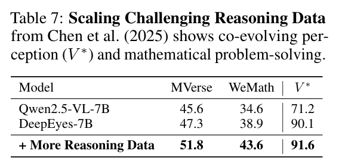

**Caption:** Table 7: Scaling Challenging Reasoning Data from Chen et al. (2025) shows co-evolving perception ($V^*$) and mathematical problem-solving.

**Caption[CN]:** 表 7：扩展来自 Chen et al. (2025) 的高难度推理数据，显示感知（$V^*$）与数学问题求解能力共同演化。

| Model | MVerse | WeMath | $V^*$ |
|---|---:|---:|---:|
| Qwen2.5-VL-7B | 45.6 | 34.6 | 71.2 |
| DeepEyes-7B | 47.3 | 38.9 | 90.1 |
| + More Reasoning Data | 51.8 | 43.6 | 91.6 |

### Table 8. Zero-Shot Tool Generalization｜工具零样本泛化


**Caption:** Table 8: Zero-Shot Tool Generalization. HR-OCR-Rot: Random rotated subsets of HR-Bench-8K for OCR tasks.

**Caption[CN]:** 表 8：工具零样本泛化。HR-OCR-Rot 是 HR-Bench-8K 中 OCR 任务经随机旋转得到的子集。

| Model | $V^*$ | HR-OCR-Rot |
|---|---:|---:|
| Qwen2.5-VL-7B | 71.2 | 76.5 |
| DeepEyes (crop) | 90.1 | 80.1 |
| DeepEyes (crop+rotate) | 90.1 | 83.6 |

### Table 9. Ablation on iMCoT｜iMCoT 消融


**Caption:** Table 9: Ablation on iMCoT. We provide results trained with text-only CoT on the same datasets.

**Caption[CN]:** 表 9：iMCoT 消融。表中给出在相同数据集上使用纯文本 CoT 训练的结果。

| Model | $V^*$ | HR-4K | HR-8K |
|---|---:|---:|---:|
| Qwen2.5-VL-7B | 71.2 | 68.8 | 65.3 |
| RL w. Text-only CoT | 88.5 | 75.4 | 60.8 |
| **DeepEyes (iMCoT)** | **90.1** | **75.1** | **72.6** |

> <span style="color:#3B82F6"><strong>Para. 9:</strong></span> **Tool Reward.** The reward in Eq. 2 includes a conditional component (tool reward) that grants a bonus only when the model answers correctly while performing active perceptions. For comparison, we train two variants: one without the conditional bonus (w/o tool reward) and one with an unconditional bonus (unconditional reward). Results are shown in Figure 4 and Table 5. Without the conditional reward, the model quickly reduces and stops performing perception actions. With an unconditional bonus, minimal engagement persists but remains static. Conditioning the reward on correctness leads to gradually increased active perceptions and more informative responses, reflecting deeper integration of visual reasoning. This setting achieves the highest accuracy, showing that rewarding actions alone are insufficient; alignment with correct outcomes is essential in DeepEyes.

> <span style="color:#F59E0B"><strong>Para. 9[CN]:</strong></span> **工具奖励。** 式（2）的奖励包含一个条件组件（工具奖励）：只有模型在执行主动感知的同时正确作答，才会获得奖励。作为比较，我们训练两个变体：一个不使用条件奖励（w/o tool reward），另一个使用无条件奖励（unconditional reward）。结果见图 4 与表 5。没有条件奖励时，模型会迅速减少并最终停止执行感知动作；使用无条件奖励时，最低限度的工具使用会持续存在，但保持静态不变。以正确性为条件的奖励会使主动感知逐渐增加、响应包含更多信息，反映出视觉推理得到更深入的整合。该设置取得最高准确率，说明仅仅奖励动作本身并不足够；在 DeepEyes 中，动作必须与正确结果对齐。

> <span style="color:#3B82F6"><strong>Para. 10:</strong></span> **Thinking Patterns.** Here, we analyze diverse thinking patterns that emerged during end-to-end RL training, showing how the model performs active perceptions into its reasoning in ways that mirror human visual cognition. Four primary patterns can be identified:
>
> 1. **Visual Search:** When facing complex problems that a single observation can’t solve, the model actively scans different image regions, gathers visual clues, and reasons through them to reach reliable conclusions (Figure 7).
> 2. **Visual Comparison:** When handling understanding across multiple images or objects, the model iteratively zooms in on each one, allowing close examination and comparison before drawing a final conclusion (Figure 8).
> 3. **Visual Confirmation:** In some cases, the model begins with uncertainty but gradually builds confidence by zooming in on image details to gather evidence and resolve doubts (Figure 9).
> 4. **Hallucination Mitigation:** Although VLMs can sometimes hallucinate, performing active perceptions helps the model focus on visual details to mitigate hallucination (Figure 10).

> <span style="color:#F59E0B"><strong>Para. 10[CN]:</strong></span> **思考模式。** 这里，我们分析端到端 RL 训练期间涌现的多种思考模式，展示模型如何以模拟人类视觉认知的方式把主动感知纳入推理。可识别出四种主要模式：
>
> 1. **视觉搜索：** 面对单次观察无法解决的复杂问题时，模型主动扫描不同图像区域，收集视觉线索，并基于这些线索推理以得出可靠结论（图 7）。
> 2. **视觉比较：** 在理解多幅图像或多个物体时，模型迭代放大每个对象，先进行近距离检查和比较，再得出最终结论（图 8）。
> 3. **视觉确认：** 在某些情况下，模型起初不确定，但会通过放大图像细节收集证据、消除疑问，逐渐建立信心（图 9）。
> 4. **幻觉缓解：** 尽管 VLM 有时会产生幻觉，执行主动感知能帮助模型聚焦视觉细节，从而缓解幻觉（图 10）。

### Figure 5. Analysis of Hallucination Mitigation｜幻觉缓解分析


**Caption:** Figure 5: Analysis of hallucination mitigation. Qwen2.5-VL-7B (top) hallucinates “rocks,” driven by linguistic association with “beach” rather than visual evidence, yielding low relevancy. In contrast, DeepEyes (bottom) triggers iMCoT to counter this bias, zooming in to re-ground reasoning and override the language prior, correctly identifying the “clock” with a focused relevancy heatmap.

**Caption[CN]:** 图 5：幻觉缓解分析。Qwen2.5-VL-7B（上）受“beach”的语言关联而非视觉证据驱动，幻觉出“rocks”，相关性较低。相比之下，DeepEyes（下）触发 iMCoT 对抗该偏差，通过放大重新把推理落到视觉证据上并覆盖语言先验，正确识别出“clock”；其相关性热图也更加聚焦。

**Searchable source transcript:**

```text
Describe this image in detail.

Qwen2.5-VL-7B:
The image shows a person walking on a sandy beach. The individual is wearing a
gray hoodie, blue jeans, and sandals. They are holding a wooden box with a glass
top, which appears to contain some items, possibly shells or rocks. The
background features the ocean with waves gently rolling onto the shore, ……

DeepEyes:
The image depicts a person strolling along a sandy shoreline beside the ocean.
The person …… carrying a rectangular clock in their right hand ……
Now I will zoom in for a closer view to check whether the person is holding the
clock. {“bbox_2d”: [443, 450, 750, 652], "label": "clock"}
The zoomed-in image now shows the clock holding by the man …
<answer> The image depicts a man walking on a beach carrying a
clock, with waves and sand in the background. </answer>
```

### 4.4 Analysis and Ablation Study｜分析与消融研究

> <span style="color:#3B82F6"><strong>Para. 11:</strong></span> **Scaling Model Size.** Our framework exhibits strong scalability, as evidenced in Table 6. When scaling from 7B to 32B parameters, DeepEyes consistently widens its performance gap over the Qwen2.5-VL baseline. More importantly, the larger model demonstrates more sophisticated emergent behaviors. It generates substantially longer reasoning chains (Resp. Len.) and achieves higher grounding precision (IoU). This indicates that our RL paradigm not only boosts task performance but also fosters deeper and more accurate reasoning as model capacity increases.

> <span style="color:#F59E0B"><strong>Para. 11[CN]:</strong></span> **扩展模型规模。** 如表 6 所示，我们的框架具有很强的可扩展性。从 7B 扩展到 32B 参数时，DeepEyes 相对 Qwen2.5-VL 基线的性能差距持续扩大。更重要的是，更大的模型表现出更复杂的涌现行为：它生成显著更长的推理链（Resp. Len.），并取得更高的定位精度（IoU）。这说明，随着模型容量增加，我们的 RL 范式不仅提升任务性能，也会促进更深入、更准确的推理。

> <span style="color:#3B82F6"><strong>Para. 12:</strong></span> **Scaling Challenging Reasoning Data.** As shown in Table 7, scaling our training set with more challenging reasoning data (from 23% to 42%) demonstrates a mutual reinforcement between perception and reasoning, improving performance on both mathematical benchmarks and the perception task $V^*$ as well. We hypothesize that stronger abstract reasoning enables a more sophisticated understanding of complex queries, which in turn guides a more effective visual-grounded thinking process.

> <span style="color:#F59E0B"><strong>Para. 12[CN]:</strong></span> **扩展高难度推理数据。** 如表 7 所示，使用更多高难度推理数据扩展训练集（占比从 23% 提高到 42%）时，感知与推理相互增强，数学基准和感知任务 $V^*$ 的性能均得到提升。我们推测，更强的抽象推理能力使模型能更深入地理解复杂查询，进而引导更有效的视觉落地思考过程。

> <span style="color:#3B82F6"><strong>Para. 13:</strong></span> **Zero-Shot Tool Generalization.** The primary goal of DeepEyes is to explore how models can natively “think with images,” using cropping as a simple, foundational tool. Although not aimed at building a large toolset, the framework is easily extensible. To verify this, we introduced a rotate tool solely through the system prompt, requiring no retraining or architectural changes. We evaluated it on HR-OCR-Rot, a benchmark we created by applying random rotations ($0^\circ$, $90^\circ$, $180^\circ$, $270^\circ$) to the HRBench-8K OCR subset. As shown in Table 8, the tool yielded a 3.5% performance gain on this task while maintaining stable results on the general $V^*$ benchmark, demonstrating that DeepEyes can seamlessly integrate new tools and apply them selectively for zero-shot generalization.

> <span style="color:#F59E0B"><strong>Para. 13[CN]:</strong></span> **工具零样本泛化。** DeepEyes 的主要目标，是探索模型如何以裁剪这种简单的基础工具原生地“用图像思考”。尽管框架并非旨在构建庞大工具集，但它很容易扩展。为验证这一点，我们仅通过系统提示引入旋转工具，无需重新训练或改变架构。我们在 HR-OCR-Rot 上评估该工具；这一基准由 HRBench-8K OCR 子集随机旋转（$0^\circ$、$90^\circ$、$180^\circ$、$270^\circ$）构成。如表 8 所示，该工具在这项任务上带来 3.5% 的性能增益，同时在通用 $V^*$ 基准上保持稳定，说明 DeepEyes 能无缝整合新工具并有选择地应用它们，实现零样本泛化。

> <span style="color:#3B82F6"><strong>Para. 14:</strong></span> **Ablation on iMCoT.** Finally, the ablation in Table 9 isolates the contribution of our core iMCoT mechanism. Compared to an RL baseline trained with a text-only CoT, iMCoT achieves superior performance across all benchmarks. The advantage is most pronounced on the ultra-high-resolution HR-8K benchmark, where iMCoT outperforms the text-only approach by a substantial margin. This result decisively demonstrates that for tasks requiring fine-grained visual detail, interleaving visual perception with textual reasoning is not merely beneficial, but essential for robust performance.

> <span style="color:#F59E0B"><strong>Para. 14[CN]:</strong></span> **iMCoT 消融。** 最后，表 9 的消融隔离出核心 iMCoT 机制的贡献。与使用纯文本 CoT 训练的 RL 基线相比，iMCoT 在所有基准上表现更优。在超高分辨率 HR-8K 基准上，这一优势最为明显，iMCoT 以较大幅度超过纯文本方法。该结果明确表明：对需要细粒度视觉细节的任务而言，把视觉感知与文本推理交错起来不只是有益，而是获得稳健性能所必不可少的。

### 4.5 Case Study: How Does DeepEyes Systematically Mitigate Hallucination?｜案例研究：DeepEyes 如何系统性缓解幻觉？

> <span style="color:#3B82F6"><strong>Para. 15:</strong></span> Object hallucination in VLMs often stems from a strong language bias (Zhou et al., 2024), where text generation detaches from the visual input to rely on learned linguistic patterns. Our “thinking with images” paradigm directly counters this. By triggering active perception, the model is forced to re-engage with visual evidence, effectively fact-checking its linguistic assumptions against visual reality.

> <span style="color:#F59E0B"><strong>Para. 15[CN]:</strong></span> VLM 的物体幻觉往往源自强烈的语言偏差（Zhou et al., 2024）：文本生成脱离视觉输入，转而依赖学到的语言模式。我们的“用图像思考”范式直接对抗这一问题。主动感知一旦触发，模型就不得不重新接触视觉证据，相当于以视觉现实对语言假设进行事实核查。

> <span style="color:#3B82F6"><strong>Para. 16:</strong></span> To analyze this mechanism, we compute relevancy maps (Ben Melech Stan et al., 2024) to quantify the grounding of the model’s output, which measures the contribution of all preceding tokens to the generation of a specific source token. Visualized via heatmaps, high relevancy attributed to image regions indicates strong visual grounding, whereas high relevancy from purely textual priors suggests a language-driven hallucination. As illustrated in Figure 5, this approach proves effective. While a baseline model succumbs to linguistic bias, DeepEyes leverages active perception to re-evaluate its initial assumptions based on new visual evidence. This process breaks ungrounded reasoning, overriding the language prior and correcting the hallucination, as confirmed by our relevancy analysis.

> <span style="color:#F59E0B"><strong>Para. 16[CN]:</strong></span> 为分析该机制，我们计算相关性图（Ben Melech Stan et al., 2024）来量化模型输出的落地程度；该图衡量此前所有 token 对某个特定源 token 生成的贡献。以热图可视化时，归因于图像区域的高相关性表示强视觉落地，而来自纯文本先验的高相关性则意味着语言驱动的幻觉。如图 5 所示，这种方法确实有效：基线模型屈从于语言偏差，而 DeepEyes 利用主动感知，依据新的视觉证据重新评估初始假设。该过程打断未落地的推理、覆盖语言先验并纠正幻觉；相关性分析也验证了这一点。

## 5 Conclusion｜结论

> <span style="color:#3B82F6"><strong>Para. 1:</strong></span> In this paper, we presented DeepEyes, a vision-language model that learns to “think with images” via end-to-end reinforcement learning. Unlike prior methods, this capability emerges natively, requiring neither pre-collected reasoning data for SFT nor external specialized models. To guide its reasoning behavior, we propose an active perception mechanism, featuring tailored data selection and rewards, that promotes successful reasoning trajectories by incentivizing the strategic use of visual grounding. Consequently, DeepEyes achieves competitive results on multiple benchmarks, exhibiting diverse, human-like reasoning patterns such as visual search and comparison.

> <span style="color:#F59E0B"><strong>Para. 1[CN]:</strong></span> 本文提出 DeepEyes：一种通过端到端强化学习学会“用图像思考”的视觉—语言模型。不同于先前方法，这项能力原生涌现，既不需要为 SFT 预先收集推理数据，也不需要外部专用模型。为引导其推理行为，我们提出包含定制数据选择与奖励的主动感知机制，通过激励模型策略性使用视觉定位，促进成功的推理轨迹。因此，DeepEyes 在多项基准上取得有竞争力的结果，并表现出视觉搜索、视觉比较等多样、类人的推理模式。

## LLM Usage Statement｜LLM 使用声明

> <span style="color:#3B82F6"><strong>Para. 1:</strong></span> LLMs were used solely for grammar and language polishing; all ideas, analyses, and writing were produced entirely by the authors.

> <span style="color:#F59E0B"><strong>Para. 1[CN]:</strong></span> LLM 仅用于语法与语言润色；所有思想、分析与写作均完全由作者完成。

## Reproducibility Statement｜可复现性声明

> <span style="color:#3B82F6"><strong>Para. 1:</strong></span> Code is available at https://github.com/Visual-Agent/DeepEyes. It includes comprehensive setup instructions, training scripts, and documentation to facilitate easy reproduction of our experiments.

> <span style="color:#F59E0B"><strong>Para. 1[CN]:</strong></span> 代码见 https://github.com/Visual-Agent/DeepEyes，其中包含全面的环境设置说明、训练脚本与文档，以便复现实验。

## References｜参考文献

> <span style="color:#3B82F6"><strong>Para. 1:</strong></span> **Bilingual reference policy.** To preserve exact author names, titles, venues, years, page ranges, URLs, and arXiv identifiers in searchable bibliographic form, the reference entries below remain in the paper’s original English rather than being translated entry by entry.

> <span style="color:#F59E0B"><strong>Para. 1[CN]:</strong></span> **双语参考文献策略。** 为完整保留作者姓名、题名、发表场所、年份、页码范围、URL 与 arXiv 标识符，并确保书目信息可检索，以下条目保持论文原始英文形式，不逐条翻译。

1. Josh Achiam, Steven Adler, Sandhini Agarwal, Lama Ahmad, Ilge Akkaya, Florencia Leoni Aleman, Diogo Almeida, Janko Altenschmidt, Sam Altman, Shyamal Anadkat, et al. Gpt-4 technical report. arXiv preprint arXiv:2303.08774, 2023.
2. Jean-Baptiste Alayrac, Jeff Donahue, Pauline Luc, Antoine Miech, Iain Barr, Yana Hasson, Karel Lenc, Arthur Mensch, Katherine Millican, Malcolm Reynolds, et al. Flamingo: a visual language model for few-shot learning. Advances in neural information processing systems, 35:23716–23736, 2022.
3. Jinze Bai, Shuai Bai, Yunfei Chu, Zeyu Cui, Kai Dang, Xiaodong Deng, Yang Fan, Wenbin Ge, Yu Han, Fei Huang, et al. Qwen technical report. arXiv preprint arXiv:2309.16609, 2023.
4. Shuai Bai, Keqin Chen, Xuejing Liu, Jialin Wang, Wenbin Ge, Sibo Song, Kai Dang, Peng Wang, Shijie Wang, Jun Tang, et al. Qwen2.5-vl technical report. arXiv preprint arXiv:2502.13923, 2025.
5. Gabriela Ben Melech Stan, Estelle Aflalo, Raanan Yehezkel Rohekar, Anahita Bhiwandiwalla, Shao-Yen Tseng, Matthew Lyle Olson, Yaniv Gurwicz, Chenfei Wu, Nan Duan, and Vasudev Lal. Lvlm-interpret: An interpretability tool for large vision-language models. In CVPR, pp. 8182–8187, 2024.
6. Mahtab Bigverdi, Zelun Luo, Cheng-Yu Hsieh, Ethan Shen, Dongping Chen, Linda G Shapiro, and Ranjay Krishna. Perception tokens enhance visual reasoning in multimodal language models. arXiv preprint arXiv:2412.03548, 2024.
7. Holger Caesar, Jasper Uijlings, and Vittorio Ferrari. Coco-stuff: Thing and stuff classes in context. In Proceedings of the IEEE conference on computer vision and pattern recognition, pp. 1209–1218, 2018.
8. Kezhen Chen, Rahul Thapa, Rahul Chalamala, Ben Athiwaratkun, Shuaiwen Leon Song, and James Zou. Dragonfly: Multi-resolution zoom supercharges large visual-language model. arXiv e-prints, pp. arXiv–2406, 2024a.
9. Shuang Chen, Yue Guo, Zhaochen Su, Yafu Li, Yulun Wu, Jiacheng Chen, Jiayu Chen, Weijie Wang, Xiaoye Qu, and Yu Cheng. Advancing multimodal reasoning: From optimized cold start to staged reinforcement learning. arXiv preprint arXiv:2506.04207, 2025.
10. Zhe Chen, Weiyun Wang, Yue Cao, Yangzhou Liu, Zhangwei Gao, Erfei Cui, Jinguo Zhu, Shenglong Ye, Hao Tian, Zhaoyang Liu, et al. Expanding performance boundaries of open-source multimodal models with model, data, and test-time scaling. arXiv preprint arXiv:2412.05271, 2024b.
11. Zhe Chen, Jiannan Wu, Wenhai Wang, Weijie Su, Guo Chen, Sen Xing, Muyan Zhong, Qinglong Zhang, Xizhou Zhu, Lewei Lu, et al. Internvl: Scaling up vision foundation models and aligning for generic visual-linguistic tasks. In Proceedings of the IEEE/CVF conference on computer vision and pattern recognition, pp. 24185–24198, 2024c.
12. Xingyu Fu, Minqian Liu, Zhengyuan Yang, John Corring, Yijuan Lu, Jianwei Yang, Dan Roth, Dinei Florencio, and Cha Zhang. Refocus: Visual editing as a chain of thought for structured image understanding. arXiv preprint arXiv:2501.05452, 2025.
13. Zhangwei Gao, Zhe Chen, Erfei Cui, Yiming Ren, Weiyun Wang, Jinguo Zhu, Hao Tian, Shenglong Ye, Junjun He, Xizhou Zhu, et al. Mini-internvl: a flexible-transfer pocket multi-modal model with 5% parameters and 90% performance. Visual Intelligence, 2(1):1–17, 2024.
14. Daya Guo, Dejian Yang, Haowei Zhang, Junxiao Song, Ruoyu Zhang, Runxin Xu, Qihao Zhu, Shirong Ma, Peiyi Wang, Xiao Bi, et al. Deepseek-r1: Incentivizing reasoning capability in llms via reinforcement learning. arXiv preprint arXiv:2501.12948, 2025a.
15. Dong Guo, Faming Wu, Feida Zhu, Fuxing Leng, Guang Shi, Haobin Chen, Haoqi Fan, Jian Wang, Jianyu Jiang, Jiawei Wang, et al. Seed1.5-vl technical report. arXiv preprint arXiv:2505.07062, 2025b.
16. Zonghao Guo, Ruyi Xu, Yuan Yao, Junbo Cui, Zanlin Ni, Chunjiang Ge, Tat-Seng Chua, Zhiyuan Liu, and Gao Huang. Llava-uhd: an lmm perceiving any aspect ratio and high-resolution images. In European Conference on Computer Vision, pp. 390–406. Springer, 2024.
17. Liqi He, Zuchao Li, Xiantao Cai, and Ping Wang. Multi-modal latent space learning for chain-of-thought reasoning in language models. In Proceedings of the AAAI Conference on Artificial Intelligence, volume 38, pp. 18180–18187, 2024.
18. Sahar Kazemzadeh, Vicente Ordonez, Mark Matten, and Tamara Berg. Referitgame: Referring to objects in photographs of natural scenes. In Proceedings of the 2014 conference on empirical methods in natural language processing (EMNLP), pp. 787–798, 2014.
19. Xin Lai, Zhuotao Tian, Yukang Chen, Yanwei Li, Yuhui Yuan, Shu Liu, and Jiaya Jia. Lisa: Reasoning segmentation via large language model. In Proceedings of the IEEE/CVF Conference on Computer Vision and Pattern Recognition, pp. 9579–9589, 2024.
20. Bo Li, Yuanhan Zhang, Dong Guo, Renrui Zhang, Feng Li, Hao Zhang, Kaichen Zhang, Peiyuan Zhang, Yanwei Li, Ziwei Liu, et al. Llava-onevision: Easy visual task transfer. arXiv preprint arXiv:2408.03326, 2024a.
21. Chengzu Li, Wenshan Wu, Huanyu Zhang, Yan Xia, Shaoguang Mao, Li Dong, Ivan Vulić, and Furu Wei. Imagine while reasoning in space: Multimodal visualization-of-thought. arXiv preprint arXiv:2501.07542, 2025a.
22. Chunyuan Li, Cliff Wong, Sheng Zhang, Naoto Usuyama, Haotian Liu, Jianwei Yang, Tristan Naumann, Hoifung Poon, and Jianfeng Gao. Llava-med: Training a large language-and-vision assistant for biomedicine in one day. Advances in Neural Information Processing Systems, 36:28541–28564, 2023a.
23. Geng Li, Jinglin Xu, Yunzhen Zhao, and Yuxin Peng. Dyfo: A training-free dynamic focus visual search for enhancing lmms in fine-grained visual understanding. arXiv preprint arXiv:2504.14920, 2025b.
24. Junnan Li, Dongxu Li, Silvio Savarese, and Steven Hoi. Blip-2: Bootstrapping language-image pre-training with frozen image encoders and large language models. In International conference on machine learning, pp. 19730–19742. PMLR, 2023b.
25. Lei Li, Yuqi Wang, Runxin Xu, Peiyi Wang, Xiachong Feng, Lingpeng Kong, and Qi Liu. Multimodal arxiv: A dataset for improving scientific comprehension of large vision-language models. In Proceedings of the 62nd Annual Meeting of the Association for Computational Linguistics (Volume 1: Long Papers), pp. 14369–14387, 2024b.
26. Yifan Li, Yifan Du, Kun Zhou, Jinpeng Wang, Wayne Xin Zhao, and Ji-Rong Wen. Evaluating object hallucination in large vision-language models. arXiv preprint arXiv:2305.10355, 2023c.
27. Yunxin Li, Shenyuan Jiang, Baotian Hu, Longyue Wang, Wanqi Zhong, Wenhan Luo, Lin Ma, and Min Zhang. Uni-moe: Scaling unified multimodal llms with mixture of experts. IEEE Transactions on Pattern Analysis and Machine Intelligence, 2025c.
28. Bin Lin, Yang Ye, Bin Zhu, Jiaxi Cui, Munan Ning, Peng Jin, and Li Yuan. Video-llava: Learning united visual representation by alignment before projection. arXiv preprint arXiv:2311.10122, 2023.
29. Tsung-Yi Lin, Michael Maire, Serge Belongie, James Hays, Pietro Perona, Deva Ramanan, Piotr Dollár, and C Lawrence Zitnick. Microsoft coco: Common objects in context. In Computer vision–ECCV 2014: 13th European conference, zurich, Switzerland, September 6-12, 2014, proceedings, part v 13, pp. 740–755. Springer, 2014.
30. Haotian Liu, Chunyuan Li, Yuheng Li, and Yong Jae Lee. Improved baselines with visual instruction tuning, 2023a.
31. Haotian Liu, Chunyuan Li, Qingyang Wu, and Yong Jae Lee. Visual instruction tuning. In NeurIPS, 2023b.
32. Haotian Liu, Chunyuan Li, Yuheng Li, Bo Li, Yuanhan Zhang, Sheng Shen, and Yong Jae Lee. Llavanext: Improved reasoning, ocr, and world knowledge, 2024a.
33. Shilong Liu, Hao Cheng, Haotian Liu, Hao Zhang, Feng Li, Tianhe Ren, Xueyan Zou, Jianwei Yang, Hang Su, Jun Zhu, et al. Llava-plus: Learning to use tools for creating multimodal agents. In European Conference on Computer Vision, pp. 126–142. Springer, 2024b.
34. Yuqi Liu, Bohao Peng, Zhisheng Zhong, Zihao Yue, Fanbin Lu, Bei Yu, and Jiaya Jia. Seg-zero: Reasoning-chain guided segmentation via cognitive reinforcement. arXiv preprint arXiv:2503.06520, 2025a.
35. Ziyu Liu, Zeyi Sun, Yuhang Zang, Xiaoyi Dong, Yuhang Cao, Haodong Duan, Dahua Lin, and Jiaqi Wang. Visual-rft: Visual reinforcement fine-tuning. arXiv preprint arXiv:2503.01785, 2025b.
36. Zuyan Liu, Yuhao Dong, Yongming Rao, Jie Zhou, and Jiwen Lu. Chain-of-spot: Interactive reasoning improves large vision-language models. arXiv preprint arXiv:2403.12966, 2024c.
37. Dongchen Lu, Yuyao Sun, Zilu Zhang, Leping Huang, Jianliang Zeng, Mao Shu, and Huo Cao. Internvl-x: Advancing and accelerating internvl series with efficient visual token compression. arXiv preprint arXiv:2503.21307, 2025.
38. Pan Lu, Hritik Bansal, Tony Xia, Jiacheng Liu, Chunyuan Li, Hannaneh Hajishirzi, Hao Cheng, Kai-Wei Chang, Michel Galley, and Jianfeng Gao. Mathvista: Evaluating mathematical reasoning of foundation models in visual contexts. arXiv preprint arXiv:2310.02255, 2023.
39. Xuewen Luo, Fan Ding, Yinsheng Song, Xiaofeng Zhang, and Junnyong Loo. Pkrd-cot: A unified chain-of-thought prompting for multi-modal large language models in autonomous driving. arXiv preprint arXiv:2412.02025, 2024.
40. Fanqing Meng, Lingxiao Du, Zongkai Liu, Zhixiang Zhou, Quanfeng Lu, Daocheng Fu, Tiancheng Han, Botian Shi, Wenhai Wang, Junjun He, et al. Mm-eureka: Exploring the frontiers of multimodal reasoning with rule-based reinforcement learning. arXiv preprint arXiv:2503.07365, 2025.
41. Debjyoti Mondal, Suraj Modi, Subhadarshi Panda, Rituraj Singh, and Godawari Sudhakar Rao. Kam-cot: Knowledge augmented multimodal chain-of-thoughts reasoning. In Proceedings of the AAAI conference on artificial intelligence, volume 38, pp. 18798–18806, 2024.
42. Niklas Muennighoff, Zitong Yang, Weijia Shi, Xiang Lisa Li, Li Fei-Fei, Hannaneh Hajishirzi, Luke Zettlemoyer, Percy Liang, Emmanuel Candès, and Tatsunori Hashimoto. s1: Simple test-time scaling. arXiv preprint arXiv:2501.19393, 2025.
43. Jiri Najemnik and Wilson S Geisler. Optimal eye movement strategies in visual search. Nature, 434 (7031):387–391, 2005.
44. OpenAI. Thinking with images. https://openai.com/index/thinking-with-images/, 2025.
45. Yingzhe Peng, Gongrui Zhang, Miaosen Zhang, Zhiyuan You, Jie Liu, Qipeng Zhu, Kai Yang, Xingzhong Xu, Xin Geng, and Xu Yang. Lmm-r1: Empowering 3b lmms with strong reasoning abilities through two-stage rule-based rl. arXiv preprint arXiv:2503.07536, 2025.
46. Runqi Qiao, Qiuna Tan, Guanting Dong, Minhui Wu, Chong Sun, Xiaoshuai Song, Zhuoma GongQue, Shanglin Lei, Zhe Wei, Miaoxuan Zhang, et al. We-math: Does your large multimodal model achieve human-like mathematical reasoning? arXiv preprint arXiv:2407.01284, 2024.
47. Stéphane Ross, Geoffrey Gordon, and Drew Bagnell. A reduction of imitation learning and structured prediction to no-regret online learning. In Proceedings of the fourteenth international conference on artificial intelligence and statistics, pp. 627–635. JMLR Workshop and Conference Proceedings, 2011.
48. Hao Shao, Shengju Qian, Han Xiao, Guanglu Song, Zhuofan Zong, Letian Wang, Yu Liu, and Hongsheng Li. Visual cot: Advancing multi-modal language models with a comprehensive dataset and benchmark for chain-of-thought reasoning. Advances in Neural Information Processing Systems, 37:8612–8642, 2024a.
49. Zhihong Shao, Peiyi Wang, Qihao Zhu, Runxin Xu, Junxiao Song, Xiao Bi, Haowei Zhang, Mingchuan Zhang, Y. K. Li, Y. Wu, and Daya Guo. Deepseekmath: Pushing the limits of mathematical reasoning in open language models, 2024b. URL https://arxiv.org/abs/2402.03300.
50. Haozhan Shen, Kangjia Zhao, Tiancheng Zhao, Ruochen Xu, Zilun Zhang, Mingwei Zhu, and Jianwei Yin. Zoomeye: Enhancing multimodal llms with human-like zooming capabilities through tree-based image exploration. arXiv preprint arXiv:2411.16044, 2024a.
51. Haozhan Shen, Peng Liu, Jingcheng Li, Chunxin Fang, Yibo Ma, Jiajia Liao, Qiaoli Shen, Zilun Zhang, Kangjia Zhao, Qianqian Zhang, et al. Vlm-r1: A stable and generalizable r1-style large vision-language model. arXiv preprint arXiv:2504.07615, 2025.
52. Leyang Shen, Gongwei Chen, Rui Shao, Weili Guan, and Liqiang Nie. Mome: Mixture of multimodal experts for generalist multimodal large language models. arXiv preprint arXiv:2407.12709, 2024b.
53. Fangxun Shu, Yue Liao, Le Zhuo, Chenning Xu, Lei Zhang, Guanghao Zhang, Haonan Shi, Long Chen, Tao Zhong, Wanggui He, et al. Llava-mod: Making llava tiny via moe knowledge distillation. arXiv preprint arXiv:2408.15881, 2024.
54. Alex Su, Haozhe Wang, Weiming Ren, Fangzhen Lin, and Wenhu Chen. Pixel reasoner: Incentivizing pixel-space reasoning with curiosity-driven reinforcement learning. arXiv preprint arXiv:2505.15966, 2025.
55. Guangyan Sun, Mingyu Jin, Zhenting Wang, Cheng-Long Wang, Siqi Ma, Qifan Wang, Tong Geng, Ying Nian Wu, Yongfeng Zhang, and Dongfang Liu. Visual agents as fast and slow thinkers. arXiv preprint arXiv:2408.08862, 2024.
56. Kimi Team, Angang Du, Bofei Gao, Bowei Xing, Changjiu Jiang, Cheng Chen, Cheng Li, Chenjun Xiao, Chenzhuang Du, Chonghua Liao, et al. Kimi k1.5: Scaling reinforcement learning with llms. arXiv preprint arXiv:2501.12599, 2025a.
57. Kimi Team, Angang Du, Bohong Yin, Bowei Xing, Bowen Qu, Bowen Wang, Cheng Chen, Chenlin Zhang, Chenzhuang Du, Chu Wei, et al. Kimi-vl technical report. arXiv preprint arXiv:2504.07491, 2025b.
58. Ke Wang, Junting Pan, Weikang Shi, Zimu Lu, Houxing Ren, Aojun Zhou, Mingjie Zhan, and Hongsheng Li. Measuring multimodal mathematical reasoning with math-vision dataset. Advances in Neural Information Processing Systems, 37:95095–95169, 2024a.
59. Peng Wang, Shuai Bai, Sinan Tan, Shijie Wang, Zhihao Fan, Jinze Bai, Keqin Chen, Xuejing Liu, Jialin Wang, Wenbin Ge, et al. Qwen2-vl: Enhancing vision-language model’s perception of the world at any resolution. arXiv preprint arXiv:2409.12191, 2024b.
60. Wenbin Wang, Liang Ding, Minyan Zeng, Xiabin Zhou, Li Shen, Yong Luo, Wei Yu, and Dacheng Tao. Divide, conquer and combine: A training-free framework for high-resolution image perception in multimodal large language models. In Proceedings of the AAAI Conference on Artificial Intelligence, volume 39, pp. 7907–7915, 2025a.
61. Xiyao Wang, Zhengyuan Yang, Chao Feng, Hongjin Lu, Linjie Li, Chung-Ching Lin, Kevin Lin, Furong Huang, and Lijuan Wang. Sota with less: Mcts-guided sample selection for data-efficient visual reasoning self-improvement. arXiv preprint arXiv:2504.07934, 2025b.
62. Yana Wei, Liang Zhao, Kangheng Lin, En Yu, Yuang Peng, Runpei Dong, Jianjian Sun, Haoran Wei, Zheng Ge, Xiangyu Zhang, et al. Perception in reflection. arXiv preprint arXiv:2504.07165, 2025.
63. Penghao Wu and Saining Xie. V*: Guided visual search as a core mechanism in multimodal llms. In Proceedings of the IEEE/CVF Conference on Computer Vision and Pattern Recognition, pp. 13084–13094, 2024.
64. Yijia Xiao, Edward Sun, Tianyu Liu, and Wei Wang. Logicvista: Multimodal llm logical reasoning benchmark in visual contexts. arXiv preprint arXiv:2407.04973, 2024.
65. Jinheng Xie, Weijia Mao, Zechen Bai, David Junhao Zhang, Weihao Wang, Kevin Qinghong Lin, Yuchao Gu, Zhijie Chen, Zhenheng Yang, and Mike Zheng Shou. Show-o: One single transformer to unify multimodal understanding and generation. arXiv preprint arXiv:2408.12528, 2024.
66. Chenkai Xu, Xu Wang, Zhenyi Liao, Yishun Li, Tianqi Hou, and Zhijie Deng. Show-o turbo: Towards accelerated unified multimodal understanding and generation. arXiv preprint arXiv:2502.05415, 2025.
67. An Yang, Baosong Yang, Beichen Zhang, Binyuan Hui, Bo Zheng, Bowen Yu, Chengyuan Li, Dayiheng Liu, Fei Huang, Haoran Wei, et al. Qwen2.5 technical report. arXiv preprint arXiv:2412.15115, 2024.
68. Zhengyuan Yang, Linjie Li, Kevin Lin, Jianfeng Wang, Chung-Ching Lin, Zicheng Liu, and Lijuan Wang. The dawn of lmms: Preliminary explorations with gpt-4v (ision). arXiv preprint arXiv:2309.17421, 9(1):1, 2023.
69. Jiabo Ye, Haiyang Xu, Haowei Liu, Anwen Hu, Ming Yan, Qi Qian, Ji Zhang, Fei Huang, and Jingren Zhou. mplug-owl3: Towards long image-sequence understanding in multi-modal large language models. arXiv preprint arXiv:2408.04840, 2024a.
70. Qinghao Ye, Haiyang Xu, Guohai Xu, Jiabo Ye, Ming Yan, Yiyang Zhou, Junyang Wang, Anwen Hu, Pengcheng Shi, Yaya Shi, et al. mplug-owl: Modularization empowers large language models with multimodality. arXiv preprint arXiv:2304.14178, 2023.
71. Qinghao Ye, Haiyang Xu, Jiabo Ye, Ming Yan, Anwen Hu, Haowei Liu, Qi Qian, Ji Zhang, and Fei Huang. mplug-owl2: Revolutionizing multi-modal large language model with modality collaboration. In Proceedings of the ieee/cvf conference on computer vision and pattern recognition, pp. 13040–13051, 2024b.
72. Qiyuan Zhang, Fuyuan Lyu, Zexu Sun, Lei Wang, Weixu Zhang, Zhihan Guo, Yufei Wang, Irwin King, Xue Liu, and Chen Ma. What, how, where, and how well? a survey on test-time scaling in large language models. arXiv preprint arXiv:2503.24235, 2025a.
73. Renrui Zhang, Dongzhi Jiang, Yichi Zhang, Haokun Lin, Ziyu Guo, Pengshuo Qiu, Aojun Zhou, Pan Lu, Kai-Wei Chang, Yu Qiao, et al. Mathverse: Does your multi-modal llm truly see the diagrams in visual math problems? In European Conference on Computer Vision, pp. 169–186. Springer, 2024a.
74. Shaolei Zhang, Qingkai Fang, Zhe Yang, and Yang Feng. Llava-mini: Efficient image and video large multimodal models with one vision token. arXiv preprint arXiv:2501.03895, 2025b.
75. Yi-Fan Zhang, Huanyu Zhang, Haochen Tian, Chaoyou Fu, Shuangqing Zhang, Junfei Wu, Feng Li, Kun Wang, Qingsong Wen, Zhang Zhang, et al. Mme-realworld: Could your multimodal llm challenge high-resolution real-world scenarios that are difficult for humans? arXiv preprint arXiv:2408.13257, 2024b.
76. Baining Zhao, Jianjie Fang, Zichao Dai, Ziyou Wang, Jirong Zha, Weichen Zhang, Chen Gao, Yue Wang, Jinqiang Cui, Xinlei Chen, et al. Urbanvideo-bench: Benchmarking vision-language models on embodied intelligence with video data in urban spaces. In Proceedings of the 63rd Annual Meeting of the Association for Computational Linguistics (Volume 1: Long Papers), pp. 32400–32423, 2025a.
77. Baining Zhao, Ziyou Wang, Jianjie Fang, Chen Gao, Fanhang Man, Jinqiang Cui, Xin Wang, Xinlei Chen, Yong Li, and Wenwu Zhu. Embodied-r: Collaborative framework for activating embodied spatial reasoning in foundation models via reinforcement learning. In Proceedings of the 33rd ACM International Conference on Multimedia, pp. 11071–11080, 2025b.
78. Hengguang Zhou, Xirui Li, Ruochen Wang, Minhao Cheng, Tianyi Zhou, and Cho-Jui Hsieh. R1-zero’s “aha moment” in visual reasoning on a 2b non-sft model. arXiv preprint arXiv:2503.05132, 2025.
79. Yiyang Zhou, Chenhang Cui, Jaehong Yoon, Linjun Zhang, Zhun Deng, Chelsea Finn, Mohit Bansal, and Huaxiu Yao. Analyzing and mitigating object hallucination in large vision-language models. In ICLR, 2024.
80. Jinguo Zhu, Weiyun Wang, Zhe Chen, Zhaoyang Liu, Shenglong Ye, Lixin Gu, Yuchen Duan, Hao Tian, Weijie Su, Jie Shao, et al. Internvl3: Exploring advanced training and test-time recipes for open-source multimodal models. arXiv preprint arXiv:2504.10479, 2025.
81. Chengke Zou, Xingang Guo, Rui Yang, Junyu Zhang, Bin Hu, and Huan Zhang. Dynamath: A dynamic visual benchmark for evaluating mathematical reasoning robustness of vision language models. arXiv preprint arXiv:2411.00836, 2024.

## Appendix A. Prompt｜附录 A：提示词

### A.1 System Prompt｜系统提示词

> <span style="color:#3B82F6"><strong>Para. 1:</strong></span> The following `SYSTEM_PROMPT` is reproduced as an exact operational literal. Identifiers, JSON keys, XML tags, placeholders, punctuation, and required response forms are therefore retained in English.

> <span style="color:#F59E0B"><strong>Para. 1[CN]:</strong></span> 下列 `SYSTEM_PROMPT` 按可执行原样文本复现。因此，标识符、JSON 键、XML 标签、占位符、标点及规定的响应格式均保留英文原文，不在代码块内翻译。

```text
SYSTEM_PROMPT

You are a helpful assistant.

# Tools
You may call one or more functions to assist with the user query.
You are provided with function signatures within <tools></tools> XML tags:
<tools>
{
  "type": "function",
  "function": {
    "name": "image_zoom_in_tool",
    "description": "Zoom in on a specific region of an image by cropping it based on a bounding box (bbox) and an optional object label.",
    "parameters": {
      "type": "object",
      "properties": {
        "bbox_2d": {
          "type": "array",
          "items": {
            "type": "number"
          },
          "minItems": 4,
          "maxItems": 4,
          "description": "The bounding box of the region to zoom in, as [x1, y1, x2, y2], where (x1, y1) is the top-left corner and (x2, y2) is the bottom-right corner."
        },
        "label": {
          "type": "string",
          "description": "The name or label of the object in the specified bounding box (optional)."
        }
      },
      "required": [
        "bbox_2d"
      ]
    }
  }
}
</tools>

# How to call a tool
Return a json object with function name and arguments within <tool_call></tool_call> XML tags:
<tool_call>
{"name": <function-name>, "arguments": <args-json-object>}
</tool_call>

**Example**:
<tool_call>
{"name": "image_zoom_in_tool", "arguments": {"bbox_2d": [10, 20, 100, 200], "label": "the apple on the desk"}}
</tool_call>
```

> <span style="color:#3B82F6"><strong>Para. 2:</strong></span> The system tells the model that it may call one or more functions. It exposes `image_zoom_in_tool`, whose required `bbox_2d` argument contains exactly four numbers in the order `[x1, y1, x2, y2]`; the optional `label` is a string. A call must be returned as a JSON object inside exact `<tool_call>...</tool_call>` tags.

> <span style="color:#F59E0B"><strong>Para. 2[CN]:</strong></span> 系统告知模型可以调用一个或多个函数，并公开 `image_zoom_in_tool`。其必填参数 `bbox_2d` 必须按 `[x1, y1, x2, y2]` 的顺序包含恰好四个数字；可选参数 `label` 为字符串。工具调用必须以 JSON 对象形式置于精确的 `<tool_call>...</tool_call>` 标签内返回。

### A.2 User Prompt｜用户提示词

> <span style="color:#3B82F6"><strong>Para. 3:</strong></span> The following `USER_PROMPT` is likewise preserved exactly; `{}` is the question placeholder, and the output tags and their order are mandatory.

> <span style="color:#F59E0B"><strong>Para. 3[CN]:</strong></span> 下列 `USER_PROMPT` 同样原样保留；`{}` 是问题占位符，输出标签及其顺序为强制格式。

```text
USER_PROMPT

Question: {}

Think first, call **image_zoom_in_tool** if needed, then answer.
Format strictly as: <think>...</think>
<tool_call>...</tool_call> (if tools needed)
<answer>...</answer>
```

## Appendix B. Training Data｜附录 B：训练数据

### B.1 Data Distribution｜数据分布

> <span style="color:#3B82F6"><strong>Para. 1:</strong></span> As shown in Figure 6, our training corpus is constructed from three distinct sources, each contributing a unique focus:
>
> - **Visual Search (47%, 22k samples):** To support the model’s visual grounding and fine-grained perception capabilities, we leverage the $V^*$ dataset (Wu & Xie, 2024), which is derived from COCO2017 (Lin et al., 2014). This collection emphasizes natural image understanding, where accurate responses require identifying subtle visual cues and object-level distinctions.
> - **ArxivQA (30%, 14k samples):** To diversify the visual input types, we incorporate the ArxivQA dataset (Li et al., 2024b), which features scientific plots, diagrams, and schematic charts. These samples introduce structured visual semantics beyond natural scenes, enabling the model to better interpret abstract and symbolic visual representations.
> - **ThinkLite-VL (23%, 11k samples):** While the above datasets cover visual understanding and diagram comprehension, they are limited in reasoning variety. To address this, we include multimodal question answering examples from ThinkLite-VL (Wang et al., 2025b), focusing on tasks such as arithmetic reasoning, commonsense inference, and problem solving. This addition is intended to improve general reasoning robustness and mitigate modality-specific overfitting.

> <span style="color:#F59E0B"><strong>Para. 1[CN]:</strong></span> 如图 6 所示，训练语料由三个不同来源构成，每个来源各有独特侧重点：
>
> - **视觉搜索（47%，22k 个样本）：** 为支持模型的视觉定位与细粒度感知能力，我们使用源自 COCO2017（Lin et al., 2014）的 $V^*$ 数据集（Wu & Xie, 2024）。该数据集强调自然图像理解；准确作答需要识别细微的视觉线索与物体级差异。
> - **ArxivQA（30%，14k 个样本）：** 为增加视觉输入类型的多样性，我们引入 ArxivQA 数据集（Li et al., 2024b），其中包含科学绘图、图示和示意图。这些样本带来超出自然场景的结构化视觉语义，使模型能更好地解释抽象、符号化视觉表示。
> - **ThinkLite-VL（23%，11k 个样本）：** 上述数据集涵盖视觉理解与图示理解，但推理类型仍然有限。为此，我们加入 ThinkLite-VL（Wang et al., 2025b）的多模态问答样本，聚焦算术推理、常识推断与问题求解等任务，旨在提高通用推理的稳健性并缓解模态特定的过拟合。

### Figure 6. Distribution of Training Data｜训练数据分布

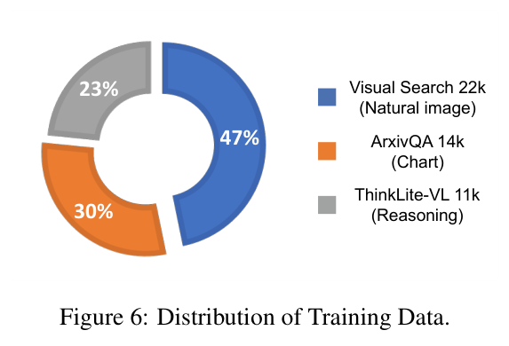

**Caption:** Figure 6: Distribution of Training Data. Visual Search: 47%, 22k (Natural image); ArxivQA: 30%, 14k (Chart); ThinkLite-VL: 23%, 11k (Reasoning).

**Caption[CN]:** 图 6：训练数据分布。Visual Search 占 47%、22k（自然图像）；ArxivQA 占 30%、14k（图表）；ThinkLite-VL 占 23%、11k（推理）。

### B.2 Impact of Training Data｜训练数据的影响

> <span style="color:#3B82F6"><strong>Para. 2:</strong></span> Table 10 reveals the critical role of training data composition. While unfiltered data (#1) offers minimal benefit, our curated, fine-grained data (#2) substantially boosts high-resolution image handling. However, this specialization induces catastrophic forgetting of reasoning skills. We address this by incorporating reasoning data (#3), which preserves mathematical abilities without sacrificing perception gains. To further enhance the model’s cognitive range, we introduce chart data (#4), which adds visual diversity and fosters complex relational reasoning. The results confirm a clear synergy: high-resolution data for perception, reasoning data for cognitive retention, and chart data for relational complexity. Consequently, our final dataset (#5) combines these complementary sources to comprehensively activate the model’s visual reasoning capabilities.

> <span style="color:#F59E0B"><strong>Para. 2[CN]:</strong></span> 表 10 揭示了训练数据构成的关键作用。未过滤数据（#1）几乎没有带来收益，而我们整理后的细粒度数据（#2）显著提升了高分辨率图像处理能力。不过，这种专门化会导致推理技能的灾难性遗忘。我们通过加入推理数据（#3）解决该问题，在不牺牲感知增益的同时保留数学能力。为进一步拓展模型的认知范围，我们又加入图表数据（#4），增加视觉多样性并促进复杂关系推理。结果证实三者存在明确协同：高分辨率数据用于感知，推理数据用于保持认知能力，图表数据用于增加关系复杂度。因此，最终数据集（#5）组合这些互补来源，全面激活模型的视觉推理能力。

### Table 10. Impact of Training Data｜训练数据的影响

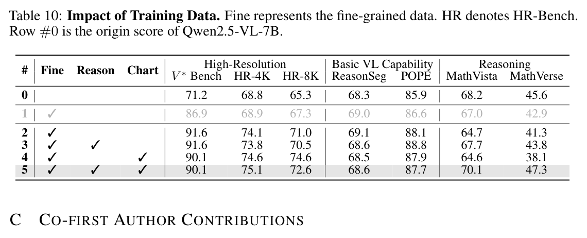

**Caption:** Table 10: Impact of Training Data. Fine represents the fine-grained data. HR denotes HR-Bench. Row #0 is the origin score of Qwen2.5-VL-7B.

**Caption[CN]:** 表 10：训练数据的影响。Fine 表示细粒度数据，HR 表示 HR-Bench。第 #0 行是 Qwen2.5-VL-7B 的原始分数。

| # | Fine | Reason | Chart | $V^*$ Bench | HR-4K | HR-8K | ReasonSeg | POPE | MathVista | MathVerse |
|---:|:---:|:---:|:---:|---:|---:|---:|---:|---:|---:|---:|
| 0 |  |  |  | 71.2 | 68.8 | 65.3 | 68.3 | 85.9 | 68.2 | 45.6 |
| 1 | ✓ |  |  | 86.9 | 68.9 | 67.3 | 69.0 | 86.6 | 67.0 | 42.9 |
| 2 | ✓ |  |  | 91.6 | 74.1 | 71.0 | 69.1 | 88.1 | 64.7 | 41.3 |
| 3 | ✓ | ✓ |  | 91.6 | 73.8 | 70.5 | 68.6 | 88.8 | 67.7 | 43.8 |
| 4 | ✓ |  | ✓ | 90.1 | 74.6 | 74.6 | 68.5 | 87.9 | 64.6 | 38.1 |
| 5 | ✓ | ✓ | ✓ | 90.1 | 75.1 | 72.6 | 68.6 | 87.7 | 70.1 | 47.3 |

## Appendix C. Co-first Author Contributions｜附录 C：共同第一作者贡献

> <span style="color:#3B82F6"><strong>Para. 1:</strong></span>
>
> - **Chenxiao:** Conducted early-stage exploration, contributed the main coding, and conducted the experiments.
> - **Jack:** Conducted early-stage exploration and performed evaluation.
> - **Michael:** Contributed codebase, and conducted the experiments and analysis.
> - **Ziwei:** Performed data curation, completed the main manuscript writing, and conducted analysis.

> <span style="color:#F59E0B"><strong>Para. 1[CN]:</strong></span>
>
> - **Chenxiao：** 开展早期探索，贡献主要代码，并进行实验。
> - **Jack：** 开展早期探索并执行评估。
> - **Michael：** 贡献代码库，并开展实验与分析。
> - **Ziwei：** 执行数据整理，完成论文主体写作，并开展分析。

## Appendix D. More Cases｜附录 D：更多案例

### D.1 Successful Cases｜成功案例

#### Visual Search｜视觉搜索

### Figure 7. Thinking Pattern: Visual Search｜思考模式：视觉搜索

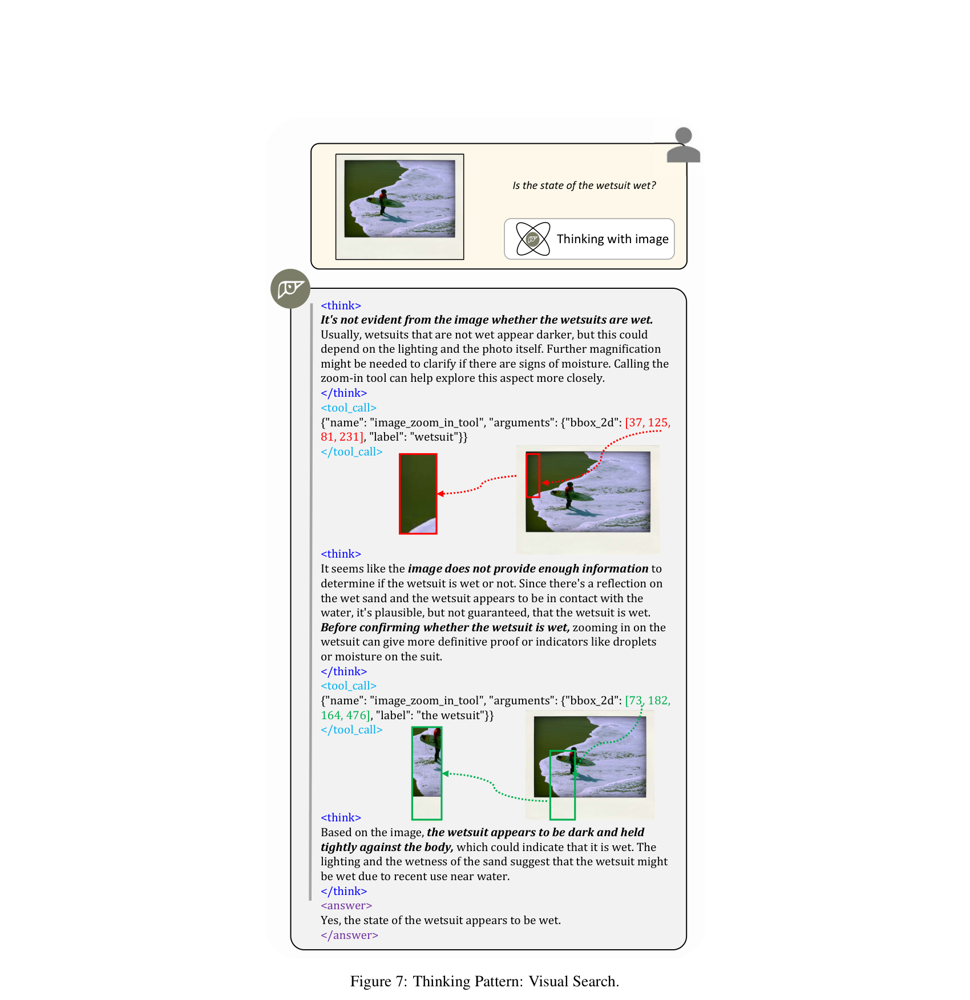

**Caption:** Figure 7: Thinking Pattern: Visual Search.

**Caption[CN]:** 图 7：思考模式——视觉搜索。

**Exact prompt/output transcript:**

```text
Is the state of the wetsuit wet?

<think>
It's not evident from the image whether the wetsuits are wet.
Usually, wetsuits that are not wet appear darker, but this could
depend on the lighting and the photo itself. Further magnification
might be needed to clarify if there are signs of moisture. Calling the
zoom-in tool can help explore this aspect more closely.
</think>
<tool_call>
{"name": "image_zoom_in_tool", "arguments": {"bbox_2d": [37, 125,
81, 231], "label": "wetsuit"}}
</tool_call>

<think>
It seems like the image does not provide enough information to
determine if the wetsuit is wet or not. Since there's a reflection on
the wet sand and the wetsuit appears to be in contact with the
water, it's plausible, but not guaranteed, that the wetsuit is wet.
Before confirming whether the wetsuit is wet, zooming in on the
wetsuit can give more definitive proof or indicators like droplets
or moisture on the suit.
</think>
<tool_call>
{"name": "image_zoom_in_tool", "arguments": {"bbox_2d": [73, 182,
164, 476], "label": "the wetsuit"}}
</tool_call>

<think>
Based on the image, the wetsuit appears to be dark and held
tightly against the body, which could indicate that it is wet. The
lighting and the wetness of the sand suggest that the wetsuit might
be wet due to recent use near water.
</think>
<answer>
Yes, the state of the wetsuit appears to be wet.
</answer>
```

> <span style="color:#3B82F6"><strong>Para. 1:</strong></span> After an initial observation of the whole image, the model recognized that the current visual information alone was insufficient to determine whether it was wet, and acknowledged that factors such as lighting could cause misleading cues. It was therefore decided that a more detailed inspection was necessary. During the first tool invocation, grounding was inaccurate, and the cropped image failed to provide some clues. The model then conducted a second grounding step, this time actively focusing on the area surrounding the wetsuit in an attempt to locate more direct indicators—such as water droplets or visible signs of wetness. It also incorporated contextual cues from the surrounding environment, such as reflections on wet sand and the wetsuit’s contact with water. Ultimately, by combining zoomed-in visual details—such as the wetsuit’s dark coloration and how it clung to the body—with indirect environmental evidence, the model concluded that the wetsuit appeared to be wet.

> <span style="color:#F59E0B"><strong>Para. 1[CN]:</strong></span> 初次观察完整图像后，模型意识到现有视觉信息不足以判断潜水服是否湿润，并承认光照等因素可能产生误导线索，因此决定进行更细致的检查。第一次调用工具时，视觉定位不准确，裁剪图像未能提供有效线索。随后模型进行第二次定位，这次主动聚焦潜水服周围区域，尝试寻找水滴或明显湿润痕迹等更直接的指标。它还纳入周围环境的上下文线索，例如湿沙上的反光以及潜水服与水接触。最终，模型把放大后的视觉细节——潜水服颜色较深、贴紧身体——与间接环境证据结合起来，得出潜水服似乎是湿的。

#### Visual Comparison｜视觉比较

### Figure 8. Thinking Pattern: Visual Comparison｜思考模式：视觉比较

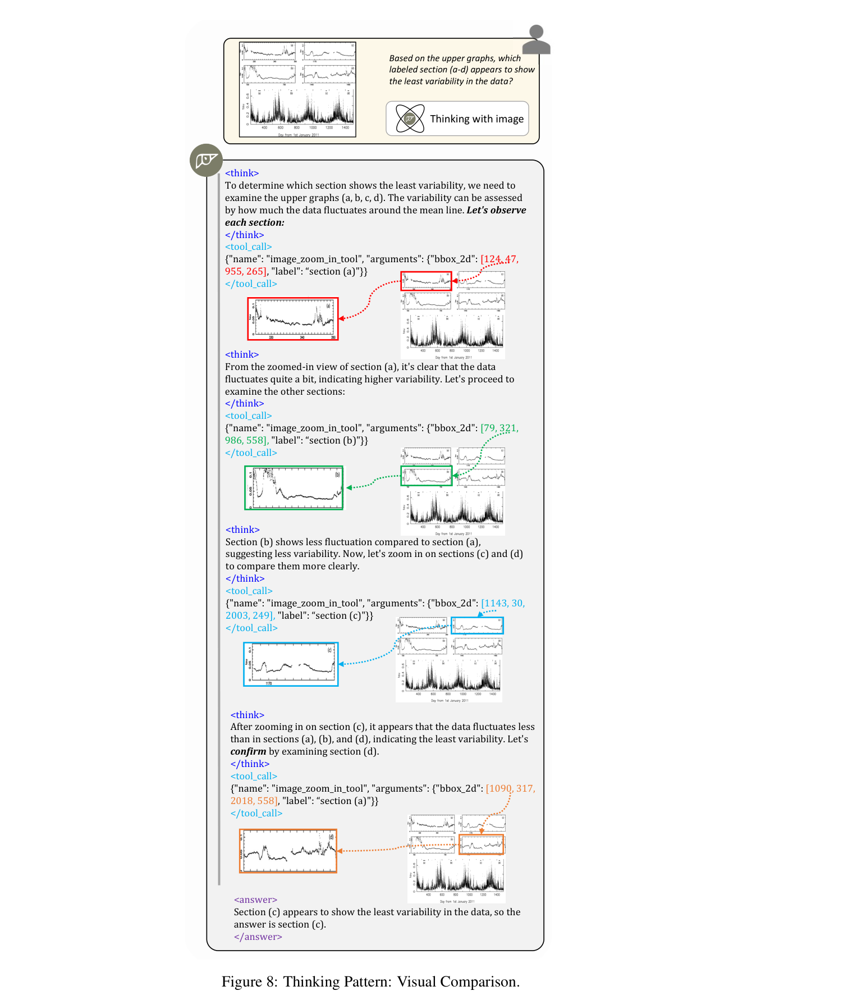

**Caption:** Figure 8: Thinking Pattern: Visual Comparison.

**Caption[CN]:** 图 8：思考模式——视觉比较。

**Exact prompt/output transcript:**

```text
Based on the upper graphs, which
labeled section (a-d) appears to show
the least variability in the data?

<think>
To determine which section shows the least variability, we need to
examine the upper graphs (a, b, c, d). The variability can be assessed
by how much the data fluctuates around the mean line. Let's observe
each section:
</think>
<tool_call>
{"name": "image_zoom_in_tool", "arguments": {"bbox_2d": [124, 47,
955, 265], "label": “section (a)”}}
</tool_call>

<think>
From the zoomed-in view of section (a), it's clear that the data
fluctuates quite a bit, indicating higher variability. Let's proceed to
examine the other sections:
</think>
<tool_call>
{"name": "image_zoom_in_tool", "arguments": {"bbox_2d": [79, 321,
986, 558], "label": “section (b)”}}
</tool_call>

<think>
Section (b) shows less fluctuation compared to section (a),
suggesting less variability. Now, let's zoom in on sections (c) and (d)
to compare them more clearly.
</think>
<tool_call>
{"name": "image_zoom_in_tool", "arguments": {"bbox_2d": [1143, 30,
2003, 249], "label": “section (c)”}}
</tool_call>

<think>
After zooming in on section (c), it appears that the data fluctuates less
than in sections (a), (b), and (d), indicating the least variability. Let's
confirm by examining section (d).
</think>
<tool_call>
{"name": "image_zoom_in_tool", "arguments": {"bbox_2d": [1090, 317,
2018, 558], "label": “section (a)”}}
</tool_call>

<answer>
Section (c) appears to show the least variability in the data, so the
answer is section (c).
</answer>
```

> <span style="color:#3B82F6"><strong>Para. 2:</strong></span> To determine which section exhibits the least data variability, the model sequentially zoomed in on the charts of four sections (a, b, c, and d), focusing on fluctuations around the moving average. Through comparison, it found that section (a) showed significant volatility, while section (b) was relatively less volatile. However, section (c) displayed the most stable pattern, with fluctuations clearly smaller than those in the other regions. Based on this analysis, the model concluded that section (c) has the least data variability.

> <span style="color:#F59E0B"><strong>Para. 2[CN]:</strong></span> 为判断哪个部分的数据变异最小，模型依次放大四个部分（a、b、c、d）的图表，关注数据围绕移动平均线的波动。比较后，它发现部分（a）的波动显著，部分（b）的波动相对较小，而部分（c）呈现最稳定的模式，其波动明显小于其他区域。据此，模型判断部分（c）的数据变异最小。

#### Visual Confirmation｜视觉确认

### Figure 9. Thinking Pattern: Visual Confirmation｜思考模式：视觉确认

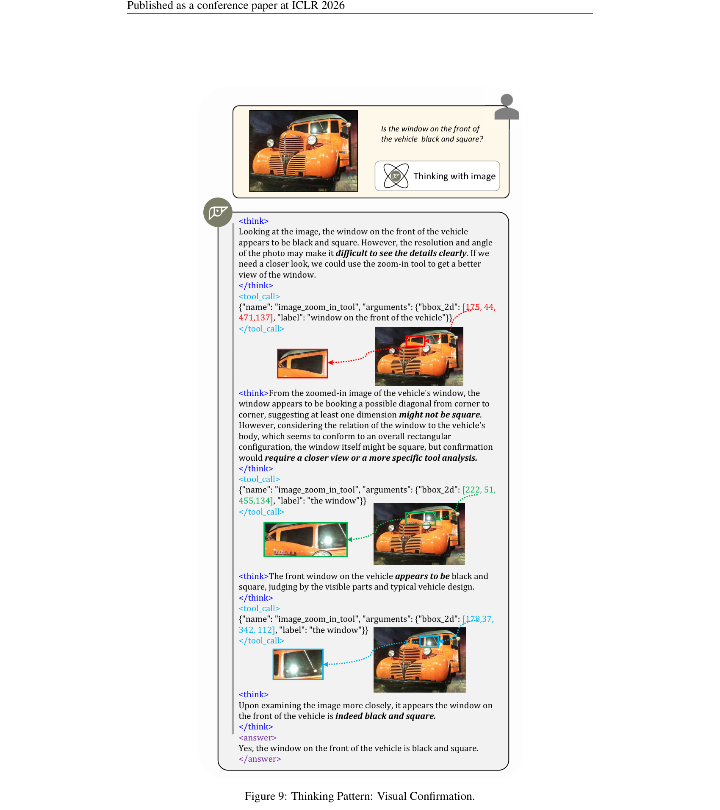

**Caption:** Figure 9: Thinking Pattern: Visual Confirmation.

**Caption[CN]:** 图 9：思考模式——视觉确认。

**Exact prompt/output transcript:**

```text
Is the window on the front of
the vehicle black and square?

<think>
Looking at the image, the window on the front of the vehicle
appears to be black and square. However, the resolution and angle
of the photo may make it difficult to see the details clearly. If we
need a closer look, we could use the zoom-in tool to get a better
view of the window.
</think>
<tool_call>
{"name": "image_zoom_in_tool", "arguments": {"bbox_2d": [175, 44,
471,137], "label": "window on the front of the vehicle"}}
</tool_call>

<think>From the zoomed-in image of the vehicle’s window, the
window appears to be booking a possible diagonal from corner to
corner, suggesting at least one dimension might not be square.
However, considering the relation of the window to the vehicle's
body, which seems to conform to an overall rectangular
configuration, the window itself might be square, but confirmation
would require a closer view or a more specific tool analysis.
</think>
<tool_call>
{"name": "image_zoom_in_tool", "arguments": {"bbox_2d": [222, 51,
455,134], "label": "the window"}}
</tool_call>

<think>The front window on the vehicle appears to be black and
square, judging by the visible parts and typical vehicle design.
</think>
<tool_call>
{"name": "image_zoom_in_tool", "arguments": {"bbox_2d": [178,37,
342, 112], "label": "the window"}}
</tool_call>

<think>
Upon examining the image more closely, it appears the window on
the front of the vehicle is indeed black and square.
</think>
<answer>
Yes, the window on the front of the vehicle is black and square.
</answer>
```

> <span style="color:#3B82F6"><strong>Para. 3:</strong></span> In this case, the model was initially uncertain about the shape of the window. Through multiple invocations of the zoom-in tool and careful analysis of potential visual details, it gradually resolved its internal uncertainty and ultimately provided a confident answer.

> <span style="color:#F59E0B"><strong>Para. 3[CN]:</strong></span> 在该案例中，模型起初不确定窗户的形状。通过多次调用放大工具并仔细分析可能的视觉细节，它逐步消除了内部不确定性，最终给出有把握的答案。

#### Hallucination Mitigation｜幻觉缓解

### Figure 10. Thinking Pattern: Hallucination Mitigation｜思考模式：幻觉缓解

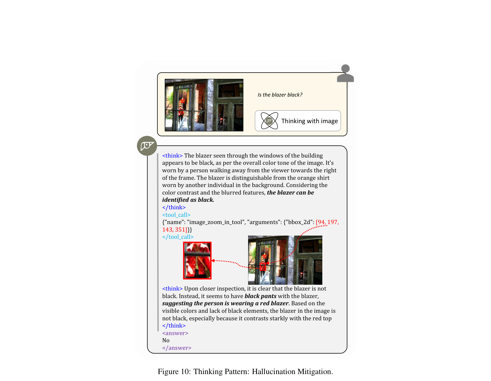

**Caption:** Figure 10: Thinking Pattern: Hallucination Mitigation.

**Caption[CN]:** 图 10：思考模式——幻觉缓解。

**Exact prompt/output transcript:**

```text
Is the blazer black?

<think> The blazer seen through the windows of the building
appears to be black, as per the overall color tone of the image. It's
worn by a person walking away from the viewer towards the right
of the frame. The blazer is distinguishable from the orange shirt
worn by another individual in the background. Considering the
color contrast and the blurred features, the blazer can be
identified as black.
</think>
<tool_call>
{"name": "image_zoom_in_tool", "arguments": {"bbox_2d": [94, 197,
143, 351]}}
</tool_call>

<think> Upon closer inspection, it is clear that the blazer is not
black. Instead, it seems to have black pants with the blazer,
suggesting the person is wearing a red blazer. Based on the
visible colors and lack of black elements, the blazer in the image is
not black, especially because it contrasts starkly with the red top
</think>
<answer>
No
</answer>
```

> <span style="color:#3B82F6"><strong>Para. 4:</strong></span> The model initially confused the colors of the pants and the blazer. However, by leveraging its perceptual capabilities and invoking the zoom-in tool to examine the enlarged region, it ultimately corrected the hallucination.

> <span style="color:#F59E0B"><strong>Para. 4[CN]:</strong></span> 模型起初混淆了裤子与西装外套的颜色。不过，它利用感知能力并调用放大工具检查放大区域，最终纠正了这一幻觉。

### D.2 Failed Cases｜失败案例

#### Grounding Limitation｜定位局限

### Figure 11. Grounding Limitation｜定位局限

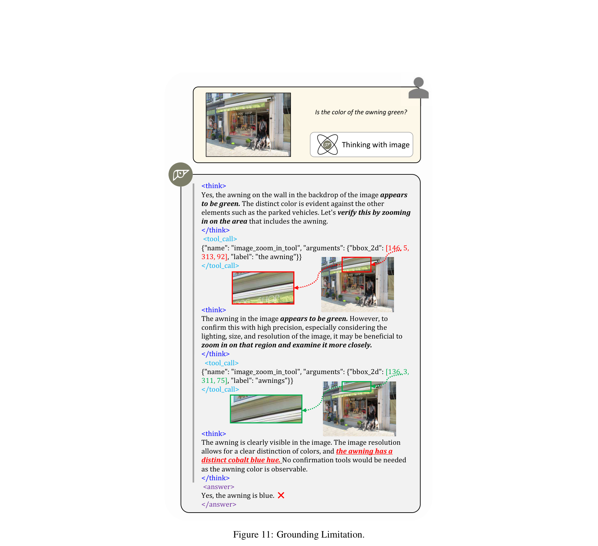

**Caption:** Figure 11: Grounding Limitation.

**Caption[CN]:** 图 11：定位局限。

**Exact prompt/output transcript:**

```text
Is the color of the awning green?

<think>
Yes, the awning on the wall in the backdrop of the image appears
to be green. The distinct color is evident against the other
elements such as the parked vehicles. Let's verify this by zooming
in on the area that includes the awning.
</think>
<tool_call>
{"name": "image_zoom_in_tool", "arguments": {"bbox_2d": [146, 5,
313, 92], "label": "the awning"}}
</tool_call>

<think>
The awning in the image appears to be green. However, to
confirm this with high precision, especially considering the
lighting, size, and resolution of the image, it may be beneficial to
zoom in on that region and examine it more closely.
</think>
<tool_call>
{"name": "image_zoom_in_tool", "arguments": {"bbox_2d": [136, 3,
311, 75], "label": "awnings"}}
</tool_call>

<think>
The awning is clearly visible in the image. The image resolution
allows for a clear distinction of colors, and the awning has a
distinct cobalt blue hue. No confirmation tools would be needed
as the awning color is observable.
</think>
<answer>
Yes, the awning is blue. ❌
</answer>
```

> <span style="color:#3B82F6"><strong>Para. 5:</strong></span> The model initially hypothesized that the awning was green. It then invoked the zoom-in tool for a closer inspection, maintaining its assumption while noting the need for more precise verification. However, during the second zoom-in, grounding drift occurred—the awning was no longer within the selected region, and instead, a blue area appeared. This misalignment led to a reversal in the model’s judgment, ultimately resulting in an incorrect answer.

> <span style="color:#F59E0B"><strong>Para. 5[CN]:</strong></span> 模型最初假设遮篷是绿色，随后调用放大工具近距离检查；它仍保持原假设，同时指出需要更精确的核验。然而，第二次放大时发生定位漂移：遮篷不再位于选定区域，取而代之的是一片蓝色区域。这种错位导致模型反转判断，最终给出错误答案。

#### Reasoning Limitation｜推理局限

### Figure 12. Reasoning Limitation｜推理局限

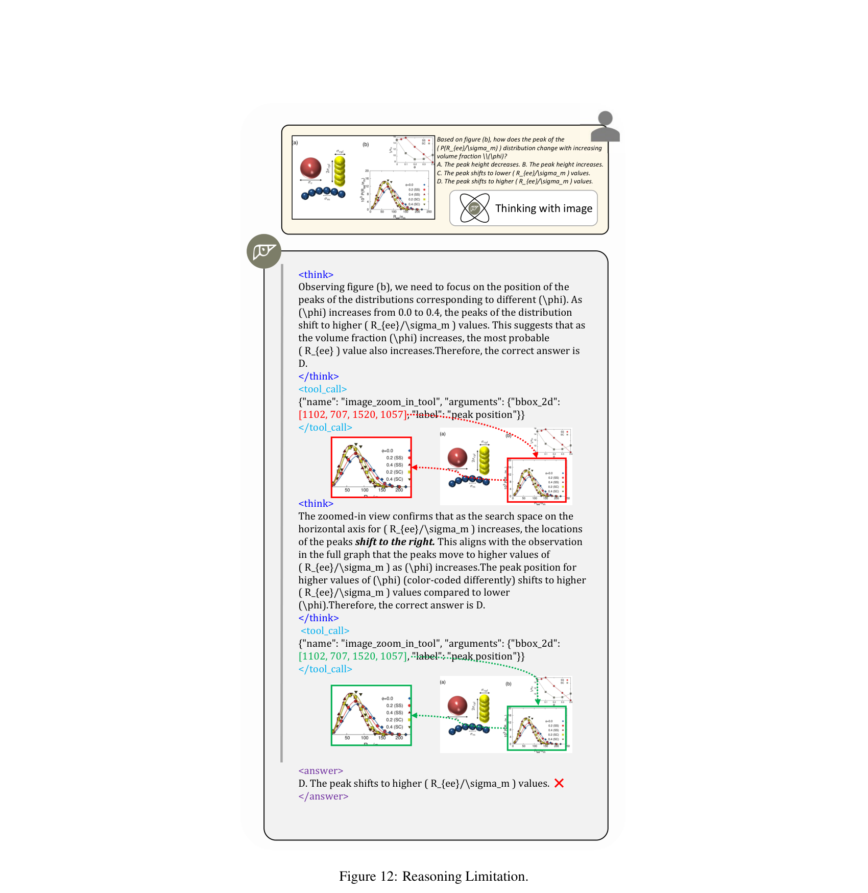

**Caption:** Figure 12: Reasoning Limitation.

**Caption[CN]:** 图 12：推理局限。

**Exact prompt/output transcript:**

```text
Based on figure (b), how does the peak of the
( P(R_{ee}/\sigma_m) ) distribution change with increasing
volume fraction $\phi$?
A. The peak height decreases. B. The peak height increases.
C. The peak shifts to lower ( R_{ee}/\sigma_m ) values.
D. The peak shifts to higher ( R_{ee}/\sigma_m ) values.

<think>
Observing figure (b), we need to focus on the position of the
peaks of the distributions corresponding to different (\phi). As
(\phi) increases from 0.0 to 0.4, the peaks of the distribution
shift to higher ( R_{ee}/\sigma_m ) values. This suggests that as
the volume fraction (\phi) increases, the most probable
( R_{ee} ) value also increases.Therefore, the correct answer is
D.
</think>
<tool_call>
{"name": "image_zoom_in_tool", "arguments": {"bbox_2d":
[1102, 707, 1520, 1057], "label": "peak position"}}
</tool_call>

<think>
The zoomed-in view confirms that as the search space on the
horizontal axis for ( R_{ee}/\sigma_m ) increases, the locations
of the peaks shift to the right. This aligns with the observation
in the full graph that the peaks move to higher values of
( R_{ee}/\sigma_m ) as (\phi) increases.The peak position for
higher values of (\phi) (color-coded differently) shifts to higher
( R_{ee}/\sigma_m ) values compared to lower
(\phi).Therefore, the correct answer is D.
</think>
<tool_call>
{"name": "image_zoom_in_tool", "arguments": {"bbox_2d":
[1102, 707, 1520, 1057], "label": "peak position"}}
</tool_call>

<answer>
D. The peak shifts to higher ( R_{ee}/\sigma_m ) values. ❌
</answer>
```

> <span style="color:#3B82F6"><strong>Para. 6:</strong></span> Although the model was able to accurately locate the position of figure (b) and invoke the tool for detailed inspection, it still lacked fine-grained understanding and reasoning capabilities. It failed to thoroughly analyze the trend changes in the zoomed-in curves, ultimately leading to an incorrect answer.

> <span style="color:#F59E0B"><strong>Para. 6[CN]:</strong></span> 虽然模型能够准确定位图（b）并调用工具进行细致检查，但仍缺乏细粒度理解与推理能力。它未能彻底分析放大曲线的趋势变化，最终给出错误答案。

## Appendix E. Limitations｜附录 E：局限

> <span style="color:#3B82F6"><strong>Para. 1:</strong></span> Although the simple end-to-end RL can elicit visual reasoning abilities, there still exist shortcuts, such as insufficient richness in the reasoning process and inaccurate target localization. We think these issues stem from limitations in the foundation model’s poor capabilities. We only utilized Qwen2.5-VL-7b, which has relatively weak fundamental capabilities due to its small model size.

> <span style="color:#F59E0B"><strong>Para. 1[CN]:</strong></span> 尽管简单的端到端 RL 能引出视觉推理能力，模型仍存在捷径问题，例如推理过程不够丰富、目标定位不准确。我们认为，这些问题源于基础模型能力不足所带来的限制。本研究仅使用 Qwen2.5-VL-7b；由于模型规模较小，其基础能力相对较弱。

## Appendix F. Broader Impacts｜附录 F：更广泛影响

> <span style="color:#3B82F6"><strong>Para. 1:</strong></span> Our exploration of interleaved multimodal chain-of-thought reasoning provides valuable insights for the future development of the AI community. By investigating how models can engage in step-by-step visual reasoning through interactive dialogues, we advance understanding of more transparent and interpretable AI systems. This research direction may inspire new architectures and training methodologies that better align with human reasoning processes.

> <span style="color:#F59E0B"><strong>Para. 1[CN]:</strong></span> 我们对交错式多模态思维链推理的探索，为 AI 社区的未来发展提供了有价值的见解。通过研究模型如何借助交互式对话开展逐步视觉推理，我们推进了对更透明、更可解释 AI 系统的理解。这一研究方向可能启发更符合人类推理过程的新架构与训练方法。

## Appendix G. Future Work｜附录 G：未来工作

> <span style="color:#3B82F6"><strong>Para. 1:</strong></span> Currently, our visual reasoning process only includes the crop operation. However, in real-world scenarios, a wider range of tools is needed, such as search and drawing auxiliary lines. We will explore the integration of additional tool utilization in our future work.

> <span style="color:#F59E0B"><strong>Para. 1[CN]:</strong></span> 当前，我们的视觉推理过程只包含裁剪操作。然而，在现实场景中还需要更广泛的工具，例如搜索和绘制辅助线。未来工作将探索整合更多工具的使用。
