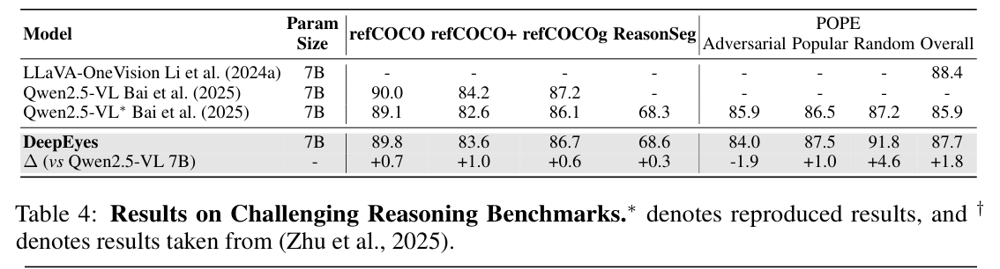
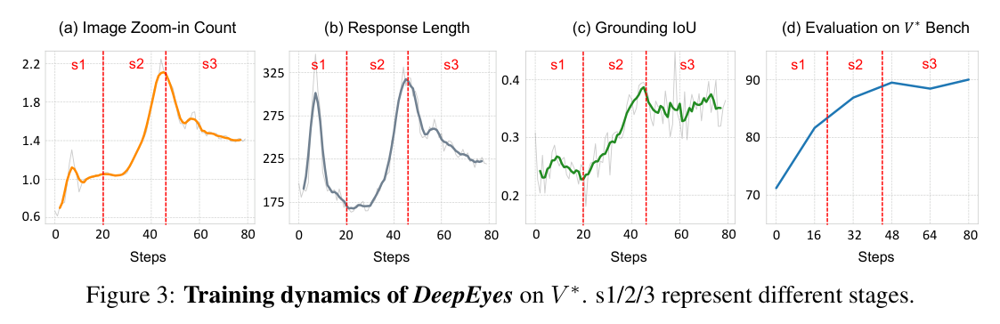
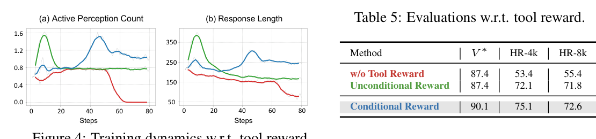
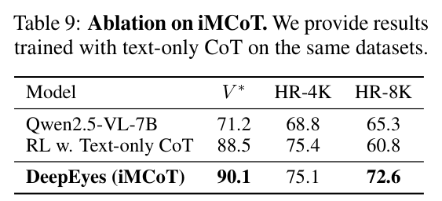
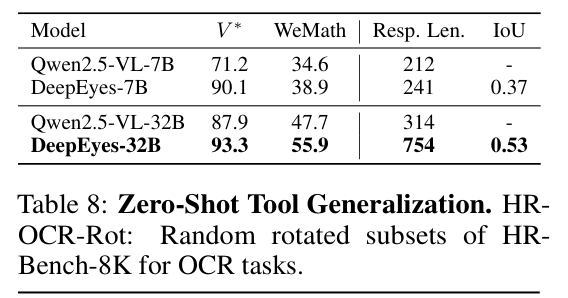
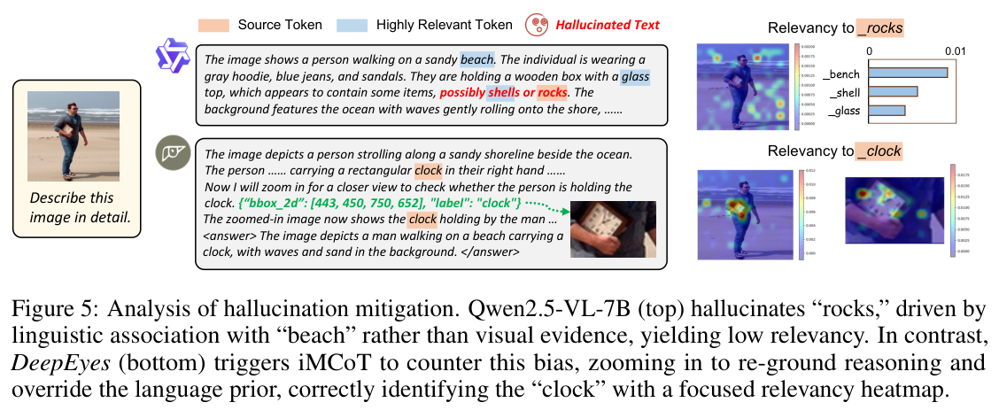

---
tags:
  - papers/visually-grounded-reasoning
  - papers/train
  - papers/active-perception
aliases:
  - "DeepEyes"
  - "Thinking with Images"
date: 2026-03-01
doi: 10.48550/arXiv.2505.14362
arxiv_id: 2505.14362
---

# DeepEyes: Incentivizing "Thinking with Images" via Reinforcement Learning

## 核心信息

- 标题: DeepEyes: Incentivizing "Thinking with Images" via Reinforcement Learning
- 标题翻译: DeepEyes：通过强化学习激励模型“用图像思考”
- 作者: Ziwei Zheng, Michael Yang, Jack Hong, Chenxiao Zhao, Guohai Xu, Le Yang, Chao Shen, Xing Yu
- 发表时间: 2026-03-01
- 发表渠道: ICLR 2026 / arXiv
- DOI: 10.48550/arXiv.2505.14362
- arXiv: 2505.14362
- 论文链接: http://arxiv.org/abs/2505.14362
- 代码 / 项目: https://github.com/Visual-Agent/DeepEyes
- 数据 / 资源: V*；HR-Bench；MME-RealWorld-Lite；ArxivQA；ThinkLite-VL
- 论文类型: AI 方法；主动感知；端到端强化学习；视觉工具调用

## 原文摘要翻译

大型视觉语言模型擅长多模态理解，但仍难以把视觉信息深度整合进主要由文本组成的推理过程。这是模拟人类认知时的关键挑战。为解决这一问题，作者提出 DeepEyes，一个学会“用图像思考”的模型。它通过端到端强化学习训练，不需要为冷启动监督微调预先收集推理数据。

这种能力是模型原生涌现出来的：它利用自身 grounding 能力作为内部功能，而不是依赖外部专用模型或 API。作者通过主动感知实现这一点，让模型在定制的数据选择和奖励策略引导下，学会有策略地把推理 grounding 到视觉信息上。

DeepEyes 在通用感知和推理基准上取得显著提升，也在 grounding、幻觉和数学推理任务上表现更好。作者还观察到主动感知从初始探索到高效准确利用的演化过程，以及多种接近人类视觉推理的思考模式。

## 创新点

1. 不用 cold-start reasoning SFT，而是尝试直接用 RL 诱导主动感知行为。
2. 把模型自身 grounding 能力封装成内部工具，让模型决定何时 放大观察。
3. iMCoT 把文本推理标记 和视觉观察标记 放在同一条 rollout 里，允许端到端优化整条轨迹。
4. 条件工具奖励只在“答对且用了主动感知”时给 bonus，避免模型为了调用工具而调用工具。
5. 论文分析训练动态，展示模型从低效探索到高效视觉利用的阶段性变化。
6. 消融显示 text-only RL 不能替代视觉观察，尤其在 HR-8K 这类高分辨率任务上差距很大。

## 一句话总结

DeepEyes 是一条端到端 RL 路线：它让 VLM 自己学会何时放大图像、何时把新视觉观察插入推理，而不是依赖人工设计的视觉工作流。

## 研究问题

很多 VLM 推理失败不是因为完全看不到图，而是没有在关键步骤重新检查视觉细节。人类做视觉题时会扫视、放大、比较、确认；普通文本 CoT 则容易把视觉问题写成语言问题。

*论文原图编号：Figure 1。DeepEyes 通过交错多模态 CoT 在推理中执行主动感知。*

DeepEyes 想证明的是：主动看图可以不靠手写流程，而是通过奖励在模型策略中涌现。这个问题比“能否调用 crop 工具”更深，因为重点是模型是否知道何时调用、调用哪里、调用后如何继续推理。

## 数据与任务定义

训练数据有三类来源。V* 提供细粒度视觉搜索样本，占 47%，约 22K。ArxivQA 提供图表样本，占 30%，约 14K。ThinkLite-VL 提供推理样本，占 23%，约 11K。

*论文原图编号：Figure 6。训练数据由自然图像视觉搜索、图表和推理样本组成。*

数据选择流程很重要。作者先用 Qwen2.5-VL-7B 去掉太简单或太难的样本，再标准化问题格式，并验证标签。最后只保留那些主动感知可能带来信息增益的样本。

训练细节上，作者用 Qwen2.5-VL-7B 做 GRPO，训练 80 次迭代。每个 batch 采样 256 个 prompt，每个 prompt 有 16 个 rollout，最多允许 6 次主动感知，最大回答长度为 20480 个标记。

## 方法主线

### 机制流程

1. 输入问题和原图后，模型先生成文本推理，并判断当前视觉证据是否足够。
2. 如果证据不足，模型输出边界框并调用放大观察工具，系统返回局部裁剪图。
3. 裁剪图被拼接回上下文，模型用新的视觉观察更新后续推理。
4. GRPO 对完整交错轨迹给奖励，输出能更有效调用主动感知的策略。

*论文原图编号：Figure 2。DeepEyes 让模型自行决定是否执行第二次视觉感知。*

### iMCoT 状态

iMCoT 的状态同时包含文本和图像观察：

$$
s_t=\{(X_0,I_0),(X_1,I_1),\ldots,(X_t,I_t)\}=\{X_{\le t};I_{\le t}\}.
$$

这和普通文本 RL 不同。普通 CoT 只有标记序列；DeepEyes 的 rollout 中，外部函数返回的图像观察会被追加回模型输入。

### 条件工具奖励

奖励函数是：

$$
R(\tau)=R_{\text{acc}}(\tau)+R_{\text{format}}(\tau)+\mathbf{1}_{R_{\text{acc}}(\tau)>0}R_{\text{tool}}(\tau).
$$

这个设计很克制。工具调用只有在答案正确时才加分，所以模型不能靠无意义调用工具刷奖励。它必须让视觉行动服务于正确答案。

## 关键结果

### 主结果与强基线

*论文原图编号：Table 1。DeepEyes 在高分辨率视觉基准上显著提升。*

| 指标 | Qwen2.5-VL-7B | DeepEyes | 提升 |
|---|---:|---:|---:|
| V* Overall | 71.2 | 90.1 | +18.9 |
| HR-Bench 4K Overall | 68.8 | 75.1 | +6.3 |
| HR-Bench 8K Overall | 65.3 | 72.6 | +7.3 |

高分辨率基准最能体现主动感知的价值。目标物体小、图像大、局部细节重要时，模型需要重新看局部区域。

*论文原图编号：Table 2。DeepEyes 在 MME-RealWorld-Lite 上超过多个基线。*

MME-RealWorld-Lite Overall 从 Qwen2.5-VL 的 42.3 提升到 53.2。这个提升说明主动感知不只适用于小物体定位，也改善真实世界视觉问答。

*论文原图编号：Table 3。Grounding 和幻觉指标整体改善，但不是所有列都单调提升。*

在 grounding 上，refCOCO、refCOCO+、refCOCOg 和 ReasonSeg 都有小幅提升。
POPE adversarial 从 85.9 降到 84.0。
但 popular、random 和 overall 上升。
这说明幻觉缓解不是全维度无条件胜利。

*论文原图编号：Table 4。DeepEyes 在数学与复杂推理基准上也有稳定小幅提升。*

MathVista 从 68.3 到 70.1，WeMath 从 34.6 到 38.9，LogicVista 从 45.9 到 47.7。这里的增益小于高分辨率视觉任务，但说明主动感知和文本 reasoning 能共同演化。

### 消融到底说明了什么

*论文原图编号：Figure 3。训练动态从探索到高频使用，再到高效利用。*

作者把训练分成三段。前 20 步左右，模型开始尝试调用工具，但 grounding IoU 较低。20 到 45 步，模型高频使用主动感知，回答变长。45 步以后，调用变少但更准，说明它学会了选择性使用视觉证据。

*论文原图编号：Table 5。条件工具奖励是关键。*

| 设置 | V* | HR-4K | HR-8K |
|---|---:|---:|---:|
| No tool reward | 87.4 | 53.4 | 55.4 |
| Unconditional reward | 87.4 | 72.1 | 71.8 |
| Conditional reward | 90.1 | 75.1 | 72.6 |

无条件奖励比无工具奖励好，但仍不如条件奖励。这说明奖励工具调用本身还不够，必须把调用和正确答案绑定。

*论文原图编号：Table 9。iMCoT 相比 text-only RL 的优势主要体现在 HR-8K。*

| 设置 | V* | HR-4K | HR-8K |
|---|---:|---:|---:|
| Qwen2.5-VL-7B | 71.2 | 68.8 | 65.3 |
| RL text-only | 88.5 | 75.4 | 60.8 |
| DeepEyes iMCoT | 90.1 | 75.1 | 72.6 |

text-only RL 可以学到推理格式，所以 V* 和 HR-4K 不差。但在 HR-8K 上，它明显落后。这说明超高分辨率任务需要真实视觉回看，而不是只靠更长文本推理。

### 规模和数据

*论文原图编号：Table 7。增加复杂推理数据会同时提升感知和数学能力。*

加入更多复杂推理数据后，MathVerse 从 47.3 到 51.8，WeMath 从 38.9 到 43.6，V* 从 90.1 到 91.6。作者认为感知和抽象推理可以互相促进。

*论文原图编号：Table 8。只通过 prompt 加 rotate 工具，可以提升旋转 OCR 子集。*

crop 工具之外，作者还测试了 rotate。无需重新训练，只在系统提示中加入 rotate 工具后，HR-OCR-Rot 从 80.1 到 83.6。这说明工具接口有一定零样本扩展性。

## 深度分析

### 真正贡献是什么

DeepEyes 的贡献不是提出一个复杂工具箱，而是证明一个更基础的现象：在合适数据和奖励下，模型可以学会主动获取视觉证据。它把“看哪里”从人工流程变成策略的一部分。

### 为什么结果成立

高分辨率任务需要局部细节。原图输入虽然包含所有信息，但模型注意力和分辨率利用有限。主动裁剪相当于把关键信息重新编码成更清晰的视觉观察，再插回上下文。这解释了 HR-8K 上 iMCoT 明显优于 text-only RL。

### 容易误读的地方

不要把 DeepEyes 理解成完全无数据设计。它虽然不需要 cold-start reasoning SFT，但有精心设计的数据过滤和 perception-utility 筛选。没有这些样本，RL 初始探索效率会很低。

### 幻觉缓解机制

*论文原图编号：Figure 5。主动感知通过重新 grounding 纠正语言先验幻觉。*

案例中，基线因为海滩语境产生错误联想。DeepEyes 通过 放大观察 检查局部区域，重新 grounding 到视觉证据，最终识别出正确物体。这个机制对 3D agent 也重要：当语言先验和几何证据冲突时，应触发新的视角或局部观察。

### 复现注意点

复现需要关注四类日志：工具调用次数、回答长度、grounding IoU 和任务得分。只看最终分数会错过训练是否真的学会主动感知。奖励也要小心，如果工具奖励不与正确性绑定，模型可能学会无意义调用。

## 局限

第一，当前工具主要是 crop。虽然论文展示了 rotate 的零样本扩展，但整体还不是通用工具智能体。

第二，局限部分承认模型仍有 shortcut、推理过程不够丰富、目标定位不准确等问题。这些问题可能来自基础模型能力不足，也可能来自奖励过稀疏。

第三，DeepEyes 的成功依赖数据筛选。尤其是 perception-utility filter，它决定了 RL 初期能不能采到有信息量的轨迹。

第四，论文主要验证 2D 图像主动感知。迁移到 3D 时，工具调用成本、视角选择空间和错误定位代价都会更高。

## 我的笔记

DeepEyes 是这组 Train 论文里最接近 agent 的一篇。PatchCue 和 MINT-CoT 更像“训练模型输出中间视觉引用”，DeepEyes 则让模型学会主动发起视觉动作。

对 3D agent 来说，它的奖励设计尤其值得借鉴。不要奖励“调用了渲染工具”，而要奖励“调用渲染后答对”。否则模型很容易学会形式化工具调用，而不是真正利用新观察。

它也能解释 Position paper 的担忧。如果一篇 thinking-with-images 方法只展示中间图像，却没有证明模型使用了图像，那么结论很弱。DeepEyes 至少通过 iMCoT 消融、工具奖励消融 和 幻觉案例 给出了一些因果线索，但仍然值得做 裁剪图替换和遮挡反事实实验。

## 引用

Zheng, Ziwei, Michael Yang, Jack Hong, Chenxiao Zhao, Guohai Xu, Le Yang, Chao Shen, and Xing Yu. 2026. "DeepEyes: Incentivizing Thinking with Images via Reinforcement Learning." ICLR 2026 / arXiv:2505.14362.
