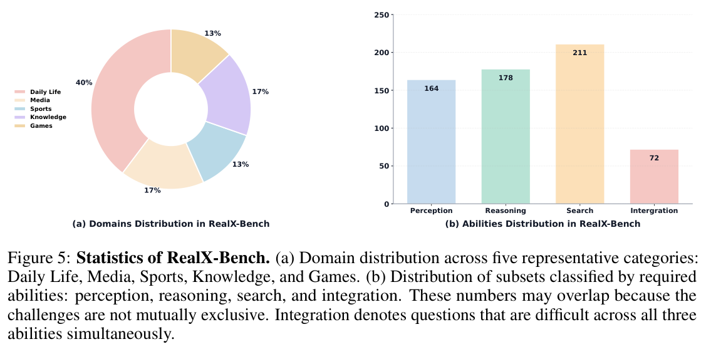
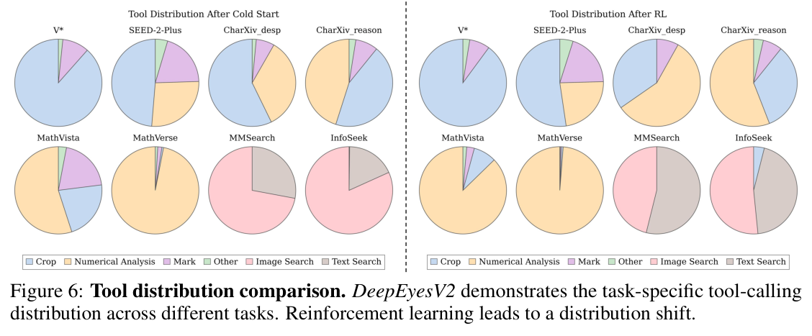
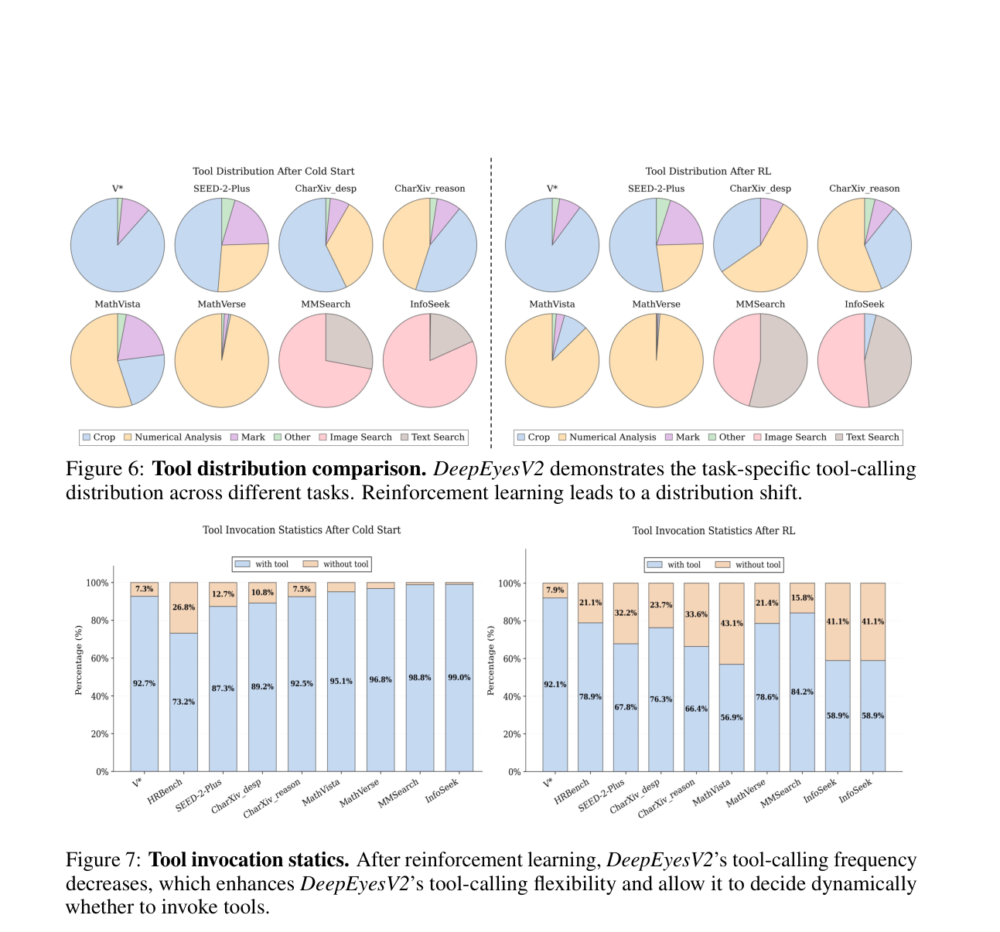
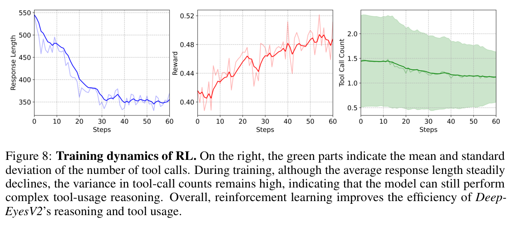
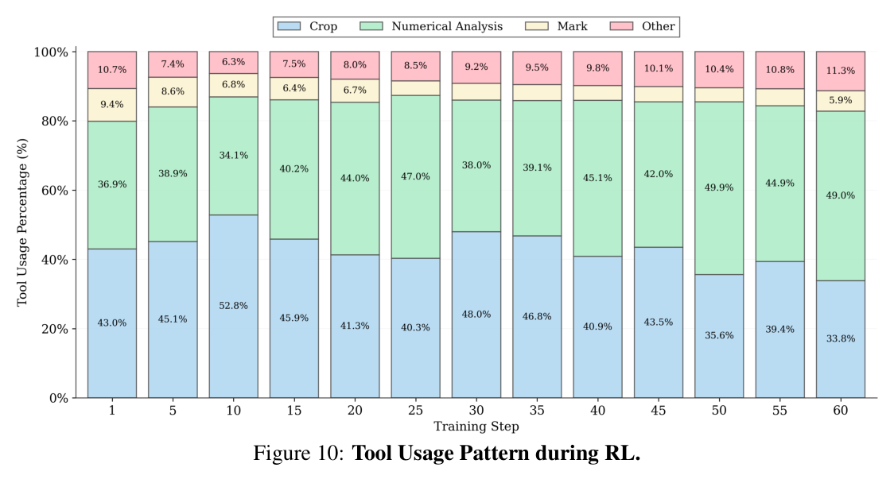
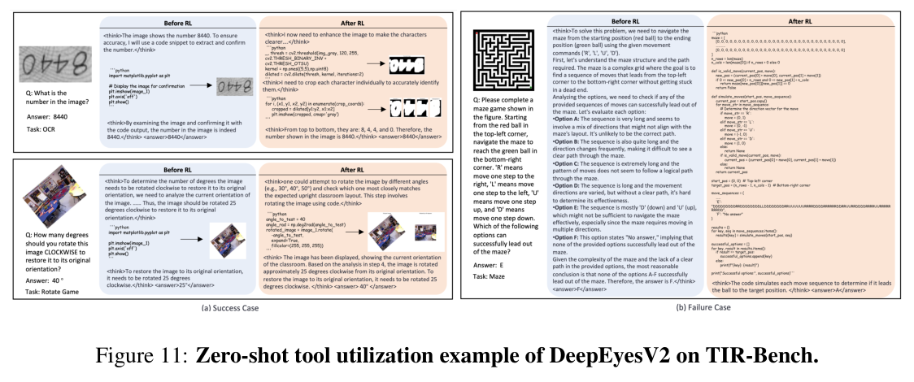
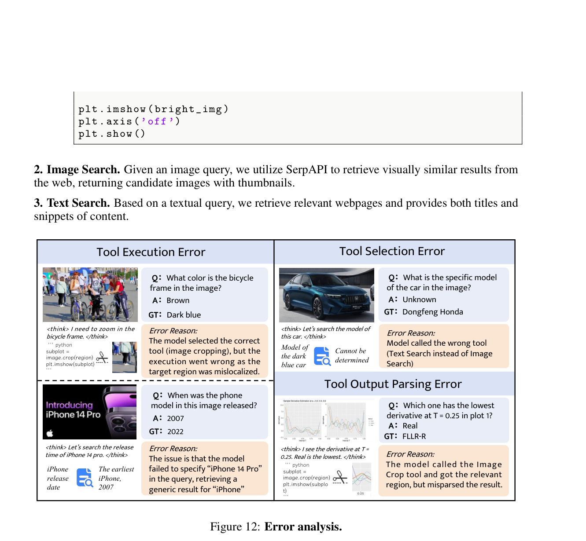
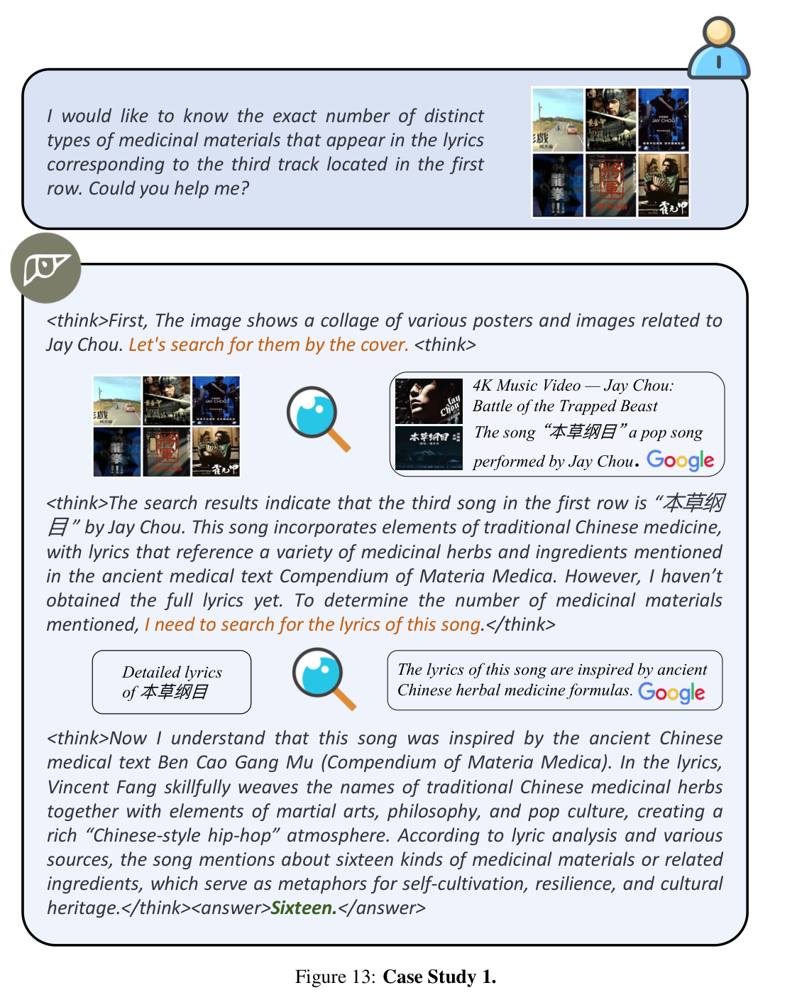
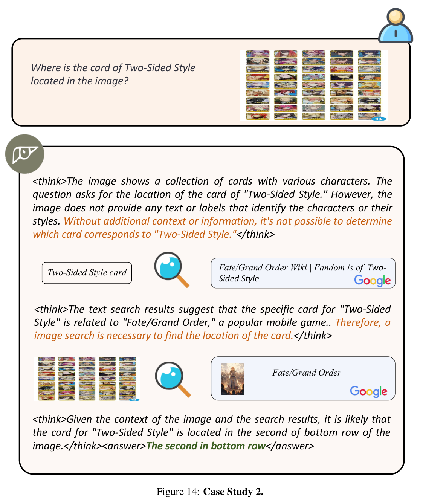

# DeepEyesV2: Toward Agentic Multimodal Model

## 文档说明 / Reader Note

- **Title / 标题：** DeepEyesV2: Toward Agentic Multimodal Model / DeepEyesV2：迈向智能体式多模态模型
- **Authors / 作者：** Jack Hong\*, Chenxiao Zhao\*, ChengLin Zhu\*, Weiheng Lu, Guohai Xu†, Xing Yu
- **Affiliation / 单位：** Xiaohongshu Inc. / 小红书
- **Contact / 联系方式：** `jaaackhong@gmail.com`, `{chenxiao2, xuguohai}@xiaohongshu.com`
- **Version / 版本：** arXiv:2511.05271v4 [cs.CV], 11 Mar 2026
- **DOI：** `10.48550/arXiv.2511.05271`
- **Project Homepage / 项目主页：** https://github.com/Visual-Agent/DeepEyesV2
- **Source / 原始来源：** 27-page selectable-text PDF
- **Reading convention / 阅读约定：** 下文按原论文顺序排列；每段英文原文后紧邻对应中文译文。正文中的模型名、数据集名、指标、变量、代码标识符、XML/JSON 键、占位符和输出标签保留原样。参考文献为保证可检索性而保持原始书目形式，不翻译。
- **Author marks / 作者标记：** \* Equal contribution. / 同等贡献。† Corresponding author. / 通讯作者。

## Page–Section Index / 页码—章节索引

| PDF pages | Source content | 中文索引 |
|---:|---|---|
| 1 | Title, Abstract, 1 Introduction | 标题、摘要、第 1 节引言 |
| 2 | Introduction; Figure 1 | 引言；图 1 |
| 3 | Introduction; Figure 2 | 引言；图 2 |
| 4 | Figure 3; 2 Related Works | 图 3；第 2 节相关工作 |
| 5 | Figure 4; 3 DeepEyesV2; 3.1–3.2 | 图 4；第 3 节及 3.1–3.2 |
| 6 | Figure 5; 3.2–3.3 | 图 5；3.2–3.3 |
| 7 | Table 1; 3.3–3.4 | 表 1；3.3–3.4 |
| 8 | 4 RealX-Bench; 4.1–4.3; 5.1 begins | 第 4 节及 4.1–4.3；5.1 开始 |
| 9 | Tables 2–4; 5.1 | 表 2–4；5.1 |
| 10 | Tables 5–6; 5.2–5.3 | 表 5–6；5.2–5.3 |
| 11 | Figures 6–8; 5.3 | 图 6–8；5.3 |
| 12 | 5.4 Analysis | 5.4 分析 |
| 13 | 5.4; 6 Conclusion; References [1]–[10] | 5.4；第 6 节结论；参考文献 [1]–[10] |
| 14–17 | References [11]–[65] | 参考文献 [11]–[65] |
| 18 | Appendix A.1–A.2; Figure 9 | 附录 A.1–A.2；图 9 |
| 19 | Tables 7–8; A.3–A.5 | 表 7–8；A.3–A.5 |
| 20 | Figure 10; Tables 9–10; A.5–A.6 | 图 10；表 9–10；A.5–A.6 |
| 21 | Figure 11; A.6 Tool Taxonomy | 图 11；A.6 工具分类 |
| 22 | Figure 12; A.7; A.8 begins | 图 12；A.7；A.8 开始 |
| 23–25 | A.8 full prompts, schemas, and return templates; A.9 begins | A.8 完整提示词、模式与返回模板；A.9 开始 |
| 26–27 | A.9 More Cases; Figures 13–14 | A.9 更多案例；图 13–14 |

## Terminology Ledger / 术语表

| Exact term / literal | 中文统一译法 | Note / 说明 |
|---|---|---|
| agentic multimodal model | 智能体式多模态模型 | 能主动选择、调用并组合外部工具的多模态模型 |
| MLLM / multimodal large language model | 多模态大语言模型 | 缩写 `MLLM` 保留 |
| tool invocation / tool use | 工具调用 / 工具使用 | 按上下文区分动作与能力 |
| code execution | 代码执行 | 指在沙箱式 Python/Jupyter 环境中执行代码 |
| image search / text search | 图像搜索 / 文本搜索 | 两类 Web 检索工具 |
| operation tools | 操作类工具 | 包括图像操作、测量和数值计算 |
| information retrieval tools | 信息检索类工具 | 获取外部且可溯源的最新知识 |
| cold start / cold-start SFT | 冷启动 / 冷启动监督微调 | 用轨迹监督建立基础工具使用模式 |
| reinforcement learning (RL) | 强化学习（RL） | 在交互环境中优化工具调用 |
| long Chain-of-Thought (Long CoT) | 长思维链（Long CoT） | 纯文本、单轮的长推理轨迹 |
| grounded reasoning model | 接地推理模型 | 借助图像操作等外部落地操作进行推理 |
| tool-benefit classification | 工具收益分类 | 判断工具是否提升答题正确率 |
| task-adaptive tool invocation | 任务自适应工具调用 | 按任务和上下文选择是否、何时以及如何用工具 |
| perception / search / reasoning / integration | 感知 / 搜索 / 推理 / 综合 | RealX-Bench 的能力维度 |
| reward hacking | 奖励投机 | 为获取奖励而生成无意义占位代码等退化行为 |
| `R_acc`, `R_format` | 准确率奖励、格式奖励 | 数学符号保持不变 |
| `image_i`, `<think>`, `<code>`, `<tool_call>`, `<answer>` | 原样保留 | 提示词与工具协议中的精确字面量 |

---

## Abstract / 摘要

> <span style="color:#3B82F6"><strong>Para. 1:</strong></span> Agentic multimodal models should not only comprehend text and images, but also actively invoke external tools, such as code execution environments and web search, and integrate these operations into reasoning. In this work, we introduce DeepEyesV2 and explore how to build an agentic multimodal model from the perspectives of data construction, training methods, and model evaluation. We observe that direct reinforcement learning alone fails to induce robust tool-use behavior. This phenomenon motivates a two-stage training pipeline: a cold-start stage to establish tool-use patterns, and reinforcement learning stage to further refine tool invocation. We curate a diverse, moderately challenging training dataset, specifically including examples where tool use is beneficial. We further introduce RealX-Bench, a comprehensive benchmark designed to evaluate real-world multimodal reasoning, which inherently requires the integration of multiple capabilities, including perception, search, and reasoning. We evaluate DeepEyesV2 on RealX-Bench and other representative benchmarks, demonstrating its effectiveness across real-world understanding, mathematical reasoning, and search-intensive tasks. Moreover, DeepEyesV2 exhibits task-adaptive tool invocation, tending to use image operations for perception tasks and numerical computations for reasoning tasks. Reinforcement learning further enables complex tool combinations and allows model to selectively invoke tools based on context. We hope our study can provide guidance for community in developing agentic multimodal models.

> <span style="color:#F59E0B"><strong>Para. 1[CN]:</strong></span> 智能体式多模态模型不仅应当理解文本与图像，还应主动调用代码执行环境、Web 搜索等外部工具，并将这些操作融入推理过程。在本工作中，我们提出 DeepEyesV2，并从数据构建、训练方法和模型评测三个角度探索如何构建智能体式多模态模型。我们观察到，仅使用直接强化学习无法诱导出稳健的工具使用行为。这一现象促使我们采用两阶段训练流程：首先通过冷启动阶段建立工具使用模式，随后通过强化学习阶段进一步优化工具调用。我们整理了一个多样化且具有适中挑战性的训练数据集，其中专门包含使用工具能够带来收益的样例。我们还提出 RealX-Bench，这是一个用于评估真实世界多模态推理的综合基准；此类推理内在地要求整合感知、搜索和推理等多种能力。我们在 RealX-Bench 及其他代表性基准上评测 DeepEyesV2，证明其在真实世界理解、数学推理和搜索密集型任务中的有效性。此外，DeepEyesV2 呈现任务自适应的工具调用模式：在感知任务中倾向于使用图像操作，在推理任务中倾向于进行数值计算。强化学习进一步使复杂工具组合成为可能，并让模型能够根据上下文选择性地调用工具。我们希望本研究能为社区开发智能体式多模态模型提供指导。

---

## 1 Introduction / 引言

> <span style="color:#3B82F6"><strong>Para. 1:</strong></span> An agentic multimodal model should not only be capable of understanding text and images, but can also actively invoke tools (e.g., a code execution environment or a web search interface) and seamlessly integrate these operations into its advanced reasoning process. For example, as illustrated in Figure 1 (b), when asked to identify the species of a flower in an image, an agentic multimodal model first crops the region containing that flower, then uses the origin image to search and determine the species. Although existing multimodal models demonstrate strong perception and interpretation abilities, they remain largely passive and lack the ability to autonomously invoke external tools, which is essential for agentic multimodal models. Tools enable explicit, verifiable operations on inputs (e.g., cropping, measuring, computation) and provide access to up-to-date, source-grounded knowledge, thereby improving accuracy, reducing hallucinations, and supporting traceable reasoning.

> <span style="color:#F59E0B"><strong>Para. 1[CN]:</strong></span> 智能体式多模态模型不仅应具备理解文本和图像的能力，还应能够主动调用工具（例如代码执行环境或 Web 搜索接口），并将这些操作无缝融入高级推理过程。例如，如图 1(b) 所示，当被要求识别图像中花朵的具体物种时，智能体式多模态模型先裁剪出包含该花朵的区域，再使用原始图像进行搜索并确定物种。尽管现有多模态模型展现出强大的感知和解释能力，但它们总体上仍是被动的，缺乏自主调用外部工具的能力，而这正是智能体式多模态模型的关键要求。工具能够对输入执行显式、可验证的操作（如裁剪、测量、计算），并提供对最新且有来源依据的知识的访问，从而提高准确性、减少幻觉，并支持可追溯推理。

> <span style="color:#3B82F6"><strong>Para. 2:</strong></span> These tool-use capabilities can be categorized into two types: (i) Operation tools: Current models cannot perform complex operations on visual or numerical data, including fine-grained image manipulations (e.g., cropping, measuring) and quantitative computations. This limits their capacity to reason about detailed visual content or solve mathematical problems. (ii) Information retrieval tools: Models cannot proactively access up-to-date external knowledge, which often leads to outdated conclusions or statements without verifiable sources. Some recent works attempt to rely on a single tool. For example, as shown in Figure 1 (b), DeepEyes [64] uses cropping to achieve fine-grained perception, but due to the lack of information retrieval capability, DeepEyes cannot correctly determine the category based solely on its internal knowledge. In contrast, although MMSearch-R1 [53] can perform search, it lacks fine-grained perception, leading to retrieval failures. A substantial gap remains between existing approaches and truly agentic multimodal models. While o3 [39] has explored “thinking with image” reasoning pattern that combines operations and search, how to realize such capabilities remains unclear.

> <span style="color:#F59E0B"><strong>Para. 2[CN]:</strong></span> 这些工具使用能力可分为两类：（i）操作类工具：当前模型无法对视觉或数值数据执行复杂操作，包括细粒度图像处理（如裁剪、测量）和定量计算。这限制了它们对精细视觉内容进行推理或解决数学问题的能力。（ii）信息检索类工具：模型无法主动访问最新的外部知识，因而常常得出过时的结论，或给出没有可验证来源的陈述。近期一些工作尝试依赖单一工具。例如，如图 1(b) 所示，DeepEyes [64] 通过裁剪实现细粒度感知，但由于缺乏信息检索能力，DeepEyes 无法仅凭内部知识正确判定类别。相较之下，MMSearch-R1 [53] 虽能执行搜索，却缺乏细粒度感知，因而会导致检索失败。现有方法与真正的智能体式多模态模型之间仍存在显著差距。尽管 o3 [39] 已探索将操作与搜索结合起来的“thinking with image”推理模式，但如何实现这类能力仍不清楚。

### Figure 1. Illustration of agentic multimodal models / 智能体式多模态模型示意图


**Caption:** Figure 1: Illustration of agentic multimodal models. (a) Existing models show unsatisfactory performance in real-world scenarios, showing clear limitations especially when perception, reasoning, and search must be tightly integrated. (b) A multi-step visual reasoning example requiring coordinated perception, search, and reasoning.

**Caption[CN]:** 图 1：智能体式多模态模型示意图。(a) 现有模型在真实世界场景中的表现并不理想，尤其当感知、推理与搜索必须紧密整合时，局限十分明显。(b) 一个需要协调感知、搜索和推理的多步视觉推理示例。

> <span style="color:#3B82F6"><strong>Para. 3:</strong></span> To explore how to construct such agentic multimodal models, we introduce DeepEyesV2, which seamlessly integrates tool invocation within the dynamic reasoning loop. DeepEyesV2 actively decides when and how to invoke tools, enabling a dynamic process of evidence acquisition and verification. Then, tool outputs are iteratively incorporated into reasoning process, allowing model to refine its hypotheses, validate intermediate results, and ultimately arrive at more reliable and interpretable conclusions. In this work, we systematically investigate key aspects of building an agentic MLLM, including model training strategies, dataset curation, and evaluation protocols.

> <span style="color:#F59E0B"><strong>Para. 3[CN]:</strong></span> 为探索如何构建这类智能体式多模态模型，我们提出 DeepEyesV2，将工具调用无缝整合进动态推理循环。DeepEyesV2 主动决定何时以及如何调用工具，从而形成动态的证据获取与验证过程。随后，工具输出被迭代地纳入推理过程，使模型能够修正假设、验证中间结果，并最终得到更可靠且更具可解释性的结论。在本工作中，我们系统研究构建智能体式 MLLM 的关键环节，包括模型训练策略、数据集整理和评测协议。

> <span style="color:#3B82F6"><strong>Para. 4:</strong></span> We first follow the setup of DeepEyes [64] and apply reinforcement learning directly on Qwen2.5-VL [4], but find that limited inherent tool-use capability prevents stable tool invocation. This highlights the need for a cold-start stage to establish reliable tool-use patterns. Thus, we curate a high-quality dataset that spans diverse scenarios, including perception, reasoning, and search tasks. After cleaning, we apply two filters: (i) difficulty filtering, retaining only questions unsolvable by the base model, and (ii) tool-benefit classification, keeping cases where tool use improves accuracy. Data are split into two subsets: tool-solvable examples for RL and harder unsolved cases for cold start, further augmented with long chain-of-thought trajectories. Supervised fine-tuning on this cold-start dataset enables the model to acquire basic tool-use patterns and deeper reasoning, after which RL further strengthens tool invocation. Notably, we rely only on two simple rewards, accuracy and format, without complex reward engineering [42].

> <span style="color:#F59E0B"><strong>Para. 4[CN]:</strong></span> 我们首先沿用 DeepEyes [64] 的设置，直接在 Qwen2.5-VL [4] 上应用强化学习，但发现模型有限的内在工具使用能力无法支撑稳定的工具调用。这凸显出需要一个冷启动阶段来建立可靠的工具使用模式。因此，我们整理了一个覆盖多种场景的高质量数据集，其中包括感知、推理和搜索任务。清洗之后，我们采用两道筛选：（i）难度筛选，仅保留基础模型无法解决的问题；（ii）工具收益分类，保留使用工具能够提高准确率的案例。数据被划分为两个子集：可借助工具解决的样例用于 RL，更困难且即使借助工具仍未解决的案例用于冷启动，并进一步以长思维链轨迹扩充。基于该冷启动数据集进行监督微调，使模型获得基础工具使用模式和更深入的推理能力；随后，RL 进一步强化工具调用。值得注意的是，我们只依赖准确率和格式这两个简单奖励，而没有采用复杂的奖励工程 [42]。

> <span style="color:#3B82F6"><strong>Para. 5:</strong></span> DeepEyesV2 demonstrates strong synergistic capabilities across perception, search, and reasoning. However, existing benchmarks mostly focus on just one of these abilities and lack an integrated, cross-capability benchmark that can comprehensively evaluate all three. Therefore, we propose a new benchmark, called RealX-Bench. RealX-Bench emphasizes cross-capability integration, requiring models to attend to fine-grained visual regions, retrieve external evidence, and reason over multimodal context. As showm in Figure 1 (a), current models perform well below human performance on RealX-Bench, revealing a substantial performance gap and underscoring RealX-Bench’s difficulty. Compared with current open-source models and models limited to using a single tool, DeepEyesV2 demonstrates powerful coordination across the three capabilities.

> <span style="color:#F59E0B"><strong>Para. 5[CN]:</strong></span> DeepEyesV2 在感知、搜索和推理之间展现出强大的协同能力。然而，现有基准大多只关注其中一种能力，缺少能够综合评测三者的跨能力集成基准。因此，我们提出名为 RealX-Bench 的新基准。RealX-Bench 强调跨能力整合，要求模型关注细粒度视觉区域、检索外部证据，并基于多模态上下文进行推理。如图 1(a) 所示，当前模型在 RealX-Bench 上的表现远低于人类，揭示了巨大的性能差距，也凸显出 RealX-Bench 的难度。与当前开源模型及仅限使用单一工具的模型相比，DeepEyesV2 展现出对这三种能力的强大协调能力。

### Figure 2. Case reasoning trajectory / 案例推理轨迹


**Caption:** Figure 2: Case reasoning trajectory of DeepEyesV2. DeepEyesV2 seamlessly integrates code execution and web search within its iterative reasoning process. Notably, in the right case, the behavior of accessing webpages via code does not exist in cold start data and is spontaneously acquired during reinforcement learning.

**Caption[CN]:** 图 2：DeepEyesV2 的案例推理轨迹。DeepEyesV2 在迭代推理过程中无缝整合代码执行和 Web 搜索。值得注意的是，右侧案例中通过代码访问网页的行为并不存在于冷启动数据中，而是在强化学习期间自发习得的。

#### Figure 2 searchable case transcription / 图 2 案例可检索转录

> <span style="color:#3B82F6"><strong>Para. 6:</strong></span> **Left-case question:** What is the average $k'_3$ value of the black dot across subplots A, B, C, and D? Your final answer must be a number with 1 decimal places.
>
> **Trajectory:** `<think>The user's question asks for … I need to locate the black dot in each of these four subplots and determine its k′3 coordinate. Since the x-axis in each subplot is labeled k′3, I should read the approximate value from the plot. Let me analyze the position of each black dot.</think>`
>
> ```python
> region = (10, 8, 45, 42)
> subplot_A = image.crop(region)
> plt.imshow(subplot_A)
> ……
> plt.imshow(subplot_B)
> ……
> ```
>
> `<think>Now I can more clearly see the position of the black dot in each subplot. Let me carefully estimate the k′3 value of the black dot: A: ~0.80 B: ~0.85 C: ~0.85 D: ~0.85. To calculate the average, I need to sum these values and divide by 4.</think>`
>
> ```python
> k3_prime_values = [0.8, 0.85, 0.85, 0.85]
> average_k3 = sum(k3_prime_values) / len(k3_prime_values)
> print(average_k3)  # 0.8375
> ```
>
> `<think>The calculated result is 0.8375, but considering that the question requires rounding to one decimal place, the result is 0.8.</think><answer>0.8</answer>`

> <span style="color:#F59E0B"><strong>Para. 6[CN]:</strong></span> **左侧案例问题：** 子图 A、B、C 和 D 中黑点的 $k'_3$ 值平均是多少？最终答案必须是保留 1 位小数的数字。
>
> **轨迹：** `<think>用户的问题要求……我需要定位这四个子图中的黑点，并确定其 k′3 坐标。由于每个子图的 x 轴都标为 k′3，我应从图中读取近似值。让我分析每个黑点的位置。</think>`
>
> ```python
> region = (10, 8, 45, 42)
> subplot_A = image.crop(region)
> plt.imshow(subplot_A)
> ……
> plt.imshow(subplot_B)
> ……
> ```
>
> `<think>现在我能更清楚地看到每个子图中黑点的位置。让我仔细估计黑点的 k′3 值：A：约 0.80，B：约 0.85，C：约 0.85，D：约 0.85。为了计算平均值，需要将这些数相加后除以 4。</think>`
>
> ```python
> k3_prime_values = [0.8, 0.85, 0.85, 0.85]
> average_k3 = sum(k3_prime_values) / len(k3_prime_values)
> print(average_k3)  # 0.8375
> ```
>
> `<think>计算结果为 0.8375，但题目要求四舍五入到一位小数，因此结果是 0.8。</think><answer>0.8</answer>`

> <span style="color:#3B82F6"><strong>Para. 7:</strong></span> **Right-case question:** Between the opening at 9:30 AM and the close at 4:00 PM on the day shown in the image, which had a larger price drop: the company in the image or Tootsie Roll Industries, Inc. (TR) during the same time period?
>
> **Trajectory:** `<think>First, analyze Bridgford Outdoors' data from the image, then get Tootsie Roll Industries, Inc. (TR) stock data and analyze it. First, Bridgford Outdoors drops ~0.2 (8.3→8.1); let's search for more data using image search.</think>`
>
> Image-search observation: `Maintaining a Deficit on the Weekend`
>
> `<think>Image search didn’t yield TR’s 9:30 AM–4:00 PM data for the same day; let’s continue searching for TR’s stock price in that time frame.</think>`
>
> Text query: `TR stock price 9:30 AM to 4:00 PM April 4th`
>
> Search result: `Tootsie Roll Industries Stock Price & Overview — TR Stock Price Quote | Morningstar`
>
> `<think>The next step is to visit the first search result page for Tootsie Roll Industries, Inc. (TR), find the stock prices at 9:30 AM and 4:00 PM, and then calculate the price drop.</think>`
>
> ```python
> soup = BeautifulSoup(requests.get("https://finance.yahoo.com/quote/TR/").text, 'html.parser')
> price_drop_TR = float(soup.find(...).text) - float(soup.find(...).text)  # $15.0
> print(price_drop_TR)
> ```
>
> `<think>Comparing the two price drops, Tootsie Roll Industries, Inc. (TR) had a larger drop of $15.0, while Bridgford Outdoors had a smaller drop of approximately $0.20.</think><answer>Tootsie Roll Industries, Inc.</answer>`

> <span style="color:#F59E0B"><strong>Para. 7[CN]:</strong></span> **右侧案例问题：** 在图中所示日期从上午 9:30 开盘到下午 4:00 收盘期间，图中的公司与 Tootsie Roll Industries, Inc.（TR）相比，哪一家在同一时段的价格跌幅更大？
>
> **轨迹：** `<think>首先分析图中 Bridgford Outdoors 的数据，然后获取并分析 Tootsie Roll Industries, Inc.（TR）的股票数据。Bridgford Outdoors 首先约下跌 0.2（8.3→8.1）；让我们用图像搜索寻找更多数据。</think>`
>
> 图像搜索观察：`Maintaining a Deficit on the Weekend`
>
> `<think>图像搜索没有得到 TR 在同一天上午 9:30 至下午 4:00 的数据；让我们继续搜索该时段 TR 的股价。</think>`
>
> 文本查询：`TR stock price 9:30 AM to 4:00 PM April 4th`
>
> 搜索结果：`Tootsie Roll Industries Stock Price & Overview — TR Stock Price Quote | Morningstar`
>
> `<think>下一步是访问 Tootsie Roll Industries, Inc.（TR）的第一个搜索结果页面，找到上午 9:30 和下午 4:00 的股价，再计算价格跌幅。</think>`
>
> ```python
> soup = BeautifulSoup(requests.get("https://finance.yahoo.com/quote/TR/").text, 'html.parser')
> price_drop_TR = float(soup.find(...).text) - float(soup.find(...).text)  # $15.0
> print(price_drop_TR)
> ```
>
> `<think>比较两者的价格跌幅，Tootsie Roll Industries, Inc.（TR）的跌幅更大，为 $15.0；Bridgford Outdoors 的跌幅较小，约为 $0.20。</think><answer>Tootsie Roll Industries, Inc.</answer>`

> <span style="color:#3B82F6"><strong>Para. 8:</strong></span> Besides, we evaluate DeepEyesV2 on benchmarks covering real-world understanding, mathematical reasoning, and search-intensive tasks. DeepEyesV2 outperforms both general-purpose MLLMs and prior specific reasoning approaches. Specifically, on real-world understanding benchmarks, DeepEyesV2 surpasses even Qwen2.5-VL-32B in some benchmarks through effective tool use. On reasoning tasks, DeepEyesV2 shows preformance gains across multiple benchmarks, including +7.1 on MathVerse (52.7% accuracy). On search benchmarks, DeepEyesV2 delivers strong advantages, reaching 63.7% on MMSearch [21], far beyond the MMSearch-R1 [53] (53.8%). These results demonstrate that by reliably invoking tools, DeepEyesV2 extends its comprehensive capabilities, achieving accurate and advanced reasoning.

> <span style="color:#F59E0B"><strong>Para. 8[CN]:</strong></span> 此外，我们还在涵盖真实世界理解、数学推理和搜索密集型任务的基准上评测 DeepEyesV2。DeepEyesV2 同时优于通用 MLLM 和此前的专用推理方法。具体而言，在真实世界理解基准上，DeepEyesV2 通过有效使用工具，甚至在部分基准上超过 Qwen2.5-VL-32B。在推理任务上，DeepEyesV2 在多个基准中取得性能提升，其中 MathVerse 提升 +7.1（准确率 52.7%）。在搜索基准上，DeepEyesV2 优势显著，在 MMSearch [21] 上达到 63.7%，远超 MMSearch-R1 [53] 的 53.8%。这些结果表明，通过可靠地调用工具，DeepEyesV2 扩展了其综合能力，实现了准确且高级的推理。

> <span style="color:#3B82F6"><strong>Para. 9:</strong></span> We observe the task-dependent tool invocation patterns in DeepEyesV2. For perception tasks, DeepEyesV2 primarily uses image operations, such as cropping, to extract fine-grained visual details, whereas for reasoning tasks, DeepEyesV2 favors numerical analysis. Moreover, reinforcement learning can further enhances tool-use behavior, enabling more complex tool combinations and adaptive decision-making. DeepEyesV2 learns to selectively invoke tools based on the problem context, reflecting the emergence of autonomous, agentic reasoning.

> <span style="color:#F59E0B"><strong>Para. 9[CN]:</strong></span> 我们观察到 DeepEyesV2 具有依赖任务的工具调用模式。对于感知任务，DeepEyesV2 主要使用裁剪等图像操作来提取细粒度视觉细节；对于推理任务，DeepEyesV2 则更偏好数值分析。此外，强化学习能进一步增强工具使用行为，使更复杂的工具组合和自适应决策成为可能。DeepEyesV2 学会根据问题上下文选择性地调用工具，体现出自主、智能体式推理的涌现。

> <span style="color:#3B82F6"><strong>Para. 10:</strong></span> The main contributions are summarized as follows:
>
> 1. We introduce DeepEyesV2, an agentic multimodal model that unifies code execution and web search within a single reasoning loop, enabling reliable and complex reasoning.
> 2. We construct a carefully curated training corpus through rigorous data filtering and cleaning. The resulting dataset is diverse in task types, of appropriate difficulty, and explicitly designed to ensure the beneficial integration of tools. Based on this, we build both cold-start SFT data and RL data that complement each other.
> 3. Extensive experiments across real-world understanding, mathematical reasoning, and search-intensive benchmarks demonstrate the strong reasoning and tool-usage ability of DeepEyesV2.
> 4. We propose RealX-Bench, a comprehensive benchmark designed to evaluate real-world multimodal reasoning involving perception, search, and reasoning integration, providing a rigorous platform for assessing agentic multimodal intelligence.
> 5. We analyze the dynamics of tool-use behavior in DeepEyesV2, revealing task-adaptive patterns. Besides, we also find reinforcement learning can enable more complex tool combinations and adaptive, context-aware tool invocation.

> <span style="color:#F59E0B"><strong>Para. 10[CN]:</strong></span> 主要贡献总结如下：
>
> 1. 我们提出 DeepEyesV2，这是一种在单一推理循环中统一代码执行与 Web 搜索的智能体式多模态模型，能够实现可靠且复杂的推理。
> 2. 我们通过严格的数据筛选和清洗，构建了经过精心整理的训练语料。所得数据集任务类型多样、难度适当，并被显式设计为确保工具整合能够带来收益。在此基础上，我们构建了互为补充的冷启动 SFT 数据和 RL 数据。
> 3. 在真实世界理解、数学推理和搜索密集型基准上的广泛实验，证明了 DeepEyesV2 强大的推理和工具使用能力。
> 4. 我们提出 RealX-Bench，这是一个用于评测真实世界多模态推理的综合基准，涉及感知、搜索与推理的整合，为评估智能体式多模态智能提供了严格平台。
> 5. 我们分析了 DeepEyesV2 工具使用行为的动态，揭示出任务自适应模式。此外，我们还发现强化学习能够促成更复杂的工具组合，以及自适应、上下文感知的工具调用。

### Figure 3. Pipeline of DeepEyesV2 / DeepEyesV2 流程


**Caption:** Figure 3: Pipeline of DeepEyesV2. DeepEyesV2 invokes tools and incorporates execution results into subsequent reasoning steps, enabling iterative and tool-augmented multimodal inference.

**Caption[CN]:** 图 3：DeepEyesV2 的流程。DeepEyesV2 调用工具，并将执行结果纳入后续推理步骤，从而实现迭代式、工具增强的多模态推理。

---

## 2 Related Works / 相关工作

> <span style="color:#3B82F6"><strong>Para. 1:</strong></span> **Multimodal Large Language Models.** The field of multimodal large language models (MLLMs) has witnessed rapid progress in recent years. Early efforts mainly focus on combining pretrained visual encoders with large language models through lightweight adapters or projection layers, enabling basic vision–language alignment and simple multimodal understanding [26, 32, 31, 3, 8]. Subsequently, more powerful architectures such as Qwen2.5-VL [4], LLaVA-OneVision [24], and InternVL3 [65], expand the training scale and integrated more diverse visual data, significantly improving performance on benchmarks of visual question answering, captioning, and general perception tasks. Recently, some OmniMLLMs [29, 61, 15, 19, 17] are capable of processing a mix of modalities like speech, video, and images simultaneously. However, existing MLLMs remain largely passive: they can interpret multimodal inputs and generate answers, but lack the ability to actively invoke external tools for computation or knowledge retrieval, which limits their reliability in complex reasoning tasks.

> <span style="color:#F59E0B"><strong>Para. 1[CN]:</strong></span> **多模态大语言模型。** 近年来，多模态大语言模型（MLLM）领域发展迅速。早期工作主要通过轻量适配器或投影层将预训练视觉编码器与大语言模型结合，从而实现基础的视觉—语言对齐和简单的多模态理解 [26, 32, 31, 3, 8]。随后，Qwen2.5-VL [4]、LLaVA-OneVision [24] 和 InternVL3 [65] 等更强大的架构扩大了训练规模，并整合了更多样的视觉数据，显著提升了视觉问答、图像描述和通用感知任务基准上的表现。近期，一些 OmniMLLM [29, 61, 15, 19, 17] 已能同时处理语音、视频和图像等多种模态的混合输入。然而，现有 MLLM 总体上仍是被动的：它们能解释多模态输入并生成答案，却缺乏主动调用外部工具进行计算或知识检索的能力，这限制了其在复杂推理任务中的可靠性。

> <span style="color:#3B82F6"><strong>Para. 2:</strong></span> **Thinking with Images.** The paradigm of “Think with Image” is first introduced by o3 [39], which demonstrated that multimodal models can interleave reasoning with iterative visual analysis, actively manipulating images to support step-by-step problem solving. Many works attempt to reproduce such capabilities. Most approaches [42, 23, 34, 13, 20, 58] adopt a two-stage training pipeline, where a cold-start phase is followed by reinforcement learning. In contrast, DeepEyes [64] only adopts reinforcement learning alone and incentivizes the “Think with Image” behaviors, leading to strong reasoning performance. However, the majority of these efforts employ a rather limited tool set, typically restricted to region cropping for fine-grained perception. To improve generality, PyVision [62] and Thyme [59] utilize code execution to enable more flexible visual operations. Despite this progress, these models remain constrained to image manipulation only, and are unable to handle knowledge-intensive questions where access to up-to-date external information is essential.

> <span style="color:#F59E0B"><strong>Para. 2[CN]:</strong></span> **用图像思考。** “Think with Image”范式最早由 o3 [39] 提出，它表明多模态模型可以将推理与迭代视觉分析交织起来，主动操作图像以支持逐步求解。许多工作尝试复现这类能力。大多数方法 [42, 23, 34, 13, 20, 58] 采用两阶段训练流程，即先进行冷启动，再进行强化学习。相较之下，DeepEyes [64] 仅采用强化学习来激励“Think with Image”行为，并取得了强大的推理表现。然而，这些工作大多采用相当有限的工具集，通常仅限于通过区域裁剪进行细粒度感知。为提高通用性，PyVision [62] 和 Thyme [59] 使用代码执行来实现更灵活的视觉操作。尽管取得了这些进展，这些模型仍仅限于图像操作，无法处理那些必须访问最新外部信息的知识密集型问题。

> <span style="color:#3B82F6"><strong>Para. 3:</strong></span> **Search-oriented Reasoning.** To mitigate the inherent knowledge limitations of large multimodal language models, a growing line of work explores augmenting them with external knowledge acquisition. Early approaches commonly adopt the retrieval-augmented generation (RAG) paradigm [41, 22], where relevant information is retrieved from a pre-constructed knowledge base and fed into the model. While effective, this paradigm remains constrained by the static and finite nature of the underlying corpus. To overcome these limitations, more recent studies attempt to leverage online search to dynamically access broader and up-to-date information [63]. Beyond purely textual queries, some efforts extend search into the multimodal domain, enabling retrieval of not only documents but also images, charts, or other media forms relevant to the task [53, 49]. These advances highlight the potential of search-augmented reasoning to complement perception and tool-use capabilities, ultimately broadening the scope of problems that multimodal models can effectively address.

> <span style="color:#F59E0B"><strong>Para. 3[CN]:</strong></span> **面向搜索的推理。** 为缓解多模态大语言模型固有的知识局限，越来越多的工作探索利用外部知识获取来增强模型。早期方法通常采用检索增强生成（RAG）范式 [41, 22]：从预先构建的知识库中检索相关信息，再将其输入模型。该范式虽然有效，却仍受到底层语料静态且有限这一性质的约束。为克服这些局限，近期研究尝试利用在线搜索，动态访问范围更广且更及时的信息 [63]。除纯文本查询之外，一些工作还将搜索扩展到多模态领域，使系统不仅能够检索文档，还能检索与任务相关的图像、图表或其他媒体形式 [53, 49]。这些进展表明，搜索增强推理有望补充感知和工具使用能力，最终扩大多模态模型能够有效处理的问题范围。

### Figure 4. Pioneer experiments / 先导实验


**Caption:** Figure 4: Pioneer Experiments reveal that existing multimodal models cannot directly acquire reliable tool use ability through RL, demonstrating the necessity of a cold start phase. The red dashed line represents tool calls number in a single rollout, and the blue solid line represents the averge response length.

**Caption[CN]:** 图 4：先导实验表明，现有多模态模型无法通过 RL 直接获得可靠的工具使用能力，证明了冷启动阶段的必要性。红色虚线表示单次 rollout 中的工具调用次数，蓝色实线表示平均响应长度。

---

## 3 DeepEyesV2

> <span style="color:#3B82F6"><strong>Para. 1:</strong></span> We explore how to construct agentic multimodal models from the perspectives of training strategy, dataset design, and evaluation. We begin in Section 3.1 by presenting the overall pipeline of DeepEyesV2, which integrates tool invocation into the reasoning loop. Then, we conduct pioneer experiments in Section 3.2 to reveal the limitations of existing models in reliably using tools, underscoring the necessity of a cold-start stage. After that, we describe the curation of a high-quality training dataset and the principles behind its construction in Section 3.3. Finally, building on the cold-start foundation, we apply a reinforcement learning stage to further enhance the efficiency and flexibility of tool-use behavior, which is described in Section 3.4.

> <span style="color:#F59E0B"><strong>Para. 1[CN]:</strong></span> 我们从训练策略、数据集设计和评测三个角度探索如何构建智能体式多模态模型。首先，我们在第 3.1 节介绍 DeepEyesV2 的整体流程，将工具调用整合进推理循环。随后，我们在第 3.2 节开展先导实验，揭示现有模型在可靠使用工具方面的局限，凸显冷启动阶段的必要性。之后，第 3.3 节说明高质量训练数据集的整理流程及其构建原则。最后，在冷启动基础上，我们加入强化学习阶段，以进一步提高工具使用行为的效率与灵活性，具体见第 3.4 节。

### 3.1 Overall Pipeline / 整体流程

> <span style="color:#3B82F6"><strong>Para. 2:</strong></span> Similar to DeepEyes [64], DeepEyesV2 is an agentic multimodal model, but with extended tool-use capabilities beyond simple cropping. In DeepEyesV2, programmatic code execution and web retrieval are treated as complementary and interleavable tools inside a single reasoning trajectory (see Figure 3). Given an image input and the corresponding user query, DeepEyesV2 first generates an initial reasoning plan, and explicitly determines whether this question can be solved directly through internal reasoning or requires tool invocation. If tool use is necessary, DeepEyesV2 emits executable Python code or issues web search queries. Code execution is carried out in a sandboxed environment and can produce structured outputs such as transformed images, numerical measurements, computed arrays, plots, or execution logs. Image queries using the original whole image are submitted via SerpAPI and return the top five visually matched webpages (each with a thumbnail and title). Text queries return the five most relevant webpages, along with titles and snippets. All tool outputs are converted into observations and appended to model’s context. DeepEyesV2 then thinks further in light of these observations and may plan further tool invocations (either additional code, further searches, or both), iterating this reasoning–tool–integration loop until a conclusive answer is produced.

> <span style="color:#F59E0B"><strong>Para. 2[CN]:</strong></span> 与 DeepEyes [64] 类似，DeepEyesV2 是一种智能体式多模态模型，但其工具使用能力超越了简单裁剪。在 DeepEyesV2 中，程序化代码执行和 Web 检索被视为同一条推理轨迹内互补且可交错使用的工具（见图 3）。给定图像输入及对应用户查询后，DeepEyesV2 首先生成初始推理计划，并明确判断该问题能否直接通过内部推理解决，还是需要调用工具。若必须使用工具，DeepEyesV2 会输出可执行 Python 代码或发出 Web 搜索查询。代码在沙箱环境中执行，可生成转换后的图像、数值测量、计算数组、绘图或执行日志等结构化输出。以完整原图作为查询的图像请求通过 SerpAPI 提交，返回视觉匹配度最高的五个网页（每项含缩略图与标题）。文本查询则返回五个最相关网页及其标题和摘要。所有工具输出都会被转换为观察结果，并追加至模型上下文。DeepEyesV2 随后依据这些观察继续思考，并可能规划进一步的工具调用（额外代码、更多搜索或二者兼有），不断迭代这一“推理—工具—整合”循环，直至给出确定答案。

> <span style="color:#3B82F6"><strong>Para. 3:</strong></span> DeepEyesV2 can dynamically choose, combine, and use tools as reasoning unfolds. This integration yields three main advantages: (i) it allows expanded and enhanced analytical capability through executable code; (ii) it enables active and real-time knowledge seeking by retrieving multimodal evidence from the web; and (iii) it supports iterative, interleaved multi-tool reasoning, in which code execution and search can be dynamically combined within a single trajectory, rather than being isolated modules. Together, these features position DeepEyesV2 as a more general, reliable, and extensible framework for multimodal reasoning.

> <span style="color:#F59E0B"><strong>Para. 3[CN]:</strong></span> 随着推理展开，DeepEyesV2 可以动态选择、组合和使用工具。这种整合带来三项主要优势：（i）通过可执行代码扩展并增强分析能力；（ii）通过从 Web 检索多模态证据，实现主动、实时的知识获取；（iii）支持迭代、交错的多工具推理，即代码执行与搜索可在同一轨迹中动态组合，而非作为彼此隔离的模块。综上，这些特性使 DeepEyesV2 成为更通用、更可靠且更易扩展的多模态推理框架。

### 3.2 Pioneer Experiments / 先导实验

> <span style="color:#3B82F6"><strong>Para. 4:</strong></span> To investigate whether MLLMs can directly acquire tool-use ability through reinforcement learning, we first conduct a pioneer experiment on Qwen2.5-VL [4] following DeepEyes [64]. As shown in Figure 4, during training, we observe that in the early stages model occasionally attempts to produce Python code, but these outputs are often buggy or fail to execute, indicating that existing MLLMs struggle to generate stable and reliable code. As training continues, model gradually abandons code generation and converges to producing only short reasoning chains followed by direct answers, thereby bypassing tool use. Then, to encourage tool invocation, we incorporate the tool usage bonus mechanism from DeepEyes, which explicitly rewards the generation of code. With this additional signal, model is indeed able to produce correct and runnable code in the early stages, suggesting that the mechanism can enforce coding ability. However, with continued training a new degeneration emerges: model’s behavior converged to emitting exactly one code block per query, and this single block typically consists of non-executable, placeholder comments rather than meaningful code, revealing the phenomenon of reward hacking. This pioneer experiment highlights that existing MLLMs cannot reliably learn complex tool use through direct RL alone, motivating the need for a cold start to bootstrap model’s tool invocation ability.

> <span style="color:#F59E0B"><strong>Para. 4[CN]:</strong></span> 为研究 MLLM 能否通过强化学习直接获得工具使用能力，我们依照 DeepEyes [64] 的设置，首先在 Qwen2.5-VL [4] 上开展先导实验。如图 4 所示，我们观察到在训练早期，模型偶尔会尝试生成 Python 代码，但这些输出通常存在错误或无法执行，说明现有 MLLM 难以生成稳定、可靠的代码。随着训练继续，模型逐渐放弃代码生成，收敛为只输出简短推理链后直接作答，从而绕过工具使用。随后，为鼓励工具调用，我们引入 DeepEyes 的工具使用奖励机制，对代码生成给予显式奖励。借助这一额外信号，模型在早期确实能够生成正确且可运行的代码，说明该机制能够强制模型表现出编码能力。然而，继续训练后出现了新的退化：模型行为收敛为每个查询恰好输出一个代码块，而且这个代码块通常由不可执行的占位注释构成，而非有意义的代码，暴露出奖励投机现象。该先导实验表明，现有 MLLM 无法仅通过直接 RL 可靠地学会复杂工具使用，因此需要冷启动来引导模型获得工具调用能力。

### 3.3 Training Data Curation / 训练数据整理

> <span style="color:#3B82F6"><strong>Para. 5:</strong></span> **Data Collection.** Pioneer experiments have highlighted the necessity of constructing a high-quality dataset for supervised fine-tuning to explicitly guide model to learn how to generate executable code and perform tool invocations. Following DeepEyes [64], we collect data in accordance with the following principles:
>
> 1. **Diverse tasks and image distribution.** We incorporate varied data to cover a wide range of multimodal challenges and visual components.
> 2. **Verifiability and structured format.** All questions are reformulated into a structured, open-ended QA format to facilitate objective evaluation. We exclude examples that cannot be reliably verified, such as those with incorrect answers, ambiguous phrasing, or poor readability.
> 3. **Appreciate difficulty.** We exclude examples that the base model can easily solve and prioritize questions that remain challenging.
> 4. **Beneficial integration of tools.** We categorize examples based on whether tool usage leads to correct answers. Cases where model can solve correctly using additional tool calls are reserved for reinforcement learning, whereas examples that remain unsolved even with tool assistance are used for cold start.
>
> Specially, we curate data from three major categories: perception, reasoning, and search. Besides, we also include long Chain-of-Cot (CoT) reasoning data in cold start subset. Please refer to Appendix A.1 for more details on data sources. All datasets are carefully cleaned, reformatted, and divided into subsets for cold start or reinforcement learning subsets. To ensure sufficient difficulty, we employ Qwen2.5-VL-7B [4] as a baseline evaluator. For each question, model is prompted to generate 8 responses, and we retain only those instances where it answers correctly at most two times, thereby filtering out trivial cases. To further assess tool-use effectiveness, we prompt model to solve each question with tool invocation, again collecting 8 responses per instance, and categorize examples according to their success rate.

> <span style="color:#F59E0B"><strong>Para. 5[CN]:</strong></span> **数据收集。** 先导实验凸显出构建高质量监督微调数据集的必要性：通过显式指导，让模型学会如何生成可执行代码并执行工具调用。依照 DeepEyes [64]，我们根据以下原则收集数据：
>
> 1. **任务与图像分布多样。** 我们引入多样化数据，以覆盖广泛的多模态挑战与视觉组成。
> 2. **可验证性与结构化格式。** 所有问题都被重新表述为结构化、开放式问答格式，以便进行客观评测。我们排除无法可靠验证的样例，例如答案错误、表述含糊或可读性较差的样例。
> 3. **适当的难度。** 我们排除基础模型可轻易解决的样例，并优先选择仍具挑战性的问题。
> 4. **工具的有益整合。** 我们根据使用工具是否能导向正确答案对样例分类。模型借助额外工具调用能够正确解决的案例留作强化学习；即使有工具辅助仍未解决的样例则用于冷启动。
>
> 具体而言，我们从感知、推理和搜索三大类别整理数据。此外，还在冷启动子集中加入长 Chain-of-Cot（CoT）推理数据。数据来源的更多细节请参阅附录 A.1。所有数据集均经过仔细清洗、重新格式化，并被划分到冷启动或强化学习子集中。为确保足够难度，我们采用 Qwen2.5-VL-7B [4] 作为基线评估器。对每个问题，提示模型生成 8 个回答，并仅保留其中答对次数至多为两次的实例，从而筛除简单案例。为进一步评估工具使用的有效性，我们提示模型通过调用工具来解决每个问题，同样为每个实例收集 8 个回答，并按成功率对样例分类。

> <span style="color:#3B82F6"><strong>Para. 6:</strong></span> **Trajectories Synthesis.** We construct cold start datasets by eliciting step-by-step trajectories from models (e.g., Gemini 2.5 Pro [10], GPT-4o [18], and Claude Sonnet 4 [2]). For each prompt, these models are prompted to produce detailed reasoning traces that explicitly include tool-invocation markers (e.g., code snippets). Each declared tool call is executed, and the returned outputs are fed back to the originating model, and model continues reasoning, potentially issuing further tool calls, until it produces a final answer. The entire interaction is recorded as a single trajectory. Only trajectories with correct final answers and error-free code are retained for high-quality cold-start data.

> <span style="color:#F59E0B"><strong>Para. 6[CN]:</strong></span> **轨迹合成。** 我们通过诱导模型（例如 Gemini 2.5 Pro [10]、GPT-4o [18] 和 Claude Sonnet 4 [2]）生成逐步轨迹来构建冷启动数据集。对于每个提示，这些模型被要求生成详细推理轨迹，其中显式包含工具调用标记（例如代码片段）。每个声明的工具调用都会被执行，返回输出再反馈给原模型；模型继续推理，并可能发出更多工具调用，直至生成最终答案。整个交互过程被记录为一条轨迹。只有最终答案正确且代码无错误的轨迹才被保留为高质量冷启动数据。

### Table 1. Results on RealX-Bench / RealX-Bench 结果

**Caption:** Table 1: Results on RealX-Bench.

**Caption[CN]:** 表 1：RealX-Bench 上的结果。

| Group | Model | Text Search | Image Search | Average | Perception | Reasoning | Search | Integration |
|---|---|:---:|:---:|---:|---:|---:|---:|---:|
| Proprietary & Open-source Models | GPT4o [18] |  |  | 32.3 | 29.9 | 22.5 | 29.4 | 16.7 |
| Proprietary & Open-source Models | GPT4o [18] | ✓ |  | 32.0 | 29.3 | 23.0 | 29.4 | 16.7 |
| Proprietary & Open-source Models | GPT4o [18] |  | ✓ | 36.3 | 29.3 | 25.8 | 36.5 | 16.7 |
| Proprietary & Open-source Models | GPT4o [18] | ✓ | ✓ | 38.7 | 30.5 | 27.5 | 36.5 | 15.3 |
| Proprietary & Open-source Models | Gemini 2.5 Pro [10] |  |  | 39.3 | 34.8 | 24.2 | 36.0 | 16.7 |
| Proprietary & Open-source Models | Gemini 2.5 Pro [10] | ✓ |  | 41.7 | 39.0 | 28.7 | 38.4 | 23.6 |
| Proprietary & Open-source Models | Gemini 2.5 Pro [10] |  | ✓ | 45.0 | 37.8 | 33.2 | 43.1 | 25.0 |
| Proprietary & Open-source Models | Gemini 2.5 Pro [10] | ✓ | ✓ | 46.0 | 41.5 | 33.7 | 43.6 | 27.8 |
| Proprietary & Open-source Models | o3 [39] |  |  | 35.0 | 31.7 | 23.0 | 30.8 | 11.1 |
| Proprietary & Open-source Models | o3 [39] | ✓ |  | 41.0 | 34.8 | 28.7 | 37.9 | 19.4 |
| Proprietary & Open-source Models | o3 [39] |  | ✓ | 41.3 | 37.8 | 28.1 | 40.3 | 22.2 |
| Proprietary & Open-source Models | o3 [39] | ✓ | ✓ | 39.3 | 38.4 | 25.3 | 37.0 | 20.8 |
| Proprietary & Open-source Models | Qwen2.5-VL-7B [4] |  |  | 17.0 | 15.9 | 13.5 | 12.3 | 6.9 |
| Proprietary & Open-source Models | Qwen2.5-VL-7B [4] | ✓ |  | 21.7 | 17.7 | 15.7 | 18.5 | 7.6 |
| Proprietary & Open-source Models | Qwen2.5-VL-7B [4] |  | ✓ | 19.7 | 16.6 | 14.4 | 15.9 | 8.3 |
| Proprietary & Open-source Models | Qwen2.5-VL-7B [4] | ✓ | ✓ | 22.3 | 17.1 | 16.3 | 19.9 | 9.7 |
| Proprietary & Open-source Models | Qwen2.5–VL-32B [4] |  |  | 25.0 | 21.3 | 19.7 | 19.9 | 12.5 |
| Proprietary & Open-source Models | Qwen2.5–VL-32B [4] | ✓ |  | 25.7 | 25.6 | 20.2 | 19.0 | 16.7 |
| Proprietary & Open-source Models | Qwen2.5–VL-32B [4] |  | ✓ | 30.7 | 27.4 | 23.0 | 26.1 | 15.3 |
| Proprietary & Open-source Models | Qwen2.5–VL-32B [4] | ✓ | ✓ | 32.0 | 27.4 | 29.2 | 31.8 | 23.6 |
| Proprietary & Open-source Models | Qwen2.5–VL-72B [4] |  |  | 25.3 | 23.1 | 17.4 | 17.5 | 9.7 |
| Proprietary & Open-source Models | Qwen2.5–VL-72B [4] | ✓ |  | 26.3 | 28.7 | 19.7 | 20.4 | 16.7 |
| Proprietary & Open-source Models | Qwen2.5–VL-72B [4] |  | ✓ | 28.0 | 28.7 | 20.2 | 20.4 | 15.3 |
| Proprietary & Open-source Models | Qwen2.5–VL-72B [4] | ✓ | ✓ | 31.0 | 35.4 | 25.8 | 25.6 | 23.6 |
| Grounded Reasoning Models | Thyme [59] |  |  | 21.0 | 18.3 | 14.6 | 12.8 | 4.2 |
| Grounded Reasoning Models | DeepEyes [64] |  |  | 19.0 | 19.5 | 14.6 | 12.8 | 9.7 |
| Agentic Multimodal Model | DeepEyesV2 | ✓ | ✓ | **28.3** | **19.5** | **22.5** | **28.9** | **18.1** |
| Agentic Multimodal Model | ∆ (vs Qwen2.5-VL-7B) |  |  | +6.0 | +2.4 | +6.2 | +10.0 | +8.4 |
| Human Performance | Human | ✓ | ✓ | 70.0 | 69.5 | 63.5 | 62.1 | 51.4 |

### 3.4 Agentic Reinforcement Learning / 智能体强化学习

> <span style="color:#3B82F6"><strong>Para. 7:</strong></span> After cold-start training has equipped model with basic tool-use patterns, we adopt reinforcement learning to further enhance its ability to integrate tools in dynamic environment. Unlike SFT, which relies on learning from static trajectories, agentic RL places the model in an interactive environment where it must dynamically decide when and how to invoke tools in order to solve tasks. Following DeepEyes [64], we employ a sparse and outcome-driven reward. The overall reward consists of two components: (i) accuracy reward $R_{acc}$, which evaluates whether the final answer matches the ground truth, and (ii) format reward $R_{format}$, which penalizes outputs that violate required formats. The total reward is defined as:

$$
R = R_{acc} + R_{format}.
$$

> <span style="color:#F59E0B"><strong>Para. 7[CN]:</strong></span> 冷启动训练使模型具备基础工具使用模式后，我们采用强化学习来进一步增强其在动态环境中整合工具的能力。SFT 依赖从静态轨迹中学习；与之不同，智能体 RL 将模型置于交互环境中，使其必须为解决任务而动态决定何时以及如何调用工具。依照 DeepEyes [64]，我们采用稀疏且由结果驱动的奖励。总奖励由两部分组成：（i）准确率奖励 $R_{acc}$，用于评估最终答案是否与真值匹配；（ii）格式奖励 $R_{format}$，用于惩罚违反规定格式的输出。总奖励定义如上式。

---

## 4 RealX-Bench

> <span style="color:#3B82F6"><strong>Para. 1:</strong></span> Existing multimodal benchmarks such as MME-RealWorld [60], SEED-Bench [30], and MMSearch [21] primarily evaluate isolated capabilities, for instance, perception, retrieval, or reasoning. However, real-world multimodal understanding often demands coordination across multiple abilities. Thus, we introduce RealX-Bench, a comprehensive benchmark that evaluates the coordinated interplay of perception, search, and reason in complex real-world scenarios.

> <span style="color:#F59E0B"><strong>Para. 1[CN]:</strong></span> MME-RealWorld [60]、SEED-Bench [30] 和 MMSearch [21] 等现有多模态基准主要评测孤立能力，例如感知、检索或推理。然而，真实世界多模态理解往往要求多种能力相互协调。因此，我们提出 RealX-Bench，这是一个评测复杂真实世界场景中感知、搜索与推理协同作用的综合基准。

### 4.1 Design Principles / 设计原则

> <span style="color:#3B82F6"><strong>Para. 2:</strong></span> We define three core abilities, perception, search, and reasoning, as follows: perception is the capacity to recognize and locate relevant visual elements; search means finding the needed information from the web or provided resources; reasoning means combining evidence to reach the correct answer through clear, multi-step logic. To comprehensively evaluate model’s coordinated interplay of these abilities, we construct RealX-Bench adheres to the following design principles.
>
> 1. **Challenging.** Each question is deliberately difficult. For perception, challenge means precise localization of subtle targets under clutter or occlusion. For search, it requires multi-hop evidence gathering. For reasoning, it involves multi-step logical composition with intermediate consistency checks. Each question is constructed to exhibit at least one difficulty dimension.
> 2. **Real-World.** All questions are grounded in real-world scenarios and realistic content distributions, and are refined for semantic fidelity and practical relevance.
> 3. **Objectivity.** Every question has a short, unique answer in a standardized format and can be automatically verified via programmatic checks, enabling efficient, reproducible, and scalable evaluation.

> <span style="color:#F59E0B"><strong>Para. 2[CN]:</strong></span> 我们将感知、搜索和推理这三项核心能力定义如下：感知是识别并定位相关视觉元素的能力；搜索是从 Web 或给定资源中找到所需信息；推理是通过清晰的多步逻辑组合证据并得到正确答案。为全面评测模型对这些能力的协同运用，我们构建 RealX-Bench，并遵循以下设计原则：
>
> 1. **挑战性。** 每个问题都经过刻意设计，具有较高难度。对感知而言，挑战是要在杂乱或遮挡条件下精确定位细微目标；对搜索而言，需要多跳证据收集；对推理而言，则涉及带中间一致性检查的多步逻辑组合。每个问题至少体现一个难度维度。
> 2. **真实世界。** 所有问题均以真实世界场景和现实内容分布为基础，并经过改进，以保证语义忠实性和实际相关性。
> 3. **客观性。** 每个问题都有一个采用标准格式的简短、唯一答案，并可通过程序检查自动验证，从而实现高效、可复现且可扩展的评测。

### 4.2 Benchmark Construction / 基准构建

> <span style="color:#3B82F6"><strong>Para. 3:</strong></span> The construction follows a four-stage workflow: data collection, QA annotation, difficulty and category labeling, and quality control. First, We collect openly available images and their corresponding user questions from the internet, which faithfully reflect real-world scenarios. These questions fully reflect real-world scenarios. We filter them for visual quality and content diversity to ensure high quality and broad coverage. Then, experts refine each question and answer to better suit formal contexts and to ensure fluent, coherent language. After that, annotators assign a difficulty label to each question (e.g., whether it is perception challenging) and tag the corresponding image category. Finally, quality control checks verify answer correctness and uniqueness for every QA pair.

> <span style="color:#F59E0B"><strong>Para. 3[CN]:</strong></span> 构建过程遵循四阶段工作流：数据收集、问答标注、难度与类别标注，以及质量控制。首先，我们从互联网收集公开可用的图像及其对应用户问题，它们忠实反映真实世界场景。这些问题充分体现真实世界场景。我们根据视觉质量和内容多样性进行筛选，以确保高质量和广泛覆盖。随后，专家对每个问题和答案进行改写，使其更适合正式语境，并保证语言流畅、连贯。之后，标注员为每个问题分配难度标签（例如是否具有感知挑战），并标注对应的图像类别。最后，质量控制检查会验证每个问答对中答案的正确性与唯一性。

### 4.3 Data Statistics / 数据统计

> <span style="color:#3B82F6"><strong>Para. 4:</strong></span> RealX-Bench consists of 300 question–answer pairs spanning five representative real-world domains, and we show the data statics in Figure 5. Along the difficulty dimension, each question is annotated on three ability axes, perception, search, and reasoning, with non-mutually exclusive labels. Because difficulty can be coupled (e.g., a question may be both perception-challenging and require multi-hop search), these counts overlap. Notably, 24% questions are simultaneously challenging across all three abilities. Compared with prior benchmarks that mainly assess a single capability in isolation, RealX-Bench enables evaluation of integrated performance across perception, search, and reasoning.

> <span style="color:#F59E0B"><strong>Para. 4[CN]:</strong></span> RealX-Bench 包含 300 个问答对，覆盖五个有代表性的真实世界领域；数据统计见图 5。在难度维度上，每个问题沿感知、搜索和推理三条能力轴进行标注，各标签并非互斥。由于不同难度可能耦合（例如，一个问题既有感知挑战，又需要多跳搜索），这些计数会有重叠。值得注意的是，24% 的问题同时在三种能力上都具有挑战。相较于主要孤立评估单项能力的以往基准，RealX-Bench 能够评测感知、搜索和推理的综合表现。

### Figure 5. Statistics of RealX-Bench / RealX-Bench 统计



**Caption:** Figure 5: Statistics of RealX-Bench. (a) Domain distribution across five representative categories: Daily Life, Media, Sports, Knowledge, and Games. (b) Distribution of subsets classified by required abilities: perception, reasoning, search, and integration. These numbers may overlap because the challenges are not mutually exclusive. Integration denotes questions that are difficult across all three abilities simultaneously.

**Caption[CN]:** 图 5：RealX-Bench 的统计信息。(a) 五个代表性类别的领域分布：日常生活、媒体、体育、知识和游戏。(b) 按所需能力划分的子集分布：感知、推理、搜索和综合。由于这些挑战并非互斥，数字可能重叠。“综合”表示在三种能力上同时具有难度的问题。

---

## 5 Experiments / 实验

### 5.1 Implementation Details / 实现细节

> <span style="color:#3B82F6"><strong>Para. 1:</strong></span> We conduct training in two stages: cold start SFT and reinforcement learning. The backbone model is Qwen2.5-VL-7B [4]. For SFT, we train with a batch size of 128 and a learning rate of $1\times10^{-5}$. Model is optimized for 3 epochs using AdamW [35] optimizer with cosine learning rate decay. For RL, we adopt DAPO [56] as the optimization algorithm, with a batch size of 256 and 16 rollouts per prompt. The KL coefficient is set to 0.0, and the maximum response length is capped at 16,384 tokens. The learning rate is $1\times10^{-6}$, and the upper and lower clip ratios are 0.30 and 0.20, respectively. We utilize VLMEvalKit [12] to conduct all the evaluation, except for RealX-Bench, so the performance of DeepEyes may be a little different from [64].

> <span style="color:#F59E0B"><strong>Para. 1[CN]:</strong></span> 我们分两个阶段进行训练：冷启动 SFT 和强化学习。骨干模型为 Qwen2.5-VL-7B [4]。在 SFT 阶段，批大小为 128，学习率为 $1\times10^{-5}$。模型使用 AdamW [35] 优化器训练 3 个 epoch，并采用余弦学习率衰减。在 RL 阶段，我们采用 DAPO [56] 作为优化算法，批大小为 256，每个提示进行 16 次 rollout。KL 系数设为 0.0，最大响应长度限制为 16,384 tokens。学习率为 $1\times10^{-6}$，上、下裁剪比例分别为 0.30 和 0.20。除 RealX-Bench 外，所有评测均使用 VLMEvalKit [12] 完成，因此 DeepEyes 的性能可能与 [64] 略有差异。

### Table 2. Results on real-world & OCR & chart understanding Benchmarks / 真实世界、OCR 与图表理解基准结果

**Caption:** Table 2: Results on real-world & OCR & chart understanding Benchmarks.

**Caption[CN]:** 表 2：真实世界、OCR 与图表理解基准上的结果。

| Group | Model | Tool | Param Size | V* Bench | HRBench 4K | HRBench 8K | MME-RealWorld | TreeBench | OCRBench | SEED 2 Plus | CharXiv descriptive | CharXiv reasoning | ChartQA |
|---|---|---|---:|---:|---:|---:|---:|---:|---:|---:|---:|---:|---:|
| Open-source Models | LLaVA-OV | ✗ | 7B | 75.4 | 63.0 | 59.8 | 57.4 | 37.3 | - | – | - | – | 80.0 |
| Open-source Models | Qwen2.5-VL | ✗ | 7B | 78.5 | 71.6 | 67.9 | 57.3 | 37.0 | 864 | 70.4 | 72.7 | 40.2 | 86.2 |
| Open-source Models | Qwen2.5-VL | ✗ | 32B | 80.6 | 74.1 | 69.9 | - | 42.5 | - | 72.4 | 83.2 | 48.0 | - |
| Open-source Models | InternVL3 | ✗ | 8B | 81.2 | 70.0 | 69.3 | - | 38.8 | 880 | 69.7 | 73.6 | 37.6 | 86.6 |
| Grounded Reasoning Models | Pixel-Reasoner | Crop | 7B | 84.3 | 74.0 | 66.9 | 64.4 | 39.0 | - | – | - | – | - |
| Grounded Reasoning Models | DeepEyes | Crop | 7B | 85.6 | 75.1 | 72.6 | - | 37.5 | - | – | - | – | - |
| Grounded Reasoning Models | Thyme | Code | 7B | 82.2 | 77.0 | 72.0 | 64.8 | - | 863 | - | – | - | 86.1 |
| Agentic Multimodal Model | DeepEyesV2 | General | 7B | **81.8** | **77.9** | **73.8** | **64.9** | **42.5** | **882** | **70.5** | **78.6** | **48.9** | **88.4** |
| Agentic Multimodal Model | ∆ (vs Qwen2.5-VL-7B) |  |  | +3.3 | +6.3 | +5.9 | +7.6 | +5.5 | +18 | +0.1 | +5.9 | +8.7 | +2.2 |

### Table 3. Results on multimodal reasoning benchmarks / 多模态推理基准结果

**Caption:** Table 3: Results on multimodal reasoning benchmarks.

**Caption[CN]:** 表 3：多模态推理基准上的结果。

| Group | Model | Tool | Param Size | MathVista | MathVerse | MathVision | WeMath | DynaMath | LogicVista |
|---|---|---|---:|---:|---:|---:|---:|---:|---:|
| Open-source Models | LLaVA-OV | ✗ | 7B | 58.6 | 19.3 | 18.3 | 20.9 | - | 33.3 |
| Open-source Models | Qwen-2.5-VL | ✗ | 7B | 68.3 | 45.6 | 25.6 | 34.6 | 53.3 | 45.9 |
| Open-source Models | InternVL3 | ✗ | 8B | 71.6 | 39.8 | 29.3 | 37.1 | - | 44.1 |
| Text-only Reasoning Models | MM-Eureka | ✗ | 7B | 72.6 | - | 28.1 | 21.8 | - | 46.3 |
| Text-only Reasoning Models | ThinkLite | ✗ | 7B | 71.6 | - | 24.6 | 41.8 | - | 42.7 |
| Text-only Reasoning Models | VL-Rethinker | ✗ | 7B | 73.7 | - | 28.4 | 36.3 | - | 42.7 |
| Text-only Reasoning Models | VLAA-Thinker | ✗ | 7B | 71.7 | - | 24.2 | 35.7 | - | 45.9 |
| Grounded Reasoning Models | DeepEyes | Crop | 7B | 70.1 | 47.3 | 26.6 | 38.9 | 55.0 | 47.7 |
| Grounded Reasoning Models | Thyme | Code | 7B | 70.0 | - | 27.6 | 39.3 | - | 49.0 |
| Agentic Multimodal Model | DeepEyesV2 | General | 7B | **71.9** | **52.7** | **28.9** | **38.1** | **57.2** | **48.7** |
| Agentic Multimodal Model | ∆ (vs Qwen2.5-VL-7B) |  |  | +3.6 | +7.1 | +3.3 | +3.5 | +3.9 | +2.8 |

### Table 4. Results on search-oriented benchmarks / 面向搜索的基准结果

**Caption:** Table 4: Results on search-oriented benchmarks.

**Caption[CN]:** 表 4：面向搜索的基准上的结果。

| Group | Model | Tool | Model Size | FVQA-test | InfoSeek | MMSearch | SimpleVQA |
|---|---|---|---:|---:|---:|---:|---:|
| Open-source & Proprietary Models | GPT4o | ✗ | - | 41.7 | 42.7 | 22.2 | 46.6 |
| Open-source & Proprietary Models | Gemini 2.5 Pro | ✗ | - | 37.2 | 37.0 | 26.9 | 53.4 |
| Open-source & Proprietary Models | Qwen-2.5-VL | ✗ | 7B | 20.3 | 20.1 | 12.8 | 38.4 |
| Search Models | Qwen-2.5-VL | Search | 7B | 52.9 | 53.7 | 52.2 | 51.6 |
| Search Models | MMSearch-R1 | Search | 7B | 58.4 | 55.1 | 53.8 | 57.4 |
| Search Models | WebWatcher | Search | 7B | - | – | 49.1 | 54.3 |
| Agentic Multimodal Model | DeepEyesV2 | General | 7B | **60.6** | **51.1** | **63.7** | **59.4** |
| Agentic Multimodal Model | ∆ (vs Qwen2.5-VL-7B Search) |  |  | +7.7 | -2.6 | +11.5 | +7.8 |

### Table 5. Ablation study on cold start data / 冷启动数据消融研究

**Caption:** Table 5: Ablation study on cold start data. Perception and reason represent multi-turn agent data with code execution, respectively, while Long CoT refers to single-turn, purely text-based reasoning data. Long CoT refers to text-only reasoning data. For more details, please refer to Appendix A.1.

**Caption[CN]:** 表 5：冷启动数据消融研究。Perception 和 reason 分别表示带代码执行的多轮智能体数据，而 Long CoT 指单轮、纯文本推理数据。Long CoT 指纯文本推理数据。更多细节请参阅附录 A.1。

| Model | Perception | Reason | Long CoT | V* Bench | SEED 2 Plus | CharXiv descriptive | CharXiv reasoning | MathVista | MathVerse |
|---|:---:|:---:|:---:|---:|---:|---:|---:|---:|---:|
| Qwen-2.5-VL-7B |  |  |  | 63.9 | 69.2 | 68.9 | 35.7 | 65.3 | 36.2 |
|  | ✓ |  |  | 78.0 | 68.2 | 70.6 | 40.8 | 66.8 | 38.4 |
|  |  | ✓ |  | 76.9 | 66.3 | 68.1 | 38.7 | 63.6 | 36.7 |
|  |  | ✓ | ✓ | 75.9 | 68.7 | 72.0 | 43.1 | 68.2 | 47.6 |
|  | ✓ | ✓ | ✓ | **78.5** | **69.6** | **73.4** | **44.3** | **68.3** | **47.1** |

### Table 6. Ablation study on reinforcement learning data / 强化学习数据消融研究

**Caption:** Table 6: Ablation study on reinforcement learning data. DeeyEyesV2-SFT denotes the model after cold start. For more details about reinforcement learning data, please refer to Appendix A.1.

**Caption[CN]:** 表 6：强化学习数据消融研究。DeeyEyesV2-SFT 表示冷启动后的模型。有关强化学习数据的更多细节，请参阅附录 A.1。

| Model | Perception | Reason | Search | V* Bench | SEED 2 Plus | CharXiv descriptive | CharXiv reasoning | MathVista | MathVerse | InfoSeek | MMSearch |
|---|:---:|:---:|:---:|---:|---:|---:|---:|---:|---:|---:|---:|
| DeepEyesV2-SFT |  |  |  | 78.5 | 69.6 | 73.4 | 44.3 | 68.3 | 47.1 | 47.9 | 56.8 |
|  | ✓ |  |  | 79.3 | 70.2 | 76.0 | 45.6 | 69.5 | 47.6 | 44.6 | 52.6 |
|  |  | ✓ |  | 77.4 | 69.3 | 72.3 | 45.2 | 70.4 | 49.8 | 43.0 | 53.7 |
|  | ✓ | ✓ |  | 80.9 | 70.4 | 78.2 | 48.7 | 71.2 | 52.0 | 44.2 | 55.0 |
|  | ✓ | ✓ | ✓ | **81.8** | **70.5** | **78.6** | **48.9** | **71.9** | **52.7** | **51.1** | **63.7** |

### 5.2 Evaluation on RealX-Bench / RealX-Bench 评测

> <span style="color:#3B82F6"><strong>Para. 2:</strong></span> We evaluate existing models and DeepEyesV2 on RealX-Bench to assess their ability to integrate perception, search, and reasoning, and results are shown in Table 1.

> <span style="color:#F59E0B"><strong>Para. 2[CN]:</strong></span> 我们在 RealX-Bench 上评测现有模型和 DeepEyesV2，以考察其整合感知、搜索和推理的能力，结果见表 1。

> <span style="color:#3B82F6"><strong>Para. 3:</strong></span> **Struggling to Integrate Perception, Search, and Reasoning.** Even the best proprietary model achieves only 46.0% accuracy, far below human performance. Moreover, current models exhibit severe limitations in coordinating all three skills; for example, Gemini’s accuracy on subsets (27.8%) that require combining all three skills is much lower than its average accuracy (46.0%).

> <span style="color:#F59E0B"><strong>Para. 3[CN]:</strong></span> **难以整合感知、搜索与推理。** 即使表现最好的专有模型也只有 46.0% 的准确率，远低于人类表现。此外，当前模型在协调三种技能方面存在严重局限；例如，Gemini 在需要组合三种技能的子集上准确率仅为 27.8%，远低于其 46.0% 的平均准确率。

> <span style="color:#3B82F6"><strong>Para. 4:</strong></span> **Search Benefits.** Incorporating search tools effectively improves accuracy, especially in scenarios that require search. Using both text and image search yields substantial performance gains. However, text-only search provides larger improvements than image-only search, suggesting that current models still have limited ability to integrate image-search results effectively.

> <span style="color:#F59E0B"><strong>Para. 4[CN]:</strong></span> **搜索的收益。** 引入搜索工具能有效提高准确率，尤其是在需要搜索的场景中。同时使用文本搜索和图像搜索可带来显著性能提升。然而，仅使用文本搜索的提升大于仅使用图像搜索，这表明当前模型有效整合图像搜索结果的能力仍然有限。

> <span style="color:#3B82F6"><strong>Para. 5:</strong></span> **DeepEyesV2 demonstrates better coordination.** Compared with other open-source models and models that incorporate zooming tools, DeepEyesV2 achieves superior performance. In particular, on tasks that require coordination of all three capabilities, DeepEyesV2 far outperforms other models, highlighting its strong multi-skill coordination.

> <span style="color:#F59E0B"><strong>Para. 5[CN]:</strong></span> **DeepEyesV2 展现出更好的协调能力。** 与其他开源模型及整合缩放工具的模型相比，DeepEyesV2 取得了更优表现。尤其在需要协调三种能力的任务中，DeepEyesV2 远超其他模型，凸显出强大的多技能协调能力。

### 5.3 Results on Other Benchmarks / 其他基准结果

> <span style="color:#3B82F6"><strong>Para. 6:</strong></span> **Real-World & OCR & Chart Understanding.** We evaluate DeepEyesV2 across three categories of benchmarks: real-world understanding, OCR, and chart understanding. For comparison, we include two kinds of models: (i) open-source general-purpose MLLMs, including LLaVA-OneVision [24], Qwen2.5-VL [4], and InternVL3 [65]; and (ii) grounded reasoning models, such as DeepEyes [64] and Thyme [59]. DeepEyes performs fine-grained perception by cropping the target region, while Thyme manipulates images through executable code. Compared to base model Qwen2.5-VL-7B, DeepEyesV2 demonstrates substantial performance gains, and even surpasses Qwen2.5-VL-32B in some benchmarks (Table 2), highlighting the effectiveness of tool-augmented reasoning. Moreover, it consistently outperforms existing grounded reasoning models. These results indicate that dynamic tool invocation enables model to extract fine-grained details, thereby improving real-world scene comprehension.

> <span style="color:#F59E0B"><strong>Para. 6[CN]:</strong></span> **真实世界、OCR 与图表理解。** 我们在三类基准上评测 DeepEyesV2：真实世界理解、OCR 和图表理解。比较对象包括两类模型：（i）开源通用 MLLM，包括 LLaVA-OneVision [24]、Qwen2.5-VL [4] 和 InternVL3 [65]；（ii）DeepEyes [64] 和 Thyme [59] 等接地推理模型。DeepEyes 通过裁剪目标区域进行细粒度感知，而 Thyme 通过可执行代码操作图像。相较基础模型 Qwen2.5-VL-7B，DeepEyesV2 取得了显著性能提升，甚至在部分基准上超过 Qwen2.5-VL-32B（表 2），凸显工具增强推理的有效性。此外，它还持续优于现有接地推理模型。这些结果表明，动态工具调用使模型能够提取细粒度细节，进而改善对真实世界场景的理解。

> <span style="color:#3B82F6"><strong>Para. 7:</strong></span> **Multimodal Reasoning.** We further evaluate DeepEyesV2 on mathematical reasoning benchmarks to assess its strong reasoning capability. As shown in Table 3, we compare DeepEyesV2 against existing open-source MLLMs, such as Qwen2.5-VL [4], text-only multimodal reasoning models, including MM-Eureka [38], and grounded reasoning models, such as DeepEyes [64] and Thyme [59]. DeepEyesV2 consistently outperforms these alternatives, and notably achieves stronger results than text-only multimodal reasoning models, underscoring the benefit of tool use for enhancing mathematical reasoning.

> <span style="color:#F59E0B"><strong>Para. 7[CN]:</strong></span> **多模态推理。** 我们进一步在数学推理基准上评测 DeepEyesV2，以检验其强大推理能力。如表 3 所示，我们将 DeepEyesV2 与现有开源 MLLM（如 Qwen2.5-VL [4]）、纯文本多模态推理模型（包括 MM-Eureka [38]）以及接地推理模型（如 DeepEyes [64] 和 Thyme [59]）进行比较。DeepEyesV2 持续优于这些替代方法，尤其取得了强于纯文本多模态推理模型的结果，凸显使用工具对增强数学推理的益处。

> <span style="color:#3B82F6"><strong>Para. 8:</strong></span> **Online Searching.** To further examine the effectiveness of external information acquisition, we evaluate DeepEyesV2 on search-oriented benchmarks. These datasets encompass knowledge-intensive visual question answering, fact verification, and multimodal retrieval-based reasoning, all of which require models to go beyond perceptual understanding and actively retrieve external evidence. For comparison, we benchmark DeepEyesV2 against both general-purpose MLLMs such as Qwen2.5-VL, Gemini 2.5 Pro, and GPT4o, as well as models where search capability is incorporated [21, 16]. As shown in Table 4, DeepEyesV2 demonstrates superior search capabilities, achieving consistently higher accuracy across all benchmarks.

> <span style="color:#F59E0B"><strong>Para. 8[CN]:</strong></span> **在线搜索。** 为进一步检验外部信息获取的有效性，我们在面向搜索的基准上评测 DeepEyesV2。这些数据集涵盖知识密集型视觉问答、事实验证和基于多模态检索的推理；它们都要求模型超越感知理解，主动检索外部证据。作为比较，我们既将 DeepEyesV2 与 Qwen2.5-VL、Gemini 2.5 Pro 和 GPT4o 等通用 MLLM 对照，也与整合了搜索能力的模型 [21, 16] 对照。如表 4 所示，DeepEyesV2 展现出卓越的搜索能力，在所有基准上持续取得更高准确率。

### Figure 6. Tool distribution comparison / 工具分布比较



**Caption:** Figure 6: Tool distribution comparison. DeepEyesV2 demonstrates the task-specific tool-calling distribution across different tasks. Reinforcement learning leads to a distribution shift.

**Caption[CN]:** 图 6：工具分布比较。DeepEyesV2 在不同任务上呈现任务特定的工具调用分布。强化学习会导致分布迁移。

### Figure 7. Tool invocation statics / 工具调用统计



**Caption:** Figure 7: Tool invocation statics. After reinforcement learning, DeepEyesV2’s tool-calling frequency decreases, which enhances DeepEyesV2’s tool-calling flexibility and allow it to decide dynamically whether to invoke tools.

**Caption[CN]:** 图 7：工具调用统计。强化学习后，DeepEyesV2 的工具调用频率下降，这增强了工具调用的灵活性，使其能够动态决定是否调用工具。

### Figure 8. Training dynamics of RL / RL 训练动态



**Caption:** Figure 8: Training dynamics of RL. On the right, the green parts indicate the mean and standard deviation of the number of tool calls. During training, although the average response length steadily declines, the variance in tool-call counts remains high, indicating that the model can still perform complex tool-usage reasoning. Overall, reinforcement learning improves the efficiency of DeepEyesV2’s reasoning and tool usage.

**Caption[CN]:** 图 8：RL 的训练动态。右图中绿色部分表示工具调用次数的均值和标准差。训练期间，尽管平均响应长度持续下降，工具调用次数的方差仍然很大，表明模型依旧能够执行复杂的工具使用推理。总体而言，强化学习提高了 DeepEyesV2 的推理与工具使用效率。

### 5.4 Analysis / 分析

> <span style="color:#3B82F6"><strong>Para. 9:</strong></span> **Training Data.** To understand how training data influences the development of tool-use ability, we investigate the impact of different dataset compositions.

> <span style="color:#F59E0B"><strong>Para. 9[CN]:</strong></span> **训练数据。** 为理解训练数据如何影响工具使用能力的发展，我们研究不同数据集构成的影响。

> <span style="color:#3B82F6"><strong>Para. 10:</strong></span> **Cold Start Data.** We conduct ablations on the SFT dataset (Table 5). Perception and reason represent multi-turn agent data with code execution, respectively, while Long CoT refers to single-turn, purely text-based reasoning data. Directly evaluating Qwen2.5-VL-7B brings a great performance drop and confirms that existing MLLMs lack robust tool-use ability. Training only on perception data helps perception benchmarks but not reasoning; training only on reasoning data yields limited or negative gains, showing perception and reasoning rely on distinct tool-use patterns, with reasoning being more complex and harder to master. Adding long CoT trajectories substantially enhances reasoning and tool use, demonstrating that stronger thinking ability directly facilitates better tool use. Combining perception, reasoning, and CoT data achieves the best overall results, highlighting the complementary benefits of diverse supervision and the value of long CoT for complex reasoning.

> <span style="color:#F59E0B"><strong>Para. 10[CN]:</strong></span> **冷启动数据。** 我们对 SFT 数据集进行消融实验（表 5）。Perception 和 reason 分别表示带代码执行的多轮智能体数据，Long CoT 则指单轮、纯文本推理数据。直接评测 Qwen2.5-VL-7B 会出现大幅性能下降，证实现有 MLLM 缺乏稳健的工具使用能力。仅在感知数据上训练有利于感知基准，但无益于推理；仅在推理数据上训练带来的收益有限甚至为负，说明感知与推理依赖不同的工具使用模式，其中推理更复杂，也更难掌握。加入长 CoT 轨迹会显著增强推理和工具使用，表明更强的思考能力能够直接促进更好的工具使用。结合感知、推理和 CoT 数据可取得最佳综合结果，凸显多样化监督的互补收益，以及长 CoT 对复杂推理的价值。

> <span style="color:#3B82F6"><strong>Para. 11:</strong></span> Overall, these results highlight two key factors of cold start data: (i) diversity, as perception and reasoning rely on different tool-use patterns and data with diverse tasks should be involved to improve generalization; and (ii) the inclusion of long CoT data, which strengthens reasoning and substantially improves tool use on complex tasks.

> <span style="color:#F59E0B"><strong>Para. 11[CN]:</strong></span> 总体而言，这些结果突出冷启动数据的两个关键因素：（i）多样性，因为感知和推理依赖不同的工具使用模式，应引入任务多样的数据来提高泛化能力；（ii）纳入长 CoT 数据，它能够强化推理，并显著改善复杂任务上的工具使用。

> <span style="color:#3B82F6"><strong>Para. 12:</strong></span> **RL Data.** We further conduct ablation studies on different subsets of RL data. Results are shown in Table 6. When training with only perception data, model achieves clear improvements on image-understanding benchmarks, but its performance on mathematics and search tasks declines. A similar trend is observed when using only reasoning data, where reasoning-related benchmarks improve, but perception and search tasks degrade. In contrast, combining perception and reasoning data yields consistent gains across both categories, demonstrating their complementary nature. Finally, incorporating search data leads to significant improvements on retrieval-oriented benchmarks, resulting in balanced and robust overall performance. These results emphasize that data diversity is critical for reinforcement learning in agentic multimodal models.

> <span style="color:#F59E0B"><strong>Para. 12[CN]:</strong></span> **RL 数据。** 我们进一步对不同 RL 数据子集进行消融研究，结果见表 6。仅使用感知数据训练时，模型在图像理解基准上明显提升，但数学和搜索任务性能下降。仅使用推理数据时也观察到类似趋势：推理相关基准有所改善，但感知和搜索任务退化。相较之下，结合感知与推理数据能在两类任务上都取得稳定提升，表明二者具有互补性。最后，加入搜索数据会显著改善面向检索的基准，从而获得均衡、稳健的整体表现。这些结果强调，数据多样性对于智能体式多模态模型的强化学习至关重要。

> <span style="color:#3B82F6"><strong>Para. 13:</strong></span> **In-Deep Analysis.** Then, we conduct an in-depth analysis of DeepEyesV2’s tool-use behavior after cold start and RL, comparing the two stages to better understand how training shapes and alters the model’s strategies for invoking tools.

> <span style="color:#F59E0B"><strong>Para. 13[CN]:</strong></span> **深入分析。** 接着，我们深入分析 DeepEyesV2 在冷启动和 RL 后的工具使用行为，对比两个阶段，以更好地理解训练如何塑造并改变模型的工具调用策略。

> <span style="color:#3B82F6"><strong>Para. 14:</strong></span> **Tool Distribution.** To understand how the model leverages tools across various scenarios, we analyze tool-use distributions over eight benchmarks before and after reinforcement learning (Figure 6). DeepEyesV2 exhibits clear task-dependent preferences: in real-world perception tasks (V*), model mainly uses cropping to obtain fine-grained visual details; in OCR tasks (SEED-Bench-2-Plus), it additionally performs region marking and numerical computations; chart-related tasks (CharXiv) involve more arithmetic operations; reasoning benchmarks (MathVista, MathVerse) are dominated by mathematical computations for intermediate verification and final answers; and search tasks (MMSearch, InfoSeek) primarily invoke search tools.

> <span style="color:#F59E0B"><strong>Para. 14[CN]:</strong></span> **工具分布。** 为理解模型如何在不同场景中利用工具，我们分析强化学习前后八个基准上的工具使用分布（图 6）。DeepEyesV2 呈现明确的任务依赖偏好：在真实世界感知任务（V*）中，模型主要使用裁剪来获取细粒度视觉细节；在 OCR 任务（SEED-Bench-2-Plus）中，还会执行区域标记和数值计算；图表相关任务（CharXiv）涉及更多算术操作；在推理基准（MathVista、MathVerse）中，数学计算占主导，用于中间验证和最终答案；搜索任务（MMSearch、InfoSeek）则主要调用搜索工具。

> <span style="color:#3B82F6"><strong>Para. 15:</strong></span> Moreover, when comparing behaviors before and after RL, we observe a notable shift. After reinforcement learning, model tends to perform more numerical operations across multiple tasks, and begins to integrate image manipulation tools (e.g., cropping) with search in search benchmarks, indicating that RL helps model develop a more synergistic use of heterogeneous tools to solve complex queries.

> <span style="color:#F59E0B"><strong>Para. 15[CN]:</strong></span> 此外，对比 RL 前后的行为时，我们观察到明显迁移。强化学习后，模型倾向于在多项任务中执行更多数值操作，并开始在搜索基准中将图像操作工具（例如裁剪）与搜索相结合，这表明 RL 帮助模型发展出对异构工具更具协同性的使用方式，以解决复杂查询。

> <span style="color:#3B82F6"><strong>Para. 16:</strong></span> **Adaptive Thinking.** We further investigate tool-use efficiency by measuring the proportion of questions where model invokes tools before and after RL. As shown in Figure 7, prior to RL, model over-relies on tools, using them for most questions. After RL, however, tool invocation rate decreases significantly, showing that model learns adaptive reasoning: it solves problems directly when tools are unnecessary while still leveraging them when beneficial. Combined with Figure 9, these results highlight that reinforcement learning improves both efficiency and flexibility, enabling the balance between textual reasoning and tool calls.

> <span style="color:#F59E0B"><strong>Para. 16[CN]:</strong></span> **自适应思考。** 我们进一步通过测量 RL 前后模型调用工具的问题占比来研究工具使用效率。如图 7 所示，RL 之前模型过度依赖工具，对大多数问题都会使用工具。但 RL 之后，工具调用率显著下降，说明模型学会了自适应推理：不需要工具时直接解决问题，在工具有益时仍会加以利用。结合图 9，这些结果表明强化学习同时提高了效率和灵活性，使文本推理与工具调用得以平衡。

> <span style="color:#3B82F6"><strong>Para. 17:</strong></span> **Training Dynamic.** We further analyze model dynamics during RL by tracking response length, reward, and tool invocation frequency throughout training (Figure 8). The average number of tool calls steadily decreases over time; however, the variance remains large, indicating that model does not simply converge to a fixed number of tool invocations (e.g., one per query). Instead, model learns adaptive thinking: it selectively invokes tools when necessary, while handling simpler problems with minimal or no tool use. For more challenging queries, the number and complexity of tool calls remain high, reflecting flexible and task-aware strategies. Shorter response lengths further indicate more efficient reasoning, allocating detailed tool-based steps only when beneficial. Together, these findings highlight that reinforcement learning not only enhances tool-use effectiveness, while fostering diversity, complexity, and efficiency in reasoning.

> <span style="color:#F59E0B"><strong>Para. 17[CN]:</strong></span> **训练动态。** 我们进一步通过跟踪整个训练过程中的响应长度、奖励和工具调用频率，分析 RL 期间的模型动态（图 8）。平均工具调用次数随时间稳定下降；然而，其方差仍然很大，说明模型并非简单收敛到固定的工具调用次数（例如每个查询调用一次）。相反，模型学会了自适应思考：必要时选择性调用工具，同时用很少或不用工具来处理简单问题。对于更具挑战性的查询，工具调用的数量和复杂度仍然较高，体现出灵活且任务感知的策略。更短的响应长度进一步说明推理效率提高，只有在有益时才为详细的工具步骤分配篇幅。综上，这些发现表明，强化学习不仅增强了工具使用的有效性，还促进了推理的多样性、复杂性和效率。

---

## 6 Conclusion / 结论

> <span style="color:#3B82F6"><strong>Para. 1:</strong></span> In this work, we explore how to construct agentic multimodal models that can actively invoke tools and integrate them into reasoning, from the perspectives of training, dataset design, and evaluation. We introduce DeepEyesV2 and conduct a practical two-stage training pipeline: supervised fine-tuning on a curated dataset to establish robust tool-use patterns, followed by reinforcement learning to strengthen and adapt tool invocation. Our analysis reveals task-dependent tool-use behaviors, and reinforcement learning enables more complex, context-aware tool combinations. Extensive experiments across perception, reasoning, and search benchmarks demonstrate the strong reasoning ability of DeepEyesV2, highlighting the advantages of combining tool invocation with reasoning.

> <span style="color:#F59E0B"><strong>Para. 1[CN]:</strong></span> 本工作从训练、数据集设计和评测三个角度，探索如何构建能够主动调用工具并将其整合进推理的智能体式多模态模型。我们提出 DeepEyesV2，并采用实用的两阶段训练流程：先在经过整理的数据集上进行监督微调，以建立稳健的工具使用模式；再通过强化学习强化并自适应地调整工具调用。我们的分析揭示了依赖任务的工具使用行为，而强化学习使更复杂、上下文感知的工具组合成为可能。在感知、推理和搜索基准上的广泛实验，证明了 DeepEyesV2 强大的推理能力，并凸显将工具调用与推理相结合的优势。

---

## References / 参考文献

> References are retained in their original bibliographic language and order to preserve exact titles, author names, venues, URLs, years, and searchable literals. / 参考文献按原始书目语言和顺序保留，以确保标题、作者、出版信息、URL、年份及可检索字面量不被改写。

1. Manoj Acharya, Kushal Kafle, and Christopher Kanan. Tallyqa: Answering complex counting questions. In *Proceedings of the AAAI conference on artificial intelligence*, volume 33, pages 8076–8084, 2019.

2. Anthropic. Claude 4. https://www.anthropic.com/news/claude-4, 2025.

3. Jinze Bai, Shuai Bai, Yunfei Chu, Zeyu Cui, Kai Dang, Xiaodong Deng, Yang Fan, Wenbin Ge, Yu Han, Fei Huang, et al. Qwen technical report. *arXiv preprint arXiv:2309.16609*, 2023.

4. Junjie Bai, Jiayi Wei, Zhiwei Guo, Ziyu Zhou, et al. Qwen2.5-vl: A family of vision-language models from 7b to 72b. *arXiv preprint arXiv:2502.04567*, 2025.

5. Hardy Chen, Haoqin Tu, Fali Wang, Hui Liu, Xianfeng Tang, Xinya Du, Yuyin Zhou, and Cihang Xie. Sft or rl? an early investigation into training r1-like reasoning large vision-language models. *arXiv preprint arXiv:2504.11468*, 2025.

6. Shuang Chen, Yue Guo, Zhaochen Su, Yafu Li, Yulun Wu, Jiacheng Chen, Jiayu Chen, Weijie Wang, Xiaoye Qu, and Yu Cheng. Advancing multimodal reasoning: From optimized cold start to staged reinforcement learning. *arXiv preprint arXiv:2506.04207*, 2025.

7. Yang Chen, Hexiang Hu, Yi Luan, Haitian Sun, Soravit Changpinyo, Alan Ritter, and Ming-Wei Chang. Can pre-trained vision and language models answer visual information-seeking questions? *arXiv preprint arXiv:2302.11713*, 2023.

8. Zhe Chen, Jiannan Wu, Wenhai Wang, Weijie Su, Guo Chen, Sen Xing, Muyan Zhong, Qinglong Zhang, Xizhou Zhu, Lewei Lu, et al. Internvl: Scaling up vision foundation models and aligning for generic visual-linguistic tasks. In *Proceedings of the IEEE/CVF conference on computer vision and pattern recognition*, pages 24185–24198, 2024.

9. Xianfu Cheng, Wei Zhang, Shiwei Zhang, Jian Yang, Xiangyuan Guan, Xianjie Wu, Xiang Li, Ge Zhang, Jiaheng Liu, Yuying Mai, et al. Simplevqa: Multimodal factuality evaluation for multimodal large language models. *arXiv preprint arXiv:2502.13059*, 2025.

10. Gabriel Comanici, Aakanksha Chowdhery, Richard Sutton, et al. Gemini 2.5 pro: Scaling agentic multimodal reasoning with retrieval and code execution. *arXiv preprint arXiv:2502.07012*, 2025.

11. Matt Deitke, Christopher Clark, Sangho Lee, Rohun Tripathi, Yue Yang, Jae Sung Park, Mohammadreza Salehi, Niklas Muennighoff, Kyle Lo, Luca Soldaini, et al. Molmo and pixmo: Open weights and open data for state-of-the-art multimodal models. *arXiv e-prints*, pages arXiv–2409, 2024.

12. Haodong Duan, Junming Yang, Yuxuan Qiao, Xinyu Fang, Lin Chen, Yuan Liu, Xiaoyi Dong, Yuhang Zang, Pan Zhang, Jiaqi Wang, et al. Vlmevalkit: An open-source toolkit for evaluating large multi-modality models. In *Proceedings of the 32nd ACM international conference on multimedia*, pages 11198–11201, 2024.

13. Yue Fan, Xuehai He, Diji Yang, Kaizhi Zheng, Ching-Chen Kuo, Yuting Zheng, Sravana Jyothi Narayanaraju, Xinze Guan, and Xin Eric Wang. Grit: Teaching mllms to think with images. *arXiv preprint arXiv:2505.15879*, 2025.

14. Jiazhan Feng, Shijue Huang, Xingwei Qu, Ge Zhang, Yujia Qin, Baoquan Zhong, Chengquan Jiang, Jinxin Chi, and Wanjun Zhong. Retool: Reinforcement learning for strategic tool use in llms. *arXiv preprint arXiv:2504.11536*, 2025.

15. Chaoyou Fu, Haojia Lin, Zuwei Long, Yunhang Shen, Yuhang Dai, Meng Zhao, Yi-Fan Zhang, Shaoqi Dong, Yangze Li, Xiong Wang, et al. Vita: Towards open-source interactive omni multimodal llm. *arXiv preprint arXiv:2408.05211*, 2024.

16. Xinyu Geng, Peng Xia, Zhen Zhang, Xinyu Wang, Qiuchen Wang, Ruixue Ding, Chenxi Wang, Jialong Wu, Yida Zhao, Kuan Li, et al. Webwatcher: Breaking new frontiers of vision-language deep research agent. *arXiv preprint arXiv:2508.05748*, 2025.

17. Jack Hong, Shilin Yan, Jiayin Cai, Xiaolong Jiang, Yao Hu, and Weidi Xie. Worldsense: Evaluating real-world omnimodal understanding for multimodal llms. *arXiv preprint arXiv:2502.04326*, 2025.

18. Aaron Hurst, Adam Lerer, Adam P Goucher, Adam Perelman, Aditya Ramesh, Aidan Clark, AJ Ostrow, Akila Welihinda, Alan Hayes, Alec Radford, et al. Gpt-4o system card. *arXiv preprint arXiv:2410.21276*, 2024.

19. Jitesh Jain, Zhengyuan Yang, Humphrey Shi, Jianfeng Gao, and Jianwei Yang. Ola-vlm: Elevating visual perception in multimodal llms with auxiliary embedding distillation. *arXiv preprint arXiv:2412.09585*, 2024.

20. Chaoya Jiang, Yongrui Heng, Wei Ye, Han Yang, Haiyang Xu, Ming Yan, Ji Zhang, Fei Huang, and Shikun Zhang. Vlm-r3: Region recognition, reasoning, and refinement for enhanced multimodal chain-of-thought. *arXiv preprint arXiv:2505.16192*, 2025.

21. Dongzhi Jiang, Renrui Zhang, Ziyu Guo, Yanmin Wu, Jiayi Lei, Pengshuo Qiu, Pan Lu, Zehui Chen, Chaoyou Fu, Guanglu Song, et al. Mmsearch: Benchmarking the potential of large models as multi-modal search engines. *arXiv preprint arXiv:2409.12959*, 2024.

22. Bowen Jin, Hansi Zeng, Zhenrui Yue, Jinsung Yoon, Sercan Arik, Dong Wang, Hamed Zamani, and Jiawei Han. Search-r1: Training llms to reason and leverage search engines with reinforcement learning. *arXiv preprint arXiv:2503.09516*, 2025.

23. Xin Lai, Junyi Li, Wei Li, Tao Liu, Tianjian Li, and Hengshuang Zhao. Mini-o3: Scaling up reasoning patterns and interaction turns for visual search. *arXiv preprint arXiv:2509.07969*, 2025.

24. Bo Li, Yuanhan Zhang, Dong Guo, Renrui Zhang, Feng Li, Hao Zhang, Kaichen Zhang, Peiyuan Zhang, Yanwei Li, Ziwei Liu, et al. Llava-onevision: Easy visual task transfer. *arXiv preprint arXiv:2408.03326*, 2024.

25. Bohao Li, Yuying Ge, Yi Chen, Yixiao Ge, Ruimao Zhang, and Ying Shan. Seed-bench-2-plus: Benchmarking multimodal large language models with text-rich visual comprehension. *arXiv preprint arXiv:2404.16790*, 2024.

26. Junnan Li, Dongxu Li, Silvio Savarese, and Steven Hoi. Blip-2: Bootstrapping language-image pre-training with frozen image encoders and large language models. In *International conference on machine learning*, pages 19730–19742. PMLR, 2023.

27. Lei Li, Yuqi Wang, Runxin Xu, Peiyi Wang, Xiachong Feng, Lingpeng Kong, and Qi Liu. Multimodal arxiv: A dataset for improving scientific comprehension of large vision-language models. *arXiv preprint arXiv:2403.00231*, 2024.

28. Ming Li, Jike Zhong, Shitian Zhao, Haoquan Zhang, Shaoheng Lin, Yuxiang Lai, Chen Wei, Konstantinos Psounis, and Kaipeng Zhang. Tir-bench: A comprehensive benchmark for agentic thinking-with-images reasoning. *arXiv preprint arXiv:2511.01833*, 2025.

29. Yadong Li, Jun Liu, Tao Zhang, Song Chen, Tianpeng Li, Zehuan Li, Lijun Liu, Lingfeng Ming, Guosheng Dong, Da Pan, et al. Baichuan-omni-1.5 technical report. *arXiv preprint arXiv:2501.15368*, 2025.

30. Zhenzhi Li, Yichi Zhang, Haoran Duan, Yizhou Zhang, et al. Seed-bench: Benchmarking multimodal llms with generative comprehension. *arXiv preprint arXiv:2307.16125*, 2023.

31. Haotian Liu, Chunyuan Li, Yuheng Li, and Yong Jae Lee. Improved baselines with visual instruction tuning. In *Proceedings of the IEEE/CVF conference on computer vision and pattern recognition*, pages 26296–26306, 2024.

32. Haotian Liu, Chunyuan Li, Qingyang Wu, and Yong Jae Lee. Visual instruction tuning. *Advances in neural information processing systems*, 36:34892–34916, 2023.

33. Yuliang Liu, Zhang Li, Mingxin Huang, Biao Yang, Wenwen Yu, Chunyuan Li, Xu-Cheng Yin, Cheng-Lin Liu, Lianwen Jin, and Xiang Bai. Ocrbench: on the hidden mystery of ocr in large multimodal models. *Science China Information Sciences*, 67(12):220102, 2024.

34. Ziyu Liu, Yuhang Zang, Yushan Zou, Zijian Liang, Xiaoyi Dong, Yuhang Cao, Haodong Duan, Dahua Lin, and Jiaqi Wang. Visual agentic reinforcement fine-tuning. *arXiv preprint arXiv:2505.14246*, 2025.

35. Ilya Loshchilov and Frank Hutter. Decoupled weight decay regularization. *arXiv preprint arXiv:1711.05101*, 2017.

36. Pan Lu, Hritik Bansal, Tony Xia, Jiacheng Liu, Chunyuan Li, Hannaneh Hajishirzi, Hao Cheng, Kai-Wei Chang, Michel Galley, and Jianfeng Gao. Mathvista: Evaluating mathematical reasoning of foundation models in visual contexts. *arXiv preprint arXiv:2310.02255*, 2023.

37. Ahmed Masry, Do Xuan Long, Jia Qing Tan, Shafiq Joty, and Enamul Hoque. Chartqa: A benchmark for question answering about charts with visual and logical reasoning. *arXiv preprint arXiv:2203.10244*, 2022.

38. Fanqing Meng, Lingxiao Du, Zongkai Liu, Zhixiang Zhou, Quanfeng Lu, Daocheng Fu, Botian Shi, Wenhai Wang, Junjun He, Kaipeng Zhang, et al. Mm-eureka: Exploring visual aha moment with rule-based large-scale reinforcement learning. *CoRR*, 2025.

39. OpenAI. Thinking with images. https://openai.com/index/thinking-with-images/, 2025.

40. Runqi Qiao, Qiuna Tan, Guanting Dong, Minhui Wu, Chong Sun, Xiaoshuai Song, Zhuoma GongQue, Shanglin Lei, Zhe Wei, Miaoxuan Zhang, et al. We-math: Does your large multimodal model achieve human-like mathematical reasoning? *arXiv preprint arXiv:2407.01284*, 2024.

41. Huatong Song, Jinhao Jiang, Yingqian Min, Jie Chen, Zhipeng Chen, Wayne Xin Zhao, Lei Fang, and Ji-Rong Wen. R1-searcher: Incentivizing the search capability in llms via reinforcement learning. *arXiv preprint arXiv:2503.05592*, 2025.

42. Alex Su, Haozhe Wang, Weiming Ren, Fangzhen Lin, and Wenhu Chen. Pixel reasoner: Incentivizing pixel-space reasoning with curiosity-driven reinforcement learning. *arXiv preprint arXiv:2505.15966*, 2025.

43. Kaibin Tian, Zijie Xin, and Jiazhen Liu. SeekWorld: Geolocation is a natural RL task for o3-like visual clue-tracking. https://github.com/TheEighthDay/SeekWorld, 2025. GitHub repository.

44. Haochen Wang, Xiangtai Li, Zilong Huang, Anran Wang, Jiacong Wang, Tao Zhang, Jiani Zheng, Sule Bai, Zijian Kang, Jiashi Feng, et al. Traceable evidence enhanced visual grounded reasoning: Evaluation and methodology. *arXiv preprint arXiv:2507.07999*, 2025.

45. Haozhe Wang, Chao Qu, Zuming Huang, Wei Chu, Fangzhen Lin, and Wenhu Chen. Vl-rethinker: Incentivizing self-reflection of vision-language models with reinforcement learning. *arXiv preprint arXiv:2504.08837*, 2025.

46. Jiacong Wang, Zijian Kang, Haochen Wang, Haiyong Jiang, Jiawen Li, Bohong Wu, Ya Wang, Jiao Ran, Xiao Liang, Chao Feng, et al. Vgr: Visual grounded reasoning. *arXiv preprint arXiv:2506.11991*, 2025.

47. Ke Wang, Junting Pan, Weikang Shi, Zimu Lu, Houxing Ren, Aojun Zhou, Mingjie Zhan, and Hongsheng Li. Measuring multimodal mathematical reasoning with math-vision dataset. *Advances in Neural Information Processing Systems*, 37:95095–95169, 2024.

48. Ke Wang, Houxing Ren, Aojun Zhou, Zimu Lu, Sichun Luo, Weikang Shi, Renrui Zhang, Linqi Song, Mingjie Zhan, and Hongsheng Li. Mathcoder: Seamless code integration in llms for enhanced mathematical reasoning. *arXiv preprint arXiv:2310.03731*, 2023.

49. Qiuchen Wang, Ruixue Ding, Yu Zeng, Zehui Chen, Lin Chen, Shihang Wang, Pengjun Xie, Fei Huang, and Feng Zhao. Vrag-rl: Empower vision-perception-based rag for visually rich information understanding via iterative reasoning with reinforcement learning. *arXiv preprint arXiv:2505.22019*, 2025.

50. Wenbin Wang, Liang Ding, Minyan Zeng, Xiabin Zhou, Li Shen, Yong Luo, Wei Yu, and Dacheng Tao. Divide, conquer and combine: A training-free framework for high-resolution image perception in multimodal large language models. In *Proceedings of the AAAI Conference on Artificial Intelligence*, volume 39, pages 7907–7915, 2025.

51. Xiyao Wang, Zhengyuan Yang, Chao Feng, Hongjin Lu, Linjie Li, Chung-Ching Lin, Kevin Lin, Furong Huang, and Lijuan Wang. Sota with less: Mcts-guided sample selection for data-efficient visual reasoning self-improvement. *arXiv preprint arXiv:2504.07934*, 2025.

52. Zirui Wang, Mengzhou Xia, Luxi He, Howard Chen, Yitao Liu, Richard Zhu, Kaiqu Liang, Xindi Wu, Haotian Liu, Sadhika Malladi, et al. Charxiv: Charting gaps in realistic chart understanding in multimodal llms. *Advances in Neural Information Processing Systems*, 37:113569–113697, 2024.

53. Jinming Wu, Zihao Deng, Wei Li, Yiding Liu, Bo You, Bo Li, Zejun Ma, and Ziwei Liu. Mmsearch-r1: Incentivizing lmms to search. *arXiv preprint arXiv:2506.20670*, 2025.

54. Penghao Wu and Saining Xie. V*: Guided visual search as a core mechanism in multimodal llms. In *Proceedings of the IEEE/CVF Conference on Computer Vision and Pattern Recognition*, pages 13084–13094, 2024.

55. Yijia Xiao, Edward Sun, Tianyu Liu, and Wei Wang. Logicvista: Multimodal llm logical reasoning benchmark in visual contexts. *arXiv preprint arXiv:2407.04973*, 2024.

56. Qiying Yu, Zheng Zhang, Ruofei Zhu, Yufeng Yuan, Xiaochen Zuo, Yu Yue, Weinan Dai, Tiantian Fan, Gaohong Liu, Lingjun Liu, et al. Dapo: An open-source llm reinforcement learning system at scale. *arXiv preprint arXiv:2503.14476*, 2025.

57. Renrui Zhang, Dongzhi Jiang, Yichi Zhang, Haokun Lin, Ziyu Guo, Pengshuo Qiu, Aojun Zhou, Pan Lu, Kai-Wei Chang, Yu Qiao, et al. Mathverse: Does your multi-modal llm truly see the diagrams in visual math problems? In *European Conference on Computer Vision*, pages 169–186. Springer, 2024.

58. Xintong Zhang, Zhi Gao, Bofei Zhang, Pengxiang Li, Xiaowen Zhang, Yang Liu, Tao Yuan, Yuwei Wu, Yunde Jia, Song-Chun Zhu, et al. Chain-of-focus: Adaptive visual search and zooming for multimodal reasoning via rl. *arXiv preprint arXiv:2505.15436*, 2025.

59. Yi-Fan Zhang, Xingyu Lu, Shukang Yin, Chaoyou Fu, Wei Chen, Xiao Hu, Bin Wen, Kaiyu Jiang, Changyi Liu, Tianke Zhang, et al. Thyme: Think beyond images. *arXiv preprint arXiv:2508.11630*, 2025.

60. Yi-Fan Zhang, Huanyu Zhang, Haochen Tian, Chaoyou Fu, Shuangqing Zhang, Junfei Wu, Feng Li, Kun Wang, Qingsong Wen, Zhang Zhang, et al. Mme-realworld: Could your multimodal llm challenge high-resolution real-world scenarios that are difficult for humans? *arXiv preprint arXiv:2408.13257*, 2024.

61. Jiaxing Zhao, Xihan Wei, and Liefeng Bo. R1-omni: Explainable omni-multimodal emotion recognition with reinforcement learning. *arXiv preprint arXiv:2503.05379*, 2025.

62. Shitian Zhao, Haoquan Zhang, Shaoheng Lin, Ming Li, Qilong Wu, Kaipeng Zhang, and Chen Wei. Pyvision: Agentic vision with dynamic tooling. *arXiv preprint arXiv:2507.07998*, 2025.

63. Yuxiang Zheng, Dayuan Fu, Xiangkun Hu, Xiaojie Cai, Lyumanshan Ye, Pengrui Lu, and Pengfei Liu. Deepresearcher: Scaling deep research via reinforcement learning in real-world environments. *arXiv preprint arXiv:2504.03160*, 2025.

64. Ziwei Zheng, Michael Yang, Jack Hong, Chenxiao Zhao, Guohai Xu, Le Yang, Chao Shen, and Xing Yu. Deepeyes: Incentivizing" thinking with images" via reinforcement learning. *arXiv preprint arXiv:2505.14362*, 2025.

65. Jinguo Zhu, Weiyun Wang, Zhe Chen, Zhaoyang Liu, Shenglong Ye, Lixin Gu, Hao Tian, Yuchen Duan, Weijie Su, Jie Shao, et al. Internvl3: Exploring advanced training and test-time recipes for open-source multimodal models. *arXiv preprint arXiv:2504.10479*, 2025.

---

## A Appendix / 附录

### A.1 Training Data / 训练数据

> <span style="color:#3B82F6"><strong>Para. 1:</strong></span> For perception-oriented tasks, we include V* [54], ArxivQA [27], Pixmo Counting [11], TallyQA [1], and SeekWorld [43], covering a wide range of scenarios such as object recognition, visual counting, and chart interpretation. For reasoning tasks, we adopt ReVisual [6] to provide complex reasoning problems, and additionally incorporate MathCoder [48] and Retool [14] to supplement with executable code-based problem-solving examples. Besides, we also include long Chain-of-Cot (CoT) reasoning data in cold start subset. For search-related tasks, we employ MMSearch-R1 [53], which includes both image-based and text-based retrieval questions. We further include data from VGR [46], Chain-of-Focus [58], and VLM-R3 [20] to strengthen the reinforcement learning corpus.

> <span style="color:#F59E0B"><strong>Para. 1[CN]:</strong></span> 对于面向感知的任务，我们纳入 V* [54]、ArxivQA [27]、Pixmo Counting [11]、TallyQA [1] 和 SeekWorld [43]，覆盖物体识别、视觉计数和图表解读等广泛场景。对于推理任务，我们采用 ReVisual [6] 提供复杂推理问题，并额外引入 MathCoder [48] 和 Retool [14]，补充基于可执行代码的问题求解样例。此外，我们还在冷启动子集中加入长 Chain-of-Cot（CoT）推理数据。对于搜索相关任务，我们使用 MMSearch-R1 [53]，其中同时包含基于图像和基于文本的检索问题。我们还加入 VGR [46]、Chain-of-Focus [58] 和 VLM-R3 [20] 的数据，以强化强化学习语料。

> <span style="color:#3B82F6"><strong>Para. 2:</strong></span> We present the distributions of our cold start and RL data in Figure 9. The cold start data is divided into four parts: perception, reasoning, search, and Long CoT, while the RL data includes perception, reasoning, and search.

> <span style="color:#F59E0B"><strong>Para. 2[CN]:</strong></span> 图 9 展示了冷启动数据和 RL 数据的分布。冷启动数据分为感知、推理、搜索和 Long CoT 四部分，而 RL 数据包括感知、推理和搜索。

### Figure 9. Training-data distribution / 训练数据分布


**Caption:** Figure 9: Distribution of cold start and reinforcement learning data.

**Caption[CN]:** 图 9：冷启动数据与强化学习数据的分布。

### A.2 Evaluation Protocol / 评测协议

> <span style="color:#3B82F6"><strong>Para. 1:</strong></span> we summarize the benchmarks and models we compare across different kinds of tasks. Benchmarks cover three main categories: real-world understanding, mathematical reasoning, and search-intensive tasks, capturing the diversity of challenges faced by agentic multimodal models.

> <span style="color:#F59E0B"><strong>Para. 1[CN]:</strong></span> 我们汇总了不同任务类型中所比较的基准与模型。这些基准覆盖三大类别：真实世界理解、数学推理和搜索密集型任务，体现了智能体式多模态模型所面对挑战的多样性。

> <span style="color:#3B82F6"><strong>Para. 2:</strong></span> **Real-World & OCR & Chart Understanding.** For real-world understanding, we adopt V* [54], HRBench [50], MME-RealWorld [60], and TreeBench [44]; for OCR, we use OCRBench [33] and Seed-Bench-2-Plus [25]; and for chart reasoning, we evaluate on CharXiv [52] and ChartQA [37]. For comparison, we include two kinds of models: (i) open-source general-purpose MLLMs, including LLaVA-OneVision [24], Qwen2.5-VL [4], and InternVL3 [65]; and (ii) grounded reasoning models, such as Pixel-Reasoner [42], DeepEyes [64] and Thyme [59].

> <span style="color:#F59E0B"><strong>Para. 2[CN]:</strong></span> **真实世界、OCR 与图表理解。** 对真实世界理解，我们采用 V* [54]、HRBench [50]、MME-RealWorld [60] 和 TreeBench [44]；对 OCR，我们使用 OCRBench [33] 和 Seed-Bench-2-Plus [25]；对图表推理，我们在 CharXiv [52] 和 ChartQA [37] 上评测。比较对象包含两类模型：（i）开源通用 MLLM，包括 LLaVA-OneVision [24]、Qwen2.5-VL [4] 和 InternVL3 [65]；（ii）Pixel-Reasoner [42]、DeepEyes [64] 和 Thyme [59] 等接地推理模型。

> <span style="color:#3B82F6"><strong>Para. 3:</strong></span> **Multimodal Reasoning.** We include MathVista [36], MathVerse [57], MathVision [47], WeMath [40], and LogicVista [55]. We compare DeepEyesV2 against existing open-source MLLMs, such as Qwen2.5-VL [4], text-only multimodal reasoning models, including MM-Eureka [38], ThinkLite [51], VL-Rethinker [45], and VLAA-Thinker [5], and grounded reasoning models, such as DeepEyes [64] and Thyme [59]

> <span style="color:#F59E0B"><strong>Para. 3[CN]:</strong></span> **多模态推理。** 我们纳入 MathVista [36]、MathVerse [57]、MathVision [47]、WeMath [40] 和 LogicVista [55]。我们将 DeepEyesV2 与现有开源 MLLM（如 Qwen2.5-VL [4]）、纯文本多模态推理模型（包括 MM-Eureka [38]、ThinkLite [51]、VL-Rethinker [45] 和 VLAA-Thinker [5]），以及接地推理模型（如 DeepEyes [64] 和 Thyme [59]）进行比较。

> <span style="color:#3B82F6"><strong>Para. 4:</strong></span> **Online Searching.** We compare DeepEyesV2 on FVQA-test [53], InfoSeek [7], MMSearch [21], and SimpleVQA [9]. We benchmark DeepEyesV2 against both general-purpose MLLMs such as Qwen2.5-VL [4], Gemini 2.5 Pro [10], and GPT4o [18], as well as models where search capability is incorporated [21, 16].

> <span style="color:#F59E0B"><strong>Para. 4[CN]:</strong></span> **在线搜索。** 我们在 FVQA-test [53]、InfoSeek [7]、MMSearch [21] 和 SimpleVQA [9] 上比较 DeepEyesV2。比较对象既包括 Qwen2.5-VL [4]、Gemini 2.5 Pro [10] 和 GPT4o [18] 等通用 MLLM，也包括整合了搜索能力的模型 [21, 16]。

### Table 7. Extended real-world, OCR, and chart results / 扩展的真实世界、OCR 与图表结果

**Caption:** Table 7: Results on real-world & OCR & chart understanding Benchmarks.

**Caption[CN]:** 表 7：真实世界、OCR 与图表理解基准上的结果。

| Group | Model | Tool | Param Size | V* Bench | HRBench 4K | HRBench 8K | MME-RealWorld | TreeBench | OCRBench | SEED 2 Plus | CharXiv descriptive | CharXiv reasoning | ChartQA |
|---|---|---|---:|---:|---:|---:|---:|---:|---:|---:|---:|---:|---:|
| Open-source Models | LLaVA-OV | ✗ | 7B | 75.4 | 63.0 | 59.8 | 57.4 | 37.3 | - | – | - | – | 80.0 |
| Open-source Models | Qwen2.5-VL | ✗ | 7B | 78.5 | 71.6 | 67.9 | 57.3 | 37.0 | 864 | 70.4 | 72.7 | 40.2 | 86.2 |
| Open-source Models | Qwen2.5-VL | ✗ | 32B | 80.6 | 74.1 | 69.9 | - | 42.5 | - | 72.4 | 83.2 | 48.0 | - |
| Open-source Models | InternVL3 | ✗ | 8B | 81.2 | 70.0 | 69.3 | - | 38.8 | 880 | 69.7 | 73.6 | 37.6 | 86.6 |
| Proprietary Models with Tools | GPT-4o | Code | - | 58.6 | 60.6 | 55.1 | - | 48.1 | 822 | 71.9 | 85.9 | 47.5 | - |
| Proprietary Models with Tools | Gemini 2.5 Pro | Code | - | 79.6 | 86.9 | - | 71.6 | 49.1 | 881 | 75.0 | 92.6 | 67.8 | - |
| Grounded Reasoning Models | Pixel-Reasoner | Crop | 7B | 84.3 | 74.0 | 66.9 | 64.4 | 39.0 | - | – | - | – | - |
| Grounded Reasoning Models | DeepEyes | Crop | 7B | 85.6 | 75.1 | 72.6 | - | 37.5 | - | – | - | – | - |
| Grounded Reasoning Models | Thyme | Code | 7B | 82.2 | 77.0 | 72.0 | 64.8 | - | 863 | - | – | - | 86.1 |
| Agentic Multimodal Model | DeepEyesV2 | General | 7B | **81.8** | **77.9** | **73.8** | **64.9** | **42.5** | **882** | **70.5** | **78.6** | **48.9** | **88.4** |
| Agentic Multimodal Model | ∆ (vs Qwen2.5-VL-7B) |  |  | +3.3 | +6.3 | +5.9 | +7.6 | +5.5 | +18 | +0.1 | +5.9 | +8.7 | +2.2 |

### Table 8. Extended multimodal reasoning results / 扩展的多模态推理结果

**Caption:** Table 8: Results on multimodal reasoning benchmarks.

**Caption[CN]:** 表 8：多模态推理基准上的结果。

| Group | Model | Tool | Param Size | MathVista | MathVerse | MathVision | WeMath | DynaMath | LogicVista |
|---|---|---|---:|---:|---:|---:|---:|---:|---:|
| Open-source Models | LLaVA-OV | ✗ | 7B | 58.6 | 19.3 | 18.3 | 20.9 | - | 33.3 |
| Open-source Models | Qwen-2.5-VL | ✗ | 7B | 68.3 | 45.6 | 25.6 | 34.6 | 53.3 | 45.9 |
| Open-source Models | InternVL3 | ✗ | 8B | 71.6 | 39.8 | 29.3 | 37.1 | - | 44.1 |
| Proprietary Models with Tools | GPT-4o | Code | - | 59.3 | 54.0 | - | 41.6 | 61.9 | 51.2 |
| Proprietary Models with Tools | Gemini 2.5 Pro | Code | - | 83.0 | 81.4 | - | – | - | – |
| Text-only Reasoning Models | MM-Eureka | ✗ | 7B | 72.6 | - | 28.1 | 21.8 | - | 46.3 |
| Text-only Reasoning Models | ThinkLite | ✗ | 7B | 71.6 | - | 24.6 | 41.8 | - | 42.7 |
| Text-only Reasoning Models | VL-Rethinker | ✗ | 7B | 73.7 | - | 28.4 | 36.3 | - | 42.7 |
| Text-only Reasoning Models | VLAA-Thinker | ✗ | 7B | 71.7 | - | 24.2 | 35.7 | - | 45.9 |
| Grounded Reasoning Models | DeepEyes | Crop | 7B | 70.1 | 47.3 | 26.6 | 38.9 | 55.0 | 47.7 |
| Grounded Reasoning Models | Thyme | Code | 7B | 70.0 | - | 27.6 | 39.3 | - | 49.0 |
| Agentic Multimodal Model | DeepEyesV2 | General | 7B | **71.9** | **52.7** | **28.9** | **38.1** | **57.2** | **48.7** |
| Agentic Multimodal Model | ∆ (vs Qwen2.5-VL-7B) |  |  | +3.6 | +7.1 | +3.3 | +3.5 | +3.9 | +2.8 |

### A.3 Performance Comparison with Proprietary Models / 与专有模型的性能比较

> <span style="color:#3B82F6"><strong>Para. 1:</strong></span> In Table 7 and 8, we compare DeepEyesV2 with existing proprietary models by using the same prompt as DeepEyesV2, DeepEyesV2 achieves performance comparable to GPT-4o.

> <span style="color:#F59E0B"><strong>Para. 1[CN]:</strong></span> 在表 7 和表 8 中，我们使用与 DeepEyesV2 相同的提示，将 DeepEyesV2 与现有专有模型进行比较；DeepEyesV2 取得了可与 GPT-4o 相比的性能。

### A.4 Tool Usage Pattern Evolution / 工具使用模式演化

> <span style="color:#3B82F6"><strong>Para. 1:</strong></span> To further understand how tool usage patterns evolve during RL training, Figure 10 presents category-wise statistics of code tools across training stages. Clear trends emerge: (i) the proportion of “Mark” tools remains largely stable, with minimal fluctuation; (ii) the proportion of “Crop” tools rises initially and then declines as training progresses; and (iii) the “Numerical analysis” and “Other” categories exhibit the opposite trajectory—decreasing at first and subsequently increasing. These trends in tool usage are broadly consistent with the changes in tool usage shown in Figure 6.

> <span style="color:#F59E0B"><strong>Para. 1[CN]:</strong></span> 为进一步理解工具使用模式在 RL 训练期间如何演化，图 10 按类别统计了不同训练阶段的代码工具。可以观察到明确趋势：（i）“Mark”工具的占比总体保持稳定，波动很小；（ii）“Crop”工具的占比先上升，随后随训练推进而下降；（iii）“Numerical analysis”和“Other”类别呈现相反轨迹——先下降，继而上升。这些工具使用趋势与图 6 所示工具使用变化大体一致。

### Figure 10. Tool usage pattern during RL / RL 期间的工具使用模式



**Caption:** Figure 10: Tool Usage Pattern during RL.

**Caption[CN]:** 图 10：RL 期间的工具使用模式。

### A.5 Zero-Shot Generalization of Tool Usage / 工具使用的零样本泛化

> <span style="color:#3B82F6"><strong>Para. 1:</strong></span> We conduct zero-shot testing of DeepEyesV2 on TIR-Bench [28]. The tasks and required tool categories in TIR-Bench are not included in our cold-start and RL training data, therefore TIR-Bench can serve as an excellent platform for zero-shot testing of DeepEyesV2 to illustrate its generalization capability in tool invocation.

> <span style="color:#F59E0B"><strong>Para. 1[CN]:</strong></span> 我们在 TIR-Bench [28] 上对 DeepEyesV2 进行零样本测试。TIR-Bench 中的任务及其所需工具类别均未包含在我们的冷启动和 RL 训练数据中，因此 TIR-Bench 可作为对 DeepEyesV2 进行零样本测试的理想平台，用来展示其工具调用泛化能力。

### Table 9. Zero-shot results on TIR-Bench / TIR-Bench 零样本结果

**Caption:** Table 9: Zero-shot results on TIR-Bench

**Caption[CN]:** 表 9：TIR-Bench 上的零样本结果。

| Model | Qwen2.5-VL 7B | DeepEyes | DeepEyesV2-SFT | DeepEyesV2-RL |
|---|---:|---:|---:|---:|
| Score | 16.0 | 17.3 | 18.7 | 20.8 |

### Table 10. Zero-shot OCR results with additional tools / 使用附加工具的零样本 OCR 结果

**Caption:** Table 10: Zero-shot results on OCR subset of TIR-Bench with addition tools

**Caption[CN]:** 表 10：在带附加工具的 TIR-Bench OCR 子集上的零样本结果。

| Model | DeepEyesV2 | DeepEyesV2 w/ Rotate |
|---|---:|---:|
| Score | 33.5 | 38.3 |

> <span style="color:#3B82F6"><strong>Para. 2:</strong></span> **Performance Comparison.** The performance of DeepEyesV2 on TIR-Bench is summarized in Table 9. Specifically, DeepEyesV2-SFT represents the model after the cold-start stage, and DeepEyesV2-RL represents the model after RL training. It is evident that DeepEyesV2 substantially outperforms the baseline (Qwen2.5-VL 7B) thanks to tool integration. This provides compelling evidence of DeepEyesV2’s strong generalization ability, confirming that great performance improvements persist even when applied to unseen tools and tasks.

> <span style="color:#F59E0B"><strong>Para. 2[CN]:</strong></span> **性能比较。** 表 9 总结了 DeepEyesV2 在 TIR-Bench 上的性能。具体而言，DeepEyesV2-SFT 表示冷启动阶段后的模型，DeepEyesV2-RL 表示 RL 训练后的模型。显然，得益于工具整合，DeepEyesV2 大幅优于基线（Qwen2.5-VL 7B）。这为 DeepEyesV2 强大的泛化能力提供了有力证据，证实即便应用于未见过的工具与任务，显著性能提升依然存在。

> <span style="color:#3B82F6"><strong>Para. 3:</strong></span> **New Tool Visualization.** We present examples of zero-shot tool utilization from TIR-Bench in Figure 11, comparing model performance before and after RL across tasks such as OCR, image rotation, and maze solving. We omit the specific options for each question and only display the core code segments. Prior to RL, lacking exposure to relevant tasks, model merely represent the input image. Conversely, the post-RL model demonstrates robust generalization capabilities. Specifically, for OCR task, DeepEyesV2 employs grayscaling and dilation to enhance character clarity, followed by cropping individual digits for recognition. For the rotation task, DeepEyesV2 rotates the image to determine its original orientation angle. Notably, these tasks and tools are absent from both our cold-start and RL datasets; yet, without additional training, DeepEyesV2 successfully comprehends and utilizes these novel tools. Furthermore, we highlight an interesting maze scenario where DeepEyesV2 generates code to simulate pathfinding, thereby verifying each option. Although the code contains minor imperfections, we think this strongly evidences DeepEyesV2’s generalization potential with new tools. This comparison of tool usage pre- and post-RL effectively highlights DeepEyesV2’s exceptional adaptability to unseen tasks and tools.

> <span style="color:#F59E0B"><strong>Para. 3[CN]:</strong></span> **新工具可视化。** 图 11 展示了 TIR-Bench 中的零样本工具使用案例，并比较模型在 OCR、图像旋转和迷宫求解等任务上 RL 前后的表现。我们省略每个问题的具体选项，只展示核心代码片段。RL 之前，由于未接触过相关任务，模型只是重新呈现输入图像。相较之下，RL 后的模型展现出稳健的泛化能力。具体而言，在 OCR 任务中，DeepEyesV2 使用灰度化和膨胀增强字符清晰度，再裁剪单个数字进行识别。在旋转任务中，DeepEyesV2 旋转图像以确定其原始朝向角度。值得注意的是，这些任务和工具在冷启动与 RL 数据集中均不存在；然而，无需额外训练，DeepEyesV2 就能成功理解并使用这些新工具。此外，我们还突出展示了一个有趣的迷宫场景，DeepEyesV2 生成代码模拟寻路，从而验证各个选项。尽管代码存在少量不完善之处，我们认为这有力证明了 DeepEyesV2 面对新工具时的泛化潜力。RL 前后的工具使用对比，有效凸显了 DeepEyesV2 对未见任务和工具的卓越适应性。

### Figure 11. Zero-shot tool utilization on TIR-Bench / TIR-Bench 上的零样本工具使用



**Caption:** Figure 11: Zero-shot tool utilization example of DeepEyesV2 on TIR-Bench.

**Caption[CN]:** 图 11：DeepEyesV2 在 TIR-Bench 上的零样本工具使用示例。

> <span style="color:#3B82F6"><strong>Para. 4:</strong></span> **Function Call Generalization.** Furthermore, beyond the code generalization capabilities, DeepEyesV2 demonstrates strong generalization in function calling. To evaluate this, we equip DeepEyesV2 with a rotation tool on a subset of the Rotated OCR task from TIR-Bench, requiring model to utilize the tool via function calls rather than by writing code. Since images in this task are rotated, model must perform rotation prior to OCR recognition. It is worth noting that in addition to the rotation function call, DeepEyesV2 retains the ability to invoke other tools via code generation. As shown in Table 10, providing the rotation function call leads to further performance improvements, with DeepEyesV2 invoking the rotation tool in 15% of instances. This demonstrates DeepEyesV2’s strong generalization capability regarding newly added tools.

> <span style="color:#F59E0B"><strong>Para. 4[CN]:</strong></span> **函数调用泛化。** 此外，除代码泛化能力之外，DeepEyesV2 在函数调用方面也展现出强大的泛化能力。为进行评估，我们在 TIR-Bench 的 Rotated OCR 任务子集上为 DeepEyesV2 配备旋转工具，要求模型通过函数调用而非编写代码来使用该工具。由于该任务中的图像发生了旋转，模型必须先执行旋转，再进行 OCR 识别。值得注意的是，除了旋转函数调用外，DeepEyesV2 仍保留通过生成代码调用其他工具的能力。如表 10 所示，提供旋转函数调用可进一步改善性能；DeepEyesV2 在 15% 的实例中调用了旋转工具。这证明 DeepEyesV2 对新加入工具具有强大的泛化能力。

### A.6 Tool Taxonomy / 工具分类

> <span style="color:#3B82F6"><strong>Para. 1:</strong></span> The tools can be categorized into three major classes:

> <span style="color:#F59E0B"><strong>Para. 1[CN]:</strong></span> 工具可分为三大类：

> <span style="color:#3B82F6"><strong>Para. 2:</strong></span> **1. Code Execution.** Code execution covers a set of operations that require Python-based execution. We further divide it into four subtypes:
>
> - **Crop:** extract a specific region of the input image for fine-grained analysis.
>
>   ```python
>   cropped = image_1.crop((top, left, right, bottom))
>
>   plt.imshow(cropped)
>   plt.axis('off')
>   plt.show()
>   ```
>
> - **Numerical Analysis:** perform numerical computations, formula evaluation, or quantitative reasoning.
>
>   ```python
>   import math
>   height = 68
>
>   w = height / math.tan(math.radians(37))
>
>   x = w / math.tan(math.radians(46))
>   print(f"w = {w}")
>   print(f"x = {x}")
>   ```
>
> - **Mark:** annotate or highlight regions of interest in the image to support reasoning.
>
>   ```python
>   from PIL import ImageDraw
>
>   draw = ImageDraw.Draw(image_1)
>
>   box = (50, 50, 300, 200)
>   color = (255, 0, 0)
>   thickness = 8
>
>   draw.rectangle(box, outline=color, width=thickness)
>
>   plt.imshow(image_1)
>   plt.show()
>   ```
>
> - **Other:** other manipulation operations such as rotation, enhancement, or resizing.
>
>   ```python
>   from PIL import ImageEnhance
>
>   enhancer = ImageEnhance.Brightness(image_1)
>
>   factor = 1.5
>
>   bright_img = enhancer.enhance(factor)
>
>   plt.imshow(bright_img)
>   plt.axis('off')
>   plt.show()
>   ```

> <span style="color:#F59E0B"><strong>Para. 2[CN]:</strong></span> **1. 代码执行。** 代码执行涵盖一组需要基于 Python 执行的操作。我们进一步将其分为四个子类型：
>
> - **Crop（裁剪）：** 提取输入图像的特定区域，以进行细粒度分析。
>
>   ```python
>   cropped = image_1.crop((top, left, right, bottom))
>
>   plt.imshow(cropped)
>   plt.axis('off')
>   plt.show()
>   ```
>
> - **Numerical Analysis（数值分析）：** 执行数值计算、公式求值或定量推理。
>
>   ```python
>   import math
>   height = 68
>
>   w = height / math.tan(math.radians(37))
>
>   x = w / math.tan(math.radians(46))
>   print(f"w = {w}")
>   print(f"x = {x}")
>   ```
>
> - **Mark（标记）：** 在图像中标注或高亮感兴趣区域，以支持推理。
>
>   ```python
>   from PIL import ImageDraw
>
>   draw = ImageDraw.Draw(image_1)
>
>   box = (50, 50, 300, 200)
>   color = (255, 0, 0)
>   thickness = 8
>
>   draw.rectangle(box, outline=color, width=thickness)
>
>   plt.imshow(image_1)
>   plt.show()
>   ```
>
> - **Other（其他）：** 旋转、增强或调整大小等其他操作。
>
>   ```python
>   from PIL import ImageEnhance
>
>   enhancer = ImageEnhance.Brightness(image_1)
>
>   factor = 1.5
>
>   bright_img = enhancer.enhance(factor)
>
>   plt.imshow(bright_img)
>   plt.axis('off')
>   plt.show()
>   ```

> <span style="color:#3B82F6"><strong>Para. 3:</strong></span> **2. Image Search.** Given an image query, we utilize SerpAPI to retrieve visually similar results from the web, returning candidate images with thumbnails.

> <span style="color:#F59E0B"><strong>Para. 3[CN]:</strong></span> **2. 图像搜索。** 给定图像查询后，我们使用 SerpAPI 从 Web 检索视觉相似的结果，返回带缩略图的候选图像。

> <span style="color:#3B82F6"><strong>Para. 4:</strong></span> **3. Text Search.** Based on a textual query, we retrieve relevant webpages and provides both titles and snippets of content.

> <span style="color:#F59E0B"><strong>Para. 4[CN]:</strong></span> **3. 文本搜索。** 根据文本查询，我们检索相关网页，并同时提供标题与内容摘要。

### Figure 12. Error analysis / 错误分析



**Caption:** Figure 12: Error analysis.

**Caption[CN]:** 图 12：错误分析。

#### Figure 12 searchable case transcription / 图 12 案例可检索转录

> <span style="color:#3B82F6"><strong>Para. 5:</strong></span> **Tool Execution Error — case 1.** Q: What color is the bicycle frame in the image? A: Brown. GT: Dark blue. `<think>I need to zoom in the bicycle frame.</think>`
>
> ```python
> subplot = image.crop(region)
> plt.imshow(subplot)
> ```
>
> **Error Reason:** The model selected the correct tool (image cropping), but the execution went wrong as the target region was mislocalized.

> <span style="color:#F59E0B"><strong>Para. 5[CN]:</strong></span> **工具执行错误——案例 1。** 问：图中自行车车架是什么颜色？模型答案：Brown。真值：Dark blue。`<think>我需要放大自行车车架。</think>`
>
> ```python
> subplot = image.crop(region)
> plt.imshow(subplot)
> ```
>
> **错误原因：** 模型选择了正确工具（图像裁剪），但由于目标区域定位错误，工具执行出错。

> <span style="color:#3B82F6"><strong>Para. 6:</strong></span> **Tool Execution Error — case 2.** Q: When was the phone model in this image released? A: 2007. GT: 2022. `<think>Let’s search the release time of iPhone 14 pro.</think>` Search query/result shown: `iPhone release date` → `The earliest iPhone, 2007`. **Error Reason:** The issue is that the model failed to specify “iPhone 14 Pro” in the query, retrieving a generic result for “iPhone”.

> <span style="color:#F59E0B"><strong>Para. 6[CN]:</strong></span> **工具执行错误——案例 2。** 问：图中这个手机型号于何时发布？模型答案：2007。真值：2022。`<think>让我们搜索 iPhone 14 pro 的发布时间。</think>` 图中所示搜索查询/结果：`iPhone release date` → `The earliest iPhone, 2007`。**错误原因：** 问题在于模型未在查询中明确写出“iPhone 14 Pro”，因此检索到了关于“iPhone”的泛化结果。

> <span style="color:#3B82F6"><strong>Para. 7:</strong></span> **Tool Selection Error.** Q: What is the specific model of the car in the image? A: Unknown. GT: Dongfeng Honda. `<think>Let’s search the model of this car.</think>` Text query/result shown: `Model of the dark blue car` → `Cannot be determined`. **Error Reason:** Model called the wrong tool (Text Search instead of Image Search).

> <span style="color:#F59E0B"><strong>Para. 7[CN]:</strong></span> **工具选择错误。** 问：图中汽车的具体型号是什么？模型答案：Unknown。真值：Dongfeng Honda。`<think>让我们搜索这辆车的型号。</think>` 图中所示文本查询/结果：`Model of the dark blue car` → `Cannot be determined`。**错误原因：** 模型调用了错误工具（使用 Text Search，而非 Image Search）。

> <span style="color:#3B82F6"><strong>Para. 8:</strong></span> **Tool Output Parsing Error.** Q: Which one has the lowest derivative at T = 0.25 in plot 1? A: Real. GT: FLLR-R. `<think>I see the derivative at T = 0.25. Real is the lowest.</think>`
>
> ```python
> subplot = image.crop(region)
> plt.imshow(subplot)
> ```
>
> **Error Reason:** The model called the Image Crop tool and got the relevant region, but misparsed the result.

> <span style="color:#F59E0B"><strong>Para. 8[CN]:</strong></span> **工具输出解析错误。** 问：在图 1 中，T = 0.25 时哪一项的导数最低？模型答案：Real。真值：FLLR-R。`<think>我看到 T = 0.25 时的导数。Real 最低。</think>`
>
> ```python
> subplot = image.crop(region)
> plt.imshow(subplot)
> ```
>
> **错误原因：** 模型调用 Image Crop 工具并获得了相关区域，但错误解析了结果。

### A.7 Error Analysis / 错误分析

> <span style="color:#3B82F6"><strong>Para. 1:</strong></span> We categorize the errors made by DeepEyesV2 into three main types (Figure 12). First, tool execution errors occur when the model generates a correct reasoning trajectory but fails during tool operation, such as cropping the wrong region or using incorrect search keywords. Second, tool selection errors arise when the model chooses an inappropriate tool for the task, for example selecting text search when an image search is required. Third, tool result analysis errors happen when the model correctly selects and executes a tool, but misinterprets or incorrectly analyzes the returned outputs. This categorization helps to identify the main sources of failure and guides future improvements in tool-invoked reasoning.

> <span style="color:#F59E0B"><strong>Para. 1[CN]:</strong></span> 我们将 DeepEyesV2 的错误分为三大类（图 12）。第一，工具执行错误：模型生成了正确的推理轨迹，却在工具操作期间失败，例如裁剪了错误区域或使用了错误搜索关键词。第二，工具选择错误：模型为任务选择了不合适的工具，例如需要图像搜索时却选择文本搜索。第三，工具结果分析错误：模型正确选择并执行了工具，却误解或错误分析返回输出。这一分类有助于识别主要失败来源，并指导未来改进工具调用推理。

### A.8 Prompt / 提示词

#### SYSTEM_PROMPT

> <span style="color:#3B82F6"><strong>Para. 1:</strong></span> Exact original `SYSTEM_PROMPT`:
>
> ````text
> You are an agent - please keep going until the user’s query is completely resolved, before ending your turn and yielding back to the user. Only terminate your turn when you are sure that the problem is solved.
>
> Solve the following problem step by step. In your reasoning process, if the answer cannot be determined, you can write Python code in a Jupyter Notebook to process the image and extract more information from it. The stdout and stderr content, along with the images generated by "plt.show()" will be returned to better assist with the user query.
>
> You MUST use the python tool to analyze or transform images whenever it could improve your understanding. This includes but is not limited to zooming in, rotating, adjusting contrast, computing statistics, or isolating features.
>
> If you find you sufficient knowledge to confidently answer the question, you MUST conduct search to thoroughly seek the internet for information. No matter how complex the query, you will not give up until you find the corresponding information.
>
> You can conduct image search, which will trigger a Google Lens search using the original image to retrieve relevant information that can help you confirm the visual content, and text search, which will use Google Search to return relevant information based on your query.
>
> You MUST plan extensively before each function call, and reflect extensively on the outcomes of the previous function calls. DO NOT do this entire process by making function calls only, as this can impair your ability to solve the problem and think insightfully.
>
> Additionally, you can combine python tool with search to assist in answering questions. Python tool can help enhance your understanding of images, while search tools can provide the knowledge you lack. Please use python tool and search flexibly. However, you can only call one type of tool in a single round; you cannot use a python tool and perform a search simultaneously.
>
> For all the provided images, in order, the i-th image has already been read into the global variable "image_i" using the "PIL.Image.open()" function. For example, the first image can be accessed as "image_1". When writing Python code, you can directly use these variables without needing to read them again.
>
> ## Tools
>
> ## python
> Your python code should be enclosed within <code> </code> tag.
>
> Example for calling Python code in Jupyter Notebook:
> <code>
> ```python
> # python code here
> ```
> </code>
>
> Note:
> 1. **python** can be called to analyze the image. **python** will respond with the output of the execution or time out after 300.0 seconds.
> 2. Like jupyter notebook, you can use Python code to process the input image and use "plt.show()" to visualize processed images in your code.
> 3. All python code are running in the same jupyter notebook kernel, which means the functions and variables are automatically stored after code execution.
> 4. You program should always returns in finite time. Do not write infinite loop in your code.
> 5. Writing file to disk is not allowed.
>
> ## search
>
> You are provided with function signatures within <tools></tools> XML tags:
> <tool_call>
> {"type":"function", "function":
> {
>   "name": "image_search",
>   "description": "Retrieves top 10 images and descriptions from Google’s image search using the original image. Should only be used once.",
> },
> {
>   "name": "search",
>   "description": "Performs batched web searches: supply an array ’query’; the tool retrieves the top 10 results for each query in one call.",
>   "parameters": {
>     "type": "object",
>     "properties": {
>       "query": {
>         "type": "string",
>         "description": "Search query to find relevant information."
>       }
>     },
>     "required": [
>       "query"
>     ]
>   }
> }
> </tool_call>
>
> Example for calling search: Return a json object with function name and arguments within <tool_call></tool_call> XML tags:
> <tool_call>
> {"name": "image_search"}
> </tool_call>
> <tool_call>
> {"name": "search", "arguments": {"query": "Does Cloudflare analyze submitted data to block attacks"}}
> </tool_call>
>
> Note:
> 1. You MUST engage in many interactions, delving deeply into the topic to explore all possible aspects until a satisfactory answer is found.
> 2. Before presenting a Final Answer, you will **cross-check** and **validate the information** you’ve gathered to confirm its accuracy and reliability.
> 3. You will carefully analyze each information source to ensure that all data is current, relevant, and from credible origins.
> 4. Please note that you can **only** call search once at a time. If you need to perform multiple searches, please do so in the next round.
> 5. You can **only** conduct image search once.
> ````

> <span style="color:#F59E0B"><strong>Para. 1[CN]:</strong></span> `SYSTEM_PROMPT` 中文对照（XML/JSON 键、函数名、变量名、标签和数值均保持原样）：
>
> ````text
> 你是一个智能体——请持续工作，直到用户的查询被完全解决，再结束你的回合并把控制权交还给用户。只有在你确信问题已经解决时，才终止你的回合。
>
> 请逐步解决下面的问题。在推理过程中，如果无法确定答案，你可以在 Jupyter Notebook 中编写 Python 代码来处理图像并提取更多信息。stdout 和 stderr 内容，以及由 "plt.show()" 生成的图像，都将返回，以更好地帮助你处理用户查询。
>
> 只要分析或转换图像可能改善你的理解，你就 MUST 使用 python 工具。这包括但不限于放大、旋转、调整对比度、计算统计量或隔离特征。
>
> 如果你认为自己拥有足够知识、能够有把握地回答问题，你 MUST 执行搜索，在互联网上彻底查找信息。无论查询多么复杂，在找到对应信息之前都不要放弃。
>
> 你可以执行图像搜索，它会使用原始图像触发 Google Lens 搜索，检索可帮助确认视觉内容的相关信息；也可以执行文本搜索，它会使用 Google Search，依据查询返回相关信息。
>
> 每次函数调用之前，你 MUST 进行充分规划；对先前函数调用的结果，也要进行充分反思。DO NOT 仅靠连续调用函数来完成整个过程，因为这样会损害你解决问题和进行深刻思考的能力。
>
> 此外，你可以结合 python 工具与 search 来协助答题。python 工具可以增强你对图像的理解，而搜索工具可以提供你缺少的知识。请灵活使用 python 工具和 search。但单轮中只能调用一种工具；你不能同时使用 python 工具和执行搜索。
>
> 对于按顺序提供的所有图像，第 i 张图像已经通过 "PIL.Image.open()" 函数读入全局变量 "image_i"。例如，第一张图像可通过 "image_1" 访问。编写 Python 代码时，你可以直接使用这些变量，无需再次读取图像。
>
> ## Tools
>
> ## python
> 你的 python 代码应放在 <code> </code> 标签内。
>
> 在 Jupyter Notebook 中调用 Python 代码的示例：
> <code>
> ```python
> # python code here
> ```
> </code>
>
> 注意：
> 1. **python** 可用于分析图像。**python** 会返回执行输出，或在 300.0 seconds 后超时。
> 2. 与 jupyter notebook 类似，你可以在代码中使用 Python 处理输入图像，并用 "plt.show()" 可视化处理后的图像。
> 3. 所有 python 代码都在同一个 jupyter notebook kernel 中运行，这意味着函数和变量会在代码执行后自动保留。
> 4. 你的程序应始终在有限时间内返回。不要在代码中编写无限循环。
> 5. 不允许把文件写入磁盘。
>
> ## search
>
> <tools></tools> XML 标签内提供如下函数签名：
> <tool_call>
> {"type":"function", "function":
> {
>   "name": "image_search",
>   "description": "Retrieves top 10 images and descriptions from Google’s image search using the original image. Should only be used once.",
> },
> {
>   "name": "search",
>   "description": "Performs batched web searches: supply an array ’query’; the tool retrieves the top 10 results for each query in one call.",
>   "parameters": {
>     "type": "object",
>     "properties": {
>       "query": {
>         "type": "string",
>         "description": "Search query to find relevant information."
>       }
>     },
>     "required": [
>       "query"
>     ]
>   }
> }
> </tool_call>
>
> 调用 search 的示例：在 <tool_call></tool_call> XML 标签内返回包含函数名和参数的 json 对象：
> <tool_call>
> {"name": "image_search"}
> </tool_call>
> <tool_call>
> {"name": "search", "arguments": {"query": "Does Cloudflare analyze submitted data to block attacks"}}
> </tool_call>
>
> 注意：
> 1. 你 MUST 进行多轮交互，深入探究主题的所有可能方面，直至找到令人满意的答案。
> 2. 在给出 Final Answer 之前，你将 **cross-check** 并 **validate the information**，确认所收集信息的准确性与可靠性。
> 3. 你将仔细分析每个信息源，确保所有数据都是最新的、相关的，并来自可信来源。
> 4. 请注意，每次只能调用一次 search。如需执行多次搜索，请在下一轮进行。
> 5. 只能执行一次 image search。
> ````

#### USER_PROMPT

> <span style="color:#3B82F6"><strong>Para. 2:</strong></span> Exact original `USER_PROMPT`:
>
> ````text
> {Question}
> You must put your answer inside <answer> </answer> tags, i.e., <answer> answer here </answer>. Please reason step by step. Use Python code to process the image if necessary. You can conduct search to seek the Internet. Format strictly as <think> </think> <code> </code>(if code is needed) or <think> </think> <tool_call> </tool_call>(if function call is needed) or <think> <think> <answer> </answer>.
> ````

> <span style="color:#F59E0B"><strong>Para. 2[CN]:</strong></span> `USER_PROMPT` 中文对照：
>
> ````text
> {Question}
> 你必须把答案放在 <answer> </answer> 标签中，即 <answer> answer here </answer>。请逐步推理。如有必要，使用 Python 代码处理图像。你可以执行 search 在 Internet 上查找信息。严格采用以下格式：<think> </think> <code> </code>（如果需要代码），或 <think> </think> <tool_call> </tool_call>（如果需要函数调用），或 <think> <think> <answer> </answer>。
> ````

#### RETURN_CODE_USER_PROMPT

> <span style="color:#3B82F6"><strong>Para. 3:</strong></span> Exact original `RETURN_CODE_USER_PROMPT`:
>
> ````text
> Code execution result:
> stdout:
> ```
> {stdout}
> ```
>
> stderr:
> ```
> {stderr}
> ```
>
> Image:
> {image}
> ````

> <span style="color:#F59E0B"><strong>Para. 3[CN]:</strong></span> `RETURN_CODE_USER_PROMPT` 中文对照：
>
> ````text
> 代码执行结果：
> stdout:
> ```
> {stdout}
> ```
>
> stderr:
> ```
> {stderr}
> ```
>
> 图像：
> {image}
> ````

#### RETURN_IMAGE_SEARCH_USER_PROMPT

> <span style="color:#3B82F6"><strong>Para. 4:</strong></span> Exact original `RETURN_IMAGE_SEARCH_USER_PROMPT`:
>
> ````text
> A Google image search for the image found 5 results:
> ## Web Results
> 1. <image> [{title}]
> 2. <image> [{title}]
> ````

> <span style="color:#F59E0B"><strong>Para. 4[CN]:</strong></span> `RETURN_IMAGE_SEARCH_USER_PROMPT` 中文对照：
>
> ````text
> 对该图像执行 Google 图像搜索后找到 5 个结果：
> ## Web Results
> 1. <image> [{title}]
> 2. <image> [{title}]
> ````

#### RETURN_TEXT_SEARCH_USER_PROMPT

> <span style="color:#3B82F6"><strong>Para. 5:</strong></span> Exact original `RETURN_TEXT_SEARCH_USER_PROMPT`:
>
> ````text
> A Google search for ’{query}’ found 5 results:
> ## Web Results
> 1. [{title}] ({link}) {snippet}
> 2. [{title}] ({link}) {snippet}
> ````

> <span style="color:#F59E0B"><strong>Para. 5[CN]:</strong></span> `RETURN_TEXT_SEARCH_USER_PROMPT` 中文对照：
>
> ````text
> 对 ’{query}’ 执行 Google 搜索后找到 5 个结果：
> ## Web Results
> 1. [{title}] ({link}) {snippet}
> 2. [{title}] ({link}) {snippet}
> ````

### A.9 More Cases / 更多案例

> <span style="color:#3B82F6"><strong>Para. 1:</strong></span> We show more cases in Figure13,14.

> <span style="color:#F59E0B"><strong>Para. 1[CN]:</strong></span> 我们在图 13、14 中展示更多案例。

### Figure 13. Case Study 1 / 案例研究 1



**Caption:** Figure 13: Case Study 1.

**Caption[CN]:** 图 13：案例研究 1。

#### Figure 13 searchable case transcription / 图 13 案例可检索转录

> <span style="color:#3B82F6"><strong>Para. 2:</strong></span> **Question:** I would like to know the exact number of distinct types of medicinal materials that appear in the lyrics corresponding to the third track located in the first row. Could you help me?
>
> `<think>First, The image shows a collage of various posters and images related to Jay Chou. Let's search for them by the cover.</think>`
>
> Image-search result: `4K Music Video — Jay Chou: Battle of the Trapped Beast`. `The song “本草纲目” a pop song performed by Jay Chou.`
>
> `<think>The search results indicate that the third song in the first row is “本草纲目” by Jay Chou. This song incorporates elements of traditional Chinese medicine, with lyrics that reference a variety of medicinal herbs and ingredients mentioned in the ancient medical text Compendium of Materia Medica. However, I haven’t obtained the full lyrics yet. To determine the number of medicinal materials mentioned, I need to search for the lyrics of this song.</think>`
>
> Text-search result: `Detailed lyrics of 本草纲目`. `The lyrics of this song are inspired by ancient Chinese herbal medicine formulas.`
>
> `<think>Now I understand that this song was inspired by the ancient Chinese medical text Ben Cao Gang Mu (Compendium of Materia Medica). In the lyrics, Vincent Fang skillfully weaves the names of traditional Chinese medicinal herbs together with elements of martial arts, philosophy, and pop culture, creating a rich “Chinese-style hip-hop” atmosphere. According to lyric analysis and various sources, the song mentions about sixteen kinds of medicinal materials or related ingredients, which serve as metaphors for self-cultivation, resilience, and cultural heritage.</think><answer>Sixteen.</answer>`

> <span style="color:#F59E0B"><strong>Para. 2[CN]:</strong></span> **问题：** 我想知道第一行第三首曲目所对应的歌词中，究竟出现了多少种不同的药材。你能帮帮我吗？
>
> `<think>首先，图像展示了与周杰伦有关的各种海报和图片拼贴。让我们根据封面搜索。</think>`
>
> 图像搜索结果：`4K Music Video — Jay Chou: Battle of the Trapped Beast`。`歌曲“本草纲目”是一首由周杰伦演唱的流行歌曲。`
>
> `<think>搜索结果表明，第一行第三首歌是周杰伦的“本草纲目”。这首歌融入了中医元素，歌词提到了古代医书《本草纲目》中记载的多种药草和成分。不过，我还没有获得完整歌词。为确定提到的药材数量，我需要搜索这首歌的歌词。</think>`
>
> 文本搜索结果：`Detailed lyrics of 本草纲目`。`这首歌的歌词受到古代中草药方剂的启发。`
>
> `<think>现在我明白，这首歌受到中国古代医书《本草纲目》的启发。在歌词中，方文山巧妙地把传统中药材名称与武术、哲学和流行文化元素编织在一起，营造出浓郁的“中国风嘻哈”氛围。根据歌词分析和多个来源，这首歌提到了约十六种药材或相关成分，它们被用作自我修养、坚韧和文化传承的隐喻。</think><answer>Sixteen.</answer>`

### Figure 14. Case Study 2 / 案例研究 2



**Caption:** Figure 14: Case Study 2.

**Caption[CN]:** 图 14：案例研究 2。

#### Figure 14 searchable case transcription / 图 14 案例可检索转录

> <span style="color:#3B82F6"><strong>Para. 3:</strong></span> **Question:** Where is the card of Two-Sided Style located in the image?
>
> `<think>The image shows a collection of cards with various characters. The question asks for the location of the card of "Two-Sided Style." However, the image does not provide any text or labels that identify the characters or their styles. Without additional context or information, it's not possible to determine which card corresponds to "Two-Sided Style."</think>`
>
> Text-search query/result: `Two-Sided Style card` → `Fate/Grand Order Wiki | Fandom is of Two-Sided Style.`
>
> `<think>The text search results suggest that the specific card for "Two-Sided Style" is related to "Fate/Grand Order," a popular mobile game.. Therefore, a image search is necessary to find the location of the card.</think>`
>
> Image-search result: `Fate/Grand Order`
>
> `<think>Given the context of the image and the search results, it is likely that the card for "Two-Sided Style" is located in the second of bottom row of the image.</think><answer>The second in bottom row</answer>`

> <span style="color:#F59E0B"><strong>Para. 3[CN]:</strong></span> **问题：** 图中 Two-Sided Style 卡牌位于哪里？
>
> `<think>图像展示了一组带有不同角色的卡牌。问题询问“Two-Sided Style”卡牌的位置。然而，图像没有提供能够识别角色或其风格的文字或标签。没有额外上下文或信息，就无法确定哪张卡对应“Two-Sided Style”。</think>`
>
> 文本搜索查询/结果：`Two-Sided Style card` → `Fate/Grand Order Wiki | Fandom is of Two-Sided Style.`
>
> `<think>文本搜索结果表明，“Two-Sided Style”的特定卡牌与热门手机游戏“Fate/Grand Order”有关。因此，需要进行图像搜索来找到该卡牌的位置。</think>`
>
> 图像搜索结果：`Fate/Grand Order`
>
> `<think>结合图像上下文和搜索结果，“Two-Sided Style”卡牌很可能位于图像最底行的第二张。</think><answer>The second in bottom row</answer>`
