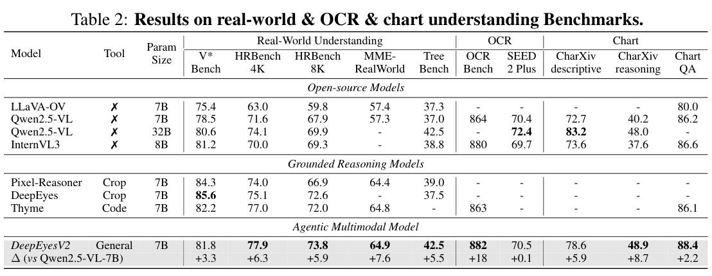
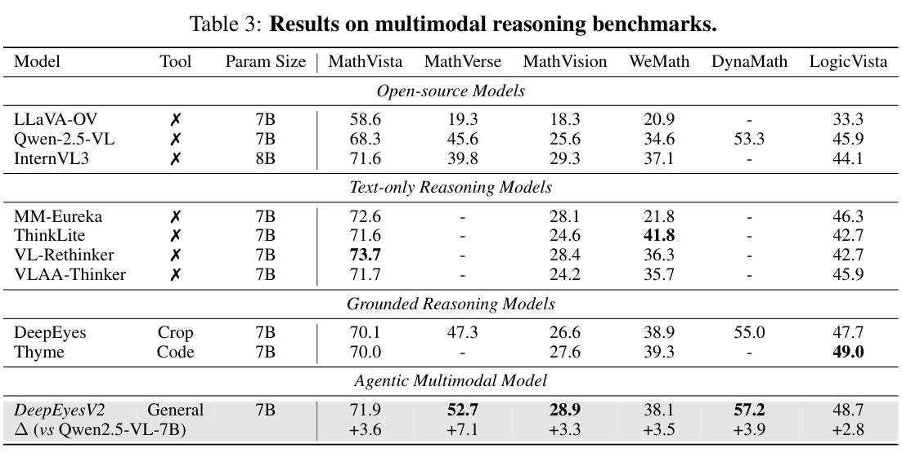

# DeepEyesV2: Toward Agentic Multimodal Model

> WJ 阅读版说明：本文不是逐字全文转载，而是按论文结构做中英对照式精读。英文部分保留为段落要义和术语锚点，中文部分给出翻译、解释和与 `Reasoning` 目录中其他论文的关系。

## Abstract

> <strong>EN gist:</strong> DeepEyesV2 argues that multimodal agents should understand text/images and actively call external tools such as code execution and web search. Direct RL does not reliably produce tool use, so the paper uses cold-start SFT followed by RL. It also introduces RealX-Bench for perception-search-reasoning integration.

> <strong>CN:</strong> DeepEyesV2 的核心观点是，多模态模型不能只停留在“看图+文字推理”，还应该能够主动调用外部工具，例如代码执行环境和网页搜索，并把这些工具返回的证据纳入后续推理。作者发现，直接用强化学习并不能稳定诱导工具使用，于是采用两阶段训练：先用 cold-start SFT 建立工具调用模式，再用 RL 优化调用策略。论文还提出 RealX-Bench，用来评估感知、搜索和推理三类能力的协同。

> <strong>WJ note:</strong> 这篇的定位比 DeepEyes 更 agentic：DeepEyes 主要学 active perception，DeepEyesV2 学的是“会不会把图像操作、计算和搜索组织成一个闭环”。

## 1. Introduction

### 1.1 Why agentic multimodal reasoning

> <strong>EN gist:</strong> Existing VLMs can solve many visual tasks, but real-world questions often require operations beyond direct perception: local image manipulation, numerical computation, and external knowledge acquisition.

> <strong>CN:</strong> 现有 VLM 已经能完成大量视觉理解任务，但真实世界问题经常超出“直接看图回答”的范围。模型可能需要裁剪局部、旋转或增强图像、进行数值计算，或者搜索外部知识。因此，agentic multimodal reasoning 的关键不是给模型更长 CoT，而是让模型能够在推理过程中主动选择工具，并把工具结果反馈到下一步。

### 1.2 Tool types

> <strong>EN gist:</strong> The paper distinguishes operation tools and knowledge tools. Operation tools transform or analyze visual/numerical inputs, while knowledge tools retrieve external information.

> <strong>CN:</strong> DeepEyesV2 的工具可以粗分成两类：一类是操作型工具，例如图像裁剪、标注、数值分析、Python 代码执行；另一类是知识型工具，例如文本搜索和图像搜索。前者增强模型对输入本身的处理能力，后者补全图像外部的世界知识。

### 1.3 Why direct RL is insufficient

> <strong>EN gist:</strong> The authors test direct RL on Qwen2.5-VL-7B and find that tool use either disappears or becomes shallow. This motivates cold-start training.

> <strong>CN:</strong> 作者先用 Qwen2.5-VL-7B 做直接 RL 实验。没有工具奖励时，模型早期会尝试写代码，但因为代码质量差，很快退回普通文本推理；加入工具奖励后，模型更愿意输出工具调用格式，但经常只是形式化调用或占位式代码。这个结果说明：RL 可以强化已经存在的行为，但很难从零探索出复杂且稳定的工具使用。

## 2. Method

### 2.1 Overall pipeline

> <strong>EN gist:</strong> DeepEyesV2 generates reasoning steps, emits tool calls when useful, receives environment feedback, and continues reasoning until the final answer.

> <strong>CN:</strong> DeepEyesV2 的推理流程是交互式的。模型先写中间推理，如果判断需要工具，就输出代码或搜索请求；环境执行后返回结果，模型再把这些结果纳入上下文继续推理。这个循环可以多次发生，直到模型输出最终答案。

> <strong>WJ note:</strong> 图 3 里最重要的是绿色斜线的 feedback，不是工具图标。feedback 意味着每次工具调用都能改变后续 CoT，这才是 agentic reasoning 与一次性 visual token insertion 的区别。

### 2.2 Data construction

> <strong>EN gist:</strong> Training data are filtered so that tool use is beneficial. Easy samples and unsolvable samples are less useful for teaching tool behavior.

> <strong>CN:</strong> 作者强调数据筛选：训练样本应该是工具调用真正有帮助的中等难度题。太简单的题不需要工具，太难且工具也解不了的题会给训练制造噪声。冷启动数据包含感知型 agent 轨迹、推理型 agent 轨迹和 long CoT 数据；前两者让模型学会具体工具行为，后者增强基础推理能力。

### 2.3 Cold-start SFT

> <strong>EN gist:</strong> Cold-start SFT teaches the model the format and basic patterns of code/tool invocation.

> <strong>CN:</strong> Cold-start SFT 的作用是给模型一个可学习的行为先验：什么时候写代码、代码块怎样被执行、工具结果如何回到推理、最终答案格式是什么。没有这一步，RL 的稀疏奖励很难把模型带到正确策略空间。

### 2.4 Agentic RL

> <strong>EN gist:</strong> After cold start, RL optimizes dynamic tool-use decisions with sparse outcome and format rewards.

> <strong>CN:</strong> RL 阶段让模型在交互环境中决定“是否调用工具、调用什么工具、调用几次”。奖励由答案正确性和格式约束组成，即 `R = R_acc + R_format`。这说明论文没有把每一步工具选择写死，而是让模型通过最终结果学习更自适应的工具策略。

## 3. RealX-Bench

> <strong>EN gist:</strong> RealX-Bench evaluates real-world multimodal reasoning with overlapping labels for perception, search, and reasoning difficulty.

> <strong>CN:</strong> RealX-Bench 是论文的新 benchmark，共 300 个问答样本，覆盖真实世界场景。每个样本会标注它是否在 perception、search、reasoning 上有挑战，这些标签不是互斥的。有些问题同时需要看清图像、检索外部知识、再多步推理，因此能测试模型的综合协调能力。

> <strong>WJ note:</strong> 这张表可以作为以后评价 agentic VLM 的模板：不要只看平均分，要专门看 integration 子集。DeepEyesV2 平均 28.3、人类 70.0，说明还有很大空间。

## 4. Experiments

### 4.1 Implementation details

> <strong>EN gist:</strong> The backbone is Qwen2.5-VL-7B. SFT uses batch size 128 and learning rate 1e-5 for 3 epochs. RL uses DAPO with batch size 256 and 16 rollouts per prompt.

> <strong>CN:</strong> 模型基座是 Qwen2.5-VL-7B。SFT 阶段 batch size 为 128，学习率为 `1e-5`，训练 3 个 epoch；RL 阶段采用 DAPO，batch size 256，每个 prompt 采样 16 个 rollout，学习率为 `1e-6`，最大响应长度为 16,384 tokens。除 RealX-Bench 外，评测主要用 VLMEvalKit。

### 4.2 Real-world / OCR / chart

> <strong>EN gist:</strong> DeepEyesV2 improves over Qwen2.5-VL-7B on most real-world, OCR, and chart benchmarks, especially HRBench, MME-RealWorld, TreeBench, OCRBench, and chart reasoning.

> <strong>CN:</strong> 在真实世界理解、OCR、图表理解上，DeepEyesV2 相对 Qwen2.5-VL-7B 多数指标提升明显。例如 HRBench-4K 从 71.6 到 77.9，MME-RealWorld 从 57.3 到 64.9，OCRBench 从 864 到 882，ChartQA 从 86.2 到 88.4。它的优势不是单项绝对最强，而是工具能力覆盖面更广。

### 4.3 Multimodal reasoning

> <strong>EN gist:</strong> Tool-augmented reasoning improves mathematical and logical benchmarks.

> <strong>CN:</strong> 在数学与逻辑推理上，DeepEyesV2 也有稳定提升。MathVerse 从 Qwen2.5-VL-7B 的 45.6 提升到 52.7，MathVision 从 25.6 到 28.9，DynaMath 从 53.3 到 57.2。这个结果说明，代码执行和数值分析工具不仅服务视觉定位，也能帮助中间计算和答案验证。

### 4.4 Search-oriented benchmarks

> <strong>EN gist:</strong> DeepEyesV2 performs strongly on search-oriented benchmarks, though gains are not uniform across all datasets.

> <strong>CN:</strong> 搜索类任务最能体现 DeepEyesV2 的 agentic 属性。论文报告 DeepEyesV2 在 FVQA-test、MMSearch、SimpleVQA 上分别比 Qwen2.5-VL Search 高 7.7、11.5、7.8；但在 InfoSeek 上低 2.6。这说明搜索能力并不是简单接入搜索 API 就能解决，query 构造和证据利用仍然是瓶颈。

## 5. Analysis

### 5.1 Cold-start data ablation

> <strong>EN gist:</strong> Perception data mainly improves perception tasks; reasoning and long-CoT data are needed for complex reasoning. The best cold-start result uses diverse data.

> <strong>CN:</strong> Cold-start 消融表明，单独加入 perception agent data 会显著提升 V* Bench，但对 MathVerse 提升有限；加入 long CoT 后，复杂推理能力明显增强。最终组合 perception + reason + long CoT 在 V* Bench、CharXiv、MathVerse 等指标上最均衡。

### 5.2 RL data ablation

> <strong>EN gist:</strong> RL data diversity is necessary. Search data specifically improves retrieval-oriented benchmarks.

> <strong>CN:</strong> RL 数据消融进一步证明：感知、推理、搜索数据各自贡献不同能力。只用 perception RL data 会增强视觉理解但损害搜索；只用 reasoning data 会增强数学但不能替代搜索；加入 search data 后 InfoSeek 和 MMSearch 明显提升。最终完整模型在 MMSearch 达到 63.7。

### 5.3 Tool distribution and adaptive thinking

> <strong>EN gist:</strong> The model learns task-dependent tool preferences. RL reduces unnecessary tool calls while preserving complex tool use for difficult examples.

> <strong>CN:</strong> 工具分布显示，DeepEyesV2 会根据任务选择不同工具。感知任务偏 crop，图表和数学偏 numerical analysis，搜索任务偏 image/text search。RL 后模型不是盲目增加工具调用，而是减少不必要调用，同时保留难题中的复杂工具组合。这个行为被作者称为 adaptive thinking。

## 6. Conclusion

> <strong>EN gist:</strong> The paper presents a practical recipe for agentic multimodal training: curated cold-start data, RL in an interactive environment, and evaluation on integrated perception-search-reasoning tasks.

> <strong>CN:</strong> DeepEyesV2 给出的路线是：先用经过筛选的 cold-start 数据让模型学会工具使用模式，再通过交互环境中的 RL 优化自适应调用策略，最后用 RealX-Bench 这种综合 benchmark 检查能力整合。它的贡献不只是多加了搜索工具，而是把“视觉推理模型如何成为工具型多模态 agent”这个问题变成了可训练、可消融、可评测的系统。

## 7. 与本目录其他论文的连接

- **DeepEyes**: DeepEyesV2 是 DeepEyes 的 agentic 扩展，从 active perception 扩展到代码执行和搜索。
- **Thyme**: 两者都训练模型写代码做图像/数学操作；DeepEyesV2 额外强调搜索与异质工具组合。
- **Qwen Look Again**: Qwen-LA 学反思式回看视觉 token；DeepEyesV2 学工具调用决策。
- **PatchCue / MINT-CoT / PFlowNet**: 这些方法训练中间视觉表示或轨迹；DeepEyesV2 训练环境交互策略。
- **TrainingFree 线**: DeepScan/VisRef/PRCR 等更像测试时修补视觉证据；DeepEyesV2 则把工具策略写入参数。

## 8. 快速复盘

1. DeepEyesV2 的核心不是“加一个工具”，而是让模型在多轮推理里选择并组合工具。
2. 直接 RL 不够，需要 cold-start SFT 先建立基本工具行为。
3. RealX-Bench 的价值在于测 perception/search/reasoning integration。
4. 消融实验显示 perception、reasoning、search 数据不能互相替代。
5. RL 后模型学到更少但更合适的工具调用，这比单纯提高 tool-call frequency 更重要。
