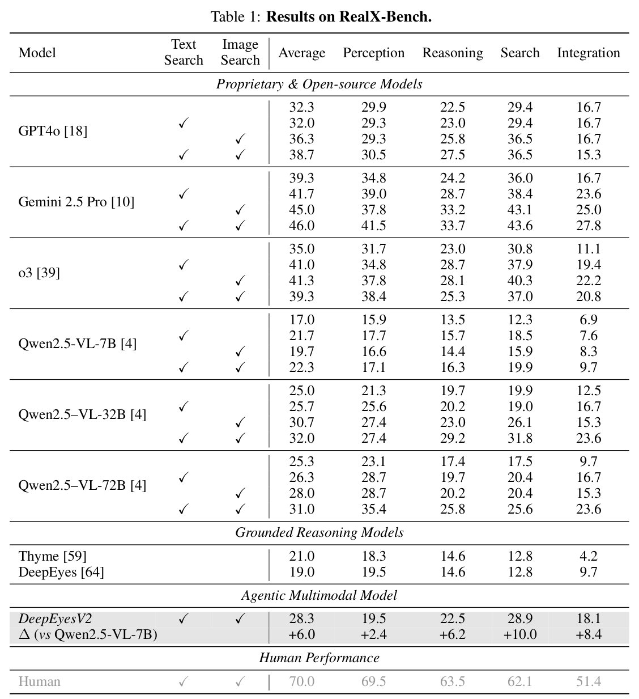
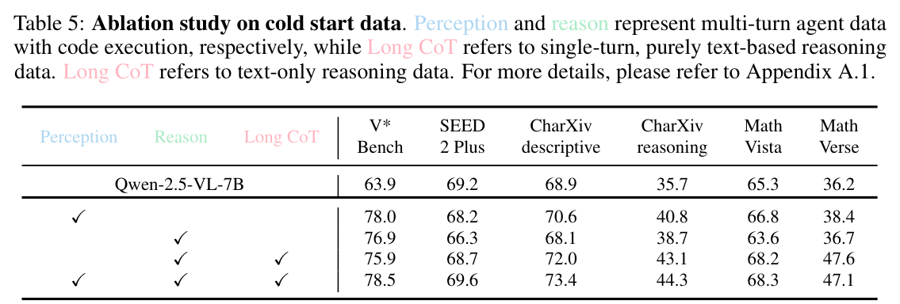
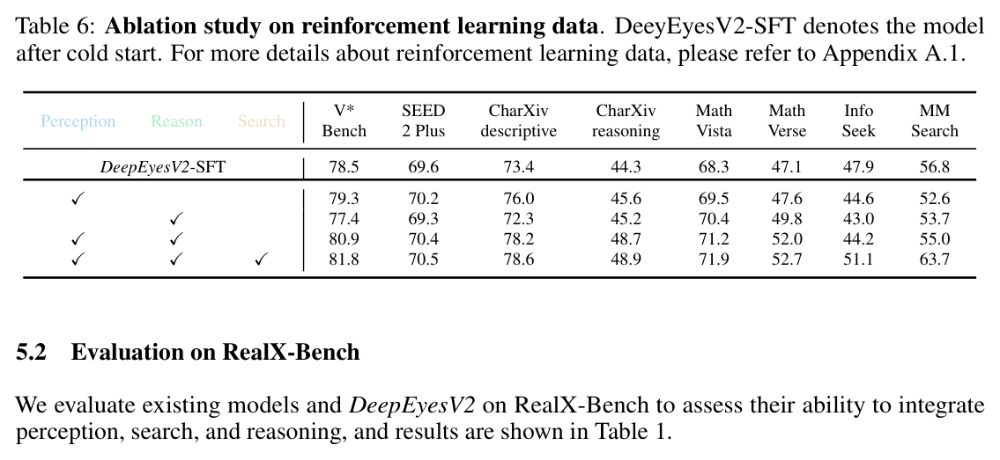

---
tags:
  - papers/reasoning
  - papers/multimodal
aliases:
  - DeepEyesV2
---

# DeepEyesV2: Toward Agentic Multimodal Model

## 核心信息

- 标题: DeepEyesV2: Toward Agentic Multimodal Model
- 标题翻译: DeepEyesV2：迈向智能体式多模态模型
- 作者: Jack Hong, Chenxiao Zhao, ChengLin Zhu, Weiheng Lu, Guohai Xu, Xing Yu
- 发表时间: 2025-11-07
- 发表渠道: arXiv
- DOI: 10.48550/arxiv.2511.05271
- arXiv: 2511.05271
- 论文链接: https://arxiv.org/abs/2511.05271v4
- 代码 / 项目: https://github.com/Visual-Agent/DeepEyesV2
- 论文类型: 多模态模型方法与基准论文

## 原文摘要翻译

智能体式多模态模型不应只理解文本和图像，还应主动调用外部工具（例如代码执行环境和网络搜索），并将这些操作整合进推理过程。本文提出 DeepEyesV2，并从数据构建、训练方法和模型评测三个角度探索如何构建智能体式多模态模型。我们观察到，仅依靠直接强化学习无法诱导出稳健的工具使用行为。因此，本文采用两阶段训练流程：先通过冷启动阶段建立工具使用模式，再通过强化学习阶段进一步优化工具调用。我们整理了多样且难度适中的训练数据，特别纳入工具使用确实有帮助的样本。此外，我们提出 RealX-Bench，这是一个用于评测真实世界多模态推理的综合基准，其任务天然要求整合感知、搜索和推理等多种能力。我们在 RealX-Bench 及其他代表性基准上评测 DeepEyesV2，结果显示其在真实世界理解、数学推理和搜索密集型任务上均有效。DeepEyesV2 还表现出任务自适应的工具调用：感知任务倾向使用图像操作，推理任务倾向使用数值计算。强化学习进一步使模型能够组合复杂工具，并根据上下文选择性地调用工具。我们希望本研究能为构建智能体式多模态模型提供参考。

## 创新点

1. 提出冷启动 SFT 加智能体式 RL 的两阶段训练范式，区分“学会工具协议”和“优化调用策略”。
2. 构建 RealX-Bench，将感知、搜索与推理的组合能力放进同一真实世界评测。
3. 设计工具有益性导向的数据筛选，并用行为分析显示模型会按任务选择图像操作、搜索或数值计算。

## 一句话总结

DeepEyesV2 把 `“思考图像”` 推进到 **智能体式多模态模型**：模型不只是回看图像，而是在推理循环中主动选择代码执行、图像操作、文本搜索和图像搜索等工具；论文最核心的经验结论是，**直接 RL 很难自然学出稳定工具使用，必须先用 cold-start SFT 建立工具调用格式和基本轨迹，再用 RL 学会何时调用、如何组合、何时不调用**。

## 研究问题

视觉推理模型的能力正在从“看图答题”转向“看图、操作图、查信息、计算、再答题”。旧的“思考图像”工作通常只关注视觉证据回看，例如裁剪局部、插入视觉标记、强化视觉注意力。DeepEyesV2 的问题更宽：真实世界问题经常同时需要三类能力。

1. **Perception**: 从复杂图像中找对象、读文字、定位细节。
2. **Search**: 通过网页或图像检索补全外部知识。
3. **Reasoning**: 把视觉证据、搜索证据和中间计算合成答案。

作者认为，如果模型只是“有工具可用”，不等于它能成为 agentic model。关键难点是：模型要在推理时自己判断工具是否必要、选择哪类工具、如何把工具结果接回下一步推理。直接用 RL 从 base VLM 开始训练时，模型会因为初始工具调用能力太弱而陷入不稳定探索；这就是论文采用两阶段训练的动机。

## 方法主线

### 机制流程

1. 输入图像与问题后，模型先生成文本推理，并判断是否需要外部证据或计算。
2. 模型输出代码、文本搜索或图像搜索请求，环境执行后返回结构化反馈。
3. 反馈被插回上下文，模型继续推理并可再次调用工具，直到生成答案。
4. 冷启动建立可执行轨迹，随后强化学习以答案正确性和格式约束优化调用时机与组合。

### 3.1 Agentic reasoning loop

DeepEyesV2 的推理过程是一个闭环：模型先生成文本 CoT，若判断需要工具，就输出代码或搜索请求；环境执行工具后把反馈结果返回上下文，模型继续推理，直到给出最终答案。

**图 3：DeepEyesV2 的工具调用与环境反馈流程**

*Caption: Tool calls, environment execution, and feedback reinsertion form a closed reasoning loop.*

**Caption:** Tool calls, environment execution, and feedback reinsertion form a closed reasoning loop.

**Caption[CN]:** 图 3 展示工具调用、环境执行与反馈回插的推理闭环。

图 3 的重点不是工具列表本身，而是 **environment feedback** 被插回后续 CoT。模型可调用的工具包括：

- 代码执行: 图像裁剪、标注、旋转、增强、数值计算、其他 Python 操作。
- 搜索工具: 文本搜索与图像搜索。
- 多轮反馈: 每次工具调用都可以改变下一步计划。

这使 DeepEyesV2 与 DeepEyes/Thyme 的差异变得清楚：DeepEyes 偏主动视觉感知，Thyme 偏代码操作图像，而 DeepEyesV2 试图把视觉操作、数值计算和网络搜索统一进一个 智能体式多模态推理闭环。

### 3.2 为什么不能直接 RL

论文先做了 先导实验：用 Qwen2.5-VL-7B 直接 RL，分别测试没有工具奖励和加入工具奖励的情况。

**图 4：直接强化学习先导实验中的工具使用失败模式**

*Caption: Failure modes of direct reinforcement learning in the tool-use pilot.*

**Caption:** Failure modes of direct reinforcement learning in the tool-use pilot.

**Caption[CN]:** 图 4 展示无工具奖励和有工具奖励时直接强化学习的失败模式。

作者观察到两种失败模式：

- 没有 tool bonus 时，模型早期尝试写代码，但经常生成错误代码，随后逐渐退回普通文本 CoT。
- 加上 tool bonus 后，模型会更频繁地产生工具调用形式，但容易出现占位式代码或低质量调用，说明“想调用工具”不等于“会调用工具”。

这个实验是整篇论文的训练逻辑支点：**RL 能优化已有行为，但很难从零发明稳定复杂工具使用协议**。因此作者先做 cold-start SFT，让模型学会基本工具轨迹，再让 RL 优化策略。

### 3.3 Cold-start 数据构建

Cold-start 阶段的目标不是追求最大数据量，而是构建“工具确实有帮助”的中等难度样本。作者把数据分成几类：

- perception-oriented agent data: 适合用裁剪、标注、图像处理等工具解决。
- reasoning-oriented agent data: 适合用代码计算、数学验证和多步推理。
- long CoT data: 单轮文本长推理，用来增强基础思维能力。

数据筛选逻辑很重要：如果 base model 已经能直接做对，样本对工具学习价值有限；如果工具也无法帮助解题，样本会制造噪声。作者保留的是“工具可使问题变得可解”的样本，并且只保留最终答案正确、代码无错误的轨迹。

### 3.4 Agentic RL

Cold-start 之后，DeepEyesV2 用 RL 继续训练。奖励非常简洁：

$$R = R_{\mathrm{acc}} + R_{\mathrm{format}}$$

也就是说，论文没有给每个中间工具步骤设计复杂人工奖励，而是让模型在交互环境里通过最终正确性和格式约束学习策略。这一选择有两个含义。

1. 工具使用不被硬编码成固定模板，模型可以自己探索组合。
2. 如果 cold-start 不够好，稀疏奖励很难帮模型走到正确策略区域。

因此，cold-start 和 RL 是互补关系：前者提供行为先验，后者提供自适应选择能力。

## 数据与任务定义

DeepEyesV2 不只提出训练方法，还提出 RealX-Bench。作者认为现有 基准 常把感知、搜索、推理拆开评估，不能有效测试“能力组合”。RealX-Bench 包含 300 个问答样本，覆盖五类真实世界场景，并给每题标注 感知、搜索、推理 难度标签；其中有一部分题同时需要三类能力。

**表 1：RealX-Bench 结果**

*Caption: RealX-Bench results across capability-combination subsets.*

**Caption:** RealX-Bench results across capability-combination subsets.

**Caption[CN]:** 表 1 比较不同模型在 RealX-Bench 各能力组合子集上的结果。

关键结果：

- DeepEyesV2 在 RealX-Bench 平均准确率为 **28.3**，比 Qwen2.5-VL-7B 加文本+图像搜索的设置高 **+6.0**。
- 在 Search 子集上，DeepEyesV2 得到 **28.9**，比 Qwen2.5-VL-7B 搜索设置高 **+10.0**。
- 在 Integration 子集上，DeepEyesV2 得到 **18.1**，比 Qwen2.5-VL-7B 高 **+8.4**。
- 人类平均 **70.0**，Integration 为 **51.4**，说明这个 基准 对当前模型仍很难。

这个表也说明：仅仅给 GPT-4o、Gemini、o3 加入搜索 并不能自动解决三能力整合。Gemini 2.5 Pro 加文本+图像搜索时平均最高可到 46.0，但 综合子集只有 27.8；模型在“同时需要看、搜、推”的任务上仍明显掉队。

## 关键结果

### 5.1 Real-world / OCR / chart understanding

**表 2：真实世界、OCR 与图表理解结果**

*Caption: Real-world, OCR, and chart-understanding benchmark results.*

**Caption:** Real-world, OCR, and chart-understanding benchmark results.

**Caption[CN]:** 表 2 报告真实世界、OCR 与图表理解基准。

DeepEyesV2 相对 Qwen2.5-VL-7B 有稳定提升：

- V* Bench: **81.8**, +3.3
- HRBench-4K: **77.9**, +6.3
- HRBench-8K: **73.8**, +5.9
- MME-RealWorld: **64.9**, +7.6
- TreeBench: **42.5**, +5.5
- OCRBench: **882**, +18
- ChartQA: **88.4**, +2.2

需要注意，DeepEyesV2 并非所有指标都超过更大的模型：在 V* 基准上，DeepEyes 得分 85.6 更高，InternVL3 得分 81.2 与 DeepEyesV2 接近。但 DeepEyesV2 的优势在于工具类型更通用，能够覆盖文字识别、图表、搜索和数学推理。

### 5.2 Multimodal reasoning

**表 3：多模态推理结果**

*Caption: Multimodal reasoning benchmark results.*

**Caption:** Multimodal reasoning benchmark results.

**Caption[CN]:** 表 3 报告多模态推理基准。

DeepEyesV2 在数学和逻辑相关 基准 上相对 Qwen2.5-VL-7B 提升：

- MathVista: **71.9**, +3.6
- MathVerse: **52.7**, +7.1
- MathVision: **28.9**, +3.3
- WeMath: **38.1**, +3.5
- DynaMath: **57.2**, +3.9
- LogicVista: **48.7**, +2.8

这里最值得记的是 MathVerse：DeepEyesV2 的 52.7 高于 DeepEyes 的 47.3，说明泛化工具调用不仅帮助检索，也帮助数学中间计算和验证。

### 5.3 搜索类基准

搜索类 基准 是 DeepEyesV2 最能体现 agentic 属性的部分。论文报告：

- FVQA-test: **60.6**, 比 Qwen2.5-VL Search 高 +7.7
- InfoSeek: **51.1**, 比 Qwen2.5-VL Search 低 -2.6
- MMSearch: **63.7**, 高 +11.5
- SimpleVQA: **59.4**, 高 +7.8

InfoSeek 的负增益很有意思：说明 DeepEyesV2 不是“所有搜索任务必胜”，可能与检索查询构造、证据抽取或数据分布有关。但 MMSearch 和 SimpleVQA 的增益较大，支持作者关于工具组合能力的主张。

### 消融实验

### 6.1 Cold-start data ablation

**表 5：冷启动数据消融**

*Caption: Cold-start data ablation results.*

**Caption:** Cold-start data ablation results.

**Caption[CN]:** 表 5 比较不同冷启动数据组合。

冷启动监督微调的数据组合很关键。Qwen2.5-VL-7B 基线在 V* 与 MathVerse 上分别为 **63.9 / 36.2**。只加入感知智能体数据后，V* 提升到 **78.0**，但 MathVerse 只有 **38.4**；只加入推理智能体数据后，数学能力也没有稳定大幅提升。加入长链式思维后，MathVerse 提升明显，最高组合达到 **47.1**。

作者的结论可以概括为：**工具使用需要任务多样性，复杂推理还需要 long CoT 的思维底座**。如果只教模型裁剪图像，它会更会看，但不会自动更会算；如果只教推理轨迹，它也未必学会视觉工具选择。

### 6.2 RL data ablation

**表 6：强化学习数据消融**

*Caption: Reinforcement-learning data ablation results.*

**Caption:** Reinforcement-learning data ablation results.

**Caption[CN]:** 表 6 比较不同强化学习数据组合。

强化学习数据消融更直接展示三类能力的互补性。DeepEyesV2-SFT 在多模态搜索任务上的得分为 **56.8**；加入感知数据与推理数据但不加入搜索数据时只有 **55.0**；加入搜索数据后，搜索任务达到 **63.7**，知识检索达到 **51.1**。最终版本在 V*、MathVerse 和多模态搜索任务上分别为 **81.8 / 52.7 / 63.7**。

这说明 RL 阶段不能只靠视觉和数学任务间接诱导搜索能力；如果目标是 智能体式多模态模型，训练数据必须覆盖要调用的外部能力。

### 工具使用行为分析

**图 6：不同任务上的工具分布**

*Caption: Task-adaptive tool distributions.*

**Caption:** Task-adaptive tool distributions.

**Caption[CN]:** 图 6 显示不同任务上的任务自适应工具分布。

工具分布图是论文里很有价值的一张图。它显示 DeepEyesV2 的工具选择具有任务依赖性：

- V* 等细粒度感知任务主要调用 crop。
- OCR 和图表任务会混合 crop、mark 和 numerical analysis。
- MathVista/MathVerse 更偏 numerical analysis。
- MMSearch/InfoSeek 更偏 image search 和 text search。

RL 后的变化也很关键：模型不是简单“更多调用工具”，而是变得更选择性。论文报告 RL 后 tool-calling frequency 下降，平均响应长度也下降，但工具调用次数的方差仍较高。这意味着模型学到的是 **adaptive thinking**：简单题少调或不调工具，难题仍可多轮组合工具。

## 深度分析

### 8.1 与 DeepEyes

DeepEyes 学的是 主动感知：模型通过 RL 学会主动视觉定位和裁剪。DeepEyesV2 则把主动感知扩展为通用 agent 工具调用，加入代码执行和搜索。可以把 DeepEyes 看作 DeepEyesV2 的视觉工具前身。

### 8.2 与 Thyme

Thyme 强调通过可执行代码进行图像操作和数学计算，重点是“超越图像思考”。DeepEyesV2 与 Thyme 很接近，但 DeepEyesV2 更强调工具集合的异质性，尤其把 网络搜索 纳入同一个推理循环，并通过 RealX-Bench 检查 感知、搜索、推理 的组合。

### 8.3 与 Qwen Look Again / PatchCue / MINT-CoT / PFlowNet

这些论文都属于训练型路线，但中间表示不同：

- Qwen Look Again: 学会反思式重新关注视觉标记。
- PatchCue: 学 patch-level cue。
- MINT-CoT: 学数学推理中的 interleaved visual tokens。
- PFlowNet: 学 perceptual flow 轨迹。
- DeepEyesV2: 学工具调用策略和环境反馈整合。

因此 DeepEyesV2 的独特性不是视觉中间表示最细，而是 agentic action space 最宽。

### 8.4 与 TrainingFree 路线

DeepScan/ICoT/DaP-ICoT/VisRef/PRCR 都在测试时增强视觉证据，不改模型参数或尽量少改。DeepEyesV2 相反：它把工具使用内化成模型策略。优点是推理过程更自适应，缺点是训练成本、数据构建和安全沙箱依赖更重。

## 我的笔记

1. **写 相关工作 时**，它可作为 智能体式多模态推理 的训练型代表，与 测试时视觉重聚焦 区分。
2. **设计自己方法时**，最可借鉴的是两阶段范式：先建立工具协议，再用 RL 优化选择，而不是直接让 RL 从零探索。
3. **做 基准 时**，RealX-Bench 的三能力交叉标注很有参考价值。多模态推理 基准 不应只看“单项能力”，还要看能力组合。
4. **做 ablation 时**，它提醒我们把 perception/reasoning/search 数据分开评估，否则很难解释工具能力来自哪里。

## 局限

1. **直接 RL 失败是否依赖 base model？** 论文用 Qwen2.5-VL-7B 做 先导实验，但更强 base model 可能初始工具能力更好。
2. **工具调用正确性主要来自训练还是环境工程？** 代码执行、搜索返回格式、sandbox 质量都会影响最终效果。
3. **RealX-Bench 只有 300 QA pairs。** 它有启发性，但规模不大，后续需要更多场景和更细粒度错误分析。
4. **搜索能力仍不稳定。** InfoSeek 相对 Qwen2.5-VL Search 出现负增益，说明 查询规划 和 证据选择 仍有优化空间。
5. **工具安全没有展开。** 一旦模型可生成代码和使用搜索，安全、权限和可审计性会成为实际部署问题。

### 术语速记

- **Agentic Multimodal Model**: 能在文本/图像理解之外主动调用外部工具，并把反馈纳入推理循环的多模态模型。
- **Cold-start SFT**: 先用高质量轨迹教会模型基本工具调用格式与策略。
- **Agentic RL**: 在交互环境中训练模型动态决定是否调用工具、调用什么工具、如何利用结果。
- **RealX-Bench**: 评估 感知、搜索、推理 综合能力的真实世界多模态 基准。
- **Adaptive Thinking**: RL 后模型减少无谓工具调用，但保留复杂任务中的多轮工具组合能力。

## 引用

- Hong, J., Zhao, C., Zhu, C., et al. *DeepEyesV2: Toward Agentic Multimodal Model*. arXiv:2511.05271, 2025. https://arxiv.org/abs/2511.05271
- 论文主张、训练流程与实验数字依据本地 PDF 正文和附录核对；重点证据包括直接强化学习先导实验、工具反馈闭环、RealX-Bench、冷启动与强化学习数据消融，以及工具分布分析。
- 复现时应保存冷启动数据筛选规则、工具执行环境、奖励格式约束和各能力子集的独立结果；仅复现最终平均分不足以判断工具使用是否真正改善。
