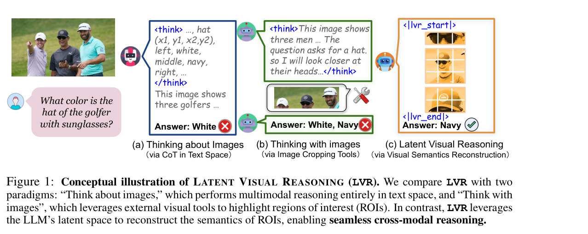
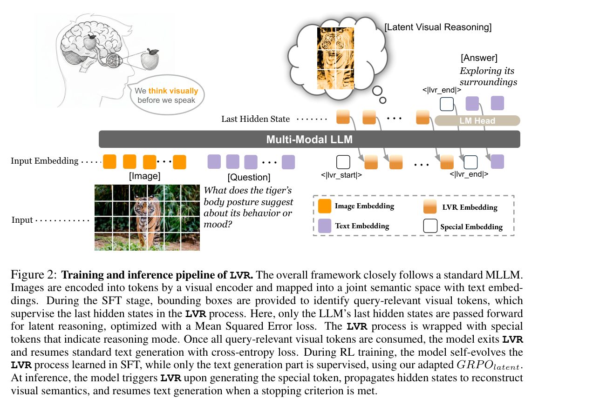
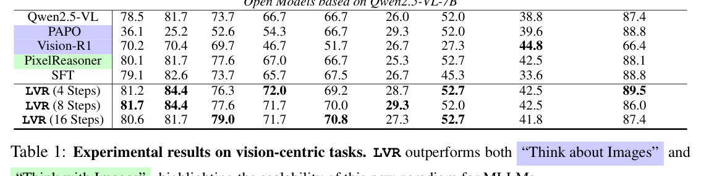
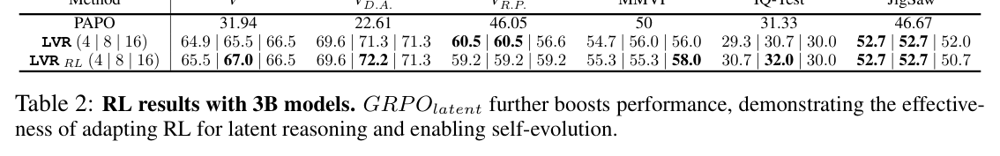

# Latent Visual Reasoning｜潜在视觉推理（完整双语读本）

## Metadata｜元数据

- **Title:** Latent Visual Reasoning
- **Authors:** Bangzheng Li, Ximeng Sun, Jiang Liu, Ze Wang, Jialian Wu, Xiaodong Yu, Hao Chen, Emad Barsoum, Muhao Chen, Zicheng Liu
- **Affiliations:** University of California, Davis; Advanced Micro Devices, Inc.
- **Version:** arXiv:2509.24251v2 [cs.CV], 5 Oct 2025; Preprint
- **Source:** 15-page user-supplied PDF
- **Reading policy:** All substantive source sections are retained in source order. References remain in their original searchable bibliographic form rather than being translated. Validated crops for Figures 1–2 and Tables 1–3 are placed near their first substantive mentions; tables are also transcribed as searchable Markdown.

## Page / section index｜页码与章节索引

| PDF pages | Source content |
|---|---|
| 1–3 | Metadata; Abstract; 1 Introduction; Figure 1; 2 Related Works |
| 4–7 | Figure 2; 3 LVR; 3.1 Method Overview; 3.2 SFT/RL; Equations (1)–(6); 3.3 Decoding; 4 Experiment; 4.1 Benchmarks |
| 8–9 | Tables 1–3; 4.2 Baselines; 4.3 Main Results; 4.4 RL Results; 4.5 Ablations |
| 10–14 | Conclusion; Ethics; Reproducibility; References |
| 15 | Appendix A.1 Usage of LLMs |

## Terminology ledger｜术语表

| Exact term | 中文对应 / 说明 |
|---|---|
| Latent Visual Reasoning (LVR) | 潜在视觉推理；保留缩写 LVR |
| latent visual thoughts | 潜在视觉思维 |
| Think/Thinking about Images | “思考图像”：只在文本空间进行 CoT |
| Think/Thinking with Images | “借助图像思考”：调用外部视觉工具 |
| region of interest (ROI) | 感兴趣区域（ROI） |
| visual tokens / embeddings | 视觉 token / 视觉嵌入 |
| last hidden state | 最后一层隐藏状态 |
| Supervised Finetuning (SFT) | 监督微调（SFT） |
| Group Relative Policy Optimization (GRPO) | 组相对策略优化（GRPO） |
| `GRPO_latent` | 面向潜在推理的 GRPO 变体；标识符保持不译 |
| Fixed Token | 固定步数解码 |
| Latent End Token | 潜在结束 token |
| Mode Switching Loss | 模式切换损失 |
| V$^*$ Bench: VD.A. / VR.P. | 视觉细节搜索 / 相对空间推理子集 |

# Abstract｜摘要

> <span style="color:#3B82F6"><strong>Para. 1:</strong></span> Multimodal Large Language Models (MLLMs) have achieved notable gains in various tasks by incorporating Chain-of-Thought (CoT) reasoning in language spaces. Recent work extends this direction by leveraging external tools for visual editing, thereby enhancing the visual signal along the reasoning trajectories. Nevertheless, these approaches remain fundamentally constrained: reasoning is still confined to the language space, with visual information treated as static preconditions. We introduce Latent Visual Reasoning (LVR), a new paradigm that enables autoregressive reasoning directly in the visual embedding space. A visual encoder first projects images into visual tokens within a joint semantic space shared with the language model. The language model is then trained to generate latent states that reconstruct key visual tokens critical for answering the query, constituting the process of latent visual reasoning. By interleaving LVR with standard text generation, our model achieves substantial gains on perception-intensive visual question answering tasks. In addition, we adapt the GRPO algorithm to conduct reinforcement learning on latent reasoning, further balancing LVR and textual generation. We show that LVR substantially improves fine-grained visual understanding and perception, achieving 71.67% on MMVP compared to 66.67% with Qwen2.5-VL. Code base and model weights will be released later.

> <span style="color:#F59E0B"><strong>Para. 1[CN]:</strong></span> 多模态大语言模型（MLLM）通过在语言空间中引入思维链（CoT）推理，已在多种任务上取得显著进展。近期工作进一步利用外部工具编辑视觉内容，以增强推理轨迹中的视觉信号。然而，这类方法仍受根本限制：推理依旧局限于语言空间，视觉信息仅被视为静态前提。本文提出潜在视觉推理（LVR），一种可直接在视觉嵌入空间内执行自回归推理的新范式。视觉编码器首先把图像投影为视觉 token，使其进入与语言模型共享的联合语义空间；随后训练语言模型生成潜在状态，以重建回答查询所必需的关键视觉 token，由此形成潜在视觉推理过程。通过交错执行 LVR 与标准文本生成，模型在感知密集型视觉问答任务上取得显著提升。此外，作者改造 GRPO 算法以对潜在推理实施强化学习，进一步平衡 LVR 与文本生成。LVR 显著改善细粒度视觉理解与感知：MMVP 达到 71.67%，而 Qwen2.5-VL 为 66.67%。代码库与模型权重将在之后发布。

# 1 Introduction｜引言

> <span style="color:#3B82F6"><strong>Para. 1:</strong></span> Multimodal Large Language Models (MLLMs) (Li et al., 2024b; Bai et al., 2025b; Wang et al., 2025d) have shown remarkable capability in jointly understanding visual and textual content. By leveraging the generative capabilities of their backbone Large Language Models (LLMs), MLLMs extend the expressiveness of visual encoders beyond simple perception tasks. This advancement has enabled the integration of Chain-of-Thought (CoT) reasoning into MLLMs, allowing them to perform structured textual reasoning in response to complex multimodal queries. In this paradigm, the LLM decomposes a query into intermediate steps and resolves each step while conditioning on static visual inputs. This approach, referred to as “Thinking about Images” by Su et al. (2025d), has proven effective across scientific visual question answering (Zhang et al., 2023), mathematics (Huang et al., 2025a), and visual grounding (Bai et al., 2025c).

> <span style="color:#F59E0B"><strong>Para. 1[CN]:</strong></span> 多模态大语言模型（MLLM）（Li et al., 2024b; Bai et al., 2025b; Wang et al., 2025d）展现出联合理解视觉与文本内容的卓越能力。MLLM 借助其骨干大语言模型（LLM）的生成能力，使视觉编码器的表达力超越简单感知任务。这一进展使 CoT 推理得以融入 MLLM，从而针对复杂多模态查询执行结构化文本推理。在该范式下，LLM 将查询拆解为中间步骤，并在静态视觉输入的条件下逐步求解。Su et al. (2025d) 将其称为“Thinking about Images”，它已在科学视觉问答、数学和视觉定位等领域证明有效。

> <span style="color:#3B82F6"><strong>Para. 2:</strong></span> Further research has expanded the multimodal reasoning workspace by enabling active editing of input images alongside textual reasoning trajectories. Such editing includes drawing auxiliary lines (Hu et al., 2024), zooming in (Shao et al., 2024a; Su et al., 2025a; Surís et al., 2023), shifting image styles (Liu et al., 2025a), highlighting sub-regions (Fu et al., 2025), and more. During intermediate CoT steps, methods in this paradigm either call external tools or generate programs to manipulate images, re-encode the edited outputs, and inject the new image tokens as visual enhancements into subsequent textual reasoning. In this way, salient visual information is actively incorporated throughout reasoning. These methods are commonly termed “Thinking with Images”.

> <span style="color:#F59E0B"><strong>Para. 2[CN]:</strong></span> 后续研究通过在文本推理轨迹中主动编辑输入图像，扩展了多模态推理工作空间。这些编辑包括绘制辅助线、放大、转换图像风格、突出子区域等。在 CoT 的中间步骤中，此类方法调用外部工具或生成程序来操作图像，重新编码编辑结果，再将新的图像 token 作为视觉增强注入后续文本推理。由此，显著视觉信息会在整个推理过程中被主动纳入。这类方法通常称为“Thinking with Images”。

### Figure 1. LVR 概念图



**Caption:** Conceptual illustration of LATENT VISUAL REASONING (LVR). We compare LVR with two paradigms: “Think about images,” which performs multimodal reasoning entirely in text space, and “Think with images”, which leverages external visual tools to highlight regions of interest (ROIs). In contrast, LVR leverages the LLM’s latent space to reconstruct the semantics of ROIs, enabling seamless cross-modal reasoning.

**Caption[CN]:** 潜在视觉推理（LVR）的概念示意。本文将 LVR 与两种范式比较：“Think about images” 完全在文本空间内执行多模态推理；“Think with images” 借助外部视觉工具突出感兴趣区域（ROI）。相比之下，LVR 利用 LLM 的潜在空间重建 ROI 的语义，从而实现无缝的跨模态推理。

> <span style="color:#3B82F6"><strong>Para. 3:</strong></span> Both paradigms address a core limitation of current MLLMs: although sophisticated visual encoders project visual information into text spaces, backbone LLMs often fail to capture details most relevant to the query. Causes include modality projection bias, modality interference, and cross-modality attention bias. “Thinking about Images” adds task-relevant text tokens, increasing the chance of a correct answer, but excessive generation may let textual context dominate and overshadow visual inputs. “Thinking with Images” injects visual information through external tools and calibrates generated text against the original input, yet models may bypass newly injected sub-images because of training-data bias and remain limited by predefined tool operations. Thus, both categories mainly refine text generation, while the fundamental visual-input/text-generation gap persists.

> <span style="color:#F59E0B"><strong>Para. 3[CN]:</strong></span> 两种范式都试图解决当前 MLLM 的核心局限：尽管先进视觉编码器将视觉信息投影到文本空间，骨干 LLM 往往仍无法捕获与查询最相关的视觉细节，原因包括模态投影偏差、模态干扰和跨模态注意偏差。“Thinking about Images” 生成更多任务相关文本 token 来提高答对概率，但过度生成可能使文本上下文占据主导并遮蔽关键视觉输入。“Thinking with Images” 通过外部工具注入视觉信息、校准生成文本与原图的对齐；但受训练数据偏差影响，模型可能绕过新注入的子图，而且仍受预定义工具操作限制。因此，两类方法主要都在优化文本生成，视觉输入与最终文本答案之间的根本鸿沟依旧存在。

> <span style="color:#3B82F6"><strong>Para. 4:</strong></span> A parallel line explores omni-modality foundation models that accept and generate both text and images (Team, 2024; Deng et al., 2025b; Xie et al., 2025). Image-generation capabilities have aided specific tasks such as navigation and maze solving, but it remains unclear whether decoding and re-encoding preserves original information. Since continuous visual tokens and discrete text tokens occupy a shared latent semantic space, the authors ask: **If visual and textual tokens are embedded in a joint semantics space within an MLLM, why not reason over both jointly as well?**

> <span style="color:#F59E0B"><strong>Para. 4[CN]:</strong></span> 另一条研究路线探索可同时接收并生成文本和图像的全模态基础模型。图像生成能力已在导航、迷宫求解等特定任务中发挥作用，但视觉输入经解码再编码后能否忠实保留原始信息仍不明确。鉴于连续视觉 token 与离散文本 token 处于共享潜在语义空间，作者提出：**如果 MLLM 中的视觉与文本 token 已嵌入联合语义空间，为何不也在二者之上联合推理？**

> <span style="color:#3B82F6"><strong>Para. 5:</strong></span> Extending reasoning beyond discrete text tokens to visual tokens is natural and efficient, but conventional LLMs operate on discrete tokens because of next-token prediction. Following latent reasoning with last hidden states (Hao et al., 2024), LVR modifies the Vision–Projector–LLM structure so the LLM alternates between LVR and standard text generation. In LVR, the last hidden state approximates question-relevant visual tokens; in text generation, the model predicts the next token. Both are autoregressive.

> <span style="color:#F59E0B"><strong>Para. 5[CN]:</strong></span> 将推理从离散文本 token 扩展到直接编码视觉信息的视觉 token 是自然且高效的，但传统 LLM 因下一 token 预测目标而只能操作离散 token。沿用通过最后隐藏状态进行潜在推理的思想，LVR 对 Vision–Projector–LLM 结构作简单而根本的修改，使 LLM 在 LVR 与标准文本生成之间交替。在 LVR 阶段，最后隐藏状态逼近与问题相关的视觉 token；在文本阶段，模型预测序列中的下一文本 token。两阶段均为自回归过程。

> <span style="color:#3B82F6"><strong>Para. 6:</strong></span> LVR uses two-stage training. SFT jointly optimizes internal LVR processes and text next-token prediction. RL then lets latent reasoning self-evolve using policy rewards from generated text, encouraging a unified semantic space. The adapted GRPO replays latent steps during policy-gradient computation; verifiable rewards score rollouts, while policy-gradient loss is computed solely from text-token distributions. Experiments show especially strong gains on perception-intensive and detail-dependent tasks.

> <span style="color:#F59E0B"><strong>Para. 6[CN]:</strong></span> LVR 采用两阶段训练。SFT 联合优化 LVR 内部过程与文本下一 token 预测；随后 RL 根据生成文本得到策略奖励，使潜在推理自我演化，并促进统一语义空间。改造后的 GRPO 在计算策略梯度损失时重放潜在推理步骤；可验证奖励评价 rollout，而策略梯度损失仅由文本生成部分的 token 分布计算。实验显示，该方法在感知密集和依赖视觉细节的任务上提升尤其明显。

> <span style="color:#3B82F6"><strong>Para. 7:</strong></span> In summary, the contributions are:
>
> - LVR unifies latent reasoning over visual inputs with language-space text generation, deeply integrating visual and textual signals throughout reasoning.
> - Architectural and training innovations enable stable, scalable LVR: reconstruction plus next-token prediction for SFT, and latent-reasoning GRPO for RL.
> - Extensive evaluation shows strong fine-grained VQA performance; ablations analyze alternative architectures and objectives to guide future work.

> <span style="color:#F59E0B"><strong>Para. 7[CN]:</strong></span> 贡献总结如下：
>
> - LVR 将针对视觉输入的潜在推理与语言空间文本生成统一起来，使视觉与文本信号在整个推理过程中更深度融合。
> - 提出可稳定、可扩展训练 LVR 的架构与训练框架：SFT 联合重建损失和下一 token 预测；RL 将 GRPO 扩展到潜在推理。
> - 广泛评测表明 LVR 在细粒度视觉理解与感知问答上表现强劲；消融实验讨论替代架构与目标，为后续研究提供指引。

# 2 Related Works｜相关工作

> <span style="color:#3B82F6"><strong>Para. 1:</strong></span> **Think about Images.** Prior text-space CoT work improves visual perception and multimodal mathematics, first through SFT datasets and increasingly through RL, with research on data, loss, and stage design. Other methods reduce hallucination via auxiliary captions or random masking; predict points, boxes, or descriptions to ground answers in ROIs; or add verification and rewriting. Yet most still reason in text space—an indirect, inefficient representation of visual understanding. Humans can reason about images without translating them into text, motivating direct visual-space reasoning.

> <span style="color:#F59E0B"><strong>Para. 1[CN]:</strong></span> **Think about Images。** 既有文本空间 CoT 工作通过 SFT 数据集以及日益增多的 RL 方法提升视觉感知和多模态数学能力，并围绕数据、损失和训练阶段设计展开研究。其他方法通过辅助描述或随机遮挡减轻幻觉；预测点、边界框或描述以使答案落在正确 ROI；或加入验证、改写步骤。然而，大多数方法仍在文本空间推理，这只是视觉理解的间接且低效表示。人类无需把图像翻译成文字便能推理，因此本文尝试直接在视觉空间中理解和推理。

> <span style="color:#3B82F6"><strong>Para. 2:</strong></span> **Think with Images.** Recent work augments models with predefined visual tools: zoom/crop utilities locate query-relevant ROIs; OCR, chart parsers, and drawing interfaces provide advanced operations. Earlier studies learned tool invocation with SFT, while recent ones use RL for interleaved CoT and tool execution. These methods are limited by tool availability and design: APIs are difficult to extend, changes require substantial retraining, and basic zooming, cropping, or OCR may already be solvable inside modern MLLMs. LVR instead approximates query-relevant visual tokens directly in representation space.

> <span style="color:#F59E0B"><strong>Para. 2[CN]:</strong></span> **Think with Images。** 近期工作用预定义视觉工具增强模型：缩放/裁剪工具定位与查询相关的 ROI，OCR、图表解析器和绘图界面提供更高级操作。早期研究以 SFT 学习何时、如何调用工具，近期则用 RL 学习交错的 CoT 与工具执行。这些方法受工具可用性与设计限制：API 难扩展，更新或改变工具往往需要大量重训，而且缩放、裁剪、OCR 等基本操作或许现代 MLLM 已能自行解决。LVR 则直接在视觉表示空间逼近与问题相关的视觉 token。

> <span style="color:#3B82F6"><strong>Para. 3:</strong></span> **Latent Reasoning.** NLP studies reason in latent space (e.g., final-layer outputs), including fixed- and variable-length strategies that approximate token-level reasoning. NLP latent spaces are hard to interpret and supervise. LVR extends the idea to visually grounded latent tokens that approximate question-relevant visual features. Concurrent approaches use auxiliary images to supervise latent tokens, adding labeling and pairing costs; LVR requires no extra images and transfers across vision tasks after one training.

> <span style="color:#F59E0B"><strong>Para. 3[CN]:</strong></span> **潜在推理。** NLP 研究已尝试在潜在空间（如最后一层输出）而非 token 空间中推理，包括以固定或可变长度的潜在推理近似 token 级推理。但 NLP 潜在空间难解释、难监督。LVR 将这一思想扩展到视觉域，使潜在 token 锚定于视觉意义并逼近与问题相关的视觉特征。同期方法往往用辅助图像监督潜在 token，增加标注和配对成本；LVR 不需要额外图像，一次训练后即可应用于多种视觉任务。

# 3 Latent Visual Reasoning｜潜在视觉推理

> <span style="color:#3B82F6"><strong>Para. 1:</strong></span> LVR lets MLLMs reason jointly over text and visual tokens (Figure 2). It reconstructs visual semantics relevant to both the image and query; these “latent visual thoughts” combine with original inputs to guide textual responses. The Qwen-2.5-VL-based architecture (§3.1) is trained by SFT plus RL (§3.2), with decoding strategies that alternate LVR and standard text generation (§3.3).

> <span style="color:#F59E0B"><strong>Para. 1[CN]:</strong></span> LVR 使 MLLM 能在文本与视觉 token 上联合推理（图 2）。它重建同时与输入图像及文本查询相关的视觉语义；这些“潜在视觉思维”与原输入结合，引导文本回答。该架构基于 Qwen-2.5-VL（§3.1），采用 SFT 加 RL 的两阶段训练（§3.2），并借助解码策略在 LVR 和标准文本生成之间灵活切换（§3.3）。

### Figure 2. LVR 训练与推理流程



**Caption:** Training and inference pipeline of LVR. The overall framework closely follows a standard MLLM. Images are encoded into tokens by a visual encoder and mapped into a joint semantic space with text embeddings. During the SFT stage, bounding boxes identify query-relevant visual tokens, which supervise the last hidden states in LVR. Only the LLM’s last hidden states are passed forward for latent reasoning, optimized with Mean Squared Error. Special tokens wrap LVR mode. Once all relevant visual tokens are consumed, the model exits LVR and resumes standard text generation with cross-entropy loss. During RL, the model self-evolves the SFT-learned LVR process, while only text generation is supervised using adapted `GRPO_latent`. At inference, generating the special token triggers LVR; hidden states reconstruct visual semantics; text generation resumes when a stopping criterion is met.

**Caption[CN]:** LVR 的训练与推理流程。总体框架接近标准 MLLM：视觉编码器把图像编码为 token，并映射到与文本嵌入共享的联合语义空间。SFT 阶段以边界框标识查询相关视觉 token，并用它们监督 LVR 中的最后隐藏状态；潜在推理只向前传递 LLM 的最后隐藏状态，并以均方误差优化。特殊 token 包裹 LVR 模式。消费完相关视觉 token 后，模型退出 LVR，以交叉熵损失恢复标准文本生成。RL 阶段用改造后的 `GRPO_latent` 让 SFT 学到的 LVR 过程自我演化，同时仅监督文本生成。推理时，生成特殊 token 即触发 LVR；隐藏状态重建视觉语义；满足停止准则后恢复文本生成。

## 3.1 Method Overview｜方法概览

> <span style="color:#3B82F6"><strong>Para. 1:</strong></span> LVR has a vision encoder $\mathrm{vision}(\cdot)$, LLM backbone $\theta(\cdot)$, and projector $\mathrm{proj}(\cdot)$. For image–question pair $(X_v,X_t)$, $V=\mathrm{vision}(X_v)$ and text is embedded as $T$. The projector maps visual features into the language latent space: $V_T=\mathrm{proj}(V)$. Standard MLLMs feed $V_T,T$ to $\theta$ but decode only discrete vocabulary tokens, so visual information conditions reasoning while outputs remain text-constrained.

> <span style="color:#F59E0B"><strong>Para. 1[CN]:</strong></span> LVR 包含视觉编码器 $\mathrm{vision}(\cdot)$、LLM 骨干 $\theta(\cdot)$ 和多模态投影器 $\mathrm{proj}(\cdot)$。对于图像—问题对 $(X_v,X_t)$，有 $V=\mathrm{vision}(X_v)$，文本被嵌入为 $T$；投影器把视觉特征映射至语言模型潜在空间：$V_T=\mathrm{proj}(V)$。标准 MLLM 将 $V_T,T$ 输入 $\theta$，但仅解码离散词表 token，因此视觉信息虽可引导推理，输出空间仍受文本 token 限制。

> <span style="color:#3B82F6"><strong>Para. 2:</strong></span> LVR interleaves latent visual reasoning. When `<|lvr_start|>` is generated, the model enters latent mode and reconstructs semantics in $V_T$. Hidden states are propagated directly as embeddings for subsequent positions until stopping; the model then generates `<|lvr_end|>` and resumes text. The LVR hidden-state sequence analogizes human visual thinking by mentally reconstructing query-relevant semantics.

> <span style="color:#F59E0B"><strong>Para. 2[CN]:</strong></span> LVR 引入交错的潜在视觉推理。生成 `<|lvr_start|>` 后，模型进入潜在模式并在 $V_T$ 空间重建视觉语义；隐藏状态被直接作为后续位置的输入嵌入向前传播，直到满足停止条件；随后生成 `<|lvr_end|>` 并恢复文本生成。LVR 隐藏状态序列类似人类“视觉思考”：在脑内重建查询相关视觉语义，以提高推理与回答精度。

## 3.2 Two-stage Training Pipeline｜两阶段训练流程

### 3.2.1 Supervised Finetuning｜监督微调

> <span style="color:#3B82F6"><strong>Para. 1:</strong></span> SFT instills the basic LVR pattern by forcing last-hidden-state embeddings to reconstruct ground-truth ROIs for each image–text pair. Reconstruction loss dictates what to reason about, so this is constrained teacher forcing rather than free-form latent reasoning; the restriction rapidly teaches the basic capability.

> <span style="color:#F59E0B"><strong>Para. 1[CN]:</strong></span> SFT 通过强制最后隐藏状态嵌入重建每个图文对的真实 ROI，灌输基本 LVR 模式。重建损失直接规定模型必须推理什么，因此这属于受约束的教师强制，而非自由形式潜在推理；这种限制能使模型快速掌握潜在空间推理的基础能力。

> <span style="color:#3B82F6"><strong>Para. 2:</strong></span> Each instance contains an image, question, and pre-annotated ROI box. The processor crops a grid of patches; from the box, LVR selects flattened-patch indices $I=\{I_1,I_2,I_3,\ldots,I_{T_v}\}$ in $O(1)$. After image and text encoding, embeddings $v=\{v_1,v_2,\ldots,v_{T_v}\}$ are gathered by $I$; by ViT design they correspond directly to ROI patches. They are enclosed by `<|lvr_start|>` and `<|lvr_end|>`, followed by the remaining textual response.

> <span style="color:#F59E0B"><strong>Para. 2[CN]:</strong></span> 每个 SFT 样本包含图像、问题及预标注 ROI 边界框。图像处理器先将图像切为视觉 patch 网格；LVR 根据边界框在 $O(1)$ 时间内选出展平 patch 序列的索引 $I=\{I_1,I_2,I_3,\ldots,I_{T_v}\}$。编码图像与文本后，根据 $I$ 聚集视觉嵌入 $v=\{v_1,v_2,\ldots,v_{T_v}\}$；按 ViT 设计，它们直接对应 ROI 内 patch。这些 token 由 `<|lvr_start|>` 和 `<|lvr_end|>` 包围，之后附加待生成的文本回答。

> <span style="color:#3B82F6"><strong>Para. 3:</strong></span> **Visual Reconstruction Loss.** During latent reasoning, final hidden states $\{h_t\}_{t=1}^{T_v}$ should encode visual semantics and approximate ground-truth visual embeddings $\{v_t\}_{t=1}^{T_v}$:

> <span style="color:#F59E0B"><strong>Para. 3[CN]:</strong></span> **视觉重建损失。** 潜在推理中的最后隐藏状态 $\{h_t\}_{t=1}^{T_v}$ 应编码视觉语义，并逼近真实视觉嵌入 $\{v_t\}_{t=1}^{T_v}$：

$$
\mathcal{L}_{\mathrm{LVR}}=\frac{1}{T_v}\sum_{t=1}^{T_v}\lVert h_t-v_t\rVert_2^2. \tag{1}
$$

> <span style="color:#3B82F6"><strong>Para. 4:</strong></span> **Next-Token Prediction Loss.** For response tokens $\{y_t\}_{t=1}^{T_y}$, standard cross-entropy maximizes the ground-truth likelihood:

> <span style="color:#F59E0B"><strong>Para. 4[CN]:</strong></span> **下一 token 预测损失。** 对回答 token $\{y_t\}_{t=1}^{T_y}$，采用标准交叉熵最大化真实序列似然：

$$
\mathcal{L}_{\mathrm{NTP}}=-\frac{1}{T_y}\sum_{t=1}^{T_y}\log p_\theta(y_t\mid y_{<t},h_{1:T_v}). \tag{2}
$$

> <span style="color:#3B82F6"><strong>Para. 5:</strong></span> **Joint Objective.** The total loss balances reconstruction and generation with $\lambda_{\mathrm{LVR}}$:

> <span style="color:#F59E0B"><strong>Para. 5[CN]:</strong></span> **联合目标。** 总损失以 $\lambda_{\mathrm{LVR}}$ 平衡重建与生成信号：

$$
\mathcal{L}=\mathcal{L}_{\mathrm{NTP}}+\lambda_{\mathrm{LVR}}\mathcal{L}_{\mathrm{LVR}}. \tag{3}
$$

### 3.2.2 Reinforcement Learning｜强化学习

> <span style="color:#3B82F6"><strong>Para. 1:</strong></span> GRPO further refines interaction between LVR and text. Rewards depend only on output accuracy and format. Unlike SFT, intermediate LVR outputs are unconstrained, enabling free exploration and removing ROI-box requirements. GRPO also implicitly encourages `<|lvr_start|>` generation and LVR activation. Standard GRPO is non-trivial because policy-gradient loss is over token distributions whereas latent reasoning has none; the authors therefore propose `GRPO_latent`, applicable to latent-reasoning models.

> <span style="color:#F59E0B"><strong>Para. 1[CN]:</strong></span> GRPO 进一步优化 LVR 与标准文本生成的交互。奖励仅依据输出准确性和格式合规性。与 SFT 不同，LVR 中间输出不受约束，可自由探索潜在视觉推理空间，也无需预标注 ROI 框。GRPO 还隐式鼓励生成 `<|lvr_start|>`，提高激活 LVR 的概率。标准 GRPO 的策略梯度损失定义在 token 分布上，而潜在推理没有显式 token 分布，因此作者提出可用于潜在推理模型的 `GRPO_latent`。

$$
J_{\mathrm{GRPO}_{\mathrm{latent}}}(\theta)=\mathbb{E}_{q,I,\,o\sim\pi_{\theta_{\mathrm{old}}}}\!\left[\frac{1}{|y|}\sum_{t=1}^{|y|}\min\!\left(r_t(\theta)\hat A_t,\,\operatorname{clip}(r_t(\theta),1-\epsilon,1+\epsilon)\hat A_t\right)-\beta D_{\mathrm{KL}}\!\left(\pi_\theta(\cdot\mid q,I)\Vert\pi_{\mathrm{ref}}(\cdot\mid q,I)\right)\right]. \tag{4}
$$

> <span style="color:#3B82F6"><strong>Para. 2:</strong></span> For text token $y_{i,t}$, the importance ratio uses a teacher-forcing log-probability pass. Latent hidden states recorded from the original rollout, $\tilde h_i^{\mathrm{latent}}=\{h_{i,1}^{\mathrm{latent}},\ldots,h_{i,L}^{\mathrm{latent}}\}$, are replayed:

> <span style="color:#F59E0B"><strong>Para. 2[CN]:</strong></span> 对文本 token $y_{i,t}$，重要性比率通过教师强制的对数概率前向计算得到；重放原始 rollout 中记录的潜在隐藏状态 $\tilde h_i^{\mathrm{latent}}=\{h_{i,1}^{\mathrm{latent}},\ldots,h_{i,L}^{\mathrm{latent}}\}$：

$$
r_{i,t}(\theta)=\frac{\pi_\theta(y_{i,t}\mid q,I,\tilde h_i^{\mathrm{latent}},y_{i,<t})}{\pi_{\theta_{\mathrm{old}}}(y_{i,t}\mid q,I,\tilde h_i^{\mathrm{latent}},y_{i,<t})}. \tag{5}
$$

> <span style="color:#3B82F6"><strong>Para. 3:</strong></span> Teacher-forcing passes under $\pi_\theta$ and $\pi_{\theta_{\mathrm{old}}}$ patch recorded states into latent positions, restoring the exact pre-generation context and consistent conditional probabilities. Rewards derive only from text $y$: format reward is 1 iff both `<|lvr_start|>` and `<|lvr_end|>` appear, otherwise 0; accuracy reward is 1 iff correct, otherwise 0. Format encourages LVR, while accuracy indirectly supervises latent reasoning through text generation. Group normalization is:

> <span style="color:#F59E0B"><strong>Para. 3[CN]:</strong></span> 在 $\pi_\theta$ 与 $\pi_{\theta_{\mathrm{old}}}$ 下执行教师强制前向，将记录状态补入潜在推理位置，恢复文本生成前的精确上下文并保证输出序列条件概率一致。奖励只来自文本 $y$：当且仅当回答同时含 `<|lvr_start|>` 和 `<|lvr_end|>` 时格式奖励为 1，否则为 0；答案正确时准确率奖励为 1，否则为 0。格式奖励鼓励 LVR，准确率奖励则通过文本生成间接监督潜在过程。组归一化为：

$$
\widetilde R_i=\frac{R(y_i)-\operatorname{mean}(R(y_1),\ldots,R(y_G))}{\operatorname{std}(R(y_1),\ldots,R(y_G))},\qquad \hat A_{i,t}=\widetilde R_i\quad(\forall t\in\{1,\ldots,|y_i|\}). \tag{6}
$$

## 3.3 Decoding Strategies｜解码策略

> <span style="color:#3B82F6"><strong>Para. 1:</strong></span> Exiting LVR is difficult. After `<|lvr_start|>`, the decoder passes hidden states rather than LM-head tokens; the head continues predictions and ideally emits `<|lvr_end|>` after enough visual semantics are reconstructed, but predictions are unstable. Three strategies are proposed:
>
> - **Fixed Token:** a constant reasoning-step budget; exit immediately when reached.
> - **Latent End Token:** a trainable hidden-space tensor; resume text when the last hidden state approaches it.
> - **Mode Switching Loss:** an SFT auxiliary BCE loss pushes the final latent token’s `<|lvr_end|>` probability toward 1 and intermediate probabilities toward 0; exit when it is predicted.

> <span style="color:#F59E0B"><strong>Para. 1[CN]:</strong></span> 判断何时退出 LVR 很困难。生成 `<|lvr_start|>` 后，解码器传递最后隐藏状态而非 LM head 预测 token；LM head 仍持续预测，并应在重建足够视觉语义后输出 `<|lvr_end|>`，但实际预测不稳定。作者提出三种策略：
>
> - **Fixed Token：** 分配固定推理步数预算，达到后立即退出。
> - **Latent End Token：** 在隐藏状态空间引入可训练张量；最后隐藏状态接近它时恢复文本生成。
> - **Mode Switching Loss：** SFT 中加入 BCE 辅助损失，使最终潜在 token 的 `<|lvr_end|>` 概率趋近 1，中间 token 概率趋近 0；推理时预测到该 token 即退出。

> <span style="color:#3B82F6"><strong>Para. 2:</strong></span> Empirically, Fixed Token performs best, while Mode Switching Loss fails as intended. Section 4.5 analyzes this further.

> <span style="color:#F59E0B"><strong>Para. 2[CN]:</strong></span> 实证上 Fixed Token 表现最佳，而 Mode Switching Loss 未能按预期工作；§4.5 给出详细分析。

# 4 Experiment｜实验

> <span style="color:#3B82F6"><strong>Para. 1:</strong></span> Backbones are Qwen-2.5-VL 3B and 7B. Visual resolution ranges from $128\times28\times28$ to $5120\times28\times28$ pixels. The visual encoder and projector remain frozen; only LLM parameters update, reflecting the goal of unifying reasoning space under the hypothesis that optimal modality projection needs no extra tuning.

> <span style="color:#F59E0B"><strong>Para. 1[CN]:</strong></span> 骨干模型采用 Qwen-2.5-VL 3B 和 7B。视觉编码器最大分辨率设为 $5120\times28\times28$ 像素，最小为 $128\times28\times28$。两个训练阶段均冻结视觉编码器和多模态投影器，仅更新 LLM 参数；该设计体现了统一推理空间的目标，并假设无需额外调优即可获得最佳模态投影。

> <span style="color:#3B82F6"><strong>Para. 2:</strong></span> SFT uses VISUAL COT: 438k question–answer pairs with critical-region boxes. Adaptive multimodal packing handles variable image/LVR token counts and yields effective batch size $\sim3.2$ per device. Learning rate is $1\times10^{-5}$. The 7B model takes about 40 hours for 2,500 steps on $4\times$ AMD MI250 GPUs.

> <span style="color:#F59E0B"><strong>Para. 2[CN]:</strong></span> SFT 主要使用 VISUAL COT：438k 个问答对，每个均标注推导答案所需关键区域的边界框。自适应多模态数据打包处理图像 token 与 LVR token 数量造成的长度不平衡，每设备平均有效 batch size 约为 $\sim3.2$。学习率为 $1\times10^{-5}$。7B 模型在 $4\times$ AMD MI250 GPU 集群上训练 2,500 步约需 40 小时。

> <span style="color:#3B82F6"><strong>Para. 3:</strong></span> RL customizes HuggingFace TRL latent GRPO and uses ViRL data. The policy samples 8 responses per input, with learning rate $1\times10^{-5}$, temperature $\tau=0.9$, and KL coefficient $\beta=0.04$. Only 3B receives RL: 1,500 steps take about 20 hours. The 7B variant is omitted because of limited compute.

> <span style="color:#F59E0B"><strong>Para. 3[CN]:</strong></span> RL 在 HuggingFace TRL 基础上定制潜在 GRPO，并采用 ViRL 训练数据。每个输入由策略生成 8 个回答；学习率 $1\times10^{-5}$，固定采样温度 $\tau=0.9$，KL 系数 $\beta=0.04$。RL 仅用于 3B：1,500 步约 20 小时；受计算资源限制，未扩展至 7B。

## 4.1 Evaluation Benchmarks｜评测基准

> <span style="color:#3B82F6"><strong>Para. 1:</strong></span> V$^*$ Bench evaluates fine-grained visual-detail search (VD.A.) and relative spatial reasoning (VR.P.); MMVP tests perception robustness under subtle perturbations. BLINK supplies Counting (object enumeration), JigSaw (reconstruction from fragments), Relative Reflectance (pixel-level albedo comparison), and Spatial Relation (scene object relations). All evaluations use standardized LMMs-Eval metrics.

> <span style="color:#F59E0B"><strong>Para. 1[CN]:</strong></span> V$^*$ Bench 分别以两个子集评测细粒度视觉细节搜索（VD.A.）与相对空间推理（VR.P.）；MMVP 通过细微图像扰动衡量感知鲁棒性。BLINK 提供 Counting（物体计数）、JigSaw（碎片图像重建）、Relative Reflectance（像素级反照率比较）和 Spatial Relation（场景内物体关系理解）。所有评测均采用 LMMs-Eval 的标准化指标。

### Table 1. 视觉中心任务结果



**Caption:** Experimental results on vision-centric tasks. LVR outperforms both “Think about Images” and “Think with Images”, highlighting the scalability of this new paradigm for MLLMs.

**Caption[CN]:** 视觉中心任务实验结果。LVR 优于“Think about Images”和“Think with Images”，凸显该 MLLM 新范式的可扩展性。

| Method | V$^*$ | VD.A.$^*$ | VR.P.$^*$ | MMVP | Counting | IQ-Test | JigSaw | Relative Reflect | Spatial Relation |
|---|---:|---:|---:|---:|---:|---:|---:|---:|---:|
| GPT-4o | 62.8 | – | – | – | 51.7 | 30.0 | 58.0 | 38.8 | 76.9 |
| Gemini2.5-Pro | 79.2 | – | – | – | – | – | – | – | – |
| ARGUS-X3 | 78.5 | – | – | 45.5 | – | – | – | – | – |
| Qwen2.5-VL | 78.5 | 81.7 | 73.7 | 66.7 | 66.7 | 26.0 | 52.0 | 38.8 | 87.4 |
| PAPO | 36.1 | 25.2 | 52.6 | 54.3 | 66.7 | 29.3 | 52.0 | 39.6 | 88.8 |
| Vision-R1 | 70.2 | 70.4 | 69.7 | 46.7 | 51.7 | 26.7 | 27.3 | 44.8 | 66.4 |
| PixelReasoner | 80.1 | 81.7 | 77.6 | 67.0 | 66.7 | 25.3 | 52.7 | 42.5 | 88.1 |
| SFT | 79.1 | 82.6 | 73.7 | 65.7 | 67.5 | 26.7 | 45.3 | 33.6 | 88.8 |
| LVR (4 Steps) | 81.2 | 84.4 | 76.3 | 72.0 | 69.2 | 28.7 | 52.7 | 42.5 | 89.5 |
| LVR (8 Steps) | 81.7 | 84.4 | 77.6 | 71.7 | 70.0 | 29.3 | 52.0 | 42.5 | 86.0 |
| LVR (16 Steps) | 80.6 | 81.7 | 79.0 | 71.7 | 70.8 | 27.3 | 52.7 | 41.8 | 87.4 |

### Table 2. 3B 模型的 RL 结果



**Caption:** RL results with 3B models. `GRPO_latent` further boosts performance, demonstrating the effectiveness of adapting RL for latent reasoning and enabling self-evolution.

**Caption[CN]:** 3B 模型上的 RL 结果。`GRPO_latent` 进一步提升性能，证明将 RL 适配到潜在推理并使其自我演化是有效的。

| Method | V$^*$ | VD.A.$^*$ | VR.P.$^*$ | MMVP | IQ-Test | JigSaw |
|---|---|---|---|---|---|---|
| PAPO | 31.94 | 22.61 | 46.05 | 50 | 31.33 | 46.67 |
| LVR (4 \| 8 \| 16) | 64.9 \| 65.5 \| 66.5 | 69.6 \| 71.3 \| 71.3 | 60.5 \| 60.5 \| 56.6 | 54.7 \| 56.0 \| 56.0 | 29.3 \| 30.7 \| 30.0 | 52.7 \| 52.7 \| 52.0 |
| LVR RL (4 \| 8 \| 16) | 65.5 \| 67.0 \| 66.5 | 69.6 \| 72.2 \| 71.3 | 59.2 \| 59.2 \| 59.2 | 55.3 \| 55.3 \| 58.0 | 30.7 \| 32.0 \| 30.0 | 52.7 \| 52.7 \| 50.7 |

## 4.2 Baselines｜基线

> <span style="color:#3B82F6"><strong>Para. 1:</strong></span> **Thinking about Images:** Vision-R1 and PAPO use RL with verifiable rewards. Vision-R1 follows “think before answer”; PAPO adds implicit perception loss for grounded descriptions. **Thinking with Images:** PixelReasoner iteratively edits images; Argus-X3 detects ROI boxes, extracts their visual tokens, and reinjects them. Argus-X3 is especially relevant because it externally extracts features whereas LVR reconstructs visual semantics directly. A standard SFT baseline uses the same data as LVR to isolate training-data effects; available baseline system prompts are included by the evaluation setup.

> <span style="color:#F59E0B"><strong>Para. 1[CN]:</strong></span> **Thinking about Images：** Vision-R1 与 PAPO 使用可验证奖励的 RL；Vision-R1 遵循“先思考后作答”轨迹，PAPO 为图像定位描述增加隐式感知损失。**Thinking with Images：** PixelReasoner 在推理中迭代编辑输入图像；Argus-X3 检测 ROI 边界框、提取相应视觉 token 并重新注入 MLLM。Argus-X3 尤具参照意义：它依赖外部工具提取特征，而 LVR 直接学习重建视觉语义。另设使用同一数据集的标准 SFT 基线以隔离训练数据影响；文档可得时，评测也纳入各基线系统提示词。

## 4.3 Main Results｜主要结果

> <span style="color:#3B82F6"><strong>Para. 1:</strong></span> Table 1 reports Fixed Token with [4, 8, 16] LVR steps. LVR is state of the art on most benchmarks; open baselines share the same backbone, supporting the effectiveness of latent reasoning over both competing paradigms.

> <span style="color:#F59E0B"><strong>Para. 1[CN]:</strong></span> 表 1 报告最佳 Fixed Token 策略，LVR 步数为 [4, 8, 16]。LVR 在多数基准达到最先进结果；所有开源基线与 LVR 使用相同骨干，因而结果支持潜在推理优于两类既有范式。

> <span style="color:#3B82F6"><strong>Para. 2:</strong></span> Gains are largest on V$^*$ and MMVP. LVR improves the base model by 2.7% on VD.A. and 5.3% on VR.P. On MMVP it reconstructs target semantics and identifies subtle differences, surpassing PixelReasoner despite the latter’s cropping tools. PAPO and Vision-R1 degrade on V$^*$, suggesting text-space CoT may introduce cross-modal interference and weaken perception, which joint-modality LVR avoids.

> <span style="color:#F59E0B"><strong>Para. 2[CN]:</strong></span> 最大增益出现在 V$^*$ 与 MMVP。LVR 相对基础模型在视觉细节搜索 VD.A. 上提高 2.7%，在相对空间推理 VR.P. 上提高 5.3%。在 MMVP 上，它通过重建目标视觉语义准确识别细微差异；尽管 PixelReasoner 使用裁剪工具，LVR 仍优于它。PAPO 和 Vision-R1 在 V$^*$ 上退化，说明 MLLM 中的文本空间 CoT 可能引入跨模态干扰并削弱感知，而跨模态联合推理的 LVR 避免了该问题。

> <span style="color:#3B82F6"><strong>Para. 3:</strong></span> LVR also leads on Counting, IQ-Test, JigSaw, and Spatial Relation, jointly covering object detection, visually dependent logic, reconstruction, and spatial relations. It is not best on Relative Reflect, attributed to distribution shift: that task requires multiple images but LVR trains only on single-image data. Cross-image augmentation may improve future multi-image reasoning.

> <span style="color:#F59E0B"><strong>Para. 3[CN]:</strong></span> LVR 在 Counting、IQ-Test、JigSaw 和 Spatial Relation 上也取得领先，表明其统一了目标检测、视觉依赖逻辑推理、视觉重建和空间关系理解。但它在 Relative Reflect 上未达最佳；作者将差距归因于分布偏移：该任务需对多图推理，而 LVR 只用单图数据训练。未来加入跨图像数据增强有望改善多图推理能力。

## 4.4 RL Results｜强化学习结果

> <span style="color:#3B82F6"><strong>Para. 1:</strong></span> Table 2 shows `GRPO_latent` improves LVR over SFT on several benchmarks. Format reward on `<|lvr_start|>` and `<|lvr_end|>` effectively encourages LVR. Removing these trigger tokens destabilizes training, yielding purely textual responses and worse performance.

> <span style="color:#F59E0B"><strong>Para. 1[CN]:</strong></span> 表 2 显示，`GRPO_latent` 在多个基准上进一步提升 SFT 后的 LVR。基于 `<|lvr_start|>` 与 `<|lvr_end|>` 的格式奖励有效鼓励模型执行潜在视觉推理；从奖励函数中移除这些触发 token 会使训练不稳定，模型退化为纯文本回答且性能下降。

## 4.5 Ablation Studies｜消融实验

### Table 3. 7B 架构与解码消融


**Caption:** Ablation studies on the 7B model show the standard approach performs best, indicating the LLM natively aligns visual and textual semantics without an extra head. However, the unstable latent end token suggests a need for future work on variable-length reasoning.

**Caption[CN]:** 7B 模型消融显示标准方法最佳，说明 LLM 无需额外 head 即可原生对齐视觉与文本语义。不过，潜在结束 token 的不稳定表明可变长度推理仍需进一步研究。

| Method | V$^*$ | VD.A.$^*$ | VR.P.$^*$ | MMVP | IQ-Test | JigSaw |
|---|---:|---:|---:|---:|---:|---:|
| LVR | 81.7 | 84.4 | 77.6 | 71.7 | 29.3 | 52.0 |
| LVR LatentEnd | 39.8 | 32.2 | 51.3 | 19.0 | 6.7 | 13.3 |
| LVR MLP Head | 74.4 | 76.5 | 71.1 | 69.7 | 23.3 | 50.0 |
| LVR GLU Head | 79.6 | 82.6 | 75.0 | 69.0 | 25.3 | 44.0 |

> <span style="color:#3B82F6"><strong>Para. 1:</strong></span> **LVR with heads.** An LVR head maps latent-position hidden states to visual semantics. Designs are (i) a 2-layer MLP without intermediate up-casting and (ii) a GLU with intermediate dimension $3\times$ LM hidden size. Standard LVR performs best because reconstruction is directly supervised in the joint text–vision semantic space, leaving no semantic gap between LLM last hidden states and LVR.

> <span style="color:#F59E0B"><strong>Para. 1[CN]:</strong></span> **带 head 的 LVR。** 在潜在推理位置上增加 LVR head，将 LLM 隐藏状态转为视觉语义。两种设计为：(i) 无中间升维的两层 MLP；(ii) 中间维度扩为 LM 隐藏维度 $3\times$ 的 GLU。标准 LVR 表现始终最佳，因为 LVR 过程直接在文本—视觉联合语义空间中受监督，LLM 最后隐藏状态与 LVR 之间不存在语义鸿沟。

> <span style="color:#3B82F6"><strong>Para. 2:</strong></span> **Unrestricted LVR decoding.** Mode Switching Loss collapses to zero LVR steps. Latent End Token is highly unstable: human evaluation attributes this to unreliable distances between hidden states and the latent end tensor. Cosine, L1, and L2 distances at varied thresholds often fail to terminate and reach maximum generation steps. Stable fully free-form LVR remains future work.

> <span style="color:#F59E0B"><strong>Para. 2[CN]:</strong></span> **不受限 LVR 解码。** Mode Switching Loss 无法编码停止条件，塌缩为零 LVR 步。Latent End Token 高度不稳定；人工评估认为原因是 LVR 隐藏状态与潜在结束 token 间的距离测量不可靠。即便测试不同阈值下的余弦相似度、L1 与 L2 距离，模型仍常无法终止并耗尽最大生成步数。稳定的完全自由形式 LVR 仍是未来工作。

# 5 Conclusion｜结论

> <span style="color:#3B82F6"><strong>Para. 1:</strong></span> LVR is a multimodal reasoning paradigm unifying latent reasoning over visual tokens with standard text generation. Extending Vision–Projector–LLM and training with SFT plus GRPO-based RL yields stable hybrid reasoning. Perception-intensive benchmark gains suggest joint reasoning over latent visual and textual spaces is promising for future multimodal reasoning.

> <span style="color:#F59E0B"><strong>Para. 1[CN]:</strong></span> LVR 是将视觉 token 上的潜在推理与标准文本生成统一起来的多模态推理范式。它扩展 Vision–Projector–LLM 结构，并以 SFT 加基于 GRPO 的 RL 实现稳定混合推理。感知密集型基准上的显著增益表明，在潜在视觉与文本空间上联合推理是未来多模态推理的有前景方向。

# 6 Ethics Statement｜伦理声明

> <span style="color:#3B82F6"><strong>Para. 1:</strong></span> Multimodal LLM innovation brings opportunities and risks. Effects of latent reasoning, decoding strategies, and benchmarks depend on data quality and use. Ethical deployment requires responsible, lawful data sourcing and safeguards for individual rights. Without comprehensive regulation, practitioners bear responsibility. Bias in SFT data or RL rewards may propagate disparities, especially for underrepresented groups, harming fairness and generalizability. Mitigation requires transparent data/modeling choices, open-source releases for accountability, and protection of vulnerable populations.

> <span style="color:#F59E0B"><strong>Para. 1[CN]:</strong></span> 多模态 LLM 技术创新同时带来机遇与风险。潜在推理框架、解码策略和评测基准的影响高度取决于数据质量与使用目的。合乎伦理的部署要求训练数据来源负责、符合法律与伦理标准，并保障个人数据权利。在缺乏全面监管时，实践者须承担正确使用的责任。SFT 数据或 RL 奖励中的偏差可能延续不平等，尤其影响代表不足群体并损害公平性与泛化性。缓解措施包括公开透明的训练数据与建模选择、以开源支持问责，以及保护弱势群体。

# 7 Reproducibility Statement｜可复现性声明

> <span style="color:#3B82F6"><strong>Para. 1:</strong></span> Experiments use open-source Qwen-2.5-VL, VISUAL COT, and ViRL, with HuggingFace Trainer and DeepSpeed. The authors plan to release complete code, model weights, and a Docker file for full replication.

> <span style="color:#F59E0B"><strong>Para. 1[CN]:</strong></span> 实验使用开源模型 Qwen-2.5-VL、数据集 VISUAL COT 与 ViRL，并采用 HuggingFace Trainer 和 DeepSpeed。为确保完整可复现，作者计划发布全部代码、模型权重和相应 Docker 文件。

# References｜参考文献

> References are retained in their original bibliographic language for exact-name and citation searchability. The following list reproduces the source bibliography in searchable form.

> 参考文献保留原始书目信息，不作逐条翻译，以便精确检索作者、标题、年份、URL 与 arXiv 编号。


```text
Shuai Bai, Keqin Chen, Xuejing Liu, Jialin Wang, Wenbin Ge, Sibo Song, Kai Dang, Peng Wang,
  Shijie Wang, Jun Tang, Humen Zhong, Yuanzhi Zhu, Mingkun Yang, Zhaohai Li, Jianqiang Wan,
  Pengfei Wang, Wei Ding, Zheren Fu, Yiheng Xu, Jiabo Ye, Xi Zhang, Tianbao Xie, Zesen Cheng,
  Hang Zhang, Zhibo Yang, Haiyang Xu, and Junyang Lin. Qwen2.5-vl technical report. arXiv
  preprint arXiv:2502.13923, 2025a.

Shuai Bai, Keqin Chen, Xuejing Liu, Jialin Wang, Wenbin Ge, Sibo Song, Kai Dang, Peng Wang,
  Shijie Wang, Jun Tang, et al. Qwen2. 5-vl technical report. arXiv preprint arXiv:2502.13923,
  2025b.

Sule Bai, Mingxing Li, Yong Liu, Jing Tang, Haoji Zhang, Lei Sun, Xiangxiang Chu, and Yansong
  Tang. Univg-r1: Reasoning guided universal visual grounding with reinforcement learning. arXiv
  preprint arXiv:2505.14231, 2025c.

Mahtab Bigverdi, Zelun Luo, Cheng-Yu Hsieh, Ethan Shen, Dongping Chen, Linda G Shapiro, and
 Ranjay Krishna. Perception tokens enhance visual reasoning in multimodal language models. In
 Proceedings of the Computer Vision and Pattern Recognition Conference, pp. 3836–3845, 2025.

Rui Cai, Bangzheng Li, Xiaofei Wen, Muhao Chen, and Zhe Zhao. Diagnosing and mitigating
  modality interference in multimodal large language models. arXiv preprint arXiv:2505.19616,
  2025.

Hardy Chen, Haoqin Tu, Fali Wang, Hui Liu, Xianfeng Tang, Xinya Du, Yuyin Zhou, and Cihang
  Xie. Sft or rl? an early investigation into training r1-like reasoning large vision-language models.
  arXiv preprint arXiv:2504.11468, 2025a.


Shuang Chen, Yue Guo, Zhaochen Su, Yafu Li, Yulun Wu, Jiacheng Chen, Jiayu Chen, Weijie Wang,
  Xiaoye Qu, and Yu Cheng. Advancing multimodal reasoning: From optimized cold start to staged
  reinforcement learning. arXiv preprint arXiv:2506.04207, 2025b.
Zhe Chen, Weiyun Wang, Yue Cao, Yangzhou Liu, Zhangwei Gao, Erfei Cui, Jinguo Zhu, Shen-
  glong Ye, Hao Tian, Zhaoyang Liu, et al. Expanding performance boundaries of open-source
  multimodal models with model, data, and test-time scaling. arXiv preprint arXiv:2412.05271,
  2024.
Jeffrey Cheng and Benjamin Van Durme. Compressed chain of thought: Efficient reasoning through
   dense representations. arXiv preprint arXiv:2412.13171, 2024.
Jiwan Chung, Junhyeok Kim, Siyeol Kim, Jaeyoung Lee, Min Soo Kim, and Youngjae Yu. Don’t
  look only once: Towards multimodal interactive reasoning with selective visual revisitation. arXiv
  preprint arXiv:2505.18842, 2025.
Ailin Deng, Tri Cao, Zhirui Chen, and Bryan Hooi. Words or vision: Do vision-language models
  have blind faith in text?, 2025a.
Chaorui Deng, Deyao Zhu, Kunchang Li, Chenhui Gou, Feng Li, Zeyu Wang, Shu Zhong, Wei-
  hao Yu, Xiaonan Nie, Ziang Song, Guang Shi, and Haoqi Fan. Emerging properties in unified
  multimodal pretraining. arXiv preprint arXiv:2505.14683, 2025b.
Yihe Deng, Hritik Bansal, Fan Yin, Nanyun Peng, Wei Wang, and Kai-Wei Chang. Openvlthinker:
  An early exploration to complex vision-language reasoning via iterative self-improvement. arXiv
  preprint arXiv:2503.17352, 2025c.
Xingyu Fu, Yushi Hu, Bangzheng Li, Yu Feng, Haoyu Wang, Xudong Lin, Dan Roth, Noah A
  Smith, Wei-Chiu Ma, and Ranjay Krishna. Blink: Multimodal large language models can see but
  not perceive. arXiv preprint arXiv:2404.12390, 2024.
Xingyu Fu, Minqian Liu, Zhengyuan Yang, John Corring, Yijuan Lu, Jianwei Yang, Dan Roth, Dinei
  Florencio, and Cha Zhang. Refocus: Visual editing as a chain of thought for structured image
  understanding. arXiv preprint arXiv:2501.05452, 2025.
Xinyu Geng, Peng Xia, Zhen Zhang, Xinyu Wang, Qiuchen Wang, Ruixue Ding, Chenxi Wang,
  Jialong Wu, Yida Zhao, Kuan Li, et al. Webwatcher: Breaking new frontiers of vision-language
  deep research agent. arXiv preprint arXiv:2508.05748, 2025.
Shibo Hao, Sainbayar Sukhbaatar, DiJia Su, Xian Li, Zhiting Hu, Jason Weston, and Yuandong
  Tian. Training large language models to reason in a continuous latent space. arXiv preprint
  arXiv:2412.06769, 2024.
Minjie Hong, Zirun Guo, Yan Xia, Zehan Wang, Ziang Zhang, Tao Jin, and Zhou Zhao. Apo:
 Enhancing reasoning ability of mllms via asymmetric policy optimization. arXiv preprint
 arXiv:2506.21655, 2025.
Yushi Hu, Weijia Shi, Xingyu Fu, Dan Roth, Mari Ostendorf, Luke Zettlemoyer, Noah A Smith,
  and Ranjay Krishna. Visual sketchpad: Sketching as a visual chain of thought for multimodal
  language models. arXiv preprint arXiv:2406.09403, 2024.
Qidong Huang, Xiaoyi Dong, Pan Zhang, Bin Wang, Conghui He, Jiaqi Wang, Dahua Lin, Weiming
  Zhang, and Nenghai Yu. Opera: Alleviating hallucination in multi-modal large language models
  via over-trust penalty and retrospection-allocation. In Proceedings of the IEEE/CVF Conference
  on Computer Vision and Pattern Recognition, pp. 13418–13427, 2024.
Wenxuan Huang, Bohan Jia, Zijie Zhai, Shaosheng Cao, Zheyu Ye, Fei Zhao, Zhe Xu, Yao Hu, and
 Shaohui Lin. Vision-r1: Incentivizing reasoning capability in multimodal large language models,
 2025a.
Zeyi Huang, Yuyang Ji, Anirudh Sundara Rajan, Zefan Cai, Wen Xiao, Haohan Wang, Junjie Hu,
  and Yong Jae Lee. Visualtoolagent (vista): A reinforcement learning framework for visual tool
  selection. arXiv preprint arXiv:2505.20289, 2025b.


Chaoya Jiang, Yongrui Heng, Wei Ye, Han Yang, Haiyang Xu, Ming Yan, Ji Zhang, Fei Huang, and
  Shikun Zhang. Vlm-r 3: Region recognition, reasoning, and refinement for enhanced multimodal
  chain-of-thought. arXiv preprint arXiv:2505.16192, 2025.
Bo Li, Peiyuan Zhang, Kaichen Zhang, Fanyi Pu, Xinrun Du, Yuhao Dong, Haotian Liu, Yuanhan
  Zhang, Ge Zhang, Chunyuan Li, and Ziwei Liu. Lmms-eval: Accelerating the development
  of large multimoal models, 2024a. URL https://github.com/EvolvingLMMs-Lab/
  lmms-eval.
Bo Li, Yuanhan Zhang, Dong Guo, Renrui Zhang, Feng Li, Hao Zhang, Kaichen Zhang, Peiyuan
  Zhang, Yanwei Li, Ziwei Liu, et al. Llava-onevision: Easy visual task transfer. arXiv preprint
  arXiv:2408.03326, 2024b.
Chengzu Li, Wenshan Wu, Huanyu Zhang, Yan Xia, Shaoguang Mao, Li Dong, Ivan Vulić, and
  Furu Wei. Imagine while reasoning in space: Multimodal visualization-of-thought, 2025. URL
  https://arxiv.org/abs/2501.07542.
Yiqing Liang, Jielin Qiu, Wenhao Ding, Zuxin Liu, James Tompkin, Mengdi Xu, Mengzhou Xia,
  Zhengzhong Tu, Laixi Shi, and Jiacheng Zhu. Modomodo: Multi-domain data mixtures for
  multimodal llm reinforcement learning. arXiv preprint arXiv:2505.24871, 2025.
Dairu Liu, Ziyue Wang, Minyuan Ruan, Fuwen Luo, Chi Chen, Peng Li, and Yang Liu. Visual Ab-
  stract Thinking Empowers Multimodal Reasoning, May 2025a. URL http://arxiv.org/
  abs/2505.20164.
Haotian Liu, Chunyuan Li, Qingyang Wu, and Yong Jae Lee. Visual instruction tuning. In NeurIPS,
  2023.
Zeyu Liu, Yuhang Liu, Guanghao Zhu, Congkai Xie, Zhen Li, Jianbo Yuan, Xinyao Wang, Qing
  Li, Shing-Chi Cheung, Shengyu Zhang, et al. Infi-mmr: Curriculum-based unlocking multimodal
  reasoning via phased reinforcement learning in multimodal small language models. arXiv preprint
  arXiv:2505.23091, 2025b.
Ziyu Liu, Zeyi Sun, Yuhang Zang, Xiaoyi Dong, Yuhang Cao, Haodong Duan, Dahua Lin, and Jiaqi
  Wang. Visual-rft: Visual reinforcement fine-tuning. arXiv preprint arXiv:2503.01785, 2025c.
Yunze Man, De-An Huang, Guilin Liu, Shiwei Sheng, Shilong Liu, Liang-Yan Gui, Jan Kautz, Yu-
  Xiong Wang, and Zhiding Yu. Argus: Vision-centric reasoning with grounded chain-of-thought.
  In CVPR, 2025.
Fanqing Meng, Lingxiao Du, Zongkai Liu, Zhixiang Zhou, Quanfeng Lu, Daocheng Fu, Botian Shi,
  Wenhai Wang, Junjun He, Kaipeng Zhang, et al. Mm-eureka: Exploring visual aha moment with
  rule-based large-scale reinforcement learning. CoRR, 2025.
Minheng Ni, Zhengyuan Yang, Linjie Li, Chung-Ching Lin, Kevin Lin, Wangmeng Zuo, and Li-
 juan Wang. Point-rft: Improving multimodal reasoning with visually grounded reinforcement
 finetuning. arXiv preprint arXiv:2505.19702, 2025.
Yingzhe Peng, Gongrui Zhang, Miaosen Zhang, Zhiyuan You, Jie Liu, Qipeng Zhu, Kai Yang,
  Xingzhong Xu, Xin Geng, and Xu Yang. Lmm-r1: Empowering 3b lmms with strong reasoning
  abilities through two-stage rule-based rl. arXiv preprint arXiv:2503.07536, 2025.
Pouya Pezeshkpour, Moin Aminnaseri, and Estevam Hruschka. Mixed signals: Decoding vlms’
  reasoning and underlying bias in vision-language conflict, 2025.
Hao Shao, Shengju Qian, Han Xiao, Guanglu Song, Zhuofan Zong, Letian Wang, Yu Liu, and Hong-
  sheng Li. Visual cot: Unleashing chain-of-thought reasoning in multi-modal language models,
  2024a.
Hao Shao, Shengju Qian, Han Xiao, Guanglu Song, Zhuofan Zong, Letian Wang, Yu Liu, and Hong-
  sheng Li. Visual cot: Unleashing chain-of-thought reasoning in multi-modal language models,
  2024b.


Zhihong Shao, Peiyi Wang, Qihao Zhu, Runxin Xu, Junxiao Song, Xiao Bi, Haowei Zhang,
  Mingchuan Zhang, Y. K. Li, Y. Wu, and Daya Guo. Deepseekmath: Pushing the limits of mathe-
  matical reasoning in open language models, 2024c.

Chuming Shen, Wei Wei, Xiaoye Qu, and Yu Cheng. Satori-r1: Incentivizing multimodal reasoning
  with spatial grounding and verifiable rewards. arXiv preprint arXiv:2505.19094, 2025a.

Zhenyi Shen, Hanqi Yan, Linhai Zhang, Zhanghao Hu, Yali Du, and Yulan He. Codi: Compressing
  chain-of-thought into continuous space via self-distillation. arXiv preprint arXiv:2502.21074,
  2025b.

Alex Su, Haozhe Wang, Weiming Ren, Fangzhen Lin, and Wenhu Chen. Pixel reasoner: In-
  centivizing pixel-space reasoning with curiosity-driven reinforcement learning. arXiv preprint
  arXiv:2505.15966, 2025a.

Alex Su, Haozhe Wang, Weiming Ren, Fangzhen Lin, and Wenhu Chen. Pixel reasoner: In-
  centivizing pixel-space reasoning with curiosity-driven reinforcement learning. arXiv preprint
  arXiv:2505.15966, 2025b.

Zhaochen Su, Linjie Li, Mingyang Song, Yunzhuo Hao, Zhengyuan Yang, Jun Zhang, Guanjie
  Chen, Jiawei Gu, Juntao Li, Xiaoye Qu, et al. Openthinkimg: Learning to think with images via
  visual tool reinforcement learning. arXiv preprint arXiv:2505.08617, 2025c.

Zhaochen Su, Peng Xia, Hangyu Guo, Zhenhua Liu, Yan Ma, Xiaoye Qu, Jiaqi Liu, Yanshu Li,
  Kaide Zeng, Zhengyuan Yang, et al. Thinking with images for multimodal reasoning: Founda-
  tions, methods, and future frontiers. arXiv preprint arXiv:2506.23918, 2025d.

Dı́dac Surı́s, Sachit Menon, and Carl Vondrick. Vipergpt: Visual inference via python execution for
   reasoning. arXiv preprint arXiv:2303.08128, 2023.

Huajie Tan, Yuheng Ji, Xiaoshuai Hao, Minglan Lin, Pengwei Wang, Zhongyuan Wang, and
  Shanghang Zhang. Reason-rft: Reinforcement fine-tuning for visual reasoning. arXiv preprint
  arXiv:2503.20752, 2025.

Chameleon Team. Chameleon: Mixed-modal early-fusion foundation models. arXiv preprint
  arXiv:2405.09818, 2024. doi: 10.48550/arXiv.2405.09818. URL https://github.com/
  facebookresearch/chameleon.

Shengbang Tong, Zhuang Liu, Yuexiang Zhai, Yi Ma, Yann LeCun, and Saining Xie. Eyes wide
  shut? exploring the visual shortcomings of multimodal llms, 2024.

Haozhe Wang, Chao Qu, Zuming Huang, Wei Chu, Fangzhen Lin, and Wenhu Chen. Vl-
  rethinker: Incentivizing self-reflection of vision-language models with reinforcement learning.
  arXiv preprint arXiv:2504.08837, 2025a.

Jiacong Wang, Zijian Kang, Haochen Wang, Haiyong Jiang, Jiawen Li, Bohong Wu, Ya Wang,
   Jiao Ran, Xiao Liang, Chao Feng, et al. Vgr: Visual grounded reasoning. arXiv preprint
   arXiv:2506.11991, 2025b.

Weiyun Wang, Zhangwei Gao, Lianjie Chen, Zhe Chen, Jinguo Zhu, Xiangyu Zhao, Yangzhou Liu,
 Yue Cao, Shenglong Ye, Xizhou Zhu, et al. Visualprm: An effective process reward model for
 multimodal reasoning. arXiv preprint arXiv:2503.10291, 2025c.

Weiyun Wang, Zhangwei Gao, Lixin Gu, Hengjun Pu, Long Cui, Xingguang Wei, Zhaoyang Liu,
 Linglin Jing, Shenglong Ye, Jie Shao, et al. Internvl3. 5: Advancing open-source multimodal
 models in versatility, reasoning, and efficiency. arXiv preprint arXiv:2508.18265, 2025d.

Zhaochen Wang, Bryan Hooi, Yiwei Wang, Ming-Hsuan Yang, Zi Huang, and Yujun Cai. Text
  speaks louder than vision: ASCII art reveals textual biases in vision-language models. In Second
  Conference on Language Modeling, 2025e. URL https://openreview.net/forum?id=
  naEyNVTLsh.


Zhenhailong Wang, Xuehang Guo, Sofia Stoica, Haiyang Xu, Hongru Wang, Hyeonjeong Ha, Xiusi
  Chen, Yangyi Chen, Ming Yan, Fei Huang, et al. Perception-aware policy optimization for mul-
  timodal reasoning. arXiv preprint arXiv:2507.06448, 2025f.

Zhenhailong Wang, Xuehang Guo, Sofia Stoica, Haiyang Xu, Hongru Wang, Hyeonjeong Ha, Xiusi
  Chen, Yangyi Chen, Ming Yan, Fei Huang, et al. Perception-aware policy optimization for mul-
  timodal reasoning. arXiv preprint arXiv:2507.06448, 2025g.

Lai Wei, Yuting Li, Kaipeng Zheng, Chen Wang, Yue Wang, Linghe Kong, Lichao Sun, and Weiran
  Huang. Advancing multimodal reasoning via reinforcement learning with cold start. arXiv
  preprint arXiv:2505.22334, 2025a.

Yana Wei, Liang Zhao, Kangheng Lin, En Yu, Yuang Peng, Runpei Dong, Jianjian Sun, Haoran
  Wei, Zheng Ge, Xiangyu Zhang, et al. Perception in reflection. arXiv preprint arXiv:2504.07165,
  2025b.

Junfei Wu, Jian Guan, Kaituo Feng, Qiang Liu, Shu Wu, Liang Wang, Wei Wu, and Tieniu Tan. Re-
  inforcing spatial reasoning in vision-language models with interwoven thinking and visual draw-
  ing. arXiv preprint arXiv:2506.09965, 2025a.

Mingyuan Wu, Jingcheng Yang, Jize Jiang, Meitang Li, Kaizhuo Yan, Hanchao Yu, Minjia Zhang,
 Chengxiang Zhai, and Klara Nahrstedt. Vtool-r1: Vlms learn to think with images via reinforce-
 ment learning on multimodal tool use. arXiv preprint arXiv:2505.19255, 2025b.

Jiaer Xia, Yuhang Zang, Peng Gao, Yixuan Li, and Kaiyang Zhou. Visionary-r1: Mitigating short-
   cuts in visual reasoning with reinforcement learning. arXiv preprint arXiv:2505.14677, 2025.

Jinheng Xie, Zhenheng Yang, and Mike Zheng Shou. Show-o2: Improved native unified multimodal
   models. arXiv preprint arXiv:2506.15564, 2025.

Guowei Xu, Peng Jin, Ziang Wu, Hao Li, Yibing Song, Lichao Sun, and Li Yuan. Llava-cot: Let
  vision language models reason step-by-step. arXiv preprint arXiv:2411.10440, 2024.

Yi Xu, Chengzu Li, Han Zhou, Xingchen Wan, Caiqi Zhang, Anna Korhonen, and Ivan Vulić.
  Visual planning: Let’s think only with images, 2025. URL https://arxiv.org/abs/
  2505.11409.

Yi Yang, Xiaoxuan He, Hongkun Pan, Xiyan Jiang, Yan Deng, Xingtao Yang, Haoyu Lu, Dacheng
  Yin, Fengyun Rao, Minfeng Zhu, et al. R1-onevision: Advancing generalized multimodal rea-
  soning through cross-modal formalization. arXiv preprint arXiv:2503.10615, 2025a.

Zeyuan Yang, Xueyang Yu, Delin Chen, Maohao Shen, and Chuang Gan. Machine mental imagery:
  Empower multimodal reasoning with latent visual tokens. 2025b. URL https://arxiv.
  org/abs/2506.17218.

En Yu, Kangheng Lin, Liang Zhao, Jisheng Yin, Yana Wei, Yuang Peng, Haoran Wei, Jianjian Sun,
  Chunrui Han, Zheng Ge, et al. Perception-r1: Pioneering perception policy with reinforcement
  learning. arXiv preprint arXiv:2504.07954, 2025.

Guanghao Zhang, Tao Zhong, Yan Xia, Zhelun Yu, Haoyuan Li, Wanggui He, Fangxun Shu, Mushui
  Liu, Dong She, Yi Wang, et al. Cmmcot: Enhancing complex multi-image comprehension
  via multi-modal chain-of-thought and memory augmentation. arXiv preprint arXiv:2503.05255,
  2025a.

Jingyi Zhang, Jiaxing Huang, Huanjin Yao, Shunyu Liu, Xikun Zhang, Shijian Lu, and Dacheng
   Tao. R1-vl: Learning to reason with multimodal large language models via step-wise group
   relative policy optimization. arXiv preprint arXiv:2503.12937, 2025b.

Qizhe Zhang, Aosong Cheng, Ming Lu, Renrui Zhang, Zhiyong Zhuo, Jiajun Cao, Shaobo Guo,
  Qi She, and Shanghang Zhang. Beyond text-visual attention: Exploiting visual cues for effective
  token pruning in vlms. arXiv preprint arXiv:2412.01818, 2025c.


Xintong Zhang, Zhi Gao, Bofei Zhang, Pengxiang Li, Xiaowen Zhang, Yang Liu, Tao Yuan, Yuwei
  Wu, Yunde Jia, Song-Chun Zhu, et al. Chain-of-focus: Adaptive visual search and zooming for
  multimodal reasoning via rl. arXiv preprint arXiv:2505.15436, 2025d.
Yuhui Zhang, Alyssa Unell, Xiaohan Wang, Dhruba Ghosh, Yuchang Su, Ludwig Schmidt, and
  Serena Yeung-Levy. Why are visually-grounded language models bad at image classification?
  Conference on Neural Information Processing Systems (NeurIPS), 2024.
Zhuosheng Zhang, Aston Zhang, Mu Li, Hai Zhao, George Karypis, and Alex Smola. Multimodal
  chain-of-thought reasoning in language models. arXiv preprint arXiv:2302.00923, 2023.
Ziwei Zheng, Michael Yang, Jack Hong, Chenxiao Zhao, Guohai Xu, Le Yang, Chao Shen, and
  Xing Yu. Deepeyes: Incentivizing” thinking with images” via reinforcement learning. arXiv
  preprint arXiv:2505.14362, 2025.
```

# Appendix A｜附录 A

## A.1 Usage of LLMs｜LLM 的使用

> <span style="color:#3B82F6"><strong>Para. 1:</strong></span> LLMs were used in this research project for coding assistance and writing support. Specifically, they were employed to generate helper functions, implement data loaders, proofread text, and suggest LATEX formatting.

> <span style="color:#F59E0B"><strong>Para. 1[CN]:</strong></span> 本研究项目使用 LLM 提供编码辅助和写作支持。具体而言，LLM 被用于生成辅助函数、实现数据加载器、校对文本以及提出 LATEX 格式建议。


# Critical reading note｜批判性阅读提示

1. **What LVR adds:** the model learns to autoregressively reconstruct query-relevant ROI visual embeddings in hidden space before resuming text decoding. This differs from tool-based methods that acquire or re-encode new pixels.
2. **What the evidence supports:** gains are strongest on perception-heavy benchmarks, including MMVP and V$^*$, and comparisons use the same Qwen2.5-VL backbone for open baselines.
3. **What remains unresolved:** fixed latent-step budgets outperform learned stopping; the Latent End Token and Mode Switching Loss are unstable. Hidden-state reconstruction therefore should not be read as a demonstrated, interpretable visual chain of thought.
4. **Generalization boundary:** training uses single-image ROI supervision, while Relative Reflect requires multi-image comparison and does not show the same advantage.

1. **LVR 真正新增的能力：** 模型在恢复文本解码前，于隐藏空间中自回归重建与问题相关的 ROI 视觉嵌入。它不同于借助工具获取新像素或重新编码图像的方法。
2. **证据能够支持的结论：** 提升主要集中在 MMVP、V$^*$ 等感知密集型基准；开源基线使用相同的 Qwen2.5-VL 骨干，因而较能隔离潜在推理机制的贡献。
3. **尚未解决的问题：** 固定潜在步数优于学习式停止；Latent End Token 与 Mode Switching Loss 均不稳定。因此，隐藏状态重建尚不能被视为已得到证明、可解释的视觉思维链。
4. **泛化边界：** 训练依赖单图 ROI 监督，而 Relative Reflect 需要多图比较，未呈现同等优势。
