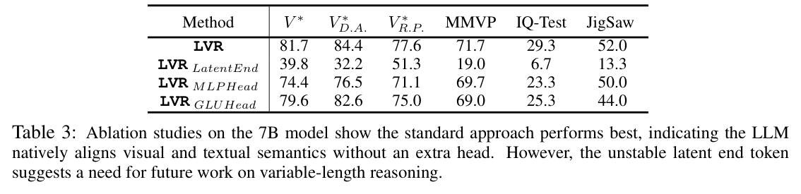

---
tags:
  - papers/reasoning/train
  - papers/latent-visual-reasoning
  - papers/multimodal-reasoning
aliases:
  - "LVR"
  - "Latent Visual Reasoning"
date: 2025-10-05
doi: 10.48550/arXiv.2509.24251
arxiv_id: 2509.24251
---

# Latent Visual Reasoning

## 核心信息

- 标题: Latent Visual Reasoning
- 标题翻译: 潜在视觉推理
- 作者: Bangzheng Li, Ximeng Sun, Jiang Liu, Ze Wang, Jialian Wu, Xiaodong Yu, Hao Chen, Emad Barsoum, Muhao Chen, Zicheng Liu
- 机构: University of California, Davis; Advanced Micro Devices, Inc.
- 发表时间: 2025-10-05
- 发表渠道: arXiv 预印本
- DOI: 10.48550/arXiv.2509.24251
- arXiv: 2509.24251
- 论文链接: https://arxiv.org/abs/2509.24251v2
- 代码 / 项目: https://github.com/VincentLeebang/lvr ; https://vincentleebang.github.io/lvr-project-page/
- 数据 / 资源: 视觉思维链; ViRL; https://huggingface.co/vincentleebang/LVR-7B
- 论文类型: AI 方法；训练型多模态潜在推理；细粒度视觉理解

## 原文摘要翻译

多模态大语言模型通过在语言空间中引入思维链推理，已在多种任务上取得显著进展。近期工作进一步利用外部工具编辑视觉输入，从而增强推理轨迹中的视觉信号。然而，这些方法仍受到一个根本限制：推理依旧局限于语言空间，视觉信息只被当作静态前提条件。本文提出潜在视觉推理（Latent Visual Reasoning, LVR），这是一种能够直接在视觉嵌入空间中进行自回归推理的新范式。视觉编码器首先把图像投影为视觉标记，并使其处于与语言模型共享的联合语义空间。随后，语言模型被训练为生成潜在状态，以重建回答问题所需的关键视觉标记，从而形成潜在视觉推理过程。通过将 LVR 与标准文本生成交错，模型在视觉问答任务上取得显著提升。

此外，作者改造了 GRPO 算法，使其能够对潜在推理进行强化学习，并进一步平衡 LVR 与文本生成。实验表明，LVR 显著提升了细粒度视觉理解与感知能力，在 MMVP 上达到 71.67%，而 Qwen2.5-VL 为 66.67%。代码库与模型权重将在后续发布。

## 创新点

1. **把“视觉思考”定义成一个可监督的隐藏状态预测问题。** LVR 不输出图像，也不调用裁剪工具，而是要求语言模型最后一层隐藏状态重建与问题相关的视觉标记。相比只用答案监督期待模型自行学会“看”，这里有明确的视觉教师信号。
2. **在同一序列内切换两种自回归机制。** `<|lvr_start|>` 与 `<|lvr_end|>` 之间，上一隐藏状态直接作为下一位置输入；离开该区间后，模型恢复普通词表解码。视觉语义重构与文本生成因而共享同一语言模型骨干。
3. **提出适配潜在状态的 `GRPO_latent`。** 采样展开时记录潜在隐藏状态，计算新旧策略概率时再把它们补回潜在位置，只在有明确定义概率的文本输出上计算重要性比率，绕开“隐藏状态没有标记概率”的不匹配。
4. **系统暴露了变量长度潜在推理的困难。** 固定步数效果最好；可学习终止标记严重不稳定，模式切换损失甚至坍缩到零个潜在步。这一负结果比单纯报告最佳设置更有研究价值。
5. **把视觉推理路线的差异落到信息载体上。** 文本 CoT 把图像压成语言，工具路线产生新图像观察，LVR 则在初始视觉嵌入向量的支持集内重建语义；它更紧凑，但信息上限也更明确。

## 一句话总结

LVR 用 ROI 视觉标记监督语言模型在隐藏空间中“复写”问题相关的视觉语义，再从这些潜在状态生成答案；它在细粒度静态视觉任务上有效，但当前证据更支持“强化已有视觉表示”而非“形成可验证的人类式视觉思维”。

## 研究问题

当前多模态推理常走两条路。第一条是“关于图像思考”：把视觉内容转成文本 CoT，再在语言空间推理；它容易让冗长文本压过原始视觉信号，也迫使细粒度视觉关系经过离散词汇瓶颈。第二条是“借助图像思考”：模型裁剪、缩放或重新编码局部区域；它能产生更强视觉证据，却依赖工具接口、额外调用与稳定的行动策略。

LVR 提出的核心问题更基础：既然视觉标记与文本标记已经被映射到语言模型可处理的联合语义空间，为什么中间推理必须先离散化成文字？作者因此把任务改写为：**让语言模型在若干连续位置自回归地产生隐藏状态，使这些状态逼近回答问题所需的视觉标记，然后再恢复文本解码。**

*论文原图编号：Figure 1。LVR 与文本 CoT、外部视觉工具的概念差异。右侧橙色块是潜在状态所重建的相关视觉语义示意，不是模型实际生成的可查看图像。*

这个定义同时带来一个重要边界：LVR 不会重新观察像素。它只能重组视觉编码器第一次前向时已经保留的信息。因此它解决的是**视觉证据在推理过程中的表示与保持**，不是低分辨率、遮挡或多视角缺失造成的新增信息需求。

## 数据与任务定义

### 训练监督

监督微调使用视觉思维链数据。原始数据包含 438k 个图像—问题—答案样本，并为回答所需的关键区域提供边界框。训练时，视觉编码器把图像展平为视觉图像块 序列；作者根据 ROI 框以 $O(1)$ 索引取出对应视觉标记，作为潜在状态的重建目标。ROI 框只在 SFT 中提供教师信号，推理时不需要预测框。

强化学习使用 ViRL 数据，策略从每个输入采样 8 条响应。奖励只有两类：答案正确性奖励，以及检查输出是否同时含有 LVR 起止标记的格式奖励。换言之，RL 不直接判定某个潜在状态是否对应正确视觉区域，而是通过最终文本结果间接塑造潜在过程。

### 模型与训练配置

- 骨干：Qwen2.5-VL 3B 与 7B。
- 视觉分辨率：最大 $5120\times 28\times 28$ 像素，最小 $128\times 28\times 28$ 像素。
- 可训练参数：冻结视觉编码器和多模态投影器，只更新语言模型。
- SFT：学习率 $1\times10^{-5}$；7B 约 40 小时完成 2500 steps，使用 40 张 MI250 GPU；论文还给出平均每设备有效 batch 约 3.2 的动态打包配置。
- 强化学习：仅在 3B 上运行；学习率 $1\times10^{-5}$，采样温度 $0.9$，KL 系数 $\beta=0.04$；约 20 小时完成 1500 步。文中表述为“使用 40 个 MI250 节点”，却未澄清是 40 张卡、40 个节点还是其他资源口径。

### 评测任务

核心评测不是通用知识问答，而是视觉证据敏感任务：V* 基准 的视觉搜索与相对空间推理、MMVP 的细微视觉扰动、BLINK 中的计数、拼图重组、相对反射和空间关系，以及智力测试。主指标沿用 多模态评测工具 LMMs-Eval 的标准准确率协议。

其中相对反射是多图像反射比较，而视觉思维链训练仅含单图样本；这形成了论文明确承认的训练—测试分布偏移。

## 方法主线

### 机制流程

1. **输入编码。** 图像 $X_v$ 经视觉编码器得到 $V=\operatorname{vision}(X_v)$，再由投影器映射到语言模型空间 $V_T=\operatorname{proj}(V)$；问题文本与 $V_T$ 一起进入多模态语言模型。
2. **进入潜在视觉模式。** 当模型生成 `<|lvr_start|>` 后，不再把最后隐藏状态送入词表头；该状态本身作为下一位置的输入嵌入向量，连续传播 4、8 或 16 步，并在 SFT 中逼近 ROI 对应的视觉标记。
3. **退出并生成答案。** 达到固定潜在预算后插入 `<|lvr_end|>`，恢复普通下一标记预测，文本答案以交叉熵训练和解码。
4. **强化潜在—文本耦合。** RL 采样展开 保存潜在隐藏状态；`GRPO_latent` 在新旧策略的 教师强制 前向中重放这些状态，只根据文本标记 概率、答案奖励与格式奖励更新策略。

*论文原图编号：Figure 2。图中最关键的工程改动是：LVR 区间的最后隐藏状态绕过语言模型词表头，直接回到下一位置；文本区间仍走标准 语言模型输出头。*

### 潜在视觉思维与视觉语义重建

标准 MLLM 的视觉特征虽然参与上下文，但后续自回归步骤始终输出离散文本标记。LVR 把潜在区间写成连续状态序列 $\{h_t\}_{t=1}^{T_v}$，并用 ROI 对应的视觉嵌入向量 $\{v_t\}_{t=1}^{T_v}$ 直接监督：

$$
\mathcal{L}_{\mathrm{LVR}}
=\frac{1}{T_v}\sum_{t=1}^{T_v}\left\|h_t-v_t\right\|_2^2.
$$

工程含义是：模型不是被要求说出“虎、身体、周围环境”等词，而是让每个潜在位置回归一个与语言模型已对齐的视觉向量。由于视觉编码器和投影器均冻结，重建目标在训练中相对稳定；代价是 LVR 的能力上限受这套固定视觉表示约束。

这里的“自回归”也需要准确理解。普通自回归预测离散标记；LVR 则把前一步隐藏状态直接作为后一步输入。它更接近连续递归状态展开，而不是一个具有可观察中间语义的视觉生成过程。

### SFT 联合目标

离开潜在区间后，答案标记 $\{y_t\}_{t=1}^{T_y}$ 使用标准负对数似然：

$$
\mathcal{L}_{\mathrm{NTP}}
=-\frac{1}{T_y}\sum_{t=1}^{T_y}
\log p_\theta\!\left(y_t\mid y_{<t},h_{1:T_v}\right).
$$

最终 SFT 目标是：

$$
\mathcal{L}
=\mathcal{L}_{\mathrm{NTP}}+\lambda_{\mathrm{LVR}}\mathcal{L}_{\mathrm{LVR}}.
$$

这两个项分别回答不同问题：重建损失要求潜在状态保留视觉语义，文本损失要求这些状态最终对答案有用。正文省略了 $\lambda_{\mathrm{LVR}}$ 的具体值，也缺少该权重的敏感性曲线，这是复现时需要从代码核对的关键超参数。

### `GRPO_latent` 为什么需要隐藏状态重放

标准 GRPO 的重要性比率定义在输出标记 分布上，但 LVR 区间的“动作”是隐藏状态，并没有直接可用的词表概率。作者的处理不是给隐藏状态凭空定义概率，而是只对文本标记 $y_{i,t}$ 计算比率，同时把 采样展开 得到的潜在隐藏状态重新补进条件上下文：

$$
r_{i,t}(\theta)
=
\frac{\pi_\theta\!\left(y_{i,t}\mid q,I,\tilde h^{\mathrm{latent}}_i,y_{i,<t}\right)}
{\pi_{\theta_{\mathrm{old}}}\!\left(y_{i,t}\mid q,I,\tilde h^{\mathrm{latent}}_i,y_{i,<t}\right)}.
$$

记录的隐藏状态为：

$$
\tilde h^{\mathrm{latent}}_i
=\left\{h^{\mathrm{latent}}_{i,1},\ldots,h^{\mathrm{latent}}_{i,L_i}\right\}.
$$

随后沿用裁剪代理目标、组内归一化优势与 KL 正则。对一组 $G$ 条响应，优势为：

$$
\hat A_{i,t}=\tilde R_i,
\qquad
\tilde R_i=
\frac{R(y_i)-\operatorname{mean}(R(y_1),\ldots,R(y_G))}
{\operatorname{std}(R(y_1),\ldots,R(y_G))}.
$$

这一设计的优点是可直接套用文本 GRPO 基础设施；局限是潜在状态本身没有被策略比率直接约束，其更新完全通过“潜在上下文如何改变后续文本概率”反传得到。此外，新旧策略都条件于 采样展开 保存的同一组潜在状态，这降低了计算障碍，却也意味着它不是对完整连续动作轨迹的严格 同策略密度比。

### 解码与停止

作者测试三种退出方式：固定潜在步数、学习一个 潜在结束向量、以及用二元模式切换损失预测 `<|lvr_end|>`。固定 4/8/16 步最稳定。模式切换损失在训练中把所有中间步骤都推向“不结束”，最终坍缩为零个有效 LVR 步骤；潜在结束向量则依赖隐藏状态与终止向量的距离，但 L1、L2 或余弦阈值都不能稳定区分中间与结束状态。

因此当前 LVR 仍是**固定计算预算方法**，不是会按题目难度自适应思考时长的方法。

## 关键结果

### 主结果与强基线

*论文原图编号：表 1。原表含闭源模型、Qwen2.5-VL 基座、文本推理基线 PAPO/Vision-R1、外部工具基线 PixelReasoner、SFT 与三种 LVR 步数。图片裁切保留了最关键的开源比较区。*

| 方法 | $V^*$ | $V^*_{D.A.}$ | $V^*_{R.P.}$ | MMVP | 计数 | 智力测试 | 拼图重组 | 相对反射 | 空间关系 |
|---|---:|---:|---:|---:|---:|---:|---:|---:|---:|
| Qwen2.5-VL-7B | 78.5 | 81.7 | 73.7 | 66.7 | 66.7 | 26.0 | 52.0 | 38.8 | 87.4 |
| PAPO | 36.1 | 25.2 | 52.6 | 54.3 | 66.7 | 29.3 | 52.0 | 39.6 | 88.8 |
| Vision-R1 | 70.2 | 70.4 | 69.7 | 46.7 | 51.7 | 26.7 | 27.3 | **44.8** | 66.4 |
| PixelReasoner | 80.1 | 81.7 | 77.6 | 67.0 | 66.7 | 25.3 | 52.7 | 42.5 | 88.1 |
| SFT | 79.1 | 82.6 | 73.7 | 65.7 | 67.5 | 26.7 | 45.3 | 33.6 | 88.8 |
| LVR 4 步 | 81.2 | **84.4** | 76.3 | **72.0** | 69.2 | 28.7 | **52.7** | 42.5 | **89.5** |
| LVR 8 步 | **81.7** | **84.4** | 77.6 | 71.7 | 70.0 | **29.3** | 52.0 | 42.5 | 86.0 |
| LVR 16 步 | 80.6 | 81.7 | **79.0** | 71.7 | **70.8** | 27.3 | **52.7** | 41.8 | 87.4 |

相对同一 7B 基座，LVR 的最强增益集中在 MMVP（$66.7\rightarrow72.0$，约 +5.3）和 V* 相对位置子集（$73.7\rightarrow79.0$，+5.3）。这与方法目标一致：潜在状态被直接训练去恢复回答所需的局部视觉语义。

但“步数越多越好”不成立。16 步在相对位置与计数最好，却在 V*、V* 视觉搜索、智力测试和空间关系 上低于 4 或 8 步。说明额外连续状态可能增加任务相关计算，也可能累积漂移；当前没有自适应路由来选择预算。

另一个边界是 相对反射。LVR 最好为 42.5，低于 Vision-R1 的 44.8。作者将其解释为单图训练无法覆盖多图反射比较，这比“所有视觉任务都提升”的表述更可信。

### 强化学习结果并非单调

*论文原图编号：表 2。表中每项依次对应 4、8、16 个潜在步；RL 只在 3B 模型上实验。*

| 指标 | SFT：4 / 8 / 16 步 | 加入 RL：4 / 8 / 16 步 | 可核对的主要变化 |
|---|---|---|---|
| $V^*$ | 64.9 / 65.5 / 66.5 | 65.5 / 67.0 / 66.5 | 8 步 +1.5 |
| $V^*_{D.A.}$ | 69.6 / 71.3 / 71.3 | 69.6 / 72.2 / 71.3 | 8 步 +0.9 |
| $V^*_{R.P.}$ | 60.5 / 60.5 / 56.6 | 59.2 / 59.2 / 59.2 | 4/8 步下降 1.3；16 步 +2.6 |
| MMVP | 54.7 / 56.0 / 56.0 | 55.3 / 55.3 / 58.0 | 16 步 +2.0，8 步 -0.7 |
| 智力测试 | 29.3 / 30.7 / 30.0 | 30.7 / 32.0 / 30.0 | 4/8 步 +1.4/+1.3 |
| 拼图重组 | 52.7 / 52.7 / 52.0 | 52.7 / 52.7 / 50.7 | 16 步 -1.3 |

最准确的结论是：`GRPO_latent` 证明了“可以训练”，并在若干设置上带来 0.9–2.6 点增益；它没有证明 RL 对所有视觉任务和推理长度都稳定有效。格式奖励的必要性也说明，当前 RL 部分先要维持协议行为，才谈得上优化潜在语义。

### 解码与结构消融到底说明了什么

*论文原图编号：表 3。原始 LVR 不增加额外视觉头，在六项指标上都优于两个附加头变体；可学习结束标记则严重退化。*

| 设置 | $V^*$ | $V^*_{D.A.}$ | $V^*_{R.P.}$ | MMVP | 智力测试 | 拼图重组 |
|---|---:|---:|---:|---:|---:|---:|
| LVR | **81.7** | **84.4** | **77.6** | **71.7** | **29.3** | **52.0** |
| 潜在结束向量| 39.8 | 32.2 | 51.3 | 19.0 | 6.7 | 13.3 |
| MLP Head | 74.4 | 76.5 | 71.1 | 69.7 | 23.3 | 50.0 |
| GLU Head | 79.6 | 82.6 | 75.0 | 69.0 | 25.3 | 44.0 |

这张表支持两点。第一，直接让语言模型隐藏状态对齐视觉标记，比加一个独立 MLP/GLU 头更好，说明收益可能来自视觉与文本在同一状态空间中的直接耦合，而不是额外参数容量。第二，变量长度不是小修小补：潜在结束向量让 MMVP 从 71.7 跌到 19.0，已经是机制失效而非轻微调参问题。

不过附加头消融仍有混杂因素。文中缺少这些头的参数量、初始化、优化器差异或等预算调参，因此它证明的是“作者测试的两个头不如直接对齐”，不是“任何显式视觉头都错误”。

## 深度分析

### 真正贡献是什么

这篇论文最有价值的地方，不是把“潜在推理”四个字搬到视觉领域，而是给连续隐藏状态加了一个**可测量的视觉目标**。很多 latent CoT 方法只要求隐藏状态最终能预测答案，内部到底保留了什么无法确认；LVR 至少用 ROI 标记 的重建误差规定了中间状态应靠近哪类视觉语义。

从研究设计看，它形成一条清晰证据链：ROI 提供 SFT 教师目标，MSE 建立视觉语义对齐，文本 NTP 检验该对齐是否支持答案，结构消融比较直接对齐与额外预测头，RL 再检验潜在过程能否被答案级回报继续优化。链条完整，但最后一环仍弱：论文没有对重建到的视觉标记 做删除、交换或反事实替换，因此无法证明它们对答案具有因果必要性。

### 为什么结果成立

LVR 可能同时修复了三个问题。

1. **避免视觉语义的离散化损失。** 细微颜色、局部关系或形状差异不必先被压成一句可能含糊的文本描述。
2. **给长推理提供视觉锚点。** 每个潜在位置都被拉向 ROI 嵌入向量，可减轻文本生成过程中视觉证据逐步被语言先验覆盖。
3. **训练信号与输入表示同单位。** 目标不是人类框坐标或自然语言描述，而是模型实际消费的视觉标记；表 3 中直接对齐优于额外头，与这一解释一致。

但结果也提示连续状态存在漂移。若只是“思考越久越充分”，16 步应普遍更好；实际并非如此。更合理的机制解释是：LVR 在前几步完成证据重构，之后重复传播开始混入语言模型自身动力学，任务相关信息可能被放大，也可能逐步偏离视觉教师流形。

### 与 IVT-LR、MINT-CoT、PFlowNet 的关系

| 方法 | 中间载体 | 是否可读 | 是否产生新视觉信息 | 核心监督 | 主要优势与代价 |
|---|---|---:|---:|---|---|
| LVR | 自回归隐藏状态，回归 ROI 视觉标记 | 否 | 否 | ROI 标记 MSE + 文本 CE + 答案/格式奖励 | 表示紧凑、与视觉空间直接对齐；停止不稳定、不可审计 |
| IVT-LR | 上一隐藏状态 + 注意力前 $k$ 项 视觉嵌入向量 | 否 | 否 | 渐进替换后的未来文本/答案监督 | 每步显式再注入选中标记；依赖固定潜在深度与 注意力选择 |
| MINT-CoT | 可见文本 CoT + 选择出的视觉标记 | 部分可读 | 否 | 文本 CE + 标记 选择 BCE + GRPO | 步骤—证据对齐清晰；需要昂贵中间标注，输出更长 |
| PFlowNet | 区域坐标 + 证据描述 + 重新裁剪特征 | 是 | 是 | 合成感知流 + 效用/质量奖励 + 几何邻域约束 | 能获取初始编码缺失的局部信息；训练和推理成本最高 |

LVR 与 IVT-LR 最近，但两者解决同一问题的方式不同。IVT-LR 把现成视觉嵌入向量当作每个潜在步骤的输入；LVR 则把这些嵌入向量当作隐藏状态的监督目标。前者更像内部重注入，后者更像内部视觉记忆重建。该方法还明确处理了潜在状态与策略比率不兼容的问题，这是其相对 IVT-LR 最清楚的方法增量。

与 MINT-CoT 相比，LVR 省掉了逐步视觉标记 标注与显式交错输出，却也失去过程审计。MINT-CoT 的强消融显示“整图乱插比不插更坏”，因此 LVR 下一步最需要回答的是：MSE 重建的 标记 是否真的是当前步骤需要的核心集，还是只学会了平均意义上的 ROI 复写。

PFlowNet 位于信息能力的另一端。它会生成区域并重新裁剪编码，能够获得初始低分辨率输入中没有的信息；LVR 无法做到这一点。两者不应只按准确率比较，而应在“初始表示足够”与“必须新增观察”的两类 benchmark 上分别评估。

### 对 Reasoning 研究图谱的具体含义

在本地“证据重注入栈”中，LVR 应放在现有 L1 注意力、L2 KV、L3 标记 重选之前的**L0 隐藏状态重建层**。它不把任何 标记 重新插回序列，而是直接塑造承载推理的连续状态。这个位置最便宜，也最依赖初始视觉编码完整性。

它给当前 Reasoning 图谱补上三个可操作结论：

1. **中间表示训练不必显式化。** PatchCue、MINT-CoT、PFlowNet 把“看哪里”写成可监督对象；LVR 说明同样可以在隐藏状态层施加视觉目标。
2. **证据重注入与证据重建应分开比较。** 前者把原视觉标记 再次送入模型，后者要求模型内部状态复原它们。最小实验应统一骨干与预算，对比“直接 top-$k$ 重注入”“MSE 重建”“两者结合”。
3. **停止机制是潜在路线的共同瓶颈。** IVT-LR 固定三步，LVR 固定 4/8/16 步；这与 Reasoning 图谱中首 标记 熵、答案熵和 logit 间隔等廉价门控信号形成直接组合机会。

### 复现注意点

1. 必须修改 Qwen2.5-VL 的 前向过程：在 LVR 区间绕过 语言模型输出头，并把最后隐藏状态作为下一位置的 `输入嵌入`。普通 HF `生成接口` 无法原样支持这一状态切换。
2. ROI 框到 图像块 索引的映射要和动态分辨率、视觉标记 flatten 顺序完全一致；一处 off-by-one 就会让 MSE 监督指向错误区域。
3. 视觉编码器与投影器冻结是关键设置。若投影器一起训练，目标视觉嵌入向量本身会漂移，重建损失可能出现移动靶问题。
4. 需要从代码核对 $\lambda_{\mathrm{LVR}}$、ROI 标记 与潜在步数不等长时的采样规则、MSE 是否归一化，以及 padding/packing 对位置的处理；正文未给全。
5. `GRPO_latent` 需要在 采样展开 中保存每条响应的全部潜在隐藏状态，教师强制 时再按精确位置补回。实现必须避免把旧策略 hidden state 错接到不同文本前缀。
6. 复现成本不低：SFT 报告 40 个 MI250、约 40 小时，RL 再约 20 小时；但硬件口径“GPU”与“GPU 节点”不一致，总 GPU 小时 无法可靠复算。
7. 评测依赖 LMMs-Eval。应固定 commit、prompt、图像预处理与答案抽取规则，否则 智力测试、计数 等短答案指标容易受格式差异影响。
8. 论文声明代码、权重与 容器环境 将公开；当前文档中已经嵌入 GitHub、HF 和项目页链接，但本文未在本地执行仓库复现，也未验证 容器环境 与训练脚本是否覆盖论文全部配置。

## 局限

1. **潜在轨迹不可读且未做因果审计。** MSE 下降只能说明隐藏状态接近 ROI 嵌入向量，不能证明模型在答案生成时真正使用了这些维度。缺少标记删除、错误 ROI 替换、跨步骤交换与 状态替换 实验。
2. **没有新增信息能力。** LVR 只能重构初始视觉编码中已有的信息。若答案依赖放大后才可见的字符、被遮挡区域、多视角几何或交互观察，它从机制上不如 PFlowNet 或工具代理。
3. **固定预算且非单调。** 4、8、16 步各自在不同任务最优；可学习结束机制失败。实际部署必须预先选择预算，简单题可能过算，困难题可能不够。
4. **RL 证据有限。** 强化学习只在 3B 上测试，增益不稳定，部分任务和步数退化。论文尚未证明 `GRPO_latent` 能稳定扩展到 7B 以上或更长潜在轨迹。
5. **训练与评测覆盖窄。** 训练以单图视觉思维链 为主，评测也集中于静态短答案任务；相对反射的多图失败已经暴露分布边界。视频、文档、长程规划、3D 与开放式生成均未验证。
6. **成本报告不完整。** 没有统一报告训练总 GPU 小时、推理 wall-clock、FLOPs、峰值显存或潜在步的 KV-cache 开销，无法判断其准确率—成本前沿是否优于 标记 重注入与工具路线。
7. **统计严谨性不足。** 主结果没有随机种子方差、置信区间或显著性检验。若差值只有 0.5–1.5 点，不能排除训练与评测波动。
8. **“视觉思维”存在过度声明风险。** 论文较充分证明了“视觉语义重建有助于回答”，但尚未证明隐藏轨迹具有人类式组合推理、忠实步骤语义或可解释因果链。

## 我的笔记

这篇最值得复用的不是某个特殊 标记，而是**把潜在状态变成有教师目标的中间接口**。对于 3D Reasoning，可以把 $v_t$ 换成对象 标记、带相机位姿的视角 标记、点云局部特征或 Gaussian primitive 表征，让隐藏计划状态在每一步重建当前所需的空间证据，而不是先把场景翻译成长文本。

但 3D 不能直接照搬 ROI MSE。二维 图像块 在同一图像坐标系内相对稳定；多视角 3D 标记 同时绑定内容、相机位姿、遮挡与世界坐标。更合理的目标应至少包含“语义重建 + 位姿一致性 + 跨视角对应”，并使用多样性约束避免每一步都复写同一个视角。

我会优先做四个实验：

1. **因果删除。** 删除重建误差最低的 标记、随机 标记 与最高误差 标记，比较答案掉分，验证“重建得好”是否等于“答案需要”。
2. **四象限信息瓶颈实验。** 初始图像高/低分辨率 × 允许/禁止 crop-and-reencode，对比 LVR 与 PFlowNet 类方法，直接测出内部重建和新增观察各自的适用区间。
3. **等算力步数消融。** 匹配总 FLOPs 与 wall-clock 后比较 4/8/16 步，排除“更多前向计算”这一替代解释。
4. **自适应停止。** 联合重建误差下降、答案熵与跨步状态新颖度，训练一个不依赖单一终止向量距离的门控器，并同时报告准确率、平均步数和失败终止率。

对当前 Reasoning 研究主线的判断是：LVR 让“视觉证据如何持续存在于推理中”向更底层走了一步，但它也把 Position paper 的审计问题推到更难的位置——显式图像还可以删掉，潜在视觉状态却不容易干预。下一阶段的关键不是再画 attention 图，而是建立 hidden-state 级的反事实操作协议。

## 引用

Li, Bangzheng, Ximeng Sun, Jiang Liu, Ze Wang, Jialian Wu, Xiaodong Yu, Hao Chen, Emad Barsoum, Muhao Chen, and Zicheng Liu. 2025. “Latent Visual Reasoning.” arXiv:2509.24251. https://doi.org/10.48550/arXiv.2509.24251.
