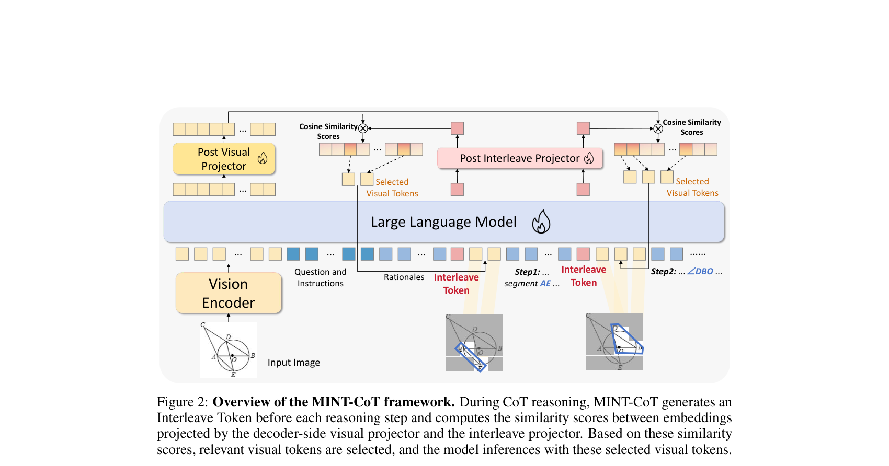
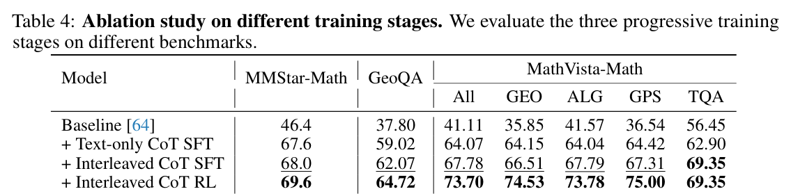
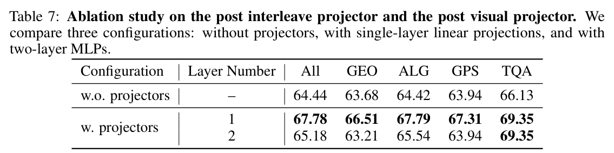
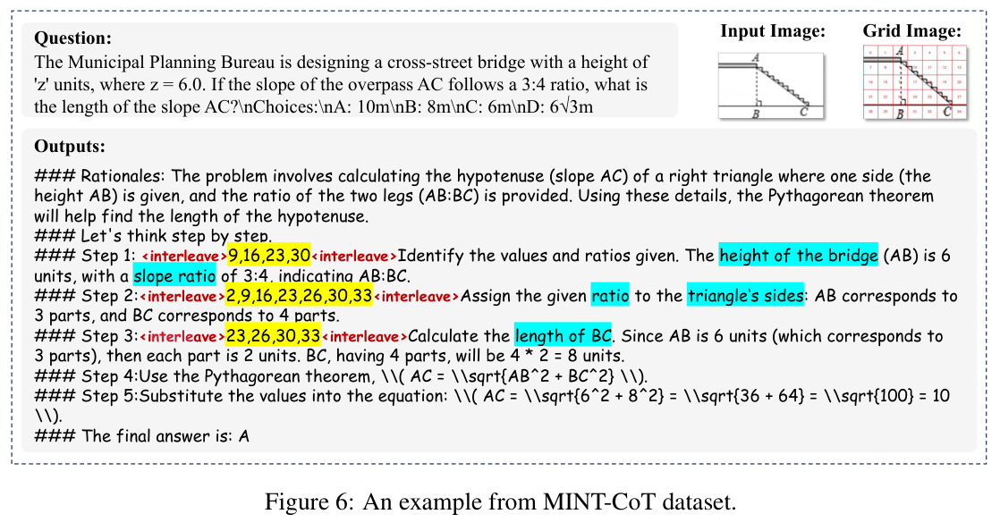

# MINT-CoT: Enabling Interleaved Visual Tokens in Mathematical Chain-of-Thought Reasoning

> **中文题名：** MINT-CoT：在数学思维链推理中启用交错视觉标记  
> **作者：** Xinyan Chen, Renrui Zhang, Dongzhi Jiang, Aojun Zhou, Shilin Yan, Weifeng Lin, Hongsheng Li  
> **机构：** CUHK MMLab  
> **版本：** arXiv:2506.05331v1 [cs.CV], 5 Jun 2025；Preprint. Under review.  
> **页数：** 22  
> **源文件：** `Chen 等 - 2025 - MINT-CoT Enabling Interleaved Visual Tokens in Mathematical Chain-of-Thought Reasoning.pdf`  
> **代码与数据：** https://github.com/xinyan-cxy/MINT-CoT  
> **编排说明：** 以下内容按 PDF 的章节顺序逐段提供英文原文与中文译文；正文、结论、参考文献和附录均纳入。图表移至其首次实质讨论附近；仅链接现有且已验证的本地资源。

## Page / Section Index

- Abstract: page 1
- 1 Introduction: pages 1–3
- 2 Related work: pages 3–4
- 3 Method: pages 4–7
  - 3.1 MINT-CoT: pages 4–5
  - 3.2 Dataset Curation: pages 5–6
  - 3.3 Training strategy: pages 6–7
- 4 Experiments: pages 7–10
  - 4.1 Experimental Settings: pages 7–8
  - 4.2 Quantitative Results: pages 8–9
  - 4.3 Ablation Study: pages 9–10
  - 4.4 Qualitative Results: page 10
- 5 Conclusion: page 10
- References: pages 11–17
- A Appendix: pages 18–22
  - A.1 Overview: page 18
  - A.2 Dataset Details: pages 18 and 20
  - A.3 Theoretical Details of Interleaved CoT RL: pages 18–19
  - A.4 Additional Implementation Details: page 19
  - A.5 Additional Ablation Study: page 19
  - A.6 Additional Qualitative Results: pages 19 and 21–22

## Terminology Ledger

| Canonical term | 中文 | Translation decision |
|---|---|---|
| MINT-CoT | MINT-CoT | 方法名保留 |
| Mathematical INterleaved Tokens | 数学交错标记 | 保留 MINT 缩写 |
| Interleave Token | 交错标记 | 特殊 token 名称；首字母大写形式保留 |
| visual token | 视觉 token | 技术对象中的 `token` 保留英文 |
| visual interleaved CoT reasoning | 视觉交错 CoT 推理 | 保留 CoT |
| post interleave projector | 交错后投影器 | 对应 $P_{\text{post\_intlv}}$ |
| post visual projector | 视觉后投影器 | 对应 $P_{\text{post\_vis}}$ |
| Text-only CoT SFT | 纯文本 CoT 监督微调 | 阶段名保留英文缩写 |
| Interleaved CoT SFT | 交错 CoT 监督微调 | 阶段名保留英文缩写 |
| Interleaved CoT RL | 交错 CoT 强化学习 | 阶段名保留英文缩写 |
| Group Relative Policy Optimization (GRPO) | 组相对策略优化 | 保留 GRPO |
| grid index / selected index | 网格索引 / 选中索引 | 指视觉编码器 patch 对应的离散位置 |

## Abstract

> <span style="color:#3B82F6"><strong>Para. 1:</strong></span> Chain-of-Thought (CoT) has widely enhanced mathematical reasoning in Large Language Models (LLMs), but it still remains challenging for extending it to multimodal domains. Existing works either adopt a similar textual reasoning for image input, or seek to interleave visual signals into mathematical CoT. However, they face three key limitations for math problem-solving: reliance on coarse-grained box-shaped image regions, limited perception of vision encoders on math content, and dependence on external capabilities for visual modification. In this paper, we propose MINT-CoT, introducing Mathematical INterleaved Tokens for Chain-of-Thought visual reasoning. MINT-CoT adaptively interleaves relevant visual tokens into textual reasoning steps via an Interleave Token, which dynamically selects visual regions of any shapes within math figures. To empower this capability, we construct the MINT-CoT dataset, containing 54K mathematical problems aligning each reasoning step with visual regions at the token level, accompanied by a rigorous data generation pipeline. We further present a three-stage MINT-CoT training strategy, progressively combining text-only CoT SFT, interleaved CoT SFT, and interleaved CoT RL, which derives our MINT-CoT-7B model. Extensive experiments demonstrate the effectiveness of our method for effective visual interleaved reasoning in mathematical domains, where MINT-CoT-7B outperforms the baseline model by +34.08% on MathVista, +28.78% on GeoQA, and +23.2% on MMStar, respectively. Our code and data are available at https://github.com/xinyan-cxy/MINT-CoT.

> <span style="color:#F59E0B"><strong>Para. 1[CN]:</strong></span> 思维链（Chain-of-Thought, CoT）已广泛增强大型语言模型（LLM）的数学推理能力，但将其扩展到多模态领域仍颇具挑战。现有工作要么针对图像输入采用类似的文本推理，要么尝试把视觉信号交错插入数学 CoT。然而，它们在数学问题求解中面临三项关键局限：依赖粗粒度的框形图像区域、视觉编码器对数学内容的感知有限，以及依赖外部视觉修改能力。本文提出 MINT-CoT，把 Mathematical INterleaved Tokens 引入思维链视觉推理。MINT-CoT 通过 Interleave Token 将相关视觉 token 自适应地交错插入文本推理步骤；该 token 能在数学图形中动态选择任意形状的视觉区域。为赋予模型这种能力，我们构建 MINT-CoT 数据集，其中包含 54K 道数学题，使每个推理步骤在 token 层面与视觉区域对齐，并配套一条严格的数据生成流水线。我们还提出三阶段 MINT-CoT 训练策略，逐步结合 text-only CoT SFT、interleaved CoT SFT 和 interleaved CoT RL，由此得到 MINT-CoT-7B 模型。大量实验表明，该方法能在数学领域有效进行视觉交错推理；MINT-CoT-7B 相比基线模型在 MathVista、GeoQA 和 MMStar 上分别提升 +34.08%、+28.78% 和 +23.2%。代码和数据见 https://github.com/xinyan-cxy/MINT-CoT。

## 1 Introduction

> <span style="color:#3B82F6"><strong>Para. 1:</strong></span> Chain-of-Thought (CoT) [66, 32] has emerged as an effective strategy for enhancing the reasoning capabilities of Large Language Models (LLMs) [49, 51, 62, 71, 79, 39] by generating sequential rationales in their responses. In Multimodal Large Language Models (MLLMs) [50, 33, 86, 18, 20], CoT also plays a significant role [82] across various tasks involving image [41, 84, 40, 22, 17, 25], video [38, 4, 70, 14], and 3D [69, 24, 58, 21]. It enables MLLMs to reason over both textual and visual inputs, serving as a bridge that connects visual perception with abstract reasoning tasks. However, despite these advances, applying CoT in mathematical reasoning with visual contexts remains challenging. Existing MLLMs mainly generate text-only reasoning steps for multimodal math problems [82, 83, 60, 77], simply adopting similar textual reasoning for image input. Nevertheless, due to the limited capability in perceiving math images, this strategy often fails to accurately interpret visual information within the CoT process, leading to reasoning errors.

> <span style="color:#F59E0B"><strong>Para. 1[CN]:</strong></span> 思维链（CoT）[66, 32] 通过在回答中生成连续的推理依据，已成为增强大型语言模型（LLM）[49, 51, 62, 71, 79, 39] 推理能力的有效策略。在多模态大型语言模型（MLLM）[50, 33, 86, 18, 20] 中，CoT 同样在涉及图像 [41, 84, 40, 22, 17, 25]、视频 [38, 4, 70, 14] 和 3D [69, 24, 58, 21] 的多种任务上发挥重要作用 [82]。它使 MLLM 能同时对文本和视觉输入进行推理，成为连接视觉感知与抽象推理任务的桥梁。然而，尽管已经取得这些进展，在带有视觉上下文的数学推理中应用 CoT 仍然困难。现有 MLLM 针对多模态数学问题主要生成纯文本推理步骤 [82, 83, 60, 77]，即只是把类似的文本推理用于图像输入。不过，由于模型感知数学图像的能力有限，这种策略常常无法在 CoT 过程中准确解释视觉信息，从而导致推理错误。

### Figure 1. Comparison of three CoT reasoning methods / 三种 CoT 推理方法对比


**Caption:** Comparison of three CoT reasoning methods: text-only CoT reasoning, box-shaped visual CoT reasoning and our visual interleaved CoT reasoning methods. (1) Text-only CoT lacks visual information, causing perception errors in mathematical reasoning. (2) Box-level cues are too coarse to capture complex visual structures in mathematical images. (3) Token-level interleaved CoT accurately identifies fine-grained visual regions to support reasoning.

**Caption[CN]:** 三种 CoT 推理方法的对比：纯文本 CoT 推理、框形视觉 CoT 推理，以及本文的视觉交错 CoT 推理方法。（1）纯文本 CoT 缺乏视觉信息，因而在数学推理中造成感知错误。（2）框级线索过于粗糙，无法捕捉数学图像中的复杂视觉结构。（3）token 级交错 CoT 能准确识别细粒度视觉区域以支持推理。

> <span style="color:#3B82F6"><strong>Para. 2:</strong></span> Figure 1 uses the following problem and exact choices:
>
> ```text
> Question:
> In the given diagram, circle O has line segment AB as its diameter and CD as a chord. A tangent passing through point C intersects the extension of AB at point E, and angle E measures 42°. What is the measure of angle CDB? Choices: A: 22° B: 24° C: 28° D: 48°
> ```

> <span style="color:#F59E0B"><strong>Para. 2[CN]:</strong></span> Figure 1 使用如下题目和原样选项：
>
> ```text
> 问题：
> 在给定图中，圆 O 以线段 AB 为直径，CD 为一条弦。经过点 C 的切线与 AB 的延长线交于点 E，角 E 为 42°。角 CDB 的度数是多少？选项：A: 22° B: 24° C: 28° D: 48°
> ```

> <span style="color:#3B82F6"><strong>Para. 3:</strong></span> The three displayed reasoning traces are:
>
> ```text
> Text-only CoT Reasoning:
> Step 1: Since angle E = 42°, therefore angle A = 42°. ×
> Step 2: Since AB is the diameter of circle O, angle ACB = 90°. Therefore, angle B = 180° - 42° - 90° = 48°.
> Step 3: Since AB is the diameter of circle O, angle CDB = angle B = 48°. ×
> Answer: D ×
>
> Box-shaped Visual CoT Reasoning:
> Step 1: Since angle E = 42°, angle CEB = 42°. ✓
> Step 2: Since AB is the diameter of circle O, angle ACB = 90°. ✓
> Step 3: Therefore, angle CDB = angle CEB = 42°. ×
> Answer: D ×
>
> Visual Interleaved CoT Reasoning (Ours):
> Step 1: Connect OC, OC⊥CE. ✓
> Step 2: Angle COE = 180° - 90° - 42° = 48°. ✓
> Step 3: Since OC = OD, angle CDB = angle ODC = 1/2 angle BOC = 24°. ✓
> Answer: B ✓
> ```

> <span style="color:#F59E0B"><strong>Para. 3[CN]:</strong></span> 图中展示的三条推理轨迹为：
>
> ```text
> 纯文本 CoT 推理：
> 步骤 1：因为角 E = 42°，所以角 A = 42°。×
> 步骤 2：因为 AB 是圆 O 的直径，所以角 ACB = 90°。因此，角 B = 180° - 42° - 90° = 48°。
> 步骤 3：因为 AB 是圆 O 的直径，所以角 CDB = 角 B = 48°。×
> 答案：D ×
>
> 框形视觉 CoT 推理：
> 步骤 1：因为角 E = 42°，所以角 CEB = 42°。✓
> 步骤 2：因为 AB 是圆 O 的直径，所以角 ACB = 90°。✓
> 步骤 3：因此，角 CDB = 角 CEB = 42°。×
> 答案：D ×
>
> 视觉交错 CoT 推理（本文）：
> 步骤 1：连接 OC，OC⊥CE。✓
> 步骤 2：角 COE = 180° - 90° - 42° = 48°。✓
> 步骤 3：因为 OC = OD，所以角 CDB = 角 ODC = 1/2 角 BOC = 24°。✓
> 答案：B ✓
> ```

> <span style="color:#3B82F6"><strong>Para. 4:</strong></span> Recent approaches have attempted to interleave visual content within reasoning steps through mechanisms such as bounding box selection and image cropping [55, 26, 74]. While effective in general visual scenarios, these methods still face three key limitations when extended to multimodal mathematical reasoning:

> <span style="color:#F59E0B"><strong>Para. 4[CN]:</strong></span> 近期方法尝试通过边界框选择、图像裁剪等机制把视觉内容交错插入推理步骤 [55, 26, 74]。虽然这些方法在一般视觉场景中有效，但扩展到多模态数学推理时仍面临三项关键局限：

> <span style="color:#3B82F6"><strong>Para. 5:</strong></span>
>
> 1. **Reliance on coarse-grained box-shaped image regions:** Recent advances introduce visual information into the CoT process by selecting image regions through bounding box-based methods. Visual-CoT [55], Visual SKETCHPAD [26], and VPT [74] all operate on box-shaped image regions, employing strategies such as bounding box generation, iterative masking, cropping, or re-encoding. However, as shown in Figure 1, these approaches all rely on bounding box-based cropping. While such box-level cues are effective in domains like object detection, where objects are typically isolated, they are too coarse-grained to capture the complex structures in mathematical images, where visual information is not discrete but highly interconnected. As a result, box-shaped selection tends to interleave too many irrelevant or misleading visual tokens, impairing the accuracy of mathematical reasoning.
> 2. **Limited perception of vision encoders on math content:** Some methods, like ICoT [16], adopt attention-based token selection to identify relevant visual tokens during reasoning without requiring additional training. These approaches rely heavily on visual features extracted by the vanilla vision encoders without specific tuning. However, as noted in MAVIS [81], mainstream vision encoders, which are primarily based on CLIP [54] or SigLIP [76], are pre-trained on natural images with general scenes, making mathematical images out-of-distribution. As a result, such methods often struggle to accurately locate relevant visual regions in complex mathematical tasks.
> 3. **Dependence on external capabilities for visual modification:** Other approaches attempt to enhance visual reasoning by dynamically generating new visual content or modifying existing images. MVoT [36] is built upon a unified autoregressive MLLM [59] to generate images as part of the CoT process, but it is only applicable to spatial planning tasks. Meanwhile, Visual SKETCHPAD requires external tools to draw on the original image in geometry-related tasks. These approaches depend on external capabilities, either requiring large-scale data to train the understanding model for generation, or relying on external tools with additional inference over the modified images, which leads to numerous extra costs.

> <span style="color:#F59E0B"><strong>Para. 5[CN]:</strong></span>
>
> 1. **依赖粗粒度框形图像区域：** 近期进展通过基于边界框的方法选择图像区域，把视觉信息引入 CoT 过程。Visual-CoT [55]、Visual SKETCHPAD [26] 和 VPT [74] 都在框形图像区域上运行，采用生成边界框、迭代遮蔽、裁剪或重新编码等策略。然而，如 Figure 1 所示，这些方法都依赖基于边界框的裁剪。此类框级线索在目标通常彼此分离的目标检测等领域中有效，但对于数学图像中的复杂结构而言过于粗糙；数学图像的视觉信息并非离散存在，而是高度互联。因此，框形选择往往会交错插入过多无关或误导性的视觉 token，损害数学推理的准确性。
> 2. **视觉编码器对数学内容的感知有限：** ICoT [16] 等方法采用基于注意力的 token 选择，无需额外训练即可在推理期间识别相关视觉 token。这些方法高度依赖未经专门调优的原生视觉编码器所提取的视觉特征。然而，MAVIS [81] 指出，主流视觉编码器主要基于 CLIP [54] 或 SigLIP [76]，它们在一般场景的自然图像上预训练，因此数学图像属于分布外数据。结果是，这类方法在复杂数学任务中常常难以准确定位相关视觉区域。
> 3. **依赖外部视觉修改能力：** 另一些方法试图通过动态生成新视觉内容或修改现有图像来增强视觉推理。MVoT [36] 建立在统一自回归 MLLM [59] 之上，把生成图像作为 CoT 过程的一部分，但它仅适用于空间规划任务。与此同时，Visual SKETCHPAD 在几何相关任务中需要外部工具在原图上绘制。这些方法依赖外部能力：要么需要大规模数据来训练用于生成的理解模型，要么依赖外部工具并对修改后的图像进行额外推理，因而带来大量额外成本。

> <span style="color:#3B82F6"><strong>Para. 6:</strong></span> Therefore, to address these challenges, we aim to propose a fine-grained, efficient visual interleaved CoT method to enhance the mathematical reasoning capabilities of MLLMs. In this paper, we introduce MINT-CoT, an approach of Mathematical INterleaved Token selection for Chain-of-Thought reasoning, which facilitates multimodal reasoning by interleaving relevant visual regions within reasoning steps. At the core of the MINT-CoT is the Interleave Token, a special token generated through the next-token prediction process. During reasoning, MINT-CoT automatically identifies and incorporates the most relevant visual tokens from the original image at each reasoning step. This is achieved by computing similarity scores between the output hidden states of the Interleave Token and all visual tokens, in order to identify the tokens most relevant to the mathematical concept at the current step. These selected visual tokens are then dynamically integrated into the textual reasoning steps, enabling the flexible selection of visual regions throughout the CoT process. In this way, the interleaved regions of mathematical images are not restricted to box-shaped areas but can flexibly include geometric shapes, line segments, coordinates, and other elements.

> <span style="color:#F59E0B"><strong>Para. 6[CN]:</strong></span> 因此，为解决这些挑战，我们希望提出一种细粒度、高效的视觉交错 CoT 方法，以增强 MLLM 的数学推理能力。本文引入 MINT-CoT，即一种用于思维链推理的 Mathematical INterleaved Token 选择方法；它通过在推理步骤内交错插入相关视觉区域来促进多模态推理。MINT-CoT 的核心是 Interleave Token，这是一种通过 next-token prediction 过程生成的特殊 token。推理期间，MINT-CoT 会在每个推理步骤中自动识别并纳入原始图像里最相关的视觉 token。具体做法是计算 Interleave Token 的输出隐藏状态与所有视觉 token 之间的相似度分数，以识别与当前步骤数学概念最相关的 token。随后，这些选中的视觉 token 被动态整合进文本推理步骤，使整个 CoT 过程能够灵活选择视觉区域。这样一来，数学图像中的交错区域不再局限于框形区域，而可以灵活包括几何形状、线段、坐标及其他元素。

> <span style="color:#3B82F6"><strong>Para. 7:</strong></span> To enable effective training of MINT-CoT, we construct the MINT-CoT dataset, a 54K visual interleaved reasoning dataset. Each data point contains reasoning steps paired with the indices of selected tokens corresponding to the mathematical concepts involved in each step. We source mathematical problems from the Mulberry-260K dataset [73] to construct text-only CoT reasoning format, then annotate the reasoning steps with corresponding image regions through a four-step pipeline: (1) dividing images into grid-indexed regions, (2) mapping recognized text elements to grid indices via OCR-based text localization, (3) extracting key words, and (4) assigning visual regions to these key words using an advanced MLLM. This process creates a visual interleaved CoT reasoning dataset providing token-level supervision for training models to interleave visual content into reasoning steps.

> <span style="color:#F59E0B"><strong>Para. 7[CN]:</strong></span> 为有效训练 MINT-CoT，我们构建了一个包含 54K 样本的视觉交错推理数据集 MINT-CoT。每个数据点包含推理步骤，以及与各步骤所涉数学概念对应的已选 token 索引。我们从 Mulberry-260K 数据集 [73] 中获取数学题，构造纯文本 CoT 推理格式，随后通过四步流水线把推理步骤标注到相应图像区域：（1）把图像划分为带网格索引的区域；（2）通过基于 OCR 的文本定位，把识别到的文本元素映射到网格索引；（3）提取关键词；（4）使用先进 MLLM 为这些关键词指派视觉区域。该过程创建出视觉交错 CoT 推理数据集，为训练模型把视觉内容交错插入推理步骤提供 token 级监督。

> <span style="color:#3B82F6"><strong>Para. 8:</strong></span> Building on the MINT-CoT framework and MINT-CoT dataset, we design a progressive training strategy, the MINT-CoT training strategy, that incrementally improves MLLMs’ ability with three training stages: (1) Text-only CoT Training, (2) Interleaved CoT SFT, and (3) Interleaved CoT RL. Through this training strategy, we train a MINT-CoT-7B model with the capability of mathematical visual interleaved CoT reasoning. Extensive experiments demonstrate the superiority of our proposed approach. Specifically, our method achieves absolute improvement of +32.59% on MathVista [43], +26.92% on GeoQA [5], and +23.2% on MMStar [7] benchmark compared to the baseline model.

> <span style="color:#F59E0B"><strong>Para. 8[CN]:</strong></span> 在 MINT-CoT 框架和 MINT-CoT 数据集之上，我们设计了一套渐进式 MINT-CoT 训练策略，通过三个训练阶段逐步提升 MLLM 的能力：（1）Text-only CoT Training；（2）Interleaved CoT SFT；（3）Interleaved CoT RL。通过这套策略，我们训练出具备数学视觉交错 CoT 推理能力的 MINT-CoT-7B。大量实验表明，所提方法具有优越性。具体而言，相比基线模型，本文方法在 MathVista [43]、GeoQA [5] 和 MMStar [7] 基准上分别实现 +32.59%、+26.92% 和 +23.2% 的绝对提升。

> <span style="color:#3B82F6"><strong>Para. 9:</strong></span> Our main contributions are as follows:
>
> - We propose MINT-CoT, which uses the Interleave Token to interleave fine-grained visual tokens within reasoning steps, enhancing multimodal mathematical reasoning.
> - We construct the MINT-CoT dataset, a 54K dataset for multimodal mathematical reasoning, offering fine-grained alignment between textual rationales and visual inputs. We develop an automated pipeline to generate visual interleaved CoT data annotated with token indices.
> - We develop a progressive three-stage MINT-CoT training strategy, to improve interleaved mathematical reasoning. Extensive experiments validate the efficiency of our method.

> <span style="color:#F59E0B"><strong>Para. 9[CN]:</strong></span> 本文主要贡献如下：
>
> - 我们提出 MINT-CoT，使用 Interleave Token 在推理步骤中交错插入细粒度视觉 token，从而增强多模态数学推理。
> - 我们构建 MINT-CoT 数据集，一个用于多模态数学推理的 54K 数据集，在文本推理依据与视觉输入之间提供细粒度对齐；并开发自动化流水线来生成带 token 索引标注的视觉交错 CoT 数据。
> - 我们开发渐进式三阶段 MINT-CoT 训练策略，以改进交错数学推理。大量实验验证了本文方法的有效性。

## 2 Related work

> <span style="color:#3B82F6"><strong>Para. 1:</strong></span> **MLLMs for Mathematics.** Recent advancements in MLLMs [50, 41, 2, 31] have shown impressive capabilities in various vision-language tasks. However, even powerful models like GPT-4V [50] and Qwen2-VL [63] fail to demonstrate satisfying performance on existing visual mathematical benchmarks [5, 44, 43], as highlighted by MathVerse [80]. Various specialized approaches [15, 81, 28, 9, 45, 57, 53] have emerged to enhance visual mathematical reasoning. Current approaches mostly focus on enriching the multimodal math data. G-LLaVA [15] extends the LLaVA architecture with geometric reasoning capabilities by augmenting the current dataset. Math-LLaVA [57] enlarges the data scope with the introduced MathV360K dataset. MAVIS [81] first identifies the critical issue of the vision encoder and empowers it with the mathematical capability. Then it further develops an automated system for generating mathematical visual datasets at scale. Reverse Chain-of-Thought (R-CoT) [9] introduces the Geometry Generation Chain for creating geometric images with more accurate descriptions.

> <span style="color:#F59E0B"><strong>Para. 1[CN]:</strong></span> **用于数学的 MLLM。** MLLM 的近期进展 [50, 41, 2, 31] 在多种视觉—语言任务上展现出令人瞩目的能力。然而，MathVerse [80] 指出，即便 GPT-4V [50] 和 Qwen2-VL [63] 这样的强大模型，在现有视觉数学基准 [5, 44, 43] 上也未表现出令人满意的性能。为增强视觉数学推理，已出现多种专门方法 [15, 81, 28, 9, 45, 57, 53]。现有方法大多着眼于丰富多模态数学数据。G-LLaVA [15] 通过扩充现有数据集，为 LLaVA 架构增加几何推理能力。Math-LLaVA [57] 借助新引入的 MathV360K 数据集扩大数据范围。MAVIS [81] 首先识别视觉编码器这一关键问题并赋予其数学能力，随后进一步开发自动化系统，以规模化生成数学视觉数据集。Reverse Chain-of-Thought（R-CoT）[9] 引入 Geometry Generation Chain，以生成描述更准确的几何图像。

> <span style="color:#3B82F6"><strong>Para. 2:</strong></span> **Visual Chain of Thought.** With advancements of various visual reasoning tasks [43, 75, 30], visual chain of thought has been emerging as an effective method for both image generation [23, 29, 61, 85] and understanding [52, 73, 60] tasks. Our work focuses on leveraging it for reasoning on images, where two distinct methods have emerged. One line of the method relies on textual CoT to conduct multimodal analysis [11, 46, 6, 77, 10, 72]. For example, R1-V [6] extends the paradigm of DeepSeek R1 [19] to generate a comprehensive text CoT to analyze the visual information before providing the final answer. Another line of method explicitly incorporates multimodal elements in the rational [55, 47, 67, 26, 35]. Visual CoT [55] and Chain-of-Spot [42] propose to crop the region of high interest on the image and integrate it into the CoT process. Chain-of-Image [47] and Visual SKETCHPAD [26] introduce auxiliary tools to generate helpful diagrams for mathematical or geometric problem-solving. Although these methods demonstrate competitive performance, they are limited to rigid image cropping or dependence on external tools. Recently, ICoT [16] leverages the attention map of the MLLM to select the relevant visual tokens to compose the multimodal rational. However, this approach relies solely on attention scores on the image feature maps, which have been shown to be insufficiently informative for mathematical scenarios [81].

> <span style="color:#F59E0B"><strong>Para. 2[CN]:</strong></span> **视觉思维链。** 随着多种视觉推理任务 [43, 75, 30] 的进展，视觉思维链逐渐成为图像生成 [23, 29, 61, 85] 和理解 [52, 73, 60] 任务中的有效方法。本文聚焦于把它用于图像推理；该方向已形成两条不同路线。一类方法依赖文本 CoT 进行多模态分析 [11, 46, 6, 77, 10, 72]。例如，R1-V [6] 扩展 DeepSeek R1 [19] 的范式，先生成完整文本 CoT 分析视觉信息，再给出最终答案。另一类方法在推理依据中显式纳入多模态元素 [55, 47, 67, 26, 35]。Visual CoT [55] 和 Chain-of-Spot [42] 提议裁剪图像中的高关注区域，并将其整合进 CoT 过程。Chain-of-Image [47] 和 Visual SKETCHPAD [26] 引入辅助工具，为数学或几何问题求解生成有用图示。尽管这些方法表现出有竞争力的性能，但受限于僵化的图像裁剪或对外部工具的依赖。近期，ICoT [16] 利用 MLLM 的注意力图选择相关视觉 token，以构成多模态推理依据。然而，这种方法完全依赖图像特征图上的注意力分数；已有研究表明，这些分数对数学场景提供的信息并不充分 [81]。

## 3 Method

> <span style="color:#3B82F6"><strong>Para. 1:</strong></span> To address the challenges of multimodal CoT in mathematical reasoning, we propose MINT-CoT. In this section, we first introduce the framework of MINT-CoT in Section 3.1. Then we introduce the MINT-CoT dataset and provide a detailed discussion of the dataset generation method in Section 3.2. Finally, we present the progressive MINT-CoT training strategy in Section 3.3.

> <span style="color:#F59E0B"><strong>Para. 1[CN]:</strong></span> 为解决数学推理中多模态 CoT 的挑战，我们提出 MINT-CoT。本节首先在 Section 3.1 介绍 MINT-CoT 框架；随后在 Section 3.2 介绍 MINT-CoT 数据集，并详细讨论数据生成方法；最后在 Section 3.3 给出渐进式 MINT-CoT 训练策略。

### 3.1 MINT-CoT

### Figure 2. Overview of the MINT-CoT framework / MINT-CoT 框架概览



**Caption:** Overview of the MINT-CoT framework. During CoT reasoning, MINT-CoT generates an Interleave Token before each reasoning step and computes the similarity scores between embeddings projected by the decoder-side visual projector and the interleave projector. Based on these similarity scores, relevant visual tokens are selected, and the model inferences with these selected visual tokens.

**Caption[CN]:** MINT-CoT 框架概览。在 CoT 推理期间，MINT-CoT 会在每个推理步骤之前生成一个 Interleave Token，并计算由解码器侧视觉投影器与交错投影器投影所得嵌入之间的相似度分数。模型根据这些分数选择相关视觉 token，并使用选中的视觉 token 进行推理。

> <span style="color:#3B82F6"><strong>Para. 1:</strong></span> Previous CoT approaches in MLLMs mainly generate text-based reasoning steps, which are not explicitly grounded in visual features and therefore struggle with mathematical reasoning that involves visual details. We formulate this CoT reasoning process as:

> <span style="color:#F59E0B"><strong>Para. 1[CN]:</strong></span> 以往 MLLM 中的 CoT 方法主要生成基于文本的推理步骤；这些步骤并未显式扎根于视觉特征，因此难以处理涉及视觉细节的数学推理。我们将这种 CoT 推理过程形式化为：

$$
\{s^{(1)},s^{(2)},\ldots,s^{(k)}\},\ \mathrm{answer}
=\operatorname{LLM}\!\left(V,\operatorname{TextEncoder}(T)\right). \tag{1}
$$

> <span style="color:#3B82F6"><strong>Para. 2:</strong></span> Here, $V=\operatorname{VisionEncoder}(I)=\{v_\tau\}_{\tau=1}^{N}$ denotes the visual feature extracted from the input image $I$, and each $v_\tau$ represents the $\tau$-th visual token generated by the vision encoder. $T$ denotes the input mathematical question and instructions, $\{s^{(i)}\}$ is the sequence of textual reasoning steps generated by the model, and $\mathrm{answer}$ is the final answer. Recent advancements attempt to incorporate multimodal reasoning steps in the CoT process. However, current coarse-grained methods only focus on selecting box-shaped visual regions; how to adaptively select the visual content in alignment with each textual reasoning step remains an open question. We thus propose the MINT-CoT framework and introduce an Interleave Token to help MLLMs select visual tokens from the visual feature $V$. The overview of the MINT-CoT framework is illustrated in Figure 2.

> <span style="color:#F59E0B"><strong>Para. 2[CN]:</strong></span> 其中，$V=\operatorname{VisionEncoder}(I)=\{v_\tau\}_{\tau=1}^{N}$ 表示从输入图像 $I$ 提取的视觉特征，每个 $v_\tau$ 表示视觉编码器生成的第 $\tau$ 个视觉 token。$T$ 表示输入的数学问题与指令，$\{s^{(i)}\}$ 是模型生成的文本推理步骤序列，$\mathrm{answer}$ 是最终答案。近期进展尝试在 CoT 过程中纳入多模态推理步骤。然而，现有粗粒度方法只关注选择框形视觉区域；如何自适应选择与每个文本推理步骤对齐的视觉内容，仍是一个开放问题。因此，我们提出 MINT-CoT 框架，并引入 Interleave Token 来帮助 MLLM 从视觉特征 $V$ 中选择视觉 token。Figure 2 展示了 MINT-CoT 框架概览。

> <span style="color:#3B82F6"><strong>Para. 3:</strong></span> **Interleave Token.** An Interleave Token is a special token generated prior to each reasoning step. It is used to select visual tokens that are relevant to the mathematical concepts involved in that step (e.g., “line segment AB”, “angle DOC”), thereby facilitating the reasoning process. When an Interleave Token is output in step $i$, its output hidden state $h_{\text{post\_intlv}}^{(i)}$ is projected via a post interleave projector $P_{\text{post\_intlv}}$, while all the output hidden states of the visual tokens $h_{\text{post\_vis}}$ are projected via a post visual projector $P_{\text{post\_vis}}$. The cosine similarity between the two projected embeddings is first computed and then scaled by a learnable parameter $\gamma$:

> <span style="color:#F59E0B"><strong>Para. 3[CN]:</strong></span> **Interleave Token。** Interleave Token 是在每个推理步骤之前生成的一种特殊 token。它用于选择与该步骤所涉数学概念相关的视觉 token（例如“line segment AB”“angle DOC”），从而辅助推理过程。当步骤 $i$ 输出一个 Interleave Token 时，其输出隐藏状态 $h_{\text{post\_intlv}}^{(i)}$ 通过交错后投影器 $P_{\text{post\_intlv}}$ 投影；与此同时，视觉 token 的所有输出隐藏状态 $h_{\text{post\_vis}}$ 通过视觉后投影器 $P_{\text{post\_vis}}$ 投影。首先计算两种投影嵌入的余弦相似度，再使用可学习参数 $\gamma$ 对其缩放：

$$
\alpha^{(i)}
=\gamma\cdot\cos\!\left(
P_{\text{post\_intlv}}\!\left(h_{\text{post\_intlv}}^{(i)}\right),
P_{\text{post\_vis}}\!\left(h_{\text{post\_vis}}\right)
\right). \tag{2}
$$

> <span style="color:#3B82F6"><strong>Para. 4:</strong></span> Each token’s similarity score $\alpha_\tau^{(i)}$ is then compared against a predefined threshold $\theta$, and visual tokens with scores above this threshold are selected:

> <span style="color:#F59E0B"><strong>Para. 4[CN]:</strong></span> 随后，将每个 token 的相似度分数 $\alpha_\tau^{(i)}$ 与预定义阈值 $\theta$ 比较，并选择分数高于该阈值的视觉 token：

$$
\{v^{(i)}\}=\{v_\tau^{(i)}\mid \alpha_\tau^{(i)}>\theta\}. \tag{3}
$$

> <span style="color:#3B82F6"><strong>Para. 5:</strong></span> The selected tokens $\{v^{(i)}\}$ are interleaved into the reasoning process at step $i$. In this way, the important visual regions are interleaved into the model, prior to each textual step, enhancing visual perception and improving reasoning accuracy.

> <span style="color:#F59E0B"><strong>Para. 5[CN]:</strong></span> 选中的 token $\{v^{(i)}\}$ 会在步骤 $i$ 交错插入推理过程。这样，重要视觉区域会在每个文本步骤之前交错输入模型，从而增强视觉感知并提高推理准确率。

> <span style="color:#3B82F6"><strong>Para. 6:</strong></span> **Inference with Interleaved Visual Tokens.** With the selected visual tokens $\{v^{(i)}\}$ obtained at each reasoning step, MINT-CoT interleaves both visual content and text-based reasoning steps throughout the inference process, ultimately producing the final answer. Formally, this process extends the standard CoT formulation in Eq. 1 as:

> <span style="color:#F59E0B"><strong>Para. 6[CN]:</strong></span> **使用交错视觉 token 进行推理。** 在每个推理步骤获得选中的视觉 token $\{v^{(i)}\}$ 后，MINT-CoT 会在整个推理过程中交错组织视觉内容和文本推理步骤，并最终生成答案。形式上，该过程将 Eq. 1 中的标准 CoT 形式扩展为：

$$
\{v^{(1)},s^{(1)},v^{(2)},s^{(2)},\ldots,v^{(k)},s^{(k)}\},\ \mathrm{answer}
=\operatorname{LLM}\!\left(V,\operatorname{TextEncoder}(T)\right). \tag{4}
$$

> <span style="color:#3B82F6"><strong>Para. 7:</strong></span> This interleaved token selection mechanism enables the model to explicitly ground visual evidence throughout the reasoning chain, thereby facilitating visual interleaved CoT reasoning for solving multimodal mathematical problems.

> <span style="color:#F59E0B"><strong>Para. 7[CN]:</strong></span> 这种交错 token 选择机制使模型能够在整条推理链中显式扎根于视觉证据，从而促进用于求解多模态数学问题的视觉交错 CoT 推理。

### 3.2 Dataset Curation

> <span style="color:#3B82F6"><strong>Para. 1:</strong></span> To empower MINT-CoT capabilities for MLLMs, we develop a data generation pipeline that automatically generates mathematical visual interleaved data annotated with selected token indices, and obtain 54K samples for model training. To construct the text-only cot format of our dataset, we begin by selecting mathematical problems from the Mulberry-260K dataset [73], which was created using Collective Monte Carlo Tree Search and demonstrates strong performance on reasoning tasks. Specifically, we extract the `### Rationale` and `### Steps` sections from the dataset as the reference reasoning steps for our task. Using these sections alongside the corresponding images, we follow a four-step data construction process, as shown in Figure 3:

> <span style="color:#F59E0B"><strong>Para. 1[CN]:</strong></span> 为使 MLLM 获得 MINT-CoT 能力，我们开发了一条数据生成流水线，自动生成带已选 token 索引标注的数学视觉交错数据，并得到 54K 个模型训练样本。为构造数据集的纯文本 cot 格式，我们首先从 Mulberry-260K 数据集 [73] 中选择数学题；该数据集通过 Collective Monte Carlo Tree Search 创建，在推理任务上表现强劲。具体而言，我们提取数据集中的 `### Rationale` 和 `### Steps` 部分，作为本任务的参考推理步骤。结合这些部分及相应图像，我们采用 Figure 3 所示的四步数据构建流程：

### Figure 3. Data generation pipeline / 数据生成流水线


**Caption:** Data generation pipline. Step 1: Grid Images. We divide each image into grid cells and assign index values to each cell. Step 2: Apply OCR. We use PaddleOCR to recognize textual elements and associate them with corresponding grid indices. Step 3: Extract Key Words. We employ GPT-4o to extract key words from each reasoning step. Step 4: Align and Annotate Key Words. We use GPT-4o to annotate each key word with the grid indices, and get the final visual interleaved CoT reasoning steps.

**Caption[CN]:** 数据生成流水线。步骤 1：网格图像。把每张图像划分为网格单元，并为每个单元赋予索引值。步骤 2：应用 OCR。使用 PaddleOCR 识别文本元素，并把它们与相应网格索引关联。步骤 3：提取关键词。使用 GPT-4o 从每个推理步骤中提取关键词。步骤 4：对齐并标注关键词。使用 GPT-4o 为每个关键词标注网格索引，从而得到最终视觉交错 CoT 推理步骤。

> <span style="color:#3B82F6"><strong>Para. 2:</strong></span>
>
> 1. **Grid Images.** To obtain the indices of visual tokens for subsequent token index annotation in textual reasoning steps, we divide the original images into grid cells. Following the patch-splitting strategy used in vision encoders such as Vision Transformer [12], each image is partitioned into a grid, and a unique index is assigned to each cell. These grid cells and their indices are subsequently overlaid onto the original images to produce grid-indexed images.
> 2. **Apply OCR.** Then, to more accurately map token indices onto textual reasoning steps, we apply PaddleOCR [37] to recognize textual elements in the original images. And we align the bounding boxes of the detected text with their corresponding grid indices, thereby constructing “OCR text–index” pairs.
> 3. **Extract Key Words.** Certain mathematical concepts often play a significant role in each reasoning step. Selecting visual tokens closely related to these concepts can improve reasoning accuracy. Therefore, we employ GPT-4o [12] to extract key words from each reasoning step. Since the extracted key words are used in the subsequent annotation with visual indices, they are extracted only when a reasoning step contains links to visual tokens.
> 4. **Align and Annotate Key Words.** Finally, given the grid-indexed images, the `### Rationale` and `### Steps` sections, the “OCR text–index” pairs, and the extracted key words, we prompt GPT-4o to annotate each key word with the corresponding grid indices. These annotated indices are subsequently inserted into the reasoning steps associated with their corresponding key words, resulting in a visual-interleaved CoT reasoning dataset.

> <span style="color:#F59E0B"><strong>Para. 2[CN]:</strong></span>
>
> 1. **网格图像。** 为获得视觉 token 的索引，以便随后在文本推理步骤中标注 token 索引，我们把原始图像划分为网格单元。遵循 Vision Transformer [12] 等视觉编码器所用的 patch 划分策略，每张图像被切分为网格，并为每个单元分配唯一索引。随后，把这些网格单元及其索引叠加到原始图像上，生成带网格索引的图像。
> 2. **应用 OCR。** 随后，为了更准确地把 token 索引映射到文本推理步骤，我们使用 PaddleOCR [37] 识别原始图像中的文本元素，并将检测文本的边界框与对应网格索引对齐，由此构造“OCR 文本—索引”对。
> 3. **提取关键词。** 某些数学概念往往在每个推理步骤中发挥重要作用。选择与这些概念密切相关的视觉 token 可以提高推理准确率。因此，我们使用 GPT-4o [12] 从每个推理步骤中提取关键词。因为这些关键词会在后续步骤中与视觉索引一起用于标注，所以只有当一个推理步骤包含到视觉 token 的联系时才提取关键词。
> 4. **对齐并标注关键词。** 最后，给定带网格索引的图像、`### Rationale` 和 `### Steps` 部分、“OCR 文本—索引”对以及提取出的关键词，我们提示 GPT-4o 为每个关键词标注对应网格索引。随后，把这些带标注的索引插入与相应关键词关联的推理步骤，从而形成视觉交错 CoT 推理数据集。

> <span style="color:#3B82F6"><strong>Para. 3:</strong></span> The Figure 3 example preserves the following prompt, exact choices, markers, and interleaving sequences:
>
> ```text
> Question:
> What is the length of BC in triangle ABC, if DE is parallel to BC, and the ratio of AD to AB is 1.0:3.0, with DE equal to 4.0?
> Choices:\nA: 16\nB: 15\nC: 12\nD: 8
>
> Outputs:
> ### Rationales:The problem involves a circle with a chord AB where a radius OC is perpendicular to the chord. This situation creates a right-angled triangle ODB, which can be analyzed using the Pythagorean theorem. The goal is to find the length of OB (denoted as u). Given data includes the length of the chord AB and the segment OD.
> ### Let's think step by step.
> ### Step 1:Since DE is parallel to BC, triangles ADE and ABC are similar by the Basic Proportionality Theorem (or Thales' theorem).
> ### Step 2:<interleave>3,4,8,9,14,19,24,25</interleave>The ratio of similar triangles ADE to ABC is the same as the ratio of AD to AB. Given AD:AB = 1.0:3.0, the ratio of sides is 1/3.
> ### Step 3:<interleave>8,9,10,11,14,15,16,24,25,26,27,28,29</interleave>Given DE = 4.0, which corresponds to 1/3 of BC in the similar triangles, set up the proportion using DE to BC.
> ### Step 4:<interleave>24,25,26,27,28,29</interleave>Let x be the length of BC. Then, (1/3)x = 4.0.
> ### Step 5:Solve for x by multiplying both sides by 3, giving x = 4.0 * 3 = 12.
> ### The final answer is: C
> ```

> <span style="color:#F59E0B"><strong>Para. 3[CN]:</strong></span> Figure 3 示例保留下列题目、原样选项、标记和交错序列：
>
> ```text
> 问题：
> 在三角形 ABC 中，若 DE 平行于 BC，AD 与 AB 之比为 1.0:3.0，且 DE 等于 4.0，那么 BC 的长度是多少？
> 选项：\nA: 16\nB: 15\nC: 12\nD: 8
>
> 输出：
> ### Rationales:该问题涉及一个带弦 AB 的圆，其中半径 OC 垂直于弦。这种情形形成一个直角三角形 ODB，可以用勾股定理分析。目标是求 OB（记作 u）的长度。给定数据包括弦 AB 的长度和线段 OD。
> ### Let's think step by step.
> ### Step 1:因为 DE 平行于 BC，根据基本比例定理（或泰勒斯定理），三角形 ADE 与 ABC 相似。
> ### Step 2:<interleave>3,4,8,9,14,19,24,25</interleave>相似三角形 ADE 与 ABC 的比等于 AD 与 AB 的比。给定 AD:AB = 1.0:3.0，因此边长比为 1/3。
> ### Step 3:<interleave>8,9,10,11,14,15,16,24,25,26,27,28,29</interleave>给定 DE = 4.0，它对应相似三角形中 BC 的 1/3，据此使用 DE 与 BC 建立比例。
> ### Step 4:<interleave>24,25,26,27,28,29</interleave>设 BC 的长度为 x。那么，(1/3)x = 4.0。
> ### Step 5:两边乘以 3，解得 x = 4.0 * 3 = 12。
> ### The final answer is: C
> ```

> <span style="color:#3B82F6"><strong>Para. 4:</strong></span> Through this process, we construct a dataset of 54K samples, where the reasoning steps are annotated with corresponding grid indices. As shown in the right column of Figure 3, each data point consists of a mathematical problem and an image as input, with the corresponding visual interleaved CoT response as output. This dataset serves as the foundation for training the MINT-CoT models. Further details are provided in Appendix A.2.

> <span style="color:#F59E0B"><strong>Para. 4[CN]:</strong></span> 通过这一过程，我们构建了包含 54K 样本的数据集，其中推理步骤带有对应网格索引标注。如 Figure 3 右栏所示，每个数据点以一道数学题和一幅图像为输入，以相应的视觉交错 CoT 回答为输出。该数据集构成训练 MINT-CoT 模型的基础。更多细节见 Appendix A.2。

### 3.3 Training strategy

> <span style="color:#3B82F6"><strong>Para. 1:</strong></span> Building on the previously introduced MINT-CoT framework and dataset, we now describe the corresponding MINT-CoT training strategy, which consists of three stages: (1) Text-only CoT Training, (2) Interleaved CoT SFT, and (3) Interleaved CoT RL.

> <span style="color:#F59E0B"><strong>Para. 1[CN]:</strong></span> 在前述 MINT-CoT 框架与数据集的基础上，下面介绍相应的 MINT-CoT 训练策略。该策略包括三个阶段：（1）Text-only CoT Training；（2）Interleaved CoT SFT；（3）Interleaved CoT RL。

> <span style="color:#3B82F6"><strong>Para. 2:</strong></span> **Stage 1: Text-only CoT SFT.** To enable the MLLM to adopt a general reasoning format, we first train the base model using the text-only CoT reasoning data in MINT-CoT dataset, without visual interleaving. This stage serves as a foundation for subsequent interleaved training.

> <span style="color:#F59E0B"><strong>Para. 2[CN]:</strong></span> **阶段 1：Text-only CoT SFT。** 为使 MLLM 采用通用推理格式，我们首先使用 MINT-CoT 数据集中的纯文本 CoT 推理数据训练基础模型，不进行视觉交错。该阶段为后续交错训练奠定基础。

> <span style="color:#3B82F6"><strong>Para. 3:</strong></span> **Stage 2: Interleaved CoT SFT.** In the second stage, we aim to train the model to select visual tokens using the Interleave Token and adapt to reasoning with interleaved visual content. The model is fine-tuned with a loss that jointly optimizes both textual reasoning and visual alignment. As introduced in Eq. 4, the output sequence of MINT-CoT alternates between sets of selected visual tokens $v^{(i)}$ and textual reasoning steps $s^{(i)}$, followed by the final answer:

> <span style="color:#F59E0B"><strong>Para. 3[CN]:</strong></span> **阶段 2：Interleaved CoT SFT。** 第二阶段旨在训练模型使用 Interleave Token 选择视觉 token，并适应借助交错视觉内容进行推理。模型通过同时优化文本推理与视觉对齐的损失进行微调。如 Eq. 4 所述，MINT-CoT 的输出序列在已选视觉 token 集合 $v^{(i)}$ 与文本推理步骤 $s^{(i)}$ 之间交替，随后给出最终答案：

$$
\{v^{(1)},s^{(1)},v^{(2)},s^{(2)},\ldots,v^{(k)},s^{(k)}\},\ \mathrm{answer}
\sim P_\theta(\cdot\mid I,T). \tag{5}
$$

> <span style="color:#3B82F6"><strong>Para. 4:</strong></span> We first apply a cross-entropy loss to textual tokens at positions $\mathcal{T}\subset\{1,2,\ldots,T\}$ covering all segments $\{s^{(i)}\}$ and the answer, while conditioning on the full preceding sequence. Let $Y=\{y_1,y_2,\ldots,y_T\}$ denote the full sequence of output tokens. Specifically, the loss for predicting the next textual token is defined as:

> <span style="color:#F59E0B"><strong>Para. 4[CN]:</strong></span> 首先，对位置 $\mathcal{T}\subset\{1,2,\ldots,T\}$ 上的文本 token 应用交叉熵损失；这些位置覆盖所有 $\{s^{(i)}\}$ 片段和答案，同时以完整前序序列为条件。令 $Y=\{y_1,y_2,\ldots,y_T\}$ 表示完整输出 token 序列。具体而言，预测下一个文本 token 的损失定义为：

$$
\mathcal{L}_{\mathrm{CE}}
=-\sum_{t\in\mathcal{T}}\log P_\theta\!\left(y_t\mid y_{<t},I,T\right). \tag{6}
$$

> <span style="color:#3B82F6"><strong>Para. 5:</strong></span> We do not supervise the cross-entropy loss for predicting the Interleave token. Instead, we manually concatenate it at each step, and during inference, we concatenate the Interleave Token whenever the `### Step` marker is generated. To supervise the interleaved visual tokens, we apply a binary cross-entropy loss on the scaled cosine similarity scores $\alpha$ introduced in Eq. 2 with ground-truth labels $X\in\{0,1\}$:

> <span style="color:#F59E0B"><strong>Para. 5[CN]:</strong></span> 我们不监督预测 Interleave token 的交叉熵损失；而是在每个步骤手动拼接它，并在推理时只要生成 `### Step` 标记就拼接 Interleave Token。为监督交错视觉 token，我们对 Eq. 2 所引入的缩放余弦相似度分数 $\alpha$ 应用二元交叉熵损失，真值标签为 $X\in\{0,1\}$：

$$
\mathcal{L}_{\mathrm{BCE}}
=-\sum_{i=1}^{N}\sum_{j=1}^{L}
\left[X_{ij}\log\sigma(\alpha_{ij})+(1-X_{ij})\log\bigl(1-\sigma(\alpha_{ij})\bigr)\right]. \tag{7}
$$

> <span style="color:#3B82F6"><strong>Para. 6:</strong></span> Here, $N$ is the number of Interleaved Tokens in a batch, $L$ is the length of input visual tokens, and $\sigma(\cdot)$ denotes the sigmoid function. The final training objective is defined as the sum of both losses:

> <span style="color:#F59E0B"><strong>Para. 6[CN]:</strong></span> 其中，$N$ 是一个 batch 中 Interleaved Tokens 的数量，$L$ 是输入视觉 token 的长度，$\sigma(\cdot)$ 表示 sigmoid 函数。最终训练目标定义为两项损失之和：

$$
\mathcal{L}=\mathcal{L}_{\mathrm{CE}}+\mathcal{L}_{\mathrm{BCE}}. \tag{8}
$$

> <span style="color:#3B82F6"><strong>Para. 7:</strong></span> This combined loss guides the model to jointly align visual tokens and perform interleaved reasoning.

> <span style="color:#F59E0B"><strong>Para. 7[CN]:</strong></span> 该组合损失引导模型联合对齐视觉 token 并执行交错推理。

> <span style="color:#3B82F6"><strong>Para. 8:</strong></span> **Stage 3: Interleaved CoT RL.** To move beyond supervised annotations, we aim to enable the model to autonomously explore more flexible and effective selection of visual tokens guided by reasoning objectives, and enhance its ability to perform interleaving CoT reasoning. Reinforcement learning provides a natural framework for this goal. To this end, we extend the Group Relative Policy Optimization (GRPO) [56] framework to our MINT-CoT training strategy. For a group of reasoning chains with group size $G$, we compute answer correctness as the reward $r\in\{0,1\}$ and define the advantage via group-wise comparison as $\hat{A}_j=(r_j-\operatorname{mean}(r))/\operatorname{std}(r)$, where $r_j$ indicates if the $j$-th chain of steps in a group yields the correct answer. The policy loss for the generated tokens is then formulated as:

> <span style="color:#F59E0B"><strong>Para. 8[CN]:</strong></span> **阶段 3：Interleaved CoT RL。** 为超越监督标注，我们希望让模型在推理目标引导下自主探索更灵活、更有效的视觉 token 选择，并增强其执行交错 CoT 推理的能力。强化学习为这一目标提供了自然框架。为此，我们把 Group Relative Policy Optimization（GRPO）[56] 框架扩展到 MINT-CoT 训练策略。对组大小为 $G$ 的一组推理链，我们把答案正确性作为奖励 $r\in\{0,1\}$，并通过组内比较把优势定义为 $\hat{A}_j=(r_j-\operatorname{mean}(r))/\operatorname{std}(r)$，其中 $r_j$ 表示组内第 $j$ 条步骤链是否得到正确答案。生成 token 的策略损失写为：

$$
\mathcal{L}_{\mathrm{GRPO}}
=-\mathbb{E}_{\{Y_j\}_{j=1}^{G}}
\left[
\frac{1}{G}\sum_{j=1}^{G}
\left(
\frac{P_\theta(Y_j)}{P_{\theta_{\mathrm{old}}}(Y_j)}\hat{A}_j
-\beta D_{\mathrm{KL}}[P_\theta\Vert P_{\mathrm{ref}}]
\right)
\right]. \tag{9}
$$

> <span style="color:#3B82F6"><strong>Para. 9:</strong></span> Here, $P_{\mathrm{ref}}$ is a reference policy that serves as a regularization target. This stage further strengthens the model’s reasoning ability with visual interleaved content, ultimately resulting in MINT-CoT-7B. Additional theoretical details of this training stage are provided in Appendix A.3.

> <span style="color:#F59E0B"><strong>Para. 9[CN]:</strong></span> 其中，$P_{\mathrm{ref}}$ 是作为正则化目标的参考策略。该阶段进一步增强模型利用视觉交错内容进行推理的能力，最终得到 MINT-CoT-7B。该训练阶段的更多理论细节见 Appendix A.3。

## 4 Experiments

> <span style="color:#3B82F6"><strong>Para. 1:</strong></span> In this section, we first introduce the experimental settings in Section 4.1. Then, we discuss the quantitative results and ablation study in Section 4.2 and Section 4.3 respectively. Finally, we present the qualitative results in Section 4.4.

> <span style="color:#F59E0B"><strong>Para. 1[CN]:</strong></span> 本节首先在 Section 4.1 介绍实验设置；随后分别在 Section 4.2 和 Section 4.3 讨论定量结果与消融研究；最后在 Section 4.4 展示定性结果。

### 4.1 Experimental Settings

> <span style="color:#3B82F6"><strong>Para. 1:</strong></span> **Implementation Details.** We build on Qwen2-VL-7B [64] and train our model in three stages with a combination of SFT and RL on the MINT-CoT dataset. All model parameters except the vision encoder are updated. Full implementation details are provided in Appendix A.4.

> <span style="color:#F59E0B"><strong>Para. 1[CN]:</strong></span> **实现细节。** 我们以 Qwen2-VL-7B [64] 为基础，在 MINT-CoT 数据集上结合 SFT 与 RL，分三个阶段训练模型。除视觉编码器外，所有模型参数均会更新。完整实现细节见 Appendix A.4。

> <span style="color:#3B82F6"><strong>Para. 2:</strong></span> **Test Benchmark.** We evaluate MINT-CoT on three mathematical benchmarks: GeoQA [5], MathVista [43] and MMStar [7]. GeoQA is a benchmark of geometric problems with annotated solution programs. To evaluate on GeoQA, we follow R1-V [6] and Hint-GRPO [27] using the Geo170K test set [15], the English version of the GeoQA benchmark. MathVista is a benchmark designed to integrate challenges from diverse mathematical and visual tasks. As our paper targets specifically mathematical problems, we extract the mathematical subsets (FunctionQA, Geometry3K, GeoQA+, GEOS, and UniGeo), i.e., ‘MathVista-Math’ in Table 1, and report accuracy scores across four primary tasks: geometry reasoning (GEO), algebraic reasoning (ALG), geometry problem solving (GPS), and textbook question answering (TQA). MMStar is a multi-modal benchmark covering different core capabilities and detailed axes. For evaluation, we also extract the mathematical capability dimension, referred to as “MMStar-Math”.

> <span style="color:#F59E0B"><strong>Para. 2[CN]:</strong></span> **测试基准。** 我们在三个数学基准上评估 MINT-CoT：GeoQA [5]、MathVista [43] 和 MMStar [7]。GeoQA 是一个带有求解程序标注的几何问题基准。评估 GeoQA 时，我们沿用 R1-V [6] 和 Hint-GRPO [27] 的做法，使用 Geo170K 测试集 [15]，即 GeoQA 基准的英文版本。MathVista 旨在整合多种数学与视觉任务的挑战。由于本文专门面向数学问题，我们提取数学子集（FunctionQA、Geometry3K、GeoQA+、GEOS 和 UniGeo），即 Table 1 中的“MathVista-Math”，并报告四项主要任务的准确率：几何推理（GEO）、代数推理（ALG）、几何问题求解（GPS）和教科书问答（TQA）。MMStar 是覆盖不同核心能力和细分维度的多模态基准；评估时，我们同样提取其中的数学能力维度，称为“MMStar-Math”。

### Table 1. Combined quantitative results on MathVista / MathVista 综合定量结果


**Caption:** Combined quantitative results on MathVista. We evaluate MINT-CoT-7B, the baseline model, and state-of-the-art general and reasoning MLLMs on the mathematical subset of MathVista. MINT-CoT significantly outperforms the baseline model and achieves superior performance compared to open-source reasoning models. Bold and underlined results indicate the best and second-best among open-source models, respectively.

**Caption[CN]:** MathVista 综合定量结果。我们在 MathVista 数学子集上评估 MINT-CoT-7B、基线模型，以及最先进的通用型与推理型 MLLM。MINT-CoT 显著优于基线模型，相比开源推理模型也取得更优性能。粗体和下划线结果分别表示开源模型中的最佳和次佳成绩。

| Model | #Params | MathVista-Math All | GEO | ALG | GPS | TQA |
|---|---:|---:|---:|---:|---:|---:|
| **Closed-Source Model** |  |  |  |  |  |  |
| GPT-4o [48] | – | 66.67 | 63.68 | 67.04 | 63.46 | 77.42 |
| Claude-3.5 Sonnet [1] | – | 67.41 | 65.09 | 67.79 | 65.38 | 74.19 |
| **Open-Source General Model** |  |  |  |  |  |  |
| LLaVA-OneVision-Qwen2-7b-ov [34] | 7B | 67.04 | 69.34 | 67.04 | 69.71 | 58.06 |
| InternVL2-8B [8] | 8B | 62.59 | 62.26 | 62.92 | 62.50 | 62.90 |
| InternVL2-8B-MPO [65] | 8B | 68.52 | 68.87 | 68.91 | 69.71 | 64.52 |
| DeepSeek-VL2 [68] | 4.5B | 65.56 | 63.68 | 65.54 | 63.94 | 70.97 |
| Qwen2.5-VL-7B-Instruct [3] | 7B | 66.66 | 65.56 | 66.29 | 65.87 | 69.35 |
| **Open-Source Reasoning Model** |  |  |  |  |  |  |
| Open-R1-Multimodal [13] | 7B | 54.81 | 52.36 | 54.68 | 53.37 | 59.68 |
| R1-VL-7B [78] | 7B | 69.63 | 68.87 | 69.66 | 69.71 | 69.35 |
| Mulberry [73] | 7B | 68.52 | 67.92 | 68.54 | 68.75 | 67.74 |
| MM-Eureka [46] | 7B | 72.59 | 71.22 | 72.66 | 72.60 | 72.58 |
| Qwen2-VL-7B-Instruct [64] (Baseline) | 7B | 41.11 | 35.85 | 41.57 | 36.54 | 56.45 |
| **MINT-CoT-7B** | 7B | **73.70** | **74.53** | **73.78** | **75.00** | **69.35** |
| $\Delta$ over the Baseline Model |  | +32.59 | +38.63 | +32.21 | +38.46 | +12.9 |

### Table 2. Combined quantitative results on GeoQA / GeoQA 综合定量结果

**Caption:** Combined quantitative results of on GeoQA. We evaluate MINT-CoT-7B, the baseline model and the state-of-the-arts.

**Caption[CN]:** GeoQA 综合定量结果。我们评估 MINT-CoT-7B、基线模型及最先进方法。

| Model | GeoQA |
|---|---:|
| Qwen2.5-VL-7B-Instruct [3] | 43.50 |
| R1-V [6] | 59.00 |
| Open-R1-Multimodal [13] | 48.67 |
| Hint-GRPO [27] | 55.31 |
| Qwen2-VL-7B-Instruct [64] (Baseline) | 37.80 |
| **MINT-CoT-7B** | **64.72** |
| $\Delta$ over the Baseline Model | +26.92 |

### Table 3. Combined results on MMStar-Math / MMStar 数学子集综合结果

**Caption:** Combined results on the mathematical subset of MMStar. We evaluate MINT-CoT-7B, the baseline model and the state-of-the-arts.

**Caption[CN]:** MMStar 数学子集综合结果。我们评估 MINT-CoT-7B、基线模型及最先进方法。

| Model | MMStar-Math |
|---|---:|
| Qwen2.5-VL-7B-Instruct [3] | 66.8 |
| InternVL2-8B [8] | 66.8 |
| R1-VL-7B [77] | 68.4 |
| Mulberry [73] | 66.8 |
| Open-R1-Multimodal [13] | 59.2 |
| Qwen2-VL-7B-Instruct [64] (Baseline) | 46.4 |
| **MINT-CoT-7B** | **69.6** |
| $\Delta$ over the Baseline Model | +23.2 |

### 4.2 Quantitative Results

> <span style="color:#3B82F6"><strong>Para. 1:</strong></span> **Comparison with the Baseline.** As shown in Table 1 for the results of mathematical subsets of MathVista, our MINT-CoT-7B achieves an improvement of up to +32.59% over the baseline, and improves a lot on all four primary tasks. This strongly demonstrates the effectiveness of our MINT-CoT framework and training strategy. Table 2 presents the results on the GeoQA benchmark, where our MINT-CoT-7B outperforms the baseline model by +26.92%. Similarly, in Table 3, MINT-CoT-7B outperforms the baseline model by +23.2% on MMStar-Math, validating the efficiency of MINT-CoT on geometry problems.

> <span style="color:#F59E0B"><strong>Para. 1[CN]:</strong></span> **与基线比较。** Table 1 给出 MathVista 数学子集上的结果：MINT-CoT-7B 相对基线最高提升 +32.59%，并在四项主要任务上均有大幅改进。这有力证明了 MINT-CoT 框架与训练策略的有效性。Table 2 给出 GeoQA 结果，MINT-CoT-7B 比基线模型高 +26.92%。类似地，Table 3 显示 MINT-CoT-7B 在 MMStar-Math 上比基线高 +23.2%，验证了 MINT-CoT 在几何问题上的有效性。

> <span style="color:#3B82F6"><strong>Para. 2:</strong></span> **Comparison with State-of-the-arts.** We also compare our model with state-of-the-art MLLMs, including closed-source model, open-source models, and open-source reasoning models. Specifically, for open-source reasoning models, we choose recent works like R1-VL-7B [77], MM-Eureka [46] and Open-R1-Multimodal [13]. As shown in Table 1, our model achieves the highest overall accuracy on the MathVista mathematical subsets, outperforming both open-source reasoning models and general models, and surpassing the best-performing open-source MLLM by +1.11% as well as closed-source models, demonstrating strong capabilities in mathematical reasoning. On geometry reasoning, geometry problem solving and algebraic reasoning, MINT-CoT-7B outperforms state-of-the-art models by +3.31%, +1.12%, and +2.4%, respectively. However, for textbook question answering, our performance is slightly below MM-Eureka. On the GeoQA benchmark, as shown in Table 2, our model outperforms the state-of-the-art models by +5.72%. In Table 3, MINT-CoT-7B also outperforms the state-of-the-art by +1.2% on MMStar-Math, further demonstrating its capability in geometry reasoning.

> <span style="color:#F59E0B"><strong>Para. 2[CN]:</strong></span> **与最先进方法比较。** 我们还把模型与最先进 MLLM 比较，包括闭源模型、开源模型和开源推理模型。对于开源推理模型，具体选择 R1-VL-7B [77]、MM-Eureka [46] 和 Open-R1-Multimodal [13] 等近期工作。如 Table 1 所示，本文模型在 MathVista 数学子集上取得最高总体准确率，不仅优于开源推理模型和通用模型，还比表现最佳的开源 MLLM 高 +1.11%，并超越闭源模型，展示出强大的数学推理能力。在几何推理、几何问题求解和代数推理上，MINT-CoT-7B 分别比最先进模型高 +3.31%、+1.12% 和 +2.4%。不过，在教科书问答上，本文性能略低于 MM-Eureka。在 GeoQA 基准上，如 Table 2 所示，本文模型比最先进模型高 +5.72%。Table 3 中，MINT-CoT-7B 在 MMStar-Math 上也比最先进方法高 +1.2%，进一步展示其几何推理能力。

### 4.3 Ablation Study

### Table 4. Ablation study on different training stages / 不同训练阶段的消融研究



**Caption:** Ablation study on different training stages. We evaluate the three progressive training stages on different benchmarks.

**Caption[CN]:** 不同训练阶段的消融研究。我们在不同基准上评估三个渐进训练阶段。

| Model | MMStar-Math | GeoQA | MathVista-Math All | GEO | ALG | GPS | TQA |
|---|---:|---:|---:|---:|---:|---:|---:|
| Baseline [64] | 46.4 | 37.80 | 41.11 | 35.85 | 41.57 | 36.54 | 56.45 |
| + Text-only CoT SFT | 67.6 | 59.02 | 64.07 | 64.15 | 64.04 | 64.42 | 62.90 |
| + Interleaved CoT SFT | 68.0 | 62.07 | 67.78 | 66.51 | 67.79 | 67.31 | 69.35 |
| + Interleaved CoT RL | **69.6** | **64.72** | **73.70** | **74.53** | **73.78** | **75.00** | **69.35** |

### Table 5. Ablation study of different interleaving methods / 不同交错方法的消融研究


**Caption:** Ablation study of different interleaving methods on GeoQA and MathVista-Math. Our Interleaved CoT SFT achieves the highest improvement on both benchmarks, demonstrating the effectiveness of our interleaved token selection method.

**Caption[CN]:** GeoQA 与 MathVista-Math 上不同交错方法的消融研究。本文的 Interleaved CoT SFT 在两个基准上取得最高改进，说明交错 token 选择方法有效。

| Model | GeoQA | MathVista-Math All | GEO | ALG | GPS | TQA |
|---|---:|---:|---:|---:|---:|---:|
| Original | 37.80 | 41.11 | 35.85 | 41.57 | 36.54 | 56.45 |
| Text-only CoT SFT | 59.02 | 64.07 | 64.15 | 64.04 | 64.42 | 62.90 |
| Original Image CoT SFT | 61.41 | 40.37 | 38.68 | 40.82 | 39.42 | 43.54 |
| Bounding Box CoT SFT | 61.80 | 65.56 | 63.21 | 65.54 | 63.94 | **70.97** |
| **Interleaved CoT SFT (Ours)** | **62.07** | **67.78** | **66.51** | **67.79** | **67.31** | 69.35 |

### Figure 4. F1 score plot / F1 分数曲线

**Caption:** F1 score plot of visual token selection during Interleaved CoT SFT.

**Caption[CN]:** Interleaved CoT SFT 期间视觉 token 选择的 F1 分数曲线。横轴为 Global Step，纵轴为 F1 Score；曲线总体呈波动上升趋势。

> <span style="color:#3B82F6"><strong>Para. 1:</strong></span> **Training Stage Ablation.** We conduct an ablation study on the different training stages of MINT-CoT, as described in Section 3.3. The results on different benchmarks are presented in Table 4. The Text-only CoT SFT stage improves performance by +21.2% on MMStar-Math, +21.22% on GeoQA, and +22.96% on MathVista-Math, as it helps the model learn the general reasoning format illustrated in the left column of Figure 3. The Interleaved CoT SFT stage further boosts performance by +0.4% on MMStar-Math, +3.05% on GeoQA, and +3.71% on MathVista-Math across all primary tasks by enabling the model to interleave visual tokens into textual reasoning steps. Finally, the Interleaved CoT RL stage enhances performance by an additional +1.6% on MMStar-Math, +2.65% on GeoQA, and +5.92% on MathVista-Math through reinforcement learning, which enables the model to reason more effectively with interleaved tokens.

> <span style="color:#F59E0B"><strong>Para. 1[CN]:</strong></span> **训练阶段消融。** 我们对 Section 3.3 所述的 MINT-CoT 不同训练阶段进行消融研究，各基准结果见 Table 4。Text-only CoT SFT 阶段使 MMStar-Math、GeoQA 和 MathVista-Math 上的性能分别提升 +21.2%、+21.22% 和 +22.96%，因为它帮助模型学习 Figure 3 左栏所示的通用推理格式。Interleaved CoT SFT 阶段让模型能够把视觉 token 交错插入文本推理步骤，从而在所有主要任务上进一步提升性能：MMStar-Math +0.4%、GeoQA +3.05%、MathVista-Math +3.71%。最后，Interleaved CoT RL 阶段通过强化学习使模型能更有效地利用交错 token 推理，因此性能再提升：MMStar-Math +1.6%、GeoQA +2.65%、MathVista-Math +5.92%。

> <span style="color:#3B82F6"><strong>Para. 2:</strong></span> **Interleaving Method Ablation.** We conduct an ablation study on the interleaving method used in the Interleaved CoT SFT stage, with the results presented in Table 5. Starting with the model trained in the Text-only CoT SFT stage, we simply interleave the original image into each reasoning step without the use of projectors or the Interleave token structure, which we refer to as “Original Image CoT SFT”. We find that, on MathVista-Math, the performance of Original Image CoT SFT significantly decreases compared to Text-only CoT SFT. On the GeoQA benchmark, it also underperforms our Interleaved CoT SFT. This decline is likely due to the interleaving of excessive unrelated visual tokens during reasoning. Furthermore, we train a model that uses the Interleave token to select a rectangular region of visual tokens at each reasoning step, referred to as “Bounding Box CoT SFT”. As shown in the table, this approach underperforms our Interleaved CoT SFT on both benchmarks, except for the TQA task, and even underperforms the Text-only CoT SFT on GEO and GPS tasks in MathVista-Math. These results demonstrate the effectiveness of our token selection method for mathematical reasoning tasks.

> <span style="color:#F59E0B"><strong>Para. 2[CN]:</strong></span> **交错方法消融。** 我们对 Interleaved CoT SFT 阶段使用的交错方法进行消融研究，结果见 Table 5。从 Text-only CoT SFT 阶段训练好的模型出发，我们不使用投影器或 Interleave token 结构，而是直接在每个推理步骤中交错插入原始图像；该设置称为“Original Image CoT SFT”。我们发现，在 MathVista-Math 上，Original Image CoT SFT 的性能相比 Text-only CoT SFT 显著下降；在 GeoQA 基准上，它也不如本文的 Interleaved CoT SFT。这种下降很可能源于推理期间交错插入了过多无关视觉 token。此外，我们训练了一个模型，在每个推理步骤使用 Interleave token 选择矩形视觉 token 区域，称为“Bounding Box CoT SFT”。如表中所示，除 TQA 任务外，该方法在两个基准上均不如 Interleaved CoT SFT；在 MathVista-Math 的 GEO 和 GPS 任务上，它甚至不如 Text-only CoT SFT。这些结果证明了本文 token 选择方法对数学推理任务的有效性。

### 4.4 Qualitative Results

### Figure 5. Qualitative results / 定性结果


**Caption:** Qualitative results of Qwen2-VL-7B-Instruct and MINT-CoT-7B. MINT-CoT-7B demonstrates improved CoT reasoning capability by interleaving fine-grained visual tokens. There is also a visualization of the similarity scores for the Interleaved Token generated during Step 4.

**Caption[CN]:** Qwen2-VL-7B-Instruct 与 MINT-CoT-7B 的定性结果。MINT-CoT-7B 通过交错插入细粒度视觉 token，展示出改进的 CoT 推理能力；图中还可视化了 Step 4 期间生成的 Interleaved Token 的相似度分数。

> <span style="color:#3B82F6"><strong>Para. 1:</strong></span> Figure 5 uses the following exact question and choices:
>
> ```text
> Question:
> Given triangle ABC where AB = AC and angle BAC measures 100.0 degrees, and the perpendicular bisector of AB intersects AB and BC at points D and E, what is the measure of angle BAE? Represent the measure of angle BAE as θ. Choices: A: 80° B: 60° C: 50° D: 40°
> ```

> <span style="color:#F59E0B"><strong>Para. 1[CN]:</strong></span> Figure 5 使用如下原样题目与选项：
>
> ```text
> 问题：
> 给定三角形 ABC，其中 AB = AC，角 BAC 为 100.0 度；AB 的垂直平分线分别与 AB、BC 交于 D、E 两点。角 BAE 的度数是多少？用 θ 表示角 BAE。选项：A: 80° B: 60° C: 50° D: 40°
> ```

> <span style="color:#3B82F6"><strong>Para. 2:</strong></span> The displayed Qwen2vl-7B-Instruct response is:
>
> ```text
> Qwen2vl-7B-Instruct
> To solve this problem, we first need to visualize the triangle and the given information:\n\n1. Triangle ABC is isosceles with AB = AC and angle BAC = 100.0 degrees.\n2. The perpendicular bisector of AB intersects AB at point D and intersects BC at point E.\n\nSince AB = AC, triangle ABC is isosceles as well. The perpendicular bisector of AB implies that AE is the median to the hypotenuse of triangle ABC (because D is the midpoint of AB). \n\nAlso, in an isosceles triangle, if a median is drawn to the hypotenuse, it creates two right-angled triangles. Let's denote the measure of angle BAE as θ. Due to the properties of the isosceles triangle and the perpendicular bisector, angle BAE (θ) should be half of the apex angle BAC.\n\nSince ∠BAC = 100.0 degrees, θ = 100.0 / 2 = 50.0 degrees.\n\nTherefore, the correct answer is C. ×
> ```

> <span style="color:#F59E0B"><strong>Para. 2[CN]:</strong></span> 图中展示的 Qwen2vl-7B-Instruct 回答为：
>
> ```text
> Qwen2vl-7B-Instruct
> 为解决该问题，我们首先需要想象三角形及给定信息：\n\n1. 三角形 ABC 是等腰三角形，AB = AC，且角 BAC = 100.0 度。\n2. AB 的垂直平分线在 D 点与 AB 相交，并在 E 点与 BC 相交。\n\n因为 AB = AC，所以三角形 ABC 是等腰三角形。AB 的垂直平分线意味着 AE 是三角形 ABC 斜边上的中线（因为 D 是 AB 的中点）。\n\n此外，在等腰三角形中，如果向斜边作中线，它会形成两个直角三角形。把角 BAE 的度数记作 θ。根据等腰三角形和垂直平分线的性质，角 BAE（θ）应为顶角 BAC 的一半。\n\n因为 ∠BAC = 100.0 度，所以 θ = 100.0 / 2 = 50.0 度。\n\n因此，正确答案是 C。×
> ```

> <span style="color:#3B82F6"><strong>Para. 3:</strong></span> The displayed MINT-CoT-7B response, with visual-token thumbnails between markers and reasoning text in the figure, is transcribed as:
>
> ```text
> MINT-CoT-7B
> ### Rationales: The problem involves a geometry question about angles in an isosceles triangle with certain line intersections. To find angle BAE, consider properties of isosceles triangles and angle bisectors.
> ### Let's think step by step.
> ### Step 1: Since triangle ABC is isosceles with AB = AC, angles ABC and ACB are equal.
> ### Step 2: Calculate angle ABC and ACB. The sum of angles in triangle ABC is 180 degrees. Therefore, angle ABC = angle ACB = (180 - angle BAC) / 2 = (180 - 100) / 2 = 40 degrees.
> ### Step 3: The perpendicular bisector of AB implies that point E is equidistant from A and B, making BE = AE. The bisector makes angle BAE an angle in triangle BAE.
> ### Step 4: Apply angular considerations: Consider that both AE and BE are equal, and with angle BAC = 100 degrees and angle ABC = 40 degrees, angle BAE will share properties of an isosceles triangle and angle relationships.
> ### The final answer is: D ✓
> ```

> <span style="color:#F59E0B"><strong>Para. 3[CN]:</strong></span> 图中视觉 token 缩略图位于标记与推理文本之间；MINT-CoT-7B 回答转录如下：
>
> ```text
> MINT-CoT-7B
> ### Rationales:该问题是一道几何题，涉及带特定线段交点的等腰三角形中的角。为求角 BAE，需要考虑等腰三角形和角平分线的性质。
> ### Let's think step by step.
> ### Step 1:因为三角形 ABC 是 AB = AC 的等腰三角形，所以角 ABC 与 ACB 相等。
> ### Step 2:计算角 ABC 与 ACB。三角形 ABC 的内角和为 180 度。因此，角 ABC = 角 ACB = (180 - 角 BAC) / 2 = (180 - 100) / 2 = 40 度。
> ### Step 3:AB 的垂直平分线意味着点 E 到 A、B 等距，即 BE = AE。该平分线使角 BAE 成为三角形 BAE 中的一个角。
> ### Step 4:应用角度关系：考虑 AE 与 BE 相等，且角 BAC = 100 度、角 ABC = 40 度，角 BAE 将具有等腰三角形与角关系的相应性质。
> ### The final answer is: D ✓
> ```

> <span style="color:#3B82F6"><strong>Para. 4:</strong></span> We present the qualitative results of the baseline model Qwen2-VL-7B-Instruct and our proposed model MINT-CoT-7B, as shown in Figure 5. Compared to the baseline, MINT-CoT-7B demonstrates a more coherent reasoning format and is capable of selecting and interleaving relevant visual tokens during training. More qualitative results of our model are shown in Appendix A.6. Moreover, we provide a plot of the average F1 score between the selected visual tokens and ground truth visual tokens in each reasoning step during the Interleaved CoT SFT stage, as shown in Figure 4. For the Interleaved CoT RL stage, we do not report an F1 score plot due to the absence of ground truth visual token indices for online inference. As shown in the plot, the F1 score exhibits a fluctuating upward trend during training, demonstrating that the accuracy of visual token selection is increasing during the Interleaved CoT SFT training strategy.

> <span style="color:#F59E0B"><strong>Para. 4[CN]:</strong></span> 如 Figure 5 所示，我们展示基线模型 Qwen2-VL-7B-Instruct 与所提 MINT-CoT-7B 的定性结果。相比基线，MINT-CoT-7B 的推理格式更加连贯，并能在训练期间选择并交错插入相关视觉 token。更多定性结果见 Appendix A.6。此外，Figure 4 给出了 Interleaved CoT SFT 阶段每个推理步骤中已选视觉 token 与真值视觉 token 之间的平均 F1 分数曲线。由于在线推理不存在真值视觉 token 索引，我们不报告 Interleaved CoT RL 阶段的 F1 曲线。图中 F1 分数在训练期间呈波动上升趋势，说明 Interleaved CoT SFT 训练策略期间视觉 token 选择的准确率正在提高。

## 5 Conclusion

> <span style="color:#3B82F6"><strong>Para. 1:</strong></span> In this paper, we first propose MINT-CoT, a method for enhancing multimodal mathematical reasoning by interleaving fine-grained visual tokens into CoT. We use the novel Interleave Token to automatically select visual tokens for each reasoning step. Then, we introduce the MINT-CoT dataset and a four-step dataset generation pipeline. Finally, we present the MINT-CoT training strategy, which includes Text-only CoT Training, Interleaved CoT SFT and Interleaved CoT RL, enhancing the MLLMs’ ability to reason over interleaved visual tokens. Our experiments with the obtained MINT-CoT-7B model demonstrate significant improvements across various benchmarks.

> <span style="color:#F59E0B"><strong>Para. 1[CN]:</strong></span> 本文首先提出 MINT-CoT，通过把细粒度视觉 token 交错插入 CoT 来增强多模态数学推理。我们使用新颖的 Interleave Token，为每个推理步骤自动选择视觉 token。随后，本文介绍 MINT-CoT 数据集及一条四步数据生成流水线。最后，我们提出包含 Text-only CoT Training、Interleaved CoT SFT 和 Interleaved CoT RL 的 MINT-CoT 训练策略，以增强 MLLM 对交错视觉 token 进行推理的能力。所得 MINT-CoT-7B 模型的实验表明，它在多项基准上取得显著提升。

## References

**No-translation policy / 不翻译政策：** To preserve exact bibliographic searchability, all 86 references below remain in their original English bibliographic form and are not translated. / 为保持 86 条文献的原始书目信息及可检索性，以下参考文献不作翻译。

1. Sonnet Anthropic. Model card addendum: Claude 3.5 haiku and upgraded claude 3.5 sonnet.

2. Jinze Bai, Shuai Bai, Shusheng Yang, Shijie Wang, Sinan Tan, Peng Wang, Junyang Lin, Chang Zhou, and Jingren Zhou. Qwen-vl: A frontier large vision-language model with versatile abilities. ArXiv, abs/2308.12966, 2023.

3. Shuai Bai, Keqin Chen, Xuejing Liu, Jialin Wang, Wenbin Ge, Sibo Song, Kai Dang, Peng Wang, Shijie Wang, Jun Tang, Humen Zhong, Yuanzhi Zhu, Mingkun Yang, Zhaohai Li, Jianqiang Wan, Pengfei Wang, Wei Ding, Zheren Fu, Yiheng Xu, Jiabo Ye, Xi Zhang, Tianbao Xie, Zesen Cheng, Hang Zhang, Zhibo Yang, Haiyang Xu, and Junyang Lin. Qwen2.5-vl technical report, 2025.

4. Guo Chen, Yin-Dong Zheng, Jiahao Wang, Jilan Xu, Yifei Huang, Junting Pan, Yi Wang, Yali Wang, Yu Qiao, Tong Lu, et al. Videollm: Modeling video sequence with large language models. arXiv preprint arXiv:2305.13292, 2023.

5. Jiaqi Chen, Jianheng Tang, Jinghui Qin, Xiaodan Liang, Lingbo Liu, Eric P. Xing, and Liang Lin. Geoqa: A geometric question answering benchmark towards multimodal numerical reasoning. ArXiv, abs/2105.14517, 2021.

6. Liang Chen, Lei Li, Haozhe Zhao, Yifan Song, and Vinci. R1-v: Reinforcing super generalization ability in vision-language models with less than $3. https://github.com/Deep-Agent/R1-V, 2025. Accessed: 2025-02-02.

7. Lin Chen, Jinsong Li, Xiaoyi Dong, Pan Zhang, Yuhang Zang, Zehui Chen, Haodong Duan, Jiaqi Wang, Yu Qiao, Dahua Lin, et al. Are we on the right way for evaluating large vision-language models? arXiv preprint arXiv:2403.20330, 2024.

8. Zhe Chen, Jiannan Wu, Wenhai Wang, Weijie Su, Guo Chen, Sen Xing, Muyan Zhong, Qinglong Zhang, Xizhou Zhu, Lewei Lu, et al. Internvl: Scaling up vision foundation models and aligning for generic visual-linguistic tasks. In Proceedings of the IEEE/CVF Conference on Computer Vision and Pattern Recognition, pages 24185–24198, 2024.

9. Linger Deng, Yuliang Liu, Bohan Li, Dongliang Luo, Liang Wu, Chengquan Zhang, Pengyuan Lyu, Ziyang Zhang, Gang Zhang, Errui Ding, et al. R-cot: Reverse chain-of-thought problem generation for geometric reasoning in large multimodal models. arXiv preprint arXiv:2410.17885, 2024.

10. Yihe Deng, Hritik Bansal, Fan Yin, Nanyun Peng, Wei Wang, and Kai-Wei Chang. Openvlthinker: An early exploration to complex vision-language reasoning via iterative selfimprovement, 2025.

11. Yuhao Dong, Zuyan Liu, Hai-Long Sun, Jingkang Yang, Winston Hu, Yongming Rao, and Ziwei Liu. Insight-v: Exploring long-chain visual reasoning with multimodal large language models. arXiv preprint arXiv:2411.14432, 2024.

12. Alexey Dosovitskiy, Lucas Beyer, Alexander Kolesnikov, Dirk Weissenborn, Xiaohua Zhai, Thomas Unterthiner, Mostafa Dehghani, Matthias Minderer, Georg Heigold, Sylvain Gelly, Jakob Uszkoreit, and Neil Houlsby. An image is worth 16x16 words: Transformers for image recognition at scale, 2021.

13. EvolvingLMMs-Lab. open-r1-multimodal: A fork to add multimodal model training to openr1. https://github.com/EvolvingLMMs-Lab/open-r1-multimodal, 2025. Accessed: 2025-05-13.

14. Chaoyou Fu, Yuhan Dai, Yondong Luo, Lei Li, Shuhuai Ren, Renrui Zhang, Zihan Wang, Chenyu Zhou, Yunhang Shen, Mengdan Zhang, et al. Video-mme: The first-ever comprehensive evaluation benchmark of multi-modal llms in video analysis. arXiv preprint arXiv:2405.21075, 2024.

15. Jiahui Gao, Renjie Pi, Jipeng Zhang, Jiacheng Ye, Wanjun Zhong, Yufei Wang, Lanqing Hong, Jianhua Han, Hang Xu, Zhenguo Li, et al. G-llava: Solving geometric problem with multi-modal large language model. arXiv preprint arXiv:2312.11370, 2023.

16. Jun Gao, Yongqi Li, Ziqiang Cao, and Wenjie Li. Interleaved-modal chain-of-thought, 2025.

17. Peng Gao, Jiaming Han, Renrui Zhang, Ziyi Lin, Shijie Geng, Aojun Zhou, Wei Zhang, Pan Lu, Conghui He, Xiangyu Yue, Hongsheng Li, and Yu Qiao. Llama-adapter v2: Parameter-efficient visual instruction model. arXiv preprint arXiv:2304.15010, 2023.

18. Google Gemini Team. Gemini: a family of highly capable multimodal models. arXiv preprint arXiv:2312.11805, 2023.

19. Daya Guo, Dejian Yang, Haowei Zhang, Junxiao Song, Ruoyu Zhang, Runxin Xu, Qihao Zhu, Shirong Ma, Peiyi Wang, Xiao Bi, et al. Deepseek-r1: Incentivizing reasoning capability in llms via reinforcement learning. arXiv preprint arXiv:2501.12948, 2025.

20. Dong Guo, Faming Wu, Feida Zhu, Fuxing Leng, Guang Shi, Haobin Chen, Haoqi Fan, Jian Wang, Jianyu Jiang, Jiawei Wang, et al. Seed1. 5-vl technical report. arXiv preprint arXiv:2505.07062, 2025.

21. Zilu Guo, Hongbin Lin, Zhihao Yuan, Chaoda Zheng, Pengshuo Qiu, Dongzhi Jiang, Renrui Zhang, Chun-Mei Feng, and Zhen Li. Pisa: A self-augmented data engine and training strategy for 3d understanding with large models. arXiv preprint arXiv:2503.10529, 2025.

22. Ziyu Guo, Ray Zhang, Hao Chen, Jialin Gao, Dongzhi Jiang, Jiaze Wang, and Pheng-Ann Heng. Sciverse: Unveiling the knowledge comprehension and visual reasoning of lmms on multi-modal scientific problems. arXiv preprint arXiv:2503.10627, 2025.

23. Ziyu Guo, Renrui Zhang, Chengzhuo Tong, Zhizheng Zhao, Peng Gao, Hongsheng Li, and Pheng-Ann Heng. Can we generate images with cot? let’s verify and reinforce image generation step by step. arXiv preprint arXiv:2501.13926, 2025.

24. Ziyu Guo, Renrui Zhang, Xiangyang Zhu, Yiwen Tang, Xianzheng Ma, Jiaming Han, Kexin Chen, Peng Gao, Xianzhi Li, Hongsheng Li, et al. Point-bind & point-llm: Aligning point cloud with multi-modality for 3d understanding, generation, and instruction following. arXiv preprint arXiv:2309.00615, 2023.

25. Jack Hong, Shilin Yan, Jiayin Cai, Xiaolong Jiang, Yao Hu, and Weidi Xie. Worldsense: Evaluating real-world omnimodal understanding for multimodal llms. arXiv preprint arXiv:2502.04326, 2025.

26. Yushi Hu, Weijia Shi, Xingyu Fu, Dan Roth, Mari Ostendorf, Luke Zettlemoyer, Noah A Smith, and Ranjay Krishna. Visual sketchpad: Sketching as a visual chain of thought for multimodal language models. arXiv preprint arXiv:2406.09403, 2024.

27. Qihan Huang, Long Chan, Jinlong Liu, Wanggui He, Hao Jiang, Mingli Song, Jingyuan Chen, Chang Yao, and Jie Song. Boosting mllm reasoning with text-debiased hint-grpo, 2025.

28. Zihan Huang, Tao Wu, Wang Lin, Shengyu Zhang, Jingyuan Chen, and Fei Wu. Autogeo: Automating geometric image dataset creation for enhanced geometry understanding. arXiv preprint arXiv:2409.09039, 2024.

29. Dongzhi Jiang, Ziyu Guo, Renrui Zhang, Zhuofan Zong, Hao Li, Le Zhuo, Shilin Yan, Pheng- Ann Heng, and Hongsheng Li. T2i-r1: Reinforcing image generation with collaborative semantic-level and token-level cot. arXiv preprint arXiv:2505.00703, 2025.

30. Dongzhi Jiang, Renrui Zhang, Ziyu Guo, Yanwei Li, Yu Qi, Xinyan Chen, Liuhui Wang, Jianhan Jin, Claire Guo, Shen Yan, Bo Zhang, Chaoyou Fu, Peng Gao, and Hongsheng Li. Mme-cot: Benchmarking chain-of-thought in large multimodal models for reasoning quality, robustness, and efficiency, 2025.

31. Dongzhi Jiang, Renrui Zhang, Ziyu Guo, Yanmin Wu, Jiayi Lei, Pengshuo Qiu, Pan Lu, Zehui Chen, Chaoyou Fu, Guanglu Song, et al. Mmsearch: Benchmarking the potential of large models as multi-modal search engines. arXiv preprint arXiv:2409.12959, 2024.

32. Takeshi Kojima, Shixiang Shane Gu, Machel Reid, Yutaka Matsuo, and Yusuke Iwasawa. Large language models are zero-shot reasoners. Advances in neural information processing systems, 35:22199–22213, 2022.

33. Bo Li, Yuanhan Zhang, Dong Guo, Renrui Zhang, Feng Li, Hao Zhang, Kaichen Zhang, Yanwei Li, Ziwei Liu, and Chunyuan Li. Llava-onevision: Easy visual task transfer. arXiv preprint arXiv:2408.03326, 2024.

34. Bo Li, Yuanhan Zhang, Dong Guo, Renrui Zhang, Feng Li, Hao Zhang, Kaichen Zhang, Peiyuan Zhang, Yanwei Li, Ziwei Liu, et al. Llava-onevision: Easy visual task transfer. arXiv preprint arXiv:2408.03326, 2024.

35. Chengzu Li, Wenshan Wu, Huanyu Zhang, Yan Xia, Shaoguang Mao, Li Dong, Ivan Vulić, and Furu Wei. Imagine while reasoning in space: Multimodal visualization-of-thought. arXiv preprint arXiv:2501.07542, 2025.

36. Chengzu Li, Wenshan Wu, Huanyu Zhang, Yan Xia, Shaoguang Mao, Li Dong, Ivan Vulić, and Furu Wei. Imagine while reasoning in space: Multimodal visualization-of-thought, 2025.

37. Chenxia Li, Weiwei Liu, Ruoyu Guo, Xiaoting Yin, Kaitao Jiang, Yongkun Du, Yuning Du, Lingfeng Zhu, Baohua Lai, Xiaoguang Hu, Dianhai Yu, and Yanjun Ma. Pp-ocrv3: More attempts for the improvement of ultra lightweight ocr system, 2022.

38. KunChang Li, Yinan He, Yi Wang, Yizhuo Li, Wenhai Wang, Ping Luo, Yali Wang, Limin Wang, and Yu Qiao. Videochat: Chat-centric video understanding. arXiv preprint arXiv:2305.06355, 2023.

39. Pengxiang Li, Shilin Yan, Joey Tsai, Renrui Zhang, Ruichuan An, Ziyu Guo, and Xiaowei Gao. Adaptive classifier-free guidance via dynamic low-confidence masking. arXiv preprint arXiv:2505.20199, 2025.

40. Ziyi Lin, Chris Liu, Renrui Zhang, Peng Gao, Longtian Qiu, Han Xiao, Han Qiu, Chen Lin, Wenqi Shao, Keqin Chen, et al. Sphinx: The joint mixing of weights, tasks, and visual embeddings for multi-modal large language models. ECCV 2024, 2023.

41. Haotian Liu, Chunyuan Li, Qingyang Wu, and Yong Jae Lee. Visual instruction tuning. In NeurIPS, 2023.

42. Zuyan Liu, Yuhao Dong, Yongming Rao, Jie Zhou, and Jiwen Lu. Chain-of-spot: Interactive reasoning improves large vision-language models. arXiv preprint arXiv:2403.12966, 2024.

43. Pan Lu, Hritik Bansal, Tony Xia, Jiacheng Liu, Chunyuan Li, Hannaneh Hajishirzi, Hao Cheng, Kai-Wei Chang, Michel Galley, and Jianfeng Gao. Mathvista: Evaluating mathematical reasoning of foundation models in visual contexts. In International Conference on Learning Representations (ICLR), 2024.

44. Pan Lu, Ran Gong, Shibiao Jiang, Liang Qiu, Siyuan Huang, Xiaodan Liang, and Song-chun Zhu. Inter-gps: Interpretable geometry problem solving with formal language and symbolic reasoning. In Annual Meeting of the Association for Computational Linguistics, pages 6774– 6786, 2021.

45. Ruilin Luo, Zhuofan Zheng, Yifan Wang, Yiyao Yu, Xinzhe Ni, Zicheng Lin, Jin Zeng, and Yujiu Yang. Ursa: Understanding and verifying chain-of-thought reasoning in multimodal mathematics. arXiv preprint arXiv:2501.04686, 2025.

46. Fanqing Meng, Lingxiao Du, Zongkai Liu, Zhixiang Zhou, Quanfeng Lu, Daocheng Fu, Botian Shi, Wenhai Wang, Junjun He, Kaipeng Zhang, et al. Mm-eureka: Exploring visual aha moment with rule-based large-scale reinforcement learning. arXiv preprint arXiv:2503.07365, 2025.

47. Fanxu Meng, Haotong Yang, Yiding Wang, and Muhan Zhang. Chain of images for intuitively reasoning. arXiv preprint arXiv:2311.09241, 2023.

48. OpenAI, :, Aaron Hurst, Adam Lerer, Adam P. Goucher, Adam Perelman, Aditya Ramesh, Aidan Clark, AJ Ostrow, Akila Welihinda, Alan Hayes, Alec Radford, Aleksander M ˛ adry, Alex Baker-Whitcomb, Alex Beutel, Alex Borzunov, Alex Carney, Alex Chow, Alex Kirillov, Alex Nichol, Alex Paino, Alex Renzin, Alex Tachard Passos, Alexander Kirillov, Alexi Christakis, Alexis Conneau, Ali Kamali, Allan Jabri, Allison Moyer, Allison Tam, Amadou Crookes, Amin Tootoochian, Amin Tootoonchian, Ananya Kumar, Andrea Vallone, Andrej Karpathy, Andrew Braunstein, Andrew Cann, Andrew Codispoti, Andrew Galu, Andrew Kondrich, Andrew Tulloch, Andrey Mishchenko, Angela Baek, Angela Jiang, Antoine Pelisse, Antonia Woodford, Anuj Gosalia, Arka Dhar, Ashley Pantuliano, Avi Nayak, Avital Oliver, Barret Zoph, Behrooz Ghorbani, Ben Leimberger, Ben Rossen, Ben Sokolowsky, Ben Wang, Benjamin Zweig, Beth Hoover, Blake Samic, Bob McGrew, Bobby Spero, Bogo Giertler, Bowen Cheng, Brad Lightcap, Brandon Walkin, Brendan Quinn, Brian Guarraci, Brian Hsu, Bright Kellogg, Brydon Eastman, Camillo Lugaresi, Carroll Wainwright, Cary Bassin, Cary Hudson, Casey Chu, Chad Nelson, Chak Li, Chan Jun Shern, Channing Conger, Charlotte Barette, Chelsea Voss, Chen Ding, Cheng Lu, Chong Zhang, Chris Beaumont, Chris Hallacy, Chris Koch, Christian Gibson, Christina Kim, Christine Choi, Christine McLeavey, Christopher Hesse, Claudia Fischer, Clemens Winter, Coley Czarnecki, Colin Jarvis, Colin Wei, Constantin Koumouzelis, Dane Sherburn, Daniel Kappler, Daniel Levin, Daniel Levy, David Carr, David Farhi, David Mely, David Robinson, David Sasaki, Denny Jin, Dev Valladares, Dimitris Tsipras, Doug Li, Duc Phong Nguyen, Duncan Findlay, Edede Oiwoh, Edmund Wong, Ehsan Asdar, Elizabeth Proehl, Elizabeth Yang, Eric Antonow, Eric Kramer, Eric Peterson, Eric Sigler, Eric Wallace, Eugene Brevdo, Evan Mays, Farzad Khorasani, Felipe Petroski Such, Filippo Raso, Francis Zhang, Fred von Lohmann, Freddie Sulit, Gabriel Goh, Gene Oden, Geoff Salmon, Giulio Starace, Greg Brockman, Hadi Salman, Haiming Bao, Haitang Hu, Hannah Wong, Haoyu Wang, Heather Schmidt, Heather Whitney, Heewoo Jun, Hendrik Kirchner, Henrique Ponde de Oliveira Pinto, Hongyu Ren, Huiwen Chang, Hyung Won Chung, Ian Kivlichan, Ian O’Connell, Ian O’Connell, Ian Osband, Ian Silber, Ian Sohl, Ibrahim Okuyucu, Ikai Lan, Ilya Kostrikov, Ilya Sutskever, Ingmar Kanitscheider, Ishaan Gulrajani, Jacob Coxon, Jacob Menick, Jakub Pachocki, James Aung, James Betker, James Crooks, James Lennon, Jamie Kiros, Jan Leike, Jane Park, Jason Kwon, Jason Phang, Jason Teplitz, Jason Wei, Jason Wolfe, Jay Chen, Jeff Harris, Jenia Varavva, Jessica Gan Lee, Jessica Shieh, Ji Lin, Jiahui Yu, Jiayi Weng, Jie Tang, Jieqi Yu, Joanne Jang, Joaquin Quinonero Candela, Joe Beutler, Joe Landers, Joel Parish, Johannes Heidecke, John Schulman, Jonathan Lachman, Jonathan McKay, Jonathan Uesato, Jonathan Ward, Jong Wook Kim, Joost Huizinga, Jordan Sitkin, Jos Kraaijeveld, Josh Gross, Josh Kaplan, Josh Snyder, Joshua Achiam, Joy Jiao, Joyce Lee, Juntang Zhuang, Justyn Harriman, Kai Fricke, Kai Hayashi, Karan Singhal, Katy Shi, Kavin Karthik, Kayla Wood, Kendra Rimbach, Kenny Hsu, Kenny Nguyen, Keren Gu-Lemberg, Kevin Button, Kevin Liu, Kiel Howe, Krithika Muthukumar, Kyle Luther, Lama Ahmad, Larry Kai, Lauren Itow, Lauren Workman, Leher Pathak, Leo Chen, Li Jing, Lia Guy, Liam Fedus, Liang Zhou, Lien Mamitsuka, Lilian Weng, Lindsay McCallum, Lindsey Held, Long Ouyang, Louis Feuvrier, Lu Zhang, Lukas Kondraciuk, Lukasz Kaiser, Luke Hewitt, Luke Metz, Lyric Doshi, Mada Aflak, Maddie Simens, Madelaine Boyd, Madeleine Thompson, Marat Dukhan, Mark Chen, Mark Gray, Mark Hudnall, Marvin Zhang, Marwan Aljubeh, Mateusz Litwin, Matthew Zeng, Max Johnson, Maya Shetty, Mayank Gupta, Meghan Shah, Mehmet Yatbaz, Meng Jia Yang, Mengchao Zhong, Mia Glaese, Mianna Chen, Michael Janner, Michael Lampe, Michael Petrov, Michael Wu, Michele Wang, Michelle Fradin, Michelle Pokrass, Miguel Castro, Miguel Oom Temudo de Castro, Mikhail Pavlov, Miles Brundage, Miles Wang, Minal Khan, Mira Murati, Mo Bavarian, Molly Lin, Murat Yesildal, Nacho Soto, Natalia Gimelshein, Natalie Cone, Natalie Staudacher, Natalie Summers, Natan LaFontaine, Neil Chowdhury, Nick Ryder, Nick Stathas, Nick Turley, Nik Tezak, Niko Felix, Nithanth Kudige, Nitish Keskar, Noah Deutsch, Noel Bundick, Nora Puckett, Ofir Nachum, Ola Okelola, Oleg Boiko, Oleg Murk, Oliver Jaffe, Olivia Watkins, Olivier Godement, Owen Campbell-Moore, Patrick Chao, Paul McMillan, Pavel Belov, Peng Su, Peter Bak, Peter Bakkum, Peter Deng, Peter Dolan, Peter Hoeschele, Peter Welinder, Phil Tillet, Philip Pronin, Philippe Tillet, Prafulla Dhariwal, Qiming Yuan, Rachel Dias, Rachel Lim, Rahul Arora, Rajan Troll, Randall Lin, Rapha Gontijo Lopes, Raul Puri, Reah Miyara, Reimar Leike, Renaud Gaubert, Reza Zamani, Ricky Wang, Rob Donnelly, Rob Honsby, Rocky Smith, Rohan Sahai, Rohit Ramchandani, Romain Huet, Rory Carmichael, Rowan Zellers, Roy Chen, Ruby Chen, Ruslan Nigmatullin, Ryan Cheu, Saachi Jain, Sam Altman, Sam Schoenholz, Sam Toizer, Samuel Miserendino, Sandhini Agarwal, Sara Culver, Scott Ethersmith, Scott Gray, Sean Grove, Sean Metzger, Shamez Hermani, Shantanu Jain, Shengjia Zhao, Sherwin Wu, Shino Jomoto, Shirong Wu, Shuaiqi, Xia, Sonia Phene, Spencer Papay, Srinivas Narayanan, Steve Coffey, Steve Lee, Stewart Hall, Suchir Balaji, Tal Broda, Tal Stramer, Tao Xu, Tarun Gogineni, Taya Christianson, Ted Sanders, Tejal Patwardhan, Thomas Cunninghman, Thomas Degry, Thomas Dimson, Thomas Raoux, Thomas Shadwell, Tianhao Zheng, Todd Underwood, Todor Markov, Toki Sherbakov, Tom Rubin, Tom Stasi, Tomer Kaftan, Tristan Heywood, Troy Peterson, Tyce Walters, Tyna Eloundou, Valerie Qi, Veit Moeller, Vinnie Monaco, Vishal Kuo, Vlad Fomenko, Wayne Chang, Weiyi Zheng, Wenda Zhou, Wesam Manassra, Will Sheu, Wojciech Zaremba, Yash Patil, Yilei Qian, Yongjik Kim, Youlong Cheng, Yu Zhang, Yuchen He, Yuchen Zhang, Yujia Jin, Yunxing Dai, and Yury Malkov. Gpt-4o system card, 2024.

49. OpenAI. Chatgpt. https://chat.openai.com, 2023.

50. OpenAI. GPT-4V(ision) system card, 2023.

51. OpenAI. Hello gpt-4o. https://openai.com/index/hello-gpt-4o/, 2024.

52. OpenAI. Introducing openai o1, 2024., 2024.

53. Shuai Peng, Di Fu, Liangcai Gao, Xiuqin Zhong, Hongguang Fu, and Zhi Tang. Multimath: Bridging visual and mathematical reasoning for large language models. arXiv preprint arXiv:2409.00147, 2024.

54. Alec Radford, Jong Wook Kim, Chris Hallacy, Aditya Ramesh, Gabriel Goh, Sandhini Agarwal, Girish Sastry, Amanda Askell, Pamela Mishkin, Jack Clark, et al. Learning transferable visual models from natural language supervision. In International conference on machine learning, pages 8748–8763. PmLR, 2021.

55. Hao Shao, Shengju Qian, Han Xiao, Guanglu Song, Zhuofan Zong, Letian Wang, Yu Liu, and Hongsheng Li. Visual cot: Advancing multi-modal language models with a comprehensive dataset and benchmark for chain-of-thought reasoning. Advances in Neural Information Processing Systems, 37:8612–8642, 2024.

56. Zhihong Shao, Peiyi Wang, Qihao Zhu, Runxin Xu, Junxiao Song, Xiao Bi, Haowei Zhang, Mingchuan Zhang, Y. K. Li, Y. Wu, and Daya Guo. Deepseekmath: Pushing the limits of mathematical reasoning in open language models, 2024.

57. Wenhao Shi, Zhiqiang Hu, Yi Bin, Junhua Liu, Yang Yang, See-Kiong Ng, Lidong Bing, and Roy Ka-Wei Lee. Math-llava: Bootstrapping mathematical reasoning for multimodal large language models. arXiv preprint arXiv:2406.17294, 2024.

58. Yiwen Tang, Zoey Guo, Zhuhao Wang, Ray Zhang, Qizhi Chen, Junli Liu, Delin Qu, Zhigang Wang, Dong Wang, Xuelong Li, et al. Exploring the potential of encoder-free architectures in 3d lmms. arXiv preprint arXiv:2502.09620, 2025.

59. Chameleon Team. Chameleon: Mixed-modal early-fusion foundation models. arXiv preprint arXiv:2405.09818, 2024.

60. Qwen Team. Qvq-72b-preview. https://huggingface.co/Qwen/QVQ-72B-Preview, 2025. Accessed: 2025-05-13.

61. Chengzhuo Tong, Ziyu Guo, Renrui Zhang, Wenyu Shan, Xinyu Wei, Zhenghao Xing, Hongsheng Li, and Pheng-Ann Heng. Delving into rl for image generation with cot: A study on dpo vs. grpo. arXiv preprint arXiv:2505.17017, 2025.

62. Hugo Touvron, Thibaut Lavril, Gautier Izacard, Xavier Martinet, Marie-Anne Lachaux, Timothée Lacroix, Baptiste Rozière, Naman Goyal, Eric Hambro, Faisal Azhar, et al. Llama: Open and efficient foundation language models. arXiv preprint arXiv:2302.13971, 2023.

63. Peng Wang, Shuai Bai, Sinan Tan, Shijie Wang, Zhihao Fan, Jinze Bai, Keqin Chen, Xuejing Liu, Jialin Wang, Wenbin Ge, et al. Qwen2-vl: Enhancing vision-language model’s perception of the world at any resolution. arXiv preprint arXiv:2409.12191, 2024.

64. Peng Wang, Shuai Bai, Sinan Tan, Shijie Wang, Zhihao Fan, Jinze Bai, Keqin Chen, Xuejing Liu, Jialin Wang, Wenbin Ge, Yang Fan, Kai Dang, Mengfei Du, Xuancheng Ren, Rui Men, Dayiheng Liu, Chang Zhou, Jingren Zhou, and Junyang Lin. Qwen2-vl: Enhancing visionlanguage model’s perception of the world at any resolution, 2024.

65. Weiyun Wang, Zhe Chen, Wenhai Wang, Yue Cao, Yangzhou Liu, Zhangwei Gao, Jinguo Zhu, Xizhou Zhu, Lewei Lu, Yu Qiao, et al. Enhancing the reasoning ability of multimodal large language models via mixed preference optimization. arXiv preprint arXiv:2411.10442, 2024.

66. Jason Wei, Xuezhi Wang, Dale Schuurmans, Maarten Bosma, Fei Xia, Ed Chi, Quoc V Le, Denny Zhou, et al. Chain-of-thought prompting elicits reasoning in large language models. Advances in neural information processing systems, 35:24824–24837, 2022.

67. Wenshan Wu, Shaoguang Mao, Yadong Zhang, Yan Xia, Li Dong, Lei Cui, and Furu Wei. Mind’s eye of llms: Visualization-of-thought elicits spatial reasoning in large language models. In The Thirty-eighth Annual Conference on Neural Information Processing Systems, 2024.

68. Zhiyu Wu, Xiaokang Chen, Zizheng Pan, Xingchao Liu, Wen Liu, Damai Dai, Huazuo Gao, Yiyang Ma, Chengyue Wu, Bingxuan Wang, Zhenda Xie, Yu Wu, Kai Hu, Jiawei Wang, Yaofeng Sun, Yukun Li, Yishi Piao, Kang Guan, Aixin Liu, Xin Xie, Yuxiang You, Kai Dong, Xingkai Yu, Haowei Zhang, Liang Zhao, Yisong Wang, and Chong Ruan. Deepseek-vl2: Mixture-of-experts vision-language models for advanced multimodal understanding, 2024.

69. Runsen Xu, Xiaolong Wang, Tai Wang, Yilun Chen, Jiangmiao Pang, and Dahua Lin. Pointllm: Empowering large language models to understand point clouds. arXiv preprint arXiv:2308.16911, 2023.

70. Shilin Yan, Jiaming Han, Joey Tsai, Hongwei Xue, Rongyao Fang, Lingyi Hong, Ziyu Guo, and Ray Zhang. Crosslmm: Decoupling long video sequences from lmms via dual cross-attention mechanisms. arXiv preprint arXiv:2505.17020, 2025.

71. An Yang, Baosong Yang, Binyuan Hui, Bo Zheng, Bowen Yu, Chang Zhou, Chengpeng Li, Chengyuan Li, Dayiheng Liu, Fei Huang, Guanting Dong, Haoran Wei, Huan Lin, Jialong Tang, Jialin Wang, Jian Yang, Jianhong Tu, Jianwei Zhang, Jianxin Ma, Jin Xu, Jingren Zhou, Jinze Bai, Jinzheng He, Junyang Lin, Kai Dang, Keming Lu, Keqin Chen, Kexin Yang, Mei Li, Mingfeng Xue, Na Ni, Pei Zhang, Peng Wang, Ru Peng, Rui Men, Ruize Gao, Runji Lin, Shijie Wang, Shuai Bai, Sinan Tan, Tianhang Zhu, Tianhao Li, Tianyu Liu, Wenbin Ge, Xiaodong Deng, Xiaohuan Zhou, Xingzhang Ren, Xinyu Zhang, Xipin Wei, Xuancheng Ren, Yang Fan, Yang Yao, Yichang Zhang, Yu Wan, Yunfei Chu, Yuqiong Liu, Zeyu Cui, Zhenru Zhang, and Zhihao Fan. Qwen2 technical report. arXiv preprint arXiv:2407.10671, 2024.

72. Yi Yang, Xiaoxuan He, Hongkun Pan, Xiyan Jiang, Yan Deng, Xingtao Yang, Haoyu Lu, Dacheng Yin, Fengyun Rao, Minfeng Zhu, et al. R1-onevision: Advancing generalized multimodal reasoning through cross-modal formalization. arXiv preprint arXiv:2503.10615, 2025.

73. Huanjin Yao, Jiaxing Huang, Wenhao Wu, Jingyi Zhang, Yibo Wang, Shunyu Liu, Yingjie Wang, Yuxin Song, Haocheng Feng, Li Shen, et al. Mulberry: Empowering mllm with o1-like reasoning and reflection via collective monte carlo tree search. arXiv preprint arXiv:2412.18319, 2024.

74. Runpeng Yu, Xinyin Ma, and Xinchao Wang. Introducing visual perception token into multimodal large language model. arXiv preprint arXiv:2502.17425, 2025.

75. Xiang Yue, Yuansheng Ni, Kai Zhang, Tianyu Zheng, Ruoqi Liu, Ge Zhang, Samuel Stevens, Dongfu Jiang, Weiming Ren, Yuxuan Sun, et al. Mmmu: A massive multi-discipline multimodal understanding and reasoning benchmark for expert agi. In Proceedings of the IEEE/CVF Conference on Computer Vision and Pattern Recognition, pages 9556–9567, 2024.

76. Xiaohua Zhai, Basil Mustafa, Alexander Kolesnikov, and Lucas Beyer. Sigmoid loss for language image pre-training, 2023.

77. Jingyi Zhang, Jiaxing Huang, Huanjin Yao, Shunyu Liu, Xikun Zhang, Shijian Lu, and Dacheng Tao. R1-vl: Learning to reason with multimodal large language models via step-wise group relative policy optimization. arXiv preprint arXiv:2503.12937, 2025.

78. Jingyi Zhang, Jiaxing Huang, Huanjin Yao, Shunyu Liu, Xikun Zhang, Shijian Lu, and Dacheng Tao. R1-vl: Learning to reason with multimodal large language models via step-wise group relative policy optimization, 2025.

79. Renrui Zhang, Jiaming Han, Chris Liu, Aojun Zhou, Pan Lu, Yu Qiao, Hongsheng Li, and Peng Gao. Llama-adapter: Efficient fine-tuning of large language models with zero-initialized attention. In ICLR 2024, 2024.

80. Renrui Zhang, Dongzhi Jiang, Yichi Zhang, Haokun Lin, Ziyu Guo, Pengshuo Qiu, Aojun Zhou, Pan Lu, Kai-Wei Chang, Yu Qiao, et al. Mathverse: Does your multi-modal llm truly see the diagrams in visual math problems? In European Conference on Computer Vision, pages 169–186. Springer, 2024.

81. Renrui Zhang, Xinyu Wei, Dongzhi Jiang, Ziyu Guo, Shicheng Li, Yichi Zhang, Chengzhuo Tong, Jiaming Liu, Aojun Zhou, Bin Wei, Shanghang Zhang, Peng Gao, Chunyuan Li, and Hongsheng Li. Mavis: Mathematical visual instruction tuning with an automatic data engine, 2024.

82. Zhuosheng Zhang, Aston Zhang, Mu Li, Hai Zhao, George Karypis, and Alex Smola. Multimodal chain-of-thought reasoning in language models. arXiv preprint arXiv:2302.00923, 2023.

83. Ge Zheng, Bin Yang, Jiajin Tang, Hong-Yu Zhou, and Sibei Yang. Ddcot: Duty-distinct chain-of-thought prompting for multimodal reasoning in language models. Advances in Neural Information Processing Systems, 36:5168–5191, 2023.

84. Deyao Zhu, Jun Chen, Xiaoqian Shen, Xiang Li, and Mohamed Elhoseiny. Minigpt-4: Enhancing vision-language understanding with advanced large language models. arXiv preprint arXiv:2304.10592, 2023.

85. Le Zhuo, Liangbing Zhao, Sayak Paul, Yue Liao, Renrui Zhang, Yi Xin, Peng Gao, Mohamed Elhoseiny, and Hongsheng Li. From reflection to perfection: Scaling inference-time optimization for text-to-image diffusion models via reflection tuning. arXiv preprint arXiv:2504.16080, 2025.

86. Zhuofan Zong, Bingqi Ma, Dazhong Shen, Guanglu Song, Hao Shao, Dongzhi Jiang, Hongsheng Li, and Yu Liu. Mova: Adapting mixture of vision experts to multimodal context. arXiv preprint arXiv:2404.13046, 2024.

## A Appendix

### A.1 Overview

> <span style="color:#3B82F6"><strong>Para. 1:</strong></span> We organize our supplementary material as follows.
>
> - Dataset Details
>   - Dataset Example
>   - Dataset Statistic
> - Theoretical Details of Interleaved CoT RL
> - Additional Implementation Details
> - Additional Ablation Study
>   - Projector Ablation
> - Additional Qualitative Results

> <span style="color:#F59E0B"><strong>Para. 1[CN]:</strong></span> 补充材料组织如下。
>
> - 数据集细节
>   - 数据集示例
>   - 数据集统计
> - Interleaved CoT RL 的理论细节
> - 额外实现细节
> - 额外消融研究
>   - 投影器消融
> - 额外定性结果

### A.2 Dataset Details

> <span style="color:#3B82F6"><strong>Para. 1:</strong></span> **Dataset Example.** We present examples from our MINT-CoT Dataset in Figures 6 to 8, where the yellow highlights indicate the interleaved grid indices, and the blue highlights denote the key words in each reasoning step.

> <span style="color:#F59E0B"><strong>Para. 1[CN]:</strong></span> **数据集示例。** Figures 6–8 给出 MINT-CoT 数据集示例，其中黄色高亮表示交错网格索引，蓝色高亮表示每个推理步骤中的关键词。

> <span style="color:#3B82F6"><strong>Para. 2:</strong></span> **Dataset Statistic.** We provide the key statistics of MINT-CoT Dataset in Table 6. This dataset comprises 54,031 data points derived from the mathematical portion of the Mulberry-260k dataset.

> <span style="color:#F59E0B"><strong>Para. 2[CN]:</strong></span> **数据集统计。** Table 6 给出 MINT-CoT 数据集的关键统计量。该数据集包含 54,031 个数据点，均来自 Mulberry-260k 数据集的数学部分。

### Table 6. Key statistics of the MINT-CoT dataset / MINT-CoT 数据集关键统计量

**Caption:** Key statistics of the MINT-CoT dataset.

**Caption[CN]:** MINT-CoT 数据集的关键统计量。

| Statistic | Value |
|---|---:|
| Total data points | 54,031 |
| Data points containing Interleave Tokens (interleaved data points) | 52,142 |
| Average number of Interleave Tokens per interleaved data point | 2.80 |
| Maximum number of Interleave Tokens in a single interleaved data point | 12 |
| Average number of selected indices per interleaved data point | 19.91 |
| Average number of selected indices per Interleave Token | 7.10 |
| Minimum number of selected indices in a single Interleave Token | 1 |
| Maximum number of selected indices in a single Interleave Token | 140 |

### A.3 Theoretical Details of Interleaved CoT RL

> <span style="color:#3B82F6"><strong>Para. 1:</strong></span> Following the standard GRPO framework [56], we integrate GRPO into our approach. Specifically, similar to $\mathcal{L}_{\mathrm{CE}}$ in Stage 2, we apply a policy loss $\mathcal{L}_{\mathrm{GRPO\_text}}$ to textual tokens:

> <span style="color:#F59E0B"><strong>Para. 1[CN]:</strong></span> 遵循标准 GRPO 框架 [56]，我们把 GRPO 整合进本文方法。具体而言，与 Stage 2 中的 $\mathcal{L}_{\mathrm{CE}}$ 类似，我们对文本 token 应用策略损失 $\mathcal{L}_{\mathrm{GRPO\_text}}$：

$$
\mathcal{L}_{\mathrm{GRPO\_text}}
=-\mathbb{E}_{\{Y_j\}_{j=1}^{G}\sim P_{\theta_{\mathrm{old}}}(\cdot\mid I,T)}
\left[
\frac{1}{G}\sum_{j=1}^{G}\frac{1}{|\mathcal{T}_j|}
\sum_{t\in\mathcal{T}_j}
\left\{
\frac{P_\theta(y_{j,t}\mid y_{j,<t},I,T)}{P_{\theta_{\mathrm{old}}}(y_{j,t}\mid y_{j,<t},I,T)}\cdot\hat{A}_{j,t}
-\beta D_{\mathrm{KL}}[P_\theta\Vert P_{\mathrm{ref}}]
\right\}
\right]. \tag{10}
$$

> <span style="color:#3B82F6"><strong>Para. 2:</strong></span> Here, $\hat{A}_{j,t}$ is the advantage detailed in Section 2.3, $P_{\mathrm{ref}}$ is a reference policy that serves as a regularization target, and $D_{\mathrm{KL}}[P_\theta\Vert P_{\mathrm{ref}}]$ penalizes deviation from this reference distribution to encourage stable updates. The min and clip operations are omitted for brevity.

> <span style="color:#F59E0B"><strong>Para. 2[CN]:</strong></span> 其中，$\hat{A}_{j,t}$ 是 Section 2.3 详述的优势，$P_{\mathrm{ref}}$ 是作为正则化目标的参考策略，而 $D_{\mathrm{KL}}[P_\theta\Vert P_{\mathrm{ref}}]$ 会惩罚偏离该参考分布的行为，以鼓励稳定更新。为简洁起见，省略 min 与 clip 操作。

> <span style="color:#3B82F6"><strong>Para. 3:</strong></span> To enable more flexible and effective selection of visual tokens, we further apply a $\mathcal{L}_{\mathrm{GRPO\_vis}}$ to the scaled similarity scores $\alpha_{j,\tau}^{(i)}$, which are derived from the interactions between Interleave tokens and input visual tokens in the the $j$-th chain of reasoning steps. Let $N_j$ denote the the number of reasoning steps in $j$-th chain, and $M_j^{(i)}$ denote the number of visual tokens interleaved in the $i$-th reasoning step in the $j$-th chain. Formally, the loss is defined as:

> <span style="color:#F59E0B"><strong>Para. 3[CN]:</strong></span> 为实现更灵活、更有效的视觉 token 选择，我们进一步对缩放相似度分数 $\alpha_{j,\tau}^{(i)}$ 应用 $\mathcal{L}_{\mathrm{GRPO\_vis}}$；这些分数来自第 $j$ 条推理步骤链中 Interleave token 与输入视觉 token 之间的交互。令 $N_j$ 表示第 $j$ 条链中的推理步骤数，$M_j^{(i)}$ 表示第 $j$ 条链的第 $i$ 个推理步骤中交错插入的视觉 token 数量。形式上，该损失定义为：

$$
\mathcal{L}_{\mathrm{GRPO\_vis}}
=-\mathbb{E}_{\{Y_j\}_{j=1}^{G}\sim P_{\theta_{\mathrm{old}}}(\cdot\mid I,T)}
\left[
\frac{1}{G}\sum_{j=1}^{G}\frac{1}{N_j}
\sum_{i=1}^{N_j}\frac{1}{M_j^{(i)}}
\sum_{\tau=1}^{M_j^{(i)}}
\left\{
\frac{P_\theta(\alpha_{j,\tau}^{(i)}\mid y_{j,<\tau},I,T)}{P_{\theta_{\mathrm{old}}}(\alpha_{j,\tau}^{(i)}\mid y_{j,<\tau},I,T)}\cdot\hat{A}_j
-\beta D_{\mathrm{KL}}[P_\theta\Vert P_{\mathrm{ref}}]
\right\}
\right]. \tag{11}
$$

> <span style="color:#3B82F6"><strong>Para. 4:</strong></span> The final policy loss is defined as the sum of both losses, with the $\mathcal{L}_{\mathrm{GRPO\_vis}}$ rescaled by a weighting factor $\lambda$:

> <span style="color:#F59E0B"><strong>Para. 4[CN]:</strong></span> 最终策略损失定义为两项损失之和，其中 $\mathcal{L}_{\mathrm{GRPO\_vis}}$ 由权重因子 $\lambda$ 重新缩放：

$$
\mathcal{L}_{\mathrm{GRPO}}
=\mathcal{L}_{\mathrm{GRPO\_text}}+\lambda\cdot\mathcal{L}_{\mathrm{GRPO\_vis}}. \tag{12}
$$

> <span style="color:#3B82F6"><strong>Para. 5:</strong></span> By computing this combined loss, we enhance both token selection and inference capabilities using Interleave tokens.

> <span style="color:#F59E0B"><strong>Para. 5[CN]:</strong></span> 通过计算这一组合损失，我们同时增强了使用 Interleave token 进行 token 选择和推理的能力。

### A.4 Additional Implementation Details

> <span style="color:#3B82F6"><strong>Para. 1:</strong></span> We use Qwen2-VL-7B [64] as the base MLLM model in our experiments. Each of the two projectors, $P_{\mathrm{interleave}}$ and $P_{\mathrm{vis}}$, is implemented as a single linear layer. We uniformly set the threshold $\theta=0.7$ to filter the similarity scores. The hyper-parameter $\gamma$ to scale the similarity is set to $1/0.07$ following CLIP [54]. The training procedure consists of three stages: (1) Text-only CoT Training, where we train for 2 epochs on the MINT-CoT dataset without applying the interleaving strategy, using a learning rate of 5.0e-6 and a batch size of 64, following the configuration of Mulberry [73]; (2) Interleaved CoT SFT, where we train for 3 epochs on the MINT-CoT dataset with a learning rate of 1e-6 and a batch size of 64; and (3) Interleaved CoT RL, where we train for 700 steps on the MINT-CoT dataset, using a group size $G=4$, a weighting factor $\lambda=0.02$, a learning rate of 1e-6 and a batch size of 16. During training, all model parameters, including the Interleave Token and projector layers, are unfrozen, except for the vision encoder, which remains fixed. Finally, the resulting model is named MINT-CoT-7B.

> <span style="color:#F59E0B"><strong>Para. 1[CN]:</strong></span> 实验使用 Qwen2-VL-7B [64] 作为基础 MLLM。两个投影器 $P_{\mathrm{interleave}}$ 和 $P_{\mathrm{vis}}$ 均实现为单层线性层。我们统一设置阈值 $\theta=0.7$ 来筛选相似度分数。遵循 CLIP [54]，用于缩放相似度的超参数 $\gamma$ 设为 $1/0.07$。训练过程包括三个阶段：（1）Text-only CoT Training：不应用交错策略，在 MINT-CoT 数据集上训练 2 个 epoch；遵循 Mulberry [73] 的配置，学习率为 5.0e-6，batch size 为 64；（2）Interleaved CoT SFT：在 MINT-CoT 数据集上训练 3 个 epoch，学习率为 1e-6，batch size 为 64；（3）Interleaved CoT RL：在 MINT-CoT 数据集上训练 700 steps，group size $G=4$，权重因子 $\lambda=0.02$，学习率为 1e-6，batch size 为 16。训练期间，除保持冻结的视觉编码器外，包括 Interleave Token 和投影器层在内的所有模型参数均解冻。最终所得模型命名为 MINT-CoT-7B。

> <span style="color:#3B82F6"><strong>Para. 2:</strong></span> For Bounding Box CoT SFT, we use the MINT-COT dataset and extract the minimal enclosing rectangle that covers the index positions of all labels as the ground truth bounding box to train the model. We train 2 epochs with a learning rate of 1e-6 and a batch size of 64. And during inference, it interleave the minimal enclosing rectangle that covers all the seleted tokens. For Original Image CoT SFT, however, we enforce the concatenation of the entire image at the beginning of each step during both training and inference. We train only 1 epoch with a learning rate of 1e-6 and a batch size of 64,

> <span style="color:#F59E0B"><strong>Para. 2[CN]:</strong></span> 对 Bounding Box CoT SFT，我们使用 MINT-COT 数据集，提取覆盖所有标签索引位置的最小外接矩形，将其作为真值边界框来训练模型。训练 2 个 epoch，学习率为 1e-6，batch size 为 64。推理期间，模型交错插入覆盖全部已选 token 的最小外接矩形。对于 Original Image CoT SFT，我们则在训练和推理期间都强制在每个步骤开头拼接整幅图像。该设置只训练 1 个 epoch，学习率为 1e-6，batch size 为 64。

### A.5 Additional Ablation Study

> <span style="color:#3B82F6"><strong>Para. 1:</strong></span> **Projector Ablation.** We conduct an ablation study on the post interleave projector $P_{\mathrm{post\_intlv}}$ and the post visual projector $P_{\mathrm{post\_vis}}$ on the Interleaved CoT SFT stage. Both projectors were initially implemented as single-layer linear layers. We first remove both projectors entirely, and then replace them with two-layer MLPs using GELU activation. Both configurations are trained for three epochs. The results on the mathematical subset of MathVista are shown in Table 7, in which we find that the initial configuration as single-layer linear layers performs the best over all primary tasks.

> <span style="color:#F59E0B"><strong>Para. 1[CN]:</strong></span> **投影器消融。** 我们在 Interleaved CoT SFT 阶段对交错后投影器 $P_{\mathrm{post\_intlv}}$ 和视觉后投影器 $P_{\mathrm{post\_vis}}$ 进行消融研究。两个投影器最初都实现为单层线性层。我们先完全移除两者，再把它们替换为使用 GELU 激活的两层 MLP。两种配置均训练三个 epoch。Table 7 给出 MathVista 数学子集上的结果；可以看到，初始的单层线性配置在所有主要任务上表现最佳。

### Table 7. Projector ablation / 投影器消融



**Caption:** Ablation study on the post interleave projector and the post visual projector. We compare three configurations: without projectors, with single-layer linear projections, and with two-layer MLPs.

**Caption[CN]:** 交错后投影器与视觉后投影器的消融研究。比较三种配置：无投影器、单层线性投影，以及两层 MLP。

| Configuration | Layer Number | All | GEO | ALG | GPS | TQA |
|---|---:|---:|---:|---:|---:|---:|
| w.o. projectors | – | 64.44 | 63.68 | 64.42 | 63.94 | 66.13 |
| w. projectors | 1 | **67.78** | **66.51** | **67.79** | **67.31** | **69.35** |
| w. projectors | 2 | 65.18 | 63.21 | 65.54 | 63.94 | 69.35 |

### A.6 Additional Qualitative Results

> <span style="color:#3B82F6"><strong>Para. 1:</strong></span> In addition to Section 3.4, we provide more qualitative results of the baseline model Qwen2-VL-7B-Instruct and our proposed model MINT-CoT-7B in Figures 9 to 11.

> <span style="color:#F59E0B"><strong>Para. 1[CN]:</strong></span> 除 Section 3.4 外，我们还在 Figures 9–11 中提供基线模型 Qwen2-VL-7B-Instruct 与所提 MINT-CoT-7B 的更多定性结果。

### Figure 6. An example from MINT-CoT dataset / MINT-CoT 数据集示例



**Caption:** An example from MINT-CoT dataset.

**Caption[CN]:** MINT-CoT 数据集中的一个示例。

> <span style="color:#3B82F6"><strong>Para. 2:</strong></span> The exact question and choices shown in Figure 6 are:
>
> ```text
> Question:
> The Municipal Planning Bureau is designing a cross-street bridge with a height of 'z' units, where z = 6.0. If the slope of the overpass AC follows a 3:4 ratio, what is the length of the slope AC?\nChoices:\nA: 10m\nB: 8m\nC: 6m\nD: 6√3m
> ```

> <span style="color:#F59E0B"><strong>Para. 2[CN]:</strong></span> Figure 6 中的原样题目与选项为：
>
> ```text
> 问题：
> 市规划局正在设计一座净高为 'z' 个单位的跨街桥，其中 z = 6.0。若立交桥斜坡 AC 遵循 3:4 的比，斜坡 AC 的长度是多少？\n选项：\nA: 10m\nB: 8m\nC: 6m\nD: 6√3m
> ```

> <span style="color:#3B82F6"><strong>Para. 3:</strong></span> The exact output markers and interleaving sequences are:
>
> ```text
> Outputs:
> ### Rationales: The problem involves calculating the hypotenuse (slope AC) of a right triangle where one side (the height AB) is given, and the ratio of the two legs (AB:BC) is provided. Using these details, the Pythagorean theorem will help find the length of the hypotenuse.
> ### Let's think step by step.
> ### Step 1: <interleave>9,16,23,30<interleave>Identify the values and ratios given. The height of the bridge (AB) is 6 units, with a slope ratio of 3:4, indicating AB:BC.
> ### Step 2:<interleave>2,9,16,23,26,30,33<interleave>Assign the given ratio to the triangle‘s sides: AB corresponds to 3 parts, and BC corresponds to 4 parts.
> ### Step 3:<interleave>23,26,30,33<interleave>Calculate the length of BC. Since AB is 6 units (which corresponds to 3 parts), then each part is 2 units. BC, having 4 parts, will be 4 * 2 = 8 units.
> ### Step 4:Use the Pythagorean theorem, $AC = \sqrt{AB^2 + BC^2}$.
> ### Step 5:Substitute the values into the equation: $AC = \sqrt{6^2 + 8^2} = \sqrt{36 + 64} = \sqrt{100} = 10$.
> ### The final answer is: A
> ```

> <span style="color:#F59E0B"><strong>Para. 3[CN]:</strong></span> 原样输出标记和交错序列如下：
>
> ```text
> 输出：
> ### Rationales:该问题需要计算直角三角形的斜边（斜坡 AC）；其中一条边（高度 AB）已知，并给出了两条直角边之比（AB:BC）。利用这些信息，可以用勾股定理求斜边长度。
> ### Let's think step by step.
> ### Step 1: <interleave>9,16,23,30<interleave>识别给定数值和比。桥高（AB）为 6 个单位，坡度比为 3:4，即 AB:BC。
> ### Step 2:<interleave>2,9,16,23,26,30,33<interleave>把给定比例指派到三角形各边：AB 对应 3 份，BC 对应 4 份。
> ### Step 3:<interleave>23,26,30,33<interleave>计算 BC 的长度。因为 AB 为 6 个单位（对应 3 份），所以每份为 2 个单位。BC 有 4 份，因此为 4 * 2 = 8 个单位。
> ### Step 4:使用勾股定理，$AC = \sqrt{AB^2 + BC^2}$。
> ### Step 5:把数值代入方程：$AC = \sqrt{6^2 + 8^2} = \sqrt{36 + 64} = \sqrt{100} = 10$。
> ### The final answer is: A
> ```

### Figure 7. An example from MINT-CoT dataset / MINT-CoT 数据集示例

**Caption:** An example from MINT-CoT dataset.

**Caption[CN]:** MINT-CoT 数据集中的一个示例。

> <span style="color:#3B82F6"><strong>Para. 4:</strong></span> The exact question and choices shown in Figure 7 are:
>
> ```text
> Question:
> Find the measure of the altitude drawn to the hypotenuse.
> Choices: A: 11 B: \sqrt{297} C: 27 D: 297
> ```

> <span style="color:#F59E0B"><strong>Para. 4[CN]:</strong></span> Figure 7 中的原样题目与选项为：
>
> ```text
> 问题：
> 求斜边上高的长度。
> 选项：A: 11 B: \sqrt{297} C: 27 D: 297
> ```

> <span style="color:#3B82F6"><strong>Para. 5:</strong></span> The exact output markers and interleaving sequences are:
>
> ```text
> Outputs:
> ### Rationales: The question asks for the measure of the altitude drawn to the hypotenuse of a right triangle. Given the lengths of segments $MP$ and $PO$, we can use properties of right triangles involving altitudes.
> ### Let's think step by step.
> ### Step 1: <interleave>22,23,25,29,30,32<interleave>Identify the known segments: $MP = 11$, $PO = 27$.
> ### Step 2:<interleave>21,22,27,28,29,34<interleave>The hypotenuse $MO = MP + PO = 11 + 27 = 38$.
> ### Step 3:Use the geometric mean theorem (altitude-on-hypotenuse theorem), which states that the altitude squared $NP^2$ is equal to the product of the segments it divides the hypotenuse into: $NP^2 = MP \times PO$.
> ### Step 4:Calculate the product: $NP^2 = 11 \times 27 = 297$.
> ### Step 5:Find $NP$ by taking the square root: $NP = \sqrt{297}$.
> ### The final answer is: B
> ```

> <span style="color:#F59E0B"><strong>Para. 5[CN]:</strong></span> 原样输出标记和交错序列如下：
>
> ```text
> 输出：
> ### Rationales:题目要求直角三角形斜边上高的长度。给定线段 $MP$ 与 $PO$ 的长度，可以使用直角三角形中与高有关的性质。
> ### Let's think step by step.
> ### Step 1: <interleave>22,23,25,29,30,32<interleave>识别已知线段：$MP = 11$，$PO = 27$。
> ### Step 2:<interleave>21,22,27,28,29,34<interleave>斜边 $MO = MP + PO = 11 + 27 = 38$。
> ### Step 3:使用几何平均定理（斜边上高定理）：高的平方 $NP^2$ 等于它在斜边上分成的两段之积，即 $NP^2 = MP \times PO$。
> ### Step 4:计算乘积：$NP^2 = 11 \times 27 = 297$。
> ### Step 5:开平方求 $NP$：$NP = \sqrt{297}$。
> ### The final answer is: B
> ```

### Figure 8. An example from MINT-CoT dataset / MINT-CoT 数据集示例

**Caption:** An example from MINT-CoT dataset.

**Caption[CN]:** MINT-CoT 数据集中的一个示例。

> <span style="color:#3B82F6"><strong>Para. 6:</strong></span> The exact question and choices shown in Figure 8 are:
>
> ```text
> Question:
> Determine the degree measure of angle A in the figure, where circle O is inscribed in right triangle ABC. Angle ACB measures 90 degrees and angle CBO measures 30 degrees.
> Choices: A: 15° B: 30° C: 45° D: 60°
> ```

> <span style="color:#F59E0B"><strong>Para. 6[CN]:</strong></span> Figure 8 中的原样题目与选项为：
>
> ```text
> 问题：
> 求图中角 A 的度数，其中圆 O 内切于直角三角形 ABC。角 ACB 为 90 度，角 CBO 为 30 度。
> 选项：A: 15° B: 30° C: 45° D: 60°
> ```

> <span style="color:#3B82F6"><strong>Para. 7:</strong></span> The exact output markers and interleaving sequences are:
>
> ```text
> Outputs:
> ### Rationales: To solve this problem, we need to determine angle A in the right triangle ABC with a known 90-degree angle at C and a 30-degree angle at B.
> ### Let's think step by step.
> ### Step 1:<interleave>0,1,30,31,34<interleave>Recognize that triangle ABC is a right triangle with angle ACB measuring 90 degrees.
> ### Step 2:<interleave>31,34<interleave>Identify that angle CBO, as part of triangle OBC, measures 30 degrees.
> ### Step 3:Use the fact that the sum of angles in triangle ABC is 180 degrees.
> ### Step 4:<interleave>0,1,34<interleave>Calculate angle ABC. Since angle CBO is 30 degrees and angle ACB is 90 degrees, angle ABC = 90 - 30 = 60 degrees.
> ### Step 5:<interleave>0,1,30,31,34<interleave>Find angle A using the angle sum property of a triangle:\nAngle A + Angle ABC + Angle ACB = 180 degrees\nAngle A + 60 + 90 = 180\nAngle A = 180 - 150 = 30 degrees
> ### The final answer is: B
> ```

> <span style="color:#F59E0B"><strong>Para. 7[CN]:</strong></span> 原样输出标记和交错序列如下：
>
> ```text
> 输出：
> ### Rationales:为解决该问题，需要在直角三角形 ABC 中求角 A；已知 C 点为 90 度角，B 点有一个 30 度角。
> ### Let's think step by step.
> ### Step 1:<interleave>0,1,30,31,34<interleave>识别三角形 ABC 为直角三角形，且角 ACB 为 90 度。
> ### Step 2:<interleave>31,34<interleave>识别角 CBO 是三角形 OBC 的一部分，其度数为 30 度。
> ### Step 3:利用三角形 ABC 内角和为 180 度这一事实。
> ### Step 4:<interleave>0,1,34<interleave>计算角 ABC。因为角 CBO 为 30 度、角 ACB 为 90 度，所以角 ABC = 90 - 30 = 60 度。
> ### Step 5:<interleave>0,1,30,31,34<interleave>利用三角形内角和性质求角 A：\nAngle A + Angle ABC + Angle ACB = 180 degrees\nAngle A + 60 + 90 = 180\nAngle A = 180 - 150 = 30 degrees
> ### The final answer is: B
> ```

### Figure 9. Comparison between Qwen2-VL-7B-Instruct and MINT-CoT-7B / 模型对比

**Caption:** Comparison between Qwen2-VL-7B-Instruct and MINT-CoT-7B.

**Caption[CN]:** Qwen2-VL-7B-Instruct 与 MINT-CoT-7B 的对比。

> <span style="color:#3B82F6"><strong>Para. 8:</strong></span> The exact question and choices shown in Figure 9 are:
>
> ```text
> Question:
> As shown in the figure, in diamond ABCD, the diagonals AC and BD intersect at O. It is known that BD = 6 and AC = 8. The perimeter of diamond ABCD is ().
> Choices: A: 40 B: 20 C: 10 D: 5
> ```

> <span style="color:#F59E0B"><strong>Para. 8[CN]:</strong></span> Figure 9 中的原样题目与选项为：
>
> ```text
> 问题：
> 如图，在菱形 ABCD 中，对角线 AC 与 BD 交于 O。已知 BD = 6、AC = 8。菱形 ABCD 的周长为（）。
> 选项：A: 40 B: 20 C: 10 D: 5
> ```

> <span style="color:#3B82F6"><strong>Para. 9:</strong></span> The displayed baseline response is:
>
> ```text
> Qwen2vl-7B-Instruct
> The quadrilateral ABCD is a rhombus since its diagonals are perpendicular. \n\n[asy]\npair A,B,C,D,O;\n\nA = (0,4);\nB = (6,0);\nC = (-3*sqrt(3), 3);\nD = (0, 4);\nO = (0, 0);\ndraw(A--B--C--D--cycle, black+linewidth(1));\ndraw(A--C, black+linewidth(1));\ndraw(B--D, black+linewidth(1));\ndraw(O--A, black+linewidth(1));\ndraw(O--B, black+linewidth(1));\ndraw(O--C, black+linewidth(1));\ndraw(O--D, black+linewidth(1));\nlabel("$A$", A, N);\nlabel("$B$", B, E);\nlabel("$C$", C, dir(315));\nlabel("$D$", D, N);\nlabel("$O$", O, S);\n[/asy]\n\nLet's label the intersection point of the diagonals O. \n\nSince OA = OC = 4 and OB = OD = 3, we have OB = 3 and BD = 6.\n\nSo, the perimeter of the rhombus ABCD is 4OA + 4OB = 4 * 4 + 4 * 3 = 16 + 12 = 28.\n\nTherefore, the answer is 28. \n\nSince the question asks for the perimeter of the diamond ABCD, the answer is 20. \n\nTherefore, the answer is B. ×
> ```

> <span style="color:#F59E0B"><strong>Para. 9[CN]:</strong></span> 图中展示的基线回答为：
>
> ```text
> Qwen2vl-7B-Instruct
> 四边形 ABCD 是菱形，因为其对角线垂直。\n\n[asy]\npair A,B,C,D,O;\n\nA = (0,4);\nB = (6,0);\nC = (-3*sqrt(3), 3);\nD = (0, 4);\nO = (0, 0);\ndraw(A--B--C--D--cycle, black+linewidth(1));\ndraw(A--C, black+linewidth(1));\ndraw(B--D, black+linewidth(1));\ndraw(O--A, black+linewidth(1));\ndraw(O--B, black+linewidth(1));\ndraw(O--C, black+linewidth(1));\ndraw(O--D, black+linewidth(1));\nlabel("$A$", A, N);\nlabel("$B$", B, E);\nlabel("$C$", C, dir(315));\nlabel("$D$", D, N);\nlabel("$O$", O, S);\n[/asy]\n\n把对角线交点标为 O。\n\n由于 OA = OC = 4 且 OB = OD = 3，所以 OB = 3、BD = 6。\n\n因此，菱形 ABCD 的周长是 4OA + 4OB = 4 * 4 + 4 * 3 = 16 + 12 = 28。\n\n所以答案是 28。\n\n因为题目问菱形 ABCD 的周长，所以答案是 20。\n\n因此答案为 B。×
> ```

> <span style="color:#3B82F6"><strong>Para. 10:</strong></span> The displayed MINT-CoT-7B response is:
>
> ```text
> MINT-CoT-7B
> ### Rationales:
> To find the perimeter of the rhombus, the length of all sides needs to be determined. Since the diagonals bisect each other at right angles in a rhombus, the sides can be found using the Pythagorean theorem.\n\n### Let's think step by step.
> ### Step 1: Identify the properties of the rhombus. In a rhombus, the diagonals bisect each other at right angles. Therefore, AO = OC = AC/2 = 8/2 = 4 and BO = OD = BD/2 = 6/2 = 3.
> ### Step 2: Use the Pythagorean theorem to calculate the side length (AD) of the rhombus. The hypotenuse is AD, with AO = 4 and BO = 3.\n\n$AD = \sqrt{AO^2 + BO^2} = \sqrt{4^2 + 3^2} = \sqrt{16 + 9} = \sqrt{25} = 5$
> ### Step 3: Calculate the perimeter of the rhombus. Since all sides are equal in a rhombus, the perimeter is 4 times the side length.\n\nPerimeter $= 4 \times 5 = 20$
> ### The final answer is: B ✓
> ```

> <span style="color:#F59E0B"><strong>Para. 10[CN]:</strong></span> 图中展示的 MINT-CoT-7B 回答为：
>
> ```text
> MINT-CoT-7B
> ### Rationales:
> 为求菱形周长，需要确定所有边的长度。由于菱形对角线互相垂直平分，可以使用勾股定理求边长。\n\n### Let's think step by step.
> ### Step 1:识别菱形性质。菱形的对角线互相垂直平分。因此，AO = OC = AC/2 = 8/2 = 4，BO = OD = BD/2 = 6/2 = 3。
> ### Step 2:使用勾股定理计算菱形边长（AD）。斜边为 AD，AO = 4、BO = 3。\n\n$AD = \sqrt{AO^2 + BO^2} = \sqrt{4^2 + 3^2} = \sqrt{16 + 9} = \sqrt{25} = 5$
> ### Step 3:计算菱形周长。由于菱形各边相等，周长为边长的 4 倍。\n\n周长 $= 4 \times 5 = 20$
> ### The final answer is: B ✓
> ```

### Figure 10. Comparison between Qwen2-VL-7B-Instruct and MINT-CoT-7B / 模型对比

**Caption:** Comparison between Qwen2-VL-7B-Instruct and MINT-CoT-7B.

**Caption[CN]:** Qwen2-VL-7B-Instruct 与 MINT-CoT-7B 的对比。

> <span style="color:#3B82F6"><strong>Para. 11:</strong></span> The exact question and choices shown in Figure 10 are:
>
> ```text
> Question:
> As shown in the figure, the radius of circle O is 4.0, BC is the diameter, AC is the tangent of circle O, and AC = 6.0, then AB = ()
> Choices: A: 4 B: 6 C: 10 D: 12
> ```

> <span style="color:#F59E0B"><strong>Para. 11[CN]:</strong></span> Figure 10 中的原样题目与选项为：
>
> ```text
> 问题：
> 如图，圆 O 的半径为 4.0，BC 是直径，AC 是圆 O 的切线，且 AC = 6.0，则 AB =（）。
> 选项：A: 4 B: 6 C: 10 D: 12
> ```

> <span style="color:#3B82F6"><strong>Para. 12:</strong></span> The displayed baseline response is:
>
> ```text
> Qwen2vl-7B-Instruct
> Because AC is tangent to circle O, it is perpendicular to OC. By defining the length of AC as x, we can solve for segment AB using the Pythagorean theorem in a right triangle:\n\n1. Start by understanding the Pythagorean theorem.\n2. Apply the Pythagorean theorem to a right triangle with segments AC and AB as the legs and segment BC as the hypotenuse.\n\nGiven that AO is the radius (4.0), we use the Pythagorean theorem in triangle OAB:\n\nAB = √(OA² + OB²) = √(4.0² + 4.0²) \n\nAB = √(16 + 16) \nAB = √32 \nAB ≈ 6.4\n\nSo the answer is approximate 6.4. It seems there is no exact option with this value, but the closest one would be C) 6. However, given the calculation, the length AB should be a bit more than the radius of circle O.\n\nTherefore, the answer is C:6. ×
> ```

> <span style="color:#F59E0B"><strong>Para. 12[CN]:</strong></span> 图中展示的基线回答为：
>
> ```text
> Qwen2vl-7B-Instruct
> 因为 AC 是圆 O 的切线，所以它垂直于 OC。把 AC 的长度定义为 x，可以在直角三角形中使用勾股定理解线段 AB：\n\n1. 先理解勾股定理。\n2. 对一个以 AC、AB 为直角边、BC 为斜边的直角三角形应用勾股定理。\n\n给定 AO 是半径（4.0），在三角形 OAB 中使用勾股定理：\n\nAB = √(OA² + OB²) = √(4.0² + 4.0²) \n\nAB = √(16 + 16) \nAB = √32 \nAB ≈ 6.4\n\n所以答案约为 6.4。似乎没有与该值完全一致的选项，但最接近的是 C) 6。不过，根据计算，AB 长度应略大于圆 O 的半径。\n\n因此答案是 C:6。×
> ```

> <span style="color:#3B82F6"><strong>Para. 13:</strong></span> The displayed MINT-CoT-7B response is:
>
> ```text
> MINT-CoT-7B
> ### Rationales: To determine AB, understand the properties of the circle and the right-angled triangle formed by the tangent AC and the diameter BC. Use the Pythagorean theorem in triangle ABC.
> ### Let's think step by step.
> ### Step 1: Identify the known lengths: radius of the circle (OC) is 4, and AC, the tangent, is 6.
> ### Step 2: Recognize that BC is a diameter of the circle. Since the radius is 4, BC (being the diameter) is twice the radius: BC = 8.
> ### Step 3: Since AC is a tangent and BC is a diameter, consider triangle ABC. Triangle ABC is a right triangle with AC perpendicular to BC.
> ### Step 4: Apply the Pythagorean theorem in triangle ABC: $AB^2 = AC^2 + BC^2$.
> ### Step 5: Substitute the known values into the Pythagorean theorem: \n$AB^2 = 6^2 + 8^2$.
> ### Step 6: Calculate the squares: \n$6^2 = 36$ and $8^2 = 64$.
> ### Step 7: Sum the squares: \n$AB^2 = 36 + 64 = 100$.
> ### Step 8: Take the square root to find AB: \n$AB = \sqrt{100} = 10$.
> ### The final answer is: C ✓
> ```

> <span style="color:#F59E0B"><strong>Para. 13[CN]:</strong></span> 图中展示的 MINT-CoT-7B 回答为：
>
> ```text
> MINT-CoT-7B
> ### Rationales:为确定 AB，需要理解圆的性质，以及切线 AC 与直径 BC 所形成直角三角形的性质。在三角形 ABC 中使用勾股定理。
> ### Let's think step by step.
> ### Step 1:识别已知长度：圆的半径（OC）为 4，切线 AC 为 6。
> ### Step 2:识别 BC 是圆的直径。半径为 4，所以 BC（直径）为半径的两倍：BC = 8。
> ### Step 3:因为 AC 是切线、BC 是直径，考虑三角形 ABC。三角形 ABC 是 AC 垂直于 BC 的直角三角形。
> ### Step 4:在三角形 ABC 中应用勾股定理：$AB^2 = AC^2 + BC^2$。
> ### Step 5:把已知值代入勾股定理：\n$AB^2 = 6^2 + 8^2$。
> ### Step 6:计算平方：\n$6^2 = 36$ 且 $8^2 = 64$。
> ### Step 7:求和：\n$AB^2 = 36 + 64 = 100$。
> ### Step 8:开平方求 AB：\n$AB = \sqrt{100} = 10$。
> ### The final answer is: C ✓
> ```

### Figure 11. Comparison between Qwen2-VL-7B-Instruct and MINT-CoT-7B / 模型对比

**Caption:** Comparison between Qwen2-VL-7B-Instruct and MINT-CoT-7B.

**Caption[CN]:** Qwen2-VL-7B-Instruct 与 MINT-CoT-7B 的对比。

> <span style="color:#3B82F6"><strong>Para. 14:</strong></span> The exact question and choices shown in Figure 11 are:
>
> ```text
> Question:
> In ABCD, given that AB < BC, the perpendicular bisector of diagonal AC intersects AD at point E. Connect CE. If the perimeter of ABCD is 200cm, what is the perimeter of triangle CDE?
> Choices: A: 200.0 B: 400.0 C: 150.0 D: 100.0
> ```

> <span style="color:#F59E0B"><strong>Para. 14[CN]:</strong></span> Figure 11 中的原样题目与选项为：
>
> ```text
> 问题：
> 在 ABCD 中，已知 AB < BC，对角线 AC 的垂直平分线与 AD 交于 E 点。连接 CE。若 ABCD 的周长为 200cm，三角形 CDE 的周长是多少？
> 选项：A: 200.0 B: 400.0 C: 150.0 D: 100.0
> ```

> <span style="color:#3B82F6"><strong>Para. 15:</strong></span> The displayed baseline response is:
>
> ```text
> Qwen2vl-7B-Instruct
> The correct answer is D.
> By symmetry, BC = 50 cm, AD = 50 cm, so AE = 25 cm. From the right triangle AEC, AC^2 - AE^2 = CE^2, so AC^2 - AE^2 = CE^2 = AD^2 - AE^2. Therefore, CE = 25 cm. Therefore, the perimeter of triangle CDE = 75 cm. ×
> ```

> <span style="color:#F59E0B"><strong>Para. 15[CN]:</strong></span> 图中展示的基线回答为：
>
> ```text
> Qwen2vl-7B-Instruct
> 正确答案是 D。
> 根据对称性，BC = 50 cm、AD = 50 cm，所以 AE = 25 cm。由直角三角形 AEC，AC^2 - AE^2 = CE^2，因此 AC^2 - AE^2 = CE^2 = AD^2 - AE^2。所以 CE = 25 cm。因此三角形 CDE 的周长 = 75 cm。×
> ```

> <span style="color:#3B82F6"><strong>Para. 16:</strong></span> The displayed MINT-CoT-7B response is:
>
> ```text
> MINT-CoT-7B
> ### Rationales: The problem involves understanding the geometric placement of point E and the relations between various sides and diagonals in the quadrilateral. It requires determining the perimeter of the triangle CDE given the perimeter of ABCD.
> ### Let's think step by step.
> ### Step 1: Given the perimeter of ABCD is 200 cm, we need to explore the relationships among the sides of the quadrilateral and the triangle formed by extending certain segments.
> ### Step 2: The perpendicular bisector of AC indicates a symmetrical property: EA = EC. The intersection at E means that E is equidistant from A and C.
> ### Step 3: Since AB < BC, consider potential equalities or relationships with the line segment created by the intersection of AD and the perpendicular bisector at E.
> ### Step 4: Express the perimeter of triangle CDE: CD + DE + EC. Given EC = EA due to E being on the perpendicular bisector of AC, explore possible equalities or simplifications.
> ### Step 5: Using the perimeter constraint and the properties outlined, determine the lengths of the sides of triangle CDE and thus its total perimeter.
> ### The final answer is: D ✓
> ```

> <span style="color:#F59E0B"><strong>Para. 16[CN]:</strong></span> 图中展示的 MINT-CoT-7B 回答为：
>
> ```text
> MINT-CoT-7B
> ### Rationales:该问题涉及理解点 E 的几何位置，以及四边形中各边与对角线之间的关系。已知 ABCD 的周长，需要确定三角形 CDE 的周长。
> ### Let's think step by step.
> ### Step 1:给定 ABCD 的周长为 200 cm，需要探索四边形各边之间，以及延长特定线段所形成三角形之间的关系。
> ### Step 2:AC 的垂直平分线表明一种对称性质：EA = EC。交点 E 意味着 E 到 A 和 C 等距。
> ### Step 3:由于 AB < BC，考虑 AD 与过 E 的垂直平分线相交所形成线段可能满足的等式或关系。
> ### Step 4:表示三角形 CDE 的周长：CD + DE + EC。由于 E 位于 AC 的垂直平分线上，所以 EC = EA；据此探索可能的等式或化简。
> ### Step 5:利用周长约束和上述性质，确定三角形 CDE 各边长度，进而得到其总周长。
> ### The final answer is: D ✓
> ```
