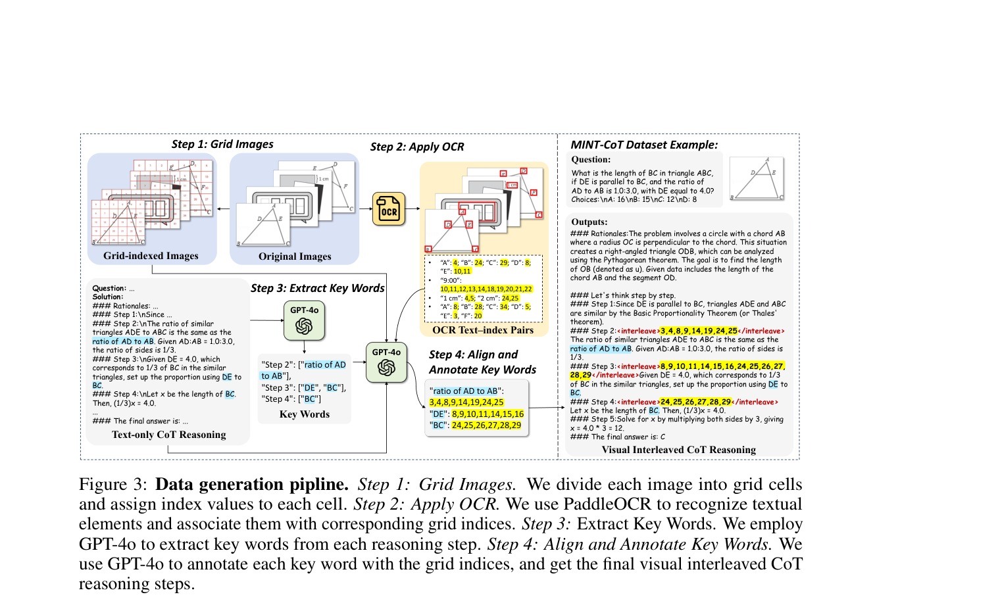
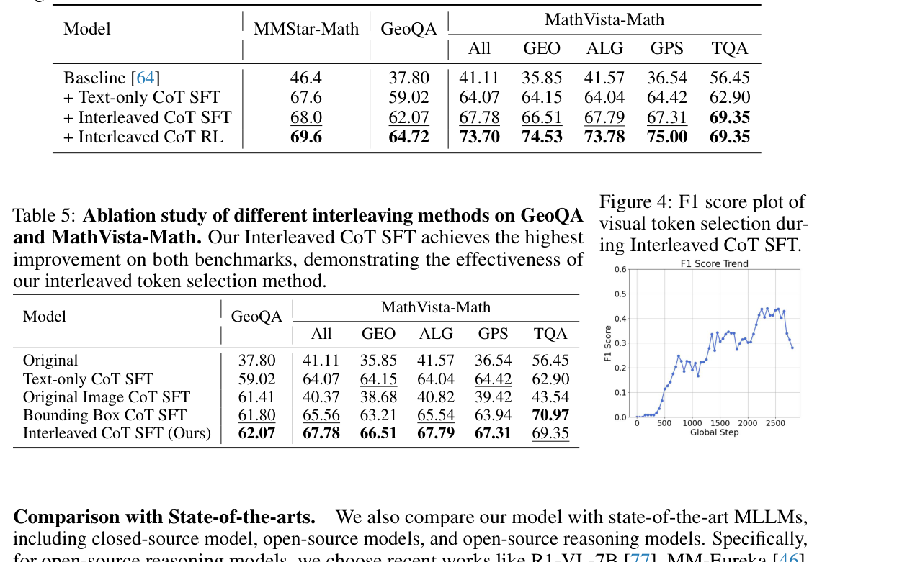
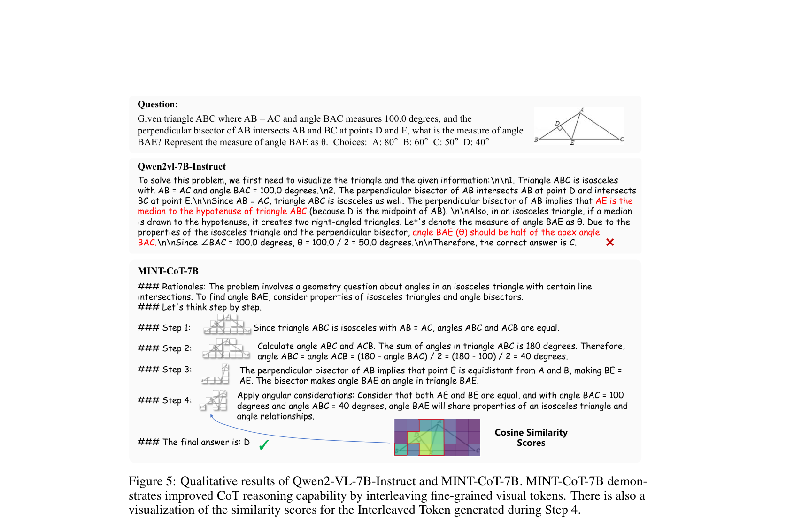

---
tags:
  - papers/visually-grounded-reasoning
  - papers/train
  - papers/math-reasoning
aliases:
  - "MINT-CoT"
  - "Mathematical Interleaved Tokens"
date: 2025-06-05
doi: 10.48550/arXiv.2506.05331
arxiv_id: 2506.05331
---

# MINT-CoT: Enabling Interleaved Visual Tokens in Mathematical Chain-of-Thought Reasoning

## 核心信息

- 标题: MINT-CoT: Enabling Interleaved Visual Tokens in Mathematical Chain-of-Thought Reasoning
- 标题翻译: MINT-CoT：在数学思维链推理中启用交错视觉标记
- 作者: Xinyan Chen, Renrui Zhang, Dongzhi Jiang, Aojun Zhou, Shilin Yan, Weifeng Lin, Hongsheng Li
- 发表时间: 2025-06-05
- 发表渠道: arXiv
- DOI: 10.48550/arXiv.2506.05331
- arXiv: 2506.05331
- 论文链接: http://arxiv.org/abs/2506.05331
- 代码 / 项目: https://github.com/xinyan-cxy/MINT-CoT
- 数据 / 资源: MINT-CoT 54K；GeoQA；MathVista；MMStar；Mulberry-260K
- 论文类型: AI 方法；训练型数学视觉推理；交错视觉标记；强化学习

## 原文摘要翻译

思维链已经广泛增强了大语言模型的数学推理能力，但把它扩展到多模态领域仍然困难。现有工作要么对图像输入采用类似的文本推理，要么试图把视觉信号插入数学思维链。然而，它们在数学问题求解中面临三个关键限制：依赖粗粒度框形图像区域、视觉编码器对数学内容的感知有限、以及依赖外部能力进行视觉修改。

本文提出 MINT-CoT，即用于思维链视觉推理的数学交错标记。MINT-CoT 通过交错标记把相关视觉标记 自适应插入文本推理步骤，从数学图形中动态选择任意形状的视觉区域。为了赋予模型这种能力，作者构建了 MINT-CoT 数据集，其中包含 54K 道数学题，并把每个推理步骤与 标记级视觉区域对齐，同时配套严格的数据生成管线。

作者进一步提出三阶段训练策略，逐步结合纯文本思维链监督微调、交错思维链监督微调和交错思维链强化学习，最终得到 MINT-CoT-7B。大量实验表明，该方法能在数学领域实现有效的视觉交错推理。MINT-CoT-7B 相比基线模型在 MathVista、GeoQA 和 MMStar 上分别提升 +34.08%、+28.78% 和 +23.2%。

## 创新点

1. 论文把“插图进 CoT”细化为“在每个数学推理步骤前插入相关视觉标记”，粒度比整图或框形区域更细。
2. 交错标记通过隐藏状态相似度选择视觉标记，允许任意形状区域，而不是只选矩形框。
3. 数据集把文本步骤、数学关键词和视觉网格索引对齐，给模型提供可监督的中间视觉证据。
4. 三阶段训练很清楚：先学纯文本推理格式，再学视觉标记 对齐，最后用 GRPO 做答案级优化。
5. 消融显示整图交错会引入大量无关视觉标记，甚至明显伤害 MathVista-Math。
6. 论文把数学图形推理从“看图回答”推进到“每一步推理都可绑定视觉证据”。

## 一句话总结

MINT-CoT 是一条数学图形推理的训练路线：它让模型在每个推理步骤前选择相关视觉标记，把图中的符号、线段和角度显式接入 CoT。

## 研究问题

数学图形推理的困难不是“有没有图像”，而是每一步推理到底依赖图中哪一块证据。文本 CoT 可以写出角度关系和方程，但不说明这些关系来自图中的哪个符号或区域。

*论文原图编号：Figure 1。MINT-CoT 与文本 CoT、框形视觉 CoT 的区别在于它选择细粒度视觉标记。*

框形区域也不理想。数学图里的证据经常是线段端点、角标、局部文字或稀疏符号，不一定落在一个干净矩形里。MINT-CoT 因此选择 标记集合，而不是强迫模型输出单个框。

## 数据与任务定义

MINT-CoT 数据集包含 54K 个数学样本。作者从 Mulberry-260K 中抽取数学问题及其推理步骤，再把图像划分成网格，使用 OCR 识别文本元素，最后让 GPT-4o 把每个推理步骤的关键词对齐到视觉网格索引。

*论文原图编号：Figure 3。数据构造包括网格化图像、OCR、关键词抽取，以及关键词到网格索引的标注。*

每个训练样本包含题目、图像和视觉交错 CoT。推理中会出现类似 `<interleave>...</interleave>` 的位置，把对应视觉索引插入到具体步骤之前。

评测集中在数学视觉推理。MathVista-Math 包含几何、代数、几何问题求解和教材问答。GeoQA 使用 Geo170K 测试集。MMStar-Math 则抽取 MMStar 中的数学能力维度。

## 方法主线

### 机制流程

1. 输入数学题和图像后，视觉编码器生成一组视觉标记。
2. 每个推理步骤前，模型生成交错标记，并把它投影到视觉选择空间。
3. 交错标记和视觉标记计算相似度，筛出与当前步骤相关的视觉证据。
4. 选中标记被拼接到上下文中，模型再输出文本推理步骤和最终答案。

*论文原图编号：Figure 2。交错标记选择视觉标记，并把它们插入对应推理步骤之前。*

### 视觉标记选择

设视觉编码器输出 $V=\{v_\tau\}_{\tau=1}^{N}$。每一步的交错标记隐藏状态经过投影后，与视觉标记 投影状态计算余弦相似度：

$$
\alpha^{(i)}=\gamma\cdot \cos(P_{\text{post\_intlv}}(h^{(i)}_{\text{post\_intlv}}),P_{\text{post\_vis}}(h_{\text{post\_vis}})).
$$

相似度超过阈值 $\theta$ 的标记会被选中：

$$
\{v^{(i)}\}=\{v\mid \alpha^{(i)}>\theta\}.
$$

这一步让模型可以选择任意形状的视觉证据。它不是把图切一个矩形框，而是让相关 标记集合进入下一步推理。

### 三阶段训练

第一阶段是纯文本 CoT 监督微调，用来让模型掌握数学推理格式。第二阶段是交错 CoT 监督微调，同时优化文本生成和视觉标记 选择。第三阶段是交错 CoT 强化学习，用 GRPO 根据答案正确性继续优化。

第二阶段的目标函数是：

$$
L=L_{\text{CE}}+L_{\text{BCE}}.
$$

其中 $L_{\text{CE}}$ 监督文本推理和答案，$L_{\text{BCE}}$ 监督交错标记对应的视觉标记 选择。

## 关键结果

### 主结果与强基线

*论文原图编号：Table 1。MINT-CoT-7B 在 MathVista-Math 上显著超过 Qwen2-VL 基线。*

| 基准 | Baseline | MINT-CoT-7B | 提升 |
|---|---:|---:|---:|
| MathVista-Math All | 41.11 | 73.70 | +32.59 |
| GeoQA | 37.80 | 64.72 | +26.92 |
| MMStar-Math | 46.4 | 69.6 | +23.2 |

这个提升幅度很大，但要注意基线是 Qwen2-VL-7B-Instruct。论文也报告它超过多条开源 reasoning 模型；在 MathVista-Math All 上，它比列出的最佳开源模型高 1.11。

### 消融到底说明了什么

*论文原图编号：Table 4。三阶段训练每一步都带来增益。*

| 阶段 | MMStar-Math | GeoQA | MathVista-Math All |
|---|---:|---:|---:|
| Baseline | 46.4 | 37.80 | 41.11 |
| Text-only CoT SFT | 67.6 | 59.02 | 64.07 |
| 交错 CoT SFT | 68.0 | 62.07 | 67.78 |
| 交错 CoT RL | 69.6 | 64.72 | 73.70 |

最大跃迁来自第一阶段。这说明很多收益其实来自模型先学会数学 CoT 格式。交错视觉标记 不是唯一原因，但它在第二阶段和第三阶段继续带来增益。

*论文原图编号：Table 5。整图交错会引入噪声，选择性标记交错更有效。*

| 方法 | GeoQA | MathVista-Math All |
|---|---:|---:|
| Original | 37.80 | 41.11 |
| Text-only CoT SFT | 59.02 | 64.07 |
| 原图 CoT SFT | 61.41 | 40.37 |
| Bounding Box CoT SFT | 61.80 | 65.56 |
| 交错 CoT SFT | 62.07 | 67.78 |

这张表是全篇最有价值的消融。把原图插到每一步并不会更好，MathVista-Math All 甚至从 64.07 掉到 40.37。真正有用的是选择与当前步骤相关的视觉标记。

### 定性结果

*论文原图编号：Figure 5。MINT-CoT 在几何题中把视觉标记 选择和具体推理步骤对齐。*

定性例子里，基线模型给出错误角度答案，而 MINT-CoT 在推理步骤中选择与角、线段和关系相关的视觉标记。这个例子说明交错不是装饰性输出，而是把视觉证据绑定到步骤。

## 深度分析

### 真正贡献是什么

MINT-CoT 的真正贡献是把数学图形推理拆成两个可训练对象：文本推理格式和视觉标记 选择。它没有简单说“模型要看图”，而是定义了什么时候插入、插入哪些标记、怎么监督这些标记。

### 为什么结果成立

数学图形里有大量稀疏符号。整图作为上下文太吵，矩形框又过粗。交错标记提供了一个轻量路由器，让当前推理步骤只看到相关视觉标记。这解释了为什么整图交错变差，而 标记选择变好。

### 容易误读的地方

不要把全部提升都归因于视觉标记。Table 4 显示，纯文本 CoT 监督微调已经带来很大提升。更准确的说法是：MINT-CoT 先把模型拉到会数学推理的状态，再让它学会在数学推理中使用视觉标记。

### 复现注意点

复现难点主要在数据。需要把数学题的每一步 reasoning 词语对齐到图像网格索引，还需要 OCR 和 GPT-4o 标注。训练上则需要改模型结构，引入交错后投影器和视觉后投影器，并在第二阶段加入 BCE 视觉选择损失。

## 局限

第一，任务范围集中在数学图形推理。它不一定能直接推广到开放世界 VQA、文档理解或 3D 场景。

第二，数据构造依赖 GPT-4o 和 OCR。标注质量如果下降，交错标记学习也会跟着变差。

第三，论文证明了选择性标记交错比整图交错好，但没有充分做因果删除实验。被选中的标记是否每一步都真正被模型使用，还需要进一步验证。

第四，阈值 $\theta$ 和投影器设计可能对视觉编码器敏感。换成不同 backbone 后，标记选择分布未必稳定。

## 我的笔记

这篇对 3D agent 很有启发。3D 场景中也有大量“当前步骤只需要局部证据”的情况，比如某个视角中的一条边、一个门把手、一个遮挡关系或一个坐标轴。MINT-CoT 的思想可以改写成：在每步空间推理前，选择相关视图标记 或对象标记，而不是把所有渲染图都塞回上下文。

它和 PatchCue 的差别也很清楚。PatchCue 用 patch 区域作为显式 cue，MINT-CoT 用视觉标记 集合作为更细粒度的交错证据。前者更容易解释，后者更贴近模型内部表示。

和 Position paper 放在一起看时，要继续追问：这些被插入的视觉标记 是否真的导致答案改变？下一步最好做 标记移除、反事实标记替换 或 注意力补丁分析，验证它是否只是训练后的格式行为。

## 引用

Chen, Xinyan, Renrui Zhang, Dongzhi Jiang, Aojun Zhou, Shilin Yan, Weifeng Lin, and Hongsheng Li. 2025. "MINT-CoT: Enabling Interleaved Visual Tokens in Mathematical Chain-of-Thought Reasoning." arXiv:2506.05331.
