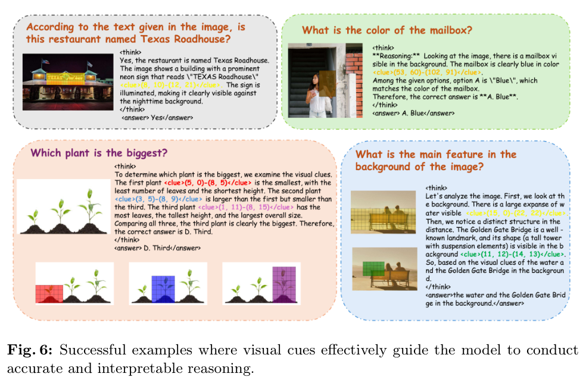
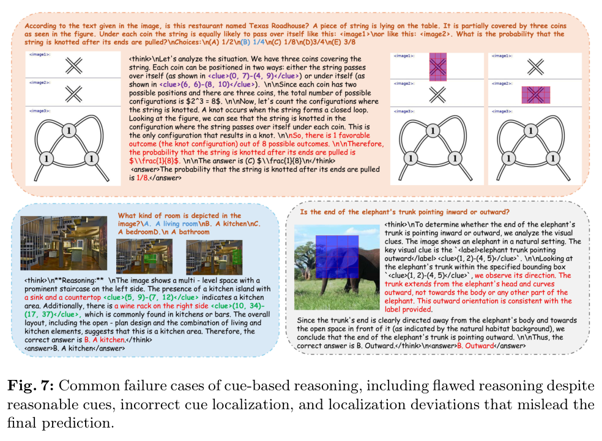
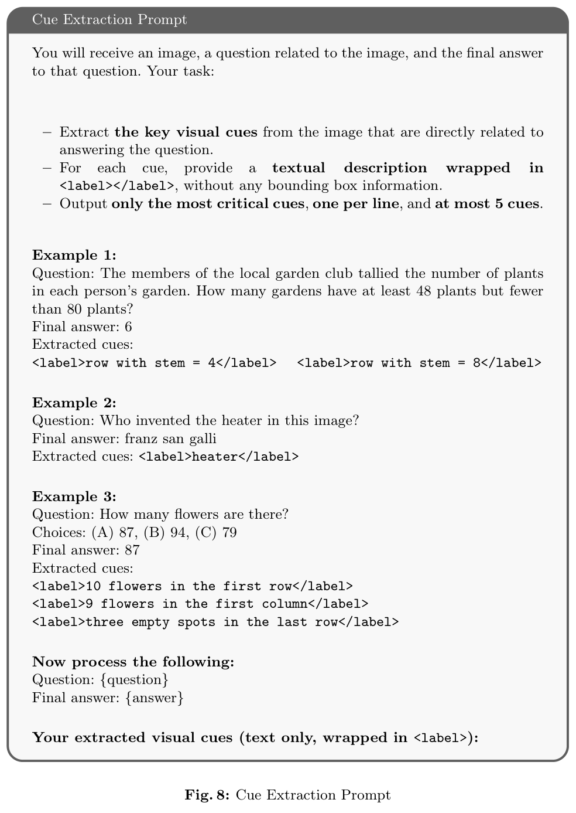
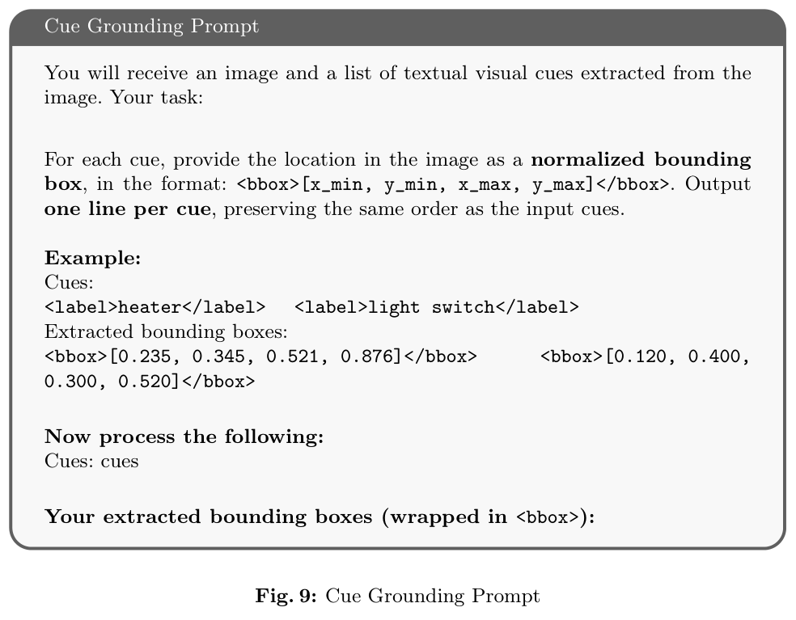
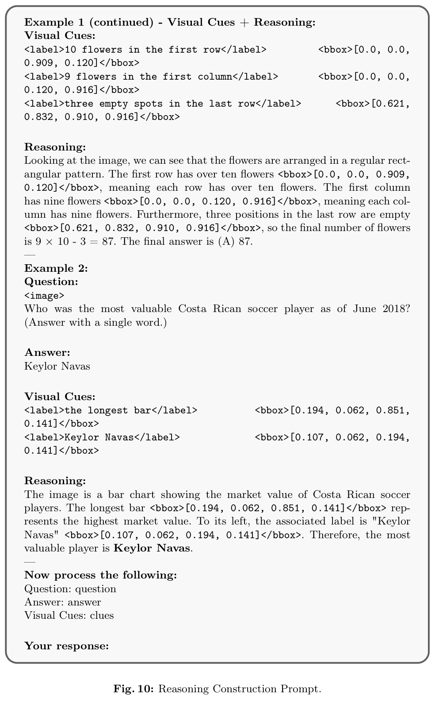

# PatchCue: Enhancing Vision-Language Model Reasoning with Patch-Based Visual Cues

> **中文题名：** PatchCue：用基于图像块的视觉线索增强视觉语言模型推理  
> **作者：** Yukun Qi, Pei Fu, Hang Li, Yuhan Liu, Chao Jiang, Bin Qin, Zhenbo Luo（通讯作者）, Jian Luan  
> **机构：** MiLM Plus, Xiaomi Inc.  
> **联系邮箱：** `{qiyukun, luozhenbo}@xiaomi.com`  
> **论文标识：** arXiv:2603.05869v2 [cs.CV]  
> **版本日期：** 13 March 2026  
> **关键词：** VLMs；Multimodal CoT  
> **源文件：** `Qi 等 - 2026 - PatchCue Enhancing Vision-Language Model Reasoning with Patch-Based Visual Cues.pdf`  
> **源范围：** 27 页；主文第 1–15 页，参考文献第 16–20 页，补充材料第 21–27 页  
> **编排说明：** 本文件严格按论文结构保留正文、公式、列表、图表、参考文献和补充材料。参考文献为保证书目信息可检索而有意保留英文、不逐条翻译。

## Page / Section Index

- Abstract：第 1 页
- 1 Introduction：第 1–3 页
- 2 Related Work：第 3–4 页
- 3 Method：第 4–9 页
  - 3.1 Overview：第 4–5 页
  - 3.2 Patch Cues：第 5–6 页
  - 3.3 Data Construction：第 6–7 页
  - 3.4 Training Paradigm：第 7–9 页
- 4 Experiment：第 9–14 页
  - 4.1 Implementation Details：第 9 页
  - 4.2 Main Results：第 9–10 页
  - 4.3 Analysis：第 10–13 页
  - 4.4 Discussion：第 13–14 页
- 5 Conclusion：第 14–15 页
- References：第 16–20 页
- 6 Supplementary：第 21–27 页
  - 6.1 Theoretical Details of GRPO：第 21 页
  - 6.2 Training Setting Details：第 21–22 页
  - 6.3 More Cases：第 22–23 页
  - 6.4 Prompt Template：第 22–27 页

## Terminology Ledger

| Canonical term / literal | 统一中文 | 保留原则 |
|---|---|---|
| PatchCue | PatchCue | 方法名不翻译 |
| vision-language model (VLM) | 视觉语言模型（VLM） | 首次出现给出中英文与缩写 |
| Chain-of-Thought (CoT) | 思维链（CoT） | 保留 CoT 缩写 |
| thinking with images / think with images | 用图像思考 | 引号中的范式名称按原文保留英文 |
| externally-guided reasoning | 外部引导推理 | 指调用检测器、裁剪器或放大器等外部工具 |
| internally-driven reasoning | 内部驱动推理 | 指利用模型内在能力交错生成视觉与文本线索 |
| pixel-bbox | 像素边界框 | 精确像素坐标框 |
| pixel-point | 像素点 | 单一像素位置线索 |
| patch-bbox | 图像块边界框 | 用图像块坐标编码的区域线索 |
| patch-point | 图像块点 | 中心图像块坐标线索 |
| visual cue | 视觉线索 | 泛指推理所依据的关键图像区域 |
| cue reward / $R_{\mathrm{cue}}$ | 线索奖励 | 基于图像块集合 F1 和匈牙利匹配的过程奖励 |
| cold-start supervised fine-tuning (SFT) | 冷启动监督微调（SFT） | 保留 SFT 缩写 |
| Group Relative Policy Optimization (GRPO) | 组相对策略优化（GRPO） | 保留 GRPO 缩写 |
| Intersection over Union (IoU) | 交并比（IoU） | 视觉定位一致性指标 |
| ground truth (GT) | 真实标注（GT） | 公式与技术叙述中保留 GT |
| `<think>`, `<cue>`, `<answer>` | 原样保留 | 输出格式控制标签，不翻译 |
| `<label>`, `<bbox>` | 原样保留 | 提示词中的结构化标签，不翻译 |

## Abstract

> <span style="color:#3B82F6"><strong>Para. 1:</strong></span> Vision-Language Models (VLMs) have achieved remarkable progress on a wide range of challenging multimodal understanding and reasoning tasks. However, existing reasoning paradigms, such as the classical Chain-of-Thought (CoT), rely solely on textual information and often underutilize important visual cues. While prior work has incorporated pixel-level visual cues, these representations require precise spatial localization, introducing additional learning complexity. To address this, we propose PatchCue, a novel patch-based visual cue paradigm designed to significantly enhance the visual reasoning capabilities of VLMs. By partitioning images into patches and representing cues at the patch level, PatchCue aligns better with human perceptual habits and leverages the patch-tokenized input of modern VLMs. We train VLMs using a two-stage approach: cold-start supervised fine-tuning to output patch-level cues, followed by reinforcement learning with a process-supervised cue reward that guides intermediate visual reasoning steps. Extensive experiments on multiple VLMs and diverse benchmarks, including general visual question answering, complex reasoning, and document understanding, demonstrate that PatchCue consistently improves overall model performance. Our results show that patch-level cues outperform both pixel-level bounding boxes and point-based cues, providing a more effective and cognitively aligned visual reasoning paradigm.

> <span style="color:#F59E0B"><strong>Para. 1[CN]:</strong></span> 视觉语言模型（VLM）已经在一系列富有挑战性的多模态理解与推理任务上取得显著进展。然而，经典思维链（CoT）等现有推理范式仅依赖文本信息，往往未能充分利用重要的视觉线索。尽管先前工作已经引入像素级视觉线索，但这类表示要求精确的空间定位，因而增加了额外的学习复杂度。为解决这一问题，我们提出 PatchCue：一种旨在显著增强 VLM 视觉推理能力的新型、基于图像块的视觉线索范式。PatchCue 将图像划分为图像块，并在图像块层级表示线索，因此更符合人类的感知习惯，也利用了现代 VLM 经图像块分词后的输入形式。我们采用两阶段方法训练 VLM：首先进行冷启动监督微调，使模型输出图像块级线索；随后开展强化学习，并使用过程监督的线索奖励来引导中间视觉推理步骤。在多个 VLM 和多种基准上的大量实验——涵盖通用视觉问答、复杂推理和文档理解——表明，PatchCue 能持续提升模型的整体性能。结果显示，图像块级线索优于像素级边界框和基于点的线索，由此提供了一种更有效、也更符合认知习惯的视觉推理范式。

## 1 Introduction

> <span style="color:#3B82F6"><strong>Para. 1:</strong></span> In recent years, Vision-Language Models (VLMs) have made remarkable progress across a wide range of multimodal understanding and reasoning tasks [1, 9, 20, 45, 57]. As tasks grow more complex, recent studies highlight the importance of thinking with images—reasoning that repeatedly consults visual information rather than relying solely on text. This moves beyond the classical Chain-of-Thought (CoT) paradigm, which depends exclusively on textual reasoning [10, 46, 53], motivating approaches that incorporate visual cues into intermediate reasoning steps [35, 40, 68, 71]. Such interleaved visual-text reasoning improves both accuracy and interpretability.

> <span style="color:#F59E0B"><strong>Para. 1[CN]:</strong></span> 近年来，视觉语言模型（VLM）在广泛的多模态理解与推理任务上取得了显著进展 [1, 9, 20, 45, 57]。随着任务日趋复杂，近期研究强调了“用图像思考”的重要性——即在推理过程中反复查阅视觉信息，而不是仅依赖文本。这超越了完全依靠文本推理的经典思维链（CoT）范式 [10, 46, 53]，并推动了在中间推理步骤中引入视觉线索的方法 [35, 40, 68, 71]。这种视觉—文本交错推理同时提升了准确性和可解释性。

### Figure 1. 不同视觉线索类型的推理对比


**Caption:** Comparison of reasoning with different cue types: (a) Text-only: reasoning based solely on textual information; (b) Pixel-bbox: cues represented as precise pixel-level bounding boxes; (c) Pixel-point: cues indicated by single pixel points highlighting key regions; (d) Patch-bbox: cues represented as patch-level regions to capture localized visual information; (e) SFT training comparison shows that patch-based cues improve model performance more effectively than pixel-bbox or pixel-point cues.

**Caption[CN]:** 不同线索类型的推理对比：（a）Text-only：仅依据文本信息进行推理；（b）Pixel-bbox：以精确的像素级边界框表示线索；（c）Pixel-point：以突出关键区域的单个像素点表示线索；（d）Patch-bbox：以图像块级区域表示线索，从而捕获局部视觉信息；（e）SFT 训练对比表明，基于图像块的线索比 pixel-bbox 或 pixel-point 线索更有效地提升模型性能。

> <span style="color:#3B82F6"><strong>Para. 2:</strong></span> Existing approaches can broadly be classified into two overarching categories: (1) **Externally-Guided Reasoning**, emulating how humans rely on external tools to inspect images [17, 29, 44, 68, 71]. These methods train models to invoke tools such as object detectors, cropping modules, or magnifiers during the reasoning process, enabling them to isolate important regions and incorporate the resulting visual cues to support inference. (2) **Internally-Driven Reasoning**, aiming to activate the model’s intrinsic ability to explore visual cues. Instead of depending on external modules, these approaches prompt the model to repeatedly attend to the image throughout reasoning, progressively identifying and leveraging salient regions to enhance inference performance [14, 35, 40, 48, 59].

> <span style="color:#F59E0B"><strong>Para. 2[CN]:</strong></span> 现有方法大体可以分为两个总类：（1）**外部引导推理（Externally-Guided Reasoning）**，模拟人类依赖外部工具检查图像的方式 [17, 29, 44, 68, 71]。这类方法训练模型在推理过程中调用目标检测器、裁剪模块或放大器等工具，使其能够隔离重要区域，并整合由此得到的视觉线索来支持推断。（2）**内部驱动推理（Internally-Driven Reasoning）**，旨在激活模型探索视觉线索的内在能力。这类方法不依赖外部模块，而是促使模型在整个推理过程中反复关注图像，逐步识别并利用显著区域，以增强推断性能 [14, 35, 40, 48, 59]。

> <span style="color:#3B82F6"><strong>Para. 3:</strong></span> Essentially, both types of approaches aim to identify key visual cue regions within an image and represent them in a form that effectively assists model reasoning. Currently, the dominant form of visual cue representation is at the pixel level, where critical regions are described by precise spatial coordinates [7, 40, 68]. Such fine-grained representations require detailed visual perception capabilities and introduce additional learning complexity. From the perspective of human visual cognition, individuals often rely on approximate cue regions rather than precise coordinates when interpreting visual scenes. For example, when asked “Which person is speaking in the picture?”, humans tend to focus on the speaker’s head or mouth region without needing to pinpoint the exact pixel boundaries. This suggests that in many visual reasoning scenarios, coarse spatial localization is sufficient to support accurate inference. These observations naturally raise an intriguing question: Is there a more efficient and cognitively aligned form of visual cue representation that can better support multimodal reasoning?

> <span style="color:#F59E0B"><strong>Para. 3[CN]:</strong></span> 从本质上看，这两类方法都旨在识别图像中的关键视觉线索区域，并以能够有效辅助模型推理的形式来表示它们。目前，占主导地位的视觉线索表示形式位于像素层级，即用精确的空间坐标描述关键区域 [7, 40, 68]。这种细粒度表示要求细致的视觉感知能力，也带来了额外的学习复杂度。从人类视觉认知的角度来看，人们解释视觉场景时往往依赖近似的线索区域，而非精确坐标。例如，当被问到“图中哪个人在说话？”时，人通常会关注说话者的头部或嘴部区域，而无须确定精确的像素边界。这说明在许多视觉推理场景中，粗略的空间定位已经足以支持准确推断。这些观察自然引出一个耐人寻味的问题：是否存在一种更高效、更符合认知习惯的视觉线索表示形式，从而更好地支持多模态推理？

> <span style="color:#3B82F6"><strong>Para. 4:</strong></span> To investigate this question, we analyze several representative visual cue forms, as illustrated in Figure 1. The text-only paradigm reflects reasoning occurring purely in the mind after initial observation, without iterative interaction with visual information. Pixel-level cues are typically represented as pixel-bbox base [7, 35, 40, 48] or pixel-point base [55, 58, 67]. While pixel-bbox cues require precise spatial localization, which may impose unnecessary granularity, point cues are simpler but convey limited and sometimes ambiguous information. Motivated by the patch tokenization mechanism in modern VLMs [1, 57, 58], we introduce a patch-bbox-based visual cue representation, partitioning the image into multiple patches and using patch coordinates to encode visual cues. As shown in Figure 1(e), validation experiments on Qwen2.5-VL-7B [1] show that, under the same data scale, patch-level cues outperform both pixel-bbox and pixel-point cues, highlighting their effectiveness in enhancing multimodal reasoning.

> <span style="color:#F59E0B"><strong>Para. 4[CN]:</strong></span> 为研究这一问题，我们分析了几种具有代表性的视觉线索形式，如图 1 所示。仅文本范式反映的是模型在初次观察后完全在“头脑”中进行推理，不再与视觉信息迭代交互。像素级线索通常表示为基于 pixel-bbox 的形式 [7, 35, 40, 48]，或基于 pixel-point 的形式 [55, 58, 67]。pixel-bbox 线索要求精确的空间定位，可能引入不必要的粒度；点线索虽然更简单，但所传达的信息有限，有时还存在歧义。受现代 VLM 图像块分词机制 [1, 57, 58] 的启发，我们引入一种基于 patch-bbox 的视觉线索表示：把图像划分成多个图像块，并使用图像块坐标编码视觉线索。如图 1(e) 所示，在 Qwen2.5-VL-7B [1] 上的验证实验表明，在相同数据规模下，图像块级线索优于 pixel-bbox 和 pixel-point 线索，凸显了它们在增强多模态推理方面的有效性。

> <span style="color:#3B82F6"><strong>Para. 5:</strong></span> Building on these insights, we propose PatchCue, a patch-bbox visual cue paradigm designed to enhance the visual reasoning capabilities of VLMs. Using generated patch-cue data, models are trained in two stages: cold-start supervised fine-tuning (SFT) to produce patch-level cues, followed by Group Relative Policy Optimization (GRPO) [41] for reinforcement learning. Unlike standard GRPO, PatchCue supervises intermediate patch regions, enabling more controllable optimization. A cue reward encourages accurate and informative cues while preventing over-reliance, improving the coherence and interpretability of interleaved visual–text reasoning. Experiments across multiple benchmarks show that PatchCue consistently improves performance, e.g., yielding an average gain of 2 points on Qwen2.5-VL-7B [1], demonstrating its effectiveness and strong generalization.

> <span style="color:#F59E0B"><strong>Para. 5[CN]:</strong></span> 基于这些认识，我们提出 PatchCue，一种旨在增强 VLM 视觉推理能力的 patch-bbox 视觉线索范式。利用生成的 patch-cue 数据，模型分两个阶段训练：先进行冷启动监督微调（SFT）以产生图像块级线索，再使用组相对策略优化（GRPO）[41] 开展强化学习。不同于标准 GRPO，PatchCue 对中间图像块区域进行监督，从而实现更可控的优化。线索奖励鼓励模型生成准确且信息充分的线索，同时防止过度依赖线索，由此改善视觉—文本交错推理的一致性与可解释性。多个基准上的实验表明，PatchCue 能持续提升性能；例如，它在 Qwen2.5-VL-7B [1] 上带来平均 2 分的增益，证明了其有效性与较强的泛化能力。

> <span style="color:#3B82F6"><strong>Para. 6:</strong></span> Our main contributions are as follows:
>
> - We propose a patch-bbox visual cue representation that partitions images into patches and encodes key regions with patch coordinates, improving multimodal reasoning efficiency and aligning better with human perception compared to pixel-level cues.
> - By combining cold-start SFT with an improved GRPO, intermediate patch regions are explicitly supervised, and a cue reward guides the model to focus on informative visual cues for controllable visual–text reasoning.
> - Experiments on multiple vision–language benchmarks with Qwen2.5-VL-7B [1] show that PatchCue consistently outperforms pixel-level cues, achieving an average improvement of 2 points and enhancing both accuracy and interpretability.

> <span style="color:#F59E0B"><strong>Para. 6[CN]:</strong></span> 我们的主要贡献如下：
>
> - 我们提出一种 patch-bbox 视觉线索表示，把图像划分为图像块，并用图像块坐标编码关键区域；与像素级线索相比，它提高了多模态推理效率，也更符合人类感知。
> - 通过结合冷启动 SFT 与改进的 GRPO，我们显式监督中间图像块区域，并利用线索奖励引导模型聚焦信息充分的视觉线索，从而实现可控的视觉—文本推理。
> - 在多个视觉语言基准上使用 Qwen2.5-VL-7B [1] 的实验表明，PatchCue 持续优于像素级线索，平均提升 2 分，同时增强了准确性与可解释性。

## 2 Related Work

### Thinking with Images

> <span style="color:#3B82F6"><strong>Para. 1:</strong></span> With the rapid development of large language models (LLMs), vision-language models (VLMs) have emerged as powerful systems capable of complex multimodal reasoning, achieving significant progress in areas such as open-source model development [1, 8, 19, 24], dataset construction [3, 5, 66], evaluation protocols [4, 36, 64, 69], and novel training objectives and architectural designs [12, 26, 27, 52]. Unlike text-only reasoning, which treats visual information as a static initial context [10, 46, 53], the “thinking with images” paradigm actively leverages visual information as intermediate steps during the reasoning process, becoming a key focus in VLM research. Existing approaches can be broadly categorized into two types. The first relies on external tools for additional visual processing and interaction, such as Deepeyes [71], VRAG-RL [50], Visual-ARFT [29], and Thyme [68]. The second type exploits the model’s intrinsic capabilities, interleaving visual cues directly within the textual reasoning pipeline. Early works such as VisualCoT [40] and CogCom [35] primarily employ bounding boxes as visual hints, while more recent studies explore richer visual representations. For example, Look-Back [59] uses text-visual prompting to trigger reflective reasoning, PaDT [43] incorporates visual encoding-decoding modules to enhance visual grounding, and MINT-CoT [6] introduces patch-level visual cues in geometric reasoning tasks. These advances collectively provide important possibilities for developing more general and effective interleaved visual-text reasoning paradigms.

> <span style="color:#F59E0B"><strong>Para. 1[CN]:</strong></span> 随着大语言模型（LLM）的快速发展，视觉语言模型（VLM）已经成为能够执行复杂多模态推理的强大系统，并在开源模型开发 [1, 8, 19, 24]、数据集构建 [3, 5, 66]、评测协议 [4, 36, 64, 69]，以及新型训练目标与架构设计 [12, 26, 27, 52] 等方面取得显著进展。仅文本推理把视觉信息视为静态的初始上下文 [10, 46, 53]；与之不同，“用图像思考”范式在推理过程中主动将视觉信息用作中间步骤，已成为 VLM 研究的一个重点。现有方法大体可分为两类。第一类依靠外部工具进行额外的视觉处理与交互，例如 Deepeyes [71]、VRAG-RL [50]、Visual-ARFT [29] 和 Thyme [68]。第二类利用模型的内在能力，直接在文本推理流程中交错插入视觉线索。VisualCoT [40] 和 CogCom [35] 等早期工作主要使用边界框作为视觉提示，而近期研究则探索更丰富的视觉表示。例如，Look-Back [59] 使用文本—视觉提示触发反思式推理，PaDT [43] 引入视觉编码—解码模块来增强视觉定位，MINT-CoT [6] 则在几何推理任务中引入图像块级视觉线索。这些进展共同为开发更通用、更有效的视觉—文本交错推理范式提供了重要可能性。

### Reinforcement Learning for Vision-Language Models

> <span style="color:#3B82F6"><strong>Para. 2:</strong></span> Reinforcement learning (RL) [37, 38, 41] has been widely adopted to enhance the reasoning capabilities of language models, as demonstrated by the success of DeepSeek-R1 [16] in mathematical reasoning tasks. Building on these advances, recent studies have extended RL to VLMs, with rule-based RL in multimodal domains emerging as a particularly promising direction. For perception enhancement, R1-V [2] applies RL to object counting, while Perception-R1 [61] leverages object matching and IoU as reward signals to improve visual grounding. In terms of reasoning, MMEureka [33] demonstrates the effectiveness of rule-based RL in mathematical problem-solving, and AGILE [65] enhances model reasoning through specialized visual tasks. From a data perspective, Vision-R1 [18] and R1-OneVision [60] convert visual information into textual representations to construct multimodal CoT datasets that facilitate stronger reasoning. Despite these significant advances, the complexity of the visual reasoning process still makes it highly challenging to apply RL supervision to intermediate reasoning steps, limiting the effectiveness of RL for fine-grained visual reasoning.

> <span style="color:#F59E0B"><strong>Para. 2[CN]:</strong></span> 强化学习（RL）[37, 38, 41] 已被广泛用于增强语言模型的推理能力，DeepSeek-R1 [16] 在数学推理任务上的成功便证明了这一点。在这些进展的基础上，近期研究已将 RL 扩展到 VLM，其中多模态领域的基于规则的 RL 成为尤其有前景的方向。在增强感知方面，R1-V [2] 将 RL 应用于目标计数，而 Perception-R1 [61] 利用目标匹配和 IoU 作为奖励信号来改善视觉定位。在推理方面，MMEureka [33] 展示了基于规则的 RL 在数学问题求解中的有效性，AGILE [65] 则通过专门的视觉任务增强模型推理。从数据角度看，Vision-R1 [18] 和 R1-OneVision [60] 把视觉信息转换成文本表示，以构建有助于更强推理的多模态 CoT 数据集。尽管已取得这些显著进展，视觉推理过程的复杂性仍使得对中间推理步骤施加 RL 监督极具挑战，从而限制了 RL 在细粒度视觉推理中的有效性。

## 3 Method

### 3.1 Overview

> <span style="color:#3B82F6"><strong>Para. 1:</strong></span> We propose PatchCue, a framework that enhances the reasoning capability of VLMs through patch-bbox visual cues. As illustrated in Figure 2, PatchCue introduces interpretable visual cues into the reasoning process, enabling dynamic interaction between textual reasoning and visual attention. This design allows the model to actively refer to visual evidence throughout reasoning, thereby improving both its visual sensitivity and overall reasoning consistency. In Section 3.2, we define and formalize the concept and representation of patch-bbox visual cues. In Section 3.3, we describe the visual cue data construction pipeline, which identifies key visual regions from multimodal datasets, generates high-quality patch-based cues, and reconstructs the corresponding reasoning trajectories. In Section 3.4, we present the cue-based training paradigm and introduce a novel process-supervised learning approach that provides fine-grained rewards and constraints for cue generation during reasoning. This mechanism enables more controllable optimization of the intermediate reasoning process.

> <span style="color:#F59E0B"><strong>Para. 1[CN]:</strong></span> 我们提出 PatchCue，一个通过 patch-bbox 视觉线索增强 VLM 推理能力的框架。如图 2 所示，PatchCue 将可解释的视觉线索引入推理过程，使文本推理与视觉注意之间能够动态交互。这一设计使模型可以在整个推理过程中主动引用视觉证据，从而同时提升其视觉敏感性和整体推理一致性。在第 3.2 节中，我们定义并形式化 patch-bbox 视觉线索的概念与表示。在第 3.3 节中，我们描述视觉线索数据构建流水线：它从多模态数据集中识别关键视觉区域，生成高质量、基于图像块的线索，并重建相应的推理轨迹。在第 3.4 节中，我们给出基于线索的训练范式，并引入一种新颖的过程监督学习方法，为推理期间的线索生成提供细粒度奖励与约束。这一机制能够以更可控的方式优化中间推理过程。

### Figure 2. PatchCue 框架概览


**Caption:** Overview of PatchCue. We divide images into fixed-size patches in order to represent important regions as visual cues. During the model’s reasoning process, it is essential not only to identify which patches are relevant to the given question but also to accurately reference and integrate these cues throughout each reasoning step. This structured use of patch-level cues helps the model ground its intermediate reasoning in the visual content, improving both interpretability and overall performance.

**Caption[CN]:** PatchCue 概览。我们把图像划分为固定大小的图像块，以便把重要区域表示为视觉线索。在模型的推理过程中，不仅要识别哪些图像块与给定问题相关，还必须在每个推理步骤中准确引用并整合这些线索。以结构化方式使用图像块级线索，有助于模型把中间推理建立在视觉内容之上，从而同时提升可解释性和整体性能。

### 3.2 Patch Cues

> <span style="color:#3B82F6"><strong>Para. 2:</strong></span> Pixel-level visual cues are typically represented using either absolute or relative spatial coordinates. In the absolute case, a pixel-level bounding box is represented by its top-left and bottom-right coordinates $(x_1, y_1)$ and $(x_2, y_2)$, whereas in the relative case, coordinates are normalized to $[0, 1]$ and must be scaled according to image dimensions $H$ and $W$. Patch-level visual cues operate on a coarser granularity by dividing the image into fixed-size non-overlapping patches. Following the preprocessing schemes of mainstream VLMs, we adopt patches of size $h \times w$ pixels. Given an image with height $H$ and width $W$, we first ensure that both $H$ and $W$ are integer multiples of $h$ and $w$, enabling even partitioning into patches. For a pixel with absolute coordinates $(x, y)$, its corresponding patch coordinate $(r, c)$ is computed as:

> <span style="color:#F59E0B"><strong>Para. 2[CN]:</strong></span> 像素级视觉线索通常使用绝对或相对空间坐标来表示。在绝对坐标情形下，像素级边界框由其左上角与右下角坐标 $(x_1, y_1)$ 和 $(x_2, y_2)$ 表示；在相对坐标情形下，坐标归一化到 $[0, 1]$，并且必须依据图像尺寸 $H$ 和 $W$ 进行缩放。图像块级视觉线索以更粗的粒度工作：把图像划分为固定大小、彼此不重叠的图像块。遵循主流 VLM 的预处理方案，我们采用大小为 $h \times w$ 像素的图像块。给定高度为 $H$、宽度为 $W$ 的图像，我们首先保证 $H$ 和 $W$ 分别是 $h$ 和 $w$ 的整数倍，从而能够把图像均匀划分为图像块。对于绝对坐标为 $(x, y)$ 的像素，其对应的图像块坐标 $(r, c)$ 计算如下：

$$
r=\left\lfloor\frac{y}{h}\right\rfloor,\qquad
c=\left\lfloor\frac{x}{w}\right\rfloor.
\tag{1}
$$

> <span style="color:#3B82F6"><strong>Para. 3:</strong></span> Thus, any pixel-level bounding box $[(x_1, y_1), (x_2, y_2)]$ can be converted to its patch-bbox representation by computing the top-left and bottom-right patch coordinates:

> <span style="color:#F59E0B"><strong>Para. 3[CN]:</strong></span> 因此，任何像素级边界框 $[(x_1, y_1), (x_2, y_2)]$ 都可以通过计算左上角与右下角的图像块坐标，转换为其 patch-bbox 表示：

$$
(r_1,c_1)=\left(\left\lfloor\frac{y_1}{h}\right\rfloor,\left\lfloor\frac{x_1}{w}\right\rfloor\right),\qquad
(r_2,c_2)=\left(\left\lfloor\frac{y_2}{h}\right\rfloor,\left\lfloor\frac{x_2}{w}\right\rfloor\right).
\tag{2}
$$

> <span style="color:#3B82F6"><strong>Para. 4:</strong></span> This two-dimensional patch coordinate $(r, c)$ serves as the patch ID for visual cue representation, which naturally aligns with VLM input tokenization and allows the model to attend to relevant image regions during reasoning. In our experiments, the patch height and width ($h$ and $w$) are set to 28 to match the image loading format of Qwen-2.5-VL [1].

> <span style="color:#F59E0B"><strong>Para. 4[CN]:</strong></span> 这一二维图像块坐标 $(r, c)$ 充当视觉线索表示的图像块 ID；它自然地与 VLM 输入分词方式对齐，并使模型能够在推理期间关注相关图像区域。在实验中，图像块的高度和宽度（$h$ 与 $w$）均设为 28，以匹配 Qwen-2.5-VL [1] 的图像加载格式。

### 3.3 Data Construction

> <span style="color:#3B82F6"><strong>Para. 5:</strong></span> To fully exploit patch-bbox visual cues and enable the model to learn a robust interleaved visual–text reasoning paradigm, we develop a high-quality automated pipeline for constructing visual-cue–guided reasoning data, allowing large-scale generation of interleaved multimodal reasoning samples. As shown in Figure 3, the pipeline consists of the following stages:

> <span style="color:#F59E0B"><strong>Para. 5[CN]:</strong></span> 为了充分利用 patch-bbox 视觉线索，并使模型能够学习稳健的视觉—文本交错推理范式，我们开发了一条高质量自动化流水线，用于构建视觉线索引导的推理数据，从而可以大规模生成交错式多模态推理样本。如图 3 所示，该流水线包含以下阶段：

### Figure 3. 数据流水线


**Caption:** Data Pipeline. Starting from the collected original data, we filter to obtain challenging samples. Then extract and ground the key visual cues in the images, and finally construct new reasoning sequences based on these cues.

**Caption[CN]:** 数据流水线。从收集到的原始数据出发，我们通过筛选获得具有挑战性的样本；随后提取并定位图像中的关键视觉线索，最后基于这些线索构建新的推理序列。

> <span style="color:#3B82F6"><strong>Para. 6:</strong></span> (1) **Data Collection and Quality Filtering.** We first gather a variety of multimodal reasoning datasets, including CogCom [35], DeepEyes [71], Thyme [68], and MINI-CoT [6]. To focus on challenging samples that can further improve reasoning capabilities, we filter the data using the base model Qwen2.5-VL-7B [1], removing samples that the model can already answer correctly.

> <span style="color:#F59E0B"><strong>Para. 6[CN]:</strong></span> （1）**数据收集与质量筛选。** 我们首先汇集多种多模态推理数据集，包括 CogCom [35]、DeepEyes [71]、Thyme [68] 和 MINI-CoT [6]。为了聚焦能够进一步提升推理能力的困难样本，我们使用基础模型 Qwen2.5-VL-7B [1] 筛选数据，移除该模型已经能够正确回答的样本。

> <span style="color:#3B82F6"><strong>Para. 7:</strong></span> (2) **Visual Cue Extraction.** For the filtered samples, we use GPT-4o [20] to identify the critical visual regions needed to answer the questions, based on the image, question, and reference answers. The extracted regions are returned as structured cue labels.

> <span style="color:#F59E0B"><strong>Para. 7[CN]:</strong></span> （2）**视觉线索提取。** 对于筛选后的样本，我们使用 GPT-4o [20]，依据图像、问题和参考答案，识别回答问题所需的关键视觉区域。提取出的区域以结构化线索标签的形式返回。

> <span style="color:#3B82F6"><strong>Para. 8:</strong></span> (3) **Visual Cue Grounding.** To ensure precise localization, we retain model outputs as bbox coordinates and further validate them using three strong VLMs: GPT-4o [20], Qwen2.5-VL-72B [1], and Seed1.5-VL [45]. We compute the IoU of the same cue labels across models, discarding samples where any pair falls below a threshold. Only samples with consistent and accurate localization across all three models are retained, and the bounding boxes are finally converted into patch-level representations.

> <span style="color:#F59E0B"><strong>Para. 8[CN]:</strong></span> （3）**视觉线索定位。** 为确保精确定位，我们把模型输出保留为 bbox 坐标，并进一步使用三个强大的 VLM 对其进行验证：GPT-4o [20]、Qwen2.5-VL-72B [1] 和 Seed1.5-VL [45]。我们计算不同模型针对同一线索标签所给区域之间的 IoU；只要任意模型对的 IoU 低于阈值，就丢弃该样本。仅保留三个模型的定位都一致且准确的样本，最后再把边界框转换为图像块级表示。

> <span style="color:#3B82F6"><strong>Para. 9:</strong></span> (4) **Reasoning Construction.** Based on the original image question-answer pairs and the verified cue labels, GPT-4o [20] organizes the patch-level cues into complete reasoning sequences, which are then used for model training and optimization.

> <span style="color:#F59E0B"><strong>Para. 9[CN]:</strong></span> （4）**推理构建。** GPT-4o [20] 依据原始图像问答对和经过验证的线索标签，把图像块级线索组织成完整的推理序列，随后将这些序列用于模型训练与优化。

### Figure 4. 线索数据分布


**Caption:** Data Distribution. In the left figure, we show the distribution of the number of cues per sample, where most cue data are concentrated between 2 and 5 cues; in the right figure, we show the distribution of the proportion of cue regions, with the majority of samples having cue regions occupying less than 40% of the image.

**Caption[CN]:** 数据分布。左图展示每个样本所含线索数量的分布，其中大多数线索数据集中在 2 到 5 条线索之间；右图展示线索区域占比的分布，大多数样本的线索区域占图像面积不到 40%。

> <span style="color:#3B82F6"><strong>Para. 10:</strong></span> Finally, in Figure 4, we present the distribution of the cue data we constructed, including the distribution of the number of cues per sample and the distribution of the proportion of cue regions.

> <span style="color:#F59E0B"><strong>Para. 10[CN]:</strong></span> 最后，我们在图 4 中给出所构建线索数据的分布，包括每个样本的线索数量分布，以及线索区域所占比例的分布。

### 3.4 Training Paradigm

> <span style="color:#3B82F6"><strong>Para. 11:</strong></span> **Cold-start Initialization.** We employ the patch-bbox cue data to perform SFT as a cold-start initialization, ensuring that the model acquires the ability to generate reasoning sequences guided by patch-level visual cues. To further enhance the model’s generalization capability and enable it to handle both scenarios suitable for cue-based reasoning and those that are not, we incorporate a portion of general multimodal SFT training data [21, 23, 32, 39] during this stage. In total, we select 12K patch-cue samples and 12K general QA samples for mixed SFT training, balancing cue-specific learning with broader multimodal reasoning ability.

> <span style="color:#F59E0B"><strong>Para. 11[CN]:</strong></span> **冷启动初始化。** 我们使用 patch-bbox 线索数据开展 SFT，作为冷启动初始化，以保证模型获得生成由图像块级视觉线索引导的推理序列的能力。为进一步增强模型的泛化能力，使其既能处理适合基于线索推理的场景，也能处理不适合该范式的场景，我们在这一阶段加入一部分通用多模态 SFT 训练数据 [21, 23, 32, 39]。我们总计选择 12K 个 patch-cue 样本和 12K 个通用 QA 样本进行混合 SFT 训练，在专门针对线索的学习与更广泛的多模态推理能力之间取得平衡。

> <span style="color:#3B82F6"><strong>Para. 12:</strong></span> **Reinforcement Learning.** To further enhance the model’s capability to autonomously generate visual cues, ensure their accuracy, and improve the alignment between the reasoning process and image content, we apply RL on the cold-started model using the GRPO algorithm [41]. To maximize the effectiveness of GRPO training, we first refine the training data by having the cold-started model perform multiple reasoning attempts on the candidate samples. Samples that the model consistently answers correctly or fails to answer are excluded, resulting in a curated set of 15K samples for GRPO training. GRPO then performs policy gradient optimization within each sample group, enabling the model to efficiently produce more diverse and richer reasoning sequences. The effectiveness of this approach largely depends on the design of the reward function, which in our framework consists of the following components:

> <span style="color:#F59E0B"><strong>Para. 12[CN]:</strong></span> **强化学习。** 为进一步增强模型自主生成视觉线索的能力，保证线索准确性，并改善推理过程与图像内容之间的对齐，我们在冷启动模型上使用 GRPO 算法 [41] 开展 RL。为最大化 GRPO 训练的有效性，我们首先让冷启动模型对候选样本进行多次推理尝试，以此精炼训练数据。模型始终能正确回答或始终无法回答的样本均被排除，最终得到一个经过筛选的 15K 样本集用于 GRPO 训练。随后，GRPO 在每个样本组内部执行策略梯度优化，使模型能够高效地产生更加多样、更加丰富的推理序列。该方法的有效性在很大程度上取决于奖励函数的设计；在我们的框架中，奖励函数包含以下组成部分：

> <span style="color:#3B82F6"><strong>Para. 13:</strong></span>
>
> - **Accuracy Reward:** The accuracy reward evaluates the model’s final output and is denoted as $R_{\mathrm{acc}}$. It is computed by comparing the final answer extracted from the model’s reasoning process with the ground-truth answer. If the model’s final answer matches the ground-truth, $R_{\mathrm{acc}}$ is set to 1; otherwise, it is set to 0.

> <span style="color:#F59E0B"><strong>Para. 13[CN]:</strong></span>
>
> - **准确性奖励：** 准确性奖励评估模型的最终输出，记为 $R_{\mathrm{acc}}$。其计算方式是把从模型推理过程中抽取的最终答案与真实答案进行比较。若模型的最终答案与真实答案一致，则把 $R_{\mathrm{acc}}$ 设为 1；否则设为 0。

> <span style="color:#3B82F6"><strong>Para. 14:</strong></span>
>
> - **Format Reward:** The model receives a reward of 1, denoted as $R_{\mathrm{format}}$, if its output follows the required structured format, where the reasoning process, visual cues, and final answer are correctly enclosed within the `<think></think>`, `<cue></cue>`, and `<answer></answer>` tags, respectively.

> <span style="color:#F59E0B"><strong>Para. 14[CN]:</strong></span>
>
> - **格式奖励：** 如果模型输出遵循所要求的结构化格式，即推理过程、视觉线索和最终答案分别正确地包含在 `<think></think>`、`<cue></cue>` 和 `<answer></answer>` 标签内，模型就会得到一个值为 1、记作 $R_{\mathrm{format}}$ 的奖励。

> <span style="color:#3B82F6"><strong>Para. 15:</strong></span>
>
> - **Cue Reward:** To evaluate the alignment between the model’s predicted visual cues and the GT cues, and to supervise the intermediate reasoning process, we design a patch-level $F_1$-based matching reward specifically tailored for the patch-form cues, denoted as $R_{\mathrm{cue}}$. For each cue region, we construct the corresponding patch set:

> <span style="color:#F59E0B"><strong>Para. 15[CN]:</strong></span>
>
> - **线索奖励：** 为评估模型预测的视觉线索与 GT 线索之间的对齐程度，并监督中间推理过程，我们专门针对图像块形式的线索设计了一个基于图像块级 $F_1$ 的匹配奖励，记作 $R_{\mathrm{cue}}$。对于每个线索区域，我们构建相应的图像块集合：

$$
\mathcal{S}(r_1,c_1,r_2,c_2)=\{(i,j)\mid r_1\le i\le r_2,\;c_1\le j\le c_2\}.
\tag{3}
$$

> <span style="color:#3B82F6"><strong>Para. 16:</strong></span> Here, $(r_1,c_1)$ and $(r_2,c_2)$ denote the top-left and bottom-right patch coordinates of a cue region. Given a predicted patch region $\mathcal{S}_p$ and a GT patch region $\mathcal{S}_g$, we define:

> <span style="color:#F59E0B"><strong>Para. 16[CN]:</strong></span> 其中，$(r_1,c_1)$ 和 $(r_2,c_2)$ 分别表示线索区域左上角与右下角的图像块坐标。给定预测图像块区域 $\mathcal{S}_p$ 和 GT 图像块区域 $\mathcal{S}_g$，我们定义：

$$
\mathrm{TP}=|\mathcal{S}_p\cap\mathcal{S}_g|,\qquad
\mathrm{FP}=|\mathcal{S}_p\setminus\mathcal{S}_g|,\qquad
\mathrm{FN}=|\mathcal{S}_g\setminus\mathcal{S}_p|.
\tag{4}
$$

> <span style="color:#3B82F6"><strong>Para. 17:</strong></span> With precision ($Pre$) and recall ($Rec$) computed as

> <span style="color:#F59E0B"><strong>Para. 17[CN]:</strong></span> 精确率（$Pre$）和召回率（$Rec$）计算如下：

$$
Pre=\frac{\mathrm{TP}}{\mathrm{TP}+\mathrm{FP}},\qquad
Rec=\frac{\mathrm{TP}}{\mathrm{TP}+\mathrm{FN}}.
\tag{5}
$$

> <span style="color:#3B82F6"><strong>Para. 18:</strong></span> The patch-level $F_1$ score is then defined as

> <span style="color:#F59E0B"><strong>Para. 18[CN]:</strong></span> 随后，图像块级 $F_1$ 分数定义为：

$$
F_1=\frac{2\cdot Pre\cdot Rec}{Pre+Rec}.
\tag{6}
$$

> <span style="color:#3B82F6"><strong>Para. 19:</strong></span> If the GT contains no cues and the model’s reasoning output also contains no cues, $R_{\mathrm{cue}}$ is set to 1. To ensure effective reasoning, if the number of predicted cues exceeds the number of GT cues, $R_{\mathrm{cue}}$ is set to 0 to prevent the model from overproducing visual cues. When the number of predicted cues is less than or equal to the GT cues, we apply the Hungarian matching algorithm to find the optimal pairing between predicted and GT cues, ensuring a fair and structured evaluation of alignment. We construct the cost matrix:

> <span style="color:#F59E0B"><strong>Para. 19[CN]:</strong></span> 如果 GT 不包含线索，并且模型的推理输出也不包含线索，则把 $R_{\mathrm{cue}}$ 设为 1。为保证有效推理，如果预测线索数量超过 GT 线索数量，则把 $R_{\mathrm{cue}}$ 设为 0，防止模型过量生成视觉线索。当预测线索数量小于或等于 GT 线索数量时，我们应用匈牙利匹配算法，在预测线索与 GT 线索之间找到最优配对，从而以公平且结构化的方式评估对齐程度。我们构建如下代价矩阵：

$$
C_{ij}=1-F_1(\mathcal{S}_p^i,\mathcal{S}_g^j).
\tag{7}
$$

> <span style="color:#3B82F6"><strong>Para. 20:</strong></span> A matched pair $(i,j)$ is considered successful if

> <span style="color:#F59E0B"><strong>Para. 20[CN]:</strong></span> 若满足下式，则匹配对 $(i,j)$ 被视为成功匹配：

$$
F_1(\mathcal{S}_p^i,\mathcal{S}_g^j)\ge\tau.
\tag{8}
$$

> <span style="color:#3B82F6"><strong>Para. 21:</strong></span> Here, $\tau$ is a tunable hyperparameter controlling the minimum $F_1$ required for a successful match (default $\tau=0.5$). Let $k$ denote the number of successful matches. The cue reward can then be defined as:

> <span style="color:#F59E0B"><strong>Para. 21[CN]:</strong></span> 其中，$\tau$ 是一个可调超参数，用来控制成功匹配所需的最低 $F_1$（默认 $\tau=0.5$）。令 $k$ 表示成功匹配的数量，则线索奖励可定义为：

$$
R_{\mathrm{cue}}=\frac{k}{|\mathcal{S}_g|}.
\tag{9}
$$

> <span style="color:#3B82F6"><strong>Para. 22:</strong></span> In summary, $R_{\mathrm{cue}}$ can be uniformly expressed by the following formula:

> <span style="color:#F59E0B"><strong>Para. 22[CN]:</strong></span> 总之，$R_{\mathrm{cue}}$ 可以统一表示为下式：

$$
R_{\mathrm{cue}}=
\begin{cases}
1.0, & \text{if } |\mathcal{S}_p|=0 \text{ and } |\mathcal{S}_g|=0,\\
0, & \text{if } |\mathcal{S}_p|>|\mathcal{S}_g|,\\
\dfrac{k}{n_{\mathrm{GT}}}, & \text{if } 0<|\mathcal{S}_p|\le|\mathcal{S}_g|.
\end{cases}
\tag{10}
$$

> <span style="color:#3B82F6"><strong>Para. 23:</strong></span> The final reward formulation is shown in Equation (11):

> <span style="color:#F59E0B"><strong>Para. 23[CN]:</strong></span> 最终奖励形式如公式（11）所示：

$$
R=R_{\mathrm{acc}}+R_{\mathrm{format}}+R_{\mathrm{cue}}.
\tag{11}
$$

## 4 Experiment

### 4.1 Implementation Details

> <span style="color:#3B82F6"><strong>Para. 1:</strong></span> **Test Benchmark.** To thoroughly validate the effectiveness and generalization of PatchCue, evaluations were conducted on benchmarks covering diverse task dimensions. General question answering benchmarks include MMVet [62], RealWorldQA [56], MMStar [4], HallusionBench [15], MMBench [25], and MMVP [47]. OCR-based document and chart understanding benchmarks include TextVQA [42], AI2D [22], OCRBench [28], and ChartQA [31]. Complex multimodal reasoning benchmarks include MMMU [63], MathVista Mini [30], and MathVision [49]. Perception and counting benchmarks include BLINK [13] and CountBench [34]. High-resolution image perception benchmarks include HR-Bench4K [51], HR-Bench8K [51], and V* [54]. This comprehensive setup ensures that PatchCue’s effectiveness is validated across general understanding, reasoning, perception, and high-resolution visual domains.

> <span style="color:#F59E0B"><strong>Para. 1[CN]:</strong></span> **测试基准。** 为全面验证 PatchCue 的有效性与泛化能力，我们在覆盖不同任务维度的基准上进行评测。通用问答基准包括 MMVet [62]、RealWorldQA [56]、MMStar [4]、HallusionBench [15]、MMBench [25] 和 MMVP [47]。基于 OCR 的文档与图表理解基准包括 TextVQA [42]、AI2D [22]、OCRBench [28] 和 ChartQA [31]。复杂多模态推理基准包括 MMMU [63]、MathVista Mini [30] 和 MathVision [49]。感知与计数基准包括 BLINK [13] 和 CountBench [34]。高分辨率图像感知基准包括 HR-Bench4K [51]、HR-Bench8K [51] 和 V* [54]。这一全面的设置保证了 PatchCue 的有效性能够在通用理解、推理、感知和高分辨率视觉等领域得到验证。

> <span style="color:#3B82F6"><strong>Para. 2:</strong></span> **Training and Inference Setups.** All of our training tasks were implemented using the MS-Swift [70] framework, and all evaluation tasks were conducted using the VLMEvalKit [11] framework. The experiments were performed on 32 NVIDIA H20 GPUs, each with 96GB of memory.

> <span style="color:#F59E0B"><strong>Para. 2[CN]:</strong></span> **训练与推理设置。** 我们的所有训练任务均使用 MS-Swift [70] 框架实现，所有评测任务均使用 VLMEvalKit [11] 框架执行。实验在 32 张 NVIDIA H20 GPU 上完成，每张 GPU 配备 96GB 显存。

### 4.2 Main Results

### Table 1. 多个基准上的主要结果


**Caption:** Main results across multiple benchmarks. We evaluate the performance of various VLMs trained with our PatchCue paradigm, demonstrating consistent improvements over baseline models across diverse datasets. The notation “+PC” indicates models trained with our patch-bbox visual cue data.

**Caption[CN]:** 多个基准上的主要结果。我们评估了采用 PatchCue 范式训练的多种 VLM 的性能，结果表明它们在多种数据集上相较基线模型均获得持续提升。符号“+PC”表示使用我们的 patch-bbox 视觉线索数据训练的模型。

| Category | Benchmark | Qwen2.5-VL-3B | +PC | Qwen2.5-VL-7B | +PC | MiMo-VL-7B | +PC |
|---|---|---:|---:|---:|---:|---:|---:|
| General visual question answering | HallusionBench | 46.3 | 47.5 | 52.9 | 53.5 | 52.3 | 53.7 |
| General visual question answering | MMVet | 60.0 | 63.2 | 69.7 | 74.2 | 72.2 | 75.8 |
| General visual question answering | MMBench | 79.1 | 79.1 | 82.2 | 82.5 | 83.2 | 83.8 |
| General visual question answering | MMStar | 55.9 | 56.8 | 63.9 | 66.2 | 67.2 | 67.4 |
| General visual question answering | MMVP | 70.7 | 70.3 | 77.7 | 79.3 | 72.7 | 74.3 |
| General visual question answering | RealWorldQA | 67.5 | 68.0 | 68.5 | 69.3 | 73.3 | 77.5 |
| Document & chart understanding | TextVQA | 79.3 | 84.8 | 84.9 | 87.4 | 81.2 | 84.3 |
| Document & chart understanding | AI2D | 81.6 | 81.4 | 83.9 | 84.7 | 83.2 | 85.2 |
| Document & chart understanding | ChartQA | 84.0 | 83.8 | 87.3 | 88.1 | 84.4 | 85.9 |
| Document & chart understanding | OCRBench | 79.7 | 81.5 | 88.8 | 91.1 | 82.9 | 84.8 |
| Multimodal reasoning | MathVision | 21.2 | 23.3 | 25.1 | 27.8 | 57.9 | 57.0 |
| Multimodal reasoning | MathVista mini | 62.3 | 63.3 | 68.2 | 69.6 | 81.8 | 80.8 |
| Multimodal reasoning | MMMU | 53.1 | 54.0 | 52.8 | 55.8 | 64.6 | 62.6 |
| Perception / counting | BLINK | 47.6 | 48.9 | 56.4 | 56.6 | 62.5 | 62.6 |
| Perception / counting | CountBench | 77.8 | 78.8 | 89.3 | 89.9 | 87.0 | 89.3 |
| High-res perception | HR-Bench4K | 66.3 | 65.0 | 68.8 | 72.3 | 75.2 | 75.4 |
| High-res perception | HR-Bench8K | 63.5 | 63.7 | 65.3 | 69.6 | 70.6 | 73.8 |
| High-res perception | V* | 75.4 | 73.8 | 76.4 | 79.7 | 80.6 | 85.3 |
| **Average** | **avg** | **65.0** | **66.1 (+1.1)** | **70.1** | **72.1 (+2.0)** | **73.9** | **75.4 (+1.5)** |

> <span style="color:#3B82F6"><strong>Para. 3:</strong></span> Our main experimental results are summarized in Table 1. To comprehensively evaluate the effectiveness of the PatchCue data and training methodology, and to assess its adaptability across different model sizes and architectures, we conducted experiments on three VLMs: Qwen2.5-VL-3B [1], Qwen2.5-VL-7B [1], and MiMo-VL-7B [57]. All models were trained using our patch-cue data through a two-stage process, consisting of SFT followed by RL. As shown in the table, all models consistently demonstrate performance gains across multiple benchmarks compared with their original versions. For instance, Qwen2.5-VL-7B achieves an improvement of 2.3 points on MMStar [4], confirming the effectiveness of our approach. The consistent improvements across different architectures and model scales further validate that the cue-based interleaved reasoning paradigm serves as a general framework, providing universal benefits to various VLMs. Meanwhile, the lightweight 3B model may exhibit relatively smaller performance gains due to its weaker CoT reasoning capability.

> <span style="color:#F59E0B"><strong>Para. 3[CN]:</strong></span> 我们的主要实验结果汇总于表 1。为全面评估 PatchCue 数据与训练方法的有效性，并考察其对不同模型规模和架构的适应性，我们在三个 VLM 上开展实验：Qwen2.5-VL-3B [1]、Qwen2.5-VL-7B [1] 和 MiMo-VL-7B [57]。所有模型都使用我们的 patch-cue 数据，通过先 SFT、后 RL 的两阶段流程进行训练。如表所示，相较各自的原始版本，所有模型都在多个基准上持续取得性能增益。例如，Qwen2.5-VL-7B 在 MMStar [4] 上提升 2.3 分，证实了我们方法的有效性。不同架构与模型规模上稳定的提升进一步验证了：基于线索的交错推理范式可以充当一个通用框架，为多种 VLM 带来普遍收益。同时，轻量级 3B 模型可能由于 CoT 推理能力较弱而表现出相对较小的性能增益。

### 4.3 Analysis

#### Impact of different cue formats on performance

> <span style="color:#3B82F6"><strong>Para. 4:</strong></span> We systematically investigate the impact of different visual cue representations on model performance during training. Specifically, we adopt Qwen2.5-VL-7B [1] as the base model and transform all patch-bbox cues used in the SFT stage into several alternative formats: (1) pixel-level bounding boxes represented by relative pixel coordinates (pixel-bbox), (2) single-pixel location cues (pixel-point), (3) patch-level cues represented by the coordinates of the central patch region (patch-point), and (4) a text-only variant that removes visual cues while retaining textual labels (labels). Throughout this process, the overall dataset size and content remain unchanged, with only the cue representation format being modified, ensuring a fair comparison. We then retrain the model with each cue type and evaluate its performance across multiple benchmarks to assess the influence of cue design. As shown in Table 2, under identical data scales and training paradigms, the models exhibit varying performance depending on the cue format. Notably, the patch-bbox representation consistently achieves the largest overall improvement, highlighting its effectiveness and generalizability as a superior visual cue for multimodal reasoning tasks.

> <span style="color:#F59E0B"><strong>Para. 4[CN]:</strong></span> 我们系统研究训练期间不同视觉线索表示对模型性能的影响。具体而言，我们采用 Qwen2.5-VL-7B [1] 作为基础模型，并把 SFT 阶段使用的全部 patch-bbox 线索转换为几种替代格式：（1）由相对像素坐标表示的像素级边界框（pixel-bbox）；（2）单像素位置线索（pixel-point）；（3）由中心图像块区域坐标表示的图像块级线索（patch-point）；以及（4）移除视觉线索但保留文本标签的仅文本变体（labels）。在此过程中，数据集的总体规模和内容保持不变，仅修改线索表示格式，以确保公平比较。随后，我们使用每一种线索类型重新训练模型，并在多个基准上评估其性能，以考察线索设计的影响。如表 2 所示，在数据规模和训练范式相同的情况下，模型会因线索格式不同而呈现不同性能。特别是，patch-bbox 表示持续取得最大的总体提升，凸显了它作为多模态推理任务中一种更优视觉线索的有效性与泛化能力。

### Table 2. 不同视觉线索形式的性能对比


**Caption:** Performance comparison across different forms of visual cues. We compare the impact of different visual cue formats on model performance under the same data scale and reasoning paradigm, where “Baseline” denotes the original results of Qwen2.5-VL 7B. The other columns show the results after SFT training using the cue data corresponding to each representation type.

**Caption[CN]:** 不同视觉线索形式的性能对比。我们在相同数据规模和推理范式下比较不同视觉线索格式对模型性能的影响，其中“Baseline”表示 Qwen2.5-VL 7B 的原始结果；其余各列表示使用对应表示类型的线索数据完成 SFT 训练后的结果。

| Category | Benchmark | Baseline | Pixel-Bbox | Pixel-Point | Patch-Bbox | Patch-Point | Labels |
|---|---|---:|---:|---:|---:|---:|---:|
| General visual question answering | HallusionBench | 52.9 | 51.5 | 53.0 | 52.5 | 53.1 | 52.9 |
| General visual question answering | MMVet | 69.7 | 66.0 | 65.3 | 70.4 | 65.3 | 63.3 |
| General visual question answering | MMBench | 82.2 | 81.2 | 80.0 | 82.1 | 80.1 | 78.6 |
| General visual question answering | MMStar | 63.9 | 64.9 | 64.8 | 65.6 | 64.7 | 64.6 |
| General visual question answering | MMVP | 77.7 | 78.1 | 77.3 | 78.7 | 78.0 | 77.6 |
| General visual question answering | RealWorldQA | 68.5 | 69.3 | 69.3 | 69.3 | 69.9 | 69.9 |
| Document & chart understanding | TextVQA | 84.9 | 85.1 | 85.0 | 86.8 | 85.0 | 84.4 |
| Document & chart understanding | AI2D | 83.9 | 84.4 | 83.6 | 84.6 | 84.1 | 84.4 |
| Document & chart understanding | ChartQA | 87.3 | 87.2 | 87.8 | 87.9 | 87.9 | 88.2 |
| Document & chart understanding | OCRBench | 88.8 | 91.0 | 91.3 | 91.3 | 91.2 | 90.0 |
| Multimodal reasoning | MathVision | 25.1 | 26.7 | 29.7 | 27.1 | 28.3 | 27.8 |
| Multimodal reasoning | MathVista mini | 68.2 | 69.6 | 68.7 | 70.1 | 68.1 | 69.0 |
| Multimodal reasoning | MMMU | 52.8 | 51.3 | 50.3 | 55.3 | 50.1 | 51.1 |
| Perception / counting | BLINK | 56.4 | 55.7 | 55.4 | 57.2 | 55.1 | 56.8 |
| Perception / counting | CountBench | 89.3 | 84.7 | 85.0 | 87.6 | 80.9 | 83.2 |
| High-res perception | HR-Bench4K | 68.8 | 72.4 | 71.2 | 72.3 | 71.8 | 71.5 |
| High-res perception | HR-Bench8K | 65.3 | 68.5 | 69.7 | 69.9 | 69.0 | 69.1 |
| High-res perception | V* | 76.4 | 79.0 | 79.6 | 79.7 | 79.6 | 79.5 |
| **Average** | **avg** | **70.1** | **70.4** | **70.4** | **71.6** | **70.4** | **70.1** |

#### Ablation study on data composition

> <span style="color:#3B82F6"><strong>Para. 5:</strong></span> During the SFT training stage, we incorporate a portion of non-cue general data along with our patch-bbox cue data for mixed training. To evaluate the contribution of cue data, we conduct a data ratio ablation study, where the total amount of SFT training data is kept constant while varying the proportion of visual cue data and general non-cue data. We train Qwen2.5-VL-7B [1] under different ratio settings and compare the resulting model performances. As shown in Table 3, models trained solely on non-cue data achieve only marginal improvements, indicating that cue-based data effectively enhances the model’s perceptual reasoning capabilities. However, using only cue data leads to performance drops on certain benchmarks, which we attribute to the reduced output diversity and instruction-following ability caused by SFT training exclusively on cue data. This suggests that while cue data is crucial for improving visual reasoning, an appropriate balance with general data is necessary to maintain overall model robustness.

> <span style="color:#F59E0B"><strong>Para. 5[CN]:</strong></span> 在 SFT 训练阶段，我们把一部分无视觉线索的通用数据与 patch-bbox 线索数据结合起来进行混合训练。为评估线索数据的贡献，我们开展数据比例消融研究：保持 SFT 训练数据总量不变，同时改变视觉线索数据与无视觉线索通用数据所占的比例。我们在不同配比设置下训练 Qwen2.5-VL-7B [1]，并比较所得模型的性能。如表 3 所示，仅使用无视觉线索数据训练的模型只获得了很小的提升，这说明基于线索的数据能有效增强模型的感知推理能力。然而，仅使用线索数据会使某些基准上的性能下降；我们认为，这是因为只在视觉线索数据上开展 SFT 训练，降低了输出多样性和指令遵循能力。这表明，尽管线索数据对于改善视觉推理至关重要，但要保持模型的整体稳健性，仍需要让它与通用数据保持适当平衡。

### Table 3. 不同训练数据设置下的性能对比


**Caption:** Performance comparison under different training data setups. We evaluate the impact of training data composition on model performance. “Baseline” denotes the original Qwen2.5-VL-7B results. Other rows indicate training on different combinations of general (Gen) and patch-bbox cue (Cue) data, with ratios specified as Gen:Cue.

**Caption[CN]:** 不同训练数据设置下的性能对比。我们评估训练数据组成对模型性能的影响。“Baseline”表示 Qwen2.5-VL-7B 的原始结果；其余各行表示使用通用数据（Gen）和 patch-bbox 线索数据（Cue）的不同组合进行训练，比例按 Gen:Cue 给出。

| Training Setup | AI2D [22] | ChartQA [31] | MMStar [4] | MMVP [47] |
|---|---:|---:|---:|---:|
| Baseline | 83.9 | 87.3 | 63.9 | 77.7 |
| Gen Only (1:0) | 83.5 | 87.5 | 65.3 | 76.7 |
| Hybrid (2:1) | 84.6 | 87.5 | 64.6 | 78.0 |
| Hybrid (1:1) | 84.6 | 87.9 | 65.6 | 78.7 |
| Hybrid (1:2) | 85.1 | 87.4 | 64.9 | 71.0 |
| Cue Only (0:1) | 80.8 | 86.6 | 60.3 | 68.0 |

### Table 4. 线索奖励消融


**Caption:** Ablation of cue reward. We compare the performance differences between RL training with and without the use of $R_{\mathrm{cue}}$. “Baseline” denotes the original Qwen2.5-VL-7B results, “+SFT” represents the results after SFT training, “+RL (w/o $R_{\mathrm{cue}}$)” indicates RL training based on the SFT model without applying $R_{\mathrm{cue}}$, and “+RL” denotes RL training with the incorporation of $R_{\mathrm{cue}}$.

**Caption[CN]:** 线索奖励消融。我们比较使用与不使用 $R_{\mathrm{cue}}$ 时 RL 训练的性能差异。“Baseline”表示 Qwen2.5-VL-7B 的原始结果，“+SFT”表示 SFT 训练后的结果，“+RL (w/o $R_{\mathrm{cue}}$)”表示在 SFT 模型基础上、不使用 $R_{\mathrm{cue}}$ 的 RL 训练，“+RL”表示加入 $R_{\mathrm{cue}}$ 的 RL 训练。

| Model | AI2D [22] | ChartQA [31] | MMStar [4] | MMVP [47] |
|---|---:|---:|---:|---:|
| Baseline | 83.9 | 87.3 | 65.3 | 77.7 |
| +SFT | 84.6 | 87.9 | 65.6 | 78.7 |
| +RL (w/o $R_{\mathrm{cue}}$) | 83.9 | 87.5 | 65.7 | 78.7 |
| +RL | 84.7 | 88.1 | 66.2 | 79.3 |

#### Ablation of cue reward

> <span style="color:#3B82F6"><strong>Para. 6:</strong></span> During the GRPO training stage, we introduce a novel process-level reward function specifically designed for patch-bbox cues. Table 4 presents a comparison between models trained with and without this cue-specific reward. The results indicate that incorporating the cue reward not only yields more substantial performance gains but also leads to more stable and consistent training dynamics. These findings highlight the effectiveness of the proposed reward function in guiding the model to better leverage visual cues, ultimately enhancing reasoning quality and overall performance.

> <span style="color:#F59E0B"><strong>Para. 6[CN]:</strong></span> 在 GRPO 训练阶段，我们引入一个专门为 patch-bbox 线索设计的新型过程级奖励函数。表 4 对比了使用与不使用这一线索专用奖励训练的模型。结果表明，引入线索奖励不仅带来了更显著的性能增益，还使训练动态更加稳定、一致。这些发现凸显了所提奖励函数的有效性：它引导模型更好地利用视觉线索，最终提升推理质量与整体性能。

### Table 5. 不同方法在多模态基准上的性能对比


**Caption:** Performance comparison of different methods on multimodal benchmarks. We sample $\sim$12K instances from VisualCoT, CogCom, and MINI-CoT, and fine-tune the same backbone (Qwen2.5-VL-7B) with an identical SFT protocol for a fair comparison across methods with different original settings.

**Caption[CN]:** 不同方法在多模态基准上的性能对比。我们从 VisualCoT、CogCom 和 MINI-CoT 中分别采样约 12K 个实例，并使用完全相同的 SFT 协议微调同一个骨干模型（Qwen2.5-VL-7B），以便在原始设置不同的方法之间开展公平比较。

| Method | AI2D [22] | ChartQA [31] | MMStar [4] | MMVP [47] |
|---|---:|---:|---:|---:|
| VisualCoT [40] | 83.9 | 85.0 | 63.8 | 75.2 |
| CogCom [35] | 84.6 | 85.6 | 64.0 | 76.0 |
| MINI-CoT [6] | 84.1 | 87.9 | 64.8 | 77.7 |
| PatchCue | 84.7 | 88.1 | 66.2 | 79.3 |

#### Comparison with other methods

> <span style="color:#3B82F6"><strong>Para. 7:</strong></span> To more clearly demonstrate the effectiveness of PatchCue, we compare it with several other methods for incorporating visual cues, as shown in Table 1. Since the experimental details of different methods vary, for example, CogCom [35] uses external visual tool calls and MINI-CoT [6] modifies the model backbone by adding extra encoding layers, we conduct a more direct comparison by training all methods with the same backbone, Qwen2.5-VL-7B [1]. For each method, we randomly sample about 12K training instances from their cue data for SFT training. The results in the table show that, under the same experimental settings and data size, PatchCue provides the most significant performance improvement.

> <span style="color:#F59E0B"><strong>Para. 7[CN]:</strong></span> 为更清楚地展示 PatchCue 的有效性，我们将其与另外几种引入视觉线索的方法进行比较，如表 1 所示。由于不同方法的实验细节有所差异——例如，CogCom [35] 使用外部视觉工具调用，而 MINI-CoT [6] 通过添加额外编码层来修改模型骨干——我们使用相同的 Qwen2.5-VL-7B [1] 骨干训练所有方法，以开展更直接的比较。对于每种方法，我们从其线索数据中随机采样约 12K 个训练实例用于 SFT 训练。表中结果表明，在相同实验设置和数据规模下，PatchCue 带来了最显著的性能提升。

#### Case Study

> <span style="color:#3B82F6"><strong>Para. 8:</strong></span> We illustrate the reasoning outputs of MiMo-VL-7B [57] and Qwen2.5-VL-7B [1], highlighting the differences before and after training with PatchCue in Figure 5. After training with patch-bbox cue data, the models gain the ability to explicitly generate visual cues throughout the reasoning process. This improvement not only strengthens their multimodal understanding and reasoning performance but also enhances the transparency and interpretability of their reasoning chains, making it easier to verify how visual information contributes to their conclusions.

> <span style="color:#F59E0B"><strong>Para. 8[CN]:</strong></span> 我们在图 5 中展示 MiMo-VL-7B [57] 和 Qwen2.5-VL-7B [1] 的推理输出，突出它们在接受 PatchCue 训练前后的差异。使用 patch-bbox 线索数据训练后，模型获得了在整个推理过程中显式生成视觉线索的能力。这种改进不仅增强了模型的多模态理解与推理性能，也提高了推理链的透明度和可解释性，使人们更容易验证视觉信息如何促成其结论。

### Figure 5. 案例研究


**Caption:** Case Study. We compare the model’s outputs before and after PatchCue training. After training, the model can generate visual cues during reasoning, improving both its perception and the interpretability of its reasoning process.

**Caption[CN]:** 案例研究。我们比较模型接受 PatchCue 训练前后的输出。训练后，模型能够在推理期间生成视觉线索，从而同时提升感知能力和推理过程的可解释性。

### 4.4 Discussion

> <span style="color:#3B82F6"><strong>Para. 9:</strong></span> Based on our proposed framework and experimental findings, several additional insights and methodological discussions can be derived.

> <span style="color:#F59E0B"><strong>Para. 9[CN]:</strong></span> 根据我们提出的框架与实验发现，还可以得到若干额外见解与方法论讨论。

> <span style="color:#3B82F6"><strong>Para. 10:</strong></span> **Findings 1: Simulating human visual perception requires more sophisticated reasoning paradigms.** Our experiments indicate that cue-output reasoning can help models address specific perceptual challenges, but relying solely on cue-based training data may degrade performance. In reality, humans do not rely on a single reasoning paradigm during perception; depending on the context, they flexibly combine visual cues, background knowledge, and experiential reasoning to interpret complex information. Similarly, in complex and diverse application scenarios, VLMs need the ability to adaptively switch or integrate multiple reasoning strategies to effectively handle more challenging tasks.

> <span style="color:#F59E0B"><strong>Para. 10[CN]:</strong></span> **发现 1：模拟人类视觉感知需要更复杂的推理范式。** 我们的实验表明，输出线索的推理可以帮助模型应对特定的感知挑战，但仅依赖基于线索的训练数据可能会降低性能。现实中，人类在感知期间并不依赖单一推理范式；他们会依据具体情境，灵活结合视觉线索、背景知识和经验性推理来解释复杂信息。类似地，在复杂多样的应用场景中，VLM 需要具备自适应切换或整合多种推理策略的能力，才能有效处理更具挑战性的任务。

> <span style="color:#3B82F6"><strong>Para. 11:</strong></span> **Findings 2: Models require more flexible forms of visual cues to achieve true “think with images” capabilities.** We explored a new form of visual cue representation and verified its effectiveness. However, under our patch-bbox visual cue framework, some base models show suboptimal performance on certain tasks (Table 1). In comparison, point-based cues at either the pixel or patch level achieve better results on benchmarks designed for mathematical and geometric reasoning, such as MathVision [49] (Table 2). This indicates that human visual cue perception relies on more complex and diverse cues, and more general and flexible visual cues may be needed to fully realize “think with images” capabilities.

> <span style="color:#F59E0B"><strong>Para. 11[CN]:</strong></span> **发现 2：模型需要更灵活的视觉线索形式，才能获得真正的“用图像思考”能力。** 我们探索了一种新的视觉线索表示形式，并验证了它的有效性。然而，在我们的 patch-bbox 视觉线索框架下，一些基础模型在某些任务上表现欠佳（表 1）。相比之下，像素级或图像块级的点线索，在 MathVision [49] 等专为数学与几何推理设计的基准上取得了更好的结果（表 2）。这说明，人类对视觉线索的感知依赖更复杂、更多样的线索；要充分实现“用图像思考”的能力，可能需要更加通用、更加灵活的视觉线索。

> <span style="color:#3B82F6"><strong>Para. 12:</strong></span> **Findings 3: Process rewards can play an effective role in perceptual reasoning.** In Table 4, we present a comparison of GRPO training results with and without the incorporation of process-level visual cue rewards. The results demonstrate that introducing such rewards, particularly under task-specific settings, can effectively enhance the model’s performance by guiding the intermediate perceptual reasoning process and stabilizing training outcomes.

> <span style="color:#F59E0B"><strong>Para. 12[CN]:</strong></span> **发现 3：过程奖励可以在感知推理中发挥有效作用。** 表 4 对比了加入与不加入过程级视觉线索奖励时的 GRPO 训练结果。结果表明，引入此类奖励，尤其是在任务特定设置下，可以通过引导中间感知推理过程并稳定训练结果，有效提升模型性能。

## 5 Conclusion

> <span style="color:#3B82F6"><strong>Para. 1:</strong></span> We propose PatchCue, a patch-bbox-based visual cue paradigm that divides images into patches and encodes cues at the patch level, aligning with human perceptual habits and the patch-tokenized structure of modern VLMs. Using a two-stage training strategy combining SFT and process-supervised RL, PatchCue enables models to generate and leverage visual cues more effectively during interleaved visual-text reasoning. Experiments across multiple VLMs and benchmarks show that patch-bbox cues consistently improve performance, indicating that well-designed visual cue representations can enhance multimodal reasoning and guide future cognitively aligned VLM research.

> <span style="color:#F59E0B"><strong>Para. 1[CN]:</strong></span> 我们提出 PatchCue，一种基于 patch-bbox 的视觉线索范式：它把图像划分成图像块，并在图像块层级编码线索，因此既符合人类感知习惯，也契合现代 VLM 经图像块分词后的结构。PatchCue 使用结合 SFT 与过程监督 RL 的两阶段训练策略，使模型能够在视觉—文本交错推理期间更有效地生成和利用视觉线索。多个 VLM 和基准上的实验表明，patch-bbox 线索能持续提升性能；这说明，经过良好设计的视觉线索表示可以增强多模态推理，并为未来符合认知规律的 VLM 研究提供指引。

## References

> **Reference-language note / 参考文献语言说明：** Bibliographic entries are intentionally retained in their original English form so that author names, titles, venues, identifiers, and URLs remain searchable. / 以下书目条目有意保留原始英文形式，不逐条翻译，以保证作者、题名、出版物、标识符与 URL 可检索。

1. Bai, S., Chen, K., Liu, X., Wang, J., Ge, W., Song, S., Dang, K., Wang, P., Wang, S., Tang, J., et al.: Qwen2.5-VL technical report. arXiv preprint arXiv:2502.13923 (2025).
2. Chen, L., Li, L., Zhao, H., Song, Y., Vinci: R1-V: Reinforcing super generalization ability in vision-language models with less than $3. https://github.com/Deep-Agent/R1-V (2025), accessed: 2025-02-02.
3. Chen, L., Li, J., Dong, X., Zhang, P., He, C., Wang, J., Zhao, F., Lin, D.: ShareGPT4V: Improving large multi-modal models with better captions. In: European Conference on Computer Vision. pp. 370–387. Springer (2024).
4. Chen, L., Li, J., Dong, X., Zhang, P., Zang, Y., Chen, Z., Duan, H., Wang, J., Qiao, Y., Lin, D., et al.: Are we on the right way for evaluating large vision-language models? Advances in Neural Information Processing Systems 37, 27056–27087 (2024).
5. Chen, L., Wei, X., Li, J., Dong, X., Zhang, P., Zang, Y., Chen, Z., Duan, H., Tang, Z., Yuan, L., et al.: ShareGPT4Video: Improving video understanding and generation with better captions. Advances in Neural Information Processing Systems 37, 19472–19495 (2024).
6. Chen, X., Zhang, R., Jiang, D., Zhou, A., Yan, S., Lin, W., Li, H.: MINT-CoT: Enabling interleaved visual tokens in mathematical chain-of-thought reasoning. arXiv preprint arXiv:2506.05331 (2025).
7. Chen, Z., Zhao, R., Luo, C., Sun, M., Yu, X., Kang, Y., Huang, R.: SIFThinker: Spatially-aware image focus for visual reasoning. arXiv preprint arXiv:2508.06259 (2025).
8. Chen, Z., Wu, J., Wang, W., Su, W., Chen, G., Xing, S., Zhong, M., Zhang, Q., Zhu, X., Lu, L., et al.: InternVL: Scaling up vision foundation models and aligning for generic visual-linguistic tasks. In: Proceedings of the IEEE/CVF Conference on Computer Vision and Pattern Recognition. pp. 24185–24198 (2024).
9. Comanici, G., Bieber, E., Schaekermann, M., Pasupat, I., Sachdeva, N., Dhillon, I., Blistein, M., Ram, O., Zhang, D., Rosen, E., et al.: Gemini 2.5: Pushing the frontier with advanced reasoning, multimodality, long context, and next generation agentic capabilities. arXiv preprint arXiv:2507.06261 (2025).
10. DeepSeek-AI: DeepSeek-R1: Incentivizing reasoning capability in LLMs via reinforcement learning (2025), https://arxiv.org/abs/2501.12948.
11. Duan, H., Yang, J., Qiao, Y., Fang, X., Chen, L., Liu, Y., Dong, X., Zang, Y., Zhang, P., Wang, J., et al.: VLMEvalKit: An open-source toolkit for evaluating large multi-modality models. In: Proceedings of the 32nd ACM International Conference on Multimedia. pp. 11198–11201 (2024).
12. Fang, Y., Wang, W., Xie, B., Sun, Q., Wu, L., Wang, X., Huang, T., Wang, X., Cao, Y.: EVA: Exploring the limits of masked visual representation learning at scale. In: Proceedings of the IEEE/CVF Conference on Computer Vision and Pattern Recognition. pp. 19358–19369 (2023).
13. Fu, X., Hu, Y., Li, B., Feng, Y., Wang, H., Lin, X., Roth, D., Smith, N.A., Ma, W.C., Krishna, R.: BLINK: Multimodal large language models can see but not perceive. In: European Conference on Computer Vision. pp. 148–166. Springer (2024).
14. Gao, J., Li, Y., Cao, Z., Li, W.: Interleaved-modal chain-of-thought. In: Proceedings of the Computer Vision and Pattern Recognition Conference. pp. 19520–19529 (2025).
15. Guan, T., Liu, F., Wu, X., Xian, R., Li, Z., Liu, X., Wang, X., Chen, L., Huang, F., Yacoob, Y., et al.: HallusionBench: An advanced diagnostic suite for entangled language hallucination and visual illusion in large vision-language models. In: Proceedings of the IEEE/CVF Conference on Computer Vision and Pattern Recognition. pp. 14375–14385 (2024).
16. Guo, D., Yang, D., Zhang, H., Song, J., Zhang, R., Xu, R., Zhu, Q., Ma, S., Wang, P., Bi, X., et al.: DeepSeek-R1: Incentivizing reasoning capability in LLMs via reinforcement learning. arXiv preprint arXiv:2501.12948 (2025).
17. Hu, Y., Shi, W., Fu, X., Roth, D., Ostendorf, M., Zettlemoyer, L., Smith, N.A., Krishna, R.: Visual Sketchpad: Sketching as a visual chain of thought for multi-modal language models. Advances in Neural Information Processing Systems 37, 139348–139379 (2024).
18. Huang, W., Jia, B., Zhai, Z., Cao, S., Ye, Z., Zhao, F., Xu, Z., Hu, Y., Lin, S.: Vision-R1: Incentivizing reasoning capability in multimodal large language models. arXiv preprint arXiv:2503.06749 (2025).
19. Huang, W., Zeng, Y., Wang, Q., Fang, Z., Cao, S., Chu, Z., Yin, Q., Chen, S., Yin, Z., Chen, L., et al.: Vision-DeepResearch: Incentivizing deep research capability in multimodal large language models. arXiv preprint arXiv:2601.22060 (2026).
20. Hurst, A., Lerer, A., Goucher, A.P., Perelman, A., Ramesh, A., Clark, A., Ostrow, A., Welihinda, A., Hayes, A., Radford, A., et al.: GPT-4o system card. arXiv preprint arXiv:2410.21276 (2024).
21. Kazemi, M., Alvari, H., Anand, A., Wu, J., Chen, X., Soricut, R.: GeomVerse: A systematic evaluation of large models for geometric reasoning. arXiv preprint arXiv:2312.12241 (2023).
22. Kembhavi, A., Salvato, M., Kolve, E., Seo, M., Hajishirzi, H., Farhadi, A.: A diagram is worth a dozen images. In: European Conference on Computer Vision. pp. 235–251. Springer (2016).
23. Lindström, A.D., Abraham, S.S.: CLEVR-Math: A dataset for compositional language, visual and mathematical reasoning. arXiv preprint arXiv:2208.05358 (2022).
24. Liu, S., Cheng, H., Liu, H., Zhang, H., Li, F., Ren, T., Zou, X., Yang, J., Su, H., Zhu, J., et al.: LLaVA-Plus: Learning to use tools for creating multimodal agents. In: European Conference on Computer Vision. pp. 126–142. Springer (2024).
25. Liu, Y., Duan, H., Zhang, Y., Li, B., Zhang, S., Zhao, W., Yuan, Y., Wang, J., He, C., Liu, Z., et al.: MMBench: Is your multi-modal model an all-around player? In: European Conference on Computer Vision. pp. 216–233. Springer (2024).
26. Liu, Y., Fu, J., Wu, Y., Wu, K., Li, P., Wu, J., Zhou, S., Xin, J.: Mind the gap: Aligning vision foundation models to image feature matching. In: Proceedings of the IEEE/CVF International Conference on Computer Vision. pp. 20313–20323 (2025).
27. Liu, Y., Huang, Q., Hui, S., Fu, J., Zhou, S., Wu, K., Li, P., Wang, J.: Semantic-aware representation learning for homography estimation. In: Proceedings of the 32nd ACM International Conference on Multimedia. pp. 2506–2514 (2024).
28. Liu, Y., Li, Z., Huang, M., Yang, B., Yu, W., Li, C., Yin, X.C., Liu, C.L., Jin, L., Bai, X.: OCRBench: On the hidden mystery of OCR in large multimodal models. Science China Information Sciences 67(12), 220102 (2024).
29. Liu, Z., Zang, Y., Zou, Y., Liang, Z., Dong, X., Cao, Y., Duan, H., Lin, D., Wang, J.: Visual agentic reinforcement fine-tuning. arXiv preprint arXiv:2505.14246 (2025).
30. Lu, P., Bansal, H., Xia, T., Liu, J., Li, C., Hajishirzi, H., Cheng, H., Chang, K.W., Galley, M., Gao, J.: MathVista: Evaluating mathematical reasoning of foundation models in visual contexts. arXiv preprint arXiv:2310.02255 (2023).
31. Masry, A., Long, D.X., Tan, J.Q., Joty, S., Hoque, E.: ChartQA: A benchmark for question answering about charts with visual and logical reasoning. arXiv preprint arXiv:2203.10244 (2022).
32. Mathew, M., Karatzas, D., Jawahar, C.: DocVQA: A dataset for VQA on document images. In: Proceedings of the IEEE/CVF Winter Conference on Applications of Computer Vision. pp. 2200–2209 (2021).
33. Meng, F., Du, L., Liu, Z., Zhou, Z., Lu, Q., Fu, D., Shi, B., Wang, W., He, J., Zhang, K., et al.: MM-Eureka: Exploring visual aha moment with rule-based large-scale reinforcement learning. CoRR (2025).
34. Paiss, R., Ephrat, A., Tov, O., Zada, S., Mosseri, I., Irani, M., Dekel, T.: Teaching CLIP to count to ten. In: Proceedings of the IEEE/CVF International Conference on Computer Vision. pp. 3170–3180 (2023).
35. Qi, J., Ding, M., Wang, W., Bai, Y., Lv, Q., Hong, W., Xu, B., Hou, L., Li, J., Dong, Y., et al.: CogCom: Train large vision-language models diving into details through chain of manipulations (2024).
36. Qi, Y., Zhao, Y., Zeng, Y., Bao, X., Huang, W., Chen, L., Chen, Z., Zhao, J., Qi, Z., Zhao, F.: VCR-Bench: A comprehensive evaluation framework for video chain-of-thought reasoning. arXiv preprint arXiv:2504.07956 (2025).
37. Rafailov, R., Sharma, A., Mitchell, E., Manning, C.D., Ermon, S., Finn, C.: Direct preference optimization: Your language model is secretly a reward model. Advances in Neural Information Processing Systems 36, 53728–53741 (2023).
38. Schulman, J., Wolski, F., Dhariwal, P., Radford, A., Klimov, O.: Proximal policy optimization algorithms. arXiv preprint arXiv:1707.06347 (2017).
39. Schwenk, D., Khandelwal, A., Clark, C., Marino, K., Mottaghi, R.: A-OKVQA: A benchmark for visual question answering using world knowledge. In: European Conference on Computer Vision. pp. 146–162. Springer (2022).
40. Shao, H., Qian, S., Xiao, H., Song, G., Zong, Z., Wang, L., Liu, Y., Li, H.: Visual CoT: Advancing multi-modal language models with a comprehensive dataset and benchmark for chain-of-thought reasoning. Advances in Neural Information Processing Systems 37, 8612–8642 (2024).
41. Shao, Z., Wang, P., Zhu, Q., Xu, R., Song, J., Bi, X., Zhang, H., Zhang, M., Li, Y., Wu, Y., et al.: DeepSeekMath: Pushing the limits of mathematical reasoning in open language models. arXiv preprint arXiv:2402.03300 (2024).
42. Singh, A., Natarajan, V., Shah, M., Jiang, Y., Chen, X., Batra, D., Parikh, D., Rohrbach, M.: Towards VQA models that can read. In: Proceedings of the IEEE/CVF Conference on Computer Vision and Pattern Recognition. pp. 8317–8326 (2019).
43. Su, Y., Zhang, H., Li, S., Liu, N., Liao, J., Pan, J., Liu, Y., Xing, X., Sun, C., Li, C., et al.: Patch-as-Decodable-Token: Towards unified multi-modal vision tasks in MLLMs. arXiv preprint arXiv:2510.01954 (2025).
44. Su, Z., Li, L., Song, M., Hao, Y., Yang, Z., Zhang, J., Chen, G., Gu, J., Li, J., Qu, X., et al.: OpenThinkIMG: Learning to think with images via visual tool reinforcement learning. arXiv preprint arXiv:2505.08617 (2025).
45. Team, B.S.: Seed1.5-VL technical report. arXiv preprint arXiv:2505.07062 (2025).
46. Team, K., Du, A., Gao, B., Xing, B., Jiang, C., Chen, C., Li, C., Xiao, C., Du, C., Liao, C., et al.: Kimi k1.5: Scaling reinforcement learning with LLMs. arXiv preprint arXiv:2501.12599 (2025).
47. Tong, S., Liu, Z., Zhai, Y., Ma, Y., LeCun, Y., Xie, S.: Eyes wide shut? Exploring the visual shortcomings of multimodal LLMs. In: Proceedings of the IEEE/CVF Conference on Computer Vision and Pattern Recognition. pp. 9568–9578 (2024).
48. Wang, J., Kang, Z., Wang, H., Jiang, H., Li, J., Wu, B., Wang, Y., Ran, J., Liang, X., Feng, C., et al.: VGR: Visual grounded reasoning. arXiv preprint arXiv:2506.11991 (2025).
49. Wang, K., Pan, J., Shi, W., Lu, Z., Ren, H., Zhou, A., Zhan, M., Li, H.: Measuring multimodal mathematical reasoning with Math-Vision dataset. Advances in Neural Information Processing Systems 37, 95095–95169 (2024).
50. Wang, Q., Ding, R., Zeng, Y., Chen, Z., Chen, L., Wang, S., Xie, P., Huang, F., Zhao, F.: VRAG-RL: Empower vision-perception-based RAG for visually rich information understanding via iterative reasoning with reinforcement learning. arXiv preprint arXiv:2505.22019 (2025).
51. Wang, W., Ding, L., Zeng, M., Zhou, X., Shen, L., Luo, Y., Yu, W., Tao, D.: Divide, conquer and combine: A training-free framework for high-resolution image perception in multimodal large language models. In: Proceedings of the AAAI Conference on Artificial Intelligence. vol. 39, pp. 7907–7915 (2025).
52. Wang, W., Dai, J., Chen, Z., Huang, Z., Li, Z., Zhu, X., Hu, X., Lu, T., Lu, L., Li, H., et al.: InternImage: Exploring large-scale vision foundation models with deformable convolutions. In: Proceedings of the IEEE/CVF Conference on Computer Vision and Pattern Recognition. pp. 14408–14419 (2023).
53. Wei, J., Wang, X., Schuurmans, D., Bosma, M., Xia, F., Chi, E., Le, Q.V., Zhou, D., et al.: Chain-of-thought prompting elicits reasoning in large language models. Advances in Neural Information Processing Systems 35, 24824–24837 (2022).
54. Wu, P., Xie, S.: V*: Guided visual search as a core mechanism in multimodal LLMs. In: Proceedings of the IEEE/CVF Conference on Computer Vision and Pattern Recognition. pp. 13084–13094 (2024).
55. Wu, Q., Cheng, K., Yang, R., Zhang, C., Yang, J., Jiang, H., Mu, J., Peng, B., Qiao, B., Tan, R., et al.: GUI-Actor: Coordinate-free visual grounding for GUI agents. arXiv preprint arXiv:2506.03143 (2025).
56. xAI: Grok-1.5 Vision Preview. https://x.ai/news/grok-1.5v (2024).
57. Xiaomi, L.C.T.: MiMo-VL technical report (2025), https://arxiv.org/abs/2506.03569.
58. Yang, B., Wen, B., Ding, B., Liu, C., Chu, C., Song, C., Rao, C., Yi, C., Li, D., Zang, D., et al.: Kwai Keye-VL 1.5 technical report. arXiv preprint arXiv:2509.01563 (2025).
59. Yang, S., Niu, Y., Liu, Y., Ye, Y., Lin, B., Yuan, L.: Look-Back: Implicit visual re-focusing in MLLM reasoning. arXiv preprint arXiv:2507.03019 (2025).
60. Yang, Y., He, X., Pan, H., Jiang, X., Deng, Y., Yang, X., Lu, H., Yin, D., Rao, F., Zhu, M., et al.: R1-OneVision: Advancing generalized multimodal reasoning through cross-modal formalization. arXiv preprint arXiv:2503.10615 (2025).
61. Yu, E., Lin, K., Zhao, L., Yin, J., Wei, Y., Peng, Y., Wei, H., Sun, J., Han, C., Ge, Z., et al.: Perception-R1: Pioneering perception policy with reinforcement learning. arXiv preprint arXiv:2504.07954 (2025).
62. Yu, W., Yang, Z., Li, L., Wang, J., Lin, K., Liu, Z., Wang, X., Wang, L.: MM-Vet: Evaluating large multimodal models for integrated capabilities. arXiv preprint arXiv:2308.02490 (2023).
63. Yue, X., Ni, Y., Zhang, K., Zheng, T., Liu, R., Zhang, G., Stevens, S., Jiang, D., Ren, W., Sun, Y., et al.: MMMU: A massive multi-discipline multimodal understanding and reasoning benchmark for expert AGI. In: Proceedings of the IEEE/CVF Conference on Computer Vision and Pattern Recognition. pp. 9556–9567 (2024).
64. Zeng, Y., Huang, W., Fang, Z., Chen, S., Shen, Y., Cai, Y., Wang, X., Yin, Z., Chen, L., Chen, Z., et al.: Vision-DeepResearch benchmark: Rethinking visual and textual search for multimodal large language models. arXiv preprint arXiv:2602.02185 (2026).
65. Zeng, Y., Huang, W., Huang, S., Bao, X., Qi, Y., Zhao, Y., Wang, Q., Chen, L., Chen, Z., Chen, H., et al.: Agentic jigsaw interaction learning for enhancing visual perception and reasoning in vision-language models. arXiv preprint arXiv:2510.01304 (2025).
66. Zeng, Y., Qi, Y., Zhao, Y., Bao, X., Chen, L., Chen, Z., Huang, S., Zhao, J., Zhao, F.: Enhancing large vision-language models with ultra-detailed image caption generation. In: Proceedings of the 2025 Conference on Empirical Methods in Natural Language Processing. pp. 26703–26729 (2025).
67. Zhang, S., Fu, P., Zhang, R., Yang, J., Du, A., Xi, X., Wang, S., Huang, Y., Qin, B., Luo, Z., et al.: HyperClick: Advancing reliable GUI grounding via uncertainty calibration. arXiv preprint arXiv:2510.27266 (2025).
68. Zhang, Y.F., Lu, X., Yin, S., Fu, C., Chen, W., Hu, X., Wen, B., Jiang, K., Liu, C., Zhang, T., et al.: Thyme: Think beyond images. arXiv preprint arXiv:2508.11630 (2025).
69. Zhao, Y., Zeng, Y., Qi, Y., Liu, Y., Chen, L., Chen, Z., Bao, X., Zhao, J., Zhao, F.: V2P-Bench: Evaluating video-language understanding with visual prompts for better human-model interaction. arXiv preprint arXiv:2503.17736 (2025).
70. Zhao, Y., Huang, J., Hu, J., Wang, X., Mao, Y., Zhang, D., Jiang, Z., Wu, Z., Ai, B., Wang, A., Zhou, W., Chen, Y.: Swift: A scalable lightweight infrastructure for fine-tuning (2024), https://arxiv.org/abs/2408.05517.
71. Zheng, Z., Yang, M., Hong, J., Zhao, C., Xu, G., Yang, L., Shen, C., Yu, X.: DeepEyes: Incentivizing “thinking with images” via reinforcement learning. arXiv preprint arXiv:2505.14362 (2025).

## 6 Supplementary

### 6.1 Theoretical Details of GRPO

> <span style="color:#3B82F6"><strong>Para. 1:</strong></span> The complete policy optimization objective for GRPO training is as follows:

> <span style="color:#F59E0B"><strong>Para. 1[CN]:</strong></span> GRPO 训练的完整策略优化目标如下：

$$
\begin{aligned}
\mathcal{J}_{\mathrm{GRPO}}(\theta)
={}&\mathbb{E}_{\left[q\sim P(Q),\,\{o_i\}_{i=1}^{G}\sim\pi_{\theta_{\mathrm{old}}}(O\mid q)\right]}
\Bigg[
\frac{1}{G}\sum_{i=1}^{G}\frac{1}{|o_i|}\sum_{t=1}^{|o_i|}
\Bigg\{
\min\Bigg[
\frac{\pi_{\theta}(o_{i,t}\mid q,o_{i,<t})}{\pi_{\theta_{\mathrm{old}}}(o_{i,t}\mid q,o_{i,<t})}A_{i,t},\\
&\operatorname{clip}\!\left(
\frac{\pi_{\theta}(o_{i,t}\mid q,o_{i,<t})}{\pi_{\theta_{\mathrm{old}}}(o_{i,t}\mid q,o_{i,<t})},
1-\varepsilon,1+\varepsilon
\right)A_{i,t}
\Bigg]
-\beta D_{\mathrm{KL}}\!\left[\pi_{\theta}\,\|\,\pi_{\mathrm{ref}}\right]
\Bigg\}
\Bigg].
\end{aligned}
\tag{12}
$$

> <span style="color:#3B82F6"><strong>Para. 2:</strong></span> Here, for each input question $q$ sampled from the distribution $P(Q)$, the rollout module generates a group of trajectories $\{o_i\}_{i=1}^{G}$ from the old policy $\pi_{\theta_{\mathrm{old}}}$ through interaction with the external environment. The term $A_{i,t}$ represents the advantage at step $t$ of trajectory $i$, computed based on the relative rewards of outputs within the group. The reward function consists of the three components introduced in the main text: Accuracy Reward, Format Reward, and Cue Reward.

> <span style="color:#F59E0B"><strong>Para. 2[CN]:</strong></span> 其中，对于从分布 $P(Q)$ 中采样的每个输入问题 $q$，rollout 模块通过与外部环境交互，从旧策略 $\pi_{\theta_{\mathrm{old}}}$ 生成一组轨迹 $\{o_i\}_{i=1}^{G}$。$A_{i,t}$ 表示轨迹 $i$ 在步骤 $t$ 的优势，它根据组内各输出的相对奖励计算得到。奖励函数由主文中介绍的三个组成部分构成：准确性奖励、格式奖励和线索奖励。

### 6.2 Training Setting Details

> <span style="color:#3B82F6"><strong>Para. 3:</strong></span> During the cold-start phase, we perform full-model fine-tuning, with the relevant hyperparameters listed in Table 6 below. All other parameters not listed are kept consistent with Swift’s official documentation.

> <span style="color:#F59E0B"><strong>Para. 3[CN]:</strong></span> 在冷启动阶段，我们执行全模型微调，相关超参数列于下方表 6。所有未列出的其他参数均与 Swift 官方文档保持一致。

### Table 6. SFT 训练超参数


**Caption:** Hyperparameters for SFT Training.

**Caption[CN]:** SFT 训练的超参数。

| Hyperparameter | Settings |
|---|---|
| DeepSpeed Stage | 2 |
| Warmup Ratio | 0.05 |
| Trainable Module | LLM |
| Epoch | 1 |
| LR Schedule | cosine |
| Learning Rate | 1e-5 |
| Max Pixels | 1003520 |
| Torch Dtype | bfloat16 |
| Batch Size | 128 |

> <span style="color:#3B82F6"><strong>Para. 4:</strong></span> During the RL phase, we train the model using the GRPO algorithm, with the corresponding hyperparameters listed in Table 7. All other parameters not listed are kept consistent with Swift’s official documentation.

> <span style="color:#F59E0B"><strong>Para. 4[CN]:</strong></span> 在 RL 阶段，我们使用 GRPO 算法训练模型，相应超参数列于表 7。所有未列出的其他参数均与 Swift 官方文档保持一致。

### Table 7. GRPO 训练超参数


**Caption:** Hyperparameters for GRPO Training.

**Caption[CN]:** GRPO 训练的超参数。

| Hyperparameter | Settings |
|---|---|
| Beta | 0.001 |
| Torch Dtype | bfloat16 |
| Learning Rate | 1e-6 |
| Warmup Ratio | 0.05 |
| Num Generations | 8 |
| Epoch | 3 |
| DeepSpeed Stage | 3 |
| Temperature | 1.0 |
| Top-p | 1.0 |
| Top-k | 80 |
| Repetition Penalty | 1.1 |
| Epsilon | 0.1 |
| Batch Size | 128 |
| Max Completion Length | 2048 |

### 6.3 More Cases

> <span style="color:#3B82F6"><strong>Para. 5:</strong></span> We present additional qualitative examples in Figure 6, which demonstrate how visual cues effectively guide the model toward task-relevant regions and facilitate more accurate and interpretable reasoning. These results further verify that incorporating cue information strengthens the model’s ability to ground its reasoning in the visual content.

> <span style="color:#F59E0B"><strong>Para. 5[CN]:</strong></span> 我们在图 6 中给出更多定性示例，展示视觉线索如何有效地把模型引向与任务相关的区域，并促进更准确、更具可解释性的推理。这些结果进一步证明，引入线索信息增强了模型把推理建立在视觉内容之上的能力。

### Figure 6. 视觉线索引导成功案例



**Caption:** Successful examples where visual cues effectively guide the model to conduct accurate and interpretable reasoning.

**Caption[CN]:** 视觉线索有效引导模型进行准确且可解释推理的成功案例。

> <span style="color:#3B82F6"><strong>Para. 6:</strong></span> In Figure 7, we analyze several representative failure modes of cue-based reasoning:
>
> - The model identifies reasonably accurate cues or the cues themselves are not essential, yet the subsequent logical reasoning is incorrect.
> - The model fails to locate the correct cues, resulting in its reasoning process being misdirected by inaccurate visual information.
> - The model identifies the general cue region but with noticeable localization errors, ultimately leading to incorrect final predictions.

> <span style="color:#F59E0B"><strong>Para. 6[CN]:</strong></span> 在图 7 中，我们分析了基于线索推理的几种代表性失败模式：
>
> - 模型识别出了相当准确的线索，或者线索本身并非必需，但后续逻辑推理仍然错误。
> - 模型未能定位正确线索，导致其推理过程被不准确的视觉信息带偏。
> - 模型识别出了大致的线索区域，但存在明显的定位误差，最终导致错误的最终预测。

### Figure 7. 基于线索推理的常见失败案例



**Caption:** Common failure cases of cue-based reasoning, including flawed reasoning despite reasonable cues, incorrect cue localization, and localization deviations that mislead the final prediction.

**Caption[CN]:** 基于线索推理的常见失败案例，包括线索合理但推理有缺陷、线索定位错误，以及误导最终预测的定位偏差。

### 6.4 Prompt Template

> <span style="color:#3B82F6"><strong>Para. 7:</strong></span> We provide the reference prompts used in constructing the visual cue data, as illustrated in Figures 8, 9, and 10.

> <span style="color:#F59E0B"><strong>Para. 7[CN]:</strong></span> 我们给出了构建视觉线索数据时所使用的参考提示词，如图 8、图 9 和图 10 所示。

### Figure 8. 线索提取提示词



**Caption:** Cue Extraction Prompt

**Caption[CN]:** 线索提取提示词

> <span style="color:#3B82F6"><strong>Para. 8:</strong></span> Exact prompt text:
>
> ```text
> Cue Extraction Prompt
>
> You will receive an image, a question related to the image, and the final answer
> to that question. Your task:
>
> – Extract the key visual cues from the image that are directly related to
>   answering the question.
> – For each cue, provide a textual description wrapped in
>   <label></label>, without any bounding box information.
> – Output only the most critical cues, one per line, and at most 5 cues.
>
> Example 1:
> Question: The members of the local garden club tallied the number of plants
> in each person’s garden. How many gardens have at least 48 plants but fewer
> than 80 plants?
> Final answer: 6
> Extracted cues:
> <label>row with stem = 4</label>  <label>row with stem = 8</label>
>
> Example 2:
> Question: Who invented the heater in this image?
> Final answer: franz san galli
> Extracted cues: <label>heater</label>
>
> Example 3:
> Question: How many flowers are there?
> Choices: (A) 87, (B) 94, (C) 79
> Final answer: 87
> Extracted cues:
> <label>10 flowers in the first row</label>
> <label>9 flowers in the first column</label>
> <label>three empty spots in the last row</label>
>
> Now process the following:
> Question: {question}
> Final answer: {answer}
>
> Your extracted visual cues (text only, wrapped in <label>):
> ```

> <span style="color:#F59E0B"><strong>Para. 8[CN]:</strong></span> 提示词中文对照（结构标签、占位符、数字与答案字面量保持原样）：
>
> ```text
> 线索提取提示词
>
> 你将收到一幅图像、一个与该图像有关的问题，以及该问题的最终答案。
> 你的任务：
>
> – 从图像中提取与回答问题直接相关的关键视觉线索。
> – 对于每条线索，给出包含在 <label></label> 中的文本描述，
>   不要给出任何边界框信息。
> – 仅输出最关键的线索，每行一条，最多 5 条线索。
>
> 示例 1：
> 问题：当地园艺俱乐部的成员统计了每个人花园里的植物数量。
> 有多少个花园的植物数量至少为 48、但少于 80？
> 最终答案：6
> 提取的线索：
> <label>row with stem = 4</label>  <label>row with stem = 8</label>
>
> 示例 2：
> 问题：谁发明了这幅图像中的暖气？
> 最终答案：franz san galli
> 提取的线索：<label>heater</label>
>
> 示例 3：
> 问题：有多少朵花？
> 选项：(A) 87, (B) 94, (C) 79
> 最终答案：87
> 提取的线索：
> <label>10 flowers in the first row</label>
> <label>9 flowers in the first column</label>
> <label>three empty spots in the last row</label>
>
> 现在处理以下内容：
> 问题：{question}
> 最终答案：{answer}
>
> 你提取的视觉线索（仅文本，包含在 <label> 中）：
> ```

### Figure 9. 线索定位提示词



**Caption:** Cue Grounding Prompt

**Caption[CN]:** 线索定位提示词

> <span style="color:#3B82F6"><strong>Para. 9:</strong></span> Exact prompt text:
>
> ```text
> Cue Grounding Prompt
>
> You will receive an image and a list of textual visual cues extracted from the
> image. Your task:
>
> For each cue, provide the location in the image as a normalized bounding
> box, in the format: <bbox>[x_min, y_min, x_max, y_max]</bbox>. Output
> one line per cue, preserving the same order as the input cues.
>
> Example:
> Cues:
> <label>heater</label>  <label>light switch</label>
> Extracted bounding boxes:
> <bbox>[0.235, 0.345, 0.521, 0.876]</bbox>  <bbox>[0.120, 0.400,
> 0.300, 0.520]</bbox>
>
> Now process the following:
> Cues: cues
>
> Your extracted bounding boxes (wrapped in <bbox>):
> ```

> <span style="color:#F59E0B"><strong>Para. 9[CN]:</strong></span> 提示词中文对照（结构标签、坐标、字段名与输入字面量保持原样）：
>
> ```text
> 线索定位提示词
>
> 你将收到一幅图像，以及从图像中提取的一组文本视觉线索。你的任务：
>
> 对于每条线索，以归一化边界框给出它在图像中的位置，格式为：
> <bbox>[x_min, y_min, x_max, y_max]</bbox>。每条线索输出一行，
> 并保持与输入线索相同的顺序。
>
> 示例：
> 线索：
> <label>heater</label>  <label>light switch</label>
> 提取的边界框：
> <bbox>[0.235, 0.345, 0.521, 0.876]</bbox>  <bbox>[0.120, 0.400,
> 0.300, 0.520]</bbox>
>
> 现在处理以下内容：
> 线索：cues
>
> 你提取的边界框（包含在 <bbox> 中）：
> ```

### Figure 10. 推理构建提示词



**Caption:** Reasoning Construction Prompt.

**Caption[CN]:** 推理构建提示词。

> <span style="color:#3B82F6"><strong>Para. 10:</strong></span> Exact prompt text:
>
> ```text
> Reasoning Construction Prompt
>
> You will be given an image, a question related to the image, the correct answer,
> and one or more key visual cues. Your task is:
>
> – Generate a complete and logical reasoning process based on the given
>   visual cues, leading to the correct answer.
> – Each visual cue contains two components: a <label> describing the visual
>   content, and a <bbox> specifying the corresponding bounding box.
> – Every time you refer to a visual cue in your reasoning, you must also
>   include its corresponding <bbox> using the <bbox></bbox> tag.
>
> Requirements:
> The reasoning must be clear, structured, and logically connected. When
> using visual evidence in reasoning, always quote the exact bbox along with it.
> —
> Example 1:
> Question:
> <image>
> How many flowers are there?
> Choices: (A) 87, (B) 94, (C) 79
>
> Answer:
> (A) 87
>
> Example 1 (continued) - Visual Cues + Reasoning:
> Visual Cues:
> <label>10 flowers in the first row</label>  <bbox>[0.0, 0.0,
> 0.909, 0.120]</bbox>
> <label>9 flowers in the first column</label>  <bbox>[0.0, 0.0,
> 0.120, 0.916]</bbox>
> <label>three empty spots in the last row</label>  <bbox>[0.621,
> 0.832, 0.910, 0.916]</bbox>
>
> Reasoning:
> Looking at the image, we can see that the flowers are arranged in a regular rect-
> angular pattern. The first row has over ten flowers <bbox>[0.0, 0.0, 0.909,
> 0.120]</bbox>, meaning each row has over ten flowers. The first column
> has nine flowers <bbox>[0.0, 0.0, 0.120, 0.916]</bbox>, meaning each col-
> umn has nine flowers. Furthermore, three positions in the last row are empty
> <bbox>[0.621, 0.832, 0.910, 0.916]</bbox>, so the final number of flowers
> is 9 × 10 - 3 = 87. The final answer is (A) 87.
> —
> Example 2:
> Question:
> <image>
> Who was the most valuable Costa Rican soccer player as of June 2018?
> (Answer with a single word.)
>
> Answer:
> Keylor Navas
>
> Visual Cues:
> <label>the longest bar</label>  <bbox>[0.194, 0.062, 0.851,
> 0.141]</bbox>
> <label>Keylor Navas</label>  <bbox>[0.107, 0.062, 0.194,
> 0.141]</bbox>
>
> Reasoning:
> The image is a bar chart showing the market value of Costa Rican soccer
> players. The longest bar <bbox>[0.194, 0.062, 0.851, 0.141]</bbox> rep-
> resents the highest market value. To its left, the associated label is "Keylor
> Navas" <bbox>[0.107, 0.062, 0.194, 0.141]</bbox>. Therefore, the most
> valuable player is Keylor Navas.
> —
> Now process the following:
> Question: question
> Answer: answer
> Visual Cues: clues
>
> Your response:
> ```

> <span style="color:#F59E0B"><strong>Para. 10[CN]:</strong></span> 提示词中文对照（结构标签、坐标、答案、字段名与输入字面量保持原样）：
>
> ```text
> 推理构建提示词
>
> 你将获得一幅图像、一个与该图像有关的问题、正确答案，以及一条或多条
> 关键视觉线索。你的任务是：
>
> – 基于给定视觉线索生成完整且合乎逻辑的推理过程，并得出正确答案。
> – 每条视觉线索包含两个组成部分：描述视觉内容的 <label>，以及指定
>   相应边界框的 <bbox>。
> – 每当你在推理中引用一条视觉线索时，还必须使用 <bbox></bbox> 标签
>   加入其对应的 <bbox>。
>
> 要求：
> 推理必须清楚、有结构且逻辑连贯。在推理中使用视觉证据时，始终与之
> 一同引用精确的 bbox。
> —
> 示例 1：
> 问题：
> <image>
> 有多少朵花？
> 选项：(A) 87, (B) 94, (C) 79
>
> 答案：
> (A) 87
>
> 示例 1（续）—视觉线索与推理：
> 视觉线索：
> <label>10 flowers in the first row</label>  <bbox>[0.0, 0.0,
> 0.909, 0.120]</bbox>
> <label>9 flowers in the first column</label>  <bbox>[0.0, 0.0,
> 0.120, 0.916]</bbox>
> <label>three empty spots in the last row</label>  <bbox>[0.621,
> 0.832, 0.910, 0.916]</bbox>
>
> 推理：
> 查看图像可以发现，花朵按规则的矩形图案排列。第一行有十朵以上的花
> <bbox>[0.0, 0.0, 0.909, 0.120]</bbox>，这意味着每行有十朵以上的花。
> 第一列有九朵花 <bbox>[0.0, 0.0, 0.120, 0.916]</bbox>，这意味着每列
> 有九朵花。此外，最后一行有三个位置为空
> <bbox>[0.621, 0.832, 0.910, 0.916]</bbox>，所以花朵总数为
> 9 × 10 - 3 = 87。最终答案是 (A) 87。
> —
> 示例 2：
> 问题：
> <image>
> 截至 2018 年 6 月，最有价值的哥斯达黎加足球运动员是谁？
> （用一个词作答。）
>
> 答案：
> Keylor Navas
>
> 视觉线索：
> <label>the longest bar</label>  <bbox>[0.194, 0.062, 0.851,
> 0.141]</bbox>
> <label>Keylor Navas</label>  <bbox>[0.107, 0.062, 0.194,
> 0.141]</bbox>
>
> 推理：
> 该图像是一幅展示哥斯达黎加足球运动员市场价值的条形图。最长的条形
> <bbox>[0.194, 0.062, 0.851, 0.141]</bbox> 表示最高市场价值。其左侧
> 的对应标签是 "Keylor Navas"
> <bbox>[0.107, 0.062, 0.194, 0.141]</bbox>。因此，最有价值的球员是
> Keylor Navas。
> —
> 现在处理以下内容：
> 问题：question
> 答案：answer
> 视觉线索：clues
>
> 你的回复：
> ```
