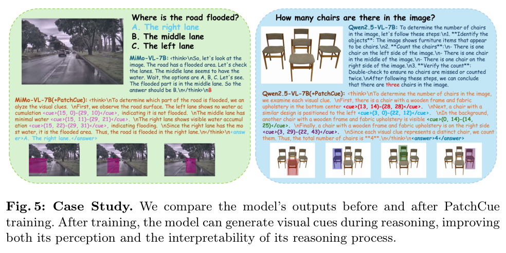
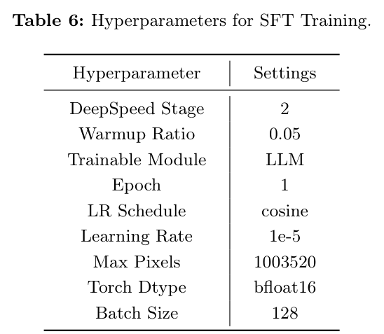

# PatchCue: Enhancing Vision-Language Model Reasoning with Patch-Based Visual Cues

> **中文题名：** PatchCue：用基于图像 patch 的视觉线索增强视觉语言模型推理  
> **作者：** Yukun Qi, Pei Fu, Hang Li, Yuhan Liu, Chao Jiang, Bin Qin, Zhenbo Luo, Jian Luan  
> **出处：** arXiv:2603.05869，2026-03-13  
> **论文类型：** 方法 / train / patch-level visual cue / reinforcement learning  
> **源文件：** `Qi 等 - 2026 - PatchCue Enhancing Vision-Language Model Reasoning with Patch-Based Visual Cues.pdf`  
> **阅读器：** 全文英中对照式阅读件；源格式为 `pdf-text`；图表按首次实质讨论位置重排。页码与稳定块 ID 见 `source_map.json`。

## Page / Section Index

- Abstract: page 1
- Introduction: pages 1-3
- Related Work: pages 3-4
- Method: pages 4-9
- Experiment: pages 9-10
- Analysis: pages 10-13
- Discussion and Conclusion: pages 13-16
- References and Appendix: pages 16-27

## Terminology Ledger

| Canonical term | 中文 | First-use decision |
|---|---|---|
| PatchCue | PatchCue | 方法名保留 |
| patch-bbox visual cue | patch 边界框视觉线索 | 指用 patch 坐标表示的区域线索 |
| pixel-bbox | 像素边界框 | 指相对或绝对像素坐标框 |
| cue reward | 线索奖励 | 基于 patch 集合 F1 的过程监督 |
| Group Relative Policy Optimization | 组相对策略优化 | 保留 GRPO 缩写 |
| cold-start SFT | 冷启动监督微调 | 让模型先学会输出 cue 格式 |

## Abstract

> <strong>Para. 1:</strong> Vision-language models have made strong progress on multimodal understanding and reasoning, but classical chain-of-thought relies mostly on text and often underuses visual cues.

> <strong>Para. 1[CN]:</strong> 视觉语言模型已经在多模态理解与推理任务上取得明显进展，但经典思维链主要依赖文本，经常没有充分利用视觉线索。

> <strong>Para. 2:</strong> Prior visual-cue methods use pixel-level representations, which require precise spatial localization and make learning harder.

> <strong>Para. 2[CN]:</strong> 以往的视觉线索方法常使用像素级表示，这要求精确空间定位，也增加了模型学习难度。

> <strong>Para. 3:</strong> PatchCue proposes a patch-based visual cue paradigm. Images are partitioned into patches, and important regions are represented at patch granularity.

> <strong>Para. 3[CN]:</strong> PatchCue 提出一种基于 patch 的视觉线索范式：先把图像划分为 patch，再用 patch 粒度表示关键区域。

> <strong>Para. 4:</strong> The model is trained through cold-start supervised fine-tuning followed by reinforcement learning with a process-supervised cue reward.

> <strong>Para. 4[CN]:</strong> 模型先通过冷启动监督微调学习输出 patch 级线索，再用带过程监督线索奖励的强化学习继续优化。

## Introduction

### Figure 1. Cue Types

**Caption:** Comparison of text-only reasoning, pixel-box cues, pixel-point cues, patch-level cues, and patch-cue training.

**Caption[CN]:** 文本推理、像素框、像素点、patch 级线索与 PatchCue 训练效果的对比。

> <strong>Para. 1:</strong> The paper starts from a practical observation: textual CoT can express the reasoning path, but it does not directly tell the model where to look in the image.

> <strong>Para. 1[CN]:</strong> 论文从一个实际问题出发：文本 CoT 能表达推理路径，却不能直接告诉模型应该看图中的哪个区域。

> <strong>Para. 2:</strong> Pixel-level cues are visually precise but cognitively and computationally demanding. Patch-level cues trade some precision for easier learning and better alignment with VLM tokenization.

> <strong>Para. 2[CN]:</strong> 像素级线索很精确，但对学习和定位要求更高。patch 级线索牺牲一部分精度，换来更容易学习、也更贴近 VLM 的视觉 token 输入。

> <strong>Para. 3:</strong> PatchCue therefore trains the model to output intermediate visual cues, so reasoning steps can explicitly refer to relevant image regions.

> <strong>Para. 3[CN]:</strong> 因此，PatchCue 训练模型在中间推理过程中输出视觉线索，让每一步推理都能显式引用相关图像区域。

## Method

### Figure 2. PatchCue Overview

**Caption:** The image is divided into fixed-size patches; the model predicts relevant patch cues and integrates them into reasoning.

**Caption[CN]:** 图像被划分为固定大小的 patch；模型预测相关 patch 线索，并把它们整合进推理过程。

> <strong>Para. 1:</strong> PatchCue represents a cue by converting pixel coordinates into patch coordinates. In the experiments, the patch size is set to 28 pixels to match Qwen2.5-VL image loading.

> <strong>Para. 1[CN]:</strong> PatchCue 通过把像素坐标转换为 patch 坐标来表示视觉线索。实验中 patch 大小设为 28 像素，以匹配 Qwen2.5-VL 的图像加载格式。

$$
r=\left\lfloor \frac{y}{h}\right\rfloor,\quad c=\left\lfloor \frac{x}{w}\right\rfloor.
$$

> <strong>Para. 2:</strong> A pixel bounding box can be transformed into a patch-bbox by mapping its top-left and bottom-right pixels into patch coordinates.

> <strong>Para. 2[CN]:</strong> 一个像素边界框可以通过把左上角和右下角像素映射到 patch 坐标，转换成 patch 边界框。

### Figure 3. Data Pipeline

**Caption:** The data pipeline filters challenging examples, extracts cues, grounds them, and constructs reasoning sequences.

**Caption[CN]:** 数据管线先筛选困难样本，再抽取并定位线索，最后构造带视觉线索的推理序列。

> <strong>Para. 3:</strong> The training data is built from multimodal reasoning datasets. Easy examples already solved by the base model are removed, leaving harder samples.

> <strong>Para. 3[CN]:</strong> 训练数据来自多个多模态推理数据集。作者移除基础模型已经能答对的简单样本，保留更困难的样本。

> <strong>Para. 4:</strong> GPT-4o extracts key visual regions. GPT-4o, Qwen2.5-VL-72B, and Seed1.5-VL validate cue grounding through agreement and IoU filtering.

> <strong>Para. 4[CN]:</strong> GPT-4o 负责抽取关键视觉区域。GPT-4o、Qwen2.5-VL-72B 和 Seed1.5-VL 再通过一致性与 IoU 过滤验证线索定位。

> <strong>Para. 5:</strong> Cold-start SFT uses 12K patch-cue samples and 12K general QA samples. RL then curates 15K samples for GRPO.

> <strong>Para. 5[CN]:</strong> 冷启动监督微调用 12K patch 线索样本和 12K 通用问答样本。随后强化学习筛选 15K 样本用于 GRPO。

## Reward Design

> <strong>Para. 1:</strong> The RL reward contains answer accuracy, output format, and a cue reward that measures alignment between predicted and ground-truth patch regions.

> <strong>Para. 1[CN]:</strong> 强化学习奖励由答案准确率、输出格式和线索奖励组成。线索奖励衡量预测 patch 区域与标注区域的一致性。

> <strong>Para. 2:</strong> For each predicted cue and ground-truth cue, the method computes patch-set precision, recall, and F1. Hungarian matching pairs predicted and target cues.

> <strong>Para. 2[CN]:</strong> 对每个预测线索和标注线索，方法计算 patch 集合的精确率、召回率和 F1，再用匈牙利匹配寻找最优配对。

$$
F_1=\frac{2\cdot Pre\cdot Rec}{Pre+Rec},\quad R=R_{\text{acc}}+R_{\text{format}}+R_{\text{cue}}.
$$

> <strong>Para. 3:</strong> If the model predicts more cue regions than the ground truth, the cue reward is set to zero to discourage overproduction.

> <strong>Para. 3[CN]:</strong> 如果模型预测的线索区域数量超过标注数量，线索奖励会被设为零，以抑制过量生成视觉线索。

## Experiments

### Table 1. Main Results

**Caption:** PatchCue improves several VLM backbones across general VQA, document understanding, reasoning, counting, and high-resolution perception.

**Caption[CN]:** PatchCue 在通用问答、文档理解、推理、计数和高分辨率感知任务上提升多个 VLM 骨干。

> <strong>Para. 1:</strong> On Qwen2.5-VL-7B, the average score improves from 70.1 to 72.1. On MiMo-VL-7B, it improves from 73.9 to 75.4.

> <strong>Para. 1[CN]:</strong> 在 Qwen2.5-VL-7B 上，平均分从 70.1 提升到 72.1。在 MiMo-VL-7B 上，平均分从 73.9 提升到 75.4。

### Table 2. Cue Format Comparison

**Caption:** Patch-bbox cues outperform pixel boxes, pixel points, patch points, and label-only variants under the same training setup.

**Caption[CN]:** 在相同训练设置下，patch 边界框线索优于像素框、像素点、patch 点和仅文本标签变体。

> <strong>Para. 2:</strong> The controlled cue-format ablation reports the highest average for patch-bbox cues: 71.6, compared with 70.4 for pixel-bbox, pixel-point, and patch-point.

> <strong>Para. 2[CN]:</strong> 受控线索格式消融显示，patch 边界框线索平均分最高，为 71.6；像素框、像素点和 patch 点均为 70.4。

### Table 3 and Table 4. Data and Reward Ablations

**Caption:** Mixed general and cue data is better than cue-only training; cue reward improves RL over a no-cue-reward variant.

**Caption[CN]:** 通用数据与线索数据混合优于只用线索数据；线索奖励让 RL 优于无该奖励的变体。

> <strong>Para. 3:</strong> A 1:1 mixture of general data and cue data reaches AI2D 84.6, ChartQA 87.9, MMStar 65.6, and MMVP 78.7. Cue-only training drops to 80.8, 86.6, 60.3, and 68.0.

> <strong>Para. 3[CN]:</strong> 通用数据和线索数据按 1:1 混合时，AI2D 为 84.6，ChartQA 为 87.9，MMStar 为 65.6，MMVP 为 78.7。只用线索数据时，这些分数降到 80.8、86.6、60.3 和 68.0。

> <strong>Para. 4:</strong> RL with the cue reward reaches AI2D 84.7, ChartQA 88.1, MMStar 66.2, and MMVP 79.3, higher than the no-cue-reward RL variant.

> <strong>Para. 4[CN]:</strong> 加入线索奖励的 RL 在 AI2D、ChartQA、MMStar 和 MMVP 上分别达到 84.7、88.1、66.2 和 79.3，高于无该奖励的 RL 变体。

### Table 5. Matched Protocol Comparison

**Caption:** Under the same backbone and SFT protocol, PatchCue outperforms VisualCoT, CogCom, and MINI-CoT on the listed benchmarks.

**Caption[CN]:** 在相同骨干和监督微调协议下，PatchCue 在列出基准上优于 VisualCoT、CogCom 和 MINI-CoT。

> <strong>Para. 5:</strong> Using the same Qwen2.5-VL-7B backbone and about 12K training instances, PatchCue reaches 84.7 on AI2D, 88.1 on ChartQA, 66.2 on MMStar, and 79.3 on MMVP.

> <strong>Para. 5[CN]:</strong> 使用相同的 Qwen2.5-VL-7B 骨干和约 12K 训练样本时，PatchCue 在 AI2D 上为 84.7，在 ChartQA 上为 88.1，在 MMStar 上为 66.2，在 MMVP 上为 79.3。

## Discussion and Appendix

### Figure 5. Case Study

**Caption:** Case studies show that models trained with PatchCue generate explicit visual cues during reasoning.

**Caption[CN]:** 案例显示，经过 PatchCue 训练的模型会在推理过程中生成显式视觉线索。

> <strong>Para. 1:</strong> The discussion emphasizes that patch cues are not merely an annotation format. They change the model's intermediate behavior by making visual grounding visible in the reasoning trace.

> <strong>Para. 1[CN]:</strong> 讨论强调，patch 线索不只是标注格式。它们会改变模型的中间行为，让视觉定位在推理轨迹中变得可见。

### Table 6 and Table 7. Training Settings

**Caption:** Appendix hyperparameters for SFT and GRPO training.

**Caption[CN]:** 附录给出的监督微调与 GRPO 训练超参数。

> <strong>Para. 2:</strong> The appendix records full-model cue training details, including bfloat16, learning rates of 1e-5 for SFT and 1e-6 for GRPO, and a GRPO beta of 0.001.

> <strong>Para. 2[CN]:</strong> 附录记录了线索训练设置，包括 bfloat16、监督微调学习率 1e-5、GRPO 学习率 1e-6，以及 GRPO 的 beta 0.001。

## Critical Reading Notes

> <strong>Para. 1:</strong> PatchCue is strongest as a representation argument: a visual cue should match the model's visual tokenization rather than the human annotation interface.

> <strong>Para. 1[CN]:</strong> PatchCue 最强的地方是表示层面的论点：视觉线索应该贴合模型的视觉 token 化方式，而不只是贴合人类标注界面。

> <strong>Para. 2:</strong> The main caveat is data dependence. The cue pipeline uses strong external models, so the final gains partly depend on how well those models extract and verify visual evidence.

> <strong>Para. 2[CN]:</strong> 主要 caveat 是数据依赖。线索管线使用强外部模型，因此最终收益部分取决于这些模型抽取和验证视觉证据的质量。
