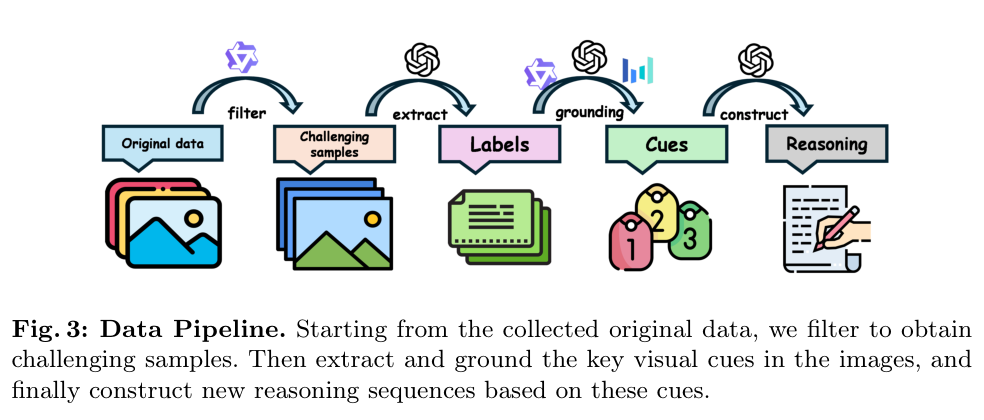
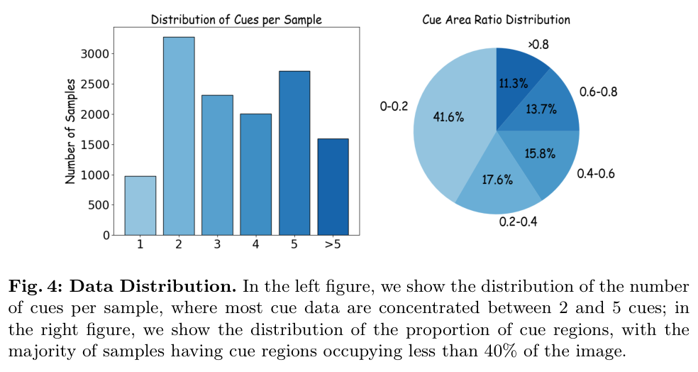
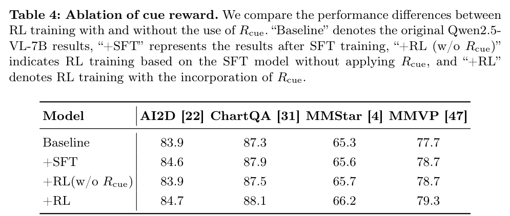
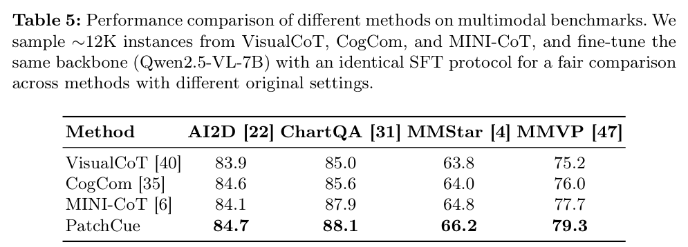
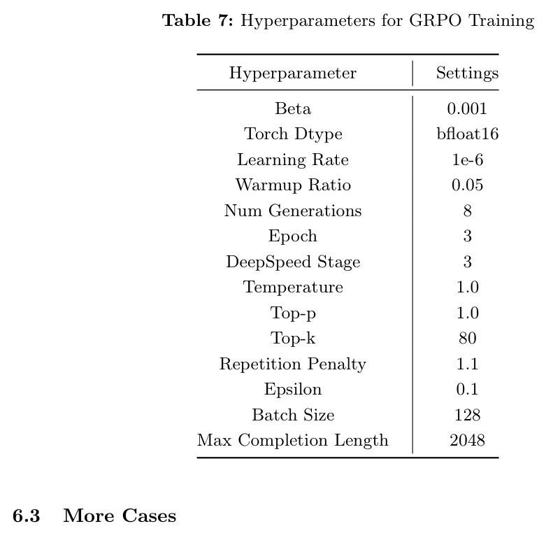

---
tags:
  - papers/visually-grounded-reasoning
  - papers/train
  - papers/visual-cue
aliases:
  - "PatchCue"
  - "patch-bbox visual cue"
date: 2026-03-13
doi: 10.48550/arXiv.2603.05869
arxiv_id: 2603.05869
---

# PatchCue: Enhancing Vision-Language Model Reasoning with Patch-Based Visual Cues

## 核心信息

- 标题: PatchCue: Enhancing Vision-Language Model Reasoning with Patch-Based Visual Cues
- 标题翻译: PatchCue：用基于图像 patch 的视觉线索增强视觉语言模型推理
- 作者: Yukun Qi, Pei Fu, Hang Li, Yuhan Liu, Chao Jiang, Bin Qin, Zhenbo Luo, Jian Luan
- 发表时间: 2026-03-13
- 发表渠道: arXiv / OpenMIND
- DOI: 10.48550/arXiv.2603.05869
- arXiv: 2603.05869
- 论文链接: http://arxiv.org/abs/2603.05869
- 数据 / 资源: CogCom；DeepEyes；Thyme；MINI-CoT；Qwen2.5-VL；MiMo-VL
- 论文类型: AI 方法；训练型视觉线索；监督微调；强化学习

## 原文摘要翻译

视觉语言模型已经在大量复杂多模态理解与推理任务上取得显著进展。然而，现有推理范式，例如经典思维链，主要依赖文本信息，常常没有充分利用重要视觉线索。已有工作虽然引入了像素级视觉线索，但这类表示需要精确空间定位，从而增加额外学习复杂度。

为解决这一问题，作者提出 PatchCue，这是一种新的基于 patch 的视觉线索范式，旨在显著增强视觉语言模型的视觉推理能力。通过把图像划分为 patch 并在 patch 层面表示线索，PatchCue 更符合人类感知习惯，也更好利用现代 VLM 的 图像切块化 输入。

作者采用两阶段方式训练 VLM：先用冷启动监督微调让模型输出 patch 级线索，再用带过程监督线索奖励的强化学习引导中间视觉推理步骤。多个 VLM 和多类基准上的实验表明，PatchCue 能稳定提升模型整体表现。结果显示，patch 级线索优于像素级边界框和点线索，是一种更有效、也更符合认知习惯的视觉推理范式。

## 创新点

1. 把视觉线索从像素坐标换成 patch 坐标。这个选择很朴素，但它贴合 VLM 的视觉输入单位，降低了定位学习难度。
2. 不只做数据格式转换，而是把 patch 线索放进中间推理轨迹，让模型在推理时显式引用图像区域。
3. 数据构造有过滤和验证：先保留基础模型答不好的困难样本，再用多个强 VLM 验证线索定位一致性。
4. 训练分成冷启动监督微调和 GRPO。前者学格式和基本行为，后者用答案、格式、线索三类奖励继续优化。
5. 线索奖励不是粗略判断是否有框，而是把预测区域和标注区域变成 patch 集合，用 F1 和匈牙利匹配进行过程监督。
6. 消融比较完整：线索格式、数据混合比例、线索奖励、以及同协议下的旧方法对比都有报告。

## 一句话总结

PatchCue 的核心不是“多给模型一个框”，而是把视觉证据改写成模型更容易学习的 patch 级中间语言，再用监督微调和过程奖励让模型在推理中持续引用这些线索。

## 研究问题

文本 CoT 的问题是证据不可见。模型可以写出很长的推理，却不一定真的在看相关区域。像素框和像素点能把视觉位置显式化，但它们过于精细，要求模型学习连续坐标和准确边界。

*论文原图编号：Fig. 1。作者比较文本推理、像素框、像素点和 patch 线索，说明 patch 线索在可解释性与学习难度之间更折中。*

这篇论文的判断是：视觉线索应该贴近模型输入，而不是贴近人类标注工具。现代 VLM 本来就把图像切成视觉标记，所以用 patch 表示区域，比让模型输出精确像素坐标更自然。

## 数据与任务定义

PatchCue 的数据管线先从多模态推理数据集中找困难样本。来源包括 CogCom、DeepEyes、Thyme 和 MINI-CoT。作者用基础模型过滤掉已经能答对的样本，避免把训练预算浪费在不需要视觉线索的问题上。

*论文原图编号：Fig. 3。数据管线包含困难样本过滤、视觉线索抽取、线索 grounding 和推理序列重构。*

视觉线索由 GPT-4o 抽取，再由 GPT-4o、Qwen2.5-VL-72B 和 Seed1.5-VL 进行一致性验证。只有定位足够一致的样本会被保留，之后再把像素区域转换为 patch 区域。

训练数据分两段。监督微调用 12K patch 线索样本和 12K 通用问答样本混合训练。强化学习阶段让冷启动模型多次尝试候选样本，剔除总能答对或总是答错的样本，留下 15K 样本用于 GRPO。

*论文原图编号：Fig. 4。大多数样本包含 2 到 5 个线索，且线索区域通常占图像面积的 40% 以下。*

## 方法主线

### 机制流程

1. 输入图像和问题后，预处理把图像切成固定 patch，并提取可引用的区域坐标。
2. 模型生成结构化推理轨迹，输出文本步骤、线索区域和最终答案。
3. 训练目标把预测线索和标注线索对齐，用 patch 集合 F1 更新中间视觉引用能力。
4. 输出阶段模型在回答前显式引用相关 patch，让文本推理和视觉证据保持绑定。

*论文原图编号：Fig. 2。PatchCue 把图像切成 patch，并让模型在推理步骤中引用相关 patch 区域。*

### Patch 表示

给定 patch 高宽 $h,w$，像素点 $(x,y)$ 会被映射为 patch 坐标：

$$
r=\left\lfloor \frac{y}{h}\right\rfloor,\quad c=\left\lfloor \frac{x}{w}\right\rfloor.
$$

像素边界框的左上角和右下角分别映射到 patch 坐标后，就得到 patch 边界框。作者在实验中把 $h$ 和 $w$ 设为 28，以匹配 Qwen2.5-VL 的图像加载格式。

### 奖励设计

GRPO 的奖励由三部分组成：答案奖励、格式奖励和线索奖励。格式奖励要求输出包含 `<think>`、`<cue>` 和 `<answer>` 等结构。线索奖励对齐预测 patch 集合和标注 patch 集合。

对于一个预测线索和一个标注线索，先计算精确率、召回率和 F1：

$$
F_1=\frac{2\cdot Pre\cdot Rec}{Pre+Rec}.
$$

然后用匈牙利匹配寻找预测线索和标注线索的最佳配对。如果预测线索数量超过标注数量，线索奖励直接设为零，防止模型为了拿奖励而到处乱标。

最终奖励是：

$$
R=R_{\text{acc}}+R_{\text{format}}+R_{\text{cue}}.
$$

## 关键结果

### 主结果与强基线

*论文原图编号：Table 1。PatchCue 在多个骨干和多类任务上带来平均提升。*

| 模型 | 原始平均分 | PatchCue 后 | 变化 |
|---|---:|---:|---:|
| Qwen2.5-VL-3B | 65.0 | 66.1 | +1.1 |
| Qwen2.5-VL-7B | 70.1 | 72.1 | +2.0 |
| MiMo-VL-7B | 73.9 | 75.4 | +1.5 |

这里的提升不是某一个数据集撑起来的。Qwen2.5-VL-7B 在 MMStar 从 63.9 到 66.2，在 OCRBench 从 88.8 到 91.1，在 HR-Bench8K 从 65.3 到 69.6。

### 消融到底说明了什么

*论文原图编号：Table 2。patch 边界框是所有线索表示中平均表现最好的。*

| 线索形式 | 平均分 |
|---|---:|
| Baseline | 70.1 |
| Pixel-Bbox | 70.4 |
| Pixel-Point | 70.4 |
| Patch-Bbox | 71.6 |
| Patch-Point | 70.4 |
| Labels | 70.1 |

这个表支撑了论文最重要的表示论点：patch-bbox 不是因为多了更多文本标签，而是因为区域表达本身更适合模型学习。label-only 几乎没有提升。

*论文原图编号：Table 3。通用数据和线索数据需要混合；只用线索数据会明显伤害泛化。*

数据比例消融很关键。
Gen:Cue 为 1:1 时，AI2D 84.6，ChartQA 87.9。
同一设置下，MMStar 65.6，MMVP 78.7。
只用线索数据时，AI2D 80.8，MMStar 60.3，MMVP 68.0。
也就是说，视觉线索数据不能完全替代通用指令数据。

*论文原图编号：Table 4。加入 cue reward 后，RL 结果比无 cue reward 更稳。*

| 设置 | AI2D | ChartQA | MMStar | MMVP |
|---|---:|---:|---:|---:|
| Baseline | 83.9 | 87.3 | 65.3 | 77.7 |
| SFT | 84.6 | 87.9 | 65.6 | 78.7 |
| RL without cue reward | 83.9 | 87.5 | 65.7 | 78.7 |
| RL with cue reward | 84.7 | 88.1 | 66.2 | 79.3 |

### 与旧视觉线索方法对比

*论文原图编号：Table 5。相同骨干、相同 SFT 协议下，PatchCue 优于几条已有 cue 路线。*

| 方法 | AI2D | ChartQA | MMStar | MMVP |
|---|---:|---:|---:|---:|
| VisualCoT | 83.9 | 85.0 | 63.8 | 75.2 |
| CogCom | 84.6 | 85.6 | 64.0 | 76.0 |
| MINI-CoT | 84.1 | 87.9 | 64.8 | 77.7 |
| PatchCue | 84.7 | 88.1 | 66.2 | 79.3 |

## 深度分析

### 真正贡献是什么

真正贡献是把视觉 grounding 改造成可学习的中间语言。
像素框是给人和传统检测器看的，patch 线索更像给 VLM 自己看的。
这个角度很适合继续迁移到 3D agent。
不要让模型输出连续三维坐标，可以先输出视图块、体素块、局部图像块或对象候选编号。

### 为什么结果成立

PatchCue 有两个互补收益。第一，patch 表示降低了精确定位难度。第二，过程奖励让模型不能只靠最后答案蒙对，它必须在中间过程给出合理视觉线索。Table 2 支撑前者，Table 4 支撑后者。

### 容易误读的地方

不要把 PatchCue 读成纯测试时方法。它需要构造 cue 数据，并做 SFT 与 RL。也不要把它读成“越多视觉线索越好”。Cue-only 训练反而变差，说明视觉格式数据会压缩模型的通用回答能力。

### 复现注意点

复现的核心难点不在 GRPO 公式，而在线索数据质量。
需要能抽取关键区域的强模型、能做一致性验证的强 VLM。
还需要一套把像素框稳定转换为 patch 坐标的预处理。
作者的 SFT 学习率为 1e-5，GRPO 学习率为 1e-6，并使用 bfloat16。

*论文原图编号：Table 6。监督微调超参数。*

*论文原图编号：Table 7。GRPO 训练超参数。*

## 局限

第一，视觉线索来自外部强模型抽取和验证，因此性能收益部分依赖数据管线，而不完全是模型自发发现视觉结构。

第二，平均提升并不巨大。PatchCue 更像稳定增益和行为可解释性增强，而不是一篇把所有 benchmark 拉爆的论文。

第三，cue reward 只检查预测线索与标注线索的区域重叠。它不能保证模型真的因该线索得到答案，也不能保证推理语义完全正确。

第四，论文主要验证 2D 图像中的 patch 线索。对视频、3D 场景、多视角渲染或点云标记，该表示还需要重新定义。

## 我的笔记

这篇和 MINT-CoT 很适合放在一起读。PatchCue 的线索是“粗区域”，MINT-CoT 的线索是“数学推理步骤相关视觉标记”。两者都在做一件事：把视觉证据变成推理链中的显式对象。

对自己的 3D agent 方向，一个直接启发是：与其让模型直接输出精确 3D box，不如先定义一套模型友好的视觉索引，比如视角编号、局部渲染 patch、对象候选、或 3DGS 局部区域。然后用过程奖励约束模型在推理中引用这些索引。

它和 Position paper 也形成张力。
Position paper 质疑中间图像是否真的被用到。
PatchCue 则提供了一种更容易验证的中间证据形式。
模型必须显式输出线索，而且线索可以和标注区域计算 F1。

## 引用

Qi, Yukun, Pei Fu, Hang Li, Yuhan Liu, Chao Jiang, Bin Qin, Zhenbo Luo, and Jian Luan. 2026. "PatchCue: Enhancing Vision-Language Model Reasoning with Patch-Based Visual Cues." arXiv:2603.05869.
