# Perceptual Flow Network for Visually Grounded Reasoning

**中文标题：** 面向视觉落地推理的感知流网络  
**作者：** Yangfu Li, Yuning Gong, Hongjian Zhan, Teng Li, Yuanhuiyi Lyu, Tianyi Chen, Qi Liu, Ziyuan Huang, Zhihang Zhong, Dandan Zheng, Yue Lu  
**机构：** ECNU, SCU, HKUST, SJTU, Ant Group, Shanghai AI Laboratory  
**作者说明：** `*` Equal contribution; `§` Corresponding Author; `♯` Work done during internship  
**状态：** Accepted to the 43rd International Conference on Machine Learning (ICML 2026)  
**来源：** arXiv:2605.02730v1, 4 May 2026; manuscript date: May 5, 2026  
**联系邮箱：** yfli_cee@stu.ecnu.edu.cn  
**原始 PDF：** `/Users/roywangj/journey_wj/research/papers4zotero/zotero1/storage/59DCWCTW/Li 等 - 2026 - Perceptual Flow Network for Visually Grounded Reasoning.pdf`

## Page / Section Index / 页面与章节索引

| PDF pages | Source content / 原文内容 |
|---|---|
| 1–2 | Abstract; 1 Introduction; Figure 1 |
| 2–4 | 2 Background and Motivation; Definitions 2.1–2.2; Figures 2–3; Equation (1) |
| 5–7 | 3 PFlowNet: data, variational RFT, rewards, geometric shaping, theory; Table 1; Figures 4–5 |
| 8–12 | 4 Experiments; Tables 2–5; Figures 6–11; 5 Related Work; 6 Conclusion |
| 13 | Limitations and Future Work; References [1]–[14] |
| 14–16 | References [15]–[66] |
| 17–26 | Appendix A: preliminaries, complete algebra, assumptions, lemmas, and theorem proofs |
| 27–30 | Appendix B: dataset, training recipe, exploration/exploitation, reward calculation, Table 6, exact B.5 prompt, Figures 12–13 |
| 31–32 | Appendix C: benchmarks, baselines, and evaluation protocol |
| 33–36 | Appendix D: test-time scaling, failure cases, and more examples; Figures 14–17 |

## Terminology Ledger / 术语表

| English term | 统一译法 | Note / 说明 |
|---|---|---|
| Perceptual Flow | 感知流 | Structured latent trajectory containing a planning state and perceptual states |
| Planning State | 规划状态 | Text state $z_0$ enclosed by `<analyze>` tags |
| Perceptual State | 感知状态 | RoI-caption pair $z_k=\langle r_k,c_k\rangle$ |
| Visually Grounded Reasoning (VGR) | 视觉落地推理 | Correct answering with latent visual rationales restricted to valid evidence support |
| reasoning utility / efficacy | 推理效用 | Usefulness of a flow for inducing the target answer |
| geometric precision | 几何精度 | Spatial agreement between predicted and reference RoIs |
| Sub-Trajectory Balance (SubTB) | 子轨迹平衡 | Dense balance constraint over all sub-trajectories |
| variational reinforcement fine-tuning (RFT) | 变分强化微调 | Distributional optimization of perceptual flows |
| vicinal geometric shaping | 邻域几何塑形 | Penalizes trajectories only outside an expert-centered vicinity |
| Chamfer-IoU distance | Chamfer-IoU 距离 | Symmetric set distance derived from directed best-match IoU |
| tunnel vision | 隧道视野 | Loss of necessary context caused by overly tight evidence crops |
| test-time scaling | 测试时扩展 | Increasing independent response samples at inference time |

## Abstract / 摘要

> <span style="color:#3B82F6"><strong>Para. 1:</strong></span> Despite the success of Large-Vision Language Models (LVLMs), general optimization objectives (e.g., standard MLE) fail to constrain visual trajectories, leading to language bias and hallucination. To mitigate this, current methods introduce geometric priors from visual experts as additional supervision. However, we observe that such supervision is typically suboptimal: it is biased toward geometric precision and offers limited reasoning utility. To bridge this gap, we propose Perceptual Flow Network (PFlowNet), which eschews rigid alignment with the expert priors and achieves interpretable yet more effective visual reasoning. Specifically, PFlowNet decouples perception from reasoning to establish a self-conditioned generation process. Based on this, it integrates multi-dimensional rewards with vicinal geometric shaping via variational reinforcement learning, thereby facilitating reasoning-oriented perceptual behaviors while preserving visual reliability. PFlowNet delivers a provable performance guarantee and competitive empirical results, particularly setting new SOTA records on V* Bench (90.6%) and MME-RealWorld-lite (67.0%).

> <span style="color:#F59E0B"><strong>Para. 1[CN]:</strong></span> 尽管大型视觉语言模型（LVLM）已经取得成功，但通用优化目标（例如标准最大似然估计 MLE）无法约束视觉轨迹，因而会导致语言偏置和幻觉。为缓解这一问题，现有方法引入视觉专家的几何先验作为额外监督。然而，作者观察到，这种监督通常并非最优：它偏向几何精度，却只能提供有限的推理效用。为弥合这一差距，作者提出感知流网络（PFlowNet）；它不再与专家先验刚性对齐，从而实现既可解释又更有效的视觉推理。具体而言，PFlowNet 将感知与推理解耦，建立自条件生成过程；在此基础上，它通过变分强化学习，把多维奖励与邻域几何塑形结合起来，在保持视觉可靠性的同时促进面向推理的感知行为。PFlowNet 给出了可证明的性能保证，并取得有竞争力的经验结果，尤其在 V* Bench（90.6%）和 MME-RealWorld-lite（67.0%）上刷新了 SOTA。

## 1. Introduction / 引言

> <span style="color:#3B82F6"><strong>Para. 1:</strong></span> Large Vision-Language Models (LVLMs) extend pretrained Large Language Models (LLMs) by integrating sophisticated vision encoders [42] and cross-modal alignment [26], achieving remarkable performance across diverse visual tasks [1, 2, 27, 35]. However, LVLMs still face challenges with interpretability and hallucination, particularly in complex scenarios, e.g., fine-grained visual understanding.

> <span style="color:#F59E0B"><strong>Para. 1[CN]:</strong></span> 大型视觉语言模型（LVLM）通过集成先进的视觉编码器 [42] 和跨模态对齐 [26] 扩展预训练大型语言模型（LLM），并在多种视觉任务上取得显著性能 [1, 2, 27, 35]。然而，LVLM 仍面临可解释性和幻觉方面的挑战，尤其是在细粒度视觉理解等复杂场景中。

> <span style="color:#3B82F6"><strong>Para. 2:</strong></span> To enhance reliability, recent advances [29, 31, 43, 51, 52] distill geometric priors from visual experts, e.g., GroundingDINO [28], into LVLMs via Reinforcement Learning with Verifiable Reward (RLVR). By directly maximizing geometric consistency between LVLM predictions and expert priors, these approaches effectively anchor intermediate reasoning processes in visual evidence. Despite this progress, a critical question remains: The visual experts are initially designed for object detection; thus, are the geometric priors derived from these experts truly optimal for visual reasoning?

> <span style="color:#F59E0B"><strong>Para. 2[CN]:</strong></span> 为提高可靠性，近期工作 [29, 31, 43, 51, 52] 通过可验证奖励强化学习（RLVR），把 GroundingDINO [28] 等视觉专家的几何先验蒸馏进 LVLM。这些方法直接最大化 LVLM 预测与专家先验之间的几何一致性，从而有效地把中间推理过程锚定到视觉证据上。尽管如此，一个关键问题仍未解决：视觉专家最初是为目标检测设计的，因此，从这些专家得到的几何先验是否真的最适合视觉推理？

> <span style="color:#3B82F6"><strong>Para. 3:</strong></span> **Preliminary Study.** To investigate this, we conduct a probing study using Qwen2.5-VL [2] family on V* [56]. This benchmark encompasses direct attribute recognition and spatial relation reasoning, backed by fine-grained expert annotations. We generate varying geometric priors by isotropically expanding the original annotations from their centers. By feeding the models directly with these evidence crops instead of full images, we measure the reasoning utility of different geometric priors. As illustrated in Figure 1, we observe a counterintuitive result: the most precise geometric prior, i.e., expert annotation, is not the most helpful for reasoning. We attribute this to a fundamental mismatch between the design principles of visual experts and LVLMs. While these experts are optimized to localize evidence with strict geometric precision, such an approach may induce a tunnel vision effect during reasoning. This effectively excludes context necessary for comprehensive understanding and degrades performance.

> <span style="color:#F59E0B"><strong>Para. 3[CN]:</strong></span> **预备研究。** 为研究这一问题，作者使用 Qwen2.5-VL [2] 系列在 V* [56] 上进行了探测实验。该基准覆盖直接属性识别和空间关系推理，并提供细粒度专家标注。作者从原始标注中心出发进行等比例扩展，以生成具有不同几何精度的先验；随后不输入完整图像，而是直接向模型输入这些证据裁剪，以测量不同几何先验的推理效用。如 Figure 1 所示，结果与直觉相反：几何上最精确的先验，即专家标注，并不是最有利于推理的先验。作者将其归因于视觉专家与 LVLM 设计原则之间的根本错配。视觉专家被优化为以严格几何精度定位证据，但这种做法在推理时可能造成“隧道视野”，排除完整理解所需的上下文并降低性能。

### Figure 1. Impact of evidence geometric precision / 证据几何精度的影响


**Caption:** Impact of evidence geometric precision (IoU w.r.t. the expert annotations) on reasoning performance (accuracy). The evidence with minimum and maximum precision is actually the full image and the expert annotation (outlined in red), respectively.

**Caption[CN]:** 证据几何精度（相对于专家标注的 IoU）对推理性能（准确率）的影响。几何精度最低和最高的证据分别是完整图像与专家标注（红框）。

> <span style="color:#3B82F6"><strong>Para. 4:</strong></span> A natural intuition is to approximate the golden evidence by applying heuristic transformations to expert priors, thereby constructing less biased geometric guidance for LVLMs. However, we find that the optimal geometric prior is highly instance-specific, making such strategies intractable.

> <span style="color:#F59E0B"><strong>Para. 4[CN]:</strong></span> 一个自然想法是对专家先验施加启发式变换来逼近黄金证据，从而为 LVLM 构造偏差更小的几何引导。然而，作者发现最优几何先验高度依赖具体样本，因此这类策略并不可行。

> <span style="color:#3B82F6"><strong>Para. 5:</strong></span> Motivated by this challenge, we propose Perceptual Flow Network (PFlowNet). Instead of constraining visual rationales via rigid alignment with static geometric priors, PFlowNet employs a self-parameterized variational distribution to approximate the posterior of idealized perceptual behaviors. By sampling from the optimized intrinsic distribution, PFlowNet self-conditions its subsequent reasoning process, yielding grounded yet more accurate outputs. To realize this, PFlowNet features three key innovations:
>
> 1. **Perceptual Flow**, i.e., a structured trajectory formulation, designed to effectively characterize perceptual behaviors in LVLMs, facilitating efficient optimization via hierarchical variational objectives, e.g., Sub-Trajectory Balance (SubTB).
> 2. **Decoupled Framework** that separates optimizable perceptual behaviors from model’s reasoning process, thereby enabling visually grounded reasoning via a self-conditioned autoregressive generation.
> 3. **Variational Reinforcement Fine-Tuning Strategy** that integrates a multi-dimensional reward function with a vicinal geometric shaping scheme to encourage visual-reliable yet reasoning-oriented perceptual behaviors.

> <span style="color:#F59E0B"><strong>Para. 5[CN]:</strong></span> 受这一挑战启发，作者提出感知流网络（PFlowNet）。PFlowNet 不再让视觉依据与静态几何先验刚性对齐，而是用自参数化变分分布去逼管理想感知行为的后验。模型从优化后的内在分布中采样，并以此对后续推理进行自条件化，从而得到既落地又更准确的输出。PFlowNet 包含三项关键创新：
>
> 1. **感知流**：一种结构化轨迹表述，用于有效刻画 LVLM 的感知行为，并通过子轨迹平衡（SubTB）等分层变分目标实现高效优化。
> 2. **解耦框架**：将可优化的感知行为与模型推理过程分离，从而通过自条件自回归生成实现视觉落地推理。
> 3. **变分强化微调策略**：把多维奖励函数与邻域几何塑形方案结合起来，鼓励视觉上可靠且面向推理的感知行为。

> <span style="color:#3B82F6"><strong>Para. 6:</strong></span> Building on these, we provide theoretical analysis that establishes a provable performance guarantee for PFlowNet, as detailed in Theorems 3.1 and 3.4. Moreover, comprehensive experimental results demonstrate its superiority across both general-purpose and fine-grained visual tasks from the empirical perspective. Importantly, it achieves substantial improvements of 13.1%, 10.4% and 21% over the base model (i.e., Qwen3-VL 8B) on V* Bench, TreeBench, and MME-RealWorld-lite, respectively. Further analysis highlights its favorable performance-efficiency balance and effective test-time scaling properties.

> <span style="color:#F59E0B"><strong>Para. 6[CN]:</strong></span> 在此基础上，作者给出理论分析，并在定理 3.1 和 3.4 中建立 PFlowNet 的可证明性能保证。大量实验也从经验角度表明，该方法在通用和细粒度视觉任务上均具有优势。尤其是，与基座模型 Qwen3-VL 8B 相比，它在 V* Bench、TreeBench 和 MME-RealWorld-lite 上分别取得 13.1%、10.4% 和 21% 的显著提升。进一步分析显示，PFlowNet 具有良好的性能—效率平衡和有效的测试时扩展特性。

## 2. Background and Motivation / 背景与动机

### 2.1 Problem Formulation / 问题形式化

> <span style="color:#3B82F6"><strong>Para. 1:</strong></span> Let $M_\theta$ denote an LVLM parameterized by $\theta$, built upon a standard transformer architecture [49]. Given a multimodal input $X$ (e.g., images and instructions), $M_\theta$ defines an autoregressive conditional distribution, where $Y=(y_1,y_2,\ldots,y_T)$ represents the output token sequence conditioned on $X$. Conventionally, $M_\theta$ is optimized via Maximum-Likelihood Estimation (MLE).

> <span style="color:#F59E0B"><strong>Para. 1[CN]:</strong></span> 设 $M_\theta$ 表示参数为 $\theta$、建立在标准 Transformer 架构 [49] 上的 LVLM。给定多模态输入 $X$（例如图像和指令），$M_\theta$ 定义一个自回归条件分布，其中 $Y=(y_1,y_2,\ldots,y_T)$ 是以 $X$ 为条件的输出词元序列。通常，$M_\theta$ 通过最大似然估计（MLE）优化。

$$
p_\theta(Y\mid X)=\prod_{t=1}^{T}p_\theta(y_t\mid X,y_{<t}),
$$

$$
\max_\theta\;\mathbb{E}_{(X,Y)\sim P_{\mathrm{data}}}\left[\log p_\theta(Y\mid X)\right].
$$

> <span style="color:#3B82F6"><strong>Para. 2:</strong></span> Despite the remarkable efficacy of this paradigm, it remains challenging to mitigate hallucination in $M_\theta$ [4, 10, 25], particularly in visual-centric applications (e.g., fine-grained visual search). To formalize this, we consider the visual reasoning trajectory (e.g., the sequence of RoIs) as a latent variable $Z$. In this view, the fundamental cause of hallucination stems from an ill-posed posterior $P(Z\mid X,Y)$ that may assign probability mass to invalid trajectories $Z$. Inspired by the success of RLVR in LLMs [11], recent works explore incorporating geometric priors as verifiable rewards to constrain $Z$ for Visually Grounded Reasoning (VGR).

> <span style="color:#F59E0B"><strong>Para. 2[CN]:</strong></span> 尽管这一范式非常有效，缓解 $M_\theta$ 的幻觉仍然困难 [4, 10, 25]，在细粒度视觉搜索等以视觉为中心的应用中尤其如此。为形式化该问题，作者把视觉推理轨迹（例如 RoI 序列）视为潜变量 $Z$。在这一视角下，幻觉的根本原因是后验 $P(Z\mid X,Y)$ 定义不良，可能把概率质量分配给无效轨迹。受 LLM 中 RLVR 成功的启发 [11]，近期工作开始把几何先验作为可验证奖励，以约束视觉落地推理中的 $Z$。

> <span style="color:#3B82F6"><strong>Para. 3:</strong></span> **Definition 2.1 (Visually Grounded Reasoning).** Consider an input-output pair $(X,Y)$ and a golden visual trajectory $G$ that mediates the inference process $X\xrightarrow{G}Y$. We define $S_V$ as the support of all valid visual trajectory $Z$, which is the $\sigma$-neighborhood of $G$ under a deviation metric $d(\cdot,\cdot)$: $S_V:=\{Z\mid d(Z,G)\leq\sigma\}$. Target posterior $P_V(Z\mid X,Y):=P(Z\mid X,Y,Z\in S_V)$ is given by assigning its probability mass exclusively to this support, and visually grounded reasoning is formulated as follows, which encourages $M_\theta$ to both yield the correct answer $Y$ and anchor its latent visual rationales $Z$ to $G$.

> <span style="color:#F59E0B"><strong>Para. 3[CN]:</strong></span> **定义 2.1（视觉落地推理）。** 考虑输入—输出对 $(X,Y)$ 以及介导推理过程 $X\xrightarrow{G}Y$ 的黄金视觉轨迹 $G$。作者将全部有效视觉轨迹 $Z$ 的支持集 $S_V$ 定义为偏差度量 $d(\cdot,\cdot)$ 下 $G$ 的 $\sigma$ 邻域：$S_V:=\{Z\mid d(Z,G)\leq\sigma\}$。目标后验 $P_V(Z\mid X,Y):=P(Z\mid X,Y,Z\in S_V)$ 把全部概率质量仅分配到这一支持集。下式定义的视觉落地推理鼓励 $M_\theta$ 同时生成正确答案 $Y$，并把潜在视觉依据 $Z$ 锚定到 $G$。

$$
\max_\theta\;\mathbb{E}_{(X,Y)\sim P_{\mathrm{data}}}\left[\log\int_{S_V}p_\theta(Y,Z\mid X)\,dZ\right].
$$

### Figure 2. Feasible regions and objectives / 可行区域与优化目标


**Caption:** Illustration of feasible regions ($S_V$) and optimization objectives for visually grounded reasoning. Existing methods constrain LVLMs to imitate expert trajectories by maximizing their geometric consistency, whereas PFlowNet integrates a reasoning-oriented reward with vicinal geometric shaping to achieve more sufficient yet controlled exploration, leading to reliable and high-efficacy reasoning.

**Caption[CN]:** 视觉落地推理的可行区域（$S_V$）和优化目标示意图。现有方法通过最大化几何一致性来约束 LVLM 模仿专家轨迹；PFlowNet 则把面向推理的奖励与邻域几何塑形结合起来，实现更充分但仍受控的探索，从而得到可靠且高效用的推理。

### 2.2 Revisit VGR as Reasoning over Perceptual Flow / 将 VGR 重新理解为感知流上的推理

> <span style="color:#3B82F6"><strong>Para. 4:</strong></span> The golden trajectory $G$ is generally intractable; thus, previous works typically adopt well-trained visual experts, e.g., GroundingDINO [28] to synthesize a proxy for $G$. However, these experts are initially optimized for grounding rather than downstream reasoning. As a result, the synthetic trajectory is biased toward high geometric precision rather than reasoning utility, leading to suboptimal performance of the policy $p_\theta(Y\mid X)$, as revealed in Figure 2. To address this misalignment, we apply a self-parameterized variational distribution $p_\theta(Z\mid X)$ to approximate the target posterior $P_V(Z\mid X,Y)$, achieving VGR via a latent-variable mixture, which is the key insight of PFlowNet.

> <span style="color:#F59E0B"><strong>Para. 4[CN]:</strong></span> 黄金轨迹 $G$ 通常无法获得，因此以往工作一般采用训练良好的视觉专家（例如 GroundingDINO [28]）来合成 $G$ 的代理。然而，这些专家最初优化的是定位，而不是下游推理。因此，合成轨迹偏向高几何精度而不是推理效用，导致策略 $p_\theta(Y\mid X)$ 的性能次优，如 Figure 2 所示。为解决这种错配，作者用自参数化变分分布 $p_\theta(Z\mid X)$ 逼近目标后验 $P_V(Z\mid X,Y)$，通过潜变量混合实现 VGR；这是 PFlowNet 的关键洞见。

$$
\underbrace{p_\theta(Y,Z\mid X)}_{\mathrm{VGR}}
=\underbrace{p_\theta(Z\mid X)}_{\mathrm{Approximated}\;P_V(Z\mid X,Y)}
\underbrace{p_\theta(Y\mid X,Z)}_{\mathrm{Grounded\ Reasoning}}.
$$

> <span style="color:#3B82F6"><strong>Para. 5:</strong></span> **Definition 2.2 (Perceptual Flow).** Given an input $X$, we define Perceptual Flow $Z=(z_0\rightarrow z_1\ldots z_K)$ as a structured latent trajectory that explicates the visual thoughts. It comprises two distinct states:
>
> - **Planning State ($z_0$):** A language sequence enclosed by special tokens `<analyze>` and `</analyze>`. This state decomposes the query within $X$ and identifies relevant visual candidates for subsequent exploration.
> - **Perceptual States ($z_{\geq1}$):** A chain of grounded observations enclosed by `<localize>` and `</localize>`. Each state $z_k=\langle r_k,c_k\rangle$ consists of a Region of Interest (RoI) $r_k\in\mathbb{N}^4$ (represented in relative coordinates, e.g., from 0 to 1000) and a corresponding descriptive caption $c_k$.

> <span style="color:#F59E0B"><strong>Para. 5[CN]:</strong></span> **定义 2.2（感知流）。** 给定输入 $X$，作者将感知流 $Z=(z_0\rightarrow z_1\ldots z_K)$ 定义为阐明视觉思维的结构化潜在轨迹。它包含两类不同状态：
>
> - **规划状态（$z_0$）：** 由特殊词元 `<analyze>` 和 `</analyze>` 包围的语言序列。它分解 $X$ 中的问题，并识别与后续探索相关的视觉候选。
> - **感知状态（$z_{\geq1}$）：** 由 `<localize>` 和 `</localize>` 包围的一串落地观察。每个状态 $z_k=\langle r_k,c_k\rangle$ 由感兴趣区域 $r_k\in\mathbb{N}^4$（用相对坐标表示，例如 0 到 1000）和对应的描述性说明 $c_k$ 构成。

> <span style="color:#3B82F6"><strong>Para. 6:</strong></span> Leveraging this design, we incorporate Sub-Trajectory Balance (Sub-TB) [36], a hierarchical variational objective. Unlike PPO-like RL paradigm, this formulation provides dense intermediate supervision, thereby facilitating diverse perceptual behaviors. Formally, given a perceptual flow $Z\sim p_\theta(Z\mid X)$, let $z_{i:j}\subseteq Z$ be any sub-trajectory indexed by $0\leq i\leq j\leq K$; the Sub-TB objective derived by a divergence metric $D$ is defined below, where $T_F(z_{i:j})=\prod_{k=i+1}^{j}p_\theta(z_k\mid z_{k-1})$ and $T_B(z_{j:i})=\prod_{k=i+1}^{j}p_\theta(z_{k-1}\mid z_k)$ denote forward and backward transitions, and $F(z)$ is the total probability mass of all flows passing through state $z$.

> <span style="color:#F59E0B"><strong>Para. 6[CN]:</strong></span> 利用这一设计，作者引入子轨迹平衡（Sub-TB）[36] 这一分层变分目标。不同于 PPO 式强化学习范式，该形式提供稠密的中间监督，从而促进多样化感知行为。形式上，给定感知流 $Z\sim p_\theta(Z\mid X)$，令 $z_{i:j}\subseteq Z$ 为索引满足 $0\leq i\leq j\leq K$ 的任意子轨迹；由散度度量 $D$ 导出的 Sub-TB 目标如下。其中，$T_F(z_{i:j})=\prod_{k=i+1}^{j}p_\theta(z_k\mid z_{k-1})$ 与 $T_B(z_{j:i})=\prod_{k=i+1}^{j}p_\theta(z_{k-1}\mid z_k)$ 分别表示正向和反向转移，$F(z)$ 是所有经过状态 $z$ 的流的总概率质量。

$$
\min_\theta\sum_{i,j}D\!\left(F(z_i)T_F(z_{i:j})\,\middle\|\,F(z_j)T_B(z_{j:i})\right). \tag{1}
$$

## 3. Perceptual Flow Network / 感知流网络

> <span style="color:#3B82F6"><strong>Para. 1:</strong></span> The overall architecture of PFlowNet is shown in Figure 3. Formally, let $X:=\langle I,T\rangle$ denote a multimodal input consisting of an image $I$ and an instruction $T$. PFlowNet first samples the perceptual flow $Z$ from its intrinsic distribution and then yields the grounded output $Y$ via a self-conditioned generation. The joint distribution is factorized as below, where $I_{\mathrm{RoI}}$ denotes the region of interest from image $I$ conditioned on perceptual flow $Z$.

> <span style="color:#F59E0B"><strong>Para. 1[CN]:</strong></span> PFlowNet 的整体架构如 Figure 3 所示。形式上，令 $X:=\langle I,T\rangle$ 表示由图像 $I$ 和指令 $T$ 组成的多模态输入。PFlowNet 首先从内在分布中采样感知流 $Z$，随后通过自条件生成产生落地输出 $Y$。联合分布分解如下，其中 $I_{\mathrm{RoI}}$ 表示由感知流 $Z$ 在图像 $I$ 中确定的感兴趣区域。

$$
p_\theta(Y,Z\mid X)=p_\theta(Z\mid X)p_\theta\!\left(Y\mid Z,\langle X,I_{\mathrm{RoI}}\rangle\right).
$$

### Figure 3. Overview of PFlowNet / PFlowNet 总览


**Caption:** Overview of PFlowNet that consists of two decoupled stages: flow generation and flow-guided reasoning. We leverage a frozen reward model with the multi-dimensional reward to guide PFlowNet toward reasoning-oriented yet visually reliable perceptual flows. During reasoning, PFlowNet integrates the textual flow with corresponding visual features to derive interpretable and accurate answers.

**Caption[CN]:** PFlowNet 总览。该框架包含感知流生成与感知流引导推理两个解耦阶段。作者使用冻结的奖励模型和多维奖励，引导 PFlowNet 生成面向推理但视觉上可靠的感知流；在推理阶段，PFlowNet 把文本感知流与对应视觉特征结合起来，生成可解释且准确的答案。

> <span style="color:#3B82F6"><strong>Para. 2:</strong></span> To effectively optimize the parameterized variational distribution $p_\theta(Z\mid X)$, we employ a progressive training paradigm. First, guided by the insights in Figure 1, we design a tailored data pipeline to synthesize fine-grained trajectories, explicitly aimed at preliminarily mitigating the inductive bias inherent in visual experts. Based on this, we bootstrap the model’s capability to generate perceptual flows via Supervised Fine-Tuning (SFT). Furthermore, we propose a variational Reinforcement Fine-Tuning (RFT) strategy that integrates a carefully-designed reward and a vicinal geometric shaping to ensure a better approximation of the target posterior. This design liberates the model from the constraints of expert geometric priors, enabling it to extensively explore genuinely effective perceptual behaviors while maintaining visual reliability.

> <span style="color:#F59E0B"><strong>Para. 2[CN]:</strong></span> 为有效优化参数化变分分布 $p_\theta(Z\mid X)$，作者采用渐进训练范式。首先，在 Figure 1 的洞见指导下，作者设计定制数据流水线来合成细粒度轨迹，明确用于初步缓解视觉专家固有的归纳偏置。在此基础上，模型通过监督微调（SFT）建立生成感知流的能力。随后，作者提出变分强化微调（RFT）策略，把精心设计的奖励与邻域几何塑形结合起来，以更好地逼近目标后验。该设计使模型摆脱专家几何先验的刚性限制，在保持视觉可靠性的同时广泛探索真正有效的感知行为。

### 3.1 Training Data Curation & Cold Start / 训练数据整理与冷启动

> <span style="color:#3B82F6"><strong>Para. 3:</strong></span> **Data Collection.** We curate high-quality data for cold start and subsequent RFT based on two principles:
>
> - **Diverse Tasks.** We consider a broad spectrum of visual tasks, spanning both fine-grained understanding and general-purpose scenarios, which ensures the model develops generalizable perceptual behaviors.
> - **Diverse RoIs.** To prevent overfitting to specific spatial patterns, we perform cross-expert annotation for each sample and preserve the samples whose RoIs have sufficiently broad and diverse spatial coverage.

> <span style="color:#F59E0B"><strong>Para. 3[CN]:</strong></span> **数据收集。** 作者按照两项原则整理用于冷启动和后续 RFT 的高质量数据：
>
> - **任务多样性。** 覆盖从细粒度理解到通用场景的广泛视觉任务，以确保模型形成可泛化的感知行为。
> - **RoI 多样性。** 为防止对特定空间模式过拟合，作者对每个样本执行跨专家标注，并保留 RoI 具有足够宽广且多样空间覆盖的样本。

> <span style="color:#3B82F6"><strong>Para. 4:</strong></span> **Flow Synthesis.** We construct training datasets by eliciting step-by-step trajectories from teacher models, e.g., Gemini3flash [6] and GPT-4o [38]. As shown in Figure 4, for each sample equipped with expert RoIs, we first randomly expand each RoI to mitigate the inductive bias introduced by visual experts. The teacher is then prompted to (i) identify the critical visual content conditioned on both the question and the RoIs, which serves as the Planning State $z_0$, and (ii) generate detailed captions for each piece of visual evidence. Each expanded RoI, together with its corresponding caption, is treated as a Perceptual State $z_{\geq1}$. The synthetic perceptual flow $Z_s$ is formed by composing the planning state with all subsequent perceptual states.

> <span style="color:#F59E0B"><strong>Para. 4[CN]:</strong></span> **感知流合成。** 作者让 Gemini3flash [6]、GPT-4o [38] 等教师模型产生逐步轨迹，以构建训练数据。如 Figure 4 所示，对于每个配有专家 RoI 的样本，首先随机扩展每个 RoI，以减弱视觉专家引入的归纳偏置；随后提示教师模型：（i）在问题和 RoI 的共同条件下识别关键视觉内容，将其作为规划状态 $z_0$；（ii）为每项视觉证据生成详细描述。每个扩展后的 RoI 与其描述共同构成感知状态 $z_{\geq1}$。规划状态与后续全部感知状态组合成合成感知流 $Z_s$。

### Figure 4. Perceptual-flow synthesis / 感知流合成


**Caption:** Data pipeline for perceptual flow synthesis.

**Caption[CN]:** 感知流合成的数据流水线。

> <span style="color:#3B82F6"><strong>Para. 5:</strong></span> **Verification & Difficulty Control.** After synthesizing candidate flows for all collected samples, we perform verifier-based filtering under two settings: (i) direct answering without the synthetic flow, i.e., w/o $Z_s$; and (ii) answering conditioned on $Z_s$ and the corresponding zoomed-in evidence, i.e., w/ $Z_s$. As summarized in Table 1, we first drop trivial samples and samples with unreliable flows, and then assign the remaining samples to either the cold-start set or the RFT set according to the performance gain induced by the synthetic grounding behaviors. Finally, the detailed statistics of the cold-start dataset are provided in Figure 5.

> <span style="color:#F59E0B"><strong>Para. 5[CN]:</strong></span> **验证与难度控制。** 为全部收集样本合成候选感知流后，作者在两种设置下进行基于验证器的筛选：（i）不使用合成感知流直接回答，即 w/o $Z_s$；（ii）以 $Z_s$ 和相应放大证据为条件回答，即 w/ $Z_s$。如 Table 1 所示，作者首先删除过于简单的样本和感知流不可靠的样本，再根据合成落地行为带来的性能增益，把其余样本分配到冷启动集或 RFT 集。冷启动数据集的详细统计见 Figure 5。

### Table 1. Training-data construction / 训练数据构造


| Verification w/o $Z_s$ | Verification w/ $Z_s$ | Decision | Data tuple |
|---|---|---|---|
| $k_{pass}=1$ | – | Rejected as trivial | – |
| – | $k_{pass}>1$ | Rejected as unverified flow | – |
| $2\leq k_{pass}\leq16$ | $k_{pass}=1$ | Accepted to the RFT dataset | $(X,Y,E)$ |
| $k_{pass}>16$ | $k_{pass}=1$ | Accepted to the cold-start dataset | $(X,Z_s)$ |

**Caption:** Training data construction via verifier-based filtering and difficulty-aware splitting. Here, $Z_s$ denotes the synthetic perceptual flow, and $k_{pass}$ denotes the minimum sampling budget required for the verifier to produce a correct answer, with $k_{pass}>n$ indicating failure within $n$ decoded responses. In the data tuple, $E$ denotes the original expert RoIs before random expansion, and $Y$ denotes the accepted response generated by the verifier conditioned on $Z_s$.

**Caption[CN]:** 通过验证器筛选和难度感知切分构建训练数据。$Z_s$ 表示合成感知流；$k_{pass}$ 表示验证器首次生成正确答案所需的最小采样预算，$k_{pass}>n$ 表示在 $n$ 个解码回答内均失败。在数据元组中，$E$ 表示随机扩展前的原始专家 RoI，$Y$ 表示验证器在 $Z_s$ 条件下生成并被接受的回答。

> <span style="color:#3B82F6"><strong>Para. 6:</strong></span> **Cold Start.** For each sample $(X,Z_s)$ from the cold-start set, we initialize the policy via supervised fine-tuning by minimizing the cross-entropy loss between $p_\theta(Z\mid X)$ and the synthetic flow $Z_s$. This teaches the policy to generate perceptual flows that benefit downstream reasoning.

> <span style="color:#F59E0B"><strong>Para. 6[CN]:</strong></span> **冷启动。** 对冷启动集合中的每个样本 $(X,Z_s)$，作者通过最小化 $p_\theta(Z\mid X)$ 与合成感知流 $Z_s$ 之间的交叉熵损失，以监督微调初始化策略。这使策略学会生成有利于下游推理的感知流。

### Figure 5. Cold-start dataset statistics / 冷启动数据集统计

| RoI count | 1 | 2 | 3 | 4 | 5 | 6 | $\geq7$ |
|---|---:|---:|---:|---:|---:|---:|---:|
| Share of samples | 18% | 17% | 15% | 18% | 14% | 8% | 10% |
| Average total characters in synthetic flow | 762 | 920 | 1,381 | 1,564 | 1,804 | 1,974 | 2,235 |

**Caption:** Statistics of the Cold-Start Dataset. Notably, as the number of RoIs increases, the average character length of the Planning State remains largely stable, whereas that of the Perceptual States grows substantially.

**Caption[CN]:** 冷启动数据集统计。值得注意的是，随着 RoI 数量增加，规划状态的平均字符长度基本保持稳定，而感知状态的平均字符长度显著增长。

**Asset note / 资产说明：** The source includes Figure 5 on PDF page 5, but no standalone Figure 5 crop exists in the read-only `assets/` directory. Its exact caption and searchable numeric labels are preserved here without creating a new neighboring file. / 源 PDF 第 5 页包含 Figure 5，但只读 `assets/` 中没有独立裁剪；此处在不新建邻近文件的前提下保留其准确图注和可搜索数值。

### 3.2 Variational Reinforcement Fine-tuning / 变分强化微调

> <span style="color:#3B82F6"><strong>Para. 7:</strong></span> While our flow synthesis pipeline applies heuristic strategies to mitigate the inductive bias of visual experts, explicitly determining the golden flow for each sample remains inherently challenging. To address this, we propose variational RFT, which leverages a variational objective coupled with a tailored reward function and a vicinal geometric shaping scheme to ensure a better approximation of the target posterior $P_V$ by the policy $p_\theta(Z\mid X)$. Specifically, given the RFT set $P_{\mathrm{data}}(X,Y,E)$ introduced in Table 1, let $R_\lambda(z_{0:i}):=F(z_i)=R_\lambda(z_{0:i}^{\top})/p_\theta(\top\mid z_{0:i})$ be the reward of a trajectory ending at $z_i$, where $\top$ denotes the terminal state (i.e., the `</localize>` token). We derive the objective for variational RFT by reformulating Equation (1) (see Appendix A.2).

> <span style="color:#F59E0B"><strong>Para. 7[CN]:</strong></span> 尽管感知流合成流水线采用启发式策略来减弱视觉专家的归纳偏置，但显式确定每个样本的黄金感知流仍然具有内在困难。为此，作者提出变分 RFT：把变分目标、定制奖励函数和邻域几何塑形方案结合起来，使策略 $p_\theta(Z\mid X)$ 更好地逼近目标后验 $P_V$。具体而言，给定 Table 1 中的 RFT 集 $P_{\mathrm{data}}(X,Y,E)$，令 $R_\lambda(z_{0:i}):=F(z_i)=R_\lambda(z_{0:i}^{\top})/p_\theta(\top\mid z_{0:i})$ 为终止于 $z_i$ 的轨迹奖励，其中 $\top$ 表示终止状态（即 `</localize>` 词元）。作者重写 Equation (1) 得到变分 RFT 目标；完整推导见 Appendix A.2。

$$
\mathcal{L}_{\mathrm{vRFT}}(\theta)=
\mathbb{E}_{\substack{X,Y,E\sim P_{\mathrm{data}}\\\{Z\}_{l=1}^{L}\sim p_\theta(Z\mid X)}}
\left[
\sum_{0\leq i\leq j\leq |Z|}
\log^2\!\left(
\frac{R_\lambda(z_{0:i}^{\top})\left[\prod_{k=i+1}^{j}p_\theta(z_k\mid z_{0:k-1})\right]p_\theta(\top\mid z_{0:j})}
{R_\lambda(z_{0:j}^{\top})p_\theta(\top\mid z_{0:i})}
\right)
\right]. \tag{2}
$$

> <span style="color:#3B82F6"><strong>Para. 8:</strong></span> Notably, Equation (2) involves dense computations of rewards and transition probabilities for trajectories sharing the same sub-flow prefixes. For computational efficiency, we develop a parallel strategy to solve this objective, ensuring scalable optimization even for extensive perception chains (detailed in Appendix B.4).

> <span style="color:#F59E0B"><strong>Para. 8[CN]:</strong></span> 值得注意的是，Equation (2) 需要对共享相同子感知流前缀的轨迹密集计算奖励和转移概率。为提高计算效率，作者设计并行策略来求解这一目标，使长感知链也能进行可扩展优化；细节见 Appendix B.4。

> <span style="color:#3B82F6"><strong>Para. 9:</strong></span> **Reward Design.** To comprehensively characterize perceptual behaviors, given any sub-flow $z_{0:k}\subseteq Z$, we design a multi-dimensional reward that jointly evaluates its quality and reasoning efficacy. Here $p_\phi$ is a frozen reward model sharing the same initialization as PFlowNet. The positive and negative visual-context likelihoods are $p_\phi^+(z_i)=p_\phi(c_i\mid I_{r_i})$ and $p_\phi^-(z_i)=p_\phi(c_i\mid I\setminus I_{r_i})$, where $I_{r_i}=\operatorname{Crop}(r_i,I)$ denotes the zoomed-in evidence targeted by $r_i$, and $I\setminus I_{r_i}$ denotes the complementary region outside $r_i$.

> <span style="color:#F59E0B"><strong>Para. 9[CN]:</strong></span> **奖励设计。** 为全面刻画感知行为，给定任意子感知流 $z_{0:k}\subseteq Z$，作者设计同时评价质量和推理效用的多维奖励。其中，$p_\phi$ 是与 PFlowNet 采用相同初始化的冻结奖励模型。正、负视觉上下文似然分别为 $p_\phi^+(z_i)=p_\phi(c_i\mid I_{r_i})$ 和 $p_\phi^-(z_i)=p_\phi(c_i\mid I\setminus I_{r_i})$；$I_{r_i}=\operatorname{Crop}(r_i,I)$ 表示由 $r_i$ 指定的放大证据，$I\setminus I_{r_i}$ 表示 $r_i$ 外的互补区域。

$$
R(z_{0:k}^{\top})=
\left(\prod_{i=1}^{k}\frac{p_\phi^+(z_i)}{p_\phi^-(z_i)}\right)
p_\phi(Y\mid z_{0:k}^{\top},X),
$$

$$
\log R(z_{0:k}^{\top})=
\sum_{i=1}^{k}\log\frac{p_\phi^+(z_i)}{p_\phi^-(z_i)}+
\log p_\phi(Y\mid z_{0:k}^{\top},X). \tag{3}
$$

> <span style="color:#3B82F6"><strong>Para. 10:</strong></span> **Key Insights in Reward Design.** For a sampled flow $z_{0:k}\subseteq Z$, the contrastive term $\prod p_\phi^+(z)/p_\phi^-(z)$ admits an interpretation as privileged-information distillation for improving its quality in the reverse-KL sense. Formally, let $q_\theta^i(c):=p_\theta(c_i=c\mid X,z_{<i},r_i)$ be the policy-induced caption distribution for predicted $r_i$. Under the trajectory expectation in Equation (2), maximizing the expected contrastive reward encourages each $q_\theta^i$ to be closer to the privileged teacher distribution conditioned on zoomed-in evidence $I_{r_i}$ while moving it away from the noisy distribution conditioned on the less informative region $I\setminus I_{r_i}$. This facilitates visually grounded and semantically specific captions while suppressing generic descriptions induced by language priors or reward hacking.

> <span style="color:#F59E0B"><strong>Para. 10[CN]:</strong></span> **奖励设计的关键洞见。** 对采样感知流 $z_{0:k}\subseteq Z$，对比项 $\prod p_\phi^+(z)/p_\phi^-(z)$ 可解释为以反向 KL 方式提升感知流质量的特权信息蒸馏。形式上，令 $q_\theta^i(c):=p_\theta(c_i=c\mid X,z_{<i},r_i)$ 为策略针对预测区域 $r_i$ 诱导出的描述分布。在 Equation (2) 的轨迹期望下，最大化期望对比奖励会使每个 $q_\theta^i$ 更接近以放大证据 $I_{r_i}$ 为条件的特权教师分布，同时远离以低信息区域 $I\setminus I_{r_i}$ 为条件的噪声分布。由此，模型会生成视觉落地且语义具体的描述，并抑制语言先验或奖励投机造成的泛化描述。

$$
\mathbb{E}_{c_{1:k}\sim q_\theta^{1:k}}
\left[\sum_{i=1}^{k}\log\frac{p_\phi(c_i\mid I_{r_i})}{p_\phi(c_i\mid I\setminus I_{r_i})}\right]
=\sum_{i=1}^{k}\left[
D_{\mathrm{KL}}\!\left(q_\theta^i\middle\|p_\phi(\cdot\mid I\setminus I_{r_i})\right)
-D_{\mathrm{KL}}\!\left(q_\theta^i\middle\|p_\phi(\cdot\mid I_{r_i})\right)
\right].
$$

> <span style="color:#3B82F6"><strong>Para. 11:</strong></span> Furthermore, we adopt the information gain provided by sampled flow $z_{0:k}\subseteq Z$ for deriving target response $Y$ to measure its reasoning efficacy. Ideally, this information gain is $\log p_\phi(Y\mid z_{0:k}^{\top},X)-\log p_\phi(Y\mid X)$. For fixed data $(X,Y)$ and reward model $p_\phi$, the second term is constant with respect to the sampled flow. Thus, maximizing $\log p_\phi(Y\mid z_{0:k}^{\top},X)$ favors perceptual flows with higher utility for inducing $Y$.

> <span style="color:#F59E0B"><strong>Para. 11[CN]:</strong></span> 此外，作者用采样感知流 $z_{0:k}\subseteq Z$ 为推导目标回答 $Y$ 提供的信息增益来衡量其推理效用。理想情况下，该信息增益为 $\log p_\phi(Y\mid z_{0:k}^{\top},X)-\log p_\phi(Y\mid X)$。对于固定数据 $(X,Y)$ 和奖励模型 $p_\phi$，第二项相对于采样感知流是常数。因此，最大化 $\log p_\phi(Y\mid z_{0:k}^{\top},X)$ 会偏好更能诱导目标回答 $Y$ 的高效用感知流。

> <span style="color:#3B82F6"><strong>Para. 12:</strong></span> **Vicinal Geometric Shaping.** While reward $R(Z)$ characterizes the utility of a perceptual flow, it encodes no geometric bias and may encourage excessive exploration, yielding invalid trajectories outside support $S_V$. Motivated by Vicinal Risk Minimization [3], we introduce vicinal geometric shaping that constrains variational inference to a vicinity around the expert prior. Distinct from methods enforcing strict alignment between policy and visual prior, our scheme targets only samples outside the vicinity, balancing sufficient exploration with validity to discover high-efficacy perceptual behaviors. We first define directed Chamfer IoU and the symmetrized Chamfer-IoU distance for RoI sets $A$ and $B$.

> <span style="color:#F59E0B"><strong>Para. 12[CN]:</strong></span> **邻域几何塑形。** 奖励 $R(Z)$ 虽能刻画感知流的效用，却不编码任何几何偏置，因而可能鼓励过度探索，生成位于有效支持集 $S_V$ 外的无效轨迹。受邻域风险最小化 [3] 启发，作者引入邻域几何塑形，把变分推断约束到专家先验附近。不同于强制策略与视觉先验严格对齐的方法，该方案只作用于邻域外样本，在充分探索与有效性之间取得平衡，以发现高效用感知行为。作者首先为 RoI 集合 $A$ 和 $B$ 定义有向 Chamfer IoU 与对称 Chamfer-IoU 距离。

$$
\operatorname{IoU}_{A\to B}=\frac{1}{|A|}\sum_{a\in A}\sup_{b\in B}\operatorname{IoU}(a,b),
\qquad
\operatorname{IoU}(a,b)=\frac{a\cap b}{a\cup b},
$$

$$
d_{\mathrm{IoU}}(A,B)=1-0.5\left(\operatorname{IoU}_{A\to B}+\operatorname{IoU}_{B\to A}\right).
$$

> <span style="color:#3B82F6"><strong>Para. 13:</strong></span> For any $(X,Y,E)\sim P_{\mathrm{data}}$, we define an $\epsilon$-vicinity of prior $E$ by a ball $B_\epsilon(E):=\{z_{0:k}\mid d_{\mathrm{IoU}}(r_{1:k},E)\leq\epsilon\}$ and introduce an energy weight $\omega_\lambda(z_{0:k},E):=\exp[-\lambda\mathbb{I}(z_{0:k}\notin B_\epsilon(E))]$, where $\epsilon$ and $\lambda$ are hyperparameters. Because $z_0$ is a planning state without an RoI, $\omega_\lambda(z_0,E)=1$. Finally, the reward is shaped by this geometric energy, penalizing excursions outside the vicinity and encouraging $p_\theta$ to concentrate probability mass near $B_\epsilon(E)$.

> <span style="color:#F59E0B"><strong>Para. 13[CN]:</strong></span> 对任意 $(X,Y,E)\sim P_{\mathrm{data}}$，作者用球 $B_\epsilon(E):=\{z_{0:k}\mid d_{\mathrm{IoU}}(r_{1:k},E)\leq\epsilon\}$ 定义先验 $E$ 的 $\epsilon$ 邻域，并引入能量权重 $\omega_\lambda(z_{0:k},E):=\exp[-\lambda\mathbb{I}(z_{0:k}\notin B_\epsilon(E))]$，其中 $\epsilon$ 和 $\lambda$ 是超参数。由于 $z_0$ 是没有 RoI 的规划状态，定义 $\omega_\lambda(z_0,E)=1$。最后，几何能量对奖励进行塑形，惩罚越出邻域的轨迹，并鼓励 $p_\theta$ 把概率质量集中到 $B_\epsilon(E)$ 附近。

$$
R_\lambda(z_{0:k}^{\top})=R(z_{0:k}^{\top})\omega_\lambda(z_{0:k},E)
=\left[\left(\prod_{i=1}^{k}\frac{p_\phi^+(z_i)}{p_\phi^-(z_i)}\right)p_\phi(Y\mid z_{0:k}^{\top},X)\right]\omega_\lambda(z_{0:k},E). \tag{4}
$$

### 3.3 Theoretical Analysis / 理论分析

> <span style="color:#3B82F6"><strong>Para. 14:</strong></span> In this section, we derive an idealized performance bound for PFlowNet under strict assumptions (see Appendix A.1) to characterize the effect of its key hyperparameters. By examining limiting regimes of this bound, we show that standard MLE and expert-guided RL arise as special cases of PFlowNet, establishing a guaranteed improvement.

> <span style="color:#F59E0B"><strong>Para. 14[CN]:</strong></span> 本节在严格假设下（见 Appendix A.1）推导 PFlowNet 的理想化性能上界，用于刻画关键超参数的作用。通过考察该上界的极限状态，作者表明标准 MLE 和专家引导 RL 都是 PFlowNet 的特例，并由此建立保证改进。

> <span style="color:#3B82F6"><strong>Para. 15:</strong></span> Let $(X,Y)\sim P_{\mathrm{data}}$ be any data tuple. We denote expert annotation as $E\sim P(\cdot\mid X,Y)$ and golden evidence as $G\sim P(\cdot\mid X,Y)$. Any perceptual flow is $Z:=(z_0,\langle R,C\rangle)$, parameterized by planning state $z_0$, predicted RoI $R$, and captions $C$. The valid support $S_V$ and expert vicinity $B_\epsilon$ are defined using $d_{\mathrm{IoU}}$ with $\sigma,\epsilon\in[0,1]$. Their probability masses are $s_V$ and $s_B$.

> <span style="color:#F59E0B"><strong>Para. 15[CN]:</strong></span> 令 $(X,Y)\sim P_{\mathrm{data}}$ 为任意数据元组。专家标注记为 $E\sim P(\cdot\mid X,Y)$，黄金证据记为 $G\sim P(\cdot\mid X,Y)$。任意感知流写为 $Z:=(z_0,\langle R,C\rangle)$，由规划状态 $z_0$、预测 RoI $R$ 和描述 $C$ 参数化。使用 $d_{\mathrm{IoU}}$ 及 $\sigma,\epsilon\in[0,1]$ 定义有效支持集 $S_V$ 和专家邻域 $B_\epsilon$，其概率质量分别为 $s_V$ 与 $s_B$。

$$
S_V:=\{Z\mid d_{\mathrm{IoU}}(R,G)\leq\sigma\},
\qquad
B_\epsilon:=\{Z\mid d_{\mathrm{IoU}}(R,E)\leq\epsilon\},
$$

$$
s_V:=P(S_V\mid X,Y),\qquad s_B:=P(B_\epsilon\mid X,Y).
$$

> <span style="color:#3B82F6"><strong>Para. 16:</strong></span> We model the learning objective using a $\lambda$-shaped posterior $P_\lambda(Z\mid X,Y,E)$, which reweights prior $P(Z\mid X,Y)$ to concentrate density around the expert vicinity via shaping function $\omega_\lambda$. The partition function is $Z_\lambda=s_B+e^{-\lambda}(1-s_B)$. The target posterior for idealized perceptual behaviors is $P_V(Z\mid X,Y):=P(Z\mid X,Y)/s_V$ on $S_V$.

> <span style="color:#F59E0B"><strong>Para. 16[CN]:</strong></span> 作者用经 $\lambda$ 塑形的后验 $P_\lambda(Z\mid X,Y,E)$ 建模学习目标；它通过塑形函数 $\omega_\lambda$ 对先验 $P(Z\mid X,Y)$ 重新加权，使密度集中到专家邻域附近。配分函数为 $Z_\lambda=s_B+e^{-\lambda}(1-s_B)$。理想感知行为的目标后验是在 $S_V$ 上的 $P_V(Z\mid X,Y):=P(Z\mid X,Y)/s_V$。

$$
P_\lambda(Z\mid X,Y,E)=\frac{P(Z\mid X,Y)\omega_\lambda(Z,E)}{Z_\lambda},
\qquad
Z_\lambda=s_B+e^{-\lambda}(1-s_B).
$$

> <span style="color:#3B82F6"><strong>Para. 17:</strong></span> **Theorem 3.1 (Total Variation Distance Bound).** Under Assumptions A.1 and A.2, suppose valid support $S_V$ satisfies $d_{\mathrm{eff}}$-regularity, where $d_{\mathrm{eff}}$ is its effective dimension; thus, $\exists\kappa\geq1$ such that $q:=s_B/s_V\geq\kappa(\epsilon/\sigma)^{d_{\mathrm{eff}}}$. Suppose model $p_\theta$ is expressive and let $\theta^\star$ be the global minimizer of $\mathcal{L}_{\mathrm{vRFT}}(\theta)$. The total variation distance between policy $p_{\theta^\star}(Z\mid X)$ and target posterior $P_V(Z\mid X,Y)$ is bounded as follows.

> <span style="color:#F59E0B"><strong>Para. 17[CN]:</strong></span> **定理 3.1（总变差距离上界）。** 在假设 A.1 和 A.2 下，假设有效支持集 $S_V$ 满足 $d_{\mathrm{eff}}$ 正则性，其中 $d_{\mathrm{eff}}$ 是其有效维数；因此存在 $\kappa\geq1$，使 $q:=s_B/s_V\geq\kappa(\epsilon/\sigma)^{d_{\mathrm{eff}}}$。再假设模型 $p_\theta$ 具有充分表达能力，且 $\theta^\star$ 是 $\mathcal{L}_{\mathrm{vRFT}}(\theta)$ 的全局最小点。则策略 $p_{\theta^\star}(Z\mid X)$ 与目标后验 $P_V(Z\mid X,Y)$ 之间的总变差距离满足下式上界。

$$
D_{\mathrm{TV}}\!\left(p_{\theta^\star}(\cdot\mid X),P_V(\cdot\mid X,Y)\right)
\leq\frac{1}{2Z_\lambda}\left[q|s_V-Z_\lambda|+(1-q)|e^{-\lambda}s_V-Z_\lambda|+e^{-\lambda}(1-s_V)\right].
$$

> <span style="color:#3B82F6"><strong>Para. 18:</strong></span> **Remark 3.2 (Limit Analysis w.r.t. $\lambda$).** As $\lambda\to0$, the bound $D_{\mathrm{TV}}\to(1-s_V)$, dominated by the inherent sparsity of valid support; PFlowNet discards geometric constraints and degrades to standard MLE. Conversely, as $\lambda\to\infty$, $D_{\mathrm{TV}}\to(1-q)$, where $q$ quantifies discrepancy between expert and golden priors. PFlowNet is then bottlenecked by expert bias, degenerating to expert-guided RLVR.

> <span style="color:#F59E0B"><strong>Para. 18[CN]:</strong></span> **备注 3.2（关于 $\lambda$ 的极限分析）。** 当 $\lambda\to0$ 时，上界 $D_{\mathrm{TV}}\to(1-s_V)$，主要由有效支持集的固有稀疏性决定；PFlowNet 丢弃几何约束并退化为标准 MLE。相反，当 $\lambda\to\infty$ 时，$D_{\mathrm{TV}}\to(1-q)$，其中 $q$ 衡量专家先验与黄金先验之间的差异；此时 PFlowNet 受专家偏置限制，并退化为专家引导 RLVR。

> <span style="color:#3B82F6"><strong>Para. 19:</strong></span> **Remark 3.3 (Limit Analysis w.r.t. $\epsilon$).** As $\epsilon\to0$, the vicinity contracts to a singularity ($q\to0$); this forces shaping energy to act indiscriminately on all trajectories, rendering the reward signal uninformative and loosening the bound. Conversely, increasing $\epsilon$ within the valid region ($B_\epsilon\subseteq S_V$) monotonically improves coverage ($q\uparrow$) and tightens the bound. If $\epsilon$ exceeds tolerance $\sigma$, however, the vicinity inevitably encompasses invalid regions, diluting geometric guidance and degrading performance.

> <span style="color:#F59E0B"><strong>Para. 19[CN]:</strong></span> **备注 3.3（关于 $\epsilon$ 的极限分析）。** 当 $\epsilon\to0$ 时，邻域收缩为奇点（$q\to0$），迫使塑形能量无差别地作用于所有轨迹，使奖励信号失去信息并放松上界。相反，在有效区域内（$B_\epsilon\subseteq S_V$）增大 $\epsilon$ 会单调提升覆盖率（$q\uparrow$）并收紧上界。但如果 $\epsilon$ 超过容差 $\sigma$，邻域必然包含无效区域，稀释几何引导并降低性能。

> <span style="color:#3B82F6"><strong>Para. 20:</strong></span> **Theorem 3.4 (Guaranteed Improvement over Baselines).** Let $D_{\mathrm{TV}}(\lambda,\epsilon)$ be the TV bound in Theorem 3.1. For any $\epsilon$ satisfying $B_\epsilon\subseteq S_V$, there exists an intensity $\lambda^\star$ such that $D_{\mathrm{TV}}(\lambda^\star,\epsilon)\leq\min\{1-s_V,1-q\}$. For fixed $\lambda=\lambda^\star$, the bound is strictly decreasing in $q$ ($\epsilon\uparrow$).

> <span style="color:#F59E0B"><strong>Para. 20[CN]:</strong></span> **定理 3.4（相对基线的保证改进）。** 令 $D_{\mathrm{TV}}(\lambda,\epsilon)$ 为定理 3.1 中的总变差上界。对任何满足 $B_\epsilon\subseteq S_V$ 的 $\epsilon$，都存在强度 $\lambda^\star$，使 $D_{\mathrm{TV}}(\lambda^\star,\epsilon)\leq\min\{1-s_V,1-q\}$。固定 $\lambda=\lambda^\star$ 时，上界关于 $q$ 严格递减（$\epsilon\uparrow$）。

> <span style="color:#3B82F6"><strong>Para. 21:</strong></span> **Remark 3.5.** This confirms that with proper calibration of intensity $\lambda$ and radius $\epsilon$, PFlowNet strictly tightens the idealized TV bound of standard MLE and expert-guided RLVR. Proofs are provided in Appendix A.4.

> <span style="color:#F59E0B"><strong>Para. 21[CN]:</strong></span> **备注 3.5。** 这表明，在适当校准强度 $\lambda$ 和半径 $\epsilon$ 后，PFlowNet 会严格收紧标准 MLE 和专家引导 RLVR 的理想化总变差上界。完整证明见 Appendix A.4。

## 4. Experiment / 实验

> <span style="color:#3B82F6"><strong>Para. 1:</strong></span> We initialize PFlowNet from Qwen3-VL-8B and evaluate it against representative baselines spanning both general-purpose and fine-grained visual tasks. More implementation details and experimental setups are provided in Appendix B and C.

> <span style="color:#F59E0B"><strong>Para. 1[CN]:</strong></span> 作者以 Qwen3-VL-8B 初始化 PFlowNet，并在通用与细粒度视觉任务上同代表性基线比较。更多实现细节和实验设置见 Appendix B 和 C。

### 4.1 Main Results / 主结果

> <span style="color:#3B82F6"><strong>Para. 2:</strong></span> **General-purpose Tasks.** As shown in Table 2, PFlowNet exhibits robust capabilities in both perception and reasoning. It delivers substantial gains over vanilla Qwen3-VL-8B across all scenarios, achieving overall improvements of 10.4% on TreeBench and 18.4% on MME-RealWorld-Lite. Notably, driven by our reasoning-oriented reward design, these gains are particularly pronounced on reasoning-heavy subsets. Furthermore, PFlowNet outperforms both grounded RLVR-based methods, e.g., TreeVGR [51], Pixel Reasoner [46], and agentic frameworks, e.g., DeepEyes [65], Thyme [62]. It yields the best average performance, surpassing the nearest competitors by 5.3% and 12.6% on TreeBench and MME-RealWorld-Lite, respectively; and sets SOTA records on 89% (17/19) of sub-tasks, underscoring its generalization.

> <span style="color:#F59E0B"><strong>Para. 2[CN]:</strong></span> **通用任务。** 如 Table 2 所示，PFlowNet 在感知与推理两方面都表现出稳健能力。与原始 Qwen3-VL-8B 相比，它在所有场景中都有显著增益，在 TreeBench 和 MME-RealWorld-Lite 上的总体提升分别为 10.4% 和 18.4%。受面向推理的奖励设计驱动，这些增益在推理密集子集上尤其明显。PFlowNet 还超过了 TreeVGR [51]、Pixel Reasoner [46] 等落地 RLVR 方法，以及 DeepEyes [65]、Thyme [62] 等代理框架；其平均性能最佳，在 TreeBench 和 MME-RealWorld-Lite 上分别领先最近竞争者 5.3% 和 12.6%，并在 89%（17/19）的子任务上刷新 SOTA，显示出较强泛化性。

### Table 2. TreeBench and MME-RealWorld-Lite / TreeBench 与 MME-RealWorld-Lite

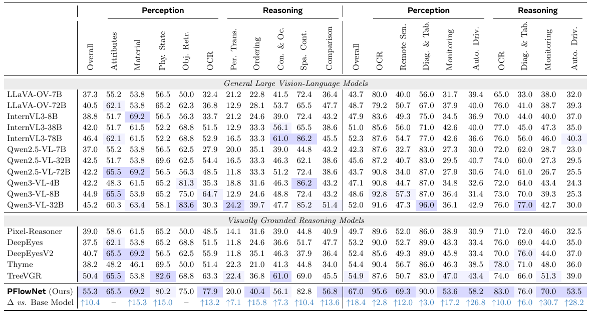

| Model | TB Ov. | Attr. | Mat. | Phys. | Obj.R | OCR | Per.T | Order | Con.&Oc. | Spa.C | Comp. | MME Ov. | OCR-P | Remote | Diag-P | Mon-P | Auto-P | OCR-R | Diag-R | Mon-R | Auto-R |
|---|---:|---:|---:|---:|---:|---:|---:|---:|---:|---:|---:|---:|---:|---:|---:|---:|---:|---:|---:|---:|---:|
| LLaVA-OV-7B | 37.3 | 55.2 | 53.8 | 56.5 | 50.0 | 32.4 | 21.2 | 22.8 | 41.5 | 72.4 | 36.4 | 43.7 | 80.0 | 40.0 | 56.0 | 31.7 | 39.4 | 65.0 | 33.0 | 38.0 | 32.0 |
| LLaVA-OV-72B | 40.5 | 62.1 | 53.8 | 65.2 | 62.3 | 36.8 | 12.9 | 28.1 | 53.7 | 65.5 | 47.7 | 48.7 | 79.2 | 50.7 | 67.0 | 37.9 | 40.0 | 76.0 | 41.0 | 38.7 | 39.3 |
| InternVL3-8B | 38.8 | 51.7 | 69.2 | 56.5 | 56.3 | 33.7 | 21.2 | 24.6 | 39.0 | 72.4 | 43.2 | 47.9 | 83.6 | 49.3 | 75.0 | 34.5 | 36.9 | 70.0 | 44.0 | 40.0 | 37.0 |
| InternVL3-38B | 42.0 | 51.7 | 61.5 | 52.2 | 68.8 | 51.5 | 12.9 | 33.3 | 56.1 | 65.5 | 38.6 | 51.0 | 85.6 | 56.0 | 71.0 | 42.6 | 40.0 | 77.0 | 45.0 | 47.3 | 35.0 |
| InternVL3-78B | 46.4 | 62.1 | 61.5 | 52.2 | 68.8 | 52.9 | 16.5 | 33.3 | 61.0 | 86.2 | 45.5 | 52.3 | 87.6 | 54.7 | 77.0 | 42.6 | 36.6 | 76.0 | 56.0 | 46.0 | 40.3 |
| Qwen2.5-VL-7B | 37.0 | 55.2 | 53.8 | 56.5 | 62.5 | 27.9 | 20.0 | 35.1 | 39.0 | 44.8 | 43.2 | 42.3 | 87.6 | 32.7 | 83.0 | 27.3 | 30.0 | 72.0 | 62.0 | 28.7 | 23.0 |
| Qwen2.5-VL-32B | 42.5 | 51.7 | 53.8 | 69.6 | 62.5 | 54.4 | 16.5 | 33.3 | 46.3 | 62.1 | 38.6 | 45.6 | 87.2 | 40.7 | 83.0 | 29.5 | 40.7 | 74.0 | 60.0 | 27.3 | 29.5 |
| Qwen2.5-VL-72B | 42.2 | 65.5 | 69.2 | 56.5 | 56.3 | 48.5 | 11.8 | 33.3 | 51.2 | 72.4 | 38.6 | 43.7 | 90.8 | 34.0 | 87.0 | 27.9 | 30.6 | 74.0 | 61.0 | 26.7 | 25.5 |
| Qwen3-VL-4B | 42.2 | 48.3 | 61.5 | 65.2 | 81.3 | 35.3 | 18.8 | 31.6 | 46.3 | 86.2 | 43.2 | 47.1 | 90.8 | 44.7 | 87.0 | 34.8 | 32.6 | 72.0 | 64.0 | 43.4 | 24.3 |
| Qwen3-VL-8B | 44.9 | 65.5 | 53.9 | 65.2 | 75.0 | 64.7 | 12.9 | 24.6 | 48.8 | 72.4 | 43.2 | 48.6 | 92.8 | 57.3 | 87.0 | 36.4 | 31.4 | 73.0 | 70.0 | 39.3 | 25.3 |
| Qwen3-VL-32B | 45.2 | 60.3 | 63.4 | 58.1 | 83.6 | 30.3 | 24.2 | 39.7 | 47.7 | 85.2 | 51.4 | 52.0 | 91.6 | 47.3 | 96.0 | 36.1 | 42.9 | 76.0 | 77.0 | 42.7 | 30.0 |
| Pixel-Reasoner | 39.0 | 58.6 | 61.5 | 65.2 | 50.0 | 48.5 | 14.1 | 31.6 | 39.0 | 44.8 | 40.9 | 49.7 | 89.6 | 52.0 | 86.0 | 38.9 | 30.9 | 71.0 | 72.0 | 46.0 | 32.5 |
| DeepEyes | 37.5 | 62.1 | 53.8 | 65.2 | 68.8 | 51.5 | 11.8 | 24.6 | 36.6 | 51.7 | 47.7 | 53.2 | 90.0 | 52.7 | 89.0 | 43.3 | 33.4 | 76.0 | 69.0 | 44.0 | 35.0 |
| DeepEyesV2 | 40.7 | 65.5 | 69.2 | 56.5 | 62.5 | 55.9 | 11.8 | 35.1 | 46.3 | 37.9 | 36.4 | 52.4 | 85.6 | 49.3 | 89.0 | 45.8 | 33.4 | 70.0 | 76.0 | 44.0 | 37.0 |
| Thyme | 38.2 | 48.2 | 46.1 | 69.5 | 50.0 | 51.4 | 22.3 | 21.0 | 41.3 | 44.8 | 34.0 | 54.4 | 90.4 | 56.7 | 86.0 | 46.3 | 38.5 | 78.0 | 71.0 | 48.0 | 36.0 |
| TreeVGR | 50.4 | 65.5 | 53.8 | 82.6 | 68.8 | 63.3 | 22.4 | 36.8 | 61.0 | 69.0 | 45.5 | 54.9 | 87.6 | 50.7 | 83.0 | 47.0 | 43.4 | 74.0 | 66.0 | 51.3 | 39.0 |
| **PFlowNet (Ours)** | **55.3** | **65.5** | **69.2** | **80.2** | **75.0** | **77.9** | **20.0** | **40.4** | **56.1** | **82.8** | **56.8** | **67.0** | **95.6** | **69.3** | **90.0** | **53.6** | **58.2** | **83.0** | **76.0** | **70.0** | **53.5** |
| $\Delta$ vs. Base Model | ↑10.4 | – | ↑15.3 | ↑15.0 | – | ↑13.2 | ↑7.1 | ↑15.8 | ↑7.3 | ↑10.4 | ↑13.6 | ↑18.4 | ↑2.8 | ↑12.0 | ↑3.0 | ↑17.2 | ↑26.8 | ↑10.0 | ↑6.0 | ↑30.7 | ↑28.2 |

**Caption:** Comparison with competitive alternatives on TreeBench (left) and MME-RealWorld-Lite (right).

**Caption[CN]:** 在 TreeBench（左）和 MME-RealWorld-Lite（右）上与有竞争力的替代方法比较。表头中的 `-P` 与 `-R` 分别表示感知与推理分组。

> <span style="color:#3B82F6"><strong>Para. 3:</strong></span> **Fine-grained Visual Understanding.** As presented in Table 3, PFlowNet achieves SOTA results across all benchmarks, outperforming both representative baselines and general LVLMs. Notably, although the Qwen3-VL series incorporates architectural improvements (e.g., DeepStack) to enhance fine-grained capabilities, PFlowNet still delivers clear gains of 13%, 8%/8.8%, and 2.5%–7% on V*, HR-Bench (4K/8K), and ScreenSpot, respectively. These improvements are primarily concentrated in reasoning-oriented subsets, such as spatial reasoning and cross-objective relationship recognition. This validates our key insight: PFlowNet yields high-utility perceptual results that enhance visual reasoning while ensuring reliability. Consequently, despite being built on Qwen3-VL-8B, PFlowNet matches the performance of the larger Qwen3-VL-32B on these challenging tasks, i.e., 90.6 vs. 87.4 on V*, 80.4 vs. 82.1 / 75.9 vs. 74.8 on HR-Bench 4K / 8K, respectively.

> <span style="color:#F59E0B"><strong>Para. 3[CN]:</strong></span> **细粒度视觉理解。** 如 Table 3 所示，PFlowNet 在全部基准上取得 SOTA，超过代表性基线和通用 LVLM。尽管 Qwen3-VL 系列引入 DeepStack 等架构改进来增强细粒度能力，PFlowNet 在 V*、HR-Bench（4K/8K）和 ScreenSpot 上仍分别取得 13%、8%/8.8% 和 2.5%–7% 的明显增益。这些提升主要集中在空间推理和跨对象关系识别等面向推理的子集上，验证了核心洞见：PFlowNet 在确保可靠性的同时产生高效用感知结果，进而增强视觉推理。因此，尽管基于 Qwen3-VL-8B，PFlowNet 在这些困难任务上仍能匹配更大的 Qwen3-VL-32B：V* 为 90.6 对 87.4，HR-Bench 4K/8K 分别为 80.4 对 82.1、75.9 对 74.8。这里保留了原文中的 75.9；Table 3 的对应 PFlowNet HR-Bench 8K Overall 数值为 76.9。

### Table 3. Fine-grained visual tasks / 细粒度视觉任务


| Model | V* Ov. | V* Attr. | V* Spatial | HR4K Ov. | HR4K Single | HR4K Cross | HR8K Ov. | HR8K Single | HR8K Cross |
|---|---:|---:|---:|---:|---:|---:|---:|---:|---:|
| GPT-4o-1120 [38] | 66.0 | – | – | 59.0 | 70.0 | 48.0 | 55.5 | 62.0 | 49.0 |
| LLaVA-OV-72B [19] | 73.8 | 80.9 | 63.2 | 66.3 | 76.5 | 56.0 | 60.9 | 68.8 | 53.0 |
| InternVL3-8B [66] | 72.3 | 73.0 | 71.1 | 70.8 | 79.3 | 62.3 | 62.0 | 64.3 | 59.8 |
| InternVL3-38B | 77.5 | 77.4 | 77.6 | 76.3 | 83.5 | 69.0 | 67.0 | 71.3 | 62.8 |
| Qwen2.5-VL-7B [2] | 74.3 | 77.4 | 69.7 | 72.1 | 88.8 | 55.5 | 68.8 | 83.5 | 54.0 |
| Qwen2.5-VL-32B | 85.9 | 83.5 | 89.5 | 74.8 | 89.3 | 60.3 | 71.6 | 86.5 | 56.8 |
| Qwen2.5VL-72B | 84.8 | 90.8 | 80.9 | 79.4 | 88.8 | 70.0 | 76.3 | 84.3 | 68.3 |
| Qwen3-VL-4B [1] | 74.9 | 78.3 | 69.7 | 73.5 | 84.8 | 62.3 | 67.1 | 83.5 | 50.7 |
| Qwen3-VL-8B | 77.5 | 80.2 | 73.7 | 72.4 | 88.5 | 56.3 | 68.1 | 82.0 | 54.3 |
| Qwen3-VL-32B | 87.4 | 87.0 | 88.2 | 82.1 | 94.0 | 70.2 | 74.8 | 90.1 | 59.5 |
| PixelReasoner [46] | 80.6 | 83.5 | 76.3 | 72.9 | 86.0 | 60.3 | 66.9 | 80.0 | 54.3 |
| DeepEyes [65] | 90.0 | 92.1 | 86.8 | 75.1 | 91.3 | 59.0 | 72.6 | 86.8 | 58.5 |
| DeepEyesV2 [13] | 81.8 | 81.7 | 80.3 | 77.9 | 92.8 | 63.0 | 73.8 | 88.5 | 59.0 |
| Thyme [62] | 82.2 | 83.5 | 80.3 | 77.0 | 91.0 | 63.0 | 72.0 | 86.5 | 57.5 |
| TreeVGR [51] | 87.4 | 89.5 | 84.2 | 77.1 | 89.5 | 64.8 | 72.8 | 86.0 | 59.5 |
| **PFlowNet (Ours)** | **90.6** | **91.4** | **89.5** | **80.4** | **91.2** | **69.5** | **76.9** | **89.0** | **64.8** |
| $\Delta$ vs. Base Model | ↑13 | ↑11 | ↑16 | ↑8.0 | ↑2.7 | ↑13.2 | ↑8.8 | ↑7.0 | ↑10.5 |

| Model | ScreenSpot v2 | ScreenSpot Pro |
|---|---:|---:|
| GPT-4o-1120 [38] | 18.1 | 0.8 |
| Claude Comp. Use [14] | – | 17.1 |
| OpenAI CUA [40] | 87.9 | 23.4 |
| Qwen2-VL-7B | – | 1.6 |
| Qwen2.5-VL-3B [2] | 68.4 | 23.9 |
| Qwen2.5-VL-7B | 73.6 | 29.0 |
| Qwen2.5-VL-72B | 87.1 | 43.6 |
| Qwen3-VL-8B [1] | 92.7 | 54.6 |
| Kimi-VL-16B-MoE [47] | 92.8 | 34.5 |
| SeedVL-1.5 [12] | 95.0 | 60.9 |
| SeeClick [5] | 55.1 | 1.1 |
| OS-Atlas-4B [57] | 71.9 | 3.7 |
| OS-Atlas-7B | 84.1 | 18.9 |
| UI-TARS-2B [41] | 84.7 | 27.7 |
| ViGoRL-7B [43] | 86.5 | 31.1 |
| **PFlowNet (Ours)** | **95.1** | **61.8** |
| $\Delta$ vs. Base Model | ↑2.4 | ↑7.2 |

**Caption:** Performance comparison on fine-grained visual tasks: visual search, high-resolution VQA, and GUI grounding.

**Caption[CN]:** 细粒度视觉任务上的性能比较：视觉搜索、高分辨率 VQA 和 GUI 定位。

### 4.2 In-depth Analysis / 深入分析

> <span style="color:#3B82F6"><strong>Para. 4:</strong></span> **Performance-Efficiency Trade-off.** As shown in Figure 6, PFlowNet exhibits an excellent balance between performance and efficiency. Compared to agentic frameworks, PFlowNet substitutes complex tool or code executions with carefully designed structured perceptual flows to efficiently encode visual thoughts. This results in significantly shorter context lengths and reduced inference latency without compromising performance. In contrast to TreeVGR, PFlowNet decouples the process into flow generation and flow-guided visual reasoning, which incurs affordable computational costs to substantially improve perceptual quality and utility, thereby significantly boosting visual reasoning performance.

> <span style="color:#F59E0B"><strong>Para. 4[CN]:</strong></span> **性能—效率权衡。** 如 Figure 6 所示，PFlowNet 在性能与效率之间取得出色平衡。与代理框架相比，它用精心设计的结构化感知流替代复杂工具或代码执行，高效编码视觉思维；这样可在不牺牲性能的前提下显著缩短上下文并降低推理延迟。与 TreeVGR 相比，PFlowNet 将过程解耦为感知流生成和感知流引导的视觉推理，只需可承受的计算代价便能显著改善感知质量与效用，进而显著提高视觉推理性能。

### Figure 6. Performance-efficiency trade-offs / 性能—效率权衡

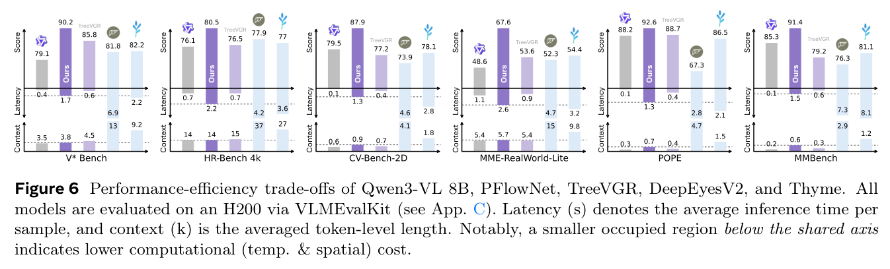

**Caption:** Performance-efficiency trade-offs of Qwen3-VL 8B, PFlowNet, TreeVGR, DeepEyesV2, and Thyme. All models are evaluated on an H200 via VLMEvalKit (see App. C). Latency (s) denotes the average inference time per sample, and context (k) is the averaged token-level length. Notably, a smaller occupied region below the shared axis indicates lower computational (temporal & spatial) cost.

**Caption[CN]:** Qwen3-VL 8B、PFlowNet、TreeVGR、DeepEyesV2 和 Thyme 的性能—效率权衡。全部模型均通过 VLMEvalKit 在一张 H200 上评测（见 Appendix C）。延迟（秒）表示每个样本的平均推理时间，context（k）表示平均词元级长度。共享坐标轴下占据的区域越小，表示计算的时间和空间成本越低。

> <span style="color:#3B82F6"><strong>Para. 5:</strong></span> **Test-Time Scaling.** Theoretically, PFlowNet’s variational objective (2) ensures a diverse rationale distribution, whereas grounded RLVR often implicitly optimizes a highly sharp distribution due to rigid alignment with sparse expert trajectories. To validate this, we conduct the empirical analysis shown in Figure 7 and Appendix D.1. While TreeVGR achieves high Pass@1 accuracy, it yields negligible gains as computational budget $k$ scales up, particularly in challenging scenarios such as V* Bench and TreeBench. This aligns with recent findings by [60]. By incorporating variational inference with tailored reward design and geometric shaping, PFlowNet achieves superior Pass@1 results while demonstrating robust test-time scaling capabilities.

> <span style="color:#F59E0B"><strong>Para. 5[CN]:</strong></span> **测试时扩展。** 理论上，PFlowNet 的变分目标 (2) 能保证多样化依据分布；相比之下，落地 RLVR 因为与稀疏专家轨迹刚性对齐，往往隐式优化出高度尖锐的分布。为验证这一点，作者进行了 Figure 7 和 Appendix D.1 中的经验分析。TreeVGR 虽有较高的 Pass@1 准确率，但随着计算预算 $k$ 增大，尤其在 V* Bench、TreeBench 等困难场景中，收益几乎可以忽略；这与 [60] 的近期发现一致。PFlowNet 把变分推断、定制奖励和几何塑形结合起来，不仅获得更好的 Pass@1，还表现出稳健的测试时扩展能力。

### Figure 7. Test-time scaling / 测试时扩展

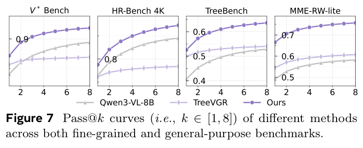

**Caption:** Pass@$k$ curves (i.e., $k\in[1,8]$) of different methods across both fine-grained and general-purpose benchmarks.

**Caption[CN]:** 不同方法在细粒度和通用基准上的 Pass@$k$ 曲线（$k\in[1,8]$）。

> <span style="color:#3B82F6"><strong>Para. 6:</strong></span> **Case Study.** Figure 8 qualitatively highlights PFlowNet’s superior reliability. Different from TreeVGR, where coupled perception-reasoning often yields geometrically precise yet semantically misaligned boxes due to sparse reward signals, PFlowNet utilizes dense contrastive rewards to enforce strict visual-textual dependency ($c_i$ on $r_i$), ensuring faithful interpretability. Interestingly, PFlowNet often prioritizes precise localization and then expands its visual scope. We attribute this to shaping energy $\omega_\lambda(z_{0:k},E)$ derived from sequence-level metric $d_{\mathrm{IoU}}$. When $k$ is small, scarcity of participating RoIs compels the model to maximize precision of each proposal; this constraint naturally relaxes as the sequence elongates, facilitating comprehensive reasoning.

> <span style="color:#F59E0B"><strong>Para. 6[CN]:</strong></span> **案例研究。** Figure 8 从定性角度展示 PFlowNet 更高的可靠性。TreeVGR 将感知与推理耦合，稀疏奖励信号常使其生成几何精确但语义错位的框；PFlowNet 则用稠密对比奖励强制视觉—文本依赖（$c_i$ 依赖 $r_i$），确保忠实可解释性。有趣的是，PFlowNet 往往先进行精确定位，再扩大视觉范围。作者认为这是由序列级度量 $d_{\mathrm{IoU}}$ 导出的塑形能量 $\omega_\lambda(z_{0:k},E)$ 所致：当 $k$ 较小时，参与的 RoI 很少，模型必须最大化每个提议的精度；随着序列增长，该约束自然放松，从而支持更全面的推理。

### Figure 8. Qualitative comparison / 定性比较


**Caption:** Qualitative comparison of visual reasoning across different methods. PFlowNet enables precise yet comprehensive exploration of visual evidence and effectively anchors the reasoning process to perceptual outcomes, producing the most reliable and accurate answers.

**Caption[CN]:** 不同方法的视觉推理定性比较。PFlowNet 能够精确而全面地探索视觉证据，并把推理过程有效锚定到感知结果上，从而生成最可靠、最准确的答案。

> <span style="color:#3B82F6"><strong>Para. 7:</strong></span> **Character-level Output Length.** We further investigate the effect of RFT on model output length, as shown in Figure 9. Given the same number of RoIs, generated flow lengths remain highly consistent across benchmarks, indicating that flow length is mainly governed by the amount of required visual evidence rather than benchmark-specific difficulty. Moreover, model-generated flows are generally shorter than synthetic flows. This is likely due to two factors: (i) the planning state lacks direct supervision during RFT, making it difficult to match detailed grounding plans produced by teacher models; and (ii) the contrastive term $\prod p_\phi^+(z)/p_\phi^-(z)$ encourages grounded captions to be more concise and discriminative.

> <span style="color:#F59E0B"><strong>Para. 7[CN]:</strong></span> **字符级输出长度。** 作者进一步研究 RFT 对模型输出长度的影响，如 Figure 9 所示。在 RoI 数量相同时，不同基准上的感知流长度高度一致，说明长度主要由所需视觉证据量决定，而不是由基准特有难度决定。此外，模型生成的感知流通常短于合成感知流。可能有两个原因：（i）规划状态在 RFT 中没有直接监督，难以匹配教师模型生成的详细落地计划；（ii）对比项 $\prod p_\phi^+(z)/p_\phi^-(z)$ 鼓励落地描述更加简洁且有判别性。

### Figure 9. RoI and output-length statistics / RoI 与输出长度统计

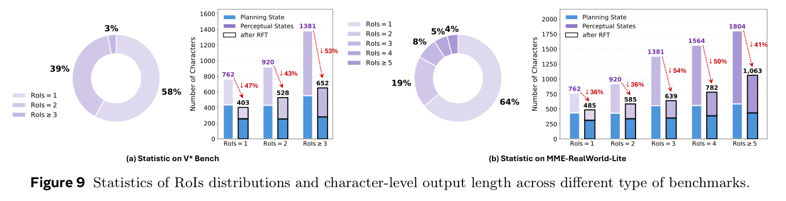

**Caption:** Statistics of RoIs distributions and character-level output length across different type of benchmarks.

**Caption[CN]:** 不同类型基准上的 RoI 分布和字符级输出长度统计。

### 4.3 Ablation Studies / 消融实验

> <span style="color:#3B82F6"><strong>Para. 8:</strong></span> **Framework & Reward Design.** Table 4 validates effectiveness of SFT and synthetic flows, while the proposed RFT strategy yields further substantial gains (rows 1, 2, and 6). Quality and efficacy rewards exhibit a collaborative effect during RFT, and the contrastive formulation plays a crucial role (rows 3–6). Regarding macro design, rows 7 and 8 examine input information during reasoning. Incorporating external fine-grained visual features yields only marginal improvements; removing perceptual flow causes severe degradation. The flow therefore functions as more than a localization tool: it is a critical explicit semantic anchor. By translating visual thoughts into a structured textual prefix, it conditions autoregressive generation, bridges the semantic gap, and guides the reasoning trajectory more directly than raw visual features.

> <span style="color:#F59E0B"><strong>Para. 8[CN]:</strong></span> **框架与奖励设计。** Table 4 验证了 SFT 和合成感知流的有效性，RFT 又带来显著增益（第 1、2、6 行）。质量奖励与效用奖励在 RFT 中具有协同效应，对比形式也起关键作用（第 3–6 行）。在宏观设计上，第 7、8 行考察推理阶段的输入信息：加入外部细粒度视觉特征只有很小收益，而去掉感知流会造成严重下降。因此，感知流不只是定位工具，更是关键的显式语义锚点。它把视觉思维转化为结构化文本前缀，对自回归生成进行条件化，弥合语义差距，并比原始视觉特征更直接地引导推理轨迹。

### Table 4. Training, reward, and reasoning ablations / 训练、奖励与推理消融


| Row | Setting | $Z$ | $I_{RoI}$ | $R_{cl}$ | $R_{gain}$ | TreeBench Acc | TreeBench mIoU | V* Acc | MME-RW Acc |
|---:|---|:---:|:---:|:---:|:---:|---:|---:|---:|---:|
| 1 | Base Model | – | – | – | – | 44.9 | – | 77.5 | 46.0 |
| 2 | + SFT | ✓ | ✓ | – | – | 48.3 | 44.2 | 83.7 | 54.2 |
| 3 | + RFT | ✓ | ✓ | ± | – | 51.5 | 43.7 | 85.3 | 59.5 |
| 4 | + RFT | ✓ | ✓ | – | ✓ | 52.8 | 40.5 | 87.4 | 62.8 |
| 5 | + RFT | ✓ | ✓ | ± | ✓ | 55.3 | 38.2 | 90.6 | 67.0 |
| 6 | + RFT | ✓ | ✓ | + | ✓ | 52.2 | 36.4 | 88.1 | 65.5 |
| 7 | PFlowNet | ✓ | – | ± | ✓ | 54.5 | 38.2 | 89.4 | 66.4 |
| 8 | PFlowNet | – | ✓ | ± | ✓ | 49.2 | 38.2 | 83.8 | 52.1 |

**Caption:** Ablation on the training recipe, reward design and reasoning pipeline, where ± and + denote $P^+/P^-$ and $P^+$.

**Caption[CN]:** 训练配方、奖励设计和推理流水线的消融；± 与 + 分别表示 $P^+/P^-$ 和 $P^+$。

> <span style="color:#3B82F6"><strong>Para. 9:</strong></span> **Geometric Shaping.** As illustrated in Figure 10, geometric shaping stabilizes training and permits broader exploration than typical KL regularization, effectively mitigating SFT inductive bias. The initial drop and subsequent resurgence in $d_{\mathrm{IoU}}$ reflect a healthy transition from early exploration to late exploitation, yielding reliable yet high-efficacy perceptual behaviors. Further ablations of vicinal radius $\epsilon$ and shaping intensity $\lambda$ show trends consistent with Theorem 3.1: excessive radius (e.g., 0.7) may over-explore invalid supports, while too small a radius enforces expert bias; small intensity causes substantial instability, whereas large intensity restricts exploration. Based on the results, we set $\lambda=4.5$ and $\epsilon=0.5$.

> <span style="color:#F59E0B"><strong>Para. 9[CN]:</strong></span> **几何塑形。** 如 Figure 10 所示，几何塑形稳定训练，并允许比典型 KL 正则化更广的探索，有效缓解 SFT 归纳偏置。$d_{\mathrm{IoU}}$ 先下降后回升，反映从早期探索到后期利用的健康转变，从而得到可靠且高效用的感知行为。对邻域半径 $\epsilon$ 和塑形强度 $\lambda$ 的进一步消融与定理 3.1 一致：半径过大（如 0.7）可能过度探索无效支持集，半径过小则强化专家偏置；强度过小造成显著训练不稳定，强度过大又限制探索。作者据此设置 $\lambda=4.5$、$\epsilon=0.5$。

### Figure 10. Geometric-shaping ablation / 几何塑形消融

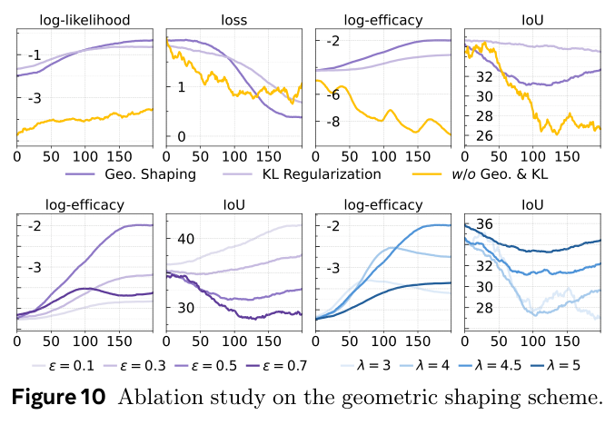

**Caption:** Ablation study on the geometric shaping scheme.

**Caption[CN]:** 几何塑形方案的消融实验。

> <span style="color:#3B82F6"><strong>Para. 10:</strong></span> **Cross-Scale Evaluations.** While primary experiments use the Qwen3-VL 8B backbone to maintain parameter parity with baselines, we extend evaluation to Qwen3-VL 4B and 32B to verify scalability. We employ the consistent recipe in Appendix B with efficiency adjustments: SFT and RFT are restricted to 1 and 2 epochs, respectively, with SFT global batch size 128. Even under this efficient regime, different-scale backbones derive clear improvements. Across general-purpose and fine-grained tasks, SFT yields average gains of 2.2% and 1.3% for Qwen3-VL 4B and 32B, respectively; tailored RFT further delivers improvements exceeding 2.3%, demonstrating scalability.

> <span style="color:#F59E0B"><strong>Para. 10[CN]:</strong></span> **跨尺度评测。** 主实验使用 Qwen3-VL 8B，以保持与基线参数量一致；作者进一步在 Qwen3-VL 4B 和 32B 上验证可扩展性。训练遵循 Appendix B 的一致配方，但为提高计算效率，把 SFT、RFT 分别限制为 1、2 个 epoch，并将 SFT 全局批大小设为 128。即使采用这一高效配方，不同尺度基座仍有明显提升。在通用和细粒度任务上，SFT 对 Qwen3-VL 4B、32B 的平均增益分别为 2.2% 和 1.3%；定制 RFT 又进一步带来超过 2.3% 的提升，证明了方法的可扩展性。

### Table 5. Cross-scale gains / 跨尺度收益


| Model / stage | V* | HR 4K | HR 8K | TreeB | MME-RW | CVB 2D | MMB | AI2D | ChartQA |
|---|---:|---:|---:|---:|---:|---:|---:|---:|---:|
| Qwen3-VL 4B | 74.8 | 73.5 | 67.1 | 42.2 | 47.1 | 78.2 | 84.5 | 83.8 | 82.1 |
| w SFT | 79.1 | 75.9 | 69.3 | 44.1 | 50.6 | 79.8 | 85.7 | 84.9 | 83.5 |
| $\Delta$ vs. Base Model | ↑4.3 | ↑2.4 | ↑2.2 | ↑1.9 | ↑3.5 | ↑1.6 | ↑1.2 | ↑1.1 | ↑1.4 |
| w RFT | 83.5 | 77.9 | 70.9 | 46.8 | 55.3 | 82.0 | 87.2 | 90.0 | 84.5 |
| $\Delta$ vs. Base Model | ↑8.7 | ↑4.4 | ↑3.8 | ↑4.6 | ↑8.2 | ↑3.8 | ↑2.7 | ↑2.7 | ↑2.3 |
| Qwen3-VL 32B | 87.4 | 82.1 | 74.8 | 45.2 | 52.0 | 81.5 | 87.7 | 89.0 | 83.1 |
| w SFT | 89.1 | 83.5 | 76.3 | 46.7 | 54.3 | 82.8 | 88.4 | 89.9 | 84.2 |
| $\Delta$ vs. Base Model | ↑1.7 | ↑1.4 | ↑1.3 | ↑1.4 | ↑2.3 | ↑1.3 | ↑0.7 | ↑0.9 | ↑1.0 |
| w RFT | 91.6 | 85.5 | 77.5 | 49.2 | 58.8 | 85.2 | 89.8 | 91.5 | 85.7 |
| $\Delta$ vs. Base Model | ↑4.2 | ↑3.1 | ↑2.8 | ↑4.0 | ↑6.8 | ↑3.7 | ↑2.1 | ↑2.5 | ↑2.6 |

**Caption:** Cross-scale gains of PFlowNet across general-purpose visual tasks and fine-grained understanding.

**Caption[CN]:** PFlowNet 在通用视觉任务和细粒度理解任务上的跨尺度收益。

## 5. Related Work / 相关工作

> <span style="color:#3B82F6"><strong>Para. 1:</strong></span> **Agentic Frameworks** equip LVLMs with dynamic image-manipulation capabilities via multi-turn tool/code executions, thereby facilitating reliable visual reasoning, as shown in Figure 11(a). Several works enhance visual reasoning with external sandbox tools [13, 23, 32, 46]. Thyme [62] realizes “thinking with images” by enabling code generation and execution; Visual Sketchpad [15] gives MLLMs a sketching workspace to extend CoT with intermediate visual thoughts; VaCoT [58] uses visual tools to mitigate degradation on low-quality inputs. CodeDance [45], however, highlights a trade-off between tool utilization and intrinsic reasoning. Entangling perception with complex invocations often causes excessive context and high latency. PFlowNet instead uses structured text tokens as proxies for perceptual behavior and efficiently achieves comparable high-quality visual reasoning through self-conditioned generation with supplied fine-grained features (Figure 11(c)).

> <span style="color:#F59E0B"><strong>Para. 1[CN]:</strong></span> **代理框架**通过多轮工具或代码执行赋予 LVLM 动态图像操作能力，从而促进可靠视觉推理，如 Figure 11(a) 所示。多项工作使用外部沙箱工具增强视觉推理 [13, 23, 32, 46]：Thyme [62] 让模型生成并执行代码，实现“用图像思考”；Visual Sketchpad [15] 为 MLLM 提供草图工作区，以中间视觉思维扩展 CoT；VaCoT [58] 用视觉工具缓解低质量输入造成的性能下降。然而，CodeDance [45] 指出了工具利用与内在推理能力之间的权衡。感知与复杂调用纠缠，往往造成上下文过长和高延迟。PFlowNet 则用结构化文本词元代理感知行为，通过配有细粒度特征的自条件生成，高效获得相当的高质量视觉推理（Figure 11(c)）。

> <span style="color:#3B82F6"><strong>Para. 2:</strong></span> **Grounded RLVR** maximizes geometric consistency between intermediate visual rationales and external expert priors via reinforcement learning to regularize reasoning (Figure 11(b)). Prior works [29, 31, 44, 51, 52] represent perception with normalized bounding-box coordinates interleaved with stepwise reasoning and optimize IoU with ground truth. ViGoRL [43] and GUI-R1 [34] instead use point-based perceptual proxies with spatial distance constraints; MIRG-RL [63] studies Grounded RLVR for multiple images. Our experiments reveal risks in rigid alignment with biased and sparse expert priors. These methods also often overlook semantic coherence between visual rationales and surrounding textual context, potentially compromising reasoning. PFlowNet’s multi-dimensional reward mitigates these limitations.

> <span style="color:#F59E0B"><strong>Para. 2[CN]:</strong></span> **落地 RLVR**通过强化学习最大化中间视觉依据与外部专家先验之间的几何一致性，以正则化推理过程（Figure 11(b)）。已有工作 [29, 31, 44, 51, 52] 用与逐步推理交错的归一化边界框坐标表示感知，并优化相对于真值的 IoU；ViGoRL [43] 和 GUI-R1 [34] 改用点式感知代理和空间距离约束；MIRG-RL [63] 则研究多图场景中的 Grounded RLVR。本文实验揭示了与有偏且稀疏的专家先验刚性对齐的风险。这些方法还常忽视视觉依据与周围文本上下文之间的语义连贯性，可能损害推理性能。PFlowNet 的多维奖励缓解了这些问题。

### Figure 11. Framework comparisons / 框架比较


**Caption:** Framework comparisons between different paradigms, where (a) agentic frameworks rely on multi-turn tool executions for a “perceive-then-reason” process, (b) grounded RLVR integrates perception into reasoning in a single turn, and (c) the proposed PFlowNet decouples perception from reasoning via a two-stage perceptual flow, achieving robust yet efficient visually grounded reasoning.

**Caption[CN]:** 不同范式的框架比较：（a）代理框架依赖多轮工具执行来完成“先感知、后推理”；（b）落地 RLVR 在单轮中把感知融入推理；（c）PFlowNet 通过两阶段感知流解耦感知与推理，实现稳健且高效的视觉落地推理。

## 6. Conclusion / 结论

> <span style="color:#3B82F6"><strong>Para. 1:</strong></span> This paper introduces PFlowNet, a novel framework based on structured perceptual flows that enables high-quality and interpretable visual reasoning. PFlowNet incorporates a carefully designed reinforcement fine-tuning strategy, comprising a tailored reward function with vicinal geometric shaping, which allows LVLMs to explore reasoning-oriented yet valid perceptual behaviors. Formal analysis establishes a provable performance guarantee for PFlowNet. Extensive experiments further demonstrate its superiority across both general-purpose and fine-grained tasks. Notably, the empirical analysis highlights PFlowNet’s excellent performance-efficiency balance and robust test-time scaling property.

> <span style="color:#F59E0B"><strong>Para. 1[CN]:</strong></span> 本文提出 PFlowNet，一种基于结构化感知流的新框架，可实现高质量且可解释的视觉推理。PFlowNet 引入精心设计的强化微调策略，由定制奖励函数和邻域几何塑形构成，使 LVLM 能探索面向推理且有效的感知行为。形式化分析为 PFlowNet 建立了可证明的性能保证，大量实验进一步展示了它在通用和细粒度任务上的优势。尤其是，经验分析表明 PFlowNet 具有出色的性能—效率平衡和稳健的测试时扩展特性。

### Limitations and Future Work / 局限与未来工作

> <span style="color:#3B82F6"><strong>Para. 2:</strong></span> The theoretical analysis (Theorems 3.1 and 3.4) rests on idealized assumptions (A.1, A.2) and regularity conditions on valid support $S_V$ that may not strictly hold in practice; however, these bounds serve as a qualitative guide supported by our empirical validation. The proposed method involves two key hyperparameters ($\epsilon$ and $\lambda$), whose optimal configurations may vary across base models and domains. Moreover, a comprehensive analysis of representative failure cases is provided in Failure Case Analysis D.2.

> <span style="color:#F59E0B"><strong>Para. 2[CN]:</strong></span> 理论分析（定理 3.1 和 3.4）依赖理想化假设（A.1、A.2）以及对有效支持集 $S_V$ 的正则性条件，这些条件在实践中未必严格成立；不过，这些上界可作为由经验验证支持的定性指南。该方法包含两个关键超参数（$\epsilon$ 和 $\lambda$），其最优配置可能随基座模型和领域而变化。此外，Failure Case Analysis D.2 对代表性失败案例给出了全面分析。

> <span style="color:#3B82F6"><strong>Para. 3:</strong></span> Another inherent limitation of PFlowNet lies in its lack of adaptive perception. PFlowNet currently relies on a fixed structured reasoning format across questions of varying types and difficulty. While beneficial for complex visual reasoning, it may be unnecessary for simple questions or certain STEM-oriented tasks, where additional perceptual flow introduces reasoning overhead with limited marginal benefit because visual evidence is salient. It may also redistribute part of model capacity from direct problem solving to following the prescribed structure, leading to suboptimal results in some scenarios. Enabling adaptive visual reasoning, where the model dynamically adjusts its perceptual process according to question difficulty and task context, is therefore an important direction for future work.

> <span style="color:#F59E0B"><strong>Para. 3[CN]:</strong></span> PFlowNet 的另一项固有局限是缺少自适应感知。目前，不同类型、不同难度的问题都使用固定的结构化推理格式。该设计有利于复杂视觉推理，但对简单问题或某些 STEM 任务可能没有必要：视觉证据本就显著，额外感知流只会引入推理开销而边际收益有限。它还可能把一部分模型能力从直接解决问题重新分配到遵循规定结构上，在某些场景中造成次优结果。因此，让模型根据问题难度和任务上下文动态调整感知过程，实现自适应视觉推理，是重要的未来方向。

## References / 参考文献

> <span style="color:#3B82F6"><strong>Para. 1:</strong></span> The bibliography is retained below in its original bibliographic language and order. Author names, titles, venues, years, pages, identifiers, and URLs are searchable metadata and are therefore not translated or reformatted into bilingual prose.

> <span style="color:#F59E0B"><strong>Para. 1[CN]:</strong></span> 以下参考文献按原始书目语言和顺序完整保留。作者、题名、期刊或会议、年份、页码、标识符和 URL 都是可搜索元数据，因此不逐条翻译，也不改写成双语正文。

[1] Shuai Bai, Yuxuan Cai, Ruizhe Chen, Keqin Chen, Xionghui Chen, Zesen Cheng, Lianghao Deng, Wei Ding, Chang Gao, Chunjiang Ge, et al. Qwen3-vl technical report, 2025. URL https://arxiv.org/abs/2511.21631, 2025.

[2] Shuai Bai, Keqin Chen, Xuejing Liu, Jialin Wang, Wenbin Ge, Sibo Song, Kai Dang, Peng Wang, Shijie Wang, Jun Tang, et al. Qwen2.5-vl technical report. arXiv preprint arXiv:2502.13923, 2025.

[3] Olivier Chapelle, Jason Weston, Léon Bottou, and Vladimir Vapnik. Vicinal risk minimization. Advances in neural information processing systems, 13, 2000.

[4] Xuweiyi Chen, Ziqiao Ma, Xuejun Zhang, Sihan Xu, Shengyi Qian, Jianing Yang, David Fouhey, and Joyce Chai. Multi-object hallucination in vision language models. Advances in Neural Information Processing Systems, 37:44393–44418, 2024.

[5] Kanzhi Cheng, Qiushi Sun, Yougang Chu, Fangzhi Xu, Li YanTao, Jianbing Zhang, and Zhiyong Wu. Seeclick: Harnessing gui grounding for advanced visual gui agents. In Proceedings of the 62nd Annual Meeting of the Association for Computational Linguistics (Volume 1: Long Papers), pages 9313–9332, 2024.

[6] DeepMind. Gemini-3-flash. https://deepmind.google/models/gemini/flash/, 2025.

[7] DeepMind. Gemini-3-pro. https://deepmind.google/models/gemini/pro/, 2025.

[8] Boyu Gou, Ruohan Wang, Boyuan Zheng, Yanan Xie, Cheng Chang, Yiheng Shu, Huan Sun, and Yu Su. Navigating the digital world as humans do: Universal visual grounding for gui agents. arXiv preprint arXiv:2410.05243, 2024.

[9] Tianrui Guan, Fuxiao Liu, Xiyang Wu, Ruiqi Xian, Zongxia Li, Xiaoyu Liu, Xijun Wang, Lichang Chen, Furong Huang, Yaser Yacoob, et al. Hallusionbench: an advanced diagnostic suite for entangled language hallucination and visual illusion in large vision-language models. In Proceedings of the IEEE/CVF Conference on Computer Vision and Pattern Recognition, pages 14375–14385, 2024.

[10] Anisha Gunjal, Jihan Yin, and Erhan Bas. Detecting and preventing hallucinations in large vision language models. In Proceedings of the AAAI Conference on Artificial Intelligence, volume 38, pages 18135–18143, 2024.

[11] Daya Guo, Dejian Yang, Haowei Zhang, Junxiao Song, Ruoyu Zhang, Runxin Xu, Qihao Zhu, Shirong Ma, Peiyi Wang, Xiao Bi, et al. Deepseek-r1: Incentivizing reasoning capability in llms via reinforcement learning. arXiv preprint arXiv:2501.12948, 2025.

[12] Dong Guo, Faming Wu, Feida Zhu, Fuxing Leng, Guang Shi, Haobin Chen, Haoqi Fan, Jian Wang, Jianyu Jiang, Jiawei Wang, et al. Seed1. 5-vl technical report. arXiv preprint arXiv:2505.07062, 2025.

[13] Jack Hong, Chenxiao Zhao, ChengLin Zhu, Weiheng Lu, Guohai Xu, and Xing Yu. Deepeyesv2: Toward agentic multimodal model. arXiv preprint arXiv:2511.05271, 2025.

[14] Siyuan Hu, Mingyu Ouyang, Difei Gao, and Mike Zheng Shou. The dawn of gui agent: A preliminary case study with claude 3.5 computer use. arXiv preprint arXiv:2411.10323, 2024.

[15] Yushi Hu, Weijia Shi, Xingyu Fu, Dan Roth, Mari Ostendorf, Luke Zettlemoyer, Noah A Smith, and Ranjay Krishna. Visual sketchpad: Sketching as a visual chain of thought for multimodal language models. Advances in Neural Information Processing Systems, 37:139348–139379, 2024.

[16] Chaoya Jiang, Yongrui Heng, Wei Ye, Han Yang, Haiyang Xu, Ming Yan, Ji Zhang, Fei Huang, and Shikun Zhang. Vlm-r3: Region recognition, reasoning, and refinement for enhanced multimodal chain-of-thought. arXiv preprint arXiv:2505.16192, 2025.

[17] Aniruddha Kembhavi, Mike Salvato, Eric Kolve, Minjoon Seo, Hannaneh Hajishirzi, and Ali Farhadi. A diagram is worth a dozen images. In European conference on computer vision, pages 235–251. Springer, 2016.

[18] Woosuk Kwon, Zhuohan Li, Siyuan Zhuang, Ying Sheng, Lianmin Zheng, Cody Hao Yu, Joseph E. Gonzalez, Hao Zhang, and Ion Stoica. Efficient memory management for large language model serving with pagedattention. In Proceedings of the ACM SIGOPS 29th Symposium on Operating Systems Principles, 2023.

[19] Bo Li, Yuanhan Zhang, Dong Guo, Renrui Zhang, Feng Li, Hao Zhang, Kaichen Zhang, Peiyuan Zhang, Yanwei Li, Ziwei Liu, et al. Llava-onevision: Easy visual task transfer. arXiv preprint arXiv:2408.03326, 2024.

[20] Geng Li, Jinglin Xu, Yunzhen Zhao, and Yuxin Peng. Dyfo: A training-free dynamic focus visual search for enhancing lmms in fine-grained visual understanding. In Proceedings of the Computer Vision and Pattern Recognition Conference, pages 9098–9108, 2025.

[21] Kaixin Li, Ziyang Meng, Hongzhan Lin, Ziyang Luo, Yuchen Tian, Jing Ma, Zhiyong Huang, and Tat-Seng Chua. Screenspot-pro: Gui grounding for professional high-resolution computer use. In Proceedings of the 33rd ACM International Conference on Multimedia, pages 8778–8786, 2025.

[22] Lei Li, Yuqi Wang, Runxin Xu, Peiyi Wang, Xiachong Feng, Lingpeng Kong, and Qi Liu. Multimodal arxiv: A dataset for improving scientific comprehension of large vision-language models. arXiv preprint arXiv:2403.00231, 2024.

[23] Yangfu Li, Hongjian Zhan, Jiawei Chen, Yuning Gong, Qi Liu, and Yue Lu. Deepscan: A training-free framework for visually grounded reasoning in large vision-language models. arXiv preprint arXiv:2603.03857, 2026.

[24] Yifan Li, Yifan Du, Kun Zhou, Jinpeng Wang, Wayne Xin Zhao, and Ji-Rong Wen. Evaluating object hallucination in large vision-language models. arXiv preprint arXiv:2305.10355, 2023.

[25] Hanchao Liu, Wenyuan Xue, Yifei Chen, Dapeng Chen, Xiutian Zhao, Ke Wang, Liping Hou, Rongjun Li, and Wei Peng. A survey on hallucination in large vision-language models. arXiv preprint arXiv:2402.00253, 2024.

[26] Haotian Liu, Chunyuan Li, Qingyang Wu, and Yong Jae Lee. Visual instruction tuning. Advances in neural information processing systems, 36:34892–34916, 2023.

[27] Haotian Liu, Chunyuan Li, Yuheng Li, Bo Li, Yuanhan Zhang, Sheng Shen, and Yong Jae Lee. Llava-next: Improved reasoning, ocr, and world knowledge. https://llava-vl.github.io/blog/2024-01-30-llava-next/, 2024.

[28] Shilong Liu, Zhaoyang Zeng, Tianhe Ren, Feng Li, Hao Zhang, Jie Yang, Qing Jiang, Chunyuan Li, Jianwei Yang, Hang Su, et al. Grounding dino: Marrying dino with grounded pre-training for open-set object detection. In European conference on computer vision, pages 38–55. Springer, 2024.

[29] Shuochen Liu, Pengfei Luo, Chao Zhang, Yuhao Chen, Haotian Zhang, Qi Liu, Xin Kou, Tong Xu, and Enhong Chen. Look as you think: Unifying reasoning and visual evidence attribution for verifiable document rag via reinforcement learning. arXiv preprint arXiv:2511.12003, 2025.

[30] Yuan Liu, Haodong Duan, Yuanhan Zhang, Bo Li, Songyang Zhang, Wangbo Zhao, Yike Yuan, Jiaqi Wang, Conghui He, Ziwei Liu, et al. Mmbench: Is your multi-modal model an all-around player? In European conference on computer vision, pages 216–233. Springer, 2024.

[31] Ziyu Liu, Zeyi Sun, Yuhang Zang, Xiaoyi Dong, Yuhang Cao, Haodong Duan, Dahua Lin, and Jiaqi Wang. Visual-rft: Visual reinforcement fine-tuning. arXiv preprint arXiv:2503.01785, 2025.

[32] Ziyu Liu, Yuhang Zang, Yushan Zou, Zijian Liang, Xiaoyi Dong, Yuhang Cao, Haodong Duan, Dahua Lin, and Jiaqi Wang. Visual agentic reinforcement fine-tuning. URL https://arxiv.org/abs/2505.14246, 2025.

[33] Ilya Loshchilov and Frank Hutter. Decoupled weight decay regularization. arXiv preprint arXiv:1711.05101, 2017.

[34] Run Luo, Lu Wang, Wanwei He, Longze Chen, Jiaming Li, and Xiaobo Xia. Gui-r1: A generalist r1-style vision-language action model for gui agents. arXiv preprint arXiv:2504.10458, 2025.

[35] Yuanhuiyi Lyu, Kaiyu Lei, Ziqiao Weng, Xu Zheng, Lutao Jiang, Teng Li, Yangfu Li, Ziyuan Huang, Linfeng Zhang, and Xuming Hu. Struvis: Enhancing reasoning-based text-to-image generation via thinking with structured vision. arXiv preprint arXiv:2603.06032, 2026.

[36] Kanika Madan, Jarrid Rector-Brooks, Maksym Korablyov, Emmanuel Bengio, Moksh Jain, Andrei Cristian Nica, Tom Bosc, Yoshua Bengio, and Nikolay Malkin. Learning gflownets from partial episodes for improved convergence and stability. In International Conference on Machine Learning, pages 23467–23483. PMLR, 2023.

[37] Ahmed Masry, Xuan Long Do, Jia Qing Tan, Shafiq Joty, and Enamul Hoque. Chartqa: A benchmark for question answering about charts with visual and logical reasoning. In Findings of the association for computational linguistics: ACL 2022, pages 2263–2279, 2022.

[38] OpenAI. Openai-gpt-4o. https://openai.com/index/gpt-4o-system-card/, 2024.

[39] OpenAI. Openai-o3. https://openai.com/index/introducing-o3-and-o4-mini/, 2025.

[40] OpenAI. Operator: A computer-using agent. https://openai.com/index/operator-system-card/, 2025. System Card and Technical Report.

[41] Yujia Qin, Yining Ye, Junjie Fang, Haoming Wang, Shihao Liang, Shizuo Tian, Junda Zhang, Jiahao Li, Yunxin Li, Shijue Huang, et al. Ui-tars: Pioneering automated gui interaction with native agents. arXiv preprint arXiv:2501.12326, 2025.

[42] Alec Radford, Jong Wook Kim, Chris Hallacy, Aditya Ramesh, Gabriel Goh, Sandhini Agarwal, Girish Sastry, Amanda Askell, Pamela Mishkin, Jack Clark, et al. Learning transferable visual models from natural language supervision. In International conference on machine learning, pages 8748–8763. PmLR, 2021.

[43] Gabriel Sarch, Snigdha Saha, Naitik Khandelwal, Ayush Jain, Michael J Tarr, Aviral Kumar, and Katerina Fragkiadaki. Grounded reinforcement learning for visual reasoning. arXiv preprint arXiv:2505.23678, 2025.

[44] Haozhan Shen, Peng Liu, Jingcheng Li, Chunxin Fang, Yibo Ma, Jiajia Liao, Qiaoli Shen, Zilun Zhang, Kangjia Zhao, Qianqian Zhang, et al. Vlm-r1: A stable and generalizable r1-style large vision-language model. arXiv preprint arXiv:2504.07615, 2025.

[45] Qi Song, Honglin Li, Yingchen Yu, Haoyi Zhou, Lin Yang, Song Bai, Qi She, Zilong Huang, and Yunqing Zhao. Codedance: A dynamic tool-integrated mllm for executable visual reasoning. arXiv preprint arXiv:2512.17312, 2025.

[46] Alex Su, Haozhe Wang, Weimin Ren, Fangzhen Lin, and Wenhu Chen. Pixel reasoner: Incentivizing pixel-space reasoning with curiosity-driven reinforcement learning. arXiv preprint arXiv:2505.15966, 2025.

[47] Kimi Team, Angang Du, Bohong Yin, Bowei Xing, Bowen Qu, Bowen Wang, Cheng Chen, Chenlin Zhang, Chenzhuang Du, Chu Wei, et al. Kimi-vl technical report. arXiv preprint arXiv:2504.07491, 2025.

[48] Peter Tong, Ellis Brown, Penghao Wu, Sanghyun Woo, Adithya Jairam Vedagiri IYER, Sai Charitha Akula, Shusheng Yang, Jihan Yang, Manoj Middepogu, Ziteng Wang, et al. Cambrian-1: A fully open, vision-centric exploration of multimodal llms. Advances in Neural Information Processing Systems, 37:87310–87356, 2024.

[49] Ashish Vaswani, Noam Shazeer, Niki Parmar, Jakob Uszkoreit, Llion Jones, Aidan N Gomez, Łukasz Kaiser, and Illia Polosukhin. Attention is all you need. Advances in neural information processing systems, 30, 2017.

[50] Leandro von Werra, Younes Belkada, Lewis Tunstall, Edward Beeching, Tristan Thrush, Nathan Lambert, Shengyi Huang, Kashif Rasul, and Quentin Gallouédec. Trl: Transformer reinforcement learning. https://github.com/huggingface/trl, 2020.

[51] Haochen Wang, Xiangtai Li, Zilong Huang, Anran Wang, Jiacong Wang, Tao Zhang, Jiani Zheng, Sule Bai, Zijian Kang, Jiashi Feng, et al. Traceable evidence enhanced visual grounded reasoning: Evaluation and methodology. arXiv preprint arXiv:2507.07999, 2025.

[52] Jiacong Wang, Zijian Kang, Haochen Wang, Haiyong Jiang, Jiawen Li, Bohong Wu, Ya Wang, Jiao Ran, Xiao Liang, Chao Feng, et al. Vgr: Visual grounded reasoning. arXiv preprint arXiv:2506.11991, 2025.

[53] Ke Wang, Junting Pan, Weikang Shi, Zimu Lu, Houxing Ren, Aojun Zhou, Mingjie Zhan, and Hongsheng Li. Measuring multimodal mathematical reasoning with math-vision dataset. Advances in Neural Information Processing Systems, 37:95095–95169, 2024.

[54] Wenbin Wang, Liang Ding, Minyan Zeng, Xiabin Zhou, Li Shen, Yong Luo, Wei Yu, and Dacheng Tao. Divide, conquer and combine: A training-free framework for high-resolution image perception in multimodal large language models. In Proceedings of the AAAI Conference on Artificial Intelligence, volume 39, pages 7907–7915, 2025.

[55] Xiyao Wang, Zhengyuan Yang, Chao Feng, Hongjin Lu, Linjie Li, Chung-Ching Lin, Kevin Lin, Furong Huang, and Lijuan Wang. Sota with less: Mcts-guided sample selection for data-efficient visual reasoning self-improvement. arXiv preprint arXiv:2504.07934, 2025.

[56] Penghao Wu and Saining Xie. V*: Guided visual search as a core mechanism in multimodal llms. In Proceedings of the Computer Vision and Pattern Recognition Conference, pages 13084–13094, 2024.

[57] Zhiyong Wu, Zhenyu Wu, Fangzhi Xu, Yian Wang, Qiushi Sun, Chengyou Jia, Kanzhi Cheng, Zichen Ding, Liheng Chen, Paul Pu Liang, et al. Os-atlas: Foundation action model for generalist gui agents. In The Thirteenth International Conference on Learning Representations, 2024.

[58] Zhengzhuo Xu, Chong Sun, SiNan Du, Chen Li, Jing Lyu, and Chun Yuan. Vacot: Rethinking visual data augmentation with vlms. arXiv preprint arXiv:2512.02361, 2025.

[59] Xuan Yu, Dayan Guan, Michael Ying Yang, and Yanfeng Gu. Zoom-refine: Boosting high-resolution multimodal understanding via localized zoom and self-refinement. arXiv preprint arXiv:2506.01663, 2025.

[60] Yang Yue, Zhiqi Chen, Rui Lu, Andrew Zhao, Zhaokai Wang, Shiji Song, and Gao Huang. Does reinforcement learning really incentivize reasoning capacity in llms beyond the base model? arXiv preprint arXiv:2504.13837, 2025.

[61] Yi-Fan Zhang, Huanyu Zhang, Haochen Tian, Chaoyou Fu, Shuangqing Zhang, Junfei Wu, Feng Li, Kun Wang, Qingsong Wen, Zhang Zhang, et al. Mme-realworld: Could your multimodal llm challenge high-resolution real-world scenarios that are difficult for humans? arXiv preprint arXiv:2408.13257, 2024.

[62] Yi-Fan Zhang, Xingyu Lu, Shukang Yin, Chaoyou Fu, Wei Chen, Xiao Hu, Bin Wen, Kaiyu Jiang, Changyi Liu, Tianke Zhang, et al. Thyme: Think beyond images. arXiv preprint arXiv:2508.11630, 2025.

[63] Lihao Zheng, Jiawei Chen, Xintian Shen, Hao Ma, and Tao Wei. Mirg-rl: Multi-image reasoning and grounding with reinforcement learning. arXiv preprint arXiv:2509.21788, 2025.

[64] Yaowei Zheng, Richong Zhang, Junhao Zhang, Yanhan Ye, Zheyan Luo, Zhangchi Feng, and Yongqiang Ma. Llamafactory: Unified efficient fine-tuning of 100+ language models. arXiv preprint arXiv:2403.13372, 2024.

[65] Ziwei Zheng, Michael Yang, Jack Hong, Chenxiao Zhao, Guohai Xu, Le Yang, Chao Shen, and Xing Yu. Deepeyes: Incentivizing “thinking with images” via reinforcement learning. arXiv preprint arXiv:2505.14362, 2025.

[66] Jinguo Zhu, Weiyun Wang, Zhe Chen, Zhaoyang Liu, Shenglong Ye, Lixin Gu, Hao Tian, Yuchen Duan, Weijie Su, Jie Shao, et al. Internvl3: Exploring advanced training and test-time recipes for open-source multimodal models. arXiv preprint arXiv:2504.10479, 2025.

## Appendix A. Omitted Technical Details / 附录 A：补充技术细节

> <span style="color:#3B82F6"><strong>Para. 1:</strong></span> **Roadmap.** We organize the theoretical analysis as follows. In Appendix A.1, we formalize the probabilistic framework and preliminary definitions. Appendix A.2 provides the rigorous derivation of our variational objective, stemming from the general Sub-Trajectory Balance principle. Building on this, we introduce necessary regularity assumptions to facilitate tractable analysis and establish two auxiliary lemmas in Appendix A.3: Lemma A.3 demonstrates that the shaped reward is proportional to an exponentially tilted posterior $P_\lambda$, i.e., $R(Z)\propto P_\lambda$, while Lemma A.4 proves that the global optimum of the policy recovers this tilted distribution, i.e., $p_{\theta^\star}(Z\mid X)\propto R(Z)\propto P_\lambda$. Finally, Appendix A.4 presents complete proofs of the main theorems. By bridging optimal policy $p_{\theta^\star}$ and target valid posterior $P_V$ via tilted distribution $P_\lambda$, we derive the Total Variation bound in Theorem 3.1. We conclude with an algebraic analysis of this bound in Theorem 3.4, confirming that PFlowNet provides strictly tighter guarantees than limiting baselines.

> <span style="color:#F59E0B"><strong>Para. 1[CN]:</strong></span> **路线图。** Appendix A.1 形式化概率框架和预备定义；Appendix A.2 从一般子轨迹平衡原则出发，严格推导本文的变分目标；Appendix A.3 引入使分析可处理的必要正则性假设，并建立两个辅助引理：Lemma A.3 表明塑形奖励与指数倾斜后验 $P_\lambda$ 成比例，即 $R(Z)\propto P_\lambda$；Lemma A.4 证明策略的全局最优恢复该倾斜分布，即 $p_{\theta^\star}(Z\mid X)\propto R(Z)\propto P_\lambda$。Appendix A.4 给出主定理的完整证明。作者通过倾斜分布 $P_\lambda$ 连接最优策略 $p_{\theta^\star}$ 与目标有效后验 $P_V$，推导 Theorem 3.1 的总变差上界；最后在 Theorem 3.4 中对该上界进行代数分析，证明 PFlowNet 的保证严格优于两个极限基线。

### A.1 Preliminaries / 预备知识

> <span style="color:#3B82F6"><strong>Para. 2:</strong></span> **Basic variables and flow notation.** Let $(X,Y,E)\sim P_{\mathrm{data}}$ denote a sample from the RFT dataset, where $X:=\langle I,T\rangle$ consists of image $I$ and instruction $T$, $Y=(y_1,\ldots,y_L)$ is the response sequence generated by the verifier when given synthetic flow $Z_s(X,E)$, and $E$ is a reference set of RoIs (e.g., expert evidence) used for vicinal geometry shaping. For theoretical analysis, we assume an intractable target joint distribution $P(X,Y,Z,\top)$ over inputs, outputs, latent perceptual flows, and terminal symbol $\top$ marking the end of a flow. Following Definition 2.2, a perceptual flow is a finite trajectory; $z_0$ is the planning state, each $z_k$ is an RoI-caption state, and we write $r_{1:K}:=(r_1,\ldots,r_K)$ and $c_{1:K}:=(c_1,\ldots,c_K)$.

> <span style="color:#F59E0B"><strong>Para. 2[CN]:</strong></span> **基本变量与感知流记号。** 令 $(X,Y,E)\sim P_{\mathrm{data}}$ 表示 RFT 数据集中的样本，其中 $X:=\langle I,T\rangle$ 由图像 $I$ 和指令 $T$ 构成，$Y=(y_1,\ldots,y_L)$ 是验证器在给定合成感知流 $Z_s(X,E)$ 时生成的回答序列，$E$ 是用于邻域几何塑形的参考 RoI 集合（例如专家证据）。理论分析假设存在不可获得的目标联合分布 $P(X,Y,Z,\top)$，定义在输入、输出、潜在感知流和标记感知流结束的终止符号 $\top$ 上。按照 Definition 2.2，感知流是有限轨迹；$z_0$ 为规划状态，每个 $z_k$ 为 RoI—描述状态，并记 $r_{1:K}:=(r_1,\ldots,r_K)$、$c_{1:K}:=(c_1,\ldots,c_K)$。

$$
Z=(z_0\rightarrow z_1\rightarrow\cdots\rightarrow z_K),
\qquad z_k=\langle r_k,c_k\rangle\quad(k\geq1).
$$

> <span style="color:#3B82F6"><strong>Para. 3:</strong></span> Throughout the analysis, we condition on a fixed flow length $K$ for each input while allowing geometric precision and RoI traversal order to vary across latent realizations. RoIs use normalized coordinates $r_k\in[0,1]^4$, e.g., $r_k=(x_1,y_1,x_2,y_2)$ with $0\leq x_1<x_2\leq1$ and $0\leq y_1<y_2\leq1$. All geometric distances are defined on this normalized coordinate system. For $k\in\{0,1,\ldots,K\}$, define prefix $z_{0:k}:=(z_0\rightarrow\cdots\rightarrow z_k)$ and use $z_{0:k}^{\top}$ for its terminated prefix.

> <span style="color:#F59E0B"><strong>Para. 3[CN]:</strong></span> 整个分析对每个输入固定感知流长度 $K$，但允许不同潜在实现具有不同几何精度和 RoI 遍历顺序。RoI 使用归一化坐标 $r_k\in[0,1]^4$，例如 $r_k=(x_1,y_1,x_2,y_2)$，满足 $0\leq x_1<x_2\leq1$、$0\leq y_1<y_2\leq1$；全部几何距离都在该归一化坐标系中定义。对 $k\in\{0,1,\ldots,K\}$，定义前缀 $z_{0:k}:=(z_0\rightarrow\cdots\rightarrow z_k)$，其终止版本记为 $z_{0:k}^{\top}$。

> <span style="color:#3B82F6"><strong>Para. 4:</strong></span> **Model factorization.** Given input $X$, let $\mathcal{R}(X)=\{R_1(X),\ldots,R_M(X)\}$ be the support of all admissible unordered RoI bags appearing in valid flows under target process $P(Z\mid X)$. Each $R_j(X)=\{r_i^j\}_{i=1}^{K}$ has cardinality $K$ and is one unordered realization of intrinsic visual evidence. An ordered tuple $r_{1:K}$ is a permutation of bag $R$, written $r_{1:K}\in S_R$, where $S_R$ is the permutation class induced by elements of $R$. PFlowNet parameterizes variational distribution $p_\theta(Z\mid X)$ and conditional generator $p_\theta(Y\mid X,Z)$. No specific architecture is assumed; it suffices that $p_\theta(Z\mid X)$ induces a forward transition kernel. The generic autoregressive factorization is:

> <span style="color:#F59E0B"><strong>Para. 4[CN]:</strong></span> **模型分解。** 给定输入 $X$，令 $\mathcal{R}(X)=\{R_1(X),\ldots,R_M(X)\}$ 表示目标过程 $P(Z\mid X)$ 下有效感知流中所有可接受无序 RoI 袋的支持集。每个 $R_j(X)=\{r_i^j\}_{i=1}^{K}$ 的基数为 $K$，表示内在视觉证据的一种无序实现。有序元组 $r_{1:K}$ 是 RoI 袋 $R$ 的一个排列，记为 $r_{1:K}\in S_R$，其中 $S_R$ 是由 $R$ 中元素诱导的排列类。PFlowNet 参数化变分分布 $p_\theta(Z\mid X)$ 和条件生成器 $p_\theta(Y\mid X,Z)$。分析不假设具体架构，只要求 $p_\theta(Z\mid X)$ 在状态间诱导出正向转移核。通用自回归分解为：

$$
p_\theta(Z\mid X)=p_\theta(z_0\mid X)\prod_{k=1}^{K}p_\theta(z_k\mid z_{0:k-1},X). \tag{A1-1}
$$

> <span style="color:#3B82F6"><strong>Para. 5:</strong></span> **Structural hypotheses.** First, planning state is uniquely determined by input $X$: there exists a deterministic mapping $g$ such that the following holds. Second, for each RoI $r$, define deterministic crop operator $I_r=\operatorname{Crop}(r,I)$ and $I_{r_{j:k}}:=(I_{r_j},\ldots,I_{r_k})$. Captioning likelihood depends on $I$ only through cropped visual content. We use $I\setminus I_r$ for complement context outside $r$. Third, because the contrastive caption term applies only to perceptual states $z_{k\geq1}$, the ratio at the planning-state boundary is set to one, so $R(z_0^{\top})=P(Y\mid z_0^{\top},X)$.

> <span style="color:#F59E0B"><strong>Para. 5[CN]:</strong></span> **结构假设。** 第一，规划状态由输入 $X$ 唯一确定：存在确定映射 $g$，使下式成立。第二，对每个 RoI $r$，定义确定裁剪算子 $I_r=\operatorname{Crop}(r,I)$ 和 $I_{r_{j:k}}:=(I_{r_j},\ldots,I_{r_k})$；描述似然只通过裁剪后的视觉内容依赖 $I$，并用 $I\setminus I_r$ 表示 $r$ 外的互补上下文。第三，由于对比描述项只作用于感知状态 $z_{k\geq1}$，规划状态边界处的比率设为 1，因此 $R(z_0^{\top})=P(Y\mid z_0^{\top},X)$。

$$
z_0=g(X),\qquad P(z_0\mid\cdot,X)=\mathbf{1}\{z_0=g(X)\}. \tag{A1-2}
$$

$$
P(c_{j:k}\mid I,r_{j:k})=P(c_{j:k}\mid I_{r_{j:k}}). \tag{A1-3}
$$

$$
\frac{P^+(z_0)}{P^-(z_0)}:=1,
\qquad R(z_0^{\top})=P(Y\mid z_0^{\top},X). \tag{A1-4}
$$

> <span style="color:#3B82F6"><strong>Para. 6:</strong></span> **Vicinal support.** Assume a conceptual golden RoI trajectory $G_R=(g_1,\ldots,g_K)$ captures intrinsic visual evidence for $X$. For tolerance $\sigma\in[0,1]$, define nonempty valid-flow support $S_V$ and its posterior mass $s_V$. Given reference RoI set $E$ and radius $\epsilon\in[0,1]$, define the $\epsilon$-vicinity $B_\epsilon(E)$. For a complete flow $Z\in B_\epsilon(E)$, terminal RoI set $\{r_1,\ldots,r_K\}$ lies within this vicinity. Define $s_B$ and $q=s_B/s_V$, and assume $\epsilon$ is small enough that $B_\epsilon(E)\subseteq S_V$, hence $0\leq s_B\leq s_V\leq1$.

> <span style="color:#F59E0B"><strong>Para. 6[CN]:</strong></span> **邻域支持集。** 假设概念上的黄金 RoI 轨迹 $G_R=(g_1,\ldots,g_K)$ 捕获输入 $X$ 的内在视觉证据。对容差 $\sigma\in[0,1]$，定义非空有效感知流支持集 $S_V$ 及其后验质量 $s_V$。给定参考 RoI 集 $E$ 和半径 $\epsilon\in[0,1]$，定义 $\epsilon$ 邻域 $B_\epsilon(E)$。对完整感知流 $Z\in B_\epsilon(E)$，终止 RoI 集 $\{r_1,\ldots,r_K\}$ 位于该邻域内。定义 $s_B$ 和 $q=s_B/s_V$，并假设 $\epsilon$ 足够小，使 $B_\epsilon(E)\subseteq S_V$，因而 $0\leq s_B\leq s_V\leq1$。

$$
S_V:=\left\{Z:d_{\mathrm{IoU}}(\{r_1,\ldots,r_K\},\{g_1,\ldots,g_K\})\leq\sigma\right\},
\qquad
s_V:=P(S_V\mid X,Y). \tag{A1-5}
$$

$$
B_\epsilon(E):=\left\{z_{0:k}:d_{\mathrm{IoU}}(\{r_1,\ldots,r_k\},E)\leq\epsilon\right\},
\qquad
s_B:=P(B_\epsilon(E)\mid X,Y),\qquad q:=\frac{s_B}{s_V},
$$

$$
B_\epsilon(E)\subseteq S_V,qquad 0\leq s_B\leq s_V\leq1. \tag{A1-6}
$$

> <span style="color:#3B82F6"><strong>Para. 7:</strong></span> **Reward-induced tilted posterior.** For $\lambda\geq0$, shaping weight $\omega_\lambda$ induces an exponentially tilted posterior. Since $\omega_\lambda=1$ on $B_\epsilon(E)$ and $e^{-\lambda}$ on its complement, the normalizer has a closed form. Using $s_B=qs_V$ gives the equivalent expression in Equation (A1-8). Finally, valid-support posterior $P_V$ is the target distribution in total-variation distance.

> <span style="color:#F59E0B"><strong>Para. 7[CN]:</strong></span> **奖励诱导的倾斜后验。** 对 $\lambda\geq0$，塑形权重 $\omega_\lambda$ 诱导指数倾斜后验。由于 $\omega_\lambda$ 在 $B_\epsilon(E)$ 上等于 1、在其补集上等于 $e^{-\lambda}$，归一化常数具有闭式形式；代入 $s_B=qs_V$ 得到 Equation (A1-8) 的等价表达。最后，有效支持后验 $P_V$ 是总变差距离中的目标分布。

$$
P_\lambda(Z\mid X,Y,E):=\frac{P(Z\mid X,Y)\omega_\lambda(Z,E)}{Z_\lambda},
\qquad
Z_\lambda:=\int P(Z\mid X,Y)\omega_\lambda(Z,E)\,dZ. \tag{A1-7}
$$

$$
\begin{aligned}
Z_\lambda
&=\int_{B_\epsilon(E)}P(Z\mid X,Y)\,dZ
+e^{-\lambda}\int_{B_\epsilon(E)^c}P(Z\mid X,Y)\,dZ\\
&=P(B_\epsilon(E)\mid X,Y)+e^{-\lambda}P(B_\epsilon(E)^c\mid X,Y)\\
&=s_B+e^{-\lambda}(1-s_B)
=qs_V+e^{-\lambda}(1-qs_V). \tag{A1-8}
\end{aligned}
$$

$$
P_V(Z\mid X,Y):=P(Z\mid X,Y,Z\in S_V)
=\frac{P(Z\mid X,Y)\mathbf{1}\{Z\in S_V\}}{s_V}. \tag{A1-9}
$$

### A.2 Derivation of Variational Objective / 变分目标推导

> <span style="color:#3B82F6"><strong>Para. 8:</strong></span> We now connect the general Sub-Trajectory Balance objective in Equation (1) to the variational loss in Equation (2). Begin with the squared log-difference form for sub-trajectory $z_{i:j}$, $0\leq i<j\leq K$.

> <span style="color:#F59E0B"><strong>Para. 8[CN]:</strong></span> 下面把 Equation (1) 的一般子轨迹平衡目标与 Equation (2) 的变分损失联系起来。首先，对子轨迹 $z_{i:j}$（$0\leq i<j\leq K$）写出平方对数差形式。

$$
\mathcal{L}(z_{i:j})=
\left(\log\frac{F(z_i)T_F(z_{i:j})}{F(z_j)T_B(z_{j:i})}\right)^2. \tag{A2-1}
$$

> <span style="color:#3B82F6"><strong>Para. 9:</strong></span> Under the tree-structured autoregressive generation, the backward path from any state is deterministic, so $T_B(z_{j:i})=1$. The forward transition is $T_F(z_{i:j})=\prod_{k=i+1}^{j}p_\theta(z_k\mid z_{0:k-1})$. The scalar flow is terminal reward normalized by termination policy: $F(z_k):=R_\lambda(z_{0:k}^{\top})/p_\theta(\top\mid z_{0:k})$. Substitution into Equation (A2-1), with log-ratio denoted $\Delta_{i,j}$, gives the complete algebra below.

> <span style="color:#F59E0B"><strong>Para. 9[CN]:</strong></span> 在树结构自回归生成中，从任意状态出发的反向路径是确定的，因此 $T_B(z_{j:i})=1$。正向转移为 $T_F(z_{i:j})=\prod_{k=i+1}^{j}p_\theta(z_k\mid z_{0:k-1})$。标量流量定义为用终止策略归一化后的终止奖励：$F(z_k):=R_\lambda(z_{0:k}^{\top})/p_\theta(\top\mid z_{0:k})$。把这些定义代入 Equation (A2-1)，并把对数比记为 $\Delta_{i,j}$，得到以下完整代数过程。

$$
\begin{aligned}
\Delta_{i,j}
&=\log\frac{F(z_i)T_F(z_{i:j})}{F(z_j)}\\
&=\log\frac{
\left[R_\lambda(z_{0:i}^{\top})/p_\theta(\top\mid z_{0:i})\right]
\prod_{k=i+1}^{j}p_\theta(z_k\mid z_{0:k-1})}
{R_\lambda(z_{0:j}^{\top})/p_\theta(\top\mid z_{0:j})}\\
&=\log\left[
\frac{R_\lambda(z_{0:i}^{\top})
\left(\prod_{k=i+1}^{j}p_\theta(z_k\mid z_{0:k-1})\right)
p_\theta(\top\mid z_{0:j})}
{R_\lambda(z_{0:j}^{\top})p_\theta(\top\mid z_{0:i})}
\right].
\end{aligned}
$$

> <span style="color:#3B82F6"><strong>Para. 10:</strong></span> For trajectory $Z=(z_0,\ldots,z_K)$, sum squared log-ratios over every valid sub-flow. Then extend to empirical samples $(X,Y,E)\sim P_{\mathrm{data}}$, where $E=\{e_l\}_{l=1}^{L}\subset\mathbb{N}^4$ is the set of expert-annotated RoIs, and to groups of sampled perceptual flows. The resulting Equation (A2-3) is exactly Equation (2), with $\theta^\star=\arg\min_\theta\mathcal{L}_{\mathrm{vRFT}}(\theta)$.

> <span style="color:#F59E0B"><strong>Para. 10[CN]:</strong></span> 对轨迹 $Z=(z_0,\ldots,z_K)$，在全部有效子感知流上累加平方对数比；再把该形式扩展到经验样本 $(X,Y,E)\sim P_{\mathrm{data}}$，其中 $E=\{e_l\}_{l=1}^{L}\subset\mathbb{N}^4$ 是专家标注 RoI 集合，并对成组采样的感知流取期望。所得 Equation (A2-3) 正是 Equation (2)，且 $\theta^\star=\arg\min_\theta\mathcal{L}_{\mathrm{vRFT}}(\theta)$。

$$
\mathcal{L}_{\mathrm{vRFT}}(Z,\theta)=
\sum_{0\leq i\leq j\leq K}\Delta_{i,j}^2
=\sum_{0\leq i\leq j\leq K}
\log^2\!\left[
\frac{R_\lambda(z_{0:i}^{\top})
\left(\prod_{k=i+1}^{j}p_\theta(z_k\mid z_{0:k-1})\right)
p_\theta(\top\mid z_{0:j})}
{R_\lambda(z_{0:j}^{\top})p_\theta(\top\mid z_{0:i})}
\right]. \tag{A2-2}
$$

$$
\mathcal{L}_{\mathrm{vRFT}}(\theta)=
\mathbb{E}_{\substack{X,Y,E\sim P_{\mathrm{data}}\\\{Z\}_{l=1}^{L}\sim p_\theta(Z\mid X)}}
\left[
\sum_{0\leq i\leq j\leq |Z|}
\log^2\!\left[
\frac{R_\lambda(z_{0:i}^{\top})
\left(\prod_{k=i+1}^{j}p_\theta(z_k\mid z_{0:k-1})\right)
p_\theta(\top\mid z_{0:j})}
{R_\lambda(z_{0:j}^{\top})p_\theta(\top\mid z_{0:i})}
\right]
\right]. \tag{A2-3}
$$

### A.3 Assumptions and Auxiliary Lemmas / 假设与辅助引理

> <span style="color:#3B82F6"><strong>Para. 11:</strong></span> **Assumption A.1 (Uniform Prior).** Motivated by empirical results, we adopt a uniform prior over admissible RoI space $\mathcal{R}(X)$. Given $X$, for every $Z(z_0,R,C)\sim P(Z\mid X)$ with $R\in\mathcal{R}(X)$ and $|R|=K$, the support bag and each traversal permutation are uniform.

> <span style="color:#F59E0B"><strong>Para. 11[CN]:</strong></span> **假设 A.1（均匀先验）。** 受经验结果启发，作者对可接受 RoI 空间 $\mathcal{R}(X)$ 采用均匀先验。给定 $X$，对每个满足 $R\in\mathcal{R}(X)$、$|R|=K$ 的 $Z(z_0,R,C)\sim P(Z\mid X)$，RoI 支持袋和每种遍历排列均为均匀分布。

$$
P(R\mid X)=\frac{1}{|\mathcal{R}(X)|},
\qquad
P(r_{1:K}\mid R,X)=\frac{1}{K!},
\qquad r_{1:K}\in S_R.
$$

> <span style="color:#3B82F6"><strong>Para. 12:</strong></span> **Assumption A.2 (Faithful Captioning with Non-Informative Prior).** Every candidate caption $c\in\mathcal{C}$ is faithful when conditioned on cropped evidence $I_r$ and becomes non-informative when evidence is absent, i.e., under complement $I\setminus I_r$. For finite caption space $\mathcal{C}$:

> <span style="color:#F59E0B"><strong>Para. 12[CN]:</strong></span> **假设 A.2（具有无信息先验的忠实描述）。** 每个候选描述 $c\in\mathcal{C}$ 在裁剪证据 $I_r$ 条件下是忠实的，而在证据缺失、即互补区域 $I\setminus I_r$ 条件下变为无信息分布。对有限描述空间 $\mathcal{C}$：

$$
P(c_{j:k}\mid I_{r_{j:k}})=\prod_{i=j}^{k}P(c_i\mid I_{r_i}),
\qquad
P(c\mid I\setminus I_r)=\frac{1}{|\mathcal{C}|}.
$$

> <span style="color:#3B82F6"><strong>Para. 13:</strong></span> **Lemma A.3 (Reward Consistency).** Under Assumptions A.1 and A.2, for all $(X,Y,E)\sim P_{\mathrm{data}}$, shaped multi-dimensional reward satisfies $R_\lambda(Z):=R_\lambda(z_{0:K}^{\top})\propto P_\lambda(Z\mid X,Y,E)$.

> <span style="color:#F59E0B"><strong>Para. 13[CN]:</strong></span> **引理 A.3（奖励一致性）。** 在假设 A.1 和 A.2 下，对所有 $(X,Y,E)\sim P_{\mathrm{data}}$，塑形后的多维奖励满足 $R_\lambda(Z):=R_\lambda(z_{0:K}^{\top})\propto P_\lambda(Z\mid X,Y,E)$。

> <span style="color:#3B82F6"><strong>Para. 14:</strong></span> **Proof.** From Equation (4), invoke Assumption A.2 so $P(c_i\mid I\setminus I_{r_i})=1/|\mathcal{C}|$. The factor $|\mathcal{C}|^K$, which depends only on $X$, is absorbed by proportionality. Caption factorization then yields Equations (A3-1) and (A3-2).

> <span style="color:#F59E0B"><strong>Para. 14[CN]:</strong></span> **证明。** 从 Equation (4) 出发，由假设 A.2 有 $P(c_i\mid I\setminus I_{r_i})=1/|\mathcal{C}|$。只依赖 $X$ 的因子 $|\mathcal{C}|^K$ 可被比例常数吸收；再使用描述分解，得到 Equations (A3-1) 和 (A3-2)。

$$
\begin{aligned}
R_\lambda(Z)
&=\left(\prod_{i=1}^{K}P(c_i\mid I_{r_i})\right)|\mathcal{C}|^K
P(Y\mid Z,X)\omega_\lambda(Z,E)\\
&\propto\left(\prod_{i=1}^{K}P(c_i\mid I_{r_i})\right)
P(Y\mid Z,X)\omega_\lambda(Z,E). \tag{A3-1}
\end{aligned}
$$

$$
R_\lambda(Z)\propto P(c_{1:K}\mid I_{r_{1:K}})P(Y\mid Z,X)\omega_\lambda(Z,E). \tag{A3-2}
$$

> <span style="color:#3B82F6"><strong>Para. 15:</strong></span> By Bayes’ rule, $P(Z\mid X,Y)\propto P(Y,Z\mid X)=P(Z\mid X)P(Y\mid Z,X)$. Expanding $Z=(R,z_0,r_{1:K},c_{1:K})$ gives Equation (A3-3). The traversal order is conditionally independent of deterministic planning state $z_0$ given $X$, so $P(r_{1:K}\mid z_0,R,X)=P(r_{1:K}\mid R,X)$. The deterministic crop operator and Assumption A.2 imply $P(c_{1:K}\mid r_{1:K},z_0,R,X)=P(c_{1:K}\mid I_{r_{1:K}})$.

> <span style="color:#F59E0B"><strong>Para. 15[CN]:</strong></span> 根据贝叶斯公式，$P(Z\mid X,Y)\propto P(Y,Z\mid X)=P(Z\mid X)P(Y\mid Z,X)$。把 $Z$ 展开为 $(R,z_0,r_{1:K},c_{1:K})$ 得到 Equation (A3-3)。给定 $X$，遍历顺序与确定规划状态 $z_0$ 条件独立，因此 $P(r_{1:K}\mid z_0,R,X)=P(r_{1:K}\mid R,X)$。确定裁剪算子与假设 A.2 又给出 $P(c_{1:K}\mid r_{1:K},z_0,R,X)=P(c_{1:K}\mid I_{r_{1:K}})$。

$$
\begin{aligned}
P(Z\mid X,Y)
&\propto P(R\mid X)P(z_0\mid R,X)P(r_{1:K}\mid z_0,R,X)\\
&\qquad\times P(c_{1:K}\mid r_{1:K},z_0,R,X)P(Y\mid Z,X). \tag{A3-3}
\end{aligned}
$$

> <span style="color:#3B82F6"><strong>Para. 16:</strong></span> Uniform support and ordering priors from Assumption A.1 and deterministic planning state from Equation (A1-2) contribute only constant $1/(|\mathcal{R}(X)|K!)$. Therefore the standard posterior reduces to Equation (A3-4). Combining it with tilted-posterior definition (A1-7) gives Equation (A3-5), which matches Equation (A3-2); hence $R_\lambda(Z)\propto P_\lambda(Z\mid X,Y,E)$, completing the proof.

> <span style="color:#F59E0B"><strong>Para. 16[CN]:</strong></span> 假设 A.1 的均匀支持与顺序先验，以及 Equation (A1-2) 的确定规划状态，只贡献常数 $1/(|\mathcal{R}(X)|K!)$。因此，标准后验化简为 Equation (A3-4)。将其与倾斜后验定义 (A1-7) 结合得到 Equation (A3-5)，后者与 Equation (A3-2) 一致；于是 $R_\lambda(Z)\propto P_\lambda(Z\mid X,Y,E)$，证毕。

$$
P(Z\mid X,Y)\propto
\frac{1}{|\mathcal{R}(X)|K!}P(c_{1:K}\mid I_{r_{1:K}})P(Y\mid Z,X)
\propto P(c_{1:K}\mid I_{r_{1:K}})P(Y\mid Z,X). \tag{A3-4}
$$

$$
P_\lambda(Z\mid X,Y,E)
\propto P(c_{1:K}\mid I_{r_{1:K}})P(Y\mid Z,X)\omega_\lambda(Z,E). \tag{A3-5}
$$

> <span style="color:#3B82F6"><strong>Para. 17:</strong></span> **Lemma A.4 (Posterior Matching Induced by the Variational Objective).** Under Assumptions A.1 and A.2, suppose policy $p_\theta$ is expressive and $\theta^\star$ globally minimizes $\mathcal{L}_{\mathrm{vRFT}}(\theta)$. For every $(X,Y,E)\sim P_{\mathrm{data}}$, $p_{\theta^\star}(Z\mid X)\propto R_\lambda(Z)\propto P_\lambda(Z\mid X,Y,E)$.

> <span style="color:#F59E0B"><strong>Para. 17[CN]:</strong></span> **引理 A.4（变分目标诱导的后验匹配）。** 在假设 A.1 和 A.2 下，假设策略 $p_\theta$ 具有充分表达能力，且 $\theta^\star$ 全局最小化 $\mathcal{L}_{\mathrm{vRFT}}(\theta)$。对每个 $(X,Y,E)\sim P_{\mathrm{data}}$，有 $p_{\theta^\star}(Z\mid X)\propto R_\lambda(Z)\propto P_\lambda(Z\mid X,Y,E)$。

> <span style="color:#3B82F6"><strong>Para. 18:</strong></span> **Proof.** The policy-induced forward trajectory probability is Equation (A3-6). If the expressive policy reaches a solution with $\mathcal{L}_{\mathrm{vRFT}}(Z,\theta)=0$ for all valid $(i,j)$, every $\Delta_{i,j}=0$. Exponentiating yields exact balance for each prefix pair. Taking $(i,j)=(0,K)$ gives Equation (A3-7).

> <span style="color:#F59E0B"><strong>Para. 18[CN]:</strong></span> **证明。** 策略诱导的正向轨迹概率见 Equation (A3-6)。若表达能力充分的策略达到对所有有效 $(i,j)$ 均满足 $\mathcal{L}_{\mathrm{vRFT}}(Z,\theta)=0$ 的解，则每个 $\Delta_{i,j}=0$；取指数后，每对前缀都满足精确平衡。令 $(i,j)=(0,K)$，得到 Equation (A3-7)。

$$
p_\theta(Z,\top\mid X):=
\left(\prod_{k=1}^{K}p_\theta(z_k\mid z_{0:k-1})\right)p_\theta(\top\mid z_{0:K}). \tag{A3-6}
$$

$$
R_\lambda(z_{0:i}^{\top})
\left(\prod_{k=i+1}^{j}p_{\theta^\star}(z_k\mid z_{0:k-1})\right)
p_{\theta^\star}(\top\mid z_{0:j})
=R_\lambda(z_{0:j}^{\top})p_{\theta^\star}(\top\mid z_{0:i}).
$$

$$
R_\lambda(z_0^{\top})
\underbrace{\left(\prod_{k=1}^{K}p_{\theta^\star}(z_k\mid z_{0:k-1})\right)p_{\theta^\star}(\top\mid z_{0:K})}_{p_{\theta^\star}(Z,\top\mid X)}
=R_\lambda(z_{0:K}^{\top})p_{\theta^\star}(\top\mid z_0). \tag{A3-7}
$$

> <span style="color:#3B82F6"><strong>Para. 19:</strong></span> Solving Equation (A3-7) gives Equation (A3-8). By Equations (A1-2) and (A1-4), $z_0$ is uniquely determined by $X$ and $R_\lambda(z_0^{\top})=P(Y\mid z_0^{\top},X)$ is a boundary normalization; thus prefactor $p_{\theta^\star}(\top\mid z_0)/R_\lambda(z_0^{\top})$ is independent of trajectory realization $Z$. Hence $p_{\theta^\star}(Z\mid X)\propto R_\lambda(Z)$. Lemma A.3 gives the second proportionality in Equation (A3-9), completing the proof.

> <span style="color:#F59E0B"><strong>Para. 19[CN]:</strong></span> 解 Equation (A3-7) 得到 Equation (A3-8)。由 Equations (A1-2) 和 (A1-4)，$z_0$ 由 $X$ 唯一确定，$R_\lambda(z_0^{\top})=P(Y\mid z_0^{\top},X)$ 是边界归一化选择；因此前因子 $p_{\theta^\star}(\top\mid z_0)/R_\lambda(z_0^{\top})$ 与具体轨迹实现 $Z$ 无关。于是 $p_{\theta^\star}(Z\mid X)\propto R_\lambda(Z)$。再由 Lemma A.3 得到 Equation (A3-9) 中的第二个比例关系，证毕。

$$
p_{\theta^\star}(Z,\top\mid X)=
\frac{p_{\theta^\star}(\top\mid z_0)}{R_\lambda(z_0^{\top})}R_\lambda(z_{0:K}^{\top}). \tag{A3-8}
$$

$$
p_{\theta^\star}(Z\mid X)\propto R_\lambda(Z)\propto P_\lambda(Z\mid X,Y,E). \tag{A3-9}
$$

### A.4 Proofs / 证明

> <span style="color:#3B82F6"><strong>Para. 20:</strong></span> **Restatement of Theorem 3.1 [Variation Distance Bound].** Under Assumptions A.1 and A.2, suppose $S_V$ satisfies $d_{\mathrm{eff}}$-regularity, so $\exists\kappa\geq1$ with $q=s_B/s_V\geq\kappa(\epsilon/\sigma)^{d_{\mathrm{eff}}}$. If $p_\theta$ is expressive and $\theta^\star$ globally minimizes $\mathcal{L}_{\mathrm{vRFT}}$, then the bound stated in Theorem 3.1 holds.

> <span style="color:#F59E0B"><strong>Para. 20[CN]:</strong></span> **定理 3.1 重述［变差距离上界］。** 在假设 A.1、A.2 下，假设 $S_V$ 满足 $d_{\mathrm{eff}}$ 正则性，使存在 $\kappa\geq1$ 满足 $q=s_B/s_V\geq\kappa(\epsilon/\sigma)^{d_{\mathrm{eff}}}$。若 $p_\theta$ 具有充分表达能力，且 $\theta^\star$ 全局最小化 $\mathcal{L}_{\mathrm{vRFT}}$，则 Theorem 3.1 所述上界成立。

> <span style="color:#3B82F6"><strong>Para. 21:</strong></span> **Remark A.5 (Limit Analysis w.r.t. $\lambda$).** In the MLE regime $\lambda\to0$, $e^{-\lambda}\to1$, $Z_\lambda\to1$, and the bound simplifies to $1-s_V$; PFlowNet discards geometric constraints and becomes standard MLE. In the RLVR regime $\lambda\to\infty$, $e^{-\lambda}\to0$, $Z_\lambda\to s_B$, and with $s_B=qs_V$ the numerator becomes $2s_B(1-q)$, yielding bound $1-q$; performance is bottlenecked by expert bias.

> <span style="color:#F59E0B"><strong>Para. 21[CN]:</strong></span> **备注 A.5（关于 $\lambda$ 的极限分析）。** 在 MLE 状态 $\lambda\to0$ 下，$e^{-\lambda}\to1$、$Z_\lambda\to1$，上界化简为 $1-s_V$；PFlowNet 丢弃几何约束并变成标准 MLE。在 RLVR 状态 $\lambda\to\infty$ 下，$e^{-\lambda}\to0$、$Z_\lambda\to s_B$；利用 $s_B=qs_V$，分子变为 $2s_B(1-q)$，最终上界为 $1-q$，性能受专家偏置限制。

$$
\lim_{\lambda\to0}D_{\mathrm{TV}}=\frac12\left[q(1-s_V)+(1-q)(1-s_V)+(1-s_V)\right]=1-s_V,
$$

$$
\lim_{\lambda\to\infty}D_{\mathrm{TV}}
=\frac{q(s_V-s_B)+(1-q)s_B}{2s_B}=1-q.
$$

> <span style="color:#3B82F6"><strong>Para. 22:</strong></span> **Remark A.6 (Limit Analysis w.r.t. $\epsilon$).** As $\epsilon\to0$, $q\to0$, $s_B\to0$, and $Z_\lambda\to e^{-\lambda}$. Substitution yields $1-s_V$, algebraically identical to the MLE bound, confirming geometric guidance vanishes when the reward becomes uninformative. Increasing $\epsilon$ while $B_\epsilon\subseteq S_V$ increases $q$ and tightens the bound toward $1-q$; if $\epsilon>\sigma$, the vicinity contains invalid regions and guidance degrades.

> <span style="color:#F59E0B"><strong>Para. 22[CN]:</strong></span> **备注 A.6（关于 $\epsilon$ 的极限分析）。** 当 $\epsilon\to0$ 时，$q\to0$、$s_B\to0$、$Z_\lambda\to e^{-\lambda}$；代入后得到 $1-s_V$，在代数上与 MLE 上界相同，说明奖励失去信息时几何引导也随之消失。当 $B_\epsilon\subseteq S_V$ 时，增大 $\epsilon$ 会提高 $q$，使上界朝 $1-q$ 收紧；若 $\epsilon>\sigma$，邻域包含无效区域，引导随之退化。

$$
\lim_{\epsilon\to0}D_{\mathrm{TV}}
=\frac{0+|e^{-\lambda}s_V-e^{-\lambda}|+e^{-\lambda}(1-s_V)}{2e^{-\lambda}}
=1-s_V.
$$

> <span style="color:#3B82F6"><strong>Para. 23:</strong></span> **Proof of Theorem 3.1.** Since $\theta^\star$ globally minimizes the expectation in Equation (A2-3), Lemma A.4 holds for $P_{\mathrm{data}}$-almost every tuple, so $p_{\theta^\star}(Z\mid X)\propto P_\lambda(Z\mid X,Y,E)$. Both sides are normalized probability distributions; therefore proportionality becomes pointwise equality. A realizable parametric model cannot analytically depend on $Y,E$ at inference; this equality characterizes ideal behavior at the global optimum for a given training instance.

> <span style="color:#F59E0B"><strong>Para. 23[CN]:</strong></span> **定理 3.1 的证明。** 由于 $\theta^\star$ 全局最小化 Equation (A2-3) 中的期望，Lemma A.4 对 $P_{\mathrm{data}}$ 几乎处处的数据元组成立，因此 $p_{\theta^\star}(Z\mid X)\propto P_\lambda(Z\mid X,Y,E)$。两侧都是在 $Z$ 空间上归一化的概率分布，比例关系因而成为逐点严格相等。可实现的参数模型在推理时不能解析地依赖 $Y,E$；这里的等式描述的是给定训练实例上变分目标全局最优处的理想行为。

$$
p_{\theta^\star}(Z\mid X)=P_\lambda(Z\mid X,Y,E). \tag{A4-1}
$$

> <span style="color:#3B82F6"><strong>Para. 24:</strong></span> Recall total variation distance. Since $B_\epsilon(E)\subseteq S_V$, partition support $\Omega$ of $P(Z\mid X,Y)$ into three disjoint measurable regions: the vicinity, valid support outside the vicinity, and invalid support. On $B_\epsilon(E)$, $P_\lambda=P/Z_\lambda$; outside it, $P_\lambda=e^{-\lambda}P/Z_\lambda$. On $S_V$, $P_V=P/s_V$; outside it, $P_V=0$.

> <span style="color:#F59E0B"><strong>Para. 24[CN]:</strong></span> 回顾总变差距离。由于 $B_\epsilon(E)\subseteq S_V$，把 $P(Z\mid X,Y)$ 的支持集 $\Omega$ 分成三个不交可测区域：专家邻域、邻域外的有效支持集、无效支持集。在 $B_\epsilon(E)$ 上，$P_\lambda=P/Z_\lambda$；在邻域外，$P_\lambda=e^{-\lambda}P/Z_\lambda$。在 $S_V$ 上，$P_V=P/s_V$；在其外，$P_V=0$。

$$
D_{\mathrm{TV}}(P,Q)=\sup_A|P(A)-Q(A)|=\frac12\int|p(z)-q(z)|\,dz. \tag{A4-2}
$$

$$
\Omega=B_\epsilon(E)\;\sqcup\;\bigl(S_V\setminus B_\epsilon(E)\bigr)\;\sqcup\;S_V^c. \tag{A4-3}
$$

$$
P_\lambda(Z\mid X,Y,E)=\frac{P(Z\mid X,Y)}{Z_\lambda},\quad Z\in B_\epsilon(E), \tag{A4-4}
$$

$$
P_\lambda(Z\mid X,Y,E)=\frac{e^{-\lambda}P(Z\mid X,Y)}{Z_\lambda},\quad Z\notin B_\epsilon(E), \tag{A4-5}
$$

$$
P_V(Z\mid X,Y)=\frac{P(Z\mid X,Y)}{s_V},\quad Z\in S_V, \tag{A4-6}
$$

$$
P_V(Z\mid X,Y)=0,\quad Z\notin S_V. \tag{A4-7}
$$

> <span style="color:#3B82F6"><strong>Para. 25:</strong></span> Split twice the TV distance into three integrals as in Equation (A4-8). We now evaluate them individually.

> <span style="color:#F59E0B"><strong>Para. 25[CN]:</strong></span> 如 Equation (A4-8) 所示，把两倍总变差距离拆成三个积分，随后分别计算。

$$
\begin{aligned}
2D_{\mathrm{TV}}(P_\lambda,P_V)
&=\int_{B_\epsilon(E)}|P_\lambda-P_V|\,dZ
+\int_{S_V\setminus B_\epsilon(E)}|P_\lambda-P_V|\,dZ\\
&\quad+\int_{S_V^c}|P_\lambda-P_V|\,dZ. \tag{A4-8}
\end{aligned}
$$

> <span style="color:#3B82F6"><strong>Para. 26:</strong></span> On $B_\epsilon(E)\subseteq S_V$, substitute Equations (A4-4) and (A4-6), integrate posterior mass $s_B$, and use $s_B=qs_V$.

> <span style="color:#F59E0B"><strong>Para. 26[CN]:</strong></span> 在 $B_\epsilon(E)\subseteq S_V$ 上代入 Equations (A4-4) 和 (A4-6)，积分得到后验质量 $s_B$，再使用 $s_B=qs_V$。

$$
\begin{aligned}
\int_{B_\epsilon(E)}|P_\lambda-P_V|\,dZ
&=\left|\frac1{Z_\lambda}-\frac1{s_V}\right|
\int_{B_\epsilon(E)}P(Z\mid X,Y)\,dZ\\
&=\frac{|s_V-Z_\lambda|}{Z_\lambda s_V}s_B
=\frac{|s_V-Z_\lambda|}{Z_\lambda}q. \tag{A4-9}
\end{aligned}
$$

> <span style="color:#3B82F6"><strong>Para. 27:</strong></span> On $S_V\setminus B_\epsilon(E)$, substitute Equations (A4-5) and (A4-6), whose posterior mass is $s_V-s_B=s_V(1-q)$.

> <span style="color:#F59E0B"><strong>Para. 27[CN]:</strong></span> 在 $S_V\setminus B_\epsilon(E)$ 上代入 Equations (A4-5) 和 (A4-6)；该区域的后验质量为 $s_V-s_B=s_V(1-q)$。

$$
\begin{aligned}
\int_{S_V\setminus B_\epsilon(E)}|P_\lambda-P_V|\,dZ
&=\left|\frac{e^{-\lambda}}{Z_\lambda}-\frac1{s_V}\right|(s_V-s_B)\\
&=\frac{|e^{-\lambda}s_V-Z_\lambda|}{Z_\lambda}(1-q). \tag{A4-10}
\end{aligned}
$$

> <span style="color:#3B82F6"><strong>Para. 28:</strong></span> On $S_V^c$, $P_V=0$. Because $B_\epsilon(E)\subseteq S_V$, all $Z\in S_V^c$ also lie outside the expert vicinity; hence $P_\lambda=e^{-\lambda}P/Z_\lambda$, and this region has mass $1-s_V$.

> <span style="color:#F59E0B"><strong>Para. 28[CN]:</strong></span> 在 $S_V^c$ 上，$P_V=0$。由于 $B_\epsilon(E)\subseteq S_V$，所有 $Z\in S_V^c$ 也都位于专家邻域外，因此 $P_\lambda=e^{-\lambda}P/Z_\lambda$；该区域的概率质量为 $1-s_V$。

$$
\int_{S_V^c}|P_\lambda-P_V|\,dZ
=\frac{e^{-\lambda}}{Z_\lambda}\int_{S_V^c}P(Z\mid X,Y)\,dZ
=\frac{e^{-\lambda}}{Z_\lambda}(1-s_V). \tag{A4-11}
$$

> <span style="color:#3B82F6"><strong>Para. 29:</strong></span> Combining Equations (A4-8) through (A4-11) yields the bound below. Substituting pointwise equality (A4-1) gives the claimed result for $p_{\theta^\star}$, where $Z_\lambda$ and $s_V$ are defined by Equations (A1-8) and (A1-5). This completes the proof.

> <span style="color:#F59E0B"><strong>Para. 29[CN]:</strong></span> 合并 Equations (A4-8)–(A4-11) 得到下式；再代入逐点等式 (A4-1)，即可得到关于 $p_{\theta^\star}$ 的结论，其中 $Z_\lambda$ 和 $s_V$ 分别由 Equations (A1-8)、(A1-5) 定义。证毕。

$$
D_{\mathrm{TV}}(P_\lambda,P_V)=
\frac{1}{2Z_\lambda}\left[q|s_V-Z_\lambda|+(1-q)|e^{-\lambda}s_V-Z_\lambda|+e^{-\lambda}(1-s_V)\right].
$$

> <span style="color:#3B82F6"><strong>Para. 30:</strong></span> **Restatement of Theorem 3.4 [Guaranteed Improvement over Baselines].** Let $D_{\mathrm{TV}}(\lambda,\epsilon)$ be the bound in Theorem 3.1. For any $\epsilon$ satisfying $B_\epsilon\subseteq S_V$, there exists an intensity $\lambda^\star$ such that $D_{\mathrm{TV}}(\lambda^\star,\epsilon)\leq\min\{1-s_V,1-q\}$. For fixed $\lambda=\lambda^\star$, the bound is strictly decreasing in $q$ as $\epsilon$ increases. Remark A.7 states that properly calibrated $\lambda$ and $\epsilon$ strictly tighten the idealized bounds of standard MLE and expert-guided RLVR.

> <span style="color:#F59E0B"><strong>Para. 30[CN]:</strong></span> **定理 3.4 重述［相对基线的保证改进］。** 令 $D_{\mathrm{TV}}(\lambda,\epsilon)$ 为 Theorem 3.1 的上界。对任何满足 $B_\epsilon\subseteq S_V$ 的 $\epsilon$，存在强度 $\lambda^\star$，使 $D_{\mathrm{TV}}(\lambda^\star,\epsilon)\leq\min\{1-s_V,1-q\}$。固定 $\lambda=\lambda^\star$ 时，随着 $\epsilon$ 增大，上界关于 $q$ 严格递减。Remark A.7 指出，适当校准 $\lambda$ 与 $\epsilon$ 会严格收紧标准 MLE 和专家引导 RLVR 的理想化上界。

> <span style="color:#3B82F6"><strong>Para. 31:</strong></span> **Proof.** Recall the bound and write $\alpha:=e^{-\lambda}\in(0,1]$, so $Z_\lambda=s_B+\alpha(1-s_B)$. The limiting baselines are $1-s_V$ as $\lambda\to0$ and $1-q$ as $\lambda\to\infty$, as shown above.

> <span style="color:#F59E0B"><strong>Para. 31[CN]:</strong></span> **证明。** 回顾该上界，令 $\alpha:=e^{-\lambda}\in(0,1]$，于是 $Z_\lambda=s_B+\alpha(1-s_B)$。如前所示，$\lambda\to0$ 和 $\lambda\to\infty$ 时的两个极限基线分别为 $1-s_V$ 与 $1-q$。

$$
D_{\mathrm{TV}}(\lambda,\epsilon)=
\frac{q|s_V-Z_\lambda|+(1-q)|e^{-\lambda}s_V-Z_\lambda|+e^{-\lambda}(1-s_V)}{2Z_\lambda},
\quad
Z_\lambda=s_B+e^{-\lambda}(1-s_B). \tag{A4-12}
$$

> <span style="color:#3B82F6"><strong>Para. 32:</strong></span> **Existence of calibrated $\lambda^\star$ and its closed form.** $Z_\lambda$ is continuous in $\lambda$ and decreases from 1 at $\lambda=0$ to $s_B$ as $\lambda\to\infty$. Since $s_B\leq s_V\leq1$, the intermediate value theorem gives $\lambda^\star\in[0,\infty]$ such that $Z_{\lambda^\star}=s_V$. With $\alpha^\star=e^{-\lambda^\star}$, solve for $\alpha^\star$. If $s_V>s_B$, $\lambda^\star$ is finite; if $s_V=s_B$, $\alpha^\star=0$ corresponds to $\lambda^\star=+\infty$, consistent with the RLVR limit.

> <span style="color:#F59E0B"><strong>Para. 32[CN]:</strong></span> **校准后 $\lambda^\star$ 的存在性及其闭式。** $Z_\lambda$ 关于 $\lambda$ 连续，并从 $\lambda=0$ 时的 1 递减到 $\lambda\to\infty$ 时的 $s_B$。由于 $s_B\leq s_V\leq1$，介值定理保证存在 $\lambda^\star\in[0,\infty]$ 使 $Z_{\lambda^\star}=s_V$。令 $\alpha^\star=e^{-\lambda^\star}$，可解得其闭式。若 $s_V>s_B$，$\lambda^\star$ 有限；若 $s_V=s_B$，则 $\alpha^\star=0$ 对应 $\lambda^\star=+\infty$，与 RLVR 极限一致。

$$
s_V=s_B+\alpha^\star(1-s_B)
\quad\Longrightarrow\quad
\alpha^\star=\frac{s_V-s_B}{1-s_B}=\frac{s_V(1-q)}{1-qs_V},
$$

$$
\lambda^\star=\log\frac{1-s_B}{s_V-s_B}\quad(s_V>s_B).
$$

> <span style="color:#3B82F6"><strong>Para. 33:</strong></span> Under calibration, $|s_V-Z_{\lambda^\star}|=0$. For any $\alpha\in(0,1]$, $Z_\lambda-\alpha s_V=\alpha(1-s_V)+(1-\alpha)s_B\geq0$, so $|\alpha s_V-Z_\lambda|=Z_\lambda-\alpha s_V$. At $\lambda^\star$, this is $s_V(1-\alpha^\star)$. Substituting and using $Z_{\lambda^\star}=s_V$ gives the intermediate and closed forms.

> <span style="color:#F59E0B"><strong>Para. 33[CN]:</strong></span> 在校准点，$|s_V-Z_{\lambda^\star}|=0$。对任何 $\alpha\in(0,1]$，$Z_\lambda-\alpha s_V=\alpha(1-s_V)+(1-\alpha)s_B\geq0$，因此 $|\alpha s_V-Z_\lambda|=Z_\lambda-\alpha s_V$；在 $\lambda^\star$ 处，该项为 $s_V(1-\alpha^\star)$。代入并使用 $Z_{\lambda^\star}=s_V$，得到中间形式和闭式。

$$
D_{\mathrm{TV}}(\lambda^\star,\epsilon)=
\frac{(1-q)s_V(1-\alpha^\star)+\alpha^\star(1-s_V)}{2s_V},
$$

$$
1-\alpha^\star=\frac{1-s_V}{1-qs_V},
\qquad
D_{\mathrm{TV}}(\lambda^\star,\epsilon)=\frac{(1-q)(1-s_V)}{1-qs_V}.
$$

> <span style="color:#3B82F6"><strong>Para. 34:</strong></span> **Strict improvement over limiting baselines.** Dividing the closed form by each baseline shows it is no larger than either, with strict inequality for non-degenerate interior $q,s_V\in(0,1)$. Therefore $D_{\mathrm{TV}}(\lambda^\star,\epsilon)\leq\min\{1-s_V,1-q\}$.

> <span style="color:#F59E0B"><strong>Para. 34[CN]:</strong></span> **相对极限基线的严格改进。** 将闭式分别除以两个基线上界，可见它不大于任一基线；对非退化内部情形 $q,s_V\in(0,1)$，不等式严格成立。因此 $D_{\mathrm{TV}}(\lambda^\star,\epsilon)\leq\min\{1-s_V,1-q\}$。

$$
\frac{D_{\mathrm{TV}}(\lambda^\star,\epsilon)}{1-s_V}
=\frac{1-q}{1-qs_V}\leq1,
\qquad
\frac{D_{\mathrm{TV}}(\lambda^\star,\epsilon)}{1-q}
=\frac{1-s_V}{1-qs_V}\leq1.
$$

> <span style="color:#3B82F6"><strong>Para. 35:</strong></span> **Monotone tightening with respect to $q$ under calibration.** Holding $s_V$ fixed and differentiating the calibrated closed form yields a strictly negative derivative for $s_V\in(0,1)$. Within valid regime $B_\epsilon\subseteq S_V$, enlarging $\epsilon$ increases $s_B$ and $q=s_B/s_V$, strictly tightening the bound. The regularity condition $q\geq\kappa(\epsilon/\sigma)^{d_{\mathrm{eff}}}$ quantifies this tightening while $\epsilon\leq\sigma$ maintains validity. This completes the proof.

> <span style="color:#F59E0B"><strong>Para. 35[CN]:</strong></span> **校准条件下关于 $q$ 的单调收紧。** 固定 $s_V$，对校准后的闭式关于 $q$ 求导；当 $s_V\in(0,1)$ 时导数严格为负。在有效状态 $B_\epsilon\subseteq S_V$ 内，增大 $\epsilon$ 会提高 $s_B$，进而提高 $q=s_B/s_V$，从而严格收紧上界。正则性条件 $q\geq\kappa(\epsilon/\sigma)^{d_{\mathrm{eff}}}$ 进一步量化了这种收紧；同时 $\epsilon\leq\sigma$ 保证邻域仍有效。证毕。

$$
\frac{\partial}{\partial q}D_{\mathrm{TV}}(\lambda^\star,\epsilon)
=(1-s_V)\frac{-(1-qs_V)+s_V(1-q)}{(1-qs_V)^2}
=-\frac{(1-s_V)^2}{(1-qs_V)^2}<0.
$$

## Appendix B. Implementation Details / 附录 B：实现细节

### B.1 Dataset / 数据集

> <span style="color:#3B82F6"><strong>Para. 1:</strong></span> To optimize PFlowNet, we curated a comprehensive training corpus by aggregating samples from large-scale open-domain multimodal VQA datasets, including the LLaVA [27] official training set, VGR [52], ArxivQA [22], VLM-R3 [16], and ThinkLite-VL [55]. We first filtered raw data based on task difficulty, typology, and evidence distribution, resulting in 95k visual-centric question-answer pairs. Specifically, 53k samples were processed via the pipeline in Section 3.1 to generate perceptual flows; following multi-stage quality control via rejection sampling, 45k high-quality samples were retained for cold-start initialization. The remaining 42k samples were reserved for subsequent variational reinforcement fine-tuning. To ensure effective evaluation, we rigorously cross-checked this corpus against the 15 adopted benchmarks to confirm zero data overlap, minimizing data-leakage risk.

> <span style="color:#F59E0B"><strong>Para. 1[CN]:</strong></span> 为优化 PFlowNet，作者汇总大规模开放域多模态 VQA 数据集中的样本，构建综合训练语料，包括 LLaVA [27] 官方训练集、VGR [52]、ArxivQA [22]、VLM-R3 [16] 和 ThinkLite-VL [55]。首先根据任务难度、类型和证据分布筛选原始数据，得到 95k 个以视觉为中心的问答对。其中，53k 个样本通过 Section 3.1 的流水线生成感知流；经过基于拒绝采样的多阶段质量控制，保留 45k 个高质量样本用于冷启动初始化；其余 42k 个样本用于后续变分强化微调。为确保评测有效，作者将该语料与采用的 15 个基准严格交叉核对，确认数据零重叠，从而尽量降低数据泄漏风险。

### B.2 Training Recipe / 训练配方

> <span style="color:#3B82F6"><strong>Para. 2:</strong></span> **Cold Start.** We initialize PFlowNet with Qwen3-VL-8B-Instruct [1] and fine-tune it using the LLaMA-Factory framework [64] on $16\times$ NVIDIA H200 GPUs. The model is trained on 45k SFT samples for 3 epochs. We employ AdamW [33] with global batch size 256 and peak learning rate $1\times10^{-5}$, using a cosine-decay schedule with warm-up ratio 0.1.

> <span style="color:#F59E0B"><strong>Para. 2[CN]:</strong></span> **冷启动。** PFlowNet 以 Qwen3-VL-8B-Instruct [1] 初始化，并使用 LLaMA-Factory 框架 [64] 在 $16\times$ NVIDIA H200 GPU 上微调。模型在 45k 个 SFT 样本上训练 3 个 epoch，采用 AdamW [33]、全局批大小 256、峰值学习率 $1\times10^{-5}$，以及预热比例 0.1 的余弦衰减日程。

> <span style="color:#3B82F6"><strong>Para. 3:</strong></span> **RFT.** Initialized with the SFT checkpoint, PFlowNet is trained using a custom framework built upon vLLM [18] and TRL [50] on $16\times$ NVIDIA H200 GPUs. We adopt hybrid parallelism to maximize throughput: data parallelism is applied across two nodes, DeepSpeed ZeRO-3 shards policy parameters across GPUs within each node, and the reward model is fully replicated on each device to reduce communication overhead. Training uses 42k samples for 5 epochs; detailed hyperparameters are reported in Table 6.

> <span style="color:#F59E0B"><strong>Para. 3[CN]:</strong></span> **RFT。** PFlowNet 从 SFT 检查点初始化，并使用建立在 vLLM [18] 和 TRL [50] 之上的定制框架，在 $16\times$ NVIDIA H200 GPU 上训练。为最大化吞吐量，作者采用混合并行：跨两个节点进行数据并行；每个节点内用 DeepSpeed ZeRO-3 将策略参数分片到各 GPU；奖励模型在每个设备上完整复制，以减少通信开销。模型在 42k 个样本上训练 5 个 epoch，详细超参数见 Table 6。

### B.3 Exploration & Exploitation / 探索与利用

> <span style="color:#3B82F6"><strong>Para. 4:</strong></span> We alternate serially between vLLM-based rollout generation and TRL-based reward computation and policy optimization. At each iteration, current policy is first loaded into the vLLM engine to generate a rollout buffer, which the TRL trainer consumes for reward computation and policy updates. Updated policy weights are then synchronized back to vLLM before generating the next rollout buffer. We use the same system prompt in Section B.5 for training and self-conditioned reasoning. Special token `</localize>` separates perceptual behaviors from flow-conditioned reasoning. During rollout, `</localize>` is a custom stop token: exploration terminates once it is detected.

> <span style="color:#F59E0B"><strong>Para. 4[CN]:</strong></span> 作者以串行方式交替执行基于 vLLM 的 rollout 生成，以及基于 TRL 的奖励计算和策略优化。每次迭代先把当前策略加载到 vLLM 引擎中生成 rollout 缓冲区，再由 TRL 训练器读取该缓冲区，计算奖励并更新策略；随后把更新后的策略权重同步回 vLLM，再生成下一缓冲区。训练和自条件推理使用 Section B.5 中相同的系统提示。特殊词元 `</localize>` 用于分隔感知行为与感知流条件推理；在 rollout 期间，它被视为自定义停止词元，一旦检测到便终止探索。

> <span style="color:#3B82F6"><strong>Para. 5:</strong></span> During self-conditioned reasoning, input is organized using the same system prompt, original multimodal input, generated perceptual flow, and zoomed-in visual evidence targeted by the flow. The conversation template is:
>
> - `system:` system prompt,
> - `user:` multimodal input & zoomed-in visual evidence,
> - `assistant:` generated perceptual flow.
>
> The model then continues generation conditioned on this structured context for the final reasoning response.

> <span style="color:#F59E0B"><strong>Para. 5[CN]:</strong></span> 在自条件推理阶段，输入由相同的系统提示、原始多模态输入、生成的感知流，以及该感知流指定的放大视觉证据组成。对话模板为：
>
> - `system:` 系统提示，
> - `user:` 多模态输入与放大视觉证据，
> - `assistant:` 生成的感知流。
>
> 随后，模型以该结构化上下文为条件继续生成最终推理回答。

### B.4 Reward Calculation / 奖励计算

> <span style="color:#3B82F6"><strong>Para. 6:</strong></span> We employ teacher forcing to obtain outputs of reward model $p_\phi$ and use resulting logits to efficiently compute the RFT objective in Equation (2). Treating each state as a token sequence, transition probability $\log p_\theta(z_k\mid z_{0:k-1})$ is calculated by summing autoregressive token log-probabilities within $z_k$. Given $(X,Y,E)\sim P_{\mathrm{data}}$ and sampled trajectory $Z\sim p_\theta(Z\mid X)$, computation has three primary components:
>
> 1. **Transition probabilities:** $\log p_\theta(z_k\mid z_{0:k-1})$ and $\log p_\theta(\top\mid z_{0:j})$;
> 2. **Efficacy reward:** $\log p_\phi(Y\mid z_{0:k},\top,X)$;
> 3. **Quality reward:** ratio $\log p_\phi^+(z_i)-\log p_\phi^-(z_i)$.

> <span style="color:#F59E0B"><strong>Para. 6[CN]:</strong></span> 作者使用 teacher forcing 获得奖励模型 $p_\phi$ 的输出，并利用所得 logits 高效计算 Equation (2) 的 RFT 目标。把每个状态视为词元序列后，通过累加 $z_k$ 内各词元的自回归对数概率来计算转移概率 $\log p_\theta(z_k\mid z_{0:k-1})$。给定 $(X,Y,E)\sim P_{\mathrm{data}}$ 和采样轨迹 $Z\sim p_\theta(Z\mid X)$，计算包含三个主要部分：
>
> 1. **转移概率：** $\log p_\theta(z_k\mid z_{0:k-1})$ 和 $\log p_\theta(\top\mid z_{0:j})$；
> 2. **效用奖励：** $\log p_\phi(Y\mid z_{0:k},\top,X)$；
> 3. **质量奖励：** 比率 $\log p_\phi^+(z_i)-\log p_\phi^-(z_i)$。

### Table 6. Variational RFT hyperparameters / 变分 RFT 超参数

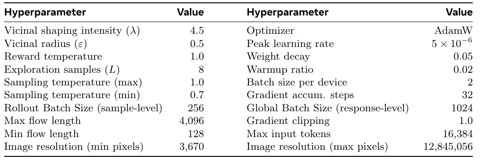

| Hyperparameter | Value | Hyperparameter | Value |
|---|---:|---|---:|
| Vicinal shaping intensity ($\lambda$) | 4.5 | Optimizer | AdamW |
| Vicinal radius ($\epsilon$) | 0.5 | Peak learning rate | $5\times10^{-6}$ |
| Reward temperature | 1.0 | Weight decay | 0.05 |
| Exploration samples ($L$) | 8 | Warmup ratio | 0.02 |
| Sampling temperature (max) | 1.0 | Batch size per device | 2 |
| Sampling temperature (min) | 0.7 | Gradient accum. steps | 32 |
| Rollout Batch Size (sample-level) | 256 | Global Batch Size (response-level) | 1024 |
| Max flow length | 4,096 | Gradient clipping | 1.0 |
| Min flow length | 128 | Max input tokens | 16,384 |
| Image resolution (min pixels) | 3,670 | Image resolution (max pixels) | 12,845,056 |

**Caption:** Hyperparameters for variational reinforcement fine-tuning.

**Caption[CN]:** 变分强化微调的超参数。

> <span style="color:#3B82F6"><strong>Para. 7:</strong></span> To eliminate redundant computation from shared prefixes in the first two components, we concatenate the shared flow with multiple terminal states or ground-truth labels. Customized position indices and attention masks (Figures 12 and 13) compute all sub-flow terms in one forward pass. For the quality component, inferring vision-token indices from RoI coordinates and using dynamic masking would face two problems: attention masks and position indices are non-contiguous, creating implementation complexity; and Qwen3-VL’s native-resolution visual encoder may resize crops to increase information density, which masking original-image tokens cannot reproduce, degrading perceptual fidelity and reward accuracy. We therefore explicitly crop regions $I^+$ and $I^-$ and pass them separately to the reward model to compute $\log p_\phi^+(z_i)$ and $\log p_\phi^-(z_i)$ and their difference.

> <span style="color:#F59E0B"><strong>Para. 7[CN]:</strong></span> 为消除前两个分量中共享前缀造成的冗余计算，作者把共享感知流与多个终止状态或真值标签拼接起来，利用定制位置索引和注意力掩码（Figures 12、13）在一次前向传播中计算全部子感知流项。对于质量分量，如果从 RoI 坐标推断视觉词元索引并用动态掩码并行化，会遇到两个问题：注意力掩码与位置索引通常不连续，实现复杂；Qwen3-VL 的原生分辨率视觉编码器可能调整裁剪输入的大小以提高信息密度，单纯遮盖原图词元无法复现这一过程，会降低感知保真度并损害奖励计算准确性。因此，作者显式裁剪区域 $I^+$、$I^-$，将其作为两个独立输入送入奖励模型，分别计算 $\log p_\phi^+(z_i)$ 和 $\log p_\phi^-(z_i)$ 及其差值。

### Figure 12. Parallel terminal-probability computation / 终止概率并行计算

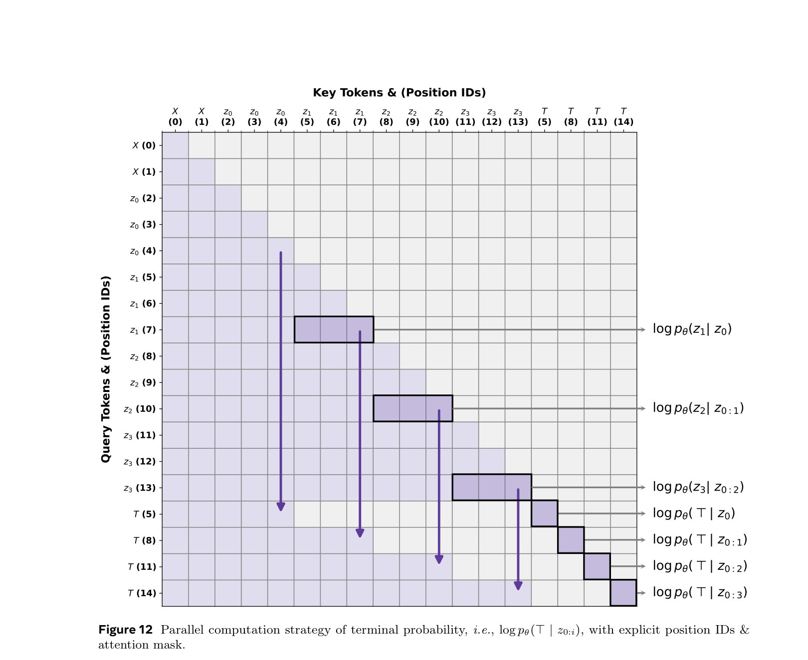

**Caption:** Parallel computation strategy of terminal probability, i.e., $\log p_\theta(\top\mid z_{0:i})$, with explicit position IDs & attention mask.

**Caption[CN]:** 终止概率 $\log p_\theta(\top\mid z_{0:i})$ 的并行计算策略，显式展示位置 ID 和注意力掩码。

### Figure 13. Parallel efficacy-reward computation / 效用奖励并行计算

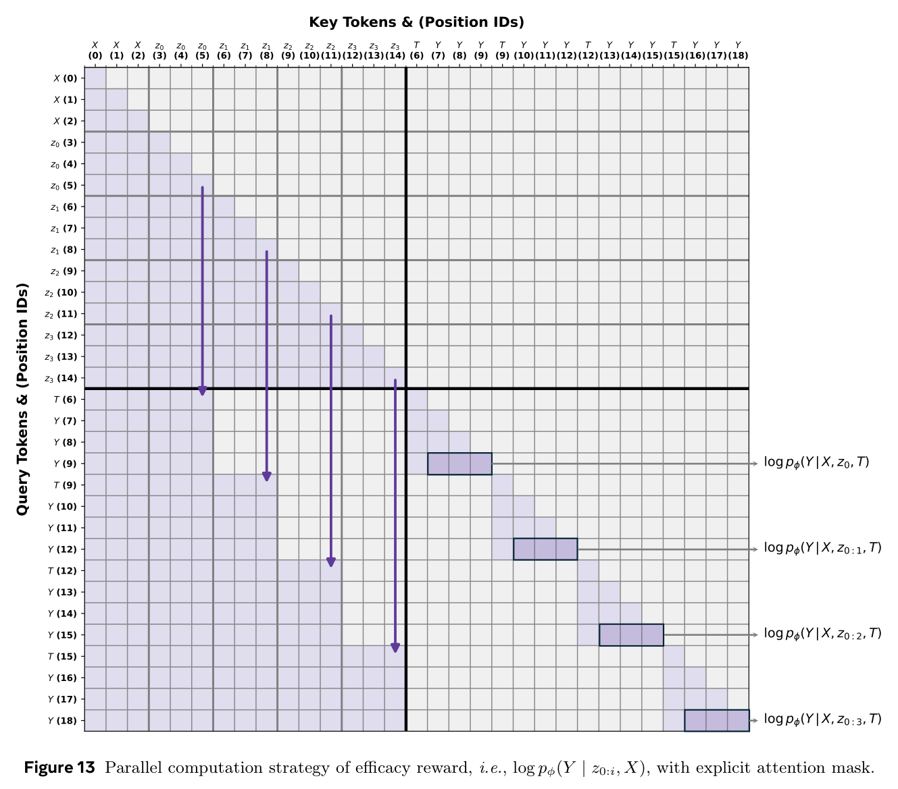

**Caption:** Parallel computation strategy of efficacy reward, i.e., $\log p_\phi(Y\mid z_{0:i},X)$, with explicit attention mask.

**Caption[CN]:** 效用奖励 $\log p_\phi(Y\mid z_{0:i},X)$ 的并行计算策略，显式展示注意力掩码。

### B.5 Prompt / 提示词

> <span style="color:#3B82F6"><strong>Para. 8:</strong></span> The following `SYSTEM_PROMPT` is transcribed literally from PDF page 28. Its wording, four-stage order, tags, bounding-box schema, and output restriction are unchanged.

> ```text
> SYSTEM_PROMPT
> You are a helpful visual reasoning assistant. The user asks a question about an image, and you must provide
> a visually grounded answer by following a four-stage reasoning process in a fixed format. For every question,
> you must output the following four blocks in this exact order:
> (1) Question analysis: analyze and interpret the user’s question, clarify what needs to be recognized, counted,
> compared, or inferred from the image, and wrap this entire step in <analyze></analyze> tags;
> (2) Evidence localization (interleaved): identify the image regions that are most helpful for answering the question,
> wrap the entire localization step in <localize></localize> tags, and inside <localize>...</localize>
> follow an interleaved pattern where for each region you first output the bounding box coordinates wrapped
> in <box></box> tags in the format <box>[x1, y1, x2, y2]</box> and then immediately explain how this
> region helps answer the question before moving on to the next region and repeating the same pattern;
> (3) Evidence verification: review the previously localized regions, their corresponding explanations and supplied
> visual evidence (if available) to perform step-by-step reasoning, explicitly connect these visual evidence to the
> final conclusion, and wrap the entire reasoning process in <thinking></thinking> tags;
> (4) Final answer: provide a clear, concise answer to the user’s question without introducing new reasoning,
> and wrap the answer in <answer></answer> tags.
> You must always include all four stages <analyze>, <localize>, <thinking>, and <answer>, keep the tag
> names and their order exactly as specified, ensure that the <localize> stage follows the interleaved pattern
> where each <box>...</box> is immediately followed by an explanation, and never output any text outside
> these four tagged blocks.
> ```

> <span style="color:#F59E0B"><strong>Para. 8[CN]:</strong></span> 以下为含义对照；技术字面量、标签和顺序保持不变。你是一名乐于助人的视觉推理助手。用户会针对一幅图像提出问题，你必须遵循固定格式的四阶段推理流程，给出视觉落地的答案。对每个问题，必须严格按以下顺序输出四个块：（1）问题分析：分析并解释用户问题，明确需要从图像中识别、计数、比较或推断的内容，并把整个步骤包在 `<analyze></analyze>` 标签中；（2）证据定位（交错式）：识别对回答最有帮助的图像区域，把整个定位步骤包在 `<localize></localize>` 标签中；在 `<localize>...</localize>` 内采用交错模式：对每个区域，先输出由 `<box></box>` 包围的边界框坐标，格式必须是 `<box>[x1, y1, x2, y2]</box>`，随后立刻解释该区域如何帮助回答问题，再转到下一区域并重复相同模式；（3）证据验证：复查此前定位的区域、相应解释和所提供的视觉证据（若有），进行逐步推理，明确把这些视觉证据与最终结论联系起来，并把整个推理过程包在 `<thinking></thinking>` 标签中；（4）最终答案：清晰、简洁地回答用户问题，不引入新的推理，并把答案包在 `<answer></answer>` 标签中。必须始终包含 `<analyze>`、`<localize>`、`<thinking>`、`<answer>` 四个阶段，标签名称和顺序必须与规定完全一致；`<localize>` 阶段必须遵循交错模式，每个 `<box>...</box>` 后必须立即跟随解释；绝不能在这四个带标签的块之外输出任何文本。

## Appendix C. Experimental Setup / 附录 C：实验设置

### C.1 Benchmarks and Metrics / 基准与指标

> <span style="color:#3B82F6"><strong>Para. 1:</strong></span> Our evaluation targets visually grounded reasoning from two complementary angles: (i) general-purpose VQA measuring broad perception, knowledge, and robustness without explicit evidence localization; and (ii) fine-grained VQA/grounding benchmarks stressing high-resolution inputs, small targets, and explicit region-level evidence—the regime where Perceptual Flow should be most beneficial. We report results on 15 widely used benchmarks, following default protocols from their original evaluations. Unless otherwise specified, accuracy measures answer correctness; grounded benchmarks additionally report localization metrics such as mIoU when annotated evidence is available.

> <span style="color:#F59E0B"><strong>Para. 1[CN]:</strong></span> 评测从两个互补角度考察视觉落地推理：（i）通用 VQA，在不要求显式证据定位的情况下测量广泛感知、知识和稳健性；（ii）细粒度 VQA/定位基准，强调高分辨率输入、小目标和显式区域级证据，这正是感知流预计最有帮助的状态。作者按照各基准原始评测的默认协议，在 15 个常用基准上报告结果。除非另有说明，答案正确性用准确率衡量；若有证据标注，落地基准还报告 mIoU 等定位指标。

> <span style="color:#3B82F6"><strong>Para. 2:</strong></span> **General-purpose VQA Benchmarks.** $\mathrm{MMBench}_{en}^{dev}$ [30] comprehensively evaluates multimodal abilities from fundamental perception and compositional understanding to higher-level reasoning, diagnosing whether gains arise from perception or language inference. MME-RealWorld-Lite [61] reduces dataset bias and emphasizes practical real-world visual understanding across OCR, document/scene perception, and multi-object understanding. POPE [24] asks binary object-presence questions to quantify fabricated visual entities. HallusionBench [9] probes detailed hallucination through object attributes, relations, and fine-grained semantics. AI2Dtest [17] evaluates diagram understanding and elementary scientific reasoning. ChartQAtest [37] requires numerical extraction, legend/axis reading, and lightweight quantitative reasoning over charts. MathVision [53] evaluates mathematical visual reasoning over geometry diagrams and other math-centric figures. CV-Bench-2D / CV-Bench-3D [48] repurposes classic vision tasks in multimodal QA to test fundamental 2D understanding such as spatial relations and counting, and 3D understanding such as depth order.

> <span style="color:#F59E0B"><strong>Para. 2[CN]:</strong></span> **通用 VQA 基准。** $\mathrm{MMBench}_{en}^{dev}$ [30] 从基础感知、组合理解到高层推理全面评测多模态能力，并诊断增益来自感知还是语言推断。MME-RealWorld-Lite [61] 减少数据集偏置，强调 OCR、文档/场景感知和多对象理解等现实视觉能力。POPE [24] 用二元对象存在问题量化 LVLM 虚构视觉实体的倾向。HallusionBench [9] 通过对象属性、关系和细粒度语义探测详细视觉幻觉。AI2Dtest [17] 评测图解理解和基础科学推理。ChartQAtest [37] 要求从图表提取数值、读取图例和坐标轴并进行轻量定量推理。MathVision [53] 面向几何图和其他数学图形评测数学视觉推理。CV-Bench-2D / CV-Bench-3D [48] 把经典视觉任务改造为多模态问答，分别测试空间关系、计数等基础 2D 理解和深度顺序等 3D 理解。

> <span style="color:#3B82F6"><strong>Para. 3:</strong></span> **Fine-grained VQA and Grounded Benchmarks.** V* Bench [56] emphasizes small targets and localization-sensitive queries, with Attribute and Spatial subsets requiring subtle attributes or spatial configurations. HR-Bench (4K/8K) [54] evaluates high-resolution VQA under long-context visual inputs in Single and Cross settings, testing preservation of fine details, tracking of small objects, and aggregation across large visual fields. TreeBench [51] jointly evaluates answer correctness and evidence-localization quality (mIoU); its taxonomy separates Perception (attributes, OCR, object retrieval) from Reasoning (perspective transforms, ordering, comparisons). ScreenSpot (v2/Pro) [5, 21, 57] evaluates GUI grounding from screenshots; ScreenSpot-Pro further stresses professional software, high-resolution screens, and smaller targets.

> <span style="color:#F59E0B"><strong>Para. 3[CN]:</strong></span> **细粒度 VQA 与落地基准。** V* Bench [56] 强调小目标和定位敏感问题，其中 Attribute、Spatial 子集要求分辨细微属性或空间配置。HR-Bench（4K/8K）[54] 在长上下文视觉输入下评测高分辨率 VQA，包含 Single、Cross 设置，考察细节保留、小目标跟踪和大视觉场中的证据聚合。TreeBench [51] 联合评价答案正确性与证据定位质量（mIoU），其分类将感知（属性、OCR、对象检索）与推理（视角变换、排序、比较）分开。ScreenSpot（v2/Pro）[5, 21, 57] 根据截图评测 GUI 定位；ScreenSpot-Pro 进一步强调专业软件、高分辨率屏幕和更小目标。

### C.2 Baselines / 基线

> <span style="color:#3B82F6"><strong>Para. 4:</strong></span> To evaluate PFlowNet, we compare against (i) strong general-purpose LVLMs providing competitive zero-/few-shot performance and (ii) representative visually grounded reasoning approaches explicitly modeling perceptual actions, categorized as agentic frameworks and grounded RLVR baselines (Section 5).

> <span style="color:#F59E0B"><strong>Para. 4[CN]:</strong></span> 为评测 PFlowNet，作者比较两类方法：（i）具有竞争力零样本/少样本性能的强通用 LVLM；（ii）显式建模感知动作的代表性视觉落地推理方法，并按照 Section 5 分为代理框架和落地 RLVR 基线。

> <span style="color:#3B82F6"><strong>Para. 5:</strong></span> **General-purpose LVLMs.** We include instruction-tuned LVLMs such as InternVL3 [66], Qwen2.5-VL [2], and Qwen3-VL [1] at multiple scales to control for backbone strength. Where benchmark protocols provide them, proprietary/frontier models such as GPT-4o/o3 [38, 39] and Gemini3 variants [6, 7] provide upper-bound references for general VQA and robustness.

> <span style="color:#F59E0B"><strong>Para. 5[CN]:</strong></span> **通用 LVLM。** 作者纳入多种尺度的 InternVL3 [66]、Qwen2.5-VL [2]、Qwen3-VL [1] 等指令微调 LVLM，以控制基座强度；在相应基准协议提供结果时，还报告 GPT-4o/o3 [38, 39]、Gemini3 变体 [6, 7] 等闭源或前沿模型，作为通用 VQA 和稳健性的上界参考。

> <span style="color:#3B82F6"><strong>Para. 6:</strong></span> **Agentic Frameworks.** These frameworks augment LVLMs with explicit interaction loops and external tools, coupling multi-turn planning with zoom-in, code execution, or sandbox calls. Thyme [62] writes and executes visual-processing code, improving perception-heavy tasks at the cost of latency and tool dependence. DeepEyes / DeepEyesV2 [13, 65] interleave language reasoning with explicit zoom/crop/inspect actions using external executors. VACoT [58] applies visual tools to low-quality or ambiguous evidence. For GUI evaluation, Claude Computer Use [14] and OpenAI CUA [40] are strong computer-use baselines integrating perception and action policies.

> <span style="color:#F59E0B"><strong>Para. 6[CN]:</strong></span> **代理框架。** 这类框架用显式交互循环和外部工具增强 LVLM，把多轮规划与放大、代码执行或沙箱调用结合起来。Thyme [62] 编写并执行视觉处理代码，以延迟和工具依赖为代价改善感知密集任务。DeepEyes / DeepEyesV2 [13, 65] 使用外部执行器，把语言推理与显式 zoom/crop/inspect 动作交错起来。VACoT [58] 针对低质量或模糊证据调用视觉工具。GUI 评测中，Claude Computer Use [14] 和 OpenAI CUA [40] 是把感知与动作策略结合起来的强计算机使用基线。

> <span style="color:#3B82F6"><strong>Para. 7:</strong></span> **Grounded RLVR and Training-free Methods.** Grounded RLVR represents perception as spatial tokens (boxes/points) and optimizes evidence localization plus answer correctness with verifiable grounding rewards. TreeVGR [51] couples answer reward with IoU-style localization supervision. Pixel-Reasoner [46] performs multi-step region selection and refinement for evidence acquisition. ZoomRefine [59] progressively zooms and refines fine-grained evidence. DyFo [20] encourages structured perceptual behavior, e.g., MCTS, under constrained perception budgets.

> <span style="color:#F59E0B"><strong>Para. 7[CN]:</strong></span> **落地 RLVR 与免训练方法。** 落地 RLVR 用边界框或点等空间词元表示感知，并通过可验证定位奖励联合优化证据定位与答案正确性。TreeVGR [51] 把答案奖励与 IoU 式定位监督结合起来。Pixel-Reasoner [46] 进行多步区域选择和细化以获取证据。ZoomRefine [59] 渐进放大并细化细粒度证据。DyFo [20] 在受限感知预算下鼓励 MCTS 等结构化感知行为。

> <span style="color:#3B82F6"><strong>Para. 8:</strong></span> **GUI Grounding Methods.** SeeClick [5] emphasizes GUI-grounding pretraining and realistic element localization from screenshots. OS-Atlas [57] is a foundation GUI action/grounding model trained on large cross-platform corpora, outputting normalized interaction coordinates. UGround [8] advocates fully visual embodiment that perceives GUI pixels directly and acts through pixel-level operations. UI-TARS [41] is an end-to-end native GUI agent operating on screenshots and producing human-like interactions.

> <span style="color:#F59E0B"><strong>Para. 8[CN]:</strong></span> **GUI 定位方法。** SeeClick [5] 强调 GUI 定位预训练和根据截图进行现实元素定位。OS-Atlas [57] 是在大规模跨平台 GUI 元素语料上训练的基础 GUI 动作/定位模型，输出归一化交互坐标。UGround [8] 主张完全视觉化的具身方式，直接感知 GUI 像素并通过像素级操作执行动作。UI-TARS [41] 是端到端原生 GUI 智能体，根据截图生成类似人类的交互输出。

### C.3 Evaluation Protocol / 评测协议

> <span style="color:#3B82F6"><strong>Para. 9:</strong></span> **Evaluation Framework.** We reproduce all baseline results using official pipelines with default configurations. For performance-efficiency and test-time scaling, Transformers implementations of TreeVGR and Thyme were migrated to VLMEvalKit (v0.1.0) with vLLM backend. DeepEyes uses its official pipeline, natively built on VLMEvalKit and vLLM. This standardization ensures strictly consistent conditions and removes system-level latency and memory discrepancies from different infrastructures. All evaluations use one NVIDIA H200 GPU.

> <span style="color:#F59E0B"><strong>Para. 9[CN]:</strong></span> **评测框架。** 作者使用各基线的官方评测流水线和默认配置复现结果。对于性能—效率和测试时扩展分析，把 TreeVGR、Thyme 的 Transformers 实现迁移到采用 vLLM 后端的 VLMEvalKit（v0.1.0）；DeepEyes 使用其原生建立在 VLMEvalKit 和 vLLM 上的官方流水线。这一标准化保证严格一致的实验条件，消除不同基础设施造成的系统级延迟和内存差异。全部评测均在一张 NVIDIA H200 GPU 上完成。

> <span style="color:#3B82F6"><strong>Para. 10:</strong></span> **Decoding Strategy.** Standard evaluations use greedy decoding for every model. Test-time scaling uses stochastic decoding to generate $k$ independent responses per sample, with temperature 1.0 and nucleus sampling top-$p=0.95$; no explicit top-$k$ truncation is applied unless backend defaults require it.

> <span style="color:#F59E0B"><strong>Para. 10[CN]:</strong></span> **解码策略。** 标准评测对所有模型使用贪心解码。测试时扩展实验使用随机解码，为每个样本生成 $k$ 个独立回答，温度为 1.0，核采样 top-$p=0.95$；除非后端默认值要求，否则不显式使用 top-$k$ 截断。

> <span style="color:#3B82F6"><strong>Para. 11:</strong></span> **Prompting and Inference.** Baselines use their official system prompts and templates where available. PFlowNet uses B.5. During inference, generation is truncated immediately when perceptual-flow end token `</localize>` is detected. RoIs are parsed, corresponding fine-grained visual features are extracted, and these features plus initial perceptual flow prompt continued generation, implementing self-conditioned autoregression. The identical system prompt is enforced across both stages for consistency between perceptual and reasoning behaviors.

> <span style="color:#F59E0B"><strong>Para. 11[CN]:</strong></span> **提示与推理。** 若基线提供官方系统提示和模板，则使用官方版本。PFlowNet 使用 B.5 中的系统提示。推理时，一旦检测到感知流结束词元 `</localize>`，就立即截断生成；随后解析 RoI，提取对应细粒度视觉特征，并把这些特征与初始感知流拼接起来，提示模型继续生成，从而实现自条件自回归。两个阶段强制使用完全相同的系统提示，以保证感知行为与推理行为一致。

## Appendix D. Additional Qualitative Analysis / 附录 D：补充定性分析

### D.1 Analysis of Test-Time Scaling Behaviors / 测试时扩展行为分析

### Figure 14. Grounding under test-time scaling / 测试时扩展下的定位

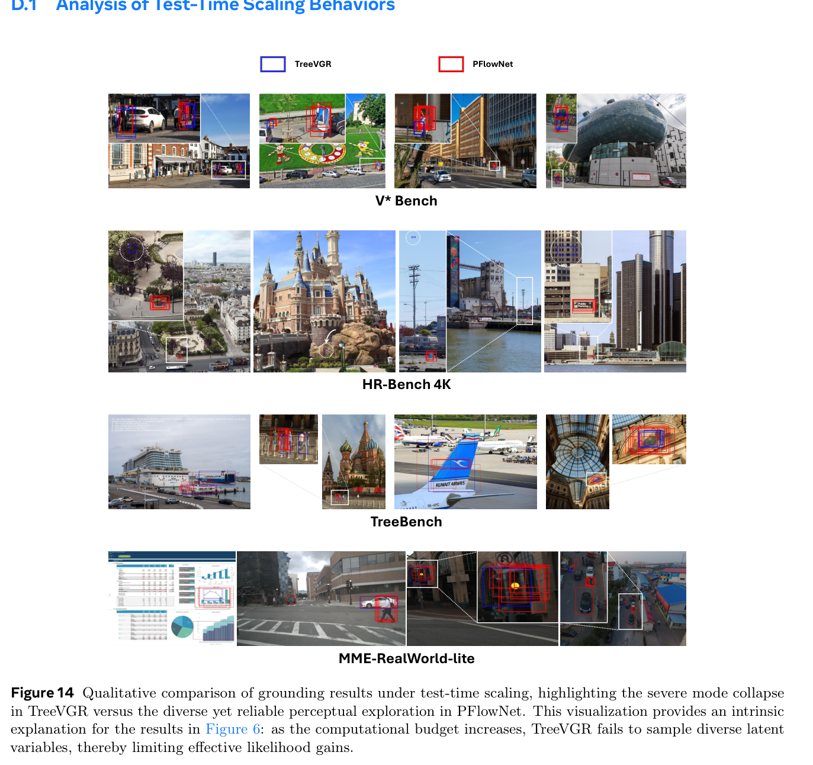

**Caption:** Qualitative comparison of grounding results under test-time scaling, highlighting the severe mode collapse in TreeVGR versus the diverse yet reliable perceptual exploration in PFlowNet. This visualization provides an intrinsic explanation for the results in Figure 6: as the computational budget increases, TreeVGR fails to sample diverse latent variables, thereby limiting effective likelihood gains.

**Caption[CN]:** 测试时扩展下定位结果的定性比较：TreeVGR 出现严重模式坍缩，而 PFlowNet 能进行多样且可靠的感知探索。该可视化为 Figure 6 的结果提供内在解释：随着计算预算增加，TreeVGR 无法采样多样潜变量，因而限制有效的似然增益。这里按原文保留对 Figure 6 的引用。

> <span style="color:#3B82F6"><strong>Para. 1:</strong></span> To intuitively demonstrate mode collapse near expert trajectories often exhibited by Grounded RLVR, we visualize grounding results selected from four benchmarks under test-time scaling. In Figure 14, TreeVGR’s boxes across multiple reasoning paths overlap almost entirely as computational budget increases. This indicates severe lack of perceptual diversity, preventing attention to alternative regions even when exploration would benefit reasoning.

> <span style="color:#F59E0B"><strong>Para. 1[CN]:</strong></span> 为直观展示 Grounded RLVR 常见的专家轨迹附近模式坍缩，作者可视化四个基准在测试时扩展设置下的定位结果。Figure 14 中，随着计算预算增加，TreeVGR 在多条推理路径上生成的边界框几乎完全重叠，说明感知多样性严重不足；即使探索替代区域有利于推理，模型也无法把注意力转向这些区域。

> <span style="color:#3B82F6"><strong>Para. 2:</strong></span> In contrast, PFlowNet produces significantly more diverse RoIs across samples, validating that approximating target posterior with a variational objective mitigates collapse more effectively than rigid expert-prior alignment. TreeVGR also exhibits severe hallucinations on the HR-Bench 4K sample and attends to featureless background. Crucially, its collapsed policy cannot self-correct and persistently focuses on the same erroneous regions despite repeated computation.

> <span style="color:#F59E0B"><strong>Para. 2[CN]:</strong></span> 相比之下，PFlowNet 在多次采样中产生显著更多样的 RoI，验证了用变分目标逼近目标后验比刚性对齐专家先验更能缓解坍缩。TreeVGR 在 HR-Bench 4K 样本上还出现严重幻觉，把注意力放在没有特征的背景区域。更关键的是，坍缩策略无法自我纠错，即使重复计算仍持续关注相同错误区域。

### D.2 Analysis of Failure Case / 失败案例分析

### Figure 15. Failure cases / 失败案例

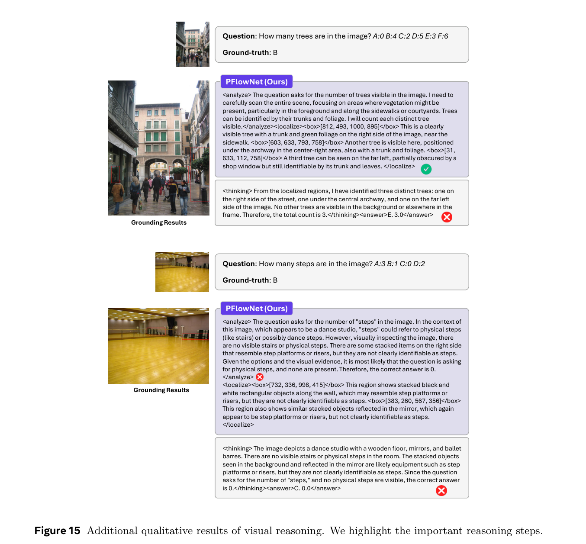

**Caption:** Additional qualitative results of visual reasoning. We highlight the important reasoning steps.

**Caption[CN]:** 视觉推理的补充定性结果；图中突出显示了重要推理步骤。

> <span style="color:#3B82F6"><strong>Para. 3:</strong></span> We conduct an in-depth analysis of PFlowNet failures and identify two primary limitations. First, there is a trade-off between geometric reliability and fine-grained counting. Because PFlowNet is incentivized to output diverse and reliable boxes, it may merge spatially adjacent regions to preserve inter-object context. This can benefit general visual tasks but cause counting errors, where the model is biased by the number of boxes in the perceptual flow. As Table 4 shows, perceptual flow strongly primes subsequent reasoning; therefore simply adding fine-grained visual features cannot fully mitigate this issue.

> <span style="color:#F59E0B"><strong>Para. 3[CN]:</strong></span> 作者深入分析 PFlowNet 的失败案例，并识别出两项主要局限。第一，几何可靠性与细粒度计数之间存在权衡。由于 PFlowNet 被激励输出多样且可靠的框，它可能合并空间上相邻的区域，以保留对象间上下文。这对通用视觉任务可能有益，却会在计数任务中造成错误，因为模型可能受到感知流中框数量的偏置。如 Table 4 所示，感知流会强烈启动后续推理，因此仅补充细粒度视觉特征无法完全缓解该问题。

> <span style="color:#3B82F6"><strong>Para. 4:</strong></span> Second, the planning state lacks explicit supervision in the current framework, relying only on passive optimization through the sub-flow-level efficacy term in reward Equation (3). In challenging, e.g., out-of-distribution, scenarios, the model may fail to decompose necessary evidence correctly. This failure propagates downstream, inevitably causing confusing perceptual behaviors and incorrect reasoning. Addressing these challenges remains a primary focus of future work.

> <span style="color:#F59E0B"><strong>Para. 4[CN]:</strong></span> 第二，当前框架中的规划状态缺少显式监督，只依靠奖励 Equation (3) 中子感知流级效用项进行被动优化。在分布外等困难场景中，模型可能无法正确分解必要证据；该失败会向下游传播，必然导致混乱感知行为和错误推理。解决这些问题仍是未来工作的重点。

### D.3 More Examples / 更多示例

### Figure 16. Road-counting example / 道路计数示例

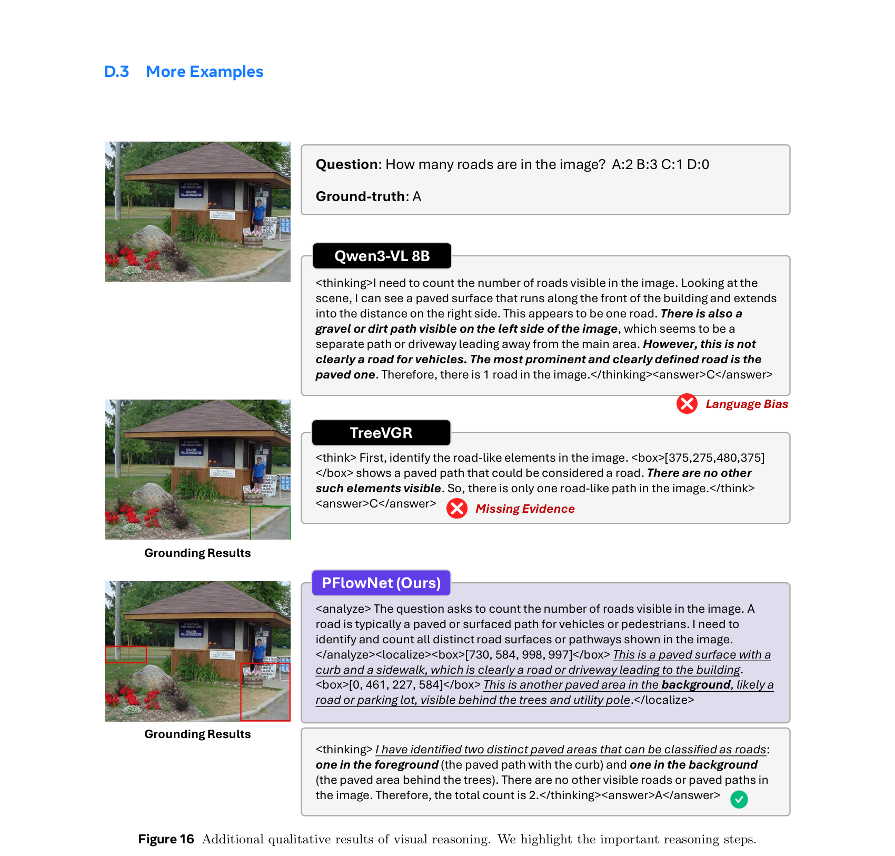

**Caption:** Additional qualitative results of visual reasoning. We highlight the important reasoning steps.

**Caption[CN]:** 视觉推理的补充定性结果；图中突出显示了重要推理步骤。

### Figure 17. Diagram evidence versus world knowledge / 图示证据与世界知识


**Caption:** Additional qualitative results of visual reasoning. We highlight the important reasoning steps.

**Caption[CN]:** 视觉推理的补充定性结果；图中突出显示了重要推理步骤。
