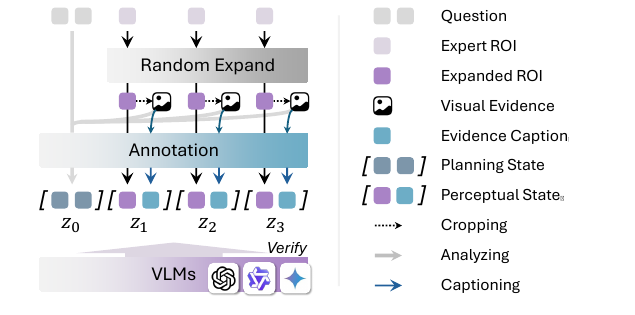
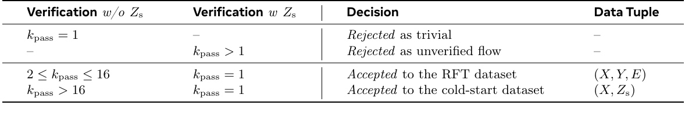
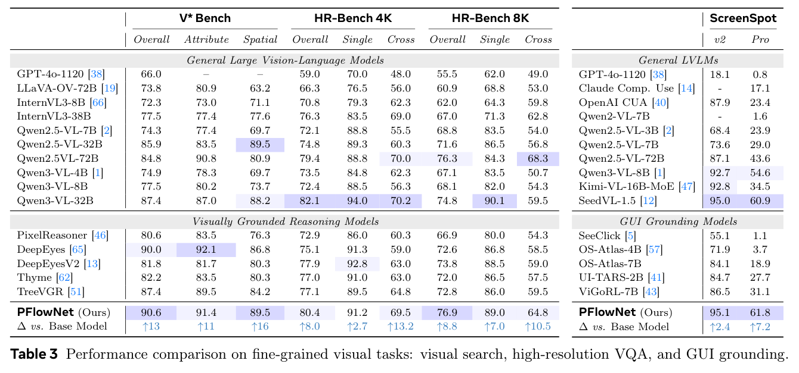
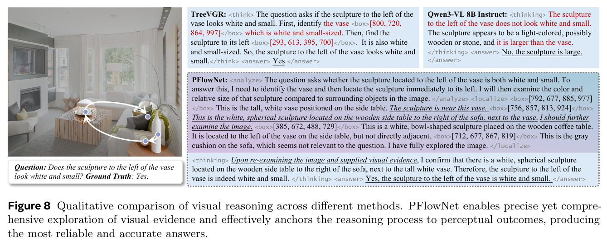
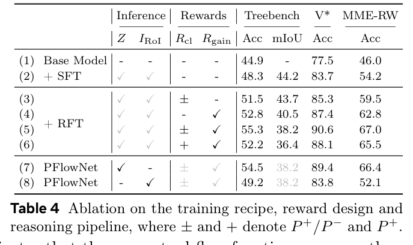
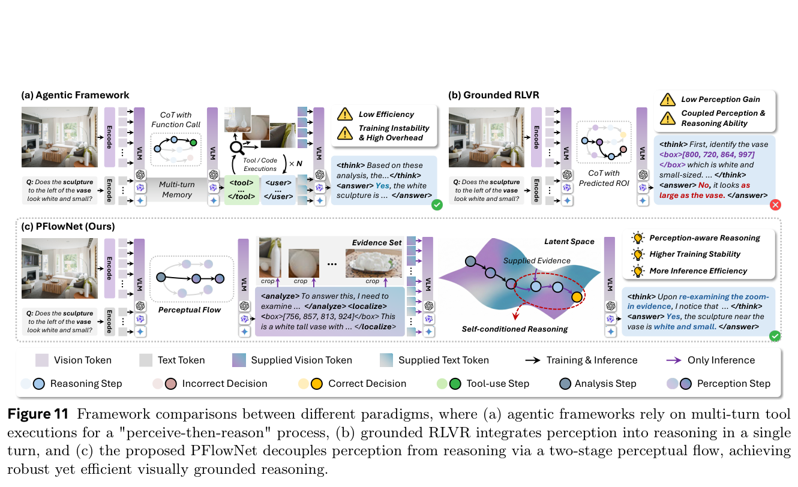

---
tags:
  - papers/reasoning/train
  - papers/vision-language-model
aliases:
  - PFlowNet
  - Perceptual Flow Network
date: 2026-05-04
doi: 10.48550/arXiv.2605.02730
arxiv_id: 2605.02730
---

# Perceptual Flow Network for Visually Grounded Reasoning

## 核心信息

- 标题: Perceptual Flow Network for Visually Grounded Reasoning
- 标题翻译: 面向视觉落地推理的感知流网络
- 作者: Yangfu Li, Yuning Gong, Hongjian Zhan, Teng Li, Yuanhuiyi Lyu, Tianyi Chen, Qi Liu, Ziyuan Huang, Zhihang Zhong, Dandan Zheng, Yue Lu
- 机构: 华东师范大学、四川大学、香港科技大学、上海交通大学、蚂蚁集团、上海人工智能实验室
- 发表时间: 2026-05-04
- 发表渠道: ICML 2026
- DOI: 10.48550/arXiv.2605.02730
- arXiv: 2605.02730
- 论文链接: https://arxiv.org/abs/2605.02730
- 数据 / 资源: 论文构建约 45k 冷启动样本与约 42k 强化微调样本，正文未提供公开下载地址
- 论文类型: 训练方法论文

## 原文摘要翻译

尽管大型视觉语言模型已经取得显著进展，标准最大似然估计等通用优化目标仍无法约束视觉轨迹，因而容易产生语言偏置和幻觉。现有方法通常引入视觉专家提供的几何先验作为额外监督以缓解这一问题，但这种监督往往并非最优：它偏向几何精度，却只能提供有限的推理效用。为弥合这一差距，作者提出感知流网络 `PFlowNet`。该方法放弃对专家先验的刚性对齐，在保持可解释性的同时实现更有效的视觉推理。具体而言，`PFlowNet` 将感知与推理解耦，构成自条件生成过程；随后通过变分强化学习，将多维奖励与邻域几何塑形结合起来，从而在保持视觉可靠性的同时促进面向推理的感知行为。作者进一步给出理论性能保证，并在实验中取得有竞争力的结果，尤其在 `V* Bench` 和 `MME-RealWorld-Lite` 上分别达到 `90.6%` 与 `67.0%`，刷新论文所比较方法中的最佳结果。

## 创新点

1. **把视觉行为显式写成可优化的感知流。** 一条流先包含问题分解与候选证据规划，再包含若干由区域框和证据描述组成的感知状态。这样，训练目标不再只看答案，也能对视觉轨迹的每个前缀施加监督。
2. **将感知生成与答案推理解耦。** 模型先生成感知流，再把流中的文本证据与相应裁剪区域重新编码，用同一模型继续生成答案。这一自条件设计让中间轨迹既能被训练，又能在推理时真正影响输出。
3. **用“推理效用 + 视觉质量”代替单一几何精度。** 质量奖励比较区域内外对证据描述的支持度，效用奖励衡量该流对正确答案的帮助，避免把高交并比直接等同于高质量推理。
4. **用邻域约束替代逐框模仿。** 作者以专家区域为中心定义一个几何邻域，只惩罚越出邻域的轨迹，允许模型在可靠范围内探索包含更多上下文的区域。
5. **给出渐进式训练与理论解释。** 随机扩框、教师合成、验证器过滤、监督冷启动和变分强化微调组成完整训练配方；理想化分析则把标准最大似然和严格专家对齐解释为塑形强度的两个极限。

## 一句话总结

这篇论文最有价值的判断不是“让模型看得更准”，而是“让模型学会为回答问题而看”：专家框只负责圈定可靠范围，最终应优化的是区域证据对推理的实际效用。

## 研究问题

### 从几何精度到推理效用

常见视觉落地训练把检测器或标注框当作黄金中间轨迹，以交并比奖励迫使模型贴近它们。问题在于，对象检测追求边界紧致，而视觉问答经常需要对象、关系和周围语境同时可见。框得最紧可能删除桌面、相邻物体或场景层级信息，形成作者所说的“隧道视野”。

作者先在 `V*` 上做扩框探测：从专家框中心等比例扩大区域，再只向模型提供裁剪证据。结果不是单调的“交并比越高越好”，而是许多样本在较宽区域取得更高准确率。该实验支持一个关键区分：**几何精确性是证据可靠性的代理，但不是推理充分性的代理。**

*图 1：证据框相对专家标注的几何精度与推理准确率并非单调关系；最紧的专家框并不总是最有用。*

### 现有目标的两个极端

标准最大似然只约束最终输出，潜在视觉轨迹可以落到无效区域；严格专家对齐则把轨迹压向检测器的单一路径，虽然可靠，却可能继承其任务偏置。`PFlowNet` 试图在二者之间建立受控探索：有效轨迹可以在专家邻域内有多种形态，但离开视觉支持时会受到惩罚。

*图 2：现有方法把概率质量压向专家轨迹；PFlowNet 同时施加推理效用驱动力与邻域几何约束，在有效支持内寻找更接近理想证据的轨迹。*

这个问题设定本质上是训练目标设计，而不是推理期提示词设计。因此本文应归入 `Train`：核心新意位于数据构造、潜变量目标、奖励函数和强化微调配方。

## 数据与任务定义

### 感知流数据如何构造

训练数据由带问题、答案与专家区域标注的视觉样本组成。作者先对专家区域做随机扩展，再调用 `Gemini3flash` 与 `GPT-4o` 生成规划状态和每个区域的证据描述。随机扩框并不是把扩展规则当作真值，而是主动打破“最紧框唯一正确”的冷启动偏置。

*图 4：感知流合成流水线。专家区域先随机扩展，教师模型据问题与区域生成规划状态和证据描述，随后由验证器筛选。*

验证阶段比较两种条件：不提供合成流时直接回答，以及提供流和裁剪证据后回答。若样本本来就很容易，则不进入后续训练；若加入流仍不能稳定解答，则视为流不可靠；只有加入流后可解的样本才被保留，并按所需采样预算切分为冷启动集和强化微调集。

*表 1：验证器过滤与难度切分规则；`k_pass` 表示验证器首次得到正确答案所需的最小采样预算。*

完整流水线从约 `95k` 个问答样本出发，其中约 `53k` 个样本进入感知流合成，最终形成约 `45k` 个高质量冷启动样本和约 `42k` 个强化微调样本。论文还对 `15` 个评测基准进行了问答文本重叠检查，报告训练数据与测试集零重叠。

### 评测任务与指标

评测覆盖两组能力。通用复杂视觉推理使用 `TreeBench` 与 `MME-RealWorld-Lite`，前者强调真实场景、关系和多类问题。

细粒度能力使用 `V* Bench`、`HR-Bench` 和两个 `ScreenSpot` 版本，分别关注视觉搜索、高分辨率问答和图形界面元素定位。

主要指标是准确率；图形界面定位按基准规定判断预测点或区域是否命中目标。测试时扩展实验进一步报告 `Pass@k`，用于观察多次采样是否产生互补感知轨迹。

### 训练配置

监督冷启动以 `Qwen3-VL-8B-Instruct` 为基座，在 `16` 张 `H200` 上训练 `3` 个周期，全局批量为 `256`，峰值学习率为 `1e-5`。强化微调同样使用 `16` 张 `H200`，训练 `5` 个周期，采用 `vLLM`、`TRL`、混合数据并行和 `ZeRO-3`；奖励模型在各设备上完整复制。

*表 6：变分强化微调的主要超参数，包括塑形强度 `4.5`、邻域半径 `0.5`、每样本 `8` 条探索轨迹与响应级全局批量 `1024`。*

## 方法主线

### 感知流表征

给定图像与指令组成的输入 $X$，感知流记为 $Z=(z_0\rightarrow z_1\rightarrow\cdots\rightarrow z_K)$。其中 $z_0$ 是规划状态，负责分解问题并指出候选证据。

每个后续状态 $z_k=\langle r_k,c_k\rangle$ 由相对坐标区域 $r_k$ 与描述该区域的证据文本 $c_k$ 组成。实现中，规划状态由 `<analyze>` 标签包围，感知状态由 `<localize>` 标签包围。

这个表征把“看哪里”和“看到了什么”绑定在同一状态里。区域使轨迹可落地，描述使轨迹可被语言模型读写；规划状态则为多区域链条提供全局意图。

### 机制流程

1. **输入与规划：** 模型接收图像和问题，先生成规划状态，识别回答所需的对象、属性、关系与候选区域。
2. **生成感知流：** 模型逐步生成区域坐标和证据描述，得到一条可解释的中间轨迹；训练时对完整轨迹及其共享前缀计算奖励。
3. **回注视觉证据：** 系统按预测区域裁剪原图，经视觉编码器提取放大后的特征，再与原输入和文本感知流拼接送入同一模型。
4. **输出答案并更新：** 推理时模型在自条件上下文中生成最终答案；训练时监督冷启动学习合成流，变分强化微调再根据质量、效用与几何邻域更新轨迹分布。

*图 3：PFlowNet 的两阶段结构。第一阶段生成感知流，第二阶段把文本流与相应区域视觉特征共同用于答案推理。*

两阶段联合分布可写为：

$$
p_\theta(Y,Z\mid X)=p_\theta(Z\mid X)\,p_\theta\left(Y\mid Z,\langle X,I_{\mathrm{RoI}}\rangle\right).
$$

工程上，这意味着策略训练主要塑造第一项的轨迹分布，而第二项检验这些轨迹能否在加入裁剪特征后支持正确答案。

### 变分强化微调

作者把感知流视为潜变量，并采用子轨迹平衡目标。与只给完整序列末端一个回报不同，该目标在任意共享前缀和子轨迹之间建立前向概率、后向概率与流量的一致性，因此可以给长感知链提供更稠密的学习信号，也允许多个有效轨迹同时保留概率质量。

对任意流前缀，未塑形的多维奖励可概括为：

$$
R(z_{0:k}^{\top})=\left[\prod_{i=1}^{k}\frac{p_\phi(c_i\mid I_{r_i})}{p_\phi(c_i\mid I\setminus I_{r_i})}\right]p_\phi(Y\mid z_{0:k}^{\top},X).
$$

乘积中的比值是视觉质量项：如果描述确实由区域内部支持，而不是由区域外背景或语言先验支持，该比值会更大。最后一项是推理效用：流加入后，冻结奖励模型对正确答案赋予的似然越高，轨迹越值得保留。

### 邻域几何塑形

仅优化效用可能诱导奖励投机，例如生成语言上有帮助却没有视觉依据的区域。作者以预测区域集与专家区域集之间的对称 `Chamfer-IoU` 距离定义邻域，并对越界轨迹乘以能量权重：

$$
\omega_\lambda(z_{0:k},E)=\exp\left[-\lambda\,\mathbf{1}\left(d_{\mathrm{IoU}}(r_{1:k},E)>\epsilon\right)\right],\qquad R_\lambda=R\cdot\omega_\lambda.
$$

这里的关键不是把区域拉回专家框，而是只在距离超过 $\epsilon$ 时衰减回报。$\epsilon$ 控制允许探索的空间范围，$\lambda$ 控制越界惩罚强度。论文采用 $\lambda=4.5$、$\epsilon=0.5$。

### 理论结论应怎样理解

定理 `3.1` 在有效支持规则性、模型足够可表达且训练达到全局最优等假设下，给出学习分布与理想有效轨迹后验之间的总变差距离上界。其极限解释很清楚：$\lambda\rightarrow0$ 时，几何约束消失，方法退化为标准最大似然；$\lambda\rightarrow\infty$ 时，所有邻域外轨迹都被压制，方法趋近严格专家对齐，其上限受专家偏差限制。

定理 `3.4` 进一步在作者假设下给出相对两种极端目标的性能改进保证。它证明的是一个理想化折中机制可以存在，不是对有限模型、实际优化误差或奖励模型偏差的无条件保证。

## 关键结果

### 通用视觉推理

论文在 `TreeBench` 和 `MME-RealWorld-Lite` 上比较多种闭源模型、开源基座与视觉代理方法。`PFlowNet` 的 `TreeBench` 总体准确率为 `55.3%`，比 `Qwen3-VL-8B` 基座的 `44.9%` 高 `10.4` 个百分点；在 `MME-RealWorld-Lite` 上达到 `67.0%`，论文报告相对基座提高 `18.4` 个百分点。

*表 2：TreeBench 与 MME-RealWorld-Lite 主结果；PFlowNet 在两组总体指标上均取得表中最佳值。*

作者还报告，`PFlowNet` 相对最近竞争方法在两个总体指标上分别领先 `5.3` 与 `12.6` 个百分点，并在 `19` 个子任务中的 `17` 个达到最佳。这个结果表明增益不是集中在一个视觉搜索类别，但它仍属于同一组静态图像评测，不能直接外推到视频或交互任务。

### 细粒度视觉能力

`PFlowNet` 在 `V* Bench` 达到 `90.6%`，相对基座的 `77.5%` 提升 `13.1` 个百分点。`HR-Bench` 的 `4K` 与 `8K` 设置分别为 `80.4%` 和 `76.9%`。

图形界面定位方面，`ScreenSpot v2` 与专业版本分别达到 `95.1%` 和 `61.8%`。

*表 3：视觉搜索、高分辨率问答和图形界面定位结果；PFlowNet 在不同细粒度任务上均保持强竞争力。*

*图 8：定性比较显示，PFlowNet 往往保留目标与必要上下文，而严格定位或无约束推理更容易遗漏关系证据。*

### 效率与测试时扩展

与多轮调用工具的代理方法相比，`PFlowNet` 把感知行为内化到一次结构化生成中。论文的性能—效率图显示，它使用较短上下文和较低时延取得更高准确率。这一优势来自流程差异，因此更适合解释为“单位推理预算下更有效”，而不是跨所有部署环境的绝对速度保证。

*图 6：性能、上下文长度与时延的折中；PFlowNet 位于较高准确率和较低推理成本区域。*

`Pass@k` 曲线提供另一条证据：随着采样次数从 `1` 增加到 `8`，`PFlowNet` 的可解样本比例持续上升，而严格专家引导方法增长更平，作者将后者解释为轨迹模式坍缩。该结果与子轨迹目标鼓励多样有效路径的设计一致，但 `Pass@k` 本身仍需要额外采样成本。

*图 7：不同采样预算下的 Pass@k；PFlowNet 随采样数增加保持更明显的收益。*

### 消融与跨尺度结果

| 训练设置 | TreeBench | V* Bench | MME-RW |
|---|---:|---:|---:|
| 基座模型 | 44.9 | 77.5 | 46.0 |
| 仅监督冷启动 | 48.3 | 83.7 | 54.2 |
| 完整 PFlowNet | **55.3** | **90.6** | **67.0** |
| 去掉显式感知流 | 49.2 | 83.8 | 52.1 |

监督冷启动已经带来稳定增益，说明合成感知流具有可学习信号；完整强化微调再显著提高所有三项指标。最有辨识力的是去掉感知流的实验：即使仍可使用区域视觉特征，结果也大幅下降，说明关键不是单纯放大图像，而是让区域选择、证据语义和最终推理通过显式轨迹连接起来。

*表 4：训练配方、奖励设计、几何塑形以及感知流结构的系统消融。*

不同模型规模上的结果也保持一致：`Qwen3-VL` 的 `4B` 与 `32B` 版本在监督冷启动后提升，继续进行强化微调后又进一步提升。这说明方法不是只修补 `8B` 基座的偶然缺陷，但论文没有展示不同架构家族上的训练迁移。

*表 5：PFlowNet 在 Qwen3-VL 4B、8B 与 32B 上的跨尺度收益。*

## 深度分析

### 真正贡献是“支持约束”，不是扩框技巧

最容易误读的地方，是把这篇论文简化成“把检测框扩得大一点”。作者的探测实验恰恰说明固定扩框规则不可行，因为最优上下文具有样本依赖性。方法真正做的是把专家框从**目标轨迹**降级为**支持集中心**：它仍提供防幻觉的几何锚点，却不再决定唯一可接受的感知行为。

*图 10：邻域半径与塑形强度的消融表明，约束过弱会放任无效探索，约束过强则重新继承专家偏差。*

这也解释了理论中的两个极限。零塑形等于完全相信模型自身后验，无限塑形等于完全相信专家。有效配置位于中间，并且必须满足专家邻域与真实有效支持有足够重叠。若专家从一开始就漏掉关键对象，邻域方法仍可能把搜索限制在错误区域附近。

### 文本流为何比裁剪特征更关键

显式感知流承担三种功能：规划状态记录任务分解，区域坐标建立视觉落地，证据描述把局部视觉转换为后续推理可读的语义。只有裁剪特征而没有文本流时，模型得到额外像素，却缺少“为什么看这里、这里支持什么”的结构化桥梁。表 `4` 的大幅降分支持这一解释。

因此，`PFlowNet` 更接近一种可学习的视觉思维轨迹，而不是附加的图像增强模块。它与多轮代理的共同点是显式搜索证据，差异在于搜索策略通过训练内化，并在单一自回归上下文中完成。

*图 11：多轮工具代理、严格视觉轨迹对齐与 PFlowNet 的范式比较；PFlowNet 用内化的感知流替代外部多轮编排。*

### 奖励设计的优点与风险

区域内外似然比是一个聪明的对照：若描述在遮掉目标区域后仍同样容易生成，它很可能只是语言常识或全局背景，而非区域特异证据。正确答案似然则把“证据是否准确”与“证据是否有用”分开衡量。

但这两个量都由冻结奖励模型估计。如果奖励模型与策略共享初始化，它们可能共享视觉盲点；高似然也不等于因果必要证据。论文的结果证明该代理信号在所测基准上有效，却没有证明它能识别所有奖励投机或伪相关。

### 结果真正支持什么

证据链条相当完整：扩框探测建立问题动机，主结果证明整体有效，奖励与结构消融定位关键组件，邻域超参数实验验证折中形状，效率与 `Pass@k` 说明方法不是仅靠更长输出换分。综合来看，论文较有说服力地证明了**在视觉问答与定位基准上，受专家支持约束的效用导向轨迹学习优于答案级最大似然和逐框专家模仿**。

它没有证明几何精度不重要，也没有证明模型发现了人类意义上的真实因果证据。更准确的结论是：几何精度应作为可靠性约束，与任务效用共同优化。

## 局限

1. **理论保证依赖理想化假设。** 有效支持集的规则性、专家邻域覆盖、策略可表达性与全局最优在实际训练中都难以验证；定理更适合解释超参数极限，而不是预测实际绝对收益。
2. **仍受专家区域约束。** 邻域塑形放松了刚性模仿，却没有消除专家先验。如果标注系统性遗漏背景关系或给出错误对象，模型的探索空间仍可能被错误中心牵制。
3. **奖励模型可能共享偏差。** 质量与效用都由冻结模型似然近似，跨奖励模型一致性实验缺席，奖励投机也没有得到单独度量。
4. **训练资源较高。** 两阶段训练均使用 `16` 张 `H200`，强化阶段还需多轨迹采样和完整复制奖励模型；总训练时长、总算力与能耗数据缺席，使复现成本难以精确判断。
5. **固定流程并非对所有问题都划算。** 作者明确指出，规划、定位、描述、回答的固定格式会给简单问题和部分理工推理题增加开销，并可能挤占直接求解容量；当前没有自适应路由。
6. **任务覆盖仍以静态图像为主。** 结果不能直接说明方法适用于长视频、三维场景、连续导航或机器人交互；这些场景还需要时间段、三维区域或动作级感知流。
7. **数据构造依赖闭源教师。** `Gemini3flash` 与 `GPT-4o` 参与轨迹合成，完全开源教师的等价实验缺席，全部训练资源也没有公开下载地址。

## 我的笔记

这篇论文值得复用的抽象是：**把专家标注从逐步动作真值改造成可行域约束。** 在许多训练问题里，专家监督可靠但目标错位，例如检测框对定位可靠，却不保证问答充分；最合理的用法可能不是行为克隆，而是限定策略不要走得太远，再让任务回报决定可行域内的具体路径。

复现时我会优先检查四件事：第一，随机扩框后的教师流是否真的提高答案可解性；第二，区域内外似然比是否经过长度归一化并具有稳定数值范围；第三，共享前缀的奖励与终止概率能否并行计算；第四，$\lambda$ 与 $\epsilon$ 是否需要按数据源、区域数量或模型不确定性动态调整。

一个自然的后续方向是学习样本级邻域：用专家置信度、视觉不确定性或多专家一致性预测 $\epsilon(X)$，让高质量专家框提供更紧约束，让疑似漏框样本拥有更宽探索空间。另一个方向是加入自适应路由，只在直接回答置信度不足时启动感知流，从而保留复杂问题收益而减少简单问题开销。

## 引用

Li, Yangfu, et al. “Perceptual Flow Network for Visually Grounded Reasoning.” Accepted to the 43rd International Conference on Machine Learning, 2026. arXiv:2605.02730. DOI: 10.48550/arXiv.2605.02730.
