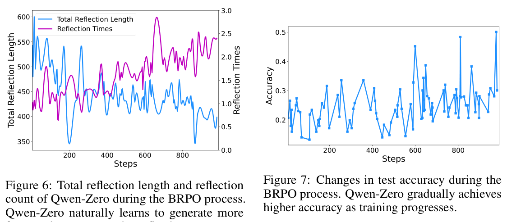
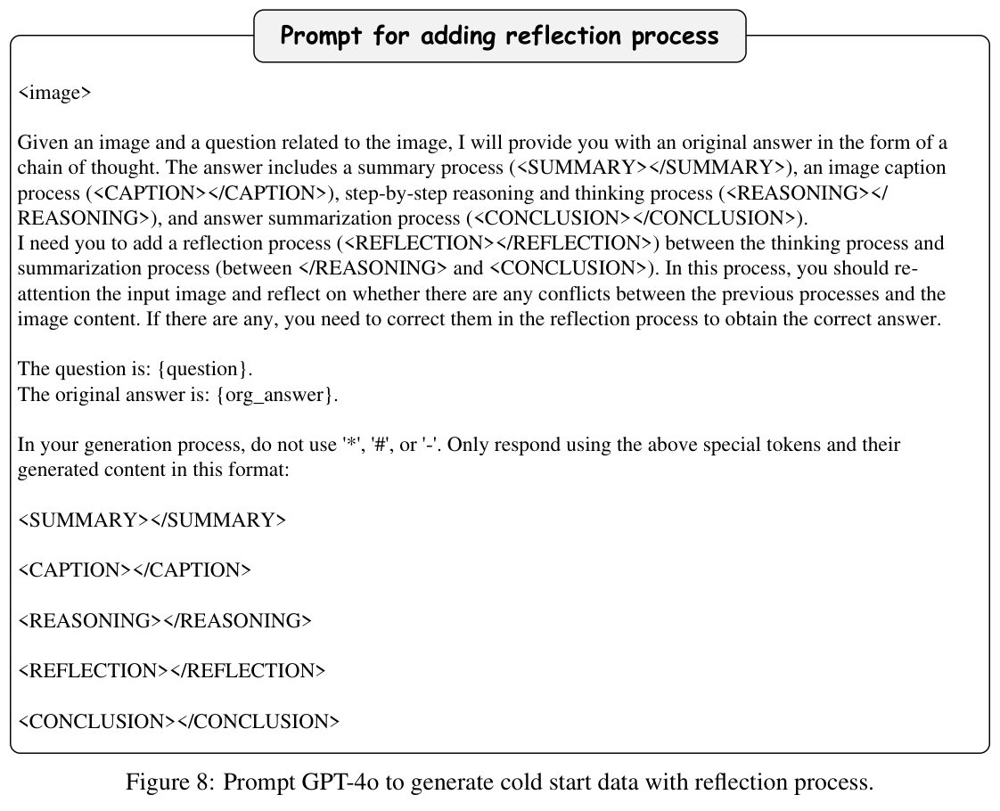
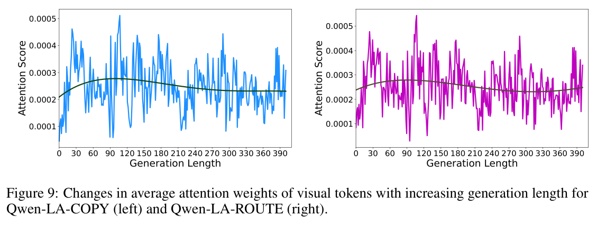

# Qwen Look Again: Guiding Vision-Language Reasoning Models to Re-attention Visual Information

## Metadata / 元数据

| Field / 字段 | Content / 内容 |
|---|---|
| Title | Qwen Look Again: Guiding Vision-Language Reasoning Models to Re-attention Visual Information |
| 中文标题 | Qwen 再看一遍：引导视觉—语言推理模型重新关注视觉信息 |
| Authors | Xu Chu¹˒†; Xinrong Chen¹˒†; Guanyu Wang¹˒†; Zhijie Tan¹; Kui Huang²; Wenyu Lv²; Tong Mo¹; Weiping Li¹˒* |
| Affiliations | ¹ Peking University, Beijing, China; ² Baidu Inc., Beijing, China |
| Emails | chuxu@stu.pku.edu.cn; chenxinrong23@stu.pku.edu.cn; wgy2023@stu.pku.edu.cn; besttangent@stu.pku.edu.cn; huangkui01@baidu.com; lvwenyu01@baidu.com; motong@ss.pku.edu.cn; wpli@ss.pku.edu.cn |
| Contributions | † Equal contribution; * Corresponding author |
| arXiv | arXiv:2505.23558v2 [cs.CV] |
| Date | 30 May 2025 |
| Source | Original 17-page PDF |
| Code | https://github.com/Liar406/Look_Again |
| Reader status | Complete paragraph-level English–Chinese bilingual reader; references [1]–[53] are retained in their original searchable bibliographic form. |

## Section / Page Index / 章节—页码索引

| PDF page(s) | Source content / 原文内容 |
|---:|---|
| 1–3 | Abstract; 1 Introduction; Figures 1–3; 2 Related Works |
| 4–6 | 3 Methodology; 3.1 Preliminaries; 3.2 Balanced Reflective Policy Optimization; Figure 4; 3.3 Visual Re-attention; Equations (1)–(5) |
| 7–9 | 4 Experiment; Tables 1–5; Figure 5; 5 Conclusion |
| 10 | 6 Limitations; References [1]–[13] |
| 11 | References [14]–[29] |
| 12 | References [30]–[48] |
| 13 | References [49]–[53]; Appendix A; Figures 6–7 |
| 14 | Appendix B; Figure 8; Appendix C.1; Equations (6)–(8) |
| 15 | Appendix C.1–C.2; Equations (9)–(12); Appendices D–E |
| 16 | Figure 9; Table 6; Appendices F–G |
| 17 | Appendix G continued; Appendix H; Figure 10 |

## Terminology Ledger / 术语表

| Exact term / 精确术语 | Chinese / 中文 |
|---|---|
| Vision-Language Model (VLM) | 视觉—语言模型 |
| Vision-Language Reasoning Model (VLRM) | 视觉—语言推理模型 |
| Large Reasoning Language Model (LRLM) | 大型推理语言模型 |
| inference time scaling | 推理时扩展 |
| hallucination | 幻觉 |
| vision-text reflection | 视觉—文本反思 |
| text-only reflection | 纯文本反思 |
| vision-only reflection | 纯视觉反思 |
| re-attention / visual re-attention | 重新关注 / 视觉重新关注 |
| Balanced Reflective Policy Optimization (BRPO) | 平衡反思策略优化 |
| Group Relative Policy Optimization (GRPO) | 组相对策略优化 |
| Visual Token COPY (VTC) | 视觉 Token 复制 |
| Visual Token ROUTE (VTR) | 视觉 Token 路由 |
| Qwen-Zero-40k | Qwen-Zero-40k（保留数据集名） |
| supervised fine-tuning (SFT) | 监督微调 |
| Chain-of-Thought (CoT) | 思维链 |
| CHAIRi / CHAIRs / POPE / MMHAL BENCH / MME | 保留原指标名 |
| `<SUMMARY>`, `<CAPTION>`, `<REASONING>`, `<REFLECTION>`, `<CONCLUSION>` | 保留精确标签，不翻译标签字面量 |

## Front Matter / 前置信息

> <span style="color:#3B82F6"><strong>Para. 1:</strong></span> † Equal contribution. * Corresponding author.

> <span style="color:#F59E0B"><strong>Para. 1[CN]:</strong></span> † 同等贡献。* 通讯作者。

> <span style="color:#3B82F6"><strong>Para. 2:</strong></span> Preprint. Under review.

> <span style="color:#F59E0B"><strong>Para. 2[CN]:</strong></span> 预印本。审稿中。

## Abstract / 摘要

> <span style="color:#3B82F6"><strong>Para. 1:</strong></span> Inference time scaling drives extended reasoning to enhance the performance of Vision-Language Models (VLMs), thus forming powerful Vision-Language Reasoning Models (VLRMs). However, long reasoning dilutes visual tokens, causing visual information to receive less attention and may trigger hallucinations. Although introducing text-only reflection processes shows promise in language models, we demonstrate that it is insufficient to suppress hallucinations in VLMs. To address this issue, we introduce Qwen-LookAgain (Qwen-LA), a novel VLRM designed to mitigate hallucinations by incorporating a vision-text reflection process that guides the model to re-attention visual information during reasoning. We first propose a reinforcement learning method Balanced Reflective Policy Optimization (BRPO), which guides the model to decide when to generate vision-text reflection on its own and balance the number and length of reflections. Then, we formally prove that VLRMs lose attention to visual tokens as reasoning progresses, and demonstrate that supplementing visual information during reflection enhances visual attention. Therefore, during training and inference, Visual Token COPY and Visual Token ROUTE are introduced to force the model to re-attention visual information at the visual level, addressing the limitations of text-only reflection. Experiments on multiple visual QA datasets and hallucination metrics indicate that Qwen-LA achieves leading accuracy performance while reducing hallucinations. Our code is available at: https://github.com/Liar406/Look_Again.

> <span style="color:#F59E0B"><strong>Para. 1[CN]:</strong></span> 推理时扩展通过驱动延展推理来提升视觉—语言模型（VLM）的性能，由此形成强大的视觉—语言推理模型（VLRM）。然而，冗长推理会稀释视觉 Token，使视觉信息获得的注意力减少，并可能触发幻觉。尽管引入纯文本反思过程在语言模型中展现出潜力，我们证明它不足以抑制 VLM 中的幻觉。为解决这一问题，我们提出 Qwen-LookAgain（Qwen-LA），一种新颖的 VLRM；它通过引入视觉—文本反思过程，引导模型在推理期间重新关注视觉信息，从而缓解幻觉。我们首先提出一种强化学习方法 Balanced Reflective Policy Optimization（BRPO），引导模型自行决定何时生成视觉—文本反思，并平衡反思的数量与长度。随后，我们从形式上证明：随着推理推进，VLRM 会失去对视觉 Token 的注意力；我们还证明，在反思期间补充视觉信息能够增强视觉注意力。因此，我们在训练和推理期间引入 Visual Token COPY 与 Visual Token ROUTE，从视觉层面迫使模型重新关注视觉信息，以弥补纯文本反思的局限。多个视觉问答数据集和幻觉指标上的实验表明，Qwen-LA 在减少幻觉的同时取得领先的准确率表现。我们的代码位于：https://github.com/Liar406/Look_Again。

## 1 Introduction / 引言

> <span style="color:#3B82F6"><strong>Para. 1:</strong></span> Large Reasoning Language Models (LRLM) are driven by inference time scaling to conduct extended reasoning. These models achieve significant performance improvements across multiple tasks, including mathematics, coding, and creative writing, by generating longer decoded text [5, 15, 37, 11, 1, 43]. In the field of Vision-Language Models (VLMs), recent research explores the integration of extended reasoning into VLMs to enhance their performance, introducing Vision-Language Reasoning Models (VLRMs) with promising results [25, 14, 36]. However, additional reasoning may introduce extra hallucinations, leading to unexpected errors.

> <span style="color:#F59E0B"><strong>Para. 1[CN]:</strong></span> 大型推理语言模型（LRLM）由推理时扩展驱动，以开展延展推理。这些模型通过生成更长的解码文本，在数学、编程和创意写作等多项任务上取得了显著的性能提升 [5, 15, 37, 11, 1, 43]。在视觉—语言模型（VLM）领域，近期研究探索将延展推理整合进 VLM 以提升其性能，并由此提出了展现出良好结果的视觉—语言推理模型（VLRM）[25, 14, 36]。然而，额外推理可能引入更多幻觉，从而导致意外错误。

> <span style="color:#3B82F6"><strong>Para. 2:</strong></span> Hallucinations in VLMs can be defined as generating content that is irrelevant or contradictory to the facts in the image [8]. Multiple studies indicate that hallucinations in VLMs are related to the language priors accumulated during the VLM’s generation process [8, 53, 18]. As the model generates responses, the textual content gradually dilutes the visual context, leading to grammatically coherent but visually ungrounded content. This becomes more prominent in VLRMs with longer generation. As shown in Figure 1a, during the generation process, LLaVA-CoT [46], as a VLRM, exhibits an intensified hallucination (hallucination metric CHAIRi) and decreased Recall. An intuitive idea is to use text prompts such as "Look at the image again" to drive the model to reflect [27, 52] and suppress hallucinations. However, we find that despite the model reflecting through text-only prompts, as shown in Figure 1b, hallucinations do not decrease. Figure 2a further analyzes the relationship between generation length and visual attention from an attention perspective, showing that the average attention weights of visual tokens decrease as generation progresses. Figure 2b indicates that guiding the model to explicitly output a reflection process through text-only prompts does not increase the attention weights of visual tokens. Our analysis shows that (1) the long reasoning generation of VLRMs reduce visual attention, and (2) even when the model is explicitly prompted to review the input image and reflect on earlier reasoning processes, it may not actually re-attend to visual tokens.

> <span style="color:#F59E0B"><strong>Para. 2[CN]:</strong></span> VLM 中的幻觉可定义为生成与图像事实无关或相矛盾的内容 [8]。多项研究表明，VLM 中的幻觉与 VLM 生成过程中积累的语言先验有关 [8, 53, 18]。随着模型生成响应，文本内容逐渐稀释视觉上下文，导致内容在语法上连贯，却缺乏视觉依据。在生成更长的 VLRM 中，这一现象更加突出。如 Figure 1a 所示，在生成过程中，作为一种 VLRM 的 LLaVA-CoT [46] 表现出更严重的幻觉（幻觉指标 CHAIRi）以及更低的 Recall。一种直观想法是使用诸如 "Look at the image again" 的文本提示驱动模型反思 [27, 52] 并抑制幻觉。然而，我们发现，如 Figure 1b 所示，尽管模型通过纯文本提示进行反思，幻觉并未减少。Figure 2a 进一步从注意力视角分析生成长度与视觉注意力之间的关系，显示视觉 Token 的平均注意力权重会随生成推进而下降。Figure 2b 表明，通过纯文本提示引导模型显式输出反思过程并不会提高视觉 Token 的注意力权重。我们的分析表明：(1) VLRM 的长推理生成会降低视觉注意力；(2) 即使明确提示模型重新审视输入图像并反思较早的推理过程，它也可能并未真正重新关注视觉 Token。

### Figure 1 and Figure 2. Hallucination and Visual Attention / 幻觉与视觉注意力


**Caption:** Figure 1: Analysis of hallucination metrics on 500 randomly selected examples from MSCOCO [21] dataset. As the generation length increases, both standard generation and text-only reflection show increased CHAIRi and decreased Recall.

**Caption[CN]:** Figure 1：在 MSCOCO [21] 数据集中随机选择的 500 个样本上分析幻觉指标。随着生成长度增加，标准生成和纯文本反思均表现出 CHAIRi 升高且 Recall 降低。

**Caption:** Figure 2: Analysis of visual attention patterns on 500 randomly selected examples from MSCOCO [21] dataset. As generation progresses, attention weights of visual tokens decrease. This indicates that as tokens are generated, the focus on visual information diminishes.

**Caption[CN]:** Figure 2：在 MSCOCO [21] 数据集中随机选择的 500 个样本上分析视觉注意力模式。随着生成推进，视觉 Token 的注意力权重下降。这表明，随着 Token 生成，模型对视觉信息的关注减弱。

> <span style="color:#3B82F6"><strong>Para. 3:</strong></span> Figure 1: (a) CHAIRi and Recall during generation. (b) CHAIRi and Recall with text-only reflection. Figure 2: (a) Attention weights during generation. (b) Attention weights with text-only reflection.

> <span style="color:#F59E0B"><strong>Para. 3[CN]:</strong></span> Figure 1：(a) 生成期间的 CHAIRi 与 Recall。(b) 采用纯文本反思时的 CHAIRi 与 Recall。Figure 2：(a) 生成期间的注意力权重。(b) 采用纯文本反思时的注意力权重。

> <span style="color:#3B82F6"><strong>Para. 4:</strong></span> In this paper, we present Qwen-LookAgain (Qwen-LA), a novel VLRM for hallucination suppression and accuracy improvement. Qwen-LA uses reinforcement learning to guide the model to spontaneously introduce vision-text reflection processes and force it to re-attention visual information to correct errors in reasoning. Specifically, we first propose Balanced Reflective Policy Optimization (BRPO), a rule-based reinforcement learning method that trains Qwen2.5-VL-7B-Instruct [2] to generate reasoning processes with $n$ ($n≥1$) reflections on its own, resulting in Qwen-Zero. Notably, we observe that the model spontaneously generates multiple reflections at different positions in the response through reinforcement learning, and these reflections become more concise as training iterations progress. Qwen-Zero is used to construct Qwen-Zero-40k, a reasoning dataset with reflections, which undergoes human verification and correction. Then, we formally prove that as tokens are generated during the generation process, the VLM’s attention to visual information decreases. We further demonstrate that enhancing visual information during model generation can increase visual attention. Therefore, we improve and train Qwen2.5-VL-7B-Instruct by parallelly introducing two methods, Visual Token COPY (VTC) and Visual Token ROUTE (VTR), to force the model to re-attention visual information. When the model generates a reflection process (start with `<REFLECTION>` token), VTC simply copies the complete visual tokens of the input image to the beginning of the reflection process. VTR, on the other hand, routes visual tokens with higher attention weights to the beginning of the reflection process based on contextual attention distribution. Both methods use the Qwen-Zero-40k dataset and undergo full-parameter supervised fine-tuning, resulting in Qwen-LA-COPY and Qwen-LA-ROUTE respectively. We evaluate Qwen-LA-COPY and Qwen-LA-ROUTE’s accuracy metrics on multiple visual QA datasets and assess various hallucination metrics on multiple hallucination datasets. Experimental results demonstrate that our models achieve leading performance in both accuracy and hallucination metrics. Our contributions are as follows:
>
> - We discover that as VLRM generates lengthy reasoning, hallucinations intensify with increasing generation length. Text-only reflection do not mitigate this issue. Furthermore, we formally prove that the occurrence of hallucinations is related to reasoning length.
> - We propose Qwen-LA, a novel VLRM that suppresses hallucinations and improves accuracy. The proposed reinforcement learning method BRPO, guides the model to spontaneously perform reasoning with vision-text reflection. Visual Token COPY and Visual Token ROUTE are introduced to force the model to re-attention visual information.

> <span style="color:#F59E0B"><strong>Para. 4[CN]:</strong></span> 本文提出 Qwen-LookAgain（Qwen-LA），一种用于抑制幻觉并提高准确率的新颖 VLRM。Qwen-LA 使用强化学习引导模型自发引入视觉—文本反思过程，并迫使其重新关注视觉信息，以纠正推理中的错误。具体而言，我们首先提出 Balanced Reflective Policy Optimization（BRPO），这是一种基于规则的强化学习方法，用于训练 Qwen2.5-VL-7B-Instruct [2] 自行生成包含 $n$ 次（$n≥1$）反思的推理过程，从而得到 Qwen-Zero。值得注意的是，我们观察到，模型通过强化学习自发地在响应的不同位置生成多次反思，并且随着训练迭代推进，这些反思变得更加简洁。Qwen-Zero 被用于构建 Qwen-Zero-40k——一个包含反思的推理数据集，并经过人工核验与纠正。随后，我们从形式上证明：在生成过程中，随着 Token 不断生成，VLM 对视觉信息的注意力会下降。我们还证明，在模型生成期间增强视觉信息能够提高视觉注意力。因此，我们并行引入 Visual Token COPY（VTC）和 Visual Token ROUTE（VTR）两种方法来改进并训练 Qwen2.5-VL-7B-Instruct，以迫使模型重新关注视觉信息。当模型生成反思过程（以 `<REFLECTION>` Token 开始）时，VTC 直接将输入图像的完整视觉 Token 复制到反思过程的开头。另一方面，VTR 根据上下文注意力分布，将注意力权重更高的视觉 Token 路由至反思过程的开头。两种方法都使用 Qwen-Zero-40k 数据集并进行全参数监督微调，分别得到 Qwen-LA-COPY 和 Qwen-LA-ROUTE。我们在多个视觉问答数据集上评估 Qwen-LA-COPY 和 Qwen-LA-ROUTE 的准确率指标，并在多个幻觉数据集上评估多种幻觉指标。实验结果表明，我们的模型在准确率和幻觉指标上均取得领先表现。我们的贡献如下：
>
> - 我们发现，随着 VLRM 生成冗长推理，幻觉会随生成长度增加而加剧。纯文本反思不能缓解这一问题。此外，我们从形式上证明，幻觉的出现与推理长度有关。
> - 我们提出 Qwen-LA，一种能够抑制幻觉并提高准确率的新颖 VLRM。所提出的强化学习方法 BRPO 引导模型自发执行带有视觉—文本反思的推理。我们引入 Visual Token COPY 和 Visual Token ROUTE，以迫使模型重新关注视觉信息。

### Figure 3. The framework of Qwen-LookAgain / Qwen-LookAgain 框架


**Caption:** Figure 3: The framework of Qwen-LookAgain. The collected cold-start data is used to fine-tune Qwen2.5-VL-Instruct [2]. Then, Balanced Reflective Policy Optimization (BRPO) reward Qwen2.5-VL-Instruct spontaneously generates more accurate, standard answers and more powerful reflection processes, resulting in Qwen-Zero. Next, Qwen-Zero’s distilled data is used to SFT Qwen2.5-VL-Instruct, producing Qwen-LA. During SFT and inference stages, Visual Token COPY or Visual Token ROUTE guides the model to re-attention the visual information during the reflection process.

**Caption[CN]:** Figure 3：Qwen-LookAgain 的框架。收集的冷启动数据用于微调 Qwen2.5-VL-Instruct [2]。随后，Balanced Reflective Policy Optimization（BRPO）奖励 Qwen2.5-VL-Instruct 自发生成更准确、更规范的答案以及更强大的反思过程，从而得到 Qwen-Zero。接下来，使用 Qwen-Zero 的蒸馏数据对 Qwen2.5-VL-Instruct 进行 SFT，生成 Qwen-LA。在 SFT 和推理阶段，Visual Token COPY 或 Visual Token ROUTE 引导模型在反思过程中重新关注视觉信息。

> <span style="color:#3B82F6"><strong>Para. 5:</strong></span> - Our experiments on multiple visual QA datasets and hallucination metrics demonstrate that Qwen-LA effectively suppresses hallucinations and achieves leading performance.

> <span style="color:#F59E0B"><strong>Para. 5[CN]:</strong></span> - 我们在多个视觉问答数据集和幻觉指标上的实验表明，Qwen-LA 能够有效抑制幻觉并取得领先性能。

## 2 Related Works / 相关工作

### 2.1 Hallucination in VLMs / VLM 中的幻觉

> <span style="color:#3B82F6"><strong>Para. 1:</strong></span> Although VLM hallucination is considered multifaceted [22], a key cause stems from language priors overwhelming visual context, which has been studied from the perspective of attention patterns [13, 23]. Wang et al. [38] observe that even with access to image data, VLMs can sometimes respond based on textual information and hallucination rather than directly utilizing visual content. Huang et al. [13] observe that hallucination may arise when VLMs over-trust summary tokens in context while neglecting image tokens. Favero et al. [8] and Li et al [18] further discover that VLMs’ reliance on vision decreases as more tokens are generated, indicating that visual information becomes diluted and ignored during the model’s autoregressive generation process. Although recent studies mitigate hallucination through visual prompting or adjusting visual token weights [23, 48, 10], most of them artificially decide when to introduce these methods, such as at the beginning of all paragraphs. In our research, we find that VLMs can be guided through reinforcement learning to spontaneously decide when to re-attend to visual information, without relying on human priors.

> <span style="color:#F59E0B"><strong>Para. 1[CN]:</strong></span> 尽管 VLM 幻觉被认为具有多面性 [22]，其中一个关键成因是语言先验压倒了视觉上下文；已有工作从注意力模式的角度研究这一问题 [13, 23]。Wang 等人 [38] 观察到，即使能够访问图像数据，VLM 有时仍会基于文本信息和幻觉作答，而不是直接利用视觉内容。Huang 等人 [13] 观察到，当 VLM 过度信任上下文中的总结 Token 而忽略图像 Token 时，可能产生幻觉。Favero 等人 [8] 和 Li 等人 [18] 进一步发现，随着生成更多 Token，VLM 对视觉的依赖会下降，这表明视觉信息在模型自回归生成过程中会被稀释和忽略。尽管近期研究通过视觉提示或调整视觉 Token 权重来缓解幻觉 [23, 48, 10]，其中大多数方法仍由人工决定何时引入，例如在所有段落开头引入。在本研究中，我们发现可以通过强化学习引导 VLM 自发决定何时重新关注视觉信息，而无需依赖人工先验。

### 2.2 Inference Time Scaling / 推理时扩展

> <span style="color:#3B82F6"><strong>Para. 2:</strong></span> Extensive research indicates that inference time scaling can improve LLMs’ reasoning performance [45, 7, 11, 36]. To optimize reasoning processes represented by Chain-of-Thought (CoT), one category of methods obtains optimal reasoning paths from the solution space through tree search, either by fine-tuning models [45, 3, 49] or directly exploring optimal reasoning paths during inference [16, 46, 7]. Another category of methods, like DeepSeek-R1 [11], stimulates models’ inherent reasoning capabilities through reinforcement learning and observes the emergence of reflection processes. Inspired by this, many researchers introduce reinforcement learning to train VLRMs [25, 14, 36]. However, both LRLMs and VLRMs face excessive overhead and hallucinations caused by lengthy reasoning processes [5, 20].

> <span style="color:#F59E0B"><strong>Para. 2[CN]:</strong></span> 大量研究表明，推理时扩展能够提高 LLM 的推理性能 [45, 7, 11, 36]。为优化由思维链（CoT）表示的推理过程，一类方法通过树搜索从解空间中获取最优推理路径：或通过微调模型 [45, 3, 49]，或在推理期间直接探索最优推理路径 [16, 46, 7]。另一类方法（如 DeepSeek-R1 [11]）通过强化学习激发模型内在的推理能力，并观察到反思过程的涌现。受此启发，许多研究者引入强化学习来训练 VLRM [25, 14, 36]。然而，LRLM 和 VLRM 都面临冗长推理过程导致的过高开销与幻觉 [5, 20]。

## 3 Methodology / 方法

> <span style="color:#3B82F6"><strong>Para. 1:</strong></span> In this section, we propose Qwen-LookAgain (Qwen-LA), a novel VLRM based on reinforcement learning and visual re-attention, with its framework shown in Figure 3. Qwen-LA spontaneously generates multiple reflections through the proposed BRPO (Section 3.2) and guides the model to re-attention visual information (Section 3.3) through Visual Token COPY or Visual Token ROUTE, thereby suppressing hallucinations.

> <span style="color:#F59E0B"><strong>Para. 1[CN]:</strong></span> 本节提出 Qwen-LookAgain（Qwen-LA），一种基于强化学习与视觉重新关注的新颖 VLRM，其框架如 Figure 3 所示。Qwen-LA 通过所提出的 BRPO（Section 3.2）自发生成多次反思，并借助 Visual Token COPY 或 Visual Token ROUTE 引导模型重新关注视觉信息（Section 3.3），从而抑制幻觉。

### 3.1 Preliminaries / 预备知识

> <span style="color:#3B82F6"><strong>Para. 2:</strong></span> **Rule-based Reinforcement Learning.** Rule-based RL aims to improve language models’ performance in tasks with clear correct answers (such as mathematics and programming). Unlike traditional Reinforcement Learning from Human Feedback (RLHF) [29], Rule-based RL does not rely on training complex reward models, but utilizes direct, rule-based validation functions to evaluate output correctness. This approach simplifies the reward mechanism through explicit rule sets while ensuring model outputs highly align with the inherent correctness criteria of tasks. Rule-based RL is particularly effective in scenarios lacking annotated data. For example, the Group Relative Policy Optimization (GRPO) [32] framework used to train DeepSeek-R1-Zero [11] eliminates dependence on supervised data and human preference data, guiding models to spontaneously explore reasoning paths from the solution space.

> <span style="color:#F59E0B"><strong>Para. 2[CN]:</strong></span> **基于规则的强化学习。** 基于规则的 RL 旨在提高语言模型在具有明确正确答案的任务（如数学和编程）上的性能。与传统的基于人类反馈的强化学习（RLHF）[29] 不同，基于规则的 RL 不依赖训练复杂的奖励模型，而是利用直接的、基于规则的验证函数评估输出正确性。该方法通过显式规则集合简化奖励机制，同时确保模型输出与任务固有的正确性准则高度一致。基于规则的 RL 在缺少标注数据的场景中特别有效。例如，用于训练 DeepSeek-R1-Zero [11] 的 Group Relative Policy Optimization（GRPO）[32] 框架消除了对监督数据和人类偏好数据的依赖，引导模型从解空间中自发探索推理路径。

> <span style="color:#3B82F6"><strong>Para. 3:</strong></span> GRPO is based on a simple yet effective rule: directly comparing the relative merits of multiple candidate answers for the same problem. Specifically, for a given question $q$, GRPO first uses the current policy $\pi_{old}$ to generate $G$ different responses $\{o_1, o_2, \ldots, o_G\}$ and obtains corresponding rewards $\{r_1, r_2, \ldots, r_G\}$. GRPO calculates the relative advantage of each answer through intra-group normalization:

$$
A_i = \frac{r_i - \operatorname{mean}(\{r_1, \ldots, r_G\})}{\operatorname{std}(\{r_1, \ldots, r_G\})}, \tag{1}
$$

> <span style="color:#F59E0B"><strong>Para. 3[CN]:</strong></span> GRPO 基于一条简单却有效的规则：直接比较同一问题的多个候选答案的相对优劣。具体而言，对给定问题 $q$，GRPO 首先使用当前策略 $\pi_{old}$ 生成 $G$ 个不同响应 $\{o_1, o_2, \ldots, o_G\}$，并获得对应奖励 $\{r_1, r_2, \ldots, r_G\}$。GRPO 通过组内归一化计算每个答案的相对优势：

> <span style="color:#3B82F6"><strong>Para. 4:</strong></span> where $A_i$ represents the degree of advantage of the $i$-th answer relative to other answers within the group. Based on these relative advantage values, the GRPO objective function can be expressed as:

$$
\mathcal{L}_{GRPO}(\theta) = \frac{1}{G}\sum_{i=1}^{G}\left(\min\left(\frac{\pi_\theta(o_i|q)}{\pi_{old}(o_i|q)}A_i,\operatorname{clip}\left(\frac{\pi_\theta(o_i|q)}{\pi_{old}(o_i|q)},1-\epsilon,1+\epsilon\right)A_i\right)-\beta D_{KL}(\pi_\theta\|\pi_{ref})\right), \tag{2}
$$

$$
D_{KL}(\pi_\theta\|\pi_{ref}) = \frac{\pi_{ref}(o_i|q)}{\pi_\theta(o_i|q)} - \log\frac{\pi_{ref}(o_i|q)}{\pi_\theta(o_i|q)} - 1, \tag{3}
$$

> <span style="color:#F59E0B"><strong>Para. 4[CN]:</strong></span> 其中，$A_i$ 表示第 $i$ 个答案相对于组内其他答案的优势程度。基于这些相对优势值，GRPO 的目标函数可表示为：

> <span style="color:#3B82F6"><strong>Para. 5:</strong></span> where $\epsilon$ and $\beta$ control the clipping range and the intensity of KL divergence penalty respectively. $\pi_{ref}$ is the reference policy, used to prevent the optimized policy $\pi_\theta$ from deviating too far and causing catastrophic forgetting.

> <span style="color:#F59E0B"><strong>Para. 5[CN]:</strong></span> 其中，$\epsilon$ 和 $\beta$ 分别控制裁剪范围与 KL 散度惩罚的强度。$\pi_{ref}$ 是参考策略，用于防止优化后的策略 $\pi_\theta$ 偏离过远并造成灾难性遗忘。

> <span style="color:#3B82F6"><strong>Para. 6:</strong></span> **Vision-Language Models.** The input of Vision-Language Models (VLMs) includes text prompts $x$ and image prompts $c$. The text prompts contain $L_x$ tokens, and the image prompts are processed by visual encoders into $L_c$ visual tokens. VLMs generate output sequences $y$ of length $L_y$ in an autoregressive manner, with the conditional probability of the entire process expressed as $p(y|x, c) = \prod_{t=1}^{L_y} p(y_t | y_{<t}, x, c)$, where $y_{<t} = [y_1, \ldots, y_{t-1}]$ represents the generated tokens.

> <span style="color:#F59E0B"><strong>Para. 6[CN]:</strong></span> **视觉—语言模型。** 视觉—语言模型（VLM）的输入包括文本提示 $x$ 和图像提示 $c$。文本提示包含 $L_x$ 个 Token，图像提示由视觉编码器处理为 $L_c$ 个视觉 Token。VLM 以自回归方式生成长度为 $L_y$ 的输出序列 $y$，整个过程的条件概率表示为 $p(y|x, c) = \prod_{t=1}^{L_y} p(y_t | y_{<t}, x, c)$，其中 $y_{<t} = [y_1, \ldots, y_{t-1}]$ 表示已生成的 Token。

### 3.2 Balanced Reflective Policy Optimization / 平衡反思策略优化

> <span style="color:#3B82F6"><strong>Para. 7:</strong></span> Inspired by GRPO, we propose Balanced Reflective Policy Optimization (BRPO). Specifically, BRPO employs a rule-based reward system consisting of three types of rewards:
>
> - **Format reward:** We enforce the model to respond in a specified format, including a summary process (`<SUMMARY></SUMMARY>`), an image caption process (`<CAPTION></CAPTION>`),

> <span style="color:#F59E0B"><strong>Para. 7[CN]:</strong></span> 受 GRPO 启发，我们提出 Balanced Reflective Policy Optimization（BRPO）。具体而言，BRPO 采用由三类奖励构成的基于规则的奖励系统：
>
> - **格式奖励：** 我们强制模型以指定格式作答，其中包括总结过程（`<SUMMARY></SUMMARY>`）、图像描述过程（`<CAPTION></CAPTION>`），

### Figure 4. Multiple reflection awareness / 多重反思意识


**Caption:** Figure 4: Qwen-Zero spontaneously develops multiple reflection awareness during BRPO training, including visual-only reflections without text, as shown in the first reflection in the example.

**Caption[CN]:** Figure 4：Qwen-Zero 在 BRPO 训练期间自发形成多重反思意识，其中包括没有文本的纯视觉反思，如示例中的第一次反思所示。

> <span style="color:#3B82F6"><strong>Para. 8:</strong></span> **Exact Figure 4 example:**
>
> ```text
> Question: Are there both zebras and tigers in the picture?
> Answer: <SUMMARY> I will determine whether both zebras and tigers are present in the image by analyzing the appearance and composition of the animals shown. </SUMMARY>
> <REFLECTION></REFLECTION>
> <CAPTION> The image depicts a dry, open savannah environment with sparse vegetation. It is populated by several zebras, identifiable by their black-and-white stripes. There is no sign of any tigers visible, nor any other animals apart from the zebras. </CAPTION>
> <REASONING> To answer the question about the presence of both zebras and tigers, I first observe the animals in the image. It is evident that the zebras are identifiable by their black-and-white striped patterns, and they are grazing or standing across the dry landscape. Tigers, on the other hand, would display distinctive orange fur with black stripes, making them easily distinguishable. No such animals are visible in the scene, and the environment also does not suggest the typical habitat of tigers, which tend to prefer dense forests rather than open grasslands. Based on these observations, the image only contains zebras. </REASONING>
> <REFLECTION> Let me look the image again. The distinctive striped appearance of the zebras clearly identifies them, while no evidence exists of tigers or any other animals. This conclusion aligns with the context of the dry savannah environment as well, which matches the habitat where zebras are commonly found but is unsuitable for tigers. Therefore, the reasoning does not conflict with the new analysis. </REFLECTION>
> <CONCLUSION> No </CONCLUSION>
> ```

> <span style="color:#F59E0B"><strong>Para. 8[CN]:</strong></span> **Figure 4 精确示例：**
>
> ```text
> 问题：图片中是否同时有斑马和老虎？
> 回答：<SUMMARY> 我将通过分析所示动物的外观与构成，判断图像中是否同时出现了斑马和老虎。 </SUMMARY>
> <REFLECTION></REFLECTION>
> <CAPTION> 图像描绘了一个干燥、开阔且植被稀疏的稀树草原环境。这里有数只斑马，可以通过它们的黑白条纹识别。画面中看不到任何老虎，除斑马之外也没有其他动物。 </CAPTION>
> <REASONING> 为回答斑马和老虎是否同时出现的问题，我首先观察图像中的动物。显然，可以通过黑白相间的条纹图案识别斑马；它们正在干燥的地面上吃草或站立。另一方面，老虎会呈现带黑色条纹的标志性橙色皮毛，因此很容易区分。画面中没有这样的动物，而且该环境也不像老虎的典型栖息地；老虎往往更偏好茂密森林，而不是开阔草原。基于这些观察，图像中只有斑马。 </REASONING>
> <REFLECTION> 让我再看一遍图像。斑马独特的条纹外观清楚地表明它们是斑马，而没有证据表明存在老虎或任何其他动物。这一结论也与干燥稀树草原环境的上下文一致；这种环境符合斑马常见的栖息地，却不适合老虎。因此，先前推理与新的分析并不冲突。 </REFLECTION>
> <CONCLUSION> 否 </CONCLUSION>
> ```

> <span style="color:#3B82F6"><strong>Para. 9:</strong></span> step-by-step reasoning and thinking process (`<REASONING></REASONING>`), reflection process (`<REFLECTION></REFLECTION>`), and answer summarization process (`<CONCLUSION></CONCLUSION>`). The relative order of all processes except reflection is restricted, and no format overlapping or nesting relationships are allowed. The number and relative positions of reflection processes are unrestricted but similarly cannot overlap or nest.
>
> - **Accuracy reward:** Evaluates whether the final answer in the response is correct. Uses regular expressions to check if the content within `<CONCLUSION></CONCLUSION>` matches the correct answer, rewarding if consistent.
> - **Reflection balance reward:** Encourages models to maintain a balance between reflection count and total length when generating answers. When reflection count is low, longer reflections are allowed; when reflection count increases, reflection length is limited. The reward is formalized as

$$
1 - \frac{\left|\frac{L_r^{total}}{N_r} - \lambda\right|}{\lambda},
$$

> where $N_r$ is the number of reflection occurrences (i.e., occurrences of `<REFLECTION></REFLECTION>`), $L_r^{total}$ is the total number of tokens in all reflection processes, and $\lambda$ is the ideal average length for a single reflection.

> <span style="color:#F59E0B"><strong>Para. 9[CN]:</strong></span> 逐步推理与思考过程（`<REASONING></REASONING>`）、反思过程（`<REFLECTION></REFLECTION>`），以及答案总结过程（`<CONCLUSION></CONCLUSION>`）。除反思之外，所有过程的相对顺序都受到限制，且不允许出现格式重叠或嵌套关系。反思过程的数量与相对位置不受限制，但同样不能重叠或嵌套。
>
> - **准确率奖励：** 评估响应中的最终答案是否正确。使用正则表达式检查 `<CONCLUSION></CONCLUSION>` 内的内容是否与正确答案一致；若一致则给予奖励。
> - **反思平衡奖励：** 鼓励模型在生成答案时保持反思次数与总长度之间的平衡。当反思次数较少时，允许较长的反思；当反思次数增加时，则限制反思长度。奖励形式化为上式，其中 $N_r$ 是反思出现的次数（即 `<REFLECTION></REFLECTION>` 的出现次数），$L_r^{total}$ 是所有反思过程中的 Token 总数，$\lambda$ 是单次反思的理想平均长度。

> <span style="color:#3B82F6"><strong>Para. 10:</strong></span> With the reward mechanism determined, BRPO’s objective function aligns with (2). We apply the BRPO framework to train Qwen2.5-VL-7B-Instruct [2], using 10k data collected and mixed from Math [30], MathVision [39], Polymath [12], SceMQA [19], and Geometry3K [26]. To accelerate model convergence, we construct 2k cold-start data from LLaVA-CoT-100k [46] and initially cold-start Qwen2.5-VL-7B-Instruct. The cold-start data inserts a reflection process between reasoning and conclusion processes (using GPT-4o [15] and manual verification to ensure process correctness), containing only one reflection in the cold-start data. The model trained through BRPO is called Qwen-Zero, with experimental setup details and results shown in Appendix A. Notably, we observe two novel and interesting phenomena during training:
>
> - Even though the cold-start data contains only one reflection process, the model gradually produces multiple reflections under reward, and the total reflection length $L_r^{total}$ decreases as training epochs increase. This indicates that reflections become more numerous but concise, with the model automatically avoiding overthinking. As shown in Figure 6.
> - Some additional reflection processes produced by the model during BRPO training are empty in content, suggesting the model spontaneously develops a "Let me look at the image again" consciousness but does not always need to generate reflection text. As shown in Figure 4.

> <span style="color:#F59E0B"><strong>Para. 10[CN]:</strong></span> 在确定奖励机制后，BRPO 的目标函数与式 (2) 一致。我们应用 BRPO 框架训练 Qwen2.5-VL-7B-Instruct [2]，使用从 Math [30]、MathVision [39]、Polymath [12]、SceMQA [19] 和 Geometry3K [26] 收集并混合的 10k 数据。为加速模型收敛，我们从 LLaVA-CoT-100k [46] 构建 2k 冷启动数据，并首先对 Qwen2.5-VL-7B-Instruct 进行冷启动。冷启动数据在推理过程与结论过程之间插入一个反思过程（使用 GPT-4o [15] 并进行人工核验，以确保过程正确），且每条冷启动数据仅包含一次反思。通过 BRPO 训练得到的模型称为 Qwen-Zero，实验设置细节与结果见 Appendix A。值得注意的是，我们在训练期间观察到两个新颖且有趣的现象：
>
> - 尽管冷启动数据只包含一次反思过程，模型在奖励驱动下会逐渐产生多次反思，并且总反思长度 $L_r^{total}$ 随训练轮次增加而下降。这表明反思次数变多但更加简洁，模型会自动避免过度思考。如 Figure 6 所示。
> - 模型在 BRPO 训练期间产生的一些额外反思过程内容为空，这表明模型自发形成了 "Let me look at the image again" 的意识，但并不总需要生成反思文本。如 Figure 4 所示。

> <span style="color:#3B82F6"><strong>Para. 11:</strong></span> Furthermore, we extract 40k questions from the LLaVA-CoT-100k dataset and use Qwen-Zero to generate responses for them to distill Qwen-Zero’s reasoning and reflection capabilities. To ensure the correctness of model-generated results, we use both models and human verification, details of which can be found in Appendix F, to correct errors in Qwen-Zero’s responses, creating the Qwen-Zero-40k dataset. Qwen-Zero-40k is used for supervised fine-tuning (SFT) of Qwen2.5-VL-7B-Instruct. Specifically, to force the model to re-attention visual information during generation, we propose and incorporate visual re-attention during both SFT and inference processes, with details provided in 3.3.

> <span style="color:#F59E0B"><strong>Para. 11[CN]:</strong></span> 此外，我们从 LLaVA-CoT-100k 数据集中抽取 40k 个问题，并使用 Qwen-Zero 为其生成响应，从而蒸馏 Qwen-Zero 的推理与反思能力。为确保模型生成结果的正确性，我们同时使用模型和人工核验（细节见 Appendix F）来纠正 Qwen-Zero 响应中的错误，构建 Qwen-Zero-40k 数据集。Qwen-Zero-40k 用于对 Qwen2.5-VL-7B-Instruct 进行监督微调（SFT）。具体而言，为迫使模型在生成过程中重新关注视觉信息，我们在 SFT 和推理过程中均提出并加入视觉重新关注，细节见 3.3。

### 3.3 Visual Re-attention / 视觉重新关注

> <span style="color:#3B82F6"><strong>Para. 12:</strong></span> We first provide theoretical insights showing that hallucination in VLRMs relates to sequence length, with all theorem proofs available in Appendix C. Consistent with existing research [8, 53, 13, 18], we assume that one key reason for VLM hallucination is visual information neglect, and provide proof based on this point.

> <span style="color:#F59E0B"><strong>Para. 12[CN]:</strong></span> 我们首先给出理论洞见，表明 VLRM 中的幻觉与序列长度相关；所有定理证明见 Appendix C。与现有研究 [8, 53, 13, 18] 一致，我们假设 VLM 幻觉的一个关键原因是忽视视觉信息，并据此给出证明。

> <span style="color:#3B82F6"><strong>Para. 13:</strong></span> Assume the number of text prompt tokens is $L_x$, image prompt tokens (visual tokens) is $L_c$, decoded sequence tokens is $L_y$, total sequence length is $L_{total} = L_x + L_c + L_y$. Model’s output probability is:

$$
p(y|x, c) = \prod_{t=1}^{L_y} p(y_t | y_{<t}, x, c), \tag{4}
$$

> <span style="color:#F59E0B"><strong>Para. 13[CN]:</strong></span> 假设文本提示 Token 的数量为 $L_x$，图像提示 Token（视觉 Token）的数量为 $L_c$，解码序列 Token 的数量为 $L_y$，总序列长度为 $L_{total} = L_x + L_c + L_y$。模型的输出概率为：

> <span style="color:#3B82F6"><strong>Para. 14:</strong></span> where $y_{<t} = [y_1, \ldots, y_{t-1}]$. The visual context proportion in the sequence is $r = \frac{L_c}{L_{total}}$. Since we analyze overall visual attention rather than discussing attention differences of individual tokens, in the proof, we assume each token contributes roughly equal "information" given the context (text, visual, and generated tokens).

> <span style="color:#F59E0B"><strong>Para. 14[CN]:</strong></span> 其中 $y_{<t} = [y_1, \ldots, y_{t-1}]$。序列中的视觉上下文占比为 $r = \frac{L_c}{L_{total}}$。由于我们分析的是整体视觉注意力，而非讨论单个 Token 的注意力差异，因此在证明中，我们假设给定上下文（文本、视觉以及已生成 Token）时，每个 Token 贡献大致相等的“信息”。

> <span style="color:#3B82F6"><strong>Para. 15:</strong></span> **Theorem 3.1** Visual attention decreases as generated content length increases during generation. Mutual information measures the dependency between generated sequence $y$ and image prompt $c$ (given text prompt $x$), i.e., $I(y; c | x) = H(y | x) - H(y | x, c)$, where $H(\cdot)$ is entropy. Assuming similar entropy contribution from each token, we can approximate $I(y; c | x) \lesssim \frac{L_c}{L_{total}} H(y | x, c)$. Therefore, as $L_y$ increases during autoregressive generation, causing $L_{total}$ to increase, the ratio $r = \frac{L_c}{L_{total}}$ decreases, leading to decreased model attention (mutual information) to image prompt $c$.

> <span style="color:#F59E0B"><strong>Para. 15[CN]:</strong></span> **Theorem 3.1** 在生成期间，视觉注意力会随生成内容长度增加而下降。互信息度量生成序列 $y$ 与图像提示 $c$（给定文本提示 $x$）之间的依赖，即 $I(y; c | x) = H(y | x) - H(y | x, c)$，其中 $H(\cdot)$ 为熵。假设每个 Token 的熵贡献相似，我们可近似得到 $I(y; c | x) \lesssim \frac{L_c}{L_{total}} H(y | x, c)$。因此，在自回归生成期间，随着 $L_y$ 增加导致 $L_{total}$ 增加，比率 $r = \frac{L_c}{L_{total}}$ 会下降，使模型对图像提示 $c$ 的注意力（互信息）降低。

> <span style="color:#3B82F6"><strong>Para. 16:</strong></span> Next, we formally prove that increasing visual token proportion can enhance visual attention. Different from [23], instead of adjusting visual token attention weights, we prove that introducing more visual tokens can enhance visual attention.

> <span style="color:#F59E0B"><strong>Para. 16[CN]:</strong></span> 接下来，我们从形式上证明，提高视觉 Token 的占比能够增强视觉注意力。与 [23] 不同，我们并不调整视觉 Token 的注意力权重，而是证明引入更多视觉 Token 能够增强视觉注意力。

> <span style="color:#3B82F6"><strong>Para. 17:</strong></span> **Theorem 3.2** Repeated introduction of visual tokens increases visual attention. If during generation, visual tokens are copied or partially routed and inserted into the generation sequence at one or multiple positions. Let $k > 0$ be the number of copied inserted tokens, then the updated visual tokens number is $L'_c = L_c + k$, updated total sequence length is $L'_{total} = L_{total} + k$. The updated visual tokens ratio becomes $r' = \frac{L'_c}{L'_{total}} = \frac{L_c+k}{L_{total}+k}$. When input text prompt length $L_x > 0$, we have $r' > r$. Therefore, the updated mutual information has upper bound $I(y; c | x) \lesssim r' \cdot H(y | x, c)$ higher than the pre-update upper bound, meaning increased visual attention during generation.

> <span style="color:#F59E0B"><strong>Para. 17[CN]:</strong></span> **Theorem 3.2** 重复引入视觉 Token 会提高视觉注意力。若在生成期间复制或部分路由视觉 Token，并将其插入生成序列的一个或多个位置。令 $k > 0$ 为复制并插入的 Token 数量，则更新后的视觉 Token 数量为 $L'_c = L_c + k$，更新后的总序列长度为 $L'_{total} = L_{total} + k$。更新后的视觉 Token 比率变为 $r' = \frac{L'_c}{L'_{total}} = \frac{L_c+k}{L_{total}+k}$。当输入文本提示长度 $L_x > 0$ 时，有 $r' > r$。因此，更新后的互信息上界 $I(y; c | x) \lesssim r' \cdot H(y | x, c)$ 高于更新前的上界，意味着生成期间的视觉注意力提高。

> <span style="color:#3B82F6"><strong>Para. 18:</strong></span> Based on the above analysis, during SFT and model inference, we propose two parallel methods to reintroduce visual tokens, driving model re-attention visuals. The two methods produce two variants of Qwen-LA: Qwen-LA-COPY and Qwen-LA-ROUTE.

> <span style="color:#F59E0B"><strong>Para. 18[CN]:</strong></span> 基于上述分析，我们在 SFT 和模型推理期间提出两种并行方法，以重新引入视觉 Token，驱动模型重新关注视觉内容。这两种方法产生 Qwen-LA 的两个变体：Qwen-LA-COPY 与 Qwen-LA-ROUTE。

> <span style="color:#3B82F6"><strong>Para. 19:</strong></span> **Visual Token COPY (VTC).** When the model produces a reflection process (start with `<REFLECTION>` token), simply copy the input image’s visual tokens completely to the beginning of the reflection process (before `<REFLECTION>` token). That is, the reflection process begins generating after the copied visual tokens.

> <span style="color:#F59E0B"><strong>Para. 19[CN]:</strong></span> **Visual Token COPY（VTC）。** 当模型产生反思过程（以 `<REFLECTION>` Token 开始）时，直接将输入图像的视觉 Token 完整复制到反思过程的开头（位于 `<REFLECTION>` Token 之前）。也就是说，反思过程在复制的视觉 Token 之后开始生成。

> <span style="color:#3B82F6"><strong>Para. 20:</strong></span> **Visual Token ROUTE (VTR).** When the model produces a reflection process (start with `<REFLECTION>` token), calculate previously generated tokens’ attention to visual tokens, and route visual tokens with higher weights to the beginning of reflection process. Routing can be formalized as first calculating attention for all visual tokens:

$$
\operatorname{attn}_j = \frac{1}{L_y}\sum_{i=1}^{L_y}\operatorname{attn}_{i,j}, \qquad j \in \{1, 2, \ldots, L_c\}, \tag{5}
$$

> <span style="color:#F59E0B"><strong>Para. 20[CN]:</strong></span> **Visual Token ROUTE（VTR）。** 当模型产生反思过程（以 `<REFLECTION>` Token 开始）时，计算此前已生成 Token 对视觉 Token 的注意力，并将权重更高的视觉 Token 路由至反思过程开头。路由可形式化为：首先计算所有视觉 Token 的注意力：

> <span style="color:#3B82F6"><strong>Para. 21:</strong></span> where $\operatorname{attn}_{i,j}$ represents attention weight of the $i$-th generated token to the $j$-th visual token, with $L_y$ here representing the decoded sequence length up to `<REFLECTION>` token. Then, rank visual tokens based on attention scores and select top $m\%$ visual tokens with highest attention for routing.

> <span style="color:#F59E0B"><strong>Para. 21[CN]:</strong></span> 其中，$\operatorname{attn}_{i,j}$ 表示第 $i$ 个已生成 Token 对第 $j$ 个视觉 Token 的注意力权重；此处 $L_y$ 表示截至 `<REFLECTION>` Token 的已解码序列长度。随后，根据注意力分数对视觉 Token 排序，并选择注意力最高的前 $m\%$ 视觉 Token 进行路由。

### Table 1. Accuracy of VLMs and VLRMs / VLM 与 VLRM 的准确率


| Model（模型） | Parameters（参数量） | MMMU ↑ | MMMU-Pro ↑ | MMBench ↑ | MMStar ↑ | MathVision ↑ |
|---|---:|---:|---:|---:|---:|---:|
| Qwen2.5-VL-7B-Instruct [2] | 7B | 58.6 | 41.0 | 82.6 | 63.9 | 25.1 |
| Llama-3.2-11B-Vision-Instruct [28] | 11B | 50.7 | 33.0 | 64.9 | 46.6 | 12.4 |
| MiniCPM-o-2.6 [47] | 8B | 50.4 | 30.0 | 78.0 | 57.5 | 23.1 |
| InternVL2.5-8B [6] | 8B | 56.0 | 34.3 | 79.4 | 61.5 | 19.7 |
| DeepSeek-VL2 [44] | 27B(4.5B) | 54.0 | 32.4 | 81.2 | 61.9 | 19.3 |
| Gemma3-12B-IT [35] | 12B | 50.3 | 29.1 | 79.4 | 58.5 | 28.6 |
| LLaVA-CoT [46] | 11B | 51.2 | 31.7 | 73.8 | 57.8 | 15.6 |
| InternVL2.5-8B-MPO [41] | 8B | 54.9 | 34.1 | 73.8 | 65.7 | 18.0 |
| Kimi-VL-Think [36] | 16B(3B) | 57.0 | 35.4 | 83.1 | 61.3 | 21.4 |
| Vision-R1 [14] | 7B | 56.2 | 36.1 | 81.5 | 61.4 | 25.5 |
| Qwen-LA-COPY (ours) | 7B | 60.3 | 41.7 | 82.7 | 65.9 | 26.4 |
| Qwen-LA-ROUTE (ours) | 7B | 59.1 | 41.3 | 82.8 | 64.6 | 25.8 |

**Caption:** Table 1: Accuracy (%) of VLMs and VLRMs on visual QA datasets. Bold and underline represent first and second place, respectively. 27B(4.5B) and 16B(3B) represent the total parameters of MoE [33] architecture and the activated parameters (in parentheses).

**Caption[CN]:** Table 1：VLM 与 VLRM 在视觉问答数据集上的准确率（%）。粗体和下划线分别表示第一名与第二名。27B(4.5B) 和 16B(3B) 表示 MoE [33] 架构的总参数量与激活参数量（括号内）。

## 4 Experiment / 实验

> <span style="color:#3B82F6"><strong>Para. 1:</strong></span> In this section, we evaluate Qwen-LA-COPY and Qwen-LA-ROUTE’s accuracy metrics on visual QA datasets and hallucination metrics on hallucination datasets. Our work aims to address the following questions: RQ1: How is the accuracy and hallucination performance of Qwen-LA? RQ2: What are the inference overheads of Qwen-LA-COPY and Qwen-LA-ROUTE? RQ3: How do BRPO, Visual Token COPY, and Visual Token ROUTE help improve Qwen-LA’s performance?

> <span style="color:#F59E0B"><strong>Para. 1[CN]:</strong></span> 本节在视觉问答数据集上评估 Qwen-LA-COPY 和 Qwen-LA-ROUTE 的准确率指标，并在幻觉数据集上评估其幻觉指标。我们的工作旨在回答以下问题：RQ1：Qwen-LA 的准确率与幻觉表现如何？RQ2：Qwen-LA-COPY 和 Qwen-LA-ROUTE 的推理开销是多少？RQ3：BRPO、Visual Token COPY 和 Visual Token ROUTE 如何帮助提升 Qwen-LA 的性能？

### 4.1 Experimental Setup / 实验设置

> <span style="color:#3B82F6"><strong>Para. 2:</strong></span> **Datasets and metrics.** We select five widely used and challenging multimodal QA datasets for accuracy metric evaluation: MMMU [50], MMMU-Pro [51], MMBench-V1.1-En [24], MMStar [4], and MathVision [40]. For hallucination evaluation, we first use MSCOCO [21], a comprehensive dataset used for image recognition, segmentation, and captioning. 5,000 unique images are selected from the COCO 2014 training dataset to evaluate hallucination performance [53]. The hallucination metrics evaluated on MSCOCO include: CHAIR [31], with two variants, $CHAIR_i = \frac{\#\text{hallucinated objects}}{\#\text{generated objects}}$ calculating the proportion of hallucinated objects in the entire description, and $CHAIR_s = \frac{\#\text{hallucinated captions}}{\#\text{generated captions}}$ evaluating the proportion of descriptions containing at least one object hallucination. Considering that sequence length significantly affects CHAIR values [17], we only retain the model’s final conclusions for fair evaluation. POPE [17] adopts a question-answering format to prompt the model, such as "Is there an `<object>` in the image?", to determine whether the model can correctly identify if specific objects are present in a given image. Additionally, MMHAL BENCH [34] emphasizes logical reasoning and complex visual understanding, thus providing rigorous testing of hallucination mitigation in challenging scenarios. Model responses are evaluated using GPT-4o to align with ground-truth answers. MME [9] covers 14 different visual-language capabilities, testing perception, reasoning, and knowledge integration through carefully curated image questions, thereby providing a holistic view of model performance.

> <span style="color:#F59E0B"><strong>Para. 2[CN]:</strong></span> **数据集与指标。** 我们选择五个广泛使用且具有挑战性的多模态问答数据集来评估准确率指标：MMMU [50]、MMMU-Pro [51]、MMBench-V1.1-En [24]、MMStar [4] 和 MathVision [40]。对于幻觉评估，我们首先使用 MSCOCO [21]，这是一个用于图像识别、分割和描述的综合数据集。从 COCO 2014 训练数据集中选择 5,000 张互不重复的图像来评估幻觉表现 [53]。在 MSCOCO 上评估的幻觉指标包括 CHAIR [31]，它有两个变体：$CHAIR_i = \frac{\#\text{hallucinated objects}}{\#\text{generated objects}}$，计算整段描述中幻觉对象所占比例；$CHAIR_s = \frac{\#\text{hallucinated captions}}{\#\text{generated captions}}$，评估至少包含一个对象幻觉的描述所占比例。考虑到序列长度会显著影响 CHAIR 值 [17]，为公平评估，我们仅保留模型的最终结论。POPE [17] 采用问答格式提示模型，例如 "Is there an `<object>` in the image?"，以判断模型能否正确识别给定图像中是否存在特定对象。此外，MMHAL BENCH [34] 强调逻辑推理和复杂视觉理解，从而在具有挑战性的场景中严格测试幻觉缓解能力。模型响应使用 GPT-4o 评估，以与真实答案对齐。MME [9] 覆盖 14 种不同的视觉—语言能力，通过精心设计的图像问题测试感知、推理与知识整合，从而全面呈现模型性能。

> <span style="color:#3B82F6"><strong>Para. 3:</strong></span> **Baselines.** For visual QA tasks: We select Qwen2.5-VL-Instruct [2], Llama-3.2-11B-Vision-Instruct [28], MiniCPM-o-2.6 [47], InternVL2.5-8B [6], DeepSeek-VL2 [44], and Gemma3-12B-IT [35] as VLM baselines. We select LLaVA-CoT [46], InternVL2.5-8B-MPO [41], Kimi-VL-Think [36], and Vision-R1 [14] as VLRM baselines. For hallucination tasks, we select: M3ID [8], a training-free method that enhances the importance of visual prompts relative to language priors to improve visual grounding and reduce hallucination. Greedy Decode [53] abandons sampling strategies and aims to make the model output the most certain tokens. Chain-of-Thought (CoT) [42], where we use prompts to make the model generate answers after step-by-step description. OPERA [13] introduces penalty terms for model logic in beam-search decoding to mitigate over-trust issues. VISTA [18] strengthens visual information in activation space and utilizes early layer activations to promote meaningful semantic decoding. ICoT [10] adopts multimodal prompting to enhance visual information. PAI [23] adaptively adjusts and amplifies attention weights assigned to image tokens, thereby highlighting visual elements. We also evaluate Qwen2.5-VL-Instruct as base model.

> <span style="color:#F59E0B"><strong>Para. 3[CN]:</strong></span> **基线。** 对于视觉问答任务：我们选择 Qwen2.5-VL-Instruct [2]、Llama-3.2-11B-Vision-Instruct [28]、MiniCPM-o-2.6 [47]、InternVL2.5-8B [6]、DeepSeek-VL2 [44] 和 Gemma3-12B-IT [35] 作为 VLM 基线。我们选择 LLaVA-CoT [46]、InternVL2.5-8B-MPO [41]、Kimi-VL-Think [36] 和 Vision-R1 [14] 作为 VLRM 基线。对于幻觉任务，我们选择：M3ID [8]，一种无需训练的方法，它相对于语言先验提高视觉提示的重要性，从而改善视觉落地并减少幻觉。Greedy Decode [53] 放弃采样策略，旨在让模型输出最确定的 Token。Chain-of-Thought（CoT）[42] 使用提示，使模型在逐步描述之后生成答案。OPERA [13] 在束搜索解码中为模型逻辑引入惩罚项，以缓解过度信任问题。VISTA [18] 在激活空间中增强视觉信息，并利用早期层激活促进有意义的语义解码。ICoT [10] 采用多模态提示增强视觉信息。PAI [23] 自适应地调整并放大分配给图像 Token 的注意力权重，从而突出视觉元素。我们还将 Qwen2.5-VL-Instruct 作为基础模型进行评估。

### Table 2. Hallucination metrics / 幻觉指标


| Model / Method（模型 / 方法） | CHAIRi ↓ | CHAIRs ↓ | POPE ↑ | MMHAL BENCH ↑ | MME ↑ |
|---|---:|---:|---:|---:|---:|
| M3ID [8] | 5.9 | 13.8 | 76.0 | - | - |
| Greedy Decode [53] | 9.1 | 36.4 | 88.2 | 3.62 | 2310.2 |
| CoT [42] | 7.9 | 40.8 | 88.5 | 3.71 | 2314.0 |
| OPERA [13] | 12.4 | 45.2 | 85.8 | 2.33 | 1515.4 |
| VISTA [18] | 6.3 | 17.4 | 85.9 | 2.95 | 1738.5 |
| ICoT [10] | 8.3 | 31.2 | 88.6 | 3.38 | 2227.5 |
| PAI [23] | 6.8 | 22.3 | 85.9 | 2.41 | 1644.0 |
| Qwen2.5-VL-Instruct [2] | 9.4 | 37.1 | 88.7 | 3.68 | 2309.4 |
| Qwen-LA-COPY (ours) | 3.7 | 9.8 | 90.2 | 3.82 | 2330.8 |
| Qwen-LA-ROUTE (ours) | 5.6 | 11.2 | 88.5 | 3.73 | 2322.6 |

**Caption:** Table 2: Hallucination Metrics of different models/methods. We report the average F1 score of POPE.

**Caption[CN]:** Table 2：不同模型/方法的幻觉指标。我们报告 POPE 的平均 F1 分数。

### Table 3. Accuracy, generation length, and inference time / 准确率、生成长度与推理时间


| Models（模型） | ACC(%) | Length（长度） | time(s)（时间） |
|---|---:|---:|---:|
| Qwen2.5-VL-Instruct | 58.6 | 268.5 | 8.68 |
| Kimi-VL-Think | 57.0 | 1572.5 | 99.08 |
| Vision-R1 | 56.2 | 358.9 | 120.37 |
| Qwen-LA-COPY | 60.3 | 1811.4 | 22.33 |
| Qwen-LA-ROUTE | 59.1 | 1425.8 | 18.29 |

**Caption:** Table 3: Comparison of accuracy, generation length, and inference time for different models on MMMU.

**Caption[CN]:** Table 3：不同模型在 MMMU 上的准确率、生成长度和推理时间对比。

### Table 4. Component ablation / 组件消融


| Method（方法） | MMMU | MMStar | CHAIRi | MME |
|---|---:|---:|---:|---:|
| Qwen2.5-VL-Instruct | 58.6 | 63.9 | 9.4 | 2309.4 |
| w/o BRPO (w/ VTC) | 57.2 | 62.2 | 6.4 | 2312.2 |
| w/o BRPO (w/ VTR) | 57.0 | 61.3 | 6.2 | 2311.9 |
| w/ BRPO (w/o VTC / VTR) | 58.8 | 64.2 | 8.7 | 2308.5 |
| Qwen-LA-COPY | 60.3 | 65.9 | 3.7 | 2330.8 |
| Qwen-LA-ROUTE | 59.1 | 64.6 | 5.6 | 2322.6 |

**Caption:** Table 4: Ablation study of different components in Qwen-LA on QA and hallucination datasets.

**Caption[CN]:** Table 4：Qwen-LA 不同组件在问答与幻觉数据集上的消融研究。

> <span style="color:#3B82F6"><strong>Para. 4:</strong></span> **Implementation Details.** We set the ideal single reflection average length $\lambda$ in BPRO to 100 and the percentage $m$ in Visual Token ROUTE to 50. Other training process parameter settings details are provided in Appendix D.

> <span style="color:#F59E0B"><strong>Para. 4[CN]:</strong></span> **实现细节。** 我们将 BPRO 中理想的单次反思平均长度 $\lambda$ 设为 100，并将 Visual Token ROUTE 中的百分比 $m$ 设为 50。其他训练过程参数设置细节见 Appendix D。

### 4.2 Main Results / 主要结果

> <span style="color:#3B82F6"><strong>Para. 5:</strong></span> We evaluate Qwen-LA’s accuracy performance on visual QA datasets, as shown in Table 1. Compared to VLMs, especially the base model Qwen2.5-VL-7B-Instruct, Qwen-LA achieves performance improvements across all tasks. When compared to VLRMs, despite using only 40k fine-tuning data, Qwen-LA, particularly Qwen-LA-COPY, achieves leading performance on most tasks.

> <span style="color:#F59E0B"><strong>Para. 5[CN]:</strong></span> 我们在视觉问答数据集上评估 Qwen-LA 的准确率表现，如 Table 1 所示。与 VLM 相比，尤其是与基础模型 Qwen2.5-VL-7B-Instruct 相比，Qwen-LA 在所有任务上均取得性能提升。与 VLRM 相比，尽管只使用 40k 微调数据，Qwen-LA——尤其是 Qwen-LA-COPY——仍在大多数任务上取得领先性能。

> <span style="color:#3B82F6"><strong>Para. 6:</strong></span> We evaluate Qwen-LA’s hallucination metrics on hallucination datasets, as shown in Table 2. In particular, ICoT [10] and PAI [23] form a contrast with our VTC and VTR. ICoT adds visual-text prompts composed of local image features before each reasoning paragraph. PAI dynamically adjusts the attention weights of visual tokens without supplementing additional visual tokens. The results demonstrate that Qwen-LA effectively mitigates hallucination. Qwen-LA-COPY performs slightly better than Qwen-LA-ROUTE, which routes partial tokens, due to its complete copying of visual tokens during reflection. However, the latter still achieves competitive performance.

> <span style="color:#F59E0B"><strong>Para. 6[CN]:</strong></span> 我们在幻觉数据集上评估 Qwen-LA 的幻觉指标，如 Table 2 所示。特别地，ICoT [10] 和 PAI [23] 分别与我们的 VTC 和 VTR 构成对照。ICoT 在每个推理段落之前加入由局部图像特征构成的视觉—文本提示。PAI 在不补充额外视觉 Token 的情况下动态调整视觉 Token 的注意力权重。结果表明，Qwen-LA 能够有效缓解幻觉。由于 Qwen-LA-COPY 在反思期间完整复制视觉 Token，其表现略优于仅路由部分 Token 的 Qwen-LA-ROUTE。然而，后者仍取得了有竞争力的表现。

### 4.3 Inference Time Overhead / 推理时间开销

> <span style="color:#3B82F6"><strong>Para. 7:</strong></span> We compare the accuracy, output sequence length, and inference time of different models on MMMU. Although different models use different tokenizers, we still use token count to measure sequence length considering that inference overhead correlates with the number of decoded tokens. As shown in Table 3, compared to other reasoning models like Kimi-VL-Think and Vision-R1, Qwen-LA has longer sequence length but shorter inference time. Even when compared to non-reasoning models (such as Qwen2.5-VL-Instruct), Qwen-LA achieves leading accuracy with only increasing reasoning time within an acceptable range. Moreover, setting the hyperparameter $m$ to a lower value can further reduce Qwen-LA-ROUTE’s time overhead, as discussed in Table 5. Although Qwen-LA-COPY has longer inference time, it achieves higher accuracy. We believe these increases in inference time are acceptable in scenarios where model accuracy needs to be enhanced.

> <span style="color:#F59E0B"><strong>Para. 7[CN]:</strong></span> 我们比较不同模型在 MMMU 上的准确率、输出序列长度与推理时间。尽管不同模型使用不同的 Tokenizer，但考虑到推理开销与解码 Token 数相关，我们仍使用 Token 数衡量序列长度。如 Table 3 所示，与 Kimi-VL-Think 和 Vision-R1 等其他推理模型相比，Qwen-LA 的序列更长，但推理时间更短。即使与非推理模型（如 Qwen2.5-VL-Instruct）相比，Qwen-LA 也仅在可接受范围内增加推理时间，便取得了领先准确率。此外，如 Table 5 所讨论的，将超参数 $m$ 设为更低值还可进一步降低 Qwen-LA-ROUTE 的时间开销。尽管 Qwen-LA-COPY 的推理时间更长，但它取得了更高准确率。我们认为，在需要提升模型准确率的场景中，这些推理时间增量是可以接受的。

### 4.4 Ablation Study / 消融研究

> <span style="color:#3B82F6"><strong>Para. 8:</strong></span> Table 4 shows the ablation experiments for different components of Qwen-LA. "w/o BRPO" indicates not using BRPO, but directly prompting Qwen2.5-VL-Instruct to generate reasoning and reflection,

> <span style="color:#F59E0B"><strong>Para. 8[CN]:</strong></span> Table 4 展示 Qwen-LA 不同组件的消融实验。"w/o BRPO" 表示不使用 BRPO，而是直接提示 Qwen2.5-VL-Instruct 生成推理与反思，

### Figure 5. Attention visualization of VTC and VTR / VTC 与 VTR 的注意力可视化


**Caption:** Figure 5: Attention visualization of VTC and VTR.

**Caption[CN]:** Figure 5：VTC 与 VTR 的注意力可视化。

> <span style="color:#3B82F6"><strong>Para. 9:</strong></span> (a) Bench. (b) Sailboat. (c) Gun. (d) Soccer. Origin. VTC. VTR.

> <span style="color:#F59E0B"><strong>Para. 9[CN]:</strong></span> (a) 长椅。(b) 帆船。(c) 枪。(d) 足球。Origin。VTC。VTR。

### Table 5. VTR routing percentage / VTR 路由百分比


| m(%) | MMMU Acc(%) | MMMU time(s) | MMStar Acc(%) | MMStar time(s) | POPE score | POPE time(s) | MME score | MME time(s) |
|---:|---:|---:|---:|---:|---:|---:|---:|---:|
| 0 | 58.8 | 17.52 | 64.2 | 17.80 | 88.4 | 15.64 | 2308.5 | 14.02 |
| 25 | 55.6 | 17.90 | 62.1 | 18.36 | 86.2 | 16.53 | 2290.2 | 16.38 |
| 50 | 59.1 | 18.29 | 64.6 | 19.07 | 88.5 | 16.66 | 2322.6 | 16.94 |
| 75 | 59.5 | 20.31 | 64.6 | 19.52 | 88.7 | 16.98 | 2322.3 | 17.27 |
| 100 | 60.3 | 22.33 | 65.9 | 19.89 | 90.2 | 17.25 | 2330.8 | 17.60 |

**Caption:** Table 5: Results of different $m$ for Qwen-LA-ROUTE on visual QA and hallucination datasets.

**Caption[CN]:** Table 5：Qwen-LA-ROUTE 在视觉问答与幻觉数据集上采用不同 $m$ 时的结果。

> <span style="color:#3B82F6"><strong>Para. 10:</strong></span> using either VTC or VTR during reflection. "w/ BRPO" indicates using BRPO but without visual re-attention methods. It can be observed that "w/o BRPO" shows performance degradation due to unstable outputs without BRPO and SFT. Using BRPO without VTC/VTR (i.e., text-only reflection) also fails to achieve optimal performance. Qwen-LA-COPY, which uses both BRPO and VTC, achieves the best performance, while using VTR also brings performance improvements.

> <span style="color:#F59E0B"><strong>Para. 10[CN]:</strong></span> 并在反思期间使用 VTC 或 VTR。"w/ BRPO" 表示使用 BRPO，但不使用视觉重新关注方法。可以观察到，"w/o BRPO" 由于缺少 BRPO 和 SFT 而输出不稳定，表现出现下降。使用 BRPO 但不使用 VTC/VTR（即纯文本反思）也无法取得最优性能。同时使用 BRPO 与 VTC 的 Qwen-LA-COPY 取得最佳性能，而使用 VTR 同样带来了性能提升。

> <span style="color:#3B82F6"><strong>Para. 11:</strong></span> **Visual re-attention enhanced visual token attention weights.** We measure the average attention to visual tokens for Qwen-LA-COPY and Qwen-LA-ROUTE on 500 randomly selected samples from the MSCOCO dataset, as shown in Figure 9. We calculate the mean attention weights of all visual tokens across all layers. Compared to models without visual re-attention (Figure 2a), both VTC and VTR enhance the attention weights of visual tokens during the generation process. This may be beneficial for mitigating hallucinations in VLMs, as the occurrence of hallucinations might be related to reduced visual attention [8, 53, 13, 18].

> <span style="color:#F59E0B"><strong>Para. 11[CN]:</strong></span> **视觉重新关注增强了视觉 Token 的注意力权重。** 如 Figure 9 所示，我们在 MSCOCO 数据集中随机选择的 500 个样本上，测量 Qwen-LA-COPY 和 Qwen-LA-ROUTE 对视觉 Token 的平均注意力。我们计算所有层中全部视觉 Token 的平均注意力权重。与没有视觉重新关注的模型（Figure 2a）相比，VTC 和 VTR 都在生成过程中增强了视觉 Token 的注意力权重。这可能有助于缓解 VLM 中的幻觉，因为幻觉的出现可能与视觉注意力下降有关 [8, 53, 13, 18]。

> <span style="color:#3B82F6"><strong>Para. 12:</strong></span> **Visualization of VTC and VTR.** We visualize attention heatmaps of visual re-attention, as shown in Figure 5. We overlaid attention heatmaps from all layers of Qwen-LA on the images, as different layers may extract different information from the image. Only heatmaps when generating key tokens (text shown on the left side of images in Figure 5) are printed. We observe that compared to the first view of the image (Origin), VTC focus on other content in the image, typically supplementing details that are not attended to during the first viewing. Notably, VTC observe two benches in example (a) while Origin only notice one. VTR, by routing visual tokens with high attention weights, enhance the image patches that are attended to in the first view. For example, VTR enhance attention to the left man’s hands in example (c). Although VTC and VTR enhance visual information in different ways, both approaches led to performance improvements and reduce hallucination.

> <span style="color:#F59E0B"><strong>Para. 12[CN]:</strong></span> **VTC 与 VTR 的可视化。** 如 Figure 5 所示，我们对视觉重新关注的注意力热图进行可视化。由于不同层可能从图像中提取不同信息，我们将 Qwen-LA 所有层的注意力热图叠加在图像上。仅打印生成关键 Token 时的热图（文本显示在 Figure 5 图像左侧）。我们观察到，与第一次查看图像（Origin）相比，VTC 会关注图像中的其他内容，通常补充首次查看时未被注意的细节。值得注意的是，在示例 (a) 中，VTC 观察到两张长椅，而 Origin 只注意到一张。VTR 通过路由注意力权重高的视觉 Token，增强首次查看时被关注的图像 Patch。例如，在示例 (c) 中，VTR 增强了对左侧男子双手的注意力。尽管 VTC 和 VTR 以不同方式增强视觉信息，两种方法都带来了性能提升并减少幻觉。

> <span style="color:#3B82F6"><strong>Para. 13:</strong></span> **VTR Parameter $m\%$.** VTR routes the top $m\%$ visual tokens to the reflection process. The hyperparameter $m$ may affects model performance and inference time. Table 5 shows the model’s accuracy, hallucination metrics, and inference time overhead under different $m$. Larger $m$ lead to higher accuracy and lower hallucination, while increasing inference time. Unfortunately, small $m$, like 25, reduce model accuracy. Therefore, we encourage selecting $m$ based on the real-time or accuracy requirements of the task to balance performance and time costs.

> <span style="color:#F59E0B"><strong>Para. 13[CN]:</strong></span> **VTR 参数 $m\%$。** VTR 将注意力最高的前 $m\%$ 视觉 Token 路由至反思过程。超参数 $m$ 可能影响模型性能与推理时间。Table 5 展示不同 $m$ 下的模型准确率、幻觉指标与推理时间开销。更大的 $m$ 会带来更高准确率和更少幻觉，同时增加推理时间。遗憾的是，较小的 $m$（如 25）会降低模型准确率。因此，我们建议根据任务的实时性或准确率要求选择 $m$，以平衡性能与时间成本。

## 5 Conclusion / 结论

> <span style="color:#3B82F6"><strong>Para. 1:</strong></span> In this paper, we propose Qwen-LookAgain (Qwen-LA), a novel VLRM that introduces a vision-text reflection process with visual re-attention during reasoning. We propose BRPO to guide the model in spontaneously generating a multi-stage reflection process. Furthermore, we introduce Visual Token COPY and Visual Token ROUTE in both training and inference phases to force the model to re-attend to visual information. Experiments on multiple visual QA datasets and hallucination metrics show that Qwen-LA improves accuracy and reduces hallucinations.

> <span style="color:#F59E0B"><strong>Para. 1[CN]:</strong></span> 本文提出 Qwen-LookAgain（Qwen-LA），一种在推理期间引入带有视觉重新关注的视觉—文本反思过程的新颖 VLRM。我们提出 BRPO，引导模型自发生成多阶段反思过程。此外，我们在训练和推理阶段均引入 Visual Token COPY 与 Visual Token ROUTE，以迫使模型重新关注视觉信息。多个视觉问答数据集和幻觉指标上的实验表明，Qwen-LA 提高了准确率并减少了幻觉。

## 6 Limitations / 局限性

> <span style="color:#3B82F6"><strong>Para. 1:</strong></span> In our formal analysis of the relationship between VLM hallucination and generation length, we assume that one important cause of VLM hallucination is the neglect of visual information. While this is a common perspective and analytical approach [8, 53, 13, 18], it may limit the scope of the proof. Additionally, both proposed VTC and VTR increase the inference overhead of VLRM, which may not be acceptable in scenarios requiring instant response. We encourage the use of our methods in scenarios where high accuracy is required. Finally, although we only propose our strategies based on Qwen2.5-VL-Instruct due to resource limitations, we declare that our methods are extensible to other VLMs, and we encourage the community to experiment with stronger base models.

> <span style="color:#F59E0B"><strong>Para. 1[CN]:</strong></span> 在对 VLM 幻觉与生成长度之间关系进行形式化分析时，我们假设 VLM 幻觉的一个重要成因是忽视视觉信息。尽管这是常见观点与分析方法 [8, 53, 13, 18]，它可能限制证明的适用范围。此外，所提出的 VTC 和 VTR 都会增加 VLRM 的推理开销，在需要即时响应的场景中，这可能不可接受。我们鼓励在要求高准确率的场景中使用这些方法。最后，尽管受资源限制，我们只基于 Qwen2.5-VL-Instruct 提出策略，但我们声明这些方法可扩展至其他 VLM，并鼓励社区在更强的基础模型上开展实验。

## References

[1] Pranjal Aggarwal and Sean Welleck. L1: Controlling how long a reasoning model thinks with reinforcement learning. arXiv preprint arXiv:2503.04697, 2025.

[2] Shuai Bai, Keqin Chen, Xuejing Liu, Jialin Wang, Wenbin Ge, Sibo Song, Kai Dang, Peng Wang, Shijie Wang, Jun Tang, et al. Qwen2. 5-vl technical report. arXiv preprint arXiv:2502.13923, 2025.

[3] Guoxin Chen, Minpeng Liao, Chengxi Li, and Kai Fan. Step-level value preference optimization for mathematical reasoning. arXiv preprint arXiv:2406.10858, 2024.

[4] Lin Chen, Jinsong Li, Xiao wen Dong, Pan Zhang, Yuhang Zang, Zehui Chen, Haodong Duan, Jiaqi Wang, Yu Qiao, Dahua Lin, and Feng Zhao. Are we on the right way for evaluating large vision-language models? ArXiv, abs/2403.20330, 2024.

[5] Qiguang Chen, Libo Qin, Jinhao Liu, Dengyun Peng, Jiannan Guan, Peng Wang, Mengkang Hu, Yuhang Zhou, Te Gao, and Wanxiang Che. Towards reasoning era: A survey of long chain-of-thought for reasoning large language models. arXiv preprint arXiv:2503.09567, 2025.

[6] Zhe Chen, Jiannan Wu, Wenhai Wang, Weijie Su, Guo Chen, Sen Xing, Muyan Zhong, Qinglong Zhang, Xizhou Zhu, Lewei Lu, et al. Internvl: Scaling up vision foundation models and aligning for generic visual-linguistic tasks. In Proceedings of the IEEE/CVF Conference on Computer Vision and Pattern Recognition, pages 24185–24198, 2024.

[7] Xu Chu, Zhijie Tan, Hanlin Xue, Guanyu Wang, Tong Mo, and Weiping Li. Domaino1s: Guiding llm reasoning for explainable answers in high-stakes domains. arXiv preprint arXiv:2501.14431, 2025.

[8] Alessandro Favero, Luca Zancato, Matthew Trager, Siddharth Choudhary, Pramuditha Perera, Alessandro Achille, Ashwin Swaminathan, and Stefano Soatto. Multi-modal hallucination control by visual information grounding. In Proceedings of the IEEE/CVF Conference on Computer Vision and Pattern Recognition, pages 14303–14312, 2024.

[9] Chaoyou Fu, Peixian Chen, Yunhang Shen, Yulei Qin, Mengdan Zhang, Xu Lin, Zhenyu Qiu, Wei Lin, Jinrui Yang, Xiawu Zheng, Ke Li, Xing Sun, and Rongrong Ji. Mme: A comprehensive evaluation benchmark for multimodal large language models. ArXiv, abs/2306.13394, 2023.

[10] Jun Gao, Yongqi Li, Ziqiang Cao, and Wenjie Li. Interleaved-modal chain-of-thought. In Proceedings of the IEEE/CVF Conference on Computer Vision and Pattern Recognition (CVPR), 2025.

[11] Daya Guo, Dejian Yang, Haowei Zhang, Junxiao Song, Ruoyu Zhang, Runxin Xu, Qihao Zhu, Shirong Ma, Peiyi Wang, Xiao Bi, et al. Deepseek-r1: Incentivizing reasoning capability in llms via reinforcement learning. arXiv preprint arXiv:2501.12948, 2025.

[12] Himanshu Gupta, Shreyas Verma, Ujjwala Anantheswaran, Kevin Scaria, Mihir Parmar, Swaroop Mishra, and Chitta Baral. Polymath: A challenging multi-modal mathematical reasoning benchmark. arXiv preprint arXiv:2410.14702, 2024.

[13] Qidong Huang, Xiaoyi Dong, Pan Zhang, Bin Wang, Conghui He, Jiaqi Wang, Dahua Lin, Weiming Zhang, and Nenghai Yu. Opera: Alleviating hallucination in multi-modal large language models via over-trust penalty and retrospection-allocation. In Proceedings of the IEEE/CVF Conference on Computer Vision and Pattern Recognition, pages 13418–13427, 2024.

[14] Wenxuan Huang, Bohan Jia, Zijie Zhai, Shaosheng Cao, Zheyu Ye, Fei Zhao, Zhe Xu, Yao Hu, and Shaohui Lin. Vision-r1: Incentivizing reasoning capability in multimodal large language models. arXiv preprint arXiv:2503.06749, 2025.

[15] Aaron Jaech, Adam Kalai, Adam Lerer, Adam Richardson, Ahmed El-Kishky, Aiden Low, Alec Helyar, Aleksander Madry, Alex Beutel, Alex Carney, et al. Openai o1 system card. arXiv preprint arXiv:2412.16720, 2024.

[16] Yanis Labrak, Adrien Bazoge, Emmanuel Morin, Pierre-Antoine Gourraud, Mickael Rouvier, and Richard Dufour. Biomistral: A collection of open-source pretrained large language models for medical domains. In Annual Meeting of the Association for Computational Linguistics, 2024.

[17] Yifan Li, Yifan Du, Kun Zhou, Jinpeng Wang, Wayne Xin Zhao, and Ji rong Wen. Evaluating object hallucination in large vision-language models. In Conference on Empirical Methods in Natural Language Processing, 2023.

[18] Zhuowei Li, Haizhou Shi, Yunhe Gao, Di Liu, Zhenting Wang, Yuxiao Chen, Ting Liu, Long Zhao, Hao Wang, and Dimitris N Metaxas. The hidden life of tokens: Reducing hallucination of large vision-language models via visual information steering. arXiv preprint arXiv:2502.03628, 2025.

[19] Zhenwen Liang, Kehan Guo, Gang Liu, Taicheng Guo, Yujun Zhou, Tianyu Yang, Jiajun Jiao, Renjie Pi, Jipeng Zhang, and Xiangliang Zhang. Scemqa: A scientific college entrance level multimodal question answering benchmark. arXiv preprint arXiv:2402.05138, 2024.

[20] Yuan-Hong Liao, Sven Elflein, Liu He, Laura Leal-Taixé, Yejin Choi, Sanja Fidler, and David Acuna. Longperceptualthoughts: Distilling system-2 reasoning for system-1 perception. arXiv preprint arXiv:2504.15362, 2025.

[21] Tsung-Yi Lin, Michael Maire, Serge Belongie, James Hays, Pietro Perona, Deva Ramanan, Piotr Dollár, and C Lawrence Zitnick. Microsoft coco: Common objects in context. In Computer vision–ECCV 2014: 13th European conference, zurich, Switzerland, September 6-12, 2014, proceedings, part v 13, pages 740–755. Springer, 2014.

[22] Hanchao Liu, Wenyuan Xue, Yifei Chen, Dapeng Chen, Xiutian Zhao, Ke Wang, Liping Hou, Rongjun Li, and Wei Peng. A survey on hallucination in large vision-language models. arXiv preprint arXiv:2402.00253, 2024.

[23] Shi Liu, Kecheng Zheng, and Wei Chen. Paying more attention to image: A training-free method for alleviating hallucination in lvlms. In European Conference on Computer Vision, pages 125–140. Springer, 2024.

[24] Yuanzhan Liu, Haodong Duan, Yuanhan Zhang, Bo Li, Songyang Zhang, Wangbo Zhao, Yike Yuan, Jiaqi Wang, Conghui He, Ziwei Liu, Kai Chen, and Dahua Lin. Mmbench: Is your multi-modal model an all-around player? In European Conference on Computer Vision, 2023.

[25] Ziyu Liu, Zeyi Sun, Yuhang Zang, Xiaoyi Dong, Yuhang Cao, Haodong Duan, Dahua Lin, and Jiaqi Wang. Visual-rft: Visual reinforcement fine-tuning. arXiv preprint arXiv:2503.01785, 2025.

[26] Pan Lu, Ran Gong, Shibiao Jiang, Liang Qiu, Siyuan Huang, Xiaodan Liang, and Song-Chun Zhu. Inter-gps: Interpretable geometry problem solving with formal language and symbolic reasoning. In The Joint Conference of the 59th Annual Meeting of the Association for Computational Linguistics and the 11th International Joint Conference on Natural Language Processing (ACL-IJCNLP 2021), 2021.

[27] Aman Madaan, Niket Tandon, Prakhar Gupta, Skyler Hallinan, Luyu Gao, Sarah Wiegreffe, Uri Alon, Nouha Dziri, Shrimai Prabhumoye, Yiming Yang, et al. Self-refine: Iterative refinement with self-feedback. Advances in Neural Information Processing Systems, 36:46534–46594, 2023.

[28] Meta. Llama 3.2: Revolutionizing edge ai and vision with open, customizable models. Technical report, Meta, 2024.

[29] Long Ouyang, Jeffrey Wu, Xu Jiang, Diogo Almeida, Carroll Wainwright, Pamela Mishkin, Chong Zhang, Sandhini Agarwal, Katarina Slama, Alex Ray, et al. Training language models to follow instructions with human feedback. Advances in neural information processing systems, 35:27730–27744, 2022.

[30] Runqi Qiao, Qiuna Tan, Guanting Dong, Minhui Wu, Chong Sun, Xiaoshuai Song, Zhuoma GongQue, Shanglin Lei, Zhe Wei, Miaoxuan Zhang, et al. We-math: Does your large multimodal model achieve human-like mathematical reasoning? arXiv preprint arXiv:2407.01284, 2024.

[31] Anna Rohrbach, Lisa Anne Hendricks, Kaylee Burns, Trevor Darrell, and Kate Saenko. Object hallucination in image captioning. In Conference on Empirical Methods in Natural Language Processing, 2018.

[32] Zhihong Shao, Peiyi Wang, Qihao Zhu, Runxin Xu, Junxiao Song, Xiao Bi, Haowei Zhang, Mingchuan Zhang, YK Li, Y Wu, et al. Deepseekmath: Pushing the limits of mathematical reasoning in open language models. arXiv preprint arXiv:2402.03300, 2024.

[33] Noam Shazeer, Azalia Mirhoseini, Krzysztof Maziarz, Andy Davis, Quoc Le, Geoffrey Hinton, and Jeff Dean. Outrageously large neural networks: The sparsely-gated mixture-of-experts layer. arXiv preprint arXiv:1701.06538, 2017.

[34] Zhiqing Sun, Sheng Shen, Shengcao Cao, Haotian Liu, Chunyuan Li, Yikang Shen, Chuang Gan, Liangyan Gui, Yu-Xiong Wang, Yiming Yang, Kurt Keutzer, and Trevor Darrell. Aligning large multimodal models with factually augmented rlhf. ArXiv, abs/2309.14525, 2023.

[35] Gemma Team. Gemma 3. Technical report, Google DeepMind, 2025.

[36] Kimi Team, Angang Du, Bohong Yin, Bowei Xing, Bowen Qu, Bowen Wang, Cheng Chen, Chenlin Zhang, Chenzhuang Du, Chu Wei, et al. Kimi-vl technical report. arXiv preprint arXiv:2504.07491, 2025.

[37] Qwen Team. Qwq-32b: Embracing the power of reinforcement learning, March 2025.

[38] Jiayu Wang, Yifei Ming, Zhenmei Shi, Vibhav Vineet, Xin Wang, Sharon Li, and Neel Joshi. Is a picture worth a thousand words? delving into spatial reasoning for vision language models. Advances in Neural Information Processing Systems, 37:75392–75421, 2024.

[39] Ke Wang, Junting Pan, Weikang Shi, Zimu Lu, Houxing Ren, Aojun Zhou, Mingjie Zhan, and Hongsheng Li. Measuring multimodal mathematical reasoning with math-vision dataset. Advances in Neural Information Processing Systems, 37:95095–95169, 2024.

[40] Ke Wang, Junting Pan, Weikang Shi, Zimu Lu, Houxing Ren, Aojun Zhou, Mingjie Zhan, and Hongsheng Li. Measuring multimodal mathematical reasoning with math-vision dataset. In Neural Information Processing Systems, 2024.

[41] Weiyun Wang, Zhe Chen, Wenhai Wang, Yue Cao, Yangzhou Liu, Zhangwei Gao, Jinguo Zhu, Xizhou Zhu, Lewei Lu, Yu Qiao, and Jifeng Dai. Enhancing the reasoning ability of multimodal large language models via mixed preference optimization. arXiv preprint arXiv:2411.10442, 2024.

[42] Jason Wei, Xuezhi Wang, Dale Schuurmans, Maarten Bosma, Ed H. Chi, F. Xia, Quoc Le, and Denny Zhou. Chain of thought prompting elicits reasoning in large language models. ArXiv, abs/2201.11903, 2022.

[43] Tong Wu, Chong Xiang, Jiachen T Wang, and Prateek Mittal. Effectively controlling reasoning models through thinking intervention. arXiv preprint arXiv:2503.24370, 2025.

[44] Zhiyu Wu, Xiaokang Chen, Zizheng Pan, Xingchao Liu, Wen Liu, Damai Dai, Huazuo Gao, Yiyang Ma, Chengyue Wu, Bingxuan Wang, Zhenda Xie, Yu Wu, Kai Hu, Jiawei Wang, Yaofeng Sun, Yukun Li, Yishi Piao, Kang Guan, Aixin Liu, Xin Xie, Yuxiang You, Kai Dong, Xingkai Yu, Haowei Zhang, Liang Zhao, Yisong Wang, and Chong Ruan. Deepseek-vl2: Mixture-of-experts vision-language models for advanced multimodal understanding, 2024.

[45] Yuxi Xie, Anirudh Goyal, Wenyue Zheng, Min-Yen Kan, Timothy P Lillicrap, Kenji Kawaguchi, and Michael Shieh. Monte carlo tree search boosts reasoning via iterative preference learning. In NeurIPS 2024 Workshop on System 2 Reasoning (Sys2-Reasoning), 2024.

[46] Guowei Xu, Peng Jin, Li Hao, Yibing Song, Lichao Sun, and Li Yuan. Llava-cot: Let vision language models reason step-by-step, 2024. URL https://arxiv.org/abs/2411.10440, 2024.

[47] Yuan Yao, Tianyu Yu, Ao Zhang, Chongyi Wang, Junbo Cui, Hongji Zhu, Tianchi Cai, Haoyu Li, Weilin Zhao, Zhihui He, et al. Minicpm-v: A gpt-4v level mllm on your phone. arXiv preprint arXiv:2408.01800, 2024.

[48] Runpeng Yu, Xinyin Ma, and Xinchao Wang. Introducing visual perception token into multi-modal large language model. arXiv preprint arXiv:2502.17425, 2025.

[49] Lifan Yuan, Ganqu Cui, Hanbin Wang, Ning Ding, Xingyao Wang, Jia Deng, Boji Shan, Huimin Chen, Ruobing Xie, Yankai Lin, et al. Advancing llm reasoning generalists with preference trees. In ICML 2024 Workshop on AI for Math, 2024.

[50] Xiang Yue, Yuansheng Ni, Kai Zhang, Tianyu Zheng, Ruoqi Liu, Ge Zhang, Samuel Stevens, Dongfu Jiang, Weiming Ren, Yuxuan Sun, et al. Mmmu: A massive multi-discipline multimodal understanding and reasoning benchmark for expert agi. In Proceedings of the IEEE/CVF Conference on Computer Vision and Pattern Recognition, pages 9556–9567, 2024.

[51] Xiang Yue, Tianyu Zheng, Yuansheng Ni, Yubo Wang, Kai Zhang, Shengbang Tong, Yuxuan Sun, Botao Yu, Ge Zhang, Huan Sun, et al. Mmmu-pro: A more robust multi-discipline multimodal understanding benchmark. arXiv preprint arXiv:2409.02813, 2024.

[52] Wenqi Zhang, Yongliang Shen, Linjuan Wu, Qiuying Peng, Jun Wang, Yueting Zhuang, and Weiming Lu. Self-contrast: Better reflection through inconsistent solving perspectives. In Lun-Wei Ku, Andre Martins, and Vivek Srikumar, editors, Proceedings of the 62nd Annual Meeting of the Association for Computational Linguistics (Volume 1: Long Papers), pages 3602–3622, Bangkok, Thailand, August 2024. Association for Computational Linguistics.

[53] Yiyang Zhou, Chenhang Cui, Jaehong Yoon, Linjun Zhang, Zhun Deng, Chelsea Finn, Mohit Bansal, and Huaxiu Yao. Analyzing and mitigating object hallucination in large vision-language models. arXiv preprint arXiv:2310.00754, 2023.

## Appendix A. BRPO Experimental Details / BRPO 实验细节

> <span style="color:#3B82F6"><strong>Para. 1:</strong></span> Before BRPO training, we first initialize with a cold start of Qwen2.5-VL-Instruct, with training details available in Appendix D.

> <span style="color:#F59E0B"><strong>Para. 1[CN]:</strong></span> 在 BRPO 训练之前，我们首先通过 Qwen2.5-VL-Instruct 的冷启动进行初始化，训练细节见 Appendix D。

> <span style="color:#3B82F6"><strong>Para. 2:</strong></span> We train BRPO with full parameters on 8 NVIDIA A800-SXM4 80G GPUs for 48 hours. The max length is set to 8192, with max completion length of 1024. We use bfloat16 precision for training, with a learning rate of 1.0e-6, $\beta$ value of 0.1, batch size of 16, and gradient accumulation steps of 2. We employ the AdamW optimizer with beta coefficients of 0.9 and 0.95, and an epsilon value of 1e-08. The training process employs DeepSpeed Zero-3 optimization strategy with a 0.01 warmup ratio. Each inference generates 8 candidate answers with a temperature coefficient of 1.0. We use the vllm engine with a maximum model length of 1024. For dataset images, we set a resolution limit of 640 × 480 and resize images exceeding this limit. This is merely to avoid memory explosion, as the number of visual tokens encoded by Qwen2.5-VL-Instruct correlates positively with input image resolution. We encourage removing this limitation when computational resources are sufficient to allow the model to adapt to images of different resolutions.

> <span style="color:#F59E0B"><strong>Para. 2[CN]:</strong></span> 我们在 8 张 NVIDIA A800-SXM4 80G GPU 上以全参数方式训练 BRPO 48 小时。max length 设为 8192，max completion length 为 1024。训练采用 bfloat16 精度，学习率为 1.0e-6，$\beta$ 值为 0.1，batch size 为 16，gradient accumulation steps 为 2。我们采用 AdamW 优化器，beta 系数为 0.9 和 0.95，epsilon 值为 1e-08。训练过程采用 DeepSpeed Zero-3 优化策略，warmup ratio 为 0.01。每次推理以 1.0 的 temperature coefficient 生成 8 个候选答案。我们使用 vllm 引擎，maximum model length 为 1024。对于数据集图像，我们设置 640 × 480 的分辨率上限，并调整超过此限制的图像大小。这样做仅为避免显存爆炸，因为 Qwen2.5-VL-Instruct 编码的视觉 Token 数量与输入图像分辨率正相关。计算资源充足时，我们鼓励移除此限制，使模型能够适应不同分辨率的图像。

### Figure 6 and Figure 7. BRPO training dynamics / BRPO 训练动态



**Caption:** Figure 6: Total reflection length and reflection count of Qwen-Zero during the BRPO process. Qwen-Zero naturally learns to generate more frequent but more concise reflection processes.

**Caption[CN]:** Figure 6：BRPO 过程中 Qwen-Zero 的总反思长度与反思次数。Qwen-Zero 自然地学会生成更频繁但更简洁的反思过程。

**Caption:** Figure 7: Changes in test accuracy during the BRPO process. Qwen-Zero gradually achieves higher accuracy as training progresses.

**Caption[CN]:** Figure 7：BRPO 过程中的测试准确率变化。随着训练推进，Qwen-Zero 逐渐取得更高准确率。

> <span style="color:#3B82F6"><strong>Para. 3:</strong></span> As shown in Figure 6, during the BRPO training process, Qwen-Zero’s average reflection length gradually decreases while the reflection count increases. The model naturally learns to generate more frequent but more concise reflection processes. Additionally, the test accuracy gradually increases during this process, as shown in Figure 7.

> <span style="color:#F59E0B"><strong>Para. 3[CN]:</strong></span> 如 Figure 6 所示，在 BRPO 训练过程中，Qwen-Zero 的平均反思长度逐渐下降，而反思次数增加。模型自然地学会生成更频繁但更简洁的反思过程。此外，如 Figure 7 所示，测试准确率在此过程中逐渐提高。

## Appendix B. Cold Start Data Generation / 冷启动数据生成

> <span style="color:#3B82F6"><strong>Para. 1:</strong></span> In section 3.2, we propose using GPT-4o to construct cold-start data with reflection. Specifically, we extract 2k questions and answers from LLaVA-CoT-100k dataset [46], and prompt GPT-4o to insert a reflection process between reasoning and conclusion processes. The prompt we construct is shown in Figure 8. The cold-start data underwent manual verification and correction, ensuring it does not contain ungrounded content or other factual errors. Each cold-start data item contains exactly one reflection.

> <span style="color:#F59E0B"><strong>Para. 1[CN]:</strong></span> 在 section 3.2 中，我们提出使用 GPT-4o 构建带有反思的冷启动数据。具体而言，我们从 LLaVA-CoT-100k 数据集 [46] 中抽取 2k 个问题与答案，并提示 GPT-4o 在推理过程和结论过程之间插入一个反思过程。我们构建的提示如 Figure 8 所示。冷启动数据经过人工核验与纠正，以确保其中不包含缺乏依据的内容或其他事实错误。每条冷启动数据恰好包含一次反思。

### Figure 8. Prompt for adding reflection process / 添加反思过程的提示



**Caption:** Figure 8: Prompt GPT-4o to generate cold start data with reflection process.

**Caption[CN]:** Figure 8：提示 GPT-4o 生成带有反思过程的冷启动数据。

> <span style="color:#3B82F6"><strong>Para. 2:</strong></span> **Prompt for adding reflection process**
>
> ```text
> <image>
>
> Given an image and a question related to the image, I will provide you with an original answer in the form of a chain of thought. The answer includes a summary process (<SUMMARY></SUMMARY>), an image caption process (<CAPTION></CAPTION>), step-by-step reasoning and thinking process (<REASONING></REASONING>), and answer summarization process (<CONCLUSION></CONCLUSION>).
> I need you to add a reflection process (<REFLECTION></REFLECTION>) between the thinking process and summarization process (between </REASONING> and <CONCLUSION>). In this process, you should re-attention the input image and reflect on whether there are any conflicts between the previous processes and the image content. If there are any, you need to correct them in the reflection process to obtain the correct answer.
>
> The question is: {question}.
> The original answer is: {org_answer}.
>
> In your generation process, do not use '*', '#', or '-'. Only respond using the above special tokens and their generated content in this format:
>
> <SUMMARY></SUMMARY>
>
> <CAPTION></CAPTION>
>
> <REASONING></REASONING>
>
> <REFLECTION></REFLECTION>
>
> <CONCLUSION></CONCLUSION>
> ```

> <span style="color:#F59E0B"><strong>Para. 2[CN]:</strong></span> **添加反思过程的提示**
>
> ```text
> <image>
>
> 给定一张图像以及一个与该图像相关的问题，我会向你提供一个以思维链形式给出的原始答案。答案包含总结过程（<SUMMARY></SUMMARY>）、图像描述过程（<CAPTION></CAPTION>）、逐步推理与思考过程（<REASONING></REASONING>），以及答案总结过程（<CONCLUSION></CONCLUSION>）。
> 我需要你在思考过程与总结过程之间（即 </REASONING> 与 <CONCLUSION> 之间）加入一个反思过程（<REFLECTION></REFLECTION>）。在此过程中，你应重新关注输入图像，并反思先前过程与图像内容之间是否存在任何冲突。若存在冲突，你需要在反思过程中予以纠正，以获得正确答案。
>
> 问题是：{question}。
> 原始答案是：{org_answer}。
>
> 在生成过程中，不要使用 '*'、'#' 或 '-'。只能使用上述特殊标签及其生成内容，并按以下格式作答：
>
> <SUMMARY></SUMMARY>
>
> <CAPTION></CAPTION>
>
> <REASONING></REASONING>
>
> <REFLECTION></REFLECTION>
>
> <CONCLUSION></CONCLUSION>
> ```

## Appendix C. Detailed Proof / 详细证明

### C.1 Proof of Theorem 3.1 / Theorem 3.1 的证明

> <span style="color:#3B82F6"><strong>Para. 1:</strong></span> According to the chain rule, the generation entropy can be written as:

$$
H(y | x, c) = \sum_{t=1}^{L_y} H\left(y_t | y_{<t}, x, c\right). \tag{6}
$$

> <span style="color:#F59E0B"><strong>Para. 1[CN]:</strong></span> 根据链式法则，生成熵可写为：

> <span style="color:#3B82F6"><strong>Para. 2:</strong></span> Similarly, if ignoring the image prompt condition $c$:

$$
H(y | x) = \sum_{t=1}^{L_y} H\left(y_t | y_{<t}, x\right). \tag{7}
$$

> <span style="color:#F59E0B"><strong>Para. 2[CN]:</strong></span> 类似地，若忽略图像提示条件 $c$：

> <span style="color:#3B82F6"><strong>Para. 3:</strong></span> Therefore, the mutual information is:

$$
I(y; c | x) = H(y | x) - H(y | x, c) = \sum_{t=1}^{L_y}\left[H\left(y_t | y_{<t}, x\right) - H\left(y_t | y_{<t}, x, c\right)\right]. \tag{8}
$$

> <span style="color:#F59E0B"><strong>Para. 3[CN]:</strong></span> 因此，互信息为：

> <span style="color:#3B82F6"><strong>Para. 4:</strong></span> Under the reasonable assumption that information from image prompt $c$ only enters the generation process in the form of $L_c$ tokens (i.e., no image content leaks in text prompt $x$), we can consider that throughout the generation process, each token receives contributions from $c$ approximately distributed in proportion $L_c/(L_x + L_c + L_y)$, that is:

$$
I(y; c | x) \sim \frac{L_c}{L_{total}} H(y | x, c). \tag{9}
$$

> <span style="color:#F59E0B"><strong>Para. 4[CN]:</strong></span> 在一个合理假设下，即来自图像提示 $c$ 的信息只以 $L_c$ 个 Token 的形式进入生成过程（也就是说，文本提示 $x$ 中不会泄漏图像内容），我们可以认为，在整个生成过程中，每个 Token 从 $c$ 接收的贡献大致按 $L_c/(L_x + L_c + L_y)$ 的比例分布，即：

> <span style="color:#3B82F6"><strong>Para. 5:</strong></span> Since $L_{total} = L_x + L_c + L_y$ increases as more tokens are generated, the ratio $r = \frac{L_c}{L_{total}}$ decreases, thus proving the theorem conclusion: during autoregressive generation, the model’s attention to a fixed number of visual tokens decreases.

> <span style="color:#F59E0B"><strong>Para. 5[CN]:</strong></span> 由于生成更多 Token 时，$L_{total} = L_x + L_c + L_y$ 会增加，比率 $r = \frac{L_c}{L_{total}}$ 因而下降，由此证明定理结论：在自回归生成期间，模型对固定数量视觉 Token 的注意力会下降。

### C.2 Proof of Theorem 3.2 / Theorem 3.2 的证明

> <span style="color:#3B82F6"><strong>Para. 1:</strong></span> Initially, the proportion of visual tokens is $r = \frac{L_c}{L_{total}}$. By copying or routing some visual tokens and inserting them into the generation sequence, the updated number of visual tokens and total length become $L_c + k$ and $L_{total} + k$ respectively, thus the new proportion is $r' = \frac{L_c+k}{L_{total}+k}$.

> <span style="color:#F59E0B"><strong>Para. 1[CN]:</strong></span> 最初，视觉 Token 的比例为 $r = \frac{L_c}{L_{total}}$。通过复制或路由部分视觉 Token 并将其插入生成序列，更新后的视觉 Token 数量和总长度分别变为 $L_c + k$ 与 $L_{total} + k$，因此新比例为 $r' = \frac{L_c+k}{L_{total}+k}$。

> <span style="color:#3B82F6"><strong>Para. 2:</strong></span> We need to prove $r' > r$, i.e.: $\frac{L_c+k}{L_{total}+k} > \frac{L_c}{L_{total}}$.

> <span style="color:#F59E0B"><strong>Para. 2[CN]:</strong></span> 我们需要证明 $r' > r$，即：$\frac{L_c+k}{L_{total}+k} > \frac{L_c}{L_{total}}$。

> <span style="color:#3B82F6"><strong>Para. 3:</strong></span> Cross-multiplying both sides:

$$
(L_c + k) \cdot L_{total} > L_c \cdot (L_{total} + k). \tag{10}
$$

> Further,

$$
L_c \cdot L_{total} + k \cdot L_{total} > L_c \cdot L_{total} + L_c \cdot k. \tag{11}
$$

> Canceling the common term $L_c \cdot L_{total}$ and dividing both sides by $k$ ($k > 0$):

$$
L_{total} > L_c. \tag{12}
$$

> <span style="color:#F59E0B"><strong>Para. 3[CN]:</strong></span> 对两边交叉相乘，得到式 (10)。进一步展开，得到式 (11)。约去公共项 $L_c \cdot L_{total}$，并将两边除以 $k$（$k > 0$），得到式 (12)。

> <span style="color:#3B82F6"><strong>Para. 4:</strong></span> Since $L_{total} = L_x + L_c + L_y$ (where $L_x$ is the number of text tokens and $L_y$ is the number of decoding text tokens), as long as $L_x + L_y > 0$, i.e., there exist any text tokens, then $L_{total} > L_c$, making $r' > r$ hold. Considering that in general cases, VLM input needs to include both text and image, therefore $L_x > 0$, meaning $L_{total} > L_c$ holds, thus proving $r' > r$.

> <span style="color:#F59E0B"><strong>Para. 4[CN]:</strong></span> 由于 $L_{total} = L_x + L_c + L_y$（其中 $L_x$ 为文本 Token 数，$L_y$ 为解码文本 Token 数），只要 $L_x + L_y > 0$，即存在任意文本 Token，就有 $L_{total} > L_c$，从而使 $r' > r$ 成立。考虑到在一般情况下，VLM 输入需要同时包括文本和图像，因此 $L_x > 0$，即 $L_{total} > L_c$ 成立，由此证明 $r' > r$。

> <span style="color:#3B82F6"><strong>Para. 5:</strong></span> Note that when $L_{total}$ is relatively large and $k > 0$, $\frac{L_c+k}{L_{total}+k} > \frac{L_c}{L_{total}}$, making $I(y; c | x) \lesssim r' \cdot H(y | x, c)$ higher than the upper bound without additional visual tokens, therefore the model can achieve higher visual attention after increasing visual information.

> <span style="color:#F59E0B"><strong>Para. 5[CN]:</strong></span> 请注意，当 $L_{total}$ 相对较大且 $k > 0$ 时，$\frac{L_c+k}{L_{total}+k} > \frac{L_c}{L_{total}}$，使得 $I(y; c | x) \lesssim r' \cdot H(y | x, c)$ 高于不添加额外视觉 Token 时的上界，因此模型在增加视觉信息后能够获得更高的视觉注意力。

## Appendix D. Training Details / 训练细节

> <span style="color:#3B82F6"><strong>Para. 1:</strong></span> We conduct full-parameter supervised fine-tuning of Qwen2.5-VL-Instruct on 8 NVIDIA A800-SXM4 80G GPUs. During training, the vision tower and multi-modal projector are frozen. Due to the addition of extra special tokens (e.g., `<REFLECTION>`), the embedding layer and head layer are partially unfrozen, optimizing only the weights of newly added special tokens. The training process employs DeepSpeed Zero-3 optimization strategy with a warmup ratio of 0.01. The learning rate is set to 1.0e-5, batch size is 1, gradient accumulation is 8, and training continues for 13 epochs. The image max pixels is set to 262144. We employ the AdamW optimizer with beta coefficients of 0.9 and 0.999, and an epsilon value of 1e-08.

> <span style="color:#F59E0B"><strong>Para. 1[CN]:</strong></span> 我们在 8 张 NVIDIA A800-SXM4 80G GPU 上对 Qwen2.5-VL-Instruct 进行全参数监督微调。训练期间，vision tower 和 multi-modal projector 保持冻结。由于加入额外特殊 Token（例如 `<REFLECTION>`），embedding layer 和 head layer 被部分解冻，只优化新加入特殊 Token 的权重。训练过程采用 DeepSpeed Zero-3 优化策略，warmup ratio 为 0.01。学习率设为 1.0e-5，batch size 为 1，gradient accumulation 为 8，训练持续 13 个 epoch。image max pixels 设为 262144。我们采用 AdamW 优化器，beta 系数为 0.9 和 0.999，epsilon 值为 1e-08。

## Appendix E. Evaluating Vision-text Reflection / 评估视觉—文本反思

> <span style="color:#3B82F6"><strong>Para. 1:</strong></span> We further compare the performance of text-only reflection, vision-only reflection, and our vision-text reflection (Qwen-LA-COPY and Qwen-LA-ROUTE), as shown in Table 6. Text-only reflection means that when Qwen-LA performs reflection, it no longer copies or routes visual tokens, resulting in text-only reflection. Vision-only reflection means that when Qwen-LA-COPY performs reflection, it only copies visual tokens to the beginning of each reflection process and then forcibly ends the reflection (by inserting `</REFLECTION>`), resulting in vision-only reflection. Results show that compared to text-only and vision-only approaches, our vision-text reflection achieves higher accuracy, and hallucination metrics indicate that our vision-text reflection produces fewer hallucinations.

> <span style="color:#F59E0B"><strong>Para. 1[CN]:</strong></span> 如 Table 6 所示，我们进一步比较纯文本反思、纯视觉反思以及我们的视觉—文本反思（Qwen-LA-COPY 和 Qwen-LA-ROUTE）的性能。纯文本反思是指：当 Qwen-LA 执行反思时，不再复制或路由视觉 Token，从而形成纯文本反思。纯视觉反思是指：当 Qwen-LA-COPY 执行反思时，只将视觉 Token 复制到每次反思过程的开头，随后强制结束反思（通过插入 `</REFLECTION>`），从而形成纯视觉反思。结果表明，与纯文本和纯视觉方法相比，我们的视觉—文本反思取得了更高准确率；幻觉指标也表明，我们的视觉—文本反思产生的幻觉更少。

### Figure 9. Visual-token attention during generation / 生成期间的视觉 Token 注意力



**Caption:** Figure 9: Changes in average attention weights of visual tokens with increasing generation length for Qwen-LA-COPY (left) and Qwen-LA-ROUTE (right).

**Caption[CN]:** Figure 9：随着生成长度增加，Qwen-LA-COPY（左）和 Qwen-LA-ROUTE（右）的视觉 Token 平均注意力权重变化。

### Table 6. Reflection-type comparison / 反思类型对比


| Method（方法） | MMMU ↑ | MMStar ↑ | CHAIRi ↓ | MME ↑ |
|---|---:|---:|---:|---:|
| Text-only | 58.8 | 64.2 | 8.7 | 2308.5 |
| Vision-only | 56.1 | 63.3 | 8.4 | 2312.1 |
| Qwen-LA-COPY | 60.3 | 65.9 | 3.7 | 2330.8 |
| Qwen-LA-ROUT | 59.1 | 64.6 | 5.6 | 2322.6 |

**Caption:** Table 6: Performance comparison of Qwen-LA-COPY and Qwen-LA-ROUTE against text-only and vision-only reflection.

**Caption[CN]:** Table 6：Qwen-LA-COPY 和 Qwen-LA-ROUTE 与纯文本反思和纯视觉反思的性能对比。

## Appendix F. Data Validation / 数据验证

> <span style="color:#3B82F6"><strong>Para. 1:</strong></span> In this paper, we introduce powerful models and human interventions to address various data quality issues, including cold-start data generated by GPT-4o and reasoning data generated by Qwen-Zero. Considering that most problems in our study are mathematical, we invite four PhD researchers to implement a rigorous manual verification and correction process for our dataset. Given the large volume of data, we adopt a two-stage approach: automatic model validation followed by human verification and correction for data flagged as incorrect by models.

> <span style="color:#F59E0B"><strong>Para. 1[CN]:</strong></span> 本文引入强大模型与人工干预，以解决多种数据质量问题，其中包括 GPT-4o 生成的冷启动数据和 Qwen-Zero 生成的推理数据。考虑到本研究中的大多数问题属于数学问题，我们邀请四名博士研究人员对数据集执行严格的人工核验与纠正流程。鉴于数据量很大，我们采用两阶段方法：先进行自动模型验证，再对模型标记为不正确的数据进行人工核验与纠正。

> <span style="color:#3B82F6"><strong>Para. 2:</strong></span> During the automatic model validation phase, we use Claude-3.7¹, Gemini-2.5², GPT-4o [15], and Qwen2.5-VL-32B-Instruct [2] to independently evaluate each answer. We instruct the models to check the accuracy of the answers, the coherence and correctness of the reasoning steps, and to output either "correct" or "incorrect." If two or more models judge an answer to be incorrect, we use GPT-4o to rewrite the reasoning process and answer, then apply human verification and correction.

> <span style="color:#F59E0B"><strong>Para. 2[CN]:</strong></span> 在自动模型验证阶段，我们使用 Claude-3.7¹、Gemini-2.5²、GPT-4o [15] 和 Qwen2.5-VL-32B-Instruct [2] 独立评估每个答案。我们指示模型检查答案的准确性以及推理步骤的连贯性与正确性，并输出 "correct" 或 "incorrect."。若两个或更多模型判断某个答案不正确，我们便使用 GPT-4o 重写推理过程与答案，随后进行人工核验与纠正。

> <span style="color:#3B82F6"><strong>Para. 3:</strong></span> All problems requiring verification are divided equally into four groups and assigned to the four PhD researchers for verification and correction. This process ensures the final dataset’s high applicability while meeting rigorous mathematical standards.

> <span style="color:#F59E0B"><strong>Para. 3[CN]:</strong></span> 所有需要核验的问题被平均分为四组，并分配给四名博士研究人员进行核验与纠正。该过程在满足严格数学标准的同时，确保最终数据集具有很高的适用性。

## Appendix G. Broader Impacts / 更广泛影响

> <span style="color:#3B82F6"><strong>Para. 1:</strong></span> Our approach can advance research in the vision domain, especially in the field of Visual-Language Reasoning Models (VLRMs), promoting progress in model reasoning capabilities. Our Qwen-LA is able to suppress hallucinations in VLRMs and improve accuracy, creating positive impacts across various domains including visual question answering, robot control, and autonomous driving. While our method does not directly introduce significant societal impacts, we acknowledge potential concerns regarding misuse of vision-language models. Malicious actors could potentially exploit our approach to generate illegal or harmful content, such as disinformation, deepfakes, or offensive material. Additionally, unauthorized use of our datasets or methodologies could raise privacy and security concerns. Though our work is primarily focused on fundamental research advancements rather than specific applications, we recognize the importance of responsible development and deployment. We encourage the research community to implement appropriate safeguards, such as content filtering mechanisms, usage monitoring, and ethical guidelines when building upon our work.

> <span style="color:#F59E0B"><strong>Para. 1[CN]:</strong></span> 我们的方法能够推动视觉领域的研究，尤其是视觉—语言推理模型（VLRM）领域的研究，促进模型推理能力的发展。我们的 Qwen-LA 能够抑制 VLRM 中的幻觉并提高准确率，从而在视觉问答、机器人控制和自动驾驶等多个领域产生积极影响。尽管我们的方法不会直接带来显著的社会影响，但我们承认，视觉—语言模型的滥用可能引发潜在担忧。恶意行为者可能利用我们的方法生成非法或有害内容，例如虚假信息、深度伪造或冒犯性材料。此外，未经授权使用我们的数据集或方法可能引发隐私与安全问题。尽管我们的工作主要关注基础研究进展，而非具体应用，但我们认识到负责任开发与部署的重要性。我们鼓励研究社区在基于本工作开展研究时实施适当的保障措施，例如内容过滤机制、使用监控与伦理准则。

> <span style="color:#3B82F6"><strong>Para. 2:</strong></span> 1. Claude 3.7 Sonnet, Anthropic, www.anthropic.com/claude/sonnet
>
> 2. Gemini 2.5 Pro, Google AI, deepmind.google/technologies/gemini/

> <span style="color:#F59E0B"><strong>Para. 2[CN]:</strong></span> 1. Claude 3.7 Sonnet，Anthropic，www.anthropic.com/claude/sonnet
>
> 2. Gemini 2.5 Pro，Google AI，deepmind.google/technologies/gemini/

> <span style="color:#3B82F6"><strong>Para. 3:</strong></span> We remain committed to open and transparent research while advocating for practices that minimize potential harms associated with vision-language technologies.

> <span style="color:#F59E0B"><strong>Para. 3[CN]:</strong></span> 我们将继续致力于开放透明的研究，同时倡导采取能够最大限度减少视觉—语言技术相关潜在危害的实践。

## Appendix H. Case Study / 案例研究

> <span style="color:#3B82F6"><strong>Para. 1:</strong></span> **Exact Figure 10 case-study outputs:**
>
> ```text
> Question: What are the men doing?
> Answer from Qwen-LA-COPY: <SUMMARY> This task requires determining what the men in the image are doing. I need to analyze the details within the image. </SUMMARY>
> <CAPTION> This is a drawing featuring two people, both of them are holding round objects. </CAPTION>
> <REASONING> The person in the drawing appears to be lifting a kettlebell with one hand while holding a child with the other. The posture and movement suggest that he is performing a kettlebell exercise. </REASONING>
> <REFLECTION> Let me look at the drawing again. The drawing includes a small ball, and the way the man holds the objects in his hand suggests he is using table tennis equipment. The child beside him is also holding what looks like a table tennis paddle, further supporting the idea that they are engaged in a table tennis game rather than kettlebell exercises. </REFLECTION>
> <CONCLUSION> Playing table tennis. </CONCLUSION>
>
> Question: What is the bird in the picture landing on?
> Answer from Qwen-LA-COPY:
> <REASONING> Branches. </REASONING>
> <REFLECTION> The bird in the picture appears to be landing on a wooden post or pole. The surface is rough and weathered, suggesting it might be an old or frequently used post. </REFLECTION>
>
> Question: What is the man holding in his hand?
> Answer from Qwen-LA-COPY:
> <REASONING> It is a calculator.</REASONING>
> <REFLECTION> The object in the man's hand seems very thin, and it looks more like a tablet rather than a calculator.</REFLECTION>
>
> Question: How many rabbits?
> Answer from Qwen-LA-COPY:
> <REASONING> 4.</REASONING>
> <REFLECTION> At the top of the image, there are two rabbits leaning against each other, so 2+3=5.</REFLECTION>
>
> Question: How much more is sales amount for Williams compared to Johnson's in Quarter 4?
> Answer from GPT-4o: Williams' sales in Quarter 4: $19,302.00, Johnson's sales in Quarter 4: $9,339.00, The difference: $19,302.00 - $9,339.00 = $9,963.00, So, Williams made $9,963.00 more than Johnson in Quarter 4.
>
> Answer from Qwen-LA-COPY: <SUMMARY> This task involves comparing the sales of Williams and Johnson in Quarter 4, determining the difference, and verifying the calculations step-by-step.</SUMMARY>
> <CAPTION> This is a table containing the columns: Last Name, Sales, Country, and Quarter. </CAPTION>
> <REASONING> In Quarter 4, Williams' sales amount to $19,302.00. Johnson's sales in Quarter 4 amount to $14,808.00. To find out how much more Williams' sales are compared to Johnson's in Quarter 4, we subtract Johnson's sales from Williams' sales: Difference = $19,302.00 - $14,808.00 = $4,494.00 </REASONING>
> <REFLECTION> Let me look at the table again. In Quarter 4, Williams' sales amount to $19,302.00, while Johnson's sales amount to $14,808.00. $19,302.00 - $14,808.00 = $4,494.00. Upon review, the reasoning is correct. </REFLECTION>
> <CONCLUSION> Williams' sales in Quarter 4 are $4,494.00 higher than Johnson's sales. </CONCLUSION>
>
> Question: What is the most likely emotion of the character on the left in the image?
> Answer from Qwen-LA-COPY: <SUMMARY> This question asks what emotion the person on the left side of the image is most likely feeling. I need to first analyze the events depicted in the image. </SUMMARY>
> <CAPTION> The image depicts a restaurant scene where the person on the left is holding a wine glass, tilting it toward the person on the right, who is being drenched by the wine. </CAPTION>
> <REASONING> The person on the left appears to have just poured the wine from the glass onto the person on the right. Such an action, like pouring liquid onto someone, is typically associated with anger or conflict. Therefore, the person on the left is most likely expressing anger. </REASONING>
> <REFLECTION> Let me review the image again. All the individuals in the scene appear to be sad, particularly the person on the right. The act of the person on the left pouring the wine onto the other’s head may indicate anger. This reasoning aligns with my analysis after reviewing the image. </REFLECTION>
> <CONCLUSION> Angry </CONCLUSION>
> ```

> <span style="color:#F59E0B"><strong>Para. 1[CN]:</strong></span> **Figure 10 案例研究输出的对应中文：**
>
> ```text
> 问题：这些男子在做什么？
> Qwen-LA-COPY 的回答：<SUMMARY> 该任务要求判断图像中的男子正在做什么。我需要分析图像中的细节。 </SUMMARY>
> <CAPTION> 这是一幅画，其中有两个人，他们都拿着圆形物体。 </CAPTION>
> <REASONING> 画中的人似乎一只手举着壶铃，另一只手抱着一个孩子。他的姿势和动作表明，他正在进行壶铃锻炼。 </REASONING>
> <REFLECTION> 让我再看一遍这幅画。画中有一个小球，而且男子手持物体的方式表明他正在使用乒乓球器材。旁边的孩子也拿着一个看起来像乒乓球拍的物体，这进一步支持他们正在打乒乓球，而不是做壶铃锻炼。 </REFLECTION>
> <CONCLUSION> 打乒乓球。 </CONCLUSION>
>
> 问题：图中的鸟最可能落在什么上面？
> Qwen-LA-COPY 的回答：
> <REASONING> 树枝。 </REASONING>
> <REFLECTION> 图中的鸟似乎落在一根木桩或木杆上。其表面粗糙且风化，表明它可能是一根陈旧或经常使用的柱子。 </REFLECTION>
>
> 问题：男子手里拿着什么？
> Qwen-LA-COPY 的回答：
> <REASONING> 是一个计算器。</REASONING>
> <REFLECTION> 男子手中的物体看起来非常薄，它更像是一台平板电脑，而不是计算器。</REFLECTION>
>
> 问题：有多少只兔子？
> Qwen-LA-COPY 的回答：
> <REASONING> 4。</REASONING>
> <REFLECTION> 在图像顶部，有两只兔子互相靠着，因此 2+3=5。</REFLECTION>
>
> 问题：第四季度 Williams 的销售额比 Johnson 的多多少？
> GPT-4o 的回答：Williams 第四季度的销售额：$19,302.00，Johnson 第四季度的销售额：$9,339.00，差额：$19,302.00 - $9,339.00 = $9,963.00，因此 Williams 第四季度比 Johnson 多赚了 $9,963.00。
>
> Qwen-LA-COPY 的回答：<SUMMARY> 该任务涉及比较 Williams 和 Johnson 第四季度的销售额、确定差额，并逐步核验计算。</SUMMARY>
> <CAPTION> 这是一张包含以下列的表格：Last Name、Sales、Country 和 Quarter。 </CAPTION>
> <REASONING> 第四季度，Williams 的销售额为 $19,302.00。Johnson 第四季度的销售额为 $14,808.00。为了求出 Williams 第四季度的销售额比 Johnson 多多少，我们用 Williams 的销售额减去 Johnson 的销售额：Difference = $19,302.00 - $14,808.00 = $4,494.00 </REASONING>
> <REFLECTION> 让我再看一遍表格。第四季度，Williams 的销售额为 $19,302.00，而 Johnson 的销售额为 $14,808.00。$19,302.00 - $14,808.00 = $4,494.00。复核后，推理正确。 </REFLECTION>
> <CONCLUSION> Williams 第四季度的销售额比 Johnson 高 $4,494.00。 </CONCLUSION>
>
> 问题：图像左侧角色最可能是什么情绪？
> Qwen-LA-COPY 的回答：<SUMMARY> 这个问题询问图像左侧的人最可能是什么情绪。我需要先分析图像中描绘的事件。 </SUMMARY>
> <CAPTION> 图像描绘了一个餐厅场景，左侧的人拿着一个酒杯并将其倾向右侧的人，右侧的人正被酒淋湿。 </CAPTION>
> <REASONING> 左侧的人似乎刚刚把杯中的酒泼到了右侧的人身上。像把液体泼到某人身上这样的行为通常与愤怒或冲突有关。因此，左侧的人最可能在表达愤怒。 </REASONING>
> <REFLECTION> 让我再看一遍图像。场景中的所有人似乎都很悲伤，尤其是右侧的人。左侧的人把酒倒在另一个人头上的行为可能表示愤怒。重新查看图像后，这一推理与我的分析一致。 </REFLECTION>
> <CONCLUSION> 愤怒 </CONCLUSION>
> ```

### Figure 10. Example outputs of Qwen-LA-COPY / Qwen-LA-COPY 输出示例


**Caption:** Figure 10: Example outputs of Qwen-LA-COPY. As shown in the first four examples, the reflection process can correct errors that occurred during the reasoning process. The fifth example shows that Qwen-LA-COPY completed the complex reasoning required for a table task, whereas GPT-4o failed. As shown in the sixth example, Qwen-LA-COPY can reach conclusions through reasoning. Even if the characters in the image do not display obvious facial expressions, Qwen-LA-COPY infers emotions by analyzing their actions.

**Caption[CN]:** Figure 10：Qwen-LA-COPY 的输出示例。如前四个示例所示，反思过程能够纠正推理过程中发生的错误。第五个示例表明，Qwen-LA-COPY 完成了表格任务所需的复杂推理，而 GPT-4o 失败了。如第六个示例所示，Qwen-LA-COPY 能够通过推理得出结论。即使图中角色没有表现出明显的面部表情，Qwen-LA-COPY 也能通过分析其行为推断情绪。
