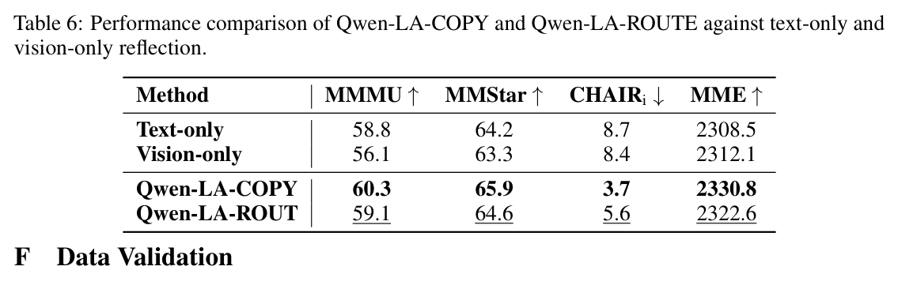
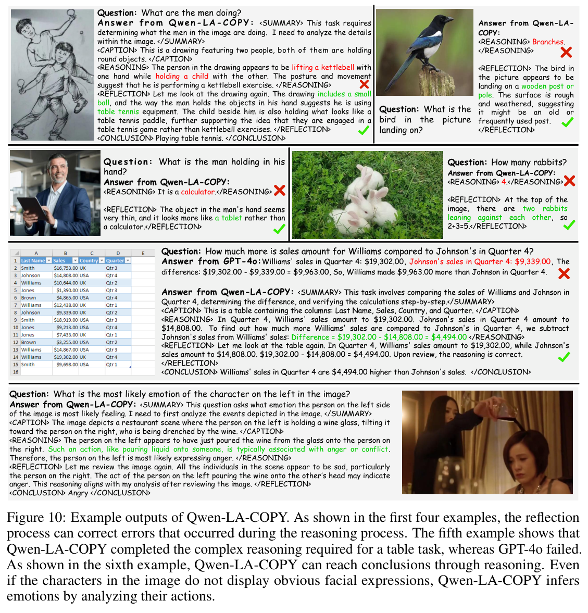

# Qwen Look Again: Guiding Vision-Language Reasoning Models to Re-attention Visual Information

> **中文题名：** Qwen 再看一眼：引导视觉语言推理模型重新关注视觉信息  
> **作者：** Xu Chu, Xinrong Chen, Guanyu Wang, Zhijie Tan, Kui Huang, Wenyu Lv, Tong Mo, Weiping Li  
> **出处：** arXiv:2505.23558v2，2025-05-30  
> **论文类型：** 方法 / train / reinforcement learning / visual re-attention  
> **源文件：** `Chu 等 - 2025 - Qwen Look Again Guiding Vision-Language Reasoning Models to Re-attention Visual Information.pdf`  
> **阅读器：** 全文英中对照；源格式为 `pdf-text`；图表按首次实质讨论位置重排。页码与稳定块 ID 见 `source_map.json`。

## Page / Section Index

- Abstract: page 1
- Introduction: pages 1-3
- Methodology: pages 4-7
- Experiment: pages 7-9
- Conclusion and Limitations: pages 9-10
- References and Appendix: pages 10-17

## Terminology Ledger

| Canonical term | 中文 | First-use decision |
|---|---|---|
| Vision-Language Reasoning Model | 视觉语言推理模型 | 保留 VLRM 缩写 |
| Qwen-LookAgain | Qwen-LA | 方法名保留 |
| Balanced Reflective Policy Optimization | 平衡反思式策略优化 | 保留 BRPO 缩写 |
| Visual Token COPY | 视觉标记复制 | 保留 VTC 缩写 |
| Visual Token ROUTE | 视觉标记路由 | 保留 VTR 缩写 |
| vision-text reflection | 视觉-文本反思 | 同时包含视觉重注入和文本反思 |
| visual token dilution | 视觉标记稀释 | 长生成导致视觉信息占比下降 |

## Abstract

> <strong>Para. 1:</strong> Inference-time scaling extends reasoning in VLMs and forms VLRMs, but long reasoning dilutes visual tokens, reduces attention to visual information, and may trigger hallucination.

> <strong>Para. 1[CN]:</strong> 测试时扩展让 VLM 产生更长推理并形成视觉语言推理模型，但长推理会稀释视觉标记，降低对视觉信息的注意力，并可能触发幻觉。

> <strong>Para. 2:</strong> Text-only reflection is promising in language models, but the authors show that it is insufficient for suppressing hallucination in VLMs.

> <strong>Para. 2[CN]:</strong> 纯文本反思在语言模型中有潜力，但作者证明它不足以抑制 VLM 幻觉。

> <strong>Para. 3:</strong> Qwen-LookAgain introduces a vision-text reflection process. BRPO teaches the model when to reflect and how to balance the number and length of reflections.

> <strong>Para. 3[CN]:</strong> Qwen-LookAgain 引入视觉-文本反思过程。BRPO 让模型学习何时反思，以及如何平衡反思次数和反思长度。

> <strong>Para. 4:</strong> Visual Token COPY and Visual Token ROUTE force the model to re-attend to visual information during reflection. Experiments show improved QA accuracy and reduced hallucination.

> <strong>Para. 4[CN]:</strong> 视觉标记复制和视觉标记路由会在反思时强制模型重新关注视觉信息。实验显示，这能提升问答准确率并减少幻觉。

## Introduction

> <strong>Para. 1:</strong> Long reasoning improves many language tasks, but in vision-language reasoning it can make the model rely increasingly on language priors and less on image evidence.

> <strong>Para. 1[CN]:</strong> 长推理能提升许多语言任务，但在视觉语言推理中，它可能让模型越来越依赖语言先验，而不是图像证据。

### Figure 1 and Figure 2. Hallucination and Visual Attention

**Caption:** As generation length increases, hallucination metrics worsen and attention to visual tokens decreases; text-only reflection does not fix the issue.

**Caption[CN]:** 随着生成长度增加，幻觉指标变差，视觉标记注意力下降；纯文本反思无法解决这个问题。

> <strong>Para. 2:</strong> The authors therefore propose that reflection should not merely say “look again”; it should actually bring visual information back into the generation context.

> <strong>Para. 2[CN]:</strong> 因此，作者认为反思不能只是嘴上说“再看一眼”；它必须真正把视觉信息带回生成上下文。

## Methodology

### Figure 3. Qwen-LookAgain Framework

**Caption:** Qwen-LA uses cold-start reflection data, BRPO, Qwen-Zero-40k distillation, and VTC/VTR during training and inference.

**Caption[CN]:** Qwen-LA 使用冷启动反思数据、BRPO、Qwen-Zero-40k 蒸馏，并在训练和推理中加入 VTC/VTR。

> <strong>Para. 1:</strong> BRPO is inspired by GRPO but adds rewards specific to reflection. It uses format reward, accuracy reward, and reflection balance reward.

> <strong>Para. 1[CN]:</strong> BRPO 受 GRPO 启发，但加入了面向反思的奖励，包括格式奖励、准确率奖励和反思平衡奖励。

> <strong>Para. 2:</strong> The format reward enforces tags such as summary, caption, reasoning, reflection, and conclusion. The accuracy reward checks the final conclusion. The balance reward discourages excessive reflection length.

> <strong>Para. 2[CN]:</strong> 格式奖励约束 summary、caption、reasoning、reflection 和 conclusion 等标签；准确率奖励检查最终结论；平衡奖励抑制过长反思。

> <strong>Para. 3:</strong> The model is first cold-started with 2k examples, then trained with BRPO on 10k examples. The resulting Qwen-Zero generates 40k reasoning-reflection examples that are corrected by model and human verification.

> <strong>Para. 3[CN]:</strong> 模型先用 2k 样本冷启动，再用 10k 样本进行 BRPO 训练。得到的 Qwen-Zero 生成 40k 推理-反思样本，再经过模型与人工校正。

> <strong>Para. 4:</strong> VTC copies all original visual tokens to the beginning of the reflection process. VTR instead selects the top $m\%$ visual tokens according to attention from previously generated tokens.

> <strong>Para. 4[CN]:</strong> VTC 会把原始视觉标记全部复制到反思过程开头。VTR 则根据已生成标记到视觉标记的注意力，选择排名前 $m\%$ 的视觉标记。

## Experiments

### Table 1. Visual QA Accuracy

**Caption:** Qwen-LA improves over Qwen2.5-VL-7B and is competitive with reasoning baselines across visual QA datasets.

**Caption[CN]:** Qwen-LA 在多个视觉问答数据集上超过 Qwen2.5-VL-7B，并与推理模型基线竞争。

> <strong>Para. 1:</strong> Qwen-LA-COPY reaches 60.3 on MMMU, 41.7 on MMMU-Pro, 82.7 on MMBench, 65.9 on MMStar, and 26.4 on MathVision.

> <strong>Para. 1[CN]:</strong> Qwen-LA-COPY 在 MMMU 上为 60.3，在 MMMU-Pro 上为 41.7，在 MMBench 上为 82.7，在 MMStar 上为 65.9，在 MathVision 上为 26.4。

### Table 2. Hallucination Metrics

**Caption:** Qwen-LA-COPY obtains the best CHAIRi, CHAIRs, POPE, MMHAL, and MME among listed methods.

**Caption[CN]:** Qwen-LA-COPY 在列出的 CHAIRi、CHAIRs、POPE、MMHAL 和 MME 指标上表现最好。

> <strong>Para. 2:</strong> Qwen-LA-COPY reduces CHAIRi to 3.7 and CHAIRs to 9.8, while raising POPE to 90.2 and MME to 2330.8.

> <strong>Para. 2[CN]:</strong> Qwen-LA-COPY 将 CHAIRi 降到 3.7，CHAIRs 降到 9.8，同时把 POPE 提升到 90.2，MME 提升到 2330.8。

### Table 3. Inference Overhead

**Caption:** Qwen-LA adds generated length and inference time, but is faster than some reasoning baselines while more accurate on MMMU.

**Caption[CN]:** Qwen-LA 增加生成长度和推理时间，但在 MMMU 上比部分推理基线更快且更准。

> <strong>Para. 3:</strong> On MMMU, Qwen-LA-COPY reaches 60.3 with 22.33 seconds, while Qwen-LA-ROUTE reaches 59.1 with 18.29 seconds.

> <strong>Para. 3[CN]:</strong> 在 MMMU 上，Qwen-LA-COPY 达到 60.3，耗时 22.33 秒；Qwen-LA-ROUTE 达到 59.1，耗时 18.29 秒。

### Table 4 and Table 5. Ablations

**Caption:** The extracted crop is partial, so the key values are also transcribed in the note.

**Caption[CN]:** 自动裁剪不完整，因此关键数值也在笔记中转写。

**Caption:** Larger ROUTE ratio $m$ generally improves accuracy and hallucination metrics while increasing time.

**Caption[CN]:** 更大的路由比例 $m$ 通常提升准确率和幻觉指标，但增加推理时间。

> <strong>Para. 4:</strong> The best ablation is Qwen-LA-COPY: 60.3 MMMU, 65.9 MMStar, 3.7 CHAIRi, and 2330.8 MME. Text-only BRPO without VTC or VTR reaches only 58.8 MMMU and 8.7 CHAIRi.

> <strong>Para. 4[CN]:</strong> 最好的消融是 Qwen-LA-COPY：MMMU 60.3，MMStar 65.9，CHAIRi 3.7，MME 2330.8。没有 VTC/VTR 的纯文本 BRPO 只有 58.8 MMMU 和 8.7 CHAIRi。

### Figure 5. Attention Visualization

**Caption:** VTC and VTR change visual attention in different ways: VTC can bring in new details, while VTR strengthens previously attended patches.

**Caption[CN]:** VTC 与 VTR 以不同方式改变视觉注意力：VTC 可补充新细节，VTR 强化已有关注图块。

## Conclusion and Appendix

> <strong>Para. 1:</strong> The paper concludes that Qwen-LA improves accuracy and reduces hallucination by combining learned reflection with visual token re-attention.

> <strong>Para. 1[CN]:</strong> 论文结论认为，Qwen-LA 通过学习式反思和视觉标记重关注，提高准确率并减少幻觉。

### Table 6. Reflection Types

**Caption:** Vision-text reflection outperforms text-only and vision-only reflection.

**Caption[CN]:** 视觉-文本反思优于纯文本反思和纯视觉反思。

### Figure 10. Example Outputs

**Caption:** Examples show Qwen-LA-COPY using reflection to correct reasoning and reach conclusions.

**Caption[CN]:** 示例展示 Qwen-LA-COPY 如何用反思修正推理并得到结论。

## Critical Reading Notes

> <strong>Para. 1:</strong> Qwen-LA should be read as a training-based answer to visual-token dilution. Its strongest evidence is hallucination reduction, but its overhead and data pipeline are nontrivial.

> <strong>Para. 1[CN]:</strong> Qwen-LA 应被理解为视觉标记稀释问题的训练型回答。它最强的证据是幻觉下降，但推理开销和数据链路都不轻。
