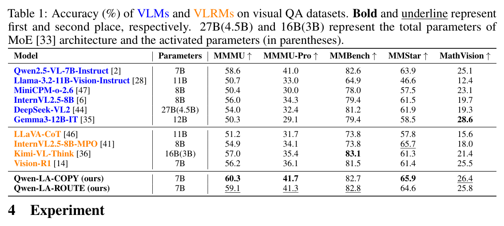
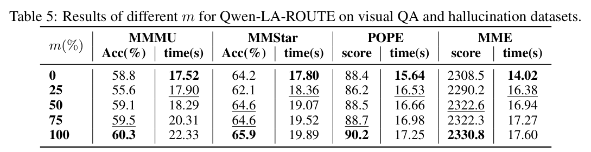
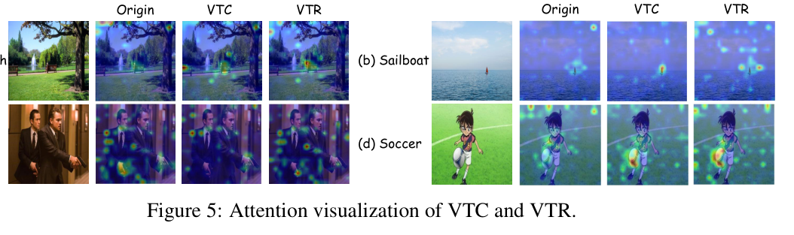

---
tags:
  - papers/visually-grounded-reasoning
  - papers/train
  - papers/hallucination
aliases:
  - "Qwen-LookAgain"
  - "Qwen-LA"
date: 2025-05-30
doi: 10.48550/arXiv.2505.23558
arxiv_id: 2505.23558
---

# Qwen Look Again: Guiding Vision-Language Reasoning Models to Re-attention Visual Information

## 核心信息

- 标题: Qwen Look Again: Guiding Vision-Language Reasoning Models to Re-attention Visual Information
- 标题翻译: Qwen 再看一眼：引导视觉语言推理模型重新关注视觉信息
- 作者: Xu Chu, Xinrong Chen, Guanyu Wang, Zhijie Tan, Kui Huang, Wenyu Lv, Tong Mo, Weiping Li
- 机构: Peking University; Baidu Inc.
- 发表时间: 2025-05-30
- 发表渠道: arXiv
- DOI: 10.48550/arXiv.2505.23558
- arXiv: 2505.23558
- 论文链接: https://arxiv.org/abs/2505.23558
- 代码 / 项目: https://github.com/Liar406/Look_Again
- 数据 / 资源: Qwen2.5-VL-7B-Instruct；Qwen-Zero-40k；MMMU；MMMU-Pro；MMBench；MMStar；MathVision；MSCOCO；POPE；MMHAL；MME
- 论文类型: AI 方法；训练型视觉重关注；强化学习；幻觉抑制

## 原文摘要翻译

测试时扩展通过延长推理提升视觉语言模型表现，并形成强大的视觉语言推理模型。然而，长推理会稀释视觉标记，使视觉信息受到更少注意，并可能触发幻觉。虽然在语言模型中引入纯文本反思过程显示出潜力，但作者证明它不足以抑制 VLM 中的幻觉。

为解决这一问题，作者提出 Qwen-LookAgain，一个新的视觉语言推理模型。它通过引入视觉-文本反思过程，引导模型在推理期间重新关注视觉信息，从而缓解幻觉。作者首先提出平衡反思式策略优化 BRPO，使模型自行决定何时生成视觉-文本反思，并平衡反思的数量和长度。

随后，作者形式化证明视觉语言推理模型会随着推理推进而逐渐失去对视觉标记的注意力，并展示在反思期间补充视觉信息可以增强视觉注意力。因此，训练和推理阶段引入视觉标记复制与视觉标记路由，在视觉层面强制模型重新关注视觉信息，弥补纯文本反思的不足。多个视觉问答数据集和幻觉指标上的实验表明，Qwen-LA 获得领先准确率并减少幻觉。

## 创新点

1. 论文把长推理幻觉具体化为视觉标记稀释问题：生成越长，视觉信息在序列中的比例越低。
2. 它证明纯文本反思不够。模型可以输出“再看图”的文字，但注意力并不一定真的回到视觉标记。
3. BRPO 不只是奖励正确答案，还奖励规范格式与反思平衡，让模型学会何时反思、反思多少。
4. Qwen-Zero-40k 是关键训练桥梁：先用 BRPO 得到 Qwen-Zero，再用它生成带反思的数据，经过校正后做监督微调。
5. VTC 和 VTR 把视觉信息直接插到反思位置。VTC 全量复制视觉标记，VTR 按注意力路由部分视觉标记。
6. 评测不只看准确率，还看 CHAIR、POPE、MMHAL、MME 等幻觉指标，目标更贴近视觉落地可靠性。

## 一句话总结

Qwen-LA 是一条训练型“回看图像”路线：先用 BRPO 学会何时反思，再在反思处复制或路由视觉标记，让模型不只是说“再看一眼”，而是真的把视觉信息带回推理。

## 研究问题

长推理在文本任务中常常有用，但在 VLM 中会带来一个副作用：文本越生成越多，视觉标记在上下文中的相对影响越弱，模型更容易被语言先验牵引。

论文先用 MSCOCO 上的分析说明这一点：生成长度增加时，CHAIRi 上升、Recall 下降；即使加纯文本反思，幻觉也没有被压住。同时，视觉标记平均注意力随生成长度下降，纯文本反思也没有显著拉回视觉注意力。

*论文原图编号：Figure 1 和 Figure 2。长生成使幻觉变重、视觉注意力下降；纯文本反思不能有效修复。*

## 数据与任务定义

训练链路分成四段。

| 阶段 | 数据 / 动作 | 作用 |
|---|---|---|
| 冷启动 | 从 LLaVA-CoT-100k 抽 2k，GPT-4o 插入反思并人工校正 | 让模型先学会反思格式 |
| BRPO | 10k 混合训练数据 | 训练 Qwen-Zero 自发反思 |
| 数据蒸馏 | Qwen-Zero 为 40k 问题生成推理-反思答案 | 构造 Qwen-Zero-40k |
| SFT | 用 Qwen-Zero-40k 全参数微调 Qwen2.5-VL-7B-Instruct | 得到 Qwen-LA-COPY / Qwen-LA-ROUTE |

评测分为视觉问答和幻觉评估。

视觉问答包括 MMMU、MMMU-Pro、MMBench。
还包括 MMStar 和 MathVision。
幻觉评估包括 CHAIR、POPE、MMHAL 和 MME。

## 方法主线

### 机制流程

1. 输入图像和问题后，模型先按 `
`、`<CAPTION>`、`<REASONING>`、`<REFLECTION>`、`<CONCLUSION>` 结构生成推理。
2. BRPO 提取格式、准确率和反思平衡奖励，更新 Qwen2.5-VL-7B-Instruct，得到会自发反思的 Qwen-Zero。
3. Qwen-Zero 生成 40k 推理-反思数据，经模型与人工校正后，用于监督微调 Qwen-LA。
4. 推理到反思位置时，VTC 复制全部视觉标记，或 VTR 查询历史注意力并路由高权重视觉标记，随后输出反思和最终答案。

*论文原图编号：Figure 3。Qwen-LA 的完整训练与推理框架。*

### BRPO

BRPO 有三类奖励。格式奖励要求输出包含固定过程标签，并避免标签嵌套或顺序错误。准确率奖励检查 `<CONCLUSION>` 中的最终答案是否正确。反思平衡奖励鼓励模型在反思次数和总长度之间保持平衡，避免无节制长反思。

论文报告一个有趣现象：冷启动数据只有一次反思，但 BRPO 后模型会逐渐产生多次反思，而且总反思长度下降。这说明模型不是简单复制模板，而是在奖励下学到更频繁但更简洁的反思策略。

### 视觉重关注

论文的形式化分析很简单但有用。设文本提示长度为 $L_x$，视觉标记数为 $L_c$，已生成长度为 $L_y$，总长度为 $L_{\mathrm{total}}=L_x+L_c+L_y$。随着 $L_y$ 增大，视觉标记比例下降。

如果在生成中重新插入 $k$ 个视觉标记，则视觉标记比例变为：

$$
r'=\frac{L_c+k}{L_{\mathrm{total}}+k}.
$$

当 $L_x>0$ 时，$r'>r$。论文据此说明，反思阶段补充视觉标记可以提高视觉信息占比，并可能增强视觉注意力。

VTC 是全量复制：模型生成 `<REFLECTION>` 前，把输入图像的完整视觉标记复制到反思开头。VTR 是选择性路由：先计算已生成标记对每个视觉标记的平均注意力，再选择前 $m\%$ 视觉标记插入反思开头。

## 关键结果

### 主结果与强基线

*论文原图编号：Table 1。Qwen-LA-COPY 在多个视觉问答基准上超过 Qwen2.5-VL-7B，并与其他 VLRM 竞争。*

| Model | MMMU | MMMU-Pro | MMBench | MMStar | MathVision |
|---|---:|---:|---:|---:|---:|
| Qwen2.5-VL-7B-Instruct | 58.6 | 41.0 | 82.6 | 63.9 | 25.1 |
| Kimi-VL-Think | 57.0 | 35.4 | 83.1 | 61.3 | 21.4 |
| Vision-R1 | 56.2 | 36.1 | 81.5 | 61.4 | 25.5 |
| Qwen-LA-COPY | 60.3 | 41.7 | 82.7 | 65.9 | 26.4 |
| Qwen-LA-ROUTE | 59.1 | 41.3 | 82.8 | 64.6 | 25.8 |

Qwen-LA 的准确率提升不是巨大，但比较稳定，尤其 COPY 版本在 MMMU、MMStar 和 MathVision 上都优于基座模型。

### 幻觉指标

*论文原图编号：Table 2。Qwen-LA-COPY 在多个幻觉指标上最强。*

| Model / Method | CHAIRi | CHAIRs | POPE | MMHAL | MME |
|---|---:|---:|---:|---:|---:|
| Qwen2.5-VL-Instruct | 9.4 | 37.1 | 88.7 | 3.68 | 2309.4 |
| PAI | 6.8 | 22.3 | 85.9 | 2.41 | 1644.0 |
| ICoT | 8.3 | 31.2 | 88.6 | 3.38 | 2227.5 |
| Qwen-LA-COPY | 3.7 | 9.8 | 90.2 | 3.82 | 2330.8 |
| Qwen-LA-ROUTE | 5.6 | 11.2 | 88.5 | 3.73 | 2322.6 |

幻觉指标是这篇最有说服力的结果。COPY 把 CHAIRi 从基座的 9.4 降到 3.7，CHAIRs 从 37.1 降到 9.8，同时 POPE、MMHAL、MME 都保持强表现。

### 推理开销

*论文原图编号：Table 3。Qwen-LA 增加生成长度和时间，但相比部分推理基线仍更快。*

| Model | MMMU Acc | Length | Time |
|---|---:|---:|---:|
| Qwen2.5-VL-Instruct | 58.6 | 268.5 | 8.68 |
| Kimi-VL-Think | 57.0 | 1572.5 | 99.08 |
| Vision-R1 | 56.2 | 358.9 | 120.37 |
| Qwen-LA-COPY | 60.3 | 1811.4 | 22.33 |
| Qwen-LA-ROUTE | 59.1 | 1425.8 | 18.29 |

开销不能忽略。Qwen-LA 比基座慢，但比 Kimi-VL-Think 和 Vision-R1 快很多。ROUTE 比 COPY 更快，但准确率和幻觉指标略弱。

### 消融到底说明了什么

*论文原图编号：Table 4。裁剪不完整，关键数值见下表。*

| Setting | MMMU | MMStar | CHAIRi | MME |
|---|---:|---:|---:|---:|
| Qwen2.5-VL-Instruct | 58.6 | 63.9 | 9.4 | 2309.4 |
| w/o BRPO, w/ VTC | 57.2 | 62.2 | 6.4 | 2312.2 |
| w/o BRPO, w/ VTR | 57.0 | 61.3 | 6.2 | 2311.9 |
| w/ BRPO, w/o VTC/VTR | 58.8 | 64.2 | 8.7 | 2308.5 |
| Qwen-LA-COPY | 60.3 | 65.9 | 3.7 | 2330.8 |
| Qwen-LA-ROUTE | 59.1 | 64.6 | 5.6 | 2322.6 |

这张消融说明两个模块都必要。没有 BRPO 时，视觉重关注不稳定；只有 BRPO 但没有 VTC/VTR 时，接近纯文本反思，幻觉下降不明显。COPY 和 ROUTE 同时具备行为学习和视觉信息补充，效果最好。

*论文原图编号：Table 5。VTR 的路由比例越大，通常表现越好，但时间也上升。*

### 注意力可视化

*论文原图编号：Figure 5。VTC 会补充新细节，VTR 会强化已有高注意图块。*

论文还报告，和没有视觉重关注的 Figure 2 相比，Qwen-LA-COPY 与 Qwen-LA-ROUTE 在生成过程中对视觉标记的平均注意力更高。Figure 5 给出直观例子：VTC 有时会看到第一轮没注意到的细节，VTR 则更像把原本高注意区域再放大。

### 附录反思类型对比

*论文原图编号：Table 6。视觉-文本反思优于纯文本反思和纯视觉反思。*

| Method | MMMU | MMStar | CHAIRi | MME |
|---|---:|---:|---:|---:|
| Text-only | 58.8 | 64.2 | 8.7 | 2308.5 |
| Vision-only | 56.1 | 63.3 | 8.4 | 2312.1 |
| Qwen-LA-COPY | 60.3 | 65.9 | 3.7 | 2330.8 |
| Qwen-LA-ROUTE | 59.1 | 64.6 | 5.6 | 2322.6 |

*论文原图编号：Figure 10。Qwen-LA-COPY 的输出示例，展示反思如何修正推理。*

## 深度分析

### 真正贡献是什么

这篇的真正贡献不是“让 Qwen 多一个反思标签”，而是把反思和视觉信息重新注入绑定在一起。它指出纯文本反思会变成语言自嗨，只有在反思位置重新加入视觉标记，模型才更可能真的回到图像证据。

### 为什么结果成立

BRPO 让模型学会何时反思和反思多少，避免无效长反思；VTC/VTR 则让反思阶段获得新的视觉输入比例。两者分别处理“行为策略”和“视觉证据”两个问题，所以表 4 中单独拿掉任一部分都会掉。

### 容易误读的地方

不能把这篇简单理解成“复制视觉标记就行”。没有 BRPO 时，VTC/VTR 的准确率反而下降，说明视觉标记插入需要配合稳定的反思格式和训练数据。另一个误读是忽视开销：COPY 很强，但长度和时间都更高。

### 复现注意点

复现成本不低。BRPO 训练报告使用 8 张 A800 80G 训练 48 小时；冷启动数据由 GPT-4o 插入反思并人工校正；Qwen-Zero-40k 还需要模型与人工共同验证。视觉重关注还涉及推理时修改视觉标记插入路径。

## 局限

第一，理论分析假设幻觉的重要原因之一是视觉信息被忽视。这是合理假设，但并不能覆盖所有幻觉来源。

第二，VTC 和 VTR 都增加推理开销。论文也承认，在需要即时响应的场景中，这可能不可接受。

第三，方法只在 Qwen2.5-VL-Instruct 上实现。作者认为可以扩展到其他 VLM，但论文没有系统证明跨架构泛化。

第四，从 Position paper 的视角看，还需要更强的因果消融来证明反思阶段插入的视觉标记确实被模型使用，而不仅是训练数据和输出格式带来的分布变化。

## 我的笔记

Qwen-LA 是 Train 线里很典型的一篇：它不是测试时插件，而是把“会回看图像”训练成模型行为。

它和 SDR-MCoT、VisRef、PRCR 可以组成一条链。
SDR-MCoT 决定是否长推理，VisRef/PRCR 负责测试时回注或复用视觉证据。
Qwen-LA 则通过训练让反思阶段天然带视觉重关注。

对 3D agent 来说，最有用的启发是“反思位置就是重新注入证据的位置”。当 agent 发现推理可能错了，不应该只生成一段自我反思文本，而应该把相关视角、局部点云、渲染图或空间记忆重新插入反思上下文。

我会把这篇和 Position paper 放在一起读：Qwen-LA 给出了训练视觉回看的机制，但 Position paper 提醒我们必须做消融，验证这些视觉标记是否真的在起因果作用。

## 引用

- 论文: Xu Chu, Xinrong Chen, Guanyu Wang, Zhijie Tan, Kui Huang, Wenyu Lv, Tong Mo, Weiping Li. *Qwen Look Again: Guiding Vision-Language Reasoning Models to Re-attention Visual Information*. arXiv:2505.23558, 2025.
- 全文对照翻译: [paper.md](Reasoning/Train/Qwen%20Look%20Again%20Guiding%20Vision-Language%20Reasoning%20Models%20to%20Re-attention%20Visual%20Information/paper.md)
- 来源映射: [source_map.json](Reasoning/Train/Qwen%20Look%20Again%20Guiding%20Vision-Language%20Reasoning%20Models%20to%20Re-attention%20Visual%20Information/source_map.json)
- 阅读计划: [paper_DeepPaperNote.plan.json](Reasoning/Train/Qwen%20Look%20Again%20Guiding%20Vision-Language%20Reasoning%20Models%20to%20Re-attention%20Visual%20Information/paper_DeepPaperNote.plan.json)
- 来源清单: [paper_DeepPaperNote.source_manifest.json](paper_DeepPaperNote.source_manifest.json)
- 证据包: [paper_DeepPaperNote.bundle.json](paper_DeepPaperNote.bundle.json)
- 图表决策: [paper_DeepPaperNote.figure_decisions.json](Reasoning/Train/Qwen%20Look%20Again%20Guiding%20Vision-Language%20Reasoning%20Models%20to%20Re-attention%20Visual%20Information/paper_DeepPaperNote.figure_decisions.json)
