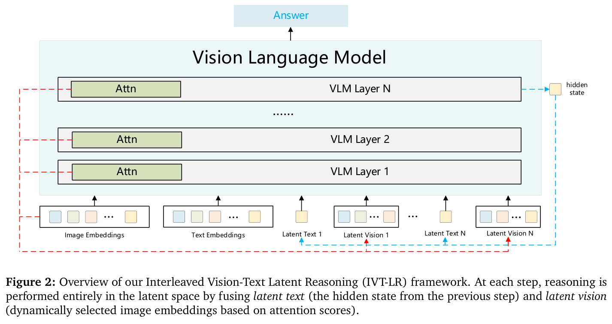
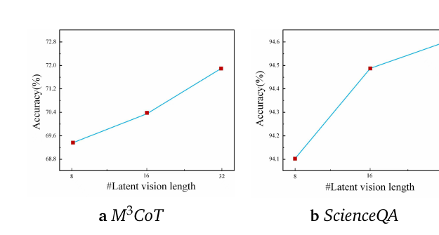
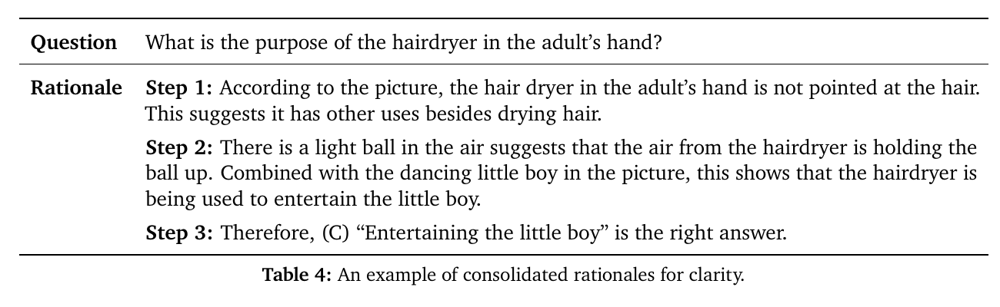
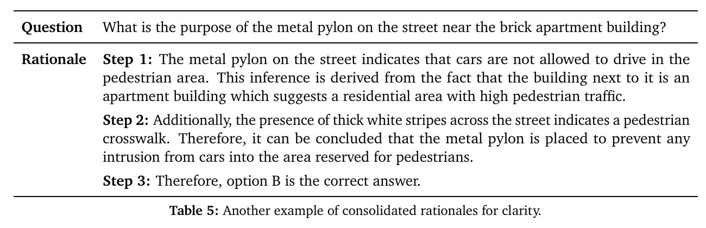

# Reasoning in the Dark: Interleaved Vision-Text Reasoning in Latent Space

> **中文题名：** 暗中推理：潜在空间中的交错视觉-文本推理  
> **作者：** Chao Chen, Zhixin Ma, Yongqi Li, Yupeng Hu, Yinwei Wei, Wenjie Li, Liqiang Nie  
> **出处：** arXiv:2510.12603v2，2026-01-29  
> **论文类型：** 方法 / train / multimodal latent reasoning / efficient VQA  
> **源文件：** `Chen 等 - 2026 - Reasoning in the Dark Interleaved Vision-Text Reasoning in Latent Space.pdf`  
> **阅读器：** 全文主干英中对照阅读件；源格式为 `pdf-text`；图表按首次实质讨论位置重排。页码与稳定块 ID 见 `source_map.json`。

## Page / Section Index

- Abstract: page 1
- Introduction: pages 1-2
- Related Work: pages 2-3
- Method: pages 3-6
- Experiments: pages 6-9
- Conclusion: page 9
- References: pages 9-11
- Appendix A: pages 11-12

## Terminology Ledger

| Canonical term | 中文 | Translation decision |
|---|---|---|
| Interleaved Vision-Text Latent Reasoning (IVT-LR) | 交错视觉-文本潜在推理 | 首次给出全称，后续保留 IVT-LR |
| multimodal latent reasoning | 多模态潜在推理 | 指视觉与文本都在隐藏空间中参与推理 |
| latent text | 潜在文本 | 上一步最后隐藏状态 |
| latent vision | 潜在视觉 | 当前步骤选中的图像嵌入集合 |
| explicit reasoning | 显式推理 | 会生成可见中间文本或图像的推理 |
| autoregressive step | 自回归步 | 需要解码输出标记的步骤 |
| attention ratio | 注意力比 | 视觉部分与文本部分的注意力总量之比 |
| attention focus | 注意力集中度 | 由注意力分布逆熵定义 |
| progressive multi-stage training | 渐进式多阶段训练 | 从完整 CoT 逐步替换为潜在步骤 |

## Abstract

> <strong>Para. 1:</strong> Multimodal reasoning improves MLLMs by introducing intermediate reasoning steps before the final answer. The field has progressed from text-only reasoning to processes that integrate visual information and express thought through both images and text.

> <strong>Para. 1[CN]:</strong> 多模态推理通过在最终答案之前引入中间推理步骤来增强 MLLM。该领域已经从纯文本推理发展到融合视觉信息、并用图像与文本共同表达思考过程的路线。

> <strong>Para. 2:</strong> Existing multimodal reasoning methods rely on explicit steps, which require labor-intensive vision-text annotations and introduce substantial inference latency. The paper therefore studies multimodal latent reasoning for richer representation, reduced annotation, and faster inference.

> <strong>Para. 2[CN]:</strong> 现有多模态推理方法依赖显式步骤，需要耗费大量人力的视觉-文本标注，并引入显著推理延迟。因此，本文研究多模态潜在推理，以获得更丰富的表征、减少标注并加速推理。

> <strong>Para. 3:</strong> IVT-LR injects visual and textual information into latent-space reasoning. Each step combines latent text, represented by the hidden state from the previous step, with latent vision, represented by selected image embeddings.

> <strong>Para. 3[CN]:</strong> IVT-LR 把视觉与文本信息注入潜在空间推理。每一步结合两部分：由前一步隐藏状态表示的潜在文本，以及由选中图像嵌入表示的潜在视觉。

> <strong>Para. 4:</strong> A progressive multi-stage strategy trains MLLMs to perform these latent steps. On M3CoT and ScienceQA, the authors report an average accuracy improvement of 5.45% and a speed increase of more than five times over existing approaches.

> <strong>Para. 4[CN]:</strong> 作者用渐进式多阶段策略训练 MLLM 执行这些潜在步骤。在 M3CoT 与 ScienceQA 上，论文报告平均准确率提升 5.45%，相对现有方法的速度提高超过 5 倍。

## 1 Introduction

> <strong>Para. 1:</strong> Advances in chain-of-thought prompting and reinforcement-trained reasoning models have strengthened LLM reasoning. This success has motivated the extension of reasoning to multimodal tasks such as visual question answering.

> <strong>Para. 1[CN]:</strong> 思维链提示与强化学习推理模型的发展增强了 LLM 的推理能力，也推动研究者把推理扩展到视觉问答等多模态任务。

> <strong>Para. 2:</strong> Multimodal reasoning methods have followed a progression. Early systems generated textual rationales from visual inputs. Later methods inserted selected image patches, learned to zoom into fine-grained regions, or generated images and sketches as explicit visual thoughts.

> <strong>Para. 2[CN]:</strong> 多模态推理经历了逐步演进。早期系统从视觉输入生成文本解释；后续方法会插入选中的图像 patch、学习放大细粒度区域，或者生成图像与草图作为显式视觉思维。

### Figure 1. Interleaved vision-text latent reasoning

**Caption:** An example in which three intermediate reasoning steps are carried out in multimodal latent space.

**Caption[CN]:** 三个中间推理步骤全部在多模态潜在空间中完成的示例。

**Reading note:** 图中的局部鸟图与虚线文字是解释性示意，不表示模型在推理时真正生成了这些可见中间结果。

> <strong>Para. 3:</strong> Latent reasoning avoids explicit and lengthy textual chains by reusing continuous hidden vectors. The authors argue that this is especially promising for multimodal reasoning because latent states can carry rich cross-modal information, reduce the need for step-level vision-text annotation, and avoid long autoregressive traces.

> <strong>Para. 3[CN]:</strong> 潜在推理通过复用连续隐藏向量，避免显式而冗长的文本链。作者认为它尤其适合多模态推理，因为潜在状态能够携带丰富的跨模态信息，减少逐步视觉-文本标注，并避免长自回归轨迹。

> <strong>Para. 4:</strong> In IVT-LR, each latent step contains a previous hidden state and a fixed number of image embeddings selected by attention scores. A progressive curriculum replaces explicit CoT steps with these latent units while supervising the remaining future steps and final answer.

> <strong>Para. 4[CN]:</strong> 在 IVT-LR 中，每个潜在步骤包含前一步隐藏状态，以及按注意力分数选出的固定数量图像嵌入。渐进课程逐步用这些潜在单元替换显式 CoT，同时监督剩余的未来步骤和最终答案。

> <strong>Para. 5:</strong> The claimed contributions are a unified multimodal latent reasoning framework, a data- and compute-efficient training paradigm that avoids explicit intermediate visual annotations, and improved accuracy and inference efficiency on M3CoT and ScienceQA.

> <strong>Para. 5[CN]:</strong> 论文声称的贡献包括：统一的多模态潜在推理框架；无需显式中间视觉标注的数据与计算高效训练范式；以及在 M3CoT 和 ScienceQA 上更高的准确率与推理效率。

## 2 Related Work

### 2.1 Multimodal Reasoning

> <strong>Para. 1:</strong> Text-only multimodal reasoning converts visual information into language before reasoning. It may use captions, image-aware rationales, or graphs of entities and relations to create a textual representation for an LLM.

> <strong>Para. 1[CN]:</strong> 纯文本多模态推理先把视觉信息转换成语言，再进行推理。它可以使用 caption、图像感知解释，或实体关系图，为 LLM 构建文本表示。

> <strong>Para. 2:</strong> Vision-text reasoning instead keeps images involved during rationale generation. Prior work has annotated key regions, progressively extracted relevant image areas, generated sketches or new images, and even reasoned using only generated visual sequences.

> <strong>Para. 2[CN]:</strong> 视觉-文本推理则让图像继续参与解释生成。既有工作标注关键区域、逐步提取相关图像区域、生成草图或新图像，甚至完全依靠生成的视觉序列进行推理。

> <strong>Para. 3:</strong> These explicit approaches expose the intermediate process, but they require long generated sequences or specially aligned vision-text rationales. IVT-LR retains visual participation while removing visible intermediate generation.

> <strong>Para. 3[CN]:</strong> 这些显式路线能暴露中间过程，但需要生成长序列，或构造专门对齐的视觉-文本解释。IVT-LR 保留视觉参与，同时取消可见中间生成。

### 2.2 Latent Reasoning

> <strong>Para. 1:</strong> Early latent reasoning methods introduced learnable pause or plan tokens. Later work directly reused continuous hidden states, used variable-length contemplation vectors, or aligned hidden activations with CoT teachers through self-distillation.

> <strong>Para. 1[CN]:</strong> 早期潜在推理方法引入可学习的 pause 或 plan 标记。后续工作直接复用连续隐藏状态、使用可变长度思考向量，或通过自蒸馏把隐藏激活与 CoT 教师对齐。

> <strong>Para. 2:</strong> Multimodal latent reasoning has also been explored through latent visual tokens and continuous multimodal thoughts. The authors position prior work as single-modal in the latent process and present IVT-LR as the first framework to combine latent text and latent vision at every step.

> <strong>Para. 2[CN]:</strong> 多模态领域也开始研究潜在视觉标记和连续多模态思维。作者把既有工作定位为潜在过程中的单模态路线，并将 IVT-LR 描述为首个在每一步结合潜在文本与潜在视觉的框架。

## 3 Method

> <strong>Para. 1:</strong> Let $X=(x_1,\ldots,x_I)$ be a text sequence and $Z=(z_1,\ldots,z_J)$ visual embeddings. A standard VLM encodes text, fuses it with visual features, and predicts the next-token distribution.

> <strong>Para. 1[CN]:</strong> 设 $X=(x_1,\ldots,x_I)$ 为文本序列，$Z=(z_1,\ldots,z_J)$ 为视觉嵌入。标准 VLM 编码文本、与视觉特征融合，并预测下一标记的分布。

$$
e^{\text{text}}_{1:t}=g(x_{1:t}),\qquad e^{\text{fused}}=f(e^{\text{text}}_{1:t},Z),\qquad M(x_{t+1}\mid x_{1:t},Z)=\operatorname{softmax}(We^{\text{fused}}).
$$

### Figure 2. IVT-LR framework

**Caption:** Each step fuses latent text from the previous hidden state with latent vision selected from image embeddings by attention.

**Caption[CN]:** 每一步把前一步隐藏状态形成的潜在文本，与通过注意力从图像嵌入中选出的潜在视觉融合。

**Reading note:** 红色路径表示视觉 embedding 的选择与再次接入，蓝色路径表示隐藏状态回流。

### 3.1 Multimodal Latent Reasoning

> <strong>Para. 1:</strong> The textual modality bypasses explicit token prediction. The final hidden state from the previous step, $h^{\text{hidden}}_{t-1}$, becomes latent text and carries the intermediate reasoning state in continuous space.

> <strong>Para. 1[CN]:</strong> 文本模态绕过显式标记预测。前一步最后隐藏状态 $h^{\text{hidden}}_{t-1}$ 作为潜在文本，在连续空间中携带中间推理状态。

> <strong>Para. 2:</strong> Latent vision models the visual focus at each step. The method sums attention scores across layers, selects the $k$ highest-scoring image embeddings, and appends them to the hidden state.

> <strong>Para. 2[CN]:</strong> 潜在视觉建模每一步的视觉焦点。该方法跨层累加注意力分数，选择得分最高的 $k$ 个图像嵌入，并把它们附加到隐藏状态。

$$
u_{t-1}=\left[h^{\text{latent}}_{t-1};Z^{\text{selected}}_{t-1}\right].
$$

> <strong>Para. 3:</strong> At step $t$, the model receives the question embeddings plus all previous hidden states and their selected visual features. It fuses this multimodal sequence and predicts either the next latent transition or, after the latent phase, the final answer tokens.

> <strong>Para. 3[CN]:</strong> 在第 $t$ 步，模型接收问题嵌入，以及之前所有隐藏状态和它们对应的视觉特征。模型融合这条多模态序列，执行下一潜在转移；潜在阶段结束后再预测最终答案标记。

### 3.2 Training Procedure

### Figure 3. Progressive multi-stage training

**Caption:** Training starts with full explicit CoT and progressively replaces one explicit step with latent text and latent vision. Loss is applied to remaining explicit steps and the final answer.

**Caption[CN]:** 训练从完整显式 CoT 开始，逐步用潜在文本与潜在视觉替换一个显式步骤。损失施加在剩余显式步骤和最终答案上。

> <strong>Para. 1:</strong> Each training rationale is segmented into at most $N$ steps followed by an answer. Stage 0 uses standard CoT supervision so the model first acquires symbolic reasoning ability.

> <strong>Para. 1[CN]:</strong> 每条训练解释被切分为最多 $N$ 个步骤，之后是答案。第 0 阶段使用标准 CoT 监督，让模型先获得符号推理能力。

> <strong>Para. 2:</strong> In later stages, one additional explicit step is replaced from the beginning of the rationale by a latent text-vision unit. The remaining future steps and final answer continue to provide supervision.

> <strong>Para. 2[CN]:</strong> 在后续阶段中，训练从解释开头开始，每次额外把一个显式步骤替换为潜在文本-视觉单元。其余未来步骤与最终答案继续提供监督。

> <strong>Para. 3:</strong> Training minimizes negative log-likelihood only on explicit reasoning targets and the final answer. Question tokens and latent steps are masked. Unlike hidden-state distillation, the method does not force the latent trajectory to align with a teacher's exact linguistic path.

> <strong>Para. 3[CN]:</strong> 训练只在显式推理目标与最终答案上最小化负对数似然。问题标记和潜在步骤被 mask。与隐藏状态蒸馏不同，该方法不强制潜在轨迹与教师的精确语言路径对齐。

### Algorithm 1. IVT-LR inference procedure

**Caption:** The algorithm repeatedly obtains the last hidden state, selects visual embeddings, appends the joint latent unit, and decodes the answer after the last latent position.

**Caption[CN]:** 算法反复取得最后隐藏状态、选择视觉嵌入、附加联合潜在单元，并在最后潜在位置之后解码答案。

### 3.3 Inference Process

> <strong>Para. 1:</strong> At inference, the same number of latent positions used by the final training stage is appended after the question and image. Reasoning is fully latent, and no explicit rationale is generated before the answer.

> <strong>Para. 1[CN]:</strong> 推理时，在问题和图像之后附加与最终训练阶段相同数量的潜在位置。推理完全发生在潜在空间，答案之前不生成显式解释。

> <strong>Para. 2:</strong> Intermediate checkpoints can be evaluated with a mixture of latent and explicit steps. Latent text and latent vision coexist only during the latent phase; answer generation returns to ordinary language decoding.

> <strong>Para. 2[CN]:</strong> 中间 checkpoint 可以用潜在步骤与显式步骤的混合方式评估。潜在文本和潜在视觉只在潜在阶段共存；答案生成会回到普通语言解码。

## 4 Experiments

### 4.1 Experimental Setup

> <strong>Para. 1:</strong> M3CoT evaluates multi-domain, multi-step multimodal reasoning. ScienceQA contains science and language questions, many accompanied by diagrams or images. Metrics are exact-match accuracy, average autoregressive steps, and average response time.

> <strong>Para. 1[CN]:</strong> M3CoT 评估多领域、多步骤的多模态推理。ScienceQA 包含科学与语言问题，其中许多题目带有图示或图像。指标为精确匹配准确率、平均自回归步数和平均响应时间。

> <strong>Para. 2:</strong> Baselines include No-CoT, Multimodal-CoT, CCoT, ICoT, SCAFFOLD, and Chain-of-Focus. Every method is evaluated with Qwen2-VL-7B and Chameleon-7B backbones.

> <strong>Para. 2[CN]:</strong> 对比方法包括 No-CoT、Multimodal-CoT、CCoT、ICoT、SCAFFOLD 和 Chain-of-Focus。所有方法都在 Qwen2-VL-7B 与 Chameleon-7B 主干模型上评估。

> <strong>Para. 3:</strong> IVT-LR uses four training stages, batch size four, the Adam optimizer with learning rate $4\times10^{-5}$ and $\beta_1=0.9$, and four NVIDIA A6000 GPUs with 48GB memory each.

> <strong>Para. 3[CN]:</strong> IVT-LR 使用四个训练阶段，批量大小为 4；Adam 学习率为 $4\times10^{-5}$，$\beta_1=0.9$；硬件为 4 张 48GB NVIDIA A6000 GPU。

### Table 1. Main accuracy and efficiency comparison

**Caption:** Accuracy, autoregressive steps, and average generation time on M3CoT and ScienceQA with Qwen2-VL-7B and Chameleon-7B.

**Caption[CN]:** 在 Qwen2-VL-7B 与 Chameleon-7B 上比较 M3CoT 和 ScienceQA 的准确率、自回归步数及平均生成时间。

### 4.2 Main Results

> <strong>Para. 1:</strong> IVT-LR obtains the highest accuracy in all four backbone-dataset combinations. Against Chain-of-Focus, it improves M3CoT by 7.5 points with Qwen2-VL and 5.3 points with Chameleon; ScienceQA gains are 3.4 and 2.8 points.

> <strong>Para. 1[CN]:</strong> IVT-LR 在四个主干模型-数据集组合上都取得最高准确率。相较 Chain-of-Focus，Qwen2-VL 和 Chameleon 上的 M3CoT 分别提升 7.5 和 5.3 个点；ScienceQA 分别提升 3.4 和 2.8 个点。

> <strong>Para. 2:</strong> IVT-LR requires only 10 autoregressive steps on M3CoT and 11 on ScienceQA, compared with tens or hundreds of steps for explicit-reasoning baselines. The reduction comes from not decoding intermediate rationales.

> <strong>Para. 2[CN]:</strong> IVT-LR 在 M3CoT 上只需要 10 个自回归步，在 ScienceQA 上需要 11 个；显式推理基线需要数十至数百步。减少来自不再解码中间解释。

> <strong>Para. 3:</strong> With Qwen2-VL, IVT-LR takes about 0.66 seconds per example, versus 2.09 to 5.31 seconds for explicit baselines. No-CoT remains faster at about 0.35 seconds, but its accuracy is much lower.

> <strong>Para. 3[CN]:</strong> 在 Qwen2-VL 上，IVT-LR 每个样本约耗时 0.66 秒，而显式基线为 2.09 至 5.31 秒。No-CoT 仍以约 0.35 秒更快，但准确率明显更低。

> <strong>Para. 4:</strong> The paper summarizes the result as simultaneous gains in accuracy and efficiency. However, the reported 5.45% average improvement is not directly recoverable from the four differences to the strongest baseline in Table 1, which average 4.75 points.

> <strong>Para. 4[CN]:</strong> 论文把结果总结为准确率与效率同时提升。不过，摘要中的平均 5.45% 无法由 Table 1 中相对最强基线的四组差值直接复算；这四组差值平均为 4.75 个百分点。

### 4.3 Ablation Study

### Table 2. Latent-component ablation

**Caption:** Removing latent text, latent vision, or the whole latent component reduces accuracy.

**Caption[CN]:** 去掉潜在文本、潜在视觉或整个潜在部分都会降低准确率。

> <strong>Para. 1:</strong> Removing latent text reduces M3CoT from 71.83 to 52.20 and ScienceQA from 94.1 to 84.7. The authors interpret latent text as a compact continuous carrier of intermediate reasoning that avoids discrete language alignment errors.

> <strong>Para. 1[CN]:</strong> 去掉潜在文本后，M3CoT 从 71.83 降到 52.20，ScienceQA 从 94.1 降到 84.7。作者把潜在文本解释为紧凑的连续中间推理载体，可避免离散语言对齐误差。

> <strong>Para. 2:</strong> Removing latent vision produces an even larger drop, to 46.64 on M3CoT and 82.3 on ScienceQA. This supports the importance of repeatedly injecting selected visual cues during reasoning.

> <strong>Para. 2[CN]:</strong> 去掉潜在视觉造成更大跌幅，M3CoT 降至 46.64，ScienceQA 降至 82.3。这支持在推理中反复注入选中视觉线索的重要性。

> <strong>Para. 3:</strong> Removing the whole latent component gives 58.02 and 86.4, which is better than removing latent vision alone. The components therefore interact non-additively, and the ablation does not isolate pure information content from sequence-structure effects.

> <strong>Para. 3[CN]:</strong> 去掉整个潜在部分得到 58.02 和 86.4，反而好于只去掉潜在视觉。因此，各组件存在非加性交互，这组消融没有把信息内容与序列结构效应完全分开。

### 4.4 In-depth Analysis

### Figure 4. Latent-vision length

**Caption:** Accuracy as the number of selected latent-vision embeddings per step increases from 8 to 32.

**Caption[CN]:** 每步选择的潜在视觉嵌入数量从 8 增至 32 时的准确率变化。

> <strong>Para. 1:</strong> Accuracy rises as each step receives more image embeddings. The authors argue that longer selections gradually approach full-image coverage while still accumulating evidence step by step.

> <strong>Para. 1[CN]:</strong> 每一步接收更多图像嵌入时，准确率随之上升。作者认为，更长的选择逐渐接近整图覆盖，同时仍能逐步累积证据。

> <strong>Para. 2:</strong> For Qwen2-VL, 32 selected embeddings over three steps are described as roughly covering the whole image. The paper does not pair this curve with latency or memory measurements, so the analysis establishes an accuracy trend rather than an efficiency optimum.

> <strong>Para. 2[CN]:</strong> 对 Qwen2-VL，作者称三个步骤各选择 32 个嵌入大致能覆盖整图。论文没有同时报告时延或显存，因此该分析只建立准确率趋势，没有确定效率最优点。

### Table 3. Number of latent stages

**Caption:** M3CoT accuracy for one, two, and three latent reasoning stages, broken down by domain.

**Caption[CN]:** 一、二、三个潜在推理阶段在 M3CoT 上的分领域准确率。

> <strong>Para. 3:</strong> Total M3CoT accuracy increases from 56.30 with one stage to 61.48 with two and 71.83 with three. Mathematics improves most, from 38.59 to 63.07, followed by science and commonsense.

> <strong>Para. 3[CN]:</strong> M3CoT 总准确率从一个阶段的 56.30 提升到两个阶段的 61.48，再到三个阶段的 71.83。数学提升最大，从 38.59 增至 63.07，其次是科学和常识。

> <strong>Para. 4:</strong> These checkpoints differ not only in inference depth but also in progressive training exposure. The table therefore does not cleanly separate the benefit of an extra latent step at test time from the benefit of an additional curriculum stage.

> <strong>Para. 4[CN]:</strong> 这些 checkpoint 不仅推理深度不同，渐进训练暴露量也不同。因此，该表没有干净地区分测试时多一个潜在步骤的收益，与额外课程阶段的收益。

### Figure 5. Attention analysis

**Caption:** Visual-to-text attention ratio and inverse-entropy attention focus across explicit and latent reasoning steps.

**Caption[CN]:** 显式与潜在推理步骤中的视觉-文本注意力比，以及基于逆熵的注意力集中度。

> <strong>Para. 5:</strong> The attention ratio is defined as the total attention on selected visual embeddings divided by the total attention on text or latent-text states.

> <strong>Para. 5[CN]:</strong> 注意力比定义为选中视觉嵌入上的总注意力，除以文本或潜在文本状态上的总注意力。

$$
R=\frac{\sum_{j\in\mathcal{I}}\operatorname{Attn}(E_j)}{\sum_{i\in\mathcal{T}}\operatorname{Attn}(E_i)}.
$$

> <strong>Para. 6:</strong> Attention focus is the inverse entropy of the normalized attention distribution. Higher values indicate that attention is concentrated on fewer elements.

> <strong>Para. 6[CN]:</strong> 注意力集中度是归一化注意力分布的逆熵。数值越高，表示注意力越集中在较少元素上。

$$
H=-\sum_k p_k\log p_k,\qquad p_k=\frac{\operatorname{Attn}(E_k)}{\sum_m\operatorname{Attn}(E_m)},\qquad F=\frac{1}{H+\epsilon}.
$$

> <strong>Para. 7:</strong> Latent reasoning starts with a high visual-to-text ratio and gradually shifts toward latent text, while its attention focus rises across steps. Explicit reasoning remains more text-dominated and diffuse. These are descriptive correlations, not causal evidence that the selected visual embeddings determine the answer.

> <strong>Para. 7[CN]:</strong> 潜在推理开始时视觉-文本比很高，随后逐渐转向潜在文本；其注意力集中度也随步骤上升。显式推理则更偏向文本，分布也更分散。这些是描述性相关，并非选中视觉嵌入决定答案的因果证据。

## 5 Conclusion

> <strong>Para. 1:</strong> IVT-LR combines latent text and latent vision to internalize multimodal reasoning trajectories. The authors conclude that this reduces attention dilution from long explicit text and full-image processing while improving accuracy and efficiency on visual reasoning tasks.

> <strong>Para. 1[CN]:</strong> IVT-LR 结合潜在文本和潜在视觉，把多模态推理轨迹内化。作者认为，这缓解了长显式文本与整图处理造成的注意力稀释，并提高视觉推理任务的准确率与效率。

> <strong>Para. 2:</strong> Future work could choose the number of latent steps dynamically according to question complexity and extend the approach from VQA to planning and decision-making in dynamic environments.

> <strong>Para. 2[CN]:</strong> 未来工作可以根据问题复杂度动态决定潜在步骤数量，并把该方法从 VQA 扩展到动态环境中的规划与决策。

## References

> <strong>Para. 1:</strong> The paper cites 31 references spanning chain-of-thought prompting, multimodal CoT, interleaved visual reasoning, continuous latent reasoning, M3CoT, ScienceQA, Qwen2-VL, and Chameleon. Bibliographic entries are retained in the source PDF and are not translated line by line here.

> <strong>Para. 1[CN]:</strong> 论文包含 31 条参考文献，覆盖思维链提示、多模态 CoT、交错视觉推理、连续潜在推理、M3CoT、ScienceQA、Qwen2-VL 与 Chameleon。书目条目保留在源 PDF 中，本阅读件不逐条翻译。

## Appendix A. Training Data Construction

### Figure 6. Native rationale-step distribution

**Caption:** Distribution of native rationale steps in M3CoT and ScienceQA.

**Caption[CN]:** M3CoT 与 ScienceQA 的原生解释步数分布。

> <strong>Para. 1:</strong> The final design uses $N=4$, corresponding to three core reasoning steps. Both datasets have median rationale lengths near ten sentences, and more than 70% of examples contain over three native steps.

> <strong>Para. 1[CN]:</strong> 最终设计使用 $N=4$，对应三个核心推理步骤。两个数据集的解释长度中位数都接近 10 句，且超过 70% 的样本包含三个以上原生步骤。

> <strong>Para. 2:</strong> Adjacent sentences are consolidated into three higher-level subtasks for standardized training. Some original one- and two-step examples are retained to preserve short-reasoning ability and improve generalization across depths.

> <strong>Para. 2[CN]:</strong> 相邻句子被合并成三个更高层子任务，以标准化训练。作者保留了一部分原始一至两步样本，以维持短推理能力，并提高跨不同深度的泛化。

### Table 4. Consolidated rationale example 1

**Caption:** A hairdryer question consolidated into three rationale steps.

**Caption[CN]:** 将吹风机用途问题合并为三个解释步骤的样例。

### Table 5. Consolidated rationale example 2

**Caption:** A street-pylon question consolidated into three rationale steps.

**Caption[CN]:** 将街道金属桩用途问题合并为三个解释步骤的样例。

> <strong>Para. 3:</strong> The examples illustrate the supervision format used by the progressive curriculum: observation and contextual inference are compressed into three explicit steps before those steps are gradually replaced by latent units.

> <strong>Para. 3[CN]:</strong> 这些样例展示了渐进课程使用的监督格式：观察与情境推断先被压缩为三个显式步骤，随后这些步骤再逐渐被潜在单元替换。

## Critical Reading Notes

> <strong>Para. 1:</strong> The paper's strongest evidence is the combination of accuracy, autoregressive-step, and latency results with component ablations. Latent vision causes the largest removal drop, suggesting that repeated visual access matters.

> <strong>Para. 1[CN]:</strong> 论文最强的证据是把准确率、自回归步数和时延结果，与组件消融放在一起。去掉潜在视觉造成最大跌幅，说明反复接入视觉信息很重要。

> <strong>Para. 2:</strong> The main unresolved question is causal grounding. Attention concentration and selected-embedding ablations do not show whether the chosen visual evidence is correct, stable, or necessary for a particular answer.

> <strong>Para. 2[CN]:</strong> 最主要的未解问题是因果 grounding。注意力集中与组件消融仍不能证明被选视觉证据对某个具体答案是正确、稳定且必要的。

> <strong>Para. 3:</strong> For 3D agents, the natural extension is to pair each hidden planning state with selected view, object, point, or Gaussian tokens. Such a system should add diversity-aware selection and a learned stopping rule rather than copying fixed three-step top-$k$ routing unchanged.

> <strong>Para. 3[CN]:</strong> 对三维智能体，自然扩展是把每个隐藏规划状态与选中的视角、对象、点或 Gaussian 标记配对。这样的系统应加入多样性感知选择与学习式停止规则，而不是原样照搬固定三步的前 $k$ 项路由。
