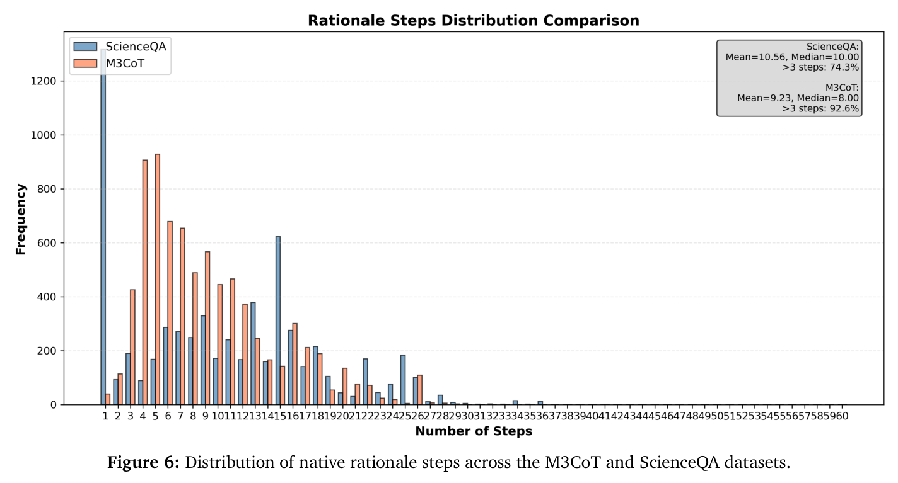
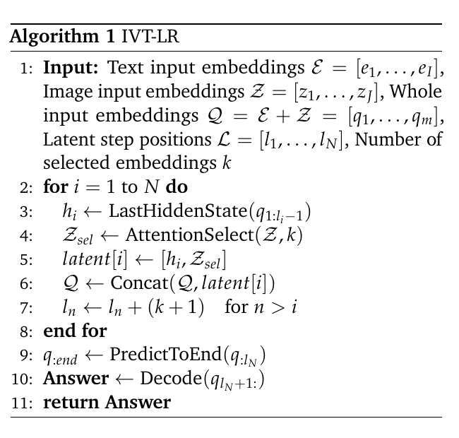
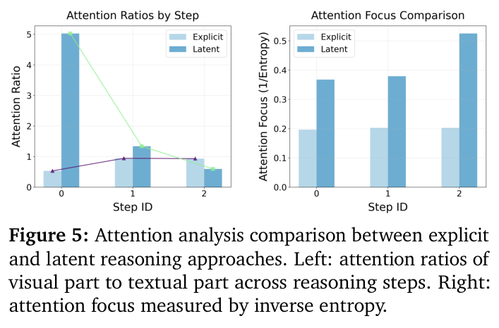

---
tags:
  - papers/visually-grounded-reasoning
  - papers/train
  - papers/latent-reasoning
aliases:
  - "IVT-LR"
  - "Reasoning in the Dark"
date: 2026-01-29
doi: 10.48550/arXiv.2510.12603
arxiv_id: 2510.12603
---

# Reasoning in the Dark: Interleaved Vision-Text Reasoning in Latent Space

## 核心信息

- 标题: Reasoning in the Dark: Interleaved Vision-Text Reasoning in Latent Space
- 标题翻译: 暗中推理：潜在空间中的交错视觉-文本推理
- 作者: Chao Chen, Zhixin Ma, Yongqi Li, Yupeng Hu, Yinwei Wei, Wenjie Li, Liqiang Nie
- 机构: The Hong Kong Polytechnic University; Singapore Management University; Shandong University; Harbin Institute of Technology (Shenzhen)
- 发表时间: 2026-01-29
- 发表渠道: arXiv 预印本
- DOI: 10.48550/arXiv.2510.12603
- arXiv: 2510.12603
- 论文链接: https://arxiv.org/abs/2510.12603
- 代码 / 项目: https://github.com/ModalityDance/IVT-LR
- 数据 / 资源: M3CoT; ScienceQA; Qwen2-VL-7B; Chameleon-7B
- 论文类型: AI 方法；训练型多模态潜在推理；高效视觉问答

## 原文摘要翻译

多模态推理旨在通过在最终答案之前引入中间推理步骤，增强多模态大语言模型的能力。它已经从纯文本推理发展到视觉信息的融合，使思考过程能够通过图像和文本共同表达。尽管这种路线有效，现有多模态推理方法依赖显式推理步骤，既需要耗费大量人力的视觉-文本标注，也会不可避免地引入显著的推理延迟。

为解决这些问题，本文引入多模态潜在推理，使其同时具有多模态表征、减少标注和提高推理效率的优势。作者提出交错视觉-文本潜在推理方法 IVT-LR，在潜在空间的推理过程中注入视觉与文本信息。具体而言，每个推理步骤由两个隐式部分共同表示：由前一步隐藏状态构成的潜在文本，以及由一组被选中图像嵌入构成的潜在视觉。作者进一步提出渐进式多阶段训练策略，使多模态大语言模型能够执行上述多模态潜在推理步骤。

在 M3CoT 和 ScienceQA 上的实验表明，IVT-LR 的准确率平均提高 5.45%，同时相较现有方法获得超过 5 倍的速度提升。

## 创新点

1. **把连续潜在思维从纯文本扩展为视觉-文本联合单元。** 每一步不再只回传上一隐藏状态，而是把它与当前注意力最高的图像嵌入一起送入下一步。
2. **提出逐步替换显式 CoT 的训练课程。** 模型先学习完整语言 CoT，再从前向后把显式步骤替换成潜在文本和潜在视觉，保留对后续显式步骤与答案的监督。
3. **把准确率与推理成本放在同一实验表中。** 论文同时报告准确率、自回归步数和单题耗时，直接展示潜在推理避免长文本解码的收益。
4. **提供组件、潜在深度和视觉长度分析。** 去掉潜在文本、潜在视觉以及改变潜在步数的实验，为核心机制提供了比单一主结果更强的证据。
5. **尝试解释多模态潜在轨迹。** 作者用视觉/文本注意力比和逆熵注意力集中度描述每一步的信息分配，不过这仍是相关性诊断，不是因果解释。

## 一句话总结

IVT-LR 先用显式 CoT 教会模型推理，再把每个中间步骤压缩成“上一隐藏状态 + 当前选中的视觉嵌入”，以训练换取推理时更少的自回归解码和更高的视觉问答准确率。

## 研究问题

显式多模态 CoT 有两个成本。第一，训练数据需要把语言推理和中间视觉证据逐步对齐；第二，推理时必须自回归生成很长的文本、局部图像或视觉操作序列。即使最终答案很短，模型仍要承担整条显式轨迹的解码开销。

纯文本潜在推理已经证明，可以把上一时刻隐藏状态直接作为下一步输入，绕过中间标记的生成。然而，多模态问题的关键证据仍然在图像中。若只保留文本隐藏状态，模型可能把视觉信息压缩得过早；若每步重新注入整图，又会引入大量无关视觉标记。IVT-LR 因此把问题改写为：**能否在连续潜在轨迹中，同时保留推理状态与稀疏的视觉证据？**

这使它和可见的 interleaved image CoT 有根本区别。后者把局部图像重新插入上下文，便于人类检查；IVT-LR 则让中间过程完全不可见，只输出最终答案。效率提高了，但可解释性和错误定位也更困难。

## 数据与任务定义

论文在两个多模态推理基准上评估：M3CoT 强调跨科学、常识和数学领域的多步视觉-文本推理；ScienceQA 覆盖自然科学、语言科学和社会科学，并包含图像或示意图题目。评测指标包括精确匹配准确率、平均自回归步数与平均单题生成时间。

两个主干模型均为 7B 规模，分别是 Qwen2-VL-7B 与 Chameleon-7B。

对比方法包括 No-CoT、Multimodal-CoT、CCoT、ICoT、SCAFFOLD 和 Chain-of-Focus。

训练使用 4 张 NVIDIA A6000 48GB GPU，批量大小为 4，Adam 学习率为 $4\times10^{-5}$，$\beta_1=0.9$。总训练时长和 GPU 小时数不在实验配置表内。

*论文原图编号：Figure 6。ScienceQA 的原生 rationale 步数均值为 10.56、中位数为 10，M3CoT 的均值为 9.23、中位数为 8；作者据此把长 rationale 合并为三个核心步骤。*

最终设置采用三个核心 reasoning step。附录把它写成 $N=4$、$N-1=3$ 个推理步骤，这一记号和正文中的 stage 描述并不完全直观。作者的实际做法是把原始 rationale 按句切分并合并为三段，同时保留一部分一至两步样本，以免模型只会固定长度的长推理。

*论文原图编号：Table 4。第一个样例把原始解释合并成三步：观察异常使用方式、结合视觉情境推断用途、给出选项。*

*论文原图编号：Table 5。第二个样例展示同样的三步合并格式，用于构造渐进替换训练的监督轨迹。*

## 方法主线

### 机制流程

1. **输入与显式起点。** 图像经过视觉编码器得到 $Z=\{z_j\}_{j=1}^{J}$，问题文本得到 embedding；Stage 0 先学习完整语言 CoT。
2. **形成联合潜在步骤。** 第 $t$ 步取前一步最后隐藏状态作为潜在文本，并按跨层累计注意力选择得分最高的 $k$ 个图像嵌入作为潜在视觉。
3. **逐步替换并监督未来。** 训练课程每推进一阶段，就把一个显式推理步骤替换成 $[h_{t-1},Z^{\text{sel}}_{t-1}]$；损失只施加在尚未替换的显式步骤和最终答案上。
4. **固定深度推理。** 最终推理时在问题后放置三个 latent step，不生成可见 rationale，随后直接解码答案。

*论文原图编号：Figure 2。每个潜在步骤由潜在文本和潜在视觉组成，并作为新的上下文状态送回 VLM。*

### 联合潜在状态

标准 VLM 根据文本嵌入向量和图像特征形成融合状态，并预测下一个标记：

$$
e^{\text{text}}_{1:t}=g(x_{1:t}),\qquad e^{\text{fused}}=f(e^{\text{text}}_{1:t},Z),\qquad p(x_{t+1})=\operatorname{softmax}(We^{\text{fused}}).
$$

IVT-LR 不为中间步骤预测显式标记，而是把上一潜在状态和选中视觉特征写成：

$$
u_{t-1}=\left[h_{t-1}^{\text{latent}};Z_{t-1}^{\text{sel}}\right],\qquad Z_{t-1}^{\text{sel}}=\operatorname{TopK}\left(\sum_{\ell}A_{\ell},k\right).
$$

这里的前 $k$ 项依据所有层注意力权重的累计分数确定。模型在第 $t$ 步看到问题嵌入向量、先前所有潜在文本状态和各自选中的视觉嵌入向量。这个实现并不生成新图，也不执行缩放工具，而是在已有视觉标记中做内部路由。

### 渐进式多阶段训练

*论文原图编号：Figure 3。Stage 0 使用完整语言 CoT；之后每一阶段从前往后多替换一个显式步骤，虚线框表示参与损失计算的显式目标。*

直接把所有显式步骤一次性删掉，会让模型突然失去可读监督轨迹。作者采用课程式训练：第 0 阶段学习完整显式 CoT，第 1 阶段隐去第一步，第 2 阶段再隐去第二步，最终只保留答案监督。被替换的潜在标记、问题标记与图像标记均不计算语言建模损失。

对目标标记集合 $\mathcal{Y}$，训练目标可概括为：

$$
\mathcal{L}_{\text{NLL}}=-\sum_{i\in\mathcal{Y}}\log p(y_i\mid Q,Z,u_{<i}),
$$

其中 $\mathcal{Y}$ 只包括当前阶段仍可见的后续推理步骤和最终答案。它不同于把学生隐藏状态强制对齐教师 CoT 的蒸馏：IVT-LR 只要求潜在轨迹能够继续预测未来步骤与答案，并不规定隐藏状态必须沿着某条语言轨迹移动。

### 推理链路

*论文原图编号：Algorithm 1。每一步取当前前缀最后隐藏状态，选择 top-$k$ 图像特征，与上下文拼接后继续到下一 latent position，最后从末端位置解码答案。*

算法的效率来自减少自回归输出，而不是取消前向计算。每个潜在步骤仍需运行 VLM，并携带 $k$ 个视觉嵌入向量。因而“10 至 11 个自回归步”不能等价理解为只做 10 至 11 次廉价向量运算；真正复杂度还取决于视觉序列长度、键值缓存和每步重新选择的实现。

## 关键结果

### 主结果与强基线

*论文原图编号：Table 1。IVT-LR 在两个 backbone、两个 benchmark 上同时报告准确率、自回归步数和耗时。*

| Backbone | 数据集 | Chain-of-Focus | IVT-LR | 准确率差值 | AR 步数 | 平均时间 |
|---|---|---:|---:|---:|---:|---:|
| Qwen2-VL | M3CoT | 64.3 | 71.8 | +7.5 | 185.7 → 10.0 | 2.63s → 0.65s |
| Qwen2-VL | ScienceQA | 91.2 | 94.6 | +3.4 | 162.3 → 11.0 | 2.09s → 0.67s |
| Chameleon | M3CoT | 36.5 | 41.8 | +5.3 | 739.4 → 10.0 | 3.09s → 1.13s |
| Chameleon | ScienceQA | 61.2 | 64.0 | +2.8 | 717.1 → 11.0 | 2.56s → 1.14s |

对最强列出基线 Chain-of-Focus，四组准确率提升平均为 4.75 个百分点，不是摘要中的 5.45%。摘要可能采用了另一种汇总口径，但正文缺少可直接复算的定义。效率结论更稳：IVT-LR 把显式解释中的数十至数百个自回归标记压缩到 10 至 11 步，Qwen2-VL 上的实测时间约缩短 3.1 至 4.0 倍。

No-CoT 的绝对延迟仍更低，论文称其约为 0.35 秒。因此更准确的结论不是“IVT-LR 最快”，而是它在高准确率方法中更快，并以略高于 No-CoT 的延迟换取明显更高准确率。

### 组件消融

*论文原图编号：Table 2。潜在文本和潜在视觉均不可缺；在 M3CoT 上去掉潜在视觉造成最大跌幅。*

| 设置 | M3CoT | ScienceQA | 相对完整模型变化 |
|---|---:|---:|---|
| IVT-LR | 71.83 | 94.1 | 基准 |
| 去掉潜在文本 | 52.20 | 84.7 | -19.63 / -9.8 |
| 去掉潜在视觉 | 46.64 | 82.3 | -25.19 / -11.8 |
| 去掉整个潜在部分 | 58.02 | 86.4 | -13.81 / -7.7 |

这张表支持“视觉不是装饰项”，但不能把三种差值当作可加的独立贡献。去掉整个潜在部分反而好于只去掉潜在视觉，说明序列结构、剩余模块与训练分布之间存在交互。另一个需要核对的细节是：Table 1 报告 Qwen2-VL 的 ScienceQA 为 94.6，Table 2 的完整模型却是 94.1，正文没有解释 0.5 个点的差异。

### 潜在视觉长度与推理深度

*论文原图编号：Figure 4。每步选择的潜在视觉长度从 8 增至 32 时，两个数据集均单调上升，但 ScienceQA 的绝对增幅很小。*

视觉长度增大带来更完整的图像覆盖。作者指出，Qwen2-VL 中三个步骤各选择 32 个嵌入向量，大致能够累计覆盖整图。不过论文只报告准确率曲线，未同步给出不同 $k$ 对时延和显存的影响，因此不能从图中得出“越长越高效”。

*论文原图编号：Table 3。M3CoT 上从一个潜在阶段增加到三个阶段，总准确率由 56.30 提升至 71.83。*

| 潜在阶段 | Science | Commonsense | Mathematics | Total |
|---:|---:|---:|---:|---:|
| 1 | 56.66 | 64.40 | 38.59 | 56.30 |
| 2 | 61.71 | 70.11 | 43.57 | 61.48 |
| 3 | 70.90 | 79.78 | 63.07 | 71.83 |

数学从 38.59 提升到 63.07，增幅最大，符合结构化多步任务更依赖中间状态的直觉。不过每个阶段对应渐进训练中的不同 checkpoint，训练暴露量也在变化。因此这张表没有严格区分“测试时多思考一步”和“多接受一阶段训练”两种作用。

### 注意力诊断

作者定义视觉与文本注意力比：

$$
R=\frac{\sum_{j\in\mathcal{I}}\operatorname{Attn}(E_j)}{\sum_{i\in\mathcal{T}}\operatorname{Attn}(E_i)},
$$

并用逆熵描述注意力集中度：

$$
H=-\sum_k p_k\log p_k,\qquad p_k=\frac{\operatorname{Attn}(E_k)}{\sum_m\operatorname{Attn}(E_m)},\qquad F=\frac{1}{H+\epsilon}.
$$

*论文原图编号：Figure 5。潜在模式先强烈关注视觉，随后转向潜在文本；其逆熵集中度也随步骤升高。*

这个现象与“先观察、后推理”的故事一致，但注意力比受到标记数量和分母定义的影响，逆熵也只表示分布更尖锐。二者都不能单独证明模型选中了正确证据，更不能证明隐藏状态具有忠实、可解释的推理语义。

## 深度分析

### 真正贡献是什么

IVT-LR 最重要的贡献不是简单地把 CoT 隐藏起来，而是定义了一个**联合潜在步骤**：连续文本状态承担逻辑记忆，稀疏视觉 embedding 承担当前证据。这个单元让模型可以在不输出中间语言或图像的情况下，维持跨模态状态转移。

*论文原图编号：Figure 1。概念示例展示三个不可见的视觉-文本潜在步骤；图中虚线文字与局部鸟图只是解释性示意，不是推理时真实生成的中间结果。*

第二个贡献是训练课程。模型并非从答案监督中凭空学会潜在推理，而是先获得完整显式 CoT，再逐步撤掉中间监督。这一点很关键：论文节省的是最终部署时的显式轨迹，而不是训练阶段对语言 rationale 的依赖。它减少了“中间视觉步骤”的专门标注，却仍然依赖数据集中已有的文本 rationale。

### 为什么结果成立

准确率与效率来自三种作用叠加。第一，连续隐藏状态避免了每步量化为离散语言标记，减少语言表达误差和自回归解码。第二，前 $k$ 项视觉路由让每一步重新接触图像，避免长文本上下文逐渐稀释视觉信息。第三，渐进训练在显式监督和隐式状态之间建立课程桥梁，降低一次性删除 CoT 带来的优化困难。

消融中潜在视觉的跌幅最大，支持“重复视觉接入”是核心；潜在阶段增多时数学涨幅最大，支持结构化任务更需要状态迭代。但目前还不能判断 top-$k$ attention 是否是最佳选择，也不能判断视觉增益究竟来自更正确的区域，还是来自每一步额外注入了更多视觉计算。

### 与相邻路线的关系

在本地推理图谱中，它属于明确的训练路线。

ICoT、DaP-ICoT 和 VisRef 在测试时显式插入或重注入视觉证据。

MINT-CoT 训练模型输出可见的交错视觉标记，Qwen Look Again 和 DeepEyes 则学习反思或主动感知。

IVT-LR 更接近连续潜在 CoT：中间行为不可读，也不包含缩放、裁剪或搜索等开放动作，只在原始视觉嵌入集合中内部选择。

这个定位既是优点也是限制。它的部署界面最简洁，推理日志最短；但用户无法查看中间证据，也很难在错误时区分“看错了”“选错了”还是“潜在逻辑错了”。

### 复现注意点

1. 需要修改 VLM 前向链路，使隐藏状态与选中视觉嵌入能够作为输入嵌入重新拼接，而不是通过分词器生成普通标记。
2. 需要从所有层累计注意力并做 top-$k$ 选择。应明确是哪些 head、如何聚合、是否停止梯度；正文没有给出完整实现细节。
3. 数据预处理必须把 rationale 稳定切成三个核心步骤。附录的合并规则较启发式，换数据集时可能需要重新设计。
4. 训练要保存并衔接多阶段 checkpoint。论文报告硬件和学习率，但没有总 epoch、各阶段步数、训练时长与随机种子方差。
5. 评测效率时应同时报告自回归标记数、总前向 FLOPs、视觉标记数和实际时延，避免只用输出标记数代表全部成本。

## 局限

第一，评测只覆盖两个 VQA 数据集和两个 7B 主干模型。开放式视觉生成、长视频、文档、三维场景、规划和跨域任务均在当前证据范围之外，因此“通用多模态潜在推理”仍是待验证的外推。

第二，最终推理深度固定为三个 latent step，每步视觉长度也由超参数 $k$ 控制。简单题可能过度计算，困难题则可能不够；作者把自适应深度留到未来工作。

第三，效率核算主要强调自回归步数。潜在步骤仍需模型前向传播并附加视觉嵌入向量；完整 FLOPs、峰值显存和总训练成本尚未进入论文的效率表。

第四，基于注意力的选择和注意力曲线都是弱解释。选中视觉标记删除、错误区域替换、随机标记对照和跨随机种子稳定性仍待检验，因此目前不能确认这些标记对答案具有因果必要性。

第五，表 1 与表 2 的 ScienceQA 完整模型数值不一致，摘要的平均提升也缺少可复算口径。这不推翻主要趋势，但降低了数值报告的严谨性。

第六，中间轨迹完全不可见。它减少了人工标注和推理延迟，却牺牲了过程监督、调试、审计和安全检查能力。

## 我的笔记

对三维智能体最有启发的不是“潜在”这个标签，而是潜在步骤的组合形式。可以把 $Z^{\text{sel}}$ 从二维图像标记替换为多视角标记、对象标记、点标记或 Gaussian 标记，让智能体的隐藏计划状态每一步只接入相关空间证据。这样可能避免先把整个三维场景描述成文字，再靠语言完成几何推理。

但三维场景比单图更需要兼顾多样性的选择。简单的前 $k$ 项注意力容易反复选择同一视角或同一对象，遗漏遮挡后的互补证据。更合适的扩展可能是“相关性 + 覆盖度 + 几何互补性”的联合选择，并允许不同步骤动态决定标记数和停止时刻。

下一步实验应该优先做因果验证：删除选中标记、替换为空间上相邻但语义错误的标记、交换不同推理步骤的视觉集合，并观察答案和隐藏轨迹是否系统改变。只有这样，才能把“注意力看起来更集中”推进到“视觉证据确实驱动了推理”。

这篇和本地的 Position 论文应该配对阅读。IVT-LR 的消融比纯可视化更有说服力，但仍未完全排除训练课程和额外视觉计算带来的收益。我的结论是：它证明了联合潜在单元是一条很有潜力的训练路线，还没有证明模型在潜在空间中形成了忠实、可解释的视觉推理链。

## 引用

Chen, Chao, Zhixin Ma, Yongqi Li, Yupeng Hu, Yinwei Wei, Wenjie Li, and Liqiang Nie. 2026. “Reasoning in the Dark: Interleaved Vision-Text Reasoning in Latent Space.” arXiv:2510.12603. https://doi.org/10.48550/arXiv.2510.12603.
