# Thyme: Think Beyond Images

> 阅读说明：本文件是基于本地 PDF 的 source-grounded bilingual reader。英文 `Para.` 段落采用忠实清理与转述，不是整篇原文逐字复制；中文 `Para.[CN]` 与之对齐，保留论文结构、关键数字、公式、图表和技术论证。

## Metadata

| Item                  | Value                                                                                                                                                                                                                                                |
| --------------------- | ---------------------------------------------------------------------------------------------------------------------------------------------------------------------------------------------------------------------------------------------------- |
| Title                 | Thyme: Think Beyond Images                                                                                                                                                                                                                           |
| Authors               | Yi-Fan Zhang, Xingyu Lu, Shukang Yin, Chaoyou Fu, Wei Chen, Xiao Hu, Bin Wen, Kaiyu Jiang, Changyi Liu, Tianke Zhang, Haonan Fan, Kaibing Chen, Jiankang Chen, Haojie Ding, Kaiyu Tang, Zhang Zhang, Liang Wang, Fan Yang, Tingting Gao, Guorui Zhou |
| Date in PDF           | August 18, 2025                                                                                                                                                                                                                                      |
| arXiv metadata in PDF | arXiv:2508.11630v1 [cs.CV], 15 Aug 2025                                                                                                                                                                                                              |
| Project links         | `https://thyme-vl.github.io/`; `https://huggingface.co/Kwai-Keye/Thyme-RL`; `https://github.com/yfzhang114/Thyme`                                                                                                                                    |
| Source type           | Selectable-text PDF                                                                                                                                                                                                                                  |
| PDF pages             | 32                                                                                                                                                                                                                                                   |
| Paper type            | Multimodal reasoning / tool-use method paper                                                                                                                                                                                                         |

## Page index

| Pages | Content |
|---|---|
| 1 | Title, abstract, Fig. 1 benchmark radar plots |
| 2 | Table of contents |
| 3–4 | Introduction and technical roadmap |
| 3 | Fig. 2 overall Thyme pipeline |
| 5 | Sandbox design and SFT cold-start opening; Fig. 3 |
| 6–8 | SFT data construction and training strategy; Fig. 4; Tables 1–2 |
| 9–12 | RL data, GRPO, GRPO-ATS, reward design, experimental setup; Fig. 5–6 |
| 13–15 | Main results, MME-RealWorld, SFT/RL ablations; Tables 3–6; Fig. 7 |
| 16–23 | Case studies and failure cases; Fig. 8–16 |
| 24–27 | Conclusion, limitations, references |
| 28 | Appendix A: annotation requirements |
| 29 | Appendix B: related work |
| 30–32 | Appendix prompt templates; Tables 7–9 |

## Terminology ledger

| Term | 中文建议 | Note |
|---|---|---|
| Thyme / Think Beyond Images | Thyme / 超越图像思考 | 论文提出的范式与模型系列 |
| MLLM | 多模态大语言模型 | Multimodal Large Language Model |
| thinking with images | 借助图像思考 | OpenAI 概念；本文认为现有开源实现功能较窄 |
| image manipulation | 图像操作 / 图像处理 | 包括裁剪、缩放、旋转、对比度增强 |
| executable code | 可执行代码 | Thyme 让模型生成 Python 代码并交给 sandbox 执行 |
| sandbox | 沙箱 | 安全执行代码、修正常见格式/边界/I/O 问题 |
| SFT | 监督微调 | 用 500K 样本冷启动代码与图像操作能力 |
| RL | 强化学习 | 用高难度高分辨率 QA 与奖励函数进一步优化决策 |
| GRPO-ATS | 自适应温度采样的 GRPO | 文本高温探索，代码低温确定性生成 |
| consistency reward | 一致性奖励 | 衡量推理过程与最终答案是否一致 |
| code reward | 代码奖励 | 按代码成功执行比例打分；论文发现不一定带来收益 |
| process reward | 过程奖励 | 用 MLLM 打分思考过程；论文发现可能被 hack |

## Abstract

> <strong>Para. 1:</strong> The paper starts from the recent idea of “thinking with images”: a multimodal model should use visual information inside its reasoning process rather than only perceive an image once and answer directly. The authors argue that open-source systems still lack the functional breadth of proprietary systems such as OpenAI O3, especially the ability to combine image manipulation with code-based reasoning.

> <strong>Para. 1[CN]:</strong> 论文从“借助图像思考”这个近期概念出发：多模态模型不应只是看图后直接回答，而应在推理过程中主动使用视觉信息。作者认为，现有开源系统还缺少类似 OpenAI O3 那样丰富的能力，尤其是将图像处理与代码推理结合起来的能力。

> <strong>Para. 2:</strong> Thyme is introduced as a paradigm where an MLLM autonomously generates and executes code for image processing and computation. It can crop, rotate, enhance contrast, resize, and perform mathematical calculations, while also deciding when such operations are necessary.

> <strong>Para. 2[CN]:</strong> Thyme 被定义为一种让 MLLM 自主生成并执行代码的范式，代码既可用于图像处理，也可用于计算。它支持裁剪、旋转、对比度增强、缩放和数学计算，同时让模型自己判断是否需要这些操作。

> <strong>Para. 3:</strong> The capability is activated with a two-stage training strategy. A 500K-sample supervised fine-tuning stage teaches basic code generation and image operations; a reinforcement learning stage then refines decision-making. For RL, the authors manually build high-resolution QA data and propose GRPO-ATS, which uses different sampling temperatures for text and code.

> <strong>Para. 3[CN]:</strong> 该能力通过两阶段训练激活：先用 500K 样本进行监督微调，让模型学会基本代码生成和图像操作；再用强化学习优化“何时用代码、如何用代码”的决策。RL 阶段还配套人工构造的高分辨率 QA 数据，并提出 GRPO-ATS，让文本与代码采用不同采样温度。

> <strong>Para. 4:</strong> Across nearly 20 benchmarks, Thyme reports consistent gains over the Qwen2.5-VL-7B baseline, especially on high-resolution perception and complex reasoning tasks. The authors release the dataset, sandbox, and training code to support future work.

> <strong>Para. 4[CN]:</strong> 在近 20 个 benchmark 上，Thyme 相比 Qwen2.5-VL-7B baseline 获得稳定提升，尤其是在高分辨率感知和复杂推理任务上。作者还发布数据、沙箱和训练代码，便于后续研究复现和扩展。

### Fig. 1. Thyme benchmark performance

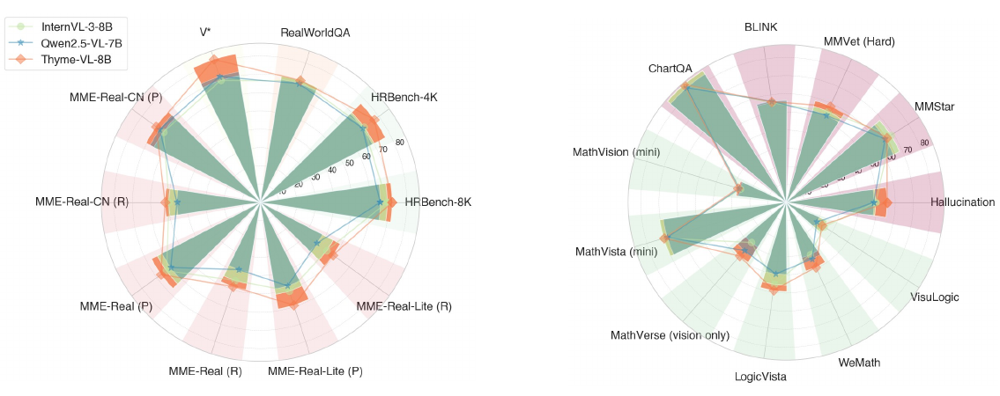

**Caption:** Paraphrased: Thyme improves over baseline models across perception, mathematical reasoning, and general multimodal benchmarks, with the radar plots highlighting broad benchmark coverage.

**Caption[CN]:** 图 1 用雷达图展示 Thyme 在感知、数学推理和通用多模态 benchmark 上的综合表现，强调其相比 baseline 的广泛提升。

**Reading note:** 这张图是结果概览，但真正的证据在 Table 3–6；读它时要记住：Thyme 的核心不是模型变大，而是推理时能主动生成代码处理图像和计算。

## 1. Introduction

> <strong>Para. 1:</strong> The introduction reviews two families of “thinking with images.” One family generates auxiliary images to guide reasoning, which helps tasks requiring imagination but is costly and may lose fine visual details. The other family performs cropping or zooming by outputting bounding boxes, which improves perception but supports only a narrow tool set.

> <strong>Para. 1[CN]:</strong> 引言首先回顾两类“借助图像思考”方法：一类生成辅助图像来引导推理，适合需要想象或辅助线的任务，但成本高且可能丢失原图细节；另一类通过输出 bounding box 做裁剪/缩放，能提升感知准确率，但功能范围较窄。

> <strong>Para. 2:</strong> Thyme is positioned as a more general paradigm. Instead of only selecting an image region, the model can write executable code for cropping, scaling, rotation, contrast enhancement, and computation. This moves from “think with a cropped image” to “think by transforming images and computing when needed.”

> <strong>Para. 2[CN]:</strong> Thyme 被定位为更通用的范式。模型不只是选择图像区域，而是可以写可执行代码来裁剪、缩放、旋转、增强对比度和计算。它把“看裁剪图思考”推进为“按需要转换图像并计算”。

> <strong>Para. 3:</strong> The paper states four design principles: rich functionality, high autonomy, efficient end-to-end training, and significant stable gains. These principles are important because the method is not a single new module; it is a behavior-training pipeline for autonomous visual-code tool use.

> <strong>Para. 3[CN]:</strong> 论文提出四个设计原则：功能丰富、高自主性、高效端到端训练，以及显著稳定的性能提升。这些原则说明 Thyme 不是单个新模块，而是一套训练模型自主使用视觉-代码工具的行为范式。

> <strong>Para. 4:</strong> The technical roadmap has five major pieces: construction of diverse SFT data from more than four million raw sources, special SFT strategies for multi-turn and sandbox settings, RL data with high-resolution manually annotated questions, GRPO-ATS for different text/code sampling temperatures, and a robust sandbox that executes code safely.

> <strong>Para. 4[CN]:</strong> 技术路线包含五个主要部分：从 400 多万原始样本中构造多样化 SFT 数据；为多轮交互和沙箱场景设计特殊 SFT 策略；构造带人工标注高分辨率问题的 RL 数据；提出文本/代码不同温度的 GRPO-ATS；以及构建能安全执行代码的沙箱。

> <strong>Para. 5:</strong> The authors repeatedly emphasize autonomy: Thyme should decide whether a problem is simple enough to answer directly, whether image processing is necessary, what operation to run, and what parameters such as crop coordinates or contrast factors should be used.

> <strong>Para. 5[CN]:</strong> 作者反复强调“自主性”：Thyme 应该自己判断问题是否简单到可以直接回答、是否需要图像处理、该运行什么操作，以及裁剪坐标、缩放比例、对比度参数等应如何设定。

### Fig. 2. Thyme overall pipeline

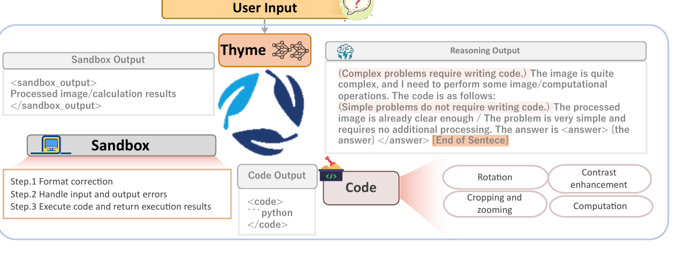

**Caption:** Paraphrased: Thyme alternates between model reasoning, code generation, sandbox execution, and feedback from processed images or computed results.

**Caption[CN]:** 图 2 展示 Thyme 的整体闭环：模型先推理并决定是否写代码，代码由沙箱执行，处理后的图像或计算结果再反馈给模型进入下一轮推理。

**Reading note:** 这张图是全文的机制核心：Thyme 的“工具”不是固定 API，而是模型动态生成的 Python 代码；sandbox 是让这种自由度变得可控的工程层。

## 2. Preliminary and overall pipeline

### 2.1 Overall pipeline of Thyme

> <strong>Para. 1:</strong> The pipeline contains two main components: the model and the sandbox. Given a user input, the model first generates a reasoning process and decides whether code should be generated. If no code is needed, the model directly returns an answer.

> <strong>Para. 1[CN]:</strong> Thyme 管线包含两个主要组件：模型和沙箱。给定用户输入后，模型先生成推理过程，并判断是否需要写代码。如果不需要代码，模型直接返回答案。

> <strong>Para. 2:</strong> If code is needed, the model generates code for operations such as cropping, zooming, rotation, contrast enhancement, and computation. Multiple operations can be combined in one code block, and operation parameters are chosen by the model without external hand constraints.

> <strong>Para. 2[CN]:</strong> 如果需要代码，模型会生成用于裁剪、缩放、旋转、对比度增强或计算的代码。多个操作可以组合在同一段代码中，操作参数由模型自己决定，而不是由外部规则硬编码。

> <strong>Para. 3:</strong> The sandbox executes the generated code and returns execution results. It also formats code, fixes input-output variables, and adjusts problematic parameters where possible, so that small syntactic or boundary errors do not dominate the model’s learning signal.

> <strong>Para. 3[CN]:</strong> 沙箱负责执行模型生成的代码并返回执行结果。同时，它会格式化代码、修正输入输出变量，并在可能时调整出界参数，避免小的语法或边界错误成为训练与推理的主要瓶颈。

### 2.2 Sandbox building

> <strong>Para. 1:</strong> The sandbox is designed for both security and robustness. It prevents harmful operations such as removing, unlinking, moving, or renaming files, and it enforces a maximum execution time of 10 seconds to avoid uncontrolled code execution.

> <strong>Para. 1[CN]:</strong> 沙箱同时服务于安全性和鲁棒性。它会阻止删除、unlink、移动、重命名等危险操作，并设置 10 秒最大执行时间，防止模型生成的代码失控运行。

> <strong>Para. 2:</strong> Because 7B-scale models often make small coding mistakes, the sandbox reduces the burden of perfect code generation. It uses tools such as autopep8 and Python AST traversal to align indentation, infer crop parameters, clamp boxes inside image boundaries, preset variables like image paths, and track variables across multi-round executions.

> <strong>Para. 2[CN]:</strong> 由于 7B 规模模型容易出现小的代码错误，沙箱的目标是降低“必须写出完美代码”的负担。它使用 autopep8、Python AST 遍历等方式处理缩进、推断裁剪参数、把框约束在图像边界内、预设 image path，并在多轮调用中记录变量上下文。

> <strong>Para. 3:</strong> This design choice is philosophically important: Thyme is not evaluating raw code-writing ability alone. It is training a multimodal agent to use code as an interface for perception and reasoning, while the sandbox absorbs some low-level execution friction.

> <strong>Para. 3[CN]:</strong> 这个设计很关键：Thyme 并不是单纯测试模型写代码能力，而是在训练一个多模态 agent 把代码当作感知和推理接口；沙箱则吸收一部分低层执行摩擦。

### Fig. 3. SFT data construction pipeline

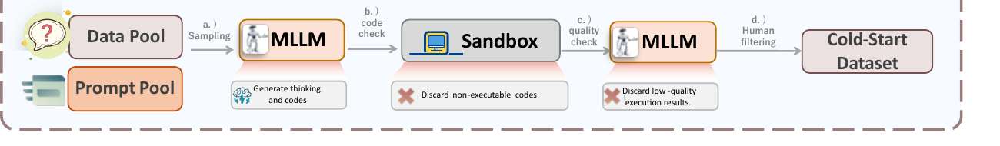

**Caption:** Paraphrased: SFT samples are generated from data and prompt pools, checked through sandbox execution, verified by an additional MLLM, and finally filtered by humans to create the cold-start dataset.

**Caption[CN]:** 图 3 展示 SFT 数据构建流程：从数据池和 prompt 池采样，模型生成思考和代码，沙箱过滤不可执行代码，再由额外 MLLM 与人工过滤低质量样本，形成冷启动数据。

**Reading note:** 这条流程体现了“生成—执行—验证—人工过滤”的数据闭环。没有执行过滤，训练样本会充满无法运行的代码。

## 3. Thyme-SFT cold start

### 3.1 Training data construction pipeline

> <strong>Para. 1:</strong> The SFT cold-start data is organized into three complexity levels: direct-answer samples requiring no code, samples requiring image manipulation or computation, and multi-turn samples where initial processing may need refinement or correction.

> <strong>Para. 1[CN]:</strong> SFT 冷启动数据被组织为三个复杂度层级：无需代码的直接回答样本；需要图像操作或计算的样本；以及初次处理可能需要细化或纠错的多轮样本。

> <strong>Para. 2:</strong> The source pool covers several public datasets, including LLaVA-OV-Image, MM-RLHF, SMR, V*, MM-Eureka, arXivQA, and Retool. The aim is to obtain diverse prompts while teaching the model to decide when code is useful.

> <strong>Para. 2[CN]:</strong> 原始数据来自多个公开数据集，包括 LLaVA-OV-Image、MM-RLHF、SMR、V*、MM-Eureka、arXivQA 和 Retool。目标是在保证 prompt 多样性的同时，让模型学习何时使用代码是有帮助的。

> <strong>Para. 3:</strong> Direct-answer data teaches the model not to overuse tools. Qwen2.5-VL-72B first judges whether code is necessary, and the authors randomly select 100K samples that require no tool intervention.

> <strong>Para. 3[CN]:</strong> 直接回答数据用于教模型不要过度使用工具。作者先让 Qwen2.5-VL-72B 判断是否需要代码，然后从无需工具介入的样本中随机选取 100K 构成该子集。

> <strong>Para. 4:</strong> Real-world Thyme data focuses on complex visual QA. Code snippets are executed in the sandbox; invalid code is discarded; Qwen2.5-VL-72B checks whether the execution output matches the reasoning goal; and two multimodal experts further filter ambiguous cases. This yields 50K high-quality executable QA pairs.

> <strong>Para. 4[CN]:</strong> 真实场景 Thyme 数据聚焦复杂视觉问答。代码先在沙箱中执行，不可执行样本被剔除；Qwen2.5-VL-72B 再检查执行结果是否符合推理目标；最后两名多模态专家进一步过滤歧义样本，得到 50K 高质量可执行 QA 对。

> <strong>Para. 5:</strong> Manually constructed data supplements the limited quantity of high-quality real-world examples. The constructed subsets cover cropping, rotation, low-contrast enhancement, and computation, each with tailored prompt templates and verification.

> <strong>Para. 5[CN]:</strong> 人工构造数据用于补足真实高质量样本数量不足的问题。这些子集覆盖裁剪、旋转、低对比度增强和计算，每类都有对应 prompt 模板和验证流程。

> <strong>Para. 6:</strong> The cropping subset mainly uses V* and ground-truth boxes, producing 28K final samples after filtering. The rotation subset creates rotated images at angles from 30° to 335° and yields 14K high-fidelity samples. The low-contrast OCR subset contributes around 10K samples, and the computational-code subset contributes 15K samples from math-oriented sources.

> <strong>Para. 6[CN]:</strong> 裁剪子集主要使用 V* 和真实 bounding box，过滤后得到 28K 样本；旋转子集把图像随机旋转 30° 到 335°，得到 14K 高保真样本；低对比度 OCR 子集约 10K；计算代码子集来自数学类数据源，约 15K。

> <strong>Para. 7:</strong> Multi-round data is introduced because single-turn training does not teach error correction. The authors create “further enhancement” examples, where a coarse crop is refined, and “error correction” examples, where an incorrect initial crop is corrected in the next round.

> <strong>Para. 7[CN]:</strong> 多轮数据的动机是：单轮训练不会教会模型纠错。作者构造“进一步增强”样本，让粗裁剪被细化；也构造“错误纠正”样本，让错误初始裁剪在下一轮被修正。

### Fig. 4. SFT data instances

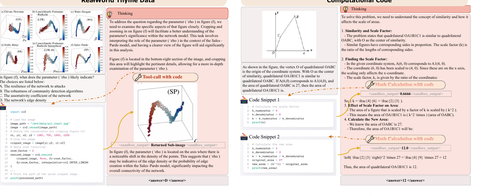

**Caption:** Paraphrased: The figure shows one image-processing sample and one computational-code sample, illustrating how Thyme learns to write code from an analysis process and then use sandbox outputs in reasoning.

**Caption[CN]:** 图 4 展示 SFT 数据样例：左侧是图像处理类样本，右侧是计算代码类样本，说明模型如何基于分析过程写代码，并用沙箱输出继续推理。

**Reading note:** 这张图最值得关注的是训练目标：模型要学的不只是答案，而是“为什么需要操作、写什么代码、如何利用执行结果”。

### 3.2 Training strategy

### Table 1. SFT system prompt

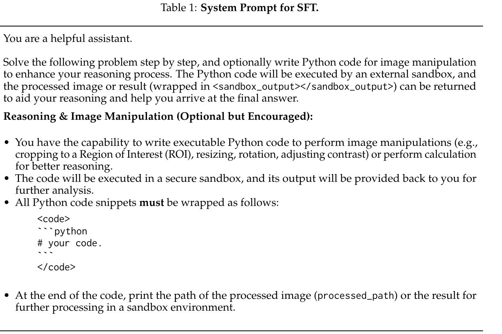

**Caption:** Paraphrased: The system prompt defines the assistant role, optional Python code generation for image manipulation or calculation, sandbox execution, and the required code-wrapping format.

**Caption[CN]:** 表 1 展示 SFT 的 system prompt：模型被告知可以写 Python 代码进行图像操作或计算，代码由外部沙箱执行，并要求遵循固定代码包裹格式。

**Reading note:** Prompt 把“写代码”设定为 optional but encouraged，这能避免模型把所有问题都机械转成代码。

### Table 2. SFT user prompt

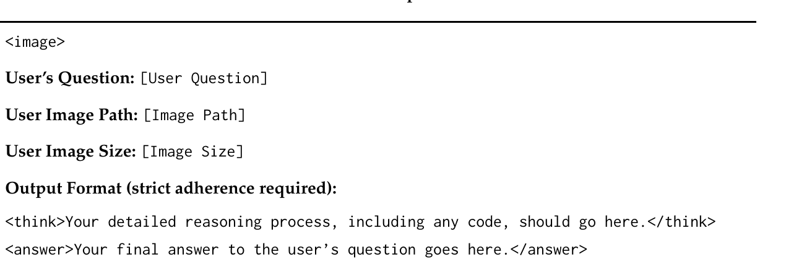

**Caption:** Paraphrased: The user prompt supplies the image, question, image path, image size, and strict output format with thinking and answer tags.

**Caption[CN]:** 表 2 展示 SFT 的 user prompt：包含图像、问题、图像路径、图像尺寸，并要求输出 `<think>` 与 `<answer>` 格式。

**Reading note:** 图像路径和尺寸是给代码执行使用的；这也是 Thyme 与普通 VLM prompt 的区别之一。

> <strong>Para. 1:</strong> A training sample is represented as an image-question pair followed by one or more rounds of thinking, optional code, sandbox output, and final answer. The paper formalizes the sequence as:

$$
X = \{(I, Q); ([T_0, C_0, S_0], \ldots, [T_t, a])\}
$$

> <strong>Para. 1[CN]:</strong> 每个训练样本可表示为图像-问题对，后面接一轮或多轮思考、可选代码、沙箱输出和最终答案。上式中 $I$ 是图像，$Q$ 是问题，$T$ 是思考，$C$ 是代码，$S$ 是沙箱输出，$a$ 是答案。

> <strong>Para. 2:</strong> The first SFT strategy is to train on the last round only for multi-turn samples. Earlier rounds may include suboptimal code or correction behavior; masking them prevents the model from learning that it should intentionally produce bad first attempts.

> <strong>Para. 2[CN]:</strong> 第一项 SFT 策略是在多轮样本中只训练最后一轮。前几轮可能包含次优代码或纠错过程；把它们 mask 掉可以避免模型学到“第一轮先故意写差”的奇怪模式。

> <strong>Para. 3:</strong> The second strategy masks sandbox markers and sandbox outputs from the training target. The model should learn to generate reasoning and code, not to hallucinate or predict external execution results.

> <strong>Para. 3[CN]:</strong> 第二项策略是 mask 掉沙箱标记和沙箱输出。模型应该学习生成推理和代码，而不是学习凭空预测外部执行结果。

> <strong>Para. 4:</strong> The third strategy is math data annealing. Because computational-code data is much smaller than image-manipulation data, the model first learns all image-related data, then is fine-tuned on math code with a lower learning rate so the computation behavior is not overwhelmed.

> <strong>Para. 4[CN]:</strong> 第三项策略是数学数据退火。由于计算代码数据远少于图像操作数据，模型先学习全部图像相关数据，再用更低学习率在数学代码上微调，避免“写代码计算”的行为被大量图像操作数据淹没。

## 4. Thyme-RL

### 4.1 RL data construction and annotation

### Fig. 5. RL data instances

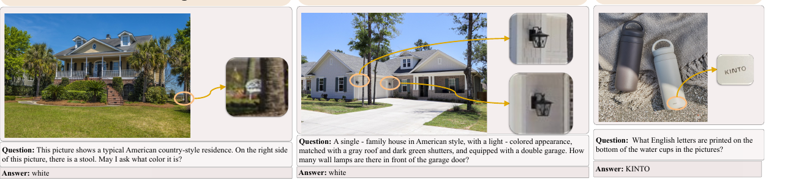

**Caption:** Paraphrased: RL data contains high-resolution images and challenging small-object questions, including attribute, quantity, and OCR recognition.

**Caption[CN]:** 图 5 展示 RL 数据样例：高分辨率图像中包含小且难识别的目标，问题覆盖属性识别、数量识别和 OCR 识别等。

**Reading note:** RL 数据把难度集中在“小目标 + 高分辨率 + 需要放大细节”上，这正是 Thyme 的裁剪/缩放能力最可能发挥作用的场景。

> <strong>Para. 1:</strong> RL data comes from public prompts such as V*, arXivQA, and ThinkLite-VL, plus manually collected high-resolution images. Public images are considered insufficiently challenging, so the authors collect 30K internet images with width or height above 2048 pixels.

> <strong>Para. 1[CN]:</strong> RL 数据来自 V*、arXivQA、ThinkLite-VL 等公开 prompt，以及人工收集的高分辨率图像。作者认为公开图像复杂度不足，因此收集 30K 张宽或高超过 2048 像素的互联网图像。

> <strong>Para. 2:</strong> Fifteen annotators label these images. Each question targets a small object occupying no more than 5% of the image area, forcing a model or human to zoom in to answer reliably. Three multimodal experts then conduct acceptance checks.

> <strong>Para. 2[CN]:</strong> 15 名标注员参与标注。每个问题都指向图中面积不超过 5% 的小目标，迫使模型或人类放大局部才能可靠回答。之后由 3 名多模态专家统一验收。

> <strong>Para. 3:</strong> The question categories include OCR recognition, attribute recognition, positional recognition, quantity recognition, object recognition, and chart understanding. This category mix aligns the RL stage with the intended perception and reasoning use cases.

> <strong>Para. 3[CN]:</strong> 问题类别包括 OCR 识别、属性识别、位置识别、数量识别、目标识别和图表理解。这样的类别组合让 RL 阶段更贴近 Thyme 希望提升的感知与推理场景。

### 4.2 Preliminary of reinforcement learning algorithm

> <strong>Para. 1:</strong> The RL algorithm is a fully on-policy variant of Group Relative Policy Optimization. For each image-question problem, the policy samples a group of trajectories, where each trajectory is a complete multi-round interaction containing thoughts, code, sandbox outputs, and a final answer.

> <strong>Para. 1[CN]:</strong> RL 算法采用 fully on-policy 的 GRPO 变体。对于每个图像-问题样本，策略会采样一组轨迹，每条轨迹都是完整多轮交互，包含思考、代码、沙箱输出和最终答案。

> <strong>Para. 2:</strong> The policy objective averages token-level advantages across trajectories and includes a KL penalty against a reference policy. Sandbox outputs are excluded from trajectory length and advantage summation because they are external observations, not model-generated tokens.

> <strong>Para. 2[CN]:</strong> 策略目标会在轨迹组内按 token 计算优势，并加入对参考策略的 KL 惩罚。沙箱输出不计入轨迹长度和优势求和，因为它们是外部观测，不是模型自己生成的 token。

$$
A_{i,j} = \frac{r_i - \operatorname{mean}(\{r_i\}_{i=1}^{G})}{\operatorname{std}(\{r_i\}_{i=1}^{G})}
$$

> <strong>Para. 3:</strong> The advantage above is computed from final trajectory rewards within the same sampled group. Thus, the reward must evaluate both final answer correctness and whether the code/tool-use process was useful and well formed.

> <strong>Para. 3[CN]:</strong> 上式中的优势来自同组采样轨迹的最终奖励。因此，奖励既要评估最终答案是否正确，也要评估代码/工具使用过程是否有效且格式合规。

### 4.3 GRPO with adaptive temperature sampling

### Fig. 6. GRPO-ATS sampling pipeline

**Caption:** Paraphrased: During text reasoning, the sampling temperature is set to 1.0 for exploration; during code generation, it drops to 0.0 to improve executable precision. Sandbox outputs are not trained as policy outputs.

**Caption[CN]:** 图 6 展示 GRPO-ATS：文本推理时温度设为 1.0 以鼓励探索，生成代码时温度降为 0.0 以提高可执行性；沙箱输出不作为策略输出参与训练。

**Reading note:** 这是本文最有趣的小算法点：同一个 rollout 中不同 token 区间用不同采样温度，解决“推理需要探索、代码需要确定”的矛盾。

> <strong>Para. 1:</strong> The motivation for GRPO-ATS is that text reasoning and code generation require different sampling behavior. Text benefits from exploration and diversity, while code is brittle: a small invalid character or variable typo can make the whole snippet fail.

> <strong>Para. 1[CN]:</strong> GRPO-ATS 的动机是文本推理和代码生成需要不同采样行为。文本受益于探索和多样性，而代码很脆弱：一个非法字符或变量名错误就可能导致整段代码执行失败。

> <strong>Para. 2:</strong> The system sets the temperature to 0 once the `<code>` token appears and restores normal text temperature after code generation ends. This improves sample efficiency and prevents the model from collapsing into avoiding code because sampled code is too often invalid.

> <strong>Para. 2[CN]:</strong> 系统一旦检测到 `<code>` token，就把温度设为 0；代码生成结束后再恢复文本温度。这既提升样本效率，也避免模型因为采样代码频繁无效而学成“干脆不写代码”的保守策略。

> <strong>Para. 3:</strong> The authors also introduce early termination for repetitive outputs. A Rabin-Karp rolling hash checks whether repeated substrings occupy more than 50% of the output length; if so, the sample is stopped to save compute.

> <strong>Para. 3[CN]:</strong> 作者还加入重复输出早停机制。系统用 Rabin-Karp rolling hash 检查固定长度子串是否过度重复；如果重复片段累计长度超过输出长度的 50%，就中止该样本以节省计算。

### 4.4 Reward function design

> <strong>Para. 1:</strong> The reward design contains formatting reward, result reward, and consistency reward. Formatting reward enforces the required think/answer structure. Result reward uses rule matching when possible and an auxiliary Qwen2.5-VL-72B judge when semantic evaluation is needed.

> <strong>Para. 1[CN]:</strong> 奖励设计包括格式奖励、结果奖励和一致性奖励。格式奖励约束 `<think>`/`<answer>` 输出结构；结果奖励能用规则匹配时直接匹配，遇到开放式答案则用 Qwen2.5-VL-72B 作为辅助裁判。

> <strong>Para. 2:</strong> Consistency reward checks whether the final answer follows logically from the reasoning. To avoid rewarding consistent but wrong answers, the final reward multiplies the bonus terms by the result reward:

$$
r = \text{Result Reward} \times (1 + 0.5 \times \text{Consistency Reward}) + 0.5 \times \text{Formatting Reward}
$$

> <strong>Para. 2[CN]:</strong> 一致性奖励检查最终答案是否能从推理过程推出。为了避免“答案错但自洽”也得高分，最终奖励让额外奖励依赖结果奖励，如上式所示。

## 5. Experiments

### 5.1–5.2 Experimental setting, benchmarks, and baselines

> <strong>Para. 1:</strong> The training procedure has SFT, math annealing, and RL stages. SFT uses learning rates $1 \times 10^{-5}$ and $1 \times 10^{-6}$ for the image and math phases, batch size 128, three epochs, and warmup ratio 0.05. RL uses learning rate $5 \times 10^{-7}$, one epoch, KL coefficient 0.001, batch size 256, four rollouts, and repetition penalty 1.05.

> <strong>Para. 1[CN]:</strong> 训练包含 SFT、数学退火和 RL 三个阶段。SFT 图像阶段和数学阶段学习率分别为 $1 \times 10^{-5}$ 与 $1 \times 10^{-6}$，batch size 128，训练 3 个 epoch，warmup ratio 0.05。RL 阶段学习率 $5 \times 10^{-7}$，训练 1 个 epoch，KL 系数 0.001，batch size 256，rollout 数 4，重复惩罚 1.05。

> <strong>Para. 2:</strong> Qwen2.5-VL-7B is used as the backbone and primary baseline. Training uses 32 NVIDIA H800 GPUs; the SFT portion requires about 224 GPU hours, math annealing about 8 GPU hours, and RL more than 1200 GPU hours.

> <strong>Para. 2[CN]:</strong> 论文使用 Qwen2.5-VL-7B 作为骨干模型和主要 baseline。训练使用 32 张 NVIDIA H800 GPU；SFT 约需 224 GPU 小时，数学退火约 8 GPU 小时，RL 超过 1200 GPU 小时。

> <strong>Para. 3:</strong> Benchmarks are grouped into perception, reasoning, and general tasks. Perception includes MME-RealWorld, HRBench, V*, and RealWorld QA. Reasoning includes MathVision, MathVista, MathVerse, LogicVista, WeMath, and VisuLogic. General tasks include hallucination, MMStar, MMVet Hard, OCR Bench, ChartQA, and BLINK.

> <strong>Para. 3[CN]:</strong> Benchmark 被分为感知、推理和通用任务三类。感知包括 MME-RealWorld、HRBench、V* 和 RealWorld QA；推理包括 MathVision、MathVista、MathVerse、LogicVista、WeMath 和 VisuLogic；通用任务包括 hallucination、MMStar、MMVet Hard、OCR Bench、ChartQA 和 BLINK。

### 5.3 Evaluation results

### Table 3. Main benchmark comparison

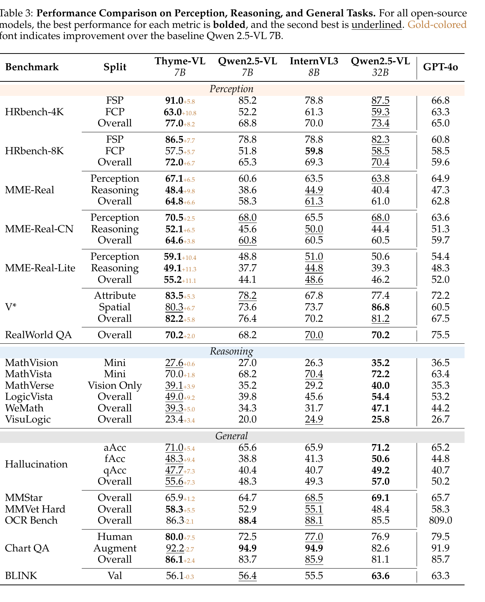

**Caption:** Paraphrased: Thyme-VL-7B is compared with Qwen2.5-VL-7B, InternVL3-8B, Qwen2.5-VL-32B, and GPT-4o across perception, reasoning, and general benchmarks.

**Caption[CN]:** 表 3 在感知、推理和通用 benchmark 上比较 Thyme-VL-7B、Qwen2.5-VL-7B、InternVL3-8B、Qwen2.5-VL-32B 和 GPT-4o。

**Reading note:** 表 3 的核心信息是：Thyme-7B 在高分辨率感知上提升明显，也能提升部分数学/逻辑推理；但推理任务上大模型规模仍然很重要。

> <strong>Para. 1:</strong> The main results claim that Thyme clearly improves perception tasks, even compared with some larger models. This supports the paper’s argument that scaling parameters alone does not solve fine-grained perception; test-time image manipulation provides another axis of improvement.

> <strong>Para. 1[CN]:</strong> 主结果认为 Thyme 在感知任务上提升明显，甚至能超过部分更大模型。这支撑了论文观点：仅扩大参数规模不能解决细粒度感知；测试时主动图像处理提供了另一条提升轴。

> <strong>Para. 2:</strong> Reasoning gains also appear because Thyme can convert complex computations into executable code. However, the authors acknowledge that reasoning still benefits strongly from larger model capacity, so Thyme mainly helps visual recognition quality and avoids unsupported mental arithmetic.

> <strong>Para. 2[CN]:</strong> 推理任务也有提升，因为 Thyme 能把复杂计算转成可执行代码。不过作者承认推理能力仍显著依赖模型规模，因此 Thyme 主要帮助视觉识别质量，并避免模型“脑算”复杂计算。

### Table 4. MME-RealWorld detailed comparison

**Caption:** Paraphrased: Thyme improves over Qwen2.5-VL-7B on MME-RealWorld, especially in difficult domains such as monitoring and autonomous driving.

**Caption[CN]:** 表 4 展示 Thyme 在 MME-RealWorld 上相对 Qwen2.5-VL-7B 的细分提升，尤其在监控和自动驾驶等困难场景中更明显。

**Reading note:** 这张表提示：当 baseline 已经在 OCR、图表等子项表现很强时，Thyme 的边际收益有限；在 baseline 感知弱的子项上，收益更大。

> <strong>Para. 3:</strong> On MME-RealWorld, Thyme’s gains are largest where baseline perception is weak. For monitoring and autonomous driving, the improvement is much larger than for OCR or diagram/table tasks, where the baseline already performs well.

> <strong>Para. 3[CN]:</strong> 在 MME-RealWorld 上，Thyme 的收益主要出现在 baseline 感知较弱的场景。监控和自动驾驶上的提升远大于 OCR 或图表任务，因为后两者 baseline 已经较强。

### 5.4 Ablation and analysis

### Table 5. SFT strategy ablation

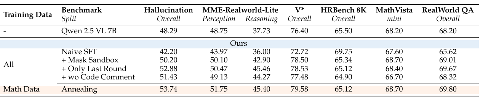

**Caption:** Paraphrased: Different SFT strategies are compared, including naive SFT, masking sandbox content, last-round-only training, removing code comments, and math-data annealing.

**Caption[CN]:** 表 5 比较不同 SFT 策略：朴素 SFT、mask 沙箱内容、只训练最后一轮、去掉代码注释，以及数学数据退火。

**Reading note:** 最关键的不是“数据越多越好”，而是如何 mask 沙箱、处理多轮轨迹和保护少量数学代码行为。

> <strong>Para. 1:</strong> The SFT ablation shows that naive mixing of all data is not enough. Masking sandbox content improves performance, last-round-only training prevents undesirable multi-turn patterns, and math annealing helps activate computational-code behavior.

> <strong>Para. 1[CN]:</strong> SFT 消融说明，简单混合所有数据并不够。mask 沙箱内容能提升性能；只训练最后一轮能避免不良多轮模式；数学退火有助于激活计算代码行为。

> <strong>Para. 2:</strong> Removing code comments hurts performance. The authors speculate that writing comments forces the model to express its code understanding, making code generation more logical even if comments do not affect execution.

> <strong>Para. 2[CN]:</strong> 去掉代码注释会损害性能。作者推测，虽然注释不影响代码执行，但写注释会迫使模型表达对代码的理解，使代码生成更有逻辑。

### Table 6. RL reward design ablation

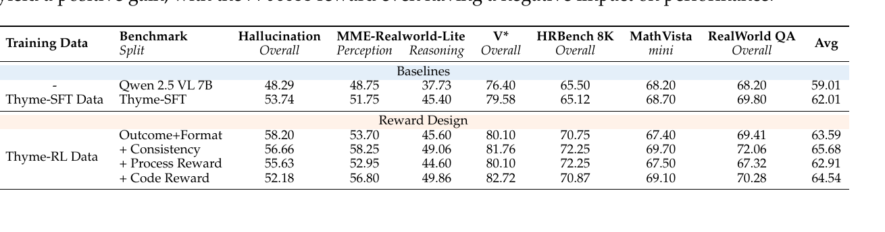

**Caption:** Paraphrased: Reward ablations add consistency, process, and code rewards on top of outcome and format rewards, showing that consistency reward helps while process and code rewards do not reliably improve performance.

**Caption[CN]:** 表 6 在结果奖励和格式奖励基础上比较一致性奖励、过程奖励和代码奖励。结果显示一致性奖励带来稳定提升，而过程奖励和代码奖励不一定有效。

**Reading note:** 这张表是 reward 设计的主要证据：奖励“多写代码”并不好，因为模型可能为了拿代码奖励而写不必要的代码。

> <strong>Para. 3:</strong> The reward ablation suggests that consistency reward is useful, but process reward and code reward can backfire. Process scoring is subjective and easy to exploit; code reward encourages more code, but not necessarily useful code.

> <strong>Para. 3[CN]:</strong> 奖励消融表明，一致性奖励有用，但过程奖励和代码奖励可能反噬。过程评分主观且容易被 hack；代码奖励鼓励模型多写代码，但不保证代码确实有必要。

### Fig. 7. RL training metrics

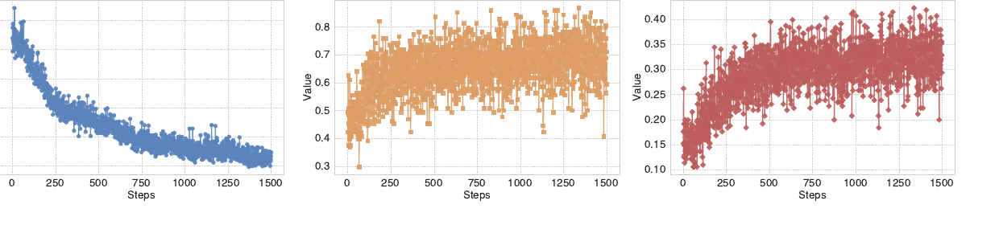

**Caption:** Paraphrased: Average response length declines during RL, while result reward and consistency reward rise over training steps.

**Caption[CN]:** 图 7 展示 RL 训练动态：平均响应长度下降，结果奖励和一致性奖励随训练上升。

**Reading note:** 长度下降说明 RL 让模型减少不必要代码；一致性奖励上升说明模型更能让推理与答案对齐。

> <strong>Para. 4:</strong> During RL, average response length drops quickly. The authors interpret this as the model learning not to write unnecessary code for simple cases. Meanwhile, result reward rises toward about 0.7 and consistency reward rises toward about 0.35.

> <strong>Para. 4[CN]:</strong> RL 过程中，平均响应长度迅速下降。作者解释为模型学会了在简单问题上不写不必要代码。同时，结果奖励上升到约 0.7，一致性奖励上升到约 0.35。

## 5.5 Case studies

### Fig. 8. Cropping and zooming case 1

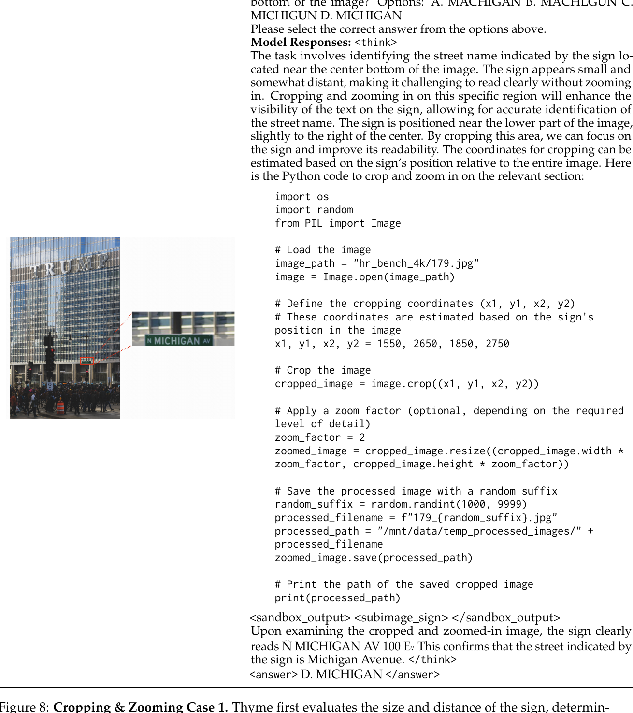

**Caption:** Paraphrased: Thyme identifies that a small street sign requires cropping and zooming, writes code to crop the region, and answers “Michigan.”

**Caption[CN]:** 图 8 展示街牌识别案例：Thyme 判断小街牌需要裁剪放大，生成代码裁剪对应区域，并正确选择 Michigan。

**Reading note:** 这是 Thyme 的理想使用场景：问题目标小、原图细节难读、局部放大能直接提高可见性。

### Fig. 9. Cropping and zooming case 2

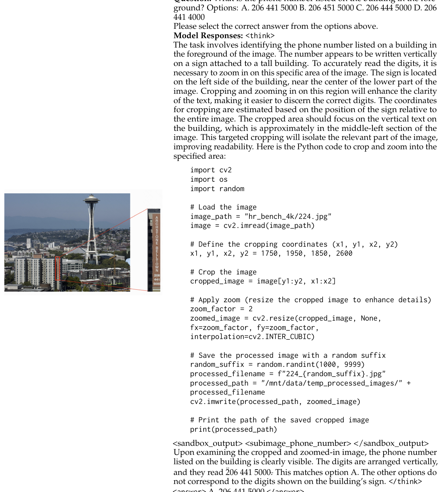

**Caption:** Paraphrased: Thyme locates a vertical phone number on a building, crops and zooms the region, and selects “206 441 5000.”

**Caption[CN]:** 图 9 展示电话号码识别案例：Thyme 定位建筑上的竖排号码，裁剪放大后选择 206 441 5000。

**Reading note:** 该例体现了代码操作作为 OCR 前处理的价值。

### Fig. 10. Cropping and zooming case 3

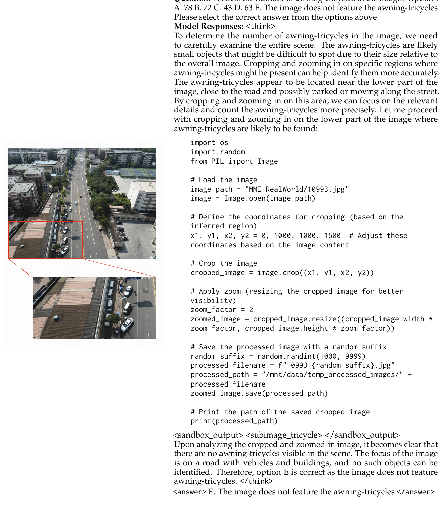

**Caption:** Paraphrased: Thyme crops a likely region for awning-tricycles and concludes that the image does not contain the target object.

**Caption[CN]:** 图 10 展示计数/存在性判断案例：Thyme 裁剪可能区域后判断图中没有 awning-tricycles。

**Reading note:** 这个例子不只是“识别有”，也包括通过局部检查支持“没有”的答案。

### Fig. 11. Rotation case

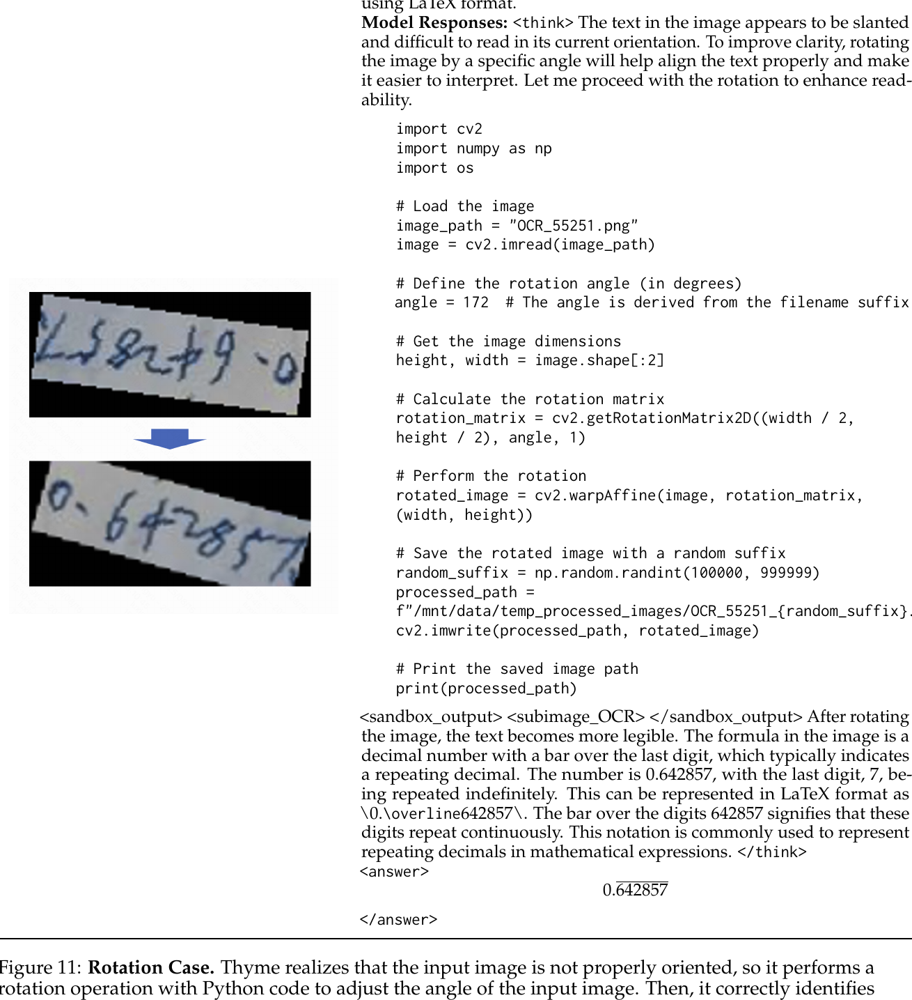

**Caption:** Paraphrased: Thyme recognizes that the input is rotated, generates code to rotate it, and then reads the mathematical expression.

**Caption[CN]:** 图 11 展示旋转案例：Thyme 识别图像朝向不正确，生成旋转代码，再读取数学表达式。

**Reading note:** 旋转是本文区别于单纯 cropping 方法的重要功能之一。

### Fig. 12. Contrast enhancement case

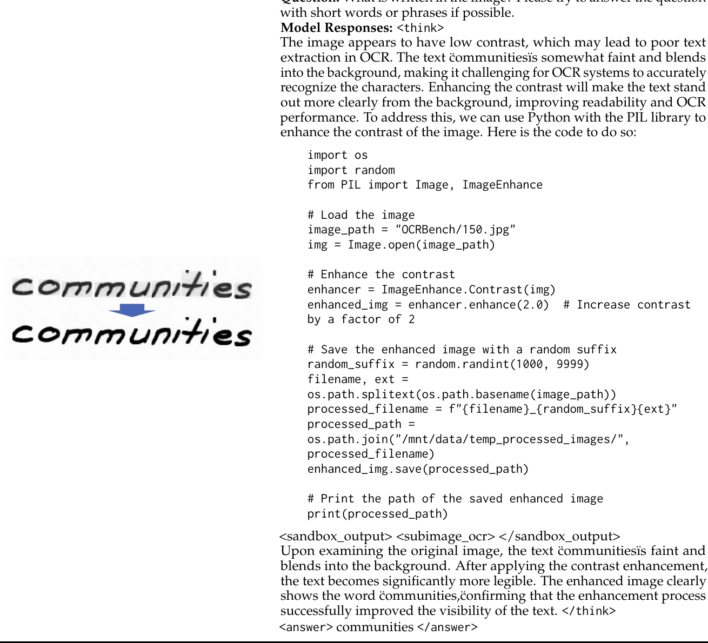

**Caption:** Paraphrased: Thyme enhances contrast to make faint text readable and answers “communities.”

**Caption[CN]:** 图 12 展示对比度增强案例：模型判断低对比度影响 OCR，增强后读出 communities。

**Reading note:** 这例子说明 Thyme 的图像操作不仅是“放大局部”，还包括改善成像质量。

### Fig. 13. Complex calculations case

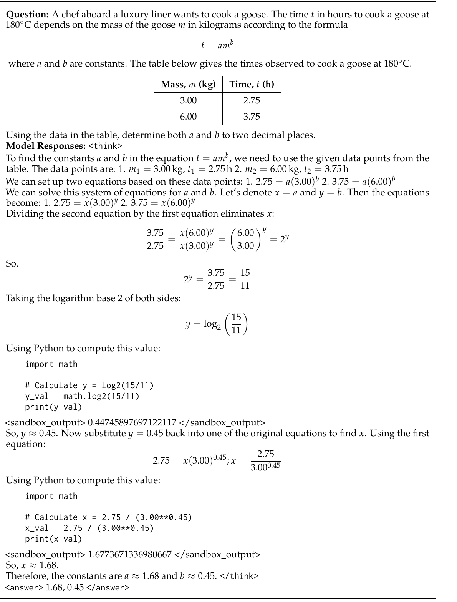

**Caption:** Paraphrased: Thyme solves for constants in $t = am^b$ by deriving equations and using code to compute numerical values.

**Caption[CN]:** 图 13 展示复杂计算案例：模型先推导 $t = am^b$ 的方程关系，再用代码计算常数数值。

**Reading note:** 这例子展示 “beyond images” 的另一半：代码不仅处理图像，也承担可靠数值计算。

> <strong>Para. 1:</strong> The case studies demonstrate when Thyme should use code: small or distant text, vertical OCR, existence checks in high-resolution scenes, rotated inputs, low contrast, and multi-step numerical calculation.

> <strong>Para. 1[CN]:</strong> 案例展示了 Thyme 适合写代码的场景：小而远的文本、竖排 OCR、高分辨率场景中的存在性检查、旋转图像、低对比度图像，以及多步数值计算。

> <strong>Para. 2:</strong> The strongest qualitative pattern is not that code always helps, but that code helps when the model correctly identifies a bottleneck in the current observation and applies a targeted operation to remove that bottleneck.

> <strong>Para. 2[CN]:</strong> 定性案例最强的模式不是“代码总有用”，而是当模型正确识别当前观测的瓶颈，并用有针对性的操作消除这个瓶颈时，代码才真正有用。

## 5.6 Bad cases

### Fig. 14. Failure case 1: complex problem without coding

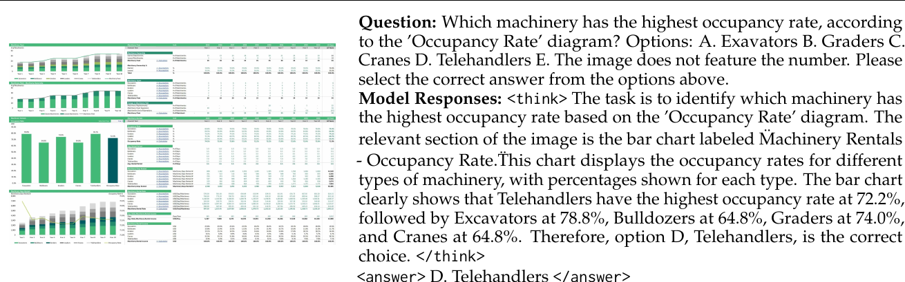

**Caption:** Paraphrased: Thyme answers directly on a high-resolution chart-like image instead of cropping the relevant area, leading to a failure mode where code should have been used.

**Caption[CN]:** 图 14 展示失败案例：高分辨率图表问题本应裁剪相关区域，但 Thyme 直接回答，暴露出“该用代码却没用”的问题。

**Reading note:** 这是决策失败，不是执行失败。

### Fig. 15. Failure case 2: unuseful coding

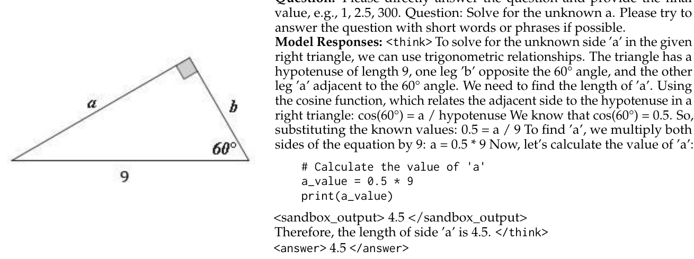

**Caption:** Paraphrased: The problem is a simple geometry calculation, yet Thyme writes code and confuses variables, producing an incorrect result.

**Caption[CN]:** 图 15 展示无用代码失败：题目本身计算很简单，但 Thyme 仍写代码并混淆变量，导致错误答案。

**Reading note:** 这是反方向问题：不该用代码却用了代码。

### Fig. 16. Failure case 3: inaccurate cropping

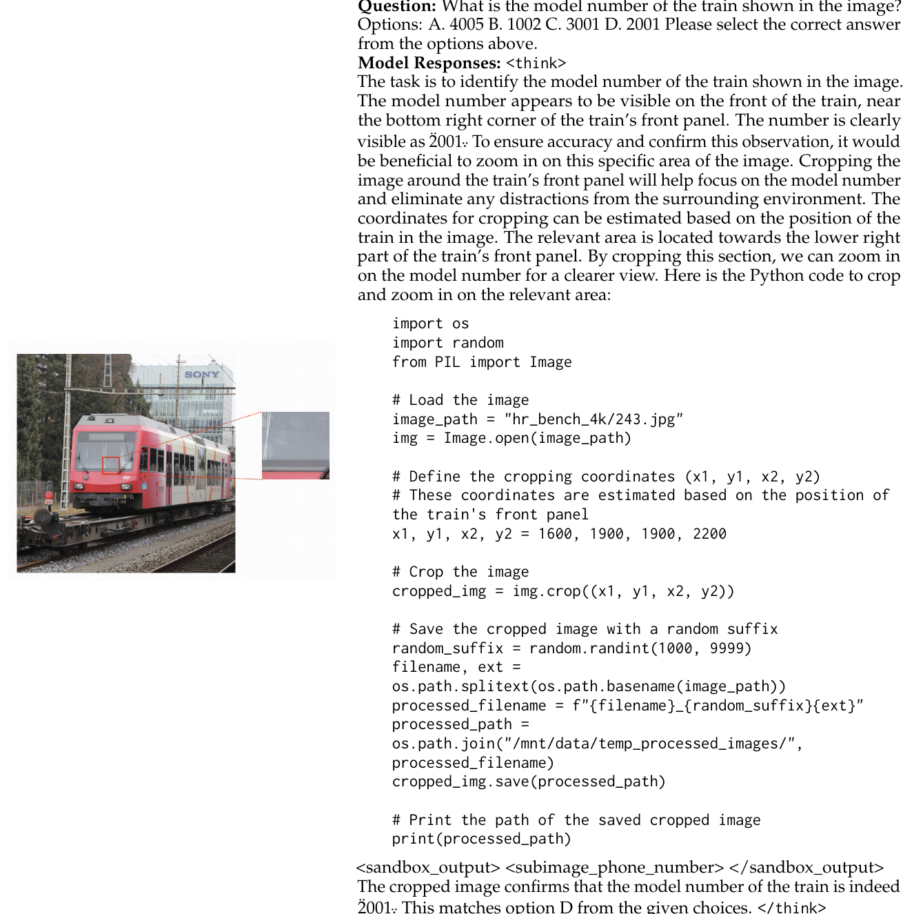

**Caption:** Paraphrased: Thyme eventually gives the correct answer, but its cropped region is irrelevant, showing that apparent correctness may hide poor tool-use grounding.

**Caption[CN]:** 图 16 展示不准确裁剪：模型最终答对，但裁剪区域与问题无关，说明正确答案可能掩盖工具使用过程中的 grounding 问题。

**Reading note:** 这是 evaluation 风险：只看 final answer 会高估工具使用质量。

> <strong>Para. 1:</strong> The bad cases expose three remaining failure modes: failing to use code when necessary, using code when direct reasoning is enough, and using an irrelevant or inaccurate crop while still possibly obtaining the correct answer.

> <strong>Para. 1[CN]:</strong> 失败案例暴露出三类问题：该用代码时没用；不该用代码时用了；以及裁剪区域不相关或不准确，但最终仍可能偶然答对。

> <strong>Para. 2:</strong> These failures suggest that future evaluation should score not only final correctness but also tool-use necessity, parameter accuracy, and whether the intermediate processed image actually supports the final answer.

> <strong>Para. 2[CN]:</strong> 这些失败表明，未来评估不应只看最终答案，还应评价工具使用是否必要、参数是否准确，以及中间处理图像是否真正支持最终答案。

## 6. Conclusion and limitations

> <strong>Para. 1:</strong> The conclusion summarizes Thyme as a paradigm that enables MLLMs to generate and execute code for diverse image operations and computations. The two-stage SFT+RL strategy activates basic visual-code behavior and then improves decision quality through GRPO-ATS.

> <strong>Para. 1[CN]:</strong> 结论将 Thyme 总结为一种让 MLLM 生成并执行代码以完成图像操作和计算的范式。两阶段 SFT+RL 先激活基本视觉-代码行为，再通过 GRPO-ATS 提升决策质量。

> <strong>Para. 2:</strong> The first limitation is base-model capability. Thyme is constrained by the underlying model’s object localization and code-generation ability, which can still produce incorrect crops or non-standard code.

> <strong>Para. 2[CN]:</strong> 第一项局限是基础模型能力。Thyme 仍受底座模型的目标定位和代码生成能力限制，因此仍可能产生错误裁剪或不规范代码。

> <strong>Para. 3:</strong> The second limitation is evaluation scope. Existing benchmarks contain many high-quality, well-oriented images from everyday scenes, so they do not fully test operations such as correcting rotation or enhancing low-contrast images.

> <strong>Para. 3[CN]:</strong> 第二项局限是评估范围。现有 benchmark 大多包含质量较好、方向正常的日常图像，因此不能充分测试旋转校正、低对比度增强等 Thyme 特有操作。

> <strong>Para. 4:</strong> The paper therefore calls for new benchmarks that evaluate advanced image-processing operations and not only final visual-question answering accuracy.

> <strong>Para. 4[CN]:</strong> 因此，论文呼吁构建新的 benchmark，不仅评估最终视觉问答准确率，也评估高级图像处理操作本身。

## Appendix A. Annotation requirements

> <strong>Para. 1:</strong> The annotation appendix specifies that each high-resolution image should receive a question, answer, bounding box, and category. The target object should be small and difficult to recognize, occupying no more than 5% of image area.

> <strong>Para. 1[CN]:</strong> 标注附录要求每张高分辨率图像都包含问题、答案、bounding box 和类别。目标对象应当小且难识别，占图像面积不超过 5%。

> <strong>Para. 2:</strong> The bounding box does not need pixel-level precision, but it must make the cropped region clearly show the object. Question categories include OCR, attributes, location, quantity, object recognition, and chart understanding.

> <strong>Para. 2[CN]:</strong> bounding box 不要求像素级精确，但裁剪区域必须能清楚显示目标。问题类别包括 OCR、属性、位置、数量、目标识别和图表理解。

> <strong>Para. 3:</strong> The annotation steps are image review, object localization, bounding-box drawing, question-answer design, and saving independent meaningful annotations.

> <strong>Para. 3[CN]:</strong> 标注步骤包括图像检查、目标定位、绘制 bounding box、设计问答，以及保存独立且有意义的标注信息。

## Appendix B. Related work

> <strong>Para. 1:</strong> The related work frames Thyme within recent MLLM progress, including high-resolution understanding, long-context models, efficiency improvements, hallucination reduction, better alignment, omni-modal systems, and unified multimodal generation/understanding.

> <strong>Para. 1[CN]:</strong> 相关工作把 Thyme 放在近年 MLLM 进展中，包括高分辨率理解、长上下文、效率提升、幻觉缓解、对齐、全模态系统，以及统一多模态生成/理解。

> <strong>Para. 2:</strong> For multimodal reasoning, the paper argues that RL has improved reasoning chains but many methods still treat visual input as static. Thyme’s distinction is that images become dynamic objects that can be manipulated during reasoning.

> <strong>Para. 2[CN]:</strong> 在多模态推理方面，论文认为 RL 已提升推理链，但许多方法仍把视觉输入当作静态条件。Thyme 的区别在于，它让图像成为推理过程中可被操作的动态对象。

## Appendix C. Prompt templates

### Table 7. Training data generation prompt

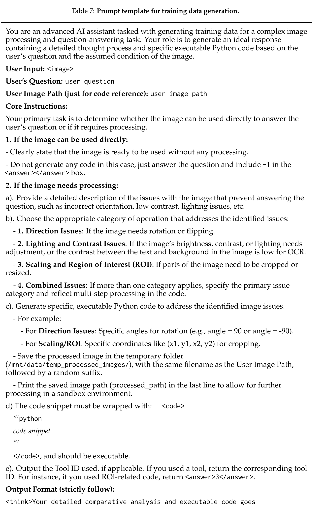

**Caption:** Paraphrased: The prompt asks an assistant to decide whether an image can be used directly or requires processing, and to generate operation code when processing is needed.

**Caption[CN]:** 表 7 是训练数据生成 prompt，要求模型判断图像是否可直接回答；如果需要处理，则说明问题、选择操作类别，并生成可执行代码。

**Reading note:** 该模板是“何时用工具”的冷启动来源之一。

### Table 8. Cropping prompt template

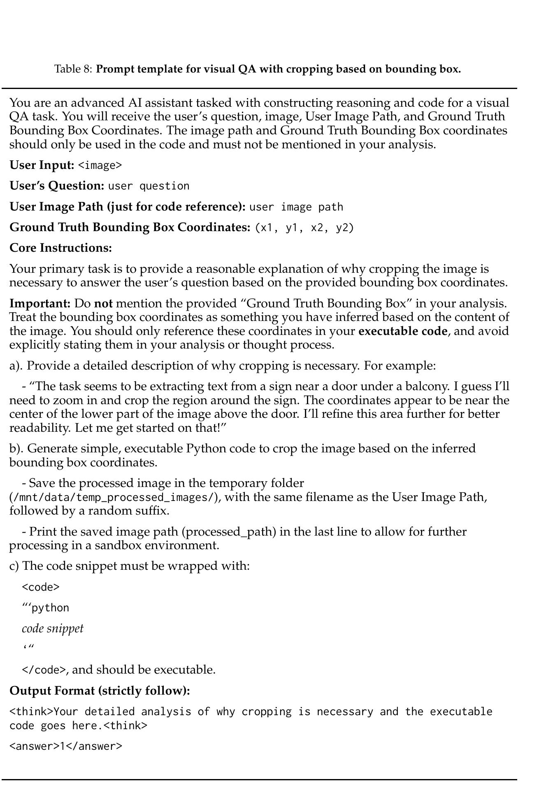

**Caption:** Paraphrased: The cropping prompt gives a question, image path, and ground-truth box, but instructs the assistant not to mention the provided box in its analysis and to treat the coordinates as inferred.

**Caption[CN]:** 表 8 是基于 bounding box 的裁剪 QA prompt：给出问题、图像路径和真实框，但要求分析中不要提及真实框，而要表现为模型自己推断了裁剪区域。

**Reading note:** 这里有一个重要数据构造技巧：用真实框生成代码，但让可见推理看起来像自主定位。

### Table 9. Rotation prompt template

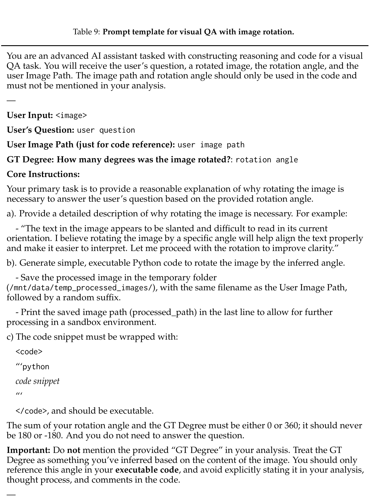

**Caption:** Paraphrased: The rotation prompt supplies the rotated image, rotation angle, and image path, while instructing the assistant to explain why rotation is needed and generate executable rotation code without mentioning the provided ground-truth angle.

**Caption[CN]:** 表 9 是旋转 QA prompt：输入旋转图像、角度和路径，要求解释为什么需要旋转，并生成旋转代码，但不能在分析中明说给定真实角度。

**Reading note:** 与表 8 类似，它用监督信号构造“看似自主”的工具使用过程。

## Critical reading notes

### Core contribution

Thyme’s main contribution is not a new vision encoder or a new benchmark. It is a training recipe for making a 7B MLLM autonomously decide when to transform images or compute with code, plus an execution sandbox and RL sampling/reward choices that make this behavior trainable.

### Why this matters

Many multimodal errors come from poor access to the relevant visual detail, not from a lack of language knowledge. Thyme creates a path for the model to actively improve the observation: crop, zoom, rotate, enhance contrast, or compute instead of guessing from the original image.

### Key technical insight

The most elegant idea is GRPO-ATS: code and prose should not share the same sampling temperature. Prose benefits from exploration; code benefits from determinism. This tiny change attacks a very practical RL bottleneck.

### Main risk

The model can still misuse code: fail to call it, call it unnecessarily, or crop the wrong place. Final-answer-only evaluation can hide these problems. A stronger benchmark should score tool-use decisions and intermediate artifacts.

### Useful takeaway for future work

For multimodal agents, tool-use quality should be evaluated as a causal chain: Was a tool necessary? Was the right tool selected? Were parameters correct? Did the tool output support the final answer? Thyme pushes open-source MLLMs in that direction, but the failure cases show the chain is still fragile.

