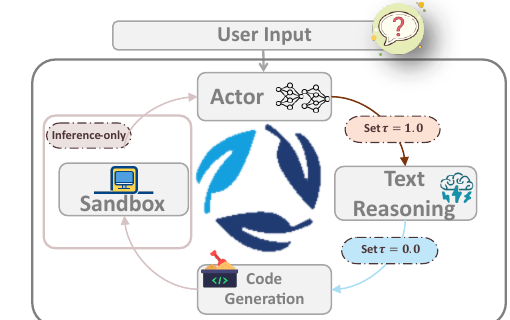
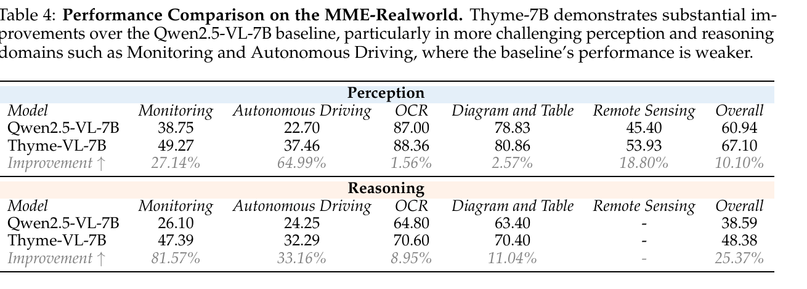
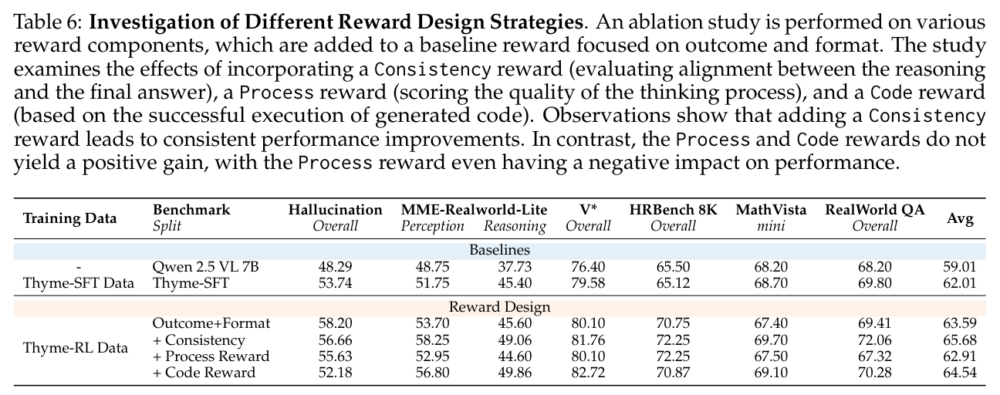

---
tags:
  - papers/3d-agent
  - papers/multimodal-agent
  - papers/tool-learning
aliases:
  - Thyme
  - Think Beyond Images
  - Thyme 超越图像思考
date: 2025-08-15
doi: 10.48550/arXiv.2508.11630
arxiv_id: 2508.11630
---

# Thyme: Think Beyond Images

## 核心信息

- 标题: Thyme: Think Beyond Images
- 标题翻译: Thyme：超越图像思考
- 作者: Yi-Fan Zhang, Xingyu Lu, Shukang Yin, Chaoyou Fu, Wei Chen, Xiao Hu, Bin Wen, Kaiyu Jiang, Changyi Liu, Tianke Zhang, Haonan Fan, Kaibing Chen, Jiankang Chen, Haojie Ding, Kaiyu Tang, Zhang Zhang, Liang Wang, Fan Yang, Tingting Gao, Guorui Zhou
- 机构: Kwai Keye；中国科学院自动化研究所；南京大学；清华大学；中国科学技术大学
- 发表时间: 2025-08-15
- 发表渠道: arXiv 预印本
- DOI: [10.48550/arXiv.2508.11630](https://doi.org/10.48550/arXiv.2508.11630)
- arXiv: [2508.11630](https://arxiv.org/abs/2508.11630)
- 论文链接: [arXiv](https://arxiv.org/abs/2508.11630)
- 代码 / 项目: [项目主页](https://thyme-vl.github.io/)；[GitHub](https://github.com/yfzhang114/Thyme)
- 数据 / 资源: [Hugging Face](https://huggingface.co/Kwai-Keye/Thyme-RL)
- 论文类型: 多模态代理方法；监督微调与强化学习

## 原文摘要翻译

在 OpenAI 提出“用图像思考”这一概念之后，近期研究开始探索如何在推理过程中激活视觉信息，从而提升模型在感知与推理任务中的表现。然而，据作者所知，当时尚无开源工作能提供与专有模型相当丰富的功能集合：后者既能执行多种图像操作，也能通过代码增强逻辑推理能力。

本文在这一方向上进行了初步尝试，提出 Thyme（超越图像思考）。这一新范式使多模态大语言模型能够自主生成并执行代码，以完成多种图像处理与计算操作，从而突破现有“用图像思考”方法。该方法不仅能够即时完成裁剪、旋转和对比度增强等多样化图像操作，也能执行数学计算；与此同时，模型仍可高度自主地判断何时以及如何使用这些操作。作者通过两阶段训练激活这一能力：首先在经过筛选的 50 万条样本上进行监督微调以教授代码生成，随后通过强化学习改进决策。强化学习阶段人工收集并设计了高分辨率问答对，以提高学习难度；同时提出带自适应温度采样的组相对策略优化，为文本和代码生成设置不同温度，在推理探索与代码执行精度之间取得平衡。作者开展了广泛的实验与消融分析。近 20 个基准的综合评估表明，Thyme 获得了显著且较为一致的性能提升，尤其体现在困难的高分辨率感知与复杂推理任务上。作者还公开了数据集、沙箱和代码，以推动后续研究。

## 创新点

1. **把“视觉操作”统一成可执行代码接口。** Thyme 不局限于生成新图或预测一个裁剪框，而是让模型自主组合裁剪、旋转、对比度增强、颜色分析和数学计算；操作集合因此可以随着沙箱能力扩展。
2. **把工具能力学习和调用策略学习分成两个阶段。** 监督微调先教会模型生成可执行代码和处理多轮返回结果，强化学习再优化“是否调用、调用什么、调用几次”，避免把会写代码误当成会用代码。
3. **提出文本—代码双温度采样。** GRPO-ATS 在自然语言推理阶段保持温度 1.0 以探索不同思路，在生成代码时切换到温度 0.0 以减少随机语法和变量错误；`<code>` 标记是采样策略切换的接口。
4. **用一致性约束代替工具崇拜。** 直接奖励代码成功执行会诱导无必要调用，主观过程奖励也容易被策略利用。论文改为以最终结果为中心，并只在答案正确时叠加一致性和格式激励。

## 一句话总结

Thyme 的真正贡献不是增加一个新的视觉骨干，而是给出一套“模型自主决策—生成代码—安全执行—读取结果—继续推理”的可训练代理配方；它对 3D agent 最有价值的是主动感知与工具调用方法论，而不是现成的三维几何能力。

## 研究问题

### 从“看图回答”到“主动改造观察”

普通多模态模型把输入图像视作静态上下文。图像过大、文字过小、方向错误或对比度不足时，模型通常只能依赖一次视觉编码的结果继续猜测。“用图像思考”把中间视觉结果引入推理，但已有开源路线多集中于生成图像或局部裁剪，操作种类和参数选择仍受限。

Thyme 把问题改写为三层决策：当前问题是否需要工具；若需要，应选择什么操作与参数；执行结果返回后，是继续调用工具还是给出答案。这样，困难不再只是代码生成，而是**有成本的工具使用策略学习**。

### 与 3D agent 的关系

这篇论文处理的是二维图像与数值计算，并没有构建三维场景、估计相机位姿或进行物理交互。因此它不是 3D agent 方法。可迁移之处在于：三维代理同样需要决定何时改变视角、裁剪点云、调用渲染器、运行几何求解器，并把环境返回值接回推理链。Thyme 提供了训练这种决策链的模板。

## 数据与任务定义

### 轨迹形式

一条训练样本可写成输入图像与问题 $(I,Q)$，随后接多轮轨迹 $[T_t,C_t,S_t]$：$T_t$ 是推理文本，$C_t$ 是模型生成的代码，$S_t$ 是沙箱返回的图像或数值观察，最终以答案 $y$ 结束。关键区别是 $S_t$ 来自外部环境，不应被当作模型需要预测的词元。

### 监督微调数据

作者从超过 400 万条公开或已有样本中筛选并构造 50 万条监督微调数据。第一组来源包括 LLaVA-OV-Image、MM-RLHF、SMR 与 V*。

其他来源包括 MM-Eureka、arXivQA 和 Retool。

筛选后的关键组成如下：

| 数据类型 | 规模 | 作用 |
|---|---:|---|
| 无需工具、直接回答 | 100K | 教模型克制调用工具 |
| 高质量可执行问答 | 50K | 从大规模池中经沙箱、大模型与人工复核筛选 |
| 裁剪专项 | 28K | 学习局部目标定位与放大 |
| 旋转专项 | 14K | 处理旋转 30°–335° 的图像 |
| 低对比文字识别 | 约 10K | 学习对比度增强 |
| 计算代码 | 15K | 把复杂数学推理转成简洁程序 |

除此之外，数据还包含多轮进一步增强与错误纠正轨迹。作者使用三项训练处理：遮蔽沙箱输出的损失；多轮样本只监督最后一轮；完成视觉操作学习后再用较小学习率进行数学数据退火。

*Fig. 3｜监督微调数据构造流程：从已有数据出发，经提示、代码生成、沙箱执行和质量过滤形成训练轨迹。*

*Table 2｜监督微调的用户提示模板，规定图像路径、问题与模型可使用的执行环境。*

### 强化学习数据与评测

强化学习数据来自 V*、arXivQA、ThinkLite-VL 以及人工构造的高分辨率样本。作者先收集 30K 张至少一边超过 2048 像素的图像，再由 15 名标注员围绕占图像面积不超过 5% 的目标提出问题，并经交叉检查和三名多模态专家复核。论文引言把最终人工设计的复杂感知集合描述为 10K；因此更稳妥的理解是“30K 收集池、10K 级最终精选数据”，而不是把两个数字混为同一规模。

评测覆盖近 20 个基准，分为三类：

- 高分辨率感知：HRBench、MME-RealWorld、V* 与 RealWorldQA；
- 复杂推理：MathVision、MathVista、MathVerse、LogicVista、WeMath 与 VisuLogic；
- 通用能力：幻觉评测、MMStar、MMVet、OCRBench、ChartQA 与 BLINK。

### 训练设置

骨干为 Qwen2.5-VL-7B，训练使用 32 张 H800。监督微调图像阶段学习率为 $10^{-5}$，数学退火为 $10^{-6}$，批大小 128，训练 3 个 epoch；强化学习学习率为 $5\times10^{-7}$，KL 系数 0.001，批大小 256，每个问题采样 4 条轨迹，重复惩罚 1.05。

## 方法主线

### 机制流程

1. **输入与决策。** 模型接收图像和问题，先生成推理文本，判断当前证据是否足以直接回答；输出去往最终答案或代码分支。
2. **操作生成。** 若需要外部处理，模型把操作意图编码成 Python 代码，选择裁剪、旋转、对比度、颜色统计或数学计算等操作及参数；代码被送入沙箱。
3. **安全执行。** 沙箱规范化输入输出、修正部分格式与越界坐标、禁止危险文件操作，并设置 10 秒超时；输出处理后的图像或数值观察。
4. **观察回注。** 执行结果作为外部观察返回模型，模型保留多轮变量与上下文，继续推理、再次调用或生成最终答案。

*Fig. 2｜Thyme 总体闭环：模型在自然语言推理、代码生成、沙箱执行与结果回注之间多轮交互。*

### 沙箱不是外围工程

沙箱禁止删除、移动和重命名等危险操作，使用自动格式化与抽象语法树检查，并预置 `image_path` 与常用图像库。当变量名含有框或坐标语义时，它会限制裁剪边界；同时识别处理后的输出变量，并在多轮调用间保留状态。也就是说，最终能力来自“模型加执行协议”，而不是裸模型独立完成所有低层错误处理。

### 两阶段训练的分工

监督微调负责建立代码语法、工具接口和多轮轨迹格式。大量无工具样本告诉模型“直接回答也是合法动作”；专项数据则覆盖裁剪、旋转、增强和计算。强化学习使用完全在线的 GRPO，对一组完整多轮轨迹计算相对优势，并把沙箱输出词元排除在轨迹长度与优势计算之外，因为这些词元不是策略生成的动作。

### GRPO-ATS：推理可探索，代码要确定

统一高温采样会增加代码的语法、变量和参数错误；统一低温又会压缩自然语言推理的探索。GRPO-ATS 在普通文本阶段使用温度 1.0，检测到 `<code>` 后把温度切换到 0.0，代码结束后恢复文本温度。

*Fig. 6｜GRPO-ATS 采样流程：文本段高温探索，代码段零温确定性生成，并在代码边界处自动切换。*

作者还加入两种早停：使用 Rabin–Karp 检查重复子串，累计重复长度超过输出的 50% 时终止；同时限制最大交互轮数，避免代理陷入无效循环。

### 奖励设计

最终奖励为：

$$
r = r_{\mathrm{result}}\bigl(1 + 0.5r_{\mathrm{consistency}}\bigr) + 0.5r_{\mathrm{format}}.
$$

结果奖励先尝试规则匹配，再由 Qwen2.5-VL-72B 判断语义等价；一致性奖励衡量同一问题多次采样答案的一致程度；格式奖励检查输出协议。额外奖励只在最终结果正确时发挥作用，避免模型用漂亮格式或频繁调用掩盖错误答案。

## 关键结果

### 总体表现

*Fig. 1｜Thyme 相对同骨干基线在感知、推理与通用基准上的总体变化；优势集中在高分辨率感知和复杂推理。*

*Table 3｜感知、推理和通用任务的完整主结果；表中同时显示 Thyme 的广泛提升与少数退化项。*

代表性结果如下。数值均为 Qwen2.5-VL-7B 基线到 Thyme-7B 的绝对分数变化：

| 任务 | 基线 | Thyme | 变化 |
|---|---:|---:|---:|
| HRBench-4K Overall | 68.8 | 77.0 | +8.2 |
| HRBench-8K Overall | 65.3 | 72.0 | +6.7 |
| MME-Real-Lite Overall | 44.1 | 55.2 | +11.1 |
| V* Overall | 76.4 | 82.2 | +5.8 |
| LogicVista | 39.8 | 49.0 | +9.2 |
| WeMath | 34.3 | 39.3 | +5.0 |
| VisuLogic | 20.0 | 23.4 | +3.4 |
| 幻觉综合指标 | 48.3 | 55.6 | +7.3 |

提升模式与机制相符：局部目标很小、分辨率很高或需要额外计算时，主动操作图像和执行代码更有价值。MathVision 只增加 0.6 点，说明“可计算”并不会自动消除视觉数学中的识别和建模瓶颈。

### MME-RealWorld 的分场景增益

*Table 4｜MME-RealWorld 分场景结果；监控与自动驾驶等基线较弱的困难场景获得最大相对增益。*

感知任务中，自动驾驶由 22.70 提升到 37.46，遥感由 45.40 提升到 53.93；推理任务中，监控由 26.10 提升到 47.39，自动驾驶由 24.25 提升到 32.29。相反，原本较高的 OCR 感知只从 87.00 升至 88.36。这表明工具的边际价值与原始观察是否足够密切相关，而不是所有类别均匀受益。

### 监督微调消融

*Table 5｜监督微调策略消融：遮蔽沙箱输出是朴素混合训练后最关键的恢复步骤，末轮监督与数学退火提供进一步但不均匀的改善。*

朴素地混合全部数据并不能得到好工具代理。加入沙箱输出遮蔽后，幻觉指标从 42.20 升至 50.20，V* 从 72.72 升至 78.50，RealWorldQA 从 65.62 升至 69.01。只训练最后一轮继续改善部分指标；去掉代码注释会让多项指标下降，说明注释也承担了操作意图和程序结构的监督。数学退火最终把幻觉指标推至 53.74、V* 推至 79.58，但不是每项指标都单调上升。由于这些策略按累加顺序加入，行间差值不能完全视为独立因果贡献。

### 奖励与训练动态

*Table 6｜奖励设计消融：结果加格式奖励达到 63.59，加入一致性奖励后达到最高的 65.68；过程奖励和代码奖励均较弱。*

| 配置 | 平均分 |
|---|---:|
| Qwen2.5-VL-7B | 59.01 |
| Thyme-SFT | 62.01 |
| 结果奖励 + 格式奖励 | 63.59 |
| 再加一致性奖励 | **65.68** |
| 再加过程奖励 | 62.91 |
| 再加代码奖励 | 64.54 |

直接奖励代码执行成功会鼓励模型在简单问题上也调用工具；过程奖励依赖主观判断并可能被策略钻空子。一致性奖励更接近“正确决策应在多次采样中稳定出现”，因而更适合约束工具策略。

*Fig. 7｜强化学习期间平均响应长度快速下降，结果奖励约从 0.5 升至 0.7，一致性奖励约从 0.15 升至 0.35。*

响应变短而结果奖励上升，说明强化学习并非简单增加代码量，而是在学习删掉无必要的操作。不过，论文没有同时报告平均工具调用次数，因此“变短”等同于“更少调用”仍是合理推断，而非直接测量。

### 明确的退化项

| 任务 | 基线 | Thyme | 变化 |
|---|---:|---:|---:|
| OCRBench | 88.4 | 86.3 | -2.1 |
| BLINK | 60.1 | 59.8 | -0.3 |
| ChartQA Augment | 53.5 | 50.8 | -2.7 |

这些退化说明两阶段工具训练没有完全保持骨干的所有原有能力。论文没有进一步区分灾难性遗忘、数据域偏置、工具过度介入或数学退火造成的影响。

## 深度分析

### 为什么“无需工具”样本很重要

工具代理最容易学到的捷径是：训练集中出现代码，就把“生成代码”当成获得奖励的先决条件。100K 无工具样本与结果中心奖励共同把动作空间中的“直接回答”保留下来。这一设计对 3D agent 尤其关键：渲染、重建或几何求解器调用都很昂贵，代理必须学习不调用也是一种正确策略。

### 为什么沙箱输出要从损失与优势中排除

沙箱结果是环境观察，不是模型动作。若训练模型复现这些词元，模型会浪费容量模仿外部环境；若把它们计入轨迹长度或优势，又会让长图像返回值扭曲信用分配。Thyme 在监督微调和强化学习两处保持了同一边界，这比单独的代码模板更具迁移价值。

### 双温度的价值与证据缺口

自然语言推理需要多样性，代码执行需要确定性，这一分段采样直觉合理，也与代理系统中的“规划器—执行器”分工一致。但论文没有给出统一温度、仅降低代码温度、语法约束解码等替代方案的完整定量比较。因此现有证据证明 Thyme 整体有效，却不足以精确分离 GRPO-ATS 本身的贡献。

### 成功与失败模式

成功案例表明模型可以连续完成定位并裁剪路牌或电话号码、旋转文字、增强低对比图像，以及把复杂计算改写成程序。失败案例更值得保留：面对复杂高分辨率问题时完全不裁剪；对简单算术无必要写代码且变量出错；裁剪了无关区域，却依靠已有知识碰巧答对。它们对应六个可独立诊断的阶段：是否调用、目标定位、操作选择、参数生成、执行是否成功、返回结果是否真正被利用。

### 对 3D agent 的可复用方案

若把二维工具库替换为视角规划、点云裁剪、相机投影、渲染、碰撞检测或几何求解器，Thyme 的训练配方可以直接转写：先用监督数据教授工具协议与多轮轨迹，再用在线强化学习优化是否调用和调用顺序；文本规划保留探索，结构化代码或动作使用确定性采样；奖励最终任务正确性与跨采样一致性，而不是奖励工具频率。

不过，三维环境的状态更长、操作更昂贵、失败不可逆性更强。复现时必须额外记录工具时延、几何状态有效性、视角覆盖率和逐阶段失败率，不能只报告最终问答准确率。

## 局限

1. **基础能力仍限制代理上限。** 作者明确指出，目标定位不准和复杂代码能力不足会导致错误裁剪、非标准代码或无法执行的程序。
2. **基准没有覆盖全部声称能力。** 多数评测图像质量高且方向正常，因此旋转和对比度增强虽然有案例与专项训练，却缺少专门的量化基准。
3. **GRPO-ATS 的独立证据不足。** 论文缺少温度策略消融、代码编译率、执行成功率、沙箱超时率和平均调用轮数。
4. **提升并非普遍。** OCRBench、BLINK 和 ChartQA Augment 退化，论文没有给出系统性的能力遗忘分析。
5. **成本报告存在口径冲突。** 实验部分一处称全部训练约 224 GPU 小时，另一处又称强化学习超过 1200 GPU 小时；结合监督微调约 200 GPU 小时与数学退火约 8 GPU 小时，224 更像监督阶段总量，但论文没有澄清，不能据此给出精确复现预算。
6. **不是三维或具身验证。** 所有能力停留在图像处理、计算和问答层面，没有真实相机控制、三维状态更新、动作执行或闭环安全评估。

## 我的笔记

### 我会保留的设计原则

- **让工具成为手段，不是标签。** 数据中要有足够多“无需调用”的例子，奖励也只围绕最终任务效果。
- **明确策略与环境的边界。** 外部执行结果不参与词元监督和策略动作长度计算。
- **在协议边界切换采样策略。** 规划文本可以探索，代码、函数参数和结构化动作应更确定。
- **把沙箱当成模型的一部分复现。** 坐标约束、I/O 规范化、状态保存和错误处理都会改变最终性能。
- **单独测量六阶段错误。** 只看最终准确率会掩盖无效工具调用和碰巧答对。

### 后续值得验证的问题

1. 在完全相同的数据和模型下，GRPO-ATS 相对统一温度到底贡献多少？
2. 扣除额外视觉编码、代码执行和多轮生成时延后，工具增强是否仍有净收益？
3. OCRBench 等退化来自工具偏好、数学退火还是灾难性遗忘？
4. 30K 高分辨率收集池到 10K 最终数据的筛选、去重和难度控制如何实现？
5. 将工具替换为 3D 视角选择、点云局部化与几何计算后，同一训练范式能否学到可靠的调用策略？

## 引用

Zhang, Y.-F., Lu, X., Yin, S., Fu, C., Chen, W., Hu, X., Wen, B., Jiang, K., Liu, C., Zhang, T., Fan, H., Chen, K., Chen, J., Ding, H., Tang, K., Zhang, Z., Wang, L., Yang, F., Gao, T., & Zhou, G. (2025). *Thyme: Think Beyond Images*. arXiv. [https://doi.org/10.48550/arXiv.2508.11630](https://doi.org/10.48550/arXiv.2508.11630)
