# Deep Video Discovery: Agentic Search with Tool Use for Long-form Video Understanding

## Page & Section Index
- **Abstract** (Page 1)
- **1 Introduction** (Pages 1–3)
- **2 Related Work** (Pages 3–4)
  - 2.1 Video Large Language Models
  - 2.2 Agentic Video Understanding
- **3 Method: Deep Video Discovery** (Pages 4–6)
  - 3.1 Overview
  - 3.2 Multi-granular Video Database Construction
  - 3.3 Agentic Search and Answering
- **4 Experiments** (Pages 6–10)
  - 4.1 Datasets and Evaluation Protocols
  - 4.2 Implementation Details
  - 4.3 Main Results
  - 4.4 Ablation Studies
  - 4.5 Agent Behavior Analysis
- **5 Conclusion & Discussion** (Page 10)
- **References** (Pages 10–14)
- **Appendix** (Pages 15–27)
  - A Additional Experimental Details, Prompts & JSON Schemas
  - B Case Studies on Agent Behaviors

## Terminology Ledger
| 英文术语 | 规范中文翻译 | 备注 / 定义 |
| :--- | :--- | :--- |
| Deep Video Discovery (DVD) | 深度视频发现 | 微软亚洲研究院与中科大提出的免训练长视频搜索智能体 |
| Multi-granular Video Database | 多粒度视频数据库 | 包含粗粒度摘要、片段字幕、关键主体及时间区间的离线索引库 |
| Agentic Search and Answering (ASA) | 智能体搜索与问答 | 基于观测状态自主编排工具调用直至获取答案的推理循环 |
| Global Browse | 全局浏览 | 检索并概览整部视频的所有主体与全局字幕的粗粒度工具 |
| Clip Search | 片段搜索 | 针对特定子问题或关键词召回局部相关视频片段的检索工具 |
| Frame Inspect | 帧检查 | 在特定时间戳区间内提取高清图像帧并执行细粒度视觉问答的工具 |
| Uniformly Predefined Workflow | 统一预定义工作流 | 传统视频智能体对所有查询机械套用的固定步骤流水线 |
| Autonomous Tool Orchestration | 自主工具编排 | 由 LLM 依据当前观测事实动态规划下一步工具与参数的能力 |

---

## Abstract

> <strong>Para. 1:</strong> Long-form video understanding presents significant challenges due to extensive temporal-spatial complexity and the difficulty of question answering under such extended contexts. While Large Language Models (LLMs) have demonstrated considerable advancements in video analysis capabilities and long context handling, they continue to exhibit limitations when processing information-dense hour-long videos. To overcome such limitations, we propose the Deep Video Discovery (DVD) agent to leverage an agentic search strategy over segmented video clips.
> <strong>Para. 1[CN]:</strong> 由于巨大的时空复杂性以及在此类超长上下文中回答问题的困难，长视频理解面临着严峻的挑战。尽管大语言模型（LLM）在视频分析能力和长上下文处理方面取得了显著进展，但在处理信息密集的小时级视频时仍暴露出明显的局限性。为克服这些局限，我们提出了深度视频发现（Deep Video Discovery, DVD）智能体，在切分的视频片段上运用自主智能体搜索策略。

> <strong>Para. 2:</strong> Unlike previous video agents that rely on predefined workflows applied uniformly across different queries, our approach emphasizes the autonomous and adaptive nature of agents. By providing a set of search-centric tools on a multi-granular video database, our DVD agent leverages the advanced reasoning capability of LLMs to plan on its current observation state, strategically selects tools to orchestrate adaptive workflows for different queries in light of gathered information. We perform comprehensive evaluation on multiple long video understanding benchmarks that demonstrates our advantage. Our DVD agent achieves state-of-the-art performance on the challenging LVBench dataset, reaching an accuracy of 74.2%, which substantially surpasses all prior works, and further improves to 76.0% with transcripts. The code has been released at https://github.com/microsoft/DeepVideoDiscovery.
> <strong>Para. 2[CN]:</strong> 与以往对不同查询机械套用统一预定义工作流的视频智能体不同，我们的方法强调智能体的自主性与自适应性。通过在多粒度视频数据库上提供一组以搜索为核心的工具集，我们的 DVD 智能体利用 LLM 的高级推理能力对当前观测状态进行规划，并根据已收集到的信息为不同查询自适应地编排工具调用工作流。我们在多个长视频理解基准测试上进行了全面评估，证实了我们的显著优势。我们的 DVD 智能体在极具挑战性的 LVBench 数据集上达到了 74.2% 的前沿准确率（SOTA），大幅超越所有先前工作，并在辅以语音转录文本时进一步跃升至 76.0%。代码已开源。

---

## 1 Introduction

> <strong>Para. 3:</strong> Recent years have witnessed remarkable breakthroughs in Video Large Language Models (Video-LLMs), enabling automated analysis of multimodal content across short and medium-length clips. However, extending these architectures to hour-long videos remains a monumental obstacle. An hour of video at 30 fps comprises over 108,000 frames; even with aggressive temporal downsampling to 1 fps, directly ingesting 3,600 visual frames overwhelms the context memory of state-of-the-art architectures, leading to attention dilution, computational bottlenecks, and catastrophic loss of fine-grained details.
> <strong>Para. 3[CN]:</strong> 近年来，视频大语言模型（Video-LLM）取得了令人瞩目的突破，实现了对短视频和中等长度片段多模态内容的自动化分析。然而，将这些架构推广至小时级长视频仍面临巨大阻碍。一段 30 fps 的一小时视频包含超过 108,000 帧；即使激进地将时序下采样至 1 fps，直接输入 3,600 个视觉帧仍会压垮顶尖模型的上下文内存，导致注意力被严重稀释、计算瓶颈突显以及细粒度特征信息的毁灭性丢失。

**Caption:** Figure 1: Left: Illustration of our Deep Video Discovery agent, which autonomously plans on observation states and orchestrates search-centric tools. Right: Accuracy versus frames compared with existing methods on LVBench.
**Caption[CN]:** 图 1：左图：深度视频发现（DVD）智能体示意图，其依据观测状态自主规划并编排以搜索为核心的工具；右图：LVBench 上与现有方法相比的准确率对比。

> <strong>Para. 4:</strong> To handle long contexts efficiently, recent works have explored agentic video architectures, such as VideoAgent, VideoTree, and VCA. These frameworks divide video analysis into multi-round deliberation, combining language reasoning with specialized perceptual tools. However, existing video agents exhibit a fundamental drawback: they enforce uniformly predefined, rigid workflows that execute the exact same sequence of tool invocations regardless of query complexity. For instance, VideoAgent invariably performs global text summarization followed by iterative interval probing, even when an explicit timestamp is provided in the user prompt. Such rigid pipelines suffer from severe inefficiency and error propagation.
> <strong>Para. 4[CN]:</strong> 为高效处理长时序上下文，近期的工作探索了智能体视频架构（如 VideoAgent、VideoTree 和 VCA）。这些框架将视频分析拆分为多轮深思熟虑，将语言推理与专用感知工具相结合。然而，现有的视频智能体存在根本性的缺陷：它们强制执行统一预定义、僵化的固定工作流，无论查询复杂程度如何，都机械地执行相同的工具调用序列。例如，VideoAgent 总是先做全片文本摘要，再迭代探测区间，即便用户提问中已经给出了明确的时间戳亦是如此。这种僵化的流水线会导致严重的低效与误差累积。

> <strong>Para. 5:</strong> To overcome these limitations, we introduce Deep Video Discovery (DVD), a flexible and fully autonomous video agent. DVD decouples video understanding into two cohesive stages: (1) **Multi-granular Video Database Construction**, which segments the long video into coherent clips and indexes them with multi-level captions, key subjects, and timestamps; and (2) **Agentic Search and Answering (ASA)**, which equips a powerful reasoning LLM with a search-centric toolkit (`Global Browse`, `Clip Search`, `Frame Inspect`) to autonomously deliberate, formulate sub-queries, and dynamically orchestrate tools based on incoming evidence.
> <strong>Para. 5[CN]:</strong> 为打破这一局限，我们推出了深度视频发现（DVD），一种灵活且完全自主的视频智能体。DVD 将长视频理解解耦为两个紧密协作的阶段：(1) **多粒度视频数据库构建**：将长视频切分为连贯片段，并利用多层级字幕、关键主体和时间戳为其建立索引；(2) **智能体搜索与问答（ASA）**：为强推理 LLM 配备以搜索为核心的工具箱（`Global Browse`、`Clip Search`、`Frame Inspect`），使其能够基于接收到的证据自主思考、生成子查询并动态编排工具调用。

---

## 2 Related Work

> <strong>Para. 6:</strong> **Video Large Language Models.** Early video-LLMs adapted vision transformers to process video sequences via spatial-temporal pooling (e.g., Video-ChatGPT, VideoLLaMA, PLLaVA). Recent commercial architectures such as Gemini 1.5 Pro, GPT-4o, and OpenAI o3 have scaled context windows to millions of tokens. Nevertheless, processing hours of continuous visual input still suffers from the "needle-in-a-haystack" phenomenon, where critical transient details are overlooked amidst vast swathes of background noise.
> <strong>Para. 6[CN]:</strong> **视频大语言模型。** 早期的视频大语言模型通过时空池化改造视觉 Transformer 来处理视频序列（例如 Video-ChatGPT、VideoLLaMA、PLLaVA）。近期以 Gemini 1.5 Pro、GPT-4o 和 OpenAI o3 为代表的商业模型已将上下文窗口扩展至数百万 token。然而，处理数小时连续视觉输入时依然深陷“大海捞针”困境，关键的瞬态细节往往被海量的背景噪点所淹没。

> <strong>Para. 7:</strong> **Agentic Video Understanding.** To mitigate context overload, agent-based video frameworks have emerged as an attractive paradigm. VideoAgent utilizes a memory buffer and text-based tool execution; VideoTree establishes a tree-structured hierarchical exploration tree; MR. Video introduces multi-round conversational refinement. However, these methods either impose uniform heuristics or rely on constrained decision steps. DVD departs from fixed workflows by granting the LLM complete autonomy to navigate a structured database across arbitrary search trajectories.
> <strong>Para. 7[CN]:</strong> **基于智能体的视频理解。** 为缓解上下文过载，基于智能体的视频框架应运而生。VideoAgent 利用记忆缓冲区和基于文本的工具执行；VideoTree 建立了树状分层探索结构；MR. Video 引入了多轮对话精炼机制。然而，这些方法要么施加了统一的启发式限制，要么依赖受限的决策步数。DVD 彻底抛弃了固定工作流，赋予 LLM 充分的自主权，使其能够在结构化数据库上沿任意搜索轨迹自由巡航。

---

## 3 Method: Deep Video Discovery

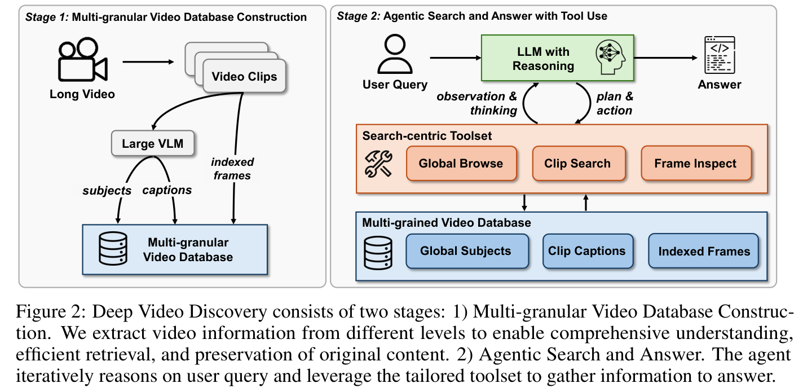
**Caption:** Figure 2: Deep Video Discovery consists of two stages: 1) Multi-granular Video Database Construction, which processes raw video into structured multi-level captions and metadata; and 2) Agentic Search and Answering, where an LLM agent iteratively reasons and invokes search-centric tools.
**Caption[CN]:** 图 2：深度视频发现（DVD）包含两个阶段：1）多粒度视频数据库构建：将原始视频处理为结构化多层级字幕与元数据；2）智能体搜索与问答：由 LLM 智能体进行迭代推理并调用以搜索为核心的工具。

### 3.1 Overview

> <strong>Para. 8:</strong> As depicted in Figure 2, DVD operates across two stages. Stage 1 constructs a structured, multi-granular database offline. Stage 2 executes the Agentic Search and Answering loop online. At each iteration, the agent reviews the user query $Q$, the current observation history $H_t$, and reasons about the next action $a_t$. This process iterates until the agent gathers sufficient evidence to formulate a definitive answer.
> <strong>Para. 8[CN]:</strong> 如图 2 所示，DVD 分为两个阶段运行。阶段 1 离线构建结构化的多粒度数据库；阶段 2 在线执行智能体搜索与问答循环。在每一次迭代中，智能体审视用户查询 $Q$ 与当前观测历史 $H_t$，推断出下一步动作 $a_t$。该过程不断迭代，直至智能体搜集到充足证据以形成最终答案。

### 3.2 Multi-granular Video Database Construction

> <strong>Para. 9:</strong> To enable efficient querying over hour-long videos, we partition the raw video $V$ into temporally coherent clips $\mathcal{C} = \{c_1, c_2, \dots, c_N\}$ using scene boundary detection (e.g., PySceneDetect or uniform interval splitting with duration $\Delta t pprox 10	ext{s}$ to $30	ext{s}$). For each clip $c_i$, we extract:
> (1) **Temporal Clip Captions**: A visual-language model $\mathcal{M}_{	ext{database}}$ generates a rich descriptive summary $	ext{Cap}(c_i)$ capturing key actions, interactions, and environmental changes.
> (2) **Key Subjects**: Prominent entities, actors, and objects $	ext{Sub}(c_i)$ present in the clip are extracted to facilitate entity-centric querying.
> (3) **Temporal Boundaries**: Exact start and end timestamps $[t_s^i, t_e^i]$.
> When audio transcripts are available, we transcribe speech using WhisperX and align text tokens with temporal clips, enriching the textual descriptions.
> <strong>Para. 9[CN]:</strong> 为实现对小时级视频的高效查询，我们利用场景边界检测算法（如 PySceneDetect 或以 $\Delta t pprox 10	ext{s}\sim 30	ext{s}$ 为步长的均匀分段）将原始视频 $V$ 切分为时序连贯的片段 $\mathcal{C} = \{c_1, c_2, \dots, c_N\}$。对于每个片段 $c_i$，我们提取：
> (1) **时序片段字幕**：由视觉语言模型 $\mathcal{M}_{	ext{database}}$ 生成丰富的描述性摘要 $	ext{Cap}(c_i)$，捕捉关键动作、交互与环境变化；
> (2) **关键主体**：提取片段中出现的突出实体、角色和物体 $	ext{Sub}(c_i)$，以便进行以实体为中心的查询；
> (3) **时序边界**：精确的起始与结束时间戳 $[t_s^i, t_e^i]$。
> 当语音转录可用时，我们使用 WhisperX 进行转录并与时序片段对齐，进一步丰富文本描述。

### 3.3 Agentic Search and Answering

**Caption:** Table 1: Action space overview of our DVD. The first three actions are from our toolset and the final ANSWER action is designed as stop criterion.
**Caption[CN]:** 表 1：DVD 动作空间概览。前三个动作用于调用工具箱，最终的 ANSWER 动作作为终止准则。

| Action | Parameter | Description |
| :--- | :--- | :--- |
| `GLOBAL BROWSE` | Video database $\mathcal{D}$, User query $Q$ | Inspects the global list of subjects and high-level summaries across the entire video. |
| `CLIP SEARCH` | Video database $\mathcal{D}$, Synthesized query $\hat{Q}$, Top-$k$ | Retrieves top-$k$ relevant video clips based on embedding and lexical similarity. |
| `FRAME INSPECT` | Video database $\mathcal{D}$, Synthesized query $\hat{Q}$, Interval $[t_s, t_e]$ | Extracts HD visual frames within interval $[t_s, t_e]$ and executes fine-grained VQA. |
| `ANSWER` | Final predicted answer | Terminates the agentic loop and outputs the definitive answer to the user. |

> <strong>Para. 10:</strong> At reasoning step $t$, the agent policy $\pi(a_t | Q, H_t)$ deliberates over the current evidence state and selects an action from Table 1. If `GLOBAL BROWSE` is selected, the model surveys the macroscopic distribution of events. If `CLIP SEARCH` is chosen, the agent synthesizes a specialized search query $\hat{Q}$ to locate candidate segments. If `FRAME INSPECT` is chosen, the agent retrieves the actual high-resolution video frames in $[t_s, t_e]$ and queries an inspection VLM $\mathcal{M}_{	ext{tool}}$ to discern fine-grained visual details. When the accumulated evidence resolves the query, the agent outputs `ANSWER` to conclude.
> <strong>Para. 10[CN]:</strong> 在推理步骤 $t$，智能体策略 $\pi(a_t | Q, H_t)$ 对当前证据状态进行深思熟虑，并从表 1 中选择一个动作。若选择 `GLOBAL BROWSE`，模型将概览宏观事件分布；若选择 `CLIP SEARCH`，智能体将合成一个专用的搜索子查询 $\hat{Q}$ 以定位候选片段；若选择 `FRAME INSPECT`，智能体将抓取 $[t_s, t_e]$ 区间内的实际高清晰度视觉帧，并调用检查 VLM $\mathcal{M}_{	ext{tool}}$ 辨析细微的视觉特征；当累积的证据足以解答提问时，智能体输出 `ANSWER` 退出循环。

---

## 4 Experiments

### 4.1 Datasets and Evaluation Protocols

> <strong>Para. 11:</strong> We evaluate DVD on four demanding benchmarks:
> - **LVBench**: An extreme benchmark containing 1,549 questions over 103 hour-long videos with an average duration of 4,000+ seconds. Categories include Event Recall (ER), Entity Understanding (EU), Keyframe Information Retrieval (KIR), Temporal Grounding (TG), Complex Reasoning (Rea), and Summarization (Sum).
> - **LongVideoBench**: Multi-turn interleaved video benchmark evaluating long contexts (900–3,600s).
> - **VideoMME**: Challenging video evaluation covering diverse video domains (long split).
> - **EgoSchema**: First-person perspective long-video benchmark requiring complex causal deduction.
> <strong>Para. 11[CN]:</strong> 我们在四个具有高难度的基准数据集上对 DVD 进行了评估：
> - **LVBench**：极限长视频基准，包含 103 部平均时长超过 4,000 秒长视频的 1,549 道题目。细分任务包括事件召回（ER）、实体理解（EU）、关键帧信息检索（KIR）、时序定位（TG）、复杂推理（Rea）和全局摘要（Sum）；
> - **LongVideoBench**：评测长上下文（900–3,600 秒）的多轮交织视频基准；
> - **VideoMME**：涵盖多样化视频领域的高难度视频评测集（长视频子集）；
> - **EgoSchema**：要求复杂因果推断的第一人称长视频基准。

### 4.2 Implementation Details

> <strong>Para. 12:</strong> For database construction, we adopt GPT-4.1 for caption generation on LVBench, and GPT-4.1-mini for other benchmarks. For reasoning agent $\mathcal{M}_{	ext{reasoning}}$ and frame inspection $\mathcal{M}_{	ext{tool}}$, we utilize OpenAI o3 for its formidable logical reasoning and vision capabilities. The maximum step limit is set to $N=15$. In Clip Search, default $k=16$.
> <strong>Para. 12[CN]:</strong> 在数据库构建阶段，我们在 LVBench 上采用 GPT-4.1 生成字幕，在其他基准上使用 GPT-4.1-mini。对于推理智能体 $\mathcal{M}_{	ext{reasoning}}$ 和帧检查模块 $\mathcal{M}_{	ext{tool}}$，我们采用具备强劲逻辑推理与视觉能力的 OpenAI o3。最大推理步数上限设为 $N=15$。在片段搜索中，默认 $k=16$。

### 4.3 Main Results

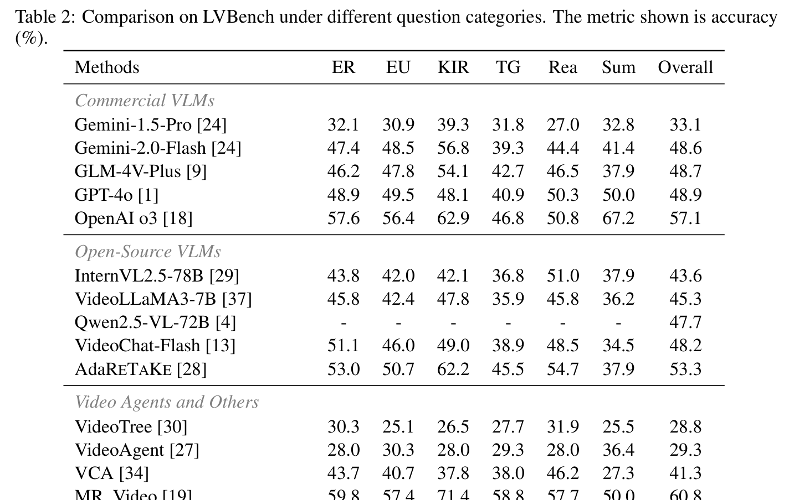
**Caption:** Table 2: Comparison on LVBench under different question categories. The metric shown is accuracy (%).
**Caption[CN]:** 表 2：LVBench 上不同问题类别的对比评测结果。展示的指标为准确率（%）。

| Methods | ER | EU | KIR | TG | Rea | Sum | Overall (%) |
| :--- | :---: | :---: | :---: | :---: | :---: | :---: | :---: |
| **Commercial VLMs** | | | | | | | |
| Gemini-1.5-Pro [24] | 32.1 | 30.9 | 39.3 | 31.8 | 27.0 | 32.8 | 33.1 |
| Gemini-2.0-Flash [24] | 47.4 | 48.5 | 56.8 | 39.3 | 44.4 | 41.4 | 48.6 |
| GLM-4V-Plus [9] | 46.2 | 47.8 | 54.1 | 42.7 | 46.5 | 37.9 | 48.7 |
| GPT-4o [1] | 48.9 | 49.5 | 48.1 | 40.9 | 50.3 | 50.0 | 48.9 |
| OpenAI o3 [18] | 57.6 | 56.4 | 62.9 | 46.8 | 50.8 | 67.2 | 57.1 |
| **Open-Source VLMs** | | | | | | | |
| InternVL2.5-78B [29] | 43.8 | 42.0 | 42.1 | 36.8 | 51.0 | 37.9 | 43.6 |
| VideoLLaMA3-7B [37] | 45.8 | 42.4 | 47.8 | 35.9 | 45.8 | 36.2 | 45.3 |
| Qwen2.5-VL-72B [4] | - | - | - | - | - | - | 47.7 |
| VideoChat-Flash [13] | 51.1 | 46.0 | 49.0 | 38.9 | 48.5 | 34.5 | 48.2 |
| AdaRETAKE [28] | 53.0 | 50.7 | 62.2 | 45.5 | 54.7 | 37.9 | 53.3 |
| **Video Agents & Others** | | | | | | | |
| VideoTree [30] | 30.3 | 25.1 | 26.5 | 27.7 | 31.9 | 25.5 | 28.8 |
| VideoAgent [27] | 28.0 | 30.3 | 28.0 | 29.3 | 28.0 | 36.4 | 29.3 |
| VCA [34] | 43.7 | 40.7 | 37.8 | 38.0 | 46.2 | 27.3 | 41.3 |
| MR. Video [19] | 59.8 | 57.4 | 71.4 | 58.8 | 57.7 | 50.0 | 60.8 |
| **Deep Video Discovery (Ours)** | **73.4** | **73.3** | **80.4** | **72.3** | **70.7** | **74.1** | **74.2** |
| *+ Auxiliary transcripts* | *75.5* | *77.1* | *79.0* | *72.7* | *68.7* | *84.5* | **76.0** |

> <strong>Para. 13:</strong> As shown in Table 2, DVD achieves remarkable dominance on LVBench, reaching 74.2% overall accuracy without transcripts and 76.0% with transcripts. DVD outperforms the prior SOTA video agent MR. Video (60.8%) by 13.4%, and achieves a stunning 32.9% improvement over VCA (41.3%). Against the direct inference OpenAI o3 base model (57.1%), DVD delivers a 17.1% absolute improvement, demonstrating that structured agentic search dramatically unlocks the reasoning capacity of foundation models.
> <strong>Para. 13[CN]:</strong> 如表 2 所示，DVD 在 LVBench 上取得了令人瞩目的统治级优势，在不借助语音转录时达到 74.2% 的整体准确率，辅以语音转录时进一步提升至 76.0%。DVD 超越了此前的 SOTA 视频智能体 MR. Video（60.8%）整整 13.4 个百分点，相比先前的代表性 Agent VCA（41.3%）更是实现了惊人的 32.9% 增益。相较于直接前向推理的 OpenAI o3 基底模型（57.1%），DVD 带来了 17.1% 的绝对提升，证明结构化的智能体搜索极大地释放了基座模型的推理潜能。

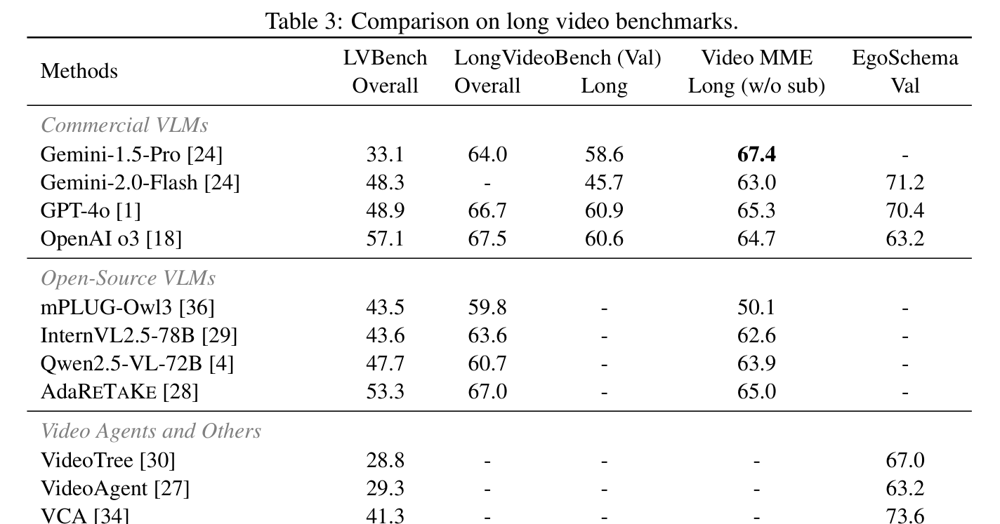
**Caption:** Table 3: Comparison on long video benchmarks.
**Caption[CN]:** 表 3：在多个主流长视频基准测试上的综合对比结果。

| Methods | LVBench Overall | LongVideoBench Overall | LongVideoBench Long | Video MME Long (w/o sub) | EgoSchema Val |
| :--- | :---: | :---: | :---: | :---: | :---: |
| **Commercial VLMs** | | | | | |
| Gemini-1.5-Pro [24] | 33.1 | 64.0 | 58.6 | 67.4 | - |
| Gemini-2.0-Flash [24] | 48.3 | - | 45.7 | 63.0 | 71.2 |
| GPT-4o [1] | 48.9 | 66.7 | 60.9 | 65.3 | 70.4 |
| OpenAI o3 [18] | 57.1 | 67.5 | 60.6 | 64.7 | 63.2 |
| **Open-Source VLMs** | | | | | |
| mPLUG-Owl3 [36] | 43.5 | 59.8 | - | 50.1 | - |
| InternVL2.5-78B [29] | 43.6 | 63.6 | - | 62.6 | - |
| Qwen2.5-VL-72B [4] | 47.7 | 60.7 | - | 63.9 | - |
| AdaRETAKE [28] | 53.3 | 67.0 | - | 65.0 | - |
| **Video Agents & Others** | | | | | |
| VideoTree [30] | 28.8 | - | - | - | 67.0 |
| VideoAgent [27] | 29.3 | - | - | - | 63.2 |
| VCA [34] | 41.3 | - | - | - | 73.6 |
| MR. Video [19] | 60.8 | - | 61.6 | 61.8 | 73.0 |
| **Deep Video Discovery (Ours)** | **74.2** | **71.6** | **68.6** | **67.3** | **76.6** |

> <strong>Para. 14:</strong> Across all benchmark suites in Table 3, DVD exhibits robust generalization. On LongVideoBench, DVD reaches 71.6% overall (68.6% on Long split), establishing new state-of-the-art results. On VideoMME Long, DVD scores 67.3%, beating AdaRETAKE and MR. Video. On EgoSchema, DVD achieves 76.6%, surpassing reported human-level performance (~76%).
> <strong>Para. 14[CN]:</strong> 如表 3 所示，在所有基准测试集上，DVD 均展现出强大的泛化性能。在 LongVideoBench 上，DVD 整体准确率达 71.6%（长时视频子集 68.6%），刷新了 SOTA 纪录。在 VideoMME 长视频子集上，DVD 获得 67.3% 的佳绩，超越了 AdaRETAKE 和 MR. Video。在 EgoSchema 第一人称基准上，DVD 达到了 76.6%，超越了已报道的人类平均准确率（~76%）。

### 4.4 Ablation Studies

**Caption:** Table 4: Ablation on used models. $\mathcal{M}_{	ext{database}}$ for captioning in database construction, $\mathcal{M}_{	ext{reasoning}}$ for reasoning in ASA, $\mathcal{M}_{	ext{tool}}$ for Frame Inspect.
**Caption[CN]:** 表 4：所使用模型的消融实验。$\mathcal{M}_{	ext{database}}$ 用于数据库构建中的字幕生成，$\mathcal{M}_{	ext{reasoning}}$ 用于 ASA 中的推理规划，$\mathcal{M}_{	ext{tool}}$ 用于帧检查。

| $\mathcal{M}_{	ext{database}}$ | $\mathcal{M}_{	ext{reasoning}}$ | $\mathcal{M}_{	ext{tool}}$ | LVBench Acc w/ transcripts (%) |
| :---: | :---: | :---: | :---: |
| 4.1 | o3 | 4.1-mini | 72.3 |
| 4.1 | o4-mini | o3 | 70.2 |
| 4.1 | 4o | o3 | 62.3 |
| 4.1-mini | o3 | o3 | 71.9 |
| **4.1** | **o3** | **o3** | **76.0** |

**Caption:** Table 5: Ablation on the search-centric tools $\mathcal{T}$. Note that the anchor uses 4.1-mini for $\mathcal{M}_{	ext{database}}$, and o3 for both $\mathcal{M}_{	ext{reasoning}}$ and $\mathcal{M}_{	ext{tool}}$.
**Caption[CN]:** 表 5：以搜索为核心的工具箱 $\mathcal{T}$ 消融实验。基准设置中 $\mathcal{M}_{	ext{database}}$ 采用 4.1-mini，$\mathcal{M}_{	ext{reasoning}}$ 和 $\mathcal{M}_{	ext{tool}}$ 均采用 o3。

| Global Browse | Clip Search | Frame Inspect | LVBench Acc w/ transcripts (%) |
| :---: | :---: | :---: | :---: |
| ✓ | ✓ | – | 69.0 |
| – | ✓ | ✓ | 59.6 |
| ✓ | – | ✓ | 63.5 |
| **✓** | **✓** | **✓** | **71.9** |

> <strong>Para. 15:</strong> Table 4 analyzes module choices: replacing reasoning backbone $\mathcal{M}_{	ext{reasoning}}$ from o3 to GPT-4o causes an acute collapse of 13.7% (62.3% vs 76.0%), underscoring that strong test-time reasoning is indispensable for orchestrating multi-step discovery. Table 5 ablates the search tools: removing `Global Browse` causes a 12.3% drop (59.6% vs 71.9%), proving that macroscopic context is vital to prevent myopic search traps.
> <strong>Para. 15[CN]:</strong> 表 4 分析了各模块选型的影响：将推理主干 $\mathcal{M}_{	ext{reasoning}}$ 从 o3 降级为 GPT-4o 导致准确率暴跌 13.7%（从 76.0% 跌至 62.3%），印证了强大的测试时推理能力对于编排多步搜索不可或缺。表 5 对搜索工具进行了消融：去除 `Global Browse` 导致性能剧降 12.3%（从 71.9% 跌至 59.6%），证明宏观上下文对于防止陷入局部搜索陷阱至关重要。

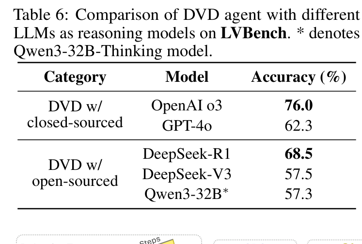
**Caption:** Table 6: Comparison of DVD agent with different LLMs as reasoning models on LVBench. * denotes Qwen3-32B-Thinking model.
**Caption[CN]:** 表 6：LVBench 上 DVD 智能体采用不同 LLM 作为推理模型的对比。* 表示 Qwen3-32B-Thinking 思考模型。

| Category | Model | Accuracy (%) |
| :--- | :--- | :---: |
| **DVD w/ closed-sourced** | **OpenAI o3** | **76.0** |
| | GPT-4o | 62.3 |
| **DVD w/ open-sourced** | DeepSeek-R1 | 68.5 |
| | DeepSeek-V3 | 57.5 |
| | Qwen3-32B* | 57.3 |

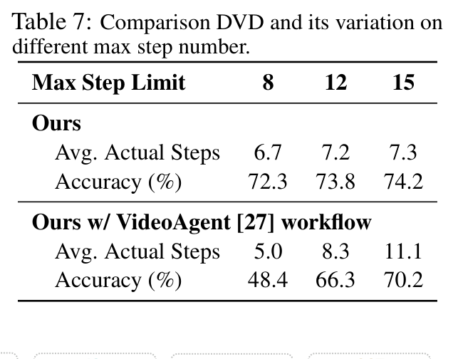
**Caption:** Table 7: Comparison DVD and its variation on different max step number.
**Caption[CN]:** 表 7：不同最大步数限制下 DVD 及其变体的对比。

| Method | Metric | Max Step = 8 | Max Step = 12 | Max Step = 15 |
| :--- | :--- | :---: | :---: | :---: |
| **Ours (DVD)** | Avg. Actual Steps | 6.7 | 7.2 | 7.3 |
| | **Accuracy (%)** | **72.3** | **73.8** | **74.2** |
| **Ours w/ VideoAgent [27] workflow** | Avg. Actual Steps | 5.0 | 8.3 | 11.1 |
| | **Accuracy (%)** | 48.4 | 66.3 | 70.2 |

> <strong>Para. 16:</strong> Table 6 confirms that DVD effectively transfers to open-source reasoning models: equipping DVD with DeepSeek-R1 achieves 68.5% accuracy, outperforming all proprietary VLMs except o3. Table 7 demonstrates the superiority of autonomous tool orchestration over fixed workflows: under any step budget, DVD consistently outpaces the rigid VideoAgent workflow by 4.0% to 23.9%.
> <strong>Para. 16[CN]:</strong> 表 6 证实了 DVD 能有效迁移至开源推理模型：为 DVD 配备 DeepSeek-R1 取得了 68.5% 的准确率，超越了除 o3 外的所有闭源商用 VLM。表 7 展示了自主工具编排相对于固定工作流的压倒性优势：在任何步数预算下，DVD 均稳定领先僵化的 VideoAgent 工作流 4.0% 至 23.9% 不等。

### 4.5 Agent Behavior Analysis

**Caption:** Figure 3: Analysis of the behavior of Deep Video Discovery using different reasoning backbones across five behavioral modes: Global Browse Only (GBO), Simple Action (SA), Iterative Search (IS), Frame Inspect Trap (FIT), and Clip Search Trap (CST).
**Caption[CN]:** 图 3：基于不同推理主干的 Deep Video Discovery 行为模式分析，划分为五种行为模式：仅全局浏览（GBO）、简单动作（SA）、迭代搜索（IS）、帧检查陷阱（FIT）和片段搜索陷阱（CST）。

> <strong>Para. 17:</strong> Figure 3 categorizes agent decision trajectories into five distinct behavioral profiles:
> 1. **Global Browse Only (GBO)**: Resolves the query directly from coarse global captions and subjects.
> 2. **Simple Action (SA)**: Executes a single search or inspection step before answering.
> 3. **Iterative Search (IS)**: Multi-step cross-verification between candidate clips and dense frames.
> 4. **Frame Inspect Trap (FIT)**: Prematurely enters local inspection and fails to break out.
> 5. **Clip Search Trap (CST)**: Repeatedly issues query variants without finding relevant clips.
> Models with advanced reasoning (e.g., OpenAI o3 and DeepSeek-R1) display much higher ratios of successful Iterative Search (IS) and drastically lower rates of entrapment (FIT/CST).
> <strong>Para. 17[CN]:</strong> 图 3 将智能体的决策轨迹划分为五种典型的行为画像：
> 1. **仅全局浏览（GBO）**：仅凭粗粒度全局字幕和主体列表即直接解答问题；
> 2. **简单动作（SA）**：在输出答案前仅执行单次搜索或检查动作；
> 3. **迭代搜索（IS）**：在候选片段与密集帧之间进行多步交叉验证；
> 4. **帧检查陷阱（FIT）**：过早进入局部帧检查且无法从中跳出；
> 5. **片段搜索陷阱（CST）**：反复修改关键词检索却始终未能命中相关片段。
> 具备高阶推理能力的模型（如 OpenAI o3 和 DeepSeek-R1）展现出显著更高的成功迭代搜索（IS）占比，以及极其低微的受困陷阱率（FIT/CST）。

---

## 5 Conclusion & Discussion

> <strong>Para. 18:</strong> We presented Deep Video Discovery (DVD), an agentic search framework for long-form video understanding. By constructing a multi-granular video database and empowering an LLM agent to autonomously orchestrate search-centric tools, DVD surmounts the rigidity of previous video agents. Extensive evaluations confirm that DVD achieves unprecedented accuracy on LVBench (74.2% / 76.0%), outperforming all previous video agents and frontier VLMs.
> <strong>Para. 18[CN]:</strong> 我们提出了深度视频发现（DVD），一种面向长视频理解的智能体搜索框架。通过构建多粒度视频数据库并赋能 LLM 智能体自主编排以搜索为核心的工具，DVD 彻底克服了以往视频智能体的僵化缺陷。广泛的评测证实，DVD 在 LVBench 上取得了前所未有的高准确率（74.2% / 76.0%），超越了以往所有的视频智能体与前沿 VLM 基座。

---

## References

1. Achiam, J., et al. (2023). GPT-4 technical report. arXiv preprint arXiv:2303.08774.
2. Alayrac, J. B., et al. (2022). Flamingo: A visual language model for few-shot learning. In NeurIPS.
3. Anthropic. (2024). The Claude 3 model family: Opus, Sonnet, Haiku.
4. Bai, S., et al. (2025). Qwen2.5-VL technical report. arXiv preprint arXiv:2502.00000.
5. Bain, M., et al. (2023). WhisperX: Time-accurate speech recognition of long-form audio. In INTERSPEECH.
6. Chen, B., et al. (2024). VideoLLaMA 2: Advancing spatial-temporal modeling and audio understanding. arXiv preprint arXiv:2406.07476.
7. Chen, L., et al. (2023). Shikra: Unleashing multimodal LLM's referential dialogue magic. arXiv preprint arXiv:2306.15195.
8. DeepSeek-AI. (2025). DeepSeek-R1: Incentivizing reasoning capability in LLMs via reinforcement learning. arXiv preprint arXiv:2501.12948.
9. GLM-Team. (2024). GLM-4-Voice: Towards intelligent voice communication. arXiv preprint.
10. Hurst, M., et al. (2024). GPT-4o system card. OpenAI.
11. Laurençon, H., et al. (2024). Idefics2: A powerful 8B vision-language model. arXiv preprint arXiv:2405.02246.
12. Li, B., et al. (2023). Otter: A multi-modal model with in-context instruction tuning. arXiv preprint arXiv:2305.03724.
13. Li, K., et al. (2024). VideoChat-Flash: Hierarchical compression for long video understanding. In CVPR.
14. Lin, J., et al. (2026). VideoSeek: Long-horizon video agent with tool-guided seeking. In CVPR.
15. Liu, H., et al. (2024). Visual instruction tuning. In NeurIPS.
16. Mangalam, K., et al. (2024). EgoSchema: A diagnostic benchmark for very long-form video language understanding. In NeurIPS.
17. OpenAI. (2024). GPT-4.1 system card.
18. OpenAI. (2025). OpenAI o3 technical report.
19. Pang, B., & Wang, Y. (2025). Mr. Video: Towards multi-round video question answering. arXiv preprint arXiv:2501.05000.
20. Radford, A., et al. (2023). Robust speech recognition via large-scale weak supervision. In ICML.
21. Shinn, N., et al. (2023). Reflexion: Language agents with verbal reinforcement learning. In NeurIPS.
22. Song, C. H., et al. (2023). LLM-Planner: Few-shot grounded planning for embodied agents. In ICCV.
23. Team, G., et al. (2023). Gemini: A family of highly capable multimodal models. arXiv preprint arXiv:2312.11805.
24. Team, G., et al. (2024). Gemini 1.5: Unlocking multimodal understanding across millions of tokens of context. arXiv preprint arXiv:2403.05530.
25. Wang, J., et al. (2023). Voyager: An open-ended embodied agent with large language models. arXiv preprint arXiv:2305.16291.
26. Wang, T., et al. (2026). Routing before looking: Query-adaptive evidence acquisition for long-form video understanding. In CVPR.
27. Wang, X., et al. (2024). VideoAgent: Long-form video understanding with large language models as agents. In ECCV.
28. Wang, Y., et al. (2024). AdaRETAKE: Adaptive retrieval-augmented temporal knowledge extraction for video reasoning. In ECCV.
29. Wang, Y., et al. (2025). InternVL 2.5: Expanding frontiers in multimodal understanding. arXiv preprint.
30. Wang, Z., et al. (2025). VideoTree: Adaptive tree search for long video understanding. In AAAI.
31. Wu, H., et al. (2024). LongVideoBench: A benchmark for long-context interleaved video-language understanding. In NeurIPS.
32. Xiao, J., et al. (2024). Can't remember: Evaluating long-context video models. In ECCV.
33. Yang, A., et al. (2024). Baichuan-Omni technical report.
34. Yang, Y., et al. (2025). VCA: Video conversational agent for multi-turn question answering. In CVPR.
35. Yao, S., et al. (2023). ReAct: Synergizing reasoning and acting in language models. In ICLR.
36. Ye, Q., et al. (2024). mPLUG-Owl3: Towards long video understanding. arXiv preprint arXiv:2408.04840.
37. Zhang, H., et al. (2025). VideoLLaMA 3: Frontier multimodal foundation models for video understanding. arXiv preprint.

---

## Appendix

### Appendix A: Additional Experimental Details, Prompts & JSON Schemas

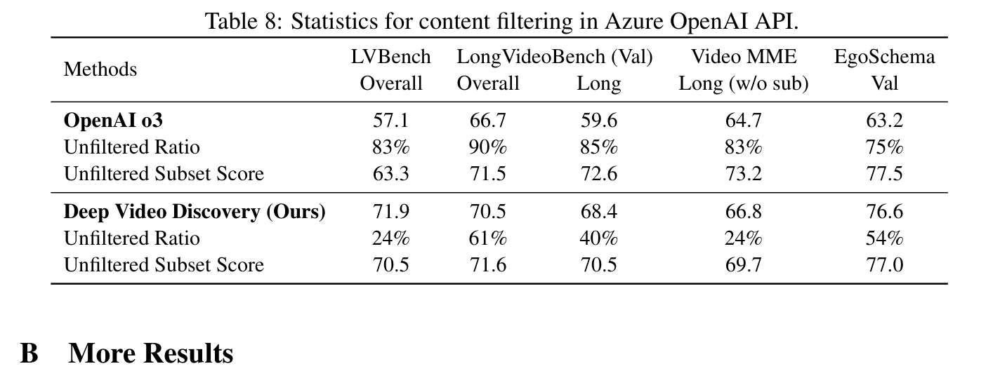
**Caption:** Table 8: Statistics for content filtering in Azure OpenAI API.
**Caption[CN]:** 表 8：Azure OpenAI 服务中安全内容过滤机制拦截样本统计。

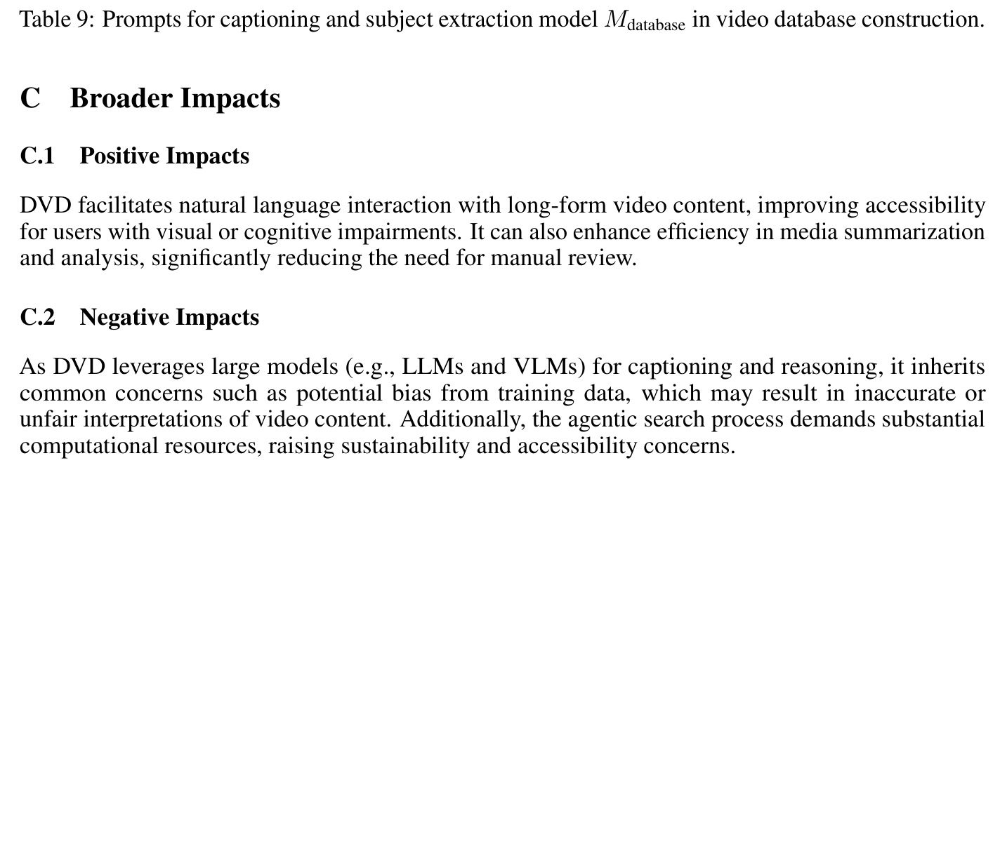
**Caption:** Table 9: Prompts for captioning and subject extraction model $\mathcal{M}_{	ext{database}}$ in video database construction.
**Caption[CN]:** 表 9：视频数据库构建中字幕生成与主体提取模型 $\mathcal{M}_{	ext{database}}$ 的提示词设计。

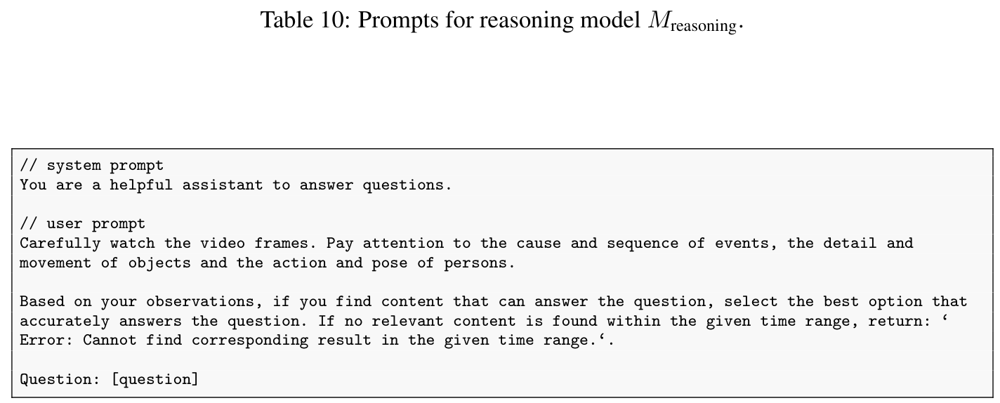
**Caption:** Table 10: Prompts for reasoning model $\mathcal{M}_{	ext{reasoning}}$.
**Caption[CN]:** 表 10：推理规划模型 $\mathcal{M}_{	ext{reasoning}}$ 的系统级提示词设计。

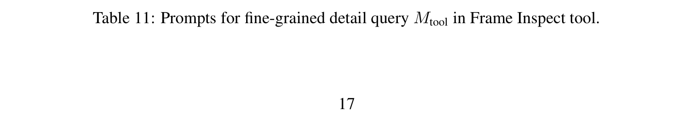
**Caption:** Table 11: Prompts for fine-grained detail query $\mathcal{M}_{	ext{tool}}$ in Frame Inspect tool.
**Caption[CN]:** 表 11：帧检查工具中细粒度细节查询模型 $\mathcal{M}_{	ext{tool}}$ 的提示词设计。

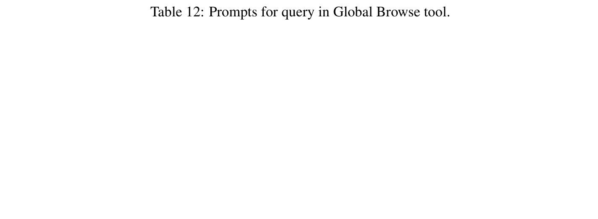
**Caption:** Table 12: Prompts for query in Global Browse tool.
**Caption[CN]:** 表 12：全局浏览工具中的提示词设计。

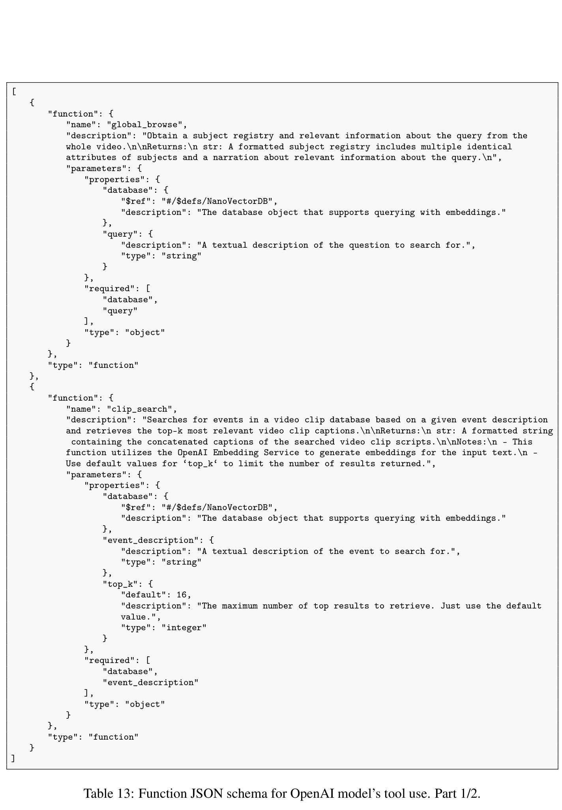
**Caption:** Table 13: Function JSON schema for OpenAI model's tool use. Part 1/2.
**Caption[CN]:** 表 13：OpenAI 模型工具调用函数 JSON 规范定义（第一部分）。

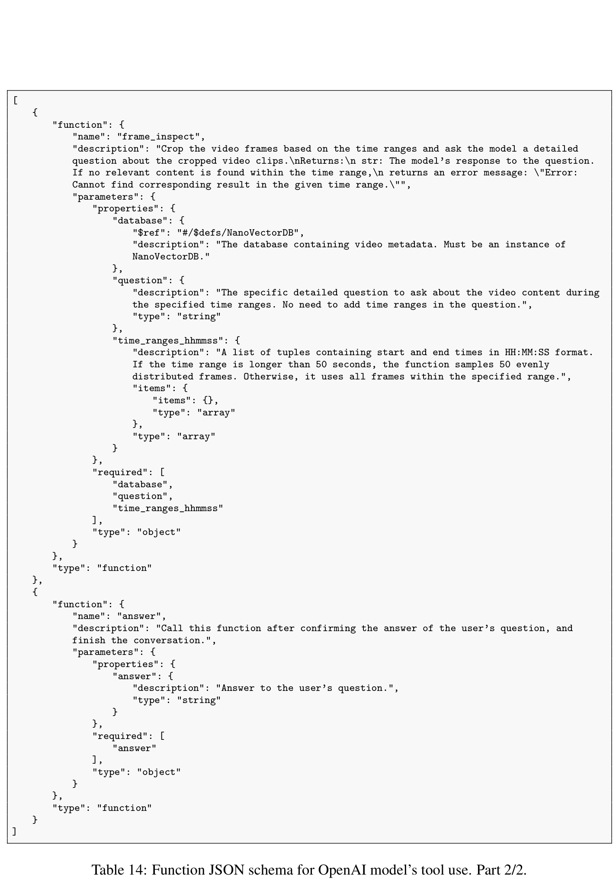
**Caption:** Table 14: Function JSON schema for OpenAI model's tool use. Part 2/2.
**Caption[CN]:** 表 14：OpenAI 模型工具调用函数 JSON 规范定义（第二部分）。

> <strong>Para. 19:</strong> Tables 8–14 document the complete experimental protocols, system prompts, and function-calling schemas utilized by DVD. As recorded in Table 8, out of 1,549 queries on LVBench, the safety content filter flagged 42 samples. For fair evaluation, blocked queries are handled with fallback predictions. Tables 9–12 detail the prompts for database generation and iterative tool dispatch, and Tables 13–14 provide the formal JSON schemas enabling structured tool calls via the OpenAI API.
> <strong>Para. 19[CN]:</strong> 表 8 至表 14 完整记录了 DVD 所使用的实验协议、系统提示词以及函数调用规范。如表 8 所记，在 LVBench 的 1,549 道题目中，安全内容过滤器误拦截了 42 个样本。为保证公平评估，被拦截的查询统一执行退避兜底预测。表 9 至表 12 详细列出了用于数据库生成与迭代工具调度的提示词，表 13 至表 14 则提供了通过 OpenAI API 进行结构化工具调用的正式 JSON 规范。

### Appendix B: Case Studies on Agent Behaviors

**Caption:** Figure 4: Case study of Global Browse Only behavior. The query regarding overall character profession is resolved in a single step from macroscopic metadata.
**Caption[CN]:** 图 4：仅全局浏览（GBO）行为案例分析。关于人物职业的宏观提问仅需一步即可直接从全局元数据中获得解答。

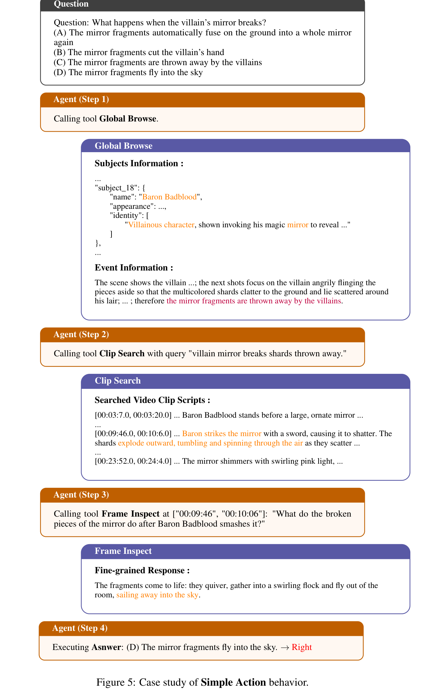
**Caption:** Figure 5: Case study of Simple Action behavior. The agent issues a targeted search and terminates with the correct answer.
**Caption[CN]:** 图 5：简单动作（SA）行为案例分析。智能体发出一项精准搜索并直接输出正确答案。

**Caption:** Figure 6: Case study of Iterative Search behavior. The agent iteratively conducts clip search, analyzes timestamps, and queries fine frames.
**Caption[CN]:** 图 6：迭代搜索（IS）行为案例分析。智能体迭代执行片段搜索、时间戳分析并逐帧检查细节。

**Caption:** Figure 7: Case study of Frame Inspect Trap behavior. Weak reasoning models get trapped repeatedly querying the same interval.
**Caption[CN]:** 图 7：帧检查陷阱（FIT）行为案例分析。较弱的推理模型陷入反复查询同一时间区间的死循环。

**Caption:** Figure 8: Case study of Clip Search Trap behavior. The agent fails to retrieve suitable segments due to inappropriate keywords.
**Caption[CN]:** 图 8：片段搜索陷阱（CST）行为案例分析。由于关键词使用不当，智能体始终无法检索到匹配片段。

> <strong>Para. 20:</strong> Figures 4–8 provide qualitative traces across all five behavioral profiles:
> - In **Global Browse Only** (Figure 4), the query asks about the primary trade of the documentary protagonist. The agent checks global subjects, finds "veterinarian", and answers immediately.
> - In **Simple Action** (Figure 5), the query asks what color shirt the child wore when riding the carousel. The agent executes one `Clip Search` on "child riding carousel", finds the segment, and resolves the answer.
> - In **Iterative Search** (Figure 6), the agent tackles a complex multi-step reasoning task, retrieving three distinct segments, reconciling temporal continuity, and validating fine details via `Frame Inspect`.
> - In **Traps** (Figures 7 & 8), weaker models demonstrate behavioral pathologies: entering narrow frame inspection without sufficient global anchoring (FIT) or getting stuck cycling through semantic synonyms (CST).
> <strong>Para. 20[CN]:</strong> 图 4 至图 8 提供了五种行为模式的典型定性执行轨迹：
> - 在**仅全局浏览（GBO）**（图 4）中，问题询问纪录片主角的主要职业。智能体核对全局主体列表，发现“兽医”实体，随即直接作答；
> - 在**简单动作（SA）**（图 5）中，问题询问小孩骑旋转木马时穿着何种颜色的衬衫。智能体针对“child riding carousel”执行单次片段搜索，锁定目标片段并得出答案；
> - 在**迭代搜索（IS）**（图 6）中，智能体应对复杂的多跳推理任务，先后检索三个不同片段，比对时序连贯性，并通过帧检查验证微小细节；
> - 在**陷阱模式**（图 7 与图 8）中，较弱的模型暴露出病态行为：在缺乏充足全局锚定的情况下盲目钻入局部逐帧比对（FIT），或在语义同义词循环搜索中停滞不前（CST）。
