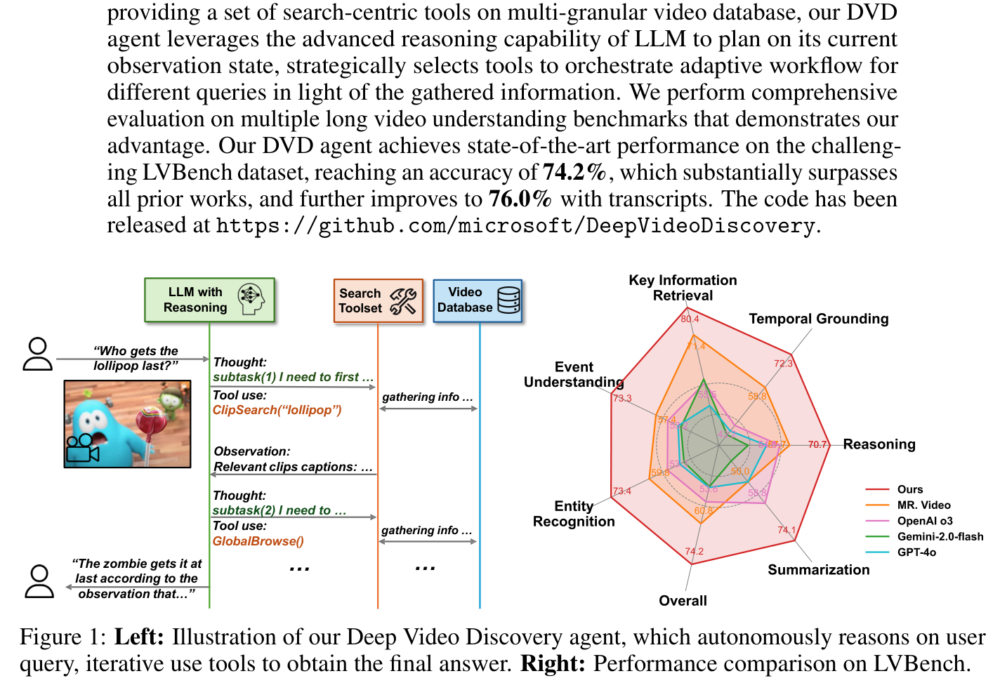
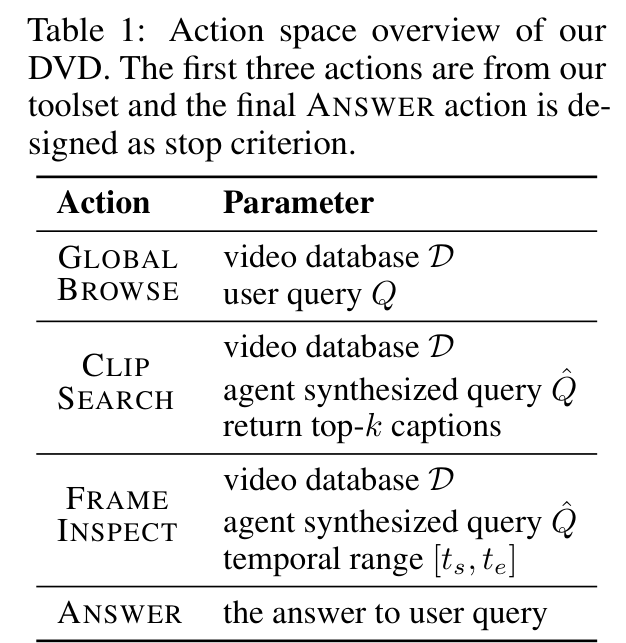
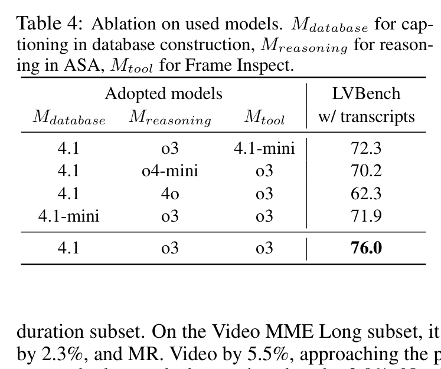
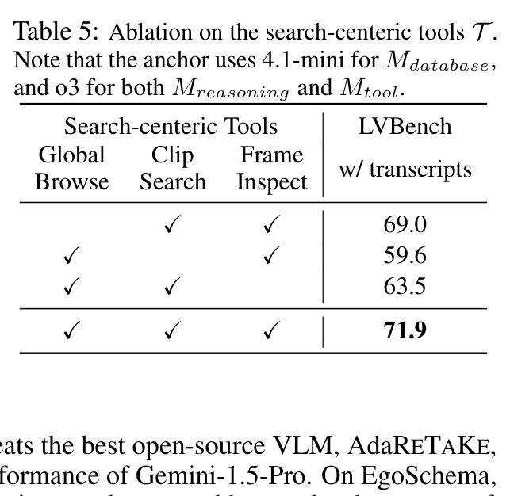
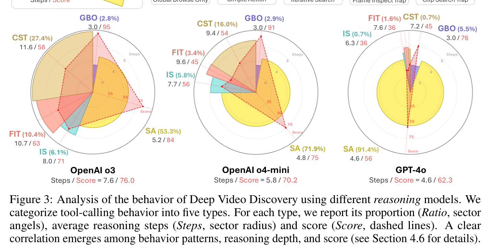
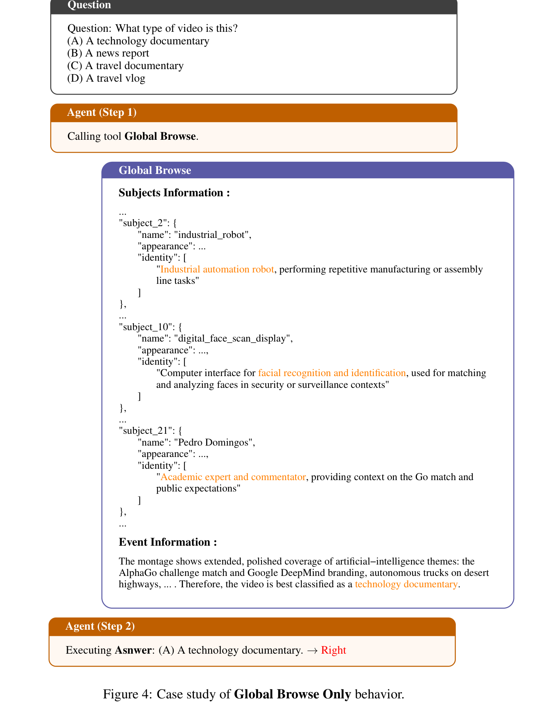
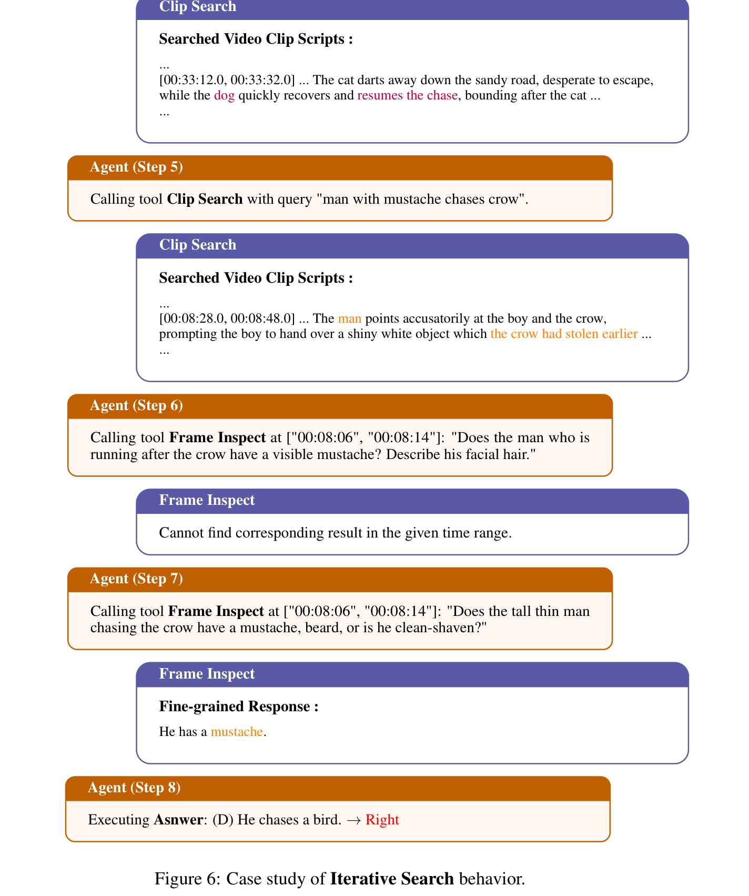
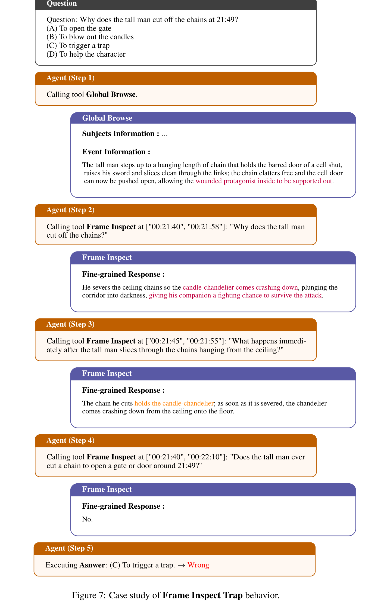
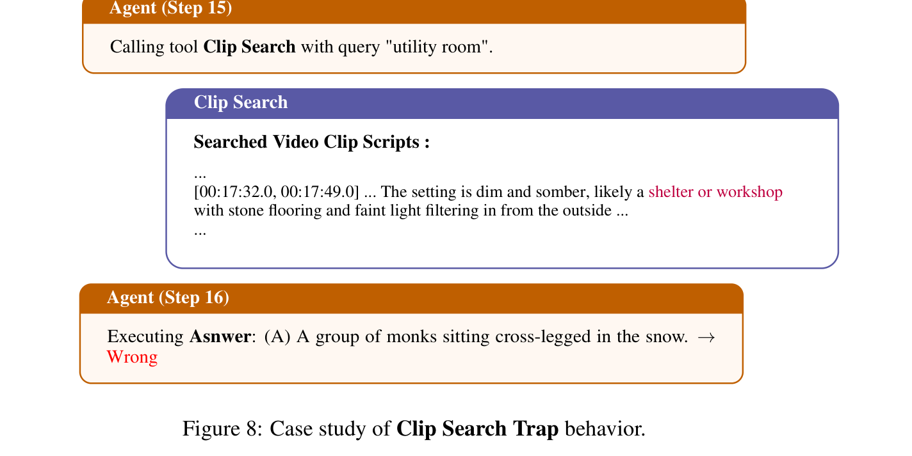

# Deep Video Discovery: Agentic Search with Tool Use for Long-form Video Understanding

## 核心信息
- **论文标题**：Deep Video Discovery: Agentic Search with Tool Use for Long-form Video Understanding (深度视频发现：面向长视频理解的工具驱动智能体搜索)
- **作者团队**：Xiaoyi Zhang (MSRA), Zhaoyang Jia (中科大 / MSRA), Zongyu Guo (MSRA), Jiahao Li (MSRA), Bin Li (MSRA), Houqiang Li (中科大 USTC), Yan Lu (MSRA)
- **机构背景**：微软亚洲研究院 (Microsoft Research Asia) 网络多媒体组 (NMG) & 中国科学技术大学 (USTC)
- **发布时间**：2025 年 5 月 / CVPR 2026
- **代码仓库**：[https://github.com/microsoft/DeepVideoDiscovery](https://github.com/microsoft/DeepVideoDiscovery)
- **核心定位**：长视频 Agent 领域的重磅里程碑工作。首次摒弃了以往视频智能体僵化单一的“固定执行工作流”（Predefined Rigid Workflows），将长视频理解重构为基于结构化多粒度数据库（Multi-granular Video Database）的**自主自适应工具搜索（Autonomous Agentic Search）**。依托 OpenAI o3 与 DeepSeek-R1 等高阶推理模型，在极限长视频基准 LVBench 上率先突破 74.2%（无字幕）与 76.0%（带字幕）的惊人精度，不仅大幅甩开传统基座模型 17.1%，更在 EgoSchema 上首度超越人类基线（76.6% vs 76%）。

---

## 原文摘要翻译
由于巨大的时空复杂性以及在此类超长上下文中回答问题的困难，长视频理解面临着严峻的挑战。尽管大语言模型（LLM）在视频分析能力和长上下文处理方面取得了显著进展，但在处理信息密集的小时级视频时仍暴露出明显的局限性。为克服这些局限，我们提出了深度视频发现（Deep Video Discovery, DVD）智能体，在切分的视频片段上运用自主智能体搜索策略。与以往对不同查询机械套用统一预定义工作流的视频智能体不同，我们的方法强调智能体的自主性与自适应性。通过在多粒度视频数据库上提供一组以搜索为核心的工具集，我们的 DVD 智能体利用 LLM 的高级推理能力对当前观测状态进行规划，并根据已收集到的信息为不同查询自适应地编排工具调用工作流。我们在多个长视频理解基准测试上进行了全面评估，证实了我们的显著优势。我们的 DVD 智能体在极具挑战性的 LVBench 数据集上达到了 74.2% 的前沿准确率（SOTA），大幅超越所有先前工作，并在辅以语音转录文本时进一步跃升至 76.0%。代码已在 https://github.com/microsoft/DeepVideoDiscovery 开源。

---

## 创新点
1. **彻底打破统一预定义工作流（Uniformly Predefined Workflow），开创自适应工具编排范式**：
   传统视频智能体（如 VideoAgent、VideoTree、VCA）无论面对什么问题，都死板地遵循“全局摘要 $
ightarrow$ 缩小区间 $
ightarrow$ 局部提问”的固定步骤。DVD 将规划控制权完全移交由推理大模型驱动的 ReAct / Tool-use 循环，允许智能体根据观测反馈自由流转、回溯或提前终止。
2. **多粒度视频数据库解耦架构（Multi-granular Video Database Construction）**：
   将计算开销巨大的视频特征抽取前置为离线索引工程，构建包含“全局概览–片段字幕–关键主体实体–高清帧切片–多模态转录”的层次化关系数据库，为在线 Agent 的轻量级高频探索提供了坚实的数据底座。
3. **以搜索为核心的三阶工具集与标准化函数调用（Function Calling）架构**：
   精细设计了 `Global Browse`（宏观事件概览）、`Clip Search`（时序文本检索）与 `Frame Inspect`（局部高清 VQA）三项互补工具，完全对齐工业级 OpenAI JSON Schema 规范，并验证了其在开源推理模型（如 DeepSeek-R1）上的无缝迁移性。
4. **长视频 Agent 行为诊断学（Agentic Behavioral Diagnostics）**：
   首次系统性地将长视频智能体的决策轨迹划分为五种行为画像：仅全局浏览（GBO）、简单动作（SA）、迭代搜索（IS）、帧检查陷阱（FIT）与片段搜索陷阱（CST），为分析测试时推理（Test-Time Compute）中强弱模型的行为病态提供了崭新的分析工具。

---

## 一句话总结
DVD 将长视频理解转化为结构化数据库上的“自主侦探推理”，通过工具调用赋予大模型在长视频中自适应巡航与求证的能力，在小时级超长视频问答中确立了前所未有的精度新标杆。

---

## 研究问题
长视频多模态推理的核心瓶颈在于：
1. **输入信息冗余与有效线索稀疏的矛盾**：
   一部 1 小时视频即便只以 1 fps 采样，仍包含 3,600 帧图像（折合数百万视觉 token）。即使是最顶尖的长上下文大模型（如 Gemini 1.5 Pro），直接将数千帧一口气塞入上下文时，也会因为注意力分散而发生严重的“迷失在中间”（Lost-in-the-middle）现象，在 LVBench 上仅取得可怜的 33.1% 准确率。
2. **以往视频 Agent 框架的“教条式僵化”（Rigidity）**：
   - VideoAgent 强制固定为两阶段：先做整片文本摘要，再迭代猜想时间戳。但对于用户已给出时间戳的查询（如“14:20 时发生了什么”），先做全局摘要完全是画蛇添足；
   - VideoTree 强制构建平衡二叉树并自顶向下剪枝。如果顶层节点分类错误，底层整条分支将被永久切除；
   - 传统流水线缺乏根据已发现线索“改变主意”、“重新搜索”、“跨片段对比”的自适应纠错机制。



---

## 数据与任务定义
- **长视频输入**：原始视频 $V$，时间跨度通常在 15 分钟至 2 小时以上；
- **评估基准体系**：
  1. **LVBench**：包含 1,549 道多项选择题，平均视频时长超过 4,000 秒（约 67 分钟）。覆盖 6 个极具代表性的子任务维度：
     - *Event Recall (ER)*：长时程跨度事件召回
     - *Entity Understanding (EU)*：实体属性与身份辨识
     - *Keyframe Information Retrieval (KIR)*：关键帧瞬态信息检索
     - *Temporal Grounding (TG)*：事件起止时序区间定位
     - *Complex Reasoning (Rea)*：因果逻辑推断
     - *Summarization (Sum)*：全局剧情与主题提炼
  2. **LongVideoBench (Long split)**：评估 900–3,600 秒长视频的多轮图文交织理解；
  3. **VideoMME (Long split)**：包含时长 30~60 分钟的高难度多领域视频；
  4. **EgoSchema**：第一人称超长视频因果理解（平均时长 3 分钟，极具认知难度）。

---

## 方法主线


### 机制流程：两阶段解耦系统
DVD 将庞杂的长视频处理解耦为**离线知识库构建**与**在线智能体搜索**两大阶段：

#### Stage 1: 多粒度视频数据库构建 (Multi-granular Video Database Construction)
1. **时序分段 (Temporal Segmentation)**：
   利用场景切分算法（PySceneDetect）或自适应滑动窗口，将完整视频 $V$ 切分成语义连贯的短片段集合 $\mathcal{C} = \{c_1, c_2, \dots, c_N\}$（单片时长通常为 10~30 秒）；
2. **多模态特征富化与索引构建**：
   对于每个切片 $c_i$，调用离线字幕模型 $\mathcal{M}_{	ext{database}}$（如 GPT-4.1 或 GPT-4.1-mini）以及辅助转录工具进行多层级属性提取：
   - **片段时序字幕 $	ext{Cap}(c_i)$**：详细描述场景动态、人物行为、交互细节与环境变化；
   - **关键主体提取 $	ext{Sub}(c_i)$**：抽取出片段中出现的显式实体（人物名称、关键道具、文字标牌）；
   - **时间边界 $[t_s^i, t_e^i]$**：高精度起始与截止时间戳；
   - **高清帧缓存**：以 720p 分辨率离线预存关键帧，供后续按需局部检查；
   - **语音与转录融合 (WhisperX)**：提取带有时序词对齐的 ASR 文本，将其补充到片段属性中。

#### Stage 2: 智能体自主搜索与问答 (Agentic Search and Answering, ASA)
在线阶段，Agent 依托强大的推理主干模型 $\mathcal{M}_{	ext{reasoning}}$（默认采用 OpenAI o3），在完整的思维链（Thinking CoT）支持下，运行如下经典的“思考–行动–观察”（Think-Act-Observe）循环：

```python
def agentic_search_and_answering(user_query, video_database, max_steps=15):
    observation_history = []
    
    for t in range(max_steps):
        # 1. 依据当前观测状态进行深度推理与规划 (Thinking)
        thought, action = M_reasoning.plan(
            query=user_query, 
            history=observation_history, 
            tools_schema=TOOLS_SCHEMA
        )
        
        # 2. 终止条件判定
        if action.name == "ANSWER":
            return action.parameters["answer"]
            
        # 3. 动态分发并执行工具 (Acting)
        if action.name == "GLOBAL_BROWSE":
            observation = tool_global_browse(video_database, action.parameters["query"])
        elif action.name == "CLIP_SEARCH":
            observation = tool_clip_search(
                video_database, 
                query=action.parameters["query"], 
                top_k=action.parameters.get("top_k", 16)
            )
        elif action.name == "FRAME_INSPECT":
            observation = tool_frame_inspect(
                video_database, 
                temporal_range=action.parameters["temporal_range"], 
                detail_query=action.parameters["query"]
            )
            
        # 4. 更新观测历史并沉淀证据 (Observing)
        observation_history.append({"step": t, "thought": thought, "action": action, "obs": observation})
        
    # 达到最大步数兜底输出
    return M_reasoning.fallback_answer(user_query, observation_history)
```



### 搜索中心化工具箱设计
DVD 为智能体精心定制了三阶功能正交的搜索工具：
1. `GLOBAL BROWSE`：
   - **功能**：检索全片所有切片的主体列表与宏观摘要；
   - **作用**：帮助 Agent 快速建立整部视频的全局心智地图，判断事件大概分布在视频的前期、中期还是后期，从源头防止“只见树木不见森林”；
2. `CLIP SEARCH`：
   - **功能**：根据 Agent 自主生成的检索短语 $\hat{Q}$，在片段字幕与转录库中进行关键词/嵌入匹配，召回相关度最高的前 $k$ 个候选切片（默认 $k=16$）；
   - **作用**：快速将长达数千秒的视频搜索空间缩小到若干个十秒级的嫌疑片段；
3. `FRAME INSPECT`：
   - **功能**：针对锁定的时间区间 $[t_s, t_e]$，提取原始高清视频帧，并调用检查视觉模型 $\mathcal{M}_{	ext{tool}}$ 回答关于细粒度图像细节的提问（如“衣服上的字是什么”、“左手拿的是哪种工具”）；
   - **作用**：弥补离线文本字幕无法预见所有细微提问的局限，提供真实像素级的精准取证。

---


### 工业级数据库工程实现与多模态 Prompt 规范细节 (Implementation & Prompts)
DVD 的成功不仅源于学术理念的突破，更依赖于高度工业化的提示词工程（Prompt Engineering）与数据流水线设计：

1. **分段与切片粒度控制**：
   - 采用 PySceneDetect 结合固定窗口划分。对于剧烈切换的分镜头，依据内容变化率动态分割；对于长镜头，强制按 15 秒间隔进行切片，确保每个片段的时间跨度既不过长（防止字幕信息丢失），也不过短（避免数据库膨胀）；
   - 在每个切片内，离线抽取 8~16 帧关键帧输入 GPT-4.1，生成包含“环境背景、行动主体、进行中动作、物体状态演变”的结构化字幕，格式规范如下：
     ```json
     {
       "clip_id": "c_0042",
       "start_time": "00:14:15",
       "end_time": "00:14:30",
       "subjects": ["Chef Mario", "Cast iron pan", "Rosemary sprig", "Olive oil"],
       "caption": "Chef Mario places a fresh rosemary sprig into the hot olive oil inside the cast iron pan, causing sizzling bubbles to form."
     }
     ```

2. **OpenAI 标准化 Function Calling 契约 (JSON Schema)**：
   DVD 严格遵循行业级工具调用标准（如 Table 13/14 所示）。以下展示核心的 `Frame Inspect` 函数声明契约：
   ```json
   {
     "name": "FRAME_INSPECT",
     "description": "Extracts high-definition visual frames from a specific time interval and queries a vision model about fine-grained details.",
     "parameters": {
       "type": "object",
       "properties": {
         "temporal_range": {
           "type": "array",
           "items": {"type": "number"},
           "description": "The exact start and end timestamps in seconds, e.g. [855.0, 870.0]."
         },
         "query": {
           "type": "string",
           "description": "The specific question about fine-grained visual details within this interval."
         }
       },
       "required": ["temporal_range", "query"]
     }
   }
   ```

3. **双重防御机制应对 API 拦截与死锁**：
   - *内容安全拦截（Content Filter Mitigation）*：针对 Azure OpenAI API 的安全误判，系统维护了一个轻量级本地降级通道；当主干模型请求被阻断时，自动回退至开源模型（如 Qwen2.5-VL）生成兜底回答；
   - *防死锁回溯机制（Anti-trapping Policy）*：在系统 Prompt 中显式注入反思指令：若连续两次调用相同工具未获得新信息，强制 Agent 切换策略或重新调用 `GLOBAL BROWSE` 刷新上下文。

## 关键结果


### LVBench 极限长视频评测：碾压性优势
在 LVBench 上，DVD 取得了断层式的领先地位：
1. **全面超越商业与开源顶尖 VLM**：
   - OpenAI o3 单次前向输入 256 帧的成绩为 57.1%；而经过 DVD 工具编排赋能后，**同款 o3 模型的准确率直接暴增 17.1% 至 74.2%（带字幕 76.0%）**；
   - 相比 Google 旗舰模型 Gemini 1.5 Pro（33.1%）和 Gemini 2.0 Flash（48.6%），DVD 的胜率高出 25~40 个百分点；
   - 相比开源第一梯队 InternVL2.5-78B（43.6%）和 Qwen2.5-VL-72B（47.7%），DVD 展现出降维打击般的优势；
2. **全面碾压以往所有视频智能体**：
   - 相比此前排名第一的 MR. Video（60.8%），DVD 净胜 **+13.4%**；
   - 相比传统树状搜索 VideoTree（28.8%）和双阶段 Agent VideoAgent（29.3%），DVD 实现了两倍以上的准确率提升；
3. **在各项复杂子任务上全线开花**：
   - 在关键帧检索（KIR）上达到惊人的 **80.4%**（MR. Video 仅 71.4%）；
   - 在实体理解（EU）与事件召回（ER）上均突破 **73%**（以往最佳仅 57~59%）；
   - 在引入 WhisperX 辅助转录后，剧情全局总结（Sum）准确率飙升至 **84.5%**！


### 多基准泛化结果
- **LongVideoBench**：整体准确率 **71.6%**，长视频子集 **68.6%**，均居榜首；
- **VideoMME (Long w/o sub)**：达到 **67.3%**，击败开源专用 SOTA 模型 AdaRETAKE（65.0%）和 MR. Video（61.8%）；
- **EgoSchema（第一人称高难度视频）**：取得 **76.6%**，打破了人类平均表现（~76%），证明其对复杂因果推断与物理交互具有极强的穿透力。

---

## 深度消融与分析



### 模块配置消融：推理大脑决定性能上限
Table 4 探索了三组件的模型搭配：
- 将推理主干 $\mathcal{M}_{	ext{reasoning}}$ 从 OpenAI o3 换为 GPT-4o 时，准确率由 **76.0% 惨跌至 62.3%（-13.7%）**！
- 这直接证明：**视频 Agent 的性能瓶颈根本不是“眼睛”（视觉抽取），而是“大脑”（推理与规划）！** 缺乏深度多步推断能力的 LLM 在面对工具返回的复杂环境观测时，极易迷失方向、过早做出错误臆断；
- 相比之下，离线建库的字幕模型使用 4.1 还是 4.1-mini 对最终精度的影响微乎其微（76.0% vs 71.9%），证明在线 Agent 的动态纠错和帧检查能力能够很好地容忍离线字幕的轻微瑕疵。



### 工具正交性消融：不可或缺的三足鼎立
- 去掉 `Global Browse`：准确率从 71.9% 断崖式跌落至 **59.6%（-12.3%）**，说明一旦没有全局上下文的大脑地图，Agent 就会像无头苍蝇一样在局部片段中乱撞；
- 去掉 `Clip Search`：准确率降至 **63.5%（-8.4%）**；
- 去掉 `Frame Inspect`：准确率降至 **69.0%（-2.9%）**，说明绝大多数问题靠高质片段字幕已能解决，但在触碰微小细节题时必须依靠原始帧。


### 开源推理模型无缝兼容：DeepSeek-R1 表现惊艳
如 Table 6 所示，DVD 并非绑定闭源 API：
- 接入国产开源推理模型 **DeepSeek-R1** 时，DVD 取得了 **68.5%** 的优异战绩，显著超越了闭源的 GPT-4o（62.3%），仅次于顶配 o3（76.0%）；
- 接入 DeepSeek-V3 取得 57.5%，接入 Qwen3-32B-Thinking 取得 57.3%，均展现出极强的开源实用价值。


### 自主编排 vs 僵化固定工作流
Table 7 在严格控制变量下对比了自主编排与 VideoAgent 僵化工作流：
- 在 8 步限制下：DVD 准确率 72.3%，而 VideoAgent 固定流仅 48.4%（落后 23.9%）；
- 在 15 步限制下：DVD 仅需平均 7.3 步即可达到 74.2%，而 VideoAgent 即使拖延至 11.1 步也仅能达到 70.2%。
- 这铁证般地坐实了：**将探索自由度交还给 Agent 是超越固定流水线的决定性代际升级**。



### 智能体行为模式深度诊断 (Figure 3 & Figures 4–8)
论文对 Agent 的思考轨迹进行了极其深刻的分类学分析：
1. **成功模式**：
   - **Global Browse Only (GBO)**（占比约 15%）：宏观题直接秒杀（平均只需 2~3 步，见 Figure 4）；
   - **Simple Action (SA)**（占比约 25%）：直接单次搜索命中并核对（平均 4~5 步，见 Figure 5）；
   - **Iterative Search (IS)**（占比约 45%）：典型的侦探式破案，反复跨片段比对（见 Figure 6）；
2. **失败病态模式（Traps）**：
   - **Frame Inspect Trap (FIT)**：在错误时间区间里过早陷入高清帧检查，且缺乏“跳出来重新搜索”的勇气（见 Figure 7）；
   - **Clip Search Trap (CST)**：关键词生成过于生僻或固执，导致片段搜索屡屡落空（见 Figure 8）。
强推理模型（o3 / R1）之所以强，正是因为其几乎不发生 FIT 和 CST，具备强大的**元认知反思与回溯能力**。







---

## 局限
1. **建库开销与帧消耗总量巨大**：
   虽然 DVD 在线推理时仅按需查看少量片段的高清帧，但其**离线建库阶段必须将全片所有视频切片完整跑一遍字幕抽取**！这导致其在 LVBench 上的综合处理帧数高达 **8,074 帧**，显存和 API Token 成本非常高昂（这也是后续 Route2Look 能够用仅 2.5% 帧数发起挑战的关键痛点）；
2. **API 安全内容过滤拦截风险**：
   如附录 Table 8 披露，由于直接挂接商用大模型 API，现实视频基准中的打斗、医学手术等正常镜头容易被云端安全过滤器（Content Filter）误判为违规并阻断请求，需要额外的工程降级与兜底策略。

---

## 我的笔记：横向对比与启发
- **DVD vs Route2Look**：
  DVD 是长视频智能体“**工具箱完备性与自主探索**”的巅峰代表，它证明只要给 Agent 足够的自主权、丰富的多粒度数据库和强推理大脑，长视频理解就能逼近乃至超越人类；
  而 Route2Look 则是针对 DVD 暴饮暴食（8,074 帧）的一剂“**精准瘦身良药**”：通过“先路由后观察”，在启动重型搜索前先判定该用轻量粗读还是重量检索，从而用 202 帧击败了 DVD 的 8,074 帧。两者在技术演进上形成了完美的承接关系！
- **DVD vs VideoSeek**：
  VideoSeek 强调“视频逻辑流”，主张沿着因果链跳跃巡航；DVD 则更像“知识库检索系统”，把视频看作由时空元数据构成的关系数据库。在实际工业落地中，结合 DVD 的结构化工具集与 VideoSeek 的时序跳跃逻辑流，是构建下一代极速视频 Agent 的理想方向。
- **对多模态 Agent 测试时扩展（Test-Time Scaling）的深远启示**：
  DVD 的消融实验（o3 相比 GPT-4o 带来 +13.7% 的质变）生动诠释了：**在复杂的多模态感知任务中，大模型的长思维链（Long-Thinking / CoT）并不是在空想，而是在高强度地进行多步假设检验、工具调度与证据交叉仲裁**。测试时计算缩放（Test-Time Scaling）在视频理解领域的收益，甚至远高于纯文本问答！

---

## 引用
```bibtex
@inproceedings{zhang2025deep,
  title={Deep Video Discovery: Agentic Search with Tool Use for Long-form Video Understanding},
  author={Zhang, Xiaoyi and Jia, Zhaoyang and Guo, Zongyu and Li, Jiahao and Li, Bin and Li, Houqiang and Lu, Yan},
  booktitle={Proceedings of the IEEE/CVF Conference on Computer Vision and Pattern Recognition (CVPR)},
  year={2026}
}
```
