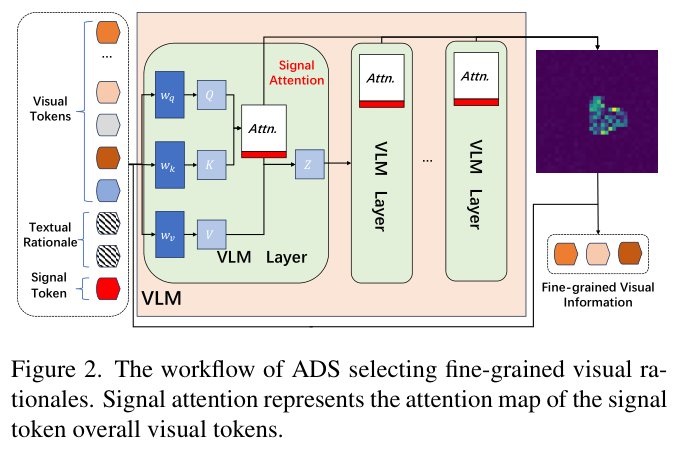
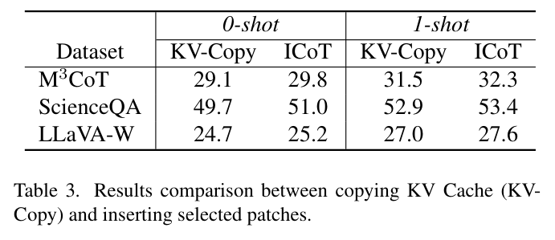
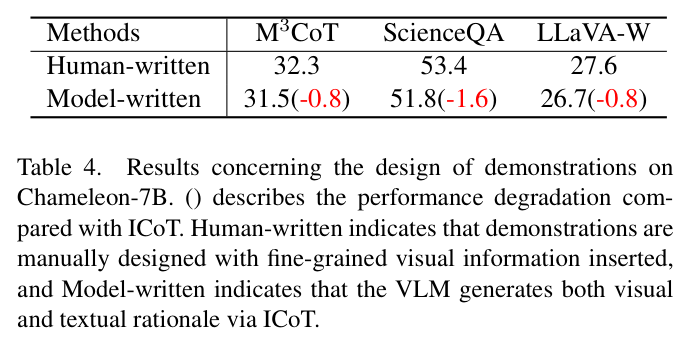
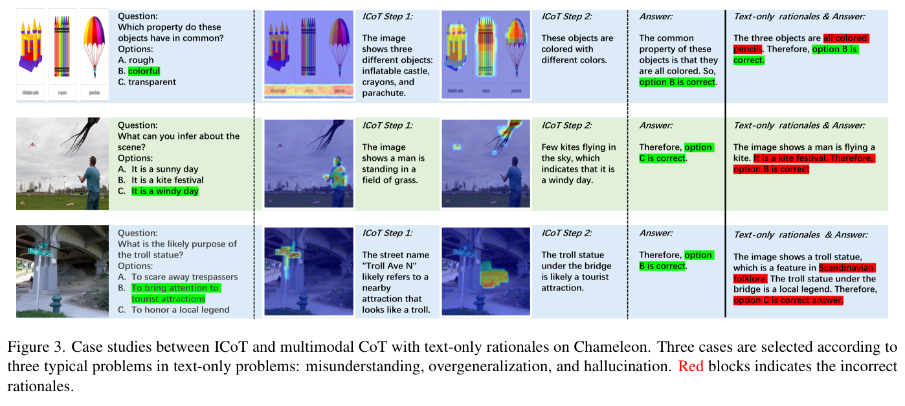
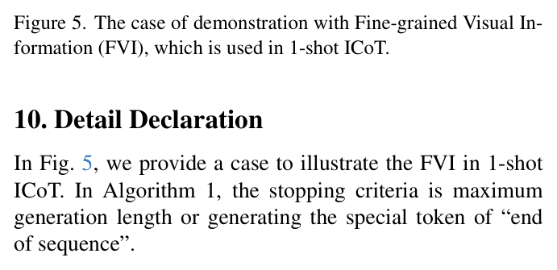

# Interleaved-Modal Chain-of-Thought

## 完整段落级英中双语阅读稿

## Metadata / 元数据

| Field | Value |
|---|---|
| Title / 标题 | Interleaved-Modal Chain-of-Thought / 交错模态思维链 |
| Authors / 作者 | Jun Gao¹; Yongqi Li²,*; Ziqiang Cao¹,*; Wenjie Li² |
| Affiliations / 单位 | ¹ School of Computer Science and Technology, Soochow University / 苏州大学计算机科学与技术学院；² Department of Computer Science, The Hong Kong Polytechnic University / 香港理工大学计算机科学系 |
| Corresponding authors / 通讯作者 | Yongqi Li; Ziqiang Cao |
| Email | jgao1106@stu.suda.edu.cn; liyongqi0@gmail.com; zqcao@suda.edu.cn; cswjli@comp.polyu.edu.hk |
| Project / 项目 | https://github.com/jungao1106/ICoT |
| arXiv | arXiv:2411.19488v2 [cs.CV], 17 Mar 2025 |
| Source / 来源 | `/Users/roywangj/journey_wj/research/papers4zotero/zotero1/storage/DMT6SNMT/Gao 等 - 2025 - Interleaved-Modal Chain-of-Thought.pdf` |
| Length / 篇幅 | 11 pages / 11 页（主文、参考文献与补充材料） |
| Reading policy / 阅读说明 | Every substantive prose paragraph is retained in source order as an adjacent English-Chinese pair. Display equations remain outside blockquotes. Figure and table captions are bilingual. References remain in their original searchable bibliographic form. / 所有实质性正文段落均按来源顺序保留，并以相邻英中段落配对呈现；行间公式置于引用块之外；图表标题均为双语；参考文献保留可检索的原始书目信息。 |

## Page Index / 页码索引

| PDF page | Source content / 来源内容（按 PDF 顺序） |
|---:|---|
| 1 | Title, authors, Abstract, Section 1 Introduction |
| 2 | Figure 1; continuation of Section 1 |
| 3 | completion of Section 1; Section 2 Related Work; Section 3 Methodology and Section 3.1 |
| 4 | Algorithms 1-2; Figure 2; Sections 3.1-3.3; Equations (2)-(3) |
| 5 | Section 3.3; Equations (4)-(6); Sections 4.1-4.2 |
| 6 | Table 1; Sections 4.3-4.4 |
| 7 | Sections 4.5-4.6; Tables 2-4; beginning of Section 5 |
| 8 | Figure 3; completion of Section 5; Section 6 Conclusion |
| 9 | Section 7 Acknowledgement; References [1]-[27] |
| 10 | References [27]-[34] |
| 11 | Supplementary Material; Figures 4-5; Sections 8-10; Table 5 |

## Terminology Ledger / 术语表

| English term / literal | 中文对译 | Usage note / 使用说明 |
|---|---|---|
| Chain-of-Thought (CoT) | 思维链 | 通过中间推理步骤得到最终答案 |
| multimodal CoT | 多模态思维链 | 面向视觉-语言模型的 CoT |
| Interleaved-modal Chain-of-Thought (ICoT) | 交错模态思维链 | 本文方法；推理步骤交错包含视觉与文本理由 |
| rationale | 推理依据；理由 | 指中间推理内容，而非最终答案 |
| textual rationale | 文本推理依据 | 仅由文本组成的中间推理 |
| visual rationale | 视觉推理依据 | 从输入图像中选择的细粒度视觉信息 |
| Attention-driven Selection (ADS) | 注意力驱动选择 | 无需训练、基于注意力图的视觉 token 选择策略 |
| fine-grained visual information (FVI) | 细粒度视觉信息 | 1-shot 演示中插入的关键视觉内容 |
| vision-language model (VLM) | 视觉-语言模型 | 保留缩写 VLM |
| large language model (LLM) | 大语言模型 | 保留缩写 LLM |
| Perceiver-LLM architecture | Perceiver-LLM 架构 | 视觉模块与适配器构成 Perceiver |
| unified-modeling VLM | 统一建模 VLM | 统一生成文本、图像等模态 |
| visual token | 视觉 token | 变量与模型实现中的 `token` 保留英文 |
| signal token | 信号 token | 触发 ADS 的预定义 token |
| signal attention map | 信号注意力图 | 信号 token 对视觉 token 的注意力图 |
| Key-Value (KV) Cache | 键值（KV）缓存 | 自回归生成中的缓存状态 |
| KV-Copy | KV 复制 | 复制选中视觉 token 的 KV cache 的实现变体 |
| Scene Graph (SG) | 场景图 | CCoT 使用的 JSON-like 结构化图像描述 |
| zero-shot / 0-shot | 零样本 | 无演示样例 |
| one-shot / 1-shot | 单样本 | 使用一个演示样例 |
| exact literals | 精确字面量 | 模型名、数据集名、`\n`、`Answer: D` 等保持原样 |

## Abstract / 摘要

> <strong>Para. 1:</strong> Chain-of-Thought (CoT) prompting elicits large language models (LLMs) to produce a series of intermediate reasoning steps before arriving at the final answer. However, when transitioning to vision-language models (VLMs), their text-only rationales struggle to express the fine-grained associations with the original image. In this paper, we propose an image-incorporated multimodal Chain-of-Thought, named Interleaved-modal Chain-of-Thought (ICoT), which generates sequential reasoning steps consisting of paired visual and textual rationales to infer the final answer. Intuitively, the novel ICoT requires VLMs to enable the generation of fine-grained interleaved-modal content, which is hard for current VLMs to fulfill. Considering that the required visual information is usually part of the input image, we propose Attention-driven Selection (ADS) to realize ICoT over existing VLMs. ADS intelligently inserts regions of the input image to generate the interleaved-modal reasoning steps with ignorable additional latency. ADS relies solely on the attention map of VLMs without the need for parameterization, and therefore it is a plug-and-play strategy that can be generalized to a spectrum of VLMs. We apply ADS to realize ICoT on two popular VLMs of different architectures. Extensive evaluations of three benchmarks have shown that ICoT prompting achieves substantial performance (up to 14%) and interpretability improvements compared to existing multimodal CoT prompting methods.

> <strong>Para. 1[CN]:</strong> 思维链（Chain-of-Thought, CoT）提示能够引导大语言模型（LLM）在得出最终答案之前生成一系列中间推理步骤。然而，当这一方法迁移到视觉-语言模型（VLM）时，其纯文本推理依据难以表达与原始图像之间的细粒度关联。本文提出一种融入图像的多模态思维链，称为交错模态思维链（Interleaved-modal Chain-of-Thought, ICoT）；它生成由成对视觉推理依据与文本推理依据组成的连续推理步骤，以推导最终答案。直观而言，新颖的 ICoT 要求 VLM 能够生成细粒度的交错模态内容，而当前 VLM 很难完全满足这一要求。考虑到所需视觉信息通常本就是输入图像的一部分，我们提出注意力驱动选择（Attention-driven Selection, ADS），以在现有 VLM 上实现 ICoT。ADS 智能地插入输入图像中的区域，从而以可忽略的额外延迟生成交错模态推理步骤。ADS 仅依赖 VLM 的注意力图，无需参数化，因此是一种可泛化到多种 VLM 的即插即用策略。我们在两种架构不同的主流 VLM 上应用 ADS 来实现 ICoT。对三个基准的广泛评估表明，与现有多模态 CoT 提示方法相比，ICoT 提示在性能（最高提升 14%）和可解释性方面均取得显著改进。

# 1. Introduction / 引言

> <strong>Para. 1:</strong> Chain-of-Thought (CoT) [31] prompting aims to augment the reasoning capabilities of large language models (LLMs) [4, 8, 22, 26] by eliciting them to produce a sequence of intermediate natural language reasoning steps before arriving at the final output. CoT has proven effective in various reasoning tasks, including arithmetic [9], commonsense [17], and symbolic [3], and it has become a potential pathway to advanced artificial intelligence, as depicted in GPT-o1 [20].

> <strong>Para. 1[CN]:</strong> 思维链（CoT）[31] 提示旨在通过引导大语言模型（LLM）[4, 8, 22, 26] 在得到最终输出之前生成一系列中间自然语言推理步骤，来增强其推理能力。CoT 已在算术 [9]、常识 [17] 和符号推理 [3] 等多种推理任务中证明有效，并已成为通向高级人工智能的一条潜在路径，如 GPT-o1 [20] 所展示的那样。

> <strong>Para. 2:</strong> With the development of vision-language models (VLMs), extending CoT prompting into multimodal CoT to improve the reasoning capabilities of VLMs in vision-related tasks becomes increasingly important [19, 28, 33, 34]. The initial multimodal CoT attempts [28, 33] take as input the fused visual and textual embeddings, and train language models, such as T5 [23] models, to generate text-only rationales and answers. In the era of VLMs, introducing triple demonstrations composed of an image with the instruction, textual rationales, and the final output (e.g., answer), has proven effective in sparking the reasoning ability of VLMs [6]. Then, related studies focus on improving the linguistic reasoning ability of VLMs. Specifically, DDCoT [34] leverages VLMs to deconstruct problems and resolve them respectively, and CCoT [19] generates scene graphs to prompt VLMs with object and position description. SCAFFOLD [12] overlays a coordinate matrix onto the image to prompt the VLMs with relative visual positions. However, these methods still generate text-only reasoning steps, making it hard to express the fine-grained associations with the origin image exactly. As shown on the left of Figure 1, textual position descriptions, e.g., at the top, are too rough to identify all fruits (orange and banana).

> <strong>Para. 2[CN]:</strong> 随着视觉-语言模型（VLM）的发展，将 CoT 提示扩展为多模态 CoT，以提升 VLM 在视觉相关任务中的推理能力，变得愈发重要 [19, 28, 33, 34]。早期的多模态 CoT 尝试 [28, 33] 将融合后的视觉与文本嵌入作为输入，并训练 T5 [23] 等语言模型生成纯文本推理依据和答案。在 VLM 时代，引入由带指令的图像、文本推理依据和最终输出（例如答案）组成的三元组演示，已被证明能有效激发 VLM 的推理能力 [6]。随后，相关研究聚焦于提升 VLM 的语言推理能力。具体而言，DDCoT [34] 利用 VLM 分解问题并分别解决各子问题；CCoT [19] 生成场景图，用对象及位置描述来提示 VLM。SCAFFOLD [12] 在图像上叠加坐标矩阵，以相对视觉位置提示 VLM。然而，这些方法仍然生成纯文本推理步骤，难以准确表达与原始图像之间的细粒度关联。如图 1 左侧所示，“at the top”等文本位置描述过于粗略，无法识别所有水果（橙子和香蕉）。

> <strong>Para. 3:</strong> In light of the limitations of text-only rationales, we propose incorporating visual information to enhance the precision of fine-grained associations between generated textual rationales and the corresponding image. We therefore propose an advanced multimodal Chain-of-Thought prompting, named Interleaved-modal Chain-of-thought (ICoT), as shown on the right of Figure 1. ICoT generates multimodal rationales consisting of paired images and textual rationales that formulate interleaved-modal reasoning steps to infer the final output. To the best of our knowledge, ICoT is the first multimodal CoT with images incorporated, and it aligns more closely with human thinking processes [5, 21].

> <strong>Para. 3[CN]:</strong> 针对纯文本推理依据的局限，我们提出融入视觉信息，以提高生成的文本推理依据与相应图像之间细粒度关联的精确性。因此，我们提出一种更先进的多模态思维链提示方法，称为交错模态思维链（ICoT），如图 1 右侧所示。ICoT 生成由成对图像和文本推理依据构成的多模态推理依据，形成交错模态推理步骤，以推导最终输出。据我们所知，ICoT 是首个融入图像的多模态 CoT，并且与人类思维过程更为接近 [5, 21]。

### Figure 1. Text-only versus interleaved-modal rationales / 纯文本与交错模态推理依据

**Caption:** Figure 1. The illustration between multimodal CoT with text-only rationales (Left) and interleaved-modal rationales (Right). Green blocks are correct texts used to infer the final answer. Text-only rationales restrict VLMs to use a rough description to indicate the position of objects. Transparent boxes indicate that these regions are selected and inserted to formulate paired visual and textual rationales in ICoT.

**Caption[CN]:** 图 1. 采用纯文本推理依据的多模态 CoT（左）与交错模态推理依据（右）之间的示意对比。绿色块表示用于推导最终答案的正确文本。纯文本推理依据限制 VLM 只能使用粗略描述来指示对象位置。透明框表示这些区域被选中并插入，用于在 ICoT 中构成成对的视觉与文本推理依据。

> <strong>Para. 4:</strong> Searchable text inside Figure 1:
>
> **Left - Model Input**
>
> Question: What types of fruits are in the picture?
>
> **Text-only Rationale**
>
> The mixed variety of fruits suggests that this is a fruit platter. The small, round, light green items at the bottom left appear to be grapes.
>
> The textured orange skin at the top indicates this is likely an orange, while a banana rests beside it.
>
> The dark red, smooth-skinned fruit on the right appears to be an apple.
>
> **Answer**
>
> Therefore, grapes, orange, banana, and apple are in the picture.
>
> **Right - Model Input**
>
> Question: What types of fruits are in the picture?
>
> **Interleaved-modal Rationale**
>
> The several grapes grouped together and the jumbled assortment of different fruits suggest that this is a fruit platter.
>
> The orange colored rind behind an apple indicates that there is an orange and an apple in the picture.
>
> The sleek yellow peel off to the right clues at an unpeeled banana.
>
> **Answer**
>
> Therefore, grapes, orange, apple, and banana are in the picture.

> <strong>Para. 4[CN]:</strong> 图 1 内部文字的可检索中文对照：
>
> **左侧 - 模型输入**
>
> 问题：图片中有哪些种类的水果？
>
> **纯文本推理依据**
>
> 多种水果混合在一起，说明这是一盘水果。左下方小而圆、呈浅绿色的物体看起来是葡萄。
>
> 顶部有纹理的橙色果皮表明这很可能是一个橙子，旁边放着一根香蕉。
>
> 右侧深红色、表皮光滑的水果看起来是一个苹果。
>
> **答案**
>
> 因此，图片中有葡萄、橙子、香蕉和苹果。
>
> **右侧 - 模型输入**
>
> 问题：图片中有哪些种类的水果？
>
> **交错模态推理依据**
>
> 几颗葡萄聚在一起，加上杂乱混合的不同水果，表明这是一盘水果。
>
> 苹果后面的橙色果皮表明，图片中有一个橙子和一个苹果。
>
> 右侧光滑的黄色果皮提示那里有一根未剥皮的香蕉。
>
> **答案**
>
> 因此，图片中有葡萄、橙子、苹果和香蕉。

> <strong>Para. 5:</strong> Intuitively, facilitating the novel ICoT is non-trivial, as it introduces challenges for VLMs to support fine-grained interleaved-modal content generation. No current VLMs meet this condition completely. Perceiver-based VLMs such as Qwen2-VL [29] converts images into visual embeddings. Thus, they support fine-grained visual understanding but cannot generate multimodal outputs. Recently proposed unified-modeling VLMs, such as Chameleon [25], Unified-IO 2 [18], and Emu-3 [30], enable multimodal generation by tokenizing images into discrete tokens. However, on the one hand, unified-modeling VLMs exhibit inertia toward multimodal content generation [7]; on the other hand, the generated images belong to the fixed pre-defined resolution instead of fine granularity.

> <strong>Para. 5[CN]:</strong> 直观而言，实现这一新颖的 ICoT 并非易事，因为它要求 VLM 支持细粒度交错模态内容生成，而目前没有任何 VLM 能完全满足这一条件。基于 Perceiver 的 VLM（如 Qwen2-VL [29]）将图像转换为视觉嵌入。因此，它们支持细粒度视觉理解，却无法生成多模态输出。近期提出的统一建模 VLM，如 Chameleon [25]、Unified-IO 2 [18] 和 Emu-3 [30]，通过把图像 token 化为离散 token 来实现多模态生成。然而，一方面，统一建模 VLM 对生成多模态内容表现出惰性 [7]；另一方面，所生成的图像只能采用固定的预定义分辨率，而不是细粒度形式。

> <strong>Para. 6:</strong> Since required visual information is usually part of the input image for ICoT, we accordingly propose Attention-driven Selection (ADS) to realize ICoT. The basic idea of ADS is to signal VLMs to select patches from the input image rather than generating extra images. At the beginning of generating each textual rationale, ADS inserts a piece of visual tokens of selected patches from the input image to refine the generation of the following textual rationale. Specifically, ADS utilizes the attention map of VLMs to identify optimal patches from the input image as fine-grained visual rationales. Once these fine-grained visual rationales are inserted into the current generation sequence, the VLM resumes the original autoregressive text generation process based on previous multimodal content, formulating paired image and textual rationales to infer the final outputs. Notably, since ADS does not compel VLMs to generate real images, it brings ignorable inference latency compared with previous text-only CoT methods. Additionally, ADS leverages the attention map of VLMs without requiring parameterization, making it a plug-and-play strategy that can be easily adapted to a wide range of VLMs.

> <strong>Para. 6[CN]:</strong> 由于 ICoT 所需的视觉信息通常本就是输入图像的一部分，我们相应地提出注意力驱动选择（ADS）来实现 ICoT。ADS 的基本思想是向 VLM 发出信号，使其从输入图像中选择图像块，而不是额外生成图像。在开始生成每一段文本推理依据时，ADS 从输入图像中插入一段由选中图像块构成的视觉 token，以优化后续文本推理依据的生成。具体而言，ADS 利用 VLM 的注意力图，从输入图像中识别最优图像块，作为细粒度视觉推理依据。一旦这些细粒度视觉推理依据被插入当前生成序列，VLM 就基于先前的多模态内容恢复原有的自回归文本生成过程，形成成对的图像与文本推理依据，以推导最终输出。值得注意的是，由于 ADS 不强迫 VLM 生成真实图像，与以往纯文本 CoT 方法相比，它引入的推理延迟可以忽略。此外，ADS 利用 VLM 的注意力图且无需参数化，使其成为一种可轻松适配广泛 VLM 的即插即用策略。

> <strong>Para. 7:</strong> In this paper, we apply ADS to realize ICoT on Chameleon and Qwen2-VL, representing the state-of-the-art unified modeling and perceiver-based VLMs. The results on existing datasets, including M³CoT [6], ScienceQA [24], and LLaVA-W [15], indicate that ICoT realized by ADS brings VLMs with substantial performance gains (up to 14%) compared with current multimodal CoT methods. Additionally, it is noted that the tracked interleaved-modal rationales further enhance the interpretability of the generated results. Our main contribution can be concluded as follows:
>
> - We propose interleaved-modal CoT, which innovates text-only rationales into multimodal ones to construct clearer reasoning. To our knowledge, we are the first to incorporate images into the intermediate reasoning steps in multimodal CoT.
> - We propose an effective and efficient Attention-driven Selection strategy to facilitate ICoT, which is training-free and widely applicable to VLMs without requiring them to support multimodal generation.
> - Experiments demonstrate that our ICoT significantly surpasses existing multimodal CoT methods, proving that the interleaved-modal reasoning process is a foundational innovation in the line of CoT.

> <strong>Para. 7[CN]:</strong> 本文将 ADS 应用于 Chameleon 和 Qwen2-VL，以实现 ICoT；二者分别代表最先进的统一建模 VLM 与基于 Perceiver 的 VLM。在 M³CoT [6]、ScienceQA [24] 和 LLaVA-W [15] 等现有数据集上的结果表明，与当前多模态 CoT 方法相比，由 ADS 实现的 ICoT 为 VLM 带来了显著的性能提升（最高 14%）。此外，所追踪的交错模态推理依据还进一步增强了生成结果的可解释性。我们的主要贡献可概括如下：
>
> - 我们提出交错模态 CoT，将纯文本推理依据革新为多模态推理依据，从而构建更清晰的推理过程。据我们所知，我们首次在多模态 CoT 的中间推理步骤中融入图像。
> - 我们提出一种有效且高效的注意力驱动选择策略来实现 ICoT。该策略无需训练，可广泛应用于 VLM，且不要求它们支持多模态生成。
> - 实验表明，我们的 ICoT 显著超越现有多模态 CoT 方法，证明交错模态推理过程是 CoT 研究路线中的一项基础性创新。

# 2. Related Work / 相关工作

## 2.1. Vision-Language Models (VLMs) / 视觉-语言模型

> <strong>Para. 1:</strong> Currently, predominate VLMs such as Qwen-VL [2, 29], BLIP [13], and LLaVA [14-16] are mainly built upon a Large Language Model (LLM), a visual module, and an aligned vision-language adapter. The visual module, e.g., Vision Transformer (ViT) [1], encodes images into dense representations, and then the adapter, e.g., MLP or Q-Former, converts these representations into LLM-readable visual tokens. Finally, visual tokens and textual tokens are fed into the LLM to perform the next-token prediction. This type of VLM can be concluded as Perceiver-LLM architecture, while the Perceiver usually comprises a visual module and the adapter. Additionally, Cambrain-1 [27] introduces more visual modules to collaboratively provide more useful visual tokens in a vision-centric paradigm. In the other research line, unified-modeling VLMs represented by Chameleon [25], Unified-IO 2 [18], and Emu3 [30] are designed to generate texts, images, and so on uniformly. As these models apply codebook [11] to tokenize images into discrete vokens, their training processes are supervised by both vision and text information. Unified-modeling VLMs are expected to develop more stable multimodal understanding abality [10].

> <strong>Para. 1[CN]:</strong> 当前，Qwen-VL [2, 29]、BLIP [13] 和 LLaVA [14-16] 等主流 VLM 主要由一个大语言模型（LLM）、一个视觉模块和一个对齐的视觉-语言适配器构成。视觉模块（如 Vision Transformer, ViT [1]）把图像编码为稠密表示，随后适配器（如 MLP 或 Q-Former）将这些表示转换为 LLM 可读取的视觉 token。最后，视觉 token 和文本 token 一同输入 LLM，执行下一 token 预测。这类 VLM 可概括为 Perceiver-LLM 架构，其中 Perceiver 通常由视觉模块和适配器组成。此外，Cambrain-1 [27] 引入更多视觉模块，以视觉中心范式协同提供更有用的视觉 token。另一条研究路线是以 Chameleon [25]、Unified-IO 2 [18] 和 Emu3 [30] 为代表的统一建模 VLM，它们旨在统一生成文本、图像等内容。由于这些模型使用 codebook [11] 将图像 token 化为离散的 `vokens`，其训练过程同时受到视觉和文本信息的监督。统一建模 VLM 有望形成更稳定的多模态理解能力 [10]。

## 2.2. Multimodal Chain-of-Thought Prompting / 多模态思维链提示

> <strong>Para. 2:</strong> Similar to CoT used in LLMs, multimodal Chain-of-Thought prompting methods [12, 19, 28, 32, 34] aim to augment the reasoning ability of VLM by generating intermediate reasoning steps. A series of studies focus on providing VLMs with fine-grained textual information, such as detailed description [28]. Compositional CoT (CCoT) [19] prompts VLMs to generate a Scene Graph (SG), which is a JSON-like description containing compositional information of objects that occurred in the image. DDCoT [34] deconstruct problems into small problems, requiring VLMs to solve them respectively and then inferring the final answer. In the other research line, Set-of-Marks prompting [32] augments the objects in the image to help VLMs recognize them. SCAFFOLD [12] overlays coordinate onto images to prompt VLMs with relative position information, and VLMs leverage overlayed textual coordinates to implicitly represent corresponding regions of the image to perform reasoning.

> <strong>Para. 2[CN]:</strong> 与 LLM 中使用的 CoT 类似，多模态思维链提示方法 [12, 19, 28, 32, 34] 旨在通过生成中间推理步骤来增强 VLM 的推理能力。一系列研究聚焦于向 VLM 提供细粒度文本信息，例如详细描述 [28]。组合式 CoT（CCoT）[19] 提示 VLM 生成场景图（Scene Graph, SG）；SG 是一种 JSON-like 描述，包含图像中出现对象的组合信息。DDCoT [34] 将问题拆解为多个小问题，要求 VLM 分别求解，再推导最终答案。另一条研究路线中，Set-of-Marks 提示 [32] 对图像中的对象进行增强，以帮助 VLM 识别它们。SCAFFOLD [12] 在图像上叠加坐标，为 VLM 提供相对位置信息；VLM 利用叠加的文本坐标隐式表示图像中的对应区域，并据此进行推理。

> <strong>Para. 3:</strong> However, these methods still produce text-only rationales to infer the final answer. These generated textual rationales usually struggle to express the fine-grained associations with the origin image. We thereby propose ICoT to elicit VLMs to generate interleaved visual-textual reasoning steps to effectively reach the final outputs.

> <strong>Para. 3[CN]:</strong> 然而，这些方法仍然生成纯文本推理依据来推导最终答案。这些生成的文本推理依据通常难以表达与原始图像之间的细粒度关联。因此，我们提出 ICoT，引导 VLM 生成视觉与文本交错的推理步骤，从而有效得到最终输出。

# 3. Methodology / 方法

> <strong>Para. 1:</strong> To address the limitations that current multimodal CoT methods are still stuck in generating text-only rationales to infer the final answer, we propose interleaved-modal CoT (ICoT) to elicit VLMs generated multimodal reasoning steps. We start by introducing the workflow of VLMs and multimodal CoT in Section 3.1. We then introduce the concept of ICoT in Section 3.2. Finally, we propose a plug-and-play method, Attention-driven Selection (ADS), to realize ICoT on existing VLMs.

> <strong>Para. 1[CN]:</strong> 针对当前多模态 CoT 方法仍局限于生成纯文本推理依据来推导最终答案这一问题，我们提出交错模态 CoT（ICoT），以引导 VLM 生成多模态推理步骤。我们首先在第 3.1 节介绍 VLM 与多模态 CoT 的工作流程；随后在第 3.2 节介绍 ICoT 的概念；最后提出一种即插即用的方法——注意力驱动选择（ADS），以在现有 VLM 上实现 ICoT。

## 3.1. Preliminaries / 预备知识

> <strong>Para. 2:</strong> We first recall some background of VLMs and multimodal CoT in this section.

> <strong>Para. 2[CN]:</strong> 本节首先回顾 VLM 与多模态 CoT 的一些背景知识。

> <strong>Para. 3:</strong> **Vision-Language Model.** VLMs usually consist of a visual encoder $\mathbf{E}$ and a generative large language model $\mathrm{LLM}$, and they determine where to insert images according to visual holders inserted in the text instructions. Then, VLMs take the image and the instructions as input and respond with a final answer

$$
\mathrm{answer}=\operatorname{VLM}(\mathrm{Image},\mathrm{Instruction}). \tag{1}
$$

> <strong>Para. 3[CN]:</strong> **视觉-语言模型。** VLM 通常由视觉编码器 $\mathbf{E}$ 和生成式大语言模型 $\mathrm{LLM}$ 组成，并根据文本指令中插入的视觉占位符决定在何处插入图像。随后，VLM 将图像和指令作为输入，并给出最终答案，如式（1）所示。

> <strong>Para. 4:</strong> Specifically, the visual encoder $\mathbf{E}$ extracts visual tokens $f_v^{l \times d}$ from the image $x_v$, where $l$ is the length of visual tokens and $d$ is the dimensions of the hidden states of the LLM. The built-in LLM predicts next-tokens in a left-to-right fashion according to visual tokens $f_v^{l \times d}$ and the instructions.

> <strong>Para. 4[CN]:</strong> 具体而言，视觉编码器 $\mathbf{E}$ 从图像 $x_v$ 中提取视觉 token $f_v^{l \times d}$，其中 $l$ 是视觉 token 的长度，$d$ 是 LLM 隐藏状态的维度。内置 LLM 根据视觉 token $f_v^{l \times d}$ 和指令，以从左到右的方式预测下一 token。

> <strong>Para. 5:</strong> **Multimodal CoT.** Compared with the direct prediction described in Eqn. 1, Multimodal CoT further introduces a prompt to elicit VLMs to generate a series of intermediate textual rationales $(r_1,r_2,\ldots)$ before the final answer:

$$
r_1,r_2,\ldots,\mathrm{answer}
=\operatorname{VLM}(\mathrm{Prompt},\mathrm{Image},\mathrm{Instruction}). \tag{2}
$$

> <strong>Para. 5[CN]:</strong> **多模态 CoT。** 与式（1）所描述的直接预测相比，多模态 CoT 进一步引入一个提示，以引导 VLM 在最终答案之前生成一系列中间文本推理依据 $(r_1,r_2,\ldots)$，如式（2）所示。

> <strong>Para. 6:</strong> Technically, the prompt could be represented as a sequence of demonstrations, each consisting of a triple: (Image, Rationale, Answer). Alternatively, an explicit instruction, such as “Let’s think step by step,” could also serve as the prompt.

> <strong>Para. 6[CN]:</strong> 从技术上看，该提示可以表示为一系列演示，每个演示由一个三元组组成：(Image, Rationale, Answer)。或者，也可以使用诸如 “Let’s think step by step,” 这样的显式指令作为提示。

## 3.2. Interleaved-modal Chain-of-Thought / 交错模态思维链

> <strong>Para. 7:</strong> Previous multimodal CoT prompting methods only produce text-only reasoning steps to improve the reasoning ability of VLMs. These intermediate steps are generated according to the entire image, which are struggle to express exact fine-grained associations with the original image. Given these limitations, we propose a more advanced Interleaved-modal Chain-of-Thought (ICoT) prompting, aiming to elicit VLMs to generate a series of multimodal intermediate reasoning steps each consisting of paired image and textual rationale. Generated intermediate reasoning steps formulating interleaved-modal rationales to effectively lead to the final outputs. In this paper, we consider the visual rationales in interleaved-modal rationales as fine-grained visual information $x_v^{h' \times w'}$ extracted from an image $x_v^{h \times w}$.¹ These visual rationales capture relevant details in the image, such as objects, colors, and texts, interleaved with the following generated textual rationale to infer the final answer:

$$
r_1,x_{v1},r_2,x_{v2},\ldots,\mathrm{answer}
=\operatorname{VLM}(\mathrm{Prompt},\mathrm{Image},\mathrm{Instruction}). \tag{3}
$$

> <strong>Para. 7[CN]:</strong> 以往的多模态 CoT 提示方法只生成纯文本推理步骤来提升 VLM 的推理能力。这些中间步骤根据整幅图像生成，难以表达与原始图像之间精确的细粒度关联。鉴于这些局限，我们提出更先进的交错模态思维链（ICoT）提示，旨在引导 VLM 生成一系列多模态中间推理步骤，其中每一步都由成对的图像和文本推理依据组成。生成的中间推理步骤构成交错模态推理依据，从而有效得到最终输出。本文将交错模态推理依据中的视觉推理依据视为从图像 $x_v^{h \times w}$ 中提取的细粒度视觉信息 $x_v^{h' \times w'}$。¹ 这些视觉推理依据捕获图像中的相关细节，例如对象、颜色和文本，并与随后生成的文本推理依据交错，以推导最终答案，如式（3）所示。

> <strong>Para. 8:</strong> ¹ The images in the dataset involved in this paper are RGB images by default, and the number of channels is omitted in the formulas for simplicity.

> <strong>Para. 8[CN]:</strong> ¹ 本文所涉及数据集中的图像默认均为 RGB 图像；为简化表达，公式中省略了通道数。

## 3.3. Attention-driven Selection / 注意力驱动选择

> <strong>Para. 9:</strong> Although the proposed ICoT is both novel and conceptually sound, current VLMs are unable to generate such fine-grained visual information. This remains true even for VLMs [18, 25, 30] that are empowered with multimodal generation ability. We thus propose to simplify the problem from fine-grained visual information generation to fine-grained visual information selection, as this information has been naturally contained in the origin image, namely $x_v^{h' \times w'} \in x_v^{h \times w}$ where $h' \ll h$ and $w' \ll w$.

> <strong>Para. 9[CN]:</strong> 尽管所提出的 ICoT 新颖且在概念上合理，当前 VLM 仍无法生成这样的细粒度视觉信息。即便是具备多模态生成能力的 VLM [18, 25, 30]，情况也是如此。因此，我们提出把问题从“生成细粒度视觉信息”简化为“选择细粒度视觉信息”，因为这些信息天然包含在原始图像中，即 $x_v^{h' \times w'} \in x_v^{h \times w}$，其中 $h' \ll h$ 且 $w' \ll w$。

### Figure 2. ADS workflow / ADS 工作流程

**Caption:** Figure 2. The workflow of ADS selecting fine-grained visual rationales. Signal attention represents the attention map of the signal token overall visual tokens.

**Caption[CN]:** 图 2. ADS 选择细粒度视觉推理依据的工作流程。Signal attention 表示信号 token 对全部视觉 token 的注意力图。

> <strong>Para. 10:</strong> Searchable literals inside Figure 2: Visual Tokens; Textual Rationale; Signal Token; Signal Attention; Attn.; VLM; VLM Layer; Fine-grained Visual Information; $w_q$; $Q$; $w_k$; $K$; $Z$; $w_v$; $V$.

> <strong>Para. 10[CN]:</strong> 图 2 内部可检索字面量：视觉 token（Visual Tokens）；文本推理依据（Textual Rationale）；信号 token（Signal Token）；信号注意力（Signal Attention）；注意力（Attn.）；VLM；VLM 层（VLM Layer）；细粒度视觉信息（Fine-grained Visual Information）；$w_q$；$Q$；$w_k$；$K$；$Z$；$w_v$；$V$。

> <strong>Para. 11:</strong> Specifically, before performing next-token prediction, ICoT requires the VLM to cache visual tokens $f_v^{l \times d}$ extracted by its built-in visual encoder $\mathbf{E}(x_v)$ for further selection. In the following decoding steps, we consider the VLM deems it necessary to insert a piece of visual rationales after generating a pre-defined signal token $S$ as shown in Figure 2, which is a natural language token that indicates the beginning of a textual rationale. Therefore, ADS will be signaled to select fine-grained visual information from $f_v^{l \times d}$ upon the VLM generating $S$:

$$
\mathrm{do\_selection}=
\begin{cases}
\mathrm{True}, & \text{if }\mathrm{predicted\_tokens}[-1]=S;\\
\mathrm{False}, & \text{otherwise.}
\end{cases} \tag{4}
$$

> <strong>Para. 11[CN]:</strong> 具体而言，在执行下一 token 预测之前，ICoT 要求 VLM 缓存其内置视觉编码器 $\mathbf{E}(x_v)$ 从图像中提取的视觉 token $f_v^{l \times d}$，供后续选择。在随后的解码步骤中，我们认为，当 VLM 生成图 2 所示的预定义信号 token $S$ 后，它认为有必要插入一段视觉推理依据；该信号 token 是一个自然语言 token，用于指示一段文本推理依据的开始。因此，当 VLM 生成 $S$ 时，ADS 会收到信号，从 $f_v^{l \times d}$ 中选择细粒度视觉信息，如式（4）所示。

> <strong>Para. 12:</strong> Then, ADS selects $n$ visual tokens from $f_v^{l \times d}$ as fine-grained visual information according to the signal attention map $A_t$ at the current decoding step $t$:

$$
\mathcal{V}_{\mathrm{selected}}
=\{f_v[i]\mid i\in\operatorname{TopK}(A_t,n)\}, \tag{5}
$$

> <strong>Para. 12[CN]:</strong> 随后，ADS 根据当前解码步骤 $t$ 的信号注意力图 $A_t$，从 $f_v^{l \times d}$ 中选择 $n$ 个视觉 token 作为细粒度视觉信息，如式（5）所示。

> <strong>Para. 13:</strong> where $A_t$ is obtained by averaging the attention map between the signal token and visual tokens across all VLM layers. Up to now, the selected visual tokens are sorted by their attention scores, and we subsequently restore the relative position of $f_v[i]$ in the origin image in place, prioritizing rows. Once fine-grained visual tokens $\mathcal{V}_{\mathrm{selected}}$ are obtained, VLMs will take as input the concatednated $\mathcal{V}_{\mathrm{selected}}$ and predicted_tokens, denote as $\operatorname{Cat}(\mathrm{predicted\_tokens},\mathcal{V}_{\mathrm{selected}})$, resuming the original autoregressive text generation process. Hence, the current decoding step is formulated as:

$$
\mathrm{next\_token}
=\operatorname{VLM}\!\left(
\operatorname{Cat}(\mathrm{predicted\_tokens},
\mathcal{V}_{\mathrm{selected}})
\right). \tag{6}
$$

> <strong>Para. 13[CN]:</strong> 其中，$A_t$ 通过对所有 VLM 层中信号 token 与视觉 token 之间的注意力图取平均得到。至此，选中的视觉 token 按注意力分数排序；随后，我们就地恢复 $f_v[i]$ 在原始图像中的相对位置，并优先按行排列。得到细粒度视觉 token $\mathcal{V}_{\mathrm{selected}}$ 后，VLM 将拼接后的 $\mathcal{V}_{\mathrm{selected}}$ 与 `predicted_tokens` 作为输入，记作 $\operatorname{Cat}(\mathrm{predicted\_tokens},\mathcal{V}_{\mathrm{selected}})$，并恢复原始的自回归文本生成过程。因此，当前解码步骤由式（6）表示。

> <strong>Para. 14:</strong> Notably, to avoid misunderstanding, we first convert predicted_tokens into word embeddings $f_e$, and then concatenate $f_e$ with selected fine-grained visual information $\mathcal{V}_{\mathrm{selected}}$ in the embedding-level. We provide a detailed description of ICoT and ADS in Algorithm 1 and Algorithm 2, respectively.

> <strong>Para. 14[CN]:</strong> 值得注意的是，为避免误解，我们首先将 `predicted_tokens` 转换为词嵌入 $f_e$，然后在嵌入层面将 $f_e$ 与选中的细粒度视觉信息 $\mathcal{V}_{\mathrm{selected}}$ 拼接。算法 1 和算法 2 分别给出了 ICoT 与 ADS 的详细描述。

### Algorithm 1. Interleaved-modal CoT / 交错模态 CoT

> <strong>Para. 15:</strong> **Algorithm 1 Interleaved-modal CoT**
>
> 1. **Input:** Word embeddings $f_e$, Visual tokens $f_v$, Selected number $n$, Signal tokens $S$, Stopping criteria $SC$
> 2. **Output:** Generated Response $Answer$
> 3. $\mathrm{predicted\_tokens}\leftarrow []$ $\triangleright$ Initialize as an empty list
> 4. $\mathcal{V}\leftarrow f_v$
> 5. $\mathrm{inputs}=\operatorname{Initilize}(f_e,f_v)$ $\triangleright$ Initialize inputs for prefilling
> 6. **while** $SC$ not met **do**
> 7. &nbsp;&nbsp;&nbsp;&nbsp;$\mathrm{next\_token},\mathrm{attention\_map}=\mathbf{model}(\mathrm{inputs})$
> 8. &nbsp;&nbsp;&nbsp;&nbsp;Append $\mathrm{next\_token}$ to $\mathrm{predicted\_tokens}$ $\triangleright$ ADS judgement
> 9. &nbsp;&nbsp;&nbsp;&nbsp;**if** $\mathrm{predicted\_tokens}=S$ **then**
> 10. &nbsp;&nbsp;&nbsp;&nbsp;&nbsp;&nbsp;&nbsp;&nbsp;$\mathcal{V}_{\mathrm{selected}}=\operatorname{ADS}(\mathcal{V},\mathrm{attention\_map},n)$ $\triangleright$ Apply Attention-driven Selection
> 11. &nbsp;&nbsp;&nbsp;&nbsp;&nbsp;&nbsp;&nbsp;&nbsp;Append $\mathcal{V}_{\mathrm{selected}}$ to $\mathrm{predicted\_tokens}$
> 12. &nbsp;&nbsp;&nbsp;&nbsp;**end if**
> 13. &nbsp;&nbsp;&nbsp;&nbsp;$\mathrm{inputs}=\operatorname{Update}(\mathrm{inputs},\mathrm{predicted\_tokens})$ $\triangleright$ Updates inputs for next step generation
> 14. **end while**
> 15. $Answer=\operatorname{Tokenizer.decode}(\mathrm{predicted\_tokens})$
> 16. **return** $Answer$

> <strong>Para. 15[CN]:</strong> **算法 1 交错模态 CoT**
>
> 1. **输入：**词嵌入 $f_e$、视觉 token $f_v$、选择数量 $n$、信号 token $S$、停止准则 $SC$
> 2. **输出：**生成的响应 $Answer$
> 3. $\mathrm{predicted\_tokens}\leftarrow []$ $\triangleright$ 初始化为空列表
> 4. $\mathcal{V}\leftarrow f_v$
> 5. $\mathrm{inputs}=\operatorname{Initilize}(f_e,f_v)$ $\triangleright$ 初始化用于预填充的输入
> 6. **while** 未满足 $SC$ **do**
> 7. &nbsp;&nbsp;&nbsp;&nbsp;$\mathrm{next\_token},\mathrm{attention\_map}=\mathbf{model}(\mathrm{inputs})$
> 8. &nbsp;&nbsp;&nbsp;&nbsp;将 $\mathrm{next\_token}$ 追加到 $\mathrm{predicted\_tokens}$ $\triangleright$ ADS 判断
> 9. &nbsp;&nbsp;&nbsp;&nbsp;**if** $\mathrm{predicted\_tokens}=S$ **then**
> 10. &nbsp;&nbsp;&nbsp;&nbsp;&nbsp;&nbsp;&nbsp;&nbsp;$\mathcal{V}_{\mathrm{selected}}=\operatorname{ADS}(\mathcal{V},\mathrm{attention\_map},n)$ $\triangleright$ 应用注意力驱动选择
> 11. &nbsp;&nbsp;&nbsp;&nbsp;&nbsp;&nbsp;&nbsp;&nbsp;将 $\mathcal{V}_{\mathrm{selected}}$ 追加到 $\mathrm{predicted\_tokens}$
> 12. &nbsp;&nbsp;&nbsp;&nbsp;**end if**
> 13. &nbsp;&nbsp;&nbsp;&nbsp;$\mathrm{inputs}=\operatorname{Update}(\mathrm{inputs},\mathrm{predicted\_tokens})$ $\triangleright$ 更新下一步生成的输入
> 14. **end while**
> 15. $Answer=\operatorname{Tokenizer.decode}(\mathrm{predicted\_tokens})$
> 16. **return** $Answer$

### Algorithm 2. Attention-driven Selection / 注意力驱动选择

> <strong>Para. 16:</strong> **Algorithm 2 Attention-driven Selection**
>
> 1. **Input:** Attention map $A_t$, Selected number $n$, Visual tokens $f_v$
> 2. **Output:** Fine-grained visual information $\mathcal{V}_{\mathrm{selected}}$
> 3. $\mathcal{V}_{\mathrm{selected}}\leftarrow\varnothing$ $\triangleright$ Initialize as an empty set
> 4. $\mathrm{Indices}\leftarrow\operatorname{TopK}(A_t,n)$
> 5. **for** $i$ **in** $\mathrm{Indices}$ **do**
> 6. &nbsp;&nbsp;&nbsp;&nbsp;Append $f_v^{l\times d}[i]$ to $\mathcal{V}_{\mathrm{selected}}$
> 7. **end for**
> 8. $\operatorname{Restore}(\mathcal{V}_{\mathrm{selected}},\mathrm{Indices})$ $\triangleright$ Restore relative positions in-place
> 9. **return** $\mathcal{V}_{\mathrm{selected}}$

> <strong>Para. 16[CN]:</strong> **算法 2 注意力驱动选择**
>
> 1. **输入：**注意力图 $A_t$、选择数量 $n$、视觉 token $f_v$
> 2. **输出：**细粒度视觉信息 $\mathcal{V}_{\mathrm{selected}}$
> 3. $\mathcal{V}_{\mathrm{selected}}\leftarrow\varnothing$ $\triangleright$ 初始化为空集
> 4. $\mathrm{Indices}\leftarrow\operatorname{TopK}(A_t,n)$
> 5. **for** $i$ **in** $\mathrm{Indices}$ **do**
> 6. &nbsp;&nbsp;&nbsp;&nbsp;将 $f_v^{l\times d}[i]$ 追加到 $\mathcal{V}_{\mathrm{selected}}$
> 7. **end for**
> 8. $\operatorname{Restore}(\mathcal{V}_{\mathrm{selected}},\mathrm{Indices})$ $\triangleright$ 就地恢复相对位置
> 9. **return** $\mathcal{V}_{\mathrm{selected}}$

> <strong>Para. 17:</strong> Technically, ICoT inherits the existing eliciting methods from CoT, such as attaching an instruction: “Let’s think step by step” in zero-shot ICoT or providing few-shot examples. In the few-shot ICoT, each example consists of an image, textual rationales, and visual rationales. These examples can be manually designed to prompt VLMs regarding their way of thinking and generation formatting, among other aspects.

> <strong>Para. 17[CN]:</strong> 从技术上看，ICoT 继承了 CoT 现有的引导方法，例如在零样本 ICoT 中附加 “Let’s think step by step” 指令，或提供少样本示例。在少样本 ICoT 中，每个示例由一幅图像、文本推理依据和视觉推理依据组成。这些示例可以人工设计，以提示 VLM 的思考方式、生成格式及其他方面。

# 4. Experiments / 实验

## 4.1. Datasets / 数据集

> <strong>Para. 1:</strong> **M³CoT [6]** is a novel multimodal CoT benchmark specifically concentrated on multi-domain, multi-reasoning-step. M³CoT contains 267 categories from science, mathematics, and commonsense domains. As the question of each instance is relatively complex, their rationales have an average length of 293 tokens and rely more on fine-grained visual information, which can reflect the advantages of ICoT compared with previous multimodal CoT methods.

> <strong>Para. 1[CN]:</strong> **M³CoT [6]** 是一个新颖的多模态 CoT 基准，专门聚焦多领域、多推理步骤。M³CoT 包含来自科学、数学和常识领域的 267 个类别。由于每个样本的问题都相对复杂，其推理依据平均长度为 293 个 token，并且更依赖细粒度视觉信息，因此能够体现 ICoT 相较以往多模态 CoT 方法的优势。

> <strong>Para. 2:</strong> **ScienceQA [24]** is a popular dataset used to evaluate the reasoning ability of VLMs. We use ScienceQA to provide a general comparison between ICoT and other existing multimodal CoT methods.

> <strong>Para. 2[CN]:</strong> **ScienceQA [24]** 是用于评估 VLM 推理能力的常用数据集。我们使用 ScienceQA 对 ICoT 与其他现有多模态 CoT 方法进行一般性比较。

> <strong>Para. 3:</strong> **LLaVA-Bench In-the-Wild (LLaVA-W) [15]** evaluates VLMs’ ability to respond to visual questions with detailed long-form answers, which also focus on the fine-grained visual description. The reference label of each instance is produced by GPT-4v.

> <strong>Para. 3[CN]:</strong> **LLaVA-Bench In-the-Wild（LLaVA-W）[15]** 评估 VLM 使用详细长文本回答视觉问题的能力，该基准同样关注细粒度视觉描述。每个样本的参考标签均由 GPT-4v 生成。

## 4.2. Baselines / 基线

> <strong>Para. 4:</strong> **No-CoT** responds to the current input image and question directly without further prompting. The few-shot demonstrations of the direct generation mode consist of (Image, Question, Answer).

> <strong>Para. 4[CN]:</strong> **No-CoT** 不使用额外提示，直接对当前输入图像和问题作答。直接生成模式的少样本演示由 (Image, Question, Answer) 组成。

> <strong>Para. 5:</strong> **Multimodal CoT [33]** elicits VLMs to generate a series of text-only intermediate reasoning steps to infer the final outputs.

> <strong>Para. 5[CN]:</strong> **Multimodal CoT [33]** 引导 VLM 生成一系列纯文本中间推理步骤，以推导最终输出。

> <strong>Para. 6:</strong> **CCoT [19]** first generates a scene graph (SG) using the VLM itself and then uses that SG in the prompt to produce a response. The SG is a JSON-like structural description of the given image with extensive compositional information of objects in the current images. Following their settings, we apply their official prompt to prompt VLMs to generate SGs and answers respectively.

> <strong>Para. 6[CN]:</strong> **CCoT [19]** 首先使用 VLM 自身生成场景图（SG），再把该 SG 用于提示中以生成响应。SG 是对给定图像的 JSON-like 结构化描述，包含当前图像中对象的丰富组合信息。遵循其设置，我们使用其官方提示，分别引导 VLM 生成 SG 和答案。

> <strong>Para. 7:</strong> **DDCoT [34]** first prompts LLM to deconstruct the input question into a sequence of basic sub-questions and then applies a VQA model to answer these sub-questions involving visual information. In this paper, we use the VLM that plays the role of LLM in DDCoT for a fair comparison, as their original LLM is ChatGPT.

> <strong>Para. 7[CN]:</strong> **DDCoT [34]** 首先提示 LLM 将输入问题拆解为一系列基本子问题，然后应用 VQA 模型回答其中涉及视觉信息的子问题。为公平比较，本文使用 VLM 扮演 DDCoT 中 LLM 的角色，因为其原始 LLM 为 ChatGPT。

> <strong>Para. 8:</strong> **SCAFFOLD [12]** overlays a coordinate matrix onto the input image, exactly demonstrating relative visual positions for VLMs. During reasoning, VLMs are steered to utilize these coordinates that indicate fine-grained visual information in the image to solve different vision-language tasks. We use their released scripts to add coordinates over each image and then use their official prompt to elicit VLMs.

> <strong>Para. 8[CN]:</strong> **SCAFFOLD [12]** 在输入图像上叠加坐标矩阵，向 VLM 精确展示相对视觉位置。在推理过程中，VLM 被引导使用这些指示图像中细粒度视觉信息的坐标，来解决不同的视觉-语言任务。我们使用其发布的脚本在每幅图像上添加坐标，随后使用其官方提示引导 VLM。

> <strong>Para. 9:</strong> Specifically in the few-shot scenario, the demonstrations of these baselines are human-written, aligning with ICoT.

> <strong>Para. 9[CN]:</strong> 具体而言，在少样本场景中，这些基线的演示均由人工编写，与 ICoT 保持一致。

### Table 1. Main results / 主要结果

| Backbone | Methods | 0-shot M³CoT ACC. ↑ | 0-shot ScienceQA ACC. ↑ | 0-shot LLaVA-W ROUGE-L↑ | 1-shot M³CoT ACC. ↑ | 1-shot ScienceQA ACC. ↑ | 1-shot LLaVA-W ROUGE-L↑ |
|---|---|---:|---:|---:|---:|---:|---:|
| Chameleon-7B | No-CoT | 29.1 | 47.7 | 13.1 | 28.4 | 48.5 | 23.9 |
| Chameleon-7B | Multimodal CoT [33] | 28.5 | 49.0 | 20.4 | 30.6 | 50.7 | 20.6 |
| Chameleon-7B | CCoT [19] | 29.4 | 50.2 | 22.1 | 31.4 | 51.3 | 24.5 |
| Chameleon-7B | DDCoT [34] | 28.6 | 49.8 | 20.2 | 29.8 | 49.2 | 23.1 |
| Chameleon-7B | SCAFFOLD [12] | 29.6 | 48.5 | 21.7 | 31.1 | 47.5 | 24.7 |
| Chameleon-7B | ICoT (Ours) | **29.8** | **51.0** | **25.2** | **32.3** | **53.4** | **27.6** |
| Chameleon-7B | % Improve | 0.6% | 1.6% | 14.0% | 2.8% | 4.0 % | 11.7% |
| Qwen2-VL-7B | No-CoT | 43.6 | 56.3 | 32.7 | 45.4 | 64.4 | 33.5 |
| Qwen2-VL-7B | Multimodal CoT [33] | 40.1 | 51.3 | 30.7 | 42.5 | 58.3 | 31.4 |
| Qwen2-VL-7B | CCoT [19] | 43.3 | 56.4 | 29.4 | 44.1 | 63.8 | 33.9 |
| Qwen2-VL-7B | DDCoT [34] | 42.6 | 55.2 | 31.2 | 45.7 | 64.9 | 32.8 |
| Qwen2-VL-7B | SCAFFOLD [12] | 41.7 | 53.7 | 31.8 | 44.9 | 62.5 | 33.1 |
| Qwen2-VL-7B | ICoT (Ours) | **44.1** | **56.8** | **34.2** | **46.0** | **65.4** | **35.7** |
| Qwen2-VL-7B | % Improve | 1.1% | 0.7% | 4.6% | 0.6% | 0.7% | 5.3% |

**Caption:** Table 1. Results of ICoT and baselines based on Chameleon and Qwen2-VL, with the highest score bold. M³CoT and ScienceQA are evaluated by accuracy, and we report the ROUGE-L score for the LLaVA-W benchmark. % improve represents the relative improvement achieved by ICoT over the previously best baseline.

**Caption[CN]:** 表 1. 基于 Chameleon 和 Qwen2-VL 的 ICoT 与各基线结果，最高分以粗体标示。M³CoT 和 ScienceQA 使用准确率评估，LLaVA-W 基准报告 ROUGE-L 分数。% improve 表示 ICoT 相对于此前最佳基线的相对提升。

## 4.3. Implement Details / 实现细节

> <strong>Para. 10:</strong> We apply ICoT over Chameleon-7B [25] and Qwen2-VL-7B-Instruct [29], which represents the fine-grained visual information in the form of discrete vokens and dense features. All experiments are conducted on A800 GPUs, and we evaluate ICoT under both zero- and one-shot scenarios. During generating interleaved-modal rationales, the signal token $S$ used to trigger ADS is set to line break, i.e., `\n`, by default, which semantically and empirically indicates the end of a generated rationale and the beginning of the next one.

> <strong>Para. 10[CN]:</strong> 我们在 Chameleon-7B [25] 和 Qwen2-VL-7B-Instruct [29] 上应用 ICoT；二者分别以离散 `vokens` 和稠密特征的形式表示细粒度视觉信息。所有实验均在 A800 GPU 上进行，并在零样本与单样本场景下评估 ICoT。在生成交错模态推理依据时，用于触发 ADS 的信号 token $S$ 默认设为换行符，即 `\n`；从语义和经验上看，它表示一段已生成推理依据的结束以及下一段的开始。

> <strong>Para. 11:</strong> VLMs insert visual tokens selected by ADS following the special token at the granularity of 64 according to posterior results shown in Table 4 of Appendix 8. Notably, to shorten the representation of an image, Qwen2-VL introduces a novel merge mechanism, and we approximately consider its patch size to be $(28 \times 28)$. Each patch of Qwen2-VL has approximately 4 times as many pixels as a Chameleon patch $(16 \times 16)$, which results in practical selection numbers of ADS set to 16. Considering the work of ADS requires the inner attention map, we apply the “eager” attention on both Chameleon-7B and Qwen2-VL, limited to the dependency of related python libraries.²

> <strong>Para. 11[CN]:</strong> 根据附录 8 的表 4 所示后验结果，VLM 在特殊 token 之后，以 64 为粒度插入 ADS 选中的视觉 token。值得注意的是，为缩短图像表示，Qwen2-VL 引入了一种新的合并机制，我们近似认为其图像块尺寸为 $(28 \times 28)$。Qwen2-VL 的每个图像块所含像素约为 Chameleon 图像块 $(16 \times 16)$ 的 4 倍，因此 ADS 的实际选择数量设为 16。考虑到 ADS 的工作需要内部注意力图，受相关 Python 库依赖限制，我们在 Chameleon-7B 和 Qwen2-VL 上均使用 “eager” attention。²

> <strong>Para. 12:</strong> ² Using `attn implementation=“eager”` when loading the model from HuggingFace.

> <strong>Para. 12[CN]:</strong> ² 从 HuggingFace 加载模型时使用 `attn implementation=“eager”`。

## 4.4. Main Results / 主要结果

> <strong>Para. 13:</strong> We comprehensively evaluate the performance of ICoT on top of Chameleon-7B and Qwen2-VL-7B through M³CoT, ScinceQA, and LLaVA-W in Table 1. In 0-shot settings, ICoT outperforms all baselines, including direct generation (No-CoT), CoT, CCoT, DDoT, and SCAFFOLD. Specifically, ICoT distinguishes from Multimodal CoT in terms of the modality of reasoning steps, which exhibit the advantages of interleaved-modal rationales to infer the final answer effectively. Compared with other multimodal CoT methods, the performance gains of ICoT further indicate that interleaved-modal rationales are more reasonable in intuition and effect than plainly inserted scene graphs (CCoT) and deconstructed sub-questions (DDoT). In 1-shot settings, ICoT demonstrations contain manually selected fine-grained visual information, while their text rationales are kept the same as other baselines. The performance gains compared with 0-shot ICoT indicate that our manually designed fine-grained ICoT demonstrations potentially guide VLMs to think in this format. In Table 4, we rigorously ablate the effectiveness of fine-grained ICoT demonstrations.

> <strong>Para. 13[CN]:</strong> 表 1 通过 M³CoT、ScinceQA 和 LLaVA-W，对基于 Chameleon-7B 与 Qwen2-VL-7B 的 ICoT 性能进行了全面评估。在 0-shot 设置下，ICoT 优于所有基线，包括直接生成（No-CoT）、CoT、CCoT、DDoT 和 SCAFFOLD。具体而言，ICoT 与 Multimodal CoT 的区别在于推理步骤的模态，这体现了交错模态推理依据在有效推导最终答案方面的优势。与其他多模态 CoT 方法相比，ICoT 的性能提升进一步说明，在直觉与效果上，交错模态推理依据比直接插入场景图（CCoT）或拆解后的子问题（DDoT）更合理。在 1-shot 设置下，ICoT 演示包含人工选择的细粒度视觉信息，而其文本推理依据与其他基线保持一致。相较 0-shot ICoT 的性能提升表明，我们人工设计的细粒度 ICoT 演示可能会引导 VLM 以这种格式思考。表 4 对细粒度 ICoT 演示的有效性进行了严格消融。

> <strong>Para. 14:</strong> Additionally, ICoT achieves the most relative performance gains in the LLaVA-W benchmark as the reference labels contain details sourced from images. These substantial performance gains compared with other baselines prove that visual tokens selected by ADS effectively capture the fine-grained visual information of an image, aiding the generation of high-quality text rationales.

> <strong>Para. 14[CN]:</strong> 此外，ICoT 在 LLaVA-W 基准上取得了最大的相对性能增益，因为其参考标签包含来自图像的细节。与其他基线相比，这些显著的性能提升证明，ADS 选中的视觉 token 能够有效捕获图像的细粒度视觉信息，从而帮助生成高质量文本推理依据。

## 4.5. Ablation Study / 消融研究

> <strong>Para. 15:</strong> We ablate ICoT to verify the effectiveness of each portion across three benchmarks in Table 2 with the following settings: (1). w/o ADS: VLMs generate text-only rationales. (2). w/o FVI: Patches inserted in the demonstration are randomly sampled. Results indicate that both ADS and fine-grained visual information (FVI) incorporated in the demonstration are necessary. In particular, interleaved-modal rationales exhibit substantial advantages in generating high-quality textual rationales compared with text-only rationales (w/o ADS). When substitute ICoT demonstration with normal ones (w/o FVI), the performance degradation proves the fact that fine-grained visual information in demonstrations effectively guides VLMs to think in this format. Compared with the performance difference between removing ADS and FVI, we find that generating paired visual and text rationales boosts more improvements.

> <strong>Para. 15[CN]:</strong> 我们对 ICoT 进行消融，以表 2 所示设置在三个基准上验证各组成部分的有效性：(1). w/o ADS：VLM 生成纯文本推理依据；(2). w/o FVI：随机采样演示中插入的图像块。结果表明，ADS 与演示中融入的细粒度视觉信息（FVI）都是必需的。尤其是，与纯文本推理依据（w/o ADS）相比，交错模态推理依据在生成高质量文本推理依据方面展现出显著优势。当用普通演示替换 ICoT 演示（w/o FVI）时，性能下降证明，演示中的细粒度视觉信息能够有效引导 VLM 以这种格式思考。比较移除 ADS 与移除 FVI 所造成的性能差异可以发现，生成成对的视觉与文本推理依据带来的提升更大。

### Table 2. Ablation studies / 消融研究

| Methods | M³CoT | ScienceQA | LLaVA-W |
|---|---:|---:|---:|
| ICoT | 32.3 | 53.4 | 27.6 |
| w/o ADS | 29.2 (-3.1) | 52.4(-1.0) | 24.5(-3.1) |
| w/o FVI | 30.6 (-1.8) | 52.8(-0.6) | 25.9(-1.7) |
| w/o ADS+FVI | 29.1(-3.2) | 51.0(-2.4) | 23.0(-4.6) |

**Caption:** Table 2. Ablation studies of 1-shot ICoT on Chameleon-7B. () describes the performance degradation compared with ICoT. FVI indicates the 1-shot demonstration contains fine-grained visual information. ADS indicates that VLMs generate interleaved-modal reasoning steps.

**Caption[CN]:** 表 2. Chameleon-7B 上 1-shot ICoT 的消融研究。() 表示相较 ICoT 的性能下降。FVI 表示 1-shot 演示包含细粒度视觉信息。ADS 表示 VLM 生成交错模态推理步骤。

> <strong>Para. 16:</strong> Additionally, the performance gap is relatively smooth in ScienceQA and more dramatic on M³CoT and LLaVA-W. We attribute this to the ScienceQA dataset being relatively easier than others since both M³CoT and the answers of LLaVA-W highly rely on the fine-grained visual information of an image. Therefore, our proposed ICoT has the potential to solve complex vision-language tasks.

> <strong>Para. 16[CN]:</strong> 此外，ScienceQA 上的性能差距相对平缓，而 M³CoT 与 LLaVA-W 上的差距更为显著。我们将其归因于 ScienceQA 数据集相对更容易，因为 M³CoT 与 LLaVA-W 的答案都高度依赖图像中的细粒度视觉信息。因此，我们提出的 ICoT 具有解决复杂视觉-语言任务的潜力。

## 4.6. In-depth Analysis / 深入分析

### Analysis on realizing ICoT via KV Cache / 通过 KV Cache 实现 ICoT 的分析

> <strong>Para. 17:</strong> Up to now, the fine-grained visual information of ICoT is provided at the input end via discrete vokens or dense visual tokens, which brings more computation. After rethinking the generating process of an autoregressive model, there are other inputs that are proposed to avoid repeated computation, namely, the Key-Value (KV) Cache. The input image was stored in the KV Cache during the prefilling phase before generating multimodal intermediate reasoning steps in a left-to-right fashion. Therefore, copying the KV cache of fine-grained visual information enables ICoT with reduced computational costs, as visual information does not require extra forward propagation. As shown in Table 3, copying the KV Cache brings performance degradation compared with providing visual information at the input end. We attribute this phenomenon to the fact that although copying KV Cache indeed makes VLMs attend more to the same region as ADS, the optimal visual information is highlighted in a position-agnostic case, determined by the nature of KV Cache. Specifically, this degrades the original interleaved-modal rationales into non-interleaved ones as position information is early fused into KV Cache, and thus the copied ones are inherently insensitive to the position of textual rationale.

> <strong>Para. 17[CN]:</strong> 到目前为止，ICoT 的细粒度视觉信息通过离散 `vokens` 或稠密视觉 token 从输入端提供，这会带来更多计算。重新思考自回归模型的生成过程后，可以发现还有一种输入被提出用于避免重复计算，即键值（KV）缓存。在以从左到右的方式生成多模态中间推理步骤之前，输入图像已在预填充阶段存储于 KV Cache 中。因此，复制细粒度视觉信息的 KV cache 可以降低 ICoT 的计算成本，因为视觉信息不需要额外的前向传播。如表 3 所示，与从输入端提供视觉信息相比，复制 KV Cache 会造成性能下降。我们认为，这是因为复制 KV Cache 虽然确实会使 VLM 像 ADS 一样更多关注同一区域，但受 KV Cache 本质所决定，最优视觉信息是在位置无关的情形下被突出显示的。具体而言，由于位置信息较早融合进 KV Cache，这会把原本的交错模态推理依据退化为非交错形式，因此复制得到的内容天生对文本推理依据的位置不敏感。

### Table 3. KV-Copy versus selected-patch insertion / KV 复制与选中图像块插入

| Dataset | 0-shot KV-Copy | 0-shot ICoT | 1-shot KV-Copy | 1-shot ICoT |
|---|---:|---:|---:|---:|
| M³CoT | 29.1 | 29.8 | 31.5 | 32.3 |
| ScienceQA | 49.7 | 51.0 | 52.9 | 53.4 |
| LLaVA-W | 24.7 | 25.2 | 27.0 | 27.6 |

**Caption:** Table 3. Results comparison between copying KV Cache (KV-Copy) and inserting selected patches.

**Caption[CN]:** 表 3. 复制 KV Cache（KV-Copy）与插入选中图像块之间的结果比较。

> <strong>Para. 18:</strong> However, considering it brought slight performance degradation and factually reduced computation costs, we believe this exploration is still valuable, and we call for more interesting exploration in realizing ICoT.

> <strong>Para. 18[CN]:</strong> 然而，考虑到这种方式只带来轻微性能下降，同时确实降低了计算成本，我们认为这一探索仍然有价值，并呼吁围绕 ICoT 的实现开展更多有趣探索。

### Analysis on the Demonstrations / 演示分析

> <strong>Para. 19:</strong> We also attempt to let VLMs generate the demonstrations via themselves (Automatic at the bottom of Table 4). Results indicate that using the automatically generated demonstrations also brings performance degradation compared with ICoT using manually designed ones. We consider it is caused by the fact that formulating a continuous sub-image through ADS is non-trivial, and some discrete patches inevitably introduce additional noise. Therefore, considering that designing such a demonstration is not time-consuming, ICoT utilizes manually designed ones to elicit VLMs to perform ICoT for better performance.

> <strong>Para. 19[CN]:</strong> 我们还尝试让 VLM 自行生成演示（表 4 底部的 Automatic）。结果表明，与采用人工设计演示的 ICoT 相比，使用自动生成的演示同样会导致性能下降。我们认为，这是因为通过 ADS 构成连续子图像并非易事，而且一些离散图像块不可避免地会引入额外噪声。因此，考虑到设计这类演示并不耗时，ICoT 使用人工设计的演示来引导 VLM 执行 ICoT，以获得更好的性能。

### Table 4. Demonstration design / 演示设计

| Methods | M³CoT | ScienceQA | LLaVA-W |
|---|---:|---:|---:|
| Human-written | 32.3 | 53.4 | 27.6 |
| Model-written | 31.5(-0.8) | 51.8(-1.6) | 26.7(-0.8) |

**Caption:** Table 4. Results concerning the design of demonstrations on Chameleon-7B. () describes the performance degradation compared with ICoT. Human-written indicates that demonstrations are manually designed with fine-grained visual information inserted, and Model-written indicates that the VLM generates both visual and textual rationale via ICoT.

**Caption[CN]:** 表 4. Chameleon-7B 上有关演示设计的结果。() 表示相较 ICoT 的性能下降。Human-written 表示演示由人工设计并插入细粒度视觉信息；Model-written 表示 VLM 通过 ICoT 同时生成视觉与文本推理依据。

# 5. Case Study / 案例研究

> <strong>Para. 1:</strong> In this section, we empirically illustrate the advantages of ICoT via three case studies in Figure 3. These case studies focused on three typical problems that occurred in text-only rationales, namely, misunderstanding (top), overgeneralization (middle), and hallucination (bottom).

> <strong>Para. 1[CN]:</strong> 本节通过图 3 中的三个案例，从经验上展示 ICoT 的优势。这些案例聚焦于纯文本推理依据中出现的三类典型问题：误解（上）、过度泛化（中）和幻觉（下）。

### Figure 3. ICoT versus text-only rationales / ICoT 与纯文本推理依据

**Caption:** Figure 3. Case studies between ICoT and multimodal CoT with text-only rationales on Chameleon. Three cases are selected according to three typical problems in text-only problems: misunderstanding, overgeneralization, and hallucination. Red blocks indicates the incorrect rationales.

**Caption[CN]:** 图 3. Chameleon 上 ICoT 与采用纯文本推理依据的多模态 CoT 之间的案例研究。根据纯文本问题中的三类典型问题选取三个案例：误解、过度泛化和幻觉。红色块表示错误的推理依据。

> <strong>Para. 2:</strong> **Figure 3, top case - exact searchable text**
>
> Object labels: `inflatable`; `crayons`; `parachute`.
>
> **Question:** Which property do these objects have in common?
>
> **Options:**
>
> A. rough  
> B. colorful  
> C. transparent
>
> **ICoT Step 1:** The image shows three different objects: inflatable castle, crayons, and parachute.
>
> **ICoT Step 2:** These objects are colored with different colors.
>
> **Answer:** The common property of these objects is that they are all colored. So, option B is correct.
>
> **Text-only rationales & Answer:** The three objects are all colored pencils. Therefore, option B is correct.

> <strong>Para. 2[CN]:</strong> **图 3 顶部案例——精确可检索中文对照**
>
> 对象标签：`inflatable`（充气城堡）；`crayons`（蜡笔）；`parachute`（降落伞）。
>
> **问题：**这些物体共有哪一种属性？
>
> **选项：**
>
> A. 粗糙  
> B. 色彩丰富  
> C. 透明
>
> **ICoT 第 1 步：**图像显示了三种不同的物体：充气城堡、蜡笔和降落伞。
>
> **ICoT 第 2 步：**这些物体具有不同的颜色。
>
> **答案：**这些物体的共同属性是它们都有颜色。因此，选项 B 正确。
>
> **纯文本推理依据与答案：**这三个物体都是彩色铅笔。因此，选项 B 正确。

> <strong>Para. 3:</strong> **Figure 3, middle case - exact searchable text**
>
> **Question:** What can you infer about the scene?
>
> **Options:**
>
> A. It is a sunny day  
> B. It is a kite festival  
> C. It is a windy day
>
> **ICoT Step 1:** The image shows a man is standing in a field of grass.
>
> **ICoT Step 2:** Few kites flying in the sky, which indicates that it is a windy day.
>
> **Answer:** Therefore, option C is correct.
>
> **Text-only rationales & Answer:** The image shows a man is flying a kite. It is a kite festival. Therefore, option B is correct

> <strong>Para. 3[CN]:</strong> **图 3 中部案例——精确可检索中文对照**
>
> **问题：**你能从这个场景中推断出什么？
>
> **选项：**
>
> A. 这是晴天  
> B. 这是风筝节  
> C. 这是有风的一天
>
> **ICoT 第 1 步：**图像显示一名男子正站在一片草地上。
>
> **ICoT 第 2 步：**天空中飞着几只风筝，这表明当天有风。
>
> **答案：**因此，选项 C 正确。
>
> **纯文本推理依据与答案：**图像显示一名男子正在放风筝。这是风筝节。因此，选项 B 正确

> <strong>Para. 4:</strong> **Figure 3, bottom case - exact searchable text**
>
> **Question:** What is the likely purpose of the troll statue?
>
> **Options:**
>
> A. To scare away trespassers  
> B. To bring attention to tourist attractions  
> C. To honor a local legend
>
> **ICoT Step 1:** The street name "Troll Ave N" likely refers to a nearby attraction that looks like a troll.
>
> **ICoT Step 2:** The troll statue under the bridge is likely a tourist attraction.
>
> **Answer:** Therefore, option B is correct.
>
> **Text-only rationales & Answer:** The image shows a troll statue, which is a feature in Scandinavian folklore. The troll statue under the bridge is a local legend. Therefore, option C is correct answer.

> <strong>Para. 4[CN]:</strong> **图 3 底部案例——精确可检索中文对照**
>
> **问题：**这座巨魔雕像可能有什么用途？
>
> **选项：**
>
> A. 吓跑擅自闯入者  
> B. 吸引人们关注旅游景点  
> C. 纪念一个当地传说
>
> **ICoT 第 1 步：**街道名称 "Troll Ave N" 很可能指附近一个外形像巨魔的景点。
>
> **ICoT 第 2 步：**桥下的巨魔雕像很可能是一个旅游景点。
>
> **答案：**因此，选项 B 正确。
>
> **纯文本推理依据与答案：**图像显示了一座巨魔雕像，它是斯堪的纳维亚民间传说中的一种形象。桥下的巨魔雕像是一个当地传说。因此，选项 C 是正确答案。

> <strong>Para. 5:</strong> Specifically, in the first case, interleaved-modal CoT first recognizes three different objects via captions: “inflatable castle, crayons, and a parachute”. Then, in the second reasoning step, ADS inserts selected patches from the scheduled objects to elicit the VLM to conclude their common property, and VLM infers a correct answer. Text-only CoT misunderstands the three objects are all colored pencils, ignoring the castle and the parachute, even the final answer is correct. In the second case, text-only rationales overgeneralize flying a kite to a kite festival, leading to a wrong answer. ICoT first recognizes a man standing in a field of grass and then infers it is a windy day according to a few kites in the sky. In the last case, it provides the other typical error of text-only CoT, namely, hallucination. As text-only CoT purely relies on language reasoning ability, VLMs have the potential to imagine something not mentioned in the image, resulting in a wrong answer. ICoT first infers from the street sign that there may be a troll attraction nearby according to patches of the indicator inserted by ADS. Then, the ADS helps the VLMs to attend to the troll statue under the bridge and infer it is likely the mentioned attraction, finally arriving at the correct answer.

> <strong>Para. 5[CN]:</strong> 具体而言，在第一个案例中，交错模态 CoT 首先通过图像内容识别出三种不同物体：“充气城堡、蜡笔和降落伞”。随后在第二个推理步骤中，ADS 插入预定对象的选中图像块，引导 VLM 总结它们的共同属性，VLM 由此推导出正确答案。纯文本 CoT 误以为这三个物体全是彩色铅笔，忽略了城堡和降落伞，尽管最终答案仍然正确。在第二个案例中，纯文本推理依据把放风筝过度泛化为风筝节，从而得到错误答案。ICoT 首先识别出一名男子站在草地上，然后根据天空中的几只风筝推断当天有风。最后一个案例展示了纯文本 CoT 的另一种典型错误，即幻觉。由于纯文本 CoT 完全依赖语言推理能力，VLM 可能会想象图像中未提及的内容，进而得到错误答案。ICoT 首先根据 ADS 插入的路牌图像块，从街道标志推断附近可能有一处巨魔景点。随后，ADS 帮助 VLM 关注桥下的巨魔雕像，并推断它很可能就是所提到的景点，最终得到正确答案。

> <strong>Para. 6:</strong> Even though the above case studies exhibit the advantages of ICoT, ADS still brings potential problems. For example, ADS is triggered to select patches when VLM generates a pre-defined signal token. This simple mechanism is a double-edged sword that VLMs will generate low-quality responses if this token is generated with a high frequency.

> <strong>Para. 6[CN]:</strong> 尽管上述案例研究展示了 ICoT 的优势，ADS 仍会带来潜在问题。例如，当 VLM 生成预定义信号 token 时，ADS 会被触发以选择图像块。这一简单机制是一把双刃剑：如果该 token 被高频生成，VLM 就会生成低质量响应。

# 6. Conclusion / 结论

> <strong>Para. 1:</strong> In this paper, we first propose interleaved-modal CoT (ICoT), which generates interleaved-modal rationales to infer the final answer effectively. In light of the challenges of applying ICoT on existing VLMs, we then introduce Attention-driven Selection (ADS), a plug-and-play strategy to identify optimal patches from the image without being parameterized. We evaluate ICoT on Chameleon-7B and Qwen2-VL-7B-Instruct, representing VLMs of two architectures. Extensive experiments conducted on M³CoT, ScienceQA, and LLaVA-W, under both zero- and few-shot scenarios, have proven that ICoT achieves substantial performance (up to 14%) compared with the existing multimodal CoT methods. Additionally, in the analysis section, we conduct a preliminary exploration of implementing ICoT by copying the KV cache of optimal visual tokens and explain the inner trade-off between efficiency and performance in this approach.

> <strong>Para. 1[CN]:</strong> 本文首先提出交错模态 CoT（ICoT），它通过生成交错模态推理依据来有效推导最终答案。针对在现有 VLM 上应用 ICoT 的挑战，我们随后引入注意力驱动选择（ADS）：这是一种无需参数化、可从图像中识别最优图像块的即插即用策略。我们在 Chameleon-7B 和 Qwen2-VL-7B-Instruct 上评估 ICoT，它们代表两种架构的 VLM。在 M³CoT、ScienceQA 和 LLaVA-W 上开展的大量零样本与少样本实验表明，与现有多模态 CoT 方法相比，ICoT 获得了显著性能提升（最高 14%）。此外，在分析部分，我们初步探索了通过复制最优视觉 token 的 KV cache 来实现 ICoT，并解释了该方法在效率与性能之间的内在权衡。

> <strong>Para. 2:</strong> Although ICoT has proven its effectiveness in this paper, we consider ICoT still has significant potential for further improvement. The patch selection in ADS requires storing attention scores, which brings additional memory overhead. Moreover, the fixed number of selected patches in the ADS design is sub-optimal, resulting in unexpected outputs for VLMs. To address these, we intend to incorporate established techniques from segmentation or grounding methods to create a more robust implementation of ICoT. In the future, we also plan to evaluate it across additional backbones and benchmarks to better assess its generalization ability.

> <strong>Para. 2[CN]:</strong> 尽管本文已证明 ICoT 的有效性，我们认为它仍有巨大的进一步改进空间。ADS 中的图像块选择需要存储注意力分数，这会带来额外内存开销。此外，ADS 设计采用固定的选中图像块数量，这并非最优，可能导致 VLM 产生意外输出。为解决这些问题，我们计划融入来自分割或定位方法的成熟技术，构建更稳健的 ICoT 实现。未来，我们还计划在更多骨干模型和基准上评估 ICoT，以更好地考察其泛化能力。

# 7. Acknowledgement / 致谢

> <strong>Para. 1:</strong> I would like to express my sincere gratitude to all the authors and reviewers for their valuable contributions to this research. This work was supported by the National Natural Science Foundation of China (NSFC 62106165) and the Project Funded by the Priority Academic Program Development of Jiangsu Higher Education Institutions, China.

> <strong>Para. 1[CN]:</strong> 谨向所有作者和审稿人致以诚挚感谢，感谢他们为本研究作出的宝贵贡献。本工作得到中国国家自然科学基金（NSFC 62106165）以及江苏高校优势学科建设工程资助项目的支持。

# References / 参考文献

*Reference policy / 参考文献说明：The 34 entries below retain their original searchable bibliographic form; titles, author names, venues, years, page ranges, and arXiv identifiers are not translated. / 以下 34 条参考文献保留可检索的原始书目形式；题名、作者、出版物、年份、页码范围与 arXiv 标识符不作翻译。*

1. Dosovitskiy Alexey. An image is worth 16x16 words: Transformers for image recognition at scale. arXiv preprint arXiv:2010.11929, 2020.
2. Jinze Bai, Shuai Bai, Shusheng Yang, Shijie Wang, Sinan Tan, Peng Wang, Junyang Lin, Chang Zhou, and Jingren Zhou. Qwen-vl: A versatile vision-language model for understanding, localization, text reading, and beyond. arXiv preprint arXiv:2308.12966, 1(2):3, 2023.
3. BIG bench authors. Beyond the imitation game: Quantifying and extrapolating the capabilities of language models. Transactions on Machine Learning Research, 2023.
4. Tom B Brown. Language models are few-shot learners. arXiv preprint arXiv:2005.14165, 2020.
5. Claus Bundesen. A theory of visual attention. Psychological review, 97(4):523, 1990.
6. Qiguang Chen, Libo Qin, Jin Zhang, Zhi Chen, Xiao Xu, and Wanxiang Che. M3cot: A novel benchmark for multi-domain multi-step multi-modal chain-of-thought. arXiv preprint arXiv:2405.16473, 2024.
7. Ethan Chern, Jiadi Su, Yan Ma, and Pengfei Liu. Anole: An open, autoregressive, native large multimodal models for interleaved image-text generation. arXiv preprint arXiv:2407.06135, 2024.
8. Aakanksha Chowdhery, Sharan Narang, Jacob Devlin, Maarten Bosma, Gaurav Mishra, Adam Roberts, Paul Barham, Hyung Won Chung, Charles Sutton, Sebastian Gehrmann, et al. Palm: Scaling language modeling with pathways. Journal of Machine Learning Research, 24(240):1-113, 2023.
9. Karl Cobbe, Vineet Kosaraju, Mohammad Bavarian, Mark Chen, Heewoo Jun, Lukasz Kaiser, Matthias Plappert, Jerry Tworek, Jacob Hilton, Reiichiro Nakano, et al. Training verifiers to solve math word problems. arXiv preprint arXiv:2110.14168, 2021.
10. Haiwen Diao, Yufeng Cui, Xiaotong Li, Yueze Wang, Huchuan Lu, and Xinlong Wang. Unveiling encoder-free vision-language models. arXiv preprint arXiv:2406.11832, 2024.
11. Patrick Esser, Robin Rombach, and Bjorn Ommer. Taming transformers for high-resolution image synthesis. In Proceedings of the IEEE/CVF conference on computer vision and pattern recognition, pages 12873-12883, 2021.
12. Xuanyu Lei, Zonghan Yang, Xinrui Chen, Peng Li, and Yang Liu. Scaffolding coordinates to promote vision-language coordination in large multi-modal models. arXiv preprint arXiv:2402.12058, 2024.
13. Junnan Li, Dongxu Li, Silvio Savarese, and Steven Hoi. Blip-2: Bootstrapping language-image pre-training with frozen image encoders and large language models. arXiv preprint arXiv:2301.12597, 2023.
14. Haotian Liu, Chunyuan Li, Yuheng Li, and Yong Jae Lee. Improved baselines with visual instruction tuning. arXiv preprint arXiv:2310.03744, 2023.
15. Haotian Liu, Chunyuan Li, Yuheng Li, Bo Li, Yuanhan Zhang, Sheng Shen, and Yong Jae Lee. Llava-next: Improved reasoning, ocr, and world knowledge, 2024.
16. Haotian Liu, Chunyuan Li, Qingyang Wu, and Yong Jae Lee. Visual instruction tuning. Advances in neural information processing systems, 36, 2024.
17. Jiacheng Liu, Alisa Liu, Ximing Lu, Sean Welleck, Peter West, Ronan Le Bras, Yejin Choi, and Hannaneh Hajishirzi. Generated knowledge prompting for commonsense reasoning. arXiv preprint arXiv:2110.08387, 2021.
18. Jiasen Lu, Christopher Clark, Sangho Lee, Zichen Zhang, Savya Khosla, Ryan Marten, Derek Hoiem, and Aniruddha Kembhavi. Unified-io 2: Scaling autoregressive multimodal models with vision language audio and action. In Proceedings of the IEEE/CVF Conference on Computer Vision and Pattern Recognition, pages 26439-26455, 2024.
19. Chancharik Mitra, Brandon Huang, Trevor Darrell, and Roei Herzig. Compositional chain-of-thought prompting for large multimodal models. In Proceedings of the IEEE/CVF Conference on Computer Vision and Pattern Recognition, pages 14420-14431, 2024.
20. OpenAI. Learning to reason with llms, 2023.
21. Michael I Posner, Steven E Petersen, et al. The attention system of the human brain. Annual review of neuroscience, 13(1):25-42, 1990.
22. Jack W Rae, Sebastian Borgeaud, Trevor Cai, Katie Millican, Jordan Hoffmann, Francis Song, John Aslanides, Sarah Henderson, Roman Ring, Susannah Young, et al. Scaling language models: Methods, analysis & insights from training gopher. arXiv preprint arXiv:2112.11446, 2021.
23. Colin Raffel, Noam Shazeer, Adam Roberts, Katherine Lee, Sharan Narang, Michael Matena, Yanqi Zhou, Wei Li, and Peter J Liu. Exploring the limits of transfer learning with a unified text-to-text transformer. Journal of machine learning research, 21(140):1-67, 2020.
24. Tanik Saikh, Tirthankar Ghosal, Amish Mittal, Asif Ekbal, and Pushpak Bhattacharyya. Scienceqa: A novel resource for question answering on scholarly articles. International Journal on Digital Libraries, 23(3):289-301, 2022.
25. Chameleon Team. Chameleon: Mixed-modal early-fusion foundation models. arXiv preprint arXiv:2405.09818, 2024.
26. Romal Thoppilan, Daniel De Freitas, Jamie Hall, Noam Shazeer, Apoorv Kulshreshtha, Heng-Tze Cheng, Alicia Jin, Taylor Bos, Leslie Baker, Yu Du, et al. Lamda: Language models for dialog applications. arXiv preprint arXiv:2201.08239, 2022.
27. Shengbang Tong, Ellis Brown, Penghao Wu, Sanghyun Woo, Manoj Middepogu, Sai Charitha Akula, Jihan Yang, Shusheng Yang, Adithya Iyer, Xichen Pan, et al. Cambrian-1: A fully open, vision-centric exploration of multimodal llms. arXiv preprint arXiv:2406.16860, 2024.
28. Lei Wang, Yi Hu, Jiabang He, Xing Xu, Ning Liu, Hui Liu, and Heng Tao Shen. T-sciq: Teaching multimodal chain-of-thought reasoning via large language model signals for science question answering. In Proceedings of the AAAI Conference on Artificial Intelligence, pages 19162-19170, 2024.
29. Peng Wang, Shuai Bai, Sinan Tan, Shijie Wang, Zhihao Fan, Jinze Bai, Keqin Chen, Xuejing Liu, Jialin Wang, Wenbin Ge, Yang Fan, Kai Dang, Mengfei Du, Xuancheng Ren, Rui Men, Dayiheng Liu, Chang Zhou, Jingren Zhou, and Junyang Lin. Qwen2-vl: Enhancing vision-language model’s perception of the world at any resolution. arXiv preprint arXiv:2409.12191, 2024.
30. Xinlong Wang, Xiaosong Zhang, Zhengxiong Luo, Quan Sun, Yufeng Cui, Jinsheng Wang, Fan Zhang, Yueze Wang, Zhen Li, Qiying Yu, et al. Emu3: Next-token prediction is all you need. arXiv preprint arXiv:2409.18869, 2024.
31. Jason Wei, Xuezhi Wang, Dale Schuurmans, Maarten Bosma, Fei Xia, Ed Chi, Quoc V Le, Denny Zhou, et al. Chain-of-thought prompting elicits reasoning in large language models. Advances in neural information processing systems, 35:24824-24837, 2022.
32. Jianwei Yang, Hao Zhang, Feng Li, Xueyan Zou, Chunyuan Li, and Jianfeng Gao. Set-of-mark prompting unleashes extraordinary visual grounding in gpt-4v. arXiv preprint arXiv:2310.11441, 2023.
33. Zhuosheng Zhang, Aston Zhang, Mu Li, George Karypis, Alex Smola, et al. Multimodal chain-of-thought reasoning in language models. Transactions on Machine Learning Research, 2024.
34. Ge Zheng, Bin Yang, Jiajin Tang, Hong-Yu Zhou, and Sibei Yang. Ddcot: Duty-distinct chain-of-thought prompting for multimodal reasoning in language models. Advances in Neural Information Processing Systems, 36:5168-5191, 2023.

# Interleaved-Modal Chain-of-Thought: Supplementary Material / 补充材料

### Figure 4. Sensitivity to the number of selected patches / 对选中图像块数量的敏感性

**Caption:** Figure 4. The results of ICoT across validation sets of two datasets on both Chameleon and Qwen2-VL, with the number of selected patches set to 32, 64, 128, and 256. The reported scores are normalized for simplicity.

**Caption[CN]:** 图 4. ICoT 在 Chameleon 和 Qwen2-VL 上、两个数据集验证集中的结果；选中图像块的数量设为 32、64、128 和 256。为简化起见，报告的分数已归一化。

> <strong>Para. 1:</strong> Searchable literals inside Figure 4: `M3CoT`; `ScienceQA`; `Score`; `Number of selected Patches`; `Chameleon-7B - 0-shot`; `Chameleon-7B - 1-shot`; `Qwen2-VL-7B - 0-shot`; `Qwen2-VL-7B - 1-shot`; selected-patch settings `32`, `64`, `128`, and `256`.

> <strong>Para. 1[CN]:</strong> 图 4 内部可检索字面量：`M3CoT`；`ScienceQA`；分数（`Score`）；选中图像块数量（`Number of selected Patches`）；`Chameleon-7B - 0-shot`；`Chameleon-7B - 1-shot`；`Qwen2-VL-7B - 0-shot`；`Qwen2-VL-7B - 1-shot`；选中图像块设置 `32`、`64`、`128` 和 `256`。

# 8. Analysis on the Selected Patches / 选中图像块分析

> <strong>Para. 1:</strong> Intuitively, the performance of ICoT is sensitive to the number of selected patches. If ADS selects a large number of patches every time, the selected patches will be dispersed, resulting in more noise introduced and higher computation costs. In contrast, only a few selected patches perhaps failed to contain enough fine-grained visual information. It is non-trivial to determine the exact number of patches selected by ADS, as fine-grained information in an image is not always the same size. Therefore, in Figure 4, we empirically set the number of patches selected by ADS $n$ to 32, 64, 128, and 256 at a coarse-grained level and illustrate their performance variance across two benchmarks.³ Observed results indicate that setting $n$ too large or too small is not good for VLMs, and ICoT achieves relatively better performance when $n$ is set to 64.

> <strong>Para. 1[CN]:</strong> 直观而言，ICoT 的性能对选中图像块的数量较为敏感。如果 ADS 每次选择大量图像块，所选图像块会较为分散，从而引入更多噪声并增加计算成本。相反，只选择少量图像块又可能无法包含足够的细粒度视觉信息。由于图像中的细粒度信息并不总是具有相同大小，确定 ADS 所选图像块的确切数量并非易事。因此，在图 4 中，我们从粗粒度层面将 ADS 选择的图像块数量 $n$ 经验性设为 32、64、128 和 256，并展示其在两个基准上的性能变化。³ 观察结果表明，$n$ 过大或过小都不利于 VLM；当 $n$ 设为 64 时，ICoT 的性能相对更好。

> <strong>Para. 2:</strong> ³ LLaVA-W only contains a test set.

> <strong>Para. 2[CN]:</strong> ³ LLaVA-W 仅包含测试集。

# 9. Performance on General Benchmark / 通用基准性能

### Table 5. General benchmarks / 通用基准

| 1-shot | Flickr30k (CIDEr ↑) | OKVQA (VQA-ACC ↑) |
|---|---:|---:|
| Chameleon | 22.3 | 26.2 |
| +ICoT | 23.6 | 28.2 |

**Caption:** Table 5. Evaluation on general benchmarks

**Caption[CN]:** 表 5. 通用基准上的评估

> <strong>Para. 1:</strong> ICoT is a plug-and-play prompting method designed for complex multimodal reasoning, while the performance of ICoT on tasks requiring weak reasoning ability is still unknown. To explore whether ICoT causes degradation, we evaluate ICoT on captioning and VQA in Tab.5. Results indicate advantages of ICoT.

> <strong>Para. 1[CN]:</strong> ICoT 是一种为复杂多模态推理设计的即插即用提示方法，但 ICoT 在只需较弱推理能力的任务上的性能仍然未知。为考察 ICoT 是否会造成性能下降，我们在 Tab.5 中评估了 ICoT 在图像描述与 VQA 上的表现。结果显示了 ICoT 的优势。

### Figure 5. Fine-grained Visual Information demonstration / 细粒度视觉信息演示

**Caption:** Figure 5. The case of demonstration with Fine-grained Visual Information (FVI), which is used in 1-shot ICoT.

**Caption[CN]:** 图 5. 包含细粒度视觉信息（FVI）的演示案例，该案例用于 1-shot ICoT。

> <strong>Para. 2:</strong> **Figure 5 - exact searchable question and options**
>
> From the above clues, what general conclusion can you draw about this kitchen?
>
> A. This is the kitchen of a restaurant  
> B. The equipment in front has not been cleaned for a long time  
> C. Someone searched in this kitchen  
> D. All options are correct

> <strong>Para. 2[CN]:</strong> **图 5——精确可检索问题与选项的中文对照**
>
> 根据以上线索，你能对这间厨房得出什么总体结论？
>
> A. 这是一家餐厅的厨房  
> B. 前面的设备很长时间没有清洁  
> C. 有人在这间厨房里搜寻过  
> D. 所有选项都正确

> <strong>Para. 3:</strong> **Figure 5 - exact searchable rationale and answer text**
>
> First, the image shows large ovens in a kitchen area that indicates it is a kitchen of a restaurant.
>
> Therefore, option A is correct.
>
> Second, there are grease stains on the front of appliances which are indicative of not being cleaned in a while.
>
> So option B is correct answer.
>
> Third, cabinet doors are opened up throughout the kitchen which shows someone was searching for something. So option C is incorrect.
>
> Therefore, we can infer that option A, B and C are all correct.
>
> So, option D “All options are correct” is correct answer.
>
> Answer: D

> <strong>Para. 3[CN]:</strong> **图 5——精确可检索推理依据与答案的中文对照**
>
> 首先，图像显示厨房区域有大型烤箱，这表明它是一家餐厅的厨房。
>
> 因此，选项 A 正确。
>
> 第二，设备前部有油渍，这表明它们已有一段时间未清洁。
>
> 所以选项 B 是正确答案。
>
> 第三，整间厨房的橱柜门都开着，这表明有人在寻找某样东西。所以选项 C 不正确。
>
> 因此，我们可以推断选项 A、B 和 C 都正确。
>
> 所以，选项 D “All options are correct” 是正确答案。
>
> Answer: D

# 10. Detail Declaration / 细节声明

> <strong>Para. 1:</strong> In Fig. 5, we provide a case to illustrate the FVI in 1-shot ICoT. In Algorithm 1, the stopping criteria is maximum generation length or generating the special token of “end of sequence”.

> <strong>Para. 1[CN]:</strong> 在 Fig. 5 中，我们提供了一个案例来说明 1-shot ICoT 中的 FVI。在算法 1 中，停止准则是达到最大生成长度，或生成特殊 token “end of sequence”。
