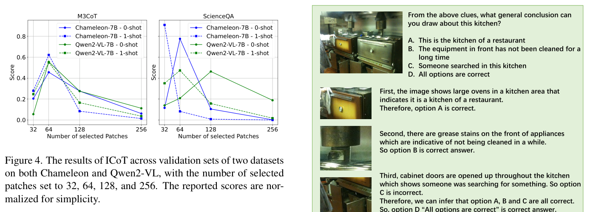

---
tags:
  - papers/visually-grounded-reasoning
  - papers/multimodal-cot
  - papers/training-free
aliases:
  - "ICoT"
  - "Interleaved-Modal Chain-of-Thought"
date: 2025-03-17
doi: 10.48550/arXiv.2411.19488
arxiv_id: 2411.19488
---

# Interleaved-Modal Chain-of-Thought

## 核心信息

- 标题: Interleaved-Modal Chain-of-Thought
- 标题翻译: 交错模态思维链
- 作者: Jun Gao, Yongqi Li, Ziqiang Cao, Wenjie Li
- 机构: Soochow University; The Hong Kong Polytechnic University
- 发表时间: 2025-03-17
- 发表渠道: arXiv
- DOI: 10.48550/arXiv.2411.19488
- arXiv: 2411.19488
- 论文链接: https://arxiv.org/abs/2411.19488
- 代码 / 项目: https://github.com/jungao1106/ICoT
- 数据 / 资源: M3CoT；ScienceQA；LLaVA-Bench In-the-Wild；Flickr30k；OKVQA
- 论文类型: AI 方法；免训练多模态思维链；测试时视觉证据插入

## 原文摘要翻译

思维链提示会诱导大语言模型在给出最终答案前生成一系列中间推理步骤。然而，当这一思想迁移到视觉语言模型时，纯文本理由很难表达与原始图像之间的细粒度关联。

本文提出一种把图像纳入中间推理过程的多模态思维链，名为 Interleaved-modal Chain-of-Thought。ICoT 生成由视觉理由和文本理由配对组成的连续推理步骤，并通过这些步骤推导最终答案。

直觉上，ICoT 要求 VLM 能生成细粒度交错模态内容，但当前 VLM 很难完整做到这一点。考虑到所需视觉信息通常已经存在于输入图像中，作者提出注意力驱动选择，在现有 VLM 上实现 ICoT。ADS 会智能地插入输入图像中的局部区域，从而生成交错模态推理步骤，并且只带来可忽略的额外时延。

ADS 只依赖 VLM 自身的注意力图，不需要新增参数，因此是一种即插即用策略，可以推广到多种 VLM。作者在两种不同架构的主流 VLM 上实现 ADS，并在三个基准上评估。结果显示，相比现有多模态思维链提示方法，ICoT 最高带来 14% 的性能提升，同时改善可解释性。

## 创新点

1. 把多模态思维链的中间步骤从“纯文本理由”升级为“视觉理由 + 文本理由”的交错序列。这样每一步推理都能显式绑定到原图局部证据。
2. 提出 ADS，将“生成细粒度视觉内容”改写为“从输入图像选择细粒度视觉证据”。这避开了现有 VLM 不能稳定生成高分辨率局部视觉内容的问题。
3. ADS 只用模型内部 attention map，不训练新参数，不需要额外视觉专家，是典型 training-free 方法。
4. 方法兼容两类 VLM：Chameleon 这类统一建模模型，以及 Qwen2-VL 这类感知器式 VLM。
5. 消融证明 ADS 和 demonstration 中的 FVI 都有贡献。去掉 ADS 或去掉 FVI 都会降低性能。
6. 论文还讨论了 KV 缓存复制这一效率变体，指出它更省计算但会损失位置敏感的交错结构。

## 一句话总结

ICoT 的关键不是让模型“更会写理由”，而是在理由生成过程中把原图局部视觉标记插回去，让下一段文本理由被具体视觉证据牵引；它是 `Reasoning` 目录里一条非常纯粹的免训练视觉证据插入路线。

## 研究问题

多模态 CoT 的常见问题是：模型虽然看了图，却在中间推理时只写文字。文字可以描述“上方”“左边”“颜色鲜艳”，但很难精确绑定到原图某个局部区域。于是中间理由看起来完整，实际却可能和错误对象、粗粒度位置或语言先验绑定。

*论文原图编号：Figure 1。左侧纯文本理由只能粗略描述位置；右侧 ICoT 把被选择的图像区域插入推理序列，使文本理由更贴近视觉证据。*

作者的核心判断是：视觉理由不一定要由模型生成，因为它通常已经在原图里。与其训练模型画出或生成一张局部图，不如直接从输入图像里选出当前推理步骤需要的图像块，并把这些视觉标记插入生成序列。

这使 ICoT 和 DeepScan 的问题意识很接近：先把证据拿出来，再让语言生成发生。区别是 DeepScan 用外部视觉专家找证据，ICoT 用 VLM 自己的注意力图找证据。

## 数据与任务定义

### 输入与输出

输入是图像、问题和 CoT prompt。普通 VLM 直接输出答案：

$$
answer = VLM(Image, Instruction).
$$

普通多模态 CoT 输出纯文本理由再输出答案：

$$
r_1, r_2, ..., answer = VLM(Prompt, Image, Instruction).
$$

ICoT 输出的是交错序列：文本理由和视觉理由交替出现，视觉理由来自原图局部视觉标记：

$$
r_1, x^v_1, r_2, x^v_2, ..., answer = VLM(Prompt, Image, Instruction).
$$

### 数据集与指标

| 基准 | 任务重点 | 指标 |
|---|---|---|
| M3CoT | 多领域、多步多模态推理，含 267 类问题 | accuracy |
| ScienceQA | 通用科学问答推理 | accuracy |
| LLaVA-W | 详细长答案，参考答案由 GPT-4V 生成 | ROUGE-L |
| Flickr30k | captioning 补充实验 | CIDEr |
| OKVQA | 一般 VQA 补充实验 | VQA accuracy |

### 模型与 baselines

作者在两种 VLM 架构上测试：

- Chameleon-7B，代表统一建模 VLM。
- Qwen2-VL-7B-Instruct，代表感知器式 VLM。

对比方法包括 No-CoT、Multimodal CoT、CCoT、DDCoT 和 SCAFFOLD。

实验包含零样本与单样本设置。单样本 ICoT 中，示例包含人工设计的细粒度视觉信息。

## 方法主线

### 机制流程

1. VLM 先按普通方式进行自回归生成；当模型生成预定义信号标记时，ADS 被触发。论文默认使用换行符作为信号标记，因为它常表示上一段理由结束和下一段理由开始。
2. ADS 提取当前信号标记对所有视觉标记的注意力图，并跨层平均，得到当前推理步骤最相关的视觉区域。
3. ADS 选择 Top-K 视觉标记，恢复它们在原图中的相对空间顺序，再与已生成文本嵌入拼接。
4. VLM 基于新的多模态上下文继续生成下一段文本理由，循环执行直到输出最终答案。

*论文原图编号：Figure 2。ADS 工作流：用信号标记的注意力从视觉标记中选出细粒度视觉信息，再插入后续生成。*

### ADS 的核心公式

触发条件为：

$$
do\ selection =
\begin{cases}
True, & predicted\ tokens[-1]=S,\\
False, & otherwise.
\end{cases}
$$

选择视觉标记：

$$
V_{selected}=\{f_v[i]\mid i\in TopK(A_t,n)\}.
$$

继续生成：

$$
next\ token = VLM(Cat(predicted\ tokens, V_{selected})).
$$

这个设计最有意思的地方是“选择而非生成”。它让 ICoT 在不具备图像生成能力的 Qwen2-VL 上也能运行，同时避免统一建模 VLM 生成低粒度、固定分辨率图像的问题。

### Algorithm 的文字转写

算法 1 的裁剪质量较差，但逻辑很简单：初始化文本嵌入和视觉标记；逐步生成标记；如果预测标记触发 ADS，就调用 ADS 从缓存视觉标记中选择局部视觉信息并插入；随后更新输入继续生成，直到停止条件满足。

算法 2 则是 ADS 本身：输入注意力图、选择数量 $n$ 和视觉标记；取注意力图的 Top-K 索引；把对应视觉标记加入集合；最后按原图相对位置恢复顺序。

## 关键结果

### 主结果与强基线

*论文原图编号：表 1。ICoT 在 Chameleon 与 Qwen2-VL 两种主干、零样本和单样本设置下均超过基线。*

Chameleon-7B 上，ICoT 的 zero-shot 结果为：

| Benchmark | ICoT | 之前最好 | 相对提升 |
|---|---:|---:|---:|
| M3CoT | 29.8 | 29.6 | 0.6% |
| ScienceQA | 51.0 | 50.2 | 1.6% |
| LLaVA-W | 25.2 | 22.1 | 14.0% |

Chameleon-7B one-shot 结果为 32.3 / 53.4 / 27.6，相对提升分别为 2.8%、4.0%、11.7%。

Qwen2-VL-7B 上，ICoT 的提升更温和但稳定。zero-shot 为 44.1 / 56.8 / 34.2，one-shot 为 46.0 / 65.4 / 35.7。LLaVA-W 仍是收益最大的数据集之一。

这说明 ICoT 更擅长改善依赖图像细节的长答案或复杂视觉推理，而不是简单题。ScienceQA 的涨点较小，也符合作者解释：这个基准相对更容易，细粒度视觉证据的重要性不如 M3CoT 和 LLaVA-W。

### 消融到底说明了什么

*论文原图编号：Table 2。去掉 ADS 或 demonstration 中的 FVI 都会降低性能。*

在 Chameleon-7B one-shot 上：

| Method | M3CoT | ScienceQA | LLaVA-W |
|---|---:|---:|---:|
| ICoT | 32.3 | 53.4 | 27.6 |
| w/o ADS | 29.2 | 52.4 | 24.5 |
| w/o FVI | 30.6 | 52.8 | 25.9 |
| w/o ADS+FVI | 29.1 | 51.0 | 23.0 |

这张表是论文最重要的支持证据之一。去掉 ADS 会退化成纯文本理由，说明测试时插入视觉证据确实重要；去掉 FVI 则说明单样本示例中的视觉理由格式也在教模型如何使用交错模态推理。

### KV-Copy：效率变体为什么略差

*论文原图编号：Table 3。KV-Copy 比直接插入视觉 patch 更省算，但性能略低。*

作者尝试把被选中视觉信息的 KV 缓存复制出来，避免重复前向计算。这个想法很自然，也和 PRCR 这类视觉缓存复用工作有相邻关系。

但 KV-Copy 略低于 ICoT：单样本下 KV-Copy 为 31.5 / 52.9 / 27.0，而 ICoT 为 32.3 / 53.4 / 27.6。作者的解释是：KV 缓存中的位置信息已经在预填充阶段融合，复制后会变成更位置无关的视觉提示，削弱“此处文本理由对应此处视觉证据”的交错结构。

### Demonstration 设计

*论文原图编号：Table 4。人工设计 demonstration 优于模型自动生成 demonstration。*

人工示例为 32.3 / 53.4 / 27.6，模型自动生成示例为 31.5 / 51.8 / 26.7。这个结果提醒我们：ICoT 的 one-shot 不是完全自动的。人工设计的视觉理由更连续、更干净；模型自动通过 ADS 生成的局部 patch 可能离散且含噪。

### patch 数量与一般任务

*论文原图编号：Figure 4。选择 patch 数量过多或过少都不好，作者报告 $n=64$ 相对更优。*

补充实验说明 patch 数量是敏感超参数。选得太多，patch 分散且噪声高；选得太少，又可能缺少必要细节。作者在 32、64、128、256 中发现 64 相对更好。

*论文原图编号：Table 5。ICoT 在 Flickr30k 与 OKVQA 上没有明显退化，并有小幅提升。*

在 Flickr30k 与 OKVQA 上，Chameleon 从 22.3 / 26.2 提升到 23.6 / 28.2。这个补充结果不是核心贡献，但能说明 ICoT 在这些弱推理任务上没有明显负迁移。

## 深度分析

### 真正贡献是什么

ICoT 的真正贡献不是“提出一个更复杂 prompt”，而是改变了中间推理的模态结构。过去多模态 CoT 虽然输入有图，但中间步骤仍是文字；ICoT 让中间步骤自己也变成多模态。

这在 reasoning 目录里很重要。很多论文都在解决长推理时视觉信息被文本链稀释的问题。ICoT 的答案是：不要只在开头看图，而是在每段理由开始前重新插入与该段理由相关的视觉标记。

### 为什么结果成立

结果成立的主要原因有三个：

1. LLaVA-W 和 M3CoT 依赖细粒度图像细节，纯文本理由容易过度概括或绑定错区域。
2. ADS 通过注意力图选择当前模型“正在关注”的视觉标记，插入后能让下一段文本理由更具体。
3. one-shot FVI demonstration 给模型示范了“先看局部，再写理由”的格式，因此比纯文本示例更有效。

Figure 3 的案例很直观：纯文本 CoT 可能把多个对象误认成同类，也可能根据语言先验过度泛化。ICoT 插入视觉证据后，文本理由更少漂移。

*论文原图编号：Figure 3。ICoT 缓解纯文本理由中的误解、过度泛化和幻觉。*

### 容易误读的地方

第一，ICoT 不是训练方法。它不更新模型参数，也不构建新数据集训练 VLM。它更像一种 decoding-time 或 prompting-time 的视觉证据插入机制。

第二，ICoT 也不是“模型自己生成视觉思考”。它实际做的是从输入图像选择 patch。这个 distinction 很重要，因为它避免了生成图像的不稳定，但也意味着方法受限于输入图像已有信息和 patch 选择质量。

第三，表 1 的涨点不能单独证明模型真的“会视觉思考”。更强证据来自表 2：去掉 ADS 后明显下降，说明插入视觉证据本身有贡献。但仍需要进一步验证后续文本是否真的使用了被插入视觉标记。

### 和其他 TrainingFree 工作的关系

ICoT、DeepScan、VisRef、PRCR 都可以放到同一条线上看：

- DeepScan 用外部视觉专家先找证据。
- ICoT 用模型自身 attention map 选证据。
- VisRef 在推理过程中重新注入视觉标记核心集。
- PRCR 从 KV 缓存层面复用视觉标记。

ICoT 的优点是最轻：不用外部模型，不训练参数。缺点是也最依赖模型内部注意力是否可靠，以及 signal token 触发是否合适。

## 局限

1. 需要访问模型内部 attention map。很多推理服务或闭源 API 不暴露这个信息，因此部署面受限。
2. 使用 eager attention 会带来工程依赖和潜在效率损失。
3. ADS 需要存储注意力分数，会增加显存开销。
4. 固定选择 patch 数量不够自适应。目标区域大、小、分散程度不同，固定 $n$ 很容易过多或过少。
5. 信号标记触发机制很脆。若换行符出现太频繁，ADS 会过度插入视觉图像块，影响回复质量。
6. one-shot 的强结果依赖人工设计 FVI demonstration，自动生成 demonstration 会下降。
7. LLaVA-W 参考答案来自 GPT-4V，评价可能带有模型偏好。
8. 论文只覆盖两个 backbone 和有限 benchmark，还不能说明所有现代 MLLM 都会受益。

## 我的笔记

这篇是 `TrainingFree` 目录里很干净的一篇：没有训练，没有外部视觉专家，没有复杂搜索。它只问一个问题：文本 CoT 的每一步到底有没有绑定到图像？如果没有，就把该步需要的原图局部视觉标记插进去。

对我后续写 reasoning paper 有两个启发：

1. 如果提出“视觉推理链”，最好不要只生成文本步骤。可以让每一步带一个视觉证据对象，比如 crop、patch、mask、token set 或 3D identity。
2. 证明视觉证据有用时，必须做 w/o visual insertion 消融。否则涨点可能只是 prompt 格式或语言分布变化。

我会把 ICoT 记成一句话：它不是让 VLM 学会新能力，而是在推理过程中反复把视觉证据“塞回上下文”，防止文本理由脱离图像。

## 引用

Gao, J., Li, Y., Cao, Z., & Li, W. Interleaved-Modal Chain-of-Thought. arXiv:2411.19488, 2025.
