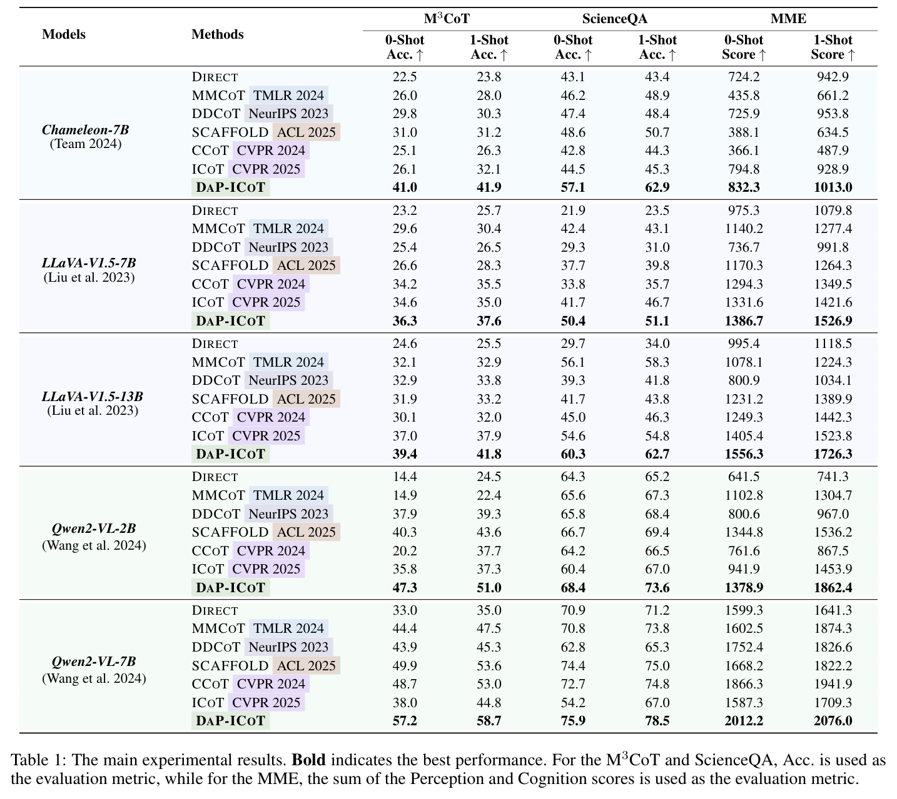
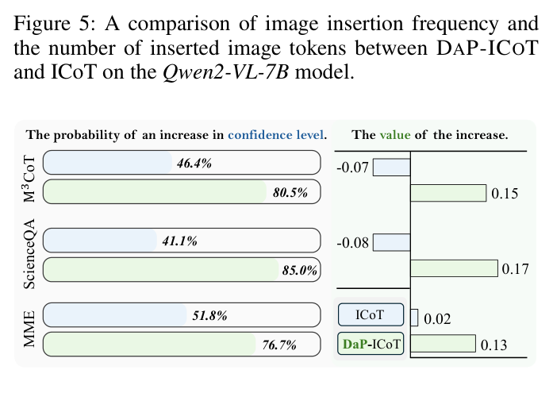
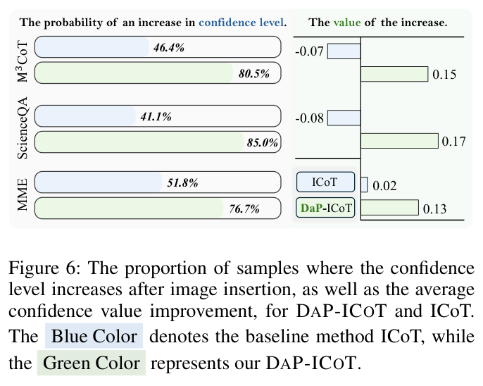

# Let's Think with Images Efficiently! An Interleaved-Modal Chain-of-Thought Reasoning Framework with Dynamic and Precise Visual Thoughts

> **中文题名：** 让我们高效地用图像思考：带有动态与精确视觉思考的交错模态思维链推理框架  
> **作者：** Xu Liu, Yongheng Zhang, Qiguang Chen, Yao Li, Sheng Wang, Libo Qin  
> **出处：** arXiv:2603.21754v1，2026-03-23  
> **论文类型：** 方法 / training-free multimodal reasoning / efficient interleaved visual CoT  
> **源文件：** `Liu 等 - 2026 - Let's Think with Images Efficiently! An Interleaved-Modal Chain-of-Thought Reasoning Framework with.pdf`  
> **阅读器：** 英中对照阅读；源格式为 `pdf-text`；图表按首次实质讨论位置重排。页码与稳定块 ID 见 `source_map.json`。

## Page / Section Index

- Abstract: page 1
- Introduction: pages 1-3
- DaP-ICoT Reasoning: pages 3-5
- Experiments and Analysis: pages 4-7
- Related Work: page 7
- Conclusion: pages 7-8
- References: pages 8-9

## Terminology Ledger

| Canonical term | 中文 | First-use decision |
|---|---|---|
| Interleaved-modal Chain-of-Thought | 交错模态思维链 | 保留 ICoT 缩写 |
| DaP-ICoT / DAP-ICOT | 动态精确视觉思考的 ICoT | 正文统一写 DaP-ICoT |
| Dynamic Visual Thought Integration | 动态视觉思考集成 | 保留 DVTI 缩写 |
| Precise Visual Thought Guidance | 精确视觉思考引导 | 保留 PVTG 缩写 |
| visual thought | 视觉思考 | 指推理中插入的视觉内容 |
| static visual thought positioning | 静态视觉思考定位 | 指每一步固定插入图像 |
| broken visual thought representation | 破碎视觉思考表示 | 指离散、不连贯的视觉标记 |
| logit margin | logit 间隔 | 用 top-1 与 top-2 logit 差估计置信度 |
| object-level selection | 对象级选择 | 由 SAM2 分割候选对象后选择 |
| token consumption | 标记消耗 | 中文正文尽量用“标记” |

## Abstract

> <strong>Para. 1:</strong> Recent ICoT reasoning methods improve multimodal reasoning by mixing visual and textual reasoning outputs, but they still insert visual information in a fixed pattern and often use fragmented visual tokens.

> <strong>Para. 1[CN]:</strong> 近期 ICoT 方法通过混合视觉与文本推理输出来提升多模态推理，但它们仍然以固定模式插入视觉信息，而且常使用破碎、不连贯的视觉标记。

> <strong>Para. 2:</strong> The paper proposes DaP-ICoT, which contains Dynamic Visual Thought Integration for deciding when visual input is needed and Precise Visual Thought Guidance for selecting semantically coherent visual content.

> <strong>Para. 2[CN]:</strong> 论文提出 DaP-ICoT。它包含两个组件：动态视觉思考集成用于判断何时需要视觉输入，精确视觉思考引导用于选择语义完整且与当前推理相关的视觉内容。

> <strong>Para. 3:</strong> Across multiple benchmarks and models, DaP-ICoT reports state-of-the-art results while reducing inserted images and cutting token consumption by 72.6%.

> <strong>Para. 3[CN]:</strong> 在多个基准和模型上，DaP-ICoT 报告了领先结果，同时减少插入图像数量，并将标记消耗降低 72.6%。

## 1. Introduction

> <strong>Para. 1:</strong> Multimodal large language models and multimodal CoT have improved reasoning over complex real-world tasks. A common limitation, however, is that the input is multimodal while the reasoning trace remains text-only.

> <strong>Para. 1[CN]:</strong> 多模态大语言模型和多模态思维链已经提升了复杂真实任务中的推理能力。但常见限制是：输入是多模态的，中间推理轨迹却仍主要是纯文本。

> <strong>Para. 2:</strong> ICoT tries to overcome this limitation by allowing the model to reason with both visual and textual outputs, so that visual thoughts can carry image information during reasoning.

> <strong>Para. 2[CN]:</strong> ICoT 试图突破这一限制，让模型在推理输出中同时使用视觉与文本内容，使视觉思考可以在推理过程中承载图像信息。

### Figure 1. 当前 ICoT 与 DaP-ICoT 的动机对比

**Caption:** Current ICoT inserts visual thoughts after each step and may use broken visual tokens; DaP-ICoT inserts visual content only when confidence is low and uses more coherent segmented visual thoughts.

**Caption[CN]:** 当前 ICoT 在每一步后插入视觉思考，且插入内容可能是破碎视觉标记；DaP-ICoT 只在置信度较低时插入视觉内容，并使用更连贯的分割视觉思考。

> <strong>Para. 3:</strong> The authors identify two problems in current ICoT: static visual thought positioning, where visual content is inserted after every textual step; and broken visual thought representation, where the inserted visual tokens are discontinuous and semantically incomplete.

> <strong>Para. 3[CN]:</strong> 作者指出当前 ICoT 的两个问题：其一是静态视觉思考定位，即每个文本推理步骤之后都插入视觉内容；其二是破碎视觉思考表示，即插入的视觉标记不连续，语义也不完整。

> <strong>Para. 4:</strong> DaP-ICoT addresses these issues by making visual insertion conditional on reasoning confidence and by selecting object-centric visual inputs that preserve semantic coherence.

> <strong>Para. 4[CN]:</strong> DaP-ICoT 的解决方式是：根据推理置信度动态决定是否插入视觉内容，并选择以对象为中心的视觉输入来保留语义连贯性。

> <strong>Para. 5:</strong> The paper positions the method as a lightweight improvement over ICoT. Its promise is not merely better accuracy, but a better balance between accuracy and visual-token cost.

> <strong>Para. 5[CN]:</strong> 论文将该方法定位为对 ICoT 的轻量改进。它的目标不只是提高准确率，更是同时改善准确率与视觉标记成本之间的平衡。

## 2. DaP-ICoT Reasoning

> <strong>Para. 1:</strong> DaP-ICoT consists of two modules. Dynamic Visual Thought Integration decides whether a new visual thought is needed, and Precise Visual Thought Guidance chooses a context-aligned object-level visual input.

> <strong>Para. 1[CN]:</strong> DaP-ICoT 由两个模块组成。动态视觉思考集成判断是否需要新的视觉思考，精确视觉思考引导选择与上下文对齐的对象级视觉输入。

### Figure 2. DaP-ICoT 总体流程

**Caption:** Overview of DaP-ICoT, including confidence-based visual insertion and object-level visual guidance.

**Caption[CN]:** DaP-ICoT 总体框架，包括基于置信度的视觉插入，以及对象级视觉引导。

### 2.1 Dynamic Visual Thought Integration

> <strong>Para. 2:</strong> For each textual rationale $T_t$, the model estimates confidence through token-level logit margins. At decoding position $i$, the local confidence is the gap between the top-1 and top-2 logits.

> <strong>Para. 2[CN]:</strong> 对每个文本理由 $T_t$，模型通过逐标记的 logit 间隔估计置信度。在解码位置 $i$，局部置信度定义为 top-1 与 top-2 logit 之间的差。

$$
\delta_i=\ell_{i,w(1)}-\ell_{i,w(2)},\quad \forall i\in\{1,\ldots,|T_t|\}.
$$

> <strong>Para. 3:</strong> The confidence of the whole rationale is the mean of these local margins:

> <strong>Para. 3[CN]:</strong> 整个理由的置信度由这些局部间隔取平均得到：

$$
C_t=\frac{1}{|T_t|}\sum_{i=1}^{|T_t|}\delta_i
=\frac{1}{|T_t|}\sum_{i=1}^{|T_t|}\left(\ell_{i,w(1)}-\ell_{i,w(2)}\right).
$$

> <strong>Para. 4:</strong> If $C_t$ is lower than the threshold $\tau$, the next reasoning step receives a visual thought. Otherwise, reasoning continues only with text.

> <strong>Para. 4[CN]:</strong> 如果 $C_t$ 低于阈值 $\tau$，下一步推理会接收一个视觉思考；否则，模型只依赖文本推理继续前进。

$$
I_{t+1}=
\begin{cases}
I_{\mathrm{vision}}, & C_t<\tau,\\
\varnothing, & \mathrm{otherwise}.
\end{cases}
$$

### 2.2 Precise Visual Thought Guidance

> <strong>Para. 5:</strong> To avoid fragmented patch-level visual thoughts, PVTG first applies SAM2 to the original image and obtains an object pool $O=\{O_1,O_2,\ldots,O_N\}$.

> <strong>Para. 5[CN]:</strong> 为了避免破碎的 patch 级视觉思考，PVTG 首先用 SAM2 分割原图，得到对象候选池 $O=\{O_1,O_2,\ldots,O_N\}$。

> <strong>Para. 6:</strong> When DVTI asks for visual input at step $t$, the method computes the relevance between the current textual rationale $T_t$ and each candidate object image $O_i$.

> <strong>Para. 6[CN]:</strong> 当 DVTI 在第 $t$ 步请求视觉输入时，方法会计算当前文本理由 $T_t$ 与每个候选对象图像 $O_i$ 的相关性。

$$
s_i=f_{\mathrm{attn}}(T_t,O_i),\qquad
\hat{O}=\arg\max_{O_i\in O}s_i.
$$

> <strong>Para. 7:</strong> The selected object image $\hat{O}$ is interleaved into the textual reasoning sequence, and the model continues the next reasoning step conditioned on the question, the interleaved sequence, and the interleaved prompt.

> <strong>Para. 7[CN]:</strong> 被选中的对象图像 $\hat{O}$ 会插入文本推理序列中，模型随后在问题、交错序列和交错提示的条件下继续生成下一步推理。

$$
R_{t\to v}=R_t\oplus\hat{O},
$$

$$
R_{t+1}=\arg\max_R P(R\mid Q,R_{t\to v},P_{t\to v}).
$$

> <strong>Para. 8:</strong> The essential design shift is from "insert something visual every time" to "insert a coherent object only when the current reasoning step appears uncertain."

> <strong>Para. 8[CN]:</strong> 这个设计的关键转变是：不再“每次都插入某些视觉内容”，而是“只有当前推理不够确定时，才插入一个连贯对象”。

## 3. Experiments and Analysis

> <strong>Para. 1:</strong> The experiments compare DaP-ICoT with Direct prompting, MMCoT, DDCoT, SCAFFOLD, CCoT, and ICoT. The authors reproduce the methods once using official open-source implementations.

> <strong>Para. 1[CN]:</strong> 实验将 DaP-ICoT 与直接提示、MMCoT、DDCoT、SCAFFOLD、CCoT 和 ICoT 比较。作者使用官方开源实现对这些方法各复现实验一次。

> <strong>Para. 2:</strong> The evaluation covers five MLLMs: Chameleon-7B, LLaVA-V1.5-7B, LLaVA-V1.5-13B, Qwen2-VL-2B, and Qwen2-VL-7B. Benchmarks include M3CoT, ScienceQA, and MME under zero-shot and one-shot settings.

> <strong>Para. 2[CN]:</strong> 评估覆盖五个 MLLM：Chameleon-7B、LLaVA-V1.5-7B、LLaVA-V1.5-13B、Qwen2-VL-2B 和 Qwen2-VL-7B。基准包括 M3CoT、ScienceQA 和 MME，并同时测试零样本与单样本设置。

> <strong>Para. 3:</strong> The confidence threshold $\tau$ is tuned on the M3CoT validation set by searching within $[0,1]$.

> <strong>Para. 3[CN]:</strong> 置信度阈值 $\tau$ 通过在 M3CoT 验证集上搜索 $[0,1]$ 范围来确定。

### Table 1. 主实验结果

**Caption:** Main results on M3CoT, ScienceQA, and MME across five MLLMs in zero-shot and one-shot settings.

**Caption[CN]:** 五个 MLLM 在 M3CoT、ScienceQA 和 MME 上的零样本与单样本主结果。

> <strong>Para. 4:</strong> Table 1 shows that DaP-ICoT is consistently competitive or best across the evaluated backbones. On Chameleon-7B, for example, its M3CoT zero-shot accuracy is 41.0, compared with 31.0 for SCAFFOLD and 26.1 for ICoT.

> <strong>Para. 4[CN]:</strong> 表 1 显示 DaP-ICoT 在被测骨干上整体稳定领先或接近最佳。例如在 Chameleon-7B 上，它的 M3CoT 零样本准确率为 41.0，而 SCAFFOLD 为 31.0，ICoT 为 26.1。

> <strong>Para. 5:</strong> On Qwen2-VL-7B, DaP-ICoT reaches 57.2 / 58.7 on M3CoT, 75.9 / 78.5 on ScienceQA, and 2012.2 / 2076.0 on MME under zero-shot / one-shot settings.

> <strong>Para. 5[CN]:</strong> 在 Qwen2-VL-7B 上，DaP-ICoT 在零样本 / 单样本设置下分别达到：M3CoT 57.2 / 58.7，ScienceQA 75.9 / 78.5，MME 2012.2 / 2076.0。

### Figure 3. 消融实验

**Caption:** Ablation on Qwen2-VL-7B: removing PVTG or DVTI sharply lowers M3CoT and ScienceQA performance.

**Caption[CN]:** Qwen2-VL-7B 上的消融：移除 PVTG 或 DVTI 都会显著降低 M3CoT 与 ScienceQA 表现。

> <strong>Para. 6:</strong> Ablations show that both modules are necessary. On Qwen2-VL-7B, DaP-ICoT scores 57.2 on M3CoT and 75.9 on ScienceQA. Without PVTG, the scores drop to 43.4 and 55.5; without DVTI, they drop to 42.8 and 55.1.

> <strong>Para. 6[CN]:</strong> 消融说明两个模块都很关键。在 Qwen2-VL-7B 上，DaP-ICoT 的 M3CoT 和 ScienceQA 分数为 57.2 与 75.9。去掉 PVTG 后下降到 43.4 与 55.5；去掉 DVTI 后下降到 42.8 与 55.1。

### Figure 4. 总标记消耗

**Caption:** On M3CoT with Qwen2-VL-7B, DaP-ICoT uses 314 average tokens, compared with 1,146 for ICoT.

**Caption[CN]:** 在 Qwen2-VL-7B 的 M3CoT 实验中，DaP-ICoT 平均使用 314 个标记，而 ICoT 使用 1,146 个。

> <strong>Para. 7:</strong> The efficiency claim is supported by token accounting. DaP-ICoT consumes 314 average tokens on M3CoT with Qwen2-VL-7B, which is 72.6% lower than ICoT's 1,146 tokens. CCoT and DDCoT consume 1,294 and 1,426 tokens respectively.

> <strong>Para. 7[CN]:</strong> 效率主张主要由标记统计支撑。在 Qwen2-VL-7B 的 M3CoT 上，DaP-ICoT 平均消耗 314 个标记，比 ICoT 的 1,146 个降低 72.6%。CCoT 和 DDCoT 分别消耗 1,294 与 1,426 个标记。

### Figure 5. 图像插入频率与图像标记消耗

**Caption:** DaP-ICoT inserts fewer images than ICoT and consumes fewer inserted image tokens.

**Caption[CN]:** DaP-ICoT 比 ICoT 插入更少图像，也消耗更少的插入图像标记。

> <strong>Para. 8:</strong> DaP-ICoT inserts about 1.2 images per sample on average, while ICoT inserts about 2.6. The paper also reports that DaP-ICoT consumes only about 26 inserted image tokens on average.

> <strong>Para. 8[CN]:</strong> DaP-ICoT 平均每个样本插入约 1.2 张图像，而 ICoT 约为 2.6 张。论文还报告 DaP-ICoT 平均只消耗约 26 个插入图像标记。

### Figure 6. 插图后的置信度变化

**Caption:** DaP-ICoT increases confidence more frequently and by a larger margin than ICoT.

**Caption[CN]:** 相比 ICoT，DaP-ICoT 更常提升置信度，且平均提升幅度更大。

> <strong>Para. 9:</strong> Confidence analysis suggests that the inserted visual content is more useful, not merely cheaper. On average, DaP-ICoT increases confidence in 80.7% of samples, while ICoT does so in 46.4% of samples.

> <strong>Para. 9[CN]:</strong> 置信度分析说明插入视觉内容不只是更便宜，也更有用。平均而言，DaP-ICoT 让 80.7% 的样本置信度提升，而 ICoT 只有 46.4%。

> <strong>Para. 10:</strong> A threshold search on Qwen2-VL-7B and M3CoT finds the best value around $\tau=0.2$, where the method obtains 57.2% zero-shot accuracy and 58.7% one-shot accuracy.

> <strong>Para. 10[CN]:</strong> 在 Qwen2-VL-7B 与 M3CoT 上进行阈值搜索后，最佳值约为 $\tau=0.2$，对应零样本准确率 57.2%，单样本准确率 58.7%。

### Figure 8. 定性案例

**Caption:** Current ICoT inserts broken visual tokens and answers incorrectly; DaP-ICoT inserts complete context-relevant visual content under low confidence and obtains the correct answer.

**Caption[CN]:** 当前 ICoT 插入破碎视觉标记并答错；DaP-ICoT 在低置信度时插入完整且相关的视觉内容，并得到正确答案。

> <strong>Para. 11:</strong> In the case study, ICoT incorrectly answers "waiting for someone" because the inserted tokens are incomplete. DaP-ICoT segments and selects a relevant object image, then answers "selling umbrellas."

> <strong>Para. 11[CN]:</strong> 在案例分析中，ICoT 因插入标记不完整而错误回答“等待某人”。DaP-ICoT 分割并选择相关对象图像，最后回答“卖伞”。

## 4. Related Work

> <strong>Para. 1:</strong> The related work situates DaP-ICoT among MLLMs, multimodal CoT, and interleaved visual-text reasoning. Prior work improves reasoning with descriptions, scene graphs, sketches, visual prompting, or attention-based region insertion.

> <strong>Para. 1[CN]:</strong> 相关工作把 DaP-ICoT 放在 MLLM、多模态思维链和视觉文本交错推理的脉络中。已有方法通过描述、场景图、草图、视觉提示或基于注意力的区域插入来增强推理。

> <strong>Para. 2:</strong> Compared with earlier ICoT methods, the paper argues that DaP-ICoT is more adaptive because it combines confidence-aware insertion with object-level visual selection.

> <strong>Para. 2[CN]:</strong> 相比早期 ICoT 方法，论文认为 DaP-ICoT 更自适应，因为它同时结合了置信度感知插入和对象级视觉选择。

## 5. Conclusion

> <strong>Para. 1:</strong> The conclusion restates that DaP-ICoT improves ICoT by adaptively integrating informative visual input and by using coherent visual representations. The reported gains cover both effectiveness and efficiency.

> <strong>Para. 1[CN]:</strong> 结论重申 DaP-ICoT 通过自适应整合有信息量的视觉输入，并使用连贯视觉表示来改进 ICoT。论文报告的收益同时覆盖效果与效率。

## References and Acknowledgments

> <strong>Para. 1:</strong> The paper acknowledges funding from NSFC, Hunan provincial programs, CCF-Zhipu Large Model Innovation Fund, and the TCCI engineering research center. The reference list covers MLLMs, multimodal CoT, ICoT, visual sketching, and segmentation tools such as SAM2.

> <strong>Para. 1[CN]:</strong> 论文致谢包括国家自然科学基金、湖南省相关项目、CCF-智谱大模型创新基金以及 TCCI 工程研究中心。参考文献覆盖 MLLM、多模态思维链、ICoT、视觉草图以及 SAM2 等分割工具。

## Critical Reading Notes

1. 这篇论文是对 ICoT 的“调度 + 表示”补丁：DVTI 解决何时插入，PVTG 解决插入什么。
2. 最硬的证据是消融和效率：去掉任一模块都会大幅掉点，且标记消耗从 ICoT 的 1,146 降到 314。
3. 阈值 $\tau$ 依赖验证集搜索，跨数据集和跨模型是否稳定仍需要更细的报告。
4. PVTG 依赖 SAM2，这让方法仍是免训练，但并不是无额外视觉工具。
5. 与 3D agent 方向的关系在于“测试时主动取证”：这里取的是对象图像，REALM/DeepScan 取的是 3D 或高分辨率视觉证据。
