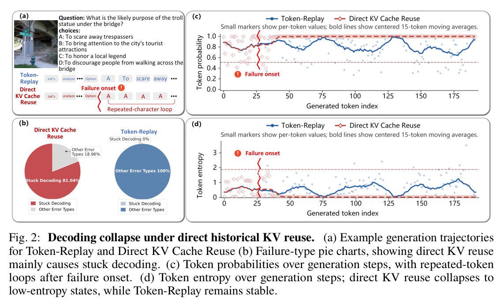
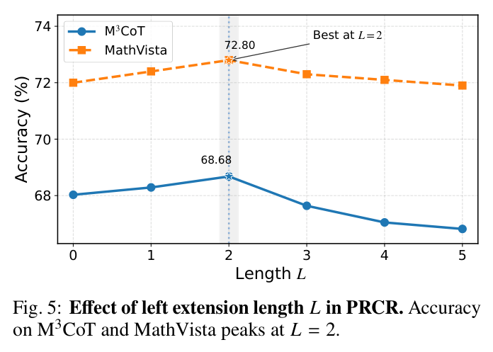
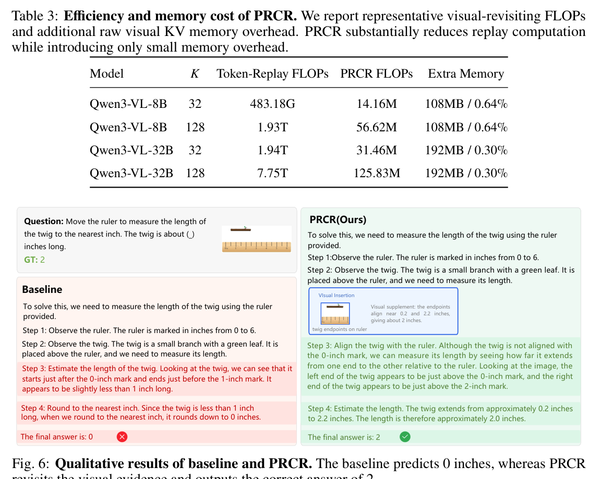
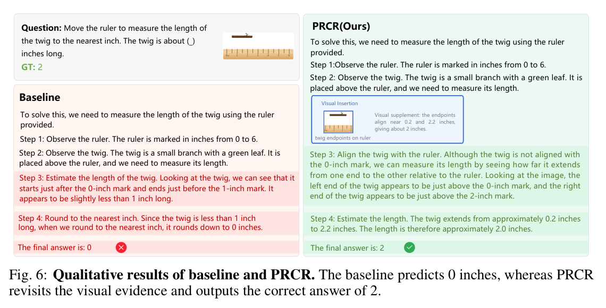

# Position Rebinding Cache Reuse: Replay-Free Visual Revisiting for Interleaved Multimodal Reasoning

> **中文题名：** 位置重绑定缓存复用：用于交错式多模态推理的免回放视觉回看  
> **作者：** Mengzhao Wang, Yanli Ji, Wangmeng Zuo, Peng Ye, Chongjun Tu  
> **出处：** arXiv:2606.26631v1，2026-06-25  
> **DOI：** 10.48550/arXiv.2606.26631  
> **论文类型：** 方法 / training-free cache reuse / interleaved multimodal reasoning  
> **源文件：** `Wang 等 - 2026 - Position Rebinding Cache Reuse Replay-Free Visual Revisiting for Interleaved Multimodal Reasoning.pdf`  
> **阅读器：** 全文英中对照；源格式为 `pdf-text`；图表按首次实质讨论位置重排。页码与稳定块 ID 见 `source_map.json`。

## Page / Section Index

- Abstract: page 1
- 1. Introduction: pages 1-4
- 2. Method: pages 4-7
- 3. Experiment: pages 7-10
- 4. Related Work: pages 10-11
- 5. Conclusion: pages 11-12
- References: pages 12-14

## Terminology Ledger

| Canonical term | 中文 | First-use decision |
|---|---|---|
| Position Rebinding Cache Reuse (PRCR) | 位置重绑定缓存复用 | 保留 PRCR 缩写 |
| replay-free visual revisiting | 免回放视觉回看 | 不重新 forward 视觉 token |
| Token-Replay | 标记回放 | 重新前向选中的视觉 token |
| Direct KV Cache Reuse | 直接 KV 缓存复用 | 不重绑位置的朴素复用 |
| Rotary Position Embedding (RoPE) | 旋转位置编码 | 保留 RoPE 缩写 |
| Raw Visual Evidence Memory (RVEM) | 原始视觉证据记忆 | 存 pre-RoPE K/V |
| Position-Constrained Rebinding (PCR) | 位置约束重绑定 | PRCR 的最佳重插入策略 |
| stuck decoding loop | 卡死式解码循环 | 重复 token 或熵异常导致的崩溃 |

## Abstract

> <strong>Para. 1:</strong> Interleaved multimodal reasoning improves visual grounding by revisiting visual evidence during chain-of-thought generation, but existing methods repeatedly replay visual tokens, causing large computational overhead.

> <strong>Para. 1[CN]:</strong> 交错式多模态推理通过在思维链生成过程中反复回看视觉证据来改善视觉落地，但现有方法通常反复回放视觉标记，带来很高计算开销。

> <strong>Para. 2:</strong> A seemingly natural shortcut is to reuse historical visual KV cache directly. However, direct reuse fails because cached visual keys are tied to their original positional context.

> <strong>Para. 2[CN]:</strong> 一个看似自然的捷径是直接复用历史视觉 KV 缓存。但直接复用会失败，因为缓存视觉键已经和原始位置上下文绑定。

> <strong>Para. 3:</strong> The paper proposes PRCR, which stores raw pre-RoPE visual key/value projections during multimodal prefill, reassigns positions for selected visual evidence, rebuilds compatible visual cache entries, and injects them into the current decoder cache.

> <strong>Para. 3[CN]:</strong> 论文提出 PRCR：在多模态预填充阶段存储 RoPE 之前的原始视觉键值投影；在后续需要视觉证据时为选中条目重新分配位置；再构造兼容的视觉缓存并注入当前解码缓存。

> <strong>Para. 4:</strong> Experiments show that PRCR matches or slightly improves Token-Replay accuracy while greatly reducing visual revisiting FLOPs and avoiding the decoding collapse caused by direct reuse.

> <strong>Para. 4[CN]:</strong> 实验表明，PRCR 达到或略高于标记回放的准确率，同时显著降低视觉回看 FLOPs，并避免直接复用导致的解码崩溃。

## 1. Introduction

> <strong>Para. 1:</strong> Multimodal chain-of-thought often needs to revisit image evidence. In interleaved reasoning, the model alternates between text reasoning steps and visual evidence insertions.

> <strong>Para. 1[CN]:</strong> 多模态思维链经常需要回看图像证据。在交错式推理中，模型会在文本推理步骤和视觉证据插入之间交替。

> <strong>Para. 2:</strong> Token-Replay solves the evidence problem by forwarding selected visual tokens again at later reasoning steps. This is effective but expensive because visual tokens are repeatedly processed through the model.

> <strong>Para. 2[CN]:</strong> 标记回放通过在后续推理步骤重新前向选中的视觉标记来解决证据问题。这种方式有效，但代价高，因为视觉标记会被模型反复处理。

### Figure 1. Motivation and Efficiency

**Caption:** Direct KV reuse collapses, Token-Replay is accurate but expensive, and PRCR keeps accuracy while sharply reducing visual revisiting FLOPs.

**Caption[CN]:** 直接 KV 复用会崩，标记回放准确但昂贵，PRCR 保持准确率并大幅降低视觉回看 FLOPs。

> <strong>Para. 3:</strong> The paper tests the direct-cache shortcut and finds it is not a harmless optimization. On M3CoT, direct KV reuse reduces overall accuracy from 66.4% to 23.5%.

> <strong>Para. 3[CN]:</strong> 论文测试了直接缓存捷径，发现它不是无害优化。在 M3CoT 上，直接 KV 复用把整体准确率从 66.4% 降到 23.5%。

> <strong>Para. 4:</strong> The failure is visible in decoding behavior. Direct KV reuse often falls into repeated-token loops and low-entropy states, while Token-Replay remains stable.

> <strong>Para. 4[CN]:</strong> 失败在解码行为中很明显。直接 KV 复用常陷入重复标记循环和低熵状态，而标记回放保持稳定。

### Figure 2. Decoding Collapse

**Caption:** Direct historical KV reuse can trigger repeated characters, stuck loops, and abnormal probability or entropy trajectories.

**Caption[CN]:** 直接历史 KV 复用会触发重复字符、卡死循环，以及异常的概率或熵轨迹。

> <strong>Para. 5:</strong> The reason is positional binding. In RoPE-based transformers, visual keys are stored after being rotated with their original positions, so reusing them later places old relative positions into a new decoding context.

> <strong>Para. 5[CN]:</strong> 原因是位置绑定。在基于 RoPE 的 transformer 中，视觉键以原始位置旋转后被存储；后续直接复用时，旧相对位置会进入新的解码上下文。

> <strong>Para. 6:</strong> PRCR therefore aims to keep the computational benefit of cache reuse while repairing positional compatibility before reinsertion.

> <strong>Para. 6[CN]:</strong> 因此，PRCR 的目标是在保留缓存复用计算优势的同时，在重插入前修复位置兼容性。

## 2. Method

> <strong>Para. 1:</strong> Standard multimodal CoT can be written as a sequence of text reasoning steps followed by an answer: $S_{\mathrm{text}}=\{r_1,\ldots,r_N,a\}$.

> <strong>Para. 1[CN]:</strong> 标准多模态 CoT 可以写成一串文本推理步骤后接答案：$S_{\mathrm{text}}=\{r_1,\ldots,r_N,a\}$。

> <strong>Para. 2:</strong> Interleaved multimodal reasoning inserts visual evidence between reasoning steps: $S_{\mathrm{interleaved}}=\{r_1,e_1,r_2,e_2,\ldots,r_N,e_N,a\}$.

> <strong>Para. 2[CN]:</strong> 交错式多模态推理会在推理步骤之间插入视觉证据：$S_{\mathrm{interleaved}}=\{r_1,e_1,r_2,e_2,\ldots,r_N,e_N,a\}$。

> <strong>Para. 3:</strong> At step $\tau$, a visual selection policy chooses an index set $\mathcal{I}_\tau$ and retrieves evidence $e_\tau$. PRCR does not focus on how the set is selected; it focuses on how selected evidence can be reinserted without replay.

> <strong>Para. 3[CN]:</strong> 在步骤 $\tau$，视觉选择策略会选择索引集合 $\mathcal{I}_\tau$ 并取回证据 $e_\tau$。PRCR 不重点讨论如何选择集合，而是解决选中证据如何免回放重插入。

> <strong>Para. 4:</strong> In a RoPE-based model, a raw visual key $k^{\mathrm{raw}}_m$ at position $p_m$ is cached as a rotated key:

> <strong>Para. 4[CN]:</strong> 在基于 RoPE 的模型中，位置 $p_m$ 上的原始视觉键 $k^{\mathrm{raw}}_m$ 会以旋转后的形式进入缓存：

$$
\widetilde{k}_m=\mathrm{RoPE}(k^{\mathrm{raw}}_m,p_m).
$$

> <strong>Para. 5:</strong> If this stale key is reused at a later text position $p^\tau_{\mathrm{text}}$, the attention score is computed with the wrong relative offset. This distorts attention and can destabilize autoregressive decoding.

> <strong>Para. 5[CN]:</strong> 如果这个过期键在后续文本位置 $p^\tau_{\mathrm{text}}$ 被复用，注意力分数会使用错误的相对偏移。这会扰乱注意力，并可能破坏自回归解码稳定性。

### Figure 3. Attention Perturbation

**Caption:** Direct reuse changes the attention context after insertion because old visual keys are not compatible with the current position.

**Caption[CN]:** 直接复用会改变插入后的注意力上下文，因为旧视觉键与当前位置不兼容。

### Figure 4. PRCR Overview

**Caption:** PRCR stores raw visual K/V, reassigns compatible positions, rebuilds visual cache, and injects it into the active decoder cache.

**Caption[CN]:** PRCR 存储原始视觉 K/V，重新分配兼容位置，重建视觉缓存，并注入当前解码缓存。

> <strong>Para. 6:</strong> The first component is Raw Visual Evidence Memory. During multimodal prefill, PRCR stores layer-wise raw visual key and value projections before RoPE is applied:

> <strong>Para. 6[CN]:</strong> 第一个组件是原始视觉证据记忆。在多模态预填充阶段，PRCR 存储每层 RoPE 之前的原始视觉键值投影：

$$
k^{\mathrm{raw}}_{m,l}=W^K_lh_{m,l},\quad v^{\mathrm{raw}}_{m,l}=W^V_lh_{m,l}.
$$

> <strong>Para. 7:</strong> The memory is organized as raw K/V entries plus the original spatial coordinates: $\mathcal{M}=\{(\{k^{\mathrm{raw}}_{m,l},v^{\mathrm{raw}}_{m,l}\}_l,p_m)\}_{m=1}^M$.

> <strong>Para. 7[CN]:</strong> 记忆由原始 K/V 条目和原始空间坐标组成：$\mathcal{M}=\{(\{k^{\mathrm{raw}}_{m,l},v^{\mathrm{raw}}_{m,l}\}_l,p_m)\}_{m=1}^M$。

> <strong>Para. 8:</strong> The second component is position reassignment. PRCR compares several strategies and ultimately uses Position-Constrained Rebinding, which preserves visual spatial continuity while assigning positions near the current decoding context.

> <strong>Para. 8[CN]:</strong> 第二个组件是位置重分配。PRCR 比较多种策略，最终使用位置约束重绑定：它保留视觉空间连续性，同时把位置分配到当前解码上下文附近。

> <strong>Para. 9:</strong> For each selected coordinate axis $a\in\{h,w\}$, PCR normalizes the selected positions:

> <strong>Para. 9[CN]:</strong> 对每个被选坐标轴 $a\in\{h,w\}$，PCR 先归一化被选位置：

$$
u^{(a)}_{\tau,j}=
\frac{p^{(a)}_{m_j}-p^{(a)}_{\tau,\min}}
{p^{(a)}_{\tau,\max}-p^{(a)}_{\tau,\min}}.
$$

> <strong>Para. 10:</strong> It then maps them into a left-extension interval before the next text token:

> <strong>Para. 10[CN]:</strong> 然后，PCR 把这些位置映射到下一个文本标记之前的左扩展区间：

$$
\hat{p}^{(a)}_{\tau,j}=
(p^\tau_{\mathrm{text}}-L)+
(L+1)\frac{1+(K_\tau-1)u^{(a)}_{\tau,j}}{K_\tau+1}.
$$

> <strong>Para. 11:</strong> The third component is replay-free cache decoding. PRCR applies RoPE to the raw visual keys using the reassigned positions, reuses raw values, concatenates the reconstructed visual cache with the active decoder cache, and continues decoding.

> <strong>Para. 11[CN]:</strong> 第三个组件是免回放缓存解码。PRCR 用重新分配的位置对原始视觉键施加 RoPE，复用原始值，把重建视觉缓存与当前解码缓存拼接，然后继续生成。

> [!figure] Algorithm 1. PRCR procedure
> 建议位置: `2. Method / Replay-free cache decoding`  
> 放置原因: 该算法概括 PRCR 的执行顺序。  
> 当前状态: 自动裁剪图很小，正文以步骤复述：预填充时写入 RVEM；每个回看步骤选择视觉条目；按 PCR 重分配位置；重建 RoPE 后的视觉 key；拼接视觉 cache 与当前 decoder cache；继续自回归解码。

## 3. Experiment

> <strong>Para. 1:</strong> The paper evaluates Qwen3-VL-8B/32B-Instruct and InternVL3.5-8B/14B on M3CoT, MathVista, MMStar, and MMMU.

> <strong>Para. 1[CN]:</strong> 论文在 Qwen3-VL-8B/32B-Instruct 和 InternVL3.5-8B/14B 上评测 M3CoT、MathVista、MMStar 与 MMMU。

> <strong>Para. 2:</strong> The compared methods are a baseline without visual revisiting, Token-Replay, Direct KV Reuse, and PRCR variants with different position reassignment strategies.

> <strong>Para. 2[CN]:</strong> 对比方法包括无视觉回看的基线、标记回放、直接 KV 复用，以及采用不同位置重分配策略的 PRCR 变体。

### Table 1. Quantitative Results

**Caption:** PRCR generally matches or slightly exceeds Token-Replay across backbones and benchmarks.

**Caption[CN]:** PRCR 在多个 backbone 和基准上基本达到或略高于标记回放。

> <strong>Para. 3:</strong> On Qwen3-VL-8B, PRCR reaches 68.68 on M3CoT ALL, 72.80 on MathVista, 68.96 on MMStar, and 60.07 on MMMU.

> <strong>Para. 3[CN]:</strong> 在 Qwen3-VL-8B 上，PRCR 在 M3CoT ALL 上达到 68.68，在 MathVista 上达到 72.80，在 MMStar 上达到 68.96，在 MMMU 上达到 60.07。

> <strong>Para. 4:</strong> On Qwen3-VL-32B, PRCR reaches 76.86 on M3CoT ALL, 79.20 on MathVista, 73.91 on MMStar, and 64.89 on MMMU.

> <strong>Para. 4[CN]:</strong> 在 Qwen3-VL-32B 上，PRCR 在 M3CoT ALL 上达到 76.86，在 MathVista 上达到 79.20，在 MMStar 上达到 73.91，在 MMMU 上达到 64.89。

> <strong>Para. 5:</strong> The key pattern is that PRCR is not merely faster than Token-Replay; it preserves the reasoning benefit of visual revisiting.

> <strong>Para. 5[CN]:</strong> 关键模式是，PRCR 不只是比标记回放更快；它也保留了视觉回看带来的推理收益。

### Table 2. Position Reinsertion Strategies

**Caption:** Direct reuse collapses; PCR gives the best M3CoT accuracy with zero stuck rate.

**Caption[CN]:** 直接复用会崩溃；PCR 在 M3CoT 上准确率最高且卡死率为零。

> <strong>Para. 6:</strong> Direct KV Reuse obtains only 23.50 accuracy and an 81.04 stuck rate. This is the strongest empirical evidence that naive cache reuse is unsafe.

> <strong>Para. 6[CN]:</strong> 直接 KV 复用只有 23.50 准确率，卡死率为 81.04。这是朴素缓存复用不安全的最强经验证据。

> <strong>Para. 7:</strong> PRCR with LPA improves to 63.03 but still has a 7.93 stuck rate. PRCR with UIR reaches 67.45 and zero stuck rate. PRCR with PCR reaches 68.68 and zero stuck rate.

> <strong>Para. 7[CN]:</strong> PRCR 使用 LPA 时提升到 63.03，但仍有 7.93 的卡死率。使用 UIR 时达到 67.45 且卡死率为零。使用 PCR 时达到 68.68 且卡死率为零。

### Figure 5. Left Extension Length

**Caption:** M3CoT and MathVista both peak at left extension length $L=2$.

**Caption[CN]:** M3CoT 和 MathVista 在左扩展长度 $L=2$ 时都达到峰值。

### Table 3. Efficiency and Memory

**Caption:** PRCR reduces visual-revisiting FLOPs by orders of magnitude with small additional memory overhead.

**Caption[CN]:** PRCR 以较小额外内存开销，把视觉回看 FLOPs 降低多个数量级。

| Model | K | Token-Replay FLOPs | PRCR FLOPs | Extra Memory |
|---|---:|---:|---:|---:|
| Qwen3-VL-8B | 32 | 483.18G | 14.16M | 108MB / 0.64% |
| Qwen3-VL-8B | 128 | 1.93T | 56.62M | 108MB / 0.64% |
| Qwen3-VL-32B | 32 | 1.94T | 31.46M | 192MB / 0.30% |
| Qwen3-VL-32B | 128 | 7.75T | 125.83M | 192MB / 0.30% |

> <strong>Para. 8:</strong> In the largest reported setting, Qwen3-VL-32B with K=128, PRCR reduces visual-revisiting compute from 7.75T FLOPs to 125.83M FLOPs.

> <strong>Para. 8[CN]:</strong> 在报告的最大设置 Qwen3-VL-32B 且 K=128 中，PRCR 将视觉回看计算从 7.75T FLOPs 降到 125.83M FLOPs。

### Qualitative Analysis

**Caption:** In the ruler example, the baseline predicts 0, while PRCR revisits the ruler endpoints and answers 2.

**Caption[CN]:** 在尺子例子中，基线预测 0，而 PRCR 回看尺子端点并回答 2。

**Caption:** After PRCR insertion, next-token probability rises and entropy falls, indicating more stable decoding.

**Caption[CN]:** PRCR 插入后，下一个标记概率上升、熵下降，说明解码更稳定。

**Caption:** PRCR obtains cleaner attention over reconstructed visual cache than Token-Replay over inserted visual tokens.

**Caption[CN]:** 相比标记回放对插入视觉标记的注意力，PRCR 在重建视觉缓存上的注意力更干净。

## 4. Related Work

> <strong>Para. 1:</strong> Related work spans multimodal chain-of-thought, visual grounding, interleaved visual reasoning, and efficient inference for large multimodal models.

> <strong>Para. 1[CN]:</strong> 相关工作覆盖多模态思维链、视觉落地、交错式视觉推理，以及大规模多模态模型的高效推理。

> <strong>Para. 2:</strong> PRCR is closest to methods that insert or revisit visual evidence during reasoning, but it addresses a different layer of the problem: how to reuse evidence without recomputing it.

> <strong>Para. 2[CN]:</strong> PRCR 最接近在推理中插入或回看视觉证据的方法，但它处理的是问题的另一个层次：如何在不重算的情况下复用证据。

## 5. Conclusion

> <strong>Para. 1:</strong> The paper concludes that replay-free visual revisiting is possible if visual evidence is stored before positional binding and reinserted after position rebinding.

> <strong>Para. 1[CN]:</strong> 论文结论认为，只要视觉证据在位置绑定前被存储，并在位置重绑定后插入，就可以实现免回放视觉回看。

> <strong>Para. 2:</strong> The main limitation is that PRCR relies on prefill-phase visual K/V. If visual revisiting requires local zoom, scaling, or dynamic-resolution re-encoding, no matching prefilled cache exists to reuse.

> <strong>Para. 2[CN]:</strong> 主要限制是 PRCR 依赖预填充阶段已有的视觉 K/V。如果视觉回看需要局部放大、尺度变化或动态分辨率重新编码，就不存在可复用的匹配预填充缓存。

> <strong>Para. 3:</strong> The authors suggest future work on multi-scale KV prefill and learned scale-aware rebinding.

> <strong>Para. 3[CN]:</strong> 作者提出未来方向：多尺度 KV 预填充，以及学习式尺度感知重绑定。

## References

> <strong>Para. 1:</strong> The references cover multimodal chain-of-thought, visual grounding, efficient attention and cache reuse, RoPE, and recent multimodal reasoning benchmarks.

> <strong>Para. 1[CN]:</strong> 参考文献覆盖多模态思维链、视觉落地、高效注意力与缓存复用、RoPE，以及近期多模态推理基准。
