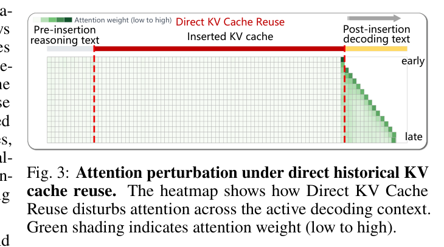
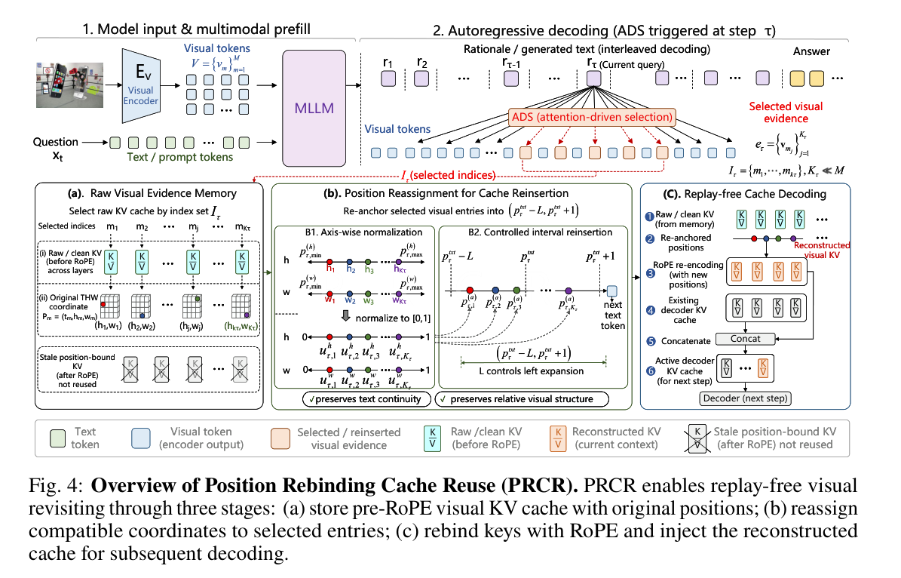
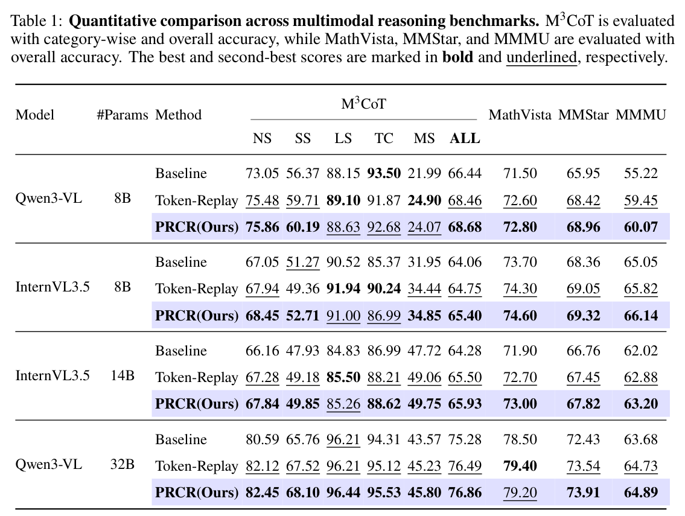
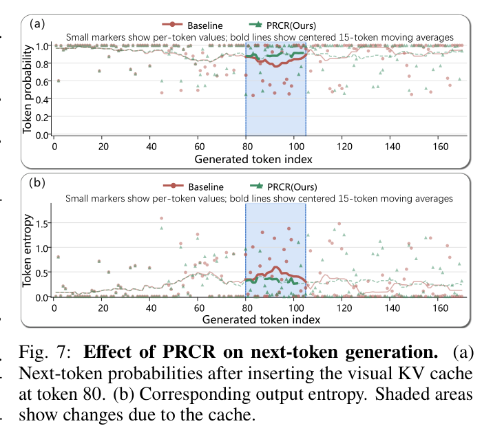
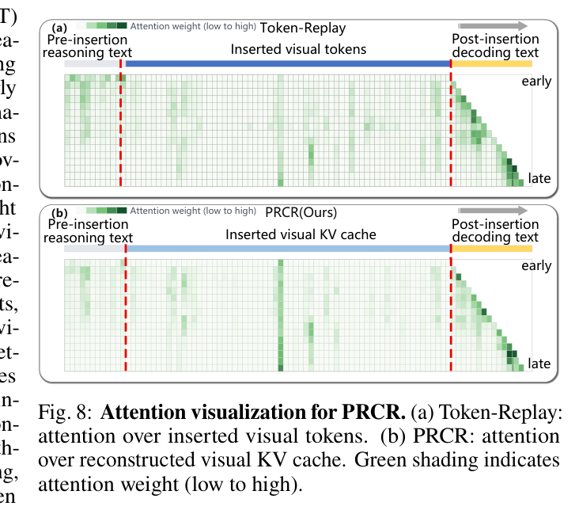

---
tags:
  - papers/visually-grounded-reasoning
  - papers/efficient-inference
  - papers/training-free
aliases:
  - "PRCR"
  - "Position Rebinding Cache Reuse"
date: 2026-06-25
doi: 10.48550/arXiv.2606.26631
arxiv_id: 2606.26631
---

# Position Rebinding Cache Reuse: Replay-Free Visual Revisiting for Interleaved Multimodal Reasoning

## 核心信息

- 标题: Position Rebinding Cache Reuse: Replay-Free Visual Revisiting for Interleaved Multimodal Reasoning
- 标题翻译: 位置重绑定缓存复用：用于交错式多模态推理的免回放视觉回看
- 作者: Mengzhao Wang, Yanli Ji, Wangmeng Zuo, Peng Ye, Chongjun Tu
- 机构: Sun Yat-sen University; Shenzhen Loop Area Institute; Harbin Institute of Technology; Fudan University; Shanghai AI Laboratory; The Chinese University of Hong Kong
- 发表时间: 2026-06-25
- 发表渠道: arXiv
- DOI: 10.48550/arXiv.2606.26631
- arXiv: 2606.26631
- 论文链接: http://arxiv.org/abs/2606.26631
- 代码 / 项目: 未公开
- 数据 / 资源: M3CoT；MathVista；MMStar；MMMU；Qwen3-VL-8B/32B-Instruct；InternVL3.5-8B/14B
- 论文类型: AI 方法；免训练缓存复用；交错式多模态推理；高效视觉回看

## 原文摘要翻译

交错式多模态推理通过在思维链过程中回看视觉证据，改善模型的视觉落地能力。但已有方法通常要把选中的视觉标记再次送进模型，也就是标记回放。这种方式虽然有效，却会让每次视觉回看都付出额外前向计算。

直接复用历史视觉 KV 缓存看起来是最自然的省算力方案，但论文发现它会严重失败。原因是缓存中的视觉键已经带有原始 RoPE 位置绑定，后续解码时直接插入会把旧相对位置放进新上下文，扰乱注意力并诱发重复标记解码循环。

PRCR 的解决思路是：预填充阶段保存 RoPE 之前的原始视觉 K/V 和空间坐标；需要回看时，先给选中的视觉证据重新分配与当前解码兼容的位置；再用新位置重建视觉缓存并拼接到当前解码器缓存中。这样可以保留视觉回看的收益，同时避免重复回放视觉标记。

## 创新点

1. 论文不是只说缓存复用快，而是首先证明了“直接复用会崩”。M3CoT 上直接 KV 复用从 66.44 降到 23.50，卡死率 81.04。
2. 它把崩溃机制定位到 RoPE 位置绑定：视觉键存入缓存时已经绑定旧位置，后续直接复用会产生错误相对偏移。
3. PRCR 存 RoPE 前的原始视觉 K/V，而不是只存已经旋转的位置化键。这使得后续重绑定成为可能。
4. PCR 不是随便插位置，而是在当前文本位置左侧开一个受约束区间，并保留选中视觉条目的相对空间结构。
5. 方法把视觉回看从“重新前向视觉标记”改成“重建缓存条目”，系统意义很强。
6. 它给 `TrainingFree` 线补了一个系统层拼图：前面的 ICoT、DaP-ICoT、VisRef 关注回看什么，PRCR 关注怎样低成本回看。

## 一句话总结

PRCR 的核心是：不要直接拿旧视觉 KV 缓存硬塞进新上下文，而是保存未绑定位置的原始视觉 K/V，回看时重新绑定到当前解码位置，再免回放注入缓存。

## 研究问题

交错式多模态推理的动机很自然：模型在长推理中会忘图，所以每隔几步把关键视觉证据插回来。但系统上它有一个硬成本：每次插入视觉证据，都要重新前向视觉标记。

标记回放的优势是稳定，缺点是贵。直接 KV 复用的优势是便宜，缺点是会崩。PRCR 试图拿到两者优点：像标记回放一样稳定，像缓存复用一样省算力。

*论文原图编号：Figure 1。直接 KV 复用在 M3CoT 上崩溃，PRCR 接近或超过标记回放，并大幅降低视觉回看 FLOPs。*

*论文原图编号：Figure 2。直接历史 KV 复用导致重复字符、卡死循环、概率和熵异常。*

最关键的问题是：为什么旧视觉缓存明明来自同一张图，却不能直接复用？答案是位置。视觉键在 RoPE 后已经不是“纯视觉内容”，而是“视觉内容 + 原始位置绑定”的混合表示。

## 数据与任务定义

标准多模态 CoT 可以写作：

$$
S_{\mathrm{text}}=\{r_1,\ldots,r_N,a\}.
$$

交错式多模态推理则写作：

$$
S_{\mathrm{interleaved}}=\{r_1,e_1,r_2,e_2,\ldots,r_N,e_N,a\}.
$$

其中 $r_i$ 是文本推理步骤，$e_i$ 是插入的视觉证据。PRCR 不重点解决“选择哪块视觉证据”，而是假定某个选择策略已经给出索引集合 $\mathcal{I}_\tau$，然后解决“怎样把这些视觉证据低成本、安全地插回当前解码上下文”。

实验使用四个基准。

| 基准 | 评测重点 |
|---|---|
| M3CoT | 多类别多模态 CoT 推理 |
| MathVista | 视觉数学与图表推理 |
| MMStar | 视觉依赖的综合多模态能力 |
| MMMU | 大学级多学科多模态理解 |

模型包括 Qwen3-VL-8B/32B-Instruct 与 InternVL3.5 系列。

对比方法包括基线、标记回放、直接 KV 复用，以及 PRCR 的不同位置重插入策略。

## 方法主线

### 直接复用为什么错

在 RoPE 模型中，原始视觉键经过位置旋转后存入缓存：

$$
\widetilde{k}_m=\mathrm{RoPE}(k^{\mathrm{raw}}_m,p_m).
$$

如果后续在文本位置 $p^\tau_{\mathrm{text}}$ 附近直接复用 $\widetilde{k}_m$，注意力会使用旧视觉位置和新文本位置之间不匹配的相对偏移。这样插入的不是“同一视觉证据”，而是带错位置关系的证据。

*论文原图编号：Figure 3。直接历史 KV 复用会扰乱插入后的注意力上下文。*

### 机制流程

1. 在多模态预填充阶段保存未经过位置旋转的原始视觉键值和空间坐标。
2. 当后续推理步骤需要回看视觉证据时，把选中条目重新分配到当前解码位置附近，并保留相对空间结构。
3. 用新位置重建视觉键，复用原始值，拼接到当前解码器缓存后继续生成。

*论文原图编号：Figure 4。PRCR 包含 RVEM、位置重分配、免回放缓存解码三阶段。*

第一阶段是原始视觉证据记忆。预填充阶段，对每层视觉标记存储 RoPE 之前的键和值：

$$
k^{\mathrm{raw}}_{m,l}=W^K_lh_{m,l},\quad v^{\mathrm{raw}}_{m,l}=W^V_lh_{m,l}.
$$

记忆形式为：

$$
\mathcal{M}=\{(\{k^{\mathrm{raw}}_{m,l},v^{\mathrm{raw}}_{m,l}\}_l,p_m)\}_{m=1}^{M}.
$$

第二阶段是位置重分配。论文比较 LPA、UIR 和 PCR。PCR 的核心是：在当前文本位置左侧开一个长度为 $L$ 的区间，同时按原视觉坐标的归一化相对关系摆放选中的视觉条目。

对高度或宽度坐标轴，先归一化：

$$
u^{(a)}_{\tau,j}=
\frac{p^{(a)}_{m_j}-p^{(a)}_{\tau,\min}}
{p^{(a)}_{\tau,\max}-p^{(a)}_{\tau,\min}}.
$$

再重分配位置：

$$
\hat{p}^{(a)}_{\tau,j}=
(p^\tau_{\mathrm{text}}-L)+
(L+1)\frac{1+(K_\tau-1)u^{(a)}_{\tau,j}}{K_\tau+1}.
$$

第三阶段是免回放缓存解码。PRCR 用 $\hat{p}$ 对原始视觉键重新施加 RoPE，值直接复用原始投影，然后把重建的视觉缓存拼到当前解码器缓存前，继续自回归生成。

> [!figure] Algorithm 1. PRCR procedure
> 建议位置：`方法主线 / 机制流程`  
> 放置原因：算法总结了预填充存储、视觉条目选择、位置重绑定、缓存拼接和继续解码。  
> 当前状态：图像裁剪较小；正文已把步骤展开为文字。

## 关键结果

### 主结果

*论文原图编号：Table 1。PRCR 在四个主干模型和四个基准上基本追平或略超标记回放。*

| Model | Method | M3CoT ALL | MathVista | MMStar | MMMU |
|---|---|---:|---:|---:|---:|
| Qwen3-VL-8B | 基线 | 66.44 | 71.50 | 65.95 | 55.22 |
| Qwen3-VL-8B | 标记回放 | 68.46 | 72.60 | 68.42 | 59.45 |
| Qwen3-VL-8B | PRCR | 68.68 | 72.80 | 68.96 | 60.07 |
| InternVL3.5-8B | 基线 | 64.06 | 73.70 | 68.36 | 65.05 |
| InternVL3.5-8B | 标记回放 | 64.75 | 74.30 | 69.05 | 65.82 |
| InternVL3.5-8B | PRCR | 65.40 | 74.60 | 69.32 | 66.14 |
| InternVL3.5-14B | 基线 | 64.28 | 71.90 | 66.76 | 62.02 |
| InternVL3.5-14B | 标记回放 | 65.50 | 72.70 | 67.45 | 62.88 |
| InternVL3.5-14B | PRCR | 65.93 | 73.00 | 67.82 | 63.20 |
| Qwen3-VL-32B | 基线 | 75.28 | 78.50 | 72.43 | 63.68 |
| Qwen3-VL-32B | 标记回放 | 76.49 | 79.40 | 73.54 | 64.73 |
| Qwen3-VL-32B | PRCR | 76.86 | 79.20 | 73.91 | 64.89 |

PRCR 的主结果不是大幅超过标记回放，而是在几乎不牺牲准确率的情况下，把回看视觉证据的计算模式换掉。它在多数列中略高于标记回放，说明位置重绑定后的缓存证据不只是便宜，也足够有效。

### 位置策略消融

*论文原图编号：Table 2。直接 KV 复用崩溃；PCR 准确率最高且卡死率为零。*

| Method | Raw Visual KV Cache | Position Rebinding | Relative Positions | Accuracy | Stuck Rate |
|---|---|---|---|---:|---:|
| 直接 KV 复用 | no | no | no | 23.50 | 81.04 |
| PRCR w/ LPA | yes | yes | no | 63.03 | 7.93 |
| PRCR w/ UIR | yes | yes | no | 67.45 | 0.00 |
| PRCR w/ PCR | yes | yes | yes | 68.68 | 0.00 |

这张表是全篇最有说服力的机制证据。直接 KV 复用几乎不可用，LPA 能救回一部分但仍会卡死，UIR 消除了卡死，而 PCR 进一步保留相对视觉位置，因此准确率最高。

*论文原图编号：Figure 5。左扩展长度 $L=2$ 在 M3CoT 和 MathVista 上表现最佳。*

### 效率

*论文原图编号：Table 3。PRCR 的额外内存很小，但视觉回看 FLOPs 降低多个数量级。*

| Model | K | Token-Replay FLOPs | PRCR FLOPs | Extra Memory |
|---|---:|---:|---:|---:|
| Qwen3-VL-8B | 32 | 483.18G | 14.16M | 108MB / 0.64% |
| Qwen3-VL-8B | 128 | 1.93T | 56.62M | 108MB / 0.64% |
| Qwen3-VL-32B | 32 | 1.94T | 31.46M | 192MB / 0.30% |
| Qwen3-VL-32B | 128 | 7.75T | 125.83M | 192MB / 0.30% |

如果看系统价值，表 3 比表 1 更关键。PRCR 在 32B、K=128 时把视觉回看从 7.75T FLOPs 降到 125.83M FLOPs。额外内存为 192MB，只占 0.30%。

### 定性分析

*论文原图编号：Figure 6。尺子和树枝例子中，基线回答 0，PRCR 回看端点后回答 2。*

*论文原图编号：Figure 7。PRCR 插入视觉缓存后，下一个标记概率上升、输出熵下降。*

*论文原图编号：Figure 8。PRCR 的重建视觉缓存注意力比标记回放更稳定、更少噪声。*

这些图的价值是把“缓存重建”从系统优化拉回到推理行为。PRCR 不是只减少 FLOPs，它确实改变了模型后续生成时的证据状态：概率更集中，熵更低，注意力不再像直接复用那样扰乱上下文。

## 深度分析

这篇论文的价值在于，它把视觉回看从“算法逻辑”推进到“缓存语义”。很多交错式推理方法只关心要把哪块图放回来，但 PRCR 说明，放回来的表示必须和当前解码位置兼容，否则旧证据会变成扰乱注意力的噪声。

PRCR 的机制也解释了为什么直接 KV 复用不是简单工程优化。RoPE 之后的键已经含有相对位置信息，它不是可以自由搬家的内容向量。要让旧证据在新上下文中可用，必须保存位置绑定前的表示，并在回看时重新绑定。

从系统角度看，PRCR 的贡献不是把准确率提高很多，而是把标记回放的计算代价从反复前向改成缓存重建。这种收益会随模型规模、回看次数和视觉标记数量放大。

## 局限

论文明确说，PRCR 依赖预填充阶段已经存在的视觉 K/V。如果视觉回看需要局部放大、尺度变化或动态分辨率重新编码，原始预填充记忆中没有对应条目，PRCR 就不能直接复用。

这也是它和 DeepScan、DaP-ICoT 的边界差异。DeepScan 或动态裁剪方法可以发现新的局部证据，但要付出新视觉编码成本；PRCR 只能高效复用已经进入过模型的视觉证据。

作者给出的未来方向是多尺度 KV 预填充和学习式尺度感知重绑定。直觉上，这相当于提前存多种尺度的视觉记忆，或者让模型学习把不同尺度证据放到合适的解码位置。

## 我的笔记

### 和 3D 智能体方向的关系

PRCR 对 3D 智能体的启发非常直接：如果一个智能体在多视角 3D 场景中要反复回看证据，不能只把旧视觉记忆当成无位置的内容向量复用。视角、相机位姿、图块坐标和当前推理位置都可能影响后续注意力。

可以把 PRCR 的思想迁移成三层。

第一，存原始证据。不要只存已经融合到语言上下文的位置化嵌入，而要存原始视角特征、相机坐标、局部区域坐标和尺度。

第二，回看前做重绑定。当前规划步骤需要某个视角证据时，先把旧证据重新绑定到当前步骤的坐标系或上下文位置，而不是直接拼接旧记忆。

第三，区分“复用旧证据”和“获取新证据”。PRCR 适合复用预填充中已有内容；如果任务需要新的局部放大或新视角渲染，就仍然需要 DeepScan/REALM 那类主动感知模块。

在 Reasoning 目录里，它和 SDR-MCoT 形成一个漂亮的组合：SDR-MCoT 决定什么时候值得启动复杂视觉推理，PRCR 决定视觉证据一旦被选中后怎样低成本、安全地回看。

### 个人判断

这篇更像基础设施论文。它不负责选择证据，也不负责规划推理步骤，但它解决了视觉证据反复回看时最容易被忽略的系统代价。对长链路智能体来说，这类缓存一致性机制可能比单次基准涨点更重要。

## 术语表

| English | 中文 | 备注 |
|---|---|---|
| 免回放视觉回看 | replay-free | 不重新前向视觉标记 |
| Token-Replay | 标记回放 | 稳定但贵 |
| Direct KV Cache Reuse | 直接 KV 缓存复用 | 便宜但会崩 |
| stale positional binding | 过期位置绑定 | 旧 RoPE 位置进入新上下文 |
| RVEM | 原始视觉证据记忆 | 存 RoPE 前键值与坐标 |
| PCR | 位置约束重绑定 | 保持相对视觉位置 |
| 卡死率 | stuck rate | 生成重复或崩溃循环的比例 |

## 引用

- 论文: Mengzhao Wang, Yanli Ji, Wangmeng Zuo, Peng Ye, Chongjun Tu. *Position Rebinding Cache Reuse: Replay-Free Visual Revisiting for Interleaved Multimodal Reasoning*. arXiv:2606.26631, 2026-06-25. DOI: 10.48550/arXiv.2606.26631.
- 全文对照翻译: [paper.md](Reasoning/TrainingFree/Position%20Rebinding%20Cache%20Reuse%20Replay-Free%20Visual%20Revisiting%20for%20Interleaved%20Multimodal%20Reasoning/paper.md)
- 来源映射: [source_map.json](Reasoning/TrainingFree/Position%20Rebinding%20Cache%20Reuse%20Replay-Free%20Visual%20Revisiting%20for%20Interleaved%20Multimodal%20Reasoning/source_map.json)
- 阅读计划: [paper_DeepPaperNote.plan.json](Reasoning/TrainingFree/Position%20Rebinding%20Cache%20Reuse%20Replay-Free%20Visual%20Revisiting%20for%20Interleaved%20Multimodal%20Reasoning/paper_DeepPaperNote.plan.json)
- 来源清单: [paper_DeepPaperNote.source_manifest.json](paper_DeepPaperNote.source_manifest.json)
- 证据包: [paper_DeepPaperNote.bundle.json](paper_DeepPaperNote.bundle.json)
- 图表决策: [paper_DeepPaperNote.figure_decisions.json](Reasoning/TrainingFree/Position%20Rebinding%20Cache%20Reuse%20Replay-Free%20Visual%20Revisiting%20for%20Interleaved%20Multimodal%20Reasoning/paper_DeepPaperNote.figure_decisions.json)
