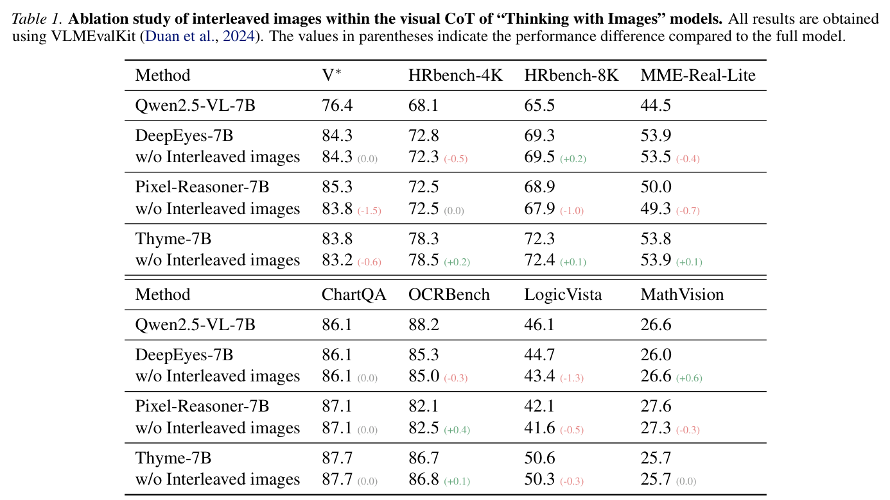
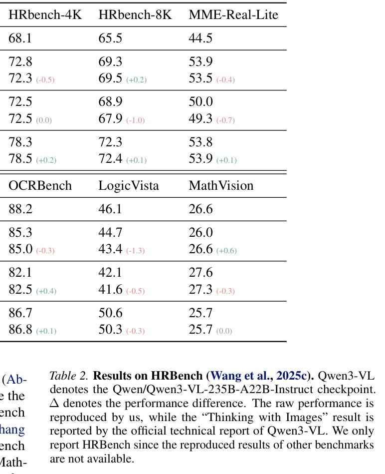
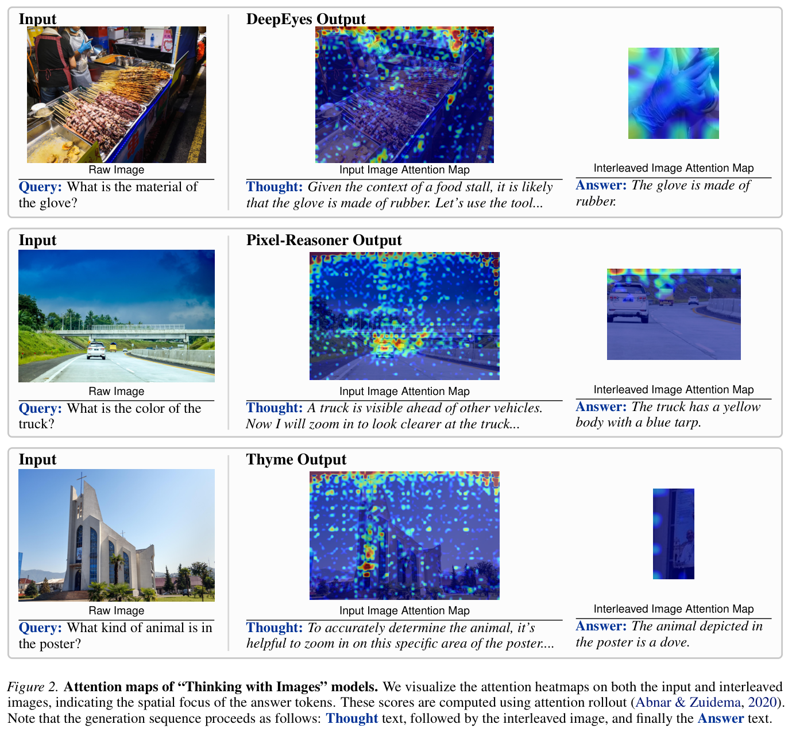

# Position: Your VLM May Not Be Thinking with Interleaved Images

> **中文题名：** 立场：你的 VLM 可能并没有用交错图像思考  
> **作者：** Wenjie Yang, Siqi Zhu, Zengfeng Huang  
> **出处：** ICML 2026, PMLR 306  
> **论文类型：** position paper / analysis / training-free evaluation  
> **源文件：** `Position Your VLM May Not Be Thinking with Interleaved Images.pdf`  
> **阅读器：** 13 页完整英中对照详细阅读稿；覆盖正文、公式 (1)–(4)、Tables 1–5、Figures 1–2、Appendix A、致谢与可检索参考文献。参考文献保留英文书目信息。

## Page / Section Index

- Abstract: page 1
- 1. Introduction: pages 1-2
- 2. Related Work: pages 2-3
- 3. Preliminaries: pages 3-4
- 4. The Necessity of Interleaved Images: pages 4-6
- 5. The Underlying Reason of Performance Gain: pages 6-8
- 6. Call to Action: pages 7-8
- 7. Alternative Views: page 8
- 8. Conclusion: page 8
- Appendix and References: pages 9-13

## Terminology Ledger

| Canonical term | 中文 | First-use decision |
|---|---|---|
| Thinking with Images | 用图像思考 | 指在 CoT 中插入工具生成图像 |
| interleaved images | 交错图像 | 推理过程中生成并插回上下文的图像 |
| visual CoT | 视觉思维链 | 含文本和图像步骤的推理轨迹 |
| vanilla SFT | 普通监督微调 | 不含 CoT 或交错图像的直接回答微调 |
| attention rollout | 注意力回传 | 用于分析信息流的注意力可视化方法 |
| masked experiment | 遮挡实验 | 遮住目标物体后测试模型是否仍能答对 |

## Abstract

> <span style="color:#3B82F6"><strong>Para. 1:</strong></span> “Thinking with Images” has become a central theme in VLM research. This paradigm usually inserts images generated by tools or code execution into the chain-of-thought.

> <span style="color:#F59E0B"><strong>Para. 1[CN]:</strong></span> “用图像思考”已经成为 VLM 研究中的一个核心主题。这一范式通常把工具或代码执行生成的图像插入思维链中。

> <span style="color:#3B82F6"><strong>Para. 2:</strong></span> The paper argues that current VLMs rarely truly think with these interleaved images. Empirical evidence suggests that the images do not play a significant role in recent successful methods.

> <span style="color:#F59E0B"><strong>Para. 2[CN]:</strong></span> 论文认为，当前 VLM 很少真正利用这些交错图像进行思考。实验证据显示，这些图像在近期成功方法中并没有发挥显著作用。

> <span style="color:#3B82F6"><strong>Para. 3:</strong></span> Instead, the authors attribute much of the performance gain to improved language generation distributions caused by finetuning.

> <span style="color:#F59E0B"><strong>Para. 3[CN]:</strong></span> 相反，作者认为很多性能提升来自微调改变了语言生成分布，而不是来自模型主动使用交错视觉信息。

> <span style="color:#3B82F6"><strong>Para. 4:</strong></span> The paper recommends lightweight ablations to test the necessity of interleaved images, new benchmarks that truly require visual reasoning, and more informative visual tools.

> <span style="color:#F59E0B"><strong>Para. 4[CN]:</strong></span> 论文建议未来工作加入轻量消融来验证交错图像的必要性，构建真正需要视觉推理的新基准，并开发能提供更多信息的视觉工具。

## 1. Introduction

> <span style="color:#3B82F6"><strong>Para. 1:</strong></span> OpenAI o3 popularized a research direction in which models solve visual tasks by using visual information as part of the chain-of-thought.

> <span style="color:#F59E0B"><strong>Para. 1[CN]:</strong></span> OpenAI o3 推动了一个研究方向：模型把视觉信息作为思维链的一部分，用来解决视觉任务。

### Figure 1. Thinking with Images


**Caption:** The idealized workflow: a model zooms in, inserts a crop, and answers using the new visual evidence.

**Caption[CN]:** 理想流程：模型放大图像、插入裁剪图，再利用新的视觉证据回答。

> <span style="color:#3B82F6"><strong>Para. 2:</strong></span> These demonstrations are compelling, but they come with high cost. Interleaved images increase context length, complicate supervised data construction, and make reinforcement learning harder.

> <span style="color:#F59E0B"><strong>Para. 2[CN]:</strong></span> 这些演示很有吸引力，但成本很高。交错图像会增加上下文长度，复杂化监督数据构造，也让强化学习更难。

> <span style="color:#3B82F6"><strong>Para. 3:</strong></span> The common belief is that interleaved images are at least partly essential to the reported benchmark gains. This paper challenges that belief.

> <span style="color:#F59E0B"><strong>Para. 3[CN]:</strong></span> 常见观点是，交错图像至少在一定程度上是 benchmark 涨点的关键来源。本文正是要挑战这个观点。

## 2. Related Work

> <span style="color:#3B82F6"><strong>Para. 1:</strong></span> Recent thinking-with-images methods include active perception methods such as DeepEyes and Pixel-Reasoner, and code-execution methods such as Thyme.

> <span style="color:#F59E0B"><strong>Para. 1[CN]:</strong></span> 近期用图像思考的方法包括 DeepEyes、Pixel-Reasoner 这类主动感知方法，也包括 Thyme 这类代码执行方法。

> <span style="color:#3B82F6"><strong>Para. 2:</strong></span> The paper also connects to work that questions whether long CoT, latent reasoning, or visual CoT faithfully reflects the true source of model performance.

> <span style="color:#F59E0B"><strong>Para. 2[CN]:</strong></span> 论文也连接到另一条研究线：反思长 CoT、潜在推理或视觉 CoT 是否真的忠实解释了模型表现。

## 3. Preliminaries

> <span style="color:#3B82F6"><strong>Para. 1:</strong></span> Given a query $Q$ and input images $I$, a VLM $\pi_\theta$ generates a sequence of reasoning steps conditioned on previous history $S_t=(z_1,\ldots,z_{t-1})$.

> <span style="color:#F59E0B"><strong>Para. 1[CN]:</strong></span> 给定问题 $Q$ 和输入图像 $I$，VLM $\pi_\theta$ 会在历史 $S_t=(z_1,\ldots,z_{t-1})$ 条件下生成推理步骤序列。

$$
z_t\sim P(z_t\mid S_t,I,Q;\pi_\theta),\quad z_t\in \mathcal{T}\cup \mathcal{I}. \tag{1}
$$

> <span style="color:#3B82F6"><strong>Para. 2:</strong></span> Textual steps belong to $\mathcal{T}$, while visual steps belong to $\mathcal{I}$. The paper calls the visual subset interleaved images.

> <span style="color:#F59E0B"><strong>Para. 2[CN]:</strong></span> 文本步骤属于 $\mathcal{T}$，视觉步骤属于 $\mathcal{I}$。论文把视觉步骤子集称为交错图像。

> <span style="color:#3B82F6"><strong>Para. 3:</strong></span> The paper primarily studies RL-based implementations—DeepEyes, Pixel-Reasoner, and Thyme—finetuned from Qwen2.5-VL-7B-Instruct with Group Relative Policy Optimization (GRPO). For each input $(I,Q)$, GRPO samples $G$ rollouts and optimizes:

> <span style="color:#F59E0B"><strong>Para. 3[CN]:</strong></span> 本文主要研究基于强化学习的实现——DeepEyes、Pixel-Reasoner 与 Thyme。它们从 Qwen2.5-VL-7B-Instruct 出发，使用组相对策略优化（GRPO）微调。对每个输入 $(I,Q)$，GRPO 采样 $G$ 条轨迹并优化：

$$
L_{\mathrm{GRPO}}(\theta)=\mathbb E\left[\frac1G\sum_{i=1}^G\frac1{|S_i|}\sum_{t=1}^{|S_i|}\left(\min(r_t^i(\theta)\hat A_{i,t},\mathrm{clip}(r_t^i(\theta),\epsilon)\hat A_{i,t})-\beta D_{\mathrm{KL}}[\pi_\theta\|\pi_{\mathrm{ref}}]\right)\right]. \tag{2}
$$

> <span style="color:#3B82F6"><strong>Para. 4:</strong></span> Here $r_t^i(\theta)=\pi_\theta(S_{i,t}|(I,Q),S_{i,<t})/\pi_{\mathrm{old}}(S_{i,t}|(I,Q),S_{i,<t})$, $\hat A_{i,t}=(r_i-\mathrm{mean}(r))/\mathrm{std}(r)$, $\epsilon$ and $\beta$ are hyperparameters, and $D_{\mathrm{KL}}$ is an unbiased KL-divergence estimator.

> <span style="color:#F59E0B"><strong>Para. 4[CN]:</strong></span> 其中 $r_t^i(\theta)=\pi_\theta(S_{i,t}|(I,Q),S_{i,<t})/\pi_{\mathrm{old}}(S_{i,t}|(I,Q),S_{i,<t})$，$\hat A_{i,t}=(r_i-\mathrm{mean}(r))/\mathrm{std}(r)$，$\epsilon$ 与 $\beta$ 为超参数，$D_{\mathrm{KL}}$ 是 KL 散度的无偏估计。

## 4. The Necessity of Interleaved Images

> <span style="color:#3B82F6"><strong>Para. 1:</strong></span> The first test suppresses image outputs from tools or code execution while preserving the preceding textual reasoning. This isolates the contribution of the images themselves.

> <span style="color:#F59E0B"><strong>Para. 1[CN]:</strong></span> 第一项测试会抑制工具或代码执行产生的图像输出，同时保留前面的文本推理。这样可以单独衡量图像本身的贡献。

### Table 1. Ablating Interleaved Images



**Caption:** Removing interleaved images causes only small and inconsistent changes across DeepEyes, Pixel-Reasoner, and Thyme.

**Caption[CN]:** 移除交错图像后，DeepEyes、Pixel-Reasoner 和 Thyme 的变化很小且不一致。

| Method | V* | HR-4K | HR-8K | MME-Real-Lite | ChartQA | OCRBench | LogicVista | MathVision |
|---|---:|---:|---:|---:|---:|---:|---:|---:|
| Qwen2.5-VL-7B | 76.4 | 68.1 | 65.5 | 44.5 | 86.1 | 88.2 | 46.1 | 26.6 |
| DeepEyes-7B | 84.3 | 72.8 | 69.3 | 53.9 | 86.1 | 85.3 | 44.7 | 26.0 |
| w/o Interleaved images | 84.3 (0.0) | 72.3 (-0.5) | 69.5 (+0.2) | 53.5 (-0.4) | 86.1 (0.0) | 85.0 (-0.3) | 43.4 (-1.3) | 26.6 (+0.6) |
| Pixel-Reasoner-7B | 85.3 | 72.5 | 68.9 | 50.0 | 87.1 | 82.1 | 42.1 | 27.6 |
| w/o Interleaved images | 83.8 (-1.5) | 72.5 (0.0) | 67.9 (-1.0) | 49.3 (-0.7) | 87.1 (0.0) | 82.5 (+0.4) | 41.6 (-0.5) | 27.3 (-0.3) |
| Thyme-7B | 83.8 | 78.3 | 72.3 | 53.8 | 87.7 | 86.7 | 50.6 | 25.7 |
| w/o Interleaved images | 83.2 (-0.6) | 78.5 (+0.2) | 72.4 (+0.1) | 53.9 (+0.1) | 87.7 (0.0) | 86.8 (+0.1) | 50.3 (-0.3) | 25.7 (0.0) |

> <span style="color:#3B82F6"><strong>Para. 2:</strong></span> For DeepEyes-7B, V* remains 84.3 with or without interleaved images. For Thyme-7B, HRBench-8K slightly rises from 72.3 to 72.4 when images are removed.

> <span style="color:#F59E0B"><strong>Para. 2[CN]:</strong></span> 对 DeepEyes-7B，V* 在有无交错图像时都是 84.3。对 Thyme-7B，移除图像后 HRBench-8K 还从 72.3 小幅升到 72.4。

### Table 2. Qwen3-VL on HRBench



**Caption:** Raw Qwen3-VL and the thinking-with-image variant perform essentially the same on HRBench.

**Caption[CN]:** 原始 Qwen3-VL 与用图像思考版本在 HRBench 上几乎没有差异。

| Method | HR-4K | HR-8K | Overall |
|---|---:|---:|---:|
| Qwen3-VL (Raw) | 85.6 | 82.3 | 84.0 |
| +Think w image | 85.4 | 82.4 | 83.9 |
| $\Delta$ | +0.2 | -0.1 | +0.1 |

> <span style="color:#3B82F6"><strong>Para. 3:</strong></span> On HRBench, raw Qwen3-VL obtains about 84.0 overall, while the thinking-with-image reported version obtains about 83.9.

> <span style="color:#F59E0B"><strong>Para. 3[CN]:</strong></span> 在 HRBench 上，原始 Qwen3-VL 整体约为 84.0，而报告的用图像思考版本约为 83.9。

> <span style="color:#3B82F6"><strong>Para. 4:</strong></span> The second test uses attention rollout to inspect where answer tokens attend. The authors find that models mainly attend to the original input images rather than the interleaved images.

> <span style="color:#F59E0B"><strong>Para. 4[CN]:</strong></span> 第二项测试用注意力回传分析答案标记关注哪里。作者发现，模型主要关注原始输入图像，而不是交错图像。

### Figure 2. Attention Maps



**Caption:** Attention maps suggest answer tokens focus more on original images than on interleaved crops.

**Caption[CN]:** 注意力图显示，答案标记更常关注原始图像，而不是插入的裁剪图。

> <span style="color:#3B82F6"><strong>Para. 5:</strong></span> Given attention matrix $W^{(l_i)}$ at layer $l_i$, attention rollout is computed by multiplying residual-augmented attention matrices, where $A^{(l_i)}=0.5W^{(l_i)}+0.5I$:

> <span style="color:#F59E0B"><strong>Para. 5[CN]:</strong></span> 给定第 $l_i$ 层的注意力矩阵 $W^{(l_i)}$，注意力回传通过连乘带残差的注意力矩阵计算，其中 $A^{(l_i)}=0.5W^{(l_i)}+0.5I$：

$$
\widetilde A^{(l_i)}=A^{(l_i)}A^{(l_{i-1})}\cdots A^{(l_0)}. \tag{3}
$$

> <span style="color:#3B82F6"><strong>Para. 6:</strong></span> Across DeepEyes, Pixel-Reasoner, and Thyme, answer tokens predominantly attend to original input images. In the DeepEyes example, the model infers “rubber” from the food-stall context before using the zoom tool, illustrating that textual priors can sometimes help rather than merely cause hallucinations.

> <span style="color:#F59E0B"><strong>Para. 6[CN]:</strong></span> 在 DeepEyes、Pixel-Reasoner 和 Thyme 中，答案 token 主要关注原始输入图像。DeepEyes 示例甚至在调用放大工具前，便依据食品摊场景推断手套材质为“橡胶”，说明文本先验有时能提供帮助，而不只是引发幻觉。

## 5. The Underlying Reason of Performance Gain

> <span style="color:#3B82F6"><strong>Para. 1:</strong></span> If interleaved images are not the main source of gains, the paper asks what is. The proposed answer is finetuning: the model's language generation distribution becomes better aligned with the benchmark.

> <span style="color:#F59E0B"><strong>Para. 1[CN]:</strong></span> 如果交错图像不是主要涨点来源，那么真正来源是什么？论文给出的答案是微调：模型的语言生成分布更贴合 benchmark。

### Table 3. Vanilla SFT


**Caption:** DeepEyes-SFT-7B is trained without reasoning traces or interleaved images, yet reaches a macro average of 65.8 versus DeepEyes-7B at 65.3.

**Caption[CN]:** DeepEyes-SFT-7B 不使用推理轨迹或交错图像，但宏平均达到 65.8，高于 DeepEyes-7B 的 65.3。

| Method | V* | HR-4K | HR-8K | MME | ChartQA | OCRBench | LogicV | MathV | Avg. |
|---|---:|---:|---:|---:|---:|---:|---:|---:|---:|
| Qwen2.5-VL-7B | 76.4 | 68.1 | 65.5 | 44.5 | 86.1 | 88.2 | 46.1 | 26.6 | 62.7 |
| DeepEyes-7B | 84.3 | 72.8 | 69.3 | 53.9 | 86.1 | 85.3 | 44.7 | 26.0 | 65.3 |
| DeepEyes-SFT-7B | 85.3 | 72.9 | 70.8 | 49.1 | 86.5 | 87.4 | 46.8 | 27.3 | 65.8 |
| $\Delta$ (SFT - DeepEyes) | +1.0 | +0.1 | +1.5 | -4.8 | +0.4 | +2.1 | +2.1 | +1.3 | +0.5 |

> <span style="color:#3B82F6"><strong>Para. 3:</strong></span> Vanilla SFT minimizes sentence-level cross-entropy on concise natural-language answers rather than CoT traces:

> <span style="color:#F59E0B"><strong>Para. 3[CN]:</strong></span> 普通 SFT 在简洁自然语言答案而非 CoT 轨迹上最小化句子级交叉熵：

$$
L_{\mathrm{SFT}}(\theta)=\mathbb E_{(I,Q,S_T)\sim\mathcal D}[-\log\pi_\theta(S_T|I,Q)]. \tag{4}
$$

> <span style="color:#3B82F6"><strong>Para. 4:</strong></span> Qwen2.5-VL-7B is finetuned with LlamaFactory for one epoch using cosine scheduling, peak learning rate `1e-5`, per-device batch size 16, global batch size 128 across 8 GPUs, finishing in 15 minutes on H200 GPUs.

> <span style="color:#F59E0B"><strong>Para. 4[CN]:</strong></span> Qwen2.5-VL-7B 使用 LlamaFactory 微调一轮，采用余弦学习率调度、峰值学习率 `1e-5`、单设备 batch size 16，在 8 张 GPU 上全局 batch size 为 128；使用 H200 GPU 的服务器约 15 分钟完成。

> <span style="color:#3B82F6"><strong>Para. 2:</strong></span> The SFT baseline is not universally better. On MME-RealWorld-Lite it trails DeepEyes, suggesting RL still matters in some reasoning-heavy settings.

> <span style="color:#F59E0B"><strong>Para. 2[CN]:</strong></span> 普通 SFT 并不是全面更好。在 MME-RealWorld-Lite 上它低于 DeepEyes，说明 RL 在某些强推理设置中仍可能有价值。

### Table 4. Masked V*


**Caption:** Even when target objects are masked, finetuned thinking-with-images models still outperform the base model.

**Caption[CN]:** 即使目标物体被遮挡，经过微调的用图像思考模型仍高于基座模型。

| Method | Attribute | Spatial | Overall |
|---|---:|---:|---:|
| Qwen2.5-VL-7B | 14.8 | 50.0 | 28.8 |
| DeepEyes-7B | 23.5 | 59.2 | 37.7 |
| Pixel-Reasoner-7B | 26.1 | 55.3 | 37.7 |
| Thyme-7B | 31.3 | 55.3 | 40.8 |

> <span style="color:#3B82F6"><strong>Para. 3:</strong></span> On masked V*, Qwen2.5-VL-7B scores 28.8 overall, while DeepEyes-7B and Pixel-Reasoner-7B reach 37.7, and Thyme-7B reaches 40.8.

> <span style="color:#F59E0B"><strong>Para. 3[CN]:</strong></span> 在遮挡版 V* 上，Qwen2.5-VL-7B 总分 28.8，DeepEyes-7B 和 Pixel-Reasoner-7B 达到 37.7，Thyme-7B 达到 40.8。

## 6. Call to Action and Alternative Views

> <span style="color:#3B82F6"><strong>Para. 1:</strong></span> The paper recommends that future thinking-with-images papers report interleaved-image ablations. The utility of such images is convincing only when removing them consistently hurts performance.

> <span style="color:#F59E0B"><strong>Para. 1[CN]:</strong></span> 论文建议未来用图像思考论文报告交错图像消融。只有当移除图像稳定导致性能下降时，图像的必要性才更有说服力。

> <span style="color:#3B82F6"><strong>Para. 2:</strong></span> It also argues that visual tools should provide novel information. Simple cropping may not help much if the visual encoder already has access to the relevant information.

> <span style="color:#F59E0B"><strong>Para. 2[CN]:</strong></span> 论文还认为，视觉工具应该提供新信息。如果视觉编码器本来已经能访问相关信息，简单裁剪未必有太大帮助。

> <span style="color:#3B82F6"><strong>Para. 3:</strong></span> The paper calls for benchmarks that truly require visual feedback, such as irregular maze solving or geometric editing, rather than only harder VQA items.

> <span style="color:#F59E0B"><strong>Para. 3[CN]:</strong></span> 论文呼吁构建真正需要视觉反馈的基准，例如不规则迷宫求解或几何编辑，而不是只做更难的 VQA 题。

> <span style="color:#3B82F6"><strong>Para. 4:</strong></span> The paper highlights BabyVision, which separates core visual reasoning from language knowledge and finds leading VLMs behind six-year-old children, and InkSlop, which evaluates maze solving, handwriting trajectory completion, and overlapped handwriting recognition.

> <span style="color:#F59E0B"><strong>Para. 4[CN]:</strong></span> 论文特别指出 BabyVision 与 InkSlop：前者将核心视觉推理与语言知识分离，并发现领先 VLM 在基础视觉任务上落后于六岁儿童；后者评测迷宫求解、手写轨迹补全和重叠手写识别。

## 7. Alternative Views

> <span style="color:#3B82F6"><strong>Para. 1:</strong></span> One counterargument is that interleaved crops are unfaithful because they miss the target. The authors respond that under rule-based RL, this itself shows crop faithfulness contributes little to correctness; image-removal ablations remain necessary even after faithfulness is improved.

> <span style="color:#F59E0B"><strong>Para. 1[CN]:</strong></span> 一种反驳是，交错裁剪图不忠实，因为它们没有包含目标。作者回应称，在规则奖励强化学习下，这本身说明裁剪忠实性对正确率贡献很小；即使改善忠实性，仍需要移除图像的消融实验。

> <span style="color:#3B82F6"><strong>Para. 2:</strong></span> Another argument is that existing benchmarks are too easy. The authors agree that harder benchmarks are needed but stress that merely stacking difficulties that do not require interleaved images does not change the task fundamentally. The paper is not intended to undermine pioneering work, but to clarify the source of gains and optimal visual-information use.

> <span style="color:#F59E0B"><strong>Para. 2[CN]:</strong></span> 另一种观点是现有基准太简单。作者同意需要更难基准，但强调仅叠加无需交错图像的困难并不会从根本上改变任务。本文并非否定先驱工作，而是希望澄清性能增益来源以及视觉信息的最佳使用方式。

## Appendix. Bonus Strategy

### Table 5. Better Context and Better Prior


**Caption:** Combining Hide with finetuned priors improves V* performance, showing that better context and better prior are complementary.

**Caption[CN]:** 将 Hide 与微调先验结合可以提升 V*，说明更好的上下文和更好的先验具有互补性。

| Method | Better context | Better prior | Attribute | Spatial | Overall |
|---|:---:|:---:|---:|---:|---:|
| Qwen2.5-VL-7B | ✗ | ✗ | 77.4 | 75.0 | 76.4 |
| Qwen2.5-VL-7B + Hide | ✓ | ✗ | 88.7 | 84.2 | 86.9 |
| DeepEyes-7B | ✗ | ✓ | 84.3 | 84.2 | 84.3 |
| DeepEyes-7B + Hide | ✓ | ✓ | **89.6** | **85.5** | **88.0** |

> <span style="color:#3B82F6"><strong>Para. 1:</strong></span> On V*, Qwen2.5-VL-7B improves from 76.4 to 86.9 with Hide, while DeepEyes-7B improves from 84.3 to 88.0 with Hide.

> <span style="color:#F59E0B"><strong>Para. 1[CN]:</strong></span> 在 V* 上，Qwen2.5-VL-7B 加 Hide 后从 76.4 提升到 86.9；DeepEyes-7B 加 Hide 后从 84.3 提升到 88.0。

> <span style="color:#3B82F6"><strong>Para. 2:</strong></span> Appendix A separates two complementary mechanisms. “Better context” appends only target-region crops, avoiding harmful extra text generated under the same prior; “better prior” finetunes the model to reduce harmful benchmark-specific language priors. Combining Hide with DeepEyes yields the best V* result.

> <span style="color:#F59E0B"><strong>Para. 2[CN]:</strong></span> 附录 A 区分两个互补机制。“更好的上下文”只追加目标区域裁剪图，避免加入受同一先验影响而生成的有害额外文本；“更好的先验”通过微调缓解特定基准上的有害语言先验。将 Hide 与 DeepEyes 结合取得最佳 V* 结果。

## 8. Conclusion

> <span style="color:#3B82F6"><strong>Para. 1:</strong></span> The conclusion restates that current VLMs may not truly think with interleaved images. The authors ask for transparency, stronger benchmarks, and better visual tools.

> <span style="color:#F59E0B"><strong>Para. 1[CN]:</strong></span> 结论重申：当前 VLM 可能并没有真正用交错图像思考。作者呼吁更透明的消融、更强的基准和更有信息量的视觉工具。

## Acknowledgments

> <span style="color:#3B82F6"><strong>Para. 1:</strong></span> The authors thank anonymous reviewers; computations used Fudan University's CFFF platform. The work was supported by NSFC U2241212 and 62276066.

> <span style="color:#F59E0B"><strong>Para. 1[CN]:</strong></span> 作者感谢匿名审稿人；计算使用复旦大学 CFFF 平台。本研究获国家自然科学基金 U2241212 和 62276066 支持。

## References

> **Policy / 策略：** The complete bibliography is retained below in original searchable form. Author names, titles, venues, DOI and URLs are intentionally not translated. / 完整参考文献以下按原始可检索形式保留；作者、题名、会议期刊、DOI 与 URL 不翻译。

```text
Abnar, S. and Zuidema, W. H. Quantifying attention flow in transformers. In Jurafsky, D., Chai, J., Schluter, N., and
Tetreault, J. R. (eds.), Proceedings of the 58th Annual
Meeting of the Association for Computational Linguistics,
ACL 2020, Online, July 5-10, 2020, pp. 4190–4197. Association for Computational Linguistics, 2020. doi: 10.
18653/V1/2020.ACL-MAIN.385. URL https://doi. org/10.18653/v1/2020.acl-main.385.
Bai, S., Cai, Y., Chen, R., Chen, K., Chen, X., Cheng, Z.,
Deng, L., Ding, W., Gao, C., Ge, C., Ge, W., Guo, Z.,
Huang, Q., Huang, J., Huang, F., Hui, B., Jiang, S., Li,
Z., Li, M., Li, M., Li, K., Lin, Z., Lin, J., Liu, X., Liu,
J., Liu, C., Liu, Y., Liu, D., Liu, S., Lu, D., Luo, R., Lv,
C., Men, R., Meng, L., Ren, X., Ren, X., Song, S., Sun,
Y., Tang, J., Tu, J., Wan, J., Wang, P., Wang, P., Wang,
Q., Wang, Y., Xie, T., Xu, Y., Xu, H., Xu, J., Yang, Z.,
Yang, M., Yang, J., Yang, A., Yu, B., Zhang, F., Zhang,
H., Zhang, X., Zheng, B., Zhong, H., Zhou, J., Zhou, F.,
Zhou, J., Zhu, Y., and Zhu, K. Qwen3-vl technical report. arXiv preprint arXiv:2511.21631, 2025a.
Bai, S., Chen, K., Liu, X., Wang, J., Ge, W., Song, S., Dang,
K., Wang, P., Wang, S., Tang, J., Zhong, H., Zhu, Y., Yang,
M., Li, Z., Wan, J., Wang, P., Ding, W., Fu, Z., Xu, Y.,
Ye, J., Zhang, X., Xie, T., Cheng, Z., Zhang, H., Yang, Z.,
Xu, H., and Lin, J. Qwen2.5-vl technical report, 2025b.
URL https://arxiv.org/abs/2502.13923.
Chefer, H., Gur, S., and Wolf, L. Transformer interpretability beyond attention visualization. In IEEE
Conference on Computer Vision and Pattern Recognition,
CVPR 2021, virtual, June 19-25, 2021, pp. 782–791.
Computer Vision Foundation / IEEE, 2021a. doi:
10.1109/CVPR46437.2021.00084. URL https:
//openaccess.thecvf.com/content/
CVPR2021/html/Chefer_Transformer_
Interpretability_Beyond_Attention_
Visualization_CVPR_2021_paper.html.
Chefer, H., Gur, S., and Wolf, L. Generic attention-model explainability for interpreting bi-modal and encoderdecoder transformers. In 2021 IEEE/CVF International
Conference on Computer Vision, ICCV 2021, Montreal, QC, Canada, October 10-17, 2021, pp. 387–396.
IEEE, 2021b. doi: 10.1109/ICCV48922.2021.00045.
URL https://doi.org/10.1109/ICCV48922.
2021.00045.
Chen, L., Xie, W., Liang, Y., He, H., Zhao, H., Yang, Z.,
Huang, Z., Wu, H., Lu, H., charles, Y., Bao, Y., Fan,
Y., Li, G., Shen, H., Chen, X., Xu, W., Si, S., Cai, Z.,
Chai, W., Huang, Z., Liu, F., Liu, T., Chang, B., Hu,
X., Chen, K., Ren, Y., Liu, Y., Gong, Y., and Li, K.
Babyvision: Visual reasoning beyond language, 2026.
URL https://arxiv.org/abs/2601.06521.
Deng, A., Cao, T., Chen, Z., and Hooi, B. Words or vision: Do vision-language models have blind faith in text? In IEEE/CVF Conference on Computer Vision and Pattern Recognition, CVPR 2025,
Nashville, TN, USA, June 11-15, 2025, pp. 3867–3876.
Computer Vision Foundation / IEEE, 2025. doi:
10.1109/CVPR52734.2025.00366. URL https:
//openaccess.thecvf.com/content/
CVPR2025/html/Deng_Words_or_Vision_
Do_Vision-Language_Models_Have_Blind_
Faith_in_CVPR_2025_paper.html.
Du, Y., Zhou, K., Min, Y., Ling, Y., Zhao, W. X., and Wu,
Y. Revisiting the necessity of lengthy chain-of-thought in vision-centric reasoning generalization, 2025. URL https://arxiv.org/abs/2511.22586.
Duan, H., Yang, J., Qiao, Y., Fang, X., Chen, L., Liu,
Y., Dong, X., Zang, Y., Zhang, P., Wang, J., et al.
Vlmevalkit: An open-source toolkit for evaluating large multi-modality models. In Proceedings of the 32nd
ACMInternationalConferenceonMultimedia, pp.11198–
11201, 2024.
Gu, J., Hao, Y., Wang, H. W., Li, L., Shieh, M. Q., Choi,
Y., Krishna, R., and Cheng, Y. Thinkmorph: Emergent properties in multimodal interleaved chain-of-thought reasoning. In The Fourteenth International Conference on Learning Representations, 2026. URL https:// openreview.net/forum?id=mB3vxfrQZM.
Guo, Z., Hong, M., Zhang, F., Jia, K., and Jin, T. Thinking with programming vision: Towards a unified view for thinking with images, 2025. URL https://arxiv. org/abs/2512.03746.
Hassid, M., Synnaeve, G., Adi, Y., and Schwartz, R. Don’t overthink it. preferring shorter thinking chains for improved llm reasoning, 2025. URL https://arxiv. org/abs/2505.17813.
Hong, J., Zhao, C., Zhu, C., Lu, W., Xu, G., and XingYu.
Deepeyesv2: Toward agentic multimodal model. In
The Fourteenth International Conference on Learning
Representations, 2026. URL https://openreview. net/forum?id=yDKawwfJ5O.
Hou, X., Xu, S., Biyani, M., Li, M., Liu, J., Hollon, T. C., and Wang, B. Codev: Code with images for faithful visualreasoningviatool-awarepolicyoptimization. arXiv preprint arXiv:2511.19661, 2025.
Ji, Y., Wang, Y., Ma, Z., Hu, Y., Huang, H., Hu, X., Chen,
G., Wu, L., and Chu, X. Thinking with map: Reinforced parallel map-augmented agent for geolocalization, 2026.
URL https://arxiv.org/abs/2601.05432.
Lei, B., Xu, N., Payani, A., Hong, M., Liao, C., Cao, Y., and Ding, C. GUI-SPOTLIGHT: Adaptive iterative focus refinement for enhanced gui visual grounding, 2025. URL https://arxiv.org/abs/2510.04039.
Liu, H., Li, C., Wu, Q., and Lee, Y. J. Visual instruction tuning, 2023.
Liu, X., Hu, Y., Zou, Y., Wu, L., Xu, J., and Zheng, B.
Hide: Rethinking the zoom-in method in high resolution mllms via hierarchical decoupling, 2025a. URL https:
//arxiv.org/abs/2510.00054.
Liu, Y., Li, Z., Huang, M., Yang, B., Yu, W., Li, C.,
Yin, X.-C., Liu, C.-L., Jin, L., and Bai, X. Ocrbench: on the hidden mystery of ocr in large multimodal models. Science China Information Sciences, 67
(12), December 2024. ISSN 1869-1919. doi: 10.1007/ s11432-024-4235-6. URL http://dx.doi.org/
10.1007/s11432-024-4235-6.
Liu, Z., Chen, Z., Liu, H., Luo, C., Tang, X., Wang, S., Zeng,
J., Dai, Z., Shi, Z., Wei, T., Dumoulin, B., and Tong, H.
Seeing but not believing: Probing the disconnect between visual attention and answer correctness in vlms, 2025b.
URL https://arxiv.org/abs/2510.17771.
Liu, Z., Pan, J., She, Q., Gao, Y., and Xia, G. On the faithfulness of visual thinking: Measurement and enhancement, 2025c. URL https://arxiv.org/ abs/2510.23482.
Ma, Y., Zhang, W., Li, T., Du, L., Shen, X., and Liu, P.
What does vision tool-use reinforcement learning really learn? disentangling tool-induced and intrinsic effects for crop-and-zoom, 2026. URL https://arxiv.org/ abs/2602.01334.
Maksai, A. Inkslop: Vibe-coded benchmark for spatial reasoning with digital ink, 2026. URL https:
//inkslop.github.io. Benchmark for evaluating
VLMs on digital ink tasks.
Masry, A., Long, D., Tan, J. Q., Joty, S., and
Hoque, E. ChartQA: A benchmark for question answering about charts with visual and logical reasoning. In Findings of the Association for Computational Linguistics: ACL 2022, pp. 2263–2279,
Dublin, Ireland, May 2022. Association for Computational Linguistics. doi: 10.18653/v1/2022.findings-acl.
177. URL https://aclanthology.org/2022. findings-acl.177.
OpenAI. Thinking with images. https://openai. com/index/thinking-with-images/, 2025.
Qin, Y., Liang, S., Ye, Y., Zhu, K., Yan, L., Lu, Y., Lin, Y.,
Cong, X., Tang, X., Qian, B., Zhao, S., Hong, L., Tian,
R., Xie, R., Zhou, J., Gerstein, M., Li, D., Liu, Z., and
Sun, M. Toolllm: Facilitating large language models to master 16000+ real-world apis. In The Twelfth International Conference on Learning Representations, ICLR
2024, Vienna, Austria, May 7-11, 2024. OpenReview.net,
2024. URL https://openreview.net/forum? id=dHng2O0Jjr.
Schick, T., Dwivedi-Yu, J., Dessı̀, R., Raileanu, R., Lomeli,
M., Hambro, E., Zettlemoyer, L., Cancedda, N., and
Scialom, T. Toolformer: Language models can teach themselves to use tools. In Oh, A., Naumann, T., Globerson, A., Saenko, K., Hardt, M., and Levine, S. (eds.),
Advances in Neural Information Processing Systems 36:
Annual Conference on Neural Information Processing
Systems 2023, NeurIPS 2023, New Orleans, LA, USA,
December 10 - 16, 2023, 2023.
Shao, Z., Wang, P., Zhu, Q., Xu, R., Song, J., Bi, X.,
Zhang, H., Zhang, M., Li, Y. K., Wu, Y., and Guo,
D. Deepseekmath: Pushing the limits of mathematical reasoning in open language models, 2024. URL https://arxiv.org/abs/2402.03300.
Song, Q., Li, H., Yu, Y., Zhou, H., Yang, L., Bai, S., She,
Q., Huang, Z., and Zhao, Y. Codedance: A dynamic toolintegrated mllm for executable visual reasoning, 2026.
URL https://arxiv.org/abs/2512.17312.
Su, A., Wang, H., Ren, W., Lin, F., and Chen, W. Pixel reasoner: Incentivizing pixel space reasoning via curiositydrivenreinforcementlearning. InTheThirty-ninthAnnual
Conference on Neural Information Processing Systems,
2025a. URL https://openreview.net/forum? id=VeZkY3JjWV.
Su, Z., Xia, P., Guo, H., Liu, Z., Ma, Y., Qu, X., Liu, J., Li,
Y., Zeng, K., Yang, Z., et al. Thinking with images for multimodal reasoning: Foundations, methods, and future frontiers. arXiv preprint arXiv:2506.23918, 2025b.
Sun, R., Cheng, W., Li, D., Chen, H., and Wang, W.
Stop when enough: Adaptive early-stopping for chainof-thought reasoning, 2025. URL https://arxiv. org/abs/2510.10103.
Team, K., Bai, T., Bai, Y., Bao, Y., Cai, S. H., Cao, Y.,
Charles, Y., Che, H. S., Chen, C., Chen, G., Chen, H.,
Chen, J., Chen, J., Chen, J., Chen, J., Chen, K., Chen,
L., Chen, R., Chen, X., Chen, Y., Chen, Y., Chen, Y.,
Chen, Y., Chen, Y., Chen, Y., Chen, Y., Chen, Y., Chen,
Z., Chen, Z., Cheng, D., Chu, M., Cui, J., Deng, J., Diao,
M., Ding, H., Dong, M., Dong, M., Dong, Y., Dong, Y.,
Du, A., Du, C., Du, D., Du, L., Du, Y., Fan, Y., Fang,
S., Feng, Q., Feng, Y., Fu, G., Fu, K., Gao, H., Gao, T.,
Ge, Y., Geng, S., Gong, C., Gong, X., Gongque, Z., Gu,
Q., Gu, X., Gu, Y., Guan, L., Guo, Y., Hao, X., He, W.,
He, W., He, Y., Hong, C., Hu, H., Hu, J., Hu, Y., Hu, Z.,
Huang, K., Huang, R., Huang, W., Huang, Z., Jiang, T.,
Jiang, Z., Jin, X., Jing, Y., Lai, G., Li, A., Li, C., Li, C.,
Li, F., Li, G., Li, G., Li, H., Li, H., Li, J., Li, J., Li, J.,
Li, L., Li, M., Li, W., Li, W., Li, X., Li, X., Li, Y., Li,
Y., Li, Y., Li, Y., Li, Z., Li, Z., Liao, W., Lin, J., Lin,
X., Lin, Z., Lin, Z., Liu, C., Liu, C., Liu, H., Liu, L.,
Liu, S., Liu, S., Liu, S., Liu, T., Liu, T., Liu, W., Liu, X.,
Liu, Y., Liu, Y., Liu, Y., Liu, Y., Liu, Y., Liu, Z., Liu, Z.,
Lu, E., Lu, H., Lu, Z., Luo, J., Luo, T., Luo, Y., Ma, L.,
Ma, Y., Mao, S., Mei, Y., Men, X., Meng, F., Meng, Z.,
Miao, Y., Ni, M., Ouyang, K., Pan, S., Pang, B., Qian,
Y., Qin, R., Qin, Z., Qiu, J., Qu, B., Shang, Z., Shao,
Y., Shen, T., Shen, Z., Shi, J., Shi, L., Shi, S., Song, F.,
Song, P., Song, T., Song, X., Su, H., Su, J., Su, Z., Sui,
L., Sun, J., Sun, J., Sun, T., Sung, F., Tai, Y., Tang, C.,
Tang, H., Tang, X., Tang, Z., Tao, J., Teng, S., Tian, C.,
Tian, P., Wang, A., Wang, B., Wang, C., Wang, C., Wang,
C., Wang, D., Wang, D., Wang, D., Wang, F., Wang,
H., Wang, H., Wang, H., Wang, H., Wang, H., Wang, J.,
Wang, J., Wang, J., Wang, K., Wang, L., Wang, Q., Wang,
S., Wang, S., Wang, S., Wang, W., Wang, X., Wang, X.,
Wang, Y., Wang, Y., Wang, Y., Wang, Y., Wang, Y., Wang,
Y., Wang, Z., Wang, Z., Wang, Z., Wang, Z., Wang, Z.,
Wang, Z., Wei, C., Wei, M., Wen, C., Wen, Z., Wu, C.,
Wu, H., Wu, J., Wu, R., Wu, W., Wu, Y., Wu, Y., Wu, Y.,
Wu, Z., Xiao, C., Xie, J., Xie, X., Xie, Y., Xin, Y., Xing,
B., Xu, B., Xu, J., Xu, J., Xu, J., Xu, L. H., Xu, L., Xu,
S., Xu, W., Xu, X., Xu, X., Xu, Y., Xu, Y., Xu, Y., Xu,
Z., Xu, Z., Yan, J., Yan, Y., Yang, G., Yang, H., Yang, J.,
Yang, K., Yang, N., Yang, R., Yang, X., Yang, X., Yang,
Y., Yang, Y., Yang, Y., Yang, Z., Yang, Z., Yang, Z., Yao,
H., Ye, D., Ye, W., Ye, Z., Yin, B., Yu, C., Yu, L., Yu,
T., Yu, T., Yuan, E., Yuan, M., Yuan, X., Yue, Y., Zeng,
W., Zha, D., Zhan, H., Zhang, D., Zhang, H., Zhang, J.,
Zhang, P., Zhang, Q., Zhang, R., Zhang, X., Zhang, Y.,
Zhang, Y., Zhang, Y., Zhang, Y., Zhang, Y., Zhang, Y.,
Zhang, Y., Zhang, Y., Zhang, Y., Zhang, Y., Zhang, Z.,
Zhao, C., Zhao, F., Zhao, J., Zhao, S., Zhao, X., Zhao,
Y., Zhao, Z., Zheng, H., Zheng, R., Zheng, S., Zheng,
T., Zhong, J., Zhong, L., Zhong, W., Zhou, M., Zhou,
R., Zhou, X., Zhou, Z., Zhu, J., Zhu, L., Zhu, X., Zhu,
Y., Zhu, Z., Zhuang, J., Zhuang, W., Zou, Y., and Zu,
X. Kimi k2.5: Visual agentic intelligence, 2026. URL https://arxiv.org/abs/2602.02276.
Tong, J., Mou, Y., Li, H., Li, M., Yang, Y., Zhang, M.,
Chen, Q., Liang, T., Hu, X., Zheng, Y., Chen, X.,
Zhao, J., Huang, X., and Qiu, X. Thinking with video:
Video generation as a promising multimodal reasoning paradigm, 2025. URL https://arxiv.org/abs/
2511.04570.
Wang, C., Wang, H., Chen, X., Liu, J., Xue, T., Peng, C., Qi,
D., Lin, F., and Yan, Y. From illusion to intention: Visual rationale learning for vision-language reasoning, 2025a.
URL https://arxiv.org/abs/2511.23031.
Wang, K., Pan, J., Shi, W., Lu, Z., Ren, H., Zhou, A., Zhan,
M., and Li, H. Measuring multimodal mathematical reasoning with math-vision dataset. In The Thirty-eight
Conference on Neural Information Processing Systems
Datasets and Benchmarks Track, 2024. URL https:
//openreview.net/forum?id=QWTCcxMpPA.
Wang, Q., Shi, Y., Wang, Y., Zhang, Y., Wan, P., Gai, K.,
Ying, X., and Wang, Y. Monet: Reasoning in latent visual space beyond images and language, 2025b. URL https://arxiv.org/abs/2511.21395.
Wang, W., Ding, L., Zeng, M., Zhou, X., Shen, L., Luo, Y.,
Yu, W., and Tao, D. Divide, conquer and combine: A training-free framework for high-resolution image perception in multimodal large language models. In Proceedings of the AAAI Conference on Artificial Intelligence, pp.
7907–7915, 2025c.
Wang, W., Gao, Z., Gu, L., Pu, H., Cui, L., Wei, X., Liu, Z.,
Jing, L., Ye, S., Shao, J., et al. Internvl3.5: Advancing open-source multimodal models in versatility, reasoning, and efficiency. arXiv preprint arXiv:2508.18265, 2025d.
Wei, J., Jia, C., Bai, X., Xu, X., Li, S., Sun, L., Yu, B.,
He, C., Wu, L., and Tan, C. Ggbench: A geometric generative reasoning benchmark for unified multimodal models. CoRR, abs/2511.11134, 2025. doi: 10.48550/
ARXIV.2511.11134. URL https://doi.org/10.
48550/arXiv.2511.11134.
Wei, L., He, L., Lan, J., Dong, L., Cai, Y., Li, S., Zhu, H.,
Wang, W., Kong, L., Wang, Y., Zhang, Z., and Huang, W.
Zooming without zooming: Region-to-image distillation for fine-grained multimodal perception. arXiv preprint arXiv:2602.11858, 2026.
Wen, Z., Li, B., Zhang, W., Lei, J., Chen, X., Fan, Y.,
Zhang, Q., Wang, Y., Qiu, L., Li, B., Liu, Z., Shan, C.,
Yang, Y., and Shen, Y. Unig2u-bench: Do unified models advance multimodal understanding?, 2026. URL https:
//arxiv.org/abs/2603.03241.
Wu, J., Deng, Z., Li, W., Liu, Y., You, B., Li, B., Ma, Z., and Liu, Z. Mmsearch-r1: Incentivizing lmms to search. arXiv preprint arXiv:2506.20670, 2025a.
Wu, M., Yang, J., Jiang, J., Li, M., Yan, K., Yu, H., Zhang,
M., Zhai, C., and Nahrstedt, K. VTool-r1: VLMs learn to think with images via reinforcement learning on multimodal tool use. In The Fourteenth International Conference on Learning Representations, 2026. URL https:
//openreview.net/forum?id=Idst6X6gmy.
Wu, P. and Xie, S. V*: Guided visual search as a core mechanism in multimodal llms. In IEEE/CVF Conference on
Computer Vision and Pattern Recognition, CVPR 2024,
Seattle, WA, USA, June 16-22, 2024, pp. 13084–13094.
IEEE, 2024. doi: 10.1109/CVPR52733.2024.01243.
URL https://doi.org/10.1109/CVPR52733.
2024.01243.
Wu, Y., Wang, Y., Ye, Z., Du, T., Jegelka, S., and Wang,
Y. When more is less: Understanding chain-of-thought length in llms, 2025b. URL https://arxiv.org/ abs/2502.07266.
Xiao, Y., Sun, E., Liu, T., and Wang, W. Logicvista:
Multimodal llm logical reasoning benchmark in visual contexts, 2024. URL https://arxiv.org/abs/
2407.04973.
Xu, Z., Sun, C., Du, S., Li, C., Lyu, J., and Yuan, C. Vacot:
Rethinking visual data augmentation with vlms, 2025.
URL https://arxiv.org/abs/2512.02361.
Yang, W. and Huang, Z. Poivre: Self-refining visual pointing with reinforcement learning, 2025. URL https:
//arxiv.org/abs/2509.23746.
Yu, B., Yuan, H., Li, H., Xu, X., Wei, Y., Wang, B., Qi, W., and Chen, K. Long-short chain-of-thought mixture supervised fine-tuning eliciting efficient reasoning in large language models, 2025. URL https://arxiv.org/ abs/2505.03469.
Zhang, J., Khayatkhoei, M., Chhikara, P., and Ilievski, F.
Mllms know where to look: Training-free perception of small visual details with multimodal llms. In The Thirteenth International Conference on Learning Representations, ICLR 2025, Singapore, April 24-28, 2025. OpenReview.net, 2025a. URL https://openreview.net/ forum?id=DgaY5mDdmT.
Zhang, K., Li, B., Zhang, P., Pu, F., Cahyono, J. A., Hu,
K., Liu, S., Zhang, Y., Yang, J., Li, C., and Liu, Z.
Lmms-eval: Reality check on the evaluation of large multimodal models, 2024. URL https://arxiv.org/ abs/2407.12772.
Zhang, Y., Shi, Y., Yu, W., Wen, Q., Wang, X., Yang,
W., Zhang, Z., Wang, L., and Jin, R. Debiasing multimodallargelanguagemodelsviapenalizationoflanguage priors. In Proceedings of the 33rd ACM International
Conference on Multimedia, MM ’25, pp. 4232–4241,
New York, NY, USA, 2025b. Association for Computing Machinery. ISBN 9798400720352. doi: 10.
1145/3746027.3755364. URL https://doi.org/
10.1145/3746027.3755364.
Zhang, Y., Tang, B., Ju, T., Duan, S., and Liu, G. Do latent tokens think? a causal and adversarial analysis of chain-of-continuous-thought, 2025c. URL https:
//arxiv.org/abs/2512.21711.
Zhang, Y., Zhang, H., Tian, H., Fu, C., Zhang, S., Wu, J., Li,
F., Wang, K., Wen, Q., Zhang, Z., Wang, L., and Jin, R.
Mme-realworld: Could your multimodal LLM challenge high-resolution real-world scenarios that are difficult for humans? In The Thirteenth International Conference on
Learning Representations, ICLR 2025, Singapore, April
24-28, 2025. OpenReview.net, 2025d. URL https:
//openreview.net/forum?id=k5VHHgsRbi.
Zhang, Y., Lu, X., Yin, S., Fu, C., Chen, W., Hu, X., Wen,
B., Jiang, K., Liu, C., Zhang, T., fan, H., Chen, K., Chen,
J., Ding, H., Tang, K., Zhang, Z., Wang, L., Yang, F.,
Gao, T., and Zhou, G. Thyme: Think beyond images.
In The Fourteenth International Conference on Learning
Representations, 2026. URL https://openreview. net/forum?id=gCWLkqK45O.
Zheng, Y., Zhang, R., Zhang, J., Ye, Y., Luo, Z., Feng,
Z., and Ma, Y. Llamafactory: Unified efficient finetuning of 100+ language models. In Proceedings of the
62nd Annual Meeting of the Association for Computational Linguistics (Volume 3: System Demonstrations),
Bangkok, Thailand, 2024. Association for Computational
Linguistics. URL http://arxiv.org/abs/2403.
13372.
Zheng, Z., Yang, M., Hong, J., Zhao, C., Xu, G., Yang, L.,
Shen, C., and XingYu. Deepeyes: Incentivizing ”thinking with images” via reinforcement learning. In The Fourteenth International Conference on Learning Representations, 2026. URL https://openreview.net/ forum?id=xUyMXkI958.
Zhu, M., Zhong, H., Zhao, C., Du, Z., Huang, Z., Liu,
M., Chen, H., Zou, C., Chen, J., Yang, M., et al.
Active-o3: Empowering multimodal large language models with active perception via grpo. arXiv preprint arXiv:2505.21457, 2025.
12
```

## Critical Reading Notes

> <span style="color:#3B82F6"><strong>Para. 1:</strong></span> The paper is best read as an audit protocol. Its core value is not a new model, but a warning that visual-looking reasoning traces can be non-causal.

> <span style="color:#F59E0B"><strong>Para. 1[CN]:</strong></span> 这篇最好被理解为一种审计协议。它的核心价值不是新模型，而是提醒我们：看起来很视觉的推理轨迹未必有因果作用。
