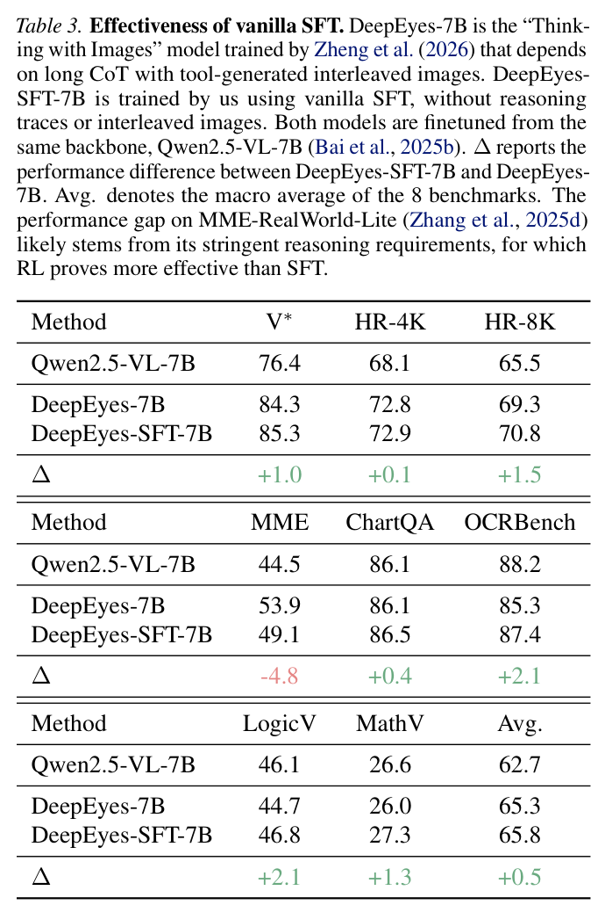
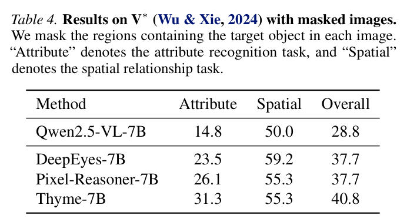
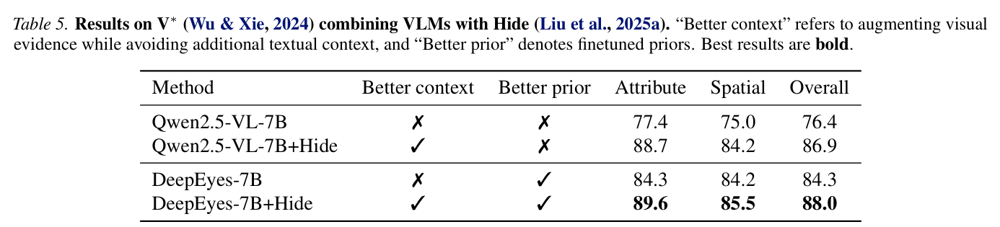

---
tags:
  - papers/visually-grounded-reasoning
  - papers/training-free
  - papers/benchmark-analysis
aliases:
  - "Position Your VLM"
  - "Your VLM May Not Be Thinking with Interleaved Images"
date: 2026
---

# Position: Your VLM May Not Be Thinking with Interleaved Images

## 核心信息

- 标题: Position: Your VLM May Not Be Thinking with Interleaved Images
- 标题翻译: 立场：你的 VLM 可能并没有用交错图像思考
- 作者: Wenjie Yang, Siqi Zhu, Zengfeng Huang
- 机构: Fudan University; Shanghai Innovation Institute
- 发表时间: 2026
- 发表渠道: ICML 2026, PMLR 306
- 论文链接: 本地 Zotero PDF
- 代码 / 项目: 未公开
- 数据 / 资源: DeepEyes；Pixel-Reasoner；Thyme；Qwen3-VL；V*；HRBench；MME-RealWorld-Lite；ChartQA；OCRBench；LogicVista；MathVision
- 论文类型: position paper；免训练分析；交错视觉思维链审计

## 原文摘要翻译

“用图像思考”已经成为视觉语言模型研究中的一个核心主题。这种多模态推理范式通常把工具使用或代码执行生成的交错图像作为思维链的一部分。虽然强化学习在这一范式中带来了令人印象深刻的性能，但本文作为一篇立场论文，主张当前 VLM 很少真正用交错图像进行思考。

通过实验证据和分析，作者表明交错图像在近期“用图像思考”方法的成功中并没有发挥显著作用。相反，性能提升的主要来源是微调改善了语言生成分布。这一发现挑战了一个流行信念：即“用图像思考”的 VLM 会主动利用视觉信息完成视觉任务。

为提高机制透明度，作者建议未来“用图像思考”的工作加入轻量消融研究，以验证交错图像是否必要。此外，作者呼吁社区开发真正需要视觉推理的新基准，并倡导使用信息量更高的视觉工具。

## 创新点

1. 这篇不是提出新模型，而是提出一个很关键的审计问题：插入图像到底是不是性能涨点的因果来源。
2. 它做了最直接的消融：保留文本推理，关闭工具或代码生成的图像输出，观察性能是否系统下降。
3. 它用注意力回传检查答案标记的视觉关注位置，发现模型更多看原始输入图像，而不是交错图像。
4. 它构造普通监督微调对照，说明不含推理轨迹和交错图像的直接回答数据也能带来类似涨点。
5. 它做遮挡版 V*，显示目标物体不可见时微调模型仍然强于基座模型，提示 benchmark 可能被语言先验或分布对齐影响。
6. 它给后续论文一个低成本检查清单：报告交错图像消融、使用能提供新信息的工具、设计真正需要视觉反馈的任务。

## 一句话总结

这篇论文的核心警告是：很多“用图像思考”的涨点可能来自微调后的语言分布，而不是模型真的在推理过程中使用了插入的中间图像。

## 研究问题

用图像思考听起来非常合理：模型在看不清时裁剪或放大图像，再把新图像插回推理链。问题是，这种视觉轨迹成本很高。训练时要构造工具调用数据和强化学习奖励；推理时交错图像会增加上下文长度。

因此，真正要回答的问题不是“交错图像看起来是否合理”，而是“移除这些图像后，模型是否会稳定变差”。如果不会，那么图像轨迹可能只是昂贵的叙事外壳。

*论文原图编号：Figure 1。理想的用图像思考流程：模型放大目标区域，插入裁剪图，再回答问题。*

## 数据与任务定义

论文把用图像思考形式化为：给定问题 $Q$ 和输入图像 $I$，VLM 在历史 $S_t=(z_1,\ldots,z_{t-1})$ 条件下生成下一步。

$$
z_t\sim P(z_t\mid S_t,I,Q;\pi_\theta),\quad z_t\in \mathcal{T}\cup \mathcal{I}.
$$

其中 $\mathcal{T}$ 是文本输出空间，$\mathcal{I}$ 是交错视觉输出空间。论文把视觉输出步骤称为交错图像。

分析对象主要是近期基于强化学习的用图像思考模型，包括 DeepEyes、Pixel-Reasoner 和 Thyme。它们都从 Qwen2.5-VL-7B-Instruct 这样的开源 VLM 出发，通过 GRPO 或类似范式进行训练。

评测覆盖 V*、HRBench、MME-RealWorld-Lite。

也包括 ChartQA、OCRBench、LogicVista 和 MathVision。论文还额外分析 Qwen3-VL 在 HRBench 上的用图像思考能力。

## 方法主线

### 机制流程

1. 输入原始图像、问题和已有推理轨迹，先形式化哪些步骤是文本、哪些步骤是交错图像。
2. 在推理时关闭工具或代码生成的图像输出，保留前序文本推理，得到无交错图像版本的输出。
3. 提取答案标记到原始图像和交错图像的注意力回传图，检查模型真正关注哪类视觉证据。
4. 用普通监督微调、遮挡实验和 Hide 组合实验更新解释：如果无图像轨迹也能涨点，则主要来源可能是分布对齐而非中间图像。

### 交错图像消融

*论文原图编号：Table 1。移除 DeepEyes、Pixel-Reasoner、Thyme 的交错图像后，性能变化很小且方向不一致。*

最有力的设计是直接关闭图像输出。DeepEyes-7B 在 V* 上有无交错图像都是 84.3。Pixel-Reasoner-7B 在 V* 上从 85.3 到 83.8，下降 1.5；Thyme-7B 在 HRBench-8K 上从 72.3 到 72.4，甚至略升。

*论文原图编号：Table 2。Qwen3-VL 在 HRBench 上，原始版本与用图像思考版本整体几乎相同。*

Qwen3-VL 的 HRBench 结果也类似。Raw 版本整体约为 84.0，用图像思考版本约为 83.9。这不是证明工具无用，而是说明当前证据不足以把涨点归因于交错图像。

### 注意力回传

*论文原图编号：Figure 2。答案标记的注意力主要落在原始输入图像上，而不是交错图像上。*

作者用 attention rollout 计算答案标记对视觉内容的信息流。图 2 显示，DeepEyes、Pixel-Reasoner 和 Thyme 的答案往往主要关注原始输入图像，交错图像并没有成为主要注意力来源。注意力不是因果证明，但它和消融表一起构成了一个强烈警告。

### 普通监督微调与遮挡实验

*论文原图编号：Table 3。DeepEyes-SFT-7B 不使用推理轨迹或交错图像，但宏平均达到 65.8，高于 DeepEyes-7B 的 65.3。*

普通监督微调结果显示，DeepEyes-SFT-7B 在八个基准宏平均 65.8，而 DeepEyes-7B 为 65.3。它并非所有任务都更好，例如 MME-RealWorld-Lite 上低于 DeepEyes，但足以说明“微调本身”可以解释许多涨点。

*论文原图编号：Table 4。遮挡目标物体后，经过微调的用图像思考模型仍显著高于基座模型。*

遮挡版 V* 更尖锐。目标物体不可见时，Qwen2.5-VL-7B 总分 28.8，而 DeepEyes-7B、Pixel-Reasoner-7B 和 Thyme-7B 分别达到 37.7、37.7、40.8。这说明模型可能通过 benchmark 对齐后的语言先验答题，而不是通过真实视觉反馈。

## 关键结果

### 主结论

| 证据 | 观察 | 解释 |
|---|---|---|
| Table 1 | 移除交错图像后性能小幅波动 | 图像不是稳定因果来源 |
| Table 2 | Qwen3-VL Raw 与用图像思考几乎持平 | 大模型也可能不依赖中间图像 |
| Figure 2 | 注意力主要落在原始图像 | 交错图像未成为主要视觉证据 |
| Table 3 | 普通 SFT 接近 DeepEyes | 涨点可能来自微调分布 |
| Table 4 | 目标遮挡后微调模型仍强 | benchmark 可能被先验解释 |

### Appendix Bonus

*论文原图编号：Table 5。Hide 提供更好的视觉上下文，微调提供更好的先验，二者结合最好。*

在 V* 上，Qwen2.5-VL-7B 从 76.4 加 Hide 到 86.9；DeepEyes-7B 从 84.3 加 Hide 到 88.0。这个 bonus 结果的意思是：真正有用的可能是“更好的上下文”和“更好的先验”，而不是自动生成中间图像这件事本身。

## 深度分析

### 真正贡献是什么

真正贡献是把“视觉推理轨迹”拆成可检验的因果问题。过去很多论文展示模型裁剪、放大、插图，然后自然把性能提升归因于这些中间视觉步骤。但这篇要求更严格：如果这些图像重要，移除它们应当稳定伤害性能。

### 为什么结果成立

当前许多视觉问答基准并不严格要求新视觉反馈。模型通过微调获得更符合任务分布的语言输出，可能已经足够提高分数。交错图像看起来像证据，但实际可能只是推理文本旁边的装饰。

### 容易误读的地方

这篇不是说视觉工具永远无用，也不是否定 DeepEyes、Thyme 这类工作。它否定的是一个过强解释：只要模型生成了中间图像，benchmark 涨点就来自模型使用了这些图像。

### 复现注意点

复现这篇的关键不是重新训练模型，而是在推理时可靠地关闭工具图像输出，同时保留文本推理。注意力回传只能作为诊断证据，不能单独当作因果证明。遮挡实验也依赖 V* 目标框标注质量。

## 局限

第一，分析对象主要是当前代表性的用图像思考方法，不能覆盖所有未来视觉工具。若工具能产生原图中没有的新信息，例如外部搜索、生成式编辑或真正的交互式测量，结论可能不同。

第二，attention rollout 不是因果干预。它能提示模型关注哪里，但不能完全证明信息没有被使用。

第三，论文指出 benchmark 问题，但没有提供一个完整的新 benchmark。它更像方法论警报，而不是最终解决方案。

## 我的笔记

这篇是 Reasoning 目录里最重要的“刹车片”之一。DeepScan、ICoT、DaP-ICoT、VisRef、PRCR 都在想办法让模型看回来；这篇提醒我们，必须验证“看回来”是否真的有用。

对 3D agent 尤其关键。一个 3D agent 可以渲染很多视角、裁剪很多局部、插入很多中间图像，但如果移除这些中间视觉证据后结果不掉，那么系统可能只是学会了更好的文本模板或任务先验。

我以后读 thinking-with-images 类论文会固定问三个问题：移除中间图像掉不掉点？中间图像是否提供原图没有的新信息？目标被遮挡或视觉反馈被破坏时模型是否还能靠先验答对？

## 引用

- 建议引用: Yang et al., 2026, *Position: Your VLM May Not Be Thinking with Interleaved Images*, ICML 2026, PMLR 306.
- 全文对照翻译: [paper.md](Reasoning/TrainingFree/Position%20Your%20VLM%20May%20Not%20Be%20Thinking%20with%20Interleaved%20Images/paper.md)
- 来源映射: [source_map.json](Reasoning/TrainingFree/Position%20Your%20VLM%20May%20Not%20Be%20Thinking%20with%20Interleaved%20Images/source_map.json)
- 阅读计划: [paper_DeepPaperNote.plan.json](Reasoning/TrainingFree/Position%20Your%20VLM%20May%20Not%20Be%20Thinking%20with%20Interleaved%20Images/paper_DeepPaperNote.plan.json)
- 来源清单: [paper_DeepPaperNote.source_manifest.json](paper_DeepPaperNote.source_manifest.json)
- 证据包: [paper_DeepPaperNote.bundle.json](paper_DeepPaperNote.bundle.json)
- 图表决策: [paper_DeepPaperNote.figure_decisions.json](Reasoning/TrainingFree/Position%20Your%20VLM%20May%20Not%20Be%20Thinking%20with%20Interleaved%20Images/paper_DeepPaperNote.figure_decisions.json)
